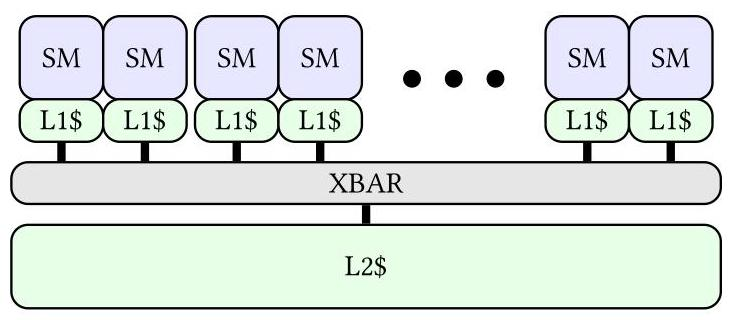
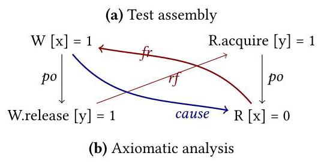
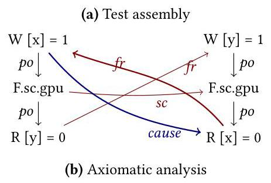
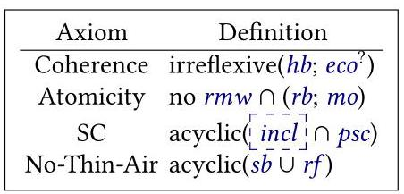
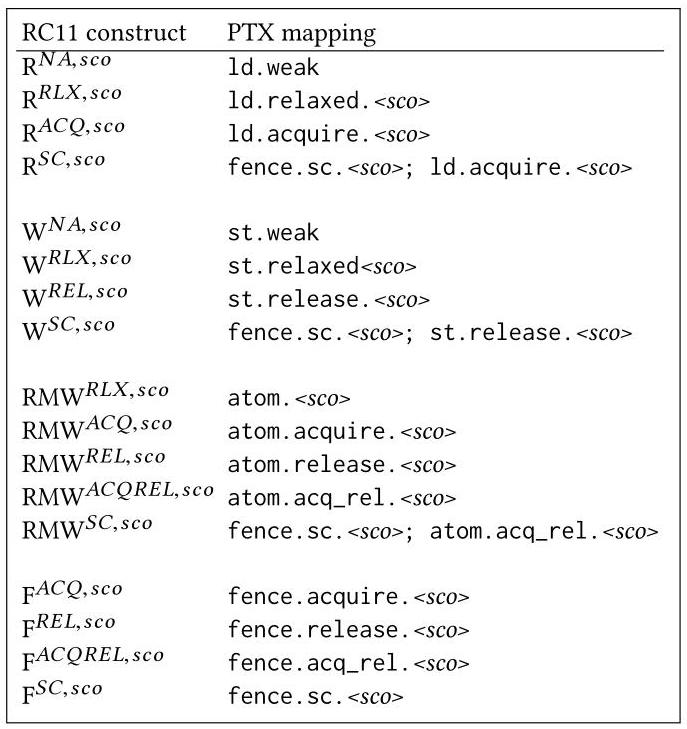
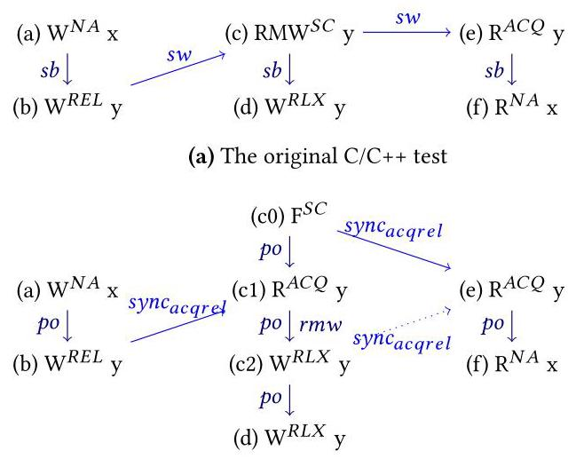
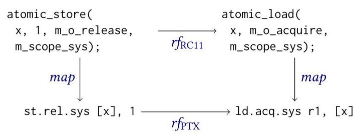

# A Formal Analysis of the NVIDIA PTX Memory Consistency Model 深度解读

> **作者**：Daniel Lustig, Sameer Sahasrabuddhe, Olivier Giroux  
> **会议/期刊**：ASPLOS 2019  
> **一句话总结**：本文把 NVIDIA PTX 6.0 的自然语言 memory consistency model 形式化为 axiomatic model，并用 Alloy bounded checking 与 Coq machine-checked proof 证明一个 scoped C++/RC11 风格同步模型可以 soundly 编译到 PTX。

## 一、问题定义

GPU 早期主要运行 bulk-synchronous 的并行程序，线程块之间在一个 kernel 内通常不需要通过全局内存细粒度通信。随着 NVIDIA GPU 支持 Unified Memory、Independent Thread Scheduling、Cooperative Groups 和更一般的跨线程通信，程序员和编译器开始依赖 load、store、atomic、fence、barrier 这类同步原语来表达共享内存行为。此时必须有一个清晰的 memory consistency model 说明 load 能读到哪些值，否则程序行为、编译映射和硬件实现之间没有可验证的契约。

图 1 说明了本文讨论 scope 的硬件背景：thread 组织成 CTA，CTA 分布到 SM，多个 GPU 与 host 还可能共享系统级地址空间。因此同步不一定总要传播到全系统，`.cta`、`.gpu`、`.sys` 这样的 scope 可以让程序只为实际通信范围付成本。

这篇论文属于 **First 类型**：它首次对官方 NVIDIA PTX 6.0 memory model 做形式化分析。此前 CPU 侧已经有 x86、ARM、POWER 等 ISA 的 C/C++ 或 Java 同步原语编译正确性证明，GPU 侧也有 HSA、HRF、OpenCL 和一些非官方 NVIDIA GPU 模型研究，但 PTX 6.0 的官方文本规范还缺少一套从文档到模型、从模型到测试、从测试到证明的端到端严谨流程。

**动机评估**：动机很 solid。论文给出的压力来自四个真实来源：第一，工业 memory model 为性能、功耗、面积和架构灵活性让步，天然复杂；第二，empirical testing 有规模上限且不完备；第三，memory model 会随 bug 和标准演化而变化；第四，Coq/HOL 级别的证明成本高，而且 proof assumption 可能被后续反例推翻。对 NVIDIA 来说，PTX 6.0 又有两个额外复杂点：它是弱序且 scoped 的，同时不像 HSA/HRF 那样把 racy programs 直接判为非法。

**核心 Insight**：本文的关键洞察是，PTX 的难点不是简单补一个 DRF-style 禁止数据竞争规则，而是要把 "哪些操作足够强、哪些 scope 互相覆盖、哪些通信形成 causality" 明确建模。作者用 **moral strength** 连接 scope 与同步：只有 morally strong 的跨线程操作对才可以承担同步和 single-copy atomicity 责任；racy 或 scope 不覆盖的操作不再强行纳入全局 coherence order。这个设计让 PTX 能在 GPU 的局部通信优化和可形式化语义之间取得平衡。

## 二、相关工作

论文把相关工作大致分成四条脉络。

第一类是 CPU 和语言 memory model 的形式化工作，包括 x86-TSO、ARMv7/ARMv8、IBM Power、Java、C/C++、RC11 等。这些工作证明了同步原语从高层语言映射到 ISA 的可行性，也形成了 axiomatic relation、litmus test、machine-checked proof 等方法论。本文继承这套技术，但对象换成了 scoped GPU ISA。

第二类是 GPU-specific memory model，包括 HSA、HRF、OpenCL scope 模型、HRF-direct/indirect，以及 DeNovo 这类不使用 scope 的 GPU 同步方案。它们说明 scope 是 GPU 中降低同步传播成本的常见机制，但多数模型依赖 DRF 或 HRF 假设，而 PTX 6.0 选择继续给 racy programs 某种语义边界，这使它不能直接复用已有模型。

第三类是实践工具链，例如 cppmem、herd/diy/litmus、Alloy、ppcmem、rmem。这些工具能帮助发现弱内存行为和 counterexample，但通常在灵活规范、bounded empirical checking、以及全规模 theorem proving 之间只能覆盖一部分能力。

第四类是 theorem prover 和 Alloy 结合的工作，例如 Coq、HOL、Lem、PVS、KeY、Athena、Nitpick、Kodkod 相关集成。本文的差异在于 alloqc 把同一份 Alloy 关系模型编译到 Coq，使作者能先用 Alloy 快速找反例，再用 Coq 对同一逻辑做无界证明，减少手工重写模型带来的语义偏差。

## 三、技术挑战

**挑战 1：PTX 是弱序且非 multi-copy atomic。** 在 TSO 这类更强模型里，`rf`、`co`、`fr` 等通信关系本身可以承担较强的排序含义；PTX 中一个 store 可能先对部分线程可见，再对另一些线程可见。因此作者不能直接套用 TSO 式 causality，需要显式建模 release/acquire、barrier、`fence.sc` 三类同步。

**挑战 2：scope 让同步关系变成多维判断。** 两个操作是否可以同步，不只取决于它们是否访问同一地址或是否为 acquire/release，还取决于 `.cta`、`.gpu`、`.sys` 是否互相覆盖对方线程。这个条件既影响 correctness，也影响 SAT/Coq 证明规模。

**挑战 3：PTX 不把所有 data races 视为非法。** HSA/HRF 类模型可以通过 race-free 假设避开很多边界行为；PTX 则需要说明 racy、morally weak、mixed-size 等情况哪些仍有约束，哪些不保证 single-copy atomicity。这让 formal model 更复杂。

**挑战 4：自然语言规范到形式化模型容易引入缝隙。** PTX 文档原本以英文规则描述 scope、strength、observation、causality 和 axiom。作者需要把这些规则逐条转成数学关系、Alloy 代码和 Coq 定理，并确保三者等价。

**挑战 5：bounded testing 与 full proof 各有短板。** Alloy 适合快速找小规模反例，但在 scope 加入后复杂度急剧上升；Coq 能证明任意规模程序，但证明劳动量大。本文必须把两者串成统一流程，而不是维护两套可能不一致的模型。

## 四、解决方案

### 整体思路

作者采用三层结构。第一层是从 PTX 6.0 文档抽取正式 axiomatic memory model，定义操作类型、scope、moral strength、synchronizes-with、causality 以及六个顶层 axiom。第二层是构造一个 OpenCL-like scoped C++ 源模型：以 RC11 为基础，加上 scope-inclusive 的 `incl` 关系，并去掉争议较大的 RC11 No-Thin-Air axiom。第三层是给出 scoped C++ 到 PTX 的编译映射，用 Alloy 做 bounded checking，再把 Alloy 模型经 alloqc 编译到 Coq，证明映射对任意规模程序 sound。

### 贯穿示例

可以用一个 producer-consumer 例子理解全文：线程 A 在 `x` 写入数据，再通过 `y` 发布一个信号；线程 B 先读取 `y`，如果看到信号，再读取 `x`。在 GPU 上，这两个线程可能在同一个 CTA、同一个 GPU 的不同 CTA、甚至跨 GPU/host 系统范围内。程序员选择 `.cta`、`.gpu` 或 `.sys` scope，本质上是在告诉硬件同步传播到哪里才足够。论文要证明的是：当高层 scoped C++ 代码表达了这个 producer-consumer 关系时，编译器把它翻译成 PTX 的 release/acquire、barrier 或 `fence.sc` 后，PTX 的所有合法执行仍然符合高层模型允许的结果。

图 5 正是这个例子的 litmus test 版本。producer 先 weak store `x=1`，再 release store `y=1`；consumer 用 acquire load 读到 `y=1` 后，再读 `x`。如果两个同步操作在 `.gpu` scope 上 morally strong，最终 `y==1` 但 `x==0` 的结果被禁止，因为 release/acquire 通过 `sw` 和 `cause` 把数据写入传递给消费者。

### 关键技术点

**1. 用 moral strength 捕捉 scope-aware synchronization。** PTX 把 strong operation 定义为 fence 或带 `.relaxed`、`.acquire`、`.release`、`.acq_rel` 的内存操作。两个操作 morally strong 的条件是：它们在 program order 中相关，或二者都是 strong、scope 覆盖对方线程，并且内存操作访问重叠地址。这个定义决定了哪些 `rf/co/fr` 关系能用于同步，哪些操作需要 single-copy atomicity。

**2. 用三类同步关系构造 causality。** 第一类是 release/acquire：release pattern、observation、acquire pattern 组合成 `sw`，并允许 RMW 参与 release sequence。第二类是 CTA barrier：`bar.sync`、`bar.red`、`bar.arrive` 等在同一 barrier 上形成 CTA scope 的同步。第三类是 `fence.sc`：运行时形成一个 acyclic partial order，用来阻止 acquire/release 本身无法禁止的行为。

图 6 展示了 store buffering 场景。两个线程分别先写再读对方地址；如果没有足够强的 SC fence，两个读都返回 0 可能出现。PTX 6.0 用 morally strong 的 `fence.sc` 约束这种行为，也修正了前代 NVIDIA membar 在类似弱行为上的已知问题。

**3. 顶层六个 axiom 给候选执行判定合法性。** Coherence 要求 causally ordered 的重叠写进入 `co`；Fence-SC 禁止 `sc` 与 `cause` 矛盾；Atomicity 约束 morally strong 的 RMW；No-Thin-Air 禁止自我满足式投机值；SC-per-Location 禁止 morally strong communication order 与 same-location program order 冲突；Causality 禁止 `rf/fr` 与同步因果相互矛盾。关键点是这些约束不是无条件施加到所有 racy 操作上，而是围绕 moral strength 和 causality 生效。

**4. 源语言选择 RC11 加 scope，而不是直接用 CUDA/OpenCL。** CUDA 当时没有官方形式化 memory model；OpenCL 2.2 scope 语义和旧 C/C++ 基础存在已知问题。作者选择更现代的 RC11，加入 `incl` 表示 scope 互相覆盖，并把它作为 OpenCL-like scoped C++ 源模型。

图 10 中的 `incl` 是源模型对应 PTX moral strength 的关键：高层 `sw/hb/psc` 只在 scope-inclusive 的通信上成立。这样证明目标就变成：如果 scoped C++ 程序 race-free，PTX 编译结果的任一合法执行都能解释为源程序的合法执行。

**5. 编译映射整体直接，但 SC 与 RMW 有关键边角。** 普通 acquire/release 可以映射到 PTX 原生 acquire/release 操作；PTX 6.0 没有原生 seq_cst load/store，所以 sequentially-consistent 操作采用 leading `fence.sc` 风格映射。

图 11 给出具体 mapping。它的设计意图不是让 PTX 比高层模型更强，而是保证高层要求的 `hb`、`sw`、`psc` 等关系在 PTX 里能落到 `po`、`cause`、`sc` 等关系上。

图 12 是最值得注意的 corner case。看似 `fence.sc` 已经足够强，但如果 `memory_order_seq_cst` 的 RMW 编译后省略 `.release`，RC11 release sequence 中的同步链会断开，导致某些应被禁止的结果重新出现。这个例子 Alloy 没有在 bounded search 中抓到，是 Coq proof 暴露出来的。

**6. Alloy 与 Coq 共用一条模型链。** Alloy 用 SAT solver 在小规模 event bound 下寻找 counterexample；alloqc 再把 Alloy relation 编译为 Coq 定义，用户补证明。这样既保留 Alloy 的快速交互，也避免为 Coq 手写另一份模型。

图 15 中的 `map` 关系是证明的桥梁：源模型中的关系 `r` 若能通过 `map; r'; map^-1` 落到 PTX 关系 `r'`，就可以把 PTX 执行提升回 scoped C++ 执行，并证明高层 axiom 不被破坏。

### 与已有方案的对比

相比 HSA/HRF，本文没有把 data-race 直接作为非法程序的边界，而是解释 PTX 对 racy program 的弱保证；相比早期 NVIDIA GPU 非官方模型，本文对象是 PTX 6.0 官方规范，并由 NVIDIA 作者给出完整 derivation、Alloy 模型和 Coq 证明；相比只用 litmus/Alloy 的方法，本文的 Coq 证明覆盖任意程序规模；相比只手写 Coq 的方法，Alloy 前端让模型调试和反例搜索更实用。主要不足是评估中的 bounded checking 规模仍小，mixed-size data races 被明确排除，且源模型不是正式 CUDA，而是 RC11 派生的 OpenCL-like scoped C++。

## 五、实验评估

### 实验设定

论文评估的对象不是运行时性能，而是模型与 mapping 的正确性。平台是 Intel Xeon server CPU；工具是 Alloy/Kodkod/SAT solver 和 Coq。作者比较两套 mapping：一套是完整 scoped C++ 到 scoped PTX；另一套是去掉 `.cta` 与 `.gpu` scope 的 de-scoped 版本，用来估计 scope 带来的验证开销。检查目标是 RC11 coherence、atomicity、SC 等 axiom；每个 axiom 使用不超过 48 小时 timeout 的最大 event bound。

### 主要实验与结论

**Alloy bounded checking 没有发现反例，但 scope 显著增加复杂度。** 完整 scoped 模型中，coherence 在 4 events 下耗时 41s，在 5 events 下耗时 6.4 小时；atomicity 从 4s 到 5s；SC 从 10s 到 15 分钟。de-scoped 模型中，coherence 在 5 events 下 1.8 分钟，在 6 events 下 3.1 小时；atomicity 维持 4s；SC 从 21s 到 26s。这个结果支持作者判断：scope 会让关系组合和 SAT 搜索空间显著膨胀，尤其 coherence 最敏感。

**bounded search 覆盖重要 litmus，但不能替代证明。** 作者指出 5 到 6 events 足以覆盖一些重要 GPU memory litmus tests，但并不能覆盖所有关心的模式。Figure 12 的 RMW SC corner case 就说明，小规模搜索可能漏掉正确性缺陷。

**Coq proof 给出无界 soundness 保证。** 作者把 Alloy 模型编译到 Coq，并证明 scoped C++ 到 PTX mapping 满足 RC11 coherence、atomicity 和 SC。完整 proof 约 3100 行 Coq，检查时间约 15 秒。核心定理是：给定 race-free scoped C/C++ 程序 `p`，若按本文规则编译为 PTX 程序 `p'`，则 `p'` 的任一合法执行解释回源程序后，也是 `p` 的合法执行。

### 结论支撑性分析

实验与证明基本支撑论文主张：PTX 6.0 model 可以作为 scoped GPU language 的 sound compilation target。Alloy 部分证明了模型在小规模范围内没有显然 counterexample，并帮助调试；Coq 部分弥补 bounded testing 的不完备性。局限也明确：实验不是硬件实测，不评估同步原语性能；Alloy bound 较小；源语言是 scoped RC11 变体，不等同于完整 CUDA/OpenCL；mixed-size data races 被排除在证明范围之外。

## 六、附加洞察

**结论 1：scope 的主要成本体现在验证复杂度，而不只是硬件语义复杂度。**  
- *出处*：Section 6.1 / Figure 17  
- *推理链条*：作者比较 full scoped 与 de-scoped 模型，同样检查 coherence、atomicity、SC。coherence 在 scoped 5 events 下需 6.4 小时，而 de-scoped 5 events 只需 1.8 分钟；SC 也从 de-scoped 26s 上升到 scoped 15 分钟。由此可见，scope 增加的不只是规范条件，还显著扩大 SAT 搜索空间。

**结论 2：Coq proof 能发现 Alloy bounded checking 漏掉的 mapping corner case。**  
- *出处*：Section 4.2 / Figure 12  
- *推理链条*：SC RMW 看似可用 leading `fence.sc` 表达，但如果去掉 `.release`，release sequence 与 cause chain 之间出现缺口。作者说明该缺陷是 Coq 证明发现的，而不是 Alloy bounded search 抓到的，因此 bounded testing 和 theorem proving 的组合不是形式主义堆叠，而是实际互补。

**结论 3：PTX 6.0 把 cache operator 从 correctness mechanism 降级为 performance hint。**  
- *出处*：Section 3.6  
- *推理链条*：前代 PTX/NVIDIA GPU 中 `.ca`、`.cg` 等 cache operator 曾被用于微架构相关的一致性控制；PTX 6.0 文档声明 cache operator 不改变 memory consistency behavior。作者据此将它们排除出模型，说明新规范更接近现代 ISA 语义，把 correctness 交给显式同步原语。

**结论 4：PTX 把 state space 从同步关系中剥离，避免了 OpenCL local/global 分裂带来的问题。**  
- *出处*：Section 3.6  
- *推理链条*：OpenCL 曾把 local memory 与 global memory 的同步关系分开，相关工作指出这会产生问题；PTX 明确 memory consistency relations independent of state spaces。因此作者无需为 `.global`、`.shared` 等建立多套同步规则，模型更统一。

**结论 5：mixed-size data races 仍是本文没有解决的边界。**  
- *出处*：Section 3.2 / Section 3.6  
- *推理链条*：PTX 用 overlapping memory accesses 试图覆盖不同宽度访问，但文档又说明存在 mixed-size data-races 时 axiom 不适用。作者因此把 overlapping 在本文中近似看成 same address，并不尝试解决 mixed-width concurrency。这是证明 soundness 的合理收缩，也是后续工作的空白。

## 七、总结与评价

本文的核心贡献是把 PTX 6.0 memory model 从文档规范推进到可测试、可证明的形式化对象，并证明一个 scoped C++/RC11 风格模型可以 soundly 编译到 PTX。它最强的地方不是某个单独 axiom，而是端到端闭环：文档 derivation、Alloy 模型、Alloy-to-Coq 编译器、Coq proof 和公开 artifact 互相对应。

最大的不足是源模型仍是作者构造的 OpenCL-like scoped C++，不是完整 CUDA 或官方 OpenCL；同时 paper 对硬件实现成本和性能没有直接评估，mixed-size data races 也被排除。即便如此，它为后来 GPU memory model、CUDA 同步语义和编译器映射证明提供了一个很扎实的基准。

## 八、章节脉络与段落速览

- **Abstract**：概括 PTX memory model 的特殊性、形式化步骤和最终 soundness 结论。
  - ¶1 说明 PTX 是 weakly ordered、scoped 且不要求 data race freedom，因此需要严格的测试和分析基础设施。
  - ¶2 列出从英文规范到 axiomatic model、scoped C++ mapping、Alloy testing、Coq proof 的完整流程。

- **Section 1 · Introduction**：提出工业 memory model proof 的一般难点，并把问题落到 PTX 6.0。
  - ¶1 解释 memory consistency model、DRF 软件模型和同步原语编译 recipe 的背景。
  - ¶2-3 枚举证明编译 recipe 的难点，包括模型复杂、测试不完备、模型演化、证明繁琐和 proof assumption 风险。
  - ¶4 说明 CPU 侧已有映射正确性证明，作为本文工作的参照系。
  - ¶5 说明 GPU 从 bulk-synchronous 走向 kernel 内共享内存通信，因此需要 sound memory model。
  - ¶6 说明 PTX 的 scoped weak model 与 HSA/HRF 不同，因为它不把 racy programs 直接判非法。
  - ¶7 列出本文五个验证步骤：formalization、Alloy encoding、Alloy-to-Coq、Alloy testing、Coq proof。
  - ¶8 强调统一 workflow 能减少自然语言、测试模型和证明模型之间的 gap，并公开 artifact。

- **Section 2 · Background**：补充 GPU scope 和 axiomatic memory model 基础。
  - ¶1 概述 memory model 研究历史和持续发现 bug 的背景。
  - **2.1 · GPU Programming and Memory Models**：解释 GPU 执行层次、scope 和 PTX 6.0 出现的原因。
    - ¶1 说明 kernel、CTA、SM 的组织方式。
    - ¶2 说明传统 GPU bulk-synchronous 模型依靠 kernel boundary 同步。
    - ¶3 说明 Unified Memory、Volta Independent Thread Scheduling 和 Cooperative Groups 让显式同步更关键。
    - ¶4 解释 `.cta`、`.gpu`、`.sys` scope 让硬件只向必要范围传播同步。
    - ¶5 指出 Kepler 以来 NVIDIA GPU 曾有 memory model 问题，本文要给 Volta/PTX 6.0 打基础。
  - **2.2 · Axiomatic Memory Models**：解释候选执行、关系和 TSO 示例。
    - ¶1 对比 axiomatic 与 operational 两类建模方式，并说明本文选择 axiomatic。
    - ¶2 用 TSO 介绍常见关系集合。
    - ¶3 解释 `rf`、`co`、`fr`、`po_loc` 在 SC-per-location 中的含义。
    - ¶4 解释 TSO causality 如何建模 store buffer、`ppo`、`rfe` 和 fence。
    - ¶5 指出 PTX 复用部分关系，但改变 `co`，且不使用 `ppo`。

- **Section 3 · Formalizing the PTX Memory Model**：从 PTX 文档推导形式化关系和 axiom。
  - ¶1 说明该节将英文规范转成 axiomatic specification，并尽量贴近文档文本。
  - **3.1 · PTX Instruction Set**：列出本文建模的 load、store、atomic、reduction、fence 的 ordering 和 scope qualifier。
    - ¶1 说明 `.weak/.relaxed/.acquire/.release/.acq_rel` 和 `.cta/.gpu/.sys` 是本文关注的核心。
  - **3.2 · Overlapping Memory Accesses**：定义 overlapping，并说明本文把它近似为 same address。
    - ¶1 说明不同宽度访问尚未完全建模，mixed-width 行为留到后文限制中。
  - **3.3 · Scope, Strength, and Moral Strength**：定义 strong operation、morally strong 和 data race。
    - ¶1 说明 morally strong 是跨线程同步的门槛。
    - ¶2 对比 HSA、HRF 和 DeNovo 的 scope/DRF 处理方式。
    - ¶3 说明 PTX 给 racy programs 语义边界，但不保证 morally weak 冲突操作 single-copy atomicity。
  - **3.4 · Ordering and Synchronization Relations**：定义 release/acquire、barrier、Fence-SC 和 causality。
    - ¶1 说明 PTX 非 multi-copy atomic，因此必须靠显式同步而非普通通信关系排序。
    - **3.4.1 · Release Consistency**：解释 release pattern、observation、acquire pattern 如何形成 `sw`。
    - **3.4.2 · Barrier Synchronization**：说明 CTA barrier 等价于 `.cta` scope 的 release-acquire 同步。
    - **3.4.3 · Fence-SC Order**：说明 `fence.sc` 用 acyclic partial order 阻止 store buffering 类行为。
    - **3.4.4 · Causality Order**：说明 `cause_base` 由 `sw` 与 `po` 传递闭包构成，`cause` 再加入 observation 与 same-location 扩展。
  - **3.5 · Top-Level Memory Model Axioms**：给出六个判断候选执行合法性的 axiom。
    - ¶1 说明 Figure 7 总结六个 PTX axiom。
    - **3.5.1 · Coherence**：说明 PTX `co` 是运行时确定的 partial transitive order，racy weak stores 不必被总序化。
    - **3.5.2 · Fence-SC**：说明 `sc` 不能与 causality 矛盾。
    - **3.5.3 · Atomicity**：说明 morally strong 的 RMW 与重叠写之间不能违反 atomicity。
    - **3.5.4 · No-Thin-Air**：说明禁止自我满足的 speculative value。
    - **3.5.5 · SC-per-Location**：说明 same-location program order 不能被 morally strong communication order 破坏。
    - **3.5.6 · Causality**：说明 `rf/fr` 不能与 user-inserted synchronization 形成矛盾。
  - **3.6 · Omitted Qualifiers**：说明哪些 PTX qualifier 不影响本文模型。
    - ¶1 说明非高亮 qualifier 不影响 memory model。
    - ¶2 说明 vector access、cache operator、volatile 的处理方式，尤其 cache operator 只作为 performance hint。
    - ¶3 说明 state space 不影响 consistency relation。
    - ¶4 说明 mixed-size data-race 超出本文 axiom 适用范围。

- **Section 4 · Mapping "Scoped C++" onto PTX**：定义源模型并给出编译映射。
  - ¶1 说明形式化 PTX 的重要用途是作为高层语言 memory model 的可靠 target。
  - ¶2 解释为什么不用 CUDA 或 OpenCL 2.2 作为直接源模型。
  - ¶3 说明选择 RC11 并扩展 scope 的原因。
  - **4.1 · A Scope-Extended RC11 Memory Model**：把 `incl` 加入 RC11，并去掉争议性的 RC11 No-Thin-Air axiom。
    - ¶1 说明 `incl` 让高层同步也需要 scope-inclusive communication。
    - ¶2 概括本文对 RC11 的两个修改。
  - **4.2 · A Mapping from Scoped C++ onto PTX**：给出 mapping，并分析 SC RMW corner case。
    - ¶1 说明 `sb`、location 和 scope 可以直接映射到 PTX 的 `po`、address 和 scope。
    - ¶2 说明 PTX 没有 native SC load/store，因此使用 leading `fence.sc`。
    - ¶3-4 说明 SC RMW 不能省略 `.release`，否则 release sequence 的 cause chain 会断开。
    - ¶5 强调这个 corner case 是 Coq proof 抓到的，体现双工具流程的价值。

- **Section 5 · Analyzing PTX Using Alloy and Coq**：介绍 Alloy 建模、map 关系和 alloqc。
  - ¶1 说明 Alloy 用于 bounded empirical testing，Coq 用于任意规模 proof。
  - **5.1 · The Alloy Relational Modeling Language**：介绍 Alloy 的 relation、sig 和 SAT 后端。
    - ¶1 说明 Alloy/Kodkod 如何把关系模型转成 SAT 并返回 counterexample。
    - ¶2 说明 Event、Fence、Read、Write、`po`、`rf` 等如何在 Alloy 中表示。
  - **5.2 · Formalizing the PTX Memory Model in Alloy**：说明 PTX 与 scoped C++ mapping 如何一起编码。
    - ¶1 说明 Section 3 的数学关系能机械转换为 Alloy。
    - ¶2 说明 `map` 关系把 scoped C++ event 对应到 PTX event，并给出 mapping correctness theorem。
    - ¶3 说明如何把 PTX execution 的 `rf/co/fr` 提升解释成 RC11 execution。
  - **5.3 · Analyzing the PTX Memory Model Using Coq**：介绍 alloqc 和 Coq proof 结构。
    - ¶1 说明 Alloy-to-Coq 编译器用于证明任意规模程序。
    - ¶2 说明 alloqc 输入 Alloy model，输出 Coq file，用户补证明。
    - ¶3 说明 alloy.v 抽象 Alloy relational logic，并用 Coq library 减少类型系统负担。
    - ¶4 说明 transitive closure 在 Coq 中用 inductive relation 表示，以摆脱 bounded iteration。

- **Section 6 · Results of Testing and Verifying the Mapping from "Scoped C++" to PTX**：报告 Alloy 时间和 Coq 定理。
  - ¶1 说明目标是证明 scoped C++ 到 PTX mapping 没有 counterexample，并测量 Alloy 可分析边界。
  - **6.1 · Empirical Testing Results**：比较 scoped 与 de-scoped mapping。
    - ¶1 说明两套模型和 48 小时 timeout 下的最大 event bound。
    - ¶2 报告 Figure 17 运行时间，并指出 scope 让分析开销上升约一个量级。
  - **6.2 · Formal Correctness Proofs**：总结 Coq machine-checked proof。
    - ¶1 说明 Coq proof 约 3100 行、约 15 秒检查，并给出全规模 soundness 结论。
    - ¶2 Theorem 1 说明 RC11 Coherence 的 cycle 会降低到 PTX Causality 或 SC-per-Location 违例。
    - ¶3 Theorem 2 说明 RC11 Atomicity 的反例会导致 PTX Atomicity 或 `hb` 自环矛盾。
    - ¶4 Theorem 3 说明 RC11 SC cycle 会映射成 PTX `sc` cycle，因此不可能。

- **Section 7 · Related Work**：把本文放回 GPU 模型、工具和形式化验证生态。
  - ¶1 总结 HSA/HRF、OpenCL、旧 NVIDIA 非官方模型与 PTX 官方规范的关系。
  - ¶2 总结 cppmem、herd/diy/litmus、Alloy、ppcmem、rmem 等工具。
  - ¶3 指出已有 Coq/HOL/Lem 流程缺少同时覆盖领域知识、灵活规范、empirical testing 和 theorem proving 的单一工具。
  - ¶4 对比 Alloy 到 PVS/KeY/Athena、SMT 和 Kodkod 集成等相关方向。

- **Section 8 · Conclusion**：重申 PTX 6.0 已修复已知问题，并给出 sound target 结论。
  - ¶1 总结本文首次对 PTX 6.0 做 formal axiomatic analysis，证明 scoped C++ mapping 正确，并公开 derivation、Alloy、alloqc 和 Coq proofs。

- **Acknowledgments / References**：提供资助说明、审稿致谢和引用列表。
  - ¶1 Acknowledgments 说明 DOE 资助和 reviewer/shepherd 致谢。
  - References 列出 memory model、GPU 同步、Alloy、Coq、PTX/CUDA 文档等支撑文献。
