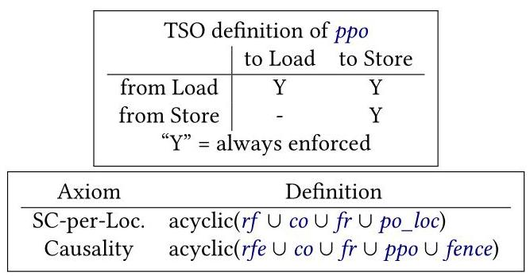

# A Formal Analysis of the NVIDIA PTX Memory Consistency Model

Daniel Lustig

> 
丹尼尔·卢斯蒂格

dlustig@nvidia.com

> 
dlustig@nvidia.com

NVIDIA

> 
英伟达

Sameer Sahasrabuddhe

> 
萨米尔·萨哈斯拉布德

NVIDIA \( {}^{1} \)

> 
NVIDIA \( {}^{1} \)

Olivier Giroux

> 
奥利维耶·吉鲁

ogiroux@nvidia.com

> 
ogiroux@nvidia.com

NVIDIA

> 
英伟达

## Abstract

This paper presents the first formal analysis of the official memory consistency model for the NVIDIA PTX virtual ISA. Like other GPU memory models, the PTX memory model is weakly ordered but provides scoped synchronization primitives that enable GPU program threads to communicate through memory. However, unlike some competing GPU memory models, PTX does not require data race freedom, and this results in PTX using a fundamentally different (and more complicated) set of rules in its memory model. As such, PTX has a clear need for a rigorous and reliable memory model testing and analysis infrastructure.

> 
本文首次对 NVIDIA PTX 虚拟指令集架构的官方内存一致性模型进行了形式化分析。与其他 GPU 内存模型类似，PTX 内存模型呈弱序，但提供了作用域同步原语，使 GPU 程序线程能够通过内存进行通信。然而，与某些竞品 GPU 内存模型不同，PTX 不要求无数据竞争，这导致其内存模型采用了一套根本上不同（且更复杂）的规则。因此，PTX 明确需要严谨可靠的内存模型测试与分析基础设施。

We break our formal analysis of the PTX memory model into multiple steps that collectively demonstrate its rigor and validity. First, we adapt the English language specification from the public PTX documentation into a formal axiomatic model. Second, we derive an up-to-date presentation of an OpenCL-like scoped C++ model and develop a mapping from the synchronization primitives of that scoped C++ model onto PTX. Third, we use the Alloy relational modeling tool to empirically test the correctness of the mapping. Finally, we compile the model and mapping into Coq and build a full machine-checked proof that the mapping is sound for programs of any size. Our analysis demonstrates that in spite of issues in previous generations, the new NVIDIA PTX memory model is suitable as a sound compilation target for GPU programming languages such as CUDA.

> 
我们将PTX内存模型的形式化分析分解为多个步骤，这些步骤共同证明了其严谨性和有效性。首先，我们将公开PTX文档中的英文语言规范适配为一个形式化公理模型。其次，我们推导出类似于OpenCL的作用域C++模型的最新表述，并开发了从该作用域C++模型的同步原语到PTX的映射。第三，我们使用Alloy关系建模工具对该映射的正确性进行了实证检验。最后，我们将模型和映射编译到Coq中，并构建了一个完整的机器验证证明，表明该映射对于任何规模的程序都是可靠的。我们的分析表明，尽管前几代存在问题，但新的NVIDIA PTX内存模型适合作为CUDA等GPU编程语言的可靠编译目标。

CCS Concepts - Hardware \( \rightarrow \) Theorem proving and SAT solving; - Software and its engineering \( \rightarrow \) Consistency.

> 
CCS 概念 - 硬件 \( \rightarrow \) 定理证明与 SAT 求解; - 软件及其工程 \( \rightarrow \) 一致性。

Keywords Memory Consistency Models; GPUs; Theorem Proving; Model Finding; SAT Solving

> 
关键词 内存一致性模型；GPU；定理证明；模型查找；SAT求解

## ACM Reference Format:

Daniel Lustig, Sameer Sahasrabuddhe, and Olivier Giroux. 2019. A Formal Analysis of the NVIDIA PTX Memory Consistency Model. In 2019 Architectural Support for Programming Languages and Operating Systems (ASPLOS '19), April 13-17, 2019, Providence, RI, USA. ACM, New York, NY, USA, 14 pages. https://doi.org/10.1145/3297858.3304043

> 
Daniel Lustig、Sameer Sahasrabuddhe 与 Olivier Giroux. 2019. 对 NVIDIA PTX 内存一致性模型的形式化分析. 见 2019 年编程语言与操作系统的体系结构支持国际会议 (ASPLOS '19), 2019 年 4 月 13-17 日, 美国罗德岛州普罗维登斯. ACM, 美国纽约州纽约市, 14 页. https://doi.org/10.1145/3297858.3304043

## 1 Introduction

A memory consistency model determines the values that can be legally returned by loads from memory. Currently there is a broad spectrum of CPU memory models, from relatively strong models such as x86-TSO [44] to relatively weak models such as IBM Power [9, 46, 48]. Today's general-purpose software (e.g., C/C++, Java, OpenCL), on the other hand, generally uses some form of data race-free (DRF) model layered on top of the hardware model [24, 28, 29, 42]. DRF models distinguish between non-synchronizing and synchronizing memory accesses. During compilation, non-synchronizing accesses may be freely optimized, but each software synchronization primitive must be mapped onto a particular set of assembly instructions according to a recipe specific to each software-hardware combination.

> 
内存一致性模型决定了从内存加载操作可合法返回的值。当前，CPU内存模型存在广泛谱系，从较强模型如x86-TSO [44]到较弱模型如IBM Power [9, 46, 48]。另一方面，当今的通用软件（例如C/C++、Java、OpenCL）通常采用某种形式的数据竞争自由（DRF）模型，该模型构建于硬件模型之上[24, 28, 29, 42]。DRF模型区分非同步与同步内存访问。在编译期间，非同步访问可自由优化，但每个软件同步原语必须根据特定于每个软件-硬件组合的映射方案，转换为特定的一组汇编指令。

Deriving and proving correct a recipe for compiling software synchronization primitives onto a particular set of instructions for a given hardware instruction set architecture (ISA) is an important and widely-studied problem. Proving these recipes correct is challenging for a number of reasons:

> 
针对给定的硬件指令集架构（ISA），推导并证明将软件同步原语编译到一组特定指令上的方法的正确性，是一个重要且被广泛研究的问题。证明这些方法的正确性之所以具有挑战性，原因如下：

- Industry memory models are typically complex, as they often favor performance, power, area, and architectural flexibility over simplicity.

> 
工业存储模型通常较为复杂，因为它们往往更注重性能、功耗、面积和架构灵活性，而非简单性。

- Empirical testing often runs into tractability limits and is inherently incomplete \( \left\lbrack  {2,{35}}\right\rbrack \) .

> 
- 经验性测试往往会遇到可处理性限制，并且本质上是不完备的 \( \left\lbrack  {2,{35}}\right\rbrack \) 。

- Memory models change regularly, either intentionally [12] or because bugs are found [11, 32, 51].

> 
- 内存模型经常发生变化，要么是有意为之 [12]，要么是因为发现了错误 [11, 32, 51]。

- Writing proofs can be hard and/or tedious, especially because the use of rigorous but pedantic theorem provers such as Coq [4] or HOL [5] is the accepted standard.

> 
- 编写证明可能既困难又/或繁琐，尤其是因为使用像 Coq [4] 或 HOL [5] 这样严格但学究式的定理证明器已被视为公认的标准。

- Fundamental assumptions made in the proof may later turn out to be invalid \( \left\lbrack  {{21},{36}}\right\rbrack \) .

> 
- 证明中所作的基本假设后来可能被证明是无效的 \( \left\lbrack  {{21},{36}}\right\rbrack \) .

In spite of these challenges, previous work has successfully completed proofs of correctness for the mappings of C/C++ and Java synchronization primitives onto x86, ARMv7, ARMv8, and IBM Power [9, 44, 45, 48].

> 
尽管存在这些挑战，先前的工作已成功完成了将 C/C++ 和 Java 同步原语映射到 x86、ARMv7、ARMv8 和 IBM Power 的正确性证明 [9, 44, 45, 48]。

---

\( {}^{1} \) Work performed while Sahasrabuddhe was at NVIDIA

> 
\( {}^{1} \) 本工作于 Sahasrabuddhe 在 NVIDIA 任职期间完成。

---

GPUs originally targeted embarrassingly-parallel code and disallowed any communication among the thread blocks of active kernels. However, in a push towards generality, GPUs have begun to allow more general-purpose inter-thread communication within kernels. In turn, this requires a memory model to be defined. Without a sound memory model, the results of reading memory may be simply unpredictable. The HSA and Heterogeneous-Race-Free (HRF) memory models have provided formal GPU-specific memory model specifications [7, 27]. With the release of the Volta architecture and version 6.0 of the PTX virtual instruction set, NVIDIA has also provided a detailed natural language description of the PTX memory model [40]. The major contribution of this paper is a formalization and rigorous analysis of this model.

> 
GPU最初针对天然并行的代码，并禁止活动内核的线程块之间进行任何通信。然而，在走向通用性的过程中，GPU已开始允许内核内部进行更通用的线程间通信。而这反过来要求定义一个内存模型。没有健全的内存模型，读取内存的结果可能完全无法预测。HSA和异构无竞争（HRF）内存模型提供了正式的GPU特定内存模型规范[7, 27]。随着Volta架构和PTX虚拟指令集6.0版的发布，NVIDIA也提供了一份详细的PTX内存模型自然语言描述[40]。本文的主要贡献是对该模型的形式化与严格分析。

To ensure that the memory model does not impose undue burden on hardware architects, the memory models for GPUs (and hence for GPU-targeted software models such as CUDA and OpenCL) frequently employ some notion of scope, adding yet another dimension to the complexity of their memory model. The PTX ISA for NVIDIA GPUs uses a weakly-ordered and scoped memory model, but in contrast to the HRF and HSA memory models [7, 27], PTX does not declare racy programs to be illegal. This makes it an unique design point in the evolution of weak GPU memory models.

> 
为确保内存模型不给硬件架构师带来过重负担，GPU（以及因此面向GPU的软件模型如CUDA和OpenCL）的内存模型常采用某种作用域概念，这为其内存模型的复杂性增添了另一个维度。NVIDIA GPU的PTX ISA采用弱序且带作用域的内存模型，但与HRF和HSA内存模型[7, 27]相比，PTX并不将竞态程序声明为非法。这使其成为弱GPU内存模型演进中的一个独特设计点。

To provide insight into all of the issues listed above, we present the first formal analysis of the NVIDIA PTX 6.0 memory consistency model. Validating this model requires several distinct steps. First, we derive a formal axiomatic model from the online English language PTX specification [40]. Second, we encode the model in the Alloy relational modeling tool [30] following established techniques [35, 58]. Third, we build a compiler from Alloy to Coq [4], an interactive theorem prover used to machine-check mathematical proofs [8- 10, 38, 56, 57]. Fourth, we empirically test the correctness of the mapping using Alloy. Finally, we formally prove the correctness of a mapping from an OpenCL-like scoped C++ memory model onto PTX using Coq.

> 
为了深入了解上述所有问题，我们首次对NVIDIA PTX 6.0内存一致性模型进行了形式化分析。验证该模型需要几个不同的步骤。首先，我们从在线英文PTX规范[40]中推导出一个形式化的公理模型。其次，我们遵循已有的技术[35,58]，在Alloy关系建模工具[30]中对该模型进行编码。第三，我们构建了一个从Alloy到Coq的编译器[4]，Coq是一个用于机器检查数学证明的交互式定理证明器[8-10,38,56,57]。第四，我们使用Alloy对映射的正确性进行实证测试。最后，我们使用Coq形式化地证明了一个从类似OpenCL的作用域C++内存模型到PTX的映射的正确性。

Our multi-layered approach combines empirical testing (in Alloy) with formal verification (in Coq) into one unified flow and eliminates gaps between the natural language model, the model used for testing, and the model used for formal proofs. This workflow is also flexible enough to easily adapt to changes in model(s) and/or compilation recipes, thanks to the user-friendly interface Alloy provides. A full line-by-line derivation of our Alloy model from PTX documentation, our Alloy models for PTX and our variant of scoped C++ (later described in Section 4.1), our Alloy-to-Coq toolchain, and our full Coq proofs of PTX compliance with this scoped C++ model are available online [34].

> 
我们的多层方法将（用Alloy进行的）经验测试与（用Coq进行的）形式化验证结合到一个统一的流程中，消除了自然语言模型、测试所用模型与形式证明所用模型之间的脱节。该工作流还足够灵活，借助Alloy提供的用户友好界面，可以轻松适应模型和/或编译方案的变化。从PTX文档逐行推导出Alloy模型的完整过程、我们为PTX及作用域C++变体（稍后在4.1节描述）建立的Alloy模型、Alloy到Coq的工具链，以及PTX与此作用域C++模型一致性的完整Coq证明均可在网上获取[34]。

## 2 Background

Memory consistency models have proven over the decades to be a notoriously challenging topic. Work in the eighties and nineties developed much of the theoretical backing for weak memory models, while recent years have seen significant effort spent to formalize widely used hardware and software models [1, 2, 9, 15, 33, 35, 44, 45, 47, 48, 55, 58]. These formalization efforts continue to uncover new bugs and surprises \( \left\lbrack  {{18},{21},{57}}\right\rbrack \) , and many of the important memory models in use today are still evolving [12, 19].

> 
数十年来，内存一致性模型被证明是一个众所周知的挑战性话题。八十年代和九十年代的工作为弱内存模型奠定了大量理论基础，而近年来，人们付出了显著努力来形式化广泛使用的硬件和软件模型 [1, 2, 9, 15, 33, 35, 44, 45, 47, 48, 55, 58]。这些形式化工作不断发现新的漏洞和意外情况 \( \left\lbrack  {{18},{21},{57}}\right\rbrack \) ，并且当今使用的许多重要内存模型仍在不断演化 [12, 19]。

Figure 1. A typical NVIDIA GPU architecture

> 
图1. 典型的NVIDIA GPU架构

### 2.1 GPU Programming and Memory Models

Architecturally, GPUs are organized into a hierarchy of execution units, as shown in Figure 1. From a software perspective, using NVIDIA terminology, GPU execution kernels are subdivided into cooperative thread arrays (CTAs), also known as thread blocks, and CTAs are mapped onto symmetric multiprocessors (SMs) by the GPU scheduler. Each CTA runs within a single SM, but the various CTAs of a kernel are distributed across SMs in order to maximize utilization.

> 
从架构上看，GPU 的组织方式呈现为图 1 所示的执行单元层级结构。在软件层面，采用 NVIDIA 的术语体系，GPU 执行内核被细分为协作线程数组（CTA），也称作线程块，这些 CTA 由 GPU 调度器映射到对称多处理器（SM）上。每个 CTA 均在单个 SM 内运行，但一个内核的各个 CTA 会分布到多个 SM 上，以最大化利用率。

GPUs have traditionally supported a bulk-synchronous programming model. Threads in the same CTA were able to synchronize via execution barriers, but global memory communication between different CTAs in the same kernel was disallowed, in part due to the lack of a rigorous memory model. Communication between kernels was permitted by completing all CTAs in the producer kernel(s) before launching any CTAs of the consumer kernel(s), as the kernel boundary implicitly provided the necessary memory synchronization semantics.

> 
传统上，GPU 支持批量同步编程模型。同一 CTA 内的线程能够通过执行屏障进行同步，但同一内核中不同 CTA 之间的全局内存通信则被禁止，部分原因是缺乏严格的内存模型。通过在生产者内核的所有 CTA 完成后再启动消费者内核的任何 CTA，允许内核之间进行通信，因为内核边界隐含地提供了必要的内存同步语义。

More recently, NVIDIA GPUs have shifted away from a bulk-synchronous model towards a more traditional shared memory programming model. NVIDIA GPUs have exposed a Unified Memory (i.e., unified virtual address space) abstraction since the Kepler generation of architectures [25]. The Volta generation pushes this abstraction even farther: it has Independent Thread Scheduling, each thread is treated as an independent unit of execution, as well as explicit forward progress guarantees that explicitly enable programmers to write starvation-free algorithms [41]. Even warp-synchronous programming, the assumption that threads executing as part of the same warp (SIMT grouping of threads) are implicitly synchronized at every instruction, has been obsoleted as of Volta. Instead, threads must now synchronize using memory synchronization primitives, execution barriers, and/or the new Cooperative Groups API [26], where the latter two have implicit memory synchronization semantics as well. Because of this increase in communication flexibility, the memory model is taking on a more critical role in new GPU architectures.

> 
最近，NVIDIA GPU 已从大规模同步模型转向更传统的共享内存编程模型。自 Kepler 架构起，NVIDIA GPU 便提供了统一内存（即统一的虚拟地址空间）抽象 [25]。Volta 架构进一步推进了这一抽象：它具备独立线程调度能力，将每个线程都视为独立的执行单元，并提供了明确的前进保证，使得程序员能够显式编写无饥饿的算法 [41]。甚至线程束同步编程——即假设同一线程束（SIMT 线程组）内的线程在每条指令上都隐式同步——也在 Volta 架构中被废止。取而代之的是，线程现在必须使用内存同步原语、执行屏障和/或新的协同组 API [26] 进行同步，其中后两者同样具备隐式的内存同步语义。由于这种通信灵活性的提升，内存模型在新型 GPU 架构中正扮演着更为关键的角色。

A feature of many GPU-specific memory models, but not all [49], is the notion of scope. For example, at the programming language layer, NVIDIA CUDA and PTX define three levels of scope: CTA, GPU, and System [39, 40]. Scopes capture the idea that programmers will often organize their interthread communication patterns such that a thread will only need to communicate with its nearest neighbors (e.g., within the same CTA). Hardware can take advantage of this knowledge by only propagating synchronization mechanisms to the boundaries of a user-specified scope, thereby improving communication throughput and/or latency.

> 
许多GPU专用内存模型（但并非所有[49]）的一个特性是作用域的概念。例如，在编程语言层面，NVIDIA CUDA和PTX定义了三个作用域级别：CTA、GPU和System [39, 40]。作用域体现了程序员通常会将其线程间通信模式组织为线程只需与最近邻居（例如，同一CTA内）通信的思路。硬件可以利用这一信息，仅将同步机制传播到用户指定作用域的边界，从而提高通信吞吐量和/或降低延迟。

NVIDIA GPUs since Kepler have occasionally had memory model issues [6, 51, 58]. The analysis in this paper aims to place NVIDIA GPU architectures starting from Volta and the PTX ISA from version 6.0 on a solid and more reliable theoretical foundation.

> 
自Kepler架构以来，NVIDIA GPU偶尔会出现内存模型问题 [6, 51, 58]。本文的分析旨在为从Volta架构开始的NVIDIA GPU架构以及6.0版本起的PTX ISA奠定一个坚实且更可靠的理论基础。

### 2.2 Axiomatic Memory Models

Two techniques are predominant in the study of memory models today: the axiomatic approach and the operational approach. In the former, candidate executions are described in terms of relations between the primitive events (e.g., reads, writes, fences) in the program. A candidate execution is legal only if it satisfies all of the axioms in the memory model. In the latter, legal outcomes are those which can be produced by executions of an abstracted golden architectural model. Ideally, the various ways of expressing any given model will be proven equivalent, leaving the preference up to the user. Such equivalence proofs have been developed for several important memory models in use today \( \left\lbrack  {9,{44}}\right\rbrack \) . In this work, we choose to use an axiomatic approach, primarily because it matches the PTX documentation [40].

> 
目前，内存模型研究中主要采用两种方法：公理化方法与操作化方法。前者通过程序中基本事件（如读、写、栅障）之间的关系来描述候选执行。只有满足内存模型中所有公理的候选执行才被视为合法。后者则将合法结果定义为可由抽象的黄金架构模型执行所产生的结果。理想情况下，表达同一模型的各种方式都应被证明是等价的，从而将选择权留给用户。对于当今使用的若干重要内存模型，此类等价性证明已被提出 \( \left\lbrack  {9,{44}}\right\rbrack \) 。在这项工作中，我们选择使用公理化方法，主要是因为它与 PTX 文档 [40] 相契合。

The literature on axiomatic models has converged on a relatively standard set of common relations. Many models add one-or-more model-specific relations as well. To help build intuition, we explain the common notation using the well-known total store ordering (TSO) memory model [53]. A formal axiomatic specification of TSO is presented in Figure 2. It has two axioms: a sequential consistency per location axiom and a causality axiom.

> 
关于公理化模型的文献已经就一组相对标准化的通用关系达成了共识。许多模型还会添加一个或多个模型特有的关系。为了帮助建立直觉，我们使用广为人知的全存储排序 (TSO) 内存模型 [53] 来解释通用符号。TSO 的形式化公理规范如图 2 所示。它包含两条公理：每条位置的顺序一致性公理和因果性公理。

The TSO SC-per-Location axiom states that all accesses to any individual memory address will always appear to settle into some total order at runtime, regardless of any synchronization that is or is not present. Three relations (rf, co, and fr) in this axiom describe communication. The reads-from \( \left( {rf}\right) \) relation relates every write to the set of reads that return the value stored by that write. In other words, a \( \overset{rf}{ \rightarrow  } \) b if and only if \( b \) returns the value written by \( a \) . The coherence order (co) relation is a total order over the writes to each address. This is similar to, but more general than, a single-writer/multiple-readers requirement often used to describe cache coherence protocols [52]. From-reads (fr) relates each read to the coherence successors of the write it reads from; i.e., \( {fr} \mathrel{\text{ := }} r{f}^{-1} \) ; co. Here,";" is a relational join: if \( \mathrm{b}\overset{rf}{ \rightarrow  }\mathrm{a} \) and \( \mathrm{b} \; \overset{co}{ \rightarrow  }\mathrm{c} \) , then a \( \overset{r{f}^{-1};{co}}{ \rightarrow  }\mathrm{c} \) . The last relation in the SC-per-Location axiom is the "program order, same location" relation (po_loc). Program order (po) is the order in which instructions are originally laid out in a program's binary. By convention, this does not consider a control flow graph with loops, back-edges, etc., but instead considers only the fully unrolled straight-line execution of a program. po_loc is the restriction of po to memory accesses with the same address.

> 
TSO 的逐地址顺序一致性（SC-per-Location）公理指出，无论是否存在同步，对任何单个内存地址的所有访问在运行时总是会表现为某种全序。该公理中的三种关系（rf、co 和 fr）描述了通信。读自（\( \left( {rf}\right) \)）关系将每个写操作与返回该写操作所存值的读操作集合关联起来。换句话说，\( a \overset{rf}{ \rightarrow } b \) 当且仅当 \( b \) 返回了 \( a \) 所写的值。连贯序（co）关系是对每个地址的所有写操作施加的全序。这与描述缓存一致性协议时常用的单写者/多读者要求类似但更为通用 [52]。源自读（fr）关系将每个读操作与其所读自的写操作的连贯后继关联起来；即，\( {fr} \mathrel{\text{ := }} r{f}^{-1} \) ; co。此处“;”表示关系连接：若 \( \mathrm{b}\overset{rf}{ \rightarrow  }\mathrm{a} \) 且 \( \mathrm{b} \; \overset{co}{ \rightarrow  }\mathrm{c} \)，则 a \( \overset{r{f}^{-1};{co}}{ \rightarrow  }\mathrm{c} \)。SC-per-Location 公理中的最后一种关系是“程序序，相同地址”关系（po_loc）。程序序（po）是指令在程序二进制中原始排列的顺序。按照惯例，这并不考虑带循环、回边等的控制流图，而只考虑程序完全展开后的直线执行。po_loc 是 po 限制到相同地址的内存访问上的结果。

Figure 2. An axiomatic definition of TSO

> 
图2. TSO的公理化定义

The TSO Causality axiom describes memory ordering rules in the presence of per-thread store buffers. First of all, store buffers can cause loads to be reordered before earlier stores from the same thread. Preserved program order (ppo) for TSO captures the subset of po that excludes store-to-load ordering. The reads-from external (rfe) relation is the subset of \( {rf} \) that relates events from different threads. Store buffer forwarding results in a load acquiring its value before the store it forwards from becomes visible to other threads. This implies that other threads observe the load to have occurred before the store, meaning that the intra-thread subset of \( {rf} \) cannot be used to enforce memory ordering. Finally, the fence relation relates pairs of events in the same thread if they are separated by a fence instruction or if at least one is an atomic read-modify-write operation.

> 
TSO 因果性公理描述了在每线程存储缓冲区存在时的内存排序规则。首先，存储缓冲区可能导致加载被重排到同一线程中较早的存储之前。TSO 的保持程序顺序（ppo）捕获了排除存储-加载顺序的 po 子集。外部读自（rfe）关系是关联不同线程事件的 \( {rf} \) 子集。存储缓冲区转发导致加载在其转发来源的存储对其他线程可见之前就获取其值。这意味着其他线程观察到加载在存储之前发生，即 \( {rf} \) 的线程内子集不能用于强制内存排序。最后，fence 关系关联同一线程中的事件对，如果它们被 fence 指令分隔，或者至少一个是原子读-修改-写操作。

Weak memory models are generally more complex to formulate than the TSO formalization in Figure 2. Although many of the relations described above (po, po_loc, rf, rfe, co, fr) now have standard definitions across a wide range of models, they may take on non-standard and/or architecture-specific meaning in some cases. For example, our formalization of the PTX memory model uses po, po_loc, rf, and fr exactly as defined above for TSO, it adds a PTX-specific twist to co (described later in Section 3.5.1), and it does not use ppo at all.

> 
弱内存模型的表述通常比图2中的TSO形式化更为复杂。尽管上述许多关系（po、po_loc、rf、rfe、co、fr）如今在各种模型中有标准定义，但在某些情况下，它们可能具有非标准和/或特定于架构的含义。例如，我们对PTX内存模型的形式化完全按照上述TSO的定义使用了po、po_loc、rf和fr，为co添加了PTX特有的变化（后续在Section 3.5.1中描述），并且根本不使用ppo。

---

ld\{.weak\}\{.ss\}\{.cop\}\{.vec\}.type d, [a];

> 
ld{.weak}{.ss}{.cop}{.vec}.type d, [a];

ld.volatile\{.ss\}\{.vec\}.type d, [a];

> 
ld.volatile{.ss}{.vec}.type d, [a];

ld.relaxed.scope\{.ss\}\{.vec\}.type d, [a];

> 
ld.relaxed.scope{.ss}{.vec}.type d, [a];

ld.acquire.scope\{.ss\}\{.vec\}.type d, [a];

> 
ld.acquire.scope\{.ss\}\{.vec\}.type d, [a];

.ss = \{.const, .global, .local, .param, .shared\};

> 
.ss = \{.const, .global, .local, .param, .shared\};

.cop = \{.ca, .cg, .cs, .lu, .cv\};

> 
.cop = \{.ca, .cg, .cs, .lu, .cv\};

.scope = \{.cta, .gpu, .sys\};

> 
.scope = \{.cta, .gpu, .sys\};

.vec = \{.v2, .v4\};

> 
.vec = {.v2, .v4};

.type = \{.b8, .b16, .b32, .b64, .u8, .u16, .u32,

> 
.type = \{.b8, .b16, .b32, .b64, .u8, .u16, .u32,

.u64, .s8, .s16, .s32, .s64, .f32, .f64\};

> 
.u64, .s8, .s16, .s32, .s64, .f32, .f64\};

(a) 1d instruction

> 
(a) 1d 指令

st\{.weak\}\{.ss\}\{.cop\}\{.vec\}.type [a], b;

> 
st{.weak}{.ss}{.cop}{.vec}.type [a], b;

st.volatile\{.ss\}\{.vec\}.type [a], b;

> 
st.volatile\{.ss\}\{.vec\}.type [a], b;

st.relaxed.scope\{.ss\}\{.vec\}.scope.type [a], b;

> 
st.relaxed.scope\{.ss\}\{.vec\}.scope.type [a], b;

st.release.scope\{.ss\}\{.vec\}.scope.type [a], b;

> 
st.release.scope\{.ss\}\{.vec\}.scope.type [a], b;

.ss = \{.global, .local, .param, .shared\};

> 
.ss = \{.全局, .局部, .参数, .共享\};

.cop = \{.wb, .cg, .cs, .wt\};

> 
.cop = \{.wb, .cg, .cs, .wt\};

.scope = \{.cta, .gpu, .sys\};

> 
.scope = \{.cta, .gpu, .sys\};

. vec = \{.v2, .v4\};

> 
. vec = \{.v2, .v4\};

.type = \{.b8, .b16, .b32, .b64, .u8, .u16, .u32,

> 
.type = \{.b8, .b16, .b32, .b64, .u8, .u16, .u32,

.u64, .s8, .s16, .s32, .s64, .f32, .f64\};

> 
.u64, .s8, .s16, .s32, .s64, .f32, .f64\};

(b) st instruction

> 
(b) st 指令

fence\{.sem\}.scope;

> 
fence\{.sem\}.scope;

.sem = \{.sc, .acq_rel\};

> 
.sem = {.sc, .acq_rel};

.scope = \{.cta, .gpu, .sys\};

> 
.scope = \{.cta, .gpu, .sys\};

(c) fence instruction. membar is a synonym for fence. sc.

> 
(c) fence 指令。membar 是 fence 的同义词。sc。

Figure 3. PTX memory instructions. We explicitly model

> 
图3. PTX 内存指令。我们显式建模

the highlighted portions. The memory model is agnostic to

> 
高亮部分。内存模型不依赖于

the non-highlighted portions other than . type.

> 
除 . type 之外的非高亮部分。

---

## 3 Formalizing the PTX Memory Model

This section presents our derivation of a formal axiomatic memory model specification from PTX documentation [40]. The PTX specification itself is written only in plain English, but we attempt to follow the documentation as written as closely as possible. Where appropriate, we quote the relevant text from Sections 8 and 9 of the PTX specification. A full line-by-line derivation of this formalization is available in our supplemental material [34].

> 
本节阐述了我们基于PTX文档[40]推导形式化公理化内存模型规范的过程。PTX规范本身仅以纯英文撰写，但我们力求尽可能严格遵循该文档的原始表述。在适当之处，我们会引用PTX规范第8节和第9节的相关文本。关于该形式化方法的完整逐行推导过程，可参见我们的补充材料[34]。

### 3.1 PTX Instruction Set

Figures 3a and 3b show the definition of the 1d and st instructions from §9.7.8.7 of the PTX documentation. Each is qualified as . weak, .relaxed, .acquire, or .release. All but . weak also have a . scope qualifier of .cta, .gpu, or .sys, as defined in Table 1. The atom (i.e., atomic read-modify-write) and red (reduction, i.e., an atom that does not return a value) instructions are defined similarly, but these can also take .acq_rel as a qualifier. Figure 3c presents the fence instruction, which similarly contains . sem semantic ordering and . scope qualifiers. Formalizing these ordering and scope semantics are the primary focus of this paper. We omit . type, . vec, . ss, . cop, and . volatile; see Section 3.6.

> 
图 3a 和 3b 展示了 PTX 文档 §9.7.8.7 中 ld 与 st 指令的定义。每条指令均带有 .weak、.relaxed、.acquire 或 .release 限定符。除 .weak 外，其余限定符还要求附加一个 .scope 限定符，其取值可为 .cta、.gpu 或 .sys，如表 1 所定义。atom（即原子读-改-写操作）和 red（归约操作，即不返回值的原子操作）指令的定义与此类似，但这些指令额外允许将 .acq_rel 用作限定符。图 3c 展示了 fence 指令，该指令同样包含 .sem 语义排序限定符与 .scope 范围限定符。对上述排序与范围语义进行形式化建模是本文的核心关注点。我们在此省略了 .type、.vec、.ss、.cop 以及 .volatile 的相关内容；详见第 3.6 节。

Scope Threads included

> 
包含瞄准镜螺纹

<table><tr><td>.cta</td><td>Threads in the same cooperative thread array</td></tr><tr><td>.gpu</td><td>Threads on the same compute device, "includ[ing] other kernel grids invoked [...] on the same compute device"</td></tr><tr><td>. sys</td><td>All threads in the current program, "including all kernel grids invoked by the host program on all compute devices, and all threads constituting the host program itself."</td></tr></table>

Table 1. Scopes; abbreviated presentation of Table 18 from the PTX documentation [40]

> 
表 1. 作用域；PTX 文档[40]中表 18 的简化呈现

### 3.2 Overlapping Memory Accesses

According to the model, "[t]wo memory locations are said to overlap when the starting address of one location is within the range of bytes constituting the other location. Two memory operations are said to overlap when the corresponding memory locations overlap" (§8.2.1). This terminology is intended to account for memory accesses having different widths, but like most other hardware memory models today, the behavior of mixed-width programs is not fully described (see Section 3.6). As such, in this paper, "overlapping" can be considered a synonym for "accessing the same address".

> 
根据该模型，“[t]当一个内存位置的起始地址位于构成另一内存位置的字节范围内时，称这两个内存位置重叠。当对应的内存位置重叠时，称这两个内存操作重叠”（§8.2.1）。该术语旨在解释具有不同位宽的内存访问，但与当今大多数其他硬件内存模型一样，混合位宽程序的行为并未被完全描述（参见第3.6节）。因此，在本文中，“重叠”可被视为“访问相同地址”的同义词。

### 3.3 Scope, Strength, and Moral Strength

PTX captures the effect of . scope qualifiers as follows. A strong operation is "[a] fence operation, or a memory operation with a . relaxed, .acquire, .release, [or].acq_rel [...] qualifier" (§8.4). Then, "[t]wo operations are said to be morally strong relative to each other if the operations are related in program order [...] or each operation is strong and specifies a scope that includes the thread executing the other operation, and if both are memory operations then they overlap" (§8.6). Broadly speaking, only morally strong pairs of operations may be used to synchronize between threads.

> 
PTX 如下捕获 . scope 限定符的效果。一个强操作是“[一个]栅栏操作，或一个带有 .relaxed、.acquire、.release、[或].acq_rel [...] 限定符的内存操作”（§8.4）。然后，“如果两个操作在程序顺序中相关 [...]，或者每个操作都是强操作，并指定了一个包含执行另一个操作线程的作用域，并且如果两者都是内存操作，那么它们是重叠的，则称这两个操作彼此之间是道德上强的”（§8.6）。广义上讲，只有道德上强的操作对才能用于线程间的同步。

The use of scope in PTX is broadly similar to its use in HSA [7, 22] and HRF-indirect [27]. For comparison, the HRF-Direct model requires the two scopes in question to be identical, not simply inclusive. The authors of DeNovo have suggested that GPU memory models do not need scopes at all [49]. However, DeNovo requires a (lightweight) coherence protocol in the L2 cache, and it also depends fundamentally on a data race freedom assumption.

> 
作用域在PTX中的使用与它在HSA [7, 22] 及HRF-indirect [27] 中的使用大致相似。相比之下，HRF-Direct模型要求所涉及的两个作用域完全相同，而非仅仅是包含关系。DeNovo的作者提出，GPU内存模型完全不需要作用域 [49]。然而，DeNovo需要在L2缓存中配备（轻量级的）一致性协议，并且它还从根本上依赖于无数据竞争的假设。

Crucially, unlike all of the existing models described above, PTX gives well-defined semantics to racy programs. In PTX, "[t]wo overlapping memory operations [...] conflict when at least one of them is a write. Two conflicting memory operations are [...] in a data-race if they are not related in causality order and they are not morally strong" (§8.6.1). Properly synchronized and "[c]onflicting morally strong operations are performed with single-copy atomicity" (§8.9.3), i.e., each operation is performed either entirely before or entirely after the other. Racy operations carry no such guarantee. For example, in the presence of a race, one operation may see another in a partially-completed state. Informally, proper synchronization and moral strength rules remain in effect where they are applicable, but as models with mixed-size accesses remain an open area of research (see Section 3.6), the such behaviors remain formally undefined.

> 
关键的是，与上述所有现有模型不同，PTX 为竞态程序（racy programs）赋予了明确定义的语义。在 PTX 中，“[两]个重叠的内存操作……当其中至少一个是写操作时，它们就冲突。两个冲突的内存操作……如果它们不在因果序中相关且它们不是道德上强的，则处于数据竞争”（§8.6.1）。正确同步且“[冲]突的道德上强操作以单副本原子性执行”（§8.9.3），即每个操作要么完全在另一个操作之前执行，要么完全在其之后执行。竞态操作不具有这样的保证。例如，在存在竞争的情况下，一个操作可能看到另一个操作处于部分完成的状态。非正式地说，适当的同步和道德强度规则在适用的情况下仍有效，但由于混合大小访问的模型仍是一个开放的研究领域（见第 3.6 节），这类行为在形式上仍未定义。

---

\( {\text{ pattern }}_{\text{ rel }} \mathrel{\text{ := }} \left( {\left\lbrack  {\mathrm{W}}^{ \geq  {REL}}\right\rbrack  ;{\text{ po\_loc }}^{?};\left\lbrack  \mathrm{W}\right\rbrack  }\right)  \cup  \left( {\left\lbrack  {\mathrm{F}}^{REL}\right\rbrack  ;\text{ po; }\left\lbrack  \mathrm{W}\right\rbrack  }\right) \)

> 
\( {\text{ pattern }}_{\text{ rel }} \mathrel{\text{ := }} \left( {\left\lbrack  {\mathrm{W}}^{ \geq  {REL}}\right\rbrack  ;{\text{ po\_loc }}^{?};\left\lbrack  \mathrm{W}\right\rbrack  }\right)  \cup  \left( {\left\lbrack  {\mathrm{F}}^{REL}\right\rbrack  ;\text{ po; }\left\lbrack  \mathrm{W}\right\rbrack  }\right) \)

obs \( \mathrel{\text{ := }} \left( {\text{ morally\_strong } \cap  {rf}}\right)  \cup  \left( {\text{ obs };\text{ rmw };\text{ obs }}\right) \)

> 
obs \( \mathrel{\text{ := }} \left( {\text{ 道德强 } \cap  {rf}}\right)  \cup  \left( {\text{ 观察 };\text{ 读改写 };\text{ 观察 }}\right) \)

\( {\text{ pattern }}_{\text{ acq }} \mathrel{\text{ := }} \left( {\left\lbrack  \mathrm{R}\right\rbrack  ;\text{ po\_loc }{}^{?};\left\lbrack  {\mathrm{R}}^{ \geq  {ACQ}}\right\rbrack  }\right)  \cup  \left( {\left\lbrack  \mathrm{R}\right\rbrack  ;\text{ po };\left\lbrack  {\mathrm{F}}^{ACQ}\right\rbrack  }\right) \)

> 
\( {\text{ pattern }}_{\text{ acq }} \mathrel{\text{ := }} \left( {\left\lbrack  \mathrm{R}\right\rbrack  ;\text{ po\_loc }{}^{?};\left\lbrack  {\mathrm{R}}^{ \geq  {ACQ}}\right\rbrack  }\right)  \cup  \left( {\left\lbrack  \mathrm{R}\right\rbrack  ;\text{ po };\left\lbrack  {\mathrm{F}}^{ACQ}\right\rbrack  }\right) \)

\( {sw} \mathrel{\text{ := }} \left( {\text{ morally\_strong } \cap  \left( {{\text{ pattern }}_{\text{ rel }};\text{ obs };{\text{ pattern }}_{\text{ acq }}}\right) }\right) \)

> 
\( {sw} \mathrel{\text{ := }} \left( {\text{ morally\_strong } \cap  \left( {{\text{ pattern }}_{\text{ rel }};\text{ obs };{\text{ pattern }}_{\text{ acq }}}\right) }\right) \)

\( \cup  {\text{ sync }}_{\text{ barrier }} \cup  {sc} \)

> 
\( \cup  {\text{ sync }}_{\text{ barrier }} \cup  {sc} \)

\( {\text{ cause }}_{\text{ base }} \mathrel{\text{ := }} {\left( p{o}^{?};sw;p{o}^{?}\right) }^{ + } \)

> 
\( {\text{ 基本原因 }} \mathrel{\text{ := }} {\left( p{o}^{?};sw;p{o}^{?}\right) }^{ + } \)

cause := caus \( {e}_{\text{ base }} \cup  \left( {\text{ obs };\left( {{\text{ cause }}_{\text{ base }} \cup  \text{ po\_loc }}\right) }\right) \)

> 
cause := caus \( {e}_{\text{ base }} \cup  \left( {\text{ obs };\left( {{\text{ cause }}_{\text{ base }} \cup  \text{ po\_loc }}\right) }\right) \)

---

Figure 4. PTX Memory Model Relations

> 
图4. PTX 内存模型关系

Kernel 0

> 
内核 0

CTA 0, Thread 0 CTA 1, Thread 1

> 
CTA 0，线程0 CTA 1，线程1

st.weak [x], 1 ld.acquire.gpu %r1, [y]

> 
st.weak [x], 1 ld.acquire.gpu %r1, [y]

st.release.gpu %r1, [y] || ld.weak %r2, [x]

> 
st.release.gpu %r1, [y] || ld.weak %r2, [x]

Forbidden Final Outcome:

> 
禁止最终结果：

%r1==1, %r2==0

> 
%r1等于1，%r2等于0

Figure 5. Message passing (MP) using acquire/release synchronization. In all litmus tests in this paper, all of memory is assumed to be initialized to zero at the start of the program.

> 
图5. 使用获取/释放同步的消息传递（MP）。在本文的所有 litmus 测试中，假设所有内存在程序开始时都被初始化为零。

### 3.4 Ordering and Synchronization Relations

The PTX model is not multi-copy atomic. Informally speaking, this means store values may become visible to some threads (e.g., to threads sharing the same L1 cache as the issuing thread) before others (e.g., to threads not sharing the L1 cache). More formally, it means that rfe, co, and fr alone cannot be used for synchronization, as they could under the multi-copy atomic TSO model (Section 2.2). Instead, PTX requires programmers to insert one of the three types of synchronization shown in Figure 4: via release/acquire pairs, via CTA execution barriers, or via fence. sc ordering.

> 
PTX 模型并非多副本原子性。通俗地讲，这意味着存储值可能先对某些线程可见（例如，与发起线程共享同一 L1 缓存的线程），而后才对其他线程可见（例如，不共享该 L1 缓存的线程）。更严格地说，这意味着仅凭 rfe、co 和 fr 关系本身无法用于同步，而它们在多副本原子 TSO 模型下是可以用于同步的（第 2.2 节）。相反，PTX 要求程序员插入图 4 所示的三种同步方式之一：通过释放/获取对，通过 CTA 执行屏障，或通过 fence.sc ordering。

#### 3.4.1 Release Consistency

The first type of synchronization, a form of release consistency, is provided by the synchronizes-with (sw) relation. It is broken into three components: a release pattern (pattern \( {r}_{\text{ nel }} \) ), an observation (obs), and an acquire pattern (pattern \( {}_{acq} \) ). A release pattern on a location M consists of "[a] release operation on M, or a release operation on M followed by a strong write on M in program order, or a fence followed by a strong write on M in program order" (§8.7). In other words, intuitively, the pattern allows the release operation itself to be optionally decoupled from the write used to communicate that synchronization to other threads. An acquire pattern on a location \( M \) is defined similarly, but for the consumer: it "consists of an acquire operation on \( M \) , or a strong read on \( M \) followed by an acquire operation on \( M \) in program order, or a strong read on M followed by a fence in program order" (§8.7). In between is an observation sequence: "a write W precedes a read R in observation order (obs) if R and W are morally strong and \( \mathrm{R} \) reads the value written by \( \mathrm{W} \) , or for some atomic operation \( \mathrm{Z},\mathrm{W} \) precedes \( \mathrm{Z} \) and \( \mathrm{Z} \) precedes R in observation order" (§8.8.2). Observation indicates that the consumer received the signal from the producer. The optional inclusion of read-modify-write operations ensures the implementability of C/C++ release sequences [28]. Figure 5 shows a typical use of release-acquire synchronization.

> 
第一种类型的同步，作为释放一致性的一种形式，通过同步（synchronizes-with，sw）关系提供。它分为三个组成部分：释放模式（模式 \( {r}_{\text{ nel }} \) ）、观察（obs）和获取模式（模式 \( {}_{acq} \) ）。位置 M 上的释放模式包括“M 上的 [一个] 释放操作，或在程序顺序中 M 上的释放操作后跟一个强写入，或在程序顺序中围栏后跟 M 上的强写入”（§8.7）。换句话说，直观上，该模式允许释放操作本身可选地与用于将该同步传递给其他线程的写入解耦。位置 \( M \) 上的获取模式类似地定义，但针对消费者：它“包括 \( M \) 上的获取操作，或在程序顺序中 \( M \) 上的强读取后跟 \( M \) 上的获取操作，或在程序顺序中 M 上的强读取后跟一个围栏”（§8.7）。中间是一个观察序列：“如果 R 和 W 在本质上是强的，并且 \( \mathrm{R} \) 读取了由 \( \mathrm{W} \) 写入的值，或者对于某个原子操作 \( \mathrm{Z} \)，在观察顺序中 \( \mathrm{W} \) 先于 \( \mathrm{Z} \) 且 \( \mathrm{Z} \) 先于 R，则写入 W 在观察顺序（obs）中先于读取 R”（§8.8.2）。观察表明消费者接收到了来自生产者的信号。可选地包含读-改-写操作确保了 C/C++ 释放序列的可实现性 [28]。图 5 展示了释放-获取同步的典型用法。

#### 3.4.2 Barrier Synchronization

The second form of synchronization is via CTA execution barriers: "a bar. sync or bar. red or bar. arrive operation synchronizes with a bar. sync or bar. red operation executed on the same barrier" (§8.8.4). Barrier synchronization has the same effect as release-acquire synchronization performed at . cta scope.

> 
第二种同步形式是通过 CTA 执行屏障进行的：“a bar. sync 或 bar. red 或 bar. arrive 操作与在同一屏障上执行的 bar. sync 或 bar. red 操作同步”（§8.8.4）。屏障同步具有与在 . cta 作用域执行的释放-获取同步相同的效果。

#### 3.4.3 Fence-SC Order

The third form of synchronization is Fence-SC order (sc), defined as "an acyclic partial order, determined at runtime, that relates every pair of morally strong fence. sc operations" (§8.8.3). Morally weak fences may be related by \( {sc} \) order due to transitivity, but they may also be unrelated in sc. The Fence-SC order can prevent weak memory ordering behaviors that acquire/release alone cannot prevent, such as the well-known store buffering (SB) pattern of Figure 6. The introduction of fence. sc in the newest generation of PTX corrects the weak SB behavior seen with membar in previous NVIDIA GPU architectures [51] (§9.7.12.3).

> 
第三种同步形式是Fence-SC顺序（sc），定义为“一种在运行时确定的无环偏序，关联每一对道德上强的fence.sc操作”（§8.8.3）。道德上弱的栅栏可能因传递性而被\( {sc} \)顺序关联，但也可能在sc中不关联。Fence-SC顺序能够防止仅靠获取/释放无法防止的弱内存排序行为，例如图6中众所周知的存储缓冲（SB）模式。最新一代PTX中引入fence.sc纠正了以往NVIDIA GPU架构中使用membar时出现的弱SB行为[51]（§9.7.12.3）。

#### 3.4.4 Causality Order

Synchronization order pairs with program order to form the transitive base causality relation (cause \( {b}_{\text{ base }} \) ): "[a]n operation \( \mathrm{X} \) precedes an operation \( \mathrm{Y} \) in base causality order if \( \mathrm{X} \) synchronizes with \( \mathrm{Y} \) , or for some operation \( \mathrm{Z} \) ,

> 
同步顺序与程序顺序相结合，形成传递性基本因果关系（原因 \( {b}_{\text{ base }} \)）：“[一个]操作 \( \mathrm{X} \) 在基本因果关系顺序中先行于操作 \( \mathrm{Y} \)，如果 \( \mathrm{X} \) 与 \( \mathrm{Y} \) 同步，或者对于某个操作 \( \mathrm{Z} \)，

Kernel 0

> 
内核0

CTA 0, Thread 0 CTA 1, Thread 1

> 
CTA 0，线程 0 CTA 1，线程 1

st.weak [x], 1 st.weak [y], 1

> 
静态弱 [x], 1 静态弱 [y], 1

fence.sc.gpu fence.sc.gpu

> 
fence.sc.gpu fence.sc.gpu

ld.weak %r1, [y] ld.weak %r2, [x]

> 
ld.weak %r1, [y] ld.weak %r2, [x]

Forbidden Final Outcome:

> 
被禁止的最终结果：

%r1==0 %r2==0

> 
%r1==0 %r2==0

Figure 6. Preventing the non-sequentially-consistent outcome of a store buffering (SB) pattern requires a fence. sc to be placed between the memory operations in each thread. PTX also requires the two fences to be morally strong.

> 
图 6. 防止存储缓冲（SB）模式出现非顺序一致的结果需要在每个线程的内存操作之间放置一个 fence.sc。PTX 还要求这两个 fence 在语义上是足够强的。

1. X precedes \( \mathrm{Z} \) in program order and \( \mathrm{Z} \) precedes \( \mathrm{Y} \) in base causality order, or

> 
1. X在程序顺序中先于\( \mathrm{Z} \)，且\( \mathrm{Z} \)在基本因果顺序中先于\( \mathrm{Y} \)，或者

2. X precedes \( \mathrm{Z} \) in base causality order and \( \mathrm{Z} \) precedes \( \mathrm{Y} \) in program order, or

> 
2. X 在基本因果关系顺序上先于 \( \mathrm{Z} \) 且 \( \mathrm{Z} \) 在程序顺序上先于 \( \mathrm{Y} \)，或者

3. X precedes Z in base causality order and Z precedes Y in base causality order" (§8.8.5).

> 
3. X 在基础因果顺序中先于 Z，且 Z 在基础因果顺序中先于 Y（§8.8.5）。

The recursion ensures that synchronization composes transitively, e.g., from producer to intermediate hop to consumer. It also enforces the cumulativity property that is similarly used to define transitive synchronization on other architectures [9]. The causality relation (cause) extends base causality ordering to certain same-address relationships occurring before or after: "[a]n operation X precedes an operation Y in causality order if \( \mathrm{X} \) precedes \( \mathrm{Y} \) in base causality order, or for some operation \( \mathrm{Z},\mathrm{X} \) precedes \( \mathrm{Z} \) in observation order, and

> 
递归确保同步可传递组合，例如从生产者到中间跳转再到消费者。它还强制实现了累积性特性，该特性同样用于在其他架构上定义传递同步[9]。因果关系（cause）将基本因果排序扩展到某些发生在之前或之后的同地址关系：“在因果序中，操作 X 先于操作 Y，如果 \( \mathrm{X} \) 在基本因果序中先于 \( \mathrm{Y} \)，或者对于某个操作 \( \mathrm{Z} \)，\( \mathrm{X} \) 在观察序中先于 \( \mathrm{Z} \)，并且”

1. Z precedes \( \mathrm{Y} \) in base causality order, or

> 
1. Z 在基本因果顺序中先于 \( \mathrm{Y} \)，或

2. \( \mathrm{Z} \) precedes \( \mathrm{Y} \) in program order, and \( \mathrm{Z} \) and \( \mathrm{Y} \) overlap" (§8.8.5)

> 
2. 在程序顺序中，\( \mathrm{Z} \) 先于 \( \mathrm{Y} \)，且 \( \mathrm{Z} \) 和 \( \mathrm{Y} \) 重叠（§8.8.5）

### 3.5 Top-Level Memory Model Axioms

Having discussed the relations within the model, we now describe the axioms that use those relations to determine whether a candidate execution is legal. Figure 7 presents our formalization of the six main PTX memory model axioms.

> 
讨论了模型中的关系之后，我们现在描述那些利用这些关系来确定候选执行是否合法的公理。图 7 展示了我们对六个主要 PTX 内存模型公理的形式化表述。

#### 3.5.1 Coherence

Although CPU memory models (including but not limited to TSO) define coherence order as a total order over all stores to each address, in PTX the coherence order (co) is defined as "a partial transitive order that relates overlapping write operations, determined at runtime," such that "[t]wo overlapping write operations are related in coherence order if

> 
尽管CPU内存模型（包括但不限于TSO）将一致性顺序定义为针对每个地址的所有存储操作的全局顺序，但在PTX中，一致性顺序（co）被定义为“一个在运行时确定的、关联重叠写入操作的部分传递序”，使得“[两]个重叠的写操作在一致性顺序上相关，如果

Axiom 1 (Coherence).

> 
公理 1（相干性）。

[W]; cause; [W] \( \subseteq \) co

> 
[W]；原因；[W] \( \subseteq \) co

Axiom 2 (FenceSC).

> 
公理 2（FenceSC）。

irreflexive(sc; cause)

> 
反自反的(sc; cause)

Axiom 3 (Atomicity).

> 
公理3（原子性）。

empty(((morally_strong ∩ fr);(morally_strong ∩ co)) ∩ rmw)

> 
empty(((morally_strong ∩ fr);(morally_strong ∩ co)) ∩ rmw)

Axiom 4 (No-Thin-Air).

> 
公理4（无中生有不可）

acyclic \( \left( {{rf} \cup  {dep}}\right) \)

> 
非循环的 \( \left( {{rf} \cup  {dep}}\right) \)

Axiom 5 (SC-per-Location).

> 
公理5 (SC-per-Location)

acyclic((morally_strong \( \cap  \left( {{rf} \cup  {co} \cup  {fr}}\right) ) \cup \) po_loc)

> 
acyclic((morally_strong \( \cap  \left( {{rf} \cup  {co} \cup  {fr}}\right) ) \cup \) po_loc)

Axiom 6 (Causality).

> 
公理6（因果性）。

irreflexive((rf ∪ fr); cause)

> 
反自反的((rf ∪ fr); cause)

Figure 7. PTX Memory Model Axioms they are morally strong or if they are related in causality order" (§8.8.6). The PTX Coherence axiom covers the latter: "if a write W precedes an overlapping write W' in causality order, then W must precede W' in coherence order" (§8.9.1). In Figure 7, the notation "[s]" means \( \left( {s \times  s}\right)  \cap \) iden, where iden is the identity function relating every operation to itself. This has the effect of restricting relation chains to those passing through operations in the set \( s \) at the specified spot.

> 
图7. PTX内存模型公理 它们具有道德强约束力，或者它们在因果顺序上相关”（§8.8.6）。PTX一致性公理涵盖了后者：“如果一个写操作W在因果顺序上先于一个重叠的写操作W'，那么W必须在一致性顺序上先于W'”（§8.9.1）。在图7中，符号“[s]”表示 \( \left( {s \times  s}\right)  \cap \)  iden，其中iden是将每个操作映射到自身的恒等函数。其效果是限制关系链仅通过集合 \( s \) 中在指定位置的操作。

As a corollary, overlapping morally weak stores are not related by co if they are not causally related. Such a scenario would be considered a data race. By not forcing racy stores into coherence order, the model frees the implementation from the burden of keeping memory accesses coherent with those outside the scopes of the operations being performed.

> 
因此，重叠的实质上弱的存储若不具备因果关系，则不通过 co 顺序关联。这种场景将被视为数据竞争。通过不强制竞争性存储进入连贯顺序，模型使实现免去了保持内存访问与所执行操作范围之外的访问相一致的负担。

#### 3.5.2 Fence-SC

Although the Fence-SC order (sc) is only determined dynamically at runtime, it can be constrained into certain orders via other synchronization in the program, as is done in Figure 6. The Fence-SC Axiom simply states that "Fence-SC order cannot contradict causality order" (§8.9.2).

> 
尽管 Fence-SC 顺序（sc）仅在运行时动态确定，但它可以通过程序中的其他同步机制约束为特定顺序，如图 6 所示。Fence-SC 公理简明指出：“Fence-SC 顺序不能与因果顺序相矛盾”（§8.9.2）。

#### 3.5.3 Atomicity

The Atomicity Axiom defines the atomicity of read-modify-write instructions: "when an atomic operation A and a write W overlap and are morally strong, then the following two communications cannot both exist in the same execution:

> 
原子性公理定义了读-修改-写指令的原子性：“当一个原子操作A和一个写操作W重叠并且在道德上是强的，那么在同一执行中不能同时存在以下两种通信：”

- A reads any byte from a write W' that precedes W in coherence order.

> 
- A 从在一致性顺序中先于 W 的写操作 W' 读取任何字节。

- A follows W in coherence order" (§8.9.3)

> 
- A在一致性顺序中位于W之后（§8.9.3）

The first bullet translates to an fr relation, and the second translates to co. In our model (which for modeling purposes splits atom into separate read and write components [32]), that combination is not permitted to intersect the rmw relation that connects the two split parts of an atom.

> 
第一个要点对应 fr 关系，第二个对应 co 关系。在我们的模型中（为了建模目的，将原子操作拆分为独立的读和写组件 [32]），这种组合不允许与连接原子操作的两个拆分部分的 rmw 关系相交。

Kernel 0

> 
内核 0

CTA 0, Thread 0 CTA 1, Thread 1

> 
CTA 0，线程 0 CTA 1，线程 1

ld.weak %r1, [y] || ld.weak %r2, [x]

> 
ld.weak %r1, [y] || ld.weak %r2, [x]

st.weak [x], %r1 || st.weak [y], %r2

> 
st.weak [x], %r1 || st.weak [y], %r2

Forbidden Final Outcome:

> 
禁止的最终结果：

%r1==42 %r2==42

> 
%r1==42 %r2==42

Figure 8. Without a No-Thin-Air axiom, nothing would prevent each loads from speculating a return value of 42 and then using the other's speculation to justify its own, even though the value 42 would never be produced otherwise. The value 42 would have appeared "out of thin air".

> 
图8. 如果没有“无凭空产生”公理，那么就无法阻止每个加载操作都推测返回值为42，再利用对方的推测来证实自己的推测，即便42这个值在其他情况下绝不会产生。值42就会“凭空出现”。

Just as with the Coherence axiom, atomic read-modify-write operations need not actually be kept atomic with respect to accesses with which they are morally weak.

> 
正如一致性公理一样，对于与之相比本质较弱的访问，原子读-修改-写操作实际上无需保持原子性。

#### 3.5.4 No-Thin-Air

The No-Thin-Air Axiom prevents values from appearing "out of thin air" [18]: "an execution cannot speculatively produce a value in such a way that the speculation becomes self-satisfying through chains of instruction dependencies and inter-thread communication" (§8.9.4) as in Figure 8.

> 
无凭空值公理防止值“凭空出现”[18]：“一次执行不能以投机方式产生一个值，使得该投机通过指令依赖链和线程间通信变得自我满足”（§8.9.4），如图8所示。

#### 3.5.5 SC-per-Location

The SC-per-Location Axiom states that "morally strong [...] communication order cannot contradict program order" (§8.9.5). As seen for TSO in Section 2.2, this is a standard axiom enforcing sane behavior for single-threaded programs and for coherence litmus tests such as those in Figure 9, with the added caveat that such enforcement again only applies to morally strong operations.

> 
SC-per-Location 公理指出，“道德上强的[...]通信顺序不能与程序顺序相矛盾”（§8.9.5）。正如在第 2.2 节对 TSO 的讨论中所见，这是一个标准公理，用于强制单线程程序以及如图 9 所示的连贯性试金石测试表现出合理行为，并附加说明这种强制执行再次仅适用于道德上强的操作。

#### 3.5.6 Causality

The Causality Axiom states that "relations in communication order cannot contradict causality order [...]:

> 
因果关系公理指出，“通信顺序中的关系不能与因果顺序相矛盾[...]”：

1. If a read R precedes an overlapping write W in causality order, then R cannot read from W.

> 
1. 如果读 R 在因果序中先于与之重叠的写 W，那么 R 不能从 W 读取。

2. If a write W precedes an overlapping read R in causality order, then for any byte accessed by both R and W, R cannot read from any write W' that precedes W in coherence order" (§8.9.6)

> 
2. 如果一个写操作 W 在因果关系顺序上先于一个重叠的读操作 R，那么对于 R 和 W 同时访问的任何字节，R 不能从任何在一致性顺序上先于 W 的写操作 W' 中读取（§8.9.6）

This axiom ensures that communication via memory respects user-inserted acquire/release, barrier, and/or fence. sc synchronization, as was used in Figure 5.

> 
这条公理确保通过内存的通信会尊重用户插入的获取/释放、屏障和/或栅栏，以及如图5中所用的SC同步。

### 3.6 Omitted Qualifiers

Per PTX documentation, the non-highlighted portions of Figure 3 do not affect the memory model rules, and so we do not explicitly model them.

> 
根据 PTX 文档，图 3 中未高亮显示的部分不影响内存模型规则，因此我们不对其显式建模。

---

Kernel 0

> 
核 0

CTA 0, Thread 0 												CTA 1, Thread 1

> 
CTA 0, 线程 0 												CTA 1, 线程 1

st.strong.gpu [x], 1 										ld.strong.gpu %r1, [x]

> 
st.strong.gpu [x], 1 										ld.strong.gpu %r1, [x]

ld.weak %r2, [x]

> 
ld.weak %r2, [x]

Forbidden Final Outcome:

> 
禁忌的最终结局：

%r1==1, %r2==0

> 
%r1==1, %r2==0

(a) Coherence, Read-Read (CoRR)

> 
(a) 一致性，读-读 (CoRR)

CTA 0, Thread 0 												CTA 1, Thread 1

> 
CTA 0, Thread 0 												CTA 1, Thread 1

st.strong.gpu [x], 1 										ld.strong.gpu %r1, [x]

> 
st.strong.gpu [x], 1 										ld.strong.gpu %r1, [x]

st.weak [x], 2

> 
st.弱 [x]，2

Forbidden Final Outcome:

> 
禁止的最终结果：

%r1==1, [x]==1

> 
%r1==1, [x]==1

(b) Coherence, Read-Write (CoRW)

> 
(b) 一致性，读写（CoRW）

CTA 0, Thread 0 												CTA 1, Thread 1

> 
CTA 0, 线程 0 												CTA 1, 线程 1

st.strong.gpu [x], 1 || st.strong.gpu [x], 2

> 
st.strong.gpu [x], 1 || st.strong.gpu [x], 2

ld.weak %r1, [x]

> 
ld.weak %r1, [x]

Forbidden Final Outcome:

> 
禁忌的最终结局：

[x]==2, %r1==1

> 
[x]==2, %r1==1

(c) Coherence, Write-Read (CoWR)

> 
(c) 一致性，写-读 (CoWR)

CTA 0, Thread 0

> 
CTA 0，线程 0

st.weak [x], 1

> 
st.weak [x], 1

st.weak [x], 2

> 
st.weak [x], 2

Forbidden Final Outcome:

> 
禁忌的最终结局：

[x]==1

> 
[x]==1

(d) Coherence, Write-Write (CoWW)

> 
(d) 一致性，写-写（CoWW）

Figure 9. Standard coherence litmus tests

> 
图9. 标准相干性检验

---

Vector accesses (. vec) "are modelled as a set of equivalent memory operations with a scalar data-type, executed in an unspecified order on the elements in the vector" (§8.2.2). In prior PTX generations, cache operators (. cop) such as . ca (cache at all levels) or .cg (cache in the L2 cache and beyond) were microarchitecture-specific methods of enforcing consistency [51]. In PTX 6.0, cache operators "are treated as performance hints only. The use of a cache operator [...] does not change the memory consistency behavior of the program" (§9.7.8.1), showing that PTX 6.0 has adopted a more rigorous and modern model. A . volatile "operation is always performed" and "has the same memory synchronization semantics as 1d. relaxed. sys" (§9.7.8.7).

> 
向量访问（. vec）“被建模为一组带有标量数据类型的等效内存操作，以未指定顺序在向量元素上执行”（§8.2.2）。在早期的 PTX 代际中，诸如 .ca（在所有缓存层级缓存）或 .cg（在 L2 及更高级缓存中缓存）的缓存操作符（. cop）曾是强制一致性的微架构特定方法 [51]。在 PTX 6.0 中，缓存操作符“仅被视为性能提示。使用缓存操作符……不会改变程序的内存一致性行为”（§9.7.8.1），这表明 PTX 6.0 已采用了更严格、更现代的模型。. volatile“操作总是会被执行”，并且“具有与 1d. relaxed. sys 相同的内存同步语义”（§9.7.8.7）。

The . ss qualifier describes the state space being accessed: constant memory, global memory, local memory, parameter memory, or the "shared memory" scratchpad. OpenCL considers synchronization through local memory and through global memory to be two independent relations [31], but this was shown to be problematic [13]. PTX avoids this problem by stating that "the relations defined in the memory consistency model are independent of state spaces" (§8.3).

> 
.ss 限定符描述了正在访问的状态空间：常量内存、全局内存、本地内存、参数内存，或“共享内存”暂存器。OpenCL 将通过本地内存和全局内存进行的同步视为两种独立的关系[31]，但这已被证明存在问题[13]。PTX 通过声明“内存一致性模型中定义的关系与状态空间无关”（§8.3）来避免此问题。

<table><tr><td rowspan="2">Event</td><td colspan="6">Legal memory_order arguments</td></tr><tr><td></td><td>IA RLX</td><td></td><td></td><td>ACQREL</td><td>SC</td></tr><tr><td>Read</td><td>X</td><td>X</td><td>X</td><td></td><td></td><td>X</td></tr><tr><td>Write</td><td>X</td><td>X</td><td></td><td>X</td><td></td><td>X</td></tr><tr><td>Fence</td><td></td><td></td><td>X</td><td>X</td><td>X</td><td>X</td></tr></table>

(a) Basic Primitives. The memory_order set is ordered from left to right, except that ACQ and REL are not comparable.

> 
(a) 基本原语。memory_order 集合从左到右排序，但 ACQ 和 REL 不可比较。

---

\( {sb} \mathrel{\text{ := }} \) partial order analog of program order

> 
\( {sb} \mathrel{\text{ := }} \) 程序顺序的偏序类比

\( {sb}{ \mid  }_{loc} \mathrel{\text{ := }} {sb} \cap \) (accessing same address)

> 
\( {sb}{ \mid }_{loc} \mathrel{\text{ := }} {sb} \cap \)（访问相同地址）

\( {\left. sb\right| }_{ \neq  {loc}} \mathrel{\text{ := }} {\left. sb - sb\right| }_{loc} \)

> 
\( {\left. sb\right| }_{ \neq  {loc}} \mathrel{\text{ := }} {\left. sb - sb\right| }_{loc} \)

\( {mo} \mathrel{\text{ := }} \) total order over atomic writes to each address

> 
\( {mo} \mathrel{\text{ := }} \) 对每个地址的原子写入的全序

\( {rb} \mathrel{\text{ := }} r{f}^{-1};{mo} \)

> 
\( {rb} \mathrel{\text{ := }} r{f}^{-1};{mo} \)

\( {eco} \mathrel{\text{ := }} {\left( rf \cup  mo \cup  rb\right) }^{ + } \)

> 
\( {eco} \mathrel{\text{ := }} {\left( rf \cup  mo \cup  rb\right) }^{ + } \)

\( {rs} \mathrel{\text{ := }} \left\lbrack  \mathrm{W}\right\rbrack  ;{sb}{\left| {}_{loc}\right| }^{2};\left\lbrack  {\mathrm{W}}^{ \geq  {RLX}}\right\rbrack \) ;

> 
\( {rs} \mathrel{\text{ := }} \left\lbrack  \mathrm{W}\right\rbrack  ;{sb}{\left| {}_{loc}\right| }^{2};\left\lbrack  {\mathrm{W}}^{ \geq  {RLX}}\right\rbrack \)

\( {\left( \left( \text{ incl } \cap  \text{ rf }\right) ;\text{ rmw }\right) }^{ * } \)

> 
\( {\left( \left( \text{包含} \cap \text{读取自} \right) ;\text{读-改-写} \right) }^{ * } \)

\( {sw} \mathrel{\text{ := }} \left\lbrack  {{\text{ EVENT }}^{\sum \widetilde{REL}}\rbrack ;{\left( \left\lbrack  \mathrm{F}\right\rbrack  ;sb\right) }^{?}}\right\rbrack \)

> 
\( {sw} \mathrel{\text{ := }} \left\lbrack  {{\text{ EVENT }}^{\sum \widetilde{REL}}\rbrack ;{\left( \left\lbrack  \mathrm{F}\right\rbrack  ;sb\right) }^{?}}\right\rbrack \)

rs; \( \left( {\left\lbrack  \text{ incl }\right\rbrack   \cap  \text{ rf }}\right) ;\left\lbrack  {\mathrm{R}}^{ \geq  {RLX}}\right\rbrack \) ;

> 
rs; \( \left( {\left\lbrack  \text{ incl }\right\rbrack   \cap  \text{ rf }}\right) ;\left\lbrack  {\mathrm{R}}^{ \geq  {RLX}}\right\rbrack \) ;

\( {\left( sb;\left\lbrack  \mathrm{F}\right\rbrack  \right) }^{?} \) ; [EVENT \( {}^{ \geq  {ACQ}} \) ]

> 
\( {\left( sb;\left\lbrack  \mathrm{F}\right\rbrack  \right) }^{?} \) ; [事件 \( {}^{ \geq  {ACQ}} \) ]

\( {hb} \mathrel{\text{ := }} {\left( sb \cup  \left( \text{ incl }\cap sw\right) \right) }^{ + } \)

> 
\( {hb} \mathrel{\text{ := }} {\left( sb \cup  \left( \text{ incl }\cap sw\right) \right) }^{ + } \)

\( {scb} \mathrel{\text{ := }} {sb} \cup  \left( {{sb}{\left| {}_{ \neq  {loc}};hb;sb\right| }_{ \neq  {loc}}}\right)  \cup  {hb}{ \mid  }_{loc} \cup  {mo} \cup  {rb} \)

> 
\( {scb} \mathrel{\text{ := }} {sb} \cup  \left( {{sb}{\left| {}_{ \neq  {loc}};hb;sb\right| }_{ \neq  {loc}}}\right)  \cup  {hb}{ \mid  }_{loc} \cup  {mo} \cup  {rb} \)

\( {ps}{c}_{\text{ base }} \mathrel{\text{ := }} \left( {\left\lbrack  {\mathrm{{EvENT}}}^{SC}\right\rbrack   \cup  \left\lbrack  {\mathrm{F}}^{SC}\right\rbrack  ;h{b}^{?}}\right) ;{scb}; \)

> 
\( {ps}{c}_{\text{ base }} \mathrel{\text{ := }} \left( {\left\lbrack  {\mathrm{{EvENT}}}^{SC}\right\rbrack   \cup  \left\lbrack  {\mathrm{F}}^{SC}\right\rbrack  ;h{b}^{?}}\right) ;{scb}; \)

\( \left( {\left\lbrack  {\mathrm{{Ev}}}_{{\mathrm{{ENT}}}^{S}}\right\rbrack   \cup  h{b}^{?};\left\lbrack  {\mathrm{F}}^{SC}\right\rbrack  }\right) \)

> 
\( \left( {\left\lbrack  {\mathrm{{Ev}}}_{{\mathrm{{ENT}}}^{S}}\right\rbrack   \cup  h{b}^{?};\left\lbrack  {\mathrm{F}}^{SC}\right\rbrack  }\right) \)

\( {ps}{c}_{F} \mathrel{\text{ := }} \left\lbrack  {\mathrm{F}}^{SC}\right\rbrack  ;\left( {{hb} \cup  {hb};{eco};{hb}}\right) ;\left\lbrack  {\mathrm{F}}^{SC}\right\rbrack \)

> 
\( {ps}{c}_{F} \mathrel{\text{ := }} \left\lbrack  {\mathrm{F}}^{SC}\right\rbrack  ;\left( {{hb} \cup  {hb};{eco};{hb}}\right) ;\left\lbrack  {\mathrm{F}}^{SC}\right\rbrack \)

\( {psc} \mathrel{\text{ := }} {ps}{c}_{\text{ base }} \cup  {ps}{c}_{F} \)

> 
\( {psc} \mathrel{\text{ := }} {ps}{c}_{\text{ base }} \cup  {ps}{c}_{F} \)

---

(b) Important Relations

> 
(b) 重要关系

![Figure 10. RC11 [32], modified to account for scoping [58]. The incl relation applies only in the scoped model: it relates pairs of events with mutually inclusive scopes.](images/fig05.jpg)

(c) RC11 Axioms

> 
(c) RC11 公理

Figure 10. RC11 [32], modified to account for scoping [58]. The incl relation applies only in the scoped model: it relates pairs of events with mutually inclusive scopes.

> 
图10. RC11 [32]，已针对作用域进行修改 [58]。incl 关系仅适用于作用域模型：它将具有相互包含作用域的事件对关联起来。

Finally, the . type qualifier specifies the type and width of the memory access. Mixed-width models are new and not yet well-understood [21]. Since "[t]he axioms in the memory consistency model do not apply if a PTX program contains one or more mixed-size data-races" (§8.6.2), we do not attempt to solve the mixed-size problem in this paper.

> 
最后，. 类型限定符指定了内存访问的类型和宽度。混合宽度模型是新出现的，目前尚未被充分理解[21]。由于“[t]如果一个PTX程序包含一个或多个混合大小的数据竞争，则内存一致性模型中的公理不适用”（§8.6.2），我们在本文中不尝试解决混合大小问题。

## 4 Mapping "Scoped C++" onto PTX

One important requirement for any memory model is the ability to reliably serve as a target for higher-level memory models (e.g., from CUDA or OpenCL) that will be compiled onto it. One major benefit of having a formal memory model specification for PTX is that it enables formal verification of such a proposed mapping.

> 
任何内存模型的一个重要要求是，能够可靠地作为高级内存模型（例如来自 CUDA 或 OpenCL）的编译目标。为 PTX 制定正式内存模型规范的一个主要好处是，它能够对此类拟议映射进行形式化验证。

Because we are modeling PTX, it would be a natural fit to use NVIDIA's CUDA as a source programming language. However, CUDA does not yet have an officially-sanctioned formal memory consistency model. Unfortunately, the OpenCL 2.2 standard also has known issues and is derived from a version of C/C++ that is unsound with respect to canonical compiler mappings onto many architectures [13, 31, 32, 36]. The recent OpenCL formalization by Wickerson et al. [58] is derived from a version of C++ which is slightly more up-to-date than the OpenCL standard, but it is not up to date with developments that have occurred since that paper was published [32, 36]. Furthermore, Wickerson et al. only consider a subset of the full OpenCL scope hierarchy.

> 
由于我们正在对 PTX 进行建模，使用 NVIDIA 的 CUDA 作为源编程语言原本是顺理成章的选择。然而，CUDA 目前还没有官方认可的正式内存一致性模型。不幸的是，OpenCL 2.2 标准也存在已知问题，并且它源自一个 C/C++ 版本，该版本在许多体系结构上的规范编译器映射方面并不健全 [13, 31, 32, 36]。Wickerson 等人近期对 OpenCL 的形式化工作 [58] 源自一个比 OpenCL 标准稍新的 C++ 版本，但它未能跟上该论文发表后的发展 [32, 36]。此外，Wickerson 等人只考虑了完整 OpenCL 作用域层次结构的一个子集。

In light of these limitations, we choose the "Repaired C11" (RC11) model formalized by Lavav et al. [32] as a starting point to define a new OpenCL-like scoped C++ memory model to map onto PTX. To our knowledge, the RC11 model is the most up-to-date formalization of the C++ model and is the basis for a future revision that is expected to be incorporated into ISO C++ [19]. In this section, we first derive a new scoped C++ memory model from RC11. We then present a mapping of synchronization primitives in this scoped C++ model onto the PTX model. Later, we empirically test and then formally prove the correctness of this mapping.

> 
鉴于这些局限性，我们选择Lavav等人[32]所形式化的“Repaired C11”（RC11）模型作为起点，来定义一个新的类似OpenCL的作用域C++内存模型，以映射到PTX上。据我们所知，RC11模型是C++模型最新的形式化表示，并且是预期将纳入ISO C++[19]的未来修订的基础。在本节中，我们首先从RC11派生出一个新的作用域C++内存模型。然后，我们给出该作用域C++模型中的同步原语到PTX模型的映射。随后，我们通过实验测试，并形式化地证明该映射的正确性。

### 4.1 A Scope-Extended RC11 Memory Model

Like Wickerson et al. [58], we convert RC11 into a reasonable OpenCL-like scoped C++ model by requiring any interthread communication that is used for synchronization to be done via scope-inclusive (incl) accesses. In this sense, it serves broadly the same purpose as moral strength in PTX.

> 
与 Wickerson 等人 [58] 类似，我们将 RC11 转换为一种合理的类似 OpenCL 的作用域 C++ 模型，要求任何用于同步的线程间通信都必须通过范围包含（incl）访问来完成。从这个意义上说，它大体上起到了与 PTX 中的道德强度相同的作用。

Figure 10 summarizes the RC11 memory model axioms and primitives. For space reasons, we omit a full explanation and instead refer interested readers to the original source for details [32]. We make only two changes to RC11. First, to introduce scopes, we add incl as shown in Figure 10. Second, we exclude the RC11 No-Thin-Air axiom, as its proposal to forbid all load-to-store ordering for atomic operations remains controversial, and because it contradicts current GPU behavior. Meanwhile, the out-of-thin-air problem remains an active area of research [43, 50].

> 
图10总结了RC11内存模型公理和原语。限于篇幅，我们省略完整说明，而请感兴趣的读者查阅原始文献了解细节[32]。我们仅对RC11做了两处修改。首先，为引入作用域，我们新增了如图10所示的incl。其次，我们排除了RC11禁止凭空出现的公理，因为该提议禁止所有原子操作的加载-存储排序仍存争议，且与当前GPU行为相矛盾。同时，凭空出现问题仍是一个活跃的研究领域[43, 50]。

### 4.2 A Mapping from Scoped C++ onto PTX

Our mapping from scoped C++ to PTX turns out to be relatively straightforward, as shown in Figure 11. We also assume straightforward mappings of \( {sb} \) , memory locations, and scopes in C++ onto po, memory addresses, and scopes in PTX, respectively. The full details are available in our supplemental material [34].

> 
我们从作用域C++到PTX的映射相对直观，如图11所示。我们还假设C++中的 \( {sb} \) 、内存位置和作用域分别直接映射到PTX中的po、内存地址和作用域。完整细节可参阅我们的补充材料[34]。

Figure 11. Our mapping from C/C++ to PTX

> 
图11. 我们从C/C++到PTX的映射

Notably, although PTX 6.0 has native acquire and release operations, it does not have native sequentially-consistent read and write operations. The benefit of native SC operations would become apparent if the underlying hardware ISA were to support a fine-grained mechanism for keeping such operations ordered with each other. Lacking this, we simply use a standard leading-fence mapping for those operations.

> 
值得注意的是，尽管 PTX 6.0 具有原生的 acquire 和 release 操作，但它没有原生的顺序一致性读取和写入操作。如果底层硬件 ISA 支持一种细粒度的机制来保持这些操作彼此之间的顺序，那么原生 SC 操作的好处就会显现出来。由于缺乏这一点，我们只需为这些操作使用标准的前导栅栏映射。

One particular mapping required extra attention: . release annotations are not redundant with a leading fence.sc, even though they may seem to be. Figure 12 provides an example: RC11 considers (d) to be part of the release sequence (rs) headed by (c), so (c) synchronizes with (e) even when (e) reads from (d) rather than from (c). Combining this with happens-before relationships from (a) to (c) and from (e) to (f), we conclude that (a) happens before (f), which implies that (f) must return the value written by (a).

> 
一种特定的映射需要额外注意：. release 注解与前置的 fence.sc 并非冗余，尽管它们看似如此。图12提供了一个例子：RC11 将 (d) 视为由 (c) 领头的释放序列 (rs) 的一部分，因此即使 (e) 从 (d) 而非 (c) 读取，(c) 也与 (e) 同步。结合从 (a) 到 (c) 和从 (e) 到 (f) 的先行发生关系，我们得出 (a) 先行发生于 (f)，这意味着 (f) 必须返回由 (a) 写入的值。

Now, suppose we compile (c) to the sequence fence. sc. sco; atom. acquire. sco, i.e., eliding the . release. This produces the execution in Figure 12b. Here, there is a gap between the \( {\text{ sync }}_{\text{ acqrel }} \) edge ending at (c1) and the syn \( {c}_{\text{ acqrel }} \) edge starting at (c0). This breaks the expected cause relationship between (a) and (f), leading to a failure to maintain RC11 requirements. If, on the other hand, the RMW \( {}^{SC} \) mapping keeps the . release, then the dotted \( {syn}{c}_{acqrel} \) edge starting at (c2) will also be enforced, closing the gap.

> 
现在，假设我们将 (c) 编译为序列 fence. sc. sco; atom. acquire. sco，即省略 . release。这将产生图 12b 中的执行。这里，结束于 (c1) 的 \( {\text{ sync }}_{\text{ acqrel }} \) 边与起始于 (c0) 的 syn \( {c}_{\text{ acqrel }} \) 边之间存在间隙。这破坏了 (a) 和 (f) 之间预期的因果关系，导致无法维持 RC11 的要求。另一方面，如果 RMW \( {}^{SC} \) 映射保留了 . release，那么起始于 (c2) 的虚线 \( {syn}{c}_{acqrel} \) 边也将被强制执行，从而消除该间隙。

Notably, this example pushes the limits of what can be tested empirically (see Section 6.1). We caught this corner case only with Coq, not with Alloy. This anecdote highlights an important benefit of combining empirical testing with formal verification in a single workflow.

> 
值得注意的是，这个示例推动了经验测试所能验证的极限（参见第6.1节）。我们仅通过Coq捕获了这个边角案例，而未通过Alloy。这一轶事突显了将经验测试与形式化验证结合在单一工作流中的重要优势。

(b) The test compiled for PTX, without the release annotation on the RMW \( {}^{SC} \) . Note the gap between the sync \( {}_{\text{ acqrel }} \) edges.

> 
(b) 针对 PTX 编译的测试，RMW \( {}^{SC} \) 上无释放注释。请注意 sync \( {}_{\text{ acqrel }} \) 边缘之间的间隙。

Figure 12. A variant of the ISA2 litmus test, used here to analyze the mapping of RMW(memory_order_seq_cst).

> 
图12. ISA2 litmus测试的一种变体，在此用于分析RMW(memory_order_seq_cst)的映射。

## 5 Analyzing PTX Using Alloy and Coq

In this section, we describe the Alloy domain-specific language (DSL) and its use in describing axiomatic memory models. The use of Alloy allows us to empirically test our scoped C++ mapping as well as other properties of the model up to a certain user-defined instance size bound (usually in the single digits [35, 58]). Results of this empirical testing are provided later in Section 6.1. To enable this testing, we present a compiler that converts Alloy models into Coq, an interactive theorem prover, and then we use that tool to build a machine-checked proof that our mapping from scoped C++ onto PTX is sound for programs of any size.

> 
在本节中，我们描述了 Alloy 领域特定语言（DSL）及其在公理化内存模型描述中的应用。利用 Alloy，我们能够对限定了作用域的 C++ 映射以及模型的其他属性进行实证测试，测试范围可至用户定义的一定实例大小上限（通常为个位数 [35, 58]）。该实证测试的结果将在第 6.1 节中给出。为支持此测试，我们提出了一款编译器，可将 Alloy 模型转换为交互式定理证明器 Coq，随后借助该工具构建机器可查验的证明，证实我们从限定了作用域的 C++ 到 PTX 的映射对于任意规模的程序均是可靠的。

### 5.1 The Alloy Relational Modeling Language

Alloy is a language for describing relational models [30]. The underlying logic for Alloy is a flavor of first-order logic built around the notion of a relation: a set of \( n \) -tuples of primitive "atoms" in the logical universe. Using Kodkod [54], the Alloy tool converts models into SAT formulas and passes them to an off-the-shelf SAT solver. Any instances or counterexamples are translated back into their representation in the Alloy model and presented to the user.

> 
Alloy 是一种用于描述关系模型的语言 [30]。Alloy 的底层逻辑是一阶逻辑的一种变体，围绕关系这一概念构建：关系是逻辑宇宙中原始“原子”的 \( n \) 元组集合。借助 Kodkod [54]，Alloy 工具将模型转换为 SAT 公式，并将其传递给现成的 SAT 求解器。任何实例或反例都会被转换回其在 Alloy 模型中的表示，并呈现给用户。

In the Alloy DSL, a sig ("type Signature") is a collection of atoms. Each sig may be decomposed into one or more disjoint subsigs which partly or entirely comprise the parent sig's atoms. For example, we define Event as a primitive sig, Fence and MemoryEvent as subsigs of Event, and Read and Write as subsigs of MemoryEvent. Relations are defined in terms of a domain sig and a range relation. For example, we define po as a relation from Event to Event, and \( {rf} \) as a relation from Write to Read.

> 
在 Alloy DSL 中，一个 sig（“类型签名”）是一个原子集合。每个 sig 可以分解为一个或多个不相交的子 sig，这些子 sig 部分或全部构成父 sig 的原子。例如，我们将 Event 定义为原始 sig，将 Fence 和 MemoryEvent 定义为 Event 的子 sig，并将 Read 和 Write 定义为 MemoryEvent 的子 sig。关系是根据一个域 sig 和一个范围关系来定义的。例如，我们将 po 定义为从 Event 到 Event 的关系，将 \( {rf} \) 定义为从 Write 到 Read 的关系。

Definition (Causality order).

> 
定义（因果序）。

cause := cause \( {e}_{\text{ base }} \cup  \left( {\text{ obs };\left( {{\text{ cause }}_{\text{ base }} \cup  \text{ po\_loc }}\right) }\right) \)

> 
cause := cause \( {e}_{\text{ base }} \cup  \left( {\text{ obs };\left( {{\text{ cause }}_{\text{ base }} \cup  \text{ po\_loc }}\right) }\right) \)

Axiom (Causality). irreflexive((rf ∪ fr); cause)

> 
公理（因果性）。非自反((rf ∪ fr); cause)

(a) Mathematical formulation

> 
(a) 数学表述

fun cause : Event->Event \{

> 
fun cause : Event->Event \{

cause_base + observation.(cause_base + po_loc) \} pred irreflexive[r: Event->Event] \{ no iden & r \} pred causality \{ irreflexive[(rf + fr).cause] \}

> 
cause_base + observation.(cause_base + po_loc) \} pred irreflexive[r: Event->Event] \{ no iden & r \} pred causality \{ irreflexive[(rf + fr).cause] \}

(b) Alloy formulation

> 
(b) 合金配比

Figure 13. Using Alloy to encode axiomatic memory models

> 
图13. 使用 Alloy 编码公理化内存模型

---

// the scope relation forms a tree

> 
// 作用域关系形成一棵树

sig Scope \{ subscope: set Scope \}

> 
sig Scope { subscope: set Scope }

fact \{ subscope. ~ subscope in iden \}

> 
fact \{ subscope. ~ subscope in iden \}

fact \{ acyclic[subscope] \}

> 
事实 \{ 无环[子作用域] \}

// there is exactly one root Scope, called System

> 
// 恰好存在一个根作用域，称为 System

fun System : Scope \{ Scope - Scope.subscope \}

> 
fun System : Scope \{ Scope - Scope.subscope \}

fact \{ one System \}

> 
事实 \{ 一个 系统 \}

// the leaf Scopes are called Threads

> 
// 叶子作用域被称为线程

sig Thread extends Scope \{ start: one Event \}

> 
sig Thread extends Scope { start: one Event }

fact \{ no Thread.subscope \}

> 
fact \{ 无 Thread.subscope \}

// every Event has one associated Scope

> 
// 每个 Event 都有一个关联的 Scope

abstract sig Event \{ po: lone Event, scope: one

> 
abstract sig Event { po: lone Event, scope: one

Scope \}

> 
范围 \}

// every Event must be contained within its own

> 
// 每个事件都必须包含在其自身的

scope

> 
范围

fact \{ scope in *~po.~start.*~subscope \}

> 
fact \{ scope in *~po.~start.*~subscope \}

---

Figure 14. Using Alloy to encode a generic scope tree

> 
图 14. 使用 Alloy 编码通用作用域树

Figure 15. Using the map relation to describe mappings from scoped C++ events to PTX events

> 
图15. 使用映射关系描述从作用域内的C++事件到PTX事件的映射

### 5.2 Formalizing the PTX Memory Model in Alloy

Alloy's flexible DSL make it very easy to analyze axiomatic memory models [35, 58]. Figure 13 provides an example of how the definitions and axioms from Section 3 can be converted into Alloy in a straightforward mechanical way.

> 
Alloy 的灵活 DSL 使分析公理化内存模型变得非常容易[35, 58]。图 13 展示了一个例子，说明如何将第 3 节中的定义和公理以直接的机械方式转换为 Alloy。

In order to empirically test our scoped C++ to PTX mapping, we also model the mapping itself in Alloy, in conjunction with the respective Alloy models for scoped C++ and PTX. The key element in this combined Alloy model is a new map relation describing the mapping from each scoped C++ event onto corresponding PTX event(s). For convenience, we say that a scoped C++ relation \( r \) lowers to a PTX relation \( {r}^{\prime } \) if \( r \in  {map};{r}^{\prime };{ma}{p}^{-1} \) . This notation is shown in Figure 15. The statement of correctness for the mapping is as follows:

> 
为了从经验上测试我们的scoped C++到PTX的映射，我们还在Alloy中对映射本身进行了建模，并结合了scoped C++和PTX各自的Alloy模型。在这个组合Alloy模型中，关键要素是一个新的映射关系，描述了每个scoped C++事件映射到相应的PTX事件（们）的映射。为了方便，我们称一个scoped C++关系 \( r \) 降低为一个PTX关系 \( {r}^{\prime } \)，如果 \( r \in  {map};{r}^{\prime };{ma}{p}^{-1} \)。这一记法如图15所示。该映射的正确性声明如下：

Theorem. Given a valid race-free scoped C/C++ program \( p \) , suppose \( p \) is compiled onto PTX program \( {p}^{\prime } \) according to the rules of Section 4, and suppose \( {e}^{\prime } \) is some legal execution of \( {p}^{\prime } \) . If we interpret \( {e}^{\prime } \) as an execution \( e \) of the original C/C++ program, then \( e \) is a legal execution of \( p \) .

> 
定理。给定一个有效的无竞争作用域C/C++程序 \( p \) ，假设按照第4节的规则将 \( p \) 编译为PTX程序 \( {p}^{\prime } \) ，并假设 \( {e}^{\prime } \) 是 \( {p}^{\prime } \) 的某个合法执行。若我们将 \( {e}^{\prime } \) 解释为原始C/C++程序的一个执行 \( e \) ，则 \( e \) 是 \( p \) 的合法执行。

Here, \( {e}^{\prime } \) is interpreted as an execution \( e \) of the original RC11 program by assuming that \( r{f}_{\mathrm{{PTX}}} \subseteq  {\operatorname{map}}^{-1};r{f}_{\mathrm{{RC}}{11}}; \) map. In other words, we lift the return values of PTX loads (i.e., \( r{f}_{\mathrm{{PTX}}} \) ) up to their scoped C++ equivalents, as this captures the essence of interepreting the PTX execution as an RC11 execution, and follows standard practice for this type of proof [14]. We also assume that \( {co} \subseteq  {\operatorname{map}}^{-1} \) ; mo; map and fr \( \subseteq  {\text{ map }}^{-1} \) ; rb; map This choice is not necessary but turns out to be sufficient to justify the correctness of the mapping.

> 
在这里，我们将 \( {e}^{\prime } \) 解释为原始 RC11 程序的执行 \( e \)，其前提是假设 \( r{f}_{\mathrm{{PTX}}} \subseteq  {\operatorname{map}}^{-1};r{f}_{\mathrm{{RC}}{11}}; \) map。换句话说，我们将 PTX 加载的返回值（即 \( r{f}_{\mathrm{{PTX}}} \)）提升至其作用域 C++ 等价形式，因为这抓住了将 PTX 执行解释为 RC11 执行的核心思想，并遵循了此类证明的标准实践 [14]。我们还假设 \( {co} \subseteq  {\operatorname{map}}^{-1} \) ; mo; map 且 fr \( \subseteq  {\text{ map }}^{-1} \) ; rb; map。这一选择并非必须，但事实证明足以证明映射的正确性。

### 5.3 Analyzing the PTX Memory Model Using Coq

Here, we describe our Alloy-to-Coq compiler alloqc. By compiling our Alloy models into Coq, we can prove formally that our scoped C++ to PTX mapping is valid for programs of any size. These proofs are presented in Section 6.2.

> 
在这里，我们介绍我们的 Alloy 到 Coq 编译器 alloqc。通过将我们的 Alloy 模型编译为 Coq，我们可以形式化地证明我们的作用域 C++ 到 PTX 的映射对于任意大小的程序都是有效的。这些证明在第 6.2 节中给出。

We generated our Coq model by developing an Alloy-to-Coq compiler that we call alloqc. The basic principles are similar to prior theoretical work targeting provers such as PVS, KeY, or Athena [10, 38, 56], but Coq has a number of benefits over other solvers [20]. The compiler itself aims to support any general Alloy model; it is not specific to memory models. However, our primary use case in this paper is verification of our mapping from scoped C++ onto PTX. Figure 16 provides a cartoon example of our compiler in action. alloqc takes as input any Alloy model (Figure 16a) and produces as output a Coq file containing a translation of each construct in the Alloy model (Figure 16b). The user can then fill in the Coq proofs (Figure 16c).

> 
我们通过开发一个名为 alloqc 的 Alloy 到 Coq 编译器生成了 Coq 模型。其基本原理与先前针对 PVS、KeY 或 Athena 等证明器的理论研究类似 [10, 38, 56]，但 Coq 相较于其他求解器具有诸多优势 [20]。编译器本身旨在支持任何通用的 Alloy 模型，并不限于内存模型。然而，本文的主要应用场景是验证我们将带作用域的 C++ 映射到 PTX 的工作。图 16 给出了编译器运行的一个简例。alloqc 以任意 Alloy 模型作为输入（图 16a），输出一个 Coq 文件，其中包含对 Alloy 模型中各个构造的翻译（图 16b）。随后用户可填充 Coq 证明（图 16c）。

In an effort to keep components modular, we decouple our Coq implementation of Alloy's relational logic from our generation of models built on top of that logic. To do this, we encode an implementation of Alloy's logic into a stand-alone Coq library alloy. v. All Coq files emitted by alloqc are built on top of the alloy.v library, as shown in Figure 16b. alloy. v includes only one external library: the Coq standard library Eqdep_dec, which proves the equality of all identity proofs over decidable types (such as Tuple n). We use this as part of a convenience layer to spare users from getting caught in Alloy's strict type system. For example, we include functions to cast between Tuple m+n and Tuple n+m.

> 
为了保持组件的模块化，我们将基于Alloy关系逻辑的Coq实现与基于该逻辑的模型生成解耦。为此，我们将Alloy逻辑的实现编码为一个独立的Coq库alloy.v。如图16b所示，alloqc发出的所有Coq文件都构建在alloy.v库之上。alloy.v仅包含一个外部库：Coq标准库Eqdep_dec，它证明了可判定类型（例如Tuple n）上所有等同证明的相等性。我们将其作为便利层的一部分，使用户免受Alloy严格类型系统的困扰。例如，我们包含了在Tuple m+n和Tuple n+m之间进行转换的函数。

check my_lemma \{ iden in univ->univ \} for 3

> 
检查 my_lemma \{ univ 中的 iden -> univ \} 对于 3

(a) my_model.als (written by user).

> 
(a) my_model.als（由用户编写）。

---

Require Import alloy.

> 
Require Import alloy.

Definition my_lemma_statement : Prop :=

> 
Definition my_lemma_statement : Prop :=

forall _i, (inside

> 
forall _i, (内部

(arrow (m:=0) (n:=0) univ univ) iden).

> 
(arrow (m:=0) (n:=0) univ univ) iden).

---

(b) my_model.v (automatically generated by alloqc)

> 
(b) my_model.v（由 alloqc 自动生成）

---

Require Import alloy.

> 
Require Import alloy.

Require Import alloy_util.

> 
Require Import alloy_util.

Require Import my_model.

> 
Require Import my_model.

Theorem my_lemma : my_lemma_statement.

> 
定理 my_lemma : my_lemma_statement.

Proof.

> 
证明。

intros _i [x y] H.

> 
intros _i [x y] H.

(* if (x, y) is in iden, then x = y *)

> 
(* 如果 (x, y) 在 iden 中，那么 x = y *)

unfold_ident. (* a library tactic *)

> 
unfold_ident. (* 一个库策略 *)

(* need to show \( \left( {y, y}\right) \) is in univ->univ *)

> 
(* 需要证明 \( \left( {y, y}\right) \) 属于 univ->univ *)

apply arrow_split; (* a library lemma *)

> 
apply arrow_split; (* 一个库引理 *)

unfold univ; auto. (* \( \forall y \) , univ \( y \) is True *)

> 
unfold univ; auto. (* \( \forall y \) , univ \( y \) 为真 *)

Qed.

> 
证毕。

---

(c) proofs.v (written by user). These apply to instances of any size.

> 
(c) proofs.v（由用户编写）。这些证明适用于任意大小的实例。

Figure 16. Overview of the alloqc flow. An assertion written in Alloy can be empirically tested (a), then compiled into a Coq lemma (b) for which the user can fill in a proof (c).

> 
图16. alloqc流程概览。用Alloy编写的断言可以进行经验测试（a），然后编译成一个Coq引理（b），用户可以为该引理填入证明（c）。

Most of our Alloy-to-Coq mappings are straightforward; however, the transitive closure is a notable exception. In Kodkod, the transitive closure (which cannot in general be calculated using finite first-order logic) is calculated by iterating \( r = r \cup  r.r \) enough times to cover the upper bound on the size of the relation. For alloy.v, we encode transitive closure as an inductive relation in order ensure generality.

> 
我们的大多数 Alloy 到 Coq 的映射都很直接；然而，传递闭包是一个显著的例外。在 Kodkod 中，传递闭包（它通常无法使用有限一阶逻辑来计算）是通过迭代 \( r = r \cup  r.r \) 足够多次来计算的，以覆盖关系大小的上界。对于 alloy.v，我们将传递闭包编码为归纳关系以确保通用性。

## 6 Results of Testing and Verifying the Mapping from "Scoped C++" to PTX

We now describe our empirical testing of the Section 4 mapping from scoped C++ to PTX using the toolflow described in Section 5. The goal is to prove that that there are no counterexamples that would render our mapping from scoped C++ onto PTX incorrect, as well as to determine what the upper bound is on the set of behaviors that we can practically analyze using Alloy and its SAT solver backend.

> 
我们现在描述使用第5节中描述的工具流，对从带作用域的C++到PTX的第4节映射进行的实证测试。目标是证明不存在反例会使我们从带作用域的C++到PTX的映射不正确，以及确定我们使用Alloy及其SAT求解器后端能够实际分析的行为集合的上界。

### 6.1 Empirical Testing Results

We considered two versions of our scoped C++ to PTX mapping. First, we performed the analysis as described in Section 4. Second, for comparison, we also analyzed a "de-scoped" version of the mapping, from RC11 onto a version of PTX with no . cta or . gpu scope. This comparison allows us to see the verification overhead that the inclusion of scopes incurs. We studied each axiom individually, using the largest event count bound that did not time out after 48 hours. We analyze each of the axioms individually.

> 
我们考虑了两种带有作用域的C++到PTX映射版本。首先，我们按照第4节所述进行了分析。其次，为了比较，我们还分析了一个“去作用域化”的映射版本，即从RC11映射到没有.cta或.gpu作用域的PTX版本。这种比较使我们能够观察到引入作用域所带来的验证开销。我们分别研究了每个公理，使用在48小时内未发生超时的最大事件计数界限。我们分别对每个公理进行了分析。

The total CPU time taken to perform each check on an Intel Xeon server CPU is shown in Figure 17. The time taken to analyze each axiom varies by orders of magnitude, with the scoped C++ coherence axiom being by far the most expensive. Comparing Figure 17a and 17b clearly shows that the addition of scopes to the model rendered the analysis more expensive by an order of magnitude. This is in line with observations from previous work that memory model analysis time can be superexponential with respect to the model size bound being used for testing [35]. Bounds of five or six events are large enough to cover some of the most important memory consistency model litmus tests for GPUs [51], but unfortunately they do not cover every litmus test of interest. We expect that these bounds could be improved with more aggressive modeling and/or solver techniques.

> 
在Intel Xeon服务器CPU上执行每次检查所花费的总CPU时间如图17所示。分析每条公理所需的时间相差数个数量级，其中带作用域的C++一致性公理最为耗时。对比图17a和图17b可以清楚地看到，向模型中添加作用域使分析的成本增加了一个数量级。这与先前工作中的观察一致，即内存模型分析时间相对于用于测试的模型规模界限可能呈超指数增长[35]。五或六个事件的界限足以覆盖一些最重要的GPU内存一致性模型Litmus测试[51]，但遗憾的是，它们并未覆盖所有感兴趣的Litmus测试。我们预期，通过更激进的建模和/或求解器技术，这些界限可以得到改进。

### 6.2 Formal Correctness Proofs

Empirical testing is clearly useful, but as we have shown, it is also often limited in its ability to scale to larger problem sizes. As such, we now present an abridged summary of our machine-checked Coq proof that our scoped C++ mapping onto PTX is sound. Although the proof takes additional manual effort to derive, it provides a more comprehensive guarantee that the scoped C++ to PTX mapping is indeed sound for all code. Combined with the empirical testing of the previous section, our analysis demonstrates that scoped C/C++ (and by loose analogy CUDA and OpenCL) can be safely made to target PTX and NVIDIA GPUs. Our complete proof development is available with our supplemental material [34]. The proof itself is approximately 3100 lines of Coq code and checks in approximately 15 seconds.

> 
实证测试显然是有用的，但正如我们所展示的，它在扩展到更大问题规模的能力上通常也受到限制。因此，我们现在简要总结我们经机器检查的 Coq 证明，该证明验证了我们将作用域限定的 C++ 映射到 PTX 是可靠的。尽管推导该证明需要额外的精力，但它提供了更全面的保证，即作用域限定的 C++ 到 PTX 的映射对所有代码确实可靠。结合前一节的实证测试，我们的分析表明，作用域限定的 C/C++（以及宽泛地类比 CUDA 和 OpenCL）可以安全地以 PTX 和 NVIDIA GPU 为目标。我们完整的证明开发过程随我们的补充材料 [34] 一起提供。该证明本身包含约 3100 行 Coq 代码，检查时间约为 15 秒。

Theorem 1. RC11 Coherence is satisfied.

> 
定理1. RC11一致性得到满足。

Proof. Suppose we have an \( {hb} \) ; eco \( {}^{?} \) cycle. \( {hb} \) lowers either to po or cause \( {}_{\text{ base }} \) , so \( {hb} \) alone cannot be cyclic, because it would violate the PTX Causality and/or SC-per-Location axiom. \( {hb} \) ; ecolowers to (po \( \cup \) cause); (rf \( \cup \) mo \( \cup \) rb); (rf \( \cap \) incl), and this also violates either SC-per-Location or Causality.

> 
证明。假设我们有一个 \( {hb} \) ; eco \( {}^{?} \) 循环。\( {hb} \) 降低到 po 或 cause \( {}_{\text{ base }} \) ，因此 \( {hb} \) 单独不能是循环的，因为它会违反 PTX 因果性和/或每个位置的 SC 公理。\( {hb} \) ; ecolowers 到 (po \( \cup \) cause); (rf \( \cup \) mo \( \cup \) rb); (rf \( \cap \) incl)，并且这也违反了每个位置的 SC 或因果性。

Theorem 2. RC11 Atomicity is satisfied.

> 
定理 2. RC11 原子性成立。

<table><tr><td></td><td>Runtime</td><td>Runtime   RC11 Axiom (Bound = 4 Events) (Bound = 5 Events)</td></tr><tr><td>Coherence</td><td>41s</td><td>6.4 hr</td></tr><tr><td>Atomicity</td><td>4s</td><td>5s</td></tr><tr><td>SC</td><td>10s</td><td>15 min</td></tr></table>

(a) Full models (with scopes)

> 
(a) 完整模型（含作用域）

<table><tr><td></td><td>Runtime</td><td>Runtime   RC11 Axiom (Bound = 5 Events) (Bound = 6 Events)</td></tr><tr><td>Coherence</td><td>1.8 min</td><td>3.1 hr</td></tr><tr><td>Atomicity</td><td>4s</td><td>4s</td></tr><tr><td>SC</td><td>21s</td><td>26s</td></tr></table>

(b) "De-scoped" models (for comparison)

> 
(b) "缩减范围"模型（用于比较）

Figure 17. Runtimes to empirically check our scoped C++ to PTX mapping correctness in Alloy.

> 
图17. 在Alloy中实证检验范围内C++到PTX映射正确性的运行时间。

Proof. Let \( x \) and \( y \) be the read and write part, respectively, of an RMW, and let \( m \) be an intervening store. If \( m \) is scope-inclusive with \( x \) and \( y \) , then PTX Atomicity is violated. If not, then \( \mathrm{x}\xrightarrow[]{hb}\mathrm{m}\xrightarrow[]{hb}\mathrm{y} \) . \( {hb} \) ending at a write must be \( h{b}^{?} \) ; \( {sb} \) , giving us \( \mathrm{x}\overset{hb}{ \rightarrow  }\mathrm{m}\xrightarrow[]{h{b}^{2};{sb}}\mathrm{y} \) . Nothing can appear in \( {sb} \) between \( x \) and \( y \) , so we end up with \( \mathrm{x}\xrightarrow[]{{hb};h{b}^{2};s{b}^{2}}\mathrm{x} \) , or simply \( \mathrm{x}\xrightarrow[]{hb}\mathrm{x} \) , which leads to a contradiction.

> 
证明。令 \(x\) 和 \(y\) 分别为一个 RMW 的读和写部分，并令 \(m\) 为一个介入的存储。如果 \(m\) 与 \(x\) 和 \(y\) 是范围包容的，那么 PTX 原子性被违反。如果不是，则 \(\mathrm{x}\xrightarrow[]{hb}\mathrm{m}\xrightarrow[]{hb}\mathrm{y}\)。以写结尾的 \({hb}\) 必然是 \(h{b}^{?}\)；\({sb}\)，得出 \(\mathrm{x}\overset{hb}{ \rightarrow }\mathrm{m}\xrightarrow[]{h{b}^{2};{sb}}\mathrm{y}\)。\(x\) 和 \(y\) 之间的 \({sb}\) 中不能出现任何东西，因此我们得到 \(\mathrm{x}\xrightarrow[]{{hb};h{b}^{2};s{b}^{2}}\mathrm{x}\)，或简化为 \(\mathrm{x}\xrightarrow[]{hb}\mathrm{x}\)，这导致了矛盾。

Theorem 3. RC11 SC is satisfied.

> 
定理 3. RC11 SC 成立。

Proof. Following Lahav et al. [32], we pre-convert m_o_seq_cst memory events into m_o_acquire or m_o_release events preceded by m_o_seq_cst fences; this has no effect on the mappings of Section 4, which already uses leading fences. With that, both \( {ps}{c}_{F} \) and \( {ps}{c}_{\text{ base }} \) are included in the relation \( \left\lbrack  {\mathrm{F}}^{SC}\right\rbrack  ;h{b}^{?};\left( {{hb} \cup  {eco}}\right) ;h{b}^{?};\left\lbrack  {\mathrm{F}}^{SC}\right\rbrack \) . The two \( {\mathrm{F}}^{SC} \) events are assumed to be scope-inclusive, so they map onto two PTX fences related by sc into an order consistent with psc. However, because psc is assumed cyclic, sc also becomes cyclic, which is a contradiction.

> 
证明。遵循 Lahav 等人 [32] 的方法，我们将 m_o_seq_cst 内存事件预先转换为 m_o_acquire 或 m_o_release 事件，并在其前加上 m_o_seq_cst 屏障；这不会影响第 4 节的映射，因为其中已经使用了前导屏障。如此一来，\( {ps}{c}_{F} \) 和 \( {ps}{c}_{\text{ base }} \) 都包含在关系 \( \left\lbrack  {\mathrm{F}}^{SC}\right\rbrack  ;h{b}^{?};\left( {{hb} \cup  {eco}}\right) ;h{b}^{?};\left\lbrack  {\mathrm{F}}^{SC}\right\rbrack \) 中。假设这两个 \( {\mathrm{F}}^{SC} \) 事件是作用域包含的，因此它们映射到两个 PTX 屏障上，通过 sc 关联成与 psc 一致的顺序。然而，由于假设 psc 是循环的，sc 也会变成循环的，这就产生了矛盾。

## 7 Related Work

A number of GPU models have been proposed in the literature. The HSA specification uses the heterogeneous race-free (HRF) memory model [22, 27], which extends the concept of DRF to programs with explicitly-scoped instructions. OpenCL also extends scopes to the software level, but has had issues in its attempts to do so [13, 31]. The memory model for NVIDIA GPUs has been unofficially formalized by academics in the past [6, 51, 58], but NVIDIA has recently put out an official description of its memory model [40].

> 
文献中提出了多种 GPU 模型。HSA 规范采用异构无竞争（HRF）内存模型[22, 27]，将 DRF 的概念扩展到具有显式作用域指令的程序中。OpenCL 也将作用域扩展到软件层面，但其尝试过程遇到过问题[13, 31]。NVIDIA GPU 的内存模型过去曾被学术界非正式地形式化[6, 51, 58]，但 NVIDIA 近期已发布了其内存模型的官方描述[40]。

A number of practical and popular tools have been developed to complement the theory of modern memory models. cppmem provides a bespoke axiomatic C++ memory model [1]. The diy suite includes herd, a tool for defining and analyzing generic axiomatic models, litmus, a tool for black-box testing of hardware, and diy, a tool for generating litmus tests [2, 9]. Alloy has also been used for similar purposes [35, 58]. Operational models often come with interactive tools such as ppcmem or rmem as well [15, 47, 48].

> 
已有多种实用且流行的工具被开发出来，用以补充现代内存模型理论。cppmem 提供了一个定制的公理化 C++ 内存模型 [1]。diy 套件包含 herd（用于定义和分析通用公理化模型的工具）、litmus（用于硬件黑盒测试的工具）以及 diy（用于生成 litmus 测试的工具）[2, 9]。Alloy 也被用于类似目的 [35, 58]。操作模型通常还附有交互式工具，如 ppcmem 或 rmem [15, 47, 48]。

A number of formal verification flows have been developed for memory models over the years. Many use Coq [4] or HOL [5] or a framework such as Lem [3]. Unfortunately, no single tool provides the domain-specific knowledge, the specification flexibility, the ability to perform empirical testing, and the ability to perform rigorous theorem proving all in one package. A key contribution of this paper is the ability of alloqc to fill this gap for memory models in particular.

> 
多年来，针对内存模型已开发出多种形式化验证流程。许多使用 Coq [4] 或 HOL [5]，或者像 Lem [3] 这样的框架。遗憾的是，没有哪个单一工具能同时提供领域特定知识、规范灵活性、执行实证测试的能力以及进行严格定理证明的能力。本文的一个关键贡献是，alloqc 能够特别针对内存模型填补这一空白。

There has been work to port Alloy to interactive theorem provers such as PVS [38], KeY [56], and Athena [10]. Our alloqc tool develops a similar flow but targeting the Coq theorem prover with a pragmatic approach aimed primarily at supporting memory model analysis. Previous work has explored mapping Alloy to SMT rather than to SAT [23, 37], but such analyzers are slower for some queries and/or unable to directly analyze all queries. There has also been work to integrate KodKod with theorem proving tools directly [16, 17]. Such integrations, while helpful in mitigating some of the tedium of manual proofs, do not provide the user-friendliness that a front end like Alloy's can provide.

> 
已有工作将 Alloy 移植到交互式定理证明器，如 PVS [38]、KeY [56] 和 Athena [10]。我们的 alloqc 工具开发了类似的流程，但以 Coq 定理证明器为目标，采用务实方法，主要旨在支持内存模型分析。先前的工作探索了将 Alloy 映射到 SMT 而非 SAT [23, 37]，但此类分析器对于某些查询更慢，和/或无法直接分析所有查询。也有工作将 KodKod 直接与定理证明工具集成 [16, 17]。此类集成虽然有助于减轻手动证明的一些繁琐，但并未提供像 Alloy 这样的前端所能提供的用户友好性。

## 8 Conclusion

Although earlier versions of the NVIDIA GPU memory model were incomplete, our analysis of the newly released PTX 6.0 memory model specification shows that the known issues have been resolved. To confirm the validity of the model, we derive and then perform the first formal axiomatic analysis of this PTX memory model. We also confirm the suitability of PTX as a target for GPU-targeted programming languages by both empirically testing and formally proving correct a mapping from an OpenCL-like scoped C++ memory model onto PTX. With this complete, our analysis builds a solid foundation on top of which future research and development efforts will be able to build. To aid in such efforts, we have publicly released our entire infrastructure: our line-by-line derivation of the PTX model from NVIDIA documentation, Alloy models, general-purpose Alloy-to-Coq compiler, and Coq proofs of PTX compliance with scoped C++.

> 
尽管早期版本的 NVIDIA GPU 内存模型尚不完善，但我们对新发布的 PTX 6.0 内存模型规范的分析表明，已知问题已得到解决。为确认该模型的有效性，我们推导并首次对该 PTX 内存模型进行了形式化公理化分析。我们还通过实证测试和形式化证明，验证了 PTX 作为面向 GPU 编程语言目标的适用性，即确认从一个类 OpenCL 的作用域 C++ 内存模型到 PTX 的映射的正确性。由此，我们的分析奠定了坚实的基础，未来的研发工作将能在此基础上推进。为支持此类工作，我们已公开发布了全部基础设施：基于 NVIDIA 文档逐行推导的 PTX 模型、Alloy 模型、通用的 Alloy 到 Coq 编译器，以及关于 PTX 遵循作用域 C++ 的 Coq 证明。

## Acknowledgments

This research was developed, in part, with funding from the United States Department of Energy. The views, opinions, and/or findings contained in this article are those of the authors and should not be interpreted as representing the official views or policies of the Department of Energy or the U.S. Government. We also thank the reviewers and our shepherd Joe Devietti for their helpful feedback.

> 
本研究的部分开发资金源自美国能源部。本文所包含的观点、意见和/或发现仅代表作者本人，不应被解读为反映能源部或美国政府的官方观点或政策。我们同时感谢审稿人及我们的指导人Joe Devietti提供的宝贵反馈意见。

## References

[1] 2017. CppMem: Interactive C/C++ Memory Model. http:// svr-pes20-cppmem.cl.cam.ac.uk/cppmem.

> 
[1] 2017. CppMem: 交互式 C/C++ 内存模型. http:// svr-pes20-cppmem.cl.cam.ac.uk/cppmem.

[2] 2017. diy, Release Seven. http://diy.inria.fr/.

> 
[2] 2017. diy，第七版。http://diy.inria.fr/

[3] 2017. Lem, a Tool for Lightweight Executable Mathematics. http: //www.cl.cam.ac.uk/~pes20/lem.

> 
[3] 2017. Lem，一个轻量级可执行数学工具。http: //www.cl.cam.ac.uk/~pes20/lem.

[4] 2017. The Coq Proof Assistant. https://coq.inria.fr.

> 
[4] 2017. Coq 证明助手. https://coq.inria.fr.

[5] 2017. The HOL Interactive Theorem Prover. https: //hol-theorem-prover.org.

> 
[5] 2017. HOL 交互式定理证明器. https: //hol-theorem-prover.org.

[6] Jade Alglave, Mark Batty, Alastair F. Donaldson, Ganesh Gopalakrish-nan, Jeroen Ketema, Daniel Poetzl, Tyler Sorensen, and John Wick-erson. 2015. GPU Concurrency: Weak Behaviours and Programming Assumptions. In 20th International Conference on Architectural Support for Programming Languages and Operating Systems (ASPLOS).

> 
[6] Jade Alglave、Mark Batty、Alastair F. Donaldson、Ganesh Gopalakrishnan、Jeroen Ketema、Daniel Poetzl、Tyler Sorensen 和 John Wickerson. 2015. GPU 并发性：弱行为与编程假设. 收录于第20届编程语言和操作系统架构支持国际会议(ASPLOS)论文集.

[7] Jade Alglave and Luc Maranget. 2016. Towards a Formalization of the HSA Memory Model in the cat Language. Technical Report. HSA Foundation Specification Version 1.1. URL: http://www.hsafoundation.com/?ddownload=5381.

> 
[7] Jade Alglave 和 Luc Maranget. 2016. 使用cat语言形式化HSA内存模型. 技术报告. HSA基金会规范版本1.1. URL: http://www.hsafoundation.com/?ddownload=5381.

[8] Jade Alglave, Luc Maranget, Susmit Sarkar, and Peter Sewell. 2010. Fences in Weak Memory Models. In 22nd International Conference on Computer Aided Verification (CAV).

> 
[8] Jade Alglave, Luc Maranget, Susmit Sarkar 和 Peter Sewell. 2010. 弱内存模型中的栅栏. 于第22届计算机辅助验证国际会议(CAV).

[9] Jade Alglave, Luc Maranget, and Michael Tautschnig. 2014. Herding Cats: Modelling, Simulation, Testing, and Data Mining for Weak Memory. ACM Transanctions on Programming Languages and Systems (TOPLAS) 36, 2 (July 2014), 7:1-7:74.

> 
[9] Jade Alglave, Luc Maranget, 与 Michael Tautschnig. 2014. 牧猫：弱内存的建模、仿真、测试与数据挖掘. 《ACM 编程语言与系统汇刊》(TOPLAS) 36, 2 (2014年7月), 7:1-7:74.

[10] Konstantine Arkoudas, Sarfraz Khurshid, Darko Marinov, and Martin Rinard. 2003. Integrating Model Checking and Theorem Proving for Relational Reasoning. International Conference on Relational Methods in Computer Science (RelMiCS).

> 
[10] Konstantine Arkoudas, Sarfraz Khurshid, Darko Marinov, 和 Martin Rinard. 2003. 将模型检查与定理证明结合用于关系推理. 计算机科学中的关系方法国际会议 (RelMiCS).

[11] ARM. 2011. Cortex-A9 MPCore \( {}^{TM} \) , Programmer Advice Notice, Read-after-Read Hazards. Technical Report. URL: http://infocenter.arm.com/ help/topic/com.arm.doc.uan0004a/UAN0004A_a9_read_read.pdf.

> 
[11] ARM. 2011. Cortex-A9 MPCore \( {}^{TM} \) , 程序员建议通知，读后读冒险。技术报告。URL: http://infocenter.arm.com/ help/topic/com.arm.doc.uan0004a/UAN0004A_a9_read_read.pdf.

[12] ARM Holdings. 2016. ARM Architecture Reference Manuals. Technical Report. URL: http://infocenter.arm.com/help/topic/com.arm.doc.set.architecture.

> 
[12] ARM Holdings. 2016. ARM架构参考手册. 技术报告. URL: http://infocenter.arm.com/help/topic/com.arm.doc.set.architecture.

[13] Mark Batty, Alastair F. Donaldson, and John Wickerson. 2016. Overhauling SC Atomics in C11 and OpenCL. In 43rd Annual Symposium on Principles of Programming Languages (POPL).

> 
[13] Mark Batty、Alastair F. Donaldson 和 John Wickerson. 2016. 《C11 与 OpenCL 中的 SC 原子操作全面修订》. 见第 43 届编程语言原理年度研讨会 (POPL).

[14] Mark Batty, Kayvan Memarian, Scott Owens, Susmit Sarkar, and Peter Sewell. 2012. Clarifying and Compiling C/C++ Concurrency: from C++11 to POWER. 39th Symposium on Principles of Programming Languages (POPL) (2012).

> 
[14] Mark Batty, Kayvan Memarian, Scott Owens, Susmit Sarkar, and Peter Sewell. 2012. 澄清与编译 C/C++ 并发：从 C++11 到 POWER. 第39届编程语言原理研讨会 (POPL) (2012).

[15] Mark Batty, Scott Owens, Susmit Sarkar, Peter Sewell, and Tjark Weber. 2011. Mathematizing C++ Concurrency. 38th Symposium on Principles of Programming Languages (POPL) (2011).

> 
[15] Mark Batty, Scott Owens, Susmit Sarkar, Peter Sewell 和 Tjark Weber. 2011. C++ 并发的数学化. 第38届编程语言原理研讨会 (POPL) (2011).

[16] Jasmin Christian Blanchette and Tobias Nipkow. 2010. Nitpick: A Counterexample Generator for Higher-Order Logic Based on a Relational Model Finder. 23rd International Conference on Interactive Theorem Proving (ITP).

> 
[16] Jasmin Christian Blanchette 和 Tobias Nipkow。2010 年。Nitpick：基于关系模型查找器的高阶逻辑反例生成器。第 23 届国际交互式定理证明会议（ITP）。

[17] Jasmin Christian Blanchette, Tjark Weber, Mark Batty, Scott Owens, and Susmit Sarkar. 2011. Nitpicking C++ Concurrency. 13th International Symposium on Principles and Practice of Declarative Programming (PPDP).

> 
[17] Jasmin Christian Blanchette, Tjark Weber, Mark Batty, Scott Owens, 和 Susmit Sarkar. 2011年. 挑剔C++并发. 第13届声明式编程原理与实践国际研讨会(PPDP).

[18] Hans-J. Boehm and Brian Demsky. 2014. Outlawing Ghosts: Avoiding Out-of-thin-air Results. In Workshop on Memory Systems Performance and Correctness (MSPC).

> 
[18] Hans-J. Boehm 和 Brian Demsky. 2014. 杜绝幽灵：避免凭空产生的结果. 载于内存系统性能与正确性研讨会 (MSPC).

[19] Hans-J. Boehm, Olivier Giroux, Viktor Vafeiadis, and with input from Will Deacon, Doug Lea, Daniel Lustig, Paul McKenney and others [sic]. 2018. P0668R3: Revising the C++ memory model. http://www.open-std.org/jtc1/sc22/wg21/docs/papers/2018/ p0668r3.html. ISO/JTC1/SC22/WG21 (2018).

> 
[19] Hans-J. Boehm、Olivier Giroux、Viktor Vafeiadis，并参考了 Will Deacon、Doug Lea、Daniel Lustig、Paul McKenney 等的意见 [原文如此]。2018年。P0668R3: 修订C++内存模型。 http://www.open-std.org/jtc1/sc22/wg21/docs/papers/2018/ p0668r3.html。ISO/JTC1/SC22/WG21 (2018年)。

[20] Adam Chlipala. 2013. Certified Programming with Dependent Types: a Pragmatic Introduction to the Coq Proof Assistant. MIT Press.

> 
[20] Adam Chlipala. 2013. 《依赖类型认证编程：Coq证明助手的实用入门》. 麻省理工学院出版社.

[21] Shaked Flur, Susmit Sarkar, Christopher Pulte, Kyndylan Nienhuis, Luc Maranget, Kathryn E Gray, Ali Sezgin, Mark Batty, and Peter Sewell. 2017. Mixed-size Concurrency: ARM, POWER, C/C++11, and SC. (2017).

> 
[21] Shaked Flur, Susmit Sarkar, Christopher Pulte, Kyndylan Nienhuis, Luc Maranget, Kathryn E Gray, Ali Sezgin, Mark Batty, and Peter Sewell. 2017. 混合大小并发：ARM、POWER、C/C++11 与 SC. (2017).

[22] HSA Foundation. 2017. Heterogeneous System Architecture. http: //www.hsafoundation.com/standards.

> 
[22] HSA 基金会. 2017. 异构系统架构. http: //www.hsafoundation.com/standards.

[23] Aboubakr Achraf El Ghazi and Mana Taghdiri. 2011. Relational Reasoning via SMT Solving. International Symposium on Formal Methods (FM).

> 
[23] Aboubakr Achraf El Ghazi and Mana Taghdiri. 2011. 通过SMT求解的关系推理. 形式化方法国际研讨会 (FM).

[24] Khronos Group. 2017. OpenCL 2.2. https://www.khronos.org/opencl.

> 
[24] 科纳斯组织. 2017. OpenCL 2.2. https://www.khronos.org/opencl.

[25] Mark Harris. 2017. Unified Memory for CUDA Beginners. NVIDIA Developer Blog (2017). https://devblogs.nvidia.com/ unified-memory-cuda-beginners.

> 
[25] Mark Harris. 2017年. 面向CUDA初学者的统一内存. NVIDIA开发者博客 (2017). https://devblogs.nvidia.com/ unified-memory-cuda-beginners.

[26] Mark Harris and Kyrylo Perelygin. 2017. Cooperative Groups: Flexible CUDA Thread Programming. NVIDIA Developer Blog (2017). https: //devblogs.nvidia.com/cooperative-groups.

> 
[26] Mark Harris 和 Kyrylo Perelygin. 2017. 协作组：灵活的 CUDA 线程编程. NVIDIA 开发者博客 (2017). https: //devblogs.nvidia.com/cooperative-groups.

[27] Derek R. Hower, Blake A. Hechtman, Bradford M. Beckmann, Benedict R. Gaster, Mark D. Hill, Steven K. Reinhardt, and David A. Wood. 2014. Heterogeneous-race-free Memory Models. 19th International Conference on Architectural Support for Programming Languages and Operating Systems (ASPLOS).

> 
[27] Derek R. Hower, Blake A. Hechtman, Bradford M. Beckmann, Benedict R. Gaster, Mark D. Hill, Steven K. Reinhardt, and David A. Wood. 2014. Heterogeneous-race-free Memory Models. 第19届编程语言和操作系统的体系结构支持国际会议 (ASPLOS).

[28] International Organization for Standardization (ISO). 2011. Information technology - Programming languages - C++, ISO/IEC 14882:2011. Technical Report.

> 
[28] 国际标准化组织(ISO). 2011. 信息技术 - 编程语言 - C++, ISO/IEC 14882:2011. 技术报告.

[29] International Organization for Standardization (ISO). 2011. Information technology - Programming languages - C, ISO/IEC 9899:2011. Technical Report.

> 
[29] 国际标准化组织（ISO）. 2011. 信息技术 - 编程语言 - C, ISO/IEC 9899:2011. 技术报告.

[30] Daniel Jackson. 2002. Alloy: A Lightweight Object Modelling Notation. In ACM Transactions on Software Engineering and Methodology (TOSEM), Vol. 11. URL: http://alloy.mit.edu.

> 
[30] Daniel Jackson. 2002. Alloy: 一种轻量级对象建模表示法. 载于《ACM软件工程与方法论汇刊》(TOSEM)，第11卷。网址: http://alloy.mit.edu.

[31] Khronos Group. 2015. The OpenCL Specification, Version 2.2. Technical Report. URL: https://www.khronos.org/registry/cl/specs/opencl-2.2.pdf.

> 
[31] Khronos Group. 2015. 《OpenCL 规范 2.2 版》. 技术报告. URL: https://www.khronos.org/registry/cl/specs/opencl-2.2.pdf.

[32] Ori Lahav, Viktor Vafeiadis, Jeehoon Kang, Chung-Kil Hur, and Derek Dreyer. 2017. Repairing Sequential Consistency in C/C++11. (2017).

> 
[32] Ori Lahav, Viktor Vafeiadis, Jeehoon Kang, Chung-Kil Hur, and Derek Dreyer. 2017. 修复C/C++11中的顺序一致性. (2017).

[33] Daniel Lustig, Michael Pellauer, and Margaret Martonosi. 2014. PipeCheck: Specifying and Verifying Microarchitectural Enforcement of Memory Consistency Models. 47th Annual International Symposium on Microarchitecture (MICRO) (2014).

> 
[33] 丹尼尔·卢斯蒂格，迈克尔·佩劳尔，玛格丽特·马顿诺西. 2014. PipeCheck：规定与验证内存一致性模型的微架构执行. 第47届年度国际微架构研讨会（MICRO）(2014).

[34] Daniel Lustig, Sameer Sahasrabuddhe, and Olivier Giroux. 2017. Supplemental material. https://github.com/nvlabs/ptxmemorymodel.

> 
[34] Daniel Lustig, Sameer Sahasrabuddhe, and Olivier Giroux. 2017. 补充材料. https://github.com/nvlabs/ptxmemorymodel.

[35] Daniel Lustig, Andrew Wright, Alexandros Papakonstantinou, and Olivier Giroux. 2017. Automated Synthesis of Comprehensive Memory Model Litmus Test Suites. 22nd International Conference on Architectural Support for Programming Languages and Operating Systems (ASPLOS) (2017).

> 
[35] Daniel Lustig、Andrew Wright、Alexandros Papakonstantinou 和 Olivier Giroux。2017。《全面内存模型 Litmus 测试套件的自动合成》。第22届编程语言与操作系统架构支持国际会议（ASPLOS）(2017)。

[36] Yatin A. Manerkar, Caroline Trippel, Daniel Lustig, Michael Pellauer, and Margaret Martonosi. 2016. Counterexamples and Proof Loophole for the C/C++ to POWER and ARMv7 Trailing-sync Compiler Mappings. arXiv 1611.01507v2 (Nov 2016).

> 
[36] Yatin A. Manerkar, Caroline Trippel, Daniel Lustig, Michael Pellauer, and Margaret Martonosi. 2016. 针对 C/C++ 到 POWER 和 ARMv7 尾部同步编译器映射的反例与证明漏洞. arXiv 1611.01507v2 (2016年11月).

[37] Baoluo Meng, Andrew Reynolds, Cesare Tinelli, and Clark Barrett. 2017. Relational Constraint Solving in SMT. 26th International Conference on Automated Deduction (CADE).

> 
[37] Baoluo Meng, Andrew Reynolds, Cesare Tinelli, and Clark Barrett. 2017. SMT中的关系约束求解. 第26届国际自动推理会议（CADE）.

[38] Mariano M. Moscato, Carlos G. Lopez Pombo, and Marcelo F. Frias. 2014. Dynamite: a Tool for the Verification of Alloy Models based on PVS. ACM Transactions on Software Engineering and Methodology (TOSEM) 23. Issue 2.

> 
[38] Mariano M. Moscato、Carlos G. Lopez Pombo 和 Marcelo F. Frias. 2014. Dynamite: 基于 PVS 的 Alloy 模型验证工具. ACM Transactions on Software Engineering and Methodology（TOSEM）第 23 卷，第 2 期.

[39] NVIDIA. 2017. CUDA C Programming Guide. https://docs.nvidia.com/ cuda/cuda-c-programming-guide.

> 
[39] NVIDIA. 2017. CUDA C 编程指南. https://docs.nvidia.com/cuda/cuda-c-programming-guide.

[40] NVIDIA. 2017. Parallel Thread Execution ISA Version 6.0. http://docs.nvidia.com/cuda/parallel-thread-execution/index.html.

> 
[40] NVIDIA. 2017. 并行线程执行指令集架构版本6.0. http://docs.nvidia.com/cuda/parallel-thread-execution/index.html.

[41] NVIDIA. 2018. NVIDIA Tesla V100 GPU Architecture: The World's Most Advanced Data Center GPU. Technical Report.

> 
[41] NVIDIA. 2018. NVIDIA Tesla V100 GPU 架构：世界最先进的数据中心 GPU。技术报告。

[42] Oracle. 2017. Java Language and Virtual Machine Specifications. https: //docs.oracle.com/javase/specs/.

> 
[42] Oracle. 2017. Java 语言与虚拟机规范. https: //docs.oracle.com/javase/specs/.

[43] Peizhao Ou and Brian Demsky. 2018. Towards Understanding the Costs of Avoiding Out-of-Thin-Air Results. Object-Oriented Programming, Systems, Languages & Applications Conference (OOPSLA) (2018).

> 
[43] Peizhao Ou 和 Brian Demsky. 2018. 理解避免无中生有结果的代价. 面向对象编程、系统、语言与应用会议 (OOPSLA) (2018).

[44] Scott Owens, Susmit Sarkar, and Peter Sewell. 2009. A Better x86 Memory Model: x86-TSO. In 22nd International Conference on Theorem Proving in Higher Order Logics (TPHOLs).

> 
[44] Scott Owens、Susmit Sarkar 和 Peter Sewell。2009 年。《更好的 x86 内存模型：x86-TSO》。收录于第 22 届高阶逻辑定理证明国际会议 (TPHOLs) 论文集。

[45] Gustavo Petri, Jan Vitek, and Suresh Jagannathan. 2015. Cooking the Books: Formalizing JMM Implementation Recipes. 29th European Conference on Object-Oriented Programming (ECOOP) (2015).

> 
[45] Gustavo Petri, Jan Vitek, Suresh Jagannathan. 2015. 《篡改记录：JMM实现方案的形式化》。第29届欧洲面向对象编程会议 (ECOOP) (2015)。

[46] Power.org. 2013. Power ISA \( {}^{TM} \) Version 2.07. Technical Report. URL: https://www.power.org/wp-content/uploads/2013/05/PowerISA_ V2.07_PUBLIC.pdf.

> 
[46] Power.org. 2013. Power ISA \( {}^{TM} \) Version 2.07. 技术报告. URL: https://www.power.org/wp-content/uploads/2013/05/PowerISA_ V2.07_PUBLIC.pdf.

[47] Christopher Pulte, Shaked Flur, Will Deacon, Jon French, Susmit Sarkar, and Peter Sewell. 2018. Simplifying ARM Concurrency: Multicopy-Atomic Axiomatic and Operational Models for ARMv8. 45th Symposium on Principles of Programming Languages (POPL).

> 
[47] Christopher Pulte, Shaked Flur, Will Deacon, Jon French, Susmit Sarkar 和 Peter Sewell. 2018. 简化ARM并发：ARMv8的多副本原子公理与操作模型. 第45届编程语言原理研讨会 (POPL).

[48] Susmit Sarkar, Peter Sewell, Jade Alglave, Luc Maranget, and Derek Williams. 2011. Understanding POWER Multiprocessors. In 32nd Conference on Programming Language Design and Implementation (PLDI).

> 
[48] Susmit Sarkar, Peter Sewell, Jade Alglave, Luc Maranget, 和 Derek Williams. 2011. 理解 POWER 多处理器. 在第32届编程语言设计与实现会议（PLDI）中.

[49] Matthew D. Sinclair, Johnathan Alsop, and Sarita V. Adve. 2015. Efficient GPU Synchronization without Scopes: Saying No to Complex Consistency Models. In 48th Annual International Symposium on Microarchitecture (MICRO).

> 
[49] Matthew D. Sinclair, Johnathan Alsop 和 Sarita V. Adve。2015。无需作用域的高效 GPU 同步：对复杂一致性模型说不。见第 48 届国际微架构年度研讨会 (MICRO)。

[50] Matthew D. Sinclair, Johnathan Alsop, and Sarita V. Adve. 2017. Chasing Away RAts: Semantics and Evaluation for Relaxed Atomics on Heterogeneous Systems. 44th Annual International Symposium on Computer Architecture (ISCA) (2017).

> 
[50] Matthew D. Sinclair、Johnathan Alsop 与 Sarita V. Adve. 2017. 《驱赶 RAts：异构系统上松弛原子的语义与评估》。第 44 届计算机体系结构国际研讨会 (ISCA) (2017).

[51] Tyler Sorensen and Alastair F. Donaldson. 2016. Exposing Errors Related to Weak Memory in GPU Applications. In 37th Conference on Programming Language Design and Implementation (PLDI).

> 
[51] Tyler Sorensen 和 Alastair F. Donaldson. 2016. 暴露GPU应用中与弱内存相关的错误. 第37届编程语言设计与实现会议（PLDI）.

[52] Daniel J. Sorin, Mark D. Hill, and David A. Wood. 2011. A Primer on Memory Consistency and Cache Coherence. Morgan & Claypool Publishers.

> 
[52] Daniel J. Sorin, Mark D. Hill 和 David A. Wood. 2011. 《内存一致性与缓存一致性入门》. Morgan & Claypool Publishers.

[53] SPARC International. 1993. The SPARC Architecture Manual, Version 9. Technical Report.

> 
[53] SPARC International. 1993. SPARC架构手册，版本9。技术报告。

[54] Emina Torlak and Daniel Jackson. 2007. Kodkod: A Relational Model Finder. In 13th International Conference on Tools and Algorithms for the Construction and Analysis of Systems (TACAS).

> 
[54] Emina Torlak 和 Daniel Jackson。2007 年。《Kodkod：一种关系模型查找器》。见第 13 届构建与分析系统工具与算法国际会议 (TACAS)。

[55] Caroline Trippel, Yatin A. Manerkar, Daniel Lustig, Michael Pellauer, and Margaret Martonosi. 2017. TriCheck: Memory Model Verification at the Trisection of Software, Hardware, and ISA. 22nd International Conference on Architectural Support for Programming Languages and Operating Systems (ASPLOS) (2017).

> 
[55] Caroline Trippel, Yatin A. Manerkar, Daniel Lustig, Michael Pellauer 和 Margaret Martonosi. 2017. TriCheck：在软件、硬件和ISA三叉点处的内存模型验证. 第22届编程语言和操作系统架构支持国际会议（ASPLOS）(2017).

[56] Mattias Ulbrich, Ulrich Geilmann, Aboubakr Achraf El Ghazi, and Mana Taghdiri. 2012. A Proof Assistant for Alloy Specifications. International Conference on Tools and Algorithms for the Construction and Analysis of Systems (TACAS).

> 
[56] Mattias Ulbrich, Ulrich Geilmann, Aboubakr Achraf El Ghazi, 和 Mana Taghdiri. 2012. Alloy 规范的证明助手. 工具与算法构建及分析系统国际会议 (TACAS).

[57] Viktor Vafeiadis, Thibaut Balabonski, Soham Chakraborty, Robin Morisset, and Francesco Zappa Nardelli. 2015. Common Compiler Optimisations Are Invalid in the C11 Memory Model and What We Can Do About It. In 42nd Symposium on Principles of Programming Languages (POPL).

> 
[57] Viktor Vafeiadis, Thibaut Balabonski, Soham Chakraborty, Robin Morisset, 与 Francesco Zappa Nardelli. 2015. 常见编译器优化在C11内存模型下是无效的以及我们能为此做些什么. 载于第42届编程语言原理研讨会 (POPL).

[58] John Wickerson, Mark Batty, Tyler Sorensen, and George A. Con-stantinides. 2017. Automatically Comparing Memory Consistency Models. 44th Symposium on Principles of Programming Languages (POPL) (2017).

> 
[58] John Wickerson, Mark Batty, Tyler Sorensen 和 George A. Constantinides. 2017. 自动比较内存一致性模型. 第44届编程语言原理研讨会 (POPL) (2017).
