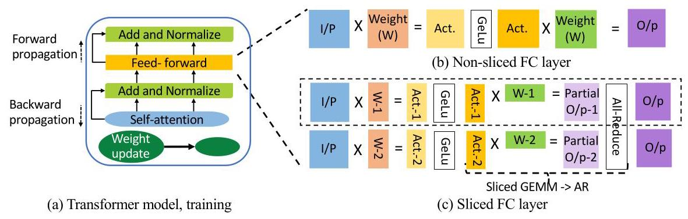
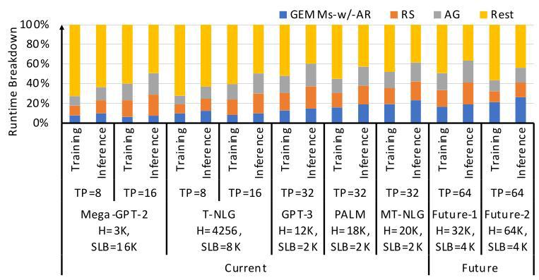
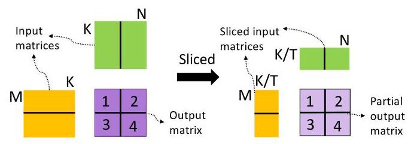
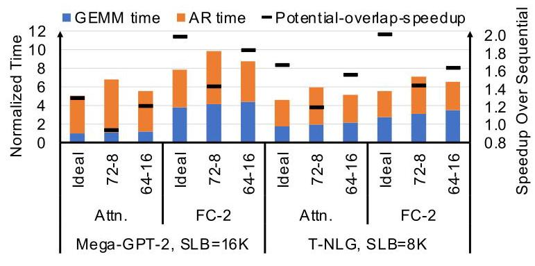
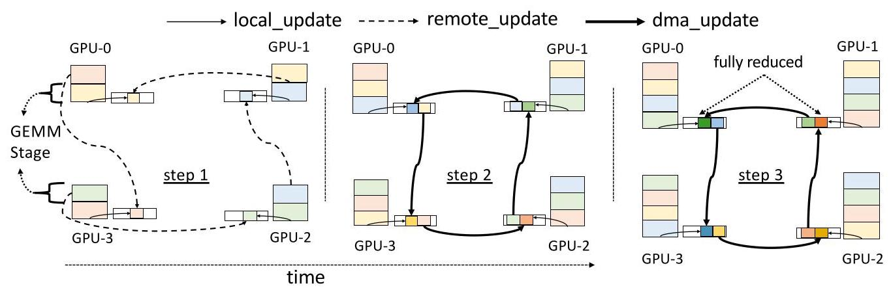
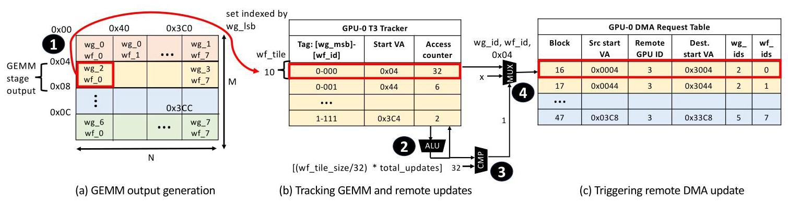
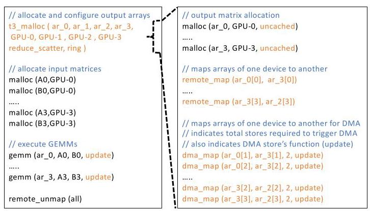
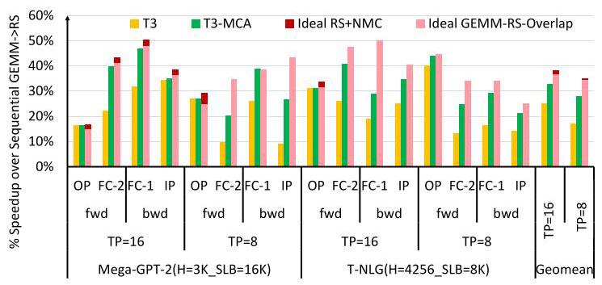
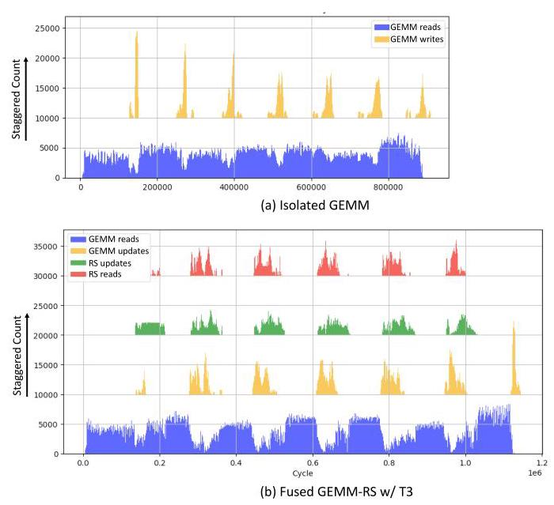
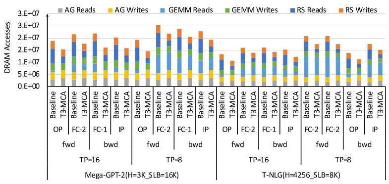

# T3: Transparent Tracking & Triggering for Fine-grained Overlap of Compute & Collectives 深度解读

> **作者**：Suchita Pati, Shaizeen Aga, Mahzabeen Islam, Nuwan Jayasena, Matthew D. Sinclair  
> **会议/年份**：ASPLOS 2024, Volume 2  
> **一句话总结**：T3 用硬件/软件协同的地址空间配置、轻量级 track-and-trigger 机制、near-memory reduction 和 memory-controller arbitration，把 Tensor Parallelism 中串行的 all-reduce 与 producer GEMM 细粒度重叠，从而减少关键路径通信和资源争用。

## 一、问题定义

这篇论文不是提出“分布式深度学习通信开销”这个新问题，而是在已有问题上抓住了一个更窄但更硬的瓶颈：Transformer 在 Tensor Parallelism（TP）下常常需要在每层或子层之后做 all-reduce，这个通信依赖 producer GEMM 的输出，因而位于模型执行的 critical path 上。Data Parallelism 里的梯度 all-reduce 可以和后续独立计算粗粒度重叠，TP 的 activation all-reduce 却经常必须等 sliced GEMM 产出之后才能启动，导致 GPU 算力和网络链路交替空转。

图 2 是理解问题的入口：FC layer 被按 tensor parallel 切到多个 GPU 后，每个 GPU 只产生部分输出，必须经过 all-reduce 才能让下一层看到完整结果。这里的通信不是后台清理工作，而是直接夹在两个计算阶段之间。

论文给出的动机证据比较扎实。Mega-GPT-2 和 T-NLG 在训练和 prompt-phase inference 中，通信最多分别占 34% 和 43%；更大的 PALM、MT-NLG 或未来 1T/10T 参数模型中，通信比例可达 46% 和 44%。作者还指出，如果 GEMM 未来再快 2 倍，通信在模型执行时间中的占比可能上升到 75%。这说明瓶颈会随算力扩张而加重，不是单靠下一代 GPU tensor FLOPS 就能自然消失。

图 4 把这个趋势可视化：模型越大、TP degree 越高，通信越难藏在其他计算后面。它支撑了本文的核心判断：如果不改变 all-reduce 与 producer GEMM 的执行关系，扩展到更多 GPU 时 scaling efficiency 会越来越差。

**动机评估**：动机 solid。作者没有泛泛讨论“通信很慢”，而是把问题限定到 serialized collective，并用模型规模、TP degree、通信占比和未来硬件趋势说明其重要性。局限也很清楚：论文主要关注 intra-node TP 下的 ring reduce-scatter/all-gather，对 inter-node、latency-bound 小消息和 generation phase 的收益需要另行判断。

**核心 Insight**：T3 的关键洞察是，TP 中的 GEMM 虽然整体上是 producer，但它并不是一次性产出所有数据。GEMM 的输出由许多 workgroups 分阶段生成，而 tensor slicing 主要减少每个 workgroup 的 dot-product 工作量，并不减少输出 tile 数量和 stage 数量。因此，某个 stage 的输出一旦就绪，就可以立刻开始 reduce-scatter，同时 GPU 继续计算后续 stage。问题的真正难点不在“能否重叠”，而在如何透明地知道数据何时就绪、如何触发通信，以及如何避免重叠后 compute unit 和 memory bandwidth 争用吞掉收益。

图 5 正好连接问题和方案：即使 GEMM 被切到多个 GPU 上，输出块的结构仍保留了分阶段生成的机会。T3 后面的 tracker、DMA trigger 和 address mapping 都是在把这个机会变成可执行的系统机制。

## 二、相关工作

论文的相关工作可以按“如何处理分布式 DNN 通信”来理解。

第一类是分布式训练与推理中的 parallelism 和 collective。Data Parallelism 需要梯度 all-reduce，Pipeline Parallelism 需要 activation peer-to-peer transfer，ZeRO/optimizer sharding 需要 gather/scatter，MoE expert parallelism 需要 all-to-all。它们都依赖 NCCL/RCCL 这类 collective library，但不是所有通信都同样难隐藏。T3 关注最麻烦的一类：TP 中 producer output 后接的 serialized all-reduce。

第二类是加速 collective 本身的工作。In-switch/in-network reduction 可以把 communication kernel 加速到约 2 倍，但依赖特定拓扑和交换设备，并不能把串行 collective 从 critical path 上移走。Collective algorithm synthesis 或 scheduling 工作能改善通信算法和排程，但如果通信依赖前一段计算产出，仍然需要更细粒度的 producer-collective 协同。

第三类是软件层 fine-grained overlap。CocoNet、Google Decomposition 等方法尝试打破 compute 和 communication 的抽象边界，把通信嵌入或拆进计算阶段；但这通常需要改 GEMM kernel，或者需要大量细粒度同步。考虑到 BLAS 库里存在大量针对 shape 和架构调优的 GEMM kernel，把每种 GEMM 与每种 collective implementation 都手工融合并不现实。

第四类是降低 compute/communication 资源争用的工作，例如为通信预留专用 accelerator 或处理 coarse-grained overlap 下的 contention。它们对 DP 场景有意义，但对 TP 的 serialized collective 不够直接。T3 的定位是同时满足三个目标：transparent communication、fine-grained overlap、reduced contention，并且不依赖额外专用通信 accelerator 或特定网络交换机。

## 三、技术挑战

**挑战 1：软件实现细粒度 overlap 代价高。** Producer GEMM 和 collective 通常是两个独立 kernel。把它们拆成更小 kernel 会引入 launch 和 synchronization 开销；写 fused GEMM-collective kernel 又会破坏成熟 BLAS 库的调优生态。作者把这一点作为系统设计约束：方案必须尽量不改 GEMM 主体实现。

**挑战 2：overlap 会抢 compute units。** 如果直接并发运行 GEMM 和 all-reduce kernel，它们会共享 CU、L1、LDS、register 等资源。论文的 Figure 6 显示，理想情况下重叠 GEMM 和 AR 可达到 1.67x geomean potential speedup；但若只给 AR 8 个 CU，AR geomean 慢约 41%，潜在加速降到 1.18x；若给 AR 16 个 CU，AR 只慢约 7%，但 GEMM 因只剩 64 个 CU 而慢约 21%，潜在加速也只有 1.49x。结论是，通信不能靠占用 GPU compute units 来完成，否则 overlap 的账算不平。

图 6 很关键，因为它说明“把两个 kernel 并发起来”不是充分解。overlap 是否有效，取决于被隐藏的通信开销是否小于新增的资源争用开销。

**挑战 3：memory bandwidth contention 更隐蔽。** Reduce-scatter 不只是跨 GPU 发包，还会读本地 chunk、读/写收到的 chunk、做 reduction。即使 T3 不占用 CU，通信流量仍可能以 burst 的形式占满 DRAM queue，拖慢 GEMM 的关键 read phase。后面的 Figure 17 说明，这正是原始 T3 与 T3-MCA 差距的主要来源。

**挑战 4：数据就绪追踪要轻量且可编程。** 不同 collective 类型、拓扑和 ring/direct 实现的触发条件不同。硬件不能只写死一种 all-reduce 模式；同时，tracking 不能落在内存访问 critical path 上，也不能维护过大的地址表。

**挑战 5：方案依赖硬件/软件边界协同。** T3 需要 output address space configuration、kernel store metadata、tracker、DMA command table、near-memory op-and-store、memory-controller arbitration 等部件共同工作。单个部件看起来不大，但组合后必须保持可实现性和可解释的开销。

## 四、解决方案

### 整体思路

T3 的思路是把“GEMM 何时写出数据”变成通信启动信号。软件侧预先配置 producer output address space：某些输出 chunk 被 remote_map 到相邻 GPU，某些 chunk 被 dma_map 并附带触发条件和 DMA 操作类型。硬件侧在 memory controller 附近用 Tracker 记录 local/remote/DMA update 的进度，一旦某个 wavefront tile 的必要更新完成，就触发预编程 DMA。Reduction 不再由 GPU CU 执行，而是由 near-memory compute 在 HBM 附近做 op-and-store。最后，MCA 通过通信感知的内存控制器仲裁减少 bursty communication traffic 对 GEMM 的干扰。

### 贯穿示例

想象一个 4-GPU TP 的 FC layer。GPU0 的 sliced GEMM 会分阶段生成 stage-1、stage-2、stage-3、stage-4 四批输出；ring reduce-scatter 要把这些 chunk 沿 GPU0 -> GPU3 -> GPU2 -> GPU1 的方向逐步规约。传统执行中，GPU0 先完成全部 GEMM，再启动 reduce-scatter，之后再 all-gather，下一层才能继续。

在 T3 中，GPU0 的 stage-1 输出可以由 GEMM store 直接 remote_update 到 GPU3；stage-2 和 stage-3 先写本地，等 Tracker 看到 local update 和来自 GPU1 的 remote/DMA update 都到齐，就触发 DMA update 发给 GPU3；stage-4 只需留作本地最终 chunk。这样，GPU0 计算 stage-3 时，可能同时接收 GPU1 的 stage-3 update，并把 stage-2 的部分规约结果 DMA 给 GPU3。整个过程把“GEMM 完成后再通信”变成“每个 stage 就绪后流水化通信”。

图 7 展示了这个流水化过程。它的重点不是简单并发，而是每个 stage 的 compute、remote update、DMA update 和 local reduction 都被安排到正确的时序中，避免下游 collective 等待整个 producer kernel 结束。

### 关键技术点

**1. Track and trigger。** T3 在 memory controller 附近放置轻量 Tracker，以 wavefront（WF）粒度记录某个 output tile 的 local update 和 remote/DMA update 是否完成。Tracker entry 以 WG/WF metadata 索引，论文给出的设计是 256 entries，总大小约 19KB。达到预设阈值后，最后一次 update 会把对应 DMA entry 标记为 ready，DMA engine 再根据预编程地址、tile size 和输出维度生成传输。由于检查发生在访问进入 memory-controller queue 之后，它不在核心访存关键路径上。

图 9 是 T3 的核心硬件图。它说明为什么作者选择 WF-based tracking 而不是单纯地址追踪：BLAS 中 column-major layout 和 row-major scheduling 可能让一个 stage 的更新地址不连续，用 WG/WF metadata 能避免复杂地址表。

**2. Near-memory reductions。** Ring reduce-scatter 的 reduction 原本会消耗 CU：读本地副本、读收到的副本、做加法、写结果。T3 把 GEMM store 和 DMA transfer 标记为 store 或 update，让 HBM 附近的 near-bank ALU 对 uncached memory 做 atomic op-and-store。这样 reduction 不再抢 GEMM 的 CU，并减少了 RS 的内存读写。论文也说明，如果没有 NMC，system-wide atomics 或 switch-based reduction 也可作为替代 substrate，但性能和实现会不同。

**3. Output address space configuration。** T3 不要求把每个 GEMM 改写成 fused kernel，而是通过 `remote_map` 和 `dma_map` 描述 producer output 的远端映射、DMA 操作类型、触发条件和粒度。这些配置可以由 collective library 预定义，类似现代通信库根据拓扑选择 collective implementation。

图 12 把“透明”具体化：应用和 runtime 做的是配置 producer 输出地址空间，而不是重写矩阵乘核心循环。GEMM 仍然负责写输出，只是这些 store 被地址映射和硬件追踪赋予了通信语义。

**4. Staggered workgroup scheduling。** Ring reduce-scatter 要求不同 GPU 在不同时间生成不同 chunk 才能形成满流水。T3 通过跨 GPU stagger WG scheduling，或者选择输出 tile-to-WG mapping 不同的 BLAS implementation，让 GPU0 先产 stage-1、GPU1 先产 stage-2，以配合 ring 顺序。

**5. Communication-aware memory-controller arbitration。** 原始 T3 已解决 compute-unit contention，但仍可能被 memory bandwidth contention 拖慢。T3-MCA 的策略是优先服务 compute stream；当通信 stream 可发时，还要检查 DRAM queue occupancy，只有低于动态阈值才发通信访问；同时用 starvation limit 避免通信完全饿死。阈值由 kernel 第一阶段的 memory intensity 估计得到。这个策略很简单，但在结果中贡献很大。

### 与已有方案的对比

相对 in-switch collective，T3 不只是加速通信本身，而是把通信从 critical path 中尽量隐藏；相对软件 decomposition，T3 不需要为每个 GEMM/collective 组合重写 fused kernel；相对普通 concurrent kernel overlap，T3 不让 collective kernel 抢 CU，并通过 MCA 处理 memory bandwidth contention。代价是它需要 GPU memory system 增加 Tracker、metadata forwarding、DMA trigger support、NMC/atomic update 支持和 MC arbitration，属于明确的硬件/软件 co-design，而不是纯软件可立即部署的库优化。

## 五、实验评估

### 实验设定

作者扩展 Accel-Sim 做 multi-GPU simulation。每个 GPU 模型包含 80 个 CU、1.4GHz、16MB L2、1TB/s HBM2；inter-GPU network 是 ring，双向 150GB/s，link latency 500ns。模拟器没有完整建模 DMA engine 内部执行，而是用 GEMM trace 注入 inter-GPU traffic，并把 Tracker 和 NMC update 的影响纳入 memory system。作者用 4-GPU AMD Instinct MI210 节点上 6MB 到 192MB reduce-scatter 测量验证模拟，geomean error 为 6%。

评估模型包括 Mega-GPT-2、T-NLG（TP=8/16），以及 GPT-3、PALM、MT-NLG（TP=32）。评估对象是需要 all-reduce 的 sliced Transformer sub-layer：forward 中的 output projection（OP）、FC-2，backward 中的 FC-1、input projection（IP）。配置包括 Sequential baseline、T3、T3-MCA、Ideal-GEMM-RS-Overlap 和 Ideal-RS+NMC。主要指标是 sub-layer speedup、DRAM data movement、end-to-end training/inference speedup。

### 主要实验与结论

**Layer-level speedup。** Ideal-GEMM-RS-Overlap 相对 sequential 的最大加速为 50%，geomean 为 35%。这说明 producer GEMM 与 reduce-scatter 的时间比例确实存在可隐藏空间。Ideal-RS+NMC 又能让 RS 在 TP=8 和 TP=16 下分别加速 7% 和 3%，但额外总体收益最高只有 4%，因为很多情况下 RS 已被 GEMM 覆盖，或 interconnect 成本主导。

T3 本身达到最高 39%、geomean 20% 的 sub-layer speedup。加入 MCA 后，T3-MCA 达到最高 47%、geomean 30%，比 T3 最高多 29%、geomean 多 13%，并且只比理想 GEMM-RS overlap 低约 5% geomean。这说明 T3 的大部分剩余差距不是 trigger 机制，而是 memory traffic arbitration。

图 16 是性能主结果。黄色 T3 已经能获得明显收益，但绿色 T3-MCA 更接近理想曲线，说明“减小 memory contention”与“触发通信”同样是方案核心。

**Memory contention analysis。** T3 在 OP layer 上常接近甚至超过 Ideal-GEMM-RS-Overlap，因为 OP GEMM 较小、DRAM read traffic 少，通信 burst 不容易阻塞 GEMM；但在大 FC layer 上，overlapped RS 的 read/update burst 会阻塞 GEMM read phase，导致距离理想重叠超过 15%。Figure 17 直接解释了这一点：baseline GEMM 的阶段内读写更规律，而 T3 加入 RS_reads/RS_updates 后让 DRAM queue 更拥挤。

图 17 说明了 T3-MCA 为什么必要：如果只把通信提早，并不自动意味着通信对计算“无害”。Memory controller 必须保护 compute stream 的关键读请求。

**Data movement reduction。** T3/T3-MCA 不只是跑得快，也减少 DRAM 往返数据量：sub-layer 总 data movement 最大减少 36%，平均减少 22%。其中 RS reads geomean 降低 2.4x（TP=8 为 2.5x，TP=16 为 2.2x），GEMM 和 RS writes geomean 降低 10%，GEMM reads geomean 降低 1.56x。这来自三点：GEMM-RS fusion 消除第一阶段本地写和 RS 第一阶段读，NMC 消除每步 partial copy read 及最终 reduction 读写，uncached/bypass 输出写改善部分 GEMM input caching。

图 18 把速度提升背后的流量变化拆开。一个值得注意的细节是，AG 的读写基本不变，因为 T3 主要融合的是 GEMM 与 reduce-scatter；all-gather 仍顺序执行。

**End-to-end impact。** 在完整模型层面，T3-MCA 对训练最高加速 12%、geomean 10%；对 prompt-phase inference 最高加速 15%、geomean 12%。T3 不带 MCA 时训练最高 9%、geomean 7%，inference 最高 12%、geomean 9%。对于 GPT-3、PALM、MT-NLG 等更大模型，T3-MCA 的 layer-level speedup 最高 35%、geomean 29%，带来训练最高 12%、prompt inference 最高 14% 的端到端加速。

### 结论支撑性分析

实验总体能支撑论文主张：T3 解决了软件透明性和 CU contention，T3-MCA 又显著缓解 memory contention，最终接近 ideal overlap 的上界。模拟器验证、多个模型规模、多个 TP degree 和端到端投影让论证比较完整。

但也有边界。第一，评估基于模拟和模型化端到端缩放，虽然 RS 模拟有 6% error 验证，但完整 T3 硬件并无真实硅片实现。第二，评估重点是 intra-node ring network 和 FP16 training/prompt inference；inter-node、small-token generation、低精度 FP8 或真实新一代 GPU 上的效果需要再验证。第三，T3-MCA 的阈值基于第一阶段 memory intensity，论文展示有效，但复杂 workload 或 phase behavior 更强的 kernel 可能需要更稳健的 policy。

## 六、附加洞察

**结论 1：NMC 的单独性能收益会随 TP degree 增大而变小。**  
*出处*：Section 6.1.1 / Figure 16。  
*推理链条*：NMC 能减少 reduce-scatter reduction 相关读写，并释放 CU；但 ring-RS 的多数步骤仍受 interconnect 传输主导，尤其 TP degree 越高，ring steps 越多，NMC 只优化 final step 的相对占比越小。因此 RS+NMC 在 TP=8 加速 7%，TP=16 只加速 3%，对 overlapped runtime 的额外提升最高 4%。这提示 T3 的核心价值不是“用 NMC 加速通信 kernel”，而是“用 NMC 让 overlap 不抢 CU 且少占内存流量”。

**结论 2：不同 sub-layer 对 memory contention 的敏感性差异很大。**  
*出处*：Section 6.1.2 / Figures 17 and 18。  
*推理链条*：OP GEMM 小，很多输入能留在 LLC 中，baseline DRAM read traffic 少；overlapped RS 的额外流量不太阻塞 GEMM，T3 有时甚至超过 ideal GEMM-RS-overlap 的第一部分，因为 NMC 让 RS 更快。大 FC layer 则有更重的 GEMM read phase，RS_reads 和 RS_updates burst 更容易占用 DRAM queue，导致 GEMM slowdown。这个结论解释了为什么一个全局平均 speedup 不足以评价 T3，必须看 layer shape 和 memory intensity。

**结论 3：端到端收益被评估实现中的非 sliced attention 比例压低了。**  
*出处*：Section 6.3。  
*推理链条*：T3 只优化需要 AR 的 sliced sub-layer；作者使用的 MLPerf v1.1 BERT implementation 缺少某个 fusion optimization，导致 non-sliced attention operations 占 40% 到 45% 的执行时间。Amdahl 定律下，这部分越大，T3 对整轮训练/推理的端到端影响越小。因此作者推断，在更新、更充分融合的 Transformer implementation 中，T3/T3-MCA 的端到端收益可能更高。这个推断合理，但仍属于基于实现结构的外推，而非直接实验。

**结论 4：T3 在 fully-connected topology 的 direct reduce-scatter 中可能进一步减少 collective memory accesses。**  
*出处*：Section 7.1。  
*推理链条*：论文主评估用 ring-RS，因为它常见且复杂；但在 fully-connected topology 上，direct RS 可以让每个 GEMM stage 输出直接 scatter 到目标 GPU 并在那里规约。通过改变 Figure 12 的 mapping，让 GEMM store 直接完成 scatter/update，collective 本身的 memory access 可能被消除。这个结论说明 T3 的抽象不绑定 ring，但论文没有对 direct-RS 做量化评估。

**结论 5：inter-node 场景中 T3 可能只能隐藏计算成本的一部分，而不能完全隐藏通信。**  
*出处*：Section 7.8。  
*推理链条*：TP 的 serialized communication 通常在单节点高速 homogeneous links 内发生；跨节点链路更慢且更不均匀，通信时间可能远大于 GEMM 时间。T3 的 fine-grained overlap 最多把 GEMM 时间藏在通信后面，一旦通信剩余时间超过可重叠计算，exposed communication 仍然会限制性能。因此 T3 可用于 inter-node，但不能替代通信算法和网络层优化。

## 七、总结与评价

T3 的贡献在于把一个看似软件调度问题改写成硬件/软件协同的事件触发问题：producer GEMM 的 store 既是数据写入，也是通信进度信号。Tracker 负责知道数据何时可发，DMA 负责搬运，NMC 负责不占 CU 的 reduction，MCA 负责让通信别压垮 GEMM 的内存访问。这个组合让 T3-MCA 在 sub-layer 上达到 30% geomean speedup、47% max speedup，并减少 22% geomean data movement。

最大亮点是设计目标很克制：作者没有要求重写 BLAS kernel，也没有假设神奇网络，而是用 address mapping 和可编程 trigger 把已有 GEMM/collective 抽象连接起来。最大不足是落地成本不低，需要 GPU memory system、DMA、HBM/NMC 或 atomic substrate、runtime/driver 和 collective library 全部配合；此外，论文的端到端结果仍依赖模拟和建模，真实硬件实现中的复杂 corner case 还需要验证。

后续值得关注的方向有三类：一是把 T3 的 trigger abstraction 扩展到 all-to-all、direct-RS、consumer-side all-gather 等更多模式；二是在没有 NMC 的现有系统上评估 system-wide atomics 或 DMA engine reduction 的替代效果；三是把 MCA 从简单阈值策略发展成更稳健的 per-kernel/per-phase memory QoS policy。

## 八、章节脉络与段落速览

- **Abstract**：概括 TP serialized communication 的问题、T3 的硬件/软件协同设计，以及 30% geomean sub-layer speedup 和 22% geomean data-movement reduction。
- **Section 1 · Introduction**：从 Transformer 规模增长引出分布式执行需求，并说明 TP all-reduce 位于 critical path。
  - **¶1-2**：解释 Transformer 规模增长导致多 GPU 训练/推理成为必要，并区分 DP 与 TP 的通信位置。
  - **¶3**：说明已有通信加速和粗粒度 overlap 无法隐藏 serialized collective，且软件细粒度 overlap 会带来复杂性和资源争用。
  - **¶4-5**：提出 T3 的 address-space mapping、track-and-trigger、NMC 和 MCA，并列出贡献与主要结果。
- **Section 2 · Background & Motivation**：建立 Transformer、TP、ring all-reduce 与 fine-grained overlap 机会。
  - **2.1 · Transformers & Need for Distributed Computing**：说明 Transformer block 的 GEMM 结构，以及训练和 prompt inference 中输入矩阵较大、适合并行。
  - **2.2 · Distributed Techniques & Associated Collectives**：梳理 DP、TP、pipeline、ZeRO、MoE 与各类 collective 的对应关系，并限定本文重点为 TP all-reduce。
  - **2.3 · All-Reduce & Ring Implementations**：介绍 ring-RS 和 ring-AG 的 chunk/step 机制。
  - **2.4 · All-Reduce is on the Critical Path & can be Large**：用 Figure 2 和 Figure 4 说明 TP all-reduce 的串行性和通信占比。
  - **2.5 · Enabling Compute-Communication Overlap**：指出 GEMM stage 产出给了 overlap 机会，进而引出 Section 3 的挑战。
- **Section 3 · Challenges With Fine-grained Compute-Communication Overlap**：论证为什么简单软件融合或并发 kernel 不够。
  - **3.1 · Complex & Expensive to Implement in Software**：说明拆 kernel、dynamic parallelism 或手写 fused GEMM-collective 的工程成本过高。
  - **3.2 · Resource Contention Between Producer & Collective**：用 CU split 和 memory bandwidth contention 说明 overlap 会引入新瓶颈。
- **Section 4 · T3: Transparent Tracking & Triggering**：完整描述 T3 的机制。
  - **4.1 · T3 Overview**：用 4-GPU GEMM-RS running example 展示 stage-level overlap。
  - **4.2 · T3 Tracking & Triggering**：说明 Tracker 的 WF 粒度追踪、19KB 表项设计和预编程 DMA 触发。
  - **4.3 · Near-Memory Reductions**：解释 T3 如何用 op-and-store 把 local/remote/DMA update 直接规约到内存中。
  - **4.4 · Configuring Producer's Output Address Space**：说明 `remote_map`/`dma_map` 如何定义输出 chunk 的远端写入、DMA 和触发条件。
  - **4.5 · Communication-aware MC Arbitration**：提出根据 DRAM queue occupancy 与 kernel memory intensity 控制通信流量的 MCA 策略。
- **Section 5 · Methodology**：描述模拟平台、模型 workload 与对比配置。
  - **5.1 · Setup**：介绍 Accel-Sim multi-GPU 扩展、MI210 reduce-scatter 验证、NMC timing 建模和端到端 Transformer 投影方法。
  - **5.2 · Applications, Deployment & GEMMs**：列出 Mega-GPT-2、T-NLG、GPT-3、PALM、MT-NLG 的 TP degree 和 GEMM 来源。
  - **5.3 · Configurations**：定义 Sequential、T3、T3-MCA 与两个 ideal upper bound。
- **Section 6 · Results**：给出 layer、memory traffic、end-to-end 和大模型结果。
  - **6.1 · Execution Time Distribution & Speedups**：先给 ideal overlap 上界，再分析 T3 与 T3-MCA 的速度差异和 memory contention 根因。
  - **6.2 · Data Movement Reductions**：说明 fusion、NMC 和 cache/bypass effect 如何带来平均 22% 的 DRAM traffic reduction。
  - **6.3 · End-to-end Model Speedups**：把 sub-layer speedup 转换成训练和 prompt inference 的端到端收益。
  - **6.4 · Impact on Larger Transformers**：说明 GPT-3、PALM、MT-NLG 等大模型上 layer-level 和 end-to-end 收益仍保持。
- **Section 7 · Discussion**：讨论 T3 的适用边界和扩展。
  - **7.1 · Other Collectives Implementation & Types**：说明 T3 可通过配置支持 direct-RS、AG 和 all-to-all。
  - **7.2 · Other Distributed Techniques**：讨论 MoE、DP、pipeline parallelism 和 consumer-side all-gather 的可能扩展。
  - **7.3 · Generative Inference**：说明 generation phase 虽消息更小，但仍可能受益于隐藏 activation all-reduce。
  - **7.4 · Other Reduction Substrates**：指出 NMC 不是唯一选择，system-wide atomics 或 switch reduction 也可承担 update。
  - **7.5 · Future Hardware & Lower Precision**：分析 compute scaling 和低精度会让 communication 更突出，并用 2x CU 配置验证趋势。
  - **7.6 · NMC for Following Operations**：提出后续 memory-intensive operations 也可在 all-gather/broadcast 前利用 NMC 减少冗余。
  - **7.7 · Other GEMM Implementations**：说明 split-K 等非标准 GEMM 需要额外 metadata 才能正确触发。
  - **7.8 · Multi-node Setups**：指出跨节点通信可能远大于 GEMM，T3 只能隐藏可重叠部分。
- **Section 8 · Related Work**：将 T3-MCA 与 in-switch、ACE、CocoNet、Google Decomposition、GPU-initiated overlap 和 Syndicate 等工作对比。
- **Section 9 · Conclusion**：重申 T3 通过 address mapping、track-and-trigger、NMC 和 MCA 透明融合 producer compute 与 serialized communication，并总结 30% geomean speedup、22% geomean data movement reduction。
