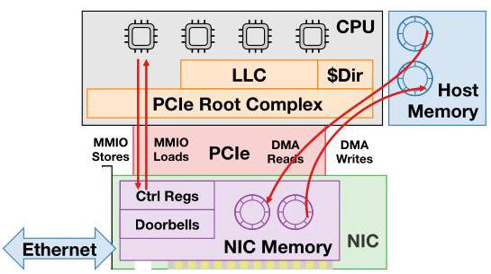
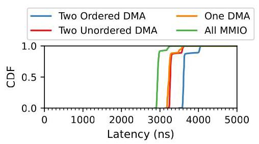
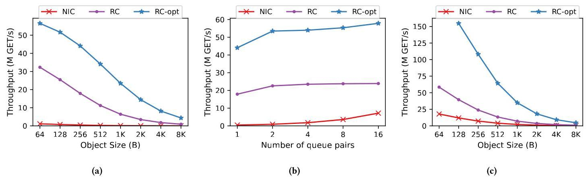
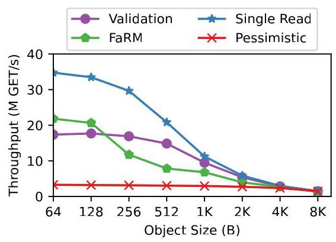

# Efficient Remote Memory Ordering for Non-Coherent Interconnects 深度解读

> **作者**：Wei Siew Liew, Md Ashfaqur Rahaman, Adarsh Patil, Ryan Stutsman, Vijay Nagarajan  
> **会议/期刊**：ASPLOS 2026, Volume 2  
> **一句话总结**：这篇论文把 PCIe 等 non-coherent interconnect 上的远端内存排序问题提升为一等架构语义，通过 PCIe acquire/release 扩展、host ISA 的 MMIO 排序指令，以及 Root Complex 中的 RLSQ/ROB 微结构，把排序从 source-side serialization 转移到 destination-side enforcement，从而同时提升 CPU-NIC MMIO 发送和 RDMA KVS read ordering 的性能。

## 一、问题定义

这篇论文关注的是 non-coherent interconnect（主要是 PCIe）上的 remote memory ordering。背景是：现代服务器里 CPU、NIC、GPU 等设备之间大量通过 PCIe 通信，CPU 访问 NIC memory 通常走 MMIO，NIC 访问 host memory 通常走 DMA/RDMA。虽然这些访问看起来像普通 load/store 或 read/write，但它们跨越的是不提供端到端 cache coherence 的 I/O fabric，所以软件想表达“先读锁再读对象”“先写 packet A 再写 packet B”这类细粒度顺序时，现有硬件语义并不够用。

本文的原始问题不是“PCIe 带宽不够”，而是“现有 PCIe/CPU ISA 不能高效表达并执行软件需要的细粒度 ordering”。PCIe 对 posted write 提供较强的同源顺序，但对 non-posted read 的顺序较弱；CPU 侧对 write-combining MMIO 的顺序又需要用 `sfence` 这类强序列化手段保证。这导致两个典型应用受损：CPU 到 NIC 的 packet transmit 需要 W→W MMIO ordering，RDMA KVS 的 get 需要 R→R DMA ordering。

Figure 1 给出了全文的系统边界：MMIO 从 CPU 经 Root Complex 到 NIC，DMA 从 NIC 经 Root Complex 到 host memory。作者的关键设计点也都落在这条路径上：PCIe TLP 带排序语义，CPU ISA 能表达 MMIO ordering intent，Root Complex 用 RLSQ/ROB 执行这些语义。

**动机评估**：动机比较 solid。论文不是只给抽象推理，而是用真实 ConnectX-6 Dx 100 Gb/s NIC 的实验说明两个瓶颈：ordered DMA read 每多一个依赖 read 大约增加 300 ns；MMIO write 一旦每个 packet 后插入 `sfence`，即使 512 B packet 也会损失 89.5% throughput。这个证据能支撑“瓶颈来自 ordering primitive 缺失，而不是简单实现低效”的判断。不过，论文的完整收益依赖未来 PCIe/ISA/RC 修改，短期落地难度较高。

**核心 Insight**：不要让发起方为了 ordering 停下来等整个远端 round trip，而应让发起方并行发出请求，把 ordering intent 显式传给靠近目的端的位置，由 destination-side hardware 在更短、更可控的局部范围内执行顺序。这个 insight 把问题从“如何用 fence/doorbell 绕过 PCIe 限制”转化为“如何给 PCIe 和 ISA 增加 release/acquire 风格的排序语义，并在 Root Complex 中高效实现”。

## 二、相关工作

论文把相关工作分成几条脉络。第一类是 memory consistency model 和处理器内的 ordering enforcement。作者借用了 release consistency、LSQ、speculative ordering、in-order commit 等经典思想，但强调 RLSQ 与 CPU LSQ 不同：RLSQ 面向设备发起的远端请求，多个 NIC thread context 共享一个排序点，而且它不是普通 coherent cache，只是作为 coherence agent 追踪 speculative read 的失效。

第二类是 non-coherent interconnect。PCIe 是本文主目标，CXL.io 继承 PCIe ordering 规则，所以问题基本迁移；AMBA AXI 甚至对不同地址、同 Transaction ID 的事务也不保证顺序，因此依赖 source-side serialization 的代价更明显。本文的 acquire/release TLP 语义可视为给这些 fabric 补上“软件可表达的细粒度 ordering”。

第三类是 coherent interconnect 与 cache-coherent NIC，如 CC-NIC、Enso、CXL 方向。作者的态度是：coherence 能解决部分 CPU-NIC 通信问题，但也带来 ownership transfer、cache state transition、协议复杂性和额外 latency。对于 producer-consumer 型 NIC 通信，本文认为一个增强过的 non-coherent PCIe baseline 就可以达到高吞吐、低延迟和正确性，不一定需要完整 cache coherence。

第四类是 RDMA KVS 和 disaggregated data structure。FaRM、XStore、Validation、Pessimistic 等协议为了绕过 RDMA read reorder，需要在 cache line 中嵌入 version metadata、用额外 read 进行 validation，或依赖 fetch-and-add/lock。这些软件技巧能工作，但会引入协议复杂度、额外网络访问或客户端数据拷贝。本文的 Single Read 展示了硬件 ordering primitive 能让协议更简单。

## 三、技术挑战

**挑战 1：PCIe 的 ordering 语义与软件需求不匹配。** 软件需要的是“某个 acquire 之后的读不能早于 acquire 观察到的内存状态”，而不是所有 read 都强顺序。简单给所有 read 加 strong ordering 会正确但过度保守；只给 flag read 加强序也无法表达后续 data read 必须位于 flag read 之后。

**挑战 2：source-side serialization 的代价太高。** 如果 NIC 必须先发 lock read、等 PCIe round trip 和 host memory response 完成后再发 data read，排序点包含整个 I/O 往返。论文估算 baseline stall 约 500 ns，只能达到约 2 Mops/s；而把排序移到 RC 后，即使顺序执行，每个 read 约 100 ns，也能提高到约 10 Mops/s。

**挑战 3：destination-side ordering 不能破坏 host memory coherence。** Root Complex 即使按顺序收到两个 DMA read，也可能因为 host cache/memory 的不同路径而让后发 data read 先完成。RLSQ 必须与 host coherence protocol 协作，确保 speculative read 在并发 host write 发生时被 invalidated 并重试。

**挑战 4：全局排序会制造 false dependency。** 如果所有 NIC 请求共用一个 acquire/release 队列，一个 QP 的 acquire 会阻塞另一个不相关 QP 的 relaxed read。必须引入 thread ID 或类似 ID-based ordering 的上下文隔离。

**挑战 5：MMIO W→W ordering 既要保留 write-combining 的吞吐，又要保持 packet 顺序。** CPU 侧 `sfence` 可以正确但会把 pipeline 切碎；如果完全无序，又会让 NIC 看到乱序 packet。需要一种不让 CPU 停顿、但能在目的端重建顺序的机制。

## 四、解决方案

### 整体思路

本文的方案是 hardware-software co-design。软件/ISA 层把远端访问分成 relaxed、release、acquire 等语义；PCIe TLP 层携带这些语义和 thread ID/sequence number；Root Complex 中的 RLSQ 负责 DMA read/write 的 acquire/release enforcement，ROB 负责 MMIO write 序列号重排。整体目标是：source 可以 pipeline 请求，destination 保证对外呈现符合 release/acquire 语义的顺序。

### 贯穿示例

可以用一个 RDMA KVS `get(key)` 串起全文。服务器内存里每个对象有 header/version、payload、footer/version。客户端 NIC 想读取对象时，理想流程是先读 header/version，再读 payload/footer；如果 header/footer 匹配，就返回 payload。当前 PCIe 下，NIC 如果把这些 read 并行发出，payload 可能先于 header 在 host memory 中完成，导致看到撕裂或陈旧数据；如果 NIC 严格等 header 返回后再读 payload，吞吐会被 PCIe round trip 限制。

在本文方案中，NIC 把 header read 标成 acquire，payload/footer read 标成 relaxed，并带上同一个 thread ID。RLSQ 收到后知道 payload/footer 必须观察到 acquire 之后的内存状态，但它可以 speculative 地并行发出这些 read，把结果暂存，等 acquire 完成后再按语义返回。如果 host CPU 在 speculative window 内写了 payload，coherence invalidation 会让对应 speculative read 失效并重试。于是软件得到顺序语义，NIC 保留并行性。

同理，CPU 到 NIC 发送 packet 时，CPU 不再每个 packet 后 `sfence`，而是给 MMIO write 附上 sequence number。Root Complex 或 NIC 侧 ROB 按序释放这些 write。CPU 可以持续写入，NIC 仍按 packet order 看到数据。

### 关键技术点

**PCIe acquire/release 扩展。** 对 read 增加 acquire bit，对 write 复用或重解释 relaxed ordering bit 表达 release。acquire read 保证后续访问看到不早于该 read 的内存状态；release write 保证先前访问在该 write 可见前完成。这比“全部 strong ordering”更细粒度，因为数据块之间仍可 relaxed 并行。

**Host ISA 的 MMIO first-class operations。** 论文建议引入 MMIO-Store、MMIO-Release、MMIO-Load、MMIO-Acquire，或至少把 RISC-V `fence iorw, iorw` 一类 fence 从“必须阻塞直到 drain”重解释为“给 MMIO stream 注入 ordering metadata”。关键变化是 fence 不再只是 serialization instruction，而成为下游硬件可执行的 ordering directive。

**RLSQ：Root Complex 里的远端 load-store queue。** Baseline RLSQ 对 weakly ordered read 并行发出，对 ordered write 严格提交。本文的 Release-Acquire RLSQ 对 relaxed 请求并行，对 acquire/release 请求建立必要屏障：acquire 阻塞同上下文后续请求直到自身完成，release 等待先前请求完成后再发出。

**Thread-specific ordering。** 为了避免不相关请求互相阻塞，PCIe TLP 携带 thread ID，例如 QP 或 NIC 内部 execution context。RLSQ 只在同 thread 内执行 acquire/release 约束。实现上可以是逻辑分区队列和每线程状态位，而非为每个线程物理复制队列。

**Speculative DMA ordering。** RLSQ 像 out-of-order processor 一样“乱序执行、按序提交”。对 acquire→read，RLSQ 可并行发出后续 read，但延迟响应；若期间 coherence invalidation 命中 speculative address，只 squash 冲突 read 并重试，而不是清空整个窗口。这是性能接近 unordered 的关键。

**MMIO ROB。** CPU 发出的 MMIO operation 带 sequence number，Root Complex 或 endpoint 的 ROB 追踪已收到的连续序列号，只有连续前缀完整时才把 write 作为 ordered PCIe write 发给 NIC。这个机制允许 interconnect 中间段更 aggressive 地转发，而由最终重排点恢复程序顺序。

### 与已有方案的对比

相对 source-side fence/serialization，本文把等待点从远端 round trip 缩短到 RC 内部排序，并进一步通过 speculative ordering 消除大部分等待。相对软件协议绕行，本文能减少 metadata、copy 和额外 RDMA 操作。相对完整 coherence，本文保持 non-coherent fabric 的简单性，只把 ordering 这个必要语义显式化。

局限也很清楚：方案需要 PCIe、ISA、Root Complex、可能还有 NIC/endpoint 的共同支持；RLSQ 需要参与 coherence invalidation，验证复杂度不低；P2P 多目的地场景下仍有必须回退到 source-side ordering 的情况；实验中的硬件 emulation 只能用 unordered NIC 性能近似 speculative ordered 的无冲突上界，并没有真实原型。

## 五、实验评估

### 实验设定

论文采用仿真与真实 NIC emulation 两条线。仿真使用 gem5 classic cache model；DMA 实验使用 SimpleTimingCPU，MMIO 实验使用 O3CPU。DMA 配置中 I/O bus one-way latency 设为 200 ns，Root Complex latency 为 17 ns，RLSQ 为 256 entries；MMIO 配置中 Root Complex latency 为 60 ns，16-entry buffer，NIC MMIO processing latency 为 10 ns。

真实硬件 emulation 使用 CloudLab sm110p，两台机器分别作为 client/server，CPU 是 Intel Xeon Silver 4314，NIC 是 NVIDIA ConnectX-6 Dx EN 100 Gb/s PCIe 4.0 x16。由于真实 NIC 不支持本文 ordering，作者用“read-only 无冲突场景下，speculative ordering 与 unordered 硬件性能相同”的观察，用现有 unordered NIC throughput 作为 proposed architecture 的 best-case proxy。

Baseline 包括 NIC-side ordering、RC sequential ordering、RC-opt speculative ordering、当前 MMIO sfence ordering、FaRM、Validation、Pessimistic、Single Read 等。核心指标是 RDMA/KVS throughput、MMIO write bandwidth、latency CDF、area/static power。

### 主要实验与结论

Figure 2 隔离了 ordered DMA read 的延迟代价。All MMIO median 为 2,941 ns；One DMA 为 3,234 ns，多 293 ns；Two Unordered DMA 为 3,271 ns，只比 One DMA 多 37 ns，说明两个 DMA read 可以重叠；Two Ordered DMA 为 3,613 ns，比 Two Unordered 多 342 ns。这个图直接证明“排序依赖”会把可重叠访问变成 stop-and-wait。

Figure 4 支撑了 MMIO 侧动机：unordered write-combining MMIO 能达到 122 Gb/s，但为 packet order 插入 `sfence` 后，即使 packet size 到 512 B，throughput 也下降 89.5%。这解释了为什么实际 NIC 发送路径倾向于 doorbell + DMA，而不是简单直接 MMIO packet data。

Figure 5 比较单 QP 下的 DMA read throughput。NIC-side ordering 因每个 cache line 都要同步等待而无法扩展；RC ordering 缩短了 stall，但仍受顺序访问限制；RC-opt speculative ordering 基本追上 unordered。这个实验是 RLSQ speculative design 的核心证据。

Figure 6 把 ordering primitive 放到 KVS get 上。单 client QP、batch 100 时，RC ordering 比 NIC ordering 快 29.1x，RC-opt 比 NIC ordering 快 50.9x。随着 QP/client 增加，NIC ordering 可以利用一些并行度，但仍无法追上 RC/RC-opt；在 16 QP、batch 500 时，小对象场景下 RC-opt 是唯一既保持 correctness 又接近 100 Gb/s link 的方案。

Figure 7 用 ConnectX-6 Dx 展示 KVS 协议层收益。Validation 和 Single Read 都需要 R→R ordering 才严格正确；Single Read 依赖本文硬件 ordering 后，可以避免 FaRM 在每个 cache line 嵌入 metadata 以及客户端 strip/copy 的开销，对 64 B object 比 FaRM 高 1.6x，并且在小对象上大约有接近两倍 Validation 的 throughput。

Figure 9 讨论多目的地 P2P 场景。没有 VOQ 时，慢 P2P device 会填满共享 switch queue，使 CPU flow 被 HOL blocking，8192 B object 时 throughput 最多下降 167x；加入 per-destination VOQ 后，CPU flow 恢复到接近 baseline。这个实验说明 destination-based ordering 还需要 fabric 资源隔离，否则正确的 ordering 语义仍可能被队列结构拖垮。

Figure 10 在模拟器中复现了 Figure 4 的趋势：用 fence 在 source enforce MMIO W→W ordering 会显著降低 throughput。这为论文提出的 sequence-number + ROB 路径提供了实验上的对应动机，虽然该图本身主要验证 baseline pathology，而非完整 ROB 原型的最终收益。

硬件开销方面，CACTI 估算 RLSQ 面积 0.9693 mm²，占 Intel I/O Hub 的 0.6853%；ROB 面积 0.2330 mm²，占 0.1647%。静态功耗上，RLSQ 为 49.2018 mW，占 0.4920%；ROB 为 4.8092 mW，占 0.0481%。整体增加面积少于 0.9%，静态功耗少于 0.6%。

### 结论支撑性分析

实验对论文的主张支撑较强，尤其是三段链条比较完整：真实 NIC 实验量化了当前 ordering 成本；仿真证明 RLSQ/RC-opt 可以把 ordered read 性能拉近 unordered；KVS emulation 说明一旦有低成本 ordering primitive，软件协议可以更简单且更快。

不足主要在实现真实性。PCIe acquire/release、ISA MMIO operations、RC RLSQ/ROB 都是 proposed design，没有硅上原型；真实 NIC emulation 借用 unordered throughput 作为 speculative ordered 的无冲突上界，依赖“read-only workload 没有 invalidation 冲突”这一假设。对于写冲突频繁的 KVS、复杂多设备拓扑、真实 CPU ISA 实现成本，论文覆盖得相对有限。

## 六、附加洞察

**结论 1**：RDMA read ordering 的瓶颈不只是 NIC 端处理慢，而是 read completion 的依赖链把可并行 DMA 变成了每次约 300 ns 的串行等待。  
- *出处*：Section 2.1 / Figure 2  
- *推理链条*：作者先构造 All MMIO、One DMA、Two Unordered DMA、Two Ordered DMA 四种提交模式；观察到两个 unordered DMA 几乎与一个 DMA 一样慢，而两个 ordered DMA 额外增加约 342 ns；因此把性能损失归因于 ordering dependency 触发的 stop-and-wait，而不是 DMA 本身不可并行。

**结论 2**：CPU-NIC transmit path 中，直接 MMIO 不是天然低吞吐，真正让它不可用的是为 W→W ordering 插入的 `sfence`。  
- *出处*：Section 2.2 / Figure 4  
- *推理链条*：无 ordering 时 write-combining MMIO 达到 122 Gb/s，说明 CPU 和 PCIe bus 能提供足够吞吐；加入 `sfence` 后 throughput 大幅下降；所以现代 doorbell + DMA 的复杂路径是在补偿排序原语缺失，而不是因为 MMIO 数据路径本身一定慢。

**结论 3**：RLSQ 的 per-thread ordering 不是优化细节，而是 correctness-preserving performance 的必要条件。  
- *出处*：Section 5.1  
- *推理链条*：release/acquire ordering 本质上只约束同一软件上下文的访问序；如果 RC 全局执行 acquire barrier，一个 QP 的 lock read 会阻塞其他 QP 的独立 read；引入 thread ID 后，RLSQ 只在同 thread 内保序，既符合语义又避免 false dependency。

**结论 4**：硬件 ordering primitive 可以反过来简化分布式数据结构协议，而不只是加速已有协议。  
- *出处*：Section 6.4 / Figure 7  
- *推理链条*：FaRM 通过每个 cache line 嵌入 version metadata 来抵抗 read reorder，但这迫使客户端 strip metadata 并 copy 到连续 buffer；Single Read 依赖 ordered read 后只需 header/footer version，去掉了 per-line metadata；实验显示它对 64 B object 比 FaRM 快 1.6x，因此收益来自协议结构变简单和数据处理减少，而不只是单次 read 更快。

**结论 5**：destination-based ordering 在多目的地 P2P 系统中还需要队列隔离，否则 fabric-level HOL blocking 会吞掉 ordering 优势。  
- *出处*：Section 6.6 / Figure 9  
- *推理链条*：作者构造一个 CPU flow 和一个拥塞 P2P flow；共享 32-entry queue 时慢设备填满队列，CPU flow 被反压，8192 B object 下降最高 167x；加入 VOQ 后不同目的地隔离，CPU flow 接近 baseline；因此 ordering 语义之外，interconnect queueing policy 也是可扩展性的前提。

## 七、总结与评价

这篇论文的最大贡献是把 non-coherent interconnect 上的 remote memory ordering 从“软件用 fence、doorbell、metadata 各自绕路”的工程问题，重新表述成“ISA + PCIe + Root Complex 应共同支持的 release/acquire 语义”问题。这个抽象很有价值，因为它把 CPU 内 memory consistency 的成熟思想迁移到了 I/O fabric。

论文最亮的地方是问题拆解和证据链：Figure 2/4 把当前系统的 ordering 成本量化得很直接，RLSQ speculative ordering 又给出了一条性能上接近 unordered、语义上保持 ordered 的路径。KVS Single Read 的例子也说明硬件语义改进能让软件协议变简单。

主要不足是落地跨度大。PCIe spec、CPU ISA、Root Complex、NIC/endpoint 都可能要改；RLSQ 作为 coherence agent 的验证和错误恢复复杂度在论文中讨论不深；真实评估还没有硬件原型。不过作为体系结构论文，它很好地建立了“为什么 coherent I/O 不是唯一方向”的技术基线，后续值得探索的是更小步的兼容部署路径，例如先在特定 RC/NIC 平台上实现 endpoint ROB 或 limited acquire read。

## 八、章节脉络与段落速览

- **Abstract**：概括 non-coherent interconnect ordering 的架构错配、destination-based ordering 方案和主要性能收益。
  - ¶1 说明 PCIe 等 non-coherent interconnect 需要细粒度 ordering，但现有硬件只能用昂贵 source-side serialization。
  - ¶2 提出 PCIe/ISA 扩展和 Root Complex 微结构，将 ordering enforcement 移到目的端并提升两个应用 kernel。

- **Section 1 · Introduction**：定义 CPU/NIC/GPU 跨 PCIe remote ordering 的问题，并给出本文贡献。
  - ¶1 说明现代服务器受 CPU-device interconnect 限制，本文聚焦 PCIe 而非完整 coherent I/O。
  - ¶2 用 packet transmit 和 RDMA KVS 举例说明多个远端地址访问需要保持顺序。
  - ¶3 指出现有 PCIe 缺少表达细粒度 ordering 的语义，导致 MMIO transmit 和 RDMA ordered read 都要 source-side serialization。
  - ¶4 提出 destination-based ordering，把 ordering 从 source 转移到靠近 destination 的硬件。
  - ¶5 说明核心做法是让 ordering 成为 ISA 到 PCIe 的显式语义，并用 RLSQ 执行 acquire/release。
  - ¶6-10 列出贡献：量化 pathology、提出 PCIe/ISA 语义、设计 RLSQ、展示 KVS/MMIO 性能收益。

- **Section 2 · Remote Memory Ordering Today**：分析当前 DMA 和 MMIO ordering 的瓶颈。
  - **2.1 · DMA Ordering**：解释 R→R DMA ordering 为什么必须停等，以及 W→W DMA 为什么已有 PCIe posted write 顺序可高效支持。
    - ¶1 用 flag/data litmus test 说明 NIC-side R→R serialization 是当前唯一可靠方法。
    - ¶2 说明 W→W DMA 可依赖 PCIe posted write 顺序并 pipeline。
    - ¶3-7 通过 RDMA WRITE 变体隔离一个 DMA、两个 unordered DMA、两个 ordered DMA 的延迟差异。
    - ¶8-10 把约 300 ns 停等转化为 ordered read throughput 上限，并与 RDMA WRITE throughput 对比。
    - ¶11-12 说明 KVS check-before-read 受 R→R ordering 缺失影响，被迫采用复杂 metadata/validation 协议。
  - **2.2 · MMIO Ordering**：解释 MMIO read 和 write 的 source-side ordering 成本。
    - ¶1 说明 R→R MMIO 也因 PCIe weak read ordering 而需要序列化。
    - ¶2 说明 W→W MMIO 的核心问题是 write-combining region 需要 `sfence` 保证到达 RC 的顺序。
    - ¶3-5 通过 Figure 4 证明 `sfence` 让 MMIO write bandwidth 大幅下降。
    - ¶6-7 指出现代 doorbell + DMA transmit path 是为了绕开缺失的低成本 MMIO ordering primitive。

- **Section 3 · Fast Remote Memory Ordering Overview**：给出设计总览。
  - ¶1 总述 PCIe/ISA 扩展和 Root Complex enforcement。
  - ¶2-3 说明 R→R DMA ordering 从 NIC 停等转为 RC enforcement，可把约 500 ns source stall 缩成约 100 ns RC access。
  - ¶4-5 介绍 RLSQ speculative ordering 和 coherence invalidation 如何同时获得并行性与正确性。
  - ¶6 介绍 W→W MMIO ordering 用 sequence number 和 destination ROB 取代 CPU `sfence`。

- **Section 4 · Architectural Support**：定义 PCIe 和 host ISA 的排序语义。
  - **4.1 · PCIe Extensions for Remote Memory Ordering**：引入 PCIe acquire/release。
    - ¶1 说明 ordered/unordered read 二分不足以表达 producer-consumer 模式。
    - ¶2-3 用 flag/data 例子说明 acquire read + relaxed data read 比全部 strong ordering 更精确。
    - ¶4 说明 write 可复用 relaxed ordering bit 表达 release，read 可增加 acquire bit。
  - **4.2 · Host ISA extensions for MMIO**：让 MMIO ordering 成为 ISA 一等语义。
    - ¶1 指出现有 ISA 通过 memory attributes 和 fence 间接控制 MMIO，语义复杂且保守。
    - ¶2 以 RISC-V fence 为例说明可把 fence 从阻塞操作转成 ordering metadata 注入。
    - ¶3 提出 MMIO-Store/Release/Load/Acquire 四种操作，并与 host memory model 集成。

- **Section 5 · Microarchitectural Support**：描述 RLSQ 和 MMIO ROB。
  - **5.1 · Remote Load-Store-Queue**：设计 Root Complex 中的 DMA ordering 执行点。
    - ¶1 定位 RLSQ 是 PCIe ordering 与 host coherent memory system 的桥。
    - ¶2-3 描述 baseline RLSQ 如何处理 weak read 和 strong write。
    - ¶4-5 定义 Release-Acquire RLSQ 的 stall 规则，并用 speculative NIC 读 KVS 的例子说明必要性。
    - ¶6-7 提出 thread ID，避免一个上下文的 acquire 阻塞其他上下文。
    - ¶8-10 提出 speculative DMA ordering、coherence invalidation 和 Write→Release speculation。
  - **5.2 · Host Support for MMIO Operations**：设计 sequence number 和 ROB。
    - ¶1 说明新 MMIO 指令需要 CPU 和 RC 的微结构支持。
    - ¶2-3 用 MMIO-Store 后跟 MMIO-Release 说明 sequence number 和 ROB 如何重建顺序。
    - ¶4-5 说明 thread ID 可并入 sequence number，ROB 可放在 RC 或 endpoint。
    - ¶6 说明 ordering metadata 让中间 fabric 可以更积极转发事务。

- **Section 6 · Evaluation**：用仿真和真实 NIC emulation 评估性能与开销。
  - **6.1 · Simulation Infrastructure**：说明 gem5 配置、DMA/MMIO 模型和关键延迟参数。
  - **6.2 · Benchmarks**：定义 ordered DMA reads、KVS gets、NIC packet transmission 三类 benchmark。
  - **6.3 · Simulation Results**：展示 ordered read、KVS get 在 NIC/RC/RC-opt 下的 throughput，说明 speculative ordering 接近 unordered。
  - **6.4 · Emulation on Existing NICs**：用 ConnectX-6 Dx unordered read throughput 近似无冲突 speculative ordered 性能，并比较 Pessimistic、Validation、FaRM、Single Read。
  - **6.5 · Cross-Validating Simulation and Emulation**：说明 Figure 8 与 Figure 7 趋势接近，增强仿真可信度。
  - **6.6 · Peer-to-Peer Experiments**：讨论跨多个 destination device 时何时要回退 source ordering，以及 VOQ 如何避免 HOL blocking。
  - **6.7 · Ordered MMIO Writes**：在模拟器中复现 `sfence` 对 MMIO write throughput 的严重影响。
  - **6.8 · Hardware Area and Static Power Overhead**：估算 RLSQ/ROB 对 I/O Hub 面积和静态功耗增加均低于 1%。

- **Section 7 · Related Work**：把本文放入 MCM、non-coherent fabric、coherent interconnect 和其他设备 ordering 的研究脉络。
  - ¶1 说明 release consistency 和现代 ISA/language MCM 是本文语义设计基础。
  - ¶2 对比 RLSQ 与 CPU LSQ，强调共享多 thread context 和 invalidation tracking 的不同。
  - ¶3 说明 PCIe、CXL.io、AXI 等 non-coherent interconnect 都可受益于显式 acquire/release。
  - ¶4 讨论 CC-NIC/Enso/CXL 等 coherent I/O 方案，并认为增强 PCIe 可避免 coherence 的复杂性。
  - ¶5 说明 GPU/FPGA 等设备也可使用 destination-based ordering，并可与 CORD 等工作结合。

- **Section 8 · Conclusion**：总结 PCIe 需要从隐式 fabric 属性转向显式、一等 ordering 语义。
  - ¶1 说明 PCIe 早期面向慢速批量 I/O，现代异构高带宽低延迟通信需要新的 ordering 模型。
  - ¶2 总结本文通过 PCIe interface、ISA 语义和微结构 enforcement 解决 remote memory ordering，并质疑完整 coherent interconnect 是否总是必要。
