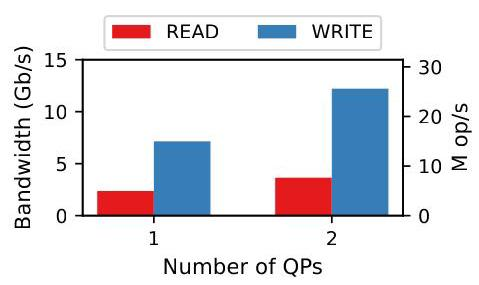
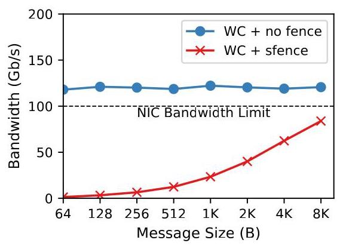
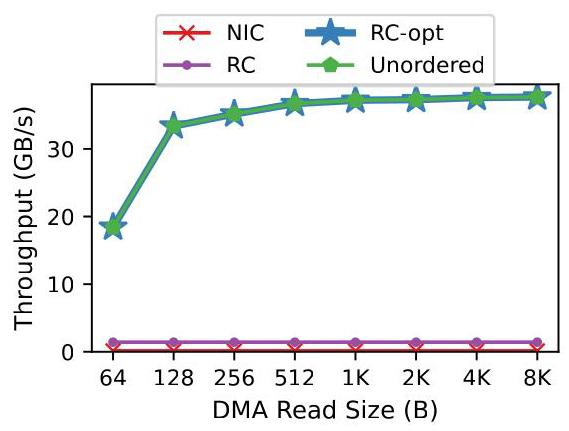
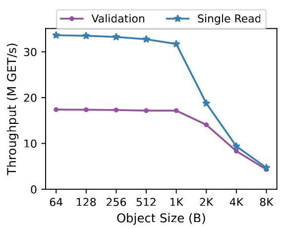
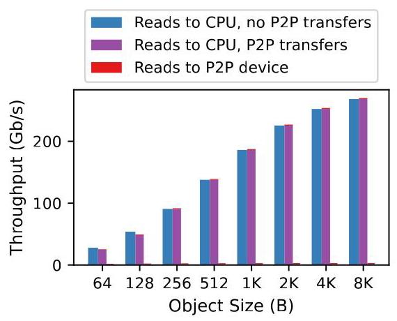
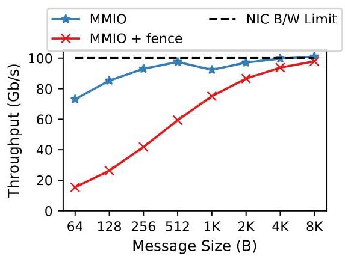

# Efficient Remote Memory Ordering for Non-Coherent Interconnects

Wei Siew Liew*

> 
刘伟秀*

u1529306@utah.edu

> 
本文解决了在 PCIe 等非一致性互连上远程内存排序的性能瓶颈，重点关注 CPU 与网卡之间的通信。核心问题在于，当前硬件为了对 MMIO 写操作（例如数据包传输）和 DMA 读操作（例如键值存储查找）进行排序，被迫使用了代价高昂的源端串行化。作者提出了一种基于目标的排序模型，该模型在 PCIe 规范、主机指令集架构以及根复合体微架构之间进行了协同设计。

主要贡献包括：
- 通过获取/释放语义扩展 PCIe 以显式表达排序需求，并在主机指令集中引入新的 MMIO 加载/存储指令（MMIO-Store、MMIO-Release、MMIO-Load、MMIO-Acquire），从而在不阻塞处理器的情况下传达排序意图。
- 在根复合体中设置远程加载-存储队列（RLSQ）以高效执行排序，并通过每线程排序和有顺序读的推测执行（乱序发射、顺序提交）等优化，与缓存一致性相结合以确保正确性。利用序列号的重排序缓冲区处理 MMIO 写排序。
- 通过仿真和真实网卡模拟进行的评估表明：所提出的 MMIO 发送路径无需存储屏障即可达到线速吞吐量；推测的有序 DMA 读取能与无序读取的吞吐量相匹配；使用有序读的一种更简单的基于 RDMA 的键值存储 GET 协议，针对小对象的性能比当前最优的 FaRM 高出 1.6 倍。硬件面积和功耗开销可忽略不计（<1%）。

结论是，将排序视为从指令集架构到互连的显式一等语义，能消除源端停顿，从而实现高性能、更简单的 I/O 协议，并质疑了更复杂的一致性互连的必要性。

University of Utah

> 
本文解决了在非一致性互连（如 PCIe）上进行远程内存排序时的性能瓶颈，重点关注 CPU 与网卡之间的通信。核心问题在于，当前硬件为强制 MMIO 写（例如数据包发送）和 DMA 读（例如键值存储查找）的顺序，必须进行成本高昂的源端串行化。作者提出了一种基于目的地的排序模型，该模型在 PCIe 规范、主机指令集架构和根复合体微架构之间进行了协同设计。

主要贡献包括：
-   扩展 PCIe 以引入 acquire/release 语义，明确表达排序需求，并在主机 ISA 中新增 MMIO 加载/存储指令（MMIO-Store、MMIO-Release、MMIO-Load、MMIO-Acquire），从而在不阻塞处理器的情况下传达排序意图。
-   在根复合体中引入远程加载-存储队列（RLSQ），高效执行排序，并进行了优化，如每线程排序和有序读的推测执行（乱序发射、顺序提交），并与缓存一致性集成以确保正确性。利用序列号的重排序缓冲区处理 MMIO 写排序。
-   通过模拟和真实网卡仿真进行的评估表明：所提出的 MMIO 传输路径无需存储栅障即可达到线速吞吐量；推测性有序 DMA 读的吞吐量与无序读相当；一种基于有序读的更简单的 RDMA 键值存储 get 协议，在处理小对象时性能比最先进的 FaRM 提升 1.6 倍。硬件面积和功耗开销可忽略不计（<1%）。

结论是，将排序视为从 ISA 到互连的显式一等语义，可消除源端停顿，从而实现高性能、更简化的 I/O 协议，并对是否需要更复杂的一致性互连提出质疑。

Salt Lake City, Utah, USA

> 
美国犹他州盐湖城

Md Ashfaqur Rahaman*

> 
穆罕默德·阿什法库尔·拉哈曼*

ashfaq@cs.utah.edu

> 
ashfaq@cs.utah.edu

University of Utah

> 
犹他大学

Salt Lake City, Utah, USA

> 
美国犹他州盐湖城

Adarsh Patil

> 
阿达尔什·帕蒂尔

Adarsh.Patil@arm.com

> 
Adarsh.Patil@arm.com

本文针对 PCIe 等非一致性互连上远程内存排序的性能瓶颈，重点讨论了 CPU 与网卡间的通信。核心问题在于，当前硬件强制采用代价高昂的源端串行化来为 MMIO 写操作（如数据包发送）和 DMA 读操作（如键值存储查询）施加排序约束。作者提出了一种基于目的端的排序模型，该模型跨越 PCIe 规范、主机 ISA 和根复杂体微架构进行协同设计。

主要贡献包括：
- 扩展 PCIe 以引入 acquire/release 语义，显式表达排序需求，并在主机 ISA 中引入新的 MMIO 加载/存储指令（`MMIO-Store`、`MMIO-Release`、`MMIO-Load`、`MMIO-Acquire`），在不阻塞处理器的情况下传递排序意图。
- 在根复杂体中设计了一个远程加载-存储队列（RLSQ），高效执行排序，并配合多项优化，如每线程排序以及有序读操作的推测执行（乱序发射，顺序提交），该推测执行与缓存一致性集成以确保正确性。利用序列号的重排序缓冲区处理 MMIO 写顺序。
- 通过仿真和真实网卡模拟进行的评估显示：所提出的 MMIO 发送路径无需存储围栏即可达到线速吞吐量；推测有序 DMA 读的性能与无序读吞吐量相当；一个更简单的、利用有序读操作的 RDMA 键值存储获取协议，针对小对象其性能比当前最先进的 FaRM 高 1.6 倍。硬件面积和功耗开销可忽略不计（<1%）。

结论是，将排序视为从 ISA 到互连的第一等显式语义，能够消除源端停顿，从而支持高性能、更简洁的 I/O 协议，并对是否需要更复杂的一致性互连提出质疑。

Arm

> 
Arm

Cambridge, UK

> 
英国剑桥

Ryan Stutsman

> 
Ryan Stutsman

stutsman@cs.utah.edu

> 
stutsman@cs.utah.edu

University of Utah

> 
犹他大学

Salt Lake City, Utah, USA

> 
美国犹他州盐湖城

Vijay Nagarajan

> 
本文探讨了在像 PCIe 这样的非一致性互连上远程内存排序的性能瓶颈，重点关注 CPU–NIC 通信。核心问题是当前硬件强制昂贵的源端串行化来保证 MMIO 写（如数据包发送）和 DMA 读（如键值存储查找）的排序。作者提出了一种基于目的地的排序模型，该模型在 PCIe 规范、主机 ISA 和根联合体微架构三者之间协同设计。

主要贡献包括：  
- 扩展 PCIe 以实现获得/释放语义，从而显式地表达排序需求，并在主机 ISA 中引入新的 MMIO 加载/存储指令（MMIO-Store、MMIO-Release、MMIO-Load、MMIO-Acquire），以传达排序意图，且不会使处理器停顿。  
- 在根联合体端设计了一个远程加载-存储队列（RLSQ），该队列能高效地强制排序，并采用了按线程排序、有序读的推测执行（乱序发射、顺序提交）等优化，同时与缓存一致性机制集成以确保正确性。一个利用序列号的重排序缓冲区负责处理 MMIO 写排序。  
- 通过仿真和真实 NIC 模拟的评估显示：所提出的 MMIO 发送路径无需存储围栏即可实现线速吞吐；推测执行的有序 DMA 读取的吞吐量与无序读取相当；一种更简单的、基于 RDMA 的键值存储 get 协议利用有序读取，在处理小型对象时性能比当前最先进的 FaRM 高出 1.6 倍。硬件面积和功耗开销极小（<1%）。

结论是，将排序作为一项显式的、一等语义来对待，贯穿从 ISA 到互连的各个层面，可以消除源端停顿，从而带来高性能、更简单的 I/O 协议，并对是否需要更复杂的相干互连提出了质疑。

vijay@cs.utah.edu

> 
vijay@cs.utah.edu

University of Utah

> 
犹他大学

Salt Lake City, Utah, USA

> 
美国犹他州盐湖城

## Abstract

Software using non-coherent interconnects like PCI Express requires fine-grained memory ordering, but current hardware mandates the use of costly source-side serialization. We show that this architectural mismatch severely limits the performance of two critical applications: (1) the transmission of network packets from a CPU to a NIC (requiring write-to-write ordering) and (2) key-value store lookups by an RDMA-enabled NIC (requiring read-to-read ordering).

> 
使用非一致互连（如PCI Express）的软件需要细粒度的内存排序，但当前硬件强制采用代价高昂的源端串行化。我们揭示了这一架构不匹配严重限制了两个关键应用的性能：（1）从CPU到NIC的网络数据包传输（需要写-写排序），以及（2）由支持RDMA的NIC进行的键值存储查找（需要读-读排序）。

We address this by proposing a new destination-based ordering model and the hardware-software co-design comprising PCIe extensions and ISA extensions that allow software to express ordering intent efficiently. Novel microarchitecture at the Root Complex enforces these expressed semantics, eliminating source-side stalls. Our approach significantly improves the throughput of these application kernels and enables new, simpler protocols that outperform the state-of-the-art.

> 
为此，我们提出了一种基于目标的排序模型，并设计了软硬件协同方案，包括 PCIe 扩展和 ISA 扩展，使软件能够高效表达排序意图。根复合体（Root Complex）中的新型微架构负责强制执行所表达的语义，从而消除源端停顿。我们的方法显著提升了这些应用内核的吞吐量，并催生了更简单的新协议，其性能超越了当前最先进的技术。

CCS Concepts: • Hardware $\rightarrow$ Buses and high-speed links; Networking hardware; - Computer systems organization $\rightarrow$ Interconnection architectures.

> 
CCS Concepts: • Hardware $\rightarrow$ 总线与高速链路; 网络硬件; - Computer systems organization $\rightarrow$ 互连架构。

Keywords: Memory Consistency Models, I/O Interconnects, Non-Coherent Interconnects, RDMA, PCIe

> 
本文针对PCIe等非一致性互连上的远程内存排序性能瓶颈进行研究，重点关注CPU与网卡之间的通信。核心问题在于，现有硬件迫使在源端进行昂贵的串行化操作，以确保MMIO写（如数据包发送）和DMA读（如键值存储查找）的排序。作者提出了一种基于目的端的排序模型，该模型通过协同设计PCIe规范、主机ISA和根复合体微架构来实现。

主要贡献包括：
- 为PCIe扩展了获取/释放语义，以显式表达排序需求，并在主机ISA中引入新的MMIO加载/存储指令（MMIO-Store、MMIO-Release、MMIO-Load、MMIO-Acquire），从而在不阻塞处理器的情况下传递排序意图。
- 在根复合体中设计了一个远程加载-存储队列（RLSQ），能够高效地进行排序，并通过每线程排序、有序读取的推测执行（乱序发射、顺序提交）等优化，与缓存一致性机制协同工作以确保正确性。利用基于序列号的重排序缓冲区处理MMIO写排序。
- 通过仿真和真实网卡模拟的评估表明：所提出的MMIO发送路径无需存储栅障即可达到线速吞吐；推测执行的有序DMA读吞吐与无序读相匹配；使用有序读的一种更简洁的、基于RDMA的键值存储get协议，对于小对象的性能比当前最先进的FaRM系统提升1.6倍。硬件面积和功耗开销可忽略不计（<1%）。

结论是，将排序视为从ISA到互连的一种显式的一等语义，消除了源端停顿，实现了高性能、更简单的I/O协议，并引发了对更复杂的、一致性互连必要性的质疑。

关键词：内存一致性模型，I/O互连，非一致性互连，RDMA，PCIe

## ACM Reference Format:

Wei Siew Liew, Md Ashfaqur Rahaman, Adarsh Patil, Ryan Stutsman, and Vijay Nagarajan. 2026. Efficient Remote Memory Ordering for Non-Coherent Interconnects. In Proceedings of the 31st ACM International Conference on Architectural Support for Programming

> 
Wei Siew Liew、Md Ashfaqur Rahaman、Adarsh Patil、Ryan Stutsman 与 Vijay Nagarajan. 2026. Efficient Remote Memory Ordering for Non-Coherent Interconnects. 载于第31届ACM国际体系结构支持编程大会论文集。

Languages and Operating Systems, Volume 2 (ASPLOS '26), March 22- 26, 2026, Pittsburgh, PA, USA. ACM, New York, NY, USA, 15 pages. https://doi.org/10.1145/3779212.3790156

> 
语言与操作系统，第2卷（ASPLOS '26），2026年3月22日至26日，美国宾夕法尼亚州匹兹堡。ACM，美国纽约州纽约，15页。https://doi.org/10.1145/3779212.3790156

## 1 Introduction

Modern servers are frequently limited by the performance of the interconnects that link CPUs with devices like network interface cards (NICs) and GPUs. We focus on non-coherent interconnects, like PCI Express (PCIe), which drive today's I/O systems. While coherent I/O interconnects like Compute Express Link (CXL) [8] represent a new direction, thoroughly understanding and optimizing existing systems is a prerequisite to justifying the added complexity and cost of a full-coherence paradigm. This work examines the interaction between a NIC and host CPUs across a PCIe interconnect, exposing a fundamental bottleneck: the high cost of enforcing ordering on remote memory operations.

> 
现代服务器的性能经常受到连接CPU与设备（如网络接口卡NIC和GPU）的互连的限制。我们聚焦于非一致性互连，例如驱动当今I/O系统的PCI Express（PCIe）。尽管像Compute Express Link（CXL）[8]这样的一致性I/O互连代表了一个新方向，但彻底理解并优化现有系统是论证全一致性范式所增加的复杂性和成本合理性的先决条件。这项工作研究了NIC和主机CPU之间通过PCIe互连的交互，揭示了一个根本性瓶颈：强制执行远程内存操作排序的高昂成本。

Remote ordering issues arise when a device (CPU, GPU, NIC, etc.) accesses two or more addresses belonging to another device in a specific sequence, a requirement for many communication patterns. For example, when a host sends packets to a NIC via memory-mapped I/O (MMIO) writes, the packet order must be maintained. Similarly, in an RDMA-based key-value store (KVS), the NIC may first need to acquire a lock and then read the targeted object; violating this ordering constraint would compromise data integrity.

> 
当一个设备（CPU、GPU、NIC 等）以特定顺序访问属于另一个设备的两个或多个地址时，就会出现远程排序问题，这是许多通信模式的要求。例如，当主机通过内存映射 I/O（MMIO）写入向 NIC 发送数据包时，必须保持数据包顺序。类似地，在基于 RDMA 的键值存储（KVS）中，NIC 可能需要首先获取锁，然后读取目标对象；违反这一排序约束将损害数据完整性。

The core problem today is a mismatch between the memory consistency model required by modern I/O software and the capabilities of the PCIe I/O stack. Specifically, the PCIe specification [14] currently lacks the semantics to express and enforce fine-grained memory ordering end-to-end. This forces systems to rely on costly, source-side ordering mechanisms, resulting in serialization and significant performance overheads. For example, in a CPU-NIC transmit path, achieving ordering requires a store fence from the source CPU after every MMIO write, making a direct MMIO-based path completely impractical. This is why modern transmit paths are built on complex workarounds involving MMIO doorbells and DMA reads [19, 20, 30, 31]. Likewise, in a KVS accessed via RDMA, enforcing ordering at the source-either at the server's NIC or at the client-can make ordered remote reads over an order of magnitude slower than their unordered counterparts. These costly mechanisms that serialize at the source to preserve ordering hurt performance significantly.

> 
当前的核心问题在于现代 I/O 软件所需的内存一致性模型与 PCIe I/O 栈能力之间的不匹配。具体而言，PCIe 规范[14]目前缺乏端到端表达和执行细粒度内存排序的语义。这迫使系统依赖成本高昂的源端排序机制，从而导致串行化和显著的性能开销。例如，在 CPU-NIC 传输路径中，实现排序需要在每次 MMIO 写操作后由源 CPU 执行存储栅栏，使得基于直接 MMIO 的路径完全不切实际。这正是现代传输路径构建于涉及 MMIO 门铃和 DMA 读取的复杂变通方案之上的原因[19, 20, 30, 31]。同样，在通过 RDMA 访问的 KVS 中，在源端——无论是服务器 NIC 还是客户端——强制排序，可能使有序远程读取比其无序对应操作慢一个数量级以上。这些在源端进行串行化以保持排序的昂贵机制严重损害了性能。

---

*Both authors contributed equally to this work.

> 
*两位作者对此项工作的贡献相同。*

This work is licensed under a Creative Commons Attribution 4.0 Interna-

> 
本作品基于知识共享署名 4.0 Interna- 进行许可。

© 2026 Copyright held by the owner/author(s).

> 
© 2026 版权归所有者/作者所有。

ACM ISBN 979-8-4007-2359-9/2026/03

> 
本文针对PCIe等非一致性互连上的远程内存排序性能瓶颈展开研究，重点关注CPU与网卡之间的通信。核心问题在于，现有硬件强制采用代价高昂的源端串行化来保证MMIO写入（例如数据包发送）与DMA读取（例如键值存储查找）之间的排序要求。作者提出一种基于目标端的排序模型，对PCIe规范、主机ISA以及根复合体微架构进行协同设计。

主要贡献包括：
- 扩展PCIe以引入获取/释放语义，显式表达排序需求，并在主机ISA中新增MMIO加载/存储指令（MMIO-Store、MMIO-Release、MMIO-Load、MMIO-Acquire），从而在无需停顿处理器的情况下传递排序意图。
- 在根复合体中设计一个远程加载-存储队列（RLSQ），高效执行排序，并采用每线程排序、有序读取的推测执行（乱序发射、按序提交）等优化，与缓存一致性相结合以确保正确性。利用序列号构成的重排序缓冲区处理MMIO写入排序。
- 通过仿真和真实网卡模拟进行评估：所提出的MMIO发送路径无需存储围栏即可达到线速吞吐；推测性有序DMA读取的吞吐与无序读取相当；基于有序读取的简化RDMA键值存储GET协议，在处理小对象时性能比当前最先进的FaRM高出1.6倍。硬件面积和功耗开销可忽略不计（<1%）。

结论是，将排序视为从ISA到互连的显式一等语义，可消除源端停顿，实现高性能、更简单的I/O协议，并对是否需要更复杂的一致性互连提出质疑。

https://doi.org/10.1145/3779212.3790156

> 
本文解决了在非一致性互连（如 PCIe）上进行远程内存排序时出现的性能瓶颈，重点关注 CPU 与网卡之间的通信。核心问题在于，当前硬件强制采用代价高昂的源端串行化来保证 MMIO 写操作（例如数据包传输）和 DMA 读操作（例如键值存储查找）的顺序。作者提出了一种基于目的端的排序模型，该模型在 PCIe 规范、主机 ISA 和根复合体微架构之间进行了协同设计。

主要贡献包括：
- 通过扩展 PCIe 的 acquire/release 语义以显式表达排序需求，并在主机 ISA 中引入新的 MMIO 加载/存储指令（MMIO-Store、MMIO-Release、MMIO-Load、MMIO-Acquire），从而在不阻塞处理器的情况下传达排序意图。
- 在根复合体中设计了一个远程加载存储队列（RLSQ），该队列能高效实现排序，并集成了每线程排序和有序读的推测执行（乱序发射、按序提交）等优化，同时与缓存一致性相结合以确保正确性。采用序列号的重新排序缓冲区负责处理 MMIO 写排序。
- 通过仿真和真实网卡模拟进行评估，结果表明：所提出的 MMIO 传输路径无需使用存储屏障即可达到线速吞吐量；推测执行的有序 DMA 读操作达到了与无序读相同的吞吐量；一种使用有序读的更简单的基于 RDMA 的键值存储 GET 协议在小对象场景下的性能比当前最先进的 FaRM 高出 1.6 倍。硬件面积和功耗开销均可以忽略不计（<1%）。

结论是，将排序作为一种显式的、一等公民的语义从 ISA 一直贯穿到互连体系，消除了源端的停顿，从而能够实现高性能、更简单的 I/O 协议，并对是否需要更复杂的一致性互连提出了质疑。

---

To overcome this, we propose a new, destination-based ordering paradigm. Our solution co-designs a new PCIe interface and a suite of microarchitectural mechanisms that shift the responsibility for ordering from the initiating source to hardware at or near the remote destination. This allows remote operations to be issued concurrently while ordering is enforced efficiently at the target. Our approach enables a simple and efficient MMIO-based transmit path to achieve line-rate throughput (100 Gb/s on a single core) without store fences and near-zero penalty DMA read ordering.

> 
为克服这一问题，我们提出了一种全新的、基于目的地的排序范型。我们的方案协同设计了一个新的 PCIe 接口与一套微架构机制，将排序的职责从发起源头转移至位于或邻近远端目的地的硬件。这使得远地操作能够并发发出，同时排序在目标端得到高效执行。我们的方法使基于 MMIO 的简单高效传输路径能够在不使用存储栅障的情况下实现线速吞吐（单核 100 Gb/s），并实现近乎零开销的 DMA 读排序。

The foundation of our approach is to make memory ordering an explicit, first-class concern from the instruction set architecture (ISA) down to the interconnect. We introduce acquire/release semantics directly into the PCIe specification, bridging the conceptual gap between how programmers reason about memory consistency and how the interconnect enforces it. We also propose elevating release consistency-style MMIO loads and stores to first-class citizens within the host's ISA, providing a precise, hardware-supported interface for a processor to signal its memory ordering intent. Our key insight is that by making memory ordering explicit, we can enable a more efficient hardware implementation. Specifically, our solution includes a Remote Load-Store Queue (RLSQ) in the PCIe Root Complex capable of enforcing the new acquire/release rules with minimal performance penalties.

> 
我们方法的基础是让内存排序从指令集架构（ISA）直至互连层都成为一个显式的一等关切。我们将获取/释放语义直接引入 PCIe 规范，弥合了程序员对内存一致性的思考方式与互连如何执行它之间的概念鸿沟。我们还提出将释放一致性风格的 MMIO 加载和存储提升为主机 ISA 中的一等公民，为处理器提供精确的、硬件支持的接口以传递其内存排序意图。我们的关键见解是，通过使内存排序显式化，我们可以实现更高效的硬件实施。具体而言，我们的解决方案包括在 PCIe 根复合体中设置一个远程加载-存储队列（RLSQ），能够以最小的性能代价执行新的获取/释放规则。

In this work ${}^{1}$ we make the following contributions:

> 
在本工作中${}^{1}$，我们做出了以下贡献：

- We identify performance pathologies for remote memory ordering with non-coherent interconnects (e.g. PCIe). We analyze the overheads for MMIO and DMA ordering, and we quantify the costs with application kernels.

> 
- 我们识别了非一致互联（例如 PCIe）上远程内存排序的性能病态。我们分析了 MMIO 与 DMA 排序的开销，并通过应用内核量化了这些成本。

- We propose a destination-based ordering architecture for non-coherent interconnects. We introduce new acquire/release semantics in the PCIe specification and acquire/release MMIO instructions in the host ISA that explicitly communicate ordering requirements, enabling endpoints to avoid costly serialization at the source.

> 
- 我们针对非一致性互连提出了一种基于目的端的排序架构。我们在 PCIe 规范中引入了新的获取/释放语义，并在主机 ISA 中引入了获取/释放 MMIO 指令，这些指令能够显式传达排序需求，从而使端点能够避免在源端进行昂贵的串行化操作。

- We define novel microarchitectural support to efficiently enforce destination-based ordering. Our design includes a Remote Load-Store Queue (RLSQ) in the Root Complex, which leverages the new PCIe semantics to enforce ordering while maximizing parallelism.

> 
- 我们定义了新颖的微架构支持，以高效地执行基于目的地的排序。我们的设计在根复合体中包含一个远程加载存储队列（RLSQ），它利用新的 PCIe 语义来强制排序，同时最大化并行性。

- We demonstrate significant performance gains on application kernels. Our results show that our approach enables a simple, fence-free MMIO transmit path that delivers line-rate throughput. An optimized RLSQ improves RDMA-based KVS performance by up to ${50.9} \times$ for ${64}\mathrm{\;B}$ objects using a single RDMA queue pair in simulation.

> 
- 我们在应用内核上展示了显著的性能提升。实验结果表明，我们的方法实现了一条简单、无需存储屏障的 MMIO 传输路径，能够实现线速吞吐量。优化的 RLSQ 在仿真中使用单个 RDMA 队列对处理 ${64}\mathrm{\;B}$ 对象时，将基于 RDMA 的 KVS 性能最高提升了 ${50.9} \times$。

Figure 1. System Memory Interactions. MMIOs from CPU are routed over PCIe via the Root Complex (RC) to the NIC. DMAs from the NIC access host memory via the RC. Our work proposes extending PCIe TLPs for ordering, extending the CPU's ISA to specify MMIO ordering, and a Remote Load-Store Queue at the RC.

> 
图1. 系统内存交互。来自CPU的MMIO通过根复合体(RC)经PCIe路由至NIC。来自NIC的DMA通过RC访问主机内存。本文提出扩展PCIe TLP以支持排序，扩展CPU的ISA以指定MMIO排序，并在RC中引入远程加载-存储队列。

Table 1. PCIe Ordering Guarantees

> 
表1. PCIe排序保证

<table><tr><td>$\mathbf{W} \rightarrow  \mathbf{W}$</td><td>$\mathbf{R} \rightarrow  \mathbf{R}$</td><td>$\mathbf{R} \rightarrow  \mathbf{W}$</td><td>$\mathbf{W} \rightarrow  \mathbf{R}$</td></tr><tr><td>Yes</td><td>No</td><td>No</td><td>Yes</td></tr></table>

- We present a design for RDMA-based KVS lookups that exploits our efficient remote memory ordering and is simpler than existing approaches while delivering throughput ${1.6} \times$ higher than FaRM [11].

> 
- 我们提出了一种基于RDMA的KVS查找设计，该设计利用了我们高效的远程内存排序，比现有方法更简单，同时吞吐量比FaRM [11]高出${1.6} \times$。

## 2 Remote Memory Ordering Today

Achieving efficient remote memory ordering between a host CPU and a NIC is fundamentally constrained by the asymmetric nature of the underlying PCIe interconnect. Communication in this system model (Figure 1) relies on two primitives: Memory-Mapped I/O (MMIO), where the CPU accesses NIC memory, and Direct Memory Access (DMA), where the NIC accesses host memory.

> 
在主机 CPU 与网卡之间实现高效的远程内存排序，从根本上受到底层 PCIe 互连不对称特性的制约。该系统模型（图 1）中的通信依赖两种原语：内存映射 I/O（MMIO），即 CPU 访问网卡内存；以及直接内存访问（DMA），即网卡访问主机内存。

While PCIe provides strong ordering for posted writes, its weak ordering for non-posted reads (Table 1) [14] creates significant performance bottlenecks for common Read-to-Read $\left( {\mathrm{R} \rightarrow  \mathrm{R}}\right)$ patterns. For example, a slow DMA read from main memory can be passed by a faster DMA read that hits in the host cache, violating the fine-grained ordering required by software. For MMIO, however, the bottleneck stems from how the host CPU interacts with the PCIe interface, which causes inefficiencies in both $\mathrm{W} \rightarrow  \mathrm{W}$ and $\mathrm{R} \rightarrow  \mathrm{R}$ MMIO ordering. This section analyzes the architectural roots of these overheads for both DMA and MMIO and demonstrates their impact on modern CPU-NIC software stacks.

> 
尽管 PCIe 对 posted 写提供强排序保障，但其对非 posted 读的弱排序（表 1）[14] 给常见的读-读（$\mathrm{R} \rightarrow \mathrm{R}$）模式带来了显著的性能瓶颈。例如，一个来自主存的慢速 DMA 读可能被一个命中主机缓存的更快 DMA 读所超越，从而破坏软件所需的细粒度排序。然而，对于 MMIO 而言，瓶颈源于主机 CPU 与 PCIe 接口的交互方式，这会导致 $\mathrm{W} \rightarrow \mathrm{W}$ 和 $\mathrm{R} \rightarrow \mathrm{R}$ 两种 MMIO 排序的低效。本节分析这些开销在 DMA 和 MMIO 上的架构根源，并展示它们对现代 CPU-NIC 软件栈的影响。

### 2.1 DMA Ordering

R $\rightarrow$ R DMA ordering presents a significant bottleneck. Consider a litmus test where a NIC must read a status flag before its corresponding data; correctness dictates that the NIC not see stale data after seeing an updated flag. Today's only solution is for the NIC to enforce this by serializing the requests-issuing the flag read, waiting for the full PCIe round-trip completion, and only then issuing the data read. This synchronous "stop-and-wait" execution significantly reduces read throughput. Simple alternative approaches to efficient ordering are insufficient: pipelining the reads fails because the PCIe fabric can reorder them, and a NIC-side reorder buffer fails because the host-side completions can return out of order (e.g., a cached data value may return before an uncached flag value).

> 
R $\rightarrow$ R DMA 排序构成了一个显著的瓶颈。考虑一个严格的测试：网卡必须先读取状态标志，再读取对应的数据；正确性要求网卡在看到更新后的标志时，不能看到陈旧数据。目前唯一的解决方案是让网卡通过串行化请求来强制执行这一顺序——先发出标志读取，等待完整的 PCIe 往返完成，然后才发出数据读取。这种同步的“停等”执行方式显著降低了读取吞吐量。简单的替代方法无法有效解决高效排序问题：流水线化读取会失败，因为 PCIe 结构可以对其重排序；而网卡侧的重排序缓冲区也不可行，因为主机侧的完成响应可能乱序返回（例如，缓存的数据值可能比未缓存的标志值更早返回）。

---

${}^{1}$ https://github.com/icsa-caps/efficient-remote-memory-ordering.git

> 
本文针对 PCIe 等非一致性互连上远程内存排序的性能瓶颈，重点关注 CPU 与网卡之间的通信。核心问题在于，现有硬件为了对 MMIO 写操作（如数据包发送）和 DMA 读操作（如键值存储查询）强制排序，不得不进行代价高昂的源端串行化。作者提出了一种基于目的端的排序模型，该模型在 PCIe 规范、主机 ISA 以及根复合体微架构之间进行了协同设计。

主要贡献包括：
-   扩展 PCIe，引入 acquire/release 语义以显式表达排序需求，并在主机 ISA 中新增 MMIO 加载/存储指令（MMIO-Store、MMIO-Release、MMIO-Load、MMIO-Acquire），从而在无需停顿处理器的情况下传递排序意图。
-   在根复合体中设置远程加载-存储队列（RLSQ）以高效执行排序，并借助每线程排序、有序读操作的推测执行（乱序发射、顺序提交）等优化手段，结合缓存一致性机制确保正确性。通过使用序列号的重排序缓冲区来处理 MMIO 写排序。
-   基于仿真和真实网卡模拟的评估表明：所提出的 MMIO 发送路径无需使用存储栅栏即可达到线速吞吐率；推测执行的有序 DMA 读操作吞吐率与无序读操作相当；且一个更简单的、利用有序读操作的 RDMA 键值存储 get 协议，在处理小对象时性能较当前最先进的 FaRM 系统高出 1.6 倍。硬件面积和功耗开销可忽略不计（<1%）。

结论是，将排序视为从 ISA 到互连接口的一种显式、头等语义，可消除源端停顿，从而实现高性能、更简洁的 I/O 协议，并对是否需要更复杂的缓存一致性互连提出质疑。

---

Figure 2. Distribution of RDMA WRITE latency between two hosts using different patterns for operation submission. Including One DMA read as part of the submission adds about ${300}\mathrm{\;{ns}}$ to the delay over All MMIO (zero DMAs). Using Two Ordered DMA reads adds about another ${300}\mathrm{\;{ns}}$ , while using Two Unordered DMA reads is about the same as One DMA since the two DMAs can be overlapped.

> 
图2. 在使用不同操作提交模式的两台主机之间，RDMA WRITE延迟的分布情况。在提交中包含一次DMA读取，相比全MMIO（零DMA），会使延迟增加约${300}\mathrm{\;{ns}}$。使用两次有序DMA读取会再增加约${300}\mathrm{\;{ns}}$，而使用两次无序DMA读取的延迟与一次DMA读取大致相同，因为两次DMA可以重叠执行。

W→W DMA ordering, however, is handled efficiently. Consider a litmus test where a NIC must write data before its corresponding status flag. Because PCIe guarantees that posted writes from the same source are not reordered, the NIC can pipeline data and flag writes, relying on the interconnect to preserve their order with minimal performance impact.

> 
然而，W→W DMA 排序却得到了高效处理。考虑一个测试用例：网卡必须在写入数据后再写入对应的状态标志。由于 PCIe 保证来自同一源的已发布写操作不会重排序，网卡可以将数据写和标志写流水线化，依靠互连来保持它们的顺序，且对性能影响极小。

The Cost of DMA Ordering. To evaluate the performance impact of enforcing $\mathrm{R} \rightarrow  \mathrm{R}$ DMA ordering, we devised an experiment to isolate the latency cost of serializing DMA reads. Our strategy relies on the fact that an RDMA WRITE operation inherently requires the client NIC to read data from host memory. By manipulating how these WRITE operations are submitted-specifically the layout of the Work Queue Element (WQE) and its payload-we can force the NIC into specific DMA read patterns, ranging from fully parallel (unordered) to strictly serialized (ordered).

> 
DMA 排序的代价。为了评估强制实施 $\mathrm{R} \rightarrow \mathrm{R}$ DMA 排序对性能的影响，我们设计了一个实验，以分离出串行化 DMA 读取的延迟代价。我们的策略依赖于 RDMA WRITE 操作本身需要客户端 NIC 从主机内存读取数据这一事实。通过操控这些写操作提交的方式——具体来说是工作队列元素（WQE）及其有效载荷的布局——我们可以迫使 NIC 执行特定的 DMA 读取模式，从完全并行（未排序）到严格串行化（已排序）。

We used ConnectX-6 Dx 100 Gb/s NICs to implement this (§6.4 provides full details). Each experiment posts one-sided RDMA WRITE operations to a client NIC using different submission techniques (e.g., BlueFlame MMIO vs. standard DMA) to produce the desired DMA read behaviors on the client host. We plot the cumulative distribution function (CDF) of the end-to-end 64 B RDMA WRITE latency (client issue time until completion). All measurements are for a single client thread using one Queue Pair (QP).

> 
我们使用 ConnectX-6 Dx 100 Gb/s 网卡来实现这一点（§6.4 提供了完整细节）。每个实验通过不同的提交技术（例如，BlueFlame MMIO 与标准 DMA）向客户端网卡发布单边 RDMA WRITE 操作，从而在客户端主机上产生所需的 DMA 读取行为。我们绘制了端到端 64 B RDMA WRITE 延迟（从客户端发出到完成的时间）的累积分布函数（CDF）。所有测量均针对使用一个队列对（QP）的单客户端线程。

Figure 2 shows the results of the experiment. When the RDMA WRITE WQE and the data to be transmitted are provided to the client NIC via MMIO using NVIDIA's BlueFlame optimization (All MMIO), each operation takes a median of 2,941 ns. This case issues no DMAs at the client NIC and serves as a baseline that only measures the end-to-end latency of a 64 B RDMA WRITE operation.

> 
图 2 展示了实验结果。当使用 NVIDIA 的 BlueFlame 优化（全部 MMIO）通过 MMIO 将 RDMA WRITE WQE 和待传输的数据提供给客户端 NIC 时，每个操作的中位数为 2,941 ns。此情况在客户端 NIC 不发起 DMA，仅作为基准测量 64 B RDMA WRITE 操作的端到端延迟。

Figure 3. Pipelined RDMA read/write bandwidth for 64 B objects with 1 and 2 QPs. The ordered write bandwidth is significantly higher than the read bandwidth.

> 
图 3. 针对 64 B 对象使用 1 个和 2 个 QP 时的流水线 RDMA 读/写带宽。有序写带宽明显高于读带宽。

In One DMA, each WRITE WQE is provided to the client NIC via MMIO, but the 64 B that it must transmit is placed in the client host's memory. Hence, the NIC triggers a single DMA read to fetch the data after receiving the WQE. In this setup, the median operation completes in 3,234 ns, adding 293 ns of delay compared to the case where the NIC does not issue DMA operations; this represents the latency of one 64 B DMA read.

> 
在 One DMA 中，每个 WRITE WQE 通过 MMIO 提供给客户端 NIC，但它需要传输的 64 B 数据存放在客户端主机内存中。因此，NIC 在收到 WQE 后，会触发一次 DMA 读取来获取数据。在此设置下，中位数操作完成时间为 3,234 ns，相比 NIC 不发起 DMA 操作的情况，增加了 293 ns 的延迟；这正是一次 64 B DMA 读取的延迟。

In Two Unordered DMA, each WRITE WQE is issued via MMIO, but it specifies (via a scatter-gather list provided as part of the MMIO) two 64 B data buffers for transmission. In this case, the median WRITE completes in 3,271 ns, 330 ns more than when the NIC issues no DMA operations, and just 37 ns slower than when the NIC issues a single DMA operation. This implies that the client NIC overlaps the two DMA reads by relying on the fact that RDMA does not guarantee cache line access order when issuing an RDMA WRITE.

> 
在双无序 DMA 模式下，每个 WRITE WQE 通过 MMIO 发出，但它（借助作为 MMIO 一部分提供的分散–聚集列表）指定了两个 64 B 数据缓冲区用于传输。此时，WRITE 完成时间的中位数为 3,271 ns，比网卡不执行任何 DMA 操作时多 330 ns，且仅比网卡执行单次 DMA 操作时慢 37 ns。这表明，客户端网卡利用 RDMA 在发起 RDMA WRITE 时不保证缓存行访问顺序这一特性，将两次 DMA 读取重叠执行。

Finally, in Two Ordered DMA, WRITEs are not issued via MMIO. Instead, the WQE for the operation is placed in memory and references a 64 B data payload elsewhere in memory. When the client NIC receives the MMIO doorbell write, it must first fetch the WQE for client host memory by issuing a DMA and waiting for its completion to retrieve the address of the payload. Then, it must issue a separate DMA to retrieve the 64 B to transmit. As a result, each operation takes 3,613 ns to complete-672 ns longer than when no DMA is performed and 342 ns longer than Two Unordered DMA. This shows that when there is an ordering dependency between the two DMAs, the NIC must issue each operation and wait, resulting in about a 300 ns delay.

> 
最后，在两次有序DMA中，WRITE操作并非通过MMIO发起。取而代之，该操作的WQE被置于内存中，并引用内存中另一处64字节的数据载荷。当客户端网卡收到MMIO门铃写入时，它必须首先发出一次DMA以获取客户端主机内存中的WQE，并等待其完成以获取载荷地址。然后，它必须再发起一次独立的DMA来取回要传输的64字节数据。结果，每次操作需耗时3,613纳秒——比不执行DMA时多672纳秒，比两次无序DMA多342纳秒。这表明当两次DMA之间存在顺序依赖时，网卡必须逐一发出操作并等待，导致约300纳秒的延迟。

What is the impact of this stop-and-wait ordering? Today, without PCIe $\mathrm{R} \rightarrow  \mathrm{R}$ ordering guarantees, any two RDMA read operations that require ordering must be stalled at the server NIC, which introduces a serialization delay between the reads.

> 
这种停等排序会产生怎样的影响？如今，由于缺乏 PCIe $\mathrm{R} \rightarrow  \mathrm{R}$ 排序保证，任何需要排序的两项 RDMA 读操作都必须在服务器网卡处停滞，从而在读之间引入串行化延迟。

This latency penalty directly constrains the maximum achievable throughput. When we pipeline many 64 B RDMA READ operations over a single QP, we observe that the server NIC performs READs with inter-read latencies similar to the previously measured DMA latency of about 300 ns. Figure 3 shows that with pipelined RDMA READs, throughput reaches approximately 5.0 Mop/s (2.37 Gb/s), implying that the server NIC completes an operation every 200 ns. The RDMA specification does not require the server NIC to enforce RDMA R $\rightarrow$ R ordering, but these results suggest that if strict ordering were enforced on current hardware, performance could not exceed this limit.

> 
这种延迟损失直接限制了可实现的最大吞吐量。当我们在单个 QP 上流水线化许多 64 B 的 RDMA READ 操作时，我们观察到服务器 NIC 执行 READ 的间隔延迟类似于先前测得的 DMA 延迟，约为 300 ns。图 3 显示，通过流水线化的 RDMA READ，吞吐量达到约 5.0 Mop/s (2.37 Gb/s)，这意味着服务器 NIC 每 200 ns 完成一个操作。RDMA 规范不要求服务器 NIC 强制执行 RDMA R $\rightarrow$ R 排序，但这些结果表明，如果在当前硬件上强制执行严格排序，性能将无法超过此限制。

In contrast, RDMA WRITEs provide much higher throughput than RDMA READs (3×). Because of RDMA's strong $\mathrm{W} \rightarrow  \mathrm{W}$ ordering guarantees, the server NIC can begin processing the next WRITE as soon as the write DMA operations for the previous WRITE are enqueued, allowing the server NIC to issue incoming RDMA WRITEs from the QP efficiently.

> 
相比之下，RDMA 写操作的吞吐量远高于 RDMA 读操作（3 倍）。由于 RDMA 强大的 $\mathrm{W} \rightarrow  \mathrm{W}$ 顺序保证，一旦前一个写操作的写 DMA 操作入队，服务器网卡便可开始处理下一个写操作，从而能够从 QP 高效地发出传入的 RDMA 写操作。

Our goal is to make the same high-performance pipelining that is currently possible for writes available for reads.

> 
我们的目标是让当前写入已可实现的高性能流水线同样可用于读取。

Impact. The high cost of $\mathrm{R} \rightarrow  \mathrm{R}$ ordering has significant implications for applications like one-sided key-value stores. A typical get operation requires a "check-before-read" pattern-reading a lock or metadata before the object itself-to ensure correctness against concurrent puts. Due to the lack of $\mathrm{R} \rightarrow  \mathrm{R}$ ordering guarantees in current PCIe implementations, this ordering must be enforced at the server NIC (assuming a smart NIC capable of lock value checks and subsequent object reads [6, 29]). We observe that enforcing this ordering reduces get throughput by more than an order of magnitude compared to an ideal low-cost ordering primitive. Worse, this ordering is typically enforced in applications by stalling at the client NIC-waiting for the round-trip completion of one operation before issuing the next, which results in disastrously low performance.

> 
影响。$\mathrm{R} \rightarrow \mathrm{R}$ 排序的高昂成本对单边键值存储等应用产生了深远影响。典型的 get 操作需要一种“先检查后读取”的模式——先读取锁或元数据，再读取对象本身——以确保在并发 put 操作下的正确性。由于当前 PCIe 实现缺乏 $\mathrm{R} \rightarrow \mathrm{R}$ 排序保证，该排序必须在服务器端网卡上强制执行（假设智能网卡能够进行锁值检查和后续的对象读取[6, 29]）。我们观察到，与理想的低成本排序原语相比，强制执行这一排序会使 get 吞吐量降低一个数量级以上。更糟的是，应用程序通常通过在客户端网卡上停顿来强制执行该排序——即等待一个操作的往返完成后，再发出下一个操作，这导致了极低的性能。

To circumvent this limitation, state-of-the-art key-value stores are forced into complex workarounds such as embedding versioning metadata into every cache line [16]. While functional, these protocols impose their own significant tax: they complicate application development and, as we show later, the overhead of stripping this metadata at the client reduces the performance of otherwise advanced systems like FaRM. This illustrates a clear architectural limitation-software is paying a heavy price in both performance and complexity to compensate for the interconnect's lack of an efficient, hardware-supported ordering mechanism.

> 
为规避这一限制，最先进的键值存储被迫采用复杂的变通方案，例如将版本元数据嵌入每个缓存行[16]。这些协议虽然可行，但自身也带来了显著代价：它们使应用程序开发复杂化，并且如后文所示，在客户端剥离这些元数据的开销会降低原本先进的系统（如FaRM）的性能。这揭示了一个清晰的架构局限性——软件正在以性能和复杂性为沉重代价，来弥补互连缺乏高效、硬件支持的排序机制这一缺陷。

### 2.2 MMIO Ordering

$\mathbf{R} \rightarrow  \mathbf{R}$ MMIO Ordering is also inefficient due to the weak ordering guarantees of PCIe reads. To ensure ordering between reads, a host CPU must serialize read requests, mirroring the performance bottleneck observed with DMA $\mathrm{R} \rightarrow  \mathrm{R}$ ordering. This serialization prevents concurrent PCIe read transactions, leading to significant latency and reduced throughput.

> 
$\mathbf{R} \rightarrow  \mathbf{R}$ MMIO 排序也因 PCIe 读取的弱排序保证而效率低下。为确保读取之间的顺序，主机 CPU 必须串行化读请求，这与 DMA $\mathrm{R} \rightarrow  \mathrm{R}$ 排序中观察到的性能瓶颈如出一辙。这种串行化阻止了并发的 PCIe 读事务，导致显著的延迟和吞吐量下降。

$\mathbf{W} \rightarrow  \mathbf{W}$ MMIO Ordering is also inefficient, but solely due to host CPUs' microarchitecture. The bottleneck is the store fence instruction needed to enforce order between writes to a write-combining memory region. Write-combining efficiently batches MMIO transfers [21, 31], but the CPU does not guarantee these buffered writes reach the Root Complex in program order. If two cache line-sized writes must be written in order from the host to the NIC's memory, software must insert a store fence between the writes. This fence forces a hard serialization point, stalling the processor until the first write is flushed to the Root Complex, negating the pipelining benefits of PCIe's otherwise efficient posted writes.

> 
$\mathbf{W} \rightarrow  \mathbf{W}$ MMIO 排序同样效率低下，但原因仅在于主机 CPU 的微架构。瓶颈在于为确保对写入合并（write-combining）内存区域的写操作之间的顺序而必须使用的存储屏障（store fence）指令。写入合并能高效地批量处理 MMIO 传输 [21, 31]，但 CPU 并不保证这些缓冲写入按程序顺序抵达根复合体（Root Complex）。若两个缓存行大小的写操作必须按顺序从主机写入 NIC 的内存，软件必须在两次写操作之间插入一条存储屏障。该屏障强制形成一个硬序列化点，使处理器停顿，直到第一次写入被刷新到根复合体，从而抵消了 PCIe 原本高效的 posted 写操作的流水线优势。

Figure 4. MMIO Write Bandwidth for Combined Stores to a ConnectX-6 Dx. sfences thwart achieving line rate transmission.

> 
图4. 对ConnectX-6 Dx进行组合存储时的MMIO写带宽。sfence阻碍了线速传输的实现。

The Cost of W→W MMIO Ordering. Given the expected similarity in cost between R→R MMIO and DMA ordering, we focused our experimental evaluation on W→W MMIO ordering. We replicate an experiment from prior works [22, 31]. The experiment measures the throughput of write-combined stores to NIC memory, enforcing order by inserting a store fence after every B bytes (emulating a packet of size B), and it compares this to a baseline without fences.

> 
W→W MMIO排序的开销。鉴于预期中R→R MMIO与DMA排序之间的开销相近，我们重点对W→W MMIO排序进行了实验评估。我们复现了先前工作中的一个实验[22, 31]。该实验测量对NIC内存进行写合并存储操作的吞吐量，每B字节后插入一条存储屏障以强制排序（模拟大小为B的报文），并将其与无屏障的基线进行比较。

Figure 4 corroborates recent results [22, 31]. Without ordering, we achieved a throughput of 122 Gb/s. Enforcing ordering, even with packet sizes as large as 512 bytes, reduced throughput by 89.5%. We also confirmed that using strictly non-cacheable stores-which also enforce order-yields even worse performance. These results provide quantitative evidence that the sfence is the primary architectural bottleneck, validating our analysis of $\mathrm{W} \rightarrow  \mathrm{W}$ MMIO ordering.

> 
图 4 印证了近期的研究结果[22, 31]。在无顺序约束时，我们达到了 122 Gb/s 的吞吐量。强制实施顺序约束后，即使采用 512 字节的大数据包，吞吐量也下降了 89.5%。我们还证实，使用严格不可缓存的存储操作（同样会强制顺序）会带来更差的性能。这些结果为 sfence 是主要架构瓶颈提供了量化证据，验证了我们对 $\mathrm{W} \rightarrow \mathrm{W}$ MMIO 顺序约束的分析。

Impact. The above benchmark models a CPU-to-NIC transmit path, where maintaining packet order is crucial. The results reveal a common misconception: the bottleneck is not that CPUs cannot saturate the PCIe bus, but rather the architectural cost of ordering. While unordered MMIO writes can exceed ${100}\mathrm{{Gb}}/\mathrm{s}$ , the sfence required for ordering slashes throughput by an order of magnitude for small packets.

> 
影响。上述基准测试模拟了 CPU 到 NIC 的传输路径，其中保持数据包顺序至关重要。结果揭示了一个常见误解：瓶颈并非 CPU 无法饱和 PCIe 总线，而是顺序保证的架构开销。虽然无序 MMIO 写入可以超过 ${100}\mathrm{{Gb}}/\mathrm{s}$，但为保序所需的 sfence 指令会使小数据包的吞吐量锐减一个数量级。

This severe performance penalty explains why modern systems abandon the simple, direct MMIO transmit path. Instead, they rely on a costly workaround: the CPU writes packet data to host memory and then writes to an MMIO "doorbell" register. This doorbell triggers the NIC to initiate a separate DMA operation to fetch the data. This complex, indirect path adds significant round-trip latency and still struggles to achieve line rate without specialized hardware [30]. These workarounds are a direct consequence of a missing architectural primitive for software to efficiently express its fine-grained ordering requirements to the hardware.

> 
这种严重的性能惩罚解释了为何现代系统放弃了简单、直接的 MMIO 发送路径。取而代之的是，它们依赖于一种代价高昂的变通方案：CPU 将数据包数据写入主机内存，然后写到一个 MMIO“门铃”寄存器。这个门铃会触发网卡发起一次单独的 DMA 操作来取回数据。这条复杂、间接的路径增加了显著的往返延迟，并且在没有专用硬件的情况下仍然难以达到线速 [30]。这些变通方案是缺乏一种架构原语的直接后果，这种原语能让软件向硬件高效地表达其细粒度的排序需求。

## 3 Fast Remote Memory Ordering Overview

Our approach is a hardware-software co-design with new architectural and microarchitectural support to eliminate remote ordering bottlenecks. We propose PCIe and host ISA extensions to express ordering, as well as changes at the Root Complex (RC) to enforce these ordering semantics efficiently.

> 
我们的方法是一种软硬件协同设计，通过引入新的架构与微架构支持，消除远程排序瓶颈。我们提出对 PCIe 和主机 ISA 进行扩展以表达排序意图，同时修改根复合体（Root Complex, RC），以高效地执行这些排序语义。

Efficient R $\rightarrow$ R DMA Ordering. Our solution to the R $\rightarrow$ R DMA bottleneck is a two-part co-design. First, we extend the PCIe specification to allow a NIC to pipeline ordered reads (e.g., a lock check and a subsequent data read) by explicitly annotating their required order. Second, we enhance the Root Complex (RC) to enforce this ordering against the host's coherent memory. This second step is crucial: merely preserving order across the interconnect is insufficient, as parallel requests to the host memory system can complete out of order (e.g., a data read that hits in the cache can pass the lock read that misses). Even a simple, sequential enforcement at the RC could provide a benefit.

> 
高效的 R $\rightarrow$ R DMA 排序。我们针对 R $\rightarrow$ R DMA 瓶颈的解决方案是一个两部分的协同设计。首先，我们扩展 PCIe 规范，允许网卡通过显式标注所需的顺序，将有序读取（例如，锁检查和随后的数据读取）流水线化。其次，我们增强根复合体（RC），以针对主机的相干内存强制执行此排序。第二步至关重要：仅仅在互连总线上保持顺序是不够的，因为发往主机内存系统的并行请求可能会乱序完成（例如，缓存命中的数据读取可能会超越未命中的锁读取）。即使在 RC 进行简单的顺序强制执行，也能带来好处。

This gain stems from shifting the serialization point from the source (the NIC) to the destination (the RC). In the baseline, NIC-side serialization incurs the full round-trip latency of the interconnect and the host memory access, a stall of $\approx  {500}\mathrm{\;{ns}}$ . This limits throughput to roughly 2 million ordered reads per second (Mops/s). By moving enforcement to the RC, our approach allows the NIC to pipeline read requests, amortizing the long interconnect latency. The throughput bottleneck then becomes the RC's sequential access to host memory via the RC's Remote Load-Store Queue (RLSQ), which is $\approx  {100}\mathrm{\;{ns}}$ per read. This improves throughput by 5×to 10 Mops/s.

> 
这种提升源于将序列化点从源端（网卡）转移到目的端（根复合体）。在基线方案中，网卡端的序列化会带来互连和主机内存访问的完整往返延迟，即约 $\approx  {500}\mathrm{\;{ns}}$ 的停顿。这限制了吞吐量约为每秒 200 万次有序读（Mops/s）。通过将执行移至根复合体，我们的方法允许网卡流水线化读请求，从而平摊较长的互连延迟。此后，吞吐量瓶颈变为根复合体通过其远程加载存储队列（RLSQ）对主机内存的顺序访问，每次读取约需 $\approx  {100}\mathrm{\;{ns}}$。这将吞吐量提升了 5×至 10 Mops/s。

To eliminate this remaining serialization and achieve near-ideal performance, our advanced design draws inspiration from speculative memory ordering techniques employed in out-of-order processors [7, 12]. It allows the RLSQ to execute reads speculatively and in parallel, buffering the results and delivering the data to the waiting PCIe requests while honoring the required ordering. This "out-of-order execute, in-order commit" model allows the latency of multiple memory accesses to be overlapped, significantly boosting throughput.

> 
为了消除这一残留的串行化瓶颈并实现近乎理想的性能，我们的先进设计汲取了乱序处理器中推测性内存排序技术的灵感 [7, 12]。它允许 RLSQ 以推测方式并行执行读取，缓冲结果并将数据传递给等待中的 PCIe 请求，同时遵守所要求的顺序。这种“乱序执行、顺序提交”的模型能使多个内存访问的延迟相互重叠，从而显著提升吞吐量。

Correctness is maintained by cleanly integrating the RLSQ with the host's existing cache coherence protocol. The queue tracks in-flight speculative reads and snoops the coherence fabric, much like a CPU cache. An intervening write from a host core to a speculatively read address triggers an invalidation message to the queue. This invalidation squashes the speculation and retries the read to fetch the up-to-date value. This mechanism ensures that in the common case without such conflicts, ordered reads perform at nearly the same speed as fully unordered reads, effectively solving the bottleneck.

> 
正确性是通过将 RLSQ 与主机现有的缓存一致性协议干净地集成来维护的。该队列跟踪进行中的推测读取并监听一致性网络，很像 CPU 缓存。来自主机核心对推测读取地址的介入写入会向队列发送失效消息。此失效会废除该推测并重试读取以获取最新值。这种机制确保在没有此类冲突的常见情况下，有序读取的性能几乎与完全无序读取相同，有效地解决了瓶颈。

Efficient W→W MMIO Ordering. The CPU-NIC transmit path is severely throttled by the architectural cost of enforcing W→W MMIO ordering. To ensure writes arrive at the Root Complex in order, current systems must execute a store fence after each packet. This serialization adds $\approx  {100}\mathrm{\;{ns}}$ of latency per packet, capping the achievable throughput for 64-byte packets at $\approx  5\mathrm{{Gb}}/\mathrm{s} -$ a fraction of a modern ${100}\mathrm{{Gb}}/\mathrm{s}$ link. To eliminate this bottleneck, we propose labeling transactions with sequence numbers and using a reorder buffer at the destination, taking inspiration from our previous work [22]. To realize this idea, we propose enhancements to the host ISA to explicitly identify remote MMIO/PCIe write operations and their ordering requirements. This allows the CPU to issue a stream of packets without stalling on a fence. A reorder buffer (ROB) at the Root Complex then uses these sequence numbers to reconstruct the correct program order before forwarding the writes to the NIC in an ordered manner.

> 
高效的 W→W MMIO 排序。CPU–NIC 传输路径严重受限于强制 W→W MMIO 排序所带来的架构开销。为确保写入按序到达根复合体，现有系统必须在每个数据包之后执行一条存储屏障指令。这种串行化操作使每个数据包额外增加约 ${100}\mathrm{\;{ns}}$ 的延迟，将 64 字节数据包可达到的吞吐量限制在大约 $5\mathrm{{Gb}}/\mathrm{s}$——仅相当于现代 ${100}\mathrm{{Gb}}/\mathrm{s}$ 链路的一小部分。为消除这一瓶颈，我们借鉴之前的工作[22]，提出利用序列号标记事务并在目的地使用重排序缓冲区。为实现这一构想，我们提议增强主机 ISA，使其能显式标识远程 MMIO/PCIe 写操作及其排序要求。这使得 CPU 能够连续发出一串数据包而无需在屏障处停顿。根复合体中的重排序缓冲区随后利用这些序列号重建正确的程序顺序，再以有序的方式将写操作转发至 NIC。

## 4 Architectural Support

This section details the architectural support underpinning our approach to fast remote memory ordering. This support encompasses two key components: extensions to the PCIe specification to express the ordering requirements of PCIe reads (enabling $\mathrm{R} \rightarrow  \mathrm{R}$ ordering), and extensions to the host ISA allowing it to express MMIO loads, stores, and their ordering.

> 
本节详细阐述支撑我们快速远程内存排序方案的架构支持。该支持涵盖两个关键组件：对 PCIe 规范的扩展，用于表达 PCIe 读取的排序需求（实现 $\mathrm{R} \rightarrow  \mathrm{R}$ 排序），以及对主机 ISA 的扩展，使其能够表达 MMIO 加载、存储及其排序。

### 4.1 PCIe Extensions for Remote Memory Ordering

To address the inefficiencies in $\mathrm{R} \rightarrow  \mathrm{R}$ ordering, we propose extending the PCIe specification to enable devices to express ordering requirements for their read requests. Similar to the existing distinction between ordered and unordered writes in PCIe, our extension introduces the ability to differentiate between ordered and unordered reads. However, prevalent producer-consumer communication patterns in host-device interactions necessitate a more nuanced approach than simply adopting strong and relaxed ordering semantics.

> 
为了解决 $\mathrm{R} \rightarrow \mathrm{R}$ 排序中的低效问题，我们建议扩展 PCIe 规范，使设备能够表达其读取请求的排序需求。类似于 PCIe 中现有的有序写入与无序写入的区分，我们的扩展引入了区分有序读取与无序读取的能力。然而，主机与设备交互中普遍存在的生产者-消费者通信模式，要求我们采取比简单采用强排序和宽松排序语义更精细的方法。

Consider a common scenario where the host writes a series of data items to memory and subsequently sets a flag to signal their availability. A device then polls the flag, and upon observing it set, proceeds to read the previously written data. Examining the device's actions (a flag DMA read followed by data DMA reads), we find that the data reads must occur after the flag read, but the data reads themselves do not have an inherent order relative to each other. This pattern cannot be accurately and efficiently expressed using only strong or relaxed ordering. Marking all reads as strong would be correct but overly conservative, hindering potential performance optimizations. Conversely, marking only the flag read as strong would fail to enforce the necessary ordering of data reads after the flag.

> 
考虑一个常见场景：主机将一系列数据项写入内存，随后设置一个标志位以通知数据已就绪。设备随即轮询该标志位，一旦检测到标志位被置位，便开始读取先前写入的数据。分析设备的操作（一次标志位 DMA 读取和随后的数据 DMA 读取）可知，数据读取必须在标志位读取之后发生，但这些数据读取之间并无固有的顺序要求。仅使用强排序或宽松排序无法准确且高效地表达这种模式。若将所有读取都标记为强排序，虽能保证正确性，但过于保守，会阻碍潜在的性能优化。反之，若仅将标志位读取标记为强排序，则无法保证数据读取在标志位之后的必要顺序。

The ideal interface for expressing such producer-consumer relationships is through the use of acquire and release semantics, a model effectively employed by several ISA memory consistency models like ARM and RISC-V. Therefore, we advocate for the adoption of acquire and release semantics within the PCIe specification. Revisiting our example, the DMA read for the flag would be marked as an acquire operation, ensuring that all subsequent memory accesses by the device (the data reads) observe the state of memory at or after the flag was read. The subsequent DMA reads for the data items could then be marked as relaxed, allowing them to be reordered with respect to each other while still being correctly ordered after the flag read-precisely the desired behavior for maximizing performance in this common pattern. Conversely, we also advocate for the use of PCIe release writes and unordered writes instead of simply strongly ordered writes and weakly ordered writes.

> 
表达此类生产者-消费者关系的理想接口是采用获取（acquire）和释放（release）语义，ARM 和 RISC-V 等几种 ISA 内存一致性模型就有效地运用了该模型。因此，我们主张在 PCIe 规范中采纳获取和释放语义。回顾之前的例子，标志的 DMA 读操作将被标记为获取操作，从而确保设备后续的所有内存访问（数据读取）都能观测到标志被读取时或之后的内存状态。后继的数据项 DMA 读操作则可标记为宽松（relaxed），允许它们彼此间重排序，但仍能正确地排在标志读取之后——这正是为该常见模式最大化性能所期望的行为。反过来，我们也主张使用 PCIe 的释放写操作和无序写操作，而非简单地使用强序写操作和弱序写操作。

Encoding acquire and release ordering in PCIe is straightforward. For writes, we can re-purpose an existing relaxed ordering bit. When this bit is set for a write, it can be interpreted by the Root Complex and PCIe devices as a release operation, signaling that prior actions should become visible to other agents. For reads, we can add a new, analogous acquire bit in the TLP header. Setting this bit for a read would indicate to the Root Complex and the requesting device that subsequent actions should see the results of this read.

> 
在 PCIe 中编码获取（acquire）和释放（release）排序语义是直接了当的。对于写操作，我们可以复用现有的宽松排序（relaxed ordering）位。当写入操作设置该位时，根复合体（Root Complex）和 PCIe 设备可将其解读为一个释放操作，表明此前的动作应对其他代理（agent）可见。对于读操作，我们可以在 TLP 头部添加一个新的、类似的获取位。为读取设置此位将向根复合体和请求设备表明，后续动作应能看到此读取的结果。

### 4.2 Host ISA extensions for MMIO

To efficiently enforce remote ordering, a host CPU ISA must be rich enough to express ordering constraints for MMIO loads and stores. Current host ISAs typically lack explicit mechanisms to differentiate between local memory accesses and MMIO operations targeting remote devices. Instead, today's systems rely on the host processor's support for mapping addresses as non-cacheable or write-combining [1], augmented with host memory ordering instructions (fences) for enforcing ordering between the processor and the Root Complex. Hence, many ISAs have complex and non-intuitive interactions between their memory ordering guarantees and PCIe ordering rules. For example, x86 processors strictly serialize reads to uncached MMIO regions, stalling execution to preserve order at the source. This performance penalty is effectively wasted, however, as the PCIe fabric is permitted to reorder these requests in flight!

> 
为高效实现远程排序，主机 CPU ISA 必须足够丰富，以表达 MMIO 加载和存储的排序约束。当前的主机 ISA 通常缺乏显式机制来区分本地内存访问与针对远程设备的 MMIO 操作。相反，当今的系统依赖于主机处理器将地址映射为不可缓存或写组合 [1] 的支持，并辅以主机内存排序指令（屏障）来强制执行处理器与根复合体之间的排序。因此，许多 ISA 在其内存排序保证与 PCIe 排序规则之间存在复杂且非直观的交互。例如，x86 处理器严格串行化对未缓存 MMIO 区域的读取，导致执行停顿以在源端保持顺序。然而，这种性能代价实际上被浪费了，因为 PCIe 结构允许在传输过程中对这些请求进行重排序！

The RISC-V ISA, with its flexible fence that expresses both MMIO ordering and host memory ordering (fence iorw, iorw) offers a clearer path forward. Its fences are already expressive enough to describe the necessary software constraints, from simple MMIO Write-after-Write (fence o, o) to complex memory-to-I/O patterns (fence w, o). The key limitation is the implementation that has to be conservative, owing to a mismatch between the CPU's behavior and the interconnect's guarantees. Today, a compliant CPU must still stall at the fence until prior operations drain. Our model reinterprets this. Instead of a stall, the fence acts as a directive for the microarchitecture to inject ordering metadata (e.g., sequence numbers) into the MMIO stream. This provides the same ordering guarantee to downstream hardware without processor stalls, transforming the fence from a costly serialization point into a lightweight ordering directive.

> 
RISC-V ISA 凭借其灵活的 fence 指令，能够同时表达 MMIO 排序与主机内存排序（fence iorw, iorw），提供了一条更为清晰的前进道路。其 fence 指令已经足够表达必要的软件约束，从简单的 MMIO 写后写（fence o, o）到复杂的内存至 I/O 模式（fence w, o）。关键限制在于实现必须保守，因为 CPU 的行为与互连所提供的保证之间存在不匹配。如今，一个合规的 CPU 仍必须在 fence 处停顿，直到先前的操作全部排空。我们的模型重新诠释了这一点。fence 不再导致停顿，而是作为微架构的指令，将排序元数据（例如序列号）注入 MMIO 流中。这为下游硬件提供了相同的排序保证，却无需处理器停顿，从而将 fence 从一个代价高昂的串行化点转变为一个轻量级的排序指令。

While reinterpreting fences is a pragmatic step, the most principled solution is to elevate ordered remote operations to first-class citizens in the ISA. This aligns the host ISA with the acquire/release semantics we proposed for PCIe, ensuring a unified ordering model from the CPU to the device. We therefore propose four new instruction variants: MMIO-Store, MMIO-Release, MMIO-Load, and MMIO-Acquire. To be correct and intuitive, their semantics must integrate with the host's memory model: an MMIO-Release must ensure all prior host memory operations are visible before the MMIO write is observed, and an MMIO-Acquire must ensure all subsequent host memory operations happen only after the MMIO read completes. This provides a clean programming model for managing ordering across the complex host-device boundary.

> 
虽然对内存屏障进行重新解释是务实的一步，但最根本的解决方案是将有序远程操作提升为ISA中的一等公民。这使得主机ISA与我们为PCIe提出的获取/释放语义保持一致，从而确保从CPU到设备的统一排序模型。因此，我们提出了四种新的指令变体：MMIO-Store、MMIO-Release、MMIO-Load和MMIO-Acquire。为了正确且直观，它们的语义必须与主机的内存模型集成：MMIO-Release必须确保在观察到MMIO写操作之前，所有先前的主机内存操作均已可见；而MMIO-Acquire必须确保所有后续的主机内存操作仅在MMIO读操作完成后才发生。这为管理复杂的主机-设备边界上的排序提供了一个清晰的编程模型。

## 5 Microarchitectural Support

This section details the two key microarchitectural components of our design: an enhanced Remote Load-Store Queue (RLSQ) in the Root Complex to efficiently order DMA requests, and the host CPU support required to implement our new MMIO instructions.

> 
本节详细介绍我们设计中的两个关键微架构组件：一个位于根复合体中的增强型远程加载-存储队列（RLSQ），用于高效地对DMA请求进行排序；以及实现新MMIO指令所需的主机CPU支持。

### 5.1 Remote Load-Store-Queue

The RLSQ in the PCIe Root Complex is the microarchitectural bridge that enforces the PCIe interconnect's ordering rules on the host's coherent memory system.

> 
PCIe 根复合体中的远程加载-存储队列（RLSQ）是微架构桥梁，负责在主机的一致性内存系统上强制执行 PCIe 互连的排序规则。

Baseline. In the baseline design [10, 32], the RLSQ's behavior is a reflection of PCIe's guarantees. Because PCIe reads are weakly-ordered, the RLSQ dispatches incoming DMA read requests to the coherence directory in parallel.

> 
基线。在基线设计[10, 32]中，RLSQ 的行为反映了 PCIe 的保证。由于 PCIe 读取是弱排序的，RLSQ 将传入的 DMA 读取请求并行分派到一致性目录。

Conversely, because PCIe writes are strongly-ordered, the RLSQ processes DMA write requests serially to ensure they are applied to memory in the correct order. However, the RLSQ can optimize by issuing the coherence requests (e.g., invalidations or ownership requests) for multiple pending writes in parallel. While these coherence actions are in flight, the actual data writes to the cache or memory controller are strictly serialized, committing only from the head of the RLSQ's FIFO queue after all preceding operations have completed. This allows high latency coherence messages to be overlapped, improving throughput while ensuring that writes become visible to the host in the correct PCIe order.

> 
反之，由于 PCIe 写入是强序的，RLSQ 会串行处理 DMA 写入请求，以确保它们按正确的顺序应用到内存。然而，RLSQ 可以通过并行发出多个待处理写入的一致性请求（例如，无效化或所有权请求）来进行优化。当这些一致性操作正在进行时，实际写入缓存或内存控制器的数据则严格串行执行，仅当所有前序操作完成后，才从 RLSQ 的 FIFO 队列头部提交。这使得高延迟的一致性消息能够被重叠处理，在提高吞吐量的同时，保证写入以正确的 PCIe 顺序对主机可见。

Proposed design: Release-Acquire RLSQ. Our proposed design faithfully implements the ordering guarantees of the new acquire and release operations. Relaxed PCIe reads and writes are issued concurrently from the RLSQ. However, a PCIe acquire blocks the issue of all subsequent requests until its own coherent request completes. Conversely, a PCIe release stalls until all prior requests have been completed before its own coherent request is issued.

> 
拟议设计：释放-获取RLSQ。我们提出的设计方案忠实地实现了新增获取和释放操作的排序保证。松弛的PCIe读取和写入可以从RLSQ并发发出。然而，PCIe获取会阻塞所有后续请求的发出，直到其自身的相干请求完成。相反地，PCIe释放会暂停，直到所有之前的请求都已完成，之后其自身的相干请求才会被发出。

These semantics are key to enabling high-performance, optimistic NICs without sacrificing correctness. Consider a NIC that, to hide latency, speculatively pipelines an acquire read of a key-value store lock followed by a data read. In a baseline Root Complex, these parallel requests can race within the host memory system, potentially allowing the data read to return a stale value even after the acquire read completes. This violates the acquire semantic and breaks correctness. Our RLSQ prevents this race by stalling the speculative data read until the acquire is fully resolved, guaranteeing a consistent memory view and making aggressive, high-performance NIC designs safe.

> 
这些语义是实现高性能、乐观的NIC而不牺牲正确性的关键。考虑一个为了隐藏延迟而推测性地将键值存储锁的获取读取与后续数据读取流水线化的NIC。在基线根复合体中，这些并行请求可能在主机内存系统内发生竞争，有可能导致数据读取即使在获取读取完成后仍返回过时值。这违反了获取语义并破坏了正确性。我们的RLSQ通过延迟推测性数据读取直到获取读取完全解决来防止这种竞争，从而保证一致的内存视图，并使激进的高性能NIC设计变得安全。

Optimization: Thread-specific Ordering. The simple Release-Acquire RLSQ is overly conservative, creating false dependencies by enforcing order globally across all NIC traffic. An acquire from one thread context (e.g., a Queue Pair) will needlessly stall an independent request from a different thread. To solve this, we propose extending the PCIe TLP to carry a thread ID. The RLSQ then uses this ID to enforce acquire/release semantics on a per-thread basis, allowing requests from different threads to proceed in parallel. This is a logical extension of the ID-based Ordering (IDO) principle that the PCIe specification already provides for writes [14], applying a similar thread-aware model to our new domain of ordered reads.

> 
优化：线程专属排序。简单的释放-获取 RLSQ 过于保守，会在所有网卡流量间全局执行排序而产生虚假依赖。一个线程上下文（例如一个队列对）发出的获取操作，会不必要地阻塞来自另一线程的独立请求。为解决这一问题，我们提出扩展 PCIe TLP 使其携带线程 ID。随后，RLSQ 利用该 ID 按线程执行获取/释放语义，从而使不同线程的请求能够并行推进。这是对 PCIe 规范已为写操作提供的基于 ID 的排序（IDO）原则 [14] 的逻辑延伸，将类似的线程感知模型应用到了我们新的有序读取领域。

Microarchitecturally, this per-thread ordering can be implemented efficiently. While physically partitioning the RLSQ into separate queues is possible, a more resource-efficient design uses a single, logically partitioned queue [24]. This approach maintains a small amount of per-thread state (e.g., an "awaiting acquire" flag). An incoming request is stalled only if its thread ID matches a thread that is currently in this waiting state. This design eliminates false dependencies and maximizes parallelism between independent contexts.

> 
在微架构层面，这种按线程排序的策略可以高效实现。尽管将 RLSQ 物理划分为独立的队列是可行的，但更节省资源的设计是使用单一、逻辑分区的队列 [24]。该方法维护少量的每线程状态（例如，“等待获取”标志）。只有当传入请求的线程 ID 与当前处于该等待状态的线程匹配时，该请求才会被暂缓。这种设计消除了虚假依赖，并最大化独立上下文之间的并行度。

Optimization: Speculative DMA Ordering. To eliminate stalls within a single thread, our most advanced design employs speculation, similar to modern processors [12]. For an Acquire $\rightarrow$ Read sequence (e.g., an acquire on $X$ , then a read on $Y$ ), the RLSQ issues both requests to the host memory system speculatively and in parallel. To preserve correctness, it buffers the result of the speculative read $\left( Y\right)$ and responds to the NIC only after the acquire $\left( X\right)$ has completed. This maintains the illusion of serial execution while overlapping the memory latencies.

> 
优化：推测性 DMA 排序。为了消除单一线程内的停顿，我们最先进的设计采用了与现代处理器 [12] 类似的推测执行机制。对于“Acquire $\rightarrow$ Read”序列（例如，先对 $X$ 执行 acquire，再读取 $Y$），RLSQ 会推测性地将两个请求并行发往主机内存系统。为保证正确性，它会缓存推测读取的结果 $\left( Y\right)$，仅当 acquire $\left( X\right)$ 完成后才响应 NIC。这维持了串行执行的假象，同时实现了内存访问延迟的重叠。

Correctness against concurrent host writes is ensured by integrating the RLSQ with the host's coherence protocol. This requires no changes to the protocol itself-which is notoriously hard to design and verify-but simply treats the RLSQ as a new coherent agent, akin to adding another cache. The RLSQ is tracked as a temporary sharer for in-flight speculative reads, allowing it to snoop coherence traffic. An intervening host write to a speculative address triggers a standard directory invalidation, which squashes the buffered result and forces a retry of that single read to fetch the up-to-date value. Crucially, unlike a CPU's Load-Store Queue, only the conflicting read is squashed, not all subsequent speculative operations. Because the RLSQ speculates on known addresses, the penalty for mis-speculation is low, making the approach highly efficient.

> 
通过将 RLSQ 与主机的一致性协议集成，可确保在主机并发写入时仍保持正确性。这无需对协议本身做任何修改——该协议的设计与验证本就极为困难——而只需将 RLSQ 视为一个新的相干代理，类似于添加另一个缓存。RLSQ 被当作瞬时共享者进行跟踪，以处理进行中的投机读取，使其能够监听一致性通信流量。若有主机对这些投机地址发起写入，便会触发一次标准的目录失效操作，从而丢弃已缓冲的结果并强制该单次读取重试以获取最新值。关键的是，与 CPU 的 Load-Store Queue 不同，只有冲突的那次读取被丢弃，而不是所有后续的投机操作。由于 RLSQ 是在已知地址上进行投机，误推测的代价很低，使得该方案十分高效。

This speculative principle also applies to Write $\rightarrow$ Release ordering. The RLSQ can speculatively issue the coherence actions (e.g., invalidations) for a release concurrently with the preceding data writes. Once the data writes are confirmed complete by the memory system, the release can also complete, having already finished its high-latency coherence work in parallel.

> 
这一推测原则同样适用于写 $\rightarrow$ 释放排序。RLSQ 可以推测性地并发发出释放操作的相干动作（例如，无效化）与之前的数据写入。一旦内存系统确认数据写入完成，释放操作也可以完成，因为它已经并行完成了高延迟的相干工作。

### 5.2 Host Support for MMIO Operations

Next, we turn our attention to the microarchitectural support required for the new MMIO load and store instructions introduced in §4.2; specifically we describe efficient implementations for the MMIO-Load, MMIO-Store, MMIO-Acquire, and MMIO-Release instructions, ensuring that their ordering semantics are enforced when interacting with remote devices over the PCIe interconnect.

> 
接下来，我们关注为 §4.2 引入的新 MMIO 加载和存储指令所需的微架构支持；具体而言，我们描述 MMIO-Load、MMIO-Store、MMIO-Acquire 和 MMIO-Release 指令的高效实现，确保其在通过 PCIe 互连与远程设备交互时强制执行排序语义。

Elevating MMIO operations to first-class citizens in the ISA lets the microarchitecture manage their memory ordering more effectively. The key microarchitectural support involves associating a sequence number with each MMIO operation. For instance, an MMIO-Store to address $X$ followed by an MMIO-Release to address $Y$ would be assigned strictly increasing sequence numbers, explicitly denoting their order. We then maintain a reorder buffer (ROB) at the Root Complex to reconstruct this order. If the MMIO-Release (with a higher sequence number) arrives at the root complex before the MMIO-Store (with a lower sequence number), the ROB recognizes that a later operation has been received out of order. The Root Complex delays issuing the PCIe write corresponding to the MMIO-Release to the device until the PCIe write for the earlier MMIO-Store (with the lower sequence number) has also arrived and been issued.

> 
将MMIO操作提升为ISA中的一等公民，使得微架构能够更有效地管理它们的内存排序。关键的微架构支持涉及为每个MMIO操作关联一个序列号。例如，对地址$X$的MMIO-Store后紧跟对地址$Y$的MMIO-Release，会被分配严格递增的序列号，从而显式地注明它们的顺序。随后，我们在根复合体（Root Complex）中维护一个重排序缓冲区（ROB）来重建这一顺序。如果MMIO-Release（携带较高的序列号）先于MMIO-Store（携带较低的序列号）抵达根复合体，ROB便能识别出后续操作已乱序到达。根复合体将暂缓向设备发出与MMIO-Release对应的PCIe写操作，直至较早的MMIO-Store（携带较低的序列号）所对应的PCIe写操作也已到达并发出。

As with DMA operations, we incorporate the hardware thread ID as part of the sequence number. This allows the ROB to distinguish and independently manage the ordering of MMIO operations originating from different hardware threads within the CPU.

> 
与 DMA 操作类似，我们将硬件线程 ID 作为序列号的一部分。这使得 ROB 能够区分并独立管理来自 CPU 内不同硬件线程的 MMIO 操作的顺序。

The microarchitectural implementation of the ROB is straightforward. We can maintain a simple state machine that tracks the highest sequence number for which all preceding sequence numbers have also been received. Once such a contiguous sequence is identified, all the corresponding MMIO operations within that sequence can be dispatched as ordered PCIe writes towards the target device.

> 
重排序缓冲区（ROB）的微架构实现是直截了当的。我们可以维护一个简单的状态机，它跟踪最高的序列号，并确保该序列号之前的所有序列号都已收到。一旦识别出这样一个连续的序列，该序列内所有对应的 MMIO 操作就可以作为有序的 PCIe 写操作派发至目标设备。

This sequence number-based approach is flexible in its placement of the ROB. The Root Complex is an obvious choice, but this mechanism would also support ROBs at device endpoints. Placing the ROB at the endpoint opens up the possibility of using unordered PCIe reads and writes throughout the interconnect for MMIO reads and writes since end-to-end ordering can be guaranteed solely by the sequence numbers and the ROB at the final destination (the device).

> 
这种基于序列号的方法在放置 ROB（重排序缓冲区）时具有灵活性。Root Complex 是一个自然的选择，但该机制也支持在设备端点放置 ROB。将 ROB 放置在端点处，便有可能在整个互连结构中对 MMIO 读写使用无序的 PCIe 读取和写入，因为端到端的次序仅由序列号和最终目的地（设备）的 ROB 即可保证。

By embedding ordering information within the transactions themselves, intermediate links-including the PCIe fabric and the Root Complex-no longer need to enforce strict ordering. This allows the Root Complex to aggressively forward PCIe reads and writes without serialization, significantly increasing interconnect utilization and performance.

> 
通过将排序信息嵌入到事务本身，中间环节——包括 PCIe 结构和根复合体——不再需要强制严格的排序。这使得根复合体可以主动转发 PCIe 读和写，而无需串行化，显著提高了互连利用率和性能。

## 6 Evaluation

In this section, we assess the performance benefits of our proposed architectural and microarchitectural enhancements for fast remote memory ordering using a two-pronged approach. The first relies on simulation, and the second emulates remote ordering performance on existing NVIDIA ConnectX NICs to understand what the gains might be in practice.

> 
在本节中，我们采用双管齐下的方法评估所提出的架构与微架构增强在快速远程内存排序方面的性能收益。第一种方法依赖模拟，第二种方法则在现有的 NVIDIA ConnectX 网卡上模拟远程排序性能，以了解实际可能获得的增益。

We first describe the simulation infrastructure and benchmarks used for evaluation. Next, we present the overall performance improvement achieved by our complete approach, incorporating PCIe extensions, ISA modifications, and the optimized RLSQ design compared to today's baseline techniques that rely on store fences for $\mathrm{W} \rightarrow  \mathrm{W}$ MMIO ordering and implicit serialization for $\mathrm{R} \rightarrow  \mathrm{R}$ DMA. Finally, we provide an estimate of the area and static power overheads of the RLSQ and ROB.

> 
我们首先描述用于评估的模拟基础设施和基准测试。接着，我们展示完整方法所实现的整体性能提升——该方法融合了PCIe扩展、ISA修改与优化的RLSQ设计——并与当今依赖存储屏障实现$\mathrm{W} \rightarrow  \mathrm{W}$ MMIO排序和隐式串行化实现$\mathrm{R} \rightarrow  \mathrm{R}$ DMA的基线技术进行比较。最后，我们提供对RLSQ和ROB的面积及静态功耗开销的估算。

### 6.1 Simulation Infrastructure

Our proposed designs are simulated on gem5 [5] using the classic cache model. For the DMA experiments, we use a SimpleTimingCPU model, as these operations are device-initiated; this focuses the evaluation on the I/O path performance rather than the detailed microarchitecture of the host core.

> 
我们提出的设计在 gem5 [5] 上使用经典缓存模型进行仿真。对于 DMA 实验，我们采用 SimpleTimingCPU 模型，因为这些操作是设备发起的；这使得评估侧重于 I/O 路径性能，而非主机核心的详细微架构。

Table 2 lists the simulation configuration for DMA read experiments. We modeled a baseline Root Complex described in prior art [10, 32]. In particular, tracker entries are used to track requests that access the same cache line. Our RLSQ model is integrated into this Root Complex. In gem5, DMA requests are split into 64 B packets on the I/O bus. We use a one-way I/O bus latency of ${200}\mathrm{\;{ns}}$ , estimated from the 600 ns round-trip latency for DMA reads reported in prior work [27]

> 
表2列出了DMA读取实验的仿真配置。我们基于现有工作[10, 32]中描述的基线根复合体（Root Complex）进行了建模。特别地，利用跟踪表项来追踪访问同一缓存行的请求。我们的RLSQ模型集成在该根复合体中。在gem5中，DMA请求在I/O总线上被拆分为64字节的数据包。我们采用${200}\mathrm{\;{ns}}$的单向I/O总线延迟，该值根据现有工作[27]中报告的DMA读取600 ns往返延迟估算得出。

Table 2. Simulation Configurations for DMA Experiments

> 
表2. DMA实验仿真配置

<table><tr><td>Processor</td><td></td></tr><tr><td>Core</td><td>1 SimpleTimingCPU, 3 GHz</td></tr><tr><td colspan="2">Cache Hierarchy</td></tr><tr><td>L1 Instruction</td><td>16 KiB, 2-way associative, 2 cycle latency</td></tr><tr><td>L1 Data</td><td>64 KiB, 2-way associative, 2 cycle latency</td></tr><tr><td>L1 to L2 bus</td><td>256-bit wide, 1 cycle latency</td></tr><tr><td>L2</td><td>256 KiB, 8-way associative, 20 cycle latency</td></tr><tr><td colspan="2">Memory</td></tr><tr><td>Memory bus</td><td>128-bit wide, 7 cycle latency</td></tr><tr><td>Memory Interface</td><td>DDR3-1600 in 8x8 configuration</td></tr><tr><td>Bandwidth</td><td>8 channels, 12.8 GB/s per channel</td></tr><tr><td colspan="2">I/O System</td></tr><tr><td>I/O bus</td><td>128-bit wide, 200 ns latency</td></tr><tr><td>Root Complex</td><td>17 ns latency, 256 tracker entries</td></tr><tr><td>RLSQ</td><td>256 entries</td></tr><tr><td>NIC</td><td>3 ns DMA request issue latency</td></tr></table>

Table 3. Simulation Configurations for MMIO Experiments

> 
表3. MMIO实验的仿真配置

<table><tr><td>Processor Core</td><td>1 O3CPU, 3 GHz</td></tr><tr><td>Cache Hierarchy</td><td>Same as configuration as Table 2</td></tr><tr><td>Memory</td><td>Same as configuration as Table 2</td></tr><tr><td>I/O System</td><td></td></tr><tr><td>I/O bus</td><td>128-bit wide, 200 ns latency</td></tr><tr><td>Root Complex</td><td>60 ns latency, 16 entry buffer</td></tr><tr><td>NIC</td><td>10 ns MMIO processing latency</td></tr></table>

Table 3 lists the simulation configuration for MMIO write experiments, which use the O3CPU model to accurately capture the performance of core-initiated operations. Posted PCIe writes are modeled with zero latency response packets on the non-coherent crossbar that models the PCIe interconnect. The Root Complex schedules a response packet to the CPU cache controller without delay. Writes without source ordering are modeled by the cache controller acknowledging uncacheable MMIO writes without delay. Fence instructions stall until a response from the root complex is received.

> 
表3列出了MMIO写实验的仿真配置，这些实验使用O3CPU模型来精确捕获核心发起操作的性能。已发布的PCIe写操作被建模为在构成PCIe互连的非相干交叉开关上具有零延迟响应数据包。根复合体无延迟地将响应数据包调度到CPU缓存控制器。无源排序的写操作通过缓存控制器无延迟地确认不可缓存的MMIO写操作来建模。Fence指令会停顿，直到接收到根复合体的响应。

### 6.2 Benchmarks

We use three main benchmark kernels to demonstrate the benefits of remote ordering.

> 
我们采用三个主要基准内核来展示远程排序的优势。

Ordered DMA Reads: The first is a microbenchmark that simulates clients issuing DMA reads of various sizes (similar to a NIC handling a workload of RDMA READs). We vary the approach the NIC uses to order PCIe reads within each DMA read; this benchmark shows the effectiveness of remote ordering and speculative remote ordering. This microbenchmark is simulated using a NIC that issues DMA read requests from a trace of increasing addresses.

> 
有序DMA读取：第一个微基准测试模拟客户端发起不同大小的DMA读取（类似于网卡处理RDMA READ工作负载）。我们调整网卡对每个DMA读取内PCIe读取的排序方式；该测试展示了远程排序和推测性远程排序的有效性。此微基准测试通过一个网卡模拟实现，该网卡从递增地址的追踪中发出DMA读取请求。

Figure 5. Throughput of DMA reads in simulation using one QP. Speculative ordering achieves ordering at no cost.

> 
图5. 使用单个QP的仿真中DMA读取的吞吐量。推测性排序以零成本实现了排序。

Key-value Store (KVS) Gets: RDMA-based KVSs that hold small items in memory accessed by a user-supplied key have become important in recent years [9, 11, 17, 25, 26, 33]. Often the algorithms that get items from a KVS have subtle ordering constraints that result in complexity, stalls, and extra round trips on today's unordered interconnects. We benchmark several KVS get implementations showing the benefits of remote ordering for throughput and reducing complexity. We validate these results by comparing our simulation results to implementations of these algorithms on existing NICs. In order to better represent real applications that batch get requests [28], our simulation includes batch size and issue interval parameters. We use batch sizes of 100 and 500 requests with an inter-batch issue interval of ${1\mu }$ sbased on the halo3d and sweep3d communication patterns [15].

> 
键值存储（KVS）的Get操作：近年来，基于RDMA的KVS（在内存中保存供用户提供的键访问的小数据项）变得非常重要[9, 11, 17, 25, 26, 33]。通常，从KVS获取项的算法具有微妙的排序约束，这导致在当今无序互连上产生复杂性、停顿和额外的往返。我们基准测试了几种KVS get实现，展示了远程排序在吞吐量和降低复杂性方面的好处。我们通过将仿真结果与这些算法在现有NIC上的实现进行比较来验证这些结果。为了更好地代表批量get请求的真实应用[28]，我们的仿真包括批大小和发出间隔参数。我们使用100和500个请求的批大小，批次间发出间隔为${1\mu }$ s，基于halo3d和sweep3d通信模式[15]。

NIC Packet Transmission: Ethernet link speeds of ${100}\mathrm{{Gb}}/\mathrm{s}$ and higher have made it crucial for software to be able to coordinate the transfer of packet data to NICs efficiently [30]. We show that our proposed Release ordering for MMIO makes MMIO efficient enough that software may be able to directly transfer packet data while preserving correct ordering without costly sfence instructions that prevent this today. In simulation, cache line sized MMIO writes are modeled by writes to addresses that are one cache line apart. MMIO writes are issued to increasing addresses to simulate writes with increasing sequence numbers. The simulated NIC checks if the write packets arrive in the correct order.

> 
NIC数据包传输：以太网链路速率达 ${100}\mathrm{{Gb}}/\mathrm{s}$ 甚至更高，使得软件能够高效协调数据包向 NIC 的传输变得至关重要 [30]。我们表明，我们提出的针对 MMIO 的 Release 排序使 MMIO 足够高效，软件或许能够直接传输数据包数据，同时保持正确的顺序，而无需使用当今阻碍这种做法的、代价高昂的 sfence 指令。在仿真中，缓存行大小的 MMIO 写操作通过向相隔一个缓存行的地址进行写入来建模。MMIO 写操作被发往递增的地址，以模拟具有递增序列号的写入。仿真的 NIC 检查写数据包是否按正确顺序到达。

### 6.3 Simulation Results

Ordered Reads. We simulate a single thread of execution on a NIC performing reads of varying length sequential regions. Figure 5 shows the results. Today, when a NIC issues a DMA read, each cache line in the DMA is read in an arbitrary order, making it efficient enough to saturate a ${100}\mathrm{{Gb}}/\mathrm{s}$ network link even with 64 B granularity accesses (Unordered). If an application requires cache lines to be read in a specific order (e.g., lowest-to-highest address), then a NIC would need to execute each cache line access synchronously (NIC), destroying throughput both for small and large accesses since the number of stalls is proportional to the number of cache lines read. Delegating this responsibility to the Root Complex (RC) reduces the length of these stalls, but it still prevents the read bandwidth from scaling. However, speculative ordering (RC-opt) ensures that ordered reads can be pipelined to the host coherence subsystem without stalling, allowing ordered read performance to match that of unordered accesses.

> 
有序读取。我们模拟了在网卡上执行单个线程对不同长度连续区域进行读取的性能。图5展示了结果。如今，当网卡发起DMA读取时，DMA中的每个缓存行都以任意顺序读取，这使其效率足以在64 B粒度访问下饱和${100}\mathrm{{Gb}}/\mathrm{s}$的网络链路（无序）。如果应用程序要求缓存行按特定顺序（例如，从低地址到高地址）读取，那么网卡将需要同步执行每个缓存行访问（网卡），这会破坏小型和大型访问的吞吐量，因为停顿次数与读取的缓存行数量成正比。将此职责转移给根复合体（RC）可减少这些停顿的长度，但仍无法使读取带宽扩展。然而，推测性排序（RC-opt）确保有序读取可以流水线化至主机一致性子系统而无需停顿，使有序读取性能能够匹敌无序访问。

Key-Value Stores. Next, we benchmark RDMA-based key-value store get operations. In our benchmarks, we vary the approach we use to order the PCIe reads triggered by the RDMA READs as part of these get operations, comparing the performance of reads that are ordered by the NIC, remotely by the Root Complex (RC), and with speculative ordering at the Root Complex (RC-opt).

> 
键值存储。接下来，我们评测基于 RDMA 的键值存储 get 操作。在评测中，我们改变了用于对作为这些 get 操作一部分的 RDMA READ 所触发的 PCIe 读取进行排序的方法，比较了由 NIC 排序、由根复合体 (RC) 远程排序以及在根复合体上采用推测排序 (RC-opt) 的读取性能。

In our benchmark, we use the optimistic, validation-based get algorithm described by Jasny et. al. [16]. In this approach, an item get operation is performed at a server NIC using two RDMA READs. In the first RDMA READ, a client reads an item header version number and the item. After receiving the results from the first RDMA READ the client issues a second RDMA READ that fetches a second copy of the item header version number. If the version numbers match, the read item is returned to the caller. If the version numbers do not match, the protocol repeats.

> 
在我们的基准测试中，我们采用了Jasny等人[16]描述的乐观的、基于验证的获取算法。该方法中，一次数据项获取操作在服务器网卡上通过两次RDMA READ完成。在第一次RDMA READ中，客户端读取项头部版本号及该项数据。收到第一次RDMA READ的结果后，客户端发起第二次RDMA READ，以获取项头部版本号的第二个副本。若两个版本号匹配，则将读取到的数据项返回给调用者；若不匹配，则协议重复执行。

This protocol is unsafe today because PCIe reads are unordered within an RDMA read; in the first RDMA READ it is possible that the cache line containing the header version number is read after the cache lines containing the data item. Even if an ordered writer correctly updated the data item between its updates to the header, the reader could see stale or torn reads. With our proposed read ordering, the unmodified protocol works correctly.

> 
该协议目前并不安全，因为 PCIe 读取在 RDMA 读取内部是无序的；在第一个 RDMA READ 中，包含头部版本号的缓存行可能晚于包含数据项的缓存行被读取。即使有序的写入者在对头部的更新之间正确地更新了数据项，读取者也可能会看到陈旧或撕裂的读取。借助我们提出的读取排序，未经修改的协议即可正确运行。

Figure 6a shows the results when a single client (one QP) issues batches of 100 gets. All operations within a batch are executed according to their order in the batch. As with our ordered DMA reads benchmark, using the NIC to order reads results in a 440 ns synchronous stall between the NIC and the CPU coherence subsystem to fetch each cache line separately; this results in poor performance, and it cannot be amortized across larger items. Ordering at the RC reduces the stall between fetching cache lines substantially improving performance by ${29.1} \times$ over NIC ordered reads. RC-Opt’s speculative ordering allows all cache line reads within each request and all requests themselves to be pipelined to the memory system, incurring stalls only between whole batches of requests making it 50.9×faster than NIC ordering.

> 
图6a展示了当单个客户端（一个QP）发出100个get的批次时的结果。批次内的所有操作均按照其在批次中的顺序执行。与我们的有序DMA读取基准测试一样，使用NIC对读取进行排序会导致NIC与CPU一致性子系统之间出现440 ns的同步停顿，以分别获取每个缓存行；这导致性能不佳，并且无法在更大的数据项上进行平摊。在RC上进行排序减少了获取缓存行之间的停顿，显著提高了性能，比NIC有序读取高出${29.1} \times$。RC-Opt的推测性排序允许每个请求内的所有缓存行读取以及所有请求本身流水线式地进入内存系统，仅在请求批次之间产生停顿，使其比NIC排序快50.9×。

Figure 6b shows that even as more clients/QPs offer requests to the server, these gains hold. Increasing client count helps NIC-based ordering the most since it can overlap the PCIe reads of up to 16 get operations at a time. However, the

> 
图6b显示，即使有更多的客户端/QP向服务器提出请求，这些性能提升依然保持。增加客户端数量对基于NIC的排序帮助最大，因为它可以同时重叠多达16个获取操作的PCIe读取。然而，

Figure 6. Key-Value Get Throughput. (a) uses a single client QP submitting batches of 100 get requests; (b) scales the workload across multiple QPs/clients; (c) uses 16 QPs/clients each submitting batches of 500 get requests. Across all these configurations RC-opt shows robust performance gains.

> 
图6. 键值获取吞吐量。(a) 使用单个客户端QP提交100个get请求的批量；(b) 跨多个QP/客户端扩展工作负载；(c) 使用16个QP/客户端，每个提交500个get请求的批量。在所有这些配置下，RC-opt均展现出稳健的性能提升。

CloudLab sm110p (one as client, one as server)

> 
CloudLab sm110p（一台作为客户端，一台作为服务器）

---

<table><tr><td>CPU</td><td>1×Intel Xeon Silver 4314 16-cores @ 2.40 GHz   (Ice Lake)</td></tr><tr><td>RAM</td><td>128 GB ECC DDR4-3200</td></tr><tr><td>NIC</td><td>NVIDIA ConnectX-6 Dx EN 100 Gb/s PCIe ${4.0} \times  {16}$</td></tr></table>

Table 4. Hardware Setup for Emulation Experiments (Figure 7).

> 
表 4. 仿真实验的硬件配置（图 7）。

---

increased parallelism is not enough for NIC ordering to make up for its long stalls. In practice, the NVIDIA ConnectX-6 Dx NICs that we have benchmarked do not scale performance substantially beyond ${16}\mathrm{{QPs}}$ for deeply pipelined RDMA READs, suggesting that NIC-based ordering is unlikely to ever converge to RC's performance even with an unbounded number of clients.

> 
仅增加并行度不足以让 NIC 排序抵消其长停顿。实际上，在我们基准测试的 NVIDIA ConnectX-6 Dx NIC 上，深度流水线化 RDMA READ 的性能在超过 ${16}\mathrm{{QPs}}$ 之后几乎不再扩展，这表明即便有无限数量的客户端，基于 NIC 的排序也不可能达到 RC 的性能水平。

Finally, since RC-Opt can fully pipeline memory operations for requests within a batch, Figure 6c shows that if clients use larger batch sizes and offer more concurrency, speculative remote ordering becomes crucial for scaling throughput. For small object sizes-the most challenging case for interconnect overhead-RC-opt is the only approach that maintains correctness of the protocol while approaching the ${100}\mathrm{{Gb}}/\mathrm{s}$ link that modern NICs support.

> 
最后，由于RC-Opt能够对一批请求内的内存操作进行完全流水线化处理，图6c显示，如果客户端使用更大的批次规模并提供了更高的并发度，推测性远端排序对于吞吐量的扩展就变得至关重要。对于小对象尺寸——这是互连开销最具挑战性的情况——RC-opt是唯一能在保持协议正确性的同时接近现代NIC所支持的${100}\mathrm{{Gb}}/\mathrm{s}$链路的方法。

### 6.4 Emulation on Existing NICs

To validate our simulation and gain further confidence in our results, we emulate our architecture's expected best-case performance using real hardware. Our simulation results (§6.3) show that in read-only workloads where there are no conflicts, the performance of our speculative ordering mechanism is identical to that of today's fully unordered hardware. This key finding allows us to use existing NVIDIA ConnectX-6 Dx NICs as a realistic performance proxy to emulate our proposed architecture. Even though these NICs do not enforce order, their unordered throughput represents the performance our ordered speculative design can achieve. We validate this assumption in Section 6.5, where we show that our simulation results closely match the performance measured on the real hardware (Table 4).

> 
为了验证我们的仿真并进一步增加对结果的信心，我们使用真实硬件模拟了架构预期的最佳性能。我们的仿真结果（§6.3）表明，在没有冲突的只读工作负载中，我们推测排序机制的性能与当今完全无序的硬件完全一致。这一关键发现使我们能够使用现有的NVIDIA ConnectX-6 Dx网卡作为真实的性能代理，来模拟我们提出的架构。尽管这些网卡不强制执行顺序，但其无序吞吐量代表了我们的有序推测设计所能达到的性能。我们在第6.5节中验证了这一假设，其中显示我们的仿真结果与在真实硬件上测得的性能（表4）高度吻合。

Figure 7. Throughput of gets on a key-value store implemented via RDMA using various algorithms on a 100 Gb/s NVIDIA ConnectX-6 Dx. Validation and Single Read require $\mathrm{R} \rightarrow  \mathrm{R}$ ordering for correctness. Our proposed Single Read algorithm, enabled by hardware ordering, is simpler and outperforms all baselines, including a ${1.6} \times$ gain over FaRM for 64 B objects.

> 
图 7. 使用不同算法在 100 Gb/s NVIDIA ConnectX-6 Dx 上通过 RDMA 实现的键值存储 get 操作的吞吐量。验证和单次读取需要 $\mathrm{R} \rightarrow  \mathrm{R}$ 排序以保证正确性。我们提出的单次读取算法由硬件排序实现，更简单且性能优于所有基线，包括对于 64 B 对象相比 FaRM 有 ${1.6} \times$ 的提升。

A recent paper reimplemented several approaches to fetching and synchronizing access to remote records in a KVS [16]. Their work compares numerous state-of-the-art approaches, groups common approaches (e.g., optimistic protocols versus pessimistic, locking-based approaches), and ensures that the uniform platform and benchmark harness illustrate differences in the algorithms rather than the implementations. Building on their harness, we repeat their experiments here on our hardware, and we extend the results to include an algorithm that is only safe with a NIC and an interconnect that supports ordered reads.

> 
最近一篇论文重新实现了在键值存储（KVS）中获取和同步远程记录访问的几种方法 [16]。他们的工作比较了大量最先进的方法，对常见方法进行了分类（例如，乐观协议与悲观、基于锁的方法），并确保统一的平台和基准测试框架能够揭示算法本身的差异而非实现差异。基于他们的测试框架，我们在自己的硬件上重复了这些实验，并将结果扩展至包含一种仅在 NIC 和支持有序读操作的互连条件下才安全的算法。

In the implementation of all of these algorithms we batch 32 concurrent get operations before polling for operation completion at the client to ensure each of the 16 client threads offers substantial concurrency to the server NIC and to amortize polling costs at the client.

> 
在所有这些算法的实现中，我们在客户端轮询操作完成之前批量处理 32 个并发 get 操作，以确保每个客户端线程（共 16 个）向服务器网卡提供足够的并发性，并分摊客户端的轮询成本。

Pessimistic [16]: Pessimistic protocols are prevalent in several state-of-the-art RDMA-enabled KVSs [16, 23, 37]. In this protocol, a client pipelines an RDMA fetch-and-add to increment the reader count for a key-value item and an RDMA READ for the item to the server's NIC, which also includes a lock bit for the writer. If the lock bit is set by the writer, then the operation is restarted. Otherwise, the client asynchronously issues another RDMA fetch-and-add to decrement the reader count, and it makes the read value available to the caller of the get operation.

> 
悲观协议 [16]：悲观协议在多种最先进的基于 RDMA 的键值存储中很普遍 [16, 23, 37]。在此协议中，客户端将 RDMA 获取并增加（用于递增键值项的读取者计数）和针对该项的 RDMA READ 流水线化地发送到服务器的 NIC，该操作还包括一个供写入者使用的锁位。如果写入者设置了锁位，则操作重新开始。否则，客户端异步地发出另一个 RDMA 获取并增加以递减读取者计数，并将读取到的值提供给 get 操作的调用者。

Optimistic with Validation [26]: We described this algorithm in §6.3. It uses two RDMA READs per get request; it requires $\mathrm{R} \rightarrow  \mathrm{R}$ order for correctness. Though our system does not actually order PCIe reads, based on our simulation results, in cases like this where there are no writes the results should be representative.

> 
带验证的乐观算法 [26]：我们在 §6.3 中描述了此算法。每个 get 请求使用两次 RDMA 读；它需要 $\mathrm{R} \rightarrow \mathrm{R}$ 顺序来保证正确性。尽管我们的系统实际上并不对 PCIe 读取进行排序，但根据我们的模拟结果，在这种没有写入操作的情况下，相关结果应具有代表性。

FaRM [11]: FaRM and XStore [35] get operations fetch key-value items using a single RDMA READ. In this approach, each item contains a header with a version number, and each cache line that is part of the item also includes (part of) the item version number. Writers first update the header version number and then update each cache line with the new data and the new version number embedded in it. Clients issue a single RDMA READ for a whole item. If the version number in the header matches the version number in every cache line, then the data in the cache lines is safe to use, and it is returned to the caller. If there is a mismatch, the RDMA READ is repeated. The version numbers in cache lines ensure the protocol is correct even if PCIe reads within the RDMA READ are reordered.

> 
FaRM [11]：FaRM 和 XStore [35] 的 get 操作使用单次 RDMA READ 来获取键值项。在这种方法中，每个项包含一个带有版本号的头部，并且该项的每个缓存行也包含（部分）项版本号。写入者首先更新头部版本号，然后更新每个缓存行，其中嵌入了新数据和新版本号。客户端针对整个项发起一次 RDMA READ。如果头部的版本号与每个缓存行中的版本号匹配，那么缓存行中的数据就是安全的，并返回给调用者。如果不匹配，则重复执行 RDMA READ。即使 RDMA READ 内部的 PCIe 读取被重排序，缓存行中的版本号也能确保协议正确。

Single Read: Single Read is a simpler protocol that previously was not possible due to PCIe read reordering. In it, each item includes a header version and a footer version. Clients issue a single RDMA READ for a whole item including its version numbers. If the two version numbers match, the item is returned to the caller; if the version numbers do not match, the RDMA READ is repeated. Unlike FaRM, this protocol does not require any version information embedded in the individual cache lines of each of the items. For correctness, writers must work from back to front, first updating the footer version number, then the item data, then the header version number. This avoids a race where a reader and writer could interleave in an order where the reader sees the updated header, stale data, and an updated footer. Some past systems have used a similar approach, though they were incorrect since they implicitly relied on DMA read ordering within each RDMA READ [16, 26, 34, 38].

> 
单次读取（Single Read）：单次读取是一种更简单的协议，此前由于 PCIe 的读取重排序而无法实现。该协议中，每个项都包含一个头部版本号和一个尾部版本号。客户端发出一次 RDMA READ，读取整个项（包括其版本号）。如果两个版本号匹配，则该项返回给调用者；如果版本号不匹配，则重复执行 RDMA READ。与 FaRM 不同，该协议无需在每个项的各个缓存行中嵌入任何版本信息。为保证正确性，写者必须从后往前操作：先更新尾部版本号，然后更新项数据，最后更新头部版本号。这避免了一种竞态：读者与写者交错执行时，读者可能先看到更新的头部、陈旧的中间数据，再看到更新的尾部。一些早期系统使用了类似方法，但它们并不正确，因为这些系统隐式依赖了每次 RDMA READ 内部的 DMA 读取顺序 [16, 26, 34, 38]。

Figure 7 shows the get throughput of each of these algorithms for a range of item sizes. At sizes less than $4\mathrm{\;{KB}}$ , Pessimistic suffers from the high overhead of the RDMA fetch-and-add needed to lock access to each item. Validation's protocol only relies on RDMA READs, and it performs much better. For example, with 512 B items it is able to transfer more than ${60}\mathrm{{Gb}}/\mathrm{s}$ , letting applications use most of the ${100}\mathrm{{Gb}}/\mathrm{s}$ link between the client and server. However, a correct implementation of Validation would only be able to perform this well using the remote ordering that we describe in this paper. Single Read substantially improves on Validation at every item size with about double the throughput with small items, and it uses less network bandwidth.

> 
图7显示了这些算法在不同项大小下的 get 吞吐量。在小于 $4\mathrm{\;{KB}}$ 的大小时，Pessimistic 因锁定每个项访问所需的 RDMA fetch-and-add 的高开销而性能不佳。Validation 的协议仅依赖 RDMA READ，其性能要好得多。例如，对于 512 B 的项，它能够传输超过 ${60}\mathrm{{Gb}}/\mathrm{s}$ 的数据，从而使应用程序能够利用客户端和服务器之间 ${100}\mathrm{{Gb}}/\mathrm{s}$ 链路的大部分带宽。然而，Validation 的正确实现只有使用我们在本文中描述的远程排序才能达到这样的性能。Single Read 在每个项大小上都比 Validation 有显著提升，对于小项，吞吐量大约是其两倍，且使用的网络带宽更少。

Figure 8. Throughput of get operations in simulation using both Single Read and Validation with 16 queue pairs and batch size 32.

> 
图8. 采用单次读取（Single Read）和验证（Validation）两种方法，在16个队列对且批量大小为32的条件下，get操作的模拟吞吐量。

Like with Single Read, FaRM get operations are processed with a single RDMA READ. However, since FaRM embeds ordering metadata within items, clients must strip metadata out of items before returning items to most applications. Effectively, FaRM requires an extra deserialization step at clients that requires copying item data into a contiguous buffer. At the high > 10 GB/s data rates of modern NICs this becomes a substantial overhead. In our setup this additional copying limits FaRM get throughput to less than what Validation can achieve for all but the smallest item sizes. Relying on remote ordering allows Single Read to avoid the need for this extra metadata and copying without hurting efficiency.

> 
与单次读取类似，FaRM的get操作通过单次RDMA READ处理。但由于FaRM在数据项内嵌入了排序元数据，客户端在将数据项返回给大多数应用程序之前，必须从中剥离这些元数据。实际上，FaRM要求客户端执行额外的反序列化步骤，该步骤需要将数据项复制到连续缓冲区中。在现代网卡超过10 GB/s的高数据速率下，这会带来显著开销。在我们的设置中，除了最小的数据项尺寸外，这种额外复制限制了FaRM的get吞吐量，使其低于验证（Validation）所能达到的水平。依赖远程排序使单次读取能够避免对这种额外元数据和复制的需求，同时不影响效率。

Overall, these results show that remote ordering may enable simpler algorithms that beat state-of-the-art performance for important applications. We simplified the descriptions of each algorithm to ignore how they safely coordinate concurrent writes to items. Each individual paper provides full details; however, this can generally be done in a straightforward manner for each of the algorithms, e.g., by having writers perform a compare-and-swap on the version number.

> 
总体而言，这些结果表明远程排序可能催生更简单的算法，这些算法在重要应用中的性能能够超越当前最先进的水平。我们简化了每种算法的描述，忽略了它们如何安全协调对数据项的并发写入。每篇论文都提供了完整的细节；然而，通常可以通过直接的方式为每种算法实现这一点，例如，让写入者对版本号执行 compare-and-swap 操作。

### 6.5 Cross-Validating Simulation and Emulation

This final step performs a crucial cross-validation. First, it validates that our simulation infrastructure is well-calibrated by showing it can accurately model the performance of real hardware. Second, it validates that our hardware emulation is a meaningful proxy for our proposed architecture's potential.

> 
这最后一步执行了关键的交叉验证。首先，它通过展示我们的仿真基础设施能够准确模拟真实硬件的性能，验证了该基础设施已得到良好校准。其次，它验证了我们的硬件仿真可视为所提出架构潜力的有意义代理。

Figure 9. For each request size, the left bar represents the baseline with no P2P transfers, the middle bar represents P2P-VOQ, the right bar represents P2P-noVOQ.

> 
图9. 对于每种请求大小，左侧条形代表无P2P传输的基线，中间条形代表P2P-VOQ，右侧条形代表P2P-noVOQ。

To do this, we repeated the Validation and Single Read benchmarks in our simulation, configuring them to match the real NIC's behavior of serially issuing RDMA READs from each QP. The results show a strong correlation: the simulated throughput in Figure 8 closely tracks the real hardware performance from Figure 7. The curves diverge only when limited by different bottlenecks-the wider PCIe bus in simulation versus the narrower Ethernet link on the real hardware. This close match gives us high confidence in both our simulation's predictions and our emulation's findings, suggesting the benefits of our architecture will hold on real systems.

> 
为此，我们在模拟中重复了Validation和Single Read基准测试，并将其配置为匹配真实网卡从每个QP串行发出RDMA READ的行为。结果显示强相关性：图8中的模拟吞吐量紧密跟随图7中的真实硬件性能。仅当受到不同瓶颈限制时，曲线才会分叉——模拟中更宽的PCIe总线对比真实硬件上较窄的以太网链路。这种紧密匹配使我们对模拟的预测和仿真的结果充满信心，表明我们架构的优势将在真实系统上保持。

### 6.6 Peer-to-Peer Experiments

The previous sections studied ordered read requests issued by a single NIC to a single CPU root complex; however, systems can have topologies involving multiple destination devices. One example is peer-to-peer (P2P) transfers in PCIe [14]. This section discusses how read requests originating from the same source device that target different destination devices can be handled. There are two cases to consider:

> 
前文研究了由单个 NIC 向单个 CPU 根复合体发出的有序读请求；然而，系统的拓扑结构可能涉及多个目标设备。一个例子是 PCIe 中的点对点（P2P）传输 [14]。本节讨论如何处理来自同一源设备、但目标为不同目的设备的读请求。需要考虑两种情况：

Case 1: Requests originate from the same process and $\mathbf{R} \rightarrow  \mathbf{R}$ order is required. An example of such a scenario would be a client application running at a device (e.g. a NIC) that needs to read data from GPU memory after reading some synchronization variable from CPU memory. Even if read requests are ordered by the interconnect, we must guarantee that a read request ${R}_{2}$ at device ${D}_{2}$ will be handled only after a read request ${R}_{1}$ at device ${D}_{1}$ has been handled. In this case, we revert to ordering at the source NIC by issuing ${R}_{2}$ to ${D}_{2}$ only after receiving the completion for ${R}_{1}$ issued to ${D}_{1}$ .

> 
情况 1：请求源于同一进程，且需保证 $\mathbf{R} \rightarrow \mathbf{R}$ 顺序。此类场景的一个例子是：运行于设备（如 NIC）上的客户端应用，在读取 CPU 内存中的同步变量后，需要再读取 GPU 内存中的数据。即便互连结构能保证读请求的顺序，我们也必须确保在设备 ${D}_{1}$ 的读请求 ${R}_{1}$ 被处理之后，设备 ${D}_{2}$ 的读请求 ${R}_{2}$ 才会被处理。在此情况下，我们回退到在源端 NIC 实施保序：仅当发往 ${D}_{1}$ 的 ${R}_{1}$ 收到完成响应后，才向 ${D}_{2}$ 发出 ${R}_{2}$。

Case 2: Requests originate from different processes and $\mathrm{R} \rightarrow  \mathrm{R}$ order is not required. An example of this case would be different clients on a single machine reading from two different devices. Since these read requests originate from distinct clients, ordering is not required.

> 
情况2：请求来自不同的进程，并且不需要 $\mathrm{R} \rightarrow  \mathrm{R}$ 顺序。这种情况的一个例子是同一台机器上的不同客户端从两个不同的设备读取数据。由于这些读请求源自不同的客户端，因此不需要排序。

If strict ordering is enforced by the interconnect, or if network resources are naively shared, a slow device can penalize a fast destination. Specifically, suppose application ${A}_{1}$ sends read request ${R}_{1}$ to device ${D}_{1}$ and application ${A}_{2}$ sends read request ${R}_{2}$ to device ${D}_{2}$ . If ${D}_{1}$ is congested, requests targeting it may fill the interconnect buffers. If the switch uses a single shared queue, request ${R}_{2}$ (targeting the uncongested ${D}_{2}$ ) gets stuck behind ${R}_{1}$ . This is Head-of-Line (HOL) blocking. We propose using Virtual Output Queues (VOQs) [24] to isolate these flows and prevent such degradation.

> 
如果互连强制严格排序，或网络资源未被合理共享，慢速设备可能拖慢快速目的地。具体而言，假设应用 ${A}_{1}$ 向设备 ${D}_{1}$ 发送读请求 ${R}_{1}$，应用 ${A}_{2}$ 向设备 ${D}_{2}$ 发送读请求 ${R}_{2}$。如果 ${D}_{1}$ 发生拥塞，以它为目标的请求可能会占满互连缓冲区。若交换机使用单一共享队列，请求 ${R}_{2}$（以未拥塞的 ${D}_{2}$ 为目标）就会被阻塞在 ${R}_{1}$ 之后。这就是队首（HOL）阻塞。我们提出使用虚拟输出队列（VOQ）[24] 来隔离这些流，防止此类性能下降。

To quantify the impact of HOL blocking and the efficacy of VOQs, we simulated three system configurations:

> 
为了量化队头阻塞（HOL blocking）的影响和虚拟输出队列（VOQs）的效能，我们模拟了三种系统配置：

- RC-opt (Baseline): A standard system where the source device, a NIC, issues ordered reads to the CPU.

> 
- RC-opt（基线）：一种标准系统，其中源设备（网卡）向 CPU 发出有序读取。

- P2P-VOQ: Adds a congested P2P device to the baseline. The NIC connects to the CPU and the congested device via a crossbar switch equipped with VOQs (separate queues for each destination).

> 
- P2P-VOQ：向基线中添加一个拥塞的点对点（P2P）设备。网卡（NIC）通过一个配备VOQ（每个目的地的独立队列）的交叉开关连接到CPU和该拥塞设备。

- P2P-noVOQ: Adds the same congested P2P device, but the crossbar switch uses a single shared 32-entry queue for all incoming requests, regardless of destination.

> 
- P2P-noVOQ：增加了相同的拥塞 P2P 设备，但交叉开关对所有的传入请求，不论目的地，都使用了一个共享的 32 条目队列。

We used the Single Read protocol (§6.4) with two distinct threads running on the NIC:

> 
我们使用单次读取协议（§6.4），并在网卡上运行两个不同的线程：

- Thread A (CPU Flow): Issues batches of 100 requests to the CPU with a ${1\mu }$ s inter-batch interval.

> 
- 线程 A（CPU 流）：向 CPU 发送一批 100 个请求，批次间隔为 ${1\mu }$ s。

- Thread B (P2P Flow): Issues requests to the P2P device. To simulate congestion, the P2P device is modeled with a service time of 100 ns per request and an input limit of one request at a time. Thread B attempts to issue requests at the same rate as Thread A but without the inter-batch delay, ensuring the P2P device is constantly saturated.

> 
- 线程 B（P2P 流）：向 P2P 设备发出请求。为模拟拥塞，P2P 设备被建模为每个请求的服务时间为 100 ns，且一次仅能接受一个请求。线程 B 试图以与线程 A 相同的速率发出请求，但不引入批次间延迟，从而确保 P2P 设备持续处于饱和状态。

In the P2P-noVOQ configuration, the slow consumption rate of the P2P device causes the shared 32-entry switch queue to fill rapidly. Once full, the switch rejects new requests from both threads. The NIC handles this backpressure using a round-robin scheduler to retry failed requests. Hence, the high-speed CPU flow is throttled to match the drain rate of the slow P2P flow, as it must wait for free buffer space.

> 
在P2P-noVOQ配置中，P2P设备较慢的消费速率导致共享的32项交换机队列迅速被填满。一旦队列满，交换机就会拒绝来自两个线程的新请求。网卡通过轮询调度器处理这种背压，重新尝试失败的请求。因此，高速CPU流会受限于与较慢P2P流匹配的排出速率，因为它必须等待可用缓冲空间。

Figure 9 illustrates the results. In the P2P-noVOQ scenario, the shared queue causes significant performance degradation: read throughput to the CPU drops by up to ${167} \times$ for 8192 B objects compared to the baseline. In contrast, the P2P-VOQ setup successfully isolates the flows. Throughput is restored to near-baseline levels across all object sizes.

> 
图 9 展示了结果。在 P2P-noVOQ 场景中，共享队列导致性能显著下降：与基线相比，对 8192 B 对象的 CPU 读取吞吐量最多下降了 ${167} \times$。相比之下，P2P-VOQ 设置成功地隔离了流。在所有对象大小下，吞吐量恢复到接近基线水平。

### 6.7 Ordered MMIO Writes

Section 2.2 showed that enforcing $\mathrm{W} \rightarrow  \mathrm{W}$ MMIO ordering in CPU-NIC transmit paths via sfence significantly hurts throughput compared to unordered MMIO stores. Figure 4 illustrates this performance degradation observed on an NVIDIA ConnectX-6 Dx NIC. To validate this observation, we replicated the experiment in our simulator. The simulator configuration is summarized in Table 3. Figure 10 shows similar trends to the results on the NIC. MMIO write throughput drops significantly when fences are used to ensure ordering.

> 
第2.2节说明，在CPU–NIC发送路径中，通过sfence指令强制$\mathrm{W} \rightarrow \mathrm{W}$ MMIO定序相比无定序MMIO存储会严重损害吞吐量。图4展示了在NVIDIA ConnectX-6 Dx NIC上观察到的这种性能退化。为验证这一观察，我们在模拟器中复现了该实验，其配置汇总于表3。图10显示了与NIC结果相似的趋势：当使用屏障确保定序时，MMIO写吞吐量显著下降。

Figure 10. MMIO write throughput in simulation. Inserting a fence after every message enforces message order at the source.

> 
图 10. 仿真中的 MMIO 写吞吐量。在每条消息后插入栅障，以在源端强制消息顺序。

Table 5. Estimate of Hardware Area

> 
表5. 硬件面积估计

<table><tr><td></td><td>Area in ${\mathrm{{mm}}}^{2}$</td><td>% of I/O Hub</td></tr><tr><td>RLSQ</td><td>0.9693</td><td>0.6853</td></tr><tr><td>ROB</td><td>0.2330</td><td>0.1647</td></tr><tr><td>I/O Hub [10]</td><td>141.44</td><td>100</td></tr></table>

Table 6. Estimate of Static Power

> 
表6. 静态功耗估算

<table><tr><td></td><td>Static Power in mW</td><td>% of I/O Hub</td></tr><tr><td>RLSQ</td><td>49.2018</td><td>0.4920</td></tr><tr><td>ROB</td><td>4.8092</td><td>0.0481</td></tr><tr><td>I/O Hub [10]</td><td>10000</td><td>100</td></tr></table>

### 6.8 Hardware Area and Static Power Overhead

We estimate the area required and the static power consumption for the RLSQ and ROB using CACTI [4]. The RLSQ and ROB are modeled as caches with 64 B blocks.

> 
我们使用 CACTI [4] 估算了 RLSQ 与 ROB 所需的面积及静态功耗。RLSQ 和 ROB 均被建模为具有 64 B 块的缓存。

The RLSQ is modeled as a 256 block, fully-associative cache with 1 read port, 1 write port and 1 search port. The RLSQ is fully associative so that speculative loads can be invalidated when invalidation messages are received. The ROB is modeled as a 32 block, direct-mapped cache (indexed by the sequence number) with 1 read port and 1 write port. The ROB uses 32 blocks to implement separate virtual networks for relaxed stores and release stores, each with 16 entries.

> 
RLSQ 被建模为一个 256 块的、全相联的缓存，拥有 1 个读端口、1 个写端口和 1 个搜索端口。RLSQ 采用全相联方式，以便在收到失效消息时能够使推测性加载被无效化。ROB 被建模为一个 32 块的、直接映射的缓存（按序列号索引），拥有 1 个读端口和 1 个写端口。ROB 使用 32 个块来实现分离的虚拟网络，分别用于放松存储和释放存储，每种存储类型各有 16 个条目。

For comparison against the reported die area and idle power consumption of the Intel I/O Hub design [10], the CACTI models for the RLSQ and the ROB both use the same 65 nm process technology.

> 
为了与英特尔 I/O Hub 设计[10]所报告的芯片面积和空闲功耗进行比较，RLSQ 和 ROB 的 CACTI 模型均采用相同的 65 纳米工艺技术。

The hardware area estimate is presented in Table 5 and static power estimate in Table 6. Overall, adding the RLSQ and ROB to the I/O Hub would increase chip area by less than 0.9% and increase static power by less than 0.6%.

> 
硬件面积估算结果见表5，静态功耗估算结果见表6。总体而言，在I/O集线器中加入RLSQ和ROB，芯片面积增幅低于0.9%，静态功耗增幅低于0.6%。

## 7 Related Work

Efficient Memory Consistency Models (MCMs). Efficient enforcement of MCMs has been the subject of extensive research. Our proposed interface builds on Release Consistency [13], which forms the foundation of prevalent modern MCMs found in architectures like ARM, RISC-V [3], and even in language-level specifications [18]. A key insight of our work is that there is no fundamental reason for high-performance interconnects like PCIe to operate with ordering semantics divorced from the well-established concepts and best practices developed within the MCM community.

> 
高效的内存一致性模型（MCMs）。高效实现内存一致性模型一直是广泛研究的主题。我们提出的接口建立在释放一致性（Release Consistency）[13] 之上，后者构成了当今主流MCM的基础，见于ARM、RISC-V [3]等架构，甚至语言级规范 [18] 中。我们工作的一个关键洞察是，对于PCIe这类高性能互连，没有根本理由使其排序语义与MCM社区内已确立的概念和最佳实践相脱节。

Our techniques for enforcing memory ordering draw inspiration from classic works on MCM enforcement in processor pipelines. For example, our approach to speculative memory ordering is inspired by seminal work such as [12]. However, there are crucial differences between a Remote Load-Store Queue (RLSQ) and a traditional processor-centric Load-Store Queue (LSQ). By definition, a processor LSQ is local to a single core, whereas the RLSQ is shared by multiple independent thread contexts within the connected device. This fundamental difference underscores the criticality of incorporating our thread-context-based ordering optimization in the RLSQ. Furthermore, the invalidation-based tracking for speculative reads in the RLSQ presents another subtle difference as the RLSQ itself does not maintain a coherent cache. Despite these differences, our core contribution lies in identifying the significant ordering challenges in contemporary high-speed interconnects, formalizing this problem within the well-understood framework of memory consistency models, and consequently enabling the adaptation and application of these classic enforcement techniques to a new and increasingly important domain.

> 
我们在强制内存排序方面采用的技术，借鉴了处理器流水线中关于 MCM（内存一致性模型）执行的经典研究工作。例如，我们推测性内存排序的方法受到了诸如 [12] 这类开创性工作的启发。然而，远程加载-存储队列（RLSQ）与传统的以处理器为中心的加载-存储队列（LSQ）之间存在关键差异。从定义上看，处理器 LSQ 仅限于单个核心，而 RLSQ 则由连接设备内多个独立的线程上下文共享。这一根本区别凸显了在 RLSQ 中融入我们基于线程上下文的排序优化的重要性。此外，RLSQ 中推测性读取的基于失效的跟踪也呈现出另一种微妙的差异，因为 RLSQ 本身并不维护一致性缓存。尽管存在这些差异，我们的核心贡献在于识别出当代高速互连中显著的排序挑战，并在内存一致性模型这一成熟框架内将问题形式化，从而使得这些经典的执行技术能够被适配并应用于一个新的、日益重要的领域。

Non-coherent interconnects. While this work focuses on PCIe, our destination-based ordering concepts are equally applicable to other non-coherent fabrics. Here, we focus on two publicly available non-coherent interconnects. CXL.io [8] explicitly inherits PCIe's ordering rules, so our analysis transfers directly. In the case of AMBA AXI [2], another widely deployed non-coherent interconnect, the performance implications are even more significant. AXI does not guarantee ordering between transactions to different memory addresses-even if they share the same Transaction ID. Consequently, to implement a reliable Read $\rightarrow$ Read ordering (e.g., reading data then a flag), current AXI systems must enforce strict source-side serialization, waiting for the first response before issuing the second. Our proposed release/acquire semantics overcome this limitation by attaching explicit ordering attributes to requests; this allows the source to pipeline ordered reads efficiently, relying on the destination to enforce order locally via the RLSQ mechanism.

> 
非一致性互连。尽管本工作聚焦于 PCIe，但我们基于目的地的排序概念同样适用于其他非一致性互连架构。这里，我们讨论两种公开可用的非一致性互连。CXL.io [8] 明确沿用了 PCIe 的排序规则，因此我们的分析可直接迁移。对于 AMBA AXI [2]——另一种广泛部署的非一致性互连，其性能影响更为显著。AXI 并不保证对不同内存地址的事务之间的排序——即使它们共享相同的事务 ID。因此，要实现可靠的 Read $\rightarrow$ Read 排序（例如，先读数据后读标志），当前 AXI 系统必须强制执行严格的源端串行化，即在发出第二个读请求之前等待第一个响应。我们所提出的释放/获取语义通过为请求附加显式排序属性克服了这一限制；这使得源端可以高效地流水线化有序读操作，并依赖目的地通过 RLSQ 机制在本地执行排序。

Coherent Interconnects. Recent research has explored cache-coherent I/O interconnects [30, 31] to achieve high bandwidth, low-latency CPU-NIC communication. CC-NIC [31], a cache-coherent NIC interface, considered an MMIO-based PCIe baseline but dismissed it due to the perceived cost of ordering fences. Given MMIO's capability to achieve line rate and low latency without compromising ordering (through our proposed mechanisms), there is little need for coherence in CPU-NIC communication patterns. Instead, coherence protocols like CXL (a MESI variant) can hinder efficient CPU-NIC producer-consumer communication. These protocols typically require obtaining ownership and transi-tioning to an exclusive state on writes, so a CPU producer write pulls the cache block into an exclusive state. A subsequent consumer read by the NIC necessitates an indirection-the data must be fetched from the CPU's caches, thus increasing latency. Creative optimizations in software [31] or the protocol [30] can work around these inefficiencies, but we contend that these optimizations are effectively striving to achieve what our PCIe-based transmit path inherently provides: high throughput and low latency without the need for complex workarounds layered on top of coherence protocols. Our earlier work made a similar observation for MMIO writes and NIC transmission paths [22], yet it stopped short of proposing a holistic ordering framework for non-coherent interconnects.

> 
一致性互连。近期研究探索了缓存一致性的I/O互连[30, 31]，以实现高带宽、低延迟的CPU–NIC通信。CC-NIC[31]是一种缓存一致性的NIC接口，曾考虑过基于MMIO的PCIe基线方案，但因感知到的排序栅栏开销而放弃。鉴于MMIO有能力在不损害排序的前提下（通过我们提出的机制）达到线速和低延迟，CPU–NIC通信模式中几乎不需要一致性。相反，类似CXL（一种MESI变体）的一致性协议会阻碍高效的CPU–NIC生产者–消费者通信。这些协议通常在写入时要求获取所有权并转换到独占状态，因此CPU生产者写入会将缓存块拉入独占状态。随后NIC的消费者读取需要一次间接访问——数据必须从CPU的缓存中获取，从而增加延迟。软件[31]或协议[30]中的创造性优化可以绕过这些低效问题，但我们认为，这些优化实质上是在努力达成我们基于PCIe的传输路径天然具备的能力：无需在一致性协议之上叠加复杂变通方案即可获得高吞吐量和低延迟。我们早期的工作对MMIO写入和NIC传输路径也有过类似观察[22]，但止步于为这种非一致性互连提出一个整体排序框架。

Other Devices. While our optimizations target CPU-NIC interaction, the core concept of destination-based ordering also applies to other devices such as GPUs and FPGAs. Yu et al. [36] recently proposed a directory-based ordering mechanism tailored for efficient store $\rightarrow$ release ordering in CPU-GPU systems; they also propose a mechanism for efficiently enforcing ordering across multiple devices. In contrast, our approach introduces techniques to enforce both store $\rightarrow$ release and acquire $\rightarrow$ load orderings. Future work could integrate these ideas-CORD's distributed coordination and our bidirectional ordering support-to create a unified ordering framework for heterogeneous systems.

> 
其他设备。尽管我们的优化主要针对CPU-NIC交互，但基于目的地的排序核心概念也适用于其他设备，例如GPU和FPGA。Yu等人[36]最近提出了一种基于目录的排序机制，专为CPU-GPU系统中的高效store $\rightarrow$ release排序而设计；他们还提出了一种在多设备间高效执行排序的机制。相比之下，我们的方法引入了同时实施store $\rightarrow$ release和acquire $\rightarrow$ load排序的技术。未来的工作可以整合这些思想——CORD的分布式协调和我们的双向排序支持——为异构系统创建一个统一排序框架。

## 8 Conclusion

The PCIe specification has been a cornerstone of system interconnects for decades. However, its original design catered to an era of slow I/O devices optimized for bulk data transfers. The rise of heterogeneous computing and high-bandwidth, low-latency interconnects has fundamentally transformed the nature of host-device communication. In this context, we have identified crucial inefficiencies in how current systems order remote memory operations. To address these challenges, we have proposed a new PCIe interface designed to integrate effectively with contemporary host memory consistency models. Additionally, we have introduced novel and efficient microarchitectural techniques for enforcing remote memory ordering, drawing inspiration from established methods used to enforce memory consistency models in host processors. Ultimately, this work argues for a fundamental shift in interconnect design: treating ordering not as an implicit property of the fabric, but as an explicit, first-class semantic co-designed with the ISA, enabling fast and correct I/O for future systems. By establishing a high-performance baseline for non-coherent I/O, this work raises the question of whether the complexity of coherent interconnects (like CXL) is truly necessary for future host-device communication.

> 
PCIe 规范数十年来一直是系统互连的基石。然而，其最初的设计迎合了以批量数据传输为优化目标的慢速 I/O 设备时代。异构计算以及高带宽、低延迟互连的兴起从根本上改变了主机与设备通信的本质。在此背景下，我们已识别出当前系统对远程内存操作进行排序时存在的关键效率低下问题。为了应对这些挑战，我们提出了一种新的 PCIe 接口，旨在与当代主机内存一致性模型有效集成。此外，我们还引入了新颖且高效的微架构技术来强制执行远程内存排序，这些技术借鉴了主机处理器中用于强制执行内存一致性模型的成熟方法。最终，本工作主张互连设计应进行根本性转变：将排序不视为架构的隐式属性，而是与 ISA 协同设计的显式、一等语义，从而为未来系统实现快速且正确的 I/O。通过为非相干 I/O 建立高性能基准，本工作提出了一个疑问：对于未来的主机与设备通信，像 CXL 这样的相干互连的复杂性是否真的必要。

## Acknowledgments

We thank the reviewers, and particularly our shepherd, Haggai Eran, for their detailed and helpful feedback. This material is based upon work supported by the National Science Foundation under Grant Nos. CCF-2525270 and CNS- 2245999. Any opinions, findings and conclusions or recommendations expressed in this material are those of the author(s) and do not necessarily reflect the views of the National Science Foundation. This work was also supported in part by Arm, Google, VMware, Meta.

> 
我们感谢评审人，特别是我们的指导老师 Haggai Eran，感谢他们详尽而有益的反馈。本材料基于美国国家科学基金会资助的工作，资助号分别为 CCF-2525270 和 CNS-2245999。本材料中表达的任何观点、发现、结论或建议均为作者的观点，不一定代表美国国家科学基金会的观点。这项工作还得到了 Arm、Google、VMware 和 Meta 的部分支持。

## References

[1] 2016. Semantics of MMIO mapping attributes across architectures. Available at https://lwn.net/Articles/698014/.

> 
[1] 2016. 跨架构MMIO映射属性的语义。详见 https://lwn.net/Articles/698014/。

[2] 2023. AMBA ${}^{\circledR }$ AXI Protocol Specification. Technical Report ARM IHI 0022 Issue K. Arm Limited.

> 
[2] 2023 年。《AMBA ${}^{\circledR }$ AXI 协议规范》。技术报告 ARM IHI 0022 第 K 期。Arm 有限公司。

[3] 2025. The RISC-V Instruction Set Manual: Volume I: Unprivileged Architecture.

> 
[3] 2025. 《RISC-V 指令集手册：第一卷：非特权架构》。

[4] Rajeev Balasubramonian, Andrew B. Kahng, Naveen Muralimanohar, Ali Shafiee, and Vaishnav Srinivas. 2017. CACTI 7: New Tools for Interconnect Exploration in Innovative Off-Chip Memories. ACM Trans. Archit. Code Optim. 14, 2, Article 14 (June 2017), 25 pages. doi:10. 1145/3085572

> 
[4] Rajeev Balasubramonian, Andrew B. Kahng, Naveen Muralimanohar, Ali Shafiee 和 Vaishnav Srinivas. 2017. CACTI 7: 面向创新性片外存储器互连探索的新工具. ACM Trans. Archit. Code Optim. 14, 2, 文章14 (2017年6月), 25 页. doi:10. 1145/3085572

[5] Nathan Binkert, Bradford Beckmann, Gabriel Black, Steven K. Reinhardt, Ali Saidi, Arkaprava Basu, Joel Hestness, Derek R. Hower, Tushar Krishna, Somayeh Sardashti, Rathijit Sen, Korey Sewell, Muhammad Shoaib, Nilay Vaish, Mark D. Hill, and David A. Wood. 2011. The gem5 simulator. SIGARCH Comput. Archit. News 39, 2 (Aug. 2011), 1-7. doi:10.1145/2024716.2024718

> 
[5] Nathan Binkert, Bradford Beckmann, Gabriel Black, Steven K. Reinhardt, Ali Saidi, Arkaprava Basu, Joel Hestness, Derek R. Hower, Tushar Krishna, Somayeh Sardashti, Rathijit Sen, Korey Sewell, Muhammad Shoaib, Nilay Vaish, Mark D. Hill, 与 David A. Wood. 2011. gem5 模拟器. SIGARCH Comput. Archit. News 39, 2 (2011年8月), 1-7. doi:10.1145/2024716.2024718

[6] Matthew Burke, Sowmya Dharanipragada, Shannon Joyner, Adriana Szekeres, Jacob Nelson, Irene Zhang, and Dan R. K. Ports. 2021. PRISM: Rethinking the RDMA Interface for Distributed Systems. In Proceedings of the ACM SIGOPS 28th Symposium on Operating Systems Principles (Virtual Event, Germany) (SOSP '21). Association for Computing Machinery, New York, NY, USA, 228-242. doi:10.1145/3477132.3483587

> 
[6] Matthew Burke, Sowmya Dharanipragada, Shannon Joyner, Adriana Szekeres, Jacob Nelson, Irene Zhang, and Dan R. K. Ports. 2021. PRISM: Rethinking the RDMA Interface for Distributed Systems. In Proceedings of the ACM SIGOPS 28th Symposium on Operating Systems Principles (Virtual Event, Germany) (SOSP '21). Association for Computing Machinery, New York, NY, USA, 228-242. doi:10.1145/3477132.3483587

[7] Harold W Cain and Mikko H Lipasti. 2004. Memory ordering: A value-based approach. ACM SIGARCH Computer Architecture News 32, 2 (2004), 90.

> 
[7] Harold W Cain 和 Mikko H Lipasti. 2004. 内存排序：一种基于值的方法. ACM SIGARCH 计算机体系结构新闻 32, 2 (2004), 90.

[8] Compute Express Link Consortium, Inc. 2023. Compute Express Link (CXL) Specification. Compute Express Link Consortium, Inc. Available at https://www.computeexpresslink.org/download-the-specification.

> 
[8] Compute Express Link Consortium, Inc. 2023. Compute Express Link (CXL) 规范. Compute Express Link Consortium, Inc. 见于 https://www.computeexpresslink.org/download-the-specification.

[9] Mahesh Dananjaya, Vasilis Gavrielatos, Antonios Katsarakis, Nikos Ntarmos, and Vijay Nagarajan. 2025. Fast, Highly Available, and Recoverable Transactions on Disaggregated Data Stores. (2025).

> 
[9] Mahesh Dananjaya, Vasilis Gavrielatos, Antonios Katsarakis, Nikos Ntarmos 和 Vijay Nagarajan. 2025. Fast, Highly Available, and Recoverable Transactions on Disaggregated Data Stores. (2025).

[10] Debendra Das Sharma. 2009. Intel® 5520 chipset: An I/O hub chipset for server, workstation, and high end desktop . In 2009 IEEE Hot Chips 21 Symposium (HCS). IEEE Computer Society, Los Alamitos, CA, USA, 1-18. doi:10.1109/HOTCHIPS.2009.7478355

> 
[10] Debendra Das Sharma. 2009. Intel® 5520 chipset: 面向服务器、工作站和高端桌面的 I/O hub 芯片组 . 收录于 2009 IEEE Hot Chips 21 Symposium (HCS). IEEE Computer Society, Los Alamitos, CA, USA, 1-18. doi:10.1109/HOTCHIPS.2009.7478355

[11] Aleksandar Dragojević, Dushyanth Narayanan, Orion Hodson, and Miguel Castro. 2014. FaRM: fast remote memory. In Proceedings of the 11th USENIX Conference on Networked Systems Design and Implementation (Seattle, WA) (NSDI'14). USENIX Association, USA, 401-414.

> 
[11] Aleksandar Dragojević, Dushyanth Narayanan, Orion Hodson 和 Miguel Castro. 2014. FaRM: 快速远程内存. 载于第11届USENIX网络系统设计与实现会议论文集（华盛顿州西雅图）(NSDI'14). USENIX 协会，美国，401-414.

[12] Kourosh Gharachorloo, Anoop Gupta, and John L Hennessy. 1991. Two techniques to enhance the performance of memory consistency models. Computer Systems Laboratory, Stanford University.

> 
[12] Kourosh Gharachorloo、Anoop Gupta 和 John L Hennessy. 1991. 两种增强内存一致性模型性能的技术. 斯坦福大学计算机系统实验室.

[13] Kourosh Gharachorloo, Daniel Lenoski, James Laudon, Phillip Gibbons, Anoop Gupta, and John Hennessy. 1998. Memory consistency and event ordering in scalable shared-memory multiprocessors. In 25 Years of the International Symposia on Computer Architecture (Selected Papers) (Barcelona, Spain) (ISCA '98). Association for Computing Machinery, New York, NY, USA, 376-387. doi:10.1145/285930.285997

> 
[13] Kourosh Gharachorloo、Daniel Lenoski、James Laudon、Phillip Gibbons、Anoop Gupta 和 John Hennessy。1998。可扩展共享内存多处理器中的内存一致性与事件排序。载于《计算机体系结构国际研讨会 25 年精选论文集》（西班牙巴塞罗那）（ISCA '98）。美国计算机协会，美国纽约州纽约市，376–387。doi:10.1145/285930.285997

[14] Peripheral Component Interconnect Special Interest Group. 2017. PCI Express® Base Specification Revision 4.0. Available at https://pcisig.com/specifications/pciexpress/.

> 
[14] 外围组件互连特别兴趣小组. 2017. PCI Express® 基本规范 4.0 版. 见 https://pcisig.com/specifications/pciexpress/.

[15] Simon David Hammond, Karl Scott Hemmert, Michael J Levenhagen, Arun F Rodrigues, and Gwendolyn Renae Voskuilen. 2015. Ember: Reference Communication Patterns for Exascale. Technical Report. Sandia National Lab.(SNL-NM), Albuquerque, NM (United States).

> 
[15] Simon David Hammond, Karl Scott Hemmert, Michael J Levenhagen, Arun F Rodrigues, 与 Gwendolyn Renae Voskuilen. 2015. Ember: 百亿亿次级计算的参考通信模式. 技术报告. 桑迪亚国家实验室 (SNL-NM), 阿尔伯克基, 新墨西哥州 (美国).

[16] Matthias Jasny, Tobias Ziegler, Jacob Nelson-Slivon, Viktor Leis, and Carsten Binnig. 2025. Synchronizing Disaggregated Data Structures with One-Sided RDMA: Pitfalls, Experiments and Design Guidelines. ACM Trans. Database Syst. 50, 1, Article 4 (March 2025), 40 pages. doi:10.1145/3716377

> 
[16] Matthias Jasny、Tobias Ziegler、Jacob Nelson-Slivon、Viktor Leis 和 Carsten Binnig。2025 年。用单边 RDMA 同步分解式数据结构：陷阱、实验与设计指南。《ACM 数据库系统汇刊》50 卷 1 期，文章 4（2025 年 3 月），共 40 页。doi:10.1145/3716377

[17] Anuj Kalia, Michael Kaminsky, and David G. Andersen. 2014. Using RDMA efficiently for key-value services. SIGCOMM Comput. Commun. Rev. 44, 4 (Aug. 2014), 295-306. doi:10.1145/2740070.2626299

> 
[17] Anuj Kalia, Michael Kaminsky 和 David G. Andersen. 2014. 高效使用 RDMA 实现键值服务. SIGCOMM 计算机通信评论 44, 4 (2014年8月), 295-306. doi:10.1145/2740070.2626299

[18] Ori Lahav, Viktor Vafeiadis, Jeehoon Kang, Chung-Kil Hur, and Derek Dreyer. 2017. Repairing sequential consistency in C/C++11. In Proceedings of the 38th ACM SIGPLAN Conference on Programming Language Design and Implementation (Barcelona, Spain) (PLDI 2017). Association for Computing Machinery, New York, NY, USA, 618-632. doi:10.1145/3062341.3062352

> 
[18] Ori Lahav, Viktor Vafeiadis, Jeehoon Kang, Chung-Kil Hur 和 Derek Dreyer. 2017. 修复 C/C++11 中的顺序一致性. 载于第 38 届 ACM SIGPLAN 编程语言设计与实现会议 (PLDI 2017) 论文集 (西班牙巴塞罗那). 美国纽约州纽约市: 美国计算机协会, 618-632 页. doi:10.1145/3062341.3062352

[19] Steen Larsen and Ben Lee. 2011. Platform io dma transaction acceleration. CACHES. ACM (2011).

> 
[19] Steen Larsen 和 Ben Lee. 2011. Platform io dma transaction acceleration. CACHES. ACM (2011).

[20] Steen Larsen and Ben Lee. 2014. Chapter Two - Survey on System I/O Hardware Transactions and Impact on Latency, Throughput, and Other Factors. Advances in Computers, Vol. 92. Elsevier, 67-104. doi:10.1016/B978-0-12-420232-0.00002-7

> 
[20] Steen Larsen 和 Ben Lee. 2014. 第二章——系统 I/O 硬件事务综述及其对延迟、吞吐量等因素的影响. 计算机进展, 第 92 卷. Elsevier, 67-104. doi:10.1016/B978-0-12-420232-0.00002-7

[21] Steen Larsen, Ben Lee, et al. 2015. Reevaluation of programmed I/O with write-combining buffers to improve I/O performance on cluster systems.. In NAS. 345-346.

> 
[21] Steen Larsen, Ben Lee 等. 2015. 利用写合并缓冲区重新评估程序化I/O以提升集群系统I/O性能.. 载于 NAS. 345-346.

[22] Wei Siew Liew, Md Ashfaqur Rahaman, James McMahon, Ryan Stutsman, and Vijay Nagarajan. 2025. Stop Taking the Scenic Route: the Shortest Distance Between the CPU and the NIC is MMIO. In Proceedings of the 2025 Workshop on Hot Topics in Operating Systems (Banff, AB, Canada) (HotOS '25). Association for Computing Machinery, New York, NY, USA, 144-150. doi:10.1145/3713082.3730389

> 
[22] Wei Siew Liew, Md Ashfaqur Rahaman, James McMahon, Ryan Stutsman 和 Vijay Nagarajan. 2025. 别再走弯路了：CPU 与 NIC 之间的最短距离是 MMIO. 载于《2025 年操作系统热点话题研讨会论文集》（加拿大阿尔伯塔省班夫）（HotOS '25）. 美国计算机协会，纽约，纽约州，美国，144–150. doi:10.1145/3713082.3730389

[23] Haodi Lu, Haikun Liu, Yujian Zhang, Zhuohui Duan, Xiaofei Liao, Hai Jin, and Yu Zhang. 2025. Fast Distributed Transactions for RDMA-based Disaggregated Memory. In 2025 USENIX Annual Technical Conference (USENIX ATC 25). 943-958.

> 
[23] 卢浩迪, 刘海坤, 张玉建, 段卓辉, 廖小飞, 金海, 张宇. 2025. 面向基于RDMA的分离式内存的快速分布式事务. 见 2025 USENIX年度技术会议 (USENIX ATC 25). 943-958.

[24] Nick McKeown, Adisak Mekkittikul, Venkat Anantharam, and Jean C. Walrand. 1999. Achieving 100% throughput in an input-queued switch. IEEE Trans. Commun. 47, 8 (1999), 1260-1267. doi:10.1109/26.780463

> 
[24] Nick McKeown, Adisak Mekkittikul, Venkat Anantharam, and Jean C. Walrand. 1999. 实现输入队列交换机的100%吞吐率. IEEE Trans. Commun. 47, 8 (1999), 1260-1267. doi:10.1109/26.780463

[25] Christopher Mitchell, Yifeng Geng, and Jinyang Li. 2013. Using One-Sided RDMA Reads to Build a Fast, CPU-Efficient Key-Value Store. In 2013 USENIX Annual Technical Conference (USENIX ATC 13). USENIX Association, San Jose, CA, 103-114. https://www.usenix.org/ conference/atc13/technical-sessions/presentation/mitchell

> 
[25] Christopher Mitchell, Yifeng Geng, and Jinyang Li. 2013. 使用单边RDMA读取构建快速、CPU高效的键值存储. 收录于 2013 USENIX 年度技术会议（USENIX ATC 13）. USENIX Association, San Jose, CA, 103-114. https://www.usenix.org/ conference/atc13/technical-sessions/presentation/mitchell

[26] Christopher Mitchell, Kate Montgomery, Lamont Nelson, Siddhartha Sen, and Jinyang Li. 2016. Balancing CPU and Network in the Cell Distributed B-Tree Store. In 2016 USENIX Annual Technical Conference (USENIX ATC 16). USENIX Association, Denver, CO, 451- 464. https://www.usenix.org/conference/atc16/technical-sessions/ presentation/mitchell

> 
[26] Christopher Mitchell、Kate Montgomery、Lamont Nelson、Siddhartha Sen 和 Jinyang Li。2016 年。《在 Cell 分布式 B 树存储中平衡 CPU 和网络》。收录于《2016 年 USENIX 年度技术大会 (USENIX ATC 16)》。USENIX 协会，科罗拉多州丹佛市，第 451–464 页。https://www.usenix.org/conference/atc16/technical-sessions/presentation/mitchell

[27] Rolf Neugebauer, Gianni Antichi, José Fernando Zazo, Yury Audzevich, Sergio López-Buedo, and Andrew W. Moore. 2018. Understanding PCIe performance for end host networking. In Proceedings of the 2018 Conference of the ACM Special Interest Group on Data Communication (Budapest, Hungary) (SIGCOMM '18). Association for Computing Machinery, New York, NY, USA, 327-341. doi:10.1145/3230543.3230560

> 
[27] Rolf Neugebauer, Gianni Antichi, José Fernando Zazo, Yury Audzevich, Sergio López-Buedo 和 Andrew W. Moore。2018 年。理解 PCIe 性能以实现终端主机联网。载于《2018 年 ACM 数据通信特别兴趣小组会议论文集》（匈牙利布达佩斯）（SIGCOMM '18）。美国纽约州纽约市：计算机协会，第 327–341 页。doi:10.1145/3230543.3230560

[28] Rajesh Nishtala, Hans Fugal, Steven Grimm, Marc Kwiatkowski, Herman Lee, Harry C. Li, Ryan McElroy, Mike Paleczny, Daniel Peek, Paul Saab, David Stafford, Tony Tung, and Venkateshwaran Venkataramani. 2013. Scaling Memcache at Facebook. In 10th USENIX Symposium on Networked Systems Design and Implementation (NSDI 13). USENIX Association, Lombard, IL, 385-398. https://www.usenix.org/conference/ nsdi13/technical-sessions/presentation/nishtala

> 
[28] Rajesh Nishtala, Hans Fugal, Steven Grimm, Marc Kwiatkowski, Herman Lee, Harry C. Li, Ryan McElroy, Mike Paleczny, Daniel Peek, Paul Saab, David Stafford, Tony Tung, 和 Venkateshwaran Venkataramani. 2013. 在 Facebook 扩展 Memcache. 见第 10 届 USENIX 网络系统设计与实现研讨会 (NSDI 13). USENIX 协会, 隆巴德, 伊利诺伊州, 385-398. https://www.usenix.org/conference/ nsdi13/technical-sessions/presentation/nishtala

[29] Waleed Reda, Marco Canini, Dejan Kostić, and Simon Peter. 2022. RDMA is Turing complete, we just did not know it yet!. In 19th USENIX Symposium on Networked Systems Design and Implementation (NSDI 22). USENIX Association, Renton, WA, 71-85. https://www.usenix.org/conference/nsdi22/presentation/reda

> 
[29] 瓦利德·雷达（Waleed Reda），马尔科·卡尼尼（Marco Canini），德扬·科斯蒂奇（Dejan Kostić），西蒙·彼得（Simon Peter）。2022 年。《RDMA 是图灵完备的，我们只是还不知道！》。收录于第 19 届 USENIX 网络系统设计与实现研讨会（NSDI 22）。USENIX 协会，华盛顿州伦顿市，第 71–85 页。https://www.usenix.org/conference/nsdi22/presentation/reda

[30] Hugo Sadok, Nirav Atre, Zhipeng Zhao, Daniel S. Berger, James C. Hoe, Aurojit Panda, Justine Sherry, and Ren Wang. 2023. Enso: A Streaming Interface for NIC-Application Communication. In 17th USENIX Symposium on Operating Systems Design and Implementation (OSDI 23). USENIX Association, Boston, MA, 1005-1025. https: //www.usenix.org/conference/osdi23/presentation/sadok

> 
[30] Hugo Sadok, Nirav Atre, Zhipeng Zhao, Daniel S. Berger, James C. Hoe, Aurojit Panda, Justine Sherry, and Ren Wang. 2023. Enso: 一种面向网卡与应用通信的流式接口. 见第17届USENIX操作系统设计与实现研讨会 (OSDI 23). USENIX协会, 波士顿, 马萨诸塞州, 1005-1025页. https://www.usenix.org/conference/osdi23/presentation/sadok

[31] Henry N. Schuh, Arvind Krishnamurthy, David Culler, Henry M. Levy, Luigi Rizzo, Samira Khan, and Brent E. Stephens. 2024. CC-NIC: a Cache-Coherent Interface to the NIC. In Proceedings of the 29th ACM International Conference on Architectural Support for Programming Languages and Operating Systems, Volume 1 (La Jolla, CA, USA) (ASPLOS '24). Association for Computing Machinery, New York, NY, USA, 52-68. doi:10.1145/3617232.3624868

> 
[31] Henry N. Schuh, Arvind Krishnamurthy, David Culler, Henry M. Levy, Luigi Rizzo, Samira Khan, 和 Brent E. Stephens. 2024. CC-NIC：面向网卡的高速缓存一致性接口。收录于《第29届ACM国际编程语言与操作系统体系结构支持会议论文集，第一卷》（美国加利福尼亚州拉荷亚）（ASPLOS '24）。美国纽约州纽约市：计算机协会，第52–68页。doi:10.1145/3617232.3624868

[32] Gurbir Singh, Robert Safranek, Nilesh Bhagat, Rob Blankenship, Ken Creta, Debendra Das Sharma, David L Hill, David Johnson, and Robert A Maddox. 2010. The Feeding Of High-Performance Processor Cores-QuickPath Interconnects and the New I/O Hubs. Intel Technology Journal 14, 3 (2010).

> 
[32] Gurbir Singh, Robert Safranek, Nilesh Bhagat, Rob Blankenship, Ken Creta, Debendra Das Sharma, David L Hill, David Johnson 和 Robert A Maddox。2010。高性能处理器核心的供给——QuickPath 互连与新型 I/O 集线器。《Intel Technology Journal》14，第 3 期（2010）。

[33] Arjun Singhvi, Aditya Akella, Maggie Anderson, Rob Cauble, Har-shad Deshmukh, Dan Gibson, Milo MK Martin, Amanda Strominger, Thomas F Wenisch, and Amin Vahdat. 2021. CliqueMap: productioniz-ing an RMA-based distributed caching system. In Proceedings of the 2021 ACM SIGCOMM 2021 Conference. 93-105.

> 
[33] Arjun Singhvi, Aditya Akella, Maggie Anderson, Rob Cauble, Harshad Deshmukh, Dan Gibson, Milo MK Martin, Amanda Strominger, Thomas F Wenisch, 和 Amin Vahdat. 2021. CliqueMap: 将基于远程内存访问的分布式缓存系统产品化. 收录于《2021年ACM SIGCOMM 2021会议论文集》. 93-105.

[34] Qing Wang, Youyou Lu, and Jiwu Shu. 2022. Sherman: A Write-Optimized Distributed B+Tree Index on Disaggregated Memory. In Proceedings of the 2022 International Conference on Management of Data (Philadelphia, PA, USA) (SIGMOD '22). Association for Computing Machinery, New York, NY, USA, 1033-1048. doi:10.1145/3514221.3517824

> 
[34] Qing Wang, Youyou Lu, 和 Jiwu Shu. 2022. Sherman: 面向写优化的分离式内存分布式B+树索引. 见《2022年数据管理国际会议论文集》(美国宾夕法尼亚州费城) (SIGMOD '22). 美国计算机协会, 美国纽约, 1033–1048. doi:10.1145/3514221.3517824

[35] Xingda Wei, Rong Chen, Haibo Chen, and Binyu Zang. 2021. XStore: Fast RDMA-Based Ordered Key-Value Store Using Remote Learned Cache. ACM Transactions on Storage (TOS) 17, 3 (2021), 1-32.

> 
[35] 位兴达, 陈榕, 陈海波, 臧斌宇. 2021. XStore: 基于远程学习缓存的快速RDMA有序键值存储. ACM Transactions on Storage (TOS) 17, 3 (2021), 1-32.

[36] Yanpeng Yu, Nicolai Oswald, and Anurag Khandelwal. 2025. CORD: Low-Latency, Bandwidth-Efficient and Scalable Release Consistency via Directory Ordering. In Proceedings of the 52nd Annual International Symposium on Computer Architecture (ISCA '25). Association for Computing Machinery, New York, NY, USA, 1311-1326. doi:10.1145/3695053.3731074

> 
[36] Yanpeng Yu、Nicolai Oswald 与 Anurag Khandelwal。2025 年。CORD：通过目录排序实现低延迟、高带宽效率且可扩展的释放一致性。收录于《第 52 届年度国际计算机体系结构学术研讨会论文集》（ISCA '25）。国际计算机协会，美国纽约州纽约市，第 1311–1326 页。doi:10.1145/3695053.3731074

[37] Ming Zhang, Yu Hua, Pengfei Zuo, and Lurong Liu. 2022. FORD: Fast One-sided RDMA-based Distributed Transactions for Disaggregated Persistent Memory. In 20th USENIX Conference on File and Storage Technologies (FAST 22). USENIX Association, Santa Clara, CA, 51-68. https://www.usenix.org/conference/fast22/presentation/zhang-ming

> 
[37] Ming Zhang、Yu Hua、Pengfei Zuo 和 Lurong Liu. 2022. FORD: 面向解耦持久内存的快速单边RDMA分布式事务. 见：第20届USENIX文件与存储技术会议 (FAST 22). USENIX协会, 圣克拉拉, CA, 51–68. https://www.usenix.org/conference/fast22/presentation/zhang-ming

[38] Tobias Ziegler, Sumukha Tumkur Vani, Carsten Binnig, Rodrigo Fonseca, and Tim Kraska. 2019. Designing Distributed Tree-based Index Structures for Fast RDMA-capable Networks. In Proceedings of the 2019 International Conference on Management of Data (Amsterdam, Netherlands) (SIGMOD '19). Association for Computing Machinery, New York, NY, USA, 741-758. doi:10.1145/3299869.3300081

> 
[38] Tobias Ziegler, Sumukha Tumkur Vani, Carsten Binnig, Rodrigo Fonseca, 与 Tim Kraska. 2019. 面向高速 RDMA 网络设计分布式树型索引结构. 见 *2019 年数据管理国际会议论文集*（荷兰阿姆斯特丹）（SIGMOD ’19）. 美国计算机协会, 纽约, NY, 美国, 741–758. doi:10.1145/3299869.3300081
