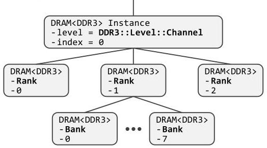
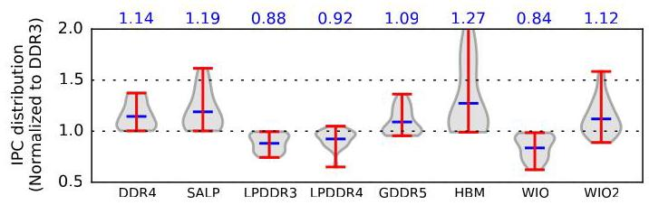

# Ramulator: A Fast and Extensible DRAM Simulator 深度解读

> **作者**：Yoongu Kim, Weikun Yang, Onur Mutlu  
> **会议/期刊**：IEEE Computer Architecture Letters, 2015  
> **一句话总结**：Ramulator 把 DRAM 标准抽象成可重配置的 state-machine 层次树，并用标准相关的 lookup-table 填充行为细节，从而在支持多种 DRAM 标准和学术提案的同时，保持比当时主流模拟器更高的仿真速度。

## 一、问题定义

这篇论文解决的是 DRAM 研究工具的基础设施问题。2010 年前后，DRAM 设计空间快速分化：一方面有 DDR3 到 DDR4、LPDDR3 到 LPDDR4 这类商用标准演进，另一方面有 WIO/HBM/HMC 等 3D-stacked 或高带宽接口，还有 SALP、TL-DRAM、RowClone、SARP、AL-DRAM 等学术架构提案。研究者要判断这些设计的性能、功耗和系统影响，通常依赖 cycle-accurate DRAM simulator，但当时常用工具的可扩展性跟不上标准变化。

已有模拟器的主要问题不是不能模拟 DRAM，而是把某一个标准的组织结构、时序约束和命令行为硬编码进实现里。DRAMSim2 支持 DDR2/DDR3，USIMM 主要支持 DDR3，gem5 当时的 WIO 模型还不是 cycle-accurate。对于想评估新标准或新架构的研究者来说，扩展这些代码意味着追踪分散在大量 for-loop 和 if-condition 中的标准细节，既慢又容易出错。

因此，本文的问题可以表述为：如何构建一个既 cycle-accurate、又容易扩展到不同 DRAM 标准的模拟器，并且不因为泛化设计牺牲仿真速度？

**动机评估**：动机是 solid 的。论文用 Table 1 展示了 DRAM 标准和架构提案的多样化，用 Table 2 对比了当时模拟器的支持范围，问题不是凭空构造的。尤其是 DRAM 标准之间既有层次结构差异，也有命令、状态、时序参数差异，确实会让硬编码模拟器难以复用。论文的弱点在于篇幅较短，对工业界内部模拟器的情况无法覆盖，但对公开学术工具生态的诊断是充分的。

**核心 Insight**：DRAM 可以被抽象为一棵 hierarchy of state-machines：层次结构由标准决定，每个节点的行为也由标准决定；模拟器通用框架只负责遍历、查询和更新 state-machine，具体标准则集中编码成少量 lookup-table。这个 insight 把“支持新 DRAM 标准”的问题从改写模拟器控制流，转化为填写或修改标准描述表。

## 二、相关工作

论文对相关工作的组织方式很直接：先梳理 DRAM 标准和架构设计空间，再梳理可用模拟器。

第一类是 DRAM standards and architectures。Table 1 按应用和设计目标分为 commodity、low-power、graphics、performance、3D-stacked 和 academic。commodity 包括 DDR3/DDR4，low-power 包括 LPDDR3/LPDDR4，graphics 包括 GDDR5，3D-stacked 包括 WIO/WIO2/MCDRAM/HBM/HMC，academic 包括 SALP、TL-DRAM、RowClone、SARP、AL-DRAM 等。这一分类说明目标工作不是只服务某个单点标准，而是服务快速扩张的 DRAM 设计空间。

第二类是 DRAM simulators。Table 2 将它们分为 standalone 和 integrated。standalone 包括 DRAMSim2、USIMM、DrSim、NVMain；integrated 包括 GPGPU-Sim、McSimA+、gem5。论文指出这些工具大多只覆盖一到少数几个标准，且扩展方式依赖对现有代码结构的深入理解。它们的主要不足不是功能完全缺失，而是标准细节和模拟器核心逻辑耦合太紧。

Ramulator 的定位因此很清楚：它不是提出新的 DRAM 架构，而是提出一个更适合评估“当前和未来 DRAM 系统”的模拟器框架。相比相关工具，它的差异点是把可扩展性作为 first-class citizen，同时仍要证明仿真性能不低于专门化实现。

## 三、技术挑战

**挑战 1：不同 DRAM 标准的层次结构不同。** DDR3 可以抽象成 channel/rank/bank/row/column 等层次，DDR4 引入 bank group，HBM/WIO 又有内建多 channel 或更宽总线。模拟器如果为每一层写独立类，很容易在新增标准时扩散修改。

**挑战 2：标准行为既包括状态转换，也包括时序约束。** DRAM 命令是否合法，取决于当前 rank/bank/row 状态、之前命令的时间，以及标准定义的 timing parameters。单纯抽象层次树不够，还必须表达 command prerequisite、status transition 和 earliest issue time。

**挑战 3：内存控制器会高频查询命令可发性。** 调度器在每个周期可能检查多个 pending request。若泛化设计让 `check()` 变成复杂规则解释器，扩展性会换来明显 runtime 开销，失去模拟器的实用价值。

**挑战 4：正确性验证困难。** cycle-accurate DRAM simulator 必须保证不违反标准时序和命令序列。新标准扩展越多，分散修改越多，越难审查是否引入非法命令序列。

**挑战 5：工具需要可嵌入不同使用场景。** 研究者既可能用 standalone trace 做快速比较，也可能把 DRAM 模型接入 gem5 这类 execution-driven simulator。接口设计不能只适配一种评估方式。

## 四、解决方案

### 整体思路

Ramulator 的核心设计是把 DRAM 系统拆成两部分：标准无关的通用 state-machine 框架，以及标准相关的表驱动描述。通用框架由 `DRAM.h` 提供，它用模板参数 `T` 接收具体标准类，例如 `DDR3` 或 `DDR4`；标准类则定义层次级别、命令集合、状态集合，以及 `prerequisite`、`transition`、`timing` 三类 lookup-table。这样，模拟器的树遍历和状态更新逻辑可以复用，而不同标准的差异集中在一处。

Figure 1 展示了这个抽象的关键：同一种 `DRAM<DDR3>` 节点可以扮演 channel、rank 或 bank，区别只是 `level` 和 `index` 属性不同。这个设计避免了为 `DDR3_Channel`、`DDR3_Rank`、`DDR3_Bank` 写一组互相绑定的类，也让新增层次更像是扩展枚举和表项，而不是重写对象模型。

### 贯穿示例

可以用一个 DDR3 read request 贯穿 Ramulator 的流程。假设 memory controller 收到一个读请求，目标地址映射到某个 channel、rank、bank 和 row。控制器并不直接发 `RD` 命令，而是先从根节点调用 `decode(RD, addr)`。如果目标 bank 还没打开对应 row，`decode()` 会返回 prerequisite command，例如 `ACT`；如果 rank 处于 power-down，可能需要先 power-up；如果要 refresh 且 bank 仍 open，rank 级别的 prerequisite 表项会返回 `PREA`。

当 prerequisite 都满足后，控制器调用 `check(cmd, addr, now)`。这里 `check()` 只检查受影响节点上的 `horizon[cmd] <= now`，也就是当前周期是否已经越过该命令最早可发时间。通过后，控制器调用 `update(cmd, addr, now)`，真正把命令作用到状态树上：一方面根据 `transition` 更新节点 status，另一方面根据 `timing` 更新相关命令的 horizon。于是，一条 read request 被分解成“先补齐前置命令，再检查时序，再更新状态”的标准流程。

### 关键技术点

**可重配置层次树。** `DRAM<T>` 节点保存 parent、children、level 和 index。具体标准只需在 `T::Level` 中定义有哪些层级。由于 row 数量可能达到数万，Ramulator 不实例化 row 及以下节点，而是用 bank 里的 `leaf_status` 稀疏记录 row 状态，这是在保持抽象一致性的同时降低内存开销。

**三个标准无关函数。** 每个节点暴露 `decode()`、`check()`、`update()`。它们递归穿过树，只访问目标地址对应路径或相关节点。控制器看到的是统一 API，不需要知道某个标准的层次和命令细节。

**三个标准相关 lookup-table。** `prerequisite` 表回答“某命令在某层级和状态下是否需要先发其他命令”；`transition` 表回答“某命令会触发哪些状态变化”；`timing` 表回答“某命令之后，哪些命令需要等到什么时间”。论文用 refresh 示例说明：rank-level 的 REF 如果发现任一 bank open，就先返回 `PREA`，否则返回 `REF`。

**轻量化 `check()`。** `check()` 不再解释完整标准规则，而只读本地 `horizon` 表并比较当前周期。复杂工作放到 `update()` 中，因为 update 最多每周期一次，而 check 可能每周期多次。这是论文同时追求扩展性和速度的关键工程决策。

**统一 memory controller 和外部接口。** Ramulator 提供 read/write/maintenance 三类队列，支持 refresh、powerdown、selfrefresh 等维护请求，并暴露接收请求和完成回调两个接口。它既可以 standalone 使用 trace，也可以集成到 gem5。

### 与已有方案的对比

相比 DRAMSim2、USIMM 等模拟器，Ramulator 的优势是标准差异集中在标准类和表项里。论文给出的 DDR4 扩展示例很有代表性：从 DDR3 复制到 DDR4 后，核心变化包括在 level 中添加 BankGroup，并修改 20 个 lookup-table entries，其中 prerequisite 1 个、transition 2 个、timing 17 个；总修改量是几十行级别。这说明它把扩展成本从“理解并修改整个模拟器控制流”压缩成“局部填写标准差异”。

它的不足也来自同一个设计。首先，论文验证最严格的是 DDR3，其他标准因为缺少对应 Verilog model，只能依赖从 DDR3 小步修改和人工审查来增强信心。其次，lookup-table 设计适合表达标准化 DRAM 命令和时序，但对于非常规控制器策略、非标准物理效应或详细功耗/热模型，仍需要额外模块配合。最后，论文篇幅短，对复杂集成场景下的接口成本没有展开。

## 五、实验评估

### 实验设定

论文的实验分三组：正确性验证、模拟速度比较、跨 DRAM 标准研究。

正确性验证使用一个 synthetic memory trace，包含 10M memory requests。大多数请求是 read/write，比例为 9:1；地址模式混合 random 和 sequential，比例为 10:1；少量请求包含 refresh、power-down 和 self-refresh。作者收集 Ramulator 产生的 timestamped command log，并送入 Micron DDR3 Verilog model 做 RTL simulation。整个 RTL simulation 约 10 小时。

性能比较使用五个 standalone simulators：Ramulator、DRAMSim2、USIMM、DrSim、NVMain。所有模拟器配置为 DDR3-1600，输入两条 100M request traces：Random 和 Stream，read:write=9:1。指标包括 simulated cycles、runtime、request throughput 和 memory consumption。

跨标准研究使用 9 个 DRAM standards：DDR3、DDR4、SALP、LPDDR3、LPDDR4、GDDR5、HBM、WIO、WIO2。工作负载来自 22 个 SPEC2006 benchmark 的 instruction traces，并输入 Ramulator 自带的简化 CPU model。论文把 IPC 归一化到 DDR3 baseline。

### 主要实验与结论

**正确性验证。** 在 Micron DDR3 Verilog model 中运行约 10 小时后，没有报告时序或命令序列 violation。这说明 Ramulator 的 DDR3 模型至少不会“过早”发出非法命令。作者也诚实指出，该方法不能证明命令不会发得过晚，也不能直接覆盖缺少 Verilog model 的其他标准。

**模拟速度。** Table 3 是论文最强的定量证据。Random trace 中，Ramulator runtime 为 752 秒，DRAMSim2 为 2030 秒，USIMM 为 1880 秒，DrSim 为 18109 秒，NVMain 为 6881 秒；Stream trace 中，Ramulator 为 249 秒，DRAMSim2 为 876 秒，USIMM 为 750 秒，DrSim 为 12984 秒，NVMain 为 5023 秒。换算为作者报告的结论，Ramulator 相比次快模拟器分别有约 2.5x 和 3.0x speedup。

**内存占用。** Ramulator 最大内存占用 2.1MB，低于 USIMM 的 4.5MB 和 NVMain 的 4230MB，但高于 DRAMSim2 的 1.2MB、DrSim 的 1.6MB。结合其扩展性，这个内存开销很小，说明模板化和表驱动没有带来明显空间代价。

Figure 2 展示了跨标准 IPC 分布。图上方的几何均值显示：DDR4 为 1.14，SALP 为 1.19，LPDDR3 为 0.88，LPDDR4 为 0.92，GDDR5 为 1.09，HBM 为 1.27，WIO 为 0.84，WIO2 为 1.12。这个图不是为了证明某个 DRAM 标准绝对最好，而是展示 Ramulator 可以用同一框架横向比较不同标准：高带宽 HBM 平均收益最大，SALP 在不提升峰值带宽的情况下也能显著改善 bank conflict serialization，低功耗/嵌入式取向的 LPDDR 和 WIO 则平均性能较低。

### 结论支撑性分析

实验基本支撑了论文的核心声明：Ramulator 可扩展且速度快。可扩展性由 DDR4 扩展示例和多标准支持列表支撑；速度由 Table 3 的 runtime/throughput 支撑；工具价值由 Figure 2 的跨标准研究支撑。相对薄弱的是正确性覆盖面：DDR3 有 Verilog reference 检查，其他标准主要依赖代码结构和小规模修改降低错误概率。对于一篇短篇 CAL 论文，这个证据强度可以接受，但若作为长期基础设施，后续仍需要更系统的标准一致性测试。

## 六、附加洞察

**结论 1：把 `check()` 做轻量，比把所有函数都做“对称抽象”更重要。**  
*出处*：Section 2.3。  
*推理链条*：memory controller 每周期可能检查多个请求是否可调度，因此 `check()` 调用频率高；如果每次都解释 prerequisite、transition、timing 全套标准规则，泛化开销会被放大；Ramulator 让 `update()` 维护 `horizon`，让 `check()` 只比较 `horizon[cmd] <= now`，因此把热路径压到常量级表查询。这是论文速度结果背后的关键实现判断。

**结论 2：Ramulator 的正确性验证实际上只证明了“不会过早发命令”的一半性质。**  
*出处*：Section 4.1 footnote 4。  
*推理链条*：Micron Verilog model 会报告命令过早导致的标准 violation；实验没有 violation，因此 DDR3 命令序列合法性得到支持；但 Verilog model 不会告诉模拟器某条命令是否可以更早发出，因此不能证明控制器时序最优或没有保守延迟。这限制了“cycle-accurate”结论的解释范围。

**结论 3：跨标准比较的主要价值是方法论展示，而不是给 DRAM 标准排名。**  
*出处*：Section 4.3 / Figure 2。  
*推理链条*：作者用 reasonable configurations 和简化 CPU model 对 9 个标准做归一化 IPC 比较；图中 HBM、SALP、DDR4 等有不同收益，但结果依赖配置、benchmark 和简化系统模型；因此最稳妥的结论是 Ramulator 可以快速产生横向研究，而不是 HBM 或 SALP 在所有系统中绝对优越。

**结论 4：论文把功耗能力放在工具接口层，而不是作为本文主要贡献实证。**  
*出处*：Introduction 的贡献列表。  
*推理链条*：作者说明部分标准可借助 DRAMPower 后端报告功耗；但实验章节主要展示正确性、速度和 IPC，对功耗模型精度没有系统评估；因此本文的主要贡献应理解为性能/结构模拟框架，功耗支持是实用附加功能。

## 七、总结与评价

Ramulator 的最大贡献是把 DRAM simulator 的扩展问题工程化地拆开：通用树和操作流程留在框架里，标准差异收敛到层次枚举和 lookup-table。这个设计解释了为什么它能支持 DDR3/4、LPDDR3/4、GDDR5、WIO1/2、HBM 以及多个学术提案，也解释了为什么它没有因为泛化而变慢。

论文最亮的地方是抽象粒度抓得准：state-machine hierarchy 足够贴近 DRAM 标准，又足够通用；`horizon` 把时序检查变成热路径上的廉价比较，是一个很务实的性能优化。最大不足是验证覆盖有限，尤其是对非 DDR3 标准缺少 reference model 级别的证据。此外，论文没有深入讨论复杂控制器策略、功耗/热模型和 gem5 集成后的系统误差。

从今天回看，这篇论文的价值不只在具体数据，而在工具设计原则：模拟器如果要服务快速变化的硬件设计空间，就应该把“可扩展的标准描述”和“高频仿真内核”明确分层。

## 八、章节脉络与段落速览

- **Abstract**：提出 Ramulator 是一个快速、cycle-accurate、从设计上支持扩展的 DRAM simulator，支持多种商用标准和学术提案，并比次快模拟器快 2.5x。

- **Section 1 · Introduction**：说明 DRAM 设计空间快速扩张，而已有模拟器支持范围有限且标准细节硬编码严重。
  - 第 1 段：列举 DDR4、LPDDR4、WIO、HMC/HBM 和学术提案，说明 DRAM 标准和架构正在快速多样化。
  - 第 2 段：指出 DRAM simulator 应该支撑这些设计评估，但 DRAMSim2、USIMM 等工具只支持少数标准，扩展困难。
  - 第 3 段：引出 Ramulator 的核心抽象，即把 DRAM 建模为由具体标准规定层次和行为的 state-machine hierarchy。
  - 第 4 段：强调模块化和 lookup-table 让 Ramulator 同时具备扩展性和速度，并概述主要贡献。
  - 贡献列表：总结 Ramulator 支持的标准范围、DRAMPower 后端、外部 API、standalone/gem5 两种形态、C++11 和 BSD license。

- **Section 2 · Ramulator: High-Level Design**：用 DDR3 案例解释 Ramulator 如何表示层次树、节点行为和表驱动状态机。
  - 开头段：说明本节以 DDR3 为例，依次讲 hierarchy、behavior 和 state-machine implementation。
  - **2.1 · Hierarchy of State-Machines**：说明 `DRAM<T>` 模板如何通过 parent/children/level/index 形成树，并用 `DRAM<DDR3>` 表示 channel/rank/bank 等层次。
    - 第 1 段：介绍 Code 1 中通用 `DRAM` 类和 `DDR3` specialization 的关系。
    - 第 2 段：解释 Figure 1 的树结构，以及 memory controller 如何通过根节点触发沿地址路径的遍历。
  - **2.2 · Behavior of State-Machines**：定义节点状态和三个递归函数。
    - States 段：说明节点包含 `status` 和 `horizon`，前者表示当前状态，后者表示各命令最早可发时间，并提到 `leaf_status` 是 row 状态优化。
    - Functions 段：说明 `decode()`、`check()`、`update()` 是控制器服务请求的统一接口。
    - `decode()` 条目：解释读请求可能需要先发 power-up 或 activate 等 prerequisite command。
    - `check()` 条目：解释即使没有 prerequisite，也必须检查当前周期是否满足 timing。
    - `update()` 条目：解释通过检查后，更新 affected nodes 的 status/horizon 即表示发出命令。
    - Code 2：给出状态、命令和三个函数的代码骨架。
  - **2.3 · A Closer Look at a State-Machine**：解释标准细节如何编码进 lookup-table。
    - 开头段：提出 `prerequisite`、`timing`、`transition` 三张表分别回答前置命令、时序参数和状态转换问题。
    - Decode 段：用 rank-level refresh 示例说明 `prerequisite` 表如何返回 `PREA` 或 `REF`，以及 `MAX` sentinel 如何驱动递归继续。
    - Code 3：展示 `decode()` 查询 prerequisite 表和 DDR3 REF lambda 的代码结构。
    - Check & Update 段：说明 `update()` 查询 transition/timing 更新 status/horizon，而 `check()` 只做 horizon 比较以保持高频路径轻量。

- **Section 3 · Extensibility of Ramulator**：证明表驱动设计如何降低新增标准成本。
  - 第 1 段：用 DDR4 扩展示例说明从 DDR3 复制后，只需添加 BankGroup 并修改 20 个 lookup-table entries，体现标准差异被局部化。
  - 第 2 段：说明统一 memory controller 维护 read/write/maintenance 队列，并通过同一套 state-machine 函数服务所有标准。

- **Section 4 · Validation & Evaluation**：评估正确性、速度和跨标准研究能力。
  - 开头段：说明 Ramulator 接收外部 memory request stream，提供 standalone trace 和 gem5 integrated 两种模式，本节聚焦 standalone。
  - **4.1 · Validating the Correctness of Ramulator**：用 10M synthetic trace 和 Micron DDR3 Verilog model 验证命令序列合法性。
    - 主段：说明请求比例、地址模式、维护请求、timestamped command log 和约 10 小时 RTL simulation，并报告无 violation。
    - 脚注段：说明排除 ZQ calibration/mode-register set，并指出验证只能证明命令不会过早发出。
  - **4.2 · Measuring the Performance of Ramulator**：用 100M Random/Stream traces 对比五个 standalone simulator。
    - 主段：解释 DDR3-1600 配置、四类指标，并总结 Ramulator 在 runtime 和 throughput 上最好，Random/Stream 分别约 2.5x/3.0x 快于次快模拟器。
    - Table 3：给出 cycles、runtime、req/sec 和 memory consumption 的具体数据。
  - **4.3 · Cross-Sectional Study of DRAM Standards**：用 22 个 SPEC2006 traces 比较 9 个 DRAM 标准。
    - 第 1 段：说明标准配置和简化 CPU model。
    - Table 4：列出各标准的数据率、时序、总线宽度、rank 和带宽。
    - Figure 2 段：总结 DDR4/SALP/HBM 等平均收益，LPDDR/WIO 等低功耗标准平均性能较低，并强调这些只是 Ramulator 可支持分析的一小部分。

- **Section 5 · Conclusion**：总结 Ramulator 是面向当前和未来 DRAM 系统的快速、cycle-accurate 模拟工具，核心优势是效率、扩展性和广泛标准支持。

- **References**：列出 Ramulator 源码、DRAMPower、gem5、各 DRAM 标准、已有模拟器和相关 DRAM 架构提案。
