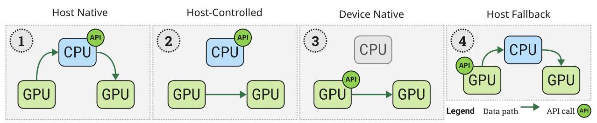
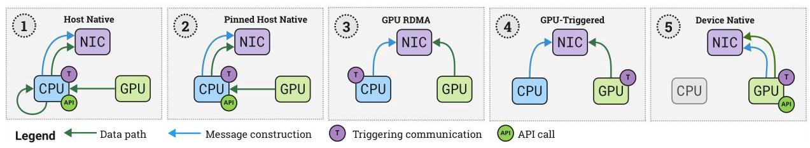
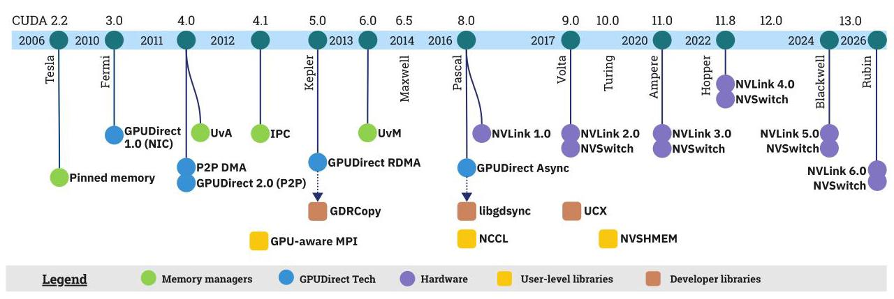
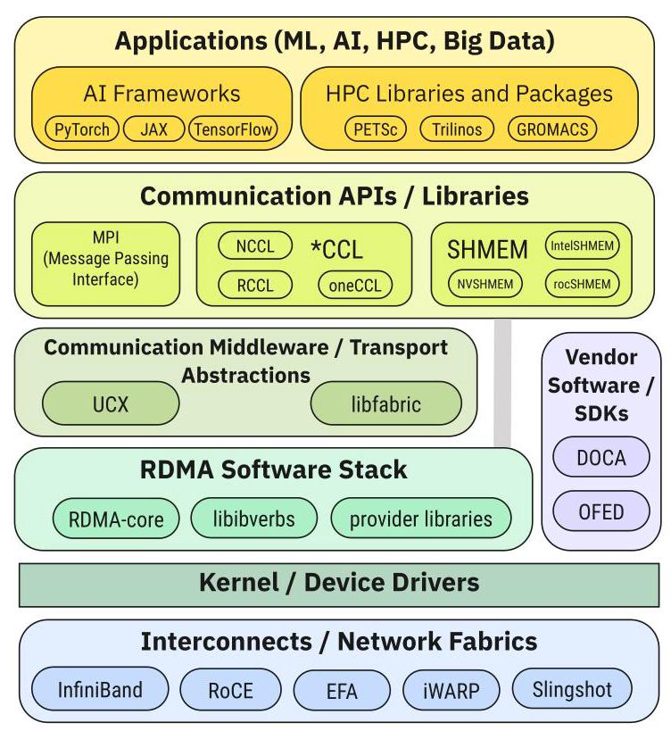
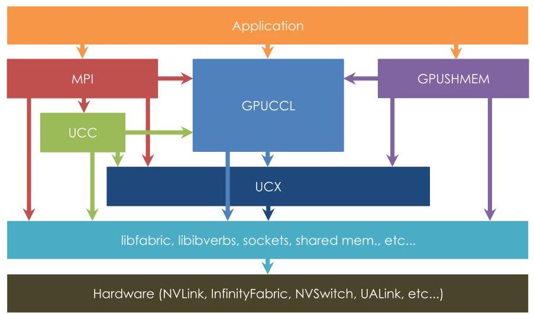

# The Landscape of GPU-Centric Communication 深度解读

> **作者**：Didem Unat, Ilyas Turimbetov, Mohammed Kefah Taha Issa, Dogan Sagbili, Flavio Vella, Daniele De Sensi, Ismayil Ismayilov  
> **会议/期刊**：ACM Computing Surveys, 2026  
> **一句话总结**：这篇综述把 GPU-centric communication 从底层 vendor mechanisms 到 MPI、GPUCCL、GPUSHMEM 等用户级库系统地串起来，核心观点是多 GPU 通信正在从 CPU 控制的“外部搬运”转向 GPU 能够参与甚至主导数据路径和控制路径的执行模型。

## 一、问题定义

这篇文章解决的不是某一个新系统的性能问题，而是一个领域认知问题：多 GPU 系统中的通信栈已经快速演化，但术语、硬件机制、运行时库和研究原型混在一起，导致使用者很难判断“GPU-centric communication”到底指什么、哪些能力已经成熟、哪些仍然依赖特定厂商或实验性硬件。

背景上，GPU 已经成为 HPC 和 ML 的主要算力来源。论文指出，截至 2025 年 11 月，Top500 前 10 台超算中有 9 台依赖 GPU 集群；但 GPU 数量增长后，GPU 间通信会迅速成为 strong scaling 和大模型训练的瓶颈。传统 CPU-centric 模式下，CPU 负责发起通信、同步流、准备 NIC 操作，GPU 多数时候只是被动提供数据缓冲区。这种模型在粗粒度 bulk-synchronous 程序里还能工作，但在细粒度 halo exchange、graph traversal、persistent kernel、LLM collective 等场景中，CPU 发起延迟和 stream 语义不匹配会直接破坏 overlap。

本文属于“非 First 类型”的综述工作：它不是首次提出 GPU 直接通信，也不是首次实现 CPU-free networking，而是把已经分散在 GPUDirect、NVLink/NVSwitch、ROCm RDMA、CUDA-aware MPI、NCCL/RCCL/oneCCL、NVSHMEM/ROC_SHMEM/Intel SHMEM、UCX/UCC 等技术中的概念重新归类。它的切入点是：现有讨论常把“CPU-side/GPU-side”简单二分，但实际通信路径由 API 发起位置、数据路径、消息注册者、NIC doorbell 触发者等多个维度共同决定。

**动机评估**：动机是 solid 的。论文不仅给出宏观趋势，还指出了具体技术矛盾：GPU 算力和 HBM 带宽持续增长，跨 GPU/跨节点通信却仍可能被 CPU kernel launch、host staging、stream synchronization、GPU-NIC consistency、拓扑异构性限制。综述的价值在于把这些矛盾放在同一个坐标系里，而不是把它们分散理解为某个库或某个厂商 API 的局部问题。

**核心 Insight**：GPU-centric communication 的关键不是“数据有没有经过 CPU”这一单点，而是 CPU 是否仍在通信 critical path 上。论文因此把通信拆成 API、data path、register/construct messages、trigger communication 等维度：只优化 data path 的 GPUDirect RDMA 仍可能让 CPU 控制消息准备和触发；只有当 GPU 能在 kernel 内触发通信、同步通信、处理一致性，才接近真正的 device-native execution。

Fig. 1 的价值在于把 intra-node 通信从“有没有 P2P”细化为四类：host native、host-controlled、device native、host fallback。这个图提醒读者，同样是 GPU buffer 通信，API 位置和实际数据路径可能不同，性能和可编程性也会不同。

## 二、相关工作

论文对相关工作的组织方式本身就是它的主要贡献。它没有按时间线简单罗列，而是按栈层次和通信语义分成几类。

第一类是 vendor mechanisms，也就是底层硬件、驱动和 runtime 能力。包括 pinned memory、UVA、IPC、UVM 这类 memory management mechanisms，也包括 GPUDirect 1.0、GPUDirect P2P、GPUDirect RDMA、GPUDirect Async、GPUNetIO，以及 NVLink/NVSwitch、AMD Infinity Fabric/xGMI、Intel Xe-Link 等互连。这些机制不是用户通常直接调用的高级通信库，但它们决定了高层库能否绕过 host staging、能否跨进程访问 device buffer、能否让 NIC 直接读写 GPU memory。

第二类是 GPU-aware MPI。MPI 是 HPC 的事实标准，GPU-aware MPI 的关键改进是让 MPI 能识别 device pointer 并选择 GPUDirect RDMA、CUDA IPC、UCX transport 等路径，避免显式 host buffer。但 MPI 的核心短板是缺乏 GPU stream 语义：MPI call 不能自然排入 CUDA/HIP stream，常常需要 CPU blocking synchronization，削弱 kernel launch pipelining 和通信计算重叠。

第三类是 GPU-centric collectives，即 NCCL、RCCL、oneCCL 以及 UCC、MSCCL、HiCCL、AutoCCL、PCCL 等变体。NCCL/RCCL 更接近 GPU-kernel-driven collective，把通信和 reduction 等计算融合到 GPU kernel 中；oneCCL 更偏 middleware，依赖 CPU workers、SYCL/Level Zero queue、MPI/libfabric 后端。论文强调，collective performance 不只由算法决定，还由拓扑、channel 数量、chunking、transport backend、GPU/NIC/CPU 进度模型共同决定。

第四类是 GPUSHMEM，包括 NVSHMEM、ROC_SHMEM 和 Intel SHMEM。它们采用 PGAS/one-sided put-get 模型，允许 device-side API，把通信嵌入 GPU kernel。相对于 MPI/NCCL 的 host-side API，GPUSHMEM 更适合细粒度、动态通信，但也引入 symmetric heap、cooperative launch、persistent kernel 资源占用、profiling 困难等问题。

第五类是更前沿的研究方向：CPU-free networking、broader GPU autonomy、collective algorithm synthesis、debugging/profiling/race detection、compression-accelerated communication。它们说明 GPU-centric communication 已经不只是“更快的 copy”，而是在重塑 GPU 与 NIC、runtime、compiler、storage、tooling 的边界。

## 三、技术挑战

**术语和分类过粗**。很多工作把通信简单说成 CPU-side 或 GPU-side，但这会掩盖关键差异。比如 GPU-aware MPI 可以直接传 device pointer，但 API 和 trigger 仍在 CPU；GPUDirect RDMA 让 NIC 直接访问 GPU memory，但消息注册和同步仍可能依赖 CPU；NVSHMEM device API 能从 kernel 内发起 put/get，但跨节点时是否 CPU-free 取决于 IBGDA 或 proxy thread。

**intra-node 与 inter-node 的复杂度不同**。单节点内主要看 API 发起方和 data path，跨节点还要处理 NIC message construction 和 doorbell trigger。论文把 inter-node 分成 host native、pinned host native、GPU RDMA、GPU-triggered、device native 五类，说明 GPU-centric 的推进路径是逐步把 data movement、message preparation、communication triggering 从 CPU 移到 GPU。

Fig. 2 显示 inter-node 场景比 intra-node 更难，因为 NIC 参与后，优化 data path 只是第一步；真正低延迟场景还要减少 CPU 对消息准备、触发和完成检测的参与。

**stream 语义不匹配**。GPU runtime 依赖 streams 保证操作顺序并隐藏 kernel launch latency，而传统 MPI 没有 stream 参数。程序员为了保证数据正确性，往往要在 MPI call 前后同步 GPU stream，导致原本可流水化的 kernel 和通信变成交替执行。

**通信与计算争用 GPU 资源**。Direct Load/Store、device-side NVSHMEM、GPUCCL kernel 都可能使用 GPU threads 做通信。这样可以去掉 CPU，但通信和计算会争用 SM、register、shared memory、thread block slot。persistent kernel 尤其明显：如果需要 cooperative launch 或 global barrier，硬件 oversubscription 受限，调度责任从硬件转移给程序员或 runtime。

**GPU-NIC consistency 是 CPU-free networking 的硬约束**。GPUDirect RDMA 可以让 NIC 直接读写 GPU memory，但 NVIDIA 体系中 kernel 运行期间 GPU 与 NIC memory consistency 没有天然保证，常需要回到 CPU 或调用 cudaDeviceFlushGPUDirectRDMAWrites()。ROC_SHMEM 在 AMD 体系中集成了设备侧一致性修复，这是论文认为 ROC_SHMEM 更接近完全 CPU-free 的重要原因。

**拓扑异构性使 collective 算法难以泛化**。论文给出两个数字：同一节点内 GPU pair 带宽可相差最高 4x，intra-node 与 inter-node 带宽可相差最高 10x。collective 算法还要适配 NVSwitch、xGMI multi-tile、Xe-Link、multi-NIC 等拓扑，线性规划式最优算法搜索在 128 节点规模甚至可能需要 11 小时，难以运行时泛化。

**工具链不足**。NSight Systems 等工具擅长看 host-controlled communication，但对 Direct Load/Store、NCCL/NVSHMEM 诱发的 device-native transfer 观察不足；race detector 多数只覆盖单 GPU 或 on-chip shared memory，无法捕捉多 GPU PGAS 模型中的跨设备 race。

## 四、解决方案

### 整体思路

论文的解决方案是构建一张多层次地图：先定义 GPU-centric communication，再分别讨论底层 vendor mechanisms、用户级库、库之间的交互关系和未来研究问题。它没有提出一个统一 API，而是给读者一个判断框架：分析某个通信方案时，不要只问“是不是 GPU-aware”，而要问 API 在哪里、data path 经过哪里、消息由谁注册、NIC 由谁触发、同步和一致性由谁保证。

### 贯穿示例

可以用一个 8-GPU 节点加多节点扩展的训练或 stencil 程序贯穿全文。最朴素实现中，每轮迭代先由 GPU 计算，再把边界或梯度拷回 CPU，CPU 调 MPI 或 memcpy，再拷回目标 GPU。这对应 host native 路径，CPU 既在 data path 又在 control path。

如果启用 GPUDirect P2P，单节点内相邻 GPU 可以通过 PCIe、NVLink 或 xGMI 直接移动数据，CPU 不再承载实际数据；但 API 仍可能由 host 发起。这对应 host-controlled。进一步，如果 kernel 内部通过 direct load/store 或 NVSHMEM put/get 访问邻居 GPU buffer，API 和 data path 都移到 device 侧，适合细粒度 halo 或图算法。

跨节点时，GPUDirect RDMA 让 NIC 直接读写 GPU memory，省掉 host staging；但 CPU 仍可能负责注册内存、准备 work queue、触发传输。GPUDirect Async、IBGDA、GPUNetIO、ROC_SHMEM GPU-IB 等机制则继续把 trigger 甚至 message construction 移向 GPU。这样，一个 persistent kernel 可以在计算过程中直接触发远端通信，而不是每一轮都返回 CPU。

### 关键技术点

**1. Vendor mechanisms 是高层库的地基**。Pinned memory 减少 pageable-to-pinned staging；UVA 让 runtime 根据 pointer 判断 memory location；IPC 允许同节点跨进程访问 device buffer；UVM 改善可编程性但可能引入 page migration。GPUDirect P2P、RDMA、Async 分别优化 GPU-GPU data path、GPU-NIC data path、GPU-trigger control path。

Fig. 3 说明 GPU-centric communication 不是单个 API 的突然出现，而是 memory addressing、P2P、RDMA、Async trigger、NVLink/NVSwitch 等能力逐步叠加的结果。理解这个时间线有助于判断某个库为什么在某些硬件上可行、在另一些硬件上退化。

**2. Interconnect 决定 P2P 与 collective 的上限**。NVLink 从 Pascal 到 Blackwell 的总双向带宽从 160 GB/s 提升到 1800 GB/s；Grace Hopper 的 NVLink-C2C 达到 900 GB/s，Grace Blackwell Superchip 宣称 CPU 与两个 Blackwell GPU 间总双向带宽 3.6 TB/s。AMD MI300X 8-GPU 系统的 xGMI aggregate bidirectional inter-GPU bandwidth 为 896 GB/s，但当前 AMD mesh 没有类似 NVSwitch 的 switch-based all-to-all fabric，扩展到 8 GPU 以上更受限。Intel Xe-Link 则提供 Aurora 等系统中的 all-to-all GPU fabric。

**3. 用户级库不是互斥替代，而是语义不同**。GPU-aware MPI 保留 MPI 生态和 two-sided semantics，适合传统 HPC 程序迁移；GPUCCL 面向 collective，尤其是深度学习训练中的 AllReduce、AllGather 等固定模式；GPUSHMEM 用 one-sided PGAS 支持 device-side fine-grained communication。论文的一个清晰判断是：点对点场景 MPI 常常有优势，collective 场景 GPUCCL 常有优势，细粒度 irregular 场景 GPUSHMEM 更自然，但具体结果依赖系统和实现。

**4. 软件栈正在融合**。现代 MPI 常基于 UCX 做 point-to-point、基于 UCC 或 GPUCCL 做 collectives；GPUSHMEM 也可能用 UCX/libfabric/libibverbs 做低延迟点对点，并叠加 GPUCCL 加速 collectives；GPUCCL 可直接接 low-level transport，也可通过插件接 UCX。

Fig. 4 把应用、domain framework、MPI/SHMEM/CCL、UCX/libfabric、kernel driver、fabric 和 vendor stack 放在同一张图里。它说明性能问题常常不是某个 API 单独造成的，而是跨层组合的结果。

Fig. 5 进一步说明高层库之间会互相借力：MPI 可以 offload 到 GPUCCL，GPUSHMEM 可以借助 GPUCCL 做 collective，UCC 可以在 UCX 与 vendor CCL 之间做统一抽象。因此工程选择不是“只选 MPI/NCCL/NVSHMEM 之一”，而是判断哪一层负责哪类通信。

### 与已有方案的对比

相比只介绍 CUDA-aware MPI 或 NCCL 的文档，本文的优势是跨厂商、跨层次和跨语义。它同时覆盖 NVIDIA、AMD、Intel，并明确指出不同厂商能力并不对称：NVIDIA 生态成熟但某些 consistency 问题仍依赖 CPU；AMD ROC_SHMEM 在 persistent kernel 的 GPU-NIC consistency 上更进一步；Intel SHMEM 更贴近 OpenSHMEM 规范和 SYCL 生态，但 inter-node 当前依赖 host proxy。

不足也很明显：作为综述，它没有统一 benchmark，也没有把不同系统放到同一实验平台上复现实测。因此许多性能结论来自不同论文、不同机器、不同 workload，横向比较要谨慎。

## 五、实验评估

### 实验设定

本文没有自建实验平台，而是汇总已有研究的测量结果。它讨论的 baseline 包括 GPU-oblivious MPI、GPU-aware MPI、NCCL/RCCL/oneCCL、NVSHMEM/ROC_SHMEM、UCC、MSCCL、Blink、Aluminum、AutoCCL、PCCL 等。workload 覆盖 CG solver、GROMACS halo exchange、BFS、graph processing、GNN、SpTRSV、LLM training collectives、MFDn nuclear configuration interaction、microbenchmarks 等。指标包括 latency、bandwidth、end-to-end iteration time、training time、strong scaling、CPU involvement、稳定性和可编程性。

### 主要实验与结论

**GPU stream 语义会直接影响应用性能**。在 CG 的研究中，避免 CPU-GPU synchronization、利用 stream 语义可带来 5-15% 的性能提升。这个结果支持论文关于 MPI-stream mismatch 的论点：即使 data path 已经 GPU-aware，control path 和同步方式仍可能限制 overlap。

**不同通信库各有甜点区间**。论文引用的多项比较显示，MPI 在 point-to-point 上常常更强，NCCL/RCCL 等 *CCL 在 collectives 上常常更强；但结果依赖节点数、消息大小、系统互连和库成熟度。AMD 系统上曾出现 MPI 优于 vendor solution 的情况，论文将其归因于当时 vendor software maturity 不足。

**device-side one-sided communication 对 irregular/fine-grained workload 有优势**。GROMACS halo exchange 使用 GPU-initiated NVSHMEM 相比 MPI 最高可达 2x 性能提升；BFS、Bloom filter updates、connected components、GNN 等 irregular workload 也更容易受益于 NVSHMEM 的 PGAS 和 in-kernel communication。

**native GPU collective 能避免 host-staging reduction**。Open MPI 和 Cray MPICH 在未配置 accelerator offload 时，MPI_Allreduce、MPI_Reduce_scatter 可能把数据拷到 host 上用 CPU 做 reduction，再拷回 GPU。MFDn 的研究显示，用 native CUDA kernels 和高性能通信协议替换 MPI/OpenACC baseline，在大规模 network-bandwidth-bound 场景可达到 4.9x speedup。

**新型 collective 优化空间仍很大**。Blink 通过 topology graph 和 packing spanning trees 在图像分类训练中相对 NCCL2 降低 40% training time。MSCCL++ 相比 NCCL 和 MSCCL，小消息分别最高 2.8x 和 1.6x，大消息最高 2.4x 和 2.0x。AutoCCL 通过在线调参在 PCIe 和 NVLink 系统上取得 1.2-1.8x bandwidth improvement，并在 LLM workload 上最高降低 32% end-to-end iteration time。

### 结论支撑性分析

这些证据足以支撑论文的核心定性判断：CPU 从 data path 和 control path 中退出确实能减少延迟和 host synchronization，尤其适用于 latency-bound、fine-grained、irregular 和 collective-heavy 场景。但它们不足以支撑一个统一排序，例如“NVSHMEM 总是优于 MPI”或“NCCL 总是优于 MPI”。论文的谨慎之处在于强调系统依赖性：具体选择要看通信模式、消息大小、拓扑、stream 需求、库成熟度和厂商生态。

## 六、附加洞察

**结论 1**：GPU-centric communication 的成熟组件并不是“hack”，而是现代多 GPU 通信栈的正式地基。  
*出处*：Section 5.8。  
*推理链条*：GPUDirect、GPUDirect RDMA、ROCm P2P、GDRCopy 等能力已被 Open MPI、MVAPICH、UCX、vendor CCL 等广泛采用 -> 它们成为高层库实现 GPU-aware path 的共同依赖 -> 因此用户不应把这些底层能力视为临时优化，而应视为系统设计的基本前提。

**结论 2**：完全 CPU-free 不是单纯加一个 device API 就能实现。  
*出处*：Section 3.2.3、4.3.1、4.3.2、5.1。  
*推理链条*：device-side API 可以让 kernel 发起通信 -> 但跨节点通信还需要 NIC 可见性、message construction、doorbell trigger、GPU-NIC memory consistency -> NVIDIA NVSHMEM IBGDA 仍受 consistency 约束，ROC_SHMEM 明确集成一致性修复 -> 所以 CPU-free 的真正边界在一致性和 progress 保证，而不只是 API 位置。

**结论 3**：GPU threads 做通信是一把双刃剑。  
*出处*：Section 3.5.1、4.4.2、5.1。  
*推理链条*：Direct Load/Store 和 device-side SHMEM 可以内联通信并隐藏 latency -> 但通信和计算共享 SM/thread/register/shared memory -> persistent kernel 和 cooperative launch 会限制 occupancy 与 oversubscription -> 因此它适合 latency-bound 或 fine-grained 场景，但对 compute-bound 程序可能牺牲吞吐。

**结论 4**：collective library 的未来可能更像自适应编译/运行时问题，而不是固定算法库问题。  
*出处*：Section 4.2.2、5.5。  
*推理链条*：拓扑和带宽高度异构，GPU pair 带宽可差 4x，节点内外可差 10x -> 手工或离线求最优 collective 算法成本高，128 节点搜索可达 11 小时 -> MSCCL、AutoCCL、HiCCL 等工作转向 DSL、在线 profiling、层次化 primitive -> 说明 collective runtime 需要根据硬件和 workload 动态选择策略。

**结论 5**：工具链短板会限制 GPU-centric communication 的普及速度。  
*出处*：Section 5.6。  
*推理链条*：device-native transfer 和 PGAS communication 发生在 GPU kernel 内或跨多个 GPU memory space -> 传统 profiler 和 race detector 主要观察 host-controlled 操作或单 GPU 内存 -> 开发者难以定位性能和正确性问题 -> 所以 Snoopie、ucTrace、多 GPU race detector 这类工具可能与通信库本身同等重要。

## 七、总结与评价

这篇综述最大的贡献是给 GPU-centric communication 建立了一个清晰的认知框架：从“CPU 是否参与搬数据”扩展到“CPU 是否参与发起、注册、触发、同步和保证一致性”。这个框架能帮助读者判断 MPI、NCCL、NVSHMEM、UCX、GPUDirect、NVLink 等名词之间的真实关系。

亮点是覆盖面广，且对 NVIDIA、AMD、Intel 的差异没有简单抹平。论文把 ROC_SHMEM 的 GPU-NIC consistency、Intel SHMEM 的 SYCL/OpenSHMEM 兼容、AMD xGMI 的拓扑特点、NVIDIA IBGDA 和 GPUNetIO 的控制路径演进都纳入讨论，适合读者建立跨厂商地图。

不足是综述写法导致性能论证分散，很多结论来自不同论文和系统，不能直接作为工程选型的统一 benchmark。另一个不足是术语偶尔仍然依赖厂商语境，例如 NCCL device API、GPUNetIO、IBGDA 等能力的可用性随版本和硬件变化较快，读者在实际使用前仍需回到官方文档确认平台约束。

总体看，这篇文章适合作为进入多 GPU 通信领域的路线图。它最有价值的启发是：未来的高性能 GPU 系统不会只靠更快互连解决问题，还需要通信语义、运行时调度、一致性、profiling、debugging 和 compiler/runtime 协同演化。

## 八、章节脉络与段落速览

- **Section 1 Introduction**：说明 GPU 集群已成为 HPC/ML 主流，但 GPU 间通信成为 scaling bottleneck，并提出本文要澄清 GPU-centric communication 的概念、机制和库生态。
  - 段1：GPU 由于并行性和高带宽成为主流加速器，Top500 前列系统几乎都依赖 GPU。
  - 段2：多 GPU 计算虽然加速明显，但 GPU 间通信会成为瓶颈，传统模型由 CPU 负责通信。
  - 段3：GPU-centric communication 的目标是减少 CPU 在 critical path 中的参与，让 GPU 更自主。
  - 段4：本文希望消除术语混乱，覆盖硬件互连、软件机制和用户级库。
  - 段5：论文给出 Section 2 到 Section 5 的组织结构。
  - 段6：作者说明会尽量平衡 NVIDIA、AMD、Intel，但也会标出厂商专属能力。

- **Section 2 Terminology and Communication Types**：定义 GPU-centric communication，并分别建立 intra-node 与 inter-node 分类。
  - **2.1 Intra-Node Communication**：用 API 位置和 data path 区分 host native、host-controlled、device native、host fallback。
    - 段1：说明简单 CPU/GPU-side 分类不够精确，需要按通信操作执行者分类。
    - 段2：定义 API 和 data path 两个维度。
    - 段3：结合 Table 1 和 Fig. 1 解释四类 intra-node 通信。
  - **2.2 Inter-Node Communication**：在 API 和 data path 外加入 message registration 与 trigger 两个维度。
    - 段1：指出 inter-node 因 NIC 参与而更复杂。
    - 段2：定义 register/construct messages 和 trigger communication。
    - 段3：说明从 host native 到 device native 的五类跨节点演进。
    - 段4：提醒实际库可能因硬件和配置落入混合路径。

- **Section 3 Vendor Mechanisms**：梳理底层 runtime、memory 和 interconnect 机制如何支撑高层通信库。
  - **3.1 Memory Management Mechanisms**：介绍 pinned memory、UVA、IPC、UVM 及其对减少 staging、跨进程访问和可编程性的影响。
  - **3.2 GPUDirect Technologies**：解释 GPUDirect 1.0 共享 pinned memory、P2P 直接 GPU-GPU 路径、RDMA 的 GPU-NIC 直接路径和 Async 的 GPU-trigger 控制路径。
  - **3.3 GPUNetIO**：介绍 DOCA/BlueField 背景下 GPU 直接发送、接收和处理网络包的能力。
  - **3.4 Modern GPU-centric Interconnects**：比较 NVLink/NVSwitch、AMD Infinity Fabric/xGMI、Intel Xe-Link 的带宽和拓扑特点。
  - **3.5 Discussion on Vendor Mechanisms**：总结 Direct Load/Store 的可编程性收益、资源争用、memory coalescing 敏感性、GPUDirect RDMA consistency 限制和 GPU-triggered execution 的实现方式。

- **Section 4 GPU-Centric Communication Libraries**：比较 GPU-aware MPI、GPUCCL、GPUSHMEM 及其交互关系。
  - **4.1 GPU-Aware MPI**：说明 MPI 如何通过 device pointer awareness、IPC、GDRCopy、GPUDirect RDMA、UCX/UCC 等机制支持 GPU buffer。
  - **4.2 GPU-Centric Collectives**：比较 NCCL、RCCL、oneCCL 的 API、execution engine、topology awareness 和 transport backend，并讨论 Blink、Aluminum、MSCCL、HiCCL、PCCL、AutoCCL 等扩展。
  - **4.3 GPU-centric OpenSHMEM**：介绍 NVSHMEM 的 symmetric heap、device API、IBGDA，ROC_SHMEM 的 GPU-IB 与 consistency 修复，以及 Intel SHMEM 的 SYCL/OpenSHMEM 兼容模型。
  - **4.4 Comparison and Discussion of User-Level Libraries**：从 stream support、host vs device API、编程示例、性能和库间交互五个角度比较 MPI、NCCL 和 GPUSHMEM。

- **Section 5 Discussion, Challenges, and Outlook**：提出未来研究问题和系统演化方向。
  - **5.1 Moving Away from CPU**：论证 CPU-free execution 可减少 latency barrier，但 persistent kernel、occupancy 和 symmetric heap 集成仍是挑战。
  - **5.2 UCX as a Potential Pathway for GPU-Awareness**：把 UCX 作为跨厂商 GPU-aware 通信的可能公共层，同时指出 UCX 仍主要运行在 host 侧。
  - **5.3 CPU-Free Networking**：回顾 GGAS、GPUrdma、GPUNet、dCUDA、GPU-TN、ComP-Net 等把网络栈移向 GPU 的研究。
  - **5.4 Broader GPU Autonomy**：把 GPU-centric communication 放到 GPU 自主访问文件、系统调用、存储、task graph 和 compiler support 的更大趋势中。
  - **5.5 Collective Algorithms Design**：指出复杂拓扑和带宽异构使 collective 算法设计成为 NP-hard 且难以泛化的问题。
  - **5.6 Debugging, Profiling, Benchmarking Support**：说明 profiling、race detection 和 per-iteration benchmark 对 device-native communication 仍不充分。
  - **5.7 Compression-Accelerated GPU Communication**：讨论 error-bounded lossy compression、DOC workflow 限制和 homomorphic compression。
  - **5.8 Level of Maturity and User-Level Perspective**：强调 GPUDirect 等底层能力已经是成熟、正式、广泛采用的通信基础。

- **Section 6 Conclusion**：重申多 GPU 通信正在从 CPU-managed 转向 GPU-autonomous，并总结本文对机制、库、挑战和未来方向的综述价值。
