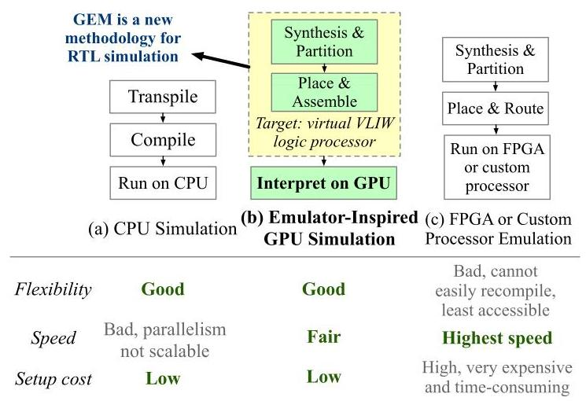
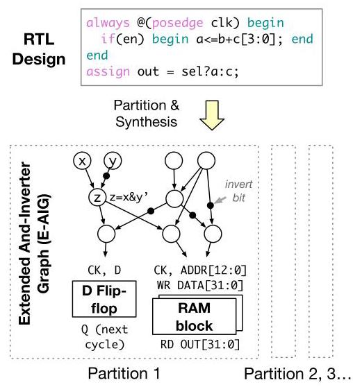
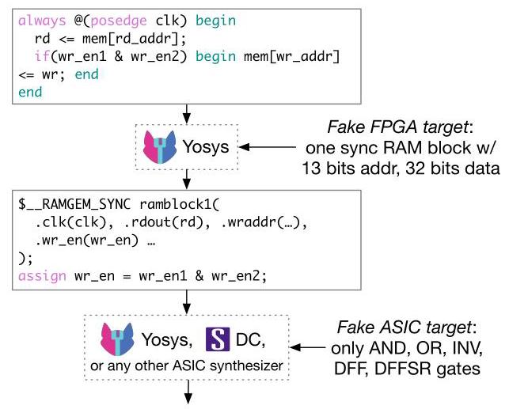
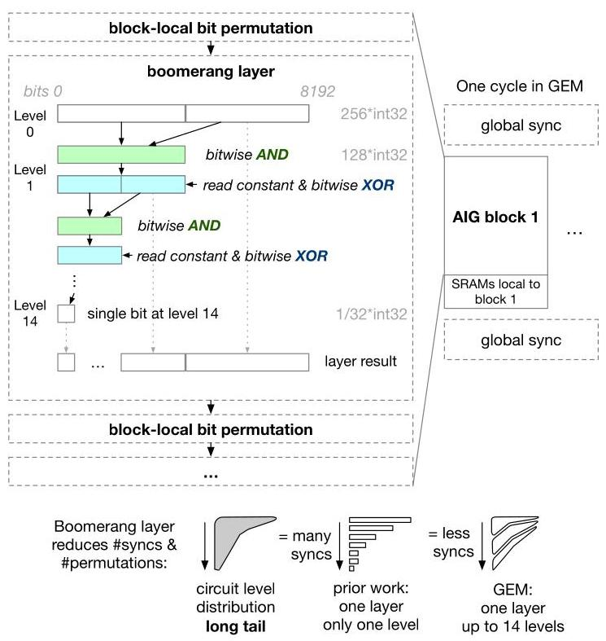
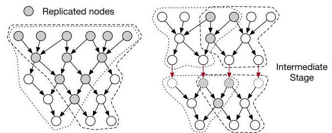
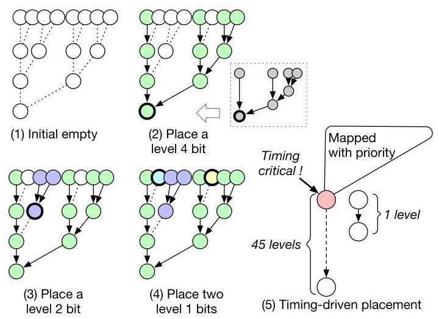
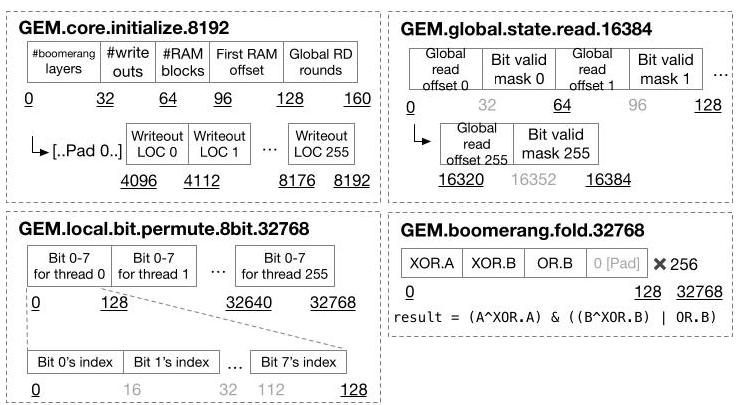

# GEM: GPU-Accelerated Emulator-Inspired RTL Simulation 深度解读

> **作者**：Zizheng Guo、Yanqing Zhang、Runsheng Wang、Yibo Lin、Haoxing Ren  
> **会议/年份**：DAC 2025  
> **一句话总结**：GEM 把 RTL 综合并布局到适配 GPU 的虚拟布尔处理器，用规则的 VLIW 解释执行承载不规则电路，提升单个设计的逐周期仿真速度。  
> **阅读材料**：完整论文经 Doc2X 导出；逐段中英对照见 [translated.md](translated.md)。文中的“作者报告”与“本文评价”分别指论文结论和本报告判断。

## 一、问题定义（Problem）

### 背景与问题来源

RTL（Register Transfer Level，寄存器传输级）描述寄存器、存储器及其间的组合逻辑。一个简化的同步仿真周期，可以理解为读取当前状态和输入、计算组合逻辑，再更新下一周期状态。仿真器要反复执行这一过程，让设计者在流片前检验电路行为。论文关注的速度单位是 Hz，即每秒完成多少个**被仿真的电路周期**，并非 GPU 的硬件时钟频率。

实现这一过程有两种基本取舍。Full-cycle／oblivious 仿真每周期执行整个设计，工作量相对固定；event-based 仿真根据变化传播，仅执行发生变化或受影响的逻辑，低活动率时可以省下大量计算。GEM 采用前一种方式，因此电路规模、逻辑深度和映射质量直接决定每周期成本。

这是已有 RTL 仿真问题上的改进性工作。CPU 仿真器易于使用，但大型设计带来的代码体积、访存和跨线程依赖限制了扩展性；FPGA 或专用处理器 emulator 能利用电路并行性，却需要专用硬件和较长的编译准备时间。GPU 提供现成的并行计算资源，但每个电路分区的功能和连线各不相同，直接把 RTL 变成 CUDA 会遭遇 SIMT 执行不一致和不规则访存。

图 1 展示的是方法定位：CPU 主要执行编译后的软件，硬件 emulator 将设计映射为物理资源，GEM 则将设计映射到一个由 CUDA 解释的虚拟 VLIW 逻辑处理器。图中的速度和成本标签是定性判断；论文没有提供三类方案的采购成本或端到端准备时间对照。

已有 GPU 方法也没有彻底填补这一空白：把门变成查找表（LUT）容易统一线程操作，却引入大量细粒度访存；并行运行多个独立 testbench 可以增加吞吐量，却不能直接缩短一个仿真任务的完成时间。GEM 要解决的是**单个设计、单条仿真轨迹中，如何把异构电路计算变成 GPU 高效执行的规则工作**。

### 动机评估与核心 Insight

**动机总体扎实，但论证强度有层次。** 电路不规则与 SIMT／合并访存之间的冲突有清晰机制解释。III-C 进一步报告，约 50 万门设计切到 216 个分区时，直接复制逻辑的开销超过 200%；增加一个 stage 后，复制开销降至不足 3%。这说明从 CPU 的少量线程搬到 GPU 的大量 thread block，需要重新处理通信与复制的关系。不过，图 1 是概念图，论文没有系统展示逻辑长尾的跨设计统计分布，也没有单独量化所有动机对应的性能损失。

**核心 Insight 是把电路的差异编码进数据布局和控制常量，让 GPU 反复执行同一套布尔运算。** AND 与取反即可表示任意布尔函数；32 位机器字可同时处理 32 个逻辑位；不可避免的不规则连线访问可以尽量放进 block 内的 shared memory。再利用电路“前部宽、尾部深而窄”的形状，把多级逻辑折叠在同一执行层里，就能减少逐级重排和同步。

## 二、相关工作（Related Work）

论文按平台和执行方法组织研究脉络，而非按时间逐篇排列：

| 路线 | 核心思路与代表工作 | 对本文目标的局限／关系 |
|---|---|---|
| FPGA／专用处理器 emulation | 将电路映射到可并行执行的硬件；论文引用 ZeBu、Palladium 等 | 作者介绍其速度可达 1 MHz 或更高，但硬件成本和可能以天计的编译时间妨碍快速迭代；GEM 借鉴其映射思想 |
| CPU 并行 RTL 仿真 | Verilator、低活动率优化、Khronos、RepCut 等，通过分区、调度及数据流／访存优化提高速度 | 代码前端、内存带宽和同步仍构成瓶颈；GEM 直接继承并扩展了 RepCut 的复制辅助分区 |
| GPU 门级仿真 | GCS、GATSPI、GL0AM 等以 LUT 或门级操作统一 GPU 计算 | 门级粒度细，图访问代价大；论文将 GL0AM 作为实际 GPU 基线 |
| RTL 直接转 CUDA | 直接生成 GPU 程序，或用多份独立 stimulus 填满并行维度 | 异构控制流不利于 SIMT；依赖独立测试的批处理路线主要改善吞吐量 |

GEM 仍会把组合逻辑降为门级 E-AIG，因此不能把它概括为“保持 RTL 高抽象粒度就获得加速”。它的变化在于保留原生 RAM、优化逻辑深度，并把门图编排到固定虚拟执行结构中，以字级并行和局部访问控制降级后的成本。论文对既有门级仿真相对 RTL 慢 10–100 倍的描述属于背景概括，不能当成表 II 中 GL0AM 在每个测试上的实测差距。

## 三、技术挑战（Challenges）

1. **计算功能异构。** 不同分区执行不同逻辑，直接逐分区生成 CUDA 不容易让同一 warp 的线程保持相同指令流；需要统一执行模板，同时保留每个逻辑位的功能差异。
2. **依赖图稀疏且连线不规则。** 一个门的输入可能来自任意位置；若每一级都从 global memory 收集输入，GPU 的带宽优势难以兑现。
3. **逻辑深度形成长尾。** 少量深层节点会让按逻辑级启动的并行计算大面积闲置，同时每级仍需付出重排和同步成本。
4. **GPU 分区粒度放大逻辑复制。** 减少跨 block 依赖可以通过复制公共扇入实现，但分区数上升会迅速增加重复工作；完全消除中间通信未必划算。
5. **虚拟硬件的约束是宽度与深度。** 每个分区必须放入 8192 位的执行结构，单纯平衡门数量无法保证可映射；综合与布局也必须压低执行层数。
6. **RAM 与执行格式必须配合。** 把 RAM 展开为触发器和译码器会膨胀逻辑；保留 RAM 又需要标准接口，使 CUDA 不因各种 RAM 形状而大量分歧。

## 四、解决方案（Solution）

### 整体思路与贯穿示例

GEM 的编译流程为 RTL → E-AIG 综合 → 分区 → boomerang 布局 → VLIW bitstream；执行时由固定 CUDA kernel 解释 bitstream。每个虚拟布尔处理器对应一个 256 线程的 GPU block，维护最多 8192 位局部电路状态，block 内计算组合逻辑并处理所属 RAM，在周期或 stage 边界进行全设备同步。

用一个**教学示例**串起流程：一个小控制器每周期读取同步 RAM，计算两个条件 `u = a & ~b`、`v = u & c`，再由一条较深的控制链决定是否把结果写回寄存器；另一路较浅的逻辑也使用 `u`。这个例子包含 RAM、公共子逻辑、深浅不一的路径和时序状态，但不是论文额外评测的电路。问题是如何让 GPU 既算出这些依赖，又避免为每个小门都进行昂贵访问和同步。

### 1. E-AIG 与两段综合：统一逻辑，保留存储结构

图 2 中的 E-AIG（Extended And-Inverter Graph）用 AND 和取反边表示组合逻辑，同时保留 D flip-flop 和 RAM。这样，示例中的 `u`、`v` 进入布尔图，寄存器负责跨周期状态，RAM 保留为一个较粗粒度模块。原生 RAM 避免将每个存储位和地址选择展开成大量小门。

图 4 对应两段工具流程。第一段为 Yosys 提供一个虚构 FPGA 目标，其 RAM 块具有 13 位地址和 32 位数据；工具据此拆分或适配 RTL RAM，但不继续进行 LUT 映射。第二段提供仅含 AND、OR、INV 和触发器等单元的虚构 ASIC 库，把 AND／OR 延迟设为 1 ps、INV 设为 0 ps，使时序优化转化为逻辑深度优化。这里的 ps 是引导综合的代价模型，不是声称 GPU 上一个门耗时 1 ps。

这一步同时回应 RAM 膨胀和深路径问题：示例 RAM 尽可能变为原生块，控制链尽可能变浅。作者报告商业 ASIC 综合器在第二段优于 Yosys，但没有给出该比较的独立表格。

### 2. Boomerang 执行层：一次规则计算容纳多级逻辑

图 3 的执行层把 8192 位输入组织成可逐步收窄的布尔计算。256 个线程各处理机器字，通过按位 AND 和可配置 XOR 同时计算多组门；不同逻辑位是否取反，由常量中的对应位决定。字级并行在此表示**同一电路中的不同逻辑位并行计算**，不要求 32 份独立 testbench。

执行层内的连线形状预先固定，多个逻辑级可以沿着这一结构继续计算；层间再做 block-local bit permutation，为下一层收集正确的输入。示例中的 `u → v → 深控制链` 可以在一个层中延伸，浅支路则占据尚未使用的位置。各级中间结果也可作为层输出，并非只保留最后的单个位。

作者称一层最多覆盖 14 个逻辑级，并报告 block 内的 permutation 与同步次数减少超过 5 倍。这体现了减少依赖管理次数的收益，但不意味着层内完全没有通信，也不意味着每层始终填满。另需留意，原文同时写“8192 位折叠 14 次到 1 位”；严格二分的算术关系是 8192 = 2¹³，图文对输入层与逻辑级的计数没有充分解释，阅读时宜保留“最多 14 级”为作者的架构描述，不据此推导精确折叠轮数。

### 3. 多 stage 分区：用少量同步换取少量复制

RepCut 允许复制共享逻辑，让不同分区独立计算。对示例而言，两条支路都可各自重算 `u`，避免跨 block 传输这个中间结果。但大量输出共享很深的上游图时，复制到数百个 block 会过度膨胀。

图 5 的多 stage 方案在中间逻辑级建立边界，对每段分别执行 RepCut，允许在边界同步并传递中间结果。作者的约 50 万门实例中，216 个 block 的复制成本由超过 200% 降至不足 3%，代价是一次额外同步。这里的关键是权衡同步与重复计算，不能解读为所有跨 block 通信都被消除了。

随后，Algorithm 1 先过度切分，确保各小分区能够映射，再按与当前分区的逻辑重叠大小尝试合并；仅当合并后仍可映射时接受结果。这把已有 partitioner 的门数目标与 GEM 的 8192 位宽度约束连接起来，同时有机会消除重复逻辑。论文称可保证至少 50% 的有效 bit 利用率，但未提供形式化证明；这一指标也不等于运行时 GPU occupancy 或 ALU 利用率。

### 4. Timing-driven placement：把关键路径尽早放进有限位置

图 6 左侧从一个较深节点出发，递归安放其输入。实际扇入常常不平衡，因此一个节点的依赖锥不必占满完整二叉树，空位还能放入其他节点。旁路通过后续指令中的控制常量实现；这让示例的浅支路和深链能够共享一个执行层。

Algorithm 2 逐层构建 boomerang，完成一层后删除已实现节点并更新剩余图。调度优先级取决于节点在**反向剩余图中的逻辑深度**，即后面还拖着多长的依赖链。图 6 右侧的 45 级后续路径应优先于只有 1 级的路径，否则局部填得很满，最终仍可能留下很长的执行尾巴。这个“timing”服务于减少软件执行层数，并非真实芯片布线时序收敛。

### 5. VLIW bitstream 与 CUDA：把映射结果作为规则数据流读取

GEM 的 VLIW 有 8192、16384 和 32768 bit 三种长度。256 线程分别读取 32、64 或 128 bit，整组形成可合并的全局访问。图 7 中，初始化指令携带执行层数、RAM 数等信息；全局状态读取指令收集分区输入；局部重排指令编码源 bit 位置；折叠指令提供 `XOR.A`、`XOR.B` 和 `OR.B` 控制字。

图中的折叠表达式为 `(A ^ XOR.A) & ((B ^ XOR.B) | OR.B)`：每个位可独立决定输入取反，`OR.B` 还能让 B 侧成为 1，从而旁路该输入。示例中的不同门由常量表达差异，CUDA 执行模板保持一致。宽读取与对齐的数据结构确保 bitstream 访问可以合并；cooperative groups 则在周期和 stage 边界实施设备级同步，避免为这些边界反复启动 kernel。

整体上，GEM 用编译时的综合、复制、布局和编码，换取执行时较规则的指令流与较局部的数据移动。代价是映射流程复杂、full-cycle 无法自然跳过静止逻辑，而且 RAM 语义与逻辑形状会显著影响映射效果。

## 五、实验评估（Experiments）

### 实验设定

映射工具用 Rust 实现，解释器用 CUDA 实现。实验主机配置为 48 个 Intel Xeon Gold 6136 CPU 核心；GEM 分别运行在单张 A100 和单张 RTX 3090 上。CPU 主机拥有 48 核并不表示每项基线都使用 48 线程。

基线包括匿名商业仿真器、Verilator 以及 A100 上的 GPU 门级仿真器 GL0AM。商业工具采用默认单核，原因是其多线程版本在部分测试中不稳定；Verilator 通常使用 5.028，比较单线程与 8 线程。**NVDLA 例外：只有旧版 Verilator 3.912 能正确仿真，且不支持多线程。** 这些配置必须与峰值加速比一起阅读。

工作负载来自设计官方测试，包括 NVDLA 的卷积及相关测试、RocketChip 的 dhrystone／memcpy／pmp／qsort／spmv、Gemmini 的矩阵乘，以及 OpenPiton 派生内部多核设计的三类测试；RocketChip 和 Gemmini 通过 Chipyard 生成 RTL。总计 5 种设计配置、18 行测试，涵盖 CPU 与深度学习加速器，但不构成全面的 RTL 语言特性或工业验证环境覆盖。

### 规模与映射效果：Table I

| 设计 | E-AIG 门数 | 逻辑深度 | Stages | Boomerang layers | 分区数 | Bitstream |
|---|---:|---:|---:|---:|---:|---:|
| NVDLA | 668,746 | 62 | 1 | 9 | 52 | 11.2 MB |
| RocketChip | 346,687 | 82 | 1 | 13 | 39 | 9.2 MB |
| Gemmini | 1,831,381 | 148 | 1 | 19 | 143 | 44.4 MB |
| OpenPiton1 | 682,646 | 66 | 2 | 10 | 119 | 18.4 MB |
| OpenPiton8 | 5,479,795 | 66 | 2 | 13 | 947 | 162.4 MB |

表 I 表明方法能够映射超过 500 万门的设计，且执行层显著少于原始逻辑级：Gemmini 从 148 级变为 19 层，约减少到 1/7.79。论文概括为 6–8 倍，但 OpenPiton8 的两个表列数直接相除为 66/13 ≈ 5.08；因此更稳妥的结论是表内约 5.1–7.8 倍的层数压缩，而不是所有设计都严格处于 6–8 倍。层数之比也不能直接替代端到端加速比。

### 仿真速度与基线差距：Table II

| 设计 | GEM A100（Hz） | GEM RTX 3090（Hz） | 相对商业工具的加速范围 | 相对 8 线程 Verilator 的加速范围 |
|---|---:|---:|---:|---:|
| NVDLA | 65,385 | 55,716 | 8.33–38.85× | 不适用 |
| RocketChip | 52,403 | 51,695 | 4.49–10.58× | 5.51–6.96× |
| Gemmini | 25,608 | 17,889 | 1.94–4.94× | 2.43–2.66× |
| OpenPiton1 | 36,583 | 31,339 | 2.64–7.08× | 6.77–7.28× |
| OpenPiton8 | 7,285 | 4,694 | 0.95–5.05× | 6.74–7.25× |

同一设计的不同测试在 GEM 上具有相同表列速度，符合其 full-cycle 执行方式；基线随活动率变化而改变，因此同一个 GEM 速度对应多个加速比。表 II 的“加速比”实际按 GEM 速度除以基线速度计算，本报告沿用这一方向。

作者报告相对商业工具、8 线程 Verilator、单线程 Verilator 和 GL0AM 的平均加速比分别为 **9.15×、5.98×、24.87× 和 7.72×**。这些数值是表内逐测试比值的算术平均，而非几何平均或把总运行时间相加后的整体加速；8 线程均值不包含 NVDLA。NVDLA 的大加速比会明显影响平均值。

最醒目的 **64.76×** 来自 NVDLA 第一项测试：65,385 Hz 对旧版单线程 Verilator 的 1,010 Hz；商业工具在同一测试为 2,956 Hz，相应加速比为 22.12×。对商业工具的最高 **38.85×** 出现在另一项 NVDLA 测试。因而摘要中“约 64×”不能读成相对所有最佳 CPU 配置的统一优势。

最大设计也给出了反例：OpenPiton8 的 `fp_mt_combo0` 中，商业工具为 7,666 Hz，GEM A100 为 7,285 Hz，只有 **0.95×**，略慢于商业工具；对 GL0AM 的 7,203 Hz 则只有 **1.01×**。其余测试仍有收益，但“GEM 总是更快”不受数据支持。

消费级 GPU 的结果说明收益不依赖 A100 独占能力，但不同设计差异明显：RocketChip 上 3090 接近 A100，Gemmini 上 A100 约快 1.43 倍，OpenPiton8 上约快 1.55 倍。论文把最大设计差距归因于更高 GPU 资源压力，没有进一步给出带宽、占用率和计算瓶颈的拆分。

### 结论支撑性与适用边界

**得到支持的部分**是：虚拟布尔处理器及映射流程能够在多种真实设计上提供明显的单任务仿真加速；表 I 支持多级逻辑压缩，表 II 支持大多数测试对 CPU／GPU 基线的优势。III-C 的复制开销实例也支持多 stage 设计的必要性。

**尚未充分隔离的部分**是各项技术分别贡献了多少速度。全文没有关闭 boomerang、关闭 timing-driven placement、改变 stage 数或更换综合器的系统消融；“同步减少超过 5 倍”也缺少逐设计计数。因此总体性能成立，不能把全部收益归给某一单项机制。

实验主要计量执行速度，没有给出完整编译耗时、首次运行总周转时间、功耗、总拥有成本、误差条或重复运行方差；没有直接实测对比 FPGA emulator。所以“低 setup cost”和“更易获得”是合理的系统定位，但量化程度弱于速度结论。商业工具匿名且多线程比较缺失、NVDLA 使用旧版 Verilator，也限制了对最强 CPU 基线的外推。

功能覆盖同样需要留意：论文把 four-state simulation、原生算术操作和 multi-GPU 放在未来工作，不能把当前 GEM 当作已支持完整四态 Verilog 语义的通用替代品。原生 RAM 的映射边界和电路活动率如何改变收益，见下一节的两条作者诊断。

## 六、附加洞察（Side Findings）

**1. 大设计低活动率会削弱 full-cycle 方法的相对优势。** 出处：IV 最后一段及表 II 的 OpenPiton1／8。作者观察到单核设计每周期有 8,612 个 signal events，8 核设计只有 28,789 个，约为 3.3 倍而非 8 倍 → 工作负载没有让全部核心活跃 → event-based 基线可以跳过未切换部分，而 GEM 仍处理完整设计 → 多核规模扩大不一定带来更大的相对加速。这个解释与速度表一致，但没有活动率受控扫描，不能把它当成排除了所有其他因素的因果消融。

**2. RAM 能否原生映射，是比“设计属于 CPU 还是加速器”更直接的性能因素。** 出处：IV 最后一段。NVDLA 的全部 RAM 均可映射到 E-AIG RAM 块，其他四个配置含异步读端口 RAM，只能退化为 FF 与译码逻辑 → 后者产生额外门和计算 → 作者据此解释 NVDLA 的最高收益。作者进一步认为 NVDLA 更能代表实际部署设计；这一外推并没有由更广泛 RAM 语义样本验证，也不能据此宣称所有 ASIC／FPGA 场景都不存在异步读实现。

**3. 增加 CPU 仿真线程可能降低速度。** 出处：IV 基线设置段。作者试验 16 线程 Verilator，仅达到 8 线程速度的 80%–95% → 因此选择 8 线程作为主要多线程基线，并认为复杂设计存在扩展瓶颈。该结果支持“更多线程不必然更快”，但论文未分离同步、缓存和带宽各自的责任，也不代表所有 CPU 或设计的最佳线程数都是 8。

**4. 电路程序本身可以紧凑编码，但 bitstream 大小不等于仿真总显存。** 出处：IV 第二段及表 I。OpenPiton8 的扁平门级 Verilog 超过 800 MB，而汇编后 bitstream 为 162.4 MB → 作者据此判断大型电路的编码可放入较低端 GPU 的显存。支持这一判断的是程序表示的紧凑性；全文没有报告状态、RAM 内容和运行时缓冲的总显存峰值，因此无法仅靠这个数字确认任意低端设备都能完成仿真。

## 七、总结与个人评价（Wrap-up）

GEM 的贡献是把 RTL 仿真重新组织为“编译到虚拟硬件，再由 GPU 解释”的流程。E-AIG、原生 RAM、boomerang、多 stage 分区和关键路径优先布局共同把不规则依赖转换成较规则的计算与数据访问，在表内多数设计和测试上获得明显加速。

最大的亮点是执行结构与编译算法共同设计：GPU 需要什么样的数据与同步粒度，综合和布局就围绕这些约束优化。最大的不足是当前 full-cycle 策略及 RAM 映射限制使收益高度依赖电路和工作负载，而实验没有充分隔离每项优化的贡献，也没有完整测量从 RTL 修改到仿真完成的周转成本。

从研究角度，值得进一步验证的是：在保留规则执行的前提下加入粗粒度活动筛选，能否兼顾高活动率吞吐和低活动率跳过；以及对 RAM 语义、编译时间和四态支持做更完整评估。前者与作者计划的 event-based pruning 一致，这里只作为后续研究方向，不计入已实现贡献。

## 八、章节脉络与段落速览（Structure Map）

以下按原文章节编号导航，段号在各节内重新计数；贡献列表和解释列表并入引出它们的自然段，跨页断句合并，图注、表格和算法块附在所属内容处。

- **Abstract**：概述以 GPU 虚拟 VLIW 处理器提升 RTL 仿真速度的方法与峰值结果。
  - ¶1 说明 CPU、硬件 emulator 与既有 GPU 方法的局限，并引出 GEM 的架构和映射流程。
- **I. INTRODUCTION**：从验证需求和 GPU 架构冲突出发提出方法定位。
  - ¶1 介绍复杂 RTL 的验证压力以及 CPU、专用硬件与 GPU 的取舍。
  - ¶2 解释 SIMT 与电路异构性的冲突，以及 LUT 和多测试并行方法的不足。
  - ¶3 说明稀疏不规则连线为何妨碍 GPU 高效访存。
  - ¶4（含贡献列表 1–3）提出虚拟 VLIW、类 FPGA 映射流程及其关键算法。
  - ¶5 总结峰值速度收益、潜在应用和开源意图。
  - 图 1 对照三种仿真／仿真加速方法的流程与定位。
- **II. PRELIMINARY**：统一编译、执行及仿真分类的背景，并梳理已有路线。
  - ¶1（含两项列表）解释从 RTL 编译模型到输入 stimulus 执行的两个阶段。
  - ¶2（含两项列表）定义 Hz 指标并区分 full-cycle 与 event-based 方法。
  - ¶3 比较硬件 emulator 的速度、成本与编译时间，以及 CPU 的灵活性和扩展限制。
  - ¶4 归纳 CPU 并行仿真的方法及前端、内存带宽瓶颈。
  - ¶5 解释 LUT 型 GPU 门级方法距离高效 RTL 验证仍有差距。
  - ¶6 说明 RTL 直接转 CUDA 及批量 stimulus 路线对单任务延迟的局限。
- **III. ALGORITHM**：介绍虚拟布尔处理器以及从综合到解释执行的完整流程。
  - ¶1 给出虚拟处理器思想并索引后续五个小节。
  - **A. A Virtual Boolean Machine**：由四个观察推导 E-AIG 和 boomerang 架构。
    - ¶1 引出 GPU 友好虚拟机的设计依据。
    - ¶2（Observation 1）指出功能完备的少量布尔操作可替代查找表执行。
    - ¶3（Observation 2）指出应把不可避免的不规则访问移入 block 内 shared memory。
    - ¶4 定义包含 AND、取反、FF 与 RAM 的 E-AIG 分区模型。
    - ¶5 说明组合 AIG 是分区计算的主要部分。
    - ¶6（Observation 3）说明机器字位运算可以并行处理多个逻辑位。
    - ¶7（Observation 4）指出逻辑层分布呈现宽前端和窄长尾。
    - ¶8 解释逐级执行的浪费，并提出减少重排和同步的 boomerang 层。
    - 图 2 对应 E-AIG 结构，图 3 对应执行层及周期组织。
  - **B. Synthesis**：通过两段综合获得保留 RAM 且逻辑深度较低的 E-AIG。
    - ¶1 说明固定 RAM 类型映射及低逻辑深度这两个要求。
    - ¶2 介绍虚构 FPGA 目标与虚构 ASIC 库如何驱动既有综合工具。
    - 图 4 展示 RAM 映射与布尔逻辑综合的连接方式。
  - **C. Partitioning**：在复制、同步与可映射宽度之间进行权衡。
    - ¶1 引入 RepCut 以局部重复计算减少分区间依赖。
    - ¶2 说明大量 GPU 分区会使逻辑复制成本迅速上升。
    - ¶3 通过多 stage 切分限制复制范围，并报告额外同步与复制减少的取舍。
    - ¶4 说明宽度目标难以直接交给原 partitioner，并采用过度切分后合并。
    - 图 5 展示 stage 边界，Algorithm 1 给出按重叠程度尝试合并的流程。
  - **D. Logic Placement**：将分区逻辑放入尽量少的 boomerang 层。
    - ¶1 定义覆盖所有 AIG 节点并减少执行层数的布局目标。
    - ¶2 解释递归映射扇入与复用非平衡结构空位的方法。
    - ¶3 介绍反向逻辑深度优先的迭代映射与剩余图更新。
    - 图 6 解释空位复用与关键路径优先，Algorithm 2 汇总迭代流程。
  - **E. Bitstream Generation and CUDA Interpretation**：将布局结果编码为便于 CUDA 读取和执行的程序。
    - ¶1 解释 bitstream 同时具有可重配置硬件配置和软件虚拟机程序的性质。
    - ¶2 介绍三种指令长度与 256 线程的合并读取方式。
    - ¶3 解释初始化、全局状态读取、局部重排及折叠控制字段。
    - ¶4 说明宽读取／对齐以及 cooperative groups 同步这两项 kernel 优化。
    - 图 7 展示指令字段；跨页插入的表 I 在实验节解释。
- **IV. EXPERIMENTAL RESULTS**：报告规模、速度、基线配置与当前局限。
  - ¶1 介绍 Rust／CUDA 实现、设计来源和官方测试负载。
  - ¶2 解释表 I 的逻辑规模、映射层数及紧凑 bitstream。
  - ¶3 交代 CPU／GPU 平台、Verilator 线程设置与商业工具配置。
  - ¶4 总结表 II 的平均、峰值加速及两类 GPU 的表现。
  - ¶5 从活动率和 RAM 映射解释收益差异，并提出后续改进方向。
  - 表 I 给出设计与映射统计，表 II 给出各测试的 Hz 和加速比。
- **V. CONCLUSION**：概括方法贡献与尚待实现的扩展。
  - ¶1 总结虚拟 VLIW 与映射算法如何协调 GPU 和电路逻辑。
  - ¶2 列出原生算术、多 GPU、软件流水和四态仿真等未来工作。
- **VI. ACKNOWLEDGE**：列出资助来源。
  - ¶1 致谢北京市自然科学基金、国家自然科学基金和 111 项目。
- **REFERENCES**：列出支撑背景、比较方法、工具与测试设计的 24 项文献。
  - [1] 为 EDA 背景，[2–5] 为硬件 emulation，[6–13] 为 GPU 仿真，[14–17] 为 CPU 仿真优化，[18–19] 为实现工具，[20–24] 为设计及生成框架。
