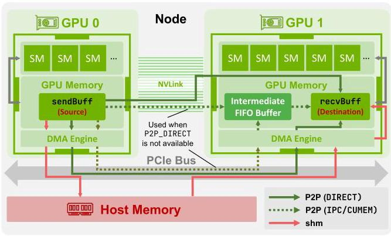
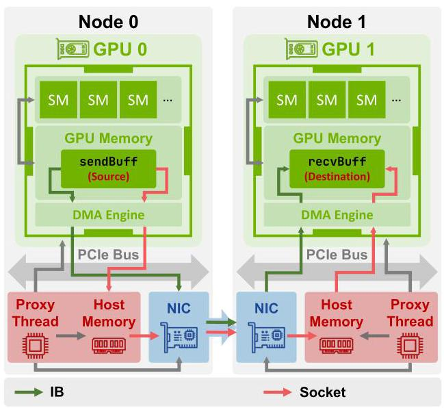
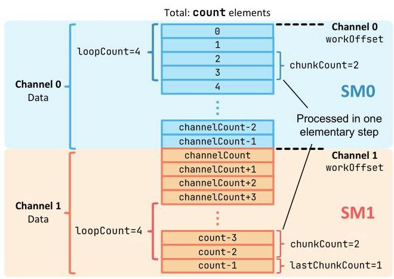
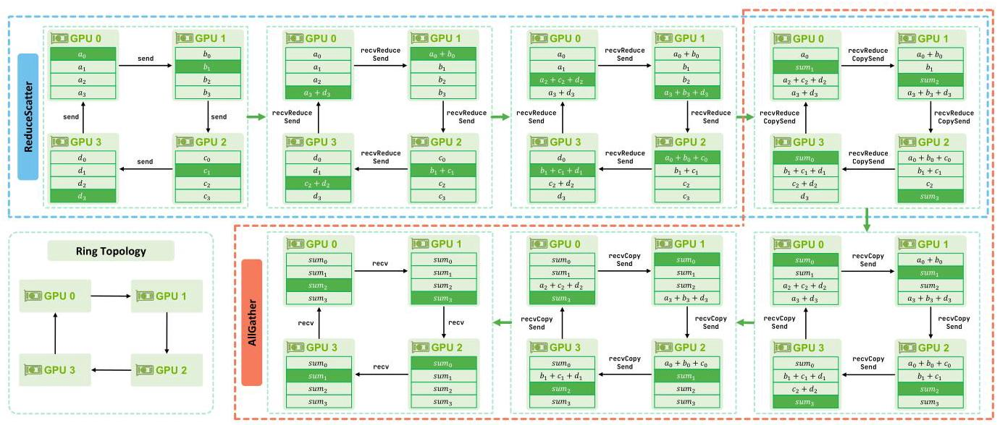
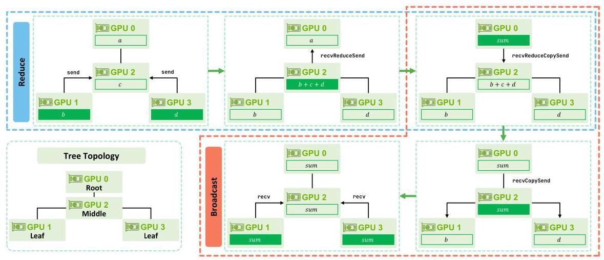

# Demystifying NCCL: An In-depth Analysis of GPU Communication Protocols and Algorithms

Zhiyi \( {\mathrm{{Hu}}}^{1 * } \) , Siyuan Shen \( {}^{1 * } \) , Tommaso Bonato \( {}^{1} \) , Sylvain Jeaugey \( {}^{2} \) , Cedell Alexander \( {}^{3} \) , Eric Spada \( {}^{3} \) , James Dinan \( {}^{2} \) , Jeff Hammond \( {}^{2} \) , Torsten Hoefler \( {}^{1} \; {}^{1} \) ETH Zürich, Switzerland

> 
Zhiyi \( {\mathrm{{Hu}}}^{1 * } \)，Siyuan Shen \( {}^{1 * } \)，Tommaso Bonato \( {}^{1} \)，Sylvain Jeaugey \( {}^{2} \)，Cedell Alexander \( {}^{3} \)，Eric Spada \( {}^{3} \)，James Dinan \( {}^{2} \)，Jeff Hammond \( {}^{2} \)，Torsten Hoefler \( {}^{1} \; {}^{1} \) 苏黎世联邦理工学院 (ETH Zürich)，瑞士

zhiyhu@student.ethz.ch, \{siyuan.shen, tommaso.bonato, torsten.hoefler\}@inf.ethz.ch

> 
zhiyhu@student.ethz.ch, \{siyuan.shen, tommaso.bonato, torsten.hoefler\}@inf.ethz.ch

\( {}^{2} \) NVIDIA Corporation, \( \{ \) sjeaugey, jdinan, jehammond \( \} @ \) nvidia.com

> 
\( {}^{2} \) NVIDIA 公司，\( \{ \) sjeaugey, jdinan, jehammond \( \} @ \) nvidia.com

\( {}^{3} \) Broadcom Inc., \{cedell.alexander, eric.spada\}@broadcom.com

> 
\( {}^{3} \) 博通公司 (Broadcom Inc.)，\{cedell.alexander, eric.spada\}@broadcom.com

Abstract-The NVIDIA Collective Communication Library (NCCL) is a critical software layer enabling high-performance collectives on large-scale GPU clusters. Despite being open source with a documented API, its internal design remains largely opaque. The orchestration of communication channels, selection of protocols, and handling of memory movement across devices and nodes are not clearly understood, making it difficult to analyze performance or identify bottlenecks. This paper presents a comprehensive analysis of NCCL, focusing on its communication protocol variants (Simple, LL, and LL128), the mechanisms governing intra-node and inter-node data movement, and ring-and tree-based collective communication algorithms. The insights obtained from this study serve as the foundation for ATLAHS, an application-trace-driven network simulation toolchain capable of accurately reproducing NCCL communication patterns in large-scale AI training workloads. By demystifying NCCL's internal architecture, this work provides guidance for system researchers and performance engineers working to optimize or simulate collective communication at scale.

> 
摘要——NVIDIA 集合通信库 (NVIDIA Collective Communication Library, NCCL) 是一个关键软件层，能够在大型 GPU 集群上实现高性能集合通信 (collectives)。尽管它是开源的且具有文档化的 API，但其内部设计在很大程度上仍不透明。通信通道 (communication channels) 的编排、协议 (protocols) 的选择，以及跨设备与节点的内存移动 (memory movement) 处理尚未被清晰理解，这使得分析性能或识别瓶颈变得困难。本文对 NCCL 进行了全面分析，重点聚焦其通信协议 (communication protocol) 变体（Simple、LL 和 LL128）、支配节点内 (intra-node) 与节点间 (inter-node) 数据移动 (data movement) 的机制，以及基于环 (ring) 和树 (tree) 的集合通信 (collective communication) 算法。本研究获得的洞见 (insights) 构成了 ATLAHS 的基础；ATLAHS 是一种应用轨迹驱动 (application-trace-driven) 的网络仿真 (network simulation) 工具链，能够准确复现大规模 AI 训练工作负载 (workloads) 中的 NCCL 通信模式 (communication patterns)。通过揭开 NCCL 内部架构 (internal architecture) 的神秘面纱，这项工作为致力于大规模优化或仿真集合通信 (collective communication) 的系统研究人员和性能工程师提供了指导。

Index Terms-NVIDIA NCCL, Collective communication, Communication libraries, Multi-GPU cluster training

> 
索引术语 (Index Terms)——NVIDIA NCCL、集合通信 (Collective communication)、通信库 (Communication libraries)、多GPU集群训练 (Multi-GPU cluster training)

## I. INTRODUCTION

Efficient GPU-to-GPU communication is essential for achieving high performance in distributed artificial intelligence (AI) and high-performance computing (HPC) workloads. The NVIDIA Collective Communication Library (NCCL) is a prominent library widely adopted for scalable, optimized GPU communication [1], [2]. Unlike general-purpose message-passing frameworks, such as MPI [3], NCCL specifically targets GPU-to-GPU interactions, utilizing interconnect technologies such as NVLink, PCIe, and InfiniBand (IB) to achieve high bandwidth and low latency.

> 
高效的 GPU 间通信 (GPU-to-GPU communication) 对于在分布式人工智能 (artificial intelligence, AI) 和高性能计算 (high-performance computing, HPC) 工作负载中实现高性能至关重要。NVIDIA 集合通信库 (NVIDIA Collective Communication Library, NCCL) 是一个被广泛采用的知名库，用于可扩展、优化的 GPU 通信 [1], [2]。与 MPI [3] 等通用消息传递框架 (message-passing frameworks) 不同，NCCL 专门面向 GPU 间交互 (GPU-to-GPU interactions)，利用 NVLink、PCIe 和 InfiniBand (IB) 等互连技术 (interconnect technologies) 来实现高带宽和低延迟。

Although NCCL is critical to large-scale GPU systems and open source, its internal mechanisms remain insufficiently documented. This is reflected by the frequent technical questions posted on NCCL's GitHub page [1], where users seek details about the library's inner workings. While the official API documentation is thorough, key aspects such as topology construction, algorithm selection, pipelining, and buffer management across nodes and devices are not clearly described. This lack of transparency makes it difficult for system researchers, network architects, and performance engineers to optimize, or predict NCCL's performance on new hardware and at scale [4], [5].

> 
尽管 NCCL 对大规模 GPU (Graphics Processing Unit) 系统至关重要且已开源，其内部机制仍缺乏充分文档记录。这体现在 NCCL 的 GitHub 页面 [1] 上频繁发布的技术问题中，用户试图借此了解该库的内部工作原理。虽然官方 API (Application Programming Interface) 文档详尽，但诸如拓扑构建 (topology construction)、算法选择 (algorithm selection)、流水线 (pipelining) 以及跨节点和设备的缓冲区管理 (buffer management) 等关键方面并未得到清晰描述。这种透明度的缺乏使系统研究人员 (system researchers)、网络架构师 (network architects) 和性能工程师 (performance engineers) 难以优化或预测 NCCL 在新硬件和规模化场景下的性能 [4], [5]。

In this paper, we present a thorough and systematic exploration of NCCL's internal architecture. Our analysis specifically targets four primary aspects of NCCL's implementation: (1) a general overview, including API structure and communication channel management; (2) a detailed examination of communication protocols (Simple, LL, LL128); (3) an analysis of its data-transfer models; and (4) comprehensive analysis of its collective communication algorithms.

> 
在本文中，我们对 NCCL 的内部架构进行了全面而系统的探索。我们的分析特别针对 NCCL 实现的四个主要方面：(1) 总体概述，包括 API 结构 (API structure) 与通信通道管理 (communication channel management)；(2) 对通信协议 (communication protocols)（Simple、LL、LL128）的详细考察；(3) 对其数据传输模型 (data-transfer models) 的分析；以及 (4) 对其集合通信算法 (collective communication algorithms) 的全面分析。

The insights gained from this study provide important context for performance modeling and architectural optimization. These insights have been adopted in simulation frameworks such as ATLAHS [6], an application-trace-driven network simulator developed to accurately replicate the communication patterns of NCCL-based machine learning workloads. By clarifying NCCL's internal design principles, this analysis supports system researchers, interconnect designers, and network architects in making more informed optimization decisions for GPU-centric high-performance computing environments.

> 
本研究获得的洞见为性能建模 (performance modeling) 和架构优化 (architectural optimization) 提供了重要背景。这些洞见已被 ATLAHS [6] 等仿真框架 (simulation frameworks) 采用；ATLAHS [6] 是一种应用轨迹驱动的网络模拟器 (application-trace-driven network simulator)，其开发目的是准确复现基于 NCCL 的机器学习工作负载 (machine learning workloads) 的通信模式 (communication patterns)。通过阐明 NCCL 的内部设计原理 (internal design principles)，该分析支持系统研究人员 (system researchers)、互连设计人员 (interconnect designers) 和网络架构师 (network architects) 为以 GPU 为中心的高性能计算环境 (GPU-centric high-performance computing environments) 做出更明智的优化决策 (optimization decisions)。

The analysis in this paper is based on NCCL version 2.19.1. While specific implementation details may evolve in future releases, the core architectural mechanisms and communication strategies discussed here are expected to remain consistent, ensuring that the insights presented remain broadly applicable.

> 
本文的分析基于 NCCL 2.19.1 版本。尽管具体实现细节可能会在未来版本中有所变化，但本文所讨论的核心架构机制和通信策略预计将保持一致，从而确保所提出的见解仍然广泛适用。

Some material was omitted due to conference page limits. For the complete version, please refer to the extended arXiv paper of the same title [7].

> 
由于会议页数限制，部分材料被省略。完整版本请参阅同名扩展arXiv论文[7]。

## II. NCCL OVERVIEW

## A. NCCL API

NCCL is specifically designed to provide highly optimized collective communication operations for GPU clusters, emphasizing low latency and high bandwidth. At its core, NCCL manages GPU-to-GPU communication via a clear and efficient API that abstracts complex technical details. NCCL primarily provides four categories of functions to users:

> 
NCCL 专门设计用于为 GPU 集群 (GPU cluster) 提供高度优化的集合通信 (collective communication) 操作，强调低延迟 (low latency) 和高带宽 (high bandwidth)。其核心在于，NCCL 通过清晰高效的应用程序编程接口 (API) 管理 GPU 到 GPU 通信 (GPU-to-GPU communication)，从而抽象掉复杂的技术细节。NCCL 主要向用户提供四类函数：

1) Communicator Management: Similar to MPI, all communication operations in NCCL are performed within the context of communicators. Each GPU participating in communication maintains a communicator object, which is used to invoke NCCL operations. Users must first initialize a communicator and define the set of GPUs involved.

> 
1) 通信域管理 (Communicator Management)：与 MPI 类似，NCCL 中的所有通信操作 (communication operations) 都在通信域 (communicators) 的上下文中执行。每个参与通信的 GPU 都维护一个通信域对象 (communicator object)，用于调用 NCCL 操作 (NCCL operations)。用户必须首先初始化一个通信域 (communicator)，并定义所涉及的 GPU 集合。

When all devices are managed within a single process or thread, ncc1CommInitAll can be used to create the communicator collectively. For multi-process or multi-threaded environments, each process calls ncc1CommInitRank with a shared unique identifier to correctly establish the communicator across processes.

> 
当所有设备 (device) 都在单个进程 (process) 或线程 (thread) 内管理时，可以使用 ncc1CommInitAll 统一创建通信器 (communicator)。对于多进程 (multi-process) 或多线程 (multi-threaded) 环境，每个进程 (process) 使用一个共享唯一标识符 (shared unique identifier) 调用 ncc1CommInitRank，以跨进程正确建立通信器 (communicator)。

After communication tasks have finished, communicators should be properly released to free resources. NCCL provides two functions for this purpose:

> 
通信任务完成后，应正确释放通信器 (communicator) 以释放资源。NCCL 为此提供了两个函数：

- ncclCommDestroy: Safely destroys a communicator, ensuring all pending communication operations are completed before cleanup.

> 
- ncclCommDestroy：安全地销毁一个通信器 (communicator)，确保在清理之前所有待处理的通信操作均已完成。

- ncclCommAbort: Immediately terminates the communicator and cancels ongoing operations. This is intended for error recovery or handling unexpected failures to avoid deadlocks.

> 
- ncclCommAbort：立即终止通信器 (communicator) 并取消正在进行的操作。这用于错误恢复 (error recovery) 或处理意外故障 (unexpected failures)，以避免死锁 (deadlocks)。

2) Collective Communication: NCCL provides 5 collective operations: ncclAllReduce, ncclBroadcast, ncclReduce, ncclAllGather, and ncclReduceScatter. Historically, NCCL included an in-place variant of ncclBroadcast, called ncclBcast, to mimic the behavior of MPI_Bcast, which always operates in-place. However, to support more general use cases and achieve a more regular API, NCCL later introduced ncclBroadcast with separate send and receive buffers. ncclBcast is now largely deprecated and maintained primarily for compatibility with MPI-style interfaces.

> 
2) 集合通信 (collective communication)：NCCL 提供 5 种集合操作 (collective operations)：ncclAllReduce、ncclBroadcast、ncclReduce、ncclAllGather 和 ncclReduceScatter。历史上，NCCL 包含 ncclBroadcast 的一个原地变体 (in-place variant)，称为 ncclBcast，以模仿 MPI_Bcast 的行为，而 MPI_Bcast 始终原地操作。然而，为了支持更通用的用例并实现更规范的 API，NCCL 后来引入了具有独立发送和接收缓冲区 (send and receive buffers) 的 ncclBroadcast。ncclBcast 现在已基本弃用 (deprecated)，主要为了与 MPI 风格接口 (MPI-style interfaces) 兼容而维护。

3) Point-to-Point Communication: NCCL supports point-to-point operations through ncclSend and ncclRecv.

> 
3) 点对点通信 (Point-to-Point Communication)：NCCL 支持通过 ncclSend 和 ncclRecv 实现点对点操作。

4) Group Calls: To aggregate operations and reduce overhead, NCCL offers ncclGroupStart and ncclGroupEnd. These functions bracket a sequence of NCCL calls and delay their execution until the group ends. Grouped operations may include multiple Send/Recv calls (to emulate SendRecv, All-to-One, One-to-All, or All-to-All patterns) or a set of collective operations. This aggregation can significantly reduces launch overhead and latency by ensuring that all grouped operations are executed together as part of a single NCCL launch.

> 
4) 分组调用 (Group Calls)：为了聚合操作并降低开销，NCCL 提供了 ncclGroupStart 和 ncclGroupEnd。这些函数括起一系列 NCCL 调用，并将其执行推迟到分组结束。分组操作 (Grouped operations) 可能包括多个 Send/Recv 调用（用于模拟 SendRecv、All-to-One、One-to-All 或 All-to-All 模式），或者一组集合操作 (collective operations)。这种聚合通过确保所有分组操作作为单次 NCCL 启动的一部分一起执行，可以显著降低启动开销 (launch overhead) 和延迟 (latency)。

## B. Launching Strategies

NCCL supports three common execution models for launching operations on multiple GPUs, and each of these approaches presents distinct trade-offs.

> 
NCCL 支持三种常见的执行模型 (execution models)，用于在多个 GPU 上启动操作 (operations)，而每种方法都呈现出不同的权衡 (trade-offs)。

- One CPU process per GPU: This model provides greater control over process placement. By binding each GPU to a separate process, the associated CPU code can be scheduled on the local non-uniform memory access (NUMA) domain, improving data locality and reducing memory access latency.

> 
- 每个 GPU 一个 CPU 进程 (One CPU process per GPU)：该模型对进程放置 (process placement) 提供了更强的控制。通过将每个 GPU 绑定到一个单独的进程，关联的 CPU 代码可以调度到本地非统一内存访问 (non-uniform memory access, NUMA) 域上，从而改善数据局部性 (data locality) 并降低内存访问延迟 (memory access latency)。

- One CPU thread per GPU: When a single CPU process manages multiple GPUs through multiple threads, it enables efficient intra-process memory sharing. This setup allows for direct access to memory across ranks, including GPU buffers, reducing memory-copy overhead during communication.

> 
- 每个 GPU 一个 CPU 线程：当单个 CPU 进程通过多个线程管理多个 GPU 时，可实现高效的进程内内存共享 (intra-process memory sharing)。这种设置允许跨各进程编号 (rank) 直接访问内存，包括 GPU 缓冲区 (GPU buffer)，从而减少通信期间的内存拷贝 (memory-copy) 开销。

- One CPU thread for multiple GPUs: While the single-threaded model suffers from sequential kernel launches and reduced concurrency, it offers simplicity, minimal CPU overhead, and deterministic execution, making it suitable for small-scale deployments or prototype environments where ease of implementation is prioritized over the highest performance.

> 
- 一个 CPU 线程服务多个 GPU (One CPU thread for multiple GPUs)：虽然单线程模型 (single-threaded model) 会面临顺序内核启动 (sequential kernel launches) 和并发度降低 (reduced concurrency) 的问题，但它提供了简单性、极小的 CPU 开销 (CPU overhead) 和确定性执行 (deterministic execution)，因而适合小规模部署 (small-scale deployments) 或原型环境 (prototype environments)；在这些场景中，实现简便性 (ease of implementation) 优先于最高性能 (highest performance)。

## C. Communication Channels

NCCL orchestrates communication through three hardware components: the GPU, the CPU, and the network interface. GPUs execute reductions and move data between buffers, CPUs launch kernels and manage host-side coordination, and NICs transfer packets across nodes. When only a single streaming multiprocessor (SM) handles the GPU work, large messages can overload that SM, underuse other SMs, and fail to saturate links such as NVLink or InfiniBand [8], [9].

> 
NCCL 通过三个硬件组件来编排通信：GPU、CPU 和网络接口 (network interface, NIC)。GPU 执行归约 (reduction) 并在缓冲区 (buffer) 之间移动数据，CPU 启动内核 (kernel) 并管理主机侧协调 (host-side coordination)，NIC 则跨节点传输数据包 (packet)。当仅由单个流式多处理器 (streaming multiprocessor, SM) 处理 GPU 工作时，大消息可能会使该 SM 过载、导致其他 SM 利用不足，并且无法使 NVLink 或 InfiniBand 等链路饱和 [8], [9]。

To avoid this bottleneck, NCCL subdivides every collective into communication channels. Each channel is launched as a separate CUDA block that runs on its own SM, and the library partitions the input buffer so that channels operate on disjoint chunks in parallel. This fine-grained parallelism raises aggregate throughput, especially for large payloads that would otherwise serialize on one SM. Spreading work across channels also helps balance traffic across multiple NICs on NVLink platforms, as each channel can independently exit the node through a different NIC. This improves link utilization, reduces idle time, and balances load across interconnects such as NVLink, PCIe, and InfiniBand.

> 
为了避免这一瓶颈，NCCL 将每个集合操作 (collective) 细分为多个通信通道 (communication channel)。每个通道都作为独立的 CUDA 块 (CUDA block) 启动，并在自己的流式多处理器 (SM) 上运行，库会划分输入缓冲区 (input buffer)，使各通道并行处理互不相交的数据块 (chunk)。这种细粒度并行提高了聚合吞吐量 (aggregate throughput)，尤其是对于原本会在单个 SM 上串行化的大载荷 (payload)。将工作分散到多个通道还有助于在 NVLink 平台上平衡多个网络接口卡 (NIC) 之间的流量，因为每个通道都可以独立地通过不同的 NIC 离开节点。这提高了链路利用率 (link utilization)，减少了空闲时间 (idle time)，并在 NVLink、PCIe 和 InfiniBand 等互连 (interconnect) 上平衡负载。

Channel management in NCCL is coordinated at the communicator level, where each GPU receives a unique rank between 0 and \( n - 1 \) , where \( n \) is the total number of GPUs participating in the communicator. During communicator initialization, NCCL establishes an initial set of channel structures, with their total count primarily guided by system topology and architectural defaults. When a collective operation is invoked, NCCL dynamically selects the algorithm and protocol for that particular task. Based on this runtime choice, NCCL's internal tuning model then determines how many of these preestablished channels to utilize for that operation, considering the selected strategy, current message size, available bandwidth, and configured threads per channel. Although earlier versions allowed users to influence channel behavior by setting environment variables like NCCL_NTHREADS, such manual tuning is now discouraged. In recent versions, these settings are typically ignored and may even lead to incorrect behavior.

> 
NCCL 中的通道管理 (channel management) 在通信器 (communicator) 层面进行协调，其中每个 GPU 会被分配一个介于 0 与 \( n - 1 \) 之间的唯一秩 (rank)，而 \( n \) 是参与该通信器的 GPU 总数。在通信器初始化期间，NCCL 会建立一组初始的通道结构 (channel structure)，其总数量主要取决于系统拓扑 (system topology) 和架构默认值 (architectural defaults)。当调用集合操作 (collective operation) 时，NCCL 会为该特定任务动态选择算法 (algorithm) 和协议 (protocol)。基于这一运行时选择，NCCL 的内部调优模型 (tuning model) 随后会确定该操作要使用多少个预先建立的通道，同时考虑所选策略 (strategy)、当前消息大小 (message size)、可用带宽 (available bandwidth) 以及配置的每通道线程数 (threads per channel)。尽管早期版本允许用户通过设置 NCCL_NTHREADS 等环境变量 (environment variable) 来影响通道行为，但如今已不鼓励这种手动调优 (manual tuning)。在较新的版本中，这些设置通常会被忽略，甚至可能导致不正确的行为。

The logical communication topology assigned to each channel directly shapes how data flows among GPUs during each operation. In a ring topology, each GPU identifies its immediate predecessor and successor to form a unidirectional communication ring. In a tree topology, each GPU tracks its parent and child ranks, establishing a logical communication tree. To increase bandwidth utilization, NCCL employs a double binary tree structure [10], [11]. These topologies are established during communicator initialization and reused across all collective operations.

> 
分配给每个通道 (channel) 的逻辑通信拓扑 (logical communication topology) 直接决定了每次操作期间数据在 GPU 之间的流动方式。在环形拓扑 (ring topology) 中，每个 GPU 会识别其直接前驱和后继 (predecessor and successor)，以形成单向通信环 (unidirectional communication ring)。在树形拓扑 (tree topology) 中，每个 GPU 跟踪其父级和子级 rank，建立逻辑通信树 (logical communication tree)。为提高带宽利用率 (bandwidth utilization)，NCCL 采用双二叉树结构 (double binary tree structure) [10], [11]。这些拓扑在通信器 (communicator) 初始化 (initialization) 期间建立，并在所有集合操作 (collective operations) 中复用。

For grouped point-to-point operations using ncclGroupStart and ncclGroupEnd, NCCL assigns each transfer to a separate channel when possible, enabling multiple independent sends and receives to run in parallel. This provides task-level parallelism across transfers.

> 
对于使用 ncclGroupStart 和 ncclGroupEnd 的分组点对点 (point-to-point) 操作，NCCL 会在可能时为每个传输 (transfer) 分配一个单独的通道 (channel)，从而使多个独立的发送和接收 (sends and receives) 能够并行运行。这提供了跨传输 (transfer) 的任务级并行 (task-level parallelism)。

## III. COMMUNICATION PROTOCOLS

NCCL employs multiple communication protocols to optimize data transfer efficiency during collective operations. The three protocols, Simple, LL (Low Latency), and LL128, are designed to achieve different trade-offs between bandwidth and latency. This section provides an overview of the mechanisms behind each protocol. Table I summarizes the key characteristics of the three protocols.

> 
NCCL 采用多种通信协议 (communication protocol) 来优化集合操作 (collective operation) 期间的数据传输效率。Simple、LL（低延迟，Low Latency）和 LL128 这三种协议 (protocol) 旨在实现带宽 (bandwidth) 与延迟 (latency) 之间的不同权衡。本节概述每种协议背后的机制。表 I 总结了这三种协议的关键特性。

TABLE I

COMPARISON OF NCCL COMMUNICATION PROTOCOLS

> 
NCCL 通信协议 (communication protocols) 比较

<table><tr><td></td><td>Simple</td><td>LL</td><td>LL128</td></tr><tr><td>Design Goal</td><td>High bandwidth</td><td>Low latency</td><td>Low latency and high bandwidth</td></tr><tr><td>Synchronization Mechanism</td><td>Memory fences (high overhead)</td><td>Flag-based synchronization</td><td>Flag-based synchronization</td></tr><tr><td>Payload</td><td>Data chunks</td><td>4B data + 4B flag</td><td>120B data + 8B flag</td></tr><tr><td>Bandwidth Utilization</td><td>Near peak</td><td>25~50% of peak [12]</td><td>~ 95% of peak [12]</td></tr><tr><td>Latency Per-hop</td><td>\( \sim  {6\mu s} \)</td><td>\( \sim  {1\mu s} \)</td><td>\( \sim  {2\mu s} \)</td></tr></table>

## A. Simple Protocol

The Simple protocol is designed to maximize bandwidth utilization and is used for large message transfers. It operates by dividing the data into relatively large chunks and dispatching them across communication channels. This chunking strategy ensures that the high throughput of the network interface and GPU memory system is fully leveraged.

> 
Simple 协议 (Simple protocol) 旨在最大化带宽利用率 (bandwidth utilization)，并用于大消息传输 (large message transfers)。它通过将数据划分为相对较大的数据块 (chunks)，并将这些数据块分发到各通信通道 (communication channels) 来运作。这种分块策略 (chunking strategy) 确保网络接口 (network interface) 和 GPU 内存系统 (GPU memory system) 的高吞吐量 (high throughput) 得到充分利用。

To preserve memory consistency, the protocol uses memory fences to enforce correct ordering and visibility of data. A receiver must wait until a full chunk has been transferred before accessing it. While effective at ensuring correctness, the use of memory fences introduces significant overhead. This overhead becomes a limiting factor for small messages, where the cost of synchronization dominates overall transfer time. As a result, while the Simple protocol achieves near-peak bandwidth for large messages, it suffers from high latency when handling small payloads.

> 
为保持内存一致性 (memory consistency)，该协议 (protocol) 使用内存栅栏 (memory fence) 来强制数据的正确排序与可见性。接收方 (receiver) 必须等待完整数据块 (chunk) 传输完成后才能访问它。虽然内存栅栏 (memory fence) 能有效确保正确性，但其使用会引入显著开销。这种开销会成为小消息 (small message) 的限制因素，此时同步 (synchronization) 成本在整体传输时间中占主导。因此，尽管 Simple 协议 (Simple protocol) 对大消息 (large message) 能实现接近峰值的带宽 (bandwidth)，但在处理小负载 (small payload) 时会遭受高延迟 (latency)。

### B.LL (Low Latency) Protocol

To address the latency issues associated with the Simple protocol, NCCL includes the LL protocol, which is optimized for small message sizes where bandwidth is typically underuti-lized. Instead of relying on memory fences, the LL protocol uses lightweight flag-based synchronization. A small flag is transmitted alongside the data to signal its validity, enabling the receiver to proceed as soon as the data becomes available without requiring costly memory barriers.

> 
为了解决与简单协议 (Simple protocol) 相关的延迟问题，NCCL 包含了 LL 协议 (LL protocol)，该协议针对带宽通常未被充分利用的小消息大小 (small message sizes) 进行了优化。LL 协议不依赖内存栅栏 (memory fence)，而是使用轻量级的基于标志的同步 (flag-based synchronization)。一个小标志 (flag) 与数据一起传输，以表明其有效性，使接收方能够在数据可用时立即继续处理，而无需昂贵的内存屏障 (memory barrier)。

Each transmission in the LL protocol consists of 4 bytes of data followed by a 4-byte flag, sent together using 8- byte atomic operations. This approach significantly reduces synchronization overhead and improves responsiveness for latency-sensitive workloads. LL forces the intermediate buffer to reside in host memory so that the CPU can poll the flag and detect when the data is ready to be sent through the NIC. While this design enables low latency, it prevents the use of GPU Direct Remote Direct Memory Access (RDMA), severely limiting bandwidth. As a result, LL typically achieves only 25-50% of peak bandwidth, depending on the interconnect. Consequently, it is preferred only for small transfers where latency is critical and bandwidth utilization is secondary.

> 
LL 协议 (LL protocol) 中的每次传输都由 4 字节数据后接 4 字节标志组成，并通过 8 字节原子操作 (atomic operations) 一起发送。这种方法显著降低了同步开销 (synchronization overhead)，并提升了对延迟敏感型工作负载 (latency-sensitive workloads) 的响应能力 (responsiveness)。LL 强制将中间缓冲区 (intermediate buffer) 驻留在主机内存 (host memory) 中，以便 CPU 能够轮询标志 (flag)，并检测数据何时已准备好通过网卡 (NIC) 发送。虽然这种设计实现了低延迟 (low latency)，但它阻止了 GPU Direct 远程直接内存访问 (RDMA) 的使用，严重限制了带宽 (bandwidth)。因此，LL 通常只能达到峰值带宽 (peak bandwidth) 的 25-50%，具体取决于互连 (interconnect)。因此，只有在延迟至关重要而带宽利用率 (bandwidth utilization) 次要的小规模传输 (small transfers) 中，才优先使用它。

## C. LL128 Protocol

The LL128 protocol improves upon LL by maintaining its low-latency properties while significantly increasing bandwidth efficiency, particularly over high-performance interconnects like NVLink. Like LL, it uses flag-based synchronization to eliminate memory fences, but it transmits data in 128-byte units rather than 8-byte units. Out of the 128 bytes, 120 bytes are dedicated to data, and 8 bytes are reserved for the flag, allowing the protocol to utilize approximately 95 percent of the peak bandwidth.

> 
LL128 协议 (LL128 protocol) 相较于 LL 协议 (LL protocol) 有所改进：它在保持低延迟特性的同时显著提升了带宽效率 (bandwidth efficiency)，尤其是在 NVLink 等高性能互连 (high-performance interconnects) 上。与 LL 协议一样，它使用基于标志的同步 (flag-based synchronization) 来消除内存栅栏 (memory fences)，但它以 128 字节单元 (128-byte units) 而不是 8 字节单元 (8-byte units) 传输数据。在 128 字节中，120 字节专用于数据，8 字节保留给标志 (flag)，使该协议能够利用约 95% 的峰值带宽 (peak bandwidth)。

On the network path, LL128 resembles the Simple protocol in that the sending GPU aggregates a relatively large chunk of data before notifying the CPU that it is ready to send. Although this chunk-based aggregation limits pipelining across nodes, LL128 still benefits from fine-grained pipelining within a node due to its smaller transmission granularity. This combination of low latency and high throughput makes LL128 well suited for a broad range of message sizes. However, LL128 comes with stricter hardware requirements. It depends on atomic 128-byte writes, which must not be split or reordered by the memory system or interconnect. In systems where such operations are not guaranteed, due to PCIe limitations or other architectural constraints, NCCL disables LL128 to avoid data corruption. Protocol selection is thus influenced not only by message size, but also by system-level capabilities.

> 
在网络路径 (network path) 上，LL128 协议 (LL128 protocol) 与 Simple 协议 (Simple protocol) 类似，发送端 GPU 会在通知 CPU 自己已准备好发送之前，聚合相对较大的数据块 (chunk)。尽管这种基于数据块 (chunk) 的聚合限制了跨节点流水线 (pipelining across nodes)，但由于其传输粒度 (transmission granularity) 更小，LL128 仍能从节点内细粒度流水线 (fine-grained pipelining within a node) 中受益。低延迟 (low latency) 与高吞吐量 (high throughput) 的这种结合，使 LL128 非常适合广泛的消息大小 (message size) 范围。然而，LL128 也带来了更严格的硬件要求 (hardware requirements)。它依赖于原子 128 字节写入 (atomic 128-byte writes)，而内存系统 (memory system) 或互连 (interconnect) 不得拆分或重排序这些写入。在因 PCIe 限制 (PCIe limitations) 或其他架构约束 (architectural constraints) 而无法保证此类操作的系统中，NCCL 会禁用 LL128，以避免数据损坏 (data corruption)。因此，协议选择 (protocol selection) 不仅受消息大小 (message size) 影响，还受系统级能力 (system-level capabilities) 影响。

## D. Protocol Selection and Comparison

NCCL dynamically selects among the Simple, LL, and LL128 protocols at runtime based on user settings (i.e., NCCL_PROTO), the collective algorithm, and internal performance heuristics. If not explicitly specified, NCCL uses a tuning model that factors in system topology, GPU architecture, message size, and predefined performance metrics to choose the best algorithm-protocol pair. This selection is constrained by resource availability, such as memory for protocol-specific buffers. Typically, LL/LL128 are chosen for small messages to reduce latency, while Simple is used for larger messages to maximize throughput.

> 
NCCL 在运行时根据用户设置（即 NCCL_PROTO）、集合算法 (collective algorithm) 和内部性能启发式 (performance heuristics)，在 Simple 协议 (Simple protocol)、LL 协议 (LL protocol) 和 LL128 协议 (LL128 protocol) 之间动态选择。如果未显式指定，NCCL 会使用一个调优模型 (tuning model)，将系统拓扑 (system topology)、GPU 架构 (GPU architecture)、消息大小 (message size) 和预定义性能指标 (predefined performance metrics) 纳入考虑，以选择最佳的算法-协议对 (algorithm-protocol pair)。这种选择受资源可用性 (resource availability) 约束，例如用于协议专用缓冲区 (protocol-specific buffers) 的内存。通常，小消息会选择 LL/LL128 以降低延迟 (latency)，而较大的消息则使用 Simple 以最大化吞吐量 (throughput)。

## IV. DATA-TRANSFER METHODS AND TRANSPORT LAYER

Efficient data movement is central to NCCL's communication performance, particularly in multi-GPU and multi-node environments. As summarized in Table II, NCCL employs distinct data transfer strategies and transport mechanisms depending on whether communication occurs within a single node (intra-node) or across multiple nodes (inter-node), with each transport optimized for specific hardware and interconnect types to support scalable collectives.

> 
高效的数据移动 (data movement) 对 NCCL 的通信性能 (communication performance) 至关重要，尤其是在多 GPU (multi-GPU) 和多节点 (multi-node) 环境中。如表 II (Table II) 所总结，NCCL 会根据通信是在单个节点内 (intra-node) 进行还是在多个节点间 (inter-node) 进行，采用不同的数据传输策略 (data transfer strategies) 和传输机制 (transport mechanisms)；每种传输 (transport) 都针对特定的硬件和互连类型 (hardware and interconnect types) 进行了优化，以支持可扩展的集合通信 (scalable collectives)。

TABLE II

NCCL COMMUNICATION CHARACTERISTICS AND TRANSPORTS

> 
NCCL通信特性与传输机制

<table><tr><td></td><td>Intra-Node</td><td>Inter-Node</td></tr><tr><td>Transport</td><td>P2P SHM NVLS p2p.cc shm.cc nvls.cc</td><td>NET COLLNET net_ib.cc net_socket.cc coll_net.cc</td></tr><tr><td>Physical Interconnect</td><td>NVLink PCIe</td><td>InfiniBand   RoCE   TCP/IP (Socket)</td></tr><tr><td>Optimizations</td><td>GPUDirect P2P P2P_DIRECT</td><td>GPUDirect RDMA</td></tr></table>

## A. Intra-node Data Transfer

Fig. 1. Illustration of intra-node data transfer paths in NCCL. Each path is color-coded to indicate the selected transport and hardware support.

> 
图 1. NCCL 中节点内 (intra-node) 数据传输路径示意图。每条路径均采用颜色编码，以指示所选的传输方式 (transport) 和硬件支持 (hardware support)。

NCCL employs a sophisticated and hierarchical approach to intra-node communication, prioritizing the lowest latency and highest bandwidth paths available between GPUs residing on the same physical machine (see Figure 1). This strategy heavily leverages NVIDIA's GPUDirect Peer-to-Peer (P2P) technology, which enables GPUs to directly access each other's memory without staging through CPU system memory.

> 
NCCL 采用一种精巧且分层的方法 (hierarchical approach) 来处理节点内通信 (intra-node communication)，优先使用位于同一物理机器上的 GPU 之间可用的最低延迟 (lowest latency) 和最高带宽 (highest bandwidth) 路径（见图 1）。该策略大量利用 NVIDIA 的 GPUDirect 点对点 (Peer-to-Peer, P2P) 技术，使 GPU 能够直接访问彼此的内存，而无需通过 CPU 系统内存 (CPU system memory) 中转。

At the core of its intra-node strategy is the P2P transport, primarily managed within src/transport/p2p.cc. When GPUs are interconnected via NVIDIA NVLink, NCCL gives precedence to this path, implementing GPUDirect P2P over NVLink to utilize these dedicated, high-speed, direct GPU-to-GPU links. If NVLink is unavailable, NCCL can utilize GPUDirect P2P communication over the PCIe bus, also managed by the P2P transport layer. This offers a fallback that is generally much more performant than host-memory staging.

> 
其节点内策略 (intra-node strategy) 的核心是 P2P 传输 (P2P transport)，主要在 src/transport/p2p.cc 中管理。当 GPU 通过 NVIDIA NVLink 互连时，NCCL 优先选择此路径，在 NVLink 上实现 GPUDirect P2P，以利用这些专用、高速、直接的 GPU 到 GPU (GPU-to-GPU) 链路。如果 NVLink 不可用，NCCL 可以利用 PCIe 总线上的 GPUDirect P2P 通信，该通信同样由 P2P 传输层 (P2P transport layer) 管理。这提供了一种回退方案 (fallback)，其性能通常远优于主机内存暂存 (host-memory staging)。

A key optimization in NCCL's P2P transport is the P2P_DIRECT mode, which is enabled when communicating ranks belong to the same process. While both single-process and multi-process communications utilize GPU-to-GPU transfers without CPU involvement, P2P_DIRECT mode significantly improves efficiency in two ways. First, it bypasses the need for IPC handles by employing direct GPU memory pointers within the same address space. More importantly, it eliminates an intermediate data copy by using primitives like direct Send and direct Recv, which transfer data directly between source and destination buffers rather than routing through an intermediate FIFO buffer. Despite this optimized data path, NCCL still maintains correct synchronization using atomic head and tail counters within shared structures (e.g., ncclSendMem and ncclRecvMem) to ensure proper ordering and prevent data races. Thus, P2P_DIRECT provides substantial performance benefits through both simplified memory addressing and a more direct data transfer path, building upon the foundational GPUDirect P2P capability.

> 
NCCL 的 P2P 传输 (P2P transport) 中一项关键优化是 P2P_DIRECT 模式 (P2P_DIRECT mode)，当通信秩 (communicating ranks) 属于同一进程 (same process) 时启用。虽然单进程 (single-process) 和多进程 (multi-process) 通信都利用 GPU 到 GPU 传输 (GPU-to-GPU transfers) 而无需 CPU 参与，但 P2P_DIRECT 模式通过两种方式显著提升效率。首先，它通过在同一地址空间 (same address space) 内使用直接 GPU 内存指针 (direct GPU memory pointers)，绕过了对 IPC 句柄 (IPC handles) 的需求。更重要的是，它通过使用 direct Send 和 direct Recv 等原语 (primitives) 消除了中间数据拷贝 (intermediate data copy)，这些原语直接在源缓冲区 (source buffers) 和目标缓冲区 (destination buffers) 之间传输数据，而不是经由中间 FIFO 缓冲区 (intermediate FIFO buffer) 路由。尽管有这种优化的数据路径，NCCL 仍使用共享结构 (shared structures)（例如 ncclSendMem 和 ncclRecvMem）内的原子头尾计数器 (atomic head and tail counters) 来保持正确同步 (synchronization)，以确保正确顺序 (ordering) 并防止数据竞争 (data races)。因此，P2P_DIRECT 通过简化的内存寻址 (memory addressing) 和更直接的数据传输路径 (data transfer path) 提供了显著的性能收益 (performance benefits)，并建立在基础性的 GPUDirect P2P 能力 (GPUDirect P2P capability) 之上。

Fig. 2. Illustration of intra-node data transfer paths in NCCL. Each path is color-coded to indicate the selected transport and hardware support.

> 
图2. NCCL中节点内 (intra-node) 数据传输路径 (data transfer path) 示意图。每条路径使用颜色编码 (color-coded)，以指示所选的传输方式 (transport) 及硬件支持 (hardware support)。

NCCL may leverage the Shared Memory (SHM) transport not only when direct GPU-to-GPU P2P communication is unavailable, but also when P2P is suboptimal. In particular, inter-socket P2P over PCIe often generates packets that are poorly handled by CPUs and result in degraded performance. SHM avoids this by routing traffic through system memory, using PCIe-to-memory and memory-to-PCIe transfers, which CPUs are typically better optimized to process. In SHM mode, one GPU's controlling process writes data to a shared memory segment, which is then read by the other GPU's process.

> 
NCCL 不仅可在直接的 GPU 到 GPU (GPU-to-GPU) 点对点 (P2P) 通信不可用时利用共享内存 (Shared Memory, SHM) 传输 (transport)，也可在 P2P 次优 (suboptimal) 时利用它。具体而言，跨插槽 (inter-socket) 的 PCIe P2P 常常生成由 CPU 处理效果不佳的数据包 (packet)，并导致性能下降 (degraded performance)。SHM 通过系统内存 (system memory) 路由流量 (traffic) 来避免这一点，使用 PCIe 到内存 (PCIe-to-memory) 和内存到 PCIe (memory-to-PCIe) 传输，而 CPU 通常针对处理这些传输进行了更好的优化。在 SHM 模式下，一个 GPU 的控制进程 (controlling process) 将数据写入共享内存段 (shared memory segment)，随后由另一个 GPU 的进程读取。

## B. Inter-node Data Transfer

Inter-node communication in NCCL orchestrates data exchange between GPUs located in different physical nodes. This process involves the GPU executing NCCL kernels, a proxy thread running on the CPU to manage network operations, and the underlying network fabric. As shown in Figure 2, NCCL selects between two primary network transports, namely a standard TCP Socket transport or a high-performance Infini-Band (IB) Verbs transport, based on the available hardware.

> 
NCCL 中的节点间通信 (inter-node communication) 协调位于不同物理节点上的 GPU 之间的数据交换。该过程涉及 GPU 执行 NCCL 内核 (NCCL kernels)、在 CPU 上运行以管理网络操作的代理线程 (proxy thread)，以及底层网络结构 (network fabric)。如图 2 所示，NCCL 根据可用硬件，在两种主要的网络传输 (network transports) 之间进行选择，即标准 TCP Socket 传输 (TCP Socket transport) 或高性能 InfiniBand (IB) Verbs 传输 (InfiniBand (IB) Verbs transport)。

TABLE III

SUPPORTED ALGORITHMS AND PROTOCOLS FOR NCCL COLLECTIVE OPERATIONS

> 
NCCL 集合操作 (collective operations) 支持的算法 (algorithms) 和协议 (protocols)

<table><tr><td colspan="4">AllReduce</td><td colspan="3">Broadcast</td><td colspan="3">Reduce</td><td colspan="3">ReduceScatter</td><td colspan="3">AllGather</td></tr><tr><td>Algorithm</td><td>Simple</td><td>LL</td><td>LL128</td><td>Simple</td><td>LL</td><td>LL128</td><td>Simple</td><td>LL</td><td>LL128</td><td>Simple</td><td>LL</td><td>LL128</td><td>Simple</td><td>LL</td><td>LL128</td></tr><tr><td>Ring</td><td>✓</td><td>✓</td><td>✓</td><td>✓</td><td>✓</td><td>✓</td><td>✓</td><td>✓</td><td>✓</td><td>✓</td><td>✓</td><td>✓</td><td>✓</td><td>✓</td><td>✓</td></tr><tr><td>Tree</td><td>✓</td><td>✓</td><td>✓</td><td>✘</td><td>✘</td><td>✘</td><td>✘</td><td>✘</td><td>✘</td><td>✘</td><td>✘</td><td>✘</td><td>✘</td><td>✘</td><td>✘</td></tr><tr><td>CollNet Direct</td><td>✓</td><td>✘</td><td>✘</td><td>✘</td><td>✘</td><td>✘</td><td>✘</td><td>✘</td><td>✘</td><td>✘</td><td>✘</td><td>✘</td><td>✘</td><td>✘</td><td>✘</td></tr><tr><td>CollNet Chain</td><td>✓</td><td>✘</td><td>✘</td><td>✘</td><td>✘</td><td>✘</td><td>✘</td><td>✘</td><td>✘</td><td>✘</td><td>✘</td><td>✘</td><td>✘</td><td>✘</td><td>✘</td></tr><tr><td>NVLS</td><td>✓</td><td>✘</td><td>✘</td><td>✘</td><td>✘</td><td>✘</td><td>✘</td><td>✘</td><td>✘</td><td>✓</td><td>✘</td><td>✘</td><td>✓</td><td>✘</td><td>✘</td></tr><tr><td>NVLS Tree</td><td>✓</td><td>✘</td><td>✘</td><td>✘</td><td>✘</td><td>✘</td><td>✘</td><td>✘</td><td>✘</td><td>✘</td><td>✘</td><td>✘</td><td>✘</td><td>✘</td><td>✘</td></tr></table>

Legend: \( v = \) Supported, \( x = \) Not supported.

> 
图例：\( v = \) 支持，\( x = \) 不支持。

1) Socket-Based Communication: When the network interface does not support RDMA, NCCL employs the socket transport, implemented in transport/net_socket.cc. In this mode, the intermediate buffers are allocated as CUDA pinned memory in the host memory. On the sender side, data is copied from the GPU to this buffer before being sent over the network using standard socket calls. On the receiver side, data is received into the host buffer and then copied to the GPU. This reliance on the host-memory staging incurs the overhead of extra memory copies across the PCIe bus. Both sending and receiving follow a rendezvous protocol.

> 
1) 基于套接字的通信 (Socket-Based Communication)：当网络接口 (network interface) 不支持 RDMA 时，NCCL 采用套接字传输 (socket transport)，其实现位于 transport/net_socket.cc。在此模式下，中间缓冲区 (intermediate buffers) 在主机内存 (host memory) 中被分配为 CUDA 页锁定内存 (pinned memory)。在发送端 (sender side)，数据在使用标准套接字调用 (standard socket calls) 通过网络发送之前，会从 GPU 拷贝到该缓冲区。在接收端 (receiver side)，数据被接收到主机缓冲区 (host buffer) 中，然后拷贝到 GPU。这种对主机内存暂存 (host-memory staging) 的依赖会带来跨 PCIe 总线 (PCIe bus) 的额外内存拷贝 (memory copies) 开销。发送和接收均遵循会合协议 (rendezvous protocol)。

2) IB Verbs Transport: For high-performance networks such as InfiniBand or RoCE, NCCL uses the IB transport, implemented in net_ib.cc. The IB transport leverages RDMA capabilities to enable direct data movement between nodes with minimal CPU intervention. As with the socket transport, all transfers are staged through an intermediate buffer, but the location of this buffer depends on hardware support and configuration.

> 
2) IB Verbs 传输 (IB Verbs Transport)：对于 InfiniBand 或 RoCE 等高性能网络，NCCL 使用 IB 传输 (IB transport)，其实现位于 net_ib.cc 中。IB 传输 (IB transport) 利用 RDMA 能力，以最少的 CPU 干预实现节点间的直接数据移动。与套接字传输 (socket transport) 一样，所有传输都通过中间缓冲区 (intermediate buffer) 暂存，但该缓冲区的位置取决于硬件支持和配置。

If the NIC cannot access GPU memory directly, the intermediate buffer is allocated in host memory. The GPU kernel copies data to this buffer, and the proxy thread posts an RDMA operation to move the data from host memory to the remote node with RDMA write [13]. On the receiving side, the process is reversed: the NIC writes incoming data into a host buffer, and the proxy thread coordinates a copy from host to device memory. The proxy thread's role is to manage these DMA and RDMA operations. As with the socket transport, a rendezvous protocol is used to synchronize the sender and receiver before the data transfer.

> 
如果网卡 (NIC) 无法直接访问 GPU 内存 (GPU memory)，则中间缓冲区 (intermediate buffer) 会分配在主机内存 (host memory) 中。GPU 内核 (GPU kernel) 将数据复制到该缓冲区，代理线程 (proxy thread) 则提交 RDMA 操作 (RDMA operation)，通过 RDMA 写 (RDMA write) [13] 将数据从主机内存移动到远程节点。在接收端，过程相反：网卡将传入数据写入主机缓冲区 (host buffer)，代理线程协调从主机内存到设备内存 (device memory) 的复制。代理线程的作用是管理这些直接内存访问 (DMA) 和 RDMA 操作。与 socket 传输 (socket transport) 一样，在数据传输之前会使用会合协议 (rendezvous protocol) 来同步发送方和接收方。

Additional details on IB transport features are available in the extended arXiv version of the paper [7].

> 
关于 IB 传输 (IB transport) 特性的更多细节可在该论文的扩展 arXiv 版本中获取 [7]。

a) The GPUDirect RDMA Optimization: A key optimization in the IB transport is GPUDirect RDMA (GDRDMA), which enables the NIC to access GPU memory directly, eliminating the need for host memory staging. GDRDMA is used only when both the NIC and GPU are connected to the same PCIe switch. In this case, the intermediate buffer is allocated in GPU memory. The CPU proxy thread registers this GPU memory with the RDMA-capable NIC using mechanisms such as nv_peer_mem [14] or the Linux DMA-BUF subsystem [15], allowing the NIC to map and access GPU memory directly. The NIC's DMA engine then performs RDMA reads or writes directly to or from the GPU, bypassing the CPU and host memory entirely.

> 
a) GPUDirect RDMA (GPUDirect RDMA) 优化：IB 传输 (IB transport) 中的一个关键优化是 GPUDirect RDMA (GDRDMA)，它使网络接口卡 (NIC) 能够直接访问 GPU 内存 (GPU memory)，从而无需主机内存 (host memory) 暂存 (staging)。仅当 NIC 和 GPU 均连接到同一 PCIe 交换机 (PCIe switch) 时，才会使用 GDRDMA。在这种情况下，中间缓冲区 (intermediate buffer) 被分配在 GPU 内存 (GPU memory) 中。CPU 代理线程 (CPU proxy thread) 使用 nv_peer_mem [14] 或 Linux DMA-BUF 子系统 (Linux DMA-BUF subsystem) [15] 等机制，将这块 GPU 内存 (GPU memory) 注册到支持 RDMA 的 NIC (RDMA-capable NIC)，从而使 NIC 能够直接映射并访问 GPU 内存 (GPU memory)。随后，NIC 的 DMA 引擎 (DMA engine) 直接向 GPU 或从 GPU 执行 RDMA 读或写 (RDMA reads or writes)，完全绕过 CPU 和主机内存 (host memory)。

## V. NCCL COLLECTIVE ALGORITHMS

Collective algorithms are central to NCCL, enabling efficient, synchronized communication between GPUs. They manage data movement and dependencies, optimize communication paths, and scale with increasing GPU counts. NCCL implements these algorithms by breaking each collective operation into low-level communication primitives and distributing them across multiple parallel channels. The choice of algorithm, typically ring or tree, depends on the specific collective operation and relevant execution parameters such as message size and topology [16]-[18]. This section outlines the design and main features of NCCL's collective algorithms.

> 
集合通信算法 (collective algorithms) 是 NCCL 的核心，可在 GPU 之间实现高效、同步的通信。它们管理数据移动和依赖关系，优化通信路径，并能随 GPU 数量的增加而扩展。NCCL 通过将每个集合操作 (collective operation) 分解为底层通信原语 (communication primitive)，并将其分配到多个并行通道 (parallel channel) 上来实现这些算法。算法的选择（通常是环 (ring) 或树 (tree)）取决于具体的集合操作以及相关执行参数，如消息大小和拓扑 (topology) [16]-[18]。本节概述 NCCL 集合通信算法的设计与主要特性。

## A. Overview of Algorithm and Protocol Support

While NCCL provides six protocols, not all are applicable to every algorithm, and their availability may vary based on hardware features and runtime constraints.

> 
尽管 NCCL 提供了六种协议 (protocol)，但并非所有协议都适用于每种算法 (algorithm)，并且它们的可用性 (availability) 可能会因硬件特性 (hardware features) 和运行时约束 (runtime constraints) 而异。

Table III summarizes the algorithms and communication protocols supported by each of the 5 collective operations in NCCL version 2.19. This information was extracted from the corresponding header files in the src/device directory. In addition to the commonly used Ring and Tree algorithms, the table also highlights support for specialized algorithms, namely CollNet and NVLS. NVLS and CollNet are specialized algorithms primarily designed to optimize AllReduce performance, with NVLS also offering support for ReduceScatter and AllGather by leveraging specific hardware capabilities.

> 
表 III 总结了 NCCL 2.19 版本中 5 种集合操作 (collective operations) 各自支持的算法 (algorithms) 和通信协议 (communication protocols)。该信息提取自 src/device 目录中相应的头文件 (header files)。除了常用的环形 (Ring) 和树形 (Tree) 算法，该表还突出显示了对专用算法 (specialized algorithms) 的支持，即 CollNet 和 NVLS。NVLS 和 CollNet 是主要旨在优化全归约 (AllReduce) 性能的专用算法，其中 NVLS 还通过利用特定硬件能力来支持归约散射 (ReduceScatter) 和全收集 (AllGather)。

The CollNet algorithms are intended for scenarios where the network infrastructure itself can participate in collective operations, such as using NVIDIA SHARP (Scalable Hierarchical Aggregation and Reduction Protocol) technology, allowing reductions or other partial collective computations to be offloaded to network switches, thereby reducing data movement and latency [19].

> 
CollNet 算法 (CollNet algorithms) 面向网络基础设施 (network infrastructure) 本身能够参与集合操作 (collective operations) 的场景，例如使用 NVIDIA SHARP (可扩展分层聚合与归约协议, Scalable Hierarchical Aggregation and Reduction Protocol) 技术，将归约 (reductions) 或其他部分集合计算 (partial collective computations) 卸载到网络交换机 (network switches)，从而减少数据移动 (data movement) 和延迟 (latency) [19]。

CollNet algorithms leverage NVIDIA SHARP (Scalable Hierarchical Aggregation and Reduction Protocol) technology for network-assisted collective operations. CollNet Direct enables all-to-all communication within the node. In contrast, CollNet Chain arranges GPUs linearly, and performs reductions up the chain and broadcasts down [20].

> 
CollNet 算法利用 NVIDIA SHARP (可扩展分层聚合与归约协议, Scalable Hierarchical Aggregation and Reduction Protocol) 技术进行网络辅助的集合通信操作 (network-assisted collective operations)。CollNet Direct 支持节点内的全对全通信 (all-to-all communication)。相比之下，CollNet Chain 将 GPU 线性排列，并沿链向上执行归约 (reduction)、向下执行广播 (broadcast) [20]。

NVLS algorithms are designed to take advantage of NVIDIA's NVLink Switch (NVSwitch) systems, which provide high-bandwidth, direct GPU-to-GPU communication paths within a multi-GPU server or NVSwitch fabric, enabling more efficient collective operations [2]. Both the plain NVLS and NVLS Tree algorithms use NVLink SHARP for intra-node reduction but differ in inter-node handling: NVLS continues the reduction via CollNet and SHARP-enabled switches, while NVLS Tree uses a tree-based fan-out [20].

> 
NVLS 算法 (NVLS algorithms) 旨在利用 NVIDIA 的 NVLink Switch (NVSwitch) 系统，该系统在多 GPU 服务器或 NVSwitch 互连结构 (fabric) 内提供高带宽、直接的 GPU 到 GPU 通信路径，从而实现更高效的集合操作 (collective operations) [2]。普通 NVLS 算法和 NVLS Tree 算法都使用 NVLink SHARP 进行节点内规约 (intra-node reduction)，但在节点间处理 (inter-node handling) 上有所不同：NVLS 通过 CollNet 和支持 SHARP 的交换机继续执行规约，而 NVLS Tree 则使用基于树的扇出 (tree-based fan-out) [20]。

However, this paper will not include analyses of NVLS and CollNet, as their implementations rely heavily on specific hardware (NVSwitch and SHARP-enabled networks), making them less representative. We acknowledge that NCCL continues to evolve, recently introducing additional algorithms such as Parallel Aggregated Trees (PAT) in version 2.23 [21]. Nonetheless, as newer algorithms have yet to achieve widespread adoption, our subsequent discussions will remain centered on the Ring and Tree algorithms.

> 
然而，本文不会包含对 NVLS 和 CollNet 的分析，因为它们的实现严重依赖特定硬件（NVSwitch 和支持 SHARP 的网络 (SHARP-enabled networks)），使其代表性较低。我们承认，NCCL 仍在持续演进，最近在 2.23 版本 [21] 中引入了诸如并行聚合树 (Parallel Aggregated Trees, PAT) 之类的其他算法。尽管如此，由于较新的算法尚未得到广泛采用，我们后续的讨论仍将围绕环形 (Ring) 和树形 (Tree) 算法展开。

## B. Communication Primitives

NCCL implements high-level collective operations by composing them from a set of low-level communication primitives. These primitives form the foundation of NCCL's collective algorithms, encapsulating basic operations such as sending, receiving, reducing, and copying data across GPUs.

> 
NCCL 通过将一组低层通信原语 (low-level communication primitives) 组合起来，实现高层集合操作 (collective operations)。这些原语构成了 NCCL 集合算法 (collective algorithms) 的基础，封装了跨 GPU 发送 (sending)、接收 (receiving)、归约 (reducing) 和复制数据 (copying data) 等基本操作。

Common primitives include send, recv, recvReduceSend, recvCopySend, and recvReduceCopySend, along with their "direct" variants discussed in Section IV-A. Each primitive represents a distinct data movement or computation pattern, with naming conventions that clearly indicate the sequence of operations. For example, recvReduceSend denotes a step in which a GPU receives data from a peer, performs a reduction with its local buffer, and sends the result to the next GPU. During execution, the NCCL runtime dispatches these primitives iteratively across loop steps, enabling flexible coordination across different algorithms, topologies, and transport layers.

> 
常用原语 (primitive) 包括 send、recv、recvReduceSend、recvCopySend 和 recvReduceCopySend，以及第 IV-A 节中讨论的它们的“direct”变体。每个原语都代表一种不同的数据移动或计算模式，其命名约定清楚地指示了操作序列。例如，recvReduceSend 表示这样一个步骤：GPU 从对等方 (peer) 接收数据，与其本地缓冲区 (local buffer) 执行归约 (reduction)，并将结果发送给下一个 GPU。在执行期间，NCCL 运行时 (runtime) 会跨循环步骤 (loop step) 迭代地分派这些原语，从而支持不同算法 (algorithm)、拓扑 (topology) 和传输层 (transport layer) 之间的灵活协调。

The behavior of each NCCL primitive is further shaped by the selected communication protocol. Synchronization, buffer management, and transfer granularity vary depending on whether the Simple, LL, or LL128 protocol is used. These low-level primitives are heavily optimized for collectives with a fixed, small number of sources and destinations, such as rings and trees, which typically involve one source and one destination (or up to three for certain tree topologies). While this approach enables high efficiency for many standard collective algorithms, it is less effective for patterns like all-to-all, which require handling \( N \) sources and \( N \) destinations.

> 
每个 NCCL 原语 (NCCL primitive) 的行为还会进一步受到所选通信协议 (communication protocol) 的影响。同步 (synchronization)、缓冲区管理 (buffer management) 以及传输粒度 (transfer granularity) 会因使用的是 Simple 协议 (Simple protocol)、LL 协议 (LL protocol) 还是 LL128 协议 (LL128 protocol) 而有所不同。这些底层原语 (low-level primitive) 针对具有固定且少量源 (source) 和目的地 (destination) 的集合通信 (collective)（例如环形 (Ring) 和树形 (Tree)）进行了大量优化，这类通信通常涉及一个源和一个目的地（或在某些树形拓扑 (tree topology) 中最多涉及三个）。尽管这种方法能为许多标准集合算法 (collective algorithm) 带来高效率，但对于像全对全 (all-to-all) 这样需要处理 \( N \) 个源和 \( N \) 个目的地的模式，效果较差。

## C. Iterative Execution of NCCL Collectives

NCCL processes collective operations by first dividing the user's input data among the available communication channels, enabling parallelism at the channel level. Each channel is responsible for a contiguous segment of the input, determined by the total number of elements (count) and the number of channels. This partitioning is visualized in Figure 3, where the total data is split so that each channel, such as Channel 0 and Channel 1, operates independently on its assigned region. The start index for each channel's work is given by workOffset, and the size by channelCount.

> 
NCCL 通过首先将用户的输入数据划分到可用的通信通道 (communication channel) 中来处理集合通信操作 (collective operation)，从而实现通道级 (channel level) 的并行。每个通道负责输入的一个连续段 (contiguous segment)，该段由元素总数 (count) 和通道数量 (number of channels) 确定。这种划分如图 3 (Figure 3) 所示：总数据被拆分，使得每个通道，例如通道 0 (Channel 0) 和通道 1 (Channel 1)，独立地在其分配的区域上操作。每个通道工作的起始索引由 workOffset 给出，大小由 channelCount 给出。

Fig. 3. Visualization of NCCL's data partitioning strategy across communication channels and loop iterations.

> 
图 3. NCCL 在通信通道 (communication channel) 和循环迭代 (loop iteration) 上的数据分区策略可视化。

To facilitate efficient data transfer and computation, NCCL allocates a fixed-size buffer for each channel, the capacity of which depends on the chosen communication protocol, as shown in Table IV in the Appendix. If a channel's data region is larger than its total buffer, NCCL breaks the data into several outer loop iterations. Each iteration processes a segment of data up to the size of the buffer (100pCount elements per iteration), and the channel cycles through as many loops as needed to cover all its assigned elements.

> 
为促进高效的数据传输与计算，NCCL 会为每个通道 (channel) 分配一个固定大小的缓冲区 (fixed-size buffer)，其容量取决于所选的通信协议 (communication protocol)，如附录中的表 IV 所示。如果某个通道 (channel) 的数据区域大于其总缓冲区 (total buffer)，NCCL 会将该数据拆分为若干外层循环迭代 (outer loop iterations)。每次迭代处理一段不超过缓冲区大小的数据（每次迭代 100pCount 个元素），并且该通道 (channel) 会循环执行所需数量的循环 (loop)，以覆盖分配给它的所有元素。

Within each outer loop iteration, NCCL implements pipelining by dividing the channel buffer into a fixed number of segments, known as slots. It is typically 8, and set by the NCCL_STEPS parameter. Each slot can independently advance through different stages of communication and computation, allowing the pipeline to overlap data transfers with reduction or copy. During each elementary step, which follows the communication primitives described in Section V-B, a chunk of data (chunkCount elements, or lastChunkCount for the final chunk in a loop) is processed and mapped to the buffer slots. This chunking mechanism allows NCCL to keep the communication channels busy, overlapping new chunks with ongoing operations for maximum throughput.

> 
在每次外层循环迭代 (outer loop iteration) 内，NCCL 通过将通道缓冲区 (channel buffer) 划分为固定数量的段 (segments)（称为槽位 (slots)）来实现流水线 (pipelining)。槽位数量通常为 8，并由 NCCL_STEPS 参数设置。每个槽位都可以独立地在通信与计算的不同阶段中推进，使流水线能够将数据传输 (data transfers) 与归约 (reduction) 或复制 (copy) 重叠。在遵循第 V-B 节所述通信原语 (communication primitives) 的每个基本步骤 (elementary step) 中，都会处理一块数据 (chunk of data)（chunkCount 个元素，或循环中最后一块的 lastChunkCount），并将其映射到缓冲区槽位 (buffer slots)。这种分块机制 (chunking mechanism) 使 NCCL 能够保持通信通道 (communication channels) 繁忙，将新数据块 (new chunks) 与正在进行的操作重叠，以实现最大吞吐量 (maximum throughput)。

In NCCL, the basic unit of data movement is called an element, and its meaning depends on the collective operation. For ncclAllGather and ncclBroadcast, each element is a single byte, since these operations focus on efficiently moving and concatenating data. This byte-level granularity gives NCCL flexibility in packing and transferring data, independent of the underlying type. For ncclAllReduce, ncclReduceScatter, and ncclReduce, each element corresponds to the user-defined data type (e.g., float or int), because these operations require arithmetic reductions that are meaningful only at the data type level.

> 
在 NCCL 中，数据移动的基本单位称为元素 (element)，其含义取决于集合操作 (collective operation)。对于 ncclAllGather 和 ncclBroadcast，每个元素 (element) 都是单个字节 (byte)，因为这些操作侧重于高效地移动和拼接数据。这种字节级 (byte-level) 粒度使 NCCL 在打包和传输数据时具有灵活性，而不依赖于底层类型 (underlying type)。对于 ncclAllReduce、ncclReduceScatter 和 ncclReduce，每个元素 (element) 对应用户定义的数据类型 (data type)（例如 float 或 int），因为这些操作需要进行算术归约 (arithmetic reduction)，而算术归约仅在数据类型 (data type) 层面才有意义。

Fig. 4. Illustration of the Ring AllReduce algorithm in NCCL across 4 GPUs connected in a ring topology, highlighting the sequence of GPU communication primitives within a single loop iteration.

> 
图4. 在通过环形拓扑 (ring topology) 连接的4个GPU上，NCCL中环形全归约 (Ring AllReduce) 算法的示意图，突出显示了单个循环迭代 (loop iteration) 内GPU通信原语 (communication primitives) 的序列。

Figure 3 shows this process in action. Each cell in the figure represents one data element in sendBuff. For illustrative purposes, this example assumes that channelCount equals 2, chunkCount equals 2, and loopCount equals 4. Channel 0 starts at its workOffset and processes elements in loop iterations of loopCount, breaking them further into chunks of chunkCount. Channel 1 follows the same logic for its own region. By coordinating this partitioning and pipelining, NCCL achieves efficient, parallel, and scalable collective operations across all participating GPUs.

> 
图 3 (Figure 3) 展示了该过程在实际中的运行情况。图中的每个单元格表示 sendBuff 中的一个数据元素 (data element)。为便于说明，本示例假设 channelCount 等于 2、chunkCount 等于 2，且 loopCount 等于 4。通道 (channel) 0 从其 workOffset 开始，在 loopCount 次循环迭代 (loop iteration) 中处理元素，并进一步将其拆分为 chunkCount 个数据块 (chunk)。通道 (channel) 1 对其自身区域遵循相同逻辑。通过协调这种分区 (partitioning) 与流水线化 (pipelining)，NCCL 在所有参与的 GPU 上实现高效、并行且可扩展的集合操作 (collective operation)。

For a detailed discussion of how NCCL maps communication primitives onto the GPU's data-parallel execution model, please refer to the extended arXiv version of the paper [7].

> 
关于 NCCL 如何将通信原语 (communication primitive) 映射到 GPU 的数据并行执行模型上的详细讨论，请参阅该论文的扩展 arXiv 版本 [7]。

## D. Qualitative Algorithm Analysis

Now that we have established that all common NCCL collective algorithms follow an iterative processing model, an important difference lies in whether GPUs can pipeline consecutive loop iterations. Based on this characteristic, algorithms can be grouped into two categories: pipelined and non-pipelined. In the following sections, we organize the collective algorithms accordingly and provide a qualitative analysis of each. For every algorithm, we describe the specific sequence of elementary steps executed within each loop iteration.

> 
既然我们已经确定，所有常见的 NCCL 集合通信算法 (collective algorithm) 都遵循迭代处理模型 (iterative processing model)，一个重要区别就在于 GPU 能否对连续的循环迭代 (loop iteration) 进行流水线化 (pipeline)。基于这一特性，算法可以分为两类：流水线式 (pipelined) 和非流水线式 (non-pipelined)。在后续章节中，我们据此组织这些集合通信算法，并对每一种算法进行定性分析 (qualitative analysis)。对于每一种算法，我们都描述其在每个循环迭代内执行的基本步骤 (elementary step) 的具体序列。

While we initially considered a quantitative complexity analysis that would bound algorithm runtimes in terms of parameters such as data size and the alpha-beta model, we found this approach impractical because of the large number of factors that influence performance. Variables such as how GPUs are distributed across nodes have a major effect. For example, 4 GPUs on a single node experience very different bandwidth and latency compared to 4 GPUs placed on separate nodes. Including all these variables would make the model too complex and contradict the goal of keeping complexity bounds simple and useful. For this reason, our analysis remains qualitative and focuses on the essential behaviors rather than attempting to provide detailed theoretical runtime estimates.

> 
虽然我们最初考虑了定量复杂度分析 (quantitative complexity analysis)，以便根据数据规模 (data size) 和 alpha-beta 模型 (alpha-beta model) 等参数来界定算法运行时间 (algorithm runtime)，但我们发现这种方法不切实际，因为影响性能的因素数量众多。诸如 GPU 如何在节点 (node) 之间分布之类的变量会产生重大影响。例如，与放置在独立节点上的 4 个 GPU 相比，单个节点上的 4 个 GPU 会体验到截然不同的带宽 (bandwidth) 和时延 (latency)。纳入所有这些变量会使模型过于复杂，并违背保持复杂度界限 (complexity bounds) 简单且有用的目标。因此，我们的分析仍保持定性 (qualitative)，并关注基本行为，而不是试图提供详细的理论运行时间估计 (theoretical runtime estimates)。

1) Non-pipelined Pattern: In the non-pipelined pattern, each GPU must complete all tasks in one iteration before starting the next. Ring AllReduce, Ring AllGather, and Ring ReduceScatter follow this pattern. In the analysis below, \( k \) denotes the number of GPUs participating in the collective.

> 
1) 非流水线模式 (Non-pipelined Pattern)：在非流水线模式 (Non-pipelined Pattern) 中，每个 GPU 必须在一个迭代 (iteration) 中完成所有任务，然后才能开始下一个迭代。环形全归约 (Ring AllReduce)、环形全收集 (Ring AllGather) 和环形归约散射 (Ring ReduceScatter) 遵循此模式。在以下分析中，\( k \) 表示参与该集合操作 (collective) 的 GPU 数量。

a) Ring AllReduce: The Ring AllReduce algorithm in NCCL combines a distributed reduction phase with a data dissemination phase to ensure all \( k \) participating GPUs receive the complete, element-wise reduced result. The operation is divided into \( {2k} - 1 \) steps per loop, as detailed in Table V.

> 
a) 环形全归约 (Ring AllReduce)：NCCL 中的环形全归约算法将分布式归约 (distributed reduction) 阶段与数据分发 (data dissemination) 阶段相结合，以确保所有 \( k \) 个参与 GPU 都收到完整的、逐元素归约 (element-wise reduced) 后的结果。该操作在每个循环中划分为 \( {2k} - 1 \) 个步骤，详见表 V。

The Ring AllReduce algorithm begins with a ReduceScatter-like phase, illustrated in the upper portion of Figure 4. Initially, in Step 0, each GPU sends one segment of its local data to its neighbor. In the next \( k - 2 \) steps, each GPU repeatedly executes a recvReduceSend operation: it receives a data segment from its preceding neighbor, performs an element-wise reduction with the corresponding segment of its local data, and forwards the reduced result to the subsequent GPU in the ring. This iterative reduction continues until Step \( k - 1 \) . At this step, each GPU receives a data segment, performs a final reduction, thereby producing the fully reduced segment, and copies the result into its designated location within the output buffer before sending this segment onward.

> 
环形全归约 (Ring AllReduce) 算法以一个类似归约散射 (ReduceScatter) 的阶段开始，如图 4 上半部分所示。起初，在步骤 0 中，每个 GPU 将其本地数据的一个数据段发送给其邻居。在接下来的 \( k - 2 \) 个步骤中，每个 GPU 反复执行 recvReduceSend 操作：它从前驱邻居接收一个数据段，与其本地数据的对应数据段执行逐元素归约 (element-wise reduction)，并将归约结果转发给环中的后继 GPU。这种迭代归约持续到步骤 \( k - 1 \)。在此步骤中，每个 GPU 接收一个数据段，执行最终归约，从而产生完全归约后的数据段，并将结果复制到输出缓冲区 (output buffer) 内的指定位置，然后将该数据段继续发送出去。

At this step, each GPU receives a data segment, performs a final reduction, and copies the result into its designated location within the output buffer before sending this fully reduced segment onward. For the next \( k - 2 \) steps, each GPU executes a series of recvCopySend operations. In each step, a GPU receives a fully reduced segment from its preceding neighbor, copies it directly into the appropriate position in its output buffer, and forwards this segment unchanged to the next GPU. The Ring AllReduce operation concludes at Step \( {2k} - 2 \) , with each GPU performing a final recv to complete the collection of fully reduced data.

> 
在这一步中，每个 GPU 接收一个数据段，执行最终归约 (final reduction)，并将结果复制到输出缓冲区 (output buffer) 中的指定位置，随后将这个完全归约的数据段继续发送出去。在接下来的 \( k - 2 \) 步中，每个 GPU 执行一系列 recvCopySend 操作。在每一步中，GPU 从前一个邻居 (neighbor) 接收一个完全归约的数据段，将其直接复制到输出缓冲区 (output buffer) 中的相应位置，并将该数据段原样转发给下一个 GPU。Ring AllReduce 操作在第 \( {2k} - 2 \) 步结束，此时每个 GPU 执行最后一次 recv，以完成完全归约数据的收集。

Fig. 5. Illustration of the Tree AllReduce algorithm in NCCL across 4 GPUs connected in a tree topology, highlighting the sequence of GPU communication primitives within a single loop iteration.

> 
图 5. NCCL 中 Tree AllReduce 算法在 4 个以树形拓扑连接的 GPU 上的示意图，突出展示了单个循环迭代内 GPU 通信原语 (communication primitive) 的执行顺序。

b) Ring AllGather: The Ring AllGather algorithm enables each of the \( k \) participating GPUs to collect a complete set of data blocks contributed by all ranks. The algorithm proceeds over \( k - 1 \) communication steps using a logical ring topology that connects the GPUs.

> 
b) 环形全收集 (Ring AllGather)：Ring AllGather 算法使 \( k \) 个参与的 GPU 中的每一个能够收集由所有 rank 贡献的完整数据块集合。该算法在连接各 GPU 的逻辑环形拓扑 (logical ring topology) 上经过 \( k - 1 \) 个通信步骤完成。

In the initial step (Step 0 in Table VI), each GPU \( i \) prepares its local data block. If the operation is in-place, the block is already located in the \( i \) th segment of the output buffer. Otherwise, the GPU copies the data from its input buffer into that segment using the copySend primitive. After this setup, each GPU sends its local block to its right-hand neighbor.

> 
在初始步骤（表 VI 中的步骤 0）中，每个 GPU \( i \) 准备其本地数据块 (local data block)。如果该操作是原位 (in-place) 操作，则该块已位于输出缓冲区 (output buffer) 的第 \( i \) 个段中。否则，GPU 使用 copySend 原语 (copySend primitive) 将数据从其输入缓冲区 (input buffer) 复制到该段中。在此设置之后，每个 GPU 将其本地块发送到其右侧邻居 (right-hand neighbor)。

Over the next \( k - 2 \) steps, each GPU performs a sequence of recvCopySend operations. In each step, a GPU receives a block from its left-hand neighbor, stores it in the correct segment of the output buffer, and forwards it to the right-hand neighbor. The final step is a recv operation that delivers the last missing block. After this step, all GPUs hold a complete, ordered copy of the collective data.

> 
在接下来的 \( k - 2 \) 步中，每个 GPU 都会执行一系列 recvCopySend 操作。在每一步中，GPU 从其左侧邻居 (left-hand neighbor) 接收一个数据块 (block)，将其存储到输出缓冲区 (output buffer) 的正确段 (segment) 中，并将其转发给其右侧邻居 (right-hand neighbor)。最后一步是一次 recv 操作，用于传递最后一个缺失的数据块 (block)。在此步骤之后，所有 GPU 都持有集合通信数据 (collective data) 的完整且有序副本 (ordered copy)。

c) Ring ReduceScatter: The Ring ReduceScatter algorithm performs an element-wise reduction across data blocks initially distributed over \( k \) GPUs, followed by scattering unique segments of the fully reduced result back to each GPU. At the beginning, each GPU’s sendbuff contains \( k \) distinct data blocks, which are progressively reduced as they move around a logical ring topology.

> 
c) 环形归约散射 (Ring ReduceScatter)：Ring ReduceScatter 算法对最初分布在 \( k \) 个 GPU 上的数据块执行逐元素归约 (element-wise reduction)，随后将完全归约结果 (fully reduced result) 中的唯一片段 (unique segments) 散射 (scattering) 回每个 GPU。开始时，每个 GPU 的 sendbuff 包含 \( k \) 个不同的数据块，这些数据块在围绕逻辑环拓扑 (logical ring topology) 移动时被逐步归约。

Table VII summarizes the primitives executed in each step of a single loop iteration of Ring ReduceScatter. In the initial step, each GPU \( i \) sends one of its local data blocks to its immediate neighbor GPU \( \left( {i + 1}\right) \% k \) , initiating data movement around the ring. During the subsequent \( k - 2 \) steps, each GPU performs a series of recvReduceSend operations: it receives a partially reduced data block from its left neighbor (GPU \( \left( {i - 1}\right) \% k \) ), combines this block element-wise with its corresponding local block stored in sendbuff, and sends a different partially reduced block onward to its right neighbor. In the final step, each GPU receives one last data block from its left neighbor, applies the final reduction operation, and copies the fully reduced result directly into its own recvbuff.

> 
表 VII 总结了 Ring ReduceScatter 的单次循环迭代中每一步执行的原语 (primitive)。在初始步骤中，每个 GPU \( i \) 将其本地数据块之一发送给其直接邻居 GPU \( \left( {i + 1}\right) \% k \)，从而启动数据沿环 (ring) 的移动。在随后的 \( k - 2 \) 步中，每个 GPU 执行一系列 recvReduceSend 操作：它从左侧邻居（GPU \( \left( {i - 1}\right) \% k \)）接收一个部分归约 (partially reduced) 的数据块，将该块与存储在 sendbuff 中的对应本地块逐元素合并，并将另一个部分归约的块继续发送给其右侧邻居。在最后一步中，每个 GPU 从左侧邻居接收最后一个数据块，应用最终归约 (reduction) 操作，并将完全归约的结果直接复制到自己的 recvbuff 中。

2) Pipelined Pattern: The Tree AllReduce, Ring Broadcast, and Ring Reduce follow a pipelined execution pattern.

> 
2) 流水线模式 (Pipelined Pattern)：树形 AllReduce (Tree AllReduce)、环形广播 (Ring Broadcast) 和环形归约 (Ring Reduce) 遵循流水线执行模式。

a) Tree AllReduce: The Tree AllReduce algorithm proceeds in two distinct phases within each loop iteration: a Reduce phase followed by a Broadcast phase. The data movement is illustrated by an example involving 4 GPUs in Figure 5. Although the illustration shows a complete tree over four ranks, it is important to note that the branching structure is built only across nodes. Inside each node, NCCL links the local GPUs in a simple chain.

> 
a) 树形 AllReduce (Tree AllReduce)：Tree AllReduce 算法在每次循环迭代内依次执行两个不同阶段：归约阶段 (Reduce phase)，随后是广播阶段 (Broadcast phase)。图 5 中给出了一个涉及 4 个 GPU 的示例来说明数据移动 (data movement)。尽管该图示展示了跨四个 rank 的完整树，但需注意，分支结构 (branching structure) 仅跨节点构建。在每个节点内部，NCCL 将本地 GPU 连接成一条简单链 (simple chain)。

In the Reduce phase, leaf GPUs initiate the reduction by sending their local data upward to their parent using a send operation. Middle GPUs receive data from one or more children using the recvReduceSend primitive, perform element-wise reduction with their own data, and pass the result upward. Finally, the root GPU performs a recvReduceCopySend, completing the reduction by combining the incoming data with its local buffer and copying the fully reduced result into the user-provided output buffer.

> 
在归约阶段 (Reduce phase) 中，叶子 GPU (leaf GPUs) 通过发送操作 (send operation) 将其本地数据向上发送至父节点 (parent)，从而发起归约。中间 GPU (Middle GPUs) 使用 recvReduceSend 原语 (recvReduceSend primitive) 从一个或多个子节点 (children) 接收数据，与自身数据执行逐元素归约 (element-wise reduction)，并将结果向上传递。最后，根 GPU (root GPU) 执行 recvReduceCopySend，通过将传入数据与其本地缓冲区 (local buffer) 结合，并将完全归约后的结果复制到用户提供的输出缓冲区 (user-provided output buffer) 中，从而完成归约。

In the Broadcast phase, the fully reduced result is propagated back down the tree. The root sends the result to its children using a recvCopySend operation. Middle GPUs receive the data from their parent, copy it into their own output buffer, and forward it to their children using the same recvCopySend primitive. Leaf GPUs receive the data using a simple recv and copy it into their output buffer.

> 
在广播阶段 (Broadcast phase)，完全归约后的结果 (fully reduced result) 沿树 (tree) 向下回传。根 (root) 使用 recvCopySend 操作 (recvCopySend operation) 将结果发送给其子节点 (children)。中间 GPU (Middle GPUs) 从其父节点 (parent) 接收数据，将其复制到自己的输出缓冲区 (output buffer)，并使用相同的 recvCopySend 原语 (recvCopySend primitive) 转发给其子节点。叶 GPU (Leaf GPUs) 使用简单的 recv 接收数据，并将其复制到自己的输出缓冲区。

The sequence of device primitives used by each type of GPU role is summarized in Table VIII.

> 
每种 GPU 角色所使用的设备原语序列总结在表 VIII 中。

b) Ring Broadcast: The NCCL Ring Broadcast algorithm disseminates data from a user-specified root GPU to all other GPUs in the communicator. Although it uses a ring topology, the communication pattern effectively forms a directed chain, beginning at the root and progressing sequentially through each GPU until the last one receives the data.

> 
b) 环形广播 (Ring Broadcast)：NCCL 环形广播 (Ring Broadcast) 算法将数据从用户指定的根 GPU (root GPU) 传播到通信器 (communicator) 中的所有其他 GPU。尽管它使用环形拓扑 (ring topology)，但通信模式实际上形成了一条有向链 (directed chain)，从根开始，并依次经过每个 GPU，直到最后一个接收到数据。

Fig. 6. Runtime comparison of protocols for Ring and Tree AllReduce when running inter- and intra-node. Each data point consists of 20 runs with a warm-up phase. For intra-node communication we report only the median value for readability as the variance is very low.

> 
图 6. 在跨节点 (inter-node) 和节点内 (intra-node) 运行时，环 (Ring) 和树 (Tree) 全规约 (AllReduce) 的协议 (protocol) 运行时间比较。每个数据点 (data point) 由 20 次运行组成，并包含一个预热阶段 (warm-up phase)。对于节点内 (intra-node) 通信，由于方差 (variance) 非常低，为便于阅读，我们仅报告中位数 (median value)。

The operation begins with the root GPU. As indicated in Table IX, the root either performs an in-place send operation if its send buffer is also its receive buffer, or a copySend where data from its distinct send buffer is first copied to its receive buffer and then transmitted. In either case, the root sends its data block to its immediate successor in the ring. Each subsequent GPU in the middle of the chain executes a recvCopySend primitive: it receives the data block from its predecessor, copies it into its own receive buffer, and then forwards the data block to its successor. This process continues until the data reaches the last GPU in the chain. This last GPU simply performs a recv operation, copying the incoming data into its receive buffer, and does not send further, as all GPUs in the logical chain have now received the broadcast data.

> 
该操作从根 GPU (root GPU) 开始。如表 IX 所示，如果根的发送缓冲区 (send buffer) 同时也是其接收缓冲区 (receive buffer)，根就执行原地发送 (in-place send) 操作；否则执行 copySend，即先将其独立发送缓冲区中的数据复制到其接收缓冲区，然后再发送。无论哪种情况，根都会将其数据块 (data block) 发送给环 (ring) 中的直接后继。链中间每个后续 GPU 都执行 recvCopySend 原语 (primitive)：它从前驱接收数据块，将其复制到自己的接收缓冲区，然后将该数据块转发给后继。此过程持续进行，直到数据到达链中的最后一个 GPU。最后一个 GPU 仅执行 recv 操作，将传入数据复制到其接收缓冲区，而不再发送，因为逻辑链 (logical chain) 中的所有 GPU 现在都已收到广播数据 (broadcast data)。

c) Ring Reduce: The NCCL Ring Reduce algorithm performs an element-wise reduction of data distributed across multiple GPUs, aggregating the final result onto a user-defined root GPU. Like Ring Broadcast, the operation leverages a logical chain derived from the ring topology, along which data flows and accumulates toward the root.

> 
c) 环形归约 (Ring Reduce)：NCCL 环形归约 (Ring Reduce) 算法对分布在多个 GPU 上的数据执行逐元素归约 (element-wise reduction)，并将最终结果聚合到用户定义的根 GPU (root GPU) 上。与环形广播 (Ring Broadcast) 类似，该操作利用从环形拓扑 (ring topology) 导出的逻辑链 (logical chain)，数据沿该链朝根 GPU 流动并累积。

As shown in Table X, the chain begins with the first GPU sending its local data block to the next GPU in the ring. Intermediate GPUs perform the recvReduceSend primitive: each receives a partially reduced block, applies an element-wise reduction using its own corresponding data, and forwards the updated result to the next GPU. This process repeats until the data reaches the destination root. The root GPU completes the operation with a recvReduceCopy: it receives the final partial result, reduces it with its local data, and stores the fully reduced output in its receive buffer.

> 
如表 X 所示，该链从第一个 GPU 将其本地数据块发送到环 (Ring) 中的下一个 GPU 开始。中间 GPU 执行 recvReduceSend 原语 (primitive)：每个 GPU 接收一个部分归约的数据块，使用自身对应的数据进行逐元素归约 (element-wise reduction)，并将更新后的结果转发给下一个 GPU。此过程重复进行，直到数据到达目标根 (destination root)。根 GPU 通过 recvReduceCopy 完成该操作：它接收最终的部分结果 (final partial result)，将其与本地数据归约，并将完全归约的输出 (fully reduced output) 存储到其接收缓冲区 (receive buffer) 中。

## E. Benchmarking

In this section, we present benchmarking results for NCCL collectives. Figure 6 highlights the runtime performance of the three NCCL communication protocols for AllReduce in both intra-node and inter-node settings, offering a representative view of their behavior. Experiments were conducted on the Alps supercomputing system at the Swiss National Supercom-puting Center (CSCS), using 16 nodes equipped with NVIDIA Grace Hopper Superchips (GH200). Each node provides a 150GB/s high-bandwidth intra-node interconnect and connects to the Cray Slingshot interconnect via a 25GB/s per-direction network link [5], [22].

> 
在本节中，我们展示 NCCL 集合通信 (collectives) 的基准测试结果。图 6 突出了三种 NCCL 通信协议 (communication protocols) 在节点内 (intra-node) 和节点间 (inter-node) 设置下用于 AllReduce 时的运行时性能，并提供了对其行为的代表性视角。实验在瑞士国家超级计算中心 (Swiss National Supercomputing Center, CSCS) 的 Alps 超级计算系统上进行，使用了 16 个配备 NVIDIA Grace Hopper 超级芯片 (GH200) 的节点。每个节点提供 150GB/s 的高带宽节点内互连 (intra-node interconnect)，并通过一条每方向 25GB/s 的网络链路 [5], [22] 连接到 Cray Slingshot 互连 (interconnect)。

In the inter-node setting, both Tree and Ring algorithms show that LL and LL128 are optimal for small messages (under 64 KiB), but their performance degrades sharply for large transfers. This is due to the high synchronization overhead of flag-based protocols, which incur millions of fine-grained sync operations across the network. Although LL128 is efficient over NVLink, its benefits are offset by the cumulative cost of synchronization over RoCE at scale. LL128 can even lag behind LL because the extra cost per 128-byte operation becomes significant at scale, or because stalls affect larger data units more under heavy contention. By contrast, the Simple protocol uses much larger transfers with fewer synchronization events, making it less sensitive to network latency and more effective at sustaining high throughput for large messages.

> 
在节点间 (inter-node) 设置中，Tree 和 Ring 算法 (Tree and Ring algorithms) 都表明，对于小消息 (small messages)（低于 64 KiB），LL 和 LL128 是最优的，但对于大传输 (large transfers)，它们的性能会急剧下降。这是由于基于标志的协议 (flag-based protocols) 的高同步开销 (synchronization overhead)，这些协议会在网络中引发数百万次细粒度同步操作 (fine-grained sync operations)。尽管 LL128 在 NVLink 上效率很高，但在大规模下，其优势会被 RoCE 上同步的累积成本所抵消。LL128 甚至可能落后于 LL，因为在规模化时，每次 128 字节操作的额外成本变得显著，或者在重竞争下，停顿 (stalls) 对更大数据单元 (data units) 的影响更大。相比之下，Simple 协议 (Simple protocol) 使用大得多的传输和更少的同步事件 (synchronization events)，使其对网络延迟 (network latency) 不太敏感，并且更有效地为大消息 (large messages) 维持高吞吐量 (high throughput)。

In the intra-node setting, LL128 delivers consistently strong performance across all message sizes by fully leveraging NVLink. It matches or slightly trails LL for small messages and is within 5% of Simple for large messages, consistent with Table I. The remaining two protocols, LL and Simple perform their best at the opposite extremes, with Simple providing the best performance for large messages and LL for small messages. Finally, we observe that in both intra- and inter-node settings, the Ring algorithm excels for large messages, whereas the Tree algorithm performs best for smaller messages.

> 
在节点内 (intra-node) 场景中，LL128 协议 (LL128 protocol) 通过充分利用 NVLink，在所有消息大小下始终提供强劲性能。对于小消息，它与 LL 协议 (LL protocol) 持平或略逊一筹；对于大消息，其与 Simple 协议 (Simple protocol) 的差距在 5% 以内，这与表 I 一致。其余两种协议——LL 和 Simple——在相反的两个极端下表现最佳：Simple 为大消息提供最佳性能，而 LL 为小消息提供最佳性能。最后，我们观察到，在节点内和节点间 (inter-node) 两种场景中，Ring 算法 (Ring algorithm) 在大消息上表现优异，而 Tree 算法 (Tree algorithm) 在较小消息上表现最佳。

There are three takeaways from this benchmarking experiment. First, the results confirm expectations: LL and LL128 are best suited for small messages, especially for inter-node communication, while the Simple protocol consistently outperforms the others for large, distributed transfers. Second, it is important to consider whether the communication is intra-node or inter-node, as different transport algorithms, particularly LL128, exhibit noticeably different performance across these configurations. Finally, while manual protocol selection can be useful for targeted tuning, allowing NCCL to select the protocol based on workload characteristics generally provides robust performance and scalability across most use cases.

> 
本次基准测试实验有三个要点。首先，结果证实了预期：LL 协议 (LL protocol) 和 LL128 协议 (LL128 protocol) 最适合小消息，尤其是在节点间通信 (inter-node communication) 中；而对于大规模分布式传输 (large, distributed transfers)，Simple 协议 (Simple protocol) 始终优于其他协议。其次，必须考虑通信是节点内 (intra-node) 还是节点间 (inter-node)，因为不同的传输算法 (transport algorithms)，尤其是 LL128，在这些配置下表现出显著不同的性能。最后，虽然手动协议选择 (manual protocol selection) 可用于有针对性的调优 (targeted tuning)，但让 NCCL 根据工作负载特征 (workload characteristics) 选择协议，通常能在大多数用例中提供稳健的性能 (robust performance) 和可扩展性 (scalability)。

In addition to AllReduce, we also benchmarked the other collective algorithms. As their behavior follows the same trends observed in AllReduce, we present their runtime results in Figure 7 in the appendix.

> 
除 AllReduce 外，我们还对其他集合通信算法 (collective algorithms) 进行了基准测试。由于它们的行为遵循与 AllReduce 中观察到的相同趋势，我们将其运行时结果展示在附录的图 7 中。

## VI. INTEGRATION INTO ATLAHS

Our deep analysis of NCCL's internal communication patterns, algorithms, and pipelined processing modes has significantly guided the design and capabilities of the ATLAHS toolchain [6]. By characterizing the primitives, data dependencies, and timing behaviors of NCCL operations down to their iterative execution across CUDA streams and communication channels, we were able to accurately decompose collective communication into fine-grained computation, send, and receive events. This knowledge was instrumental in AT-LAHS's GOAL schedule generation process [23]. Moreover, understanding pipelined vs. non-pipelined collectives allowed us to faithfully model concurrency and overlap, essential for simulating large-scale LLM training.

> 
我们对 NCCL 内部通信模式 (communication patterns)、算法 (algorithms) 和流水线处理模式 (pipelined processing modes) 的深入分析，显著指导了 ATLAHS 工具链 (ATLAHS toolchain) 的设计与能力 [6]。通过刻画 NCCL 操作的原语 (primitives)、数据依赖 (data dependencies) 和时序行为 (timing behaviors)，直至其在 CUDA 流 (CUDA streams) 与通信通道 (communication channels) 上的迭代执行 (iterative execution)，我们能够将集合通信 (collective communication) 准确分解为细粒度的计算、发送和接收事件 (computation, send, and receive events)。这些知识在 AT-LAHS 的 GOAL 调度生成过程 (GOAL schedule generation process) 中发挥了关键作用 [23]。此外，理解流水线式与非流水线式集合通信 (pipelined vs. non-pipelined collectives) 使我们能够忠实地建模并发与重叠 (concurrency and overlap)，这对于模拟大规模大语言模型 (LLM) 训练至关重要。

This NCCL-informed modeling approach allows ATLAHS to accurately emulate GPU communication behavior in real AI training workloads. Unlike prior simulators that largely rely on synthetic patterns or abstract models, ATLAHS captures the execution logic of collective operations with high fidelity. By embedding this insight into the GOAL schedule generator, AT-LAHS supports a wide range of topologies and configurations while maintaining simulation errors below \( 5\% \) . As shown in our validation and case studies, this design enables ATLAHS to outperform state-of-the-art tools like AstraSim [24] in runtime prediction in large-scale multi-GPU environments.

> 
这种受 NCCL 启发的建模方法使 ATLAHS 能够准确模拟真实人工智能 (AI) 训练工作负载中的 GPU 通信行为。与主要依赖合成模式或抽象模型的先前模拟器不同，ATLAHS 以高保真度捕捉集合操作 (collective operations) 的执行逻辑。通过将这一洞见嵌入 GOAL 调度生成器 (schedule generator)，AT-LAHS 支持广泛的拓扑 (topologies) 和配置 (configurations)，同时将模拟误差保持在 \( 5\% \) 以下。如我们的验证和案例研究所示，这一设计使 ATLAHS 能够在大规模多 GPU (multi-GPU) 环境中的运行时预测 (runtime prediction) 方面优于 AstraSim [24] 等最先进工具 (state-of-the-art tools)。

## VII. RELATED WORK AND OUTLOOK

Recent studies have offered detailed analyses and performance evaluations of collective communication libraries such as NCCL, MPI, and Gloo in distributed deep learning and HPC environments. For instance, Lee and Lee [25] conducted an empirical study comparing these libraries under various training architectures and deployment settings, highlighting NCCL's clear advantage in intra-node GPU-to-GPU communication, particularly for large-scale All-Reduce operations, but also pointing out its performance degradation under virtualiza-tion or containerization overheads. Other works, such as the comprehensive survey by Weingram et al. [26] provide a broad perspective on the ecosystem of collective libraries, reviewing industry solutions like NCCL, RCCL, oneCCL, and Gloo, and noting that while NCCL remains the gold standard for GPU-centric collectives, alternative libraries are rapidly evolving to match its optimizations and hardware support. While studies provide valuable insights into performance and architectural choices, most focus on empirical benchmarks, high-level comparisons, or specific algorithmic innovations. Our work differs by providing an in-depth, systematic analysis of the internal iterative execution algorithms, communication protocols, and data dependencies in collective implementations.

> 
近期研究已对分布式深度学习 (distributed deep learning) 与高性能计算 (HPC) 环境中的 NCCL、MPI 和 Gloo 等集合通信库 (collective communication libraries) 进行了详细分析和性能评估。例如，Lee 和 Lee [25] 开展了一项实证研究 (empirical study)，在各种训练架构和部署设置下比较这些库，突出了 NCCL 在节点内 GPU 到 GPU 通信 (intra-node GPU-to-GPU communication) 中的明显优势，特别是在大规模全归约 (All-Reduce) 操作中，但也指出其在虚拟化 (virtualization) 或容器化 (containerization) 开销下性能下降。其他工作，如 Weingram 等人 [26] 的综合性综述，提供了关于集合通信库生态 (ecosystem of collective libraries) 的广阔视角，回顾了 NCCL、RCCL、oneCCL 和 Gloo 等行业解决方案 (industry solutions)，并指出尽管 NCCL 仍是以 GPU 为中心的集合通信 (GPU-centric collectives) 的黄金标准 (gold standard)，但替代库 (alternative libraries) 正在迅速发展，以匹配其优化和硬件支持。尽管这些研究为性能和架构选择提供了宝贵见解，但大多数聚焦于实证基准测试 (empirical benchmarks)、高层比较 (high-level comparisons) 或特定算法创新 (algorithmic innovations)。我们的工作不同之处在于，对集合通信实现 (collective implementations) 中的内部迭代执行算法 (internal iterative execution algorithms)、通信协议 (communication protocols) 和数据依赖 (data dependencies) 进行了深入、系统的分析。

Despite its wide adoption, NCCL faces pressure from recent advances emphasizing adaptability, topology awareness, and fault tolerance. Emerging libraries like Blink achieve notable speedups by dynamically building multiple trees and exploiting advanced network topologies, outperforming NCCL's ring and tree algorithms in large-scale and heterogeneous clusters [26], [27]. Automated frameworks such as SCCL [28] further push the frontier by synthesizing and tuning collectives for specific hardware, surpassing hand-optimized routines. As distributed AI workloads become more resource-intensive and long-running, fault tolerance and resilience have also become critical requirements [26]. To keep pace, we believe that future versions of NCCL will need to support automated algorithm selection, robust failure handling, and tighter integration with next-generation fabrics that offer features like in-network computation and smart NICs. Such enhancements are essential for sustaining high performance, scalability, and reliability in ever-more demanding distributed training environments.

> 
尽管已被广泛采用，NCCL 仍面临来自近期进展的压力，这些进展强调适应性 (adaptability)、拓扑感知 (topology awareness) 和容错 (fault tolerance)。像 Blink 这样的新兴库通过动态构建多棵树并利用先进网络拓扑 (advanced network topologies) 实现显著加速，在大规模和异构集群 (large-scale and heterogeneous clusters) 中优于 NCCL 的环形和树形算法 (ring and tree algorithms) [26], [27]。诸如 SCCL [28] 这样的自动化框架通过为特定硬件合成和调优集合通信操作 (collectives)，进一步推动前沿，超越手工优化的例程 (hand-optimized routines)。随着分布式 AI 工作负载 (distributed AI workloads) 变得更加资源密集且长时间运行，容错与韧性 (fault tolerance and resilience) 也已成为关键需求 [26]。为跟上步伐，我们认为未来版本的 NCCL 将需要支持自动化算法选择 (automated algorithm selection)、稳健的故障处理 (robust failure handling)，以及与提供网内计算 (in-network computation) 和智能网卡 (smart NICs) 等特性的下一代网络架构 (next-generation fabrics) 更紧密地集成。这些增强对于在日益严苛的分布式训练环境 (distributed training environments) 中维持高性能 (high performance)、可扩展性 (scalability) 和可靠性 (reliability) 至关重要。

## VIII. CONCLUSION

This paper presents a systematic and in-depth analysis of the NVIDIA Collective Communication Library (NCCL). Our investigation examined NCCL's communication protocols, emphasizing their design trade-offs and dynamic selection logic, as well as the data transfer mechanisms employed in both intra-node and inter-node settings. We also analyzed NCCL's widely used ring and tree-based collective algorithms, detailing their iterative execution models and the sequence of GPU communication primitives they employ. These insights go beyond academic interest as they are foundational to the development of ATLAHS, an application-trace-driven network simulation toolchain capable of accurately modeling the communication behavior of large-scale AI workloads. By uncovering the internal mechanisms in NCCL, this work provides system researchers, network architects, and performance engineers with the insights needed to diagnose bottlenecks, optimize communication patterns, and inform the design of future high-performance collective libraries.

> 
本文对 NVIDIA 集合通信库 (NVIDIA Collective Communication Library, NCCL) 进行了系统而深入的分析。我们的研究考察了 NCCL 的通信协议 (communication protocols)，重点分析其设计权衡 (design trade-offs) 与动态选择逻辑 (dynamic selection logic)，以及节点内 (intra-node) 和节点间 (inter-node) 场景中采用的数据传输机制 (data transfer mechanisms)。我们还分析了 NCCL 广泛使用的基于环 (Ring) 和树 (Tree) 的集合通信算法 (collective algorithms)，详细描述了其迭代执行模型 (iterative execution models) 及其采用的 GPU 通信原语 (GPU communication primitives) 序列。这些洞见 (insights) 超越了学术意义，因为它们为 ATLAHS 的开发奠定了基础；ATLAHS 是一种应用轨迹驱动 (application-trace-driven) 的网络仿真工具链 (network simulation toolchain)，能够准确建模大规模 AI 工作负载 (large-scale AI workloads) 的通信行为 (communication behavior)。通过揭示 NCCL 的内部机制 (internal mechanisms)，这项工作为系统研究人员 (system researchers)、网络架构师 (network architects) 和性能工程师 (performance engineers) 提供了所需洞见，以诊断瓶颈 (bottlenecks)、优化通信模式 (communication patterns)，并为未来高性能集合通信库 (future high-performance collective libraries) 的设计提供参考。

## IX. ACKNOWLEDGMENT

The authors would like to thank Tiancheng Chen for his helpful suggestions. This project has received funding from the European Research Council (ERC) under the European Union's Horizon 2020 program (grant agreement PSAP, No. 101002047). We also thank the Swiss National Supercomput-ing Center (CSCS) for supporting this project and providing the computational resources used in this work. The authors used ChatGPT-40 and 4.5 to assist with light editing and proofreading throughout the manuscript.

> 
作者感谢 Tiancheng Chen 提供的有益建议。本项目获得了欧盟“地平线2020”计划 (Horizon 2020) 下欧洲研究理事会 (European Research Council, ERC) 的资助（资助协议 PSAP，No. 101002047）。我们还感谢瑞士国家超级计算中心 (Swiss National Supercomputing Center, CSCS) 对本项目的支持，并为本工作提供了所使用的计算资源。作者使用 ChatGPT-40 和 4.5 协助完成整篇稿件的轻度编辑和校对。

## REFERENCES

[1] NVIDIA, "Nccl (nvidia collective communications library)." https:// github.com/NVIDIA/nccl, 2025.

> 
[1] NVIDIA，“NCCL（NVIDIA 集合通信库）(NVIDIA Collective Communications Library)。”https://github.com/NVIDIA/nccl，2025。

[2] NVIDIA Corporation, NVIDIA Collective Communications Library (NCCL) Documentation, 2025. Accessed: 2025-01-28.

> 
[2] 英伟达公司，NVIDIA 集合通信库 (NCCL) 文档，2025。访问日期：2025-01-28。

[3] M. P. Forum, "Mpi: A message-passing interface standard," tech. rep., USA, 1994.

> 
[3] M. P. Forum，“MPI：消息传递接口标准 (A message-passing interface standard)，”技术报告 (tech. rep.)，美国，1994年。

[4] D. De Sensi, L. Pichetti, F. Vella, T. De Matteis, Z. Ren, L. Fusco, M. Turisini, D. Cesarini, K. Lust, A. Trivedi, D. Roweth, F. Spiga, S. Di Girolamo, and T. Hoefler, "Exploring gpu-to-gpu communication: Insights into supercomputer interconnects," in SC24: International Conference for High Performance Computing, Networking, Storage and Analysis, p. 1-15, IEEE, Nov. 2024.

> 
[4] D. De Sensi, L. Pichetti, F. Vella, T. De Matteis, Z. Ren, L. Fusco, M. Turisini, D. Cesarini, K. Lust, A. Trivedi, D. Roweth, F. Spiga, S. Di Girolamo, and T. Hoefler, "探索 GPU 间通信 (gpu-to-gpu communication)：对超级计算机互连 (supercomputer interconnects) 的洞察," in SC24：高性能计算、网络、存储和分析国际会议 (International Conference for High Performance Computing, Networking, Storage and Analysis), p. 1-15, IEEE, Nov. 2024.

[5] L. Fusco, M. Khalilov, M. Chrapek, G. Chukkapalli, T. Schulthess, and T. Hoefler, "Understanding data movement in tightly coupled heterogeneous systems: A case study with the grace hopper superchip," 2024.

> 
[5] L. Fusco, M. Khalilov, M. Chrapek, G. Chukkapalli, T. Schulthess, and T. Hoefler, "理解紧耦合异构系统中的数据移动：以 Grace Hopper 超级芯片为例," 2024.

[6] S. Shen, T. Bonato, Z. Hu, P. Jordan, T. Chen, and T. Hoefler, "Atlahs: An application-centric network simulator toolchain for ai, hpc, and distributed storage," 2025.

> 
[6] S. Shen, T. Bonato, Z. Hu, P. Jordan, T. Chen, 和 T. Hoefler, "Atlahs：面向人工智能、高性能计算与分布式存储的以应用为中心的网络模拟器工具链 (An application-centric network simulator toolchain for ai, hpc, and distributed storage)，" 2025。

[7] Z. Hu, S. Shen, T. Bonato, S. Jeaugey, C. Alexander, E. Spada, J. Hammond, and T. Hoefler, "Demystifying nccl: An in-depth analysis of gpu communication protocols and algorithms," 2025.

> 
[7] Z. Hu, S. Shen, T. Bonato, S. Jeaugey, C. Alexander, E. Spada, J. Hammond, and T. Hoefler, "揭秘 NCCL：GPU 通信协议 (communication protocols) 与算法 (algorithms) 的深入分析," 2025.

[8] NVIDIA, "NCCL GitHub Issue #578: Ring AllReduce performance discrepancy." https://github.com/NVIDIA/nccl/issues/578.

> 
[8] NVIDIA，《NCCL GitHub Issue #578：环形 (Ring) AllReduce 性能差异》。https://github.com/NVIDIA/nccl/issues/578。

[9] NVIDIA, "NCCL GitHub Issue #1302: Broadcast logic and topology insights." https://github.com/NVIDIA/nccl/issues/1302.

> 
[9] NVIDIA，“NCCL GitHub Issue #1302：广播 (Broadcast) 逻辑与拓扑 (topology) 见解。” https://github.com/NVIDIA/nccl/issues/1302。

[10] P. Sanders, J. Speck, and J. L. Träff, "Full bandwidth broadcast, reduction and scan with only two trees," in Proceedings of the 14th European Conference on Recent Advances in Parallel Virtual Machine and Message Passing Interface, PVM/MPI'07, (Berlin, Heidelberg), p. 17-26, Springer-Verlag, 2007.

> 
[10] P. Sanders、J. Speck 和 J. L. Träff，“仅用两棵树 (tree) 实现全带宽 (full bandwidth) 广播 (broadcast)、归约 (reduction) 与扫描 (scan)，”载于《第14届欧洲并行虚拟机与消息传递接口最新进展会议论文集 (Proceedings of the 14th European Conference on Recent Advances in Parallel Virtual Machine and Message Passing Interface)》，PVM/MPI'07，(柏林、海德堡)，第 17-26 页，Springer-Verlag，2007。

[11] T. Hoefler and D. Moor, "Energy, Memory, and Runtime Tradeoffs for Implementing Collective Communication Operations," Journal of Supercomputing Frontiers and Innovations, vol. 1, pp. 58-75, Oct. 2014.

> 
[11] T. Hoefler 和 D. Moor，“实现集合通信操作 (collective communication operations) 的能量、内存与运行时权衡 (Energy, Memory, and Runtime Tradeoffs for Implementing Collective Communication Operations)”，《超级计算前沿与创新期刊 (Journal of Supercomputing Frontiers and Innovations)》，第 1 卷，第 58-75 页，2014 年 10 月。

[12] S. Jeaugey, "Distributed deep neural network training: Nccl on summit." https://www.olcf.ornl.gov/wp-content/uploads/2019/12/Summit-NCCL.pdf, 2019. Presentation slides.

> 
[12] S. Jeaugey，“分布式深度神经网络训练：NCCL 在 Summit 上的应用。” https://www.olcf.ornl.gov/wp-content/uploads/2019/12/Summit-NCCL.pdf，2019。演示幻灯片。

[13] zegao96, "NCCL GitHub Issue # 609: why uses rdma write for default ib traffic." https://github.com/NVIDIA/nccl/issues/609, Dec. 2021. Issue #609. Accessed: 2025-05-24.

> 
[13] zegao96, "NCCL GitHub Issue # 609: 为什么默认 IB 流量使用 RDMA 写入." https://github.com/NVIDIA/nccl/issues/609, 2021年12月. Issue #609. 访问日期：2025-05-24.

[14] NVIDIA Corporation, Developing a Linux Kernel Module using GPUDi-rect RDMA. NVIDIA Corporation, 2025. Last updated May 1, 2025; accessed May 24, 2025.

> 
[14] NVIDIA Corporation，使用 GPUDirect RDMA 开发 Linux 内核模块 (Developing a Linux Kernel Module using GPUDirect RDMA)。NVIDIA Corporation，2025。最后更新于 2025 年 5 月 1 日；访问于 2025 年 5 月 24 日。

[15] Linux Kernel Documentation Project, Buffer Sharing and Synchronization (dma-buf). kernel.org, 2025. Accessed: 2025-05-24.

> 
[15] Linux内核文档项目，缓冲区共享与同步 (Buffer Sharing and Synchronization) (dma-buf)。kernel.org，2025。访问日期：2025-05-24。

[16] R. Rabenseifner, "Optimization of collective reduction operations," in Computational Science - ICCS 2004 (M. Bubak, G. D. van Albada, P. M. A. Sloot, and J. Dongarra, eds.), (Berlin, Heidelberg), pp. 1-9, Springer Berlin Heidelberg, 2004.

> 
[16] R. Rabenseifner, “集合归约操作 (collective reduction operations) 的优化”，载于 Computational Science - ICCS 2004 (M. Bubak, G. D. van Albada, P. M. A. Sloot, and J. Dongarra, 编)，(Berlin, Heidelberg)，第1–9页，Springer Berlin Heidelberg，2004。

[17] P. Patarasuk and X. Yuan, "Bandwidth optimal all-reduce algorithms for clusters of workstations," Journal of Parallel and Distributed Computing, vol. 69, no. 2, pp. 117-124, 2009.

> 
[17] P. Patarasuk 和 X. Yuan，“面向工作站集群 (clusters of workstations) 的带宽最优全规约 (all-reduce) 算法”，《并行与分布式计算杂志》，第 69 卷，第 2 期，第 117-124 页，2009。

[18] R. Thakur, R. Rabenseifner, and W. Gropp, "Optimization of collective communication operations in mpich," The International Journal of High Performance Computing Applications, vol. 19, no. 1, pp. 49-66, 2005.

> 
[18] R. Thakur、R. Rabenseifner 和 W. Gropp，“mpich 中集合通信 (collective communication) 操作的优化”，《国际高性能计算应用杂志》，第 19 卷，第 1 期，第 49-66 页，2005 年。

[19] NVIDIA, "NCCL Issue #320: NVLS and CollNet Support." https: //github.com/NVIDIA/nccl/issues/320, 2021. Accessed: 2025-05-19.

> 
[19] NVIDIA，“NCCL 问题 (Issue) #320：NVLS 和 CollNet 支持。” https: //github.com/NVIDIA/nccl/issues/320, 2021。访问日期：2025-05-19。

[20] NVIDIA, "Nccl github issue #919: Question: Nccl tree algorithm behaviour." https://github.com/NVIDIA/nccl/issues/919, 2023. Accessed: 2025-06-16.

> 
[20] NVIDIA，“Nccl github issue #919：问题：Nccl 树算法行为。” https://github.com/NVIDIA/nccl/issues/919，2023。访问日期：2025-06-16。

[21] S. Jeaugey, G. Congiu, T. Gillis, B. Williams, and F. Oh, "New scaling algorithm and initialization with nvidia collective communications library 2.23," Jan. 2025. Accessed: 2025-05-19.

> 
[21] S. Jeaugey、G. Congiu、T. Gillis、B. Williams 和 F. Oh，“NVIDIA 集合通信库 2.23 的新扩展算法与初始化”，2025 年 1 月。访问日期：2025-05-19。

[22] CSCS, "New research infrastructure: 'alps' supercomputer inaugurated," Swiss National Supercomputing Center.

> 
[22] CSCS，“新研究基础设施：‘alps’超级计算机落成，”瑞士国家超级计算中心。

[23] T. Hoefler, C. Siebert, and A. Lumsdaine, "Group operation assembly language - a flexible way to express collective communication," in 2009 International Conference on Parallel Processing, pp. 574-581, 2009.

> 
[23] T. Hoefler、C. Siebert 和 A. Lumsdaine，“分组操作汇编语言 (Group operation assembly language)——一种表达集合通信 (collective communication) 的灵活方式”，载于 2009 年国际并行处理会议 (International Conference on Parallel Processing)，第 574-581 页，2009 年。

[24] W. Won, T. Heo, S. Rashidi, S. Sridharan, S. Srinivasan, and T. Krishna, "Astra-sim2.0: Modeling hierarchical networks and disaggregated systems for large-model training at scale," 2023.

> 
[24] W. Won, T. Heo, S. Rashidi, S. Sridharan, S. Srinivasan, 和 T. Krishna, “Astra-sim2.0：面向规模化大模型训练 (large-model training) 的分层网络 (hierarchical networks) 与解耦系统 (disaggregated systems) 建模，” 2023.

[25] S. Lee and J. Lee, "Collective communication performance evaluation for distributed deep learning training," Applied Sciences, vol. 14, no. 12, 2024.

> 
[25] S. Lee 和 J. Lee，“分布式深度学习训练的集合通信 (collective communication) 性能评估”，Applied Sciences，第 14 卷，第 12 期，2024 年。

[26] A. Weingram, Y. Li, H. Qi, D. Ng, L. Dai, and X. Lu, "xccl: A survey of industry-led collective communication libraries for deep learning," Journal of Computer Science and Technology, vol. 38, no. 1, pp. 166- 195, 2023.

> 
[26] A. Weingram, Y. Li, H. Qi, D. Ng, L. Dai, and X. Lu，“xccl：面向深度学习 (deep learning) 的行业主导集体通信 (collective communication) 库综述”，Journal of Computer Science and Technology，第38卷，第1期，第166-195页，2023年。

[27] G. Wang, S. Venkataraman, A. Phanishayee, J. Thelin, N. R. Devanur, and I. Stoica, "Blink: Fast and generic collectives for distributed ML," CoRR, vol. abs/1910.04940, 2019.

> 
[27] G. Wang, S. Venkataraman, A. Phanishayee, J. Thelin, N. R. Devanur, 和 I. Stoica, "Blink: 分布式机器学习中快速且通用的集合通信 (collectives)," CoRR, 第 abs/1910.04940 卷, 2019年。

[28] Z. Cai, Z. Liu, S. Maleki, M. Musuvathi, T. Mytkowicz, J. Nelson, and O. Saarikivi, "Synthesizing optimal collective algorithms," CoRR, vol. abs/2008.08708, 2020.

> 
[28] Z. Cai, Z. Liu, S. Maleki, M. Musuvathi, T. Mytkowicz, J. Nelson, and O. Saarikivi, "合成最优集合通信算法 (collective algorithm)," CoRR, vol. abs/2008.08708, 2020.

## APPENDIX

## TABLE IV

NCCL CHANNEL BUFFER SIZES FOR EACH PROTOCOL UNDER THE DEFAULT CONFIGURATION

> 
默认配置下每种协议的NCCL通道 (channel) 缓冲区 (buffer) 大小

<table><tr><td>Protocol</td><td>Total Channel Buffer Size</td><td>Buffer Capacity per Slot</td><td>Effective Data per Slot</td></tr><tr><td>Simple</td><td>4 MiB</td><td>512 KiB</td><td>512 KiB</td></tr><tr><td>LL</td><td>256 KiB</td><td>32 KiB</td><td>16 KiB</td></tr><tr><td>LL128</td><td>~4800 KiB</td><td>600 KiB</td><td>562.5 KiB</td></tr></table>

TABLE V

STEPS IN ONE LOOP ITERATION OF NCCL RING ALLREDUCE

> 
NCCL Ring AllReduce 一个循环迭代中的步骤

<table><tr><td>Step Index</td><td>NCCL Primitive</td></tr><tr><td>0</td><td>send</td></tr><tr><td>1 to \( k - 2 \)</td><td>recvReduceSend</td></tr><tr><td>\( k - 1 \)</td><td>recvReduceCopySend</td></tr><tr><td>\( k \) to \( {2k} - 3 \)</td><td>recvCopySend</td></tr><tr><td>\( {2k} - 2 \)</td><td>recv</td></tr></table>

TABLE VI

STEPS IN ONE LOOP ITERATION OF NCCL RING ALLGATHER

> 
NCCL 环形全收集 (Ring AllGather) 单次循环迭代中的步骤

<table><tr><td>Step Index</td><td>Primitives</td></tr><tr><td>0</td><td>send (In-place operation) or copySend</td></tr><tr><td>1 to \( k - 2 \)</td><td>recvCopySend</td></tr><tr><td>\( k - 1 \)</td><td>recv</td></tr></table>

TABLE VII

STEPS IN ONE LOOP ITERATION OF NCCL RING REDUCESCATTER

> 
NCCL 环形 (Ring) 归约散射 (ReduceScatter) 单次循环迭代中的步骤

<table><tr><td>Step Index</td><td>Primitives</td></tr><tr><td>Step 0</td><td>send</td></tr><tr><td>Step 1 to Step \( k - 2 \)</td><td>recvReduceSend</td></tr><tr><td>Step \( k - 1 \)</td><td>recvReduceCopy</td></tr></table>

Fig. 7. Runtime comparison of protocols for various NCCL collectives when running inter- and intra-node. Each data point consists of 20 runs with a warm-up phase. For intra-node communication we report only the median value for readability, as the variance is very low.

> 
图 7. 在节点间 (inter-node) 和节点内 (intra-node) 运行时，各种 NCCL 集合通信 (collectives) 的协议 (protocols) 运行时间比较。每个数据点包含 20 次运行，并带有预热阶段 (warm-up phase)。对于节点内通信 (intra-node communication)，为便于阅读，我们仅报告中位数 (median value)，因为其方差 (variance) 非常低。

TABLE VIII

STEPS IN ONE LOOP ITERATION OF NCCL TREE ALLREDUCE

> 
NCCL 树形全归约 (Tree AllReduce) 单次循环迭代中的步骤

<table><tr><td>GPU Role</td><td>Primitives</td></tr><tr><td>Root</td><td>recvReduceCopySend</td></tr><tr><td>Middle</td><td>recvReduceSend and then recvCopySend</td></tr><tr><td>Leaf</td><td>send and then recv</td></tr></table>

TABLE X

STEPS IN ONE LOOP ITERATION OF NCCL RING REDUCE

> 
NCCL 环状归约 (Ring Reduce) 的单次循环迭代 (loop iteration) 中的步骤

<table><tr><td>GPU Role</td><td>Primitives</td></tr><tr><td>Initiator</td><td>send</td></tr><tr><td>Middle</td><td>recvReduceSend</td></tr><tr><td>Root</td><td>recvReduceCopy</td></tr></table>

TABLE IX

STEPS IN ONE LOOP ITERATION OF NCCL RING BROADCAST

> 
NCCL 环形广播 (Ring Broadcast) 单次循环迭代中的步骤

<table><tr><td>GPU Role</td><td>Primitives</td></tr><tr><td>Root</td><td>send (in-place) or copySend</td></tr><tr><td>Middle</td><td>recvCopySend</td></tr><tr><td>Last</td><td>recv</td></tr></table>
