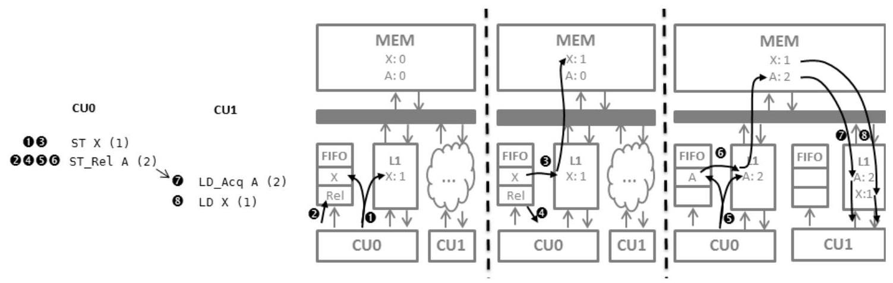
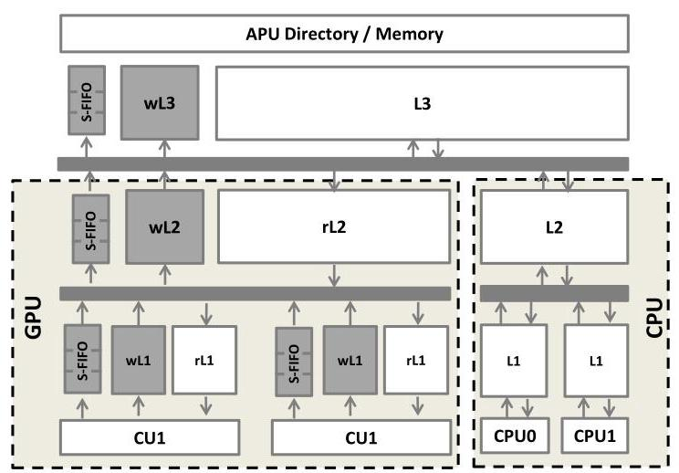
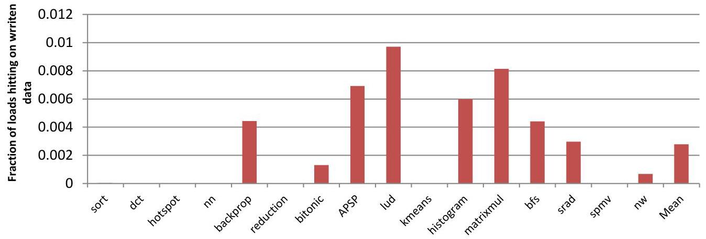
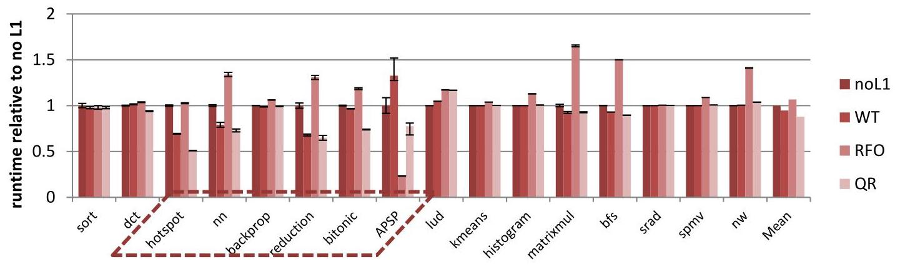
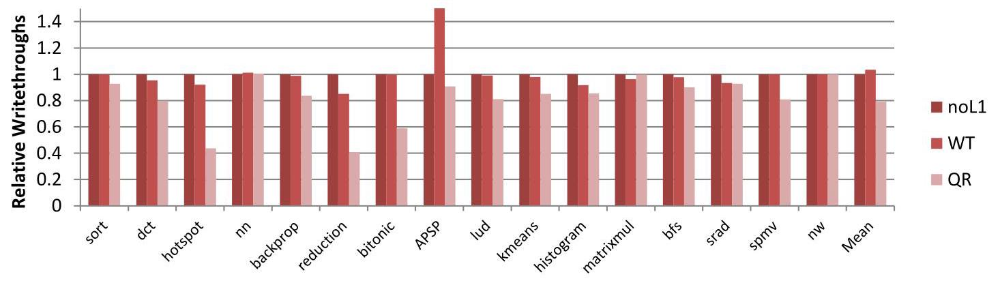
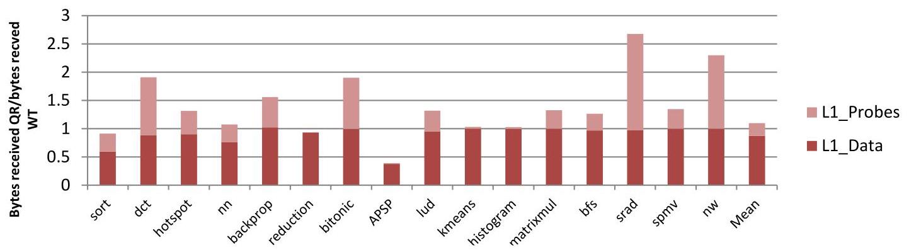
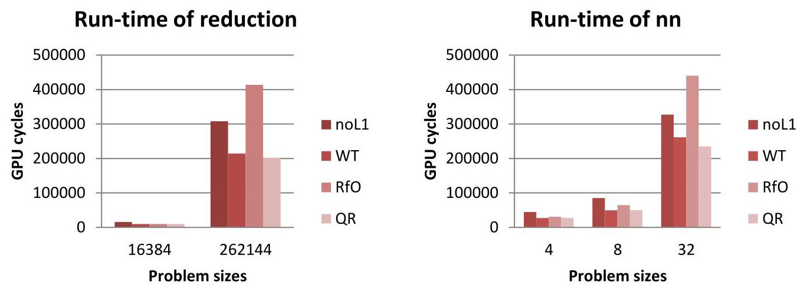

# QuickRelease: A Throughput-oriented Approach to Release Consistency on GPUs 深度解读

> **作者**：Blake A. Hechtman, Shuai Che, Derek R. Hower, Yingying Tian, Bradford M. Beckmann, Mark D. Hill, Steven K. Reinhardt, David A. Wood  
> **会议/期刊**：HPCA 2014  
> **一句话总结**：QuickRelease 用 S-FIFO 追踪 GPU write-combining cache 中尚未按 release 顺序完成的写入，并把读写 cache 资源分离，从而在不引入 CPU 式 RFO coherence 开销的前提下支持更细粒度的 GPU release consistency。

## 一、问题定义

这篇论文处理的是一个很典型的 GPU 架构扩展矛盾：GPU 原本靠吞吐导向的 memory system 获得性能，常见程序以 streaming access、显式 scratchpad、粗粒度同步为主；但 GPGPU 和 HSA 方向希望 GPU 支持 flat addressing、CPU/GPU coherent shared memory、fine-grain synchronization，以及更容易推理的 release consistency。问题是，一旦 GPU 需要更频繁地执行 `StRel`、`LdAcq`、barrier、kernel begin/end 这类同步操作，传统 GPU 的 write-through 或 cache flush 机制会放大同步开销，而直接照搬 CPU 的 "read for ownership" (RFO) coherence 又会破坏 GPU 写入吞吐。

这属于非 First 类型工作。原始问题是 GPU 如何在共享内存和 release consistency 下保证同步顺序。已有 GPU 通常采用 write-through L1、全局写绕过 L1、或在 fence 时 flush/invalidate L1。这样的设计在同步稀少时足够简单，但在细粒度同步下会频繁清空 cache，导致其他 wavefront 的可复用数据也被牵连。另一条路是 CPU 式 RFO coherence，它可以保留本地 dirty data 并让 acquire/release 更本地化，但每次写都要先获取独占权限，目录状态、MSHR、ack 和失效流量都会成为 GPU 大量并发写入的瓶颈。

**动机评估**：动机是 solid 的。论文没有只停留在抽象论证，而是把 HSA release consistency、GPU 当前 WT 实现、RFO GPU coherence、write-combining cache 的同步 flush 成本放在同一个设计空间里比较。实验也显示 QR 相比 WT 平均提速 7%，相比 RFO 快 20%，在更频繁同步的 workload 上相对 WT 最高有 42% 提升。薄弱之处是它对“未来 workload 会更细粒度同步”的判断依赖两个 microbenchmark 和趋势判断，覆盖面有限，但这个假设与 HSA 和 GPGPU 可编程性方向是一致的。

**核心 Insight**：GPU 需要的不是完整 CPU coherence，而是“在 release 点之前，把相关写入按顺序推进到全局可见点”。因此，write-combining cache 可以继续保持高吞吐、无 RFO 的写路径，只要额外维护一个能在 release 时按顺序驱动脏块写回的轻量结构。QR 的 S-FIFO 正是把 synchronization ordering 从 cache walk 和 coherence permission 中剥离出来：正常写入仍然懒惰合并，release 只需要插入 marker 并等待 marker 前面的写入出队。

## 二、相关工作

论文把相关工作组织成三条主线。第一条是当前 GPU global synchronization。NVIDIA Kepler 类设计对 globally visible writes 禁用 L1，fence 只等 outstanding writes；AMD Southern Islands 类设计允许 L1 缓存全局写，因此 fence 需要 invalidate/flush L1。前者牺牲 cache reuse，后者引入 cache walk，二者都假设全局同步不频繁。

第二条是 release consistency 和 CPU 式 RFO coherence。HSA memory model 采用 RC，并引入 `LdAcq` 和 `StRel`，因此硬件需要让 acquire/release 有可预测语义。RFO coherence 是 CPU 上成熟的方案，通过 single-writer/multiple-reader invariant 维护一致性，但放到 GPU 上会让每次写先获取独占权限，还需要目录、sharer state、MSHR 和 recall 机制。Singh 等关于 GPU coherence 的工作已经指出 naive CPU-like RFO 会带来显著开销；本文实验也显示 RFO 在总体上比无 L1 还慢 6%。

第三条是用 FIFO 或 lazy write-through 管理弱一致性顺序的机制。VIPS-m 会在同步完成前 lazy write-through shared data，但依赖 MSHR 跟踪单个 lazy writes；CPU store queue、store-wait-free systems、TCC 的 address FIFO 都体现了“按逻辑顺序记录写入”的思想。QR 借鉴的是 FIFO ordering 这个抽象，但它不用 FIFO 做事务冲突检测，也不把整个 cache 改造成 CPU store queue，而是在吞吐导向的 write-combining cache 外面包一层 S-FIFO。

## 三、技术挑战

1. **release ordering 不能靠重型 cache walk 实现**。传统 write-combining cache 在 release 时要遍历 cache 找出 dirty blocks。GPU L1 被多个 wavefront 共享，一个 wavefront 同步会占用 cache ports 并干扰其他 wavefront 的数据复用。

2. **不能把写路径变成 RFO latency path**。GPU streaming write 的吞吐来自“写可以直接进入 cache 或 buffer，不必先读整行并拿独占权限”。RFO 的权限获取和 ack 在 CPU 上合理，但在 GPU 上会增加写延迟并削弱 bandwidth scalability。

3. **write-combining cache 的 byte dirty tracking 有状态成本**。如果一个 64-byte cache line 要支持不同 writer 写不同 byte，常见 dirty-byte bitmask 就有 12.5% overhead。若所有读写 cache line 都承担这个状态，成本会变高。

4. **读写分离后仍要保持单线程 read-after-write 语义**。如果写进入 wL1，而读优先查 rL1，那么同一线程后续读取同一地址可能看到 stale data。QR 需要用 written bit、write-cache lookup 和必要的 write-through 来弥补这个分离带来的语义风险。

5. **失效必须足够精确，但又不能成为 critical path**。release 前不仅要让 prior writes 到达全局可见点，还要避免其他 rL1/rL2 保留 stale clean data。QR 选择在 write-cache eviction 时广播 invalidation，但这些 invalidation 不能像强 coherence 那样阻塞普通写入。

## 四、解决方案

### 整体思路

QuickRelease 的核心做法是把 GPU cache hierarchy 拆成 read-only cache 和较小的 write-only cache，并在每级 write cache 旁边放一个 synchronization FIFO (S-FIFO)。普通 store 直接进入 wL1，同时把地址插入 L1 S-FIFO；地址到达 FIFO 头部或 cache replacement 触发时，相关 dirty block 被向下一级写出。release 操作插入一个特殊 marker，并驱动 marker 前面的 FIFO 项出队；当 marker 最终到达 wL3 头部时，系统知道该 wavefront 之前的写已经到达 ordering point，于是 release 完成。acquire 则可以作为轻量 load 处理，因为 release 路径已经确保相应 stale read cache copy 被 invalidated。

图 1 的关键不是把 FIFO 当成数据存储，而是把它当成“同步顺序账本”。写入 `X` 时，数据留在 write-combining cache 中等待合并；`StRel` 插入 release marker 后，cache controller 只需要让 marker 前的地址逐个推动相关脏块写出。这样 release 不必扫描整个 cache，也不必让其他 wavefront 的 clean data 被无差别清掉。

### 贯穿示例

可以把 QR 想成两个 GPU wavefront 用 `X` 和 `flag` 通信：生产者先写 `X=1`，再执行 `StRel(flag=1)`；消费者反复 `LdAcq(flag)`，看到 `1` 后读取 `X`。在 WT GPU 中，生产者 release 可能要等待所有 prior writes 写穿，消费者 acquire/kernel begin 可能让 L1 失效，导致许多无关数据也被丢掉。在 RFO GPU 中，生产者写 `X` 和 `flag` 前需要获取对应 cache line 的 exclusive permission，细粒度同步很快，但大量 GPU 写会被权限协议拖慢。QR 的路径是：生产者写 `X` 到 wL1 并登记到 S-FIFO；`StRel(flag=1)` 插入 marker 并等待 `X` 被推到下一级乃至全局顺序点；`flag` 写出后消费者的 `LdAcq` 看到它，就可以相信 prior write `X` 已经可见，并且旧的 rL1/rL2 copy 已经被失效。

### 关键技术点

**S-FIFO 是同步顺序机制，不是普通写缓冲的替代品**。S-FIFO 里保存的是“可能仍在 write cache 中 dirty 的地址”的超集，有些地址对应的数据可能已经被 replacement 写出。这个超集性质让实现保持简单：release 只要按 FIFO 顺序推动出队，不需要 CAM 查找或全 cache walk。论文也讨论过按 wavefront/thread/work-group 拆分 FIFO，但认为收益很小，还可能破坏某些程序依赖的 transitivity。

**多级 cache hierarchy 中每一级都有自己的 S-FIFO**。图 2 展示的 APU-like 系统包含 GPU 侧 rL1/wL1、rL2/wL2，以及 memory-side wL3/L3。写从 wL1 逐级向下传播，marker 也像普通写一样穿过各级 S-FIFO；只有 marker 到达最后一级 write-combining memory 的头部，release 才真正完成。

图 2 说明 QR 不是给 GPU 加一个完整 CPU directory coherence hierarchy，而是在现有 GPU cache hierarchy 的写路径旁边增加较小的 write-only cache 和 FIFO。论文的参数表中，QR 额外状态约 80 kB，包括 4 kB wL1、16 kB wL2、32 kB wL3，以及 64/128/256 entries 的三级 S-FIFO；相比之下 RFO 需要 256 kB directory、1024 个 MSHR，总额约 384 kB。

**读写分离降低写支持成本**。普通 load 先查 read cache，如果命中且 written bit 未置位，就完全不碰 write cache；如果 miss 或 written bit 置位，再查 write cache，看 dirty bytes 是否足以满足 load。这样 dirty-byte bitmask 只需要放在 write-only cache 中，read cache 可以靠近寄存器文件优化 read hit latency，write cache 可以靠近 L2 bus interface 优化写带宽。

图 3 支撑了这个设计选择：许多 GPGPU workload 几乎不会马上读取自己刚写过的 L1 line，因为常见模式是一个 kernel 读输入数组、写输出数组，下一个 kernel 再读输出。这意味着 QR 为 read-after-write 付出的额外 tag lookup 成本通常不在热路径上。

**invalidation 被绑定到 dirty eviction，而不是绑定到每个 store**。wL2 eviction 会 invalidate local rL2 并广播到各 rL1；wL3 eviction 会向 CPU cluster 发送 invalidation，然后再写入 L3 或主存。由于 invalidation 只影响同步完成，不阻塞普通 store 的完成，QR 避免了强 coherence 中 store 等待 ack 的 critical path。

**acquire 可以做得很轻**。QR 的 release 机制已经保证，若 `LdAcq` 读到某个先前 `StRel` 写出的值，则释放方 prior writes 已经到达主存，相关 read-only cache stale copy 也已失效。因此 `LdAcq` 本身不需要像 WT 方案那样触发全局 L1 invalidation。

### 与已有方案的对比

与 WT GPU 相比，QR 的优势是 release 不需要全 cache flush，kernel/acquire 边界也能保留更多 read cache reuse；劣势是多了 write cache、S-FIFO 和 invalidation 流量。与 RFO 相比，QR 保留了 GPU 写入无需先获取独占权限的吞吐路径，并且状态开销更小；劣势是 RFO 在极端细粒度、强本地复用的场景下可能更快，例如 APSP 中 RFO 的本地 L1 acquire/release 行为减少了分支发散和 kernel launches。

## 五、实验评估

### 实验设定

论文在 gem5 上扩展了 GPU microarchitectural timing model，直接执行 HSA Intermediate Language (HSAIL)。OpenCL 应用先生成 x86 binary 并链接适配 gem5 syscall emulation 的 OpenCL library，kernel 使用工业编译器编译为 HSAIL。系统是 APU-like 架构，CPU 和 GPU 共享 virtual memory、directory 和 DRAM controller，GPU 有 8 个 CU，每个 CU 支持 40 个 wavefront，频率 1 GHz，内存为 4 channel DDR3 400 MHz。

对比对象包括：禁用 coherent L1 的 no-L1 类设计、传统 write-through (WT) GPU memory system、理论化的 GPU RFO coherence、以及 QR。workload 来自 AMD APP SDK、OpenDwarfs、Rodinia，以及两个强调数据复用和同步的 microbenchmark：APSP 和 sort。主要指标包括相对运行时间、L2 到 directory 带宽、DRAM write-through requests、L1 invalidation/data traffic、总 DRAM accesses、估算 memory/network power，以及 nn/reduction 随输入规模变化的 scalability。

### 主要实验与结论

图 5 是核心性能结果。QR 相比 WT 平均提速 7%；WT 相比 no-L1 只有 5% 提升；RFO 相比 no-L1 反而慢 6%，主要因为写操作必须先获取 exclusive coherence permissions。对中等 L1 reuse 的 7 个 workload，QR 在其中 6 个上比 WT 快 6% 到 42%，因为 WT 频繁 full cache invalidation 无法跨 kernel boundary 或 `LdAcq` 复用数据。

APSP 是一个有意思的例外侧面：它在 kernel 内频繁使用 `LdAcq` 和 `StRel`。QR 已经能高效处理这些操作，但 RFO 在本地 L1 上完成 acquire/release 更快，导致更少 branch divergence 和 kernel launches，因此 APSP 上 RFO 也很强。相反，lud 是 QR 的弱点，因为它有最高的 temporal read-after-write rate，并且 CU 之间 false sharing 高，QR 的读写分离和 cache-line granular invalidation 成本被放大。

图 6 和图 7 说明 QR 的性能不是单纯来自“更大 cache”，而来自更有效的 write combining。论文报告 QR 到 memory controller 的带宽平均降低 52%，多数应用在 DRAM 侧看到的 write requests 明显少于 WT 或 no-L1。nn 和 nw 的收益有限，因为这些应用缺乏额外 write combining 机会，写入多为整 cache line 且每个地址只写一次。

图 8 展示 QR invalidation 的代价。加入 invalidation 后，某些 workload 中到达 L1 的总字节数可达到 WT 的 3 倍，但平均值为 103%，接近 WT。APSP 甚至显著减少了总体 L1 traffic，因为 WT 中频繁 `LdAcq` 和后续 invalidation 会让 L1 hit rate 变成 0%。论文据此认为，未来若 off-chip 数据减少更重要，QR 增加的 on-chip invalidation traffic 是可接受的。

图 10 支撑了“RFO scalability 不适合 GPU 吞吐路径”的论点。nn 和 reduction 在小输入上几种 memory system 类似；输入变大后，memory system 压力上升，QR 的低写开销和 write combining 让它相对 RFO 和 WT 更有优势。

### 结论支撑性分析

实验整体能支撑论文主张：QR 在普通 GPGPU workload 上没有牺牲 streaming 性能，在中等 reuse 和频繁同步场景中明显优于 WT，并避免 RFO 在大量写入下的权限协议开销。数字上，7% 平均性能提升、最高 42% workload 提升、52% memory-controller bandwidth reduction、RFO 平均落后 no-L1 6%、QR 比 RFO 快 20%，都直接对应论文的核心论点。

局限也比较明确。第一，所谓“未来细粒度同步 workload”主要由 APSP 和 sort 两个 microbenchmark 代表，范围偏窄。第二，RFO 是“theoretical MOESI coherence protocol implemented on a GPGPU”，其具体优化程度会影响对比结论。第三，论文对 power 只做估算，基于 GPUWattch 中 memory 30% power、network 10% power 的比例推导 QR 节省 5% memory power、增加 3% network power，而不是完整电路级实现。

## 六、附加洞察

**结论 1**：GPU workload 的 read-after-write locality 通常很低，读写 cache 分离的性能风险小于直觉预期。  
- *出处*：Section 3.2 / Figure 3  
- *推理链条*：作者先用 RFO 系统统计“读请求命中过已写 L1 block”的比例，发现多个应用几乎没有这种 reuse；再解释常见 GPU kernel 是读一个数组、写另一个数组，下一次读取通常发生在后续 kernel，此时原数据已被替换或同步边界改变；因此，QR 让 RAW load 多一次 tag lookup 的成本只会在少数 workload 上明显暴露，lud 正是这个反例。

**结论 2**：额外 cache 容量本身并不能解释 QR 的收益。  
- *出处*：Section 4.1 / Table 1 附近  
- *推理链条*：QR 相比 WT 多了约 80 kB 状态，作者为了公平测试过给 WT 加倍 L1 容量；结果额外容量收益很小，因为 benchmark 缺少足够 temporal locality，且 WT 在 kernel launch 时必须 flush/invalidate cache；因此 QR 的收益来自同步顺序管理和 write combining，而不是简单容量优势。

**结论 3**：RFO 在某些强同步 workload 上可以很快，但这个优势不代表它适合 GPU 总体设计。  
- *出处*：Section 5.1 / APSP 讨论  
- *推理链条*：APSP 在 kernel 内频繁使用 `LdAcq` 和 `StRel`，RFO 可以在本地 L1 更快完成这些同步相关访问，从而减少 branch divergence 和 kernel launches；但总体上 RFO 因每次写前获取 exclusive permission 而平均比 no-L1 慢 6%，并在规模增大时扩展性变差；所以 RFO 的局部胜利不推翻 QR 的吞吐导向设计目标。

**结论 4**：QR 的 precise invalidation 并不免费，但平均成本没有压倒收益。  
- *出处*：Section 5.3 / Figure 8  
- *推理链条*：QR 在 wL2/wL3 dirty eviction 时广播 invalidation，会让部分 workload 的 L1 入站 traffic 达到 WT 的 3 倍；但平均为 103%，并且一些 workload 因保留跨同步的 read cache reuse 反而减少数据响应流量；因此，作者认为增加 on-chip invalidation traffic 可以换取 off-chip memory traffic reduction。

**结论 5**：lud 暴露了 QR 的边界条件。  
- *出处*：Section 5.1 / Figure 3 和 Figure 5  
- *推理链条*：lud 有最高的 temporal read-after-write 行为，这让读写 cache 分离的额外访问路径变成显性成本；同时它有较高 CU 间 false sharing，导致 QR 的 cache-line invalidation 降低 L1 效率；因此 lud 上 no-L1 反而更好，说明 QR 最适合 low-RAW、write-combining 机会明显、同步不要求 CPU 式本地 dirty reuse 的 GPU 程序。

## 七、总结与评价

QuickRelease 的贡献在于把 release consistency 的核心需求精确收敛为“按 release 顺序推进 prior writes”，而不是把 GPU memory system 改造成完整 CPU coherence。S-FIFO 让 write-combining cache 不再需要 release-time cache walk，读写分离又把 dirty-byte tracking 状态限制在较小的 write cache 中，这两个设计共同保住了 GPU 的吞吐路径。

最大亮点是问题拆解清楚：QR 没有追求最强一致性或最低单次同步延迟，而是面向 GPU 的 throughput constraint 做了一个折中。最大不足是 workload 时代性和未来同步假设偏早期，且 power/area 讨论仍偏估算。后续值得继续研究的方向包括：更精细的 invalidation filtering、面向现代 GPU memory model 的实现映射、以及在真实 HSA/ROCm 风格 workload 上复验 QR 的收益。

## 八、章节脉络与段落速览

- **Abstract**：摘要说明 GPU 需要 cache/coherence 支持更通用的程序，但 CPU 式 RFO 不适合吞吐导向 GPU，并概括 QR 的 S-FIFO 与读写资源分区。
  - ¶1 交代 GPU memory system 从图形/streaming workload 走向 GPGPU fine-grain synchronization 的背景。
  - ¶2 提出 QR 的两个机制：用 FIFO 维护写的 partial order，以及分区读写资源降低写对读性能的影响。
  - ¶3 给出主要结果：平均 7% 提升、细粒度同步 workload 最高 42% 提升，并避免 RFO scalability 问题。

- **Section 1. Introduction**：引言从 GPU 扩展到通用计算的需求出发，指出 WT、write-combining flush 和 RFO 都有缺陷，再引出 S-FIFO 和读写分离。
  - ¶1 GPU 当前高吞吐来自面向 streaming 和粗粒度同步的专门化 memory system，但厂商希望支持 flat addressing、fine-grain sync 和 CPU/GPU coherence。
  - ¶2 作者警告不能直接借用 CPU RFO 或把共享数据全部设为 non-cacheable，因为二者都会伤害吞吐。
  - ¶3 write-combining cache 可保留局部性，但 release 时查找和驱逐 dirty data 的 cache walk 会阻碍细粒度同步。
  - ¶4-6 介绍 QR 用 S-FIFO 包裹 write-combining cache，并通过 release marker 等待 prior writes 出队来完成同步。
  - ¶7-8 用图 1 的两个 CU 通信例子解释写入、release marker、store/release 和 load/acquire 的时序。
  - ¶9 说明多级 write-combining cache 只需每级加入 S-FIFO，最后一级出队即可保证顺序。
  - ¶10-11 说明 dirty-byte bitmask 的成本，并引出 read-only/write-only cache 分离。
  - ¶12-13 概述实验结果和贡献，包括 52% bandwidth reduction、7% average speedup、20% over RFO，以及 S-FIFO 无需 CAM/MSHR/cache walk。
  - ¶14 给出后续章节安排。

- **Section 2. Background and Related Work**：本节建立 GPU 术语、当前同步机制、HSA release consistency、WT/RFO baseline 和 prior art 对比。
  - **2.1 GPU Terminology**：定义 work-item、wavefront、CU、work-group、kernel、barrier、LdAcq、StRel 等术语，统一 AMD/OpenCL 与 NVIDIA 命名。
  - **2.2 Current GPU Global Synchronization**：说明 Kepler 类设计禁用 L1 global writes，Southern Islands 类设计在 fence 时 flush/invalidate L1。
  - **2.3 Release Consistency on GPUs**：说明 RC 被 HSA 采用，`LdAcq`/`StRel` 提供 downward/upward fence，本文关注硬件实现。
  - **2.4 Supporting Release Consistency**：建立两个 baseline，现实 WT GPU 通过写穿和 fence 等待保证 RC，RFO GPU 通过目录和 single-writer/multiple-reader invariant 保证 coherence。
  - **2.5 Related Work**：把 Singh GPU coherence、Hechtman/Sorin consistency、VIPS-m、store queue、store-wait-free、TCC 与 QR 的 FIFO ordering 思路区分开。

- **Section 3. QuickRelease Operation**：本节详细描述 QR 在 APU-like hierarchy 中如何处理写、读、同步，以及为什么读写分离可接受。
  - ¶1-2 描述 QR 系统包含分离的 read/write cache，每级 write cache 旁有 S-FIFO，并保持 write-combining cache 的吞吐行为。
  - ¶3-5 概括 QR 两个改进：S-FIFO 避免同步 cache walk，读写分区降低状态成本；同时解释 S-FIFO 保存 dirty-address superset。
  - ¶6 说明后续子节依次讨论 write lifetime、read lifetime、release/acquire synchronization 和 read/write interaction。
  - **3.1.1 Normal Write Operation**：store 写入 wL1、地址入 S-FIFO、必要时置 rL1 written bit；wL2/wL3 eviction 触发下游 invalidation，atomic 直接发往 coherence point，CPU store 通过目录失效 GPU read cache。
  - **3.1.2 Normal Read Operation**：load 优先查 read cache，written bit 或 miss 时查 write cache；partial miss 会推动 dirty bytes 写穿，再向下一级请求数据；QR 依靠 eviction-time invalidation 清理 stale read copies。
  - **3.1.3 Synchronization**：release 插入 marker 并推动 S-FIFO 出队，marker 到达 wL3 头部后 ack；`StRel` 的 store 部分在 release 后作为普通 store 进行，`LdAcq` 因 stale data 已被 invalidated 而可作为 no-op load。
  - **3.2 Read/Write Partitioning Trade-offs**：用 Figure 3 说明 GPGPU 很少 read-after-write，并列出分区的实现收益：dirty bitmask 只在 write cache、两个单用途 cache 更易设计、read cache 和 write cache 可分别靠近寄存器文件与总线接口。

- **Section 4. Simulation Methodology and Workloads**：本节说明 gem5/HSAIL 模拟环境、APU-like 系统参数、baseline 配置和 benchmark 来源。
  - **4.1 The APU Simulator**：描述 gem5 GPU timing model、HSAIL 执行、CPU/GPU shared virtual memory、共享 directory/DRAM controller，以及 WT/RFO/QR 的主要容量参数。
  - **4.2 Benchmarks**：说明 workload 来自 AMD APP SDK、OpenDwarfs、Rodinia，并补充 APSP 和 sort 两个强调同步/复用的 microbenchmark。
  - **4.3 Re-use of the L1 Data Cache**：用 Figure 4 说明 workload 的 L1 reuse 范围很宽，并解释极高或极低 reuse 下三种 memory system 预计差异较小。

- **Section 5. Results**：结果章节从性能、目录流量、失效开销、总内存带宽、功耗估算和 RFO 扩展性六方面评估 QR。
  - **5.1 Performance**：QR 平均比 WT 快 7%，RFO 平均比 no-L1 慢 6%；中等 reuse workload 中 QR 相对 WT 有 6% 到 42% 提升，同时解释 APSP、backprop、lud、sort/srad/spmv/nw 等特殊行为。
  - **5.2 Directory Traffic**：QR 依靠 aggressive write-combining 减少 GPU cache hierarchy 到 APU directory 的总写流量，DRAM write requests 在多数应用上低于 WT。
  - **5.3 L1 Invalidation Overhead**：QR precise invalidation 可能让 L1 入站 traffic 达到 WT 的 3 倍，但平均为 103%，并在 APSP 等 workload 中因保留 reuse 反而减少总体 traffic。
  - **5.4 Total Memory Bandwidth**：RFO 可跨 kernel 保留 dirty data，因而读流量较少；QR/WT 不能响应 CPU probe data，所以在这点上不如 RFO。
  - **5.5 Power**：根据 GPUWattch 中 memory/network power 占比估算，QR 节省约 5% memory power、增加约 3% network power，整体能耗随性能提升而下降。
  - **5.6 Scalability of RFO**：nn 和 reduction 的规模实验显示，小输入下各系统接近，规模变大后 QR 的低写开销优于 latency-oriented RFO。

- **Section 6. Conclusion**：结论重申 QR 能在支持 fine-grain synchronization 的同时保持传统 GPU workload 性能。
  - ¶1 总结 QR 用 S-FIFO 避免高开销 cache walk，并通过读写 cache 分区降低写支持成本。
  - ¶2 说明评估同时对比 no-L1、WT 和理想化 RFO，结果表明 QR 获得了各 baseline 的较好性质。

- **References**：参考文献覆盖 HSA、GPU coherence、Rodinia、memory consistency/coherence、gem5、AMD/NVIDIA 架构资料和 GPUWattch。
