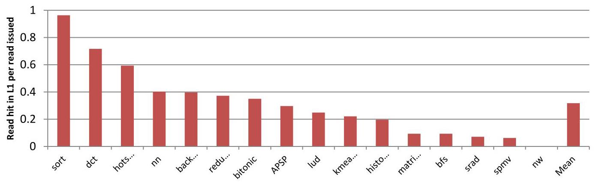
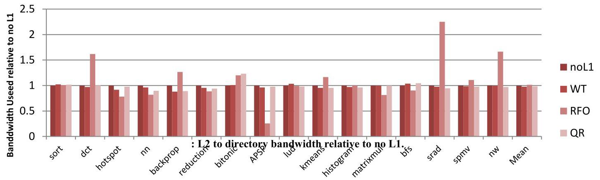
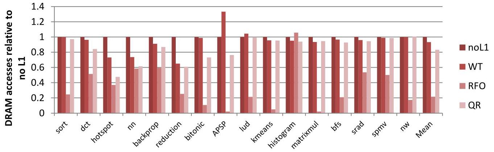

# QuickRelease: A Throughput-oriented Approach to Release Consistency on GPUs

Blake A. Hechtman ${}^{\dagger 8}$ , Shuai Che ${}^{ \dagger  }$ , Derek R. Hower ${}^{ \dagger  }$ , Yingying Tian ${}^{\dagger  \dagger  }$ , Bradford M. Beckmann ${}^{ \dagger  }$ , Mark D. Hill ${}^{\ddagger  \dagger  }$ , Steven K. Reinhardt ${}^{ \dagger  }$ , David A. Wood ${}^{\ddagger  \dagger  }$

> 
布莱克·A·赫克特曼 ${}^{\dagger 8}$，帅科 ${}^{ \dagger  }$，德里克·R·豪尔 ${}^{ \dagger  }$，田盈盈 ${}^{\dagger  \dagger  }$，布拉德福德·M·贝克曼 ${}^{ \dagger  }$，马克·D·希尔 ${}^{\ddagger  \dagger  }$，史蒂文·K·莱因哈特 ${}^{ \dagger  }$，大卫·A·伍德 ${}^{\ddagger  \dagger  }$

${}^{ \dagger  }$ Advanced Micro Devices,

> 
${}^{ \dagger  }$ 超威半导体，

Inc.

> 
公司

${}^{§}$ Duke University

> 
${}^{§}$ 杜克大学

Electrical and Computer

> 
电气与计算机

Engineering

> 
工程

‡University of Wisconsin-

> 
‡威斯康星大学-

Madison

> 
麦迪逊

Computer Sciences

> 
计算机科学

† Texas A&M University

> 
† 德克萨斯A&M大学

Computer Science and

> 
计算机科学与

Engineering

> 
工程

blake.hechtman@duke.edu

> 
blake.hechtman@duke.edu

\{derek.hower, shuai.che, \{markhill, david\}@cs.wisc.edu

> 
\{derek.hower, shuai.che, \{markhill, david\}@cs.wisc.edu

brad.beckmann,

> 
布拉德·贝克曼，

steve.reinhardt)@amd.com

> 
steve.reinhardt@amd.com

yingyingtian@tamu.edu

> 
yingyingtian@tamu.edu

## Abstract

Graphics processing units (GPUs) have specialized throughput-oriented memory systems optimized for streaming writes with scratchpad memories to capture locality explicitly. Expanding the utility of GPUs beyond graphics encourages designs that simplify programming (e.g., using caches instead of scratchpads) and better support irregular applications with finer-grain synchronization. Our hypothesis is that, like CPUs, GPUs will benefit from caches and coherence, but that CPU-style "read for ownership" (RFO) coherence is inappropriate to maintain support for regular streaming workloads.

> 
图形处理器（GPU）拥有专门的面向吞吐量的内存系统，这些系统针对流写入进行了优化，并使用暂存存储器以显式方式捕获局部性。将GPU的应用扩展到图形之外，鼓励了简化编程的设计（例如，使用缓存而非暂存器），并更好地支持具有更细粒度同步的不规则应用。我们的假设是，与CPU类似，GPU将受益于缓存和一致性，但CPU风格的“读取所有权”（RFO）一致性不适合维持对常规流工作负载的支持。

This paper proposes QuickRelease (QR), which improves on conventional GPU memory systems in two ways. First, QR uses a FIFO to enforce the partial order of writes so that synchronization operations can complete without frequent cache flushes. Thus, non-synchronizing threads in QR can re-use cached data even when other threads are performing synchronization. Second, QR partitions the resources required by reads and writes to reduce the penalty of writes on read performance.

> 
本文提出 QuickRelease（QR），它在两个方面改进了传统 GPU 内存系统。首先，QR 使用 FIFO 来强制写入的部分顺序，从而使同步操作能够完成而无需频繁的缓存刷新。因此，QR 中的非同步线程可以重用缓存数据，即使其他线程正在执行同步。其次，QR 划分读写所需的资源，以减少写操作对读性能的影响。

Simulation results across a wide variety of general-purpose GPU workloads show that QR achieves a 7% average performance improvement compared to a conventional GPU memory system. Furthermore, for emerging workloads with finer-grain synchronization, QR achieves up to 42% performance improvement compared to a conventional GPU memory system without the scalability challenges of RFO coherence. To this end, QR provides a throughput-oriented solution to provide fine-grain synchronization on GPUs.

> 
在多种通用GPU工作负载上的模拟结果显示，相比于传统GPU内存系统，QR实现了平均7%的性能提升。此外，对于具有更细粒度同步的新兴工作负载，QR相比于传统GPU内存系统实现了高达42%的性能提升，且没有RFO一致性的可扩展性挑战。为此，QR提供了一种面向吞吐率的解决方案，在GPU上实现细粒度同步。

## 1. Introduction

Graphics processing units (GPUs) provide tremendous throughput with outstanding performance-to-power ratios on graphics and graphics-like workloads by specializing the GPU architecture for the characteristics of these workloads. In particular, GPU memory systems are optimized to stream through large data structures with coarse-grain and relatively infrequent synchronization. Because synchronization is rare, current systems implement memory fences with slow and inefficient mechanisms. However, in an effort to expand the reach of their products, vendors are pushing to make GPUs more general-purpose and accessible to programmers who are not experts in the graphics domain. A key component of that push is to simplify graphics memory with support for flat addressing, fine-grain synchronization, and coherence between CPU and GPU threads [1].

> 
图形处理器（GPU）通过针对图形及类图形工作负载的特性进行架构专业化，在这些工作负载上提供了极高的吞吐量与卓越的能效比。具体而言，GPU内存系统经过优化，能够以粗粒度且相对不频繁的同步方式流式处理大型数据结构。由于同步操作较为罕见，当前系统采用缓慢且低效的机制来实现内存栅栏。然而，为了拓展其产品的应用范围，供应商正积极推动GPU向更通用化方向发展，力求让非图形领域的程序员也能轻松使用。这一推动的关键组成部分，便是通过支持平面寻址、细粒度同步以及CPU与GPU线程间的一致性来简化图形内存管理[1]。

However, designers must be careful when altering graphics architectures to support new features. While more generality can help expand the reach of GPUs, that generality cannot be at the expense of throughput. Notably, this means that borrowing solutions from CPU designs, such as "read for ownership" (RFO) coherence, that optimize for latency and cache re-use likely will not lead to viable solutions [2]. Similarly, brute-force solutions, such as making all shared data non-cacheable, also are not likely to be viable because they severely limit throughput and efficiency.

> 
然而，设计师在修改图形架构以支持新功能时必须谨慎。虽然更通用性有助于扩大 GPU 的应用范围，但这种通用性不能以牺牲吞吐量为代价。值得注意的是，这意味着借鉴 CPU 设计中的解决方案，例如为优化延迟和缓存重用而设计的“读所有权”（RFO）一致性，很可能不会带来可行的方案 [2]。类似地，诸如使所有共享数据不可缓存的暴力解决方案，也可能不可行，因为它们严重制约了吞吐量和效率。

Meanwhile, write-through (WT) GPU memory systems can provide higher throughput for streaming workloads, but those memory systems will not perform as well for general-purpose GPU (GPGPU) workloads that exhibit temporal locality [3]. An alternative design is to use a write-back or write-combining cache that keeps dirty blocks in cache for a longer period of time (e.g., until evicted by an LRU replacement policy). Write-combining caches are a hybrid between WT and write-back caches in which multiple writes can be combined before reaching memory. While these caches may accelerate workloads with temporal locality within a single wavefront (warp, 64 threads), they require significant overhead to manage synchronization among wavefronts simultaneously executing on the same compute unit (CU) and incur a penalty for performing synchronization. In particular, write-combining caches require finding and evicting all dirty data written by a given wavefront, presumably by performing a heavy-weight iteration over all cache blocks. This overhead discourages fine-grain synchronization that we predict will be necessary for broader success of GPGPU compute. To this end, no current GPUs use write-combining caches for globally shared data (however, GPUs do use write-combining caches for graphic specific operations such as image, texture, and private writes).

> 
与此同时，写直达（WT）GPU内存系统可以为流式工作负载提供更高的吞吐量，但对于表现出时间局部性的通用计算GPU（GPGPU）工作负载，这类内存系统的表现则不尽如人意[3]。另一种设计方案是使用写回或写合并缓存，将脏块在缓存中保留更长的时间（例如，直到被LRU替换策略逐出）。写合并缓存是WT与写回缓存的混合体，其中多个写操作可以在到达内存之前进行合并。虽然这些缓存可能加速单个波前（warp，64线程）内具有时间局部性的工作负载，但它们需要大量开销来管理同一计算单元（CU）上同时执行的波前之间的同步，并会因执行同步而产生代价。特别是，写合并缓存需要找到并逐出给定波前写入的所有脏数据，这大概是通过对所有缓存块进行重量级迭代来实现的。这种开销阻碍了我们预测对于GPGPU计算获得更广泛成功所必需的细粒度同步。为此，目前的GPU都没有将写合并缓存用于全局共享数据（不过，GPU确实将写合并缓存用于图像、纹理和私有写入等图形特定操作）。

Figure 1. Example of QuickRelease in a simple one-level graphics memory system.

> 
图 1. 简单一级图形内存系统中 QuickRelease 的示例。

In this paper, we propose a GPU cache architecture called QuickRelease (QR) that is designed for throughput-oriented, fine-grain synchronization without degrading GPU memory-streaming performance. In QR, we "wrap" conventional GPU write-combining caches with a write-tracking component called the synchronization FIFO (S-FIFO). The S-FIFO is a simple hardware FIFO that tracks writes that have not completed ahead of an ordered set of releases. With the S-FIFO, QR caches can maintain the correct partial order between writes and synchronization operations while avoiding unnecessary inter-wavefront interference cause by cache flushes.

> 
本文提出了一种名为QuickRelease（QR）的GPU缓存架构，专为面向吞吐量的细粒度同步设计，且不会降低GPU内存流传输性能。在QR中，我们通过一个称为同步FIFO（S-FIFO）的写入跟踪组件，对传统GPU写合并缓存进行“封装”。S-FIFO是一个简单的硬件FIFO，用于跟踪在一组有序释放操作之前尚未完成的写入。借助S-FIFO，QR缓存能够维护写入与同步操作之间的正确偏序关系，同时避免因缓存刷新导致的不必要的波前间干扰。

When a store is written into a cache, the address also is enqueued onto the S-FIFO. When the address reaches the head of the S-FIFO, the cache is forced to evict the cache block if that address is still present in the write cache. With this organization, the system can implement a release synchronization operation by simply enqueueing a release marker onto the S-FIFO. When the marker reaches the head of the queue, the system can be sure that all prior stores have reached the next level of memory. Because the S-FIFO and cache are decoupled, the memory system can utilize aggressive write-combining caches that work well for graphics workloads.

> 
当存储操作写入缓存时，地址也会被入队到S-FIFO中。当地址到达S-FIFO的头部时，如果该地址仍然存在于写缓存中，则强制缓存逐出该缓存块。通过这种组织方式，系统只需将释放标记入队到S-FIFO，即可实现释放同步操作。当该标记到达队列头部时，系统可以确定所有先前的存储操作都已到达下一级内存。由于S-FIFO与缓存解耦，内存系统可以利用积极的写组合缓存，这对于图形工作负载效果良好。

Figure 1 shows an example of QR. In the example, we show two threads from different CUs (a.k.a. NVIDIA streaming multi-processors) communicating a value in a simple GPU system that contains one level of write-combining cache.

> 
图1展示了QR的一个例子。在该示例中，我们展示了来自不同CU（又称NVIDIA流多处理器）的两个线程，在一个包含一级写结合缓存的简单GPU系统中通信一个值。

When a thread performs a write, it writes the value into the write-combining cache and enqueues the address at the tail of the S-FIFO (time0). The cache block then is kept in the L1 until it is selected for eviction by the cache replacement policy or its corresponding entry in the FIFO is dequeued. The controller will dequeue an S-FIFO entry when the S-FIFO fills up or a synchronization event triggers an S-FIFO flush. In the example, the release semantic of a store/release operation causes the S-FIFO to flush. The system enqueues a special release marker into the S-FIFO (2), starts generating cache evictions for addresses ahead of the marker (8), and waits for that marker to reach the head of the queue (4). Then the system can perform the store part of the store/release (G), which, once it reaches memory, signals completion of the release to other threads (G). Finally, another thread can perform a load/acquire to complete the synchronization (7) and then load the updated value of $X\left( \mathbf{8}\right)$ .

> 
当一个线程执行写操作时，它会将值写入写合并缓存，并将地址排入 S-FIFO 的尾部（时刻0）。然后，该缓存块会保留在 L1 中，直到缓存替换策略选择将其逐出，或者其在 FIFO 中的对应条目被出队。当 S-FIFO 填满或同步事件触发 S-FIFO 清空时，控制器会将一个 S-FIFO 条目出队。在该示例中，存储/释放操作的释放语义会导致 S-FIFO 清空。系统将一个特殊的释放标记排入 S-FIFO (2)，开始为标记之前的地址生成缓存逐出 (8)，并等待该标记到达队列头部 (4)。然后系统可以执行存储/释放的存储部分 (G)，一旦该存储到达内存，就向其他线程发出释放完成的信号 (G)。最后，另一个线程可以执行加载/获取以完成同步 (7)，然后加载 $X\left( \mathbf{8}\right)$ 的更新值。

An important feature of the QR design is that it can be extended easily to systems with multiple levels of write-combining cache by giving each level its own S-FIFO. In that case, a write is guaranteed to be ordered whenever it has been dequeued from the S-FIFO at the last level of write-combining memory. We discuss the details of such a multi-level system in Section 3.

> 
QR设计的一个重要特性是，它可以通过为每个层级分配独立的S-FIFO，轻松扩展到具有多级写合并缓存的系统。在这种情况下，当一个写入操作从写合并存储器的最后一级S-FIFO中出队时，该写入即保证被排序。我们在第3节中讨论这种多级系统的细节。

Write-combining caches in general, including QR caches, typically incur a significant overhead for tracking the specific bytes that are dirty in a cache line. This tracking is required to merge simultaneous writes from different writers to different bytes of the same cache line. Most implementations use a dirty-byte bitmask for every cache line (12.5% overhead for 64-byte cache lines) and write out only the dirty portions of a block on evictions.

> 
包括 QR 缓存在内的写合并缓存，通常需要承担显著的额外开销来追踪缓存行中具体哪些字节是脏的。这种追踪是合并不同写入者对同一缓存行中不同字节的同时写入所必需的。大多数实现会为每个缓存行使用一个脏字节位掩码（对于 64 字节缓存行，开销为 12.5%），并在逐出时仅写回块中已变脏的部分。

Figure 2: Baseline accelerated processing unit system. QR-specific parts are all S-FIFOs, wL1s, wL2, and wL3 (all smaller than rL1, rL2 and L3).

> 
图 2：基线加速处理单元系统。QR 特定部件包含所有 S-FIFO、wL1s、wL2 和 wL3（均小于 rL1、rL2 和 L3）。

To reduce the overhead of byte-level write tracking, QR separates the read and write data paths and splits a cache into read-only and (smaller) write-only sub-caches. This separation is not required, but allows an implementation to reduce the overhead of writes by providing dirty bitmasks only on the write-only cache. The separation also encourages data path optimizations like independent and lazy management of write bandwidth while minimizing implementation complexity. We show that because GPU threads, unlike CPU threads, rarely perform read-after-write operations, the potential penalty of the separation is low [4]. In fact, this separation leads to less cache pollution with write-only data.

> 
为了降低字节级写跟踪的开销，QR 将读写数据路径分离，并将缓存拆分为只读子缓存和（更小的）只写子缓存。这种分离并非必需，但允许实现通过仅在只写缓存上提供脏位掩码来减少写开销。该分离还有助于数据路径优化，例如独立的、延迟的写带宽管理，同时最小化实现复杂度。我们表明，由于 GPU 线程与 CPU 线程不同，极少执行写后读操作，因此分离的潜在代价很低 [4]。事实上，这种分离还减少了只写数据带来的缓存污染。

Experimental comparisons to a traditional GPGPU throughput-oriented WT memory system and to an RFO memory system demonstrate that QR achieves the best qualities of each design. Compared to the traditional GPGPU memory system, bandwidth to the memory controller was reduced by an average of 52% and the same applications ran 7% faster on average. Further, we show that future applications with frequent synchronization can run integer factors faster than a traditional GPGPU memory system. In addition, QR does not harm the performance of current streaming applications while reducing the memory traffic by 3% compared to a WT memory system. Compared to the RFO memory system, QR performs 20% faster. In fact, the RFO memory system generally performs worse than a system with the L1 cache disabled.

> 
与传统面向吞吐量的 GPGPU 直写（WT）内存系统以及 RFO 内存系统的实验对比表明，QR 兼具了每种设计的优点。与传统 GPGPU 内存系统相比，到内存控制器的带宽平均减少了52%，同样的应用程序平均运行速度提高了7%。此外，我们证明，具有频繁同步的未来应用程序的运行速度可比传统 GPGPU 内存系统快整数倍。同时，QR 不会损害当前流式应用程序的性能，并且与 WT 内存系统相比，内存流量降低了3%。与 RFO 内存系统相比，QR 的性能提升了20%。事实上，RFO 内存系统的性能通常比禁用 L1 缓存的系统还要差。

In summary, this paper makes the following contributions:

> 
总之，本文做出以下贡献：

- We augment an aggressive, high-throughput, write-combining cache design with precise write tracking to make synchronization faster and cheaper without the need for L1 miss status handling registers (MSHRs).

> 
- 我们通过精确写跟踪增强了一种激进的高吞吐量写合并缓存设计，使同步更快且成本更低，无需L1缺失状态处理寄存器（MSHR）。

- We implement write tracking efficiently using S-FIFOs that do not require expensive CAMs or cache walks, which prevent inter-wavefront synchronization interference due to cache walks.

> 
- 我们使用S-FIFO高效实现写追踪，这些S-FIFO无需昂贵的CAM或缓存遍历，从而避免了因缓存遍历导致的波前间同步干扰。

- Because writes require an additional byte mask in a write-combining cache, we optionally separate the read and write data paths to decrease state storage.

> 
- 由于写入操作在写合并缓存中需要额外的字节掩码，我们可以选择性地分离读取和写入数据路径，以减少状态存储。

In this paper, Section 2 describes current GPGPU memory systems and prior work in the area of GPGPU synchronization. Section 3 describes QR by describing its design choices and how it performs memory operations and synchronization. Section 4 describes the simulation environment for our experiments and the workloads we used. Section 5 evaluates the merits of QR compared to both a traditional GPU memory system and a theoretical MOESI coherence protocol implemented on a GPGPU.

> 
本文中，第2节描述了当前GPGPU内存系统及GPGPU同步领域的先前工作。第3节通过描述QR的设计选择及其执行内存操作与同步的方式来介绍QR。第4节描述了实验所用的仿真环境和工作负载。第5节评估了QR相较于传统GPU内存系统以及在GPGPU上实现的理论MOESI一致性协议的优势。

## 2. Background and Related Work

This section introduces the GPU system terminology used throughout the paper and describes how current GPU memory systems support global synchronization. Then we introduce release consistency (RC), the basis for the memory model assumed in the next sub-section and the model being adopted by the Heterogeneous System Architecture (HSA) specification, which will govern designs from AMD, ARM, Samsung, and Qualcomm, among others. We also describe the memory systems of two accelerated processing units (APUs-devices containing a CPU, GPU, and potentially other accelerators) that obey the HSA memory model for comparison to QR: a baseline WT memory system representing today's GPUs, and an RFO cache-coherent memory system, as typically used by CPUs, extended to a GPU. Finally, in Section 2.5, we discuss how QR compares to prior art.

> 
本节介绍全文使用的 GPU 系统术语，并描述当前 GPU 内存系统如何支持全局同步。随后，我们引入释放一致性（release consistency，RC），它既是下一小节所假设内存模型的基础，也是异构系统架构（HSA）规范正在采用的内存模型；该规范将主导 AMD、ARM、Samsung 和 Qualcomm 等公司的设计。我们还描述了两个遵循 HSA 内存模型的加速处理单元（APU——包含 CPU、GPU，并可能包含其他加速器的设备）的内存系统，以与 QR 进行比较：一个是代表当今 GPU 的基线 WT 内存系统，另一个是通常由 CPU 使用、并已扩展至 GPU 的 RFO 缓存一致性内存系统。最后，在第 2.5 节中，我们讨论了 QR 与现有技术的比较情况。

#### 2.1.GPU Terminology

The paper uses AMD and OpenCL ${}^{\mathrm{{TM}}}$ terminology [5] to describe GPU hardware and GPGPU software components. The NVIDIA terminology [6] is in parentheses.

> 
本文使用 AMD 和 OpenCL ${}^{\mathrm{{TM}}}$ 术语 [5] 来描述 GPU 硬件和 GPGPU 软件组件。NVIDIA 术语 [6] 放在括号内。

- Work-item (thread): a single lane of GPU execution.

> 
- 工作项（线程）：GPU执行的一个通道。

- Wavefront (warp): 64 work-items executing a single instruction in lock-step over four cycles on a 16-wide SIMD unit with the ability to mask execution based on divergent control flow. This now is known as a subgroup in OpenCL 2.0.

> 
- 波前（warp）：在 16 宽 SIMD 单元上，64 个工作项分四个周期以锁步方式执行单条指令，并能根据分支控制流屏蔽执行。这在 OpenCL 2.0 中现称为子组（subgroup）。

- Compute unit (streaming multi-processor): a cluster of four SIMD units that share a L1 cache and multiplexes execution among 40 total wavefronts.

> 
计算单元（流式多处理器）：由四个共享一个L1缓存的SIMD单元组成的集群，并在总共40个波前之间多路复用执行。

- Work-group (thread block): a group of work-items that must be scheduled to a single CU.

> 
- 工作组 (线程块): 一组必须调度到单个 CU 的工作项。

- NDRange (grid): a set of work-groups.

> 
- NDRange（网格）：一组工作组的集合。

- Kernel: a launched task including all work-items in an NDRange.

> 
内核：一个已启动的任务，包含 NDRange 中的所有工作项。

- Barrier: an instruction that ensures all work-items in a work-group have executed it and that all prior memory operations are visible globally before it completes.

> 
- 屏障：一种指令，它确保工作组中的所有工作项均已执行该指令，并且在屏障完成之前，所有先前的内存操作在全局可见。

- LdAcq: Load acquire, a synchronizing load instruction that acts as downward memory fence such that later operations (in program order) cannot become visible before this operation.

> 
- LdAcq：加载获取（Load Acquire），一种充当向下内存屏障的同步加载指令，使得后续操作（按程序顺序）在此操作之前不可见。

- StRel: Store release, a synchronizing store instruction that acts like an upward memory fence such that all prior memory operations (in program order) are visible before this store.

> 
- StRel：存储释放，一种同步存储指令，作用类似于向上内存屏障，使得所有先前的内存操作（按程序顺序）在该存储之前可见。

### 2.2. Current GPU Global Synchronization

Global synchronization support in today's GPUs is relatively simple compared to CPUs to minimize microarchitecture complexity and because synchronization primitives currently are invoked infrequently. Figure 2 illustrates a GPU memory system loosely based on current architectures, such as NVIDIA's Kepler [7] or AMD's Southern Islands [8], [9]. Each CU has a WT L1 cache and all CUs share a single L2 cache. Current GPU memory models only require stores to be visible globally after memory fence operations (barrier, kernel begin, and kernel end) [5]. In the Kepler parts, the L1 cache is disabled for all globally visible writes. Therefore, to implement a memory fence, that architecture only needs to wait for all outstanding writes (e.g., in a write buffer) to complete. The Southern Islands parts use the L1 cache for globally visible writes; therefore, the AMD parts implement a memory fence by invalidating all data in the L1 cache and flushing all written data to the shared L2 (via a cache walk) [8].

> 
与CPU相比，当今GPU中的全局同步支持相对简单，以最大限度地降低微架构复杂性，同时也是因为同步原语目前并不经常被调用。图2展示了一个大致基于当前架构（如NVIDIA的Kepler [7] 或 AMD的Southern Islands [8], [9]）的GPU内存系统。每个计算单元（CU）具有一个写通（WT）L1缓存，所有CU共享一个单一的L2缓存。当前的GPU内存模型仅要求存储操作在内存栅栏操作（屏障、内核启动和内核结束）之后全局可见[5]。在Kepler部件中，对于所有全局可见的写操作，L1缓存被禁用。因此，为了实现内存栅栏，该架构只需等待所有未完成的写操作（例如，在写缓冲区中的）完成。Southern Islands部件使用L1缓存进行全局可见写操作；因此，AMD的部件通过将L1缓存中的所有数据无效化，并将所有已写入数据刷新到共享L2（通过缓存遍历）来实现内存栅栏[8]。

### 2.3. Release Consistency on GPUs

RC [10] has been adopted at least partially by ARM [11], Alpha [12], and Itanium [13] architectures and seems like a reasonable candidate for GPUs because it is adequately weak for many hardware designs, but strong enough to reason easily about data races. In addition, future AMD and ARM GPUs and APUs will be compliant with the HSA memory model, which is defined to be RC [1]. The rest of this paper will assume that the memory system implementation must obey RC [14].

> 
RC [10] 至少已被 ARM [11]、Alpha [12] 和 Itanium [13] 架构部分采用，并且似乎是 GPU 的一个合理候选，因为它对于许多硬件设计来说足够弱，但又足够强，能够容易地推理数据竞争。此外，未来的 AMD 和 ARM GPU 与 APU 将符合 HSA 内存模型，该模型被定义为 RC [1]。本文的其余部分将假设内存系统实现必须遵守 RC [14]。

The HSA memory model [15] adds explicit LdAcq and StRel instructions. They will be sequentially consistent. In addition, they will enforce a downward and upward fence, respectively. Unlike a CPU consistency model, enforcing the HSA memory model is not strictly the job of the hardware; it is possible to use a finalizer (an intermediate assembly language compiler) to help enforce consistency with low-level instructions. In this paper, we consider hardware solutions to enforcing RC.

> 
HSA 内存模型 [15] 增加了显式的 LdAcq 和 StRel 指令。它们将是顺序一致的。此外，它们将分别实施向下围栏和向上围栏。与 CPU 一致性模型不同，实施 HSA 内存模型并不完全是硬件的职责；可以使用终结器（一种中间汇编语言编译器）来帮助利用低级指令实施一致性。在本文中，我们考虑实施 RC 的硬件解决方案。

### 2.4. Supporting Release Consistency

In this section, two possible baseline APU implementations of RC are described. The first is a slight modification to the system described in Section 2.2. The second is a naïve implementation of a traditional CPU RFO cache-coherence protocol applied to an APU. Both support RC as specified.

> 
本节描述了两种可能的RC基线APU实现方案。第一种是对第2.2节所述系统的轻微修改。第二种是将传统的CPU RFO缓存一致性协议应用于APU的朴素实现。两者均按规范支持RC。

#### 2.4.1. Realistic Write-through GPU Memory System

The current GPU memory system described in Section 2.2 can adhere to the RC model between the CPU and GPU requests by writing through to memory via the APU directory. This means that a release operation (kernel end, barrier, or StRel) will need to wait for all prior writes to be visible globally before executing more memory operations. In addition, an acquiring memory fence (kernel begin or LdAcq) will invalidate all clean and potentially stale L1 cache data.

> 
第2.2节中描述的当前GPU内存系统可以通过APU目录写穿至内存的方式，遵循CPU与GPU请求之间的RC模型。这意味着释放操作（内核结束、屏障或StRel）需要等待所有先前的写入在全局可见后才能执行更多的内存操作。此外，获取内存栅栏（内核开始或LdAcq）将使所有干净且可能过时的L1缓存数据失效。

#### 2.4.2. "Read for Ownership" GPU Memory System

Current multi-core CPU processors implement shared memory with write-back cache coherence [16]. As the RFO name implies, these systems will perform a read to gain ownership of a cache block before performing a write. In doing so, RFO protocols maintain the invariant that at any point in time only a single writer or multiple readers exist for a given cache block.

> 
当前多核CPU处理器通过写回缓存一致性实现共享内存 [16]。正如RFO这一名称所暗示的，这些系统在执行写入之前，会先执行一次读取以获取缓存块的所有权。通过这种方式，RFO协议维持了这样一个不变式：在任何时间点，一个给定的缓存块只能存在一个写入者或多个读取者。

To understand the benefit an RFO protocol can provide GPUs, we added a directory to our baseline GPU cache hierarchy. It is illustrated in Figure 2, where the wL2 and wL3 are replaced by a fully mapped directory with full sharer state [17]. The directory's contents are inclusive of the L1s and L2, and the directory maintains coherence by allowing a single writer or multiple readers to cache a block at any time. Because there is finite state storage, the directory can recall data from the L1 or L2 to free directory space. The protocol here closely resembles the coherence protocol in recent AMD CPU architectures [18].

> 
为了理解 RFO 协议能为 GPU 带来的好处，我们在基准 GPU 缓存层次结构中添加了一个目录。如图 2 所示，其中 wL2 和 wL3 被替换为一个具有完整共享者状态的全映射目录 [17]。该目录的内容包含了所有 L1 和 L2 缓存，并且该目录通过允许在任一时刻仅有一个写入者或多个读取者缓存同一数据块来维护一致性。由于状态存储空间有限，该目录可以从 L1 或 L2 中回收数据以释放目录空间。此协议与近期 AMD CPU 架构中的一致性协议十分相似 [18]。

### 2.5. Related Work

Recent work by Singh et al. in cache coherence on GPUs has shown that a naïve CPU-like RFO protocol will incur significant overheads [2]. This work does not include integration with CPUs.

> 
Singh等人在GPU缓存一致性方面的最新研究表明，朴素的类CPU RFO协议会带来显著开销[2]。该工作未包含与CPU的集成。

Recent work by Hechtman and Sorin also explored memory consistency implementations on GPU-like architectures and showed that strong consistency is viable for massively threaded architectures that implement RFO cache coherence [4]. QR relies on a similar insight: read-after-write dependencies through memory are rare on GPU workloads.

> 
Hechtman 和 Sorin 近期的工作也探索了类 GPU 架构上的内存一致性实现，并表明，对于实现 RFO 缓存一致性的海量线程架构，强一致性是可行的 [4]。QR 基于类似的见解：GPU 工作负载中，通过内存的读后写依赖很少见。

Similar to the evaluated WT protocol for a GPU, the VIPS-m protocol for a CPU lazily writes through shared data by the time synchronization events are complete [25]. However, VIPS-m relies on tracking individual lazy writes using MSHRs, while the WT design does not require MSHRs and instead relies on in-order memory responses to maintain the proper synchronization order.

> 
与针对GPU评估的WT协议类似，针对CPU的VIPS-m协议会在同步事件完成时惰性地写通共享数据[25]。然而，VIPS-m依赖使用MSHR跟踪每个惰性写操作，而WT设计不需要MSHR，而是依赖有序的内存响应来维持正确的同步顺序。

Conceptually, QR caches act like store queues (also called load/store queues, store buffers, or write buffers) that are found in CPUs that implement weak consistency models [19]. They have a logical FIFO organization that easily enforces ordering constraints at memory fences, thus leading to fast fine-grain synchronization. Also like a store queue, QR caches allow bypassing from the FIFO organization for high performance. This FIFO organization is only a logical wrapping, though. Under the hood, QR separates the read and write data paths and uses high-throughput, unordered write-combining caches.

> 
从概念上讲，QR 缓存的作用类似于存储队列（也称为加载/存储队列、存储缓冲区或写缓冲区），这种队列存在于实现弱一致性模型的 CPU 中 [19]。它们具有逻辑上的 FIFO 组织，可在内存栅栏处轻松强制执行排序约束，从而实现快速的细粒度同步。与存储队列类似，QR 缓存允许数据绕过 FIFO 组织以实现高性能。不过，这种 FIFO 组织仅仅是一种逻辑包装。在底层，QR 将读写数据路径分离，并使用高吞吐量、无序的写合并缓存。

Store-wait-free systems also implement a logical FIFO in parallel with the L1 cache to enforce atomic sequence order [20]. Similarly, implementations of transactional coherence and consistency (TCC) [21] use an address FIFO in parallel with the L1. However, TCC's address FIFO is used for transaction conflict detection while QR's address FIFO is used to ensure proper synchronization order.

> 
无存储等待系统还实现了与L1缓存并行的逻辑FIFO，以强制原子序列顺序[20]。类似地，事务相干性与一致性(TCC)的实现[21]也使用了与L1并行的地址FIFO。然而，TCC的地址FIFO用于事务冲突检测，而QR的地址FIFO则用于确保正确的同步顺序。

## 3. QuickRelease Operation

In this section, we describe in detail how a QR cache hierarchy operates in a state-of-the-art SoC architecture that resembles an AMD APU. Figure 2 shows a diagram of the system, which features a GPU component with two levels of write-combining cache and a memory-side L3 cache shared by the CPU and GPU. For QR, we split the GPU caches into separate read and write caches to reduce implementation cost (more detail below). At each level, the write cache is approximately a quarter to an eighth the size of the read cache. Additionally, we add an S-FIFO structure in parallel with each write cache.

> 
在本节中，我们详细描述了在类似于 AMD APU 的先进 SoC 架构中 QR 缓存层次结构的工作原理。图 2 展示了该系统的示意图，其特点是一个具有两级写合并缓存的 GPU 组件，以及一个由 CPU 和 GPU 共享的内存侧 L3 缓存。对于 QR，我们将 GPU 缓存拆分为独立的读缓存和写缓存，以降低实现成本（更多细节见下文）。在每一级，写缓存的大小大约是读缓存的四分之一到八分之一。此外，我们在每个写缓存旁边并行添加了一个 S-FIFO 结构。

A goal of QR is to maintain performance for graphics workloads. At a high level, a QR design behaves like a conventional throughput-optimized write-combining cache: writes complete immediately without having to read the block first, and blocks stay in the cache until selected for eviction by a replacement policy. Because blocks are written without acquiring either permission or data, both write-combining and QR caches maintain a bitmask to track which bytes in a block are dirty, and use that mask to prevent loads from reading bytes that have not been read or written.

> 
QR 的一个目标是为图形工作负载维持性能。从高层面上看，QR 的设计行为类似于传统的吞吐量优化的写合并缓存：写入立即完成而无需先读取块，并且块一直保留在缓存中，直到被替换策略选择驱逐。由于块在写入时既未获取权限也未获取数据，因此写合并缓存和 QR 缓存都维护一个位掩码来跟踪块中哪些字节是脏的，并使用该掩码防止加载从未被读取或写入的字节。

The QR design improves on conventional write-combining caches in two ways that increase synchronization performance and reduce implementation cost. First, QR caches use the S-FIFO to track which blocks in a cache might contain dirty data. A QR cache uses this structure to eliminate the need to perform a cache walk at synchronization events, as is done in conventional write-combining designs. Second, the QR design partitions the resources devoted to reads and writes by using read-only and write-only caches. Because writes are more expensive than reads (e.g., they require a bitmask), this reduces the overall cost of a QR design. We discuss the benefits of this separation in more detail in Section 3.2, and for now focus on the operation and benefits of the S-FIFO structures.

> 
QR 设计在两个关键方面改进了传统的写结合缓存，从而提升同步性能并降低实现成本。首先，QR 缓存利用 S-FIFO 来跟踪缓存中哪些块可能包含脏数据。通过该结构，QR 缓存无需像传统写结合设计那样在同步事件时执行缓存遍历。其次，QR 设计通过使用只读缓存和只写缓存，对专用于读取和写入的资源进行了划分。由于写入比读取开销更大（例如，需要位掩码），这种划分降低了 QR 设计的总体成本。我们将在第 3.2 节详细讨论这种分离的优势，现在先聚焦于 S-FIFO 结构的操作与优势。

When a conventional write-combining design encounters a release, it initiates a cache walk to find and flush all dirty blocks in the cache. This relatively long-latency operation consumes cache ports and discourages the use of fine-grain synchronization. This operation is heavy-weight because many threads share the same L1 cache, and one thread synchronizing can prevent other threads from re-using data. QR overcomes this problem by using the S-FIFO. At any time, the S-FIFO contains a superset of addresses that may be dirty in the cache. The S-FIFO contains at least the addresses present in the write cache, but may contain more addresses that already have been evicted from the write cache. It is easy to iterate the S-FIFO on a release to find and flush the necessary write-cache data blocks. Conceptually the S-FIFO can be split into multiple FIFOs for each wavefront, thread, or work-group, but we found such a split provides minimal performance benefit and breaks the transitivity property on which some programs may rely [22]. Furthermore, a strict FIFO is not required to maintain a partial order of writes with respect to release operations, but we chose it because it is easy to implement.

> 
当传统的写合并设计遇到释放操作时，它会启动一次缓存遍历来查找并刷新缓存中的所有脏块。这个相对较长时间的操作会消耗缓存端口，并阻碍了细粒度同步的使用。该操作很重量级，因为许多线程共享同一个 L1 缓存，一个线程进行同步会阻止其他线程重用数据。QR 通过使用 S-FIFO 克服了这个问题。在任何时刻，S-FIFO 都包含缓存中可能脏的地址的一个超集。S-FIFO 至少包含写缓存中存在的地址，但也可能包含已经从写缓存中被逐出的更多地址。在释放操作时，遍历 S-FIFO 来查找并刷新必要的写缓存数据块是很简单的。从概念上讲，S-FIFO 可以为每个 wavefront、线程或工作组拆分成多个 FIFO，但我们发现这种拆分带来的性能好处很小，并且破坏了某些程序可能依赖的传递性[22]。此外，并不需要严格的 FIFO 来维护写入相对于释放操作的部分顺序，但我们选择它是因为它易于实现。

In the following sub-sections, we describe in detail how QR performs different memory operations. First, we document the lifetime of a write operation, describing how the writes propagate through the write-only memory hierarchy and interact with S-FIFOs. Second, we document the lifetime of a basic read operation, particularly how this operation can be satisfied entirely by the separate read-optimized data path. Third, we describe how the system uses S-FIFOs to synchronize between release and acquire events. Fourth, we discuss how reads and writes interact when the same address is found in both the read and write paths, and show how QR ensures correct single-threaded read-after-write semantics.

> 
在接下来的各小节中，我们将详细描述QR如何执行不同的内存操作。首先，我们记录写操作的生命周期，描述写操作如何通过只写内存层次结构传播并与S-FIFO交互。其次，我们记录基本读操作的生命周期，特别是该操作如何完全由独立的读优化数据路径满足。第三，我们描述系统如何使用S-FIFO在释放和获取事件之间进行同步。第四，我们讨论当同一地址同时出现在读路径和写路径中时，读取和写入如何交互，并展示QR如何确保正确的单线程写后读语义。

Figure 3: L1 read-after-write re-use (L1 read hits in M for RFO memory system).

> 
图3：L1写后读重用（RFO内存系统中处于修改态M的L1读取命中）

### 3.1. Detailed Operation

#### 3.1.1. Normal Write Operation

To complete a normal store operation, a CU inserts the write into the wL1, enqueues the address at the tail of the L1 S-FIFO, and, if the block is found in the rL1, sets a written bit in the tag to mark that updated data is in the wL1. The updated data will stay in the wL1 until the block is selected for eviction by the wL1 replacement policy or the address reaches the head of the S-FIFO. In either case, when evicted, the controller also will invalidate the block in the rL1, if it is present. This invalidation step is necessary to ensure correct synchronization and read-after-write operations (more details in Section 3.1.3). Writes never receive an ack.

> 
为了完成一次正常的存储操作，一个CU将写操作插入wL1，将该地址入队到L1 S-FIFO的尾部，并且，如果在rL1中找到了该块，则在标签中设置一个写入位，以标记更新的数据位于wL1中。更新后的数据将保留在wL1中，直到该块被wL1替换策略选择逐出，或者该地址到达S-FIFO的头部。在这两种情况下，当逐出时，控制器还将使rL1中的块失效（如果存在的话）。这一失效步骤对于确保正确的同步和写后读操作是必要的（更多细节见第3.1.3节）。写操作永远不会收到确认。

The operation of a wL2 is similar, though with the addition of an L1 invalidation step. When a wL2 evicts a block, it invalidates the local rL2 and broadcasts an invalidation message to all the rL1s. Broadcasting to eight or 16 CUs is not a huge burden and can be alleviated with coarse-grain sharer tracking because writing to temporally shared data is unlikely without synchronization. This ensures that when using the S-FIFOs to implement synchronization, the system does not inadvertently allow a core to perform a stale read. For similar reasons, when a line is evicted from the wL3, the controller sends invalidations to the CPU cluster, the group of CPUs connected to the directory, before the line is written to the L3 cache or main memory.

> 
wL2 的操作类似，只不过多了一个 L1 无效化步骤。当 wL2 驱逐一个块时，它会无效化本地 rL2，并向所有 rL1 广播一条无效化消息。向八个或十六个 CU 广播并非巨大负担，并且可以通过粗粒度共享者跟踪来减轻，因为如果没有同步，写入临时共享数据的可能性不大。这确保在使用 S-FIFO 实现同步时，系统不会无意中允许核心执行过时的读取。出于类似原因，当一行从 wL3 被驱逐时，控制器会在将该行写入 L3 缓存或主存之前，向 CPU 集群（即连接到目录的那组 CPU）发送无效化消息。

Completing an atomic operation also inserts a write marker into the S-FIFO, but instead of lazily writing through to memory, the atomic is forwarded immediately to the point of system coherence, which is the directory.

> 
完成原子操作也会向 S-FIFO 中插入一个写入标记，但并非惰性地写透至内存，而是立即将其转发至系统一致性点，即目录。

CPUs perform stores as normal with coherent write-back caches. The APU directory will invalidate the rL2, which in turn will invalidate the rL1 caches to ensure consistency with respect to CPU writes at each CU. Because read caches never contain dirty data, they never need to respond with data to invalidation messages even if there is a write outstanding in the wL1/wL2/wL3. This means that CPU invalidations can be applied lazily.

> 
CPU在一致性写回缓存下正常执行存储操作。APU目录将使rL2失效，进而使rL1缓存失效，以确保在每个CU上相对于CPU写操作的一致性。因为读缓存从不包含脏数据，即使wL1/wL2/wL3中有未完成的写操作，它们也永远不需要以数据响应无效化消息。这意味着CPU无效化可以惰性应用。

#### 3.1.2. Normal Read Operation

To perform a load at any level of the QR hierarchy, the read-cache tags simply are checked to see if the address is present. If the load hits valid data and the written bit is clear, the load will complete without touching the write-cache tags. On a read-tag miss or when the written bit is set, the write cache is checked to see if the load can be satisfied fully by dirty bytes present in the write cache. If so, the load is completed with the data from the write cache; otherwise, if the read request at least partially misses in the write cache, the dirty bytes are written through from the write-only cache and the read request is sent to the next level of the hierarchy.

> 
要在 QR 层次结构的任意级别执行加载操作，只需检查读缓存标记，看地址是否存在。如果加载命中有效数据且写入位已清除，则加载将在不访问写缓存标记的情况下完成。在读标记未命中或写入位已置位时，会检查写缓存，判断该加载是否完全可由写缓存中的脏字节满足。若能，加载便使用写缓存中的数据完成；否则，若读请求在写缓存中至少部分未命中，则脏字节会从只写缓存写通，并将读请求发送至层次结构的下一级。

While the write caches and their associated synchronization FIFOs ensure that data values are written to memory before release operations are completed, stale data values in the read caches also must be invalidated to achieve RC. QR invalidates these stale data copies by broadcasting invalidation messages to all rL1s when there is an eviction from the wL2. Though this may be a large amount of traffic, invalidations are much less frequent than individual stores because of significant coalescing in the wL1 and wL2. By avoiding cache flushes, valid data can persist in the rL1 across release operations, and the consequential reduction of data traffic between the rL2 and rL1 may compensate entirely for the invalidation bandwidth.

> 
虽然写缓存及其关联的同步 FIFO 确保了在释放操作完成之前数据值被写入内存，但要实现 RC，还必须使读缓存中的过时数据值无效。QR 通过在 wL2 发生逐出时向所有 rL1 广播无效化消息来使这些过时数据副本失效。尽管这可能产生大量流量，但由于 wL1 和 wL2 中显著的合并，无效化操作的频率远低于单次存储。通过避免缓存刷新，有效数据能够在释放操作期间持续保留在 rL1 中，而由此带来的 rL2 与 rL1 之间数据流量的减少，可能完全抵消无效化所需的带宽。

Furthermore, these invalidations are not critical to performance, unlike a traditional cache-coherence protocol in which stores depend on the acks to complete. In QR, the invalidations only delay synchronization completion. This delay is bounded based on the number of entries in the synchronization FIFO when a synchronization operation arrives. Meanwhile, write evictions and read requests do not stall waiting for invalidations because the system does not support strong consistency. As a result, QR incurs minimal performance overhead compared to a WT memory system when synchronization is rare.

> 
此外，这些无效化操作对性能并不关键，这与传统的缓存一致性协议不同，在传统协议中，存储操作需要等待确认信号才能完成。在 QR 中，无效化操作只会延迟同步的完成。该延迟的上限由同步操作到达时同步 FIFO 中的条目数量决定。同时，写驱逐和读请求不会因等待无效化而停滞，因为系统不支持强一致性。因此，当同步操作很少时，与 WT 内存系统相比，QR 带来的性能开销极小。

Figure 4: L1 cache read re-use (read hits per read access in RFO memory system).

> 
图 4: L1 缓存读取重用（RFO 内存系统中每次读取访问的读取命中）

QR's impact on CPU coherence is minimal and the CPUs perform loads as normal. For instance, a CPU read never will be forwarded to the GPU memory hierarchy because main memory already contains all globally visible data written by the GPU. A CPU write requires only invalidation messages to be issued to the GPU caches.

> 
QR 对 CPU 一致性的影响极小，CPU 正常执行加载操作。例如，CPU 读取操作绝不会被转发到 GPU 内存层次结构，因为主内存已包含 GPU 写入的所有全局可见数据。而 CPU 写入仅需向 GPU 缓存发出失效消息。

#### 3.1.3. Synchronization

While loads and stores can proceed in write-combining caches without coherence actions, outstanding writes must complete to main memory and stale read-only data must be invalidated at synchronization events. QR caches implement these operations efficiently with the help of the S-FIFOs.

> 
虽然加载和存储操作可以在写合并缓存中无需一致性操作即可进行，但未完成的写操作必须完成到主内存，并且过时的只读数据必须在同步事件时失效。QR 缓存借助 S-FIFO 高效地实现这些操作。

To start a release operation (e.g., a StRel or kernel end), a wavefront enqueues a special release marker onto the L1 S-FIFO. When inserted, the marker will cause the cache controller to begin dequeuing the S-FIFO (and performing the associated cache evictions) until the release marker reaches the head of the queue. The StRel does not require that the writes be flushed immediately; the StRel requires only that all stores in the S-FIFO hierarchy be ordered before the store of the StRel. The marker then will propagate through the cache hierarchy just like a normal write.

> 
要启动一个释放操作（例如，StRel 或内核结束），一个波前会将一个特殊的释放标记入队到 L1 S-FIFO 中。当该标记被插入时，会导致缓存控制器开始从 S-FIFO 中出队（并执行相关的缓存驱逐），直到该释放标记到达队列头部。StRel 并不要求写入立即被刷新；StRel 仅要求 S-FIFO 层级中的所有存储操作都在 StRel 的存储之前排好序。随后，该标记会像普通的写入一样在缓存层级中传播。

When the marker finally reaches the head of the wL3, the system can be sure that all prior writes from the wavefront have reached an ordering point (i.e., main memory). An acknowledgement is sent to the wavefront to signal that the release is complete.

> 
当标记最终到达wL3的头部时，系统可以确保波前中所有先前的写入都已到达排序点（即主内存）。系统会向波前发送一个确认信号，表示释放已完成。

When the release operation has an associated store operation (i.e., a StRel), the store can proceed as a normal store in the write path after the release completes. However, for performance, the store associated with the StRel should complete as soon as possible in case another thread is waiting for that synchronization to complete. Therefore, a store from a StRel will also trigger S-FIFO flushes, but it will not send an acknowledgement message back to the requesting wavefront.

> 
当释放操作关联有一个存储操作（即 StRel）时，该存储可以在释放完成后，按照正常存储的方式在写入路径中继续执行。然而，为了提高性能，与 StRel 关联的存储应尽快完成，以防另一个线程正在等待该同步完成。因此，来自 StRel 的存储同样会触发 S-FIFO 刷新，但不会向请求的波前发回确认消息。

Because QR broadcasts invalidations on dirty evictions, ensuring all stale data is invalidated before a release operation completes, acquire operations can be implemented as simple, light-weight loads; the acquire itself is a no-op. If a LdAcq receives the value from a previous StRel, the system can be sure that any value written by the releasing thread will have been written back to main memory and any corresponding value in a read-only cache has been invalidated.

> 
由于 QR 在脏行淘汰时广播失效消息，确保所有陈旧数据在释放操作完成前被失效，获取操作因此可以实现为简单的轻量级加载；获取本身就是一个空操作。如果一条 LdAcq 指令从之前的 StRel 指令接收到值，系统就能确信释放线程所写入的任何值都已写回主存，并且只读缓存中的对应值也已失效。

### 3.2. Read/Write Partitioning Trade-offs

In the QR design, we chose to partition the cache resources for reads and writes. While this choice reduces implementation complexity, it adds some overhead to read-after-write sequences. For example, in QR a load that hits in the write cache requires two tag look-ups and a data look-up: first check the read-cache tags, then check the write-cache tags, then read from the write-cache data array. We can justify this overhead by observing that GPGPU applications rarely demonstrate read-after-write locality.

> 
在 QR 设计中，我们选择将缓存资源分区用于读取和写入。这一选择虽然降低了实现复杂度，但会给写后读序列带来一定开销。例如，在 QR 中，一次命中写入缓存的加载操作需要两次标签查找和一次数据查找：先检查读取缓存标签，再检查写入缓存标签，然后从写入缓存数据阵列中读取。我们可以观察到 GPGPU 应用很少展现出写后读局部性，从而证明这一开销是合理的。

Figure 3 shows the percentage of read requests that hit an L1 cache block that has been written previously (i.e., is in a modified state under RFO). For several evaluated applications, written L1 cache blocks are never re-accessed. This occurs due to a common GPU application design pattern in which a kernel streams through data, reading one data set and writing another. Subsequently, another kernel will be launched to read the written data, but by this time all that data will have been evicted from the cache.

> 
图3展示了读取请求命中先前已被写入（即，在RFO下处于修改状态）的L1缓存块的百分比。对于多个评估的应用程序，写入的L1缓存块从未被再次访问。这是由于一种常见的GPU应用程序设计模式所致，即内核流式传输数据，读取一个数据集并写入另一个数据集。随后，另一个内核将被启动以读取已写入的数据，但此时所有这些数据都已被从缓存中驱逐出去。

The partitioned design has several implementation benefits. First, it reduces the state overhead needed to support writes in a write-combining cache because the dirty bitmasks are required only in the write caches. Second, it is easier to build two separate caches than a single multi-ported read/write cache with equivalent throughput. Third, the read cache can be integrated closely with the register file to improve L1 read hit latency. Meanwhile the write cache can be moved closer to the L2 bus interface and optimized exclusively as a bandwidth buffer.

> 
该分区设计在实现上有若干好处。第一，它减少了在写合并缓存中支持写入所需的状态开销，因为脏位掩码仅在写缓存中需要。第二，构建两个独立缓存比构建具有等效吞吐量的单个多端口读写缓存更容易。第三，读取缓存可以与寄存器文件紧密集成，以降低一级读取命中延迟。同时，写入缓存可以移动到更靠近二级总线接口的位置，并专门优化为带宽缓冲器。

Table 1: Memory System Parameters

> 
表1：内存系统参数

<table><tr><td colspan="5">Baseline</td></tr><tr><td colspan="2">Frequency</td><td colspan="3">1 GHz</td></tr><tr><td colspan="2">Wavefronts</td><td colspan="3">64 wide, 4 cycle</td></tr><tr><td colspan="2">Compute units</td><td colspan="3">8, 40 wavefronts each</td></tr><tr><td colspan="2">Memory</td><td colspan="3">DDR3, 4 Channels, 400 MHz</td></tr><tr><td></td><td>banks</td><td>tag lat.</td><td>data lat.</td><td>size</td></tr><tr><td>L1</td><td>16</td><td>1</td><td>4</td><td>16 kB</td></tr><tr><td>L2</td><td>16</td><td>4</td><td>16</td><td>256 kB</td></tr><tr><td colspan="5">QR</td></tr><tr><td>wL1</td><td>16</td><td>1</td><td>4</td><td>4 kB</td></tr><tr><td>wL2</td><td>16</td><td>4</td><td>16</td><td>16 kB</td></tr><tr><td>wL3</td><td>16</td><td>4</td><td>16</td><td>32 kB</td></tr><tr><td colspan="2">S-FIFO1</td><td colspan="3">64 entries</td></tr><tr><td colspan="2">S-FIFO2</td><td colspan="3">128 entries</td></tr><tr><td colspan="2">S-FIFO3</td><td colspan="3">256 entries</td></tr><tr><td colspan="2">total</td><td colspan="3">80 kB</td></tr><tr><td colspan="5">RFO</td></tr><tr><td colspan="2">directory</td><td colspan="3">256 kB</td></tr><tr><td colspan="2">MSHRs</td><td colspan="3">1,024</td></tr><tr><td colspan="2">total</td><td colspan="3">384 kB</td></tr></table>

## 4. Simulation Methodology and Workloads

#### 4.1.The APU Simulator

Our simulation methodology extends the gem5 simulator [23] with a microarchitectural timing model of a GPU that directly executes the HSA Intermediate Language (HSAIL) [1]. To run OpenCL applications, we first generate an x86 binary that links an OpenCL library compatible with gem5's syscall emulation environment. Meanwhile, the OpenCL kernels are compiled directly into HSAIL using a proprietary industrial compiler.

> 
我们的仿真方法扩展了 gem5 模拟器 [23]，为其添加了一个直接执行 HSA 中间语言（HSAIL）[1] 的 GPU 微架构时序模型。为运行 OpenCL 应用程序，我们首先生成一个与 gem5 系统调用模拟环境兼容的、链接了 OpenCL 库的 x86 二进制文件。同时，OpenCL 内核则通过专有工业编译器直接编译为 HSAIL。

Because the simulation of our OpenCL environment is HSA-compliant, the CPU and GPU share virtual memory and all memory accesses from both the CPU and GPU are assumed to be coherent. As a result, data copies between the CPU and GPU are unnecessary.

> 
由于我们模拟的 OpenCL 环境是符合 HSA 规范的，CPU 和 GPU 共享虚拟内存，并且假定 CPU 和 GPU 的所有内存访问都是一致的。因此，CPU 和 GPU 之间的数据拷贝是不必要的。

In this work, we simulate an APU-like system [24] in which the CPU and the GPU share a single directory and DRAM controller. The GPU consists of CUs. Each CU has a private L1 data cache and all the CUs share an L2 cache. The L2 further is connected to a stateless (a.k.a. null) directory [25] with a memory-side 4-MB L3 cache, which is writeable only in the RFO system. The configurations of WT, RFO, and QR are listed in Table 1.

> 
在这项工作中，我们模拟了一个类似APU的系统[24]，其中CPU与GPU共享单一目录和DRAM控制器。GPU由多个计算单元（CU）组成，每个CU拥有私有的L1数据缓存，所有CU共享一个L2缓存。L2缓存进一步连接到一个无状态（亦称为空）目录[25]，该目录带有一个位于内存侧的4 MB L3缓存，该L3缓存仅在RFO系统中可写。WT、RFO和QR的配置列于表1。

As previously noted, the storage overhead of QR compared to WT is similar to dirty bits for all WT caches. Figure 2 summarizes this design with a block diagram. Overall, QR uses ${80}\mathrm{{kB}}$ of additional storage that is not present in the WT baseline. To ensure that the comparison with WT is fair, we tested whether doubling the L1 capacity could benefit the WT design. Further, the RFO design requires nearly double the storage of the baseline WT memory system. We found that the extra capacity provided little benefit because of the lack of temporal locality in the evaluated benchmarks. The benefit is reduced further because WT's caches must be flushed on kernel launches.

> 
如前所述，QR相较于WT的存储开销类似于所有WT缓存的脏位开销。图2通过框图总结了这一设计。总体而言，QR使用了${80}\mathrm{{kB}}$的额外存储空间，而这些存储在WT基准中并不存在。为确保与WT的对比公平，我们测试了将L1容量加倍是否能使WT设计受益。此外，RFO设计所需的存储量几乎是基准WT存储系统的两倍。我们发现，由于所评估的基准测试缺乏时间局部性，额外容量带来的益处甚微。这种益处还因WT的缓存必须在每次内核启动时清空而进一步减少。

### 4.2. Benchmarks

We evaluate QR against a conventional GPU design that uses WT caches and an idealized GPU memory system that uses RFO coherence. We run our evaluation on a set of benchmarks with diverse compute and sharing characteristics. The benchmarks represent the current state-of-the-art for GPU benchmarks. The applications and compute kernels come from the AMD APP SDK [26], OpenDwarfs [27], Rodinia [3], and two microbenchmarks that were designed to have increased data re-use and synchronization. Our mi-crobenchmarks attempt to approximate the behavior of future workloads, which we expect will have more frequent synchronization and data re-use. Here is a brief description of the microbenchmarks:

> 
我们评估QR，将其与一种采用写通（WT）缓存的传统GPU设计以及一种采用RFO一致性的理想化GPU内存系统进行比较。我们在具有多样化计算和共享特性的一组基准测试上运行评估。这些基准测试代表了当前GPU基准测试的最先进水平。应用程序与计算内核来自AMD APP SDK [26]、OpenDwarfs [27]、Rodinia [3]，以及两个旨在增加数据重用和同步的微基准测试。我们的 mi-crobenchmarks 试图近似未来工作负载的行为，我们预期其同步和数据重用将更加频繁。以下是这些微基准测试的简要描述：

- APSP: Performs a single-source shortest path until converging on an all-pairs shortest path. This application uses LdAcq and StRel to view updates as soon as they are available, to speed convergence, and uses multiple kernel launches to perform frequent communication with the host.

> 
- APSP：执行单源最短路径，直至收敛为全对最短路径。该应用程序使用 LdAcq 和 StRel 在更新可用时立即查看，以加速收敛，并使用多个内核启动与主机频繁通信。

- sort: Performs a 4-byte radix sort byte by byte. For each byte, the first step counts the number of elements of each byte; the second step traverses the list to find the value at the thread ID position; and, the final step moves the correct value to the correct location and swaps the input and output arrays.

> 
- 排序：执行一个4字节的基数排序，逐字节进行。对于每个字节，第一步统计每个字节的元素数量；第二步遍历列表以查找线程ID位置处的值；最后一步将正确的值移动到正确的位置，并交换输入和输出数组。

### 4.3. Re-use of the L1 Data Cache

Figure 4 shows the measured L1 read hits as a fraction of read requests (i.e., re-use rate) in the RFO memory system. RFO allows for a longer re-use window than either the QR or WT memory systems because cache blocks are written only locally and synchronization does not force dirty data to a common coherency point. In contrast, the WT and QR memory systems must ensure all writes are performed to memory before synchronization completes. In addition, WT will invalidate its L1 cache on each kernel launch.

> 
图4展示了在RFO内存系统中测得的L1读命中占读取请求的比例（即重用率）。与QR或WT内存系统相比，RFO拥有更长的重用窗口，因为缓存块仅在本地写入，同步操作不会强制将脏数据推送到公共的一致性点。相反，WT和QR内存系统必须确保在同步完成前所有写入都执行到内存。此外，WT会在每次内核启动时使其L1缓存失效。

The workloads from Section 4.2 exhibit a huge range of reuse rates, capturing the diverse range of traffic patterns exhibited by GPGPU applications. In either of the extremes of re-use, we expect that all of the memory systems should perform equivalently. In applications with a high re-use rate, L1 cache hits will dominate the run-time. In applications with a low re-use rate, the performance will be bound by the memory bandwidth and latency. Because L1 cache and memory controller designs are effectively equivalent in QR, RFO, and WT, the expected performance is also equivalent.

> 
第4.2节中的工作负载呈现出巨大的复用率范围，捕捉了GPGPU应用所表现出的多样化流量模式。在复用的任一极端情况下，我们预计所有内存系统应该表现相同。在具有高复用率的应用中，L1缓存命中将主导运行时间。在具有低复用率的应用中，性能将受内存带宽和延迟的约束。由于L1缓存和内存控制器设计在QR、RFO和WT中实际上是等效的，因此预期性能也是等同的。

Figure 5: Relative run-times of WT, RFO, and QR memory systems compared to not using an L1 cache.

> 
图5：WT、RFO和QR内存系统相较于未使用L1缓存的相对运行时间

## 5. Results

### 5.1. Performance

Figure 5 plots the relative run-times of WT, RFO, and QR relative to a system that disables the L1 cache for coherent traffic, similar to NVIDIA's Kepler architecture. The applications are ordered across the x-axis by their L1 re-use rate (Figure 4). The final set of bars shows the geometric mean of the normalized run-times. Overall, QR gains 7% performance compared to WT, which gains only 5% performance compared to not using an L1 cache. On the other hand, the RFO memory system loses 6% performance relative to a memory system with no L1 cache. The RFO performance drop comes from the additional latency imposed to write operations because they first must acquire exclusive coherence permissions.

> 
图5描绘了WT、RFO和QR相对于一个禁用L1缓存以处理一致性流量的系统的相对运行时间，该系统类似于NVIDIA的Kepler架构。这些应用程序沿x轴按其L1重用率排序（图4）。最后一组条形图展示了归一化运行时间的几何平均值。整体而言，QR相比WT获得了7%的性能提升，而WT与不使用L1缓存相比仅提升5%。另一方面，RFO内存系统相对于无L1缓存的内存系统性能下降了6%。RFO的性能下降源于写操作必须首先获取独占一致性权限而带来的额外延迟。

Figure 5 supports the insight that a QR memory system would outperform a WT memory system significantly when there is an intermediate amount of L1 re-use. In particular, QR outperforms WT by 6-42% across six of the seven workloads (dotted-line box in Figure 5) because there is significant L1 re-use across kernel boundaries and LdAcqs. In these applications, the WT memory system cannot re-use any data due to the frequency of full cache invalidations. The lone exception is backprop, which is dominated by pulling data from the CPU caches; thus, QR and WT see similar performance.

> 
图5支持了这一见解：当存在中等程度的L1重用时，QR内存系统会显著优于WT内存系统。具体而言，在七个工作负载中的六个上（图5中的虚线框），QR的性能比WT高出6-42%，这是因为跨内核边界和LdAcqs存在显著的L1重用。在这些应用中，WT内存系统由于频繁的全缓存失效而无法重用任何数据。唯一的例外是backprop，它主要受从CPU缓存中拉取数据的影响；因此，QR和WT的性能相似。

Across the seven highlighted workloads, APSP is particularly noticeable because of the impressive performance improvement achieved by QR and the even more impressive performance improvement achieved by RFO. APSP is the only benchmark that frequently uses LdAcq and StRel instructions within its kernels. While the QR memory system efficiently performs the LdAcq and StRel operations in a write-combining memory system, the RFO memory system performs the operations much faster at its local L1 cache. The resulting memory access timings for the RFO memory system lead to far less branch divergence and fewer kernel launches compared to the other memory systems because the algorithm launches kernels until there is convergence.

> 
在七个重点考察的工作负载中，APSP 尤为引人注目，因为 QR 带来了显著的性能提升，而 RFO 的提升效果更为突出。APSP 是唯一一个在其内核中频繁使用 LdAcq 和 StRel 指令的基准测试。尽管 QR 内存系统在写合并内存系统中高效地执行 LdAcq 和 StRel 操作，但 RFO 内存系统在其本地 L1 缓存中执行这些操作的速度要快得多。与其他内存系统相比，RFO 内存系统由此产生的内存访问时序导致分支发散和内核启动次数大幅减少，因为该算法会反复启动内核直至收敛。

The applications bfs, matrixmul, and dct are on the border between intermediate and high or low re-use. As a result, the performance advantage of QR relative to WT is muted.

> 
应用 bfs、matrixmul 和 dct 处于中等重用与高或低重用之间的边界。因此，QR 相对于 WT 的性能优势被削弱。

Similar to backprop, kmeans and histogram invoke many kernel launches and frequently share data between the CPU and GPU. Their performance also is dominated by pulling data in from the CPU, resulting in QR and WT achieving similar performance.

> 
与反向传播类似，K均值和直方图也会触发许多核函数启动，并频繁地在CPU和GPU之间共享数据。它们的性能也主要受限于从CPU拉取数据，导致QR和WT获得相近的性能。

The one application on which QR encounters noticeable performance degradation is lud. As shown in Figure 3, lud exhibits the highest rate of temporal read-after-writes; thus, the extra latency of moving data between QR's separate read and write caches is exposed. Furthermore, lud has a high degree of false sharing between CUs, which lowers the effectiveness of QR's L1 cache compared to WT due to its cache block granular invalidations. Overall, due to its unique behavior, lud is the only benchmark on which simply disabling the L1 cache achieves a noticeable performance improvement relative to the other designs.

> 
QR 遇到显著性能下降的唯一应用程序是 lud。如图 3 所示，lud 表现出最高的时间相邻读后写比率；因此，在 QR 分离的读缓存和写缓存之间移动数据的额外延迟就被暴露出来了。此外，lud 在 CU 之间存在高度的伪共享，与 WT 相比，由于 QR 的 L1 缓存采用缓存块粒度无效化，这降低了其 L1 缓存的有效性。总体而言，由于其独特的行为，lud 是唯一一个简单地禁用 L1 缓存就能相对于其他设计实现显著性能提升的基准测试程序。

The rest of the applications (sort, srad, spmv, and nw) exhibit either very high or very low L1 re-use, which means we would expect a small performance difference due to the on-chip memory system. The results confirm this intuition because all non-RFO memory systems perform similarly.

> 
其余的应用程序（sort、srad、spmv 和 nw）表现出非常高或非常低的 L1 重用，这意味着我们预期由于片上内存系统而产生的性能差异会很小。结果证实了这一直觉，因为所有非 RFO 内存系统的表现相似。

Figure 6: L2 to directory bandwidth relative to no L1.

> 
图6：相对无L1时的L2至目录带宽

### 5.2. Directory Traffic

Figure 6 shows the bandwidth between the GPU cache hierarchy and the APU directory for WT, RFO, and QR relative to the system without an L1 cache. Due to aggressive write-combining, QR generates less total write traffic than WT for the same or better performance.

> 
图 6 显示了 WT、RFO 和 QR 相对于无 L1 缓存的系统在 GPU 缓存层次结构与 APU 目录之间的带宽。由于激进的写合并，QR 产生的总写入流量比 WT 更少，同时性能相同或更好。

To explore the directory write traffic, Figure 7 shows the effectiveness of the write-combining performed by a QR memory system. The RFO memory system includes a memory-side L3 cache, which filters many DRAM writes, so only the no-L1-memory, WT, and QR designs are shown in Figure 7. Most applications see significantly fewer write requests at the DRAM in QR compared to a WT or no-L1- memory system due to the write-combining performed at the wL1, wL2, and wL3. As Figure 7 shows, applications with the greatest reduction generally achieve the greatest performance gains, indicating that good write-combining is critical to performance. In nn and nw, WT and QR have similar DRAM traffic. In these applications, there is no opportunity to perform additional write-combining in QR because all of the writes are full-cache-line operations and each address is written only once.

> 
为探究目录写流量，图7展示了QR内存系统所执行的写合并效果。RFO内存系统包含一个内存侧L3缓存，该缓存会过滤大量DRAM写操作，因此图7仅呈现无L1内存系统、WT和QR设计。得益于在wL1、wL2和wL3层级执行的写合并，与WT或无L1内存系统相比，大多数应用在QR中向DRAM发出的写请求显著减少。如图7所示，减少幅度最大的应用通常获得最高的性能提升，这表明充分的写合并对性能至关重要。在nn和nw中，WT和QR的DRAM流量相似。在这些应用中，QR没有机会执行额外的写合并，因为所有写操作都是完整缓存行操作，且每个地址只被写入一次。

#### 5.3.L1 Invalidation Overhead

Figure 8 shows both the cost and benefit of broadcasting precise invalidations in QR. Bars represent the normalized number of bytes that arrive at the L1 cache in QR compared to WT. Within each bar, segments correspond to the number of bytes that arrived due to an invalidation probe request or a data response, respectively.

> 
图8展示了在QR中广播精确无效化的成本与收益。柱状图表示在QR中到达L1缓存的归一化字节数，与WT相比。在每个柱状图内，分段分别对应于因无效化探测请求或数据响应而到达的字节数。

Almost all benchmarks receive equal or fewer L1 data messages in a QR memory system compared to a WT memory system. The only exception is backprop, in which false sharing created additional cache misses for QR due to invalidations after wL2 evictions.

> 
在QR存储系统中，几乎所有基准测试接收到的L1数据消息数量与WT存储系统相比相等或更少。唯一的例外是backprop，其中由于wL2淘汰后的无效化，伪共享给QR系统带来了额外的缓存缺失。

When invalidation traffic is added, the total bytes arriving at the L1 in a QR memory system can be up to three times the number of bytes arriving in a WT system, though on average the number is comparable (103%). Some workloads even experience a reduction in L1 traffic. APSP saw a significant reduction in overall traffic because frequent LdAcqs and the subsequent cache invalidations result in a 0% hit rate at the WT L1. In most workloads, QR and WT have comparable traffic at the L1. QR achieves this comparable traffic despite extra invalidations because it is able to re-use data across kernel boundaries, whereas WT's full L1 cache invalidation cause data to be refetched. Finally, other workloads see a doubling or more of L1 traffic in QR. This is because they have a significant number of independent writes without re-use between kernels to amortize the cost of invalidations. In the future, we predict that reducing the data required from off-chip likely will trump the cost of additional on-chip invalidation messages, making QR a reasonable design despite this increased L1 traffic.

> 
当加入无效化流量后，在QR内存系统中到达L1的总字节数最多可达WT系统的三倍，但平均而言二者相当（103%）。某些工作负载甚至会出现L1流量降低的情况。APSP的整体流量显著减少，因为频繁的LdAcq及后续的缓存无效化导致WT的L1命中率为0%。在大多数工作负载中，QR和WT在L1的流量相近。QR能够在内核边界间重用数据，因而在存在额外无效化的情况下依然保持相当的流量，而WT的整个L1缓存无效化会导致数据被重新取回。最后，其他工作负载在QR下的L1流量翻倍甚至更多，这是因为它们有大量独立的写入且不在内核间重用，无法分摊无效化的代价。未来，我们预测减少从片外获取数据的需求最终将胜过额外片内无效化消息的开销，使得QR即便在L1流量增加的情况下仍是一个合理的设计。

Figure 7: Write-through requests seen at DRAM relative to a system with no L1.

> 
图7：与无L1缓存的系统相比，在DRAM处观察到的写直达请求

Figure 8: Invalidation and data messages received at the QR L1 compared to WT data messages.

> 
图8：在QR L1接收到的失效和数据消息与WT数据消息的比较。

### 5.4. Total Memory Bandwidth

Figure 9 shows the combined number of read and write memory accesses for each benchmark relative to the memory accesses performed by the memory system with no L1. The RFO has fewer memory reads because dirty data is cached across kernel bounds, which is not possible in the QR or WT memory systems because data responses to CPU probes are not supported. This is especially effective because kernels often switch the input and output pointers such that previously written data in the last kernel is re-used in the next kernel invocation.

> 
图9展示了各基准测试的读写内存访问总量，这些总量是相对于无L1缓存的内存系统所执行的内存访问量而言的。RFO的内存读取次数更少，因为脏数据可跨内核边界被缓存，这在QR或WT内存系统中无法实现，因为它们不支持对CPU探针的数据响应。这尤其有效，因为内核经常交换输入和输出指针，使得上一内核中先前写入的数据在下一内核调用时被重用。

### 5.5. Power

Combining the results from Figure 8 and Figure 9, we can estimate the network and memory power of QR and WT. Because GPUWattch showed that memory consumed 30% of power on modern GPUs and network consumed 10% of power [28], we can infer that QR should save 5% of memory power and increase network power by 3%. As a result, it follows that QR should save a marginal amount of power that may be used by the additional write caches. Further, the improved performance of QR relative to WT implies less total energy consumption.

> 
结合图8和图9的结果，我们可以估计QR和WT的网络功耗和内存功耗。因为GPUWattch显示，在现代GPU上内存消耗了30%的功耗，网络消耗了10%的功耗[28]，我们可以推断出QR应能节省5%的内存功耗，并增加3%的网络功耗。因此，QR应能节省少量的功耗，这部分功耗可能会被额外的写缓存所使用。此外，QR相对于WT的性能提升意味着总能耗更低。

### 5.6. Scalability of RFO

To support the claim of increased bandwidth scalability compared to an RFO memory system, nn and reduction are evaluated with smaller inputs to see how well a latency-oriented RFO memory system could perform compared to a throughput-oriented WT or QR memory system. Figure 10 shows the performance of nn and reduction for various problem sizes. For small input sets, all memory systems have similar performance. As the input size increases, the demand on the memory system increases and QR's reduced write overhead improves the performance relative to RFO and WT.

> 
为了支持相比于 RFO 内存系统带宽可扩展性更高的说法，我们使用较小的输入对 nn 和 reduction 进行评估，以观察面向延迟的 RFO 内存系统与面向吞吐量的 WT 或 QR 内存系统相比性能如何。图 10 展示了不同问题规模下 nn 和 reduction 的性能。对于小输入集，所有内存系统的性能相似。随着输入规模增大，对内存系统的需求增大，QR 减少的写开销相对于 RFO 和 WT 提升了性能。

## 6. Conclusion

This paper demonstrates that QuickRelease can expand the applicability of GPUs by efficiently executing the fine-grain synchronization required by many irregular parallel workloads while maintaining good performance on traditional, regular general-purpose GPU workloads. The QR design improves on conventional write-combining caches in ways that improve synchronization performance and reduce the cost of supporting writes. First, QR improves performance by using efficient synchronization FIFOs to track outstanding writes, obviating the need for high-overhead cache walks. Second, QR reduces the cost of write support by partitioning the read- and write-cache resources, exploiting the observation that writes are more costly than reads.

> 
本文论证了QuickRelease如何通过高效执行众多不规则并行工作负载所需的细粒度同步，同时保持对传统、规则的通用GPU工作负载的良好性能，从而拓展了GPU的适用范围。QR设计在传统写合并缓存基础上进行了改进，既提升了同步性能，又降低了支持写入操作的成本。首先，QR通过使用高效的同步FIFO来跟踪未完成写入，避免了高开销的缓存遍历，从而提升了性能。其次，QR利用写入比读取成本更高的观察，通过划分读缓存和写缓存资源，降低了支持写入操作的成本。

Figure 9: Total DRAM accesses by WT, RFO and QR relative to no L1.

> 
图9：相对于无L1缓存，WT、RFO和QR导致的总DRAM访问量

Figure 10: Scalability comparison for increasing problem sizes.

> 
图 10：不同问题规模下的可扩展性比较

The evaluation compares QR to a GPU memory system that simply disables private L1 caches for coherent data and a traditional throughput-oriented write-through memory system. To illustrate the intuitive analysis of QR, it also is compared to an idealized RFO memory system. The results demonstrate that QR achieves the best qualities of each baseline design.

> 
该评估将QR与一个仅禁用私有L1缓存以处理一致性数据的GPU内存系统以及一个传统的面向吞吐量的写通内存系统进行了比较。为了说明QR的直观分析，还将其与一个理想化的RFO内存系统进行了比较。结果表明，QR实现了每个基准设计的最佳特性。

## References

[1] HSA Foundation, "An Introduction to the HAS Intermediate Language," http://www.slideshare.net/hsafoundation/hsail-final- 11junepptx.

> 
[1] HSA 基金会，《HAS 中间语言简介》，http://www.slideshare.net/hsafoundation/hsail-final- 11junepptx。

[2] I. Singh, A. Shriraram, W. W. L. Fung, M. O'Connor, and T. M. Aamodt, "Cache Coherence for GPU Architectures," in HPCA, 2013, pp. 578-590.

> 
[2] I. Singh, A. Shriraram, W. W. L. Fung, M. O'Connor 和 T. M. Aamodt, “面向GPU架构的缓存一致性,” 见 HPCA, 2013, 第578-590页.

[3] S. Che, M. Boyer, J. Meng, D. Tarjan, J. W. Sheaffer, S.-H. Lee, and K. Skadron, "Rodinia: A benchmark suite for heterogeneous computing," in IISWC, 2009, pp. 44-54.

> 
[3] S. Che、M. Boyer、J. Meng、D. Tarjan、J. W. Sheaffer、S.-H. Lee 和 K. Skadron，“Rodinia：面向异构计算的基准测试套件”，发表于 IISWC，2009 年，第 44-54 页。

[4] B. A. Hechtman and D. J. Sorin, "Exploring Memory Consistency for Massively-Threaded Throughput-Oriented Processors," in ISCA, 2013.

> 
[4] B. A. Hechtman 和 D. J. Sorin，《面向大规模线程吞吐量处理器的内存一致性探索》，载于 ISCA，2013 年。

[5] A. Munshi, "OpenCL," Parallel Computing on the GPU and CPU, SIGGRAPH, 2008.

> 
[5] A. Munshi，《OpenCL》，《GPU与CPU上的并行计算》，SIGGRAPH，2008年。

[6] M. Harris, "Many-core GPU computing with NVIDIA CUDA," in Int'l Conf. on Supercomputing, 2008.

> 
[6] M. Harris，“基于 NVIDIA CUDA 的众核 GPU 计算”，载于《国际超级计算会议》，2008年。

[7] NVIDIA, NVIDIA's Next Generation CUDA Computer Architecture: Kepler GK110. 2012.

> 
[7] NVIDIA, NVIDIA的下一代CUDA计算机架构：Kepler GK110. 2012.

[8] AMD, Southern Islands Series Instruction Set Architecture. 2012.

> 
[8] AMD，南方群岛系列指令集架构，2012。

[9] HSA Foundation, "AFDS 2011 Phil Rogers Keynote: "The Programmer's Guide to the APU ...," 10-Jun-2012.

> 
[9] HSA 基金会，“AFDS 2011 Phil Rogers 主题演讲：‘面向APU的程序员指南...’”，10-Jun-2012.

[10] S. V. Adve and K. Gharachorloo, "Shared memory consistency models: A tutorial," IEEE Computer, vol. 29, no. 12, pp. 66-76, 1996.

> 
[10] S. V. Adve 与 K. Gharachorloo，“共享内存一致性模型：教程”，《IEEE 计算机》，第 29 卷，第 12 期，第 66-76 页，1996 年。

[11] J. Goodacre and A. N. Sloss, "Parallelism and the ARM Instruction Set Architecture," IEEE Computer, vol. 38, no. 7, pp. 42-50, Jul. 2005.

> 
[11] J. Goodacre 和 A. N. Sloss，“并行性与 ARM 指令集架构”，《IEEE Computer》，第 38 卷，第 7 期，第 42-50 页，2005 年 7 月。

[12] Compaq, Alpha 21264 Microprocessor Hardware Reference Manual. 1999.

> 
[12] 康柏公司，Alpha 21264微处理器硬件参考手册，1999年。

[13] A Formal Specification of Intel Itanium Processor Family Memory Ordering. 2002.

> 
[13] 英特尔安腾处理器系列内存排序的形式化规范. 2002.

[14] M. Raynal and A. Schiper, "From causal consistency to sequential consistency in shared memory systems," FST&TCS, 1995, pp. 180- 194.

> 
[14] M. Raynal and A. Schiper, “从共享内存系统中的因果一致性到顺序一致性,” FST&TCS, 1995, pp. 180-194.

[15] HSA Foundation. Standards. http://hsafoundation.com/standards/.[Accessed: 19-Dec-2013].

> 
[15] HSA基金会. 标准. http://hsafoundation.com/standards/.[访问日期: 2013年12月19日].

[16] D. J. Sorin, M. D. Hill, and D. A. Wood, "A Primer on Memory Consistency and Cache Coherence," Synthesis Lectures on Computer Architecture, vol. 6, no. 3, May 2011.

> 
[16] D. J. Sorin、M. D. Hill 与 D. A. Wood，“内存一致性与缓存一致性导论”，《计算机体系结构综论讲座》，第6卷，第3期，2011年5月。

[17] D. Lenoski, J. Laudon, K. Gharachorloo, W.-D. Weber, A. Gupta, J. Hennessy, M. Horowitz, and M. Lam, "The Stanford DASH Multiprocessor," IEEE Computer, vol. 25, no. 3, pp. 63-79, Mar. 1992.

> 
[17] D. Lenoski、J. Laudon、K. Gharachorloo、W.-D. Weber、A. Gupta、J. Hennessy、M. Horowitz 和 M. Lam，《斯坦福DASH多处理器》，《IEEE Computer》，第25卷，第3期，第63-79页，1992年3月。

[18] P. Conway, N. Kalyanasundharam, G. Donley, K. Lepak, and B. Hughes, "Cache Hierarchy and Memory Subsystem of the AMD Op-teron Processor," IEEE Micro, vol. 30, no. 2, pp. 16-29, Apr. 2010.

> 
[18] P. Conway、N. Kalyanasundharam、G. Donley、K. Lepak 和 B. Hughes，“AMD Opteron 处理器的缓存层次结构与存储子系统”，《IEEE Micro》，第 30 卷，第 2 期，第 16-29 页，2010 年 4 月。

[19] T. Sha, M. M. K. Martin, and A. Roth, "Scalable Store-Load Forwarding via Store Queue Index Prediction," in MICRO, 2005, pp. 159-170.

> 
[19] T. Sha、M. M. K. Martin 和 A. Roth，“通过存储队列索引预测实现可扩展的存储-加载转发”，载于 MICRO，2005 年，第 159-170 页。

[20] A. A. Thomas F. Wenisch and A. Moshovos, "Mechanisms for Store-wait-free Multiprocessors," in ISCA, 2007.

> 
[20] A. A. Thomas F. Wenisch 和 A. Moshovos，“面向无存储等待多处理器的机制”，载于 ISCA，2007 年。

[21] A. McDonald, J. Chung, H. Chafi, C. C. Minh, B. D. Carlstrom, L. Hammond, C. Kozyrakis, and K. Olukotun, "Characterization of TCC on chip-multiprocessors," in PACT, 2005, pp. 63-74.

> 
[21] A. 麦克唐纳, J. 钟, H. 查菲, C. C. 明, B. D. 卡尔斯特罗姆, L. 哈蒙德, C. 科兹拉基斯, K. 奥卢克顿, “片上多处理器中TCC的特性描述,” 收录于《PACT》, 2005年, 第63-74页。

[22] D. R. Hower, B. A. Hechtman, B. M. Beckmann, B. R. Gaster, M. D. Hill, S. K. Reinhardt, and D. A. Wood, "Heterogeneous-Race-Free Memory Models," In ASPLOS, 2014. To appear.

> 
[22] D. R. Hower, B. A. Hechtman, B. M. Beckmann, B. R. Gaster, M. D. Hill, S. K. Reinhardt, and D. A. Wood, “异构无竞争内存模型,” 发表于 ASPLOS, 2014 年. 即将出版.

[23] N. Binkert, B. Beckmann, G. Black, S. K. Reinhardt, A. Saidi, A. Basu, J. Hestness, D. R. Hower, T. Krishna, S. Sardashti, R. Sen, K. Sewell, M. Shoaib, N. Vaish, M. D. Hill, and D. A. Wood, "The gem5 simulator," SIGARCH Comput. Archit. News, vol. 39, no. 2, pp. 1-7, Aug. 2011.

> 
[23] N. Binkert, B. Beckmann, G. Black, S. K. Reinhardt, A. Saidi, A. Basu, J. Hestness, D. R. Hower, T. Krishna, S. Sardashti, R. Sen, K. Sewell, M. Shoaib, N. Vaish, M. D. Hill 和 D. A. Wood, “gem5模拟器,” SIGARCH Comput. Archit. News, 第39卷, 第2期, 第1–7页, 2011年8月。

[24] A. Branover, D. Foley, and M. Steinman, "AMD's Llano Fusion APU," IEEE Micro, vol. 32, no. 2, pp. 28-37.

> 
[24] A. Branover、D. Foley 和 M. Steinman，《AMD的Llano Fusion APU》，《IEEE Micro》，第 32 卷，第 2 期，第 28-37 页。

[25] P. Conway and B. Hughes, "The AMD Opteron Northbridge Architecture," IEEE Micro, vol. 27, no. 2, pp. 10-21, Apr. 2007.

> 
[25] P. Conway 和 B. Hughes，“AMD Opteron 北桥架构，”《IEEE Micro》，第 27 卷，第 2 期，第 10-21 页，2007 年 4 月。

[26] AMD, Accelerated Parallel Processing (APP) SDK. 2013.

> 
[26] AMD，加速并行处理 (APP) SDK. 2013.

[27] W. Feng, H. Lin, T. Scogland, and J. Zhang, "OpenCL and the 13 dwarfs: a work in progress," in Proc. 3rd Joint WOSP/SIPEW Int'l Conf. on Performance Engineering, 2012, pp. 291-294.

> 
[27] W. Feng、H. Lin、T. Scogland 和 J. Zhang，“OpenCL 与 13 个小矮人：一项正在进行的工作”，载于《第 3 届 WOSP/SIPEW 联合性能工程国际会议论文集》，2012 年，第 291-294 页。

[28] J. Leng, T. Hetherington, A. ElTantawy, S. Gilani, N. S. Kim, T. M. Aamodt, and V. J. Reddi, "GPUWattch: Enabling Energy Optimizations in GPGPUs," in ISCA, 2013.

> 
[28] J. Leng, T. Hetherington, A. ElTantawy, S. Gilani, N. S. Kim, T. M. Aamodt 和 V. J. Reddi，“GPUWattch：在 GPGPU 中实现能效优化”，载于 ISCA，2013 年。
