# HMG: Extending Cache Coherence Protocols Across Modern Hierarchical Multi-GPU Systems 深度解读

> **作者**：Xiaowei Ren, Daniel Lustig, Evgeny Bolotin, Aamer Jaleel, Oreste Villa, David Nellans  
> **会议/期刊**：HPCA 2020  
> **一句话总结**：HMG 利用现代 GPU 的 `scoped memory model` 和 `non-multi-copy-atomicity`，把简单的 VI-like coherence 扩展成层次化 multi-GPU 协议，用较低硬件复杂度接近理想 remote-data caching 性能。

## 一、问题定义

这篇论文解决的是一个非 First 类型的问题：GPU cache coherence 已经有软件和硬件方案，但这些方案主要面向单 GPU 或扁平化的多 GPM 结构；当系统变成多 GPU、每个 GPU 又由多个 GPU module (GPM) 组成时，原有协议没有利用层次结构，容易把本可以在同一 GPU 内复用的数据访问推到跨 GPU 链路上，放大 NUMA 和 inter-GPU bandwidth 瓶颈。

背景上有三件事需要先放在一起看。第一，GPU 性能扩展越来越依赖 MCM、NVLink、NVSwitch、xGMI 等封装和互连技术，系统天然分成 SM、GPM、GPU、跨 GPU 网络等层次。第二，inter-GPM/on-package 带宽远高于 inter-GPU/off-package 带宽，所以把所有 GPM 当成一个扁平 16-GPM 系统会错失局部性。第三，GPU 编程模型从早期 bulk-synchronous programming 转向 CUDA/OpenCL/HSA 风格的 `scope`，同步可以限定在 `.cta`、`.gpu` 或 `.sys`，并且现代 GPU memory model 不要求 multi-copy-atomicity。

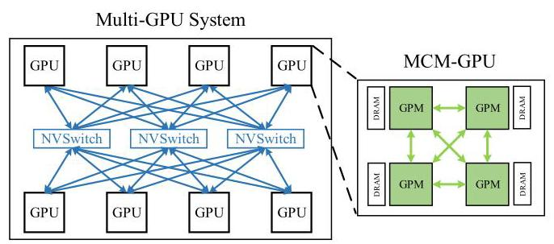

Fig. 1 给出论文假设的目标系统：一个 system 有多个 GPU，每个 GPU 内部又有多个 GPM。这个图的重要性不在于画出了某个具体产品，而在于明确了 HMG 的设计对象不是单层 L2 cache coherence，而是跨 GPM、跨 GPU 两级互连都可能参与数据复用的结构。

论文的核心问题可以概括为：如何把 GPU coherence 扩展到 hierarchical multi-GPU，同时支持 fine-grained synchronization，又不引入 CPU MESI 类协议的 ownership tracking、transient states 和复杂 verification 成本？

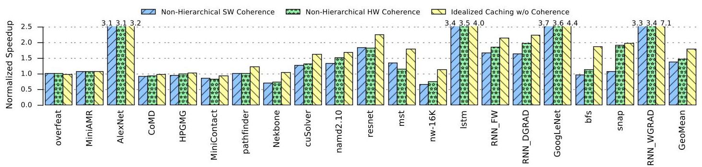

Fig. 2 是动机证据。作者把 non-hierarchical software coherence 和 non-hierarchical hardware coherence 直接扩展到一个 4-GPU、每 GPU 4-GPM 的系统，发现许多 workload 与 idealized caching 仍有明显差距。几何平均上，理想缓存能到约 1.8x speedup，而非层次硬件协议约 1.5x，说明问题不是“能不能缓存 remote data”，而是“缓存和 coherence 是否尊重层次局部性”。

**动机评估**：动机比较 solid。论文不是人为构造一个 coherence 问题，而是同时拿到了硬件趋势、编程模型变化和 benchmark 数据三类支撑。其弱点在于目标硬件是 forward-looking 模拟平台，真实产品的互连拓扑、cache policy、软件栈未必完全一致；但在 HPCA 2020 的时间点，MCM-GPU 和 NVSwitch 方向已经足够可信。

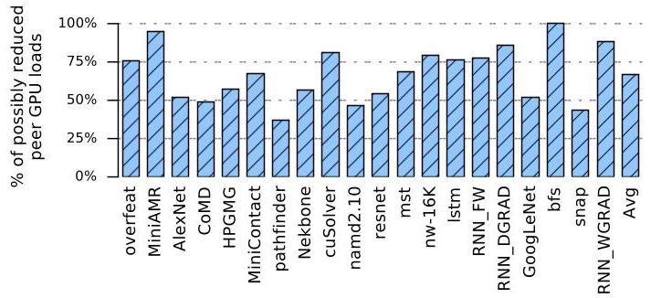

Fig. 3 支撑了 HMG 的核心 insight：许多 inter-GPU loads 访问的是同一 GPU 内其他 GPM 已经碰过的地址，平均大约三分之二的这类访问存在同 GPU 复用机会。换句话说，system home node 不一定需要知道每个远端 GPM，知道“哪个 GPU 是 sharer”往往就够了。

**核心 Insight**：HMG 的关键洞察是“GPU 的 coherence 可以同时更层次化、更放松”。层次化来自 Fig. 3 这样的 intra-GPU locality，放松来自 scoped、non-multi-copy-atomic GPU memory model。前者让 system home 只跟踪 GPU 级 sharer，后者让 store invalidation 可以脱离关键路径、无需 invalidation acknowledgment，也无需 GPU-VI 为 multi-copy-atomicity 准备的大量 transient states。

## 二、相关工作

论文把相关工作分成几条线索。第一类是 GPU release consistency 和 software coherence。典型做法是在 acquire 时 invalidate 可能 stale 的 cache line，在 release 时 flush dirty data。hLRC 延迟执行 coherence action，DeNovo 和 VIPS 试图利用 read-only/private 信息减少 invalidation。这类方法简单，但需要同步点上的 bulk operation 或软件/区域信息，遇到大 L2、跨 GPU 链路和 fine-grained sharing 时容易产生过量失效。

第二类是 write-initiated hardware coherence。QuickRelease 用 FIFO 维护 write partial order，但仍需要资源划分并广播 invalidation。GPU-VI 是简单有效的 VI 协议，但它早于现代 scoped memory model，需要为了 multi-copy-atomicity 加 transient states 和更多 state transition，而且原始设计是单 GPU 场景。CARVE 这类 multi-GPU NUMA 优化会用本地 DRAM 缓存 remote data，并按 private/read-only/read-write shared 过滤 coherence traffic，但没有精确 sharer tracking，也没有利用 scope，因此 read-write shared 时仍容易广播。

第三类是 CPU hierarchical coherence。CPU 系统早就有 hierarchical directory、MESI-like protocol、snoop/directory 混合策略、page replication/migration、I/O directory cache 等技术。但 CPU 追求低延迟、强 memory ordering 和 ownership locality，协议复杂度高。HMG 的立场是：GPU 是 throughput-oriented，memory model 更弱，通常不需要把 CPU 复杂性搬过来。

第四类是 GPU scaling 和 heterogeneous coherence。MCM-GPU、NUMA-aware GPU、CARVE 等工作已经展示了 GPU 分布式结构和 remote-data caching 的价值；Spandex、Crossing Guard 等异构 coherence 关注 CPU-GPU unified memory 交互。它们都不是本文的直接替代方案，因为 HMG 聚焦的是 scoped memory model 下的 hierarchical multi-GPU hardware coherence。

## 三、技术挑战

**挑战 1：层次互连导致非均匀瓶颈。** Inter-GPM 带宽是 TB/s 级，论文配置中每 GPU 双向 2 TB/s；inter-GPU 每 link 只有 200 GB/s。扁平协议会把很多本可在 GPU 内复用的请求推过跨 GPU 链路。

**挑战 2：fine-grained synchronization 需要正确 coherence，但不能回到 bulk invalidation。** 新 workload 包括 graph、RNN、molecular dynamics、AMR 等，它们会在 kernel 内或频繁 dependent kernel 间共享数据。软件 bulk invalidation 在传统 BSP 下可接受，但在细粒度共享下会过度失效。

**挑战 3：GPU 协议必须保持简单。** CPU-style MESI、ownership tracking、transient states 可以隐藏 latency，但会增加状态空间和验证成本。GPU-VI 在 L1/L2 分别加入 3/12 个 transient states 和 24/41 个 state transitions；multi-GPU round trip 更长时，这种复杂性会继续放大。

**挑战 4：sharer tracking 不能线性爆炸。** 如果 system home 记录所有 GPM sharer，一个 4-GPU、每 GPU 4-GPM 系统就要扁平跟踪 15 个可能 sharer；更大系统会更糟。HMG 要让 directory 既精确到足以避免广播，又只保存层次所需信息。

**挑战 5：评估 forward-looking 系统本身困难。** 真实多 MCM、多 GPU、scoped fine-grained synchronization 平台不容易获得，论文只能依赖工业 simulator 和 traces，而且明确承认 simulator 不能准确模拟 memory spin-lock synchronization。

## 四、解决方案

### 整体思路

HMG 是一个 two-layer hierarchical coherence protocol。GPU 内部采用类似 NHCC 的 VI-like directory coherence，每个 GPU 对每个地址有一个 `GPU home node`；跨 GPU 层面再选择一个 `system home node`。System home 只记录哪些 GPU 是 sharer，而不记录远端 GPU 内部的 GPM 细节；GPU home 再负责在本 GPU 内部维护 GPM sharer。这样，远端数据第一次跨 GPU 取回后，可以先缓存在该 GPU 的 home node，后续同 GPU 内其他 GPM 访问时不必反复跨 GPU。

### 贯穿示例

假设 GPU1:GPM1 是地址 B 的 system home，GPU0:GPM1 是地址 B 在 GPU0 内的 GPU home。现在 GPU0:GPM0 要读 B。请求先从 GPU0:GPM0 到 GPU0:GPM1，如果 GPU0 的 GPU home 没有 B，再跨 inter-GPU link 到 GPU1:GPM1。返回时，GPU1 的 system home 只记录“GPU0 是 B 的 sharer”，GPU0 的 GPU home 则记录“GPU0:GPM0 是 B 的 sharer”。之后 GPU0:GPM2 再读 B，就可以先走 GPU0 内部路径，由 GPU0:GPM1 复用缓存数据，而不是再次跨 GPU。

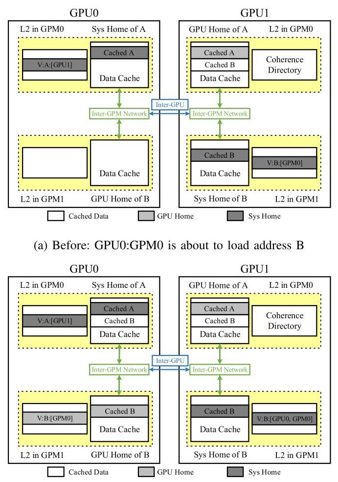

Fig. 6 展示了这个例子。图上最值得注意的是 directory 信息的粒度不同：system home 看到的是 GPU 级 sharer，GPU home 看到的是 GPM 级 sharer。这正是 HMG 能降低 inter-GPU traffic 的原因。

### 关键技术点

**1. NHCC 作为 baseline，先去掉现代 GPU 不需要的复杂性。** NHCC 使用 Valid/Invalid 两个 stable states，每个 L2 cache 附带 directory。和 GPU-VI 相比，NHCC 消除了 transient states，只在 release 操作上需要 acknowledgment；普通 non-synchronizing store 即使触发 invalidation，也可以让 invalidation 在后台传播，不等待 ack。

**2. HMG 把 home node 分成 GPU home 和 system home。** 对于 M 个 GPM、N 个 GPU 的系统，directory entry 最多跟踪 `M + N - 2` 个 sharer：同 GPU 内的其他 `M - 1` 个 GPM，以及其他 `N - 1` 个 GPU。这比扁平跟踪所有远端 GPM 更适合大系统。

**3. Load/store 按 scope 决定能在哪些 cache 命中。** 普通 load 和 `.cta` load 可以命中所有 cache；`.gpu` load 必须绕过 GPU home 之前的 cache，保证 GPU scope 同步的 forward progress；`.sys` load 还要绕过 GPU home，只能在 system home 或更后面命中。Store 也类似，至少要写到对应 scope 的 home node：`.gpu` 到 GPU home，`.sys` 到 system home。

**4. Invalidation 层次传播而不需要 ack。** 如果 system home 因 store 或 directory eviction 要 invalidate 一个 GPU sharer，它把 invalidation 发到该 GPU 的 GPU home；GPU home 再转发给本 GPU 内记录的 GPM sharer。因为 memory model 不要求 multi-copy-atomicity，普通 invalidation 不需要等待所有 sharer ack。

**5. Acquire/release 继续服务于 scoped synchronization。** `.cta` acquire 只 invalidate local L1；`.gpu` release 只需保证到 GPU home 的 dirty/write-through 操作完成，不必把所有写都刷过 inter-GPU network；`.sys` release 才需要扩大到 system home 层级。

**6. Directory 粒度做了工程化折中。** 论文评测里每个 directory entry 同时跟踪 4 条 128B cache lines，每 GPM 有 12K entries，因此每 GPM 可覆盖 `12K * 4 * 128B = 6MB` 的 actively shared data。这会带来 false sharing 风险，但显著降低 directory 面积。

### 与已有方案的对比

相比 software coherence，HMG 避免 acquire/release 上的大范围 bulk invalidation，适合细粒度共享。相比 NHCC，HMG 利用 GPU 内局部性，把很多跨 GPU 请求合并到 GPU home。相比 CARVE 这类按数据类型过滤的方案，HMG 动态跟踪实际 sharer，读写共享数据不必广播给所有 cache。相比 CPU hierarchical coherence，HMG 不做 ownership tracking，不引入 MESI transient state，硬件和验证复杂度更低。

它的不足也清楚：HMG 仍依赖程序员或 compiler/runtime 正确使用 scope；评测默认 write-through cache，并没有完整探索 writeback 组合；coarse directory tracking 会在 mst 这类 graph workload 上触发 false sharing；更大规模系统的拓扑、OS 节点边界和通信软件会影响 HMG 是否仍然合适。

## 五、实验评估

### 实验设定

作者使用 proprietary industrial simulator，基于 trace 驱动，trace 包含 instructions、registers、memory addresses 和 CUDA events。模拟器动态建模调度、barrier、memory latency 等依赖，但不能准确模拟 memory spin-lock synchronization。作者用 NVIDIA Quadro GV100 做相关性验证，相关系数为 0.99，平均绝对误差为 0.13；他们也给出 GPGPU-Sim 的对比数据，说明该模拟器足够快，能跑 forward-looking 多 GPU 配置。

主要配置来自 Table II：4 个 GPU，每 GPU 128 个 SM，总计 512 个 SM；每 GPU 4 个 GPM；GPU 频率 1.3 GHz；每 SM 64 warps；OS page size 2 MB；L1 data cache 为每 SM 128 KB、128B line；L2 data cache 为每 GPU 12 MB、128B line、16 ways；每 GPM directory 12K entries，每 entry 覆盖 4 条 cache lines；inter-GPM bandwidth 为每 GPU 双向 2 TB/s；inter-GPU bandwidth 为每 link 双向 200 GB/s；每 GPU DRAM bandwidth 1 TB/s、capacity 32 GB。

Benchmark 共 20 个，覆盖 cuSolver、CoMD、HPGMG、MiniAMR、MiniContact、namd2.10、Nekbone、snap、bfs、mst、AlexNet、GoogLeNet、LSTM/RNN、Rodinia nw/pathfinder 等，footprint 从 26 MB 到 3.44 GB。cuSolver、namd2.10、mst 显式使用 `.gpu` scope，其他一些通过频繁 dependent kernels 形成 inter-kernel communication。

Baseline 包括 5 类：non-hierarchical software coherence、non-hierarchical hardware coherence (NHCC)、hierarchical software coherence、HMG、以及不执行 coherence 的 idealized caching upper bound。所有 cache 在评测中采用 write-through，并且不启用 optional sharer downgrade message。

### 主要实验与结论

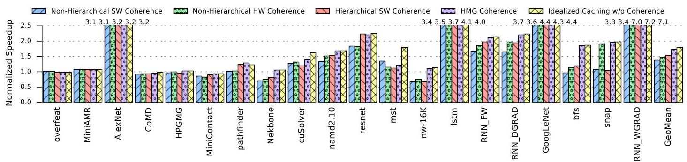

Fig. 8 是主结果。几何平均上，HMG 约为 1.7x normalized speedup，idealized caching 约为 1.8x，因此 HMG 达到理想缓存收益的 97%。摘要中的总体数字是：HMG 相比 software-controlled bulk invalidation coherence 提升 26%，相比 non-hierarchical hardware coherence 提升 18%。一些 workload 上接近完全贴近 ideal，例如 RNN_WGRAD 约 7.0x 对 7.1x，GoogLeNet 约 4.3x 对 4.4x，AlexNet 约 3.2x 对 3.2x。

单 GPU 场景中，software 和 hardware coherence 大多接近 ideal，作者没有展开，因为较小 L2 和较高 inter-GPM bandwidth 足以掩盖 invalidation 代价。多 GPU 场景才是 HMG 的主战场：非层次协议受 inter-GPU latency/bandwidth 惩罚明显，hierarchical software 和 HMG 都能利用 intra-GPU locality，但 HMG 进一步避免 bulk invalidation。

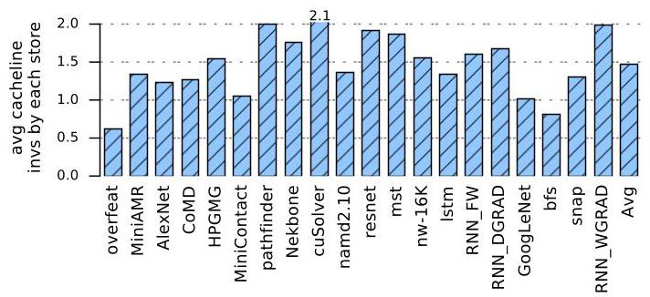

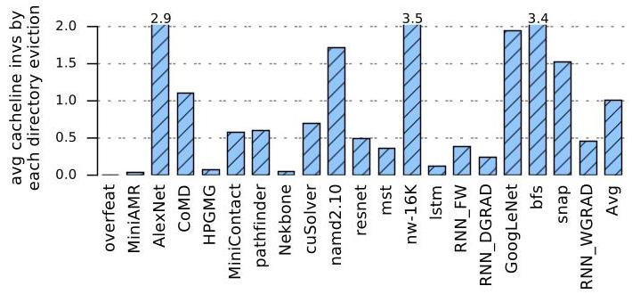

Fig. 9 和 Fig. 10 解释为什么 HMG 不需要复杂 CPU-like protocol。Store 或 directory eviction 触发 invalidation 时，平均 sharer 数通常不高，许多 workload 不超过 2 个 sharer。说明 read-write shared footprint 很小，动态精确 tracking 比粗略把数据分成 read-only/read-write shared 更有效。

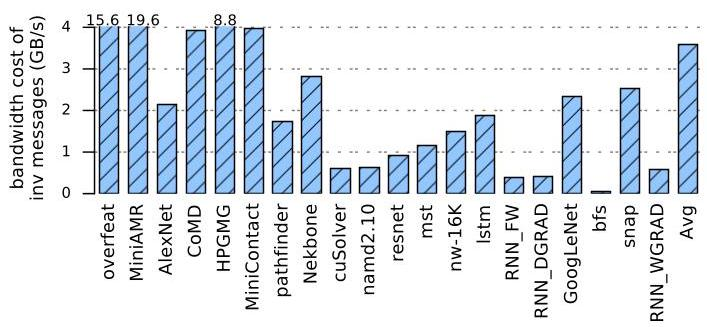

Fig. 11 进一步说明 invalidation traffic 的总带宽通常只有几个 GB/s。少数 workload 较高，例如 overfeat、MiniAMR、HPGMG 上图中有十几 GB/s 的 invalidation bandwidth，但相对 200 GB/s inter-GPU link 和 GPU cache line 数据搬运仍然较小。这支持作者的判断：HMG 的瓶颈主要不是 invalidation 本身，而是是否能减少跨 GPU 数据路径。

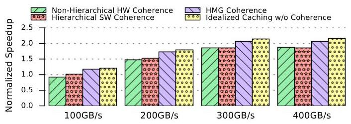

Fig. 12 扫描 inter-GPU bandwidth。100 GB/s 时所有方案都被 NUMA 限制，但 HMG 仍最好；200 GB/s 是主配置；到 300/400 GB/s 时性能开始接近饱和，但 HMG 仍领先 hierarchical software 和 NHCC。结论是：inter-GPU bandwidth 是关键瓶颈，而 HMG 的层次缓存正是针对这个瓶颈。

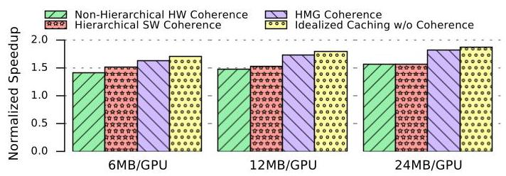

Fig. 13 扫描 L2 cache size。软件 coherence 因为 bulk invalidation，不能充分吃到更大 L2 的好处；HMG 随容量增大继续提升，说明未来更大 cache 的 GPU 上，HMG 的优势可能更强。

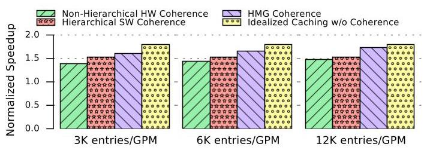

Fig. 14 扫描 directory size。HMG 对 directory size 有一定敏感性，但从 12K entries/GPM 降到 6K 或 3K 时仍保持不错性能。结合讨论中“directory size 减半仍表现很好”的结论，作者认为当前 modest directory 已足以捕获主要共享局部性。

### 结论支撑性分析

实验整体能支撑论文的核心 claim：HMG 在 4-GPU hierarchical system 上接近 ideal caching，并且硬件代价小。硬件成本部分给出每个 directory entry 需要 6-bit sharer vector、1-bit state、48-bit tag，总计 55 bits；每 GPM 12K entries，directory 总存储为 84 KB，仅占每 GPM L2 data capacity 的 2.7%。

但实验也有边界。第一，评测依赖 proprietary simulator，外部复现困难。第二，工作负载没有覆盖广泛使用 memory spin-lock 的同步模式，作者自己承认模拟器不能准确建模这类行为。第三，4-GPU、每 GPU 4-GPM 是合理但有限的规模，论文对 1024-GPU 这类超大系统只做讨论而非实验。第四，HMG 对 false sharing 并非免疫，mst 这类 graph workload 会因为四 cache-line directory granularity 和冲突访问而表现不佳。

## 六、附加洞察

**结论 1：单 GPU 内部可能不值得新增 `.gpm` scope。**
- *出处*：Section VII-A Performance Analysis 与 Section VII-D Discussion。
- *推理链条*：单 GPU 实验中 software/hardware coherence 大多接近 ideal，说明 inter-GPM bandwidth 足以缓解 invalidation 代价；Discussion 又指出引入 `.gpm` scope 会增加程序员负担；因此作者倾向于认为新增介于 `.cta` 和 `.gpu` 之间的 scope 性价比不高。薄弱点在于该结论依赖本文 workload 和互连参数，未来更不均匀的 chiplet GPU 可能改变判断。

**结论 2：动态 sharer tracking 比单纯数据分类更有价值。**
- *出处*：Fig. 9、Fig. 10、Fig. 11。
- *推理链条*：store 和 directory eviction 触发 invalidation 时，实际 sharer 数通常很少；invalidation bandwidth 也只有少量 GB/s；因此精确记录谁真的共享，比像 CARVE 那样只把数据粗略分成 read-only/read-write shared 更能避免广播。这个结论不是 HMG 的唯一贡献，但解释了为什么 HMG 不需要更复杂的 read-only region tracking。

**结论 3：粗粒度 directory entry 是可接受的工程折中。**
- *出处*：Section VII-B Sensitivity Analysis。
- *推理链条*：每个 entry 同时跟踪 4 条 cache lines 可以缩小 directory；作者固定总覆盖范围、调整 tracking granularity 后发现性能敏感性很小；因此 coarse-grained tracking 对 HMG 是有用优化。这个结论的限制是图中没有展示该实验细节，报告只能依据作者文字描述。

**结论 4：HMG 的扩展边界更可能由网络拓扑决定，而不是单纯 directory 容量决定。**
- *出处*：Section VII-D Discussion 与 Fig. 14。
- *推理链条*：随着 GPM/GPU 数量增加，directory 要记录更多 sharer、覆盖更大 footprint；但 Fig. 14 显示 directory 减半仍能工作得不错；作者因此认为更大系统的主要敏感因素会转向 link speed 和 topology，并把适用范围定位在单 OS node 内的 NVSwitch-like network。超过这个范围，例如 1024-GPU，可能更适合硬件 coherent GPU-cluster 加 MPI/SHMEM 这类软件机制。

**结论 5：Graph workload 的 false sharing 是 HMG 的一个明确失效模式。**
- *出处*：Section VII-A Performance Analysis。
- *推理链条*：graph workload 有细粒度且可能冲突的访问模式；software coherence 可以简单 write-through，而 HMG 在四 cache-line directory granularity 下可能频繁 invalidation；这解释了 mst 的性能异常。这个结论提示 HMG 的优势依赖共享模式足够局部且 sharer 数有限。

## 七、总结与评价

HMG 的贡献在于把两个本来分散的事实连成了一个协议设计：multi-GPU 系统有强层次局部性，现代 GPU memory model 又允许 coherence 更放松。它没有把 CPU coherence 的复杂机制移植到 GPU，而是保留 VI-like 两状态协议，通过 GPU home/system home 分层记录 sharer，从而用 84 KB/GPM 级别的 directory 成本拿到 97% ideal caching performance。

论文最大的亮点是设计取舍非常克制：只增加层次化 sharer tracking 和 invalidation forwarding，不增加协议状态，不要求普通 invalidation ack。最大的不足是评测封闭且前瞻性较强，真实系统上的 runtime、compiler scope 使用、spin-lock pattern、writeback cache 组合、超大拓扑都会影响结论。作为系统结构论文，它给出的最有价值启发是：在 GPU 上设计 coherence 时，先问 memory model 允许省掉什么，再问层次结构能过滤掉什么，而不是默认追求 CPU 式强一致和低延迟。

## 八、章节脉络与段落速览

- **Title / Abstract**：提出 HMG 的目标、关键机制和主要结果。
  - ¶1 说明已有 GPU coherence 面向更简单层次和 memory model，现代 multi-GPU 留下优化空间。
  - ¶2 概括 HMG 使用 VI-like state、层次 sharer tracking、non-multi-copy-atomic relaxation，并给出 26%、18%、97% 三个核心结果。

- **Section I · INTRODUCTION**：从 GPU scaling、scoped memory model 和现有协议不足引出 HMG。
  - ¶1 说明 MCM/NVLink/NVSwitch/xGMI 推动 GPU 系统层次化，inter-GPU 带宽差造成 NUMA 瓶颈。
  - ¶2 说明 BSP 对 active kernel 间通信限制过强， emerging workloads 需要 fine-grained sharing。
  - ¶3 解释 scoped memory model 和 non-multi-copy-atomicity 如何给 coherence 放松空间。
  - ¶4 用 4-GPU、16-GPM 的扁平扩展实验提出研究问题。
  - ¶5 给出 HMG 的基本思路：消除 transient state/ack，层次精确跟踪 sharer。
  - ¶6 列出三项贡献：首次研究该场景、证明非层次方案低效、提出 HMG 并达到 97% ideal。

- **Section II · BACKGROUND**：介绍术语、目标硬件、应用共享模式、memory model 和 GPU coherence。
  - ¶1 澄清本文用 global memory 指 CPU/GPU 共享虚拟地址空间，避免和 NVIDIA shared memory 混淆。
  - **II-A · Hierarchical Multi-Module GPUs**：说明未来 GPU 被拆成多个 GPM，以及这种结构的带宽瓶颈。
    - ¶1 介绍 MCM-GPU/GPM 层次和用户可见 NUMA hierarchy。
    - ¶2 说明 inter-GPM/GPU link bandwidth 是瓶颈，已有工作通过 CTA placement 和 first-touch placement 利用 locality。
    - ¶3 说明 CARVE 用本地 DRAM 缓存 remote data，但缺少 sharer tracking 和 scope。
  - **II-B · Emerging Programs Need Fine-Grained Communication**：说明 RNN、molecular dynamics、graph 等应用需要 CTA/kernel 间细粒度通信。
    - ¶1 举例说明 emerging workloads 为什么需要层次 GPU 和 scoped synchronization。
  - **II-C · GPU Memory Model**：说明 CUDA/OpenCL 从 BSP 转向 scoped memory model。
    - ¶1 说明 BSP 下 inter-CTA communication 只允许通过 dependent kernels。
    - ¶2 说明 `.cta`、`.gpu`、`.sys` scope 的同步范围和 cache 层级含义。
  - **II-D · GPU Cache Coherence**：按 stale data 由 read 还是 write 触发 invalidation 分类已有方案。
    - ¶1 说明 release consistency 类协议的基本 acquire/release coherence 机制。
    - ¶2 总结 hLRC、DeNovo、VIPS 等 read-initiated 方案及其软件/粒度开销。
    - ¶3 总结 QuickRelease、GPU-VI 等 write-initiated 方案，并指出 GPU-VI 不适配 scope 和多级带宽。

- **Section III · THE NOVEL COHERENCE NEEDS OF MODERN MULTI-GPU SYSTEMS**：提炼 HMG 的两个核心需求。
  - ¶1 说明 HMG 同时考虑硬件层次和 scoped memory model。
  - **III-A · Extending Coherence to Multiple GPUs**：从 Fig. 2/3 推出层次 coherence 的必要性。
    - ¶1 说明非层次 VI 不能接近 ideal，且同 GPU 内多个 GPM 常访问同一 remote address range。
    - ¶2 对比 CPU hierarchical coherence，指出 GPU 不需要 CPU 式强 ordering 和复杂 transient states。
  - **III-B · Leveraging GPU Weak Memory Models**：说明 scope 和 non-MCA 如何放松 coherence。
    - ¶1 说明 coherence 只需在同步边界、对相关 scope 生效，multi-GPU 中 `.gpu` 与 `.sys` 差距更大。
    - ¶2 说明 non-multi-copy-atomicity 允许 HMG 消除 transient states 和 invalidation ack。

- **Section IV · BASELINE NON-HIERARCHICAL CACHE COHERENCE**：定义 NHCC baseline。
  - ¶1 说明 NHCC 相比 GPU-VI 已去掉 transient states/大多数 ack，但不利用 hierarchy。
  - **IV-A · Architectural Overview**：描述 NHCC 的 L1/L2、home node 和 directory。
    - ¶1 说明 L1 软件管理 write-through，GPM L2 缓存 local/remote data，地址通过 hash 选择 home node。
    - ¶2 说明每个 L2 带 set-associative directory，只记录 Valid/Invalid 和 sharer。
    - ¶3 用 Fig. 5 解释 non-inclusive L2 下 home node 与 cached copy 的关系。
    - ¶4 说明 invalidation 只在 read-write sharing 和 directory eviction 时显式发送。
    - ¶5 用一次 memory reference 路径概括 L1、local L2、home L2、DRAM 的查找顺序。
  - **IV-B · Coherence Protocol Flows in Detail**：逐项定义 NHCC 的请求处理。
    - ¶1 说明 Table I 中 local/remote 的含义。
    - ¶2 说明 local load 的 hit/miss 和 scoped load 的 cache 绕过要求。
    - ¶3 说明 local store 如何写回 home node 并对 sharer 发 invalidation。
    - ¶4 说明 remote load 在 home L2/DRAM 获取数据并记录 requester。
    - ¶5 说明 remote store 写入数据并 invalidates other sharers。
    - ¶6 说明 atomics/reductions 在 home node 执行，并按 store 处理 coherence。
    - ¶7 说明收到 invalidation 后本地 clean copy 失效且不回 ack。
    - ¶8 说明 directory eviction 必须 invalidate 被替换 entry 的 sharer。
    - ¶9 说明 acquire 只 invalidate local L1，不继续传播到 L2。
    - ¶10 说明 release 要确保 writeback/write-through/invalidation 完成，并收集 release ack。
    - ¶11 说明 clean line eviction 可选 downgrade 或 silent eviction，dirty eviction 可选特殊 writeback 消息。

- **Section V · HIERARCHICAL MULTI-GPU CACHE COHERENCE**：把 NHCC 扩展成 HMG。
  - ¶1 说明 NHCC 不区分 intra/inter-GPU link，扩展到多 GPU 后会受 inter-GPU bottleneck 限制。
  - ¶2 说明 HMG 通过 coalescing/caching within a GPU 降低跨 GPU bandwidth 和 energy。
  - **V-A · Architectural Overview**：定义 HMG 两层 home node。
    - ¶1 说明 intra-GPU layer 使用 GPU home node 管理本 GPU 内 GPM coherence。
    - ¶2 说明 system home node 的选择和 `M + N - 2` sharer tracking。
    - ¶3 用 Fig. 6(a) 说明 system home、GPU home、GPU sharer 的关系。
    - ¶4 用地址 B 的 load 例子说明 system home 只记录 GPU0，而 GPU0 home 记录 GPM0。
  - **V-B · Coherence Protocol Flows in Detail**：描述 HMG 相比 NHCC 的流程差异。
    - ¶1 说明 HMG 不增加 coherence states，只增加 Table I 中一条 invalidation forwarding transition。
    - ¶2 说明 load 从 local L2 到 GPU home 到 system home 再到 DRAM。
    - ¶3 说明普通/`.cta` load 可命中所有 cache，`.gpu`/`.sys` load 有更严格绕过规则。
    - ¶4 说明从 GPU home 到 system home 的请求不携带原始 GPM ID。
    - ¶5 说明 store 以同样层次写到 GPU home/system home/DRAM。
    - ¶6 说明 store 至少写到对应 scope 的 home node 以保证 forward progress。
    - ¶7 说明 atomic 在对应 scope 的 home node 执行，并像 store 一样传播结果。
    - ¶8 说明 invalidation 根据 sharer 层次传播，GPU home 负责转发到本 GPU 的 GPM sharer。
    - ¶9 说明 `.cta` acquire 仍只 invalidate local L1。
    - ¶10 说明 release 只需 flush 到对应 scope 的 home node，`.gpu` release 不必跨 inter-GPU 完成所有 writeback。

- **Section VI · EVALUATION METHODOLOGY**：介绍模拟器、硬件配置、benchmark 和 protocol 实现。
  - ¶1 说明 proprietary simulator 的 trace 输入、动态调度建模能力和 spin-lock 建模限制。
  - ¶2 说明 Fig. 7 的模拟器验证结果，相关系数 0.99、平均绝对误差 0.13。
  - ¶3 说明 benchmark 选择覆盖有 scoped/inter-kernel synchronization 的 public workloads。
  - ¶4 说明四种 coherence 实现和 idealized caching upper bound。
  - ¶5 说明评测采用 write-through cache、不实现 downgrade message，并用四 cache-line directory entry 覆盖 6 MB/GPM shared data。

- **Section VII · RESULTS AND DISCUSSION**：给出主性能、开销、敏感性和局限讨论。
  - ¶1 说明结果部分先比较性能，再做 sensitivity analysis。
  - **VII-A · Performance Analysis**：比较单 GPU 和多 GPU 场景。
    - ¶1 说明单 GPU 下 software/hardware coherence 接近 ideal，因此不是本文重点。
    - ¶2 说明多 GPU 下 HMG 对 fine-grained sharing workload 优势明显。
    - ¶3 说明 Fig. 9/10 中 invalidation sharer 数少，动态 tracking 有收益。
    - ¶4 说明 graph workload false sharing 会让 HMG 在 mst 等情况开销更高。
    - ¶5 说明 invalidation bandwidth 通常很低，并总结 HMG 达到 97% ideal speedup。
  - **VII-B · Sensitivity Analysis**：扫描关键参数。
    - ¶1 说明 sensitivity 研究覆盖多个 design-space parameters。
    - ¶2 说明 inter-GPU bandwidth 扫描中 HMG 始终最好，带宽充足后性能趋于饱和。
    - ¶3 说明 L2 cache size 增大时 HMG 更能获益，软件 coherence 受 invalidation 限制。
    - ¶4 说明 directory size 影响 coverage/performance，但 modest directory 已足够接近 ideal。
    - ¶5 说明四 cache-line coarse granularity 的敏感性很小，是可用优化。
  - **VII-C · Hardware Costs**：量化 directory 存储开销。
    - ¶1 说明每 entry 55 bits、每 GPM 12K entries、总计 84 KB，占 L2 data capacity 的 2.7%。
  - **VII-D · Discussion**：讨论规模扩展和新增 scope。
    - ¶1 说明更大系统可能更受 link speed/topology 影响，HMG 适合单 OS node 内 NVSwitch-like network。
    - ¶2 说明新增 `.gpm` scope 可能收益不抵程序员负担。

- **Section VIII · RELATED WORK**：把本文放回 memory consistency、cache coherence、coherence hierarchy、GPU scaling 脉络。
  - ¶1 说明已有 GPU SC/TSO/relaxed model 研究，以及现代 GPU 继续采用 weak model 的原因。
  - ¶2 说明 timestamp/self-invalidation 类 GPU coherence 未考虑 hierarchy 和 scoped memory model。
  - ¶3 说明 CPU hierarchical coherence 多采用 MESI-like 和更复杂策略，HMG 避免这些成本。
  - ¶4 说明 heterogeneous unified memory coherence 可与 HMG 互补。
  - ¶5 说明已有 distributed GPU system 工作没有同时面向 deep hierarchy 和 scoped memory model。

- **Section IX · CONCLUSION**：重申 HMG 的贡献和结果。
  - ¶1 总结 HMG 以简单 hierarchical extension 支持 fine-grained scoped synchronization，并达到 97% ideal caching performance。

- **Section X · ACKNOWLEDGMENT / REFERENCES**：致谢和文献列表。
  - ¶1 感谢 Mieszko Lis 和匿名审稿人。
  - ¶2 参考文献覆盖 GPU scaling、GPU memory model、GPU coherence、CPU coherence hierarchy、heterogeneous coherence 和 MPI/SHMEM 等背景。
