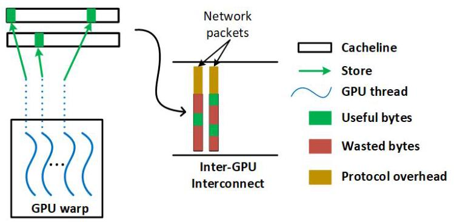
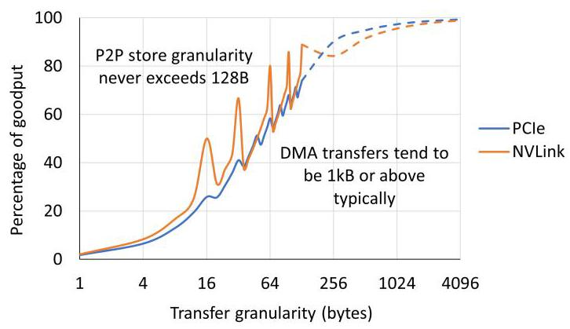
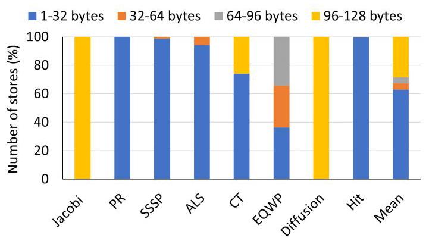
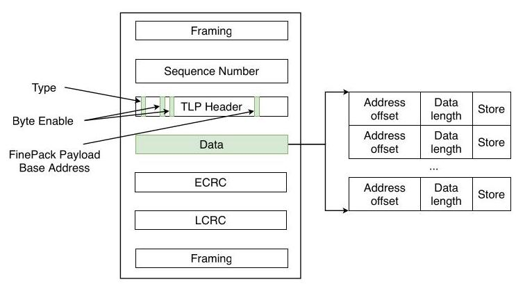
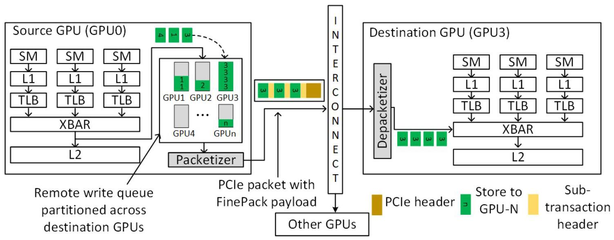
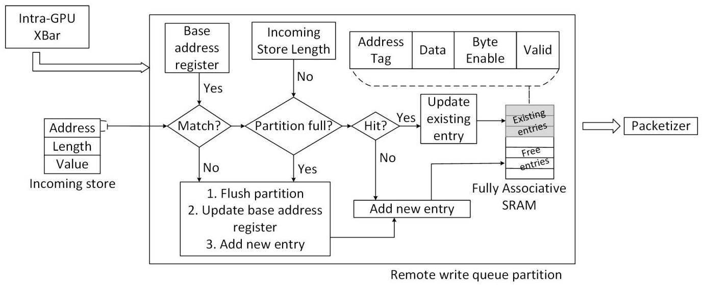
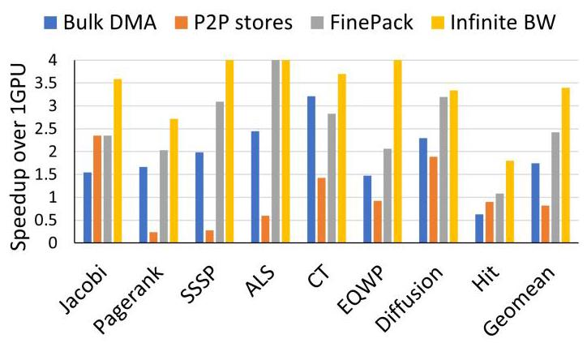
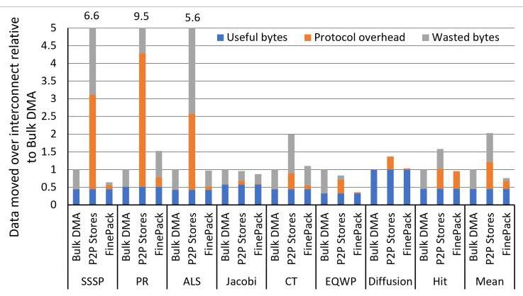
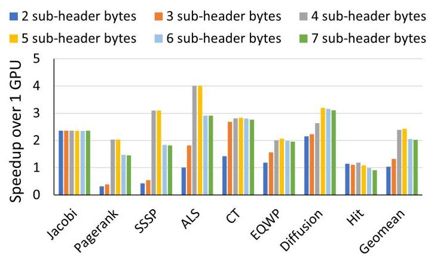
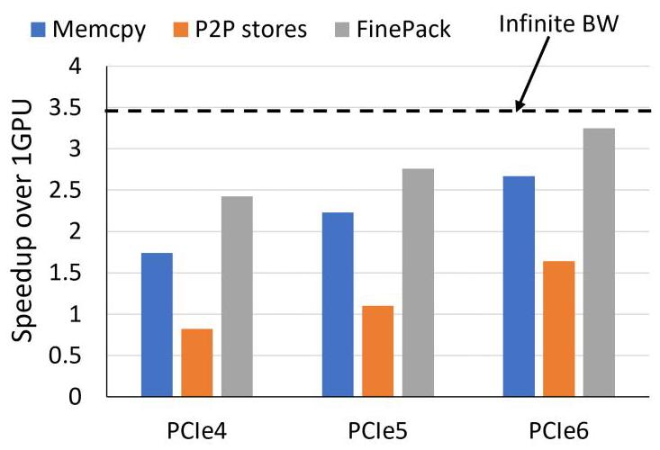

# FinePack: Transparently Improving the Efficiency of Fine-Grained Transfers in Multi-GPU Systems 深度解读

> **作者**：Harini Muthukrishnan, Daniel Lustig, Oreste Villa, Thomas Wenisch, David Nellans  
> **会议/期刊**：IEEE International Symposium on High-Performance Computer Architecture (HPCA), 2023  
> **一句话总结**：FinePack 在 GPU 和互连端点之间增加透明的远程写缓冲、打包与解包逻辑，把大量 4-32B 的 P2P store 合并成少量大包，从而保留细粒度通信的计算/通信重叠，同时接近 bulk DMA 的链路效率。

## 一、问题定义

这篇论文不是首次提出 multi-GPU strong scaling 的通信瓶颈，而是在已有 P2P store / proactive transfer 工作基础上继续推进：既有研究已经说明，把数据结构复制到多张 GPU 上，并在产生更新时用 peer-to-peer stores 主动推送到远端副本，可以让后续 load 都落在本地 HBM 中，从而避免远端 read 卡住计算流水线。问题在于，这类 P2P store 在 irregular workloads 中天然会产生很多 sub-cacheline 级别的小写入，典型大小只有 4-32B，而 PCIe/NVLink 这类互连协议更偏向大块传输；小 payload 被固定 header、framing、CRC、sequence number 和 padding 稀释后，有效带宽会显著下降。

Fig. 2 的核心证据是：P2P store 的传输粒度通常不超过 128B，而 DMA 往往在 KB 级；在 32B 左右的传输上，协议开销几乎可以吃掉一半链路能力。也就是说，P2P store 的编程模型和 overlap 能力是对的，但它把互连推到了最不擅长的工作区间。

论文的动机比较 solid。作者给出了两个层面的证据：一是 profile 结果显示，P2P store 发起的 inter-GPU transfers 平均超过 63% 小于 32B；二是协议 goodput 曲线说明小包效率低不是某个实现偶然现象，而是固定头部开销对小 payload 的结构性惩罚。这个问题也不是简单靠程序员多调优就能消失，因为 PageRank、SSSP、ALS 等稀疏或图类应用的地址分散性来自算法本身。

Fig. 4 进一步说明 FinePack 的目标场景：Jacobi 和 Diffusion 这类规则 stencil 更容易形成 128B store，因此 P2P 本身还算高效；但 PR、SSSP、ALS、HIT 等应用几乎由 1-32B store 主导，正是 FinePack 想补的系统短板。

**动机评估**：这篇论文的问题定义有现实基础，且把“通信模型”和“互连效率”拆开看得很清楚。传统 bulk DMA 的问题是粗粒度、难 overlap、可能搬运未更新或不会被读的数据；裸 P2P store 的问题是细粒度、能 overlap，但协议效率差。FinePack 的价值就在于尝试同时保留两者优点。

**核心 Insight**：GPU 默认 weak stores 只要求在同步点或 kernel 结束前对系统可见，因此很多远程 store 不必立即出互连；同一 source-destination GPU pair 的地址流又往往在 MB-GB 级范围内存在空间局部性，并且可能对同一地址反复写入。于是，硬件可以在不改变软件接口和 GPU 虚拟内存系统的前提下，把远程小写临时缓冲起来，用 base+offset 压缩地址，并用覆盖写消除冗余值，最后作为一个更大的互连事务发出。

## 二、相关工作

论文把相关工作大致放在四条脉络中。

第一类是 multi-GPU memory management 和 locality 优化，例如 Unified Memory page migration、Griffin、CARVE 等。这些工作试图让数据页或远端数据更靠近使用它的 GPU，但常常涉及 page migration、远端缓存、IOMMU/GPU memory system 修改，或者仍然难以处理细粒度更新同步。FinePack 选择不移动 ownership，也不让远端数据进入本地 L2，而是只优化已经要发往远端的 store 流。

第二类是 proactive transfer / multi-GPU shared memory 系统，例如 GPS 和 PROACT。它们和 FinePack 最接近：都认可主动推送更新、避免远端 read 的方向。PROACT 通过编译和运行时优化把细粒度传输组织得更高效，但需要 profiling 和程序改写；GPS 引入 publish-subscribe 机制和 write combining，能减少给未使用副本的更新，但需要新的内存管理 API 和更深入的架构支持。FinePack 的差异是完全透明、端点侧硬件实现、对程序员和 runtime 不暴露新接口。

第三类是 small message aggregation。传统 HPC 网络中有软件 runtime、compiler、application-level aggregation，也有路由器级别的网络聚合。这些方法要么带来软件开销和额外延迟，要么要求网络内部参与聚合。FinePack 借用了“把小消息聚成大消息”的思想，但聚合对象是 GPU remote store memory transactions，位置在 GPU endpoint 与互连接口之间，网络 switch 本身可以不变。

第四类是 coherence、remote caching 和 compression。多 GPU cache coherence 可以提供更自然的数据共享，但代价高且实现复杂；内存压缩可以减少带宽占用，但通常不直接解决小 TLP header 反复出现的问题。FinePack 避开 coherence，把优化限定在 weak store 可允许的重排窗口内，因此技术边界更窄，实现也更轻。

## 三、技术挑战

**挑战 1：不能破坏 GPU memory model。** FinePack 要缓冲、重排甚至覆盖 remote stores，但程序语义仍必须满足 system-scoped release、fence、kernel end 和同地址 load-store ordering 的可见性要求。硬件必须知道什么时候可以延迟、什么时候必须 flush。

**挑战 2：要在不改软件接口的前提下找到可聚合窗口。** 程序员仍然写普通 P2P stores，GPU virtual memory、runtime 和应用代码都不应变化；因此聚合逻辑必须从 egress address stream 中自己发现 source-destination、地址范围和 packet payload 限制。

**挑战 3：要把多个独立 store 编码进现有互连语义。** PCIe 的 TLP header、length、address、byte enable 等字段原本描述单个 memory write。FinePack 必须定义一种新 transaction 类型，让多个 sub-transactions 共享外层 header，同时仍能在接收端恢复成普通 store。

**挑战 4：要平衡地址压缩范围和 sub-header 开销。** offset 字段越大，一个 FinePack packet 能覆盖的地址范围越大，但每个 sub-transaction 也更重；offset 太小会频繁 flush，太大又会浪费 header 字节。

**挑战 5：硬件结构必须足够小且不在关键路径上制造新瓶颈。** Remote write queue、packetizer 和 depacketizer 都在 GPU/互连接口附近工作，不能吞掉大量 SRAM，也不能让同步 flush、remote load、atomic 等边界条件变成新的主导开销。

## 四、解决方案

### 整体思路

FinePack 的设计可以概括为：在源 GPU 的网络出口前放一个按目标 GPU 分区的 remote write queue，先收集 weak P2P stores；如果 store 落在同一目标 GPU、同一 base-address window 且 packet payload 还没满，就继续累积；如果写到同一 128B entry，就更新 byte mask 并覆盖旧数据；当分区满、地址越界、遇到同步/释放操作或必要 ordering 事件时，把队列内容交给 packetizer，编码成带 FinePack payload 的互连 packet。目的 GPU 收到后由 depacketizer 拆回普通 memory transactions，再送入本地 memory system。

### 贯穿示例

可以把 PageRank 中的一轮迭代作为例子。GPU0 计算出一些顶点的新 rank 后，需要把这些 4B 或 8B 的 rank update 写到 GPU1/GPU2/GPU3 的副本中。裸 P2P store 会把每个小更新都变成独立互连事务，哪怕这些顶点地址都在同一个大数组附近，甚至同一顶点在同步前被多次更新。FinePack 则让这些写先进入“发往 GPU3 的分区”：第一次写设置 base address，后续落在同一地址窗口的写只记录 offset+length+data；如果再次写同一地址，队列中保留最新值。到 kernel barrier 或队列满时，GPU0 发出一个大 FinePack packet，GPU3 的 depacketizer 再把它拆成多个普通 store，最终内存可见性和原程序一致。

### 关键技术点

**1. FinePack packet format：用外层 TLP 共享共同字段。**

Fig. 6 展示了 packet 级设计。FinePack 复用 PCIe TLP 的大部分字段，只把 type 中未用编码解释为 FinePack transaction；外层 address 变成所有 sub-packets 的 base address，外层 length 表示 FinePack payload 总长度，byte enable 不再描述单个 store。真正不同的部分放在 payload 里的 sub-transaction header 中，每个 sub-header 包含 address offset 和 data length，后面跟对应 store 数据。这样，sequence number、ECRC、LCRC、framing 等固定开销只付一次。

**2. Base+offset 压缩：把宽物理地址变成短 offset。** 现代 GPU 物理地址常见为 48-64b，如果每个小 store 都携带完整地址，地址本身就会成为显著开销。FinePack 利用同一 destination stream 在有限地址范围内的空间局部性，只在外层 packet 携带 base address，在 sub-header 中携带 offset。Table II 给出的设计空间是 2-6B sub-header；论文评测最终使用 5B sub-header，其中 10 bits 表示 length，30 bits 表示 offset，对应 1GB addressable range。

**3. Remote write queue：同时做 packet aggregation 和 redundant write coalescing。**

Fig. 7 说明 FinePack 的架构位置：它不进入 SM/L1/L2 的主逻辑，也不要求 switch 理解每个 sub-transaction；只要 FinePack-aware endpoints 能在源端打包、目标端解包，中间互连看到的仍是一个合法的大事务。这个放置方式是“透明性”的关键。

Fig. 8 展开了一个目标 GPU 分区内部的状态机。每个分区是 fully associative SRAM，以 128B granularity 保存 address tag、data、byte enable 和 valid bit；另有 base address register、available payload length register 和 store counter。新 store 到达时，硬件先检查它是否落在当前 base window 内、是否还能放入 packet payload；如果不满足，就 flush 当前分区并以新 store 开始下一包；如果满足，再查同一 128B entry 是否命中。命中时更新 byte mask 并覆盖数据，miss 时分配新 entry。

**4. Flush 和 ordering：用 GPU weak memory model 换取可缓冲时间。** Remote write queue 必须在 system-scoped release、memory fence 或 kernel 结束时 flush，保证 weak stores 到同步点时对系统可见。如果遇到 remote load 且地址匹配队列中尚未发出的 store，也要 flush 相关 store 以维护同地址 load-store ordering。远程 atomic 不做 coalescing，而是触发同地址旧 entry 的 flush。

**5. Packetizer / depacketizer：把内部优化和 GPU memory system 隔离。** Packetizer 接收 flush 出来的 queue entries，把不连续 byte-enable 的 entry 必要时拆成多个 sub-packets，再拼接到 FinePack payload 中。Depacketizer 在目标 GPU 入口把 base+offset 还原成完整地址，并生成普通 store 送入本地 memory system。论文还指出 depacketizer 需要 64-entry、每 entry 128B 的缓冲，因为拆出来的 transactions 通常无法同周期全部被 L2 消化。

### 与已有方案的对比

相对 bulk DMA，FinePack 不需要程序员在 kernel 边界搬大块数据，也避免搬运未更新或不会被目标 GPU 使用的字节；相对裸 P2P stores，FinePack 保留 producer-side push 和 overlap，但通过聚合小包、压缩地址、覆盖冗余写来减少 on-wire bytes；相对 PROACT/GPS，FinePack 的性能未必总是最强，但它不需要应用 profiling、程序改写、新 runtime API 或虚拟内存系统重构。

FinePack 的局限也很明确：它主要优化 remote stores，不优化 latency-sensitive remote loads；atomic 处理保守；primary evaluation 是 simulator 而非实物芯片；base address 采用简单对齐策略，遇到跨 window 数据结构可能有 thrashing；在 GPS 能有效避免无用副本更新的 workload 上，FinePack 平均还慢 17.8%。

## 五、实验评估

### 实验设定

作者在 NVIDIA Architectural Level Simulator (NVAS) 中实现 FinePack，模拟 4 张 NVIDIA GV100 GPUs，通过 PCIe 4.0 互连，带宽为 32GB/s；敏感性实验还扩展到 PCIe 5.0 和 PCIe 6.0，最高 128GB/s。应用 traces 用 NVBit 在 GPU assembly level 收集，包含 CUDA API events、kernel instructions 和 memory accesses，模拟器负责重放并建模 remote store timing、依赖和 PCIe packetization overhead。

Workloads 包括 Jacobi、PageRank、SSSP、ALS、CT、EQWP、Diffusion 和 HIT，覆盖 stencil、graph、sparse matrix/recommender、CT reconstruction、wave propagation、heat diffusion 和 FFT 类 all-to-all 通信。Baselines 包括 bulk DMA/memcpy、裸 peer-to-peer stores、FinePack，以及一个 analytically elide transfer time 的 infinite inter-GPU bandwidth 上界。主要指标是 4-GPU speedup over 1 GPU、互连上传输字节的 useful/protocol/wasted breakdown、每个 FinePack packet 聚合的 store 数、sub-header size 敏感性和互连带宽敏感性。

Table III 中的 FinePack 参数基于 GV100：cache block size 128B、global memory 16GB、80 SM、L2 6MB；remote write queue 共 192 entries，每个 entry 144B，PCIe maximum packet size 4096B，FinePack subheader size 5B，address offset 30 bits。

### 主要实验与结论

Fig. 9 是核心性能图。平均来看，infinite bandwidth 给出的机会约为 3.4x；FinePack 达到约 2.4x 的 4-GPU geometric mean speedup，捕获 71% 的可用 strong-scaling 机会。Bulk DMA 虽然比裸 P2P store 平均快 2.1x，但仍比 FinePack 慢 1.4x。裸 P2P stores 在 Jacobi、Diffusion 等规则应用上还不错，因为 store 粒度接近 128B；在 PageRank、SSSP、ALS 等小而分散的 store 主导场景中会明显掉速，甚至低于 1-GPU baseline。

Fig. 10 解释了性能来源。Bulk DMA 的 protocol overhead 很低，但 wasted bytes 多，因为它搬的是粗粒度区域，其中很多字节没有更新或目标不会读。P2P stores overlap 好，但小 packet 的 protocol overhead 和同地址重复写导致总传输量在一些应用里达到 bulk DMA 的数倍。FinePack 平均比裸 P2P stores 少传 2.7x 数据，比 bulk DMA 少传 1.3x 数据；相对单纯 write combining，还额外减少 24% on-wire data。

作者还测了 FinePack packetization buffer 的聚合程度：FinePack 平均能把 42 个 stores 打进一个 transaction，因此 protocol overhead 下降明显。CT 是一个反例，它的 spatial locality 较弱，单包能聚合的 store 较少，所以 FinePack 不一定超过 bulk DMA；但由于 CT 不是特别带宽受限，整体 scaling 仍然不错。

Fig. 12 给出 sub-header size 的设计取舍。性能从 2B/3B header 增长到 4B header 时明显变好，说明太小的 address offset 会频繁 flush；4B 达到峰值，5B 几乎不变。超过 5B 后性能下降，因为更大的 offset 范围已不能带来更多可塞入同一 4KB payload 的 store，却让每个 sub-transaction 的 header 开销增加。论文最终选 5B，是为了在 1GB addressable range 下保持稳健。

Fig. 13 说明 FinePack 不是只针对 PCIe4 的短期补丁。PCIe5/PCIe6 提升后，bulk DMA 和 P2P stores 都受益，但在无限带宽前都没有追上 FinePack；PCIe6 下 FinePack 的 geometric mean speedup 接近 3.25x，仍高于 memcpy 和 P2P stores。作者还给出 16-GPU projected PCIe6 结果：FinePack 比 P2P stores 快 3x，比 bulk DMA 快 1.9x。

### 结论支撑性分析

实验基本支撑了论文主张：FinePack 确实解决的是“细粒度 P2P store 在互连协议上低效”的问题，而不是泛泛提高多 GPU 程序性能。Fig. 4 证明问题存在，Fig. 9/10 证明性能和传输字节改善来自正确来源，Fig. 11/12 证明聚合和 header 设计是有效机制，Fig. 13 说明未来互连带宽变高后该机制仍可能有价值。

不过，实验也有几个边界。第一，主要结果来自 simulator，虽然 NVAS 已被作者描述为与多类 benchmark 相关联，但 FinePack 的真实硬件 timing、backpressure、credit interaction 和 implementation closure 仍未被硅上验证。第二，4-GPU 是主要实验规模，16-GPU 是 projection。第三，应用集合偏 HPC/irregular workloads，没有覆盖现代训练/推理框架中的 collective-heavy 通信；FinePack 针对的是 P2P store paradigm，不是 NCCL all-reduce 这类 bulk collective 的替代品。

## 六、附加洞察

**结论 1：P2P store 本身不是坏模型，坏的是小包互连效率。**  
*出处*：Section I、Figure 4、Figure 9。  
*推理链条*：作者先说明 proactive P2P stores 能把 communication 与 compute overlap，并让 load 保持本地化；Fig. 4 显示很多 irregular workloads 的远程 store 小于 32B；Fig. 9 又显示 Jacobi/Diffusion 这类 128B store 占比高的应用中 P2P stores 表现并不差。因此问题不在 P2P 语义，而在不规则应用把 P2P store 转化成了协议效率很差的小 payload。

**结论 2：地址压缩窗口并不是越大越好。**  
*出处*：Section IV-A、Figure 12。  
*推理链条*：更大的 offset 字段覆盖更大地址范围，理论上能减少因 window miss 触发的 flush；但每个 sub-transaction header 也更大，并且 PCIe maximum payload size 限制了同一 packet 能容纳的数据量。Fig. 12 显示 4B 到达峰值、5B 基本持平、再增大反而下降，说明 locality 捕获和 header overhead 存在明确拐点。

**结论 3：FinePack 的透明性以放弃部分语义级优化为代价。**  
*出处*：Section VI-B 中与 GPS 的比较。  
*推理链条*：GPS 能根据 subscription 避免向未使用副本发送更新，因此在某些应用中能减少 FinePack 仍会发送的无用 update；作者报告 FinePack 在共同评测应用上平均比 GPS 慢 17.8%。但 GPS 需要新 API、profiling region 和更深的虚拟内存支持，FinePack 则只改 endpoint 硬件。这个对比说明 FinePack 不是性能上支配所有 proactive systems，而是选择了透明性和实现局部性。

**结论 4：FinePack 对更多 GPU 的主要压力是 SRAM 分区，而不是协议本身。**  
*出处*：Section VI-B 的 Scaling beyond 4 GPUs。  
*推理链条*：remote write queue 按目标 GPU 分区，因此 GPU 数增加会线性增加每 GPU 的分区需求；但作者估算 16-GPU 系统中每 GPU 也约 120KB，相比 GA100 的 40MB L2 很小。只要应用的短时间地址局部性不因 GPU 数变化而显著改变，FinePack 的基本压缩机会仍在。

**结论 5：FinePack 有意不处理 remote loads，是为了避免把 latency-sensitive 操作变慢。**  
*出处*：Section IV-C 的 Applicability to Read Accesses and Atomics。  
*推理链条*：P2P store 模型的前提是主动推送更新，让后续 load 访问本地副本；如果对 remote load 也等待聚合，会直接增加发出线程的停顿时间。作者因此只对 stores 做 aggressive packing/coalescing，对 atomics 则保守 flush。这限定了 FinePack 的适用边界，也让它的语义证明更简单。

## 七、总结与评价

FinePack 的核心贡献是把 multi-GPU P2P store 的两个矛盾目标统一起来：用 proactive stores 保留 overlap 和 shared-memory-like 编程体验，用 endpoint hardware packing/coalescing/compression 修复小包互连效率。它的设计点很克制：不改应用、不改 runtime、不改 GPU virtual memory system、不要求 switch 理解细节，只在 GPU 互连端点附近增加 remote write queue、packetizer 和 depacketizer。

这篇论文最大的亮点是问题拆解准确。作者没有简单说“P2P store 慢”，而是把 protocol overhead、over-transfer、redundant transfer 和 padding 分开分析，再用 FinePack 分别解决其中最关键的三项。实验中 3x P2P store efficiency improvement、1.4x over bulk DMA、71% of infinite-bandwidth opportunity 都与这一机制链条对应得上。

主要不足也来自它的边界选择：FinePack 依赖 weak store 可延迟这一语义窗口，因此不适合优化 remote read 和 atomic-heavy 通信；primary evidence 仍是模拟；对真实 PCIe/NVLink/CXL endpoint 的协议集成复杂度只是逻辑论证，没有完整硬件实现；此外，在 GPS 这类能语义级过滤无用副本更新的系统面前，FinePack 的纯透明方案可能少了一层信息。后续有价值的方向是把 FinePack 与 subscription/profiling 系统组合、探索动态 queue partitioning、以及在 CXL/NVLink 类互连中给出更具体的 encoding 和 flow-control 设计。

## 八、章节脉络与段落速览

- **Abstract**：概括 fine-grained P2P stores 的潜力与小包效率问题，并给出 FinePack 的透明硬件方案和主要结果。

- **Section I · Introduction**：建立 multi-GPU strong scaling 中通信瓶颈的背景，并引出 FinePack。
  - **¶1**：GPU 系统规模持续扩大，HPC 和 DL 的 weak scaling 通常较好。
  - **¶2**：strong scaling 会带来超线性的 inter-GPU communication，互连带宽远低于本地内存带宽。
  - **¶3**：复制数据结构并通过 proactive P2P stores 推送更新，可以让后续 reads 本地化并自然 overlap。
  - **¶4**：P2P stores 在 irregular applications 中产生大量 sub-cacheline transfers，平均超过 63% 小于 32B。
  - **¶5**：Fig. 2 说明小 transfer granularity 在 PCIe/NVLink 上 goodput 很差，会抵消 overlap 收益。
  - **¶6**：FinePack 利用 weak memory model、spatial locality 和 temporal locality，将小 stores 聚合压缩成大 transaction。
  - **¶7**：作者列出四项贡献：识别小 store 效率问题、扩展 PCIe TLP、设计 GPU 端点硬件、用模拟展示性能收益。

- **Section II · Background**：交代 multi-GPU memory management 与互连低效来源。
  - **II.A ¶1**：单节点多 GPU 共享虚拟地址空间，但高性能程序常手动管理页面，避免 Unified Memory migration 成本。
  - **II.A ¶2**：复制 read-write 数据结构可以让计算阶段读取本地 HBM，减少远端 read stall。
  - **II.A ¶3**：传统 bulk memcpy 在 kernel 边界同步搬运数据，overlap 困难且需要复杂划分。
  - **II.A ¶4**：P2P stores 将更新直接推送到远端副本，保留 shared-memory 风格并与计算重叠。
  - **II.A ¶5**：GPU weak memory model 只要求 weak stores 在同步或 kernel 结束时可见，为 FinePack 缓冲和重排提供语义空间。
  - **II.B ¶1-2**：PCIe/NVLink 是单节点多 GPU 的主流互连，理解其 packet overhead 是解释 P2P stores 慢的前提。
  - **II.B ¶3-6**：作者把带宽浪费分为 protocol overhead、over-transfer、redundant transfer 和 data padding 四类。

- **Section III · FinePack Motivation**：说明 FinePack 可以利用地址流局部性和 weak store 可延迟性。
  - **¶1**：GPU egress packet address stream 中存在压缩 header/address 和合并冗余写的机会。
  - **¶2**：单个线程 store 只有 1-8B，L1 可在局部性好时合并到 128B，但 irregular access 会留下大量小写。
  - **¶3**：远端 GPU memory writes 不进入本地 L2 缓存，缺乏 L1 之后的进一步 coalescing。
  - **¶4**：Fig. 4 展示许多应用离开 L1 后仍以 sub-128B、尤其 sub-32B stores 为主。
  - **¶5**：Fig. 5 提出 base+offset 的地址压缩直觉，并结合同地址覆盖写形成 FinePack 的核心机会。

- **Section IV · FinePack Design**：定义 packet format、源端队列、packetizer、目标端 depacketizer 和边界条件。
  - **IV.A ¶1**：FinePack 让同一 source-destination pair 的 stores 共享外层 transaction-layer fields。
  - **IV.A ¶2-3**：外层 PCIe TLP 保留大多数字段，type 表示 FinePack，address 表示 base，payload 中串接 sub-transactions。
  - **IV.A ¶4-6**：sub-header 在 length bits 和 address offset bits 之间取舍，4-5B 是常见 sweet spot。
  - **IV.B ¶1**：整体架构由 remote write queue、packetizer 和 depacketizer 三部分组成。
  - **IV.B ¶2-5**：remote write queue 按 destination GPU 分区，用 fully associative 128B entries、byte mask 和 payload length register 维护聚合状态。
  - **IV.B ¶6**：队列大小以 PCIe 4KB maximum payload 为目标，4-GPU 系统中数据存储约 48KB，面积压力很小。
  - **IV.B ¶7-8**：system-scoped release、fence、kernel end 和同地址 remote load 会触发必要 flush。
  - **IV.B ¶9-11**：packetizer 处理不连续 byte-enable，depacketizer 在目标端恢复普通 transactions，GPU 其他结构不变。
  - **IV.C ¶1-7**：讨论 local memory bandwidth、reads/atomics、base alignment、queue partitioning、ordering rules 和 PCIe 之外的适用性。

- **Section V · Experimental Methodology**：说明模拟平台、workloads 和 baselines。
  - **¶1**：NVAS 模拟 4 张 GV100 GPU，通过 PCIe4-PCIe6 互连，NVBit 收集 traces。
  - **¶2**：FinePack 参数列在 Table III，基于 GV100 和 PCIe maximum payload 设定。
  - **¶3-9**：逐一介绍 Jacobi、Pagerank、SSSP、ALS、CT、EQWP、Diffusion 和 HIT 的通信模式。
  - **¶10**：比较功能等价的 memcpy、P2P stores、FinePack 和 infinite bandwidth 上界。

- **Section VI · Results**：用性能、传输字节、聚合数量和敏感性实验验证 FinePack。
  - **VI.A ¶1**：Fig. 9 显示 FinePack 平均达到 2.4x speedup，bulk DMA 比 P2P stores 快但仍慢于 FinePack。
  - **VI.A ¶2-4**：Fig. 10 把数据量拆成 useful/protocol/wasted bytes，说明 FinePack 同时降低小包 overhead 和冗余传输。
  - **VI.A ¶5**：Fig. 11 显示 FinePack 平均每包聚合 42 个 stores，CT 因 spatial locality 较弱成为例外。
  - **VI.A ¶6**：Fig. 12 显示 4-5B sub-header 在地址范围和开销之间最优。
  - **VI.A ¶7-8**：Fig. 13 表明带宽提升后 FinePack 仍领先，互连带宽未来仍会低于本地 HBM。
  - **VI.B ¶1-2**：作者比较了 stateful configuration packet 替代设计，指出其每个 store 仍要付 sequence/CRC 开销。
  - **VI.B ¶3**：FinePack 面积和同步 flush 开销很小，GA100 上 queue 面积低于 cache area 的 0.05%。
  - **VI.B ¶4**：与 GPS 对比时 FinePack 平均慢 17.8%，但透明性更强，二者可互补。
  - **VI.B ¶5**：16-GPU projection 中 FinePack 仍比 P2P stores 和 bulk DMA 更快，主要代价是更多 queue partitions。

- **Section VII · Related Work**：把 FinePack 放在 small message aggregation、multi-GPU performance、NUMA memory management 和 coherence/peer caching 的研究背景中。
  - **¶1-2**：软件和网络级 small message aggregation 都有先例，但 FinePack 是 GPU endpoint 上的 memory-reference aggregation。
  - **¶3-4**：PROACT、GPS、Griffin、CARVE、coherence 和 compression 等工作解决相邻问题，FinePack 选择优化小 access efficiency。
  - **¶5**：NUMA 和 peer caching 工作提供了 locality 管理背景，但通常需要更重的系统支持。

- **Section VIII · Conclusion**：重申 fine-grained writes 是自然的 multi-GPU 编程范式，但需要 FinePack 这样的透明硬件机制降低互连开销；最终结论是 FinePack 通过 repacketization 和 aggressive coalescing 达到 2.7x efficiency improvement over P2P stores，并转化为平均 3x program speedup。
