# GRIT: Enhancing Multi-GPU Performance with Fine-Grained Dynamic Page Placement 深度解读

> **作者**：Yueqi Wang, Bingyao Li, Aamer Jaleel, Jun Yang, Xulong Tang  
> **会议/年份**：HPCA 2024  
> **一句话总结**：GRIT 发现 multi-GPU UVM 中不存在统一最优的 page placement 策略，于是在运行时以 page fault 为触发信号、以 page access attribute 为依据，为不同页面和不同执行阶段动态选择 on-touch migration、access counter migration 或 duplication。

## 一、问题定义

这篇论文属于 **非 First 类型**：multi-GPU 的 UVM/NUMA 开销、page migration、page duplication、peer access 等问题已有大量研究，GRIT 的切入点不是提出“多 GPU 共享内存很慢”这个新问题，而是指出已有系统通常把一种 page placement policy 统一套到所有页面上，这在真实 workload 中过于粗糙。

在 UVM-enabled multi-GPU 中，GPU 可以通过统一虚拟地址访问本地或远端 GPU memory，但物理内存仍分布在多个 GPU 上，所以一次访问到底是本地页、远端页、迁移后的页，还是复制后的页，会直接决定延迟、带宽消耗和一致性开销。现有三类常用策略各有明显偏好：on-touch migration 适合私有页或 producer-consumer 页，但容易出现 ping-pong migration；access counter-based migration 能减少反复迁移，但会引入 remote access 与 PTE/TLB invalidation；page duplication 对 read-shared 页很有效，但 read-write 页会触发 write-collapse，并且增加 oversubscription 风险。

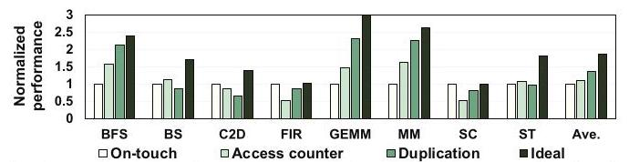

Fig. 1 是全文问题定义最关键的证据：BFS/GEMM/MM 更偏向 duplication，FIR/SC 更偏向 on-touch，BS 在 access counter 上更合适，ST 又没有一个简单答案。平均来看 duplication 比另外两个统一策略好，但单个应用上的最优策略差异很大，说明“选一个全局 policy”无法覆盖应用之间的行为差异。

**动机评估**：动机是 solid 的。作者不是只给出抽象判断，而是用八个 benchmark 和三种策略的归一化性能证明了策略偏好差异。同时，后续 characterization 进一步把性能差异归因到 page sharing、read/write 属性、时间阶段变化和邻近页相似性，而不只是停留在“workload 多样”这个泛泛说法上。

**核心 Insight**：page placement 的决策粒度应该从“应用级”下降到“页面级”和“阶段级”。同一个应用里不同页面可以有不同访问属性，同一个页面在不同时间段也可能从 read-only 变成 read-write 或从 all-shared 变成 producer-consumer shared；另一方面，邻近虚拟页往往来自同一数据结构，因此访问属性又具有局部连续性。GRIT 正是把这两个洞察结合起来：用 page fault 捕捉“不合适”的时刻，再用 PA-Table/PA-Cache 记录属性，并把一个页面的决策扩展到邻近页面。

## 二、相关工作

论文把相关工作主要放在 multi-GPU NUMA 优化和 runtime page placement 两条线上。第一类是 NUMA optimization，包括 GPU-CPU 或 multi-GPU 系统里的数据迁移、remote memory caching、locality-aware scheduling 和 address translation 优化。这类工作通常关注“怎么降低远端访问或迁移开销”，但不一定把不同页面的访问属性作为运行时选择不同 placement scheme 的核心信号。

第二类是 runtime page placement。典型做法会根据 hot/cold、traffic congestion、page replication/migration 等信息调整页面位置。例如 Griffin 通过 Dynamic Page Classification 决定页面迁移，GPS 通过 publish-subscribe 让 shared page 的写传播到订阅 GPU，prefetching 试图提前把邻近数据搬到本地。GRIT 与这些工作的差异在于，它不是只优化一种迁移策略，也不是只复制或只 peer-access，而是在三种已有策略之间做细粒度选择。

第三类是与本文互补的机制，包括 prefetching 和 page fault/translation 优化。GRIT 的实验特意与 Griffin、GPS、Trans-FW、first-touch、prefetching 组合或对比，说明它的定位更像 page placement policy selector，而不是替代所有 UVM 优化组件。

## 三、技术挑战

**挑战 1：什么时候应该改变 page placement scheme。** 如果周期性检查每个 GPU、每个页面的访问分布，需要 GPU 维护大量 per-page 状态，还要跨 GPU 汇总，通信和存储开销都很高。GRIT 必须找到一个已有系统自然产生、又能反映“当前策略不合适”的信号。

**挑战 2：如何低开销地判断页面属性。** 策略选择需要知道页面是否 shared、是否 read-only、是否 read-write。直接在 GPU 侧追踪所有访存很昂贵，而在 CPU/UVM driver 侧只看到 fault 又信息有限。GRIT 要从有限的 fault stream 中恢复足够的属性信息。

**挑战 3：如何避免反应太慢。** 如果必须等每个页面都 fault 到阈值才改变策略，那么相邻页面在被正确处理前会经历大量远端访问、迁移或 write-collapse。GRIT 需要把已观察到的一个页面属性推广到邻近页面，同时避免错误推广导致新的 ping-pong policy change。

**挑战 4：策略切换必须与 UVM 现有路径兼容。** page placement scheme 的改变会影响 PTE、TLB、cache、replica consistency。设计如果额外增加 page table walk、频繁 invalidation 或阻塞 GPU 执行，就可能吞掉收益。

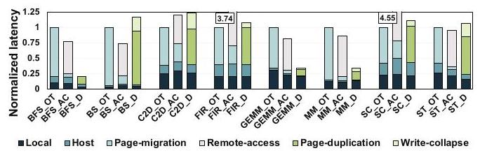

Fig. 3 展示了这些挑战为什么真实存在：on-touch 的主要成本来自 page migration，access counter 的主要额外成本来自 remote access，duplication 的额外成本来自 page-duplication 与 write-collapse。策略不是“谁更先进谁更好”，而是每种策略都把成本转移到不同路径上。

## 四、解决方案

### 整体思路

GRIT 的整体策略可以概括为：默认从 on-touch migration 出发；当某个页面持续产生 local page fault 或 page protection fault，说明当前方案可能不合适；UVM driver 在处理 fault 和 page table walk 的同时查询 PA-Cache/PA-Table，统计 fault count 与 read/write 属性；当 fault count 达到阈值 4，就根据属性选择 duplication 或 access counter-based migration；最后用 Neighboring-Aware Prediction 把这个决策推广到相邻页组。

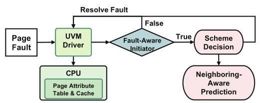

Fig. 11 把 GRIT 的三块组件放在同一个控制闭环里：Fault-Aware Initiator 负责触发，PA-Table/PA-Cache 负责记录和判断，Neighboring-Aware Prediction 负责提前传播。这个结构的关键是所有决策都挂在 page fault handling 路径上，避免另起一套昂贵的 profiling 机制。

### 贯穿示例

可以把一个 multi-GPU GEMM 看成三段连续虚拟地址：矩阵 A、矩阵 B 和输出矩阵 C。A/B 主要被多个 GPU 读取，因此更像 read-shared 页；C 被不同 GPU 写自己的分块，因此更像 private 或 read-write 页。如果系统统一使用 on-touch，A/B 会在 GPU 之间迁移或远端访问；如果统一 duplication，C 相关的写会引发 write-collapse；如果统一 access counter，A/B 又会承受不必要的 remote access。GRIT 的目标是让 A/B 倾向 duplication，让 C 保持 on-touch 或在 shared read-write 时使用 access counter，并利用 A/B/C 在虚拟地址上的连续性把一个页面的判断扩展到同一矩阵片段中的邻近页。

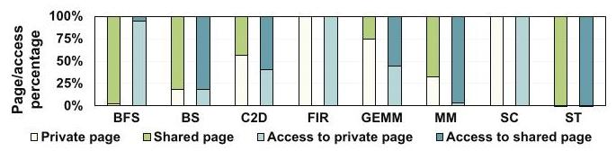

Fig. 4 说明这个例子不是人为构造的：FIR/SC 几乎都是 private page，BFS/ST 几乎都是 shared page，C2D/MM/GEMM 则混合出现。更重要的是，页面数量和访问次数不是同一件事，例如 BFS 虽然有大量 shared page，但访问并不都落在 shared page 上，所以只看 page count 也会误判。

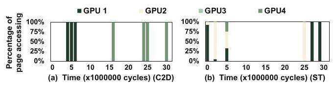

Fig. 5 进一步说明 shared page 也不能一概而论。C2D 中某个页呈现 producer-consumer 模式，在不同时间段主要由不同 GPU 使用，更适合 on-touch；ST 中同一页在早期更像 all-shared，后期又变成 PC-shared。这是 GRIT 必须动态而非静态决策的核心原因。

### 关键技术点

**Fault-Aware Initiator**：GRIT 用 local page fault 和 page protection fault 作为触发信号。local page fault 频繁出现，通常表示多个 GPU 正在访问这个页且当前位置不合适；page protection fault 频繁出现，则表示 duplication 下的写操作正在触发 write-collapse。默认阈值是 4，达到阈值后才触发 scheme change，这在“及时反应”和“避免频繁抖动”之间做了折中。

**PA-Table 与 PA-Cache**：PA-Table 是 CPU memory 中的软件表，每个 entry 48 bit，包含 45 bit VPN、2 bit fault counter 和 1 bit read/write 属性；PA-Cache 是 64-entry、4-way、write-allocate/write-back 的硬件 cache，用来避免每次 fault 都访问 PA-Table。作者估算 PA-Table 只占应用 memory footprint 的 0.15%，PA-Cache 约 352 bytes，面积相当于 32KB 8-way CPU L1 cache 的 0.04%。

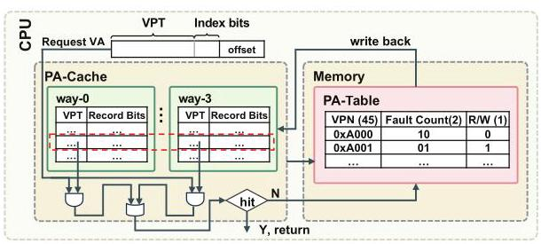

Fig. 12 的重点是 PA-Cache 只缓存 fault path 上真正活跃的页面属性，而不是追踪所有访存。read/write bit 一旦被置为 write，在当前 scheme lifetime 内保持为 write；当 fault counter 到阈值并完成 scheme update 后，相关 PA-Table/PA-Cache entry 会被删除。

**Scheme Decision**：GRIT 的选择规则非常克制。能触发 scheme change 的页已经不是单 GPU 私有页，因为私有页首次迁移后不会持续产生 fault；因此决策只需要检查 read/write 属性：全 read 的 shared page 改为 duplication；出现 write 的 shared page 改为 access counter-based migration。on-touch 仍作为默认方案服务 private 页和阈值以下的 PC-shared 页。

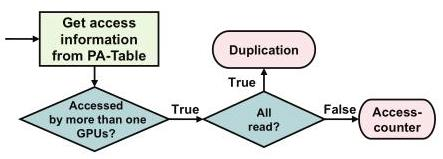

Fig. 13 展示了这个决策树的简洁性。它没有尝试预测精确访问次数，也没有训练模型，而是把“是否 shared”隐含在 fault threshold 中，把“是否适合复制”归约为 read-only 判断。

**Neighboring-Aware Prediction**：GRIT 观察到相邻虚拟页通常来自同一数据结构，所以访问属性相似。它把连续页组织成 page group：1 个 4KB 页、8 个页的 32KB group、64 个页的 256KB group，以及 512 个页的 2MB group。PTE 中 bits 9-10 存 scheme bits，bits 52-53 存 group bits。一个页完成新 scheme 决策后，系统检查相邻 8 页；如果超过一半已经使用同一 scheme，就把这些页合并成 group 并向更大 group 递归推广。

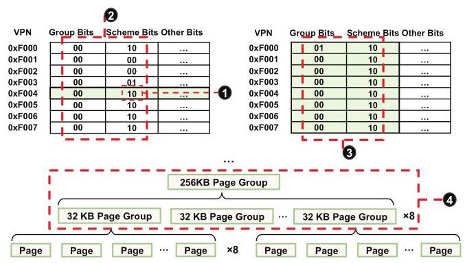

Fig. 15 是 GRIT 反应速度的关键：一个页达到 fault threshold 后，相邻页可以在下一次 fault 时直接采用已更新的 scheme，而不用各自再等 4 次 fault。若 group 内某页后来选择了不同 scheme，GRIT 会将大 group 降级为小 group，避免错误预测长期污染。

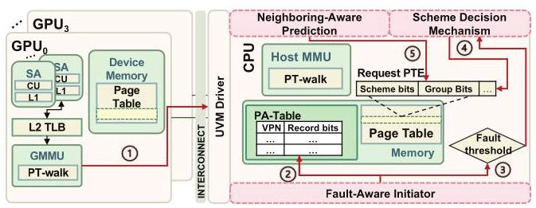

Fig. 16 展示了 GRIT 如何嵌入 UVM driver：fault 到达后，PA-Table/PA-Cache 更新与 page table walk 并行；若未到阈值，则检查 PTE scheme bits 是否已被邻近预测更新；若到阈值，则根据 PA-Table 属性更新 PTE scheme bits，并后台触发邻近页组检查。邻近检查不阻塞 GPU，也不直接迁移页面或 invalidation，因此设计上尽量把额外开销藏在已有 fault 路径里。

### 与已有方案的对比

相对 Griffin 这类动态迁移方案，GRIT 的优势是它不只问“要不要迁移”，还问“这个页更适合哪一种 placement scheme”。相对 GPS 这类 peer-to-peer/replication 方案，GRIT 避免对大量 shared page 一律复制导致 oversubscription。相对 prefetching，GRIT 解决的是“该用哪种 placement 语义”，prefetching 解决的是“何时提前搬数据”，二者可以组合。

局限也很清楚：GRIT 依赖 page-level 属性，因此在 2MB 大页下会受到 false sharing 影响；对于 ST、BS、C2D 这类大量 shared read-write 页，任何 placement scheme 都仍要承担迁移或一致性成本，距离 Ideal 仍有明显差距。

## 五、实验评估

### 实验设定

实验使用工业验证过的 MGPUSim。baseline 是 4KB page，多 GPU 间使用 300GB/s NVLink-v2，CPU-GPU 使用 32GB/s PCIe-v4；每个 GPU 64 个 1GHz compute unit，L2 cache 256KB，L1/L2 TLB 分别为 32/512 entries，access counter threshold 为 256。GPU DRAM 容量配置为应用 memory footprint 的 70%，用于模拟 oversubscription。

benchmark 包含八个应用：BFS、BS、C2D、FIR、GEMM、MM、SC、ST，覆盖 random、adjacent、scatter-gather 三类访问模式。主要 baseline 是统一使用 on-touch migration、access counter-based migration、page duplication；后续还对比 Griffin、GPS、Griffin-DPC+Trans-FW、first-touch，并评估 prefetching 组合与 DNN workload。

### 主要实验与结论

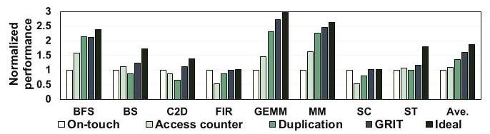

Fig. 17 是主结果：GRIT 相比统一 on-touch migration、access counter-based migration、page duplication 平均分别提升 60%、49%、29%。这组数字直接支撑了论文主张：动态细粒度选择策略比统一采用任何一种策略都更稳健。

更细看应用层面，BFS 因大量 read page 而接近 duplication，但 GRIT 比直接 duplication 略低 2%，原因是 GRIT 从 on-touch 起步，需要经历 fault 后才能调整；GEMM 和 MM 虽然 duplication 已经较好，GRIT 仍比 duplication 分别提升 17% 和 9%，因为它能把 read page 交给 duplication，同时让 private/read-write page 避免不必要复制；ST、BS、C2D 仍与 Ideal 有明显距离，因为 shared read-write page 占比分别达到 99%、56%、42%，这类页面本身很难通过简单 placement 完全消除成本。

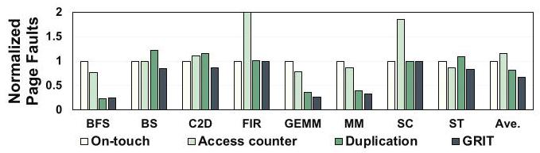

Fig. 18 从机制层面解释性能收益：GRIT 相比 on-touch、access counter、duplication 分别减少 39%、55%、16% 的 GPU page faults。因为 fault 包括 local page fault 和 page protection fault，减少它们意味着 UVM driver interrupt、page table update、PTE/TLB invalidation 和 write-collapse 都被间接降低。

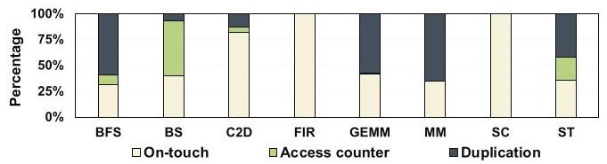

Fig. 19 说明 GRIT 不是简单偏向某一种策略。BFS/GEMM/MM 中 duplication 占主导，C2D 中 on-touch 占主导，BS 中 access counter 更常被采用，ST 则混合使用 duplication 与 on-touch。这与前文 characterization 和 Fig. 17 的性能结果相互印证。

### 消融实验

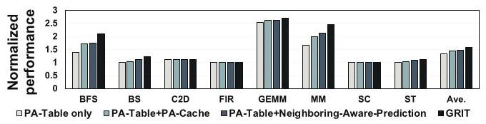

Fig. 20 显示，单独 PA-Table 平均带来 31% 提升，PA-Table+PA-Cache 提升到 47%，PA-Table+Neighboring-Aware Prediction 是 44%，完整 GRIT 最高。PA-Cache 和邻近预测分别解决两个不同问题：前者减少属性记录的内存访问开销，后者减少等待每个页单独达到 fault threshold 的反应延迟。

### 敏感性分析

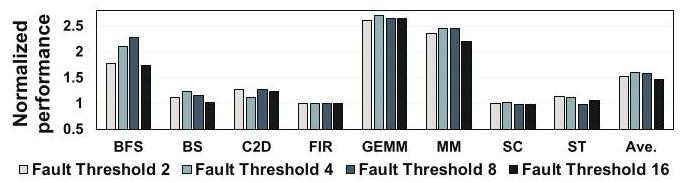

Fig. 21 比较 fault threshold 为 2、4、8、16 时的性能，平均提升分别为 53%、60%、59%、48%。阈值 2 反应快但容易过度切换，阈值 16 太慢，阈值 4 和 8 接近；论文选择 4，偏向更快捕捉页面属性变化。

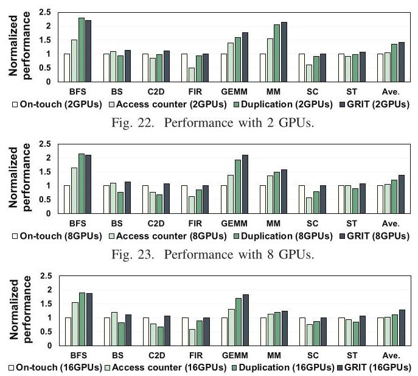

Fig. 24 实际包含 2、8、16 GPU 三组图。GRIT 在 2 GPU 上相比三种统一策略分别提升 40%、37%、11%，在 8 GPU 上为 38%、35%、26%，在 16 GPU 上为 27%、26%、23%。GPU 数增加后收益下降，不是 GRIT 失效，而是共享页和迁移次数变多后，任何 placement scheme 都更难避免迁移主导总时间。

大页实验中，GRIT 在 2MB page 下仍比 baseline on-touch 提升 23%，但低于 4KB page 下的 60%。原因是 2MB page 合并了 512 个 4KB page，read-only 与 read-write 属性会混在同一页里，导致只能按更保守的 read-write 方式处理，从而放大 false sharing。

### 与已有系统对比

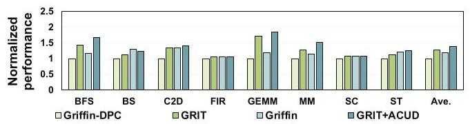

相对 Griffin-DPC，GRIT 平均提升 27%；把 ACUD 叠加到 GRIT 后又比纯 GRIT 提升 9%；GRIT+ACUD 比完整 Griffin 提升 16%。这说明 GRIT 的 page placement 选择和 ACUD 的迁移开销优化是正交的。

论文还报告 GRIT 相对 GPS 平均提升 15%，因为 GPS 会让多数 shared page 在多个 GPU 上复制，MM、BS、ST 等应用会出现严重 oversubscription；作者观察到 GPS 的 page oversubscription rate 平均比 GRIT 高 34%。相对 Griffin-DPC+Trans-FW 的组合，GRIT 平均提升 18%，原因是它减少了 page migration 数量并增加本地访问。相对 first-touch migration，GRIT 平均提升 54%；first-touch 对 FIR/SC 这种 private page 应用还可以，但对 MM/GEMM 这类 shared-page 访问会承受 remote access 开销。

与 prefetching 结合时，GRIT+prefetching 相比带 prefetching 的 on-touch baseline 仍有 23% 提升，说明 placement scheme selection 与 locality prefetch 可以互补。DNN workload 上，GRIT 对 VGG16 和 ResNet18 model parallelism 分别提升 15% 和 18%，但这部分实验较简略，更像适用性补充而不是主论证。

### 结论支撑性分析

实验总体能支撑核心声明：GRIT 在整体性能、fault 数量、策略分布、组件消融、阈值敏感性、GPU 数量、大页、与 SOTA 对比上都有数据。比较强的一点是 Fig. 19 把“GRIT 确实在按应用行为选择不同策略”可视化出来，而不仅是报告最终 speedup。

实验的主要限制有两个。第一，主评估基于 MGPUSim，虽然作者称其 industrial-validated，但真实 NVIDIA UVM driver 中的实现细节、调度抖动和 page fault handling 开销可能更复杂。第二，DNN workload 只给 VGG16/ResNet18 两个 model-parallel 结果，缺少对现代 LLM training/inference、大模型通信模式或真实多机多 GPU 环境的覆盖。

## 六、附加洞察

**结论 1**：page count 与 access count 不能混为一谈。  
*出处*：Section IV-B / Fig. 4。  
*推理链条*：作者先统计 private/shared page 的数量，再统计访问落在这些页面上的比例；BFS 的 shared page 很多，但只有少量访问落在 shared page 上；因此，如果只按页面数量判断应用应使用 duplication 或 access counter，会误判真实瓶颈。

**结论 2**：read-write page 不一定全程都有 write，因此 duplication 的适用边界是阶段性的。  
*出处*：Section IV-B / Fig. 10。  
*推理链条*：作者对 ST 的某个 read-write page 按每百万周期分段统计读写访问；区间 0-8 只有读，区间 9-31 才出现读写混合；因此，一个页面即便全局被标记为 read-write，也可能在某些阶段适合 duplication，这强化了“阶段级动态决策”的必要性。

**结论 3**：邻近页相似性来自应用数据结构，而不是偶然统计现象。  
*出处*：Section IV-C / Fig. 6, Fig. 7, Fig. 8。  
*推理链条*：GEMM 的输入矩阵和输出矩阵分别分布在连续虚拟地址段；输入矩阵被多个 GPU 读取，输出矩阵由各 GPU 写自己的分块；因此相邻页在同一时间段呈现相似 shared/private 和 read/write 属性。ST 虽然更不规则，但邻近页属性变化仍表现出同步性。这为 Neighboring-Aware Prediction 提供了应用结构层面的解释。

**结论 4**：GPU 数变多时，GRIT 的 page fault reduction 仍接近，但 speedup 会下降。  
*出处*：Section VI-B2 / Fig. 24。  
*推理链条*：2/8/16 GPU 下，GRIT 相对三种统一策略仍能减少 page fault，且 reduction 与 4 GPU 设置接近；但 speedup 从 2 GPU 的较高水平降到 16 GPU 的 27%/26%/23%；作者解释为更多 GPU 使页面更频繁共享，迁移成本在总执行时间中占比上升，因此 placement 改进的可见 speedup 被压缩。

## 七、总结与评价

GRIT 的核心贡献是把 multi-GPU UVM 中的 page placement 从单一全局策略变成运行时细粒度选择，并且用很简单的信号和数据结构完成这个选择：fault count 触发、read/write bit 决策、邻近页组预测扩展。它的设计亮点在于工程感很强，尽量复用 page fault handling 和 PTE bits，而不是依赖重 profiling 或复杂模型。

最大不足是它仍受 page granularity 和 workload 属性制约。遇到大量 shared read-write 页时，GRIT 只能在几个都有代价的策略之间选相对较好的一个；遇到 2MB 大页时，false sharing 会削弱属性区分能力。此外，真实系统实现和现代大模型 workload 的覆盖还不充分。

我认为这篇论文最值得借鉴的地方不是具体的 PA-Cache 大小或 fault threshold，而是它的抽象方式：把 runtime memory management 看成“检测当前策略是否失配、用低成本属性解释失配、再把决策传播到空间邻域”的闭环。这种思路可以迁移到多 GPU cache policy、prefetch policy、page size selection 甚至 CXL/NUMA tiered memory 管理中。

## 八、章节脉络与段落速览

- **Abstract**：概括 multi-GPU UVM 的 NUMA 开销、三种既有 page placement scheme 的局限，以及 GRIT 的平均性能提升。
- **Section I · Introduction**：提出问题背景、已有方案局限、GRIT 的动机和贡献。
  - **¶1**：说明单 GPU 难以满足数据规模与并行需求，multi-GPU 通过高速互连提供更多并行度和容量。
  - **¶2**：解释 UVM 简化编程但带来 NUMA 开销，并介绍 on-touch、access counter、duplication 三种策略的优缺点。
  - **¶3**：用 Fig. 1 说明不同应用没有统一最优策略，并引出动态 page placement 的必要性。
  - **¶4**：总结 prefetching、dynamic migration、peer-to-peer load/store 的不足，指出它们不能同时适配多种 page sharing pattern。
  - **¶5**：提出 GRIT 的三个组件和三项贡献：characterization、动态决策机制、实验验证。
- **Section II · Background**：介绍 UVM-enabled multi-GPU 架构与三种 page placement scheme。
  - **II-A ¶1**：描述多 GPU 通过 PCIe/NVLink 互连、每个 GPU 有本地 memory/PT，UVM driver 维护中央 page table。
  - **II-B ¶1**：定义 on-touch migration 及其 ping-pong migration 风险。
  - **II-B ¶2**：定义 access counter-based migration 及其 remote access、PTE/TLB invalidation 成本。
  - **II-B ¶3**：定义 page duplication 及其 write-collapse 和 oversubscription 风险。
- **Section III · Methodology**：说明 benchmark 和模拟配置。
  - **III-A ¶1**：列出八个应用及 random、adjacent、scatter-gather 三类访问模式。
  - **III-B ¶1**：说明 MGPUSim、GPU/TLB/network 配置、70% memory footprint oversubscription 设置和 4KB page baseline。
- **Section IV · Motivation and Characterization**：用实验刻画不同页面策略偏好的来源。
  - **IV-A ¶1**：把 page-handling latency 拆成 local、host、migration、remote access、duplication、write-collapse，解释三种策略的成本结构。
  - **IV-B ¶1**：用 private/shared page 比例说明应用之间的 sharing pattern 差异。
  - **IV-B ¶2**：把 shared page 进一步区分为 PC-shared 和 all-shared，并说明同一页的 sharing pattern 会随时间变化。
  - **IV-B ¶3**：说明 duplication 对 read-shared 页有效，但对 read-write intensive 应用会被 write-collapse 抵消。
  - **IV-B ¶4**：指出 read/write 属性也会随阶段变化，因此不能只做静态分类。
  - **IV-B Takeaway**：总结应用间、页面间、时间阶段间都存在策略偏好差异。
  - **IV-C ¶1**：展示邻近虚拟页具有相似访问属性，并用 GEMM/ST 的数据结构解释这种相似性。
- **Section V · Fine-Grained Dynamic Page Placement (GRIT)**：详细描述 GRIT 设计。
  - **V-A ¶1**：给出 GRIT 总览和三项挑战：触发时机、低开销记录、邻近页预测准确性。
  - **V-B ¶1**：提出用 local page fault 和 page protection fault 作为 scheme change 信号，并设定默认阈值 4。
  - **V-C ¶1**：介绍 PA-Table entry 字段、PA-Cache 结构和写策略。
  - **V-C ¶2**：说明 fault 到达时如何查 PA-Cache/PA-Table、更新 fault counter 与 read/write bit，并在阈值达到后删除 entry。
  - **V-C ¶3**：根据 read-only 或 read-write 选择 duplication 或 access counter，并说明 scheme bits 如何写入 PTE。
  - **V-D ¶1**：定义 page group、group bits 和 1/8/64/512 页的分组层级。
  - **V-D ¶2**：说明新 scheme 如何推广到邻近 8 页并递归提升到更大 group。
  - **V-D ¶3**：说明当 group 内页面选择不同 scheme 时如何降级 group。
  - **V-D ¶4**：解释为什么相同 access counter 决策时不做 group check，以避免反复 promotion/degradation。
  - **V-E ¶1**：串联完整 fault handling 流程，说明未达阈值和达到阈值两种路径。
  - **V-F ¶1**：量化 PA-Table/PA-Cache 存储和硬件开销。
  - **V-F ¶2**：讨论 scheme change latency 和 duplication reset 时的一致性开销。
- **Section VI · Evaluation**：验证整体性能、机制效果、敏感性与对比结果。
  - **VI-A ¶1**：主结果显示 GRIT 相比三种统一策略平均提升 60%、49%、29%，并解释各应用收益来源。
  - **VI-A ¶2**：page fault 数量相比三种统一策略减少 39%、55%、16%，并说明 GRIT 的策略分布符合应用属性。
  - **VI-A ¶3**：消融实验显示 PA-Table、PA-Cache、Neighboring-Aware Prediction 各自贡献性能。
  - **VI-B ¶1**：fault threshold 4 在性能和抖动之间取得较好折中。
  - **VI-B ¶2**：2/8/16 GPU 结果显示 GRIT 可扩展，但 GPU 数增加会削弱可见 speedup。
  - **VI-B ¶3**：2MB 大页仍有收益但低于 4KB，原因是 false sharing 混合了 page attributes。
  - **VI-C ¶1**：相对 Griffin-DPC、Griffin 和 ACUD 组合，GRIT 仍有独立收益。
  - **VI-C ¶2**：相对 GPS，GRIT 避免过度复制导致的 oversubscription。
  - **VI-C ¶3**：相对 Griffin-DPC+Trans-FW，GRIT 通过更多本地访问和更少迁移获得 18% 提升。
  - **VI-D ¶1**：相对 first-touch，GRIT 对 shared-page 应用优势明显。
  - **VI-E ¶1**：GRIT 与 tree-based neighborhood prefetching 互补，组合后仍有 23% 提升。
  - **VI-F ¶1**：VGG16 和 ResNet18 上分别提升 15% 和 18%。
- **Section VII · Related Work**：把本文放入 NUMA optimization 和 runtime page placement 两类研究中。
  - **¶1**：比较已有 NUMA 优化，强调 GRIT 聚焦按页面动态 fine-tuning placement scheme。
  - **¶2**：比较已有 runtime placement，指出它们没有深入利用 runtime page attributes 来选择不同策略。
- **Section VIII · Conclusion**：重申 GRIT 的三个组件和 60%/49%/29% 的平均性能提升。
- **Acknowledgements**：感谢 HPCA reviewers 并列出 NSF grant 支持。
