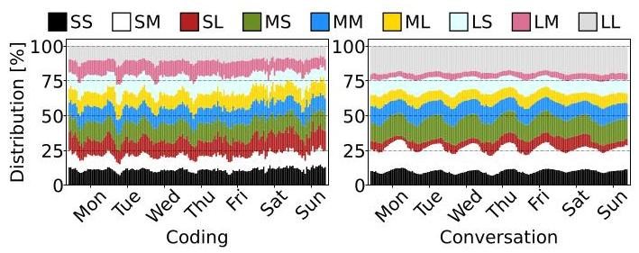
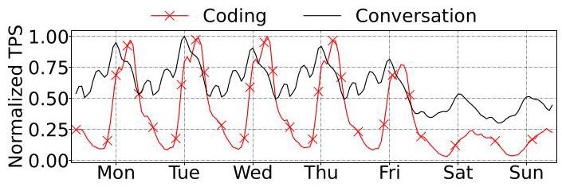
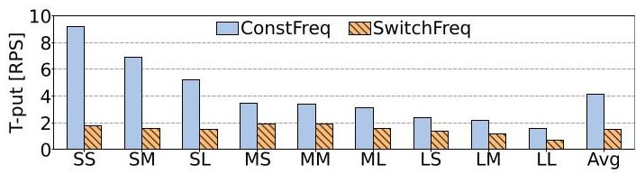
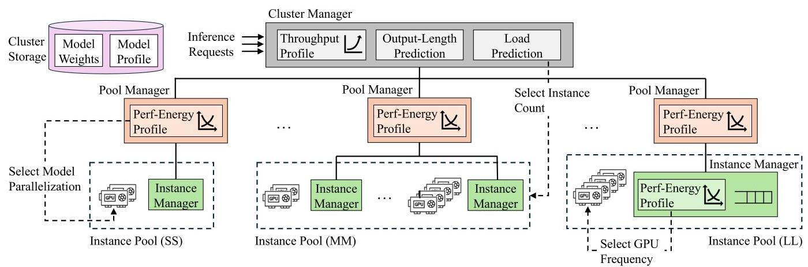
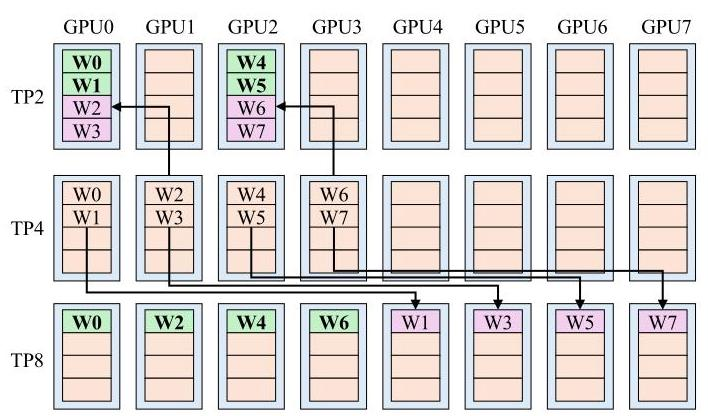
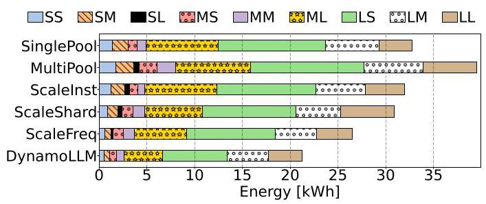
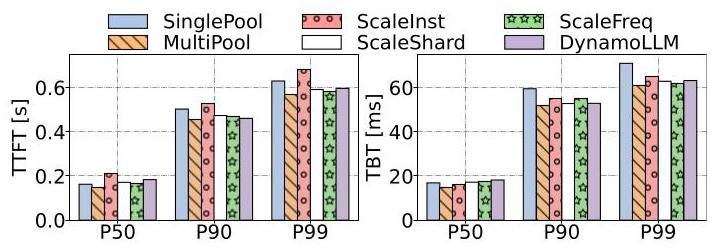
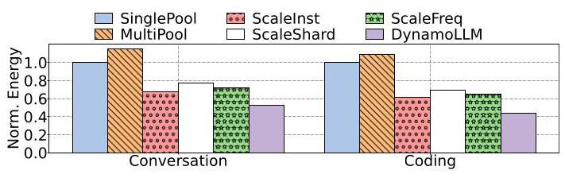
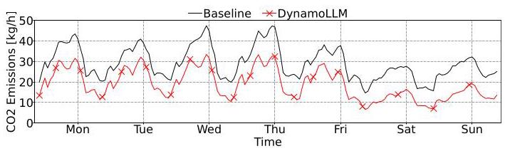

# DynamoLLM: Designing LLM Inference Clusters for Performance and Energy Efficiency 深度解读

> **作者**：Jovan Stojkovic, Chaojie Zhang, Inigo Goiri, Josep Torrellas, Esha Choukse  
> **会议/期刊**：HPCA 2025  
> **一句话总结**：DynamoLLM 把 LLM inference cluster 的能耗优化建模为一个动态、多层级、多旋钮的资源管理问题，通过按请求类型分池、动态调整实例数量、tensor parallelism 和 GPU frequency，在满足 TTFT/TBT SLO 的前提下降低能耗、碳排和用户成本。

## 一、问题定义（Problem）

这篇论文属于在已有 LLM serving 和数据中心能耗管理基础上的改进型工作，但它的切入点很明确：过去的 LLM inference 系统主要围绕 throughput、latency、KV cache、parallelism 和调度效率优化，而实际运行中的 LLM inference cluster 正在消耗大量 GPU 能源，并产生可观的 operational carbon emission。作者要解决的问题不是“如何让单个 LLM 更快”，而是“在服务级 SLO 不被破坏的前提下，如何让一整个 LLM inference cluster 持续运行在更节能的配置上”。

这个问题之所以不能直接套用传统 datacenter power management，是因为 LLM inference 的运行状态同时受请求形态、模型规模、服务 SLO、负载波动和 GPU 配置影响。prefill phase 偏 compute-intensive，decode phase 偏 memory-intensive；长输入请求对 GPU frequency 更敏感，短输入长输出请求则可能在较低 frequency 下保持相近性能。也就是说，同一个 GPU cluster 中的不同请求并不应该被同一种配置处理。

Fig. 1 展示了 Coding 和 Conversation 两类真实服务中请求长度分布的差异：Conversation 通常输出更长、输入更短，而 Coding 更偏长输入。这个图支撑了论文最核心的动机：LLM serving 不是一个稳定、同质的 workload，按平均请求去配置资源会掩盖大量可利用的能耗差异。

Fig. 2 则说明负载本身也在随时间变化。Coding 有更明显的昼夜和周末波谷，Conversation 变化较缓但仍然显著。作者给出的具体数字是：Conversation 的峰值负载分别是平均负载和谷值负载的 1.7 倍、3.3 倍；Coding 的峰值分别是平均负载和谷值负载的 2.8 倍、34.6 倍。这意味着如果按峰值静态配置，低负载时会浪费大量 idle power；如果动态降频或缩容，又必须处理重配置开销和 SLO 风险。

**动机评估**：动机是 solid 的。论文用请求长度分布、负载轨迹、能耗配置表和重配置开销共同说明问题真实存在，而且不是通过单一 DVFS 或 autoscaling 就能完整解决。一个需要注意的边界是，论文主要评估 Microsoft Azure 的 Coding 和 Conversation traces，虽然规模和真实性较强，但仍不能完全代表所有 LLM 服务，例如多租户 agent workload、RAG workload 或超长上下文服务。

**核心 Insight**：LLM inference cluster 的能耗优化机会来自两个同时成立的事实：不同请求类型、模型和 SLO 对 GPU frequency 与 model parallelism 的敏感度不同；这些请求类型和负载占比又会随时间快速变化。因此，系统必须动态地为不同请求选择不同资源池和配置，而不能用一个全局固定配置服务全部请求。

## 二、相关工作（Related Work）

作者把相关工作大致放在三条脉络中。

第一类是传统 cluster resource and power management。已有工作研究过 latency-sensitive microservices、CPU power management、power capping、oversubscription 和 cloud resource sharing。这些系统的核心思路是利用 workload slack 或硬件可调节性，在 SLO 约束下节约功耗。但它们通常假设控制对象是 CPU frequency、cache、memory bandwidth 或集群级功率预算，缺少 LLM inference 特有的 tensor parallelism、prefill/decode 差异、输出长度不可知和 per-request pool 这样的结构。

第二类是 energy-efficient GPU / DNN workload。已有 GPU DVFS、DNN inference batching、training energy optimization、autoscaling 和 resource partitioning 研究表明 GPU 频率和批处理策略确实会影响能耗。但这些方法往往只控制一个旋钮，或者面向较稳定的 DNN inference/training workload。DynamoLLM 的立场是：LLM inference 的 energy optimum 经常由实例数量、TP 配置、GPU frequency 和请求池划分共同决定，只调一个旋钮会留下明显优化空间。

第三类是 efficient LLM inference serving，包括 vLLM、Orca、AlpaServe、Splitwise、SARATHI、SpotServe、ExeGPT 等。这些工作分别从 KV cache 管理、continuous batching、phase splitting、model parallelism、heterogeneous resource 和调度策略提高吞吐或降低延迟。它们构成 DynamoLLM 的系统背景，但主要目标不是 energy/carbon，也没有把重配置开销和 SLO-aware energy profile 作为一等约束。

因此，DynamoLLM 的新意不在于发明某一个单点机制，而在于把 LLM inference 的能耗问题系统化：先 profile 出模型、请求类型、并行度、频率、负载之间的 energy-performance surface，再用层级控制器在运行时近似求解。

## 三、技术挑战（Challenges）

**挑战 1：请求类型带来的 energy-performance profile 差异很大。** 论文按输入/输出 token 长度把请求分成 SS、SM、SL、MS、MM、ML、LS、LM、LL 九类。Table I 显示，对 Llama2-70B，在 medium load 下，SS 可以用 TP2 at 1.2GHz 低能耗运行，而 LL 基本只能在 TP8 下满足 SLO。更细的是，最低功率配置不一定最低能耗，因为低频会拉长执行时间。

**挑战 2：负载、请求类型和服务 SLO 都是动态的。** 同一模型可能被不同服务以不同 SLO 使用，同一服务也可能调用不同模型。即便某个配置在当前 5 分钟内能效最好，下一段时间负载上升或请求分布变化后就可能违反 TTFT/TBT SLO。

**挑战 3：配置空间太大，直接全局优化不适合频繁运行。** 系统可调的旋钮包括 instance 数量、每个 instance 的 tensor parallelism、GPU frequency、请求池数量和请求到池的映射。作者把全局问题写成 MILP，能表达最优目标，但求解开销达到数百毫秒级，不适合每几秒做一次 fine-grained 频率决策。

**挑战 4：重配置开销会吞掉节能收益，甚至造成尾延迟。** 新建一个 Llama2-70B instance 的开销约 6-8 分钟；传统 re-sharding 需要停引擎、卸载/重载权重，约 1-2 分钟；GPU frequency 调整也有 50-80ms 开销，而一个 decode iteration 约 20ms。如果把这些动作直接放在请求关键路径上，SLO 会被破坏。

Fig. 4 说明了一个容易被忽略的问题：即使把频率“重新设置”为同一个最高频率，频繁调用管理接口本身也会显著降低 throughput。因此 DynamoLLM 不只是决定“调到多少频率”，还必须决定“何时值得调、如何降低调频开销”。

**挑战 5：输出长度不可知会影响请求分池。** 输入长度在请求到达时可见，但输出长度在 autoregressive generation 完成前不可知。DynamoLLM 必须预测输出长度，并准备处理 over-estimation 和 under-estimation：前者浪费能耗，后者可能导致 SLO miss。

## 四、解决方案（Solution）

### 整体思路

DynamoLLM 的整体设计可以概括为：离线/部署时建立 LLM energy-performance profiles，运行时把 cluster 切成面向请求类型的 instance pools，再用 cluster、pool、instance 三层控制器分别调节实例数量、tensor parallelism 和 GPU frequency。它不是追求每次都求全局最优，而是用层级近似把不同时间尺度的问题拆开：分钟级处理扩缩容，几分钟级处理 sharding，秒级处理频率。

Fig. 5 是整篇论文的系统中心图。Cluster Manager 接收请求并预测请求类型，然后分发到对应 pool；Pool Manager 在池内选择 instance 并决定是否调整 parallelism；Instance Manager 与 inference engine 共置，负责队列调度和 GPU frequency。这个层级结构同时回应了两个问题：避免单点控制器成为瓶颈，也让不同开销的动作在合适的时间尺度上运行。

### 贯穿示例

可以把 DynamoLLM 想成一个服务在线编程助手的 GPU 集群。白天有大量长代码输入、短解释输出的 Coding 请求，晚上可能更多是短输入、长回答的 Conversation 请求；其中一部分请求要求快速交互，另一部分可以容忍更宽松的延迟。

传统 SinglePool 会把所有请求丢进同一个 TP8、高频 GPU 池，保证最难请求也能达标，但短请求和低负载时会浪费能耗。DynamoLLM 则先把请求分成九类：例如 LS 类代表长输入短输出，更可能需要较高 prefill 能力；SL 类代表短输入长输出，更受 decode 和 memory behavior 影响。Cluster Manager 预测每类请求的下一周期峰值，把 GPU 分配给不同池；Pool Manager 决定每个池是用更多 TP2 instance 还是更少 TP8 instance；Instance Manager 再根据当前排队负载把 GPU frequency 调到满足 SLO 的最低能耗点。

如果某个 SL 请求被误判为 SS，Instance Manager 会先在队列里提升快到 deadline 的请求优先级，再把 GPU 拉到最高频率；若 backlog 仍然恶化，就把尚未开始的请求转移到同池或更大请求池。这个例子说明 DynamoLLM 的关键不是“低频运行”，而是在能耗、并行度、分池、预测错误和重配置之间持续折中。

### 关键技术点

**1. LLM profile 驱动的配置选择。** 用户部署服务时指定模型和 SLO，DynamoLLM 对模型在不同 request length、load、TP2/TP4/TP8、GPU frequency 下做 profiling。频率范围是 800-1980MHz，步长 200MHz；系统在少量 load points 上测量，再插值预测中间负载。由于 GPU power 与 load 非线性，作者在功率陡增区间补充 profiling 点，最终报告的平均预测准确率超过 98%。

**2. MILP 表达全局目标，但运行时用层级控制近似。** 全局优化目标是最小化所有 TP 配置实例的能耗总和，约束包括 GPU 总数不超过分配量、各实例承载负载之和覆盖预测负载、各实例性能满足 SLO。这个表达给出了问题本质，但运行时拆成三层：Cluster Manager 每 30 分钟预测 load 并决定每个 pool 的节点数；Pool Manager 每 5 分钟决定 TP/sharding；Instance Manager 每 5 秒决定 GPU frequency。

**3. 请求类型分池与碎片控制。** DynamoLLM 使用输入长度和预测输出长度把请求映射到不同 pool。池太少会让配置无法细调，池太多又会造成 idle GPU 碎片。因此系统用历史数据确定池数量，并在某类请求负载降低时，把该池与下一个更大请求类型的池合并或转移一部分 leftover load，避免多个小池都为峰值过度配置。

**4. 平滑重配置。** 对扩容，DynamoLLM 在集群本地缓存模型权重、用包含 inference engine 状态的 VM snapshot 启动，并提前按下一 epoch 的预测峰值在后台创建实例。对 re-sharding，系统用 graph matching 最大化留在原 GPU 上的权重量，并通过 NVLink 做 GPU-to-GPU direct transfer。对调频，系统让 nvidia-smi monitor 常驻内存，并在 privileged mode 下减少 OS-user transition。

Fig. 6 展示了 re-sharding 为什么可以比重启引擎更轻量。TP4 到 TP8 时，原来 4 个 GPU 各持有 1/4 权重，目标状态每个 GPU 需要 1/8；原 GPU 只需把一半权重并行发给新增 GPU，因此约等于传输 1/8 模型权重的时间。论文在 Llama2-70B、DGX H100、NVLink 条件下给出的 $\tau$ 是 50ms，比传统 1-2 分钟重载权重要小得多。

**5. 输出长度预测与异常处理。** 实现中使用 BERT-based proxy model，把输出长度预测成 short、medium、long 三类，训练数据包括 SQuAD、WildChat-1M、OpenOrca、coding 和 LMSYS-Chat-1M，报告准确率为 81%。如果预测过长，请求进入更高性能池，只是能耗不优；如果预测过短，Instance Manager 通过重排、升频、迁移未开始请求和必要时 squash 超时请求来降低 SLO miss 风险。

### 与已有方案的对比

相比只做 per-request pool 的 MultiPool，DynamoLLM 会随负载动态调整池大小和配置，避免静态多池过度配置。相比只调实例数、只调 sharding 或只调 frequency 的 ScaleInst/ScaleShard/ScaleFreq，DynamoLLM 同时协调多个旋钮，因此在评估中节能幅度更大。相比传统 power management，它把 LLM 特有的 tensor parallelism、prefill/decode 差异、输出长度预测和重配置开销纳入控制逻辑。

它的不足也比较清楚：profile 和控制器依赖服务历史负载与模型 profile 的稳定性；输出长度预测错误虽有兜底，但仍会增加能耗和延迟；VM snapshot、本地权重缓存、privileged frequency control 和 NVLink 拓扑优化都需要云平台配合，移植到不同硬件或多租户安全边界下并非零成本。

## 五、实验评估（Experiments）

### 实验设定

实验平台是每台 8 张 H100 GPU 的服务器，主要展示 Llama2-70B，但作者说明 Mixtral、Falcon、BLOOM 等模型趋势类似。workload 使用三组 Coding 和 Conversation 生产级 traces：1 小时开源 trace、1 天 trace 和 1 周 trace。baseline 包括 SinglePool、MultiPool、ScaleInst、ScaleShard、ScaleFreq。指标包括能耗、TTFT、TBT、power draw、GPU frequency、sharding 变化、cost 和 operational carbon emission。

在 cluster-level 1 小时实验中，Conversation trace 的请求占比为 SS 14%、SM 18%、SL 1%、MS 5%、MM 6%、ML 22%、LS 14%、LM 9%、LL 11%。baseline 配置 12 台 H100 servers 处理峰值负载，DynamoLLM 则按当前负载动态改变 server 数量。

### 主要实验与结论

Fig. 7 是最直接的能耗结果。静态分多池的 MultiPool 反而比 SinglePool 多耗能 20%，因为它为每个请求类型都分配峰值资源且总在高性能配置下运行。ScaleInst、ScaleShard、ScaleFreq 分别只降低 2%、6%、19% 能耗，而 DynamoLLM 降低 35%。这说明单个旋钮能带来收益，但 LLM inference 的主要空间来自多个旋钮的协同。

Fig. 8 说明 DynamoLLM 的节能不是通过牺牲尾延迟换来的。相比 SinglePool，它让 P99 TTFT 和 P99 TBT 分别下降 5.3% 和 11.0%；不过 P50 TTFT 和 P50 TBT 分别上升 11.4% 和 7.6%，原因是系统在有 SLO slack 时会选择较低性能、较低能耗配置。这是一个合理折中：interactive 服务真正硬约束通常在 tail SLO，而不是每个请求都追求最低 median latency。

在 power 维度，DynamoLLM 让 P50 和 P99 cluster power 分别比 SinglePool 低 43% 和 9%。Fig. 10 和 Fig. 11 进一步显示，不同请求池会在不同时间以不同 frequency 和 TP 配置运行，说明系统确实在动态利用 workload heterogeneity，而不是简单地全局降频。

敏感性实验补上了几个边界条件。输出长度预测准确率从 100% 降到 60% 时，能耗增加 25%，TTFT 增加 12.3%，但系统没有崩溃，说明兜底机制有一定鲁棒性。负载从 Low、Medium 到 High 时，DynamoLLM 相对 SinglePool 的节能分别为 57%、42%、15%；高负载下 slack 变少，所以节能空间自然缩小。池数量实验显示，2/4 个池不够细，12/16 个池又会碎片化；作者选择 9 个池，对应平均 85.7 张 GPU，而 16 个池平均要 91.2 张 GPU。

Fig. 15 把结论推广到 1 周生产 trace 和更大规模仿真。SinglePool 需要 40 台服务器，也就是 320 张 H100 GPU；DynamoLLM 在 Conversation 和 Coding 服务上分别降低 47% 和 56% 能耗。Conversation 的主要请求是 ML，适合较高能效模式；Coding 的夜间和周末低谷很深，因此动态缩放收益更明显。

Fig. 17 将节能转换为 operational carbon emission。以 CAISO 碳强度轨迹为例，SinglePool 每周产生 5t CO2，DynamoLLM 为 3.1t，降低 38%。论文同时报告，DynamoLLM 将平均 GPU server 数从 40 降到 24.6，带来 38.5% GPU 成本下降，折合 USD 1362.7/hour；能源费用最多降低 56%，但绝对值只有 USD 4.4/hour，因为云 GPU 租赁成本远高于电费。

### 结论支撑性分析

实验总体能支撑论文的主张：DynamoLLM 的收益不仅出现在单小时 trace，也出现在 24 小时实机实验和 1 周仿真；不仅有能耗结果，也有 latency、power、frequency、sharding、cost 和 carbon 结果；并且有对 predictor accuracy、load level 和 pool number 的敏感性分析。

主要局限也应保留。第一，论文主要报告 GPU 能耗，不把服务器其他部分纳入核心能耗指标，虽然引用先前工作说明 GPU power 与 server power 相关且 GPU 超过 60% server power。第二，trace 主要来自 Azure 的 Coding/Conversation 服务，外推到其他服务形态需要谨慎。第三，系统依赖平台特性，如 H100/NVLink、snapshot、local model cache 和 privileged frequency control；这些条件在所有云环境中未必可用。

## 六、附加洞察（Side Findings）

**结论 1：最低功率配置不一定最低能耗配置。**  
*出处*：Section III-A，Table I。  
*推理链条*：作者比较 LL 请求在 TP8 下的不同频率，指出 TP8 at 1.2GHz 虽然是满足 SLO 的低功率配置，但由于执行时间变长，能耗反而不如 TP8 at 1.6GHz。这提醒读者，energy optimization 不能只看 instantaneous power，必须把 runtime 一起纳入目标函数。

**结论 2：把请求分池如果不动态调度，可能比单池更耗能。**  
*出处*：Section V-B，Figure 7。  
*推理链条*：MultiPool 消除了部分 head-of-line blocking，但每个池都按峰值配置且运行高性能模式，导致资源碎片和 idle GPU 增加；实验中 MultiPool 比 SinglePool 多耗能 20%。因此“按请求类型隔离”只是必要条件，不是充分条件，必须配合动态 right-sizing。

**结论 3：DynamoLLM 的收益随负载升高而下降。**  
*出处*：Section V-C，Figure 13。  
*推理链条*：低负载时系统有更多 SLO slack，可以降频、减少并行度或缩容；中负载时仍有部分 slack；高负载时为了达标必须更多使用高频和高 TP。对应节能从 Low 的 57%、Medium 的 42% 下降到 High 的 15%。这说明 DynamoLLM 最适合有明显波谷或混合请求类型的服务。

**结论 4：输出长度预测不必完美，但错误会有可见代价。**  
*出处*：Section V-C，Figure 12；Section IV-D。  
*推理链条*：作者人为引入 misclassification，Dyn-60% 相比 Dyn-100% 能耗增加 25%、TTFT 增加 12.3%；不过由于 Instance Manager 会重排、升频和转移请求，系统仍能保持基本运行。这说明 predictor accuracy 是优化质量因素，不是系统正确性的唯一支柱。

**结论 5：用户成本收益主要来自 GPU 资源减少，而不是电费减少。**  
*出处*：Section V-F。  
*推理链条*：DynamoLLM 将平均服务器数从 40 降到 24.6，按云 GPU VM 价格节省 USD 1362.7/hour；相比之下，电费虽然最多降低 56%，但只对应 USD 4.4/hour。也就是说，对云用户而言，节能系统的直接经济激励主要表现为少租 GPU，而不是少付电费。

## 七、总结与个人评价（Wrap-up）

DynamoLLM 的核心贡献是把 LLM inference 的能耗问题从“调低 GPU 频率”提升为一个系统级控制问题：请求分池、实例数量、model parallelism、GPU frequency、预测错误和重配置开销都必须一起考虑。论文最强的地方在于动机与系统设计闭环清楚，且评估覆盖能耗、延迟、成本和碳排，给出了 52% 能耗、38% operational carbon、61% 用户成本降低的端到端结论。

我认为这篇工作的最大亮点是“时间尺度分层”：不同资源旋钮的开销完全不同，强行全局高频优化既慢又危险；把 scale-out/in、shard-up/down 和 scale-up/down 拆到不同控制层，是很工程化也很合理的设计。最大不足是平台依赖较强，尤其是 snapshot、NVLink re-sharding 和 privileged frequency control 的实现条件，可能限制其在更保守的多租户云环境中直接部署。后续值得探索的是把 embodied carbon、跨 region carbon intensity、RAG/agent 负载和更长上下文模型纳入同一个控制框架。

## 八、章节脉络与段落速览（Structure Map）

- **Abstract**：用一段话概括 LLM inference 能耗问题、DynamoLLM 的动态重配置方案，以及平均 52% energy、38% carbon、61% cost 的收益。

- **Section I · Introduction**：从 LLM 服务规模增长引出能耗问题，并说明传统方法没有覆盖 LLM inference 的多维动态特性。
  - **段1**：说明 LLM 应用增长使 inference cluster 成为大规模基础设施。
  - **段2**：指出已有 LLM inference 优化多关注性能，能耗和碳排仍被低估。
  - **段3-4**：归纳请求长度、模型规模、SLO 差异和负载波动带来的动态能效差异。
  - **段5**：解释传统 CPU/GPU 能耗管理无法直接覆盖 LLM-specific knobs。
  - **段6-7**：提出 DynamoLLM 的 profile-driven、多旋钮、分池和层级控制方案。
  - **段8**：给出 Azure 生产级 trace 上的主要收益。
  - **段9**：列出三项贡献：机会分析、系统设计实现、生产级评估。

- **Section II · Background**：交代 LLM inference 的计算阶段、性能指标、并行方式和数据中心能耗背景。
  - **段1**：解释 prefill 与 decode 的计算差异，并定义 TTFT、TBT、throughput 和 energy。
  - **段2**：说明 pipeline parallelism 和 tensor parallelism，并说明本文主要关注单机内 TP2/TP4/TP8。
  - **段3**：总结传统数据中心能耗研究，并指出 LLM inference 正在成为新的 power-dense workload。

- **Section III · Opportunities for Energy Efficiency**：通过 profiling 和生产 trace 展示 DynamoLLM 的三个设计洞察和一个重配置挑战。
  - **开头段**：说明使用 DGX H100、vLLM、开源模型和 Azure traces 做 characterization。
  - **III-A Heterogeneous Energy-Performance Profiles**：用请求长度、load、model 和 SLO 说明不同请求需要不同 TP/frequency 配置。
    - **段1-2**：定义九类请求和对应 SLO，并通过 Table I 说明短请求与长请求的能效最优点不同。
    - **段3**：指出输出长度不可知，因此需要预测。
    - **段4-5**：说明 load 高低会改变最优 parallelism 和 frequency。
    - **段6-8**：说明模型规模、稀疏性和服务 SLO 都会改变配置选择。
  - **III-B Dynamic LLM Inference Workloads**：用 Fig. 1/2 说明请求类型分布和负载随服务和时间变化。
    - **段1-2**：比较 Coding 与 Conversation 的请求长度分布，并引出 pool 数量选择问题。
    - **段3-4**：说明昼夜/周末负载波动带来可利用 slack。
    - **段5**：说明多服务 SLO 和多模型并发让人工配置不可行。
  - **III-C Power Proportionality**：用 Fig. 3 说明 GPU power 与 load/utilization 的关系非线性，且 idle/model-loaded power 不可忽略。
  - **III-D Reconfiguration Overheads**：分实例创建、model parallelism 改变和 GPU frequency 改变三类开销，说明动态控制必须降低并计入这些成本。

- **Section IV · DynamoLLM: An Energy Management Framework**：正式描述 DynamoLLM 架构、控制器、重配置优化和请求调度。
  - **开头段**：把前三个 insight 转化为四个设计原则：SLO-aware energy optimization、heterogeneous pools、dynamic reconfiguration、low-overhead transition。
  - **Architecture**：说明 Fig. 5 中 cluster/pool/instance manager 的职责和通信关系。
  - **IV-A Configuring Instances for Energy-Efficiency**：介绍模型 profiling、profile 复用和 MILP 形式的能耗最小化问题。
    - **段1-3**：描述 profiling 变量、插值策略和 profile repository。
    - **段4-6**：说明求解器输出实例数、frequency 和 load 分配，并列出 GPU 数、负载覆盖和 SLO 约束。
    - **段7**：指出全局求解太慢，需要层级近似。
  - **IV-B Hierarchical Control for Dynamic Load**：把控制拆成 cluster scale-out/in、pool shard-up/down 和 instance scale-up/down 三层。
    - **段1**：解释不同控制器对应不同时间尺度。
    - **段2-3**：说明 Cluster Manager 如何预测峰值负载并处理 pool fragmentation。
    - **段4-6**：说明 Pool Manager 如何选择 TP，控制器如何计入 overhead，并错峰重配置降低 downtime。
    - **段7**：说明 Instance Manager 如何筛掉违反 SLO 的频率并选择最低能耗频率。
  - **IV-C Reduced Overheads for Smooth Reconfiguration**：介绍实例启动、re-sharding 和调频的开销降低技术。
    - **段1-2**：说明 local cache、VM snapshot 和 proactive VM creation。
    - **段3-6**：说明 graph matching、NVLink transfer 和 TP4 到 TP2/TP8 的例子。
    - **段7-9**：说明旧实例继续服务、同步期间的内存限制，以及 nvidia-smi 常驻和 privileged mode。
  - **IV-D Predictive Scheduling for Request Heterogeneity**：介绍输出长度 predictor、池内能耗感知调度、mis-prediction 处理和多 SLO 分池策略。
  - **IV-E DynamoLLM Implementation**：说明系统基于 vLLM、gRPC managers、BERT predictor、PuLP MILP 和 SciPy interpolation 实现。

- **Section V · Evaluation**：用实机和仿真评估 DynamoLLM 在能耗、延迟、功率、成本和碳排上的表现。
  - **V-A Evaluation Setup**：说明 H100 服务器、Llama2-70B、三组生产级 trace、五个 baseline 和评估指标。
  - **V-B Cluster-Level Experiments**：用 1 小时 Conversation trace 对比能耗、latency、power、frequency 和 sharding。
    - **段1**：给出请求类型比例和 12 台 server 的 baseline 配置。
    - **段2**：报告 Fig. 7 的能耗结果，突出 DynamoLLM 降低 35%。
    - **段3**：报告 Fig. 8 的 TTFT/TBT 结果和 median/tail latency 折中。
    - **段4-6**：用 Fig. 9/10/11 说明 power、frequency 和 sharding 的动态变化。
  - **V-C Sensitivity Studies**：分析 predictor accuracy、load level 和 pool number 对能耗与 TTFT 的影响。
  - **V-D Long Running Cluster-Level Experiments**：用 24 小时 Conversation trace 说明 DynamoLLM 全天降低 42% 能耗。
  - **V-E Large-Scale Simulations**：用 1 周 Coding/Conversation trace 说明 DynamoLLM 在 320 H100 GPU 规模下分别降低 56% 和 47% 能耗。
  - **V-F Cost and Carbon Emission**：把资源减少转化为 GPU 租赁成本、电费和 operational carbon savings。

- **Section VI · Related Work**：把已有研究分为 cluster resource/power management、energy-efficient workloads 和 efficient LLM inference serving。
  - **段1**：总结传统资源管理和 power management。
  - **段2**：总结 GPU/DNN 能耗优化，并强调 DynamoLLM 的 multi-knob 视角。
  - **段3**：总结 LLM inference serving 工作，并说明它们多优化吞吐/延迟而非能耗。

- **Section VII · Conclusion**：重申 DynamoLLM 是面向 LLM inference cluster 的首个 energy-management framework，并总结 52% energy、38% carbon、61% cost 的收益。

- **Acknowledgments and References**：列出基金支持和引用文献，主要用于定位相关系统、数据集、硬件平台和碳强度数据来源。
