# OASIS: Object-Aware Page Management for Multi-GPU Systems 深度解读

> **作者**：Yueqi Wang, Bingyao Li, Mohamed Tarek Ibn Ziad, Lieven Eeckhout, Jun Yang, Aamer Jaleel, Xulong Tang  
> **会议/年份**：IEEE International Symposium on High Performance Computer Architecture (HPCA), 2025  
> **一句话总结**：OASIS 把 multi-GPU UVM 的 page management 从“所有页统一策略”推进到“按运行时 object pattern 动态选策略”，用很小的 object-level 元数据在多数场景中接近理想性能，并比 per-page 学习方案 GRIT 更简单。

## 一、问题定义

这篇论文属于非 First 类型：multi-GPU Unified Virtual Memory (UVM) 下的 page placement / migration 问题已经被研究多年，系统也已经有 on-touch migration、access counter-based migration、page duplication 等机制。OASIS 的切入点不是重新发明 UVM，而是指出这些机制在现有系统里通常以统一策略作用到所有 page，忽略了应用内部不同 data object 的访问差异，也忽略了同一 object 在不同 execution phase 中访问模式会变化。

具体问题是：在 UVM-enabled multi-GPU 系统中，如何在不要求程序员手工标注数据、也不引入 per-page 高成本学习的前提下，为不同内存对象动态选择合适的 page management policy，从而降低 NUMA overhead。这里的 NUMA overhead 主要来自 GPU 之间共享数据时的远端访问、页迁移、页复制失效和 page fault 处理。

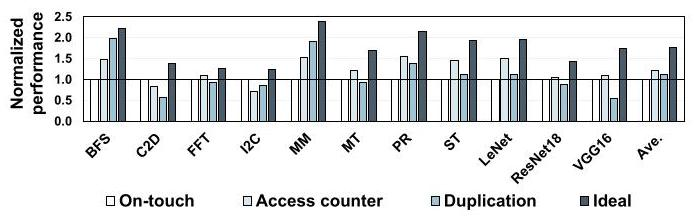

Fig. 2 是论文动机的核心证据。横轴是 11 个应用，纵轴是相对 on-touch 的 normalized performance；on-touch、access counter、duplication 的胜负关系随应用显著变化。例如 MM 更适合 duplication，ST 更适合 access counter，而一些 private-heavy 工作负载更接近 on-touch 的优势区间。这说明“统一采用一种策略”不是稳健解。

**动机评估**：动机是 solid 的。论文没有只停留在“不同应用不同策略”这个粗粒度事实，而是进一步把差异追到 object granularity：同一应用内部不同 object 的 private/shared、read/write pattern 不同；同一 object 的 pattern 还可能随 explicit phase 或 implicit phase 变化。实验覆盖 11 个代表性 multi-GPU workload，且后文用 GRIT 对比展示 per-page 学习的复杂度和额外 fault 开销，因此问题规模、工程约束和优化空间都比较清楚。

**核心 Insight**：页管理策略的收益不只由 page 本身决定，更常由其所属 object 的运行时访问模式决定。一个 object 内部大多数 page 往往呈现一致模式，且这种一致性在单个 phase 内稳定，因此系统可以用少量 object metadata 代替大量 per-page metadata：private object 保持 on-touch，shared-read-only object 用 duplication，shared-write / shared-rw-mix object 用 access counter，并在 phase 变化时重新学习。

## 二、相关工作

论文的相关工作可以分成三条线。

第一类是 multi-GPU runtime memory management。已有工作关注 UVM、page migration、remote caching、page duplication、oversubscription 等机制，目标都是降低 GPU 间非均匀访存开销。它们的问题在于通常围绕 page 或系统全局策略展开，没有把应用对象的语义信息纳入运行时决策。

第二类是 fine-grained dynamic page placement，代表是 GRIT。GRIT 在 per-page 粒度学习当前策略是否合适，并预测邻近 page 的策略。它比固定策略更灵活，但代价是每页 48 bits in-memory metadata、352 bytes on-chip PA-Cache，以及更多 page fault 触发的学习和调整。OASIS 的论点是：如果 object 内 page pattern 本来高度一致，那么 page granularity 既昂贵又没有必要。

第三类是 object-based optimization。过去的 object metadata 已用于 memory safety、bounds checking、range TLB / tagged pointer 等方向。OASIS 借用这条思路，但目标从安全或地址转换扩展到 multi-GPU page management。作者声称 OASIS 是第一篇把 object-level information 用于 multi-GPU page management decision 的工作，这一点和其设计主线一致。

静态分析和 `cudaMemAdvise` 也能给内存管理提供提示，但它们无法可靠判断对象在运行时到底是 private 还是 shared，也难以捕捉 phase 内部的隐式访问模式变化。因此 OASIS 选择 runtime detection，而不是依赖编译期或程序员提示。

## 三、技术挑战

**挑战 1：不同 policy 的收益条件彼此冲突。** On-touch 对 private object 很好，因为第一次迁移后后续访问本地化；但对多 GPU 共享页会造成 ping-pong migration。Duplication 对 shared-read-only object 很好，但遇到写入会触发 write-collapse。Access counter 能缓解频繁迁移，但在真正应当本地化的 private page 上会引入远端访问等待阈值的延迟。

**挑战 2：系统需要知道 object pattern，但不能破坏 UVM 的透明性。** 如果要求程序员手工标注每个 object 的读写和共享属性，就会丧失 UVM 的易用性；如果每页学习，又会引入 GRIT 类设计的元数据和 fault 成本。OASIS 必须在“透明”和“低成本语义感知”之间找中间点。

**挑战 3：object pattern 不是全程固定的。** C2D 这类应用有多个 CUDA kernel，对象在 Image-to-Column、GEMM、Matrix-Transpose 等 explicit phase 中角色不同；ST 甚至在单个 kernel 的循环里出现 implicit phase，两个 buffer 会在迭代之间交换读写角色。只在 allocation time 决策一次会过期。

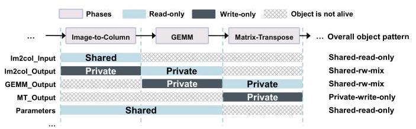

Fig. 6 展示了“全程看是 shared-rw-mix”的 object，在单个 phase 内可能其实是 private read-only 或 private write-only。它支撑了 OASIS 的 phase-aware reset 设计：策略必须能在 phase 边界重新学习，否则会把跨 phase 聚合后的混合模式误当成运行时真实模式。

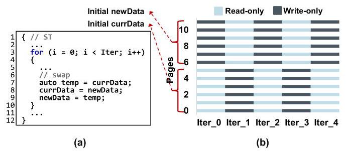

Fig. 7 更进一步说明，phase boundary 不总是 CUDA kernel launch 这种显式事件。ST 的两个数组每次迭代交换角色，导致前后半页的 read/write pattern 周期性反转。OASIS 因此需要一种不依赖显式 API 的 self-correction 机制。

**挑战 4：object-level 决策可能被非均匀对象、large page 和 oversubscription 干扰。** 如果一个 object 内部 page pattern 不一致，只看一个 page 可能误判；2 MB large page 会把原本 private 的 4 KB pages 合并成 shared-rw-mix；oversubscription 把 shared page eviction 到 CPU 后，也会干扰“根据物理地址范围判断 private/shared”的逻辑。

## 四、解决方案

### 整体思路

OASIS 的设计可以概括为三件事：在 allocation time 给 object 建立可追踪身份；在 runtime page fault 路径上用 object table 记录 shared object 的策略状态；在 explicit / implicit phase 变化时重置并重新学习 object policy。它不试图预测每个 page，而是假设一个 object 在同一 phase 内 page pattern 通常一致，从而用一个 object-level policy 覆盖该 object 的 page。

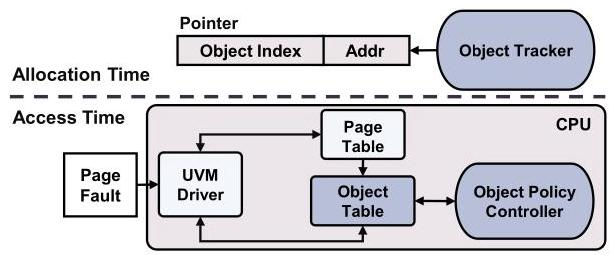

Fig. 8 把系统拆成 Object Tracker、Object Table 和 Object Policy Controller。Object Tracker 负责把 object identity 带进指针；page fault 到 CPU 后，UVM driver 先查 host page table 区分 private/shared，再把 shared object 的请求交给 Object Table 和 policy controller 处理。

### 贯穿示例

可以把一个 multi-GPU 程序想成有三个数组：`A` 是多个 GPU 只读共享的参数表，`B` 是每个 GPU 各写各的输出 buffer，`C` 是多个 GPU 反复读写的 frontier 或中间状态。如果系统统一用 on-touch，`A` 会被不同 GPU 拉来拉去；如果统一用 duplication，`C` 的写入会频繁 collapse；如果统一用 access counter，`B` 又会在初期承受不必要的 remote access。

OASIS 的做法是让 `A/B/C` 在 allocation 时得到 object ID。程序运行时，第一次访问 `B` 的 page 时 host page table 发现它仍是 private，于是直接保留默认 on-touch；当 `A` 被第二个 GPU 读到时，系统知道这是 shared-read，给它设 duplication；当 `C` 被共享写入时，系统给它设 access counter-based migration。下一次 kernel launch 或者 page fault 频率显示策略不合适时，OASIS 再把对应 object 的学习状态清空，让它按新 phase 的访问模式重新选择策略。

### 关键技术点

**Object Tracker：用 pointer upper bits 标识 object。** OASIS 在 `cudaMallocManaged()` 外包一层 wrapper，在对象分配时把 `Obj_ID` 和配置位写入 64-bit pointer 的 unused upper bits。论文假设使用 5 个 upper bits，其中 4 bits 编码 object ID，1 bit 区分 OASIS 和 OASIS-InMem。这个设计依赖 NVIDIA GPU 和现代 CPU 上的 top-byte-ignore / address masking 类机制，使 dereference 不会因为高位 tag 出错。

**Object Table：极小的 per-object 策略状态。** O-Table 是 host CPU 侧 on-chip LRU 结构，默认 16 entries。每个 entry 包括 4-bit object ID、1-bit policy、3-bit page fault counter 和 4-bit LRU bits，总共 12 bits；16 个 entry 只需 24 bytes。O-Table 只记录 duplication 和 access counter 两种非默认策略，on-touch 作为默认状态由 host page table 路径处理。

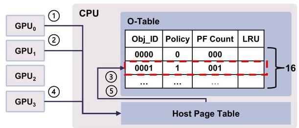

Fig. 11 展示了一个具体 fault flow：第一次 GPU 访问 page 时仍按 private/on-touch 处理；第二个 GPU 访问同一 page 后，host page table 判断它已经 shared，于是请求进入 O-Table；controller 根据读/写 fault 选择 duplication 或 access counter，并把 policy bits 写入相关 page table entry。

**Object Policy Controller：用 fault 类型推断策略。** Controller 的策略规则很直接：private object 不进入 O-Table，继续用 on-touch；shared object 的读 fault 倾向 duplication；shared object 的写 fault 倾向 access counter-based migration。这个简单规则成立的前提是论文在动机部分建立的 Observation 2 和 4：同一 object 内 page pattern 一致，同一 phase 内 object pattern 稳定。

**Self-Correction：处理 phase 变化。** OASIS 有两种 reset 触发方式。显式 phase 变化由 CUDA kernel launch 等 runtime event 触发，只把 O-Table entry 的 PF Count 清零，下一次 shared fault 重新学习策略。隐式 phase 变化由 shared page fault 的计数触发：默认 reset threshold 是 8，当某个 object 的 shared fault 太多，说明当前策略可能不再适合，就清零并重新学习。

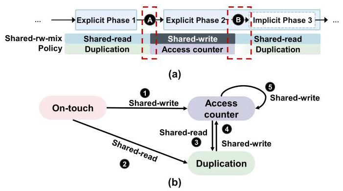

Fig. 13 是理解动态性的关键图。上半部分说明 explicit phase 边界和 implicit phase 中的异常 fault 都能让策略从 shared-read/duplication 切到 shared-write/access-counter，或反过来切回 duplication。下半部分的状态机也揭示了一个重要简化：策略一旦从 on-touch 切到 shared 策略，就不主动切回 on-touch，因为如果对象后来变回 private，后续访问会本地化且不再产生 shared fault。

**OASIS-InMem：软件可扩展替代方案。** 硬件版受 upper pointer bits 和 O-Table 容量限制。OASIS-InMem 不在 pointer 中编码 Obj_ID，而是用 shadow map 从虚拟地址查 object ID，并把 O-Table 放在系统内存。代价是两级 shadow map 的内存开销，例如 64 GB 分配空间、`N=16` 时约 160 MB，但作者认为 CPU LLC 可以缓存这些表访问，因此性能只比硬件版低约 2%。

### 与已有方案的对比

相对固定策略，OASIS 的优势是按 object 区分 private、shared-read 和 shared-write 模式，避免“一种策略服务所有数据”。相对 GRIT，OASIS 的优势是粒度更粗、元数据更少、策略调整更快：GRIT 每页 48 bits in-memory metadata 和 352-byte PA-Cache，OASIS 每 object 12 bits、默认硬件 O-Table 24 bytes；GRIT 需要 per-page fault 来改变策略，OASIS 用每 object 的少量 fault 进行 reset。

不足也比较明确。第一，它依赖 object 内 page pattern 大体一致；如果对象内部混杂严重，单页推断会变弱。第二，硬件版依赖 pointer upper bits 和 runtime/API 修改，和已有 pointer tagging、安全扩展可能冲突。第三，OASIS-InMem 虽然软件化，但 shadow map 和 UVM driver / kernel 修改仍不是“即插即用”的真实系统实现，论文只给了模拟验证。

## 五、实验评估

### 实验设定

作者使用 industry-validated MGPUSim simulator，默认 4-GPU 平台，每个 GPU 有本地 page table 和 GMMU。基础配置包括 1.0 GHz、每 GPU 64 compute units、4 GB DRAM、4 KB page、access counter threshold 256、300 GB/s NVLink-v2 和 32 GB/s PCIe-v4。论文还评估 8/16 GPU、large input、2 MB pages、initial GPU placement 和 oversubscription。

Benchmark 包含 11 个应用，来自 AMDAPPSDK、Hetero-Mark、SHOC 和 DNN-Mark：BFS、C2D、FFT、I2C、MM、MT、PR、ST、LeNet、VGG16、ResNet18。访问模式覆盖 random、adjacent、scatter-gather，object 数从 2 到 263，memory footprint 约 20 MB 到 300 MB。Baseline 是统一采用 on-touch、access counter-based migration、duplication；还与 state-of-the-art GRIT 比较。

### 主要实验与结论

**总体性能**：OASIS 相比统一 on-touch、access counter、duplication 平均分别提升 64%、35%、42%，并且多数应用接近 ideal。提升来自两类能力：单 phase workload 中能识别 object 的合适策略，例如 MM 中 `MM_A/MM_B` 用 duplication、`MM_C` 用 on-touch；多 phase workload 中能重新学习，例如 C2D 的 explicit phases 和 ST 的 implicit iterations。

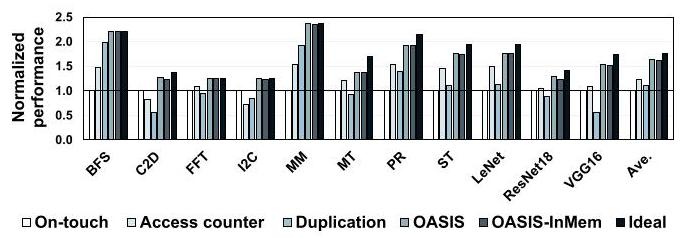

Fig. 15 显示 OASIS 对大多数应用都接近或达到 ideal bar，而固定 policy 有明显短板。图中 OASIS-InMem 只比 OASIS 平均低 2%，说明把 object lookup 软件化后，核心策略仍然有效。

**阈值敏感性**：reset threshold 取 4、8、32 时，相对 on-touch 的平均提升分别为 55%、64%、56%，作者选择 8 作为默认值。阈值太低会让 shared-rw-mix object 在 duplication 和 access counter 之间波动，造成 collapse 开销；阈值太高会延迟 phase change 后的策略调整。

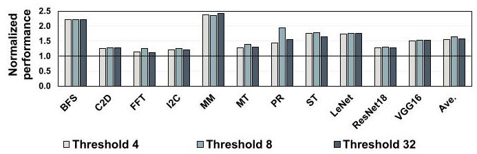

这张图表明 OASIS 不是对阈值完全不敏感，但默认值 8 是合理折中。对只读或 private-heavy 应用，阈值影响小；对 shared-rw-mix 和 phase-shifting 应用，阈值会直接影响自校正速度和误切换成本。

**GPU 数量扩展**：在 8-GPU 和 16-GPU 系统上，OASIS 相对 on-touch 分别提升 65% 和 67%。作者按 GPU 数扩大 workload size，结果说明 object-level pattern 没有因为 GPU 数增多而失效。

**输入规模和大页**：使用 16-GPU input size 在 4-GPU 系统上测试，OASIS 平均提升 62%，说明对象变大不破坏 object-level tracking。使用 2 MB page 时平均提升降到 43%，原因是 large page 会把原本分散的 private 4 KB pages 合并成 shared-rw-mix，降低理想化本地访问空间。

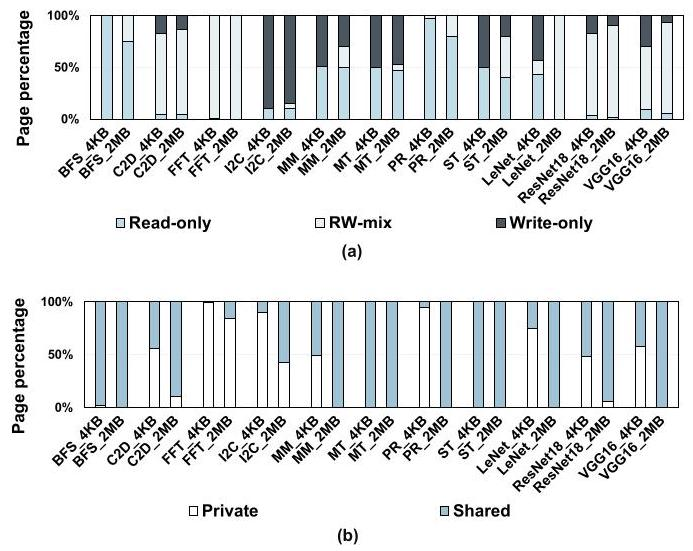

Fig. 20 给出了 large page 退化的机制证据：更大的 page granularity 提高了 shared/rw-mix page 占比。这个结果也提醒读者，object-level 管理不是越粗越好；page size 仍会影响对象内部模式的一致性。

**与 GRIT 对比**：OASIS 相比 GRIT 平均提升 12%，并减少 22% page faults。论文把原因归结为更少 metadata、更小 on-chip structure、更少 per-page reset，以及无需 neighboring page prediction。

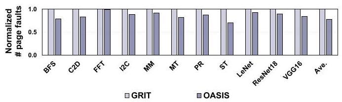

Fig. 24 是“更简单还能更快”的关键证据之一。Page fault 每次都涉及 CPU interrupt 和 UVM 处理，OASIS 减少 22% fault 说明它不只是节省存储，也减少了运行时控制路径开销。

**Oversubscription**：在模拟 150% memory oversubscription 下，OASIS 相对 on-touch 仍有 20% 平均提升。作者也承认 oversubscription 本身很昂贵，会吞掉不少 OASIS 带来的收益；他们通过 PTE policy bits 辅助判断 evicted-to-CPU 的 shared page，避免误判为 private。

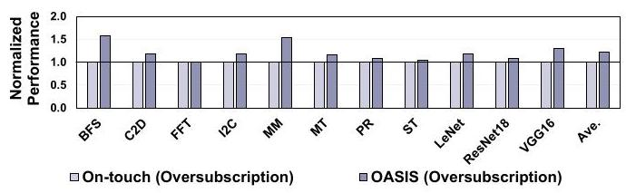

### 结论支撑性分析

实验基本支撑论文主张：OASIS 对固定策略的提升、对 GRIT 的性能和复杂度优势、OASIS-InMem 的可行性、以及对 GPU 数和输入规模的扩展性都有对应数据。最强的论证链是“object pattern 观察 -> object-level 策略设计 -> 总体性能与 GRIT 对比”。

不过也有边界。所有结果来自 simulator，而不是真实 NVIDIA UVM driver 和 CUDA runtime 修改后的系统；memory footprint 为了仿真时间限制控制在 20-300 MB，虽然作者指出与 prior work 类似，但离真实训练或 HPC 工作负载仍有差距；软件版 OASIS-InMem 只是 proof-of-concept simulation，真正驱动和 kernel 集成的工程复杂度没有被完整评估。

## 六、附加洞察

**结论 1：object granularity 的有效性来自“对象内 page pattern 高度一致”，但论文也承认它不是绝对规律。**  
*出处*：Section IV-B，Fig. 3 和 Fig. 4。  
*推理链条*：作者先统计 object size，发现大多数 object 覆盖多页，object-level 决策能摊薄 per-page metadata；再用 MT 展示 `MT_Input` 几乎全 read-only、`MT_Output` 几乎全 write-only；随后对 7 个单 explicit phase 应用统计，26 个 object 中只有 2 个 non-uniform，7 个应用中只有 ST 作为 non-uniform app，且非均匀页少于 5%。这个链条支撑 object-level 推断，但薄弱点是样本来自 11 个 benchmark，不能保证所有真实应用都有同样的一致性。

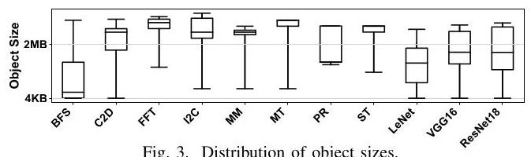

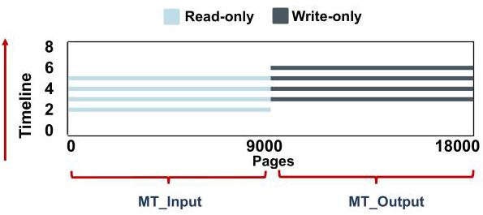

**结论 2：OASIS 选择不从 shared policy 主动切回 on-touch，是一个基于 fault 可见性的简化。**  
*出处*：Section V-D，Fig. 13(b)。  
*推理链条*：一旦 object 变成 shared，OASIS 只在 shared page fault 上维护 O-Table；如果之后 object 变回 private，数据最终迁移或复制到当前 GPU，本地访问不再产生 fault，因此系统缺少强信号去“证明它又 private 了”。作者据此认为主动回到 on-touch 没必要。这个结论很工程化：它减少状态机复杂度，但也意味着 OASIS 更关注避免 shared 场景的坏策略，而不是恢复语义上最精确的状态。

**结论 3：large page 会削弱 OASIS 的收益，不是因为 OASIS 失效，而是因为 page granularity 改变了可观察 pattern。**  
*出处*：Section VI-B4，Fig. 19 和 Fig. 20。  
*推理链条*：OASIS 假设 object 内 page pattern 能指导 policy；2 MB page 会把原本分别 private 的小页合并为一个 shared page，使对象更容易表现为 shared-rw-mix；而 shared-rw-mix 无法像 private/on-touch 或 read-only/duplication 那样接近 ideal。因此性能提升从默认结果的 64% 降至 43%。这说明 object-aware 并不完全替代 page granularity 的重要性。

**结论 4：OASIS-InMem 的主要价值不是性能最好，而是给 pointer tagging 受限环境提供兼容路径。**  
*出处*：Section V-F 和 Section VI-A。  
*推理链条*：硬件 OASIS 使用 upper pointer bits 编码 object ID，可能与 memory tagging、LAM/UAI/TBI 约束或其他安全机制冲突；OASIS-InMem 改用 shadow map 查 object ID，牺牲一些 memory lookup 开销，换来不改 pointer high bits 和支持更多 object。实验显示它平均只比 OASIS 慢 2%，说明论文真正想保留的是 object-aware policy，而不是某一种特定编码方式。

## 七、总结与评价

OASIS 的核心贡献是把 multi-GPU UVM page management 的决策粒度从 page 提升到 runtime object，并用 phase-aware self-correction 处理对象访问模式变化。它的设计很克制：Object Tracker、O-Table、OP-Controller 都围绕一个简单映射展开，即 private 用 on-touch、shared-read 用 duplication、shared-write 用 access counter。

最大亮点是找到了一个比 per-page 更便宜、又比全局固定策略更有表达力的粒度。24-byte O-Table、12-bit per-object entry 和 12% over GRIT 的结果，让论文的“低复杂度”主张比较有说服力。最大不足是实现验证停留在 simulator，真实 UVM driver、CUDA runtime、pointer tagging 兼容性和大规模 workload 的工程成本仍然需要后续系统实现来检验。

从后续研究角度看，OASIS 值得继续探索三件事：更鲁棒地处理 non-uniform object；结合编译期/运行时信息识别 implicit phase，而不只依赖 fault threshold；在真实 NVIDIA 或 AMD multi-GPU UVM 栈上验证 OASIS-InMem 的 driver 和 kernel 修改成本。

## 八、章节脉络与段落速览

- **Section I · Introduction**：提出 UVM multi-GPU 的固定 page policy 无法适配不同 object 和 phase，并概述 OASIS 的 object-aware 方案。
  - **¶1**：说明 multi-GPU 和 UVM 的价值，以及 UVM 下跨 GPU 数据共享带来的 NUMA overhead。
  - **¶2**：介绍 on-touch、access counter 和 duplication 三种现有 page management policy 及各自代价。
  - **¶3**：指出当前系统通常统一采用一种策略，但不同数据类型需要不同策略。
  - **¶4**：用 GRIT 引出 per-page 学习的成本和复杂度，明确 OASIS 追求更简单方案。
  - **¶5**：提出 object granularity 作为透明性和效率之间的折中。
  - **¶6**：概括 object sharing characteristic 到 policy 的映射，以及 OASIS 三个组件。
  - **¶7**：列出三项贡献：object-level characterization、OASIS 设计、11 个应用上的性能提升。

- **Section II · Background**：介绍 UVM-enabled multi-GPU 架构和三种基础 page management policy。
  - **II-A ¶1**：解释 `cudaMallocManaged`、CPU 侧 centralized page table、GPU local page table 和 page fault 处理流程。
  - **II-B ¶1-3**：分别说明 on-touch migration、access counter-based migration 和 page duplication 的机制与主要缺点。

- **Section III · Methodology**：说明仿真平台、硬件配置和 benchmark 选择。
  - **III-A ¶1**：使用 MGPUSim、4-GPU 默认平台，并说明会扩展到 8/16 GPU 和 large page 分析。
  - **III-B ¶1**：列出 11 个 benchmark、访问模式、object 数和 memory footprint，并解释仿真规模与 prior work 保持一致。

- **Section IV · Motivation and Characterization**：用实验观察建立 object-aware policy 的必要性。
  - **IV-A ¶1**：Fig. 2 表明三种固定 policy 没有任何一种能在所有应用上最优。
  - **IV-B ¶1**：定义 private/shared、read-only/write-only/rw-mix object pattern。
  - **IV-B ¶2-4**：通过 object size、MT page pattern 和 non-uniform object 统计说明 object granularity 通常有效。
  - **IV-B ¶5-7**：用 I2C、MM、ST 对比说明 private、shared-read-only、shared-rw-mix 分别偏好不同 policy。
  - **IV-B ¶8-10**：说明 object pattern 在 explicit phase 内稳定，但跨 C2D 的多个 phase 会变化。
  - **IV-B ¶11-12**：用 ST 的迭代交换说明 implicit phase 也会导致 read/write pattern 周期性变化，并总结动态策略需求。

- **Section V · OASIS Design**：给出 Object Tracker、O-Table、OP-Controller、自校正和软件替代设计。
  - **V-A ¶1**：总览 OASIS 三个组件和 phase-aware correction 目标。
  - **V-B ¶1-3**：解释如何利用 upper pointer bits 编码 Obj_ID 和配置位，以及 pointer 重构过程。
  - **V-C ¶1**：定义 O-Table entry 内容、PTE policy bits 和 16-entry/24-byte 的低开销结构。
  - **V-D ¶1-4**：描述 host page table 过滤 private object、O-Table 处理 shared object，并用示例说明 fault flow。
  - **V-D ¶5-7**：说明 implicit fault threshold 和 explicit kernel launch reset 两种 self-correction 方式，以及状态机。
  - **V-E ¶1**：估算 O-Table 面积和 PTE policy update 开销，说明其可与 fault resolution 重叠。
  - **V-F ¶1-2**：提出 OASIS-InMem 的 shadow map / O-Table-InMem 方案，并估算最多约 160 MB shadow map overhead。

- **Section VI · Evaluation**：验证总体性能、敏感性、GRIT 对比和 oversubscription。
  - **VI-A ¶1**：OASIS 平均比 on-touch、access counter、duplication 提升 64%、35%、42%，并解释单 phase 与多 phase workload 中的收益来源。
  - **VI-A ¶2**：OASIS-InMem 平均只比硬件 OASIS 低 2%，但真实软件实现留作 future work。
  - **VI-B1 ¶1**：reset threshold 4/8/32 分别带来 55%/64%/56% 提升，默认 8 是折中点。
  - **VI-B2 ¶1**：8-GPU 和 16-GPU 下分别提升 65% 和 67%，说明 GPU 数扩展不破坏 object pattern。
  - **VI-B3 ¶1**：large input 下平均提升 62%，说明对象变大仍能被有效跟踪。
  - **VI-B4 ¶1**：2 MB page 下提升降到 43%，原因是 shared/rw-mix page 比例上升。
  - **VI-B5 ¶1**：初始页放在 GPU 上时仍提升 57%，说明对初始 placement 不敏感。
  - **VI-C ¶1-2**：相对 GRIT 平均提升 12%，并用更少 metadata、24-byte O-Table 和 22% page fault reduction 解释原因。
  - **VI-D ¶1**：oversubscription 下用 PTE policy bits 避免 shared page 误判，并取得 20% 平均提升。

- **Section VII · Related Work**：把 OASIS 放到 object optimization、multi-GPU memory management 和 static hinting 三类工作中定位。
  - **¶1**：说明 object metadata 曾用于 memory safety 和 TLB 优化，但 OASIS 首次用于 multi-GPU page management。
  - **¶2**：说明既有 multi-GPU 优化没有关注 runtime object pattern。
  - **¶3**：说明 static analysis 和 `cudaMemAdvise` 无法判断运行时 private/shared，因此不足以替代 OASIS。

- **Section VIII · Conclusion**：总结 object-level characterization、OASIS 动态策略和实验收益。
  - **¶1**：重申 object pattern 和 phase variation 影响 page policy 效果，OASIS 通过动态 object tracking 获得 64%/35%/42% 固定策略提升和 12% over GRIT。
