# Towards Compute-Aware In-Switch Computing for LLMs Tensor-Parallelism on Multi-GPU Systems 深度解读

> **作者**：Chen Zhang, Qijun Zhang, Zhuoshan Zhou, Yijia Diao, Haibo Wang, Zhe Zhou, Zhipeng Tu, Zhiyao Li, Guangyu Sun, Zhuoran Song, Zhigang Ji, Jingwen Leng, Minyi Guo  
> **会议/年份**：HPCA 2026  
> **一句话总结**：CAIS 把 NVLS 这类 in-switch computing 从“只加速 collective”推进到“按 GEMM 的读写语义直接参与计算 kernel”，通过 `ld.cais`/`red.cais`、交换机端请求合并、跨 GPU TB 协调和 graph-level dataflow 优化，在 LLM Tensor Parallelism 中细粒度重叠计算与通信。

## 一、问题定义

这篇论文不是 first 类型地提出“大模型训练通信开销”这个问题，而是在已有 TP、NVLink/NVSwitch、NVLink SHARP（NVLS）和 compute-communication overlap 工作之上指出一个更细的根因：现有 in-switch computing 的通信 primitive 与 LLM 计算 kernel 所需要的 memory semantics 不匹配。TP 中的 GEMM 经常和 AllGather、Reduce-Scatter、AllReduce 串在一起，通信处在 critical path 上；NVLS 能让 collective 本身更快，却仍把 collective 当作独立通信阶段处理，所以 GPU SM 与互连资源常常交替空闲。

论文的动机证据比较直接。作者引用已有研究说明 TP 贡献超过 99% 的总数据流量，且在多 GPU 训练中 40-60% 的端到端延迟来自 inter-GPU transfer；他们在模拟的 H100 SuperPOD/NVLink/NVSwitch 环境中跑 LLaMA-7B，发现 GPU 数扩展到 4-8 以后通信时间很快超过计算时间，在 8-GPU 配置下平均通信时间约为计算时间的 1.6 倍。

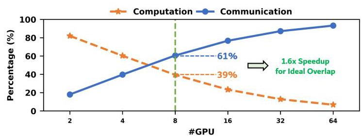

Fig. 2 是论文的第一层动机：随着 GPU 数增加，通信不是被更高带宽自然吞掉，而是变成模型执行的主导项。它支撑了作者后面的判断：继续只优化 collective latency 不够，需要改变 collective 与 GEMM 的执行关系。

真正的切入点在 Fig. 1。以 AllGather + GEMM 为例，GEMM 实际需要按需读取远端 GPU 的 activation tile，这是 read semantics；但 NVLS 的 AllGather 用 `multimem.st` 以 push/store 方式提前把数据发出去。再看 GEMM + Reduce-Scatter，GEMM 产生 partial sum 后更自然的语义是把结果写向目标位置并在交换机内规约，这是 write/reduction semantics；但现有 NVLS 的 `multimem.ld_reduce` 更像 pull 模式。读写语义和 push/pull 通信模式错位后，系统只能插入 global barrier，把计算和通信拆成阶段。

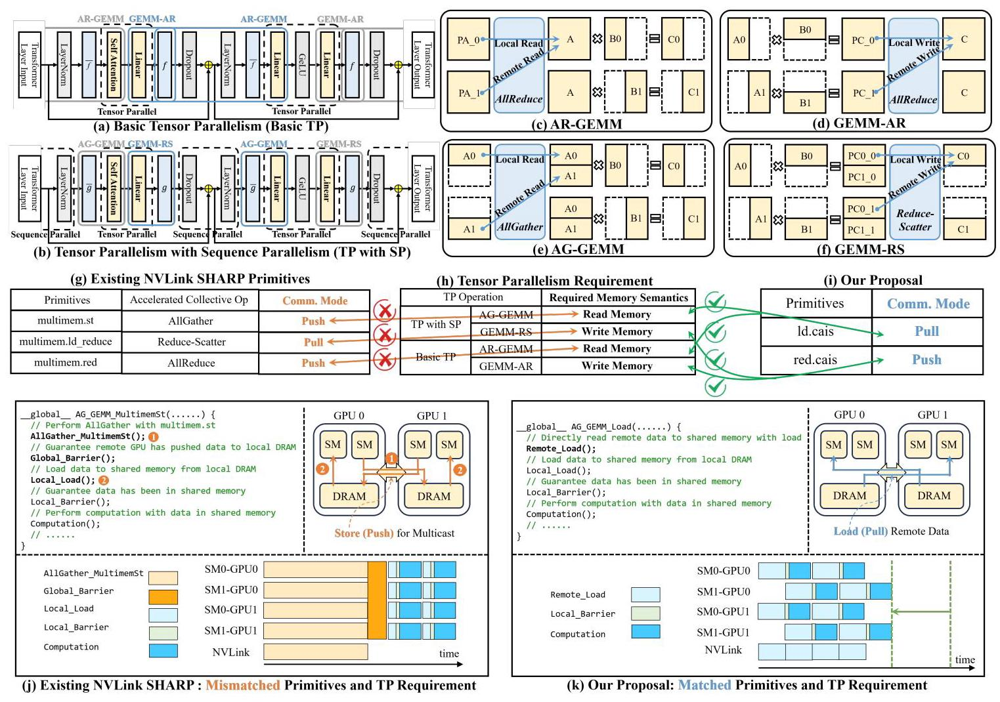

Fig. 1 把论文的问题、现有 NVLS primitive、CAIS 想要的 primitive、以及执行细节放在同一张图里。它的价值是说明 CAIS 不是简单新增一个更快的 collective，而是让计算 kernel 自己发起符合其内存访问语义的远程 load 或 reduction request，再由 NVSwitch 在数据路径上合并这些请求。

**动机评估**：动机 solid。论文没有停留在“通信很多”这个泛泛结论，而是把瓶颈定位为 TP kernel 的 producer-consumer 关系与 NVLS primitive 之间的语义错位，并给出 GPU 利用率低于 60%、8-GPU 下通信约为计算 1.6 倍、TP 延迟占比 40-60% 等证据。需要保留的限制是，所有主要性能结论来自 cycle-accurate simulator 和 scaled-down LLM 配置，而不是真实可编程 NVSwitch/ISA 实现。

**核心 Insight**：CAIS 的核心洞察是，TP collective 不应被视为计算 kernel 之外的固定通信算子，而应被看成计算 kernel 的远程内存访问。AG-GEMM 的本质是远程 read，GEMM-RS 的本质是远程 reduction/write；只要 ISA 和交换机能够识别这些 mergeable access，交换机就能像处理 collective 一样合并重复请求，同时计算 kernel 只需要 TB-level local dependency，而不必等待全局 collective barrier。

## 二、相关工作

论文的相关工作可以按“如何缓解 TP 通信瓶颈”来组织。

第一类是 LLM 并行策略和 TP/SP 变体。Data Parallelism 主要在梯度同步时通信，Pipeline Parallelism 主要在 stage 边界传 activation，而 Tensor Parallelism 把矩阵维度切到多 GPU 上，每层 attention/FFN 都会触发 AllReduce、AllGather 或 Reduce-Scatter。Sequence Parallelism 把 AllReduce 拆成 Reduce-Scatter + AllGather，并把 LayerNorm 等操作也切分出去，能减少 activation memory，但没有消除 TP 中 per-layer synchronization 的本质。

第二类是 NVLink/NVSwitch 与 in-switch computing。NVLink/NVSwitch 提供高带宽互连，NVLS 把 multicast/reduction 放到 NVSwitch 中做，论文提到相对 GPU-driven collective 可获得 2-8x collective primitive speedup。问题是 NVLS 的设计目标仍是“加速通信 primitive”，没有理解下游 GEMM 何时、以什么读写模式需要这些数据，所以仍然容易形成通信阶段和计算阶段的隔离。

第三类是 compute-communication overlap。CoCoNet、FuseLib 等通过软件调度或 fused computation-collective operations 尝试把 GEMM 和 collective 重叠；T3 用硬件辅助的 tracking/triggering 来细粒度 overlap GEMM 与 Reduce-Scatter；Centauri 等关注 hybrid parallelism 的通信分区和调度。它们的共同差距是没有把 NVLS/in-switch computing 纳入语义对齐的路径，或者即使加上 NVLS 也仍受限于 NVLS 的 communication-centric primitive。

第四类是 locality-aware scheduling 和 memory efficiency。LADM、MCM-GPU、NUMA-aware GPU 等工作关注 TB placement、remote memory locality 或多 GPU memory management，能减少一部分 remote access，但它们不是为 TP collective 的语义错位和 in-switch request merging 设计的。CAIS 与这类工作的差别是，它重点提高远程请求在交换机处合并的 temporal locality，而不只是把访问放得更近。

第五类是更广义的 in-network aggregation。SHARP、ATP、SwitchML/NetReduce 类工作把 aggregation 放进网络或交换设备，用于 AllReduce、稀疏通信或分布式训练。但它们通常服务于网络层 collective，本身不处理 GPU kernel 内部的 TB 级 producer-consumer 关系。CAIS 的新意在于把 in-switch aggregation 拉进 GPU ISA、NVSwitch microarchitecture、编译器 TB grouping 和 LLM dataflow scheduling 的共同设计里。

## 三、技术挑战

**挑战 1：现有 GPU ISA 和 NVSwitch 数据通路无法表达 compute-aware access。** 如果 GEMM kernel 只能发普通 load/store 或现有 `multimem.*` 指令，交换机不知道哪些远程请求可以按地址和类型合并，也不知道何时可以缓存 load response 或累加 reduction request。CAIS 需要新的 ISA 标记和交换机端 merge unit。

**挑战 2：语义对齐不等于自然高效。** 即使有 `ld.cais` 和 `red.cais`，来自不同 GPU 的 TB 仍由各自 GPU 独立调度，同一个数据地址的请求可能相差很久才到达交换机。论文报告未协调时同地址请求最早和最晚到达之间平均相差约 35 us；这种 temporal misalignment 会让 Merge Table 变大、等待变长，甚至发生 eviction，使请求合并收益消失。

**挑战 3：交换机 merge state 必须小且可前进。** Load merging 需要缓存请求元数据和返回数据，reduction merging 需要维护 partial sum；如果等待所有 GPU 请求会导致表项长期占用，就可能造成 buffer pressure。CAIS 必须设计 eviction、timeout 和 deterministic routing，确保同地址请求汇聚到同一 merge unit，同时避免死锁或无限等待。

**挑战 4：kernel 级依赖太粗，无法吃满双向链路。** 传统 dataflow 以 operator/kernel 为单位，必须等 GEMM-RS、LayerNorm、AG-GEMM 等阶段依次完成。CAIS 打破 global barrier 后暴露出 TB-level dependency，但如果调度器仍只做粗粒度 kernel 串行执行，就无法把通信方向互补的操作重叠起来。

**挑战 5：优化后会出现 asymmetric traffic 和 contention。** GEMM-RS 更偏 GPU-to-switch 流量，AG-GEMM 更偏 switch-to-GPU 流量。把它们重叠可以提高双向带宽利用率，但 load 和 reduction request 仍可能在同一方向竞争。系统需要 traffic control、virtual channel 和 arbitration 策略来避免 head-of-line blocking。

**挑战 6：实验可信度需要单独论证。** 论文使用改造后的 Accel-Sim + BookSim2，而完整大模型和完整 H100 规模难以直接模拟，所以作者必须证明 scaled-down setup 与真实 NVLS 行为足够接近。这不是方案设计本身的挑战，但直接影响结论可信度。

## 四、解决方案

### 整体思路

CAIS 的整体设计可以概括为三层。第一层是 compute-aware ISA 和 switch microarchitecture：新增 `ld.cais` 与 `red.cais`，在请求中带 1-bit CAIS flag，交换机用 CAM Lookup Table 和 Merging Table 对同地址 load/reduction request 做合并。第二层是 merging-aware TB coordination：编译器用地址表达式分析找出跨 GPU 访问同一数据区的 TB，把它们组成 TB Group，运行时和交换机用 pre-launch/pre-access synchronization 对齐请求时间。第三层是 graph-level dataflow optimizer：在 TB dependency 上做深度 kernel fusion，并让 GEMM-RS 与 AG-GEMM 这类流量方向互补的 kernel 交错执行，提高双向链路利用率。

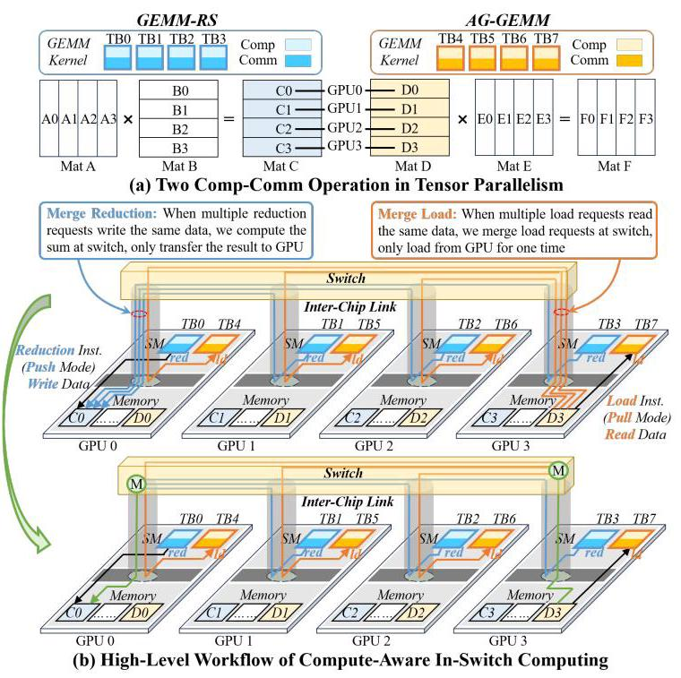

Fig. 3 是 CAIS 的系统总览：GEMM kernel 直接发起远程 load 或 reduction，NVSwitch 的 merge unit 在数据路径中发现同地址请求并合并。它把“collective kernel 做完再 GEMM”改成“GEMM TB 自己按需通信，交换机替它压缩重复流量”。

### 贯穿示例

可以用一个 8-GPU Transformer FFN 子链路来理解：上一个 GEMM 产生 partial activation，后面接 Reduce-Scatter、LayerNorm，再接一个需要 AllGather 输入的 GEMM。传统 NVLS/SP-NVLS 的执行像三段流水线之间加了闸门：先 GEMM，然后 Reduce-Scatter collective，等全部 GPU 完成后做 LayerNorm，再 AllGather，最后第二个 GEMM 才能读完整输入。

在 CAIS 中，某个 TB 计算出一个 output tile 后，不需要等整个 GEMM 完成。它对目标地址发 `red.cais`，交换机把多个 GPU 对同一地址的 partial result 累加后只写回一次。LayerNorm 的对应 TB 一旦输入 tile 具备，就可以启动；第二个 GEMM 的 TB 需要远程 activation tile 时发 `ld.cais`，交换机如果发现多个 GPU 都读同一远端地址，就只向 home GPU 取一次数据，再把 response 复制给多个 requester。编译器把访问同一数据区域的 TB 组成 TB Group，运行时在发第一个 `*.cais` 前做轻量同步，使这些请求尽量同时到达交换机。最后，dataflow optimizer 让 GEMM-RS 和 AG-GEMM 这类方向互补的流量交错运行，避免一边链路打满、另一边空闲。

这个例子说明 CAIS 的三层设计彼此依赖：没有 ISA 和 merge unit，GEMM 不能把远程访问交给交换机合并；没有 TB coordination，合并表需要很大且等待很久；没有 dataflow optimizer，打破 global barrier 后暴露出的调度空间不会转化成带宽利用率。

### 关键技术点

**1. `ld.cais` / `red.cais` 与 mergeable memory access。** CAIS 扩展 PTX 指令集，用 `ld.cais` 表达可合并 load，用 `red.cais` 表达可合并 reduction。指令本身不改变计算语义，而是在内存请求里标出“这个请求可以由 switch merge unit 处理”。这使得同一个 GEMM kernel 可以在正常计算过程中发起远程访问，而不用启动单独的 collective kernel。

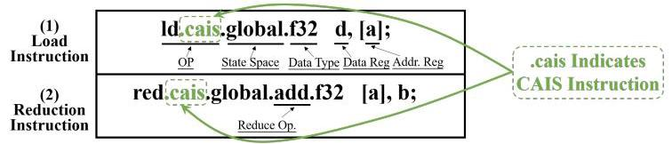

Fig. 4 展示的是 ISA 层最小但关键的变化。CAIS 的设计哲学不是重写 GEMM，而是在已有内存访问路径中加入足够的信息，让交换机知道哪些请求属于计算语义驱动的 collective access。

**2. NVSwitch merge unit。** 交换机端新增 CAM Lookup Table 和 Merging Table。CAM 根据地址和请求类型查找是否已有 merge session；Merging Table 保存 load response cache、reduction partial sum、session status、merged request counter 等状态。Load request 第一次 miss 时会向 home GPU 发一次真实读取，后续同地址请求要么等待 response，要么直接从 cached data 生成响应；reduction request 则在交换机内累加，等参与 GPU 的贡献到齐后写回目的地址。

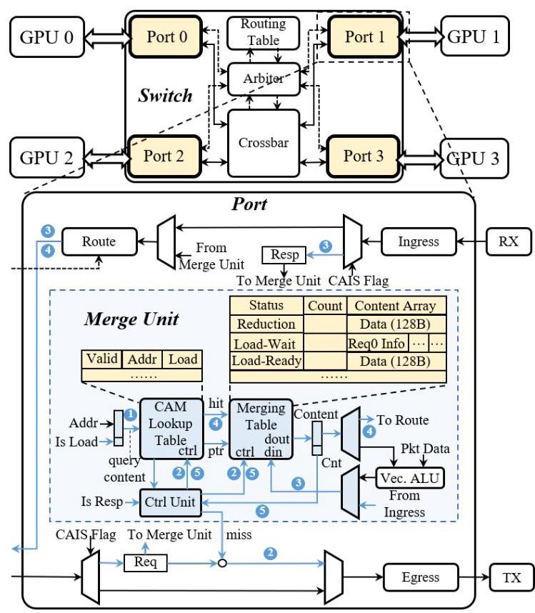

Fig. 5 说明 CAIS 把 NVSwitch 从纯转发/collective primitive 加速器改成一个可识别计算访问语义的 merging agent。这个设计的关键不是算力多强，而是能在数据路径中快速判断“多个 GPU 是否在请求同一件事”。

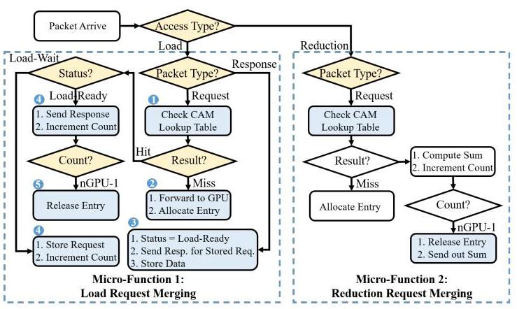

Fig. 6 给出 load merging 和 reduction merging 的微流程。Load 路径减少重复的远程读取，reduction 路径减少重复的写回/传输；二者共同把多个通信请求压成一次交换机内合并操作。

**3. eviction、timeout 与 deterministic routing。** 当 Merge Table 满时，CAIS 用 LRU eviction。Reduction entry 被驱逐时把 partial result 发回 home GPU；Load-Ready entry 可以安全驱逐，Load-Wait entry 等 response 到达后再处理，新的请求可以 bypass merge unit，避免 thrashing。每个 entry 还带 timer，超时后自动驱逐以保证 forward progress。为了让同地址请求收敛到同一交换机，CAIS 用基于地址 hash 的 deterministic routing。

**4. TB Group 编译器分析和同步。** CAIS 编译器在 CUDA-to-PTX 阶段分析内存地址表达式，若表达式不含 GPU ID 且对相同 `blockIdx` 访问同一数据区域，就把跨 GPU 的对应 TB 归为同一个 TB Group，并在 JIT 时把相应内存访问替换为 CAIS variants。运行时在两个位置同步：pre-launch synchronization 对齐 TB dispatch，pre-access synchronization 在 warp 遇到第一个 `*.cais` 前对齐访问点。论文称每个 TB 只需交换轻量 empty packets，开销约为 GPU-switch round trip 的 0.5 us。

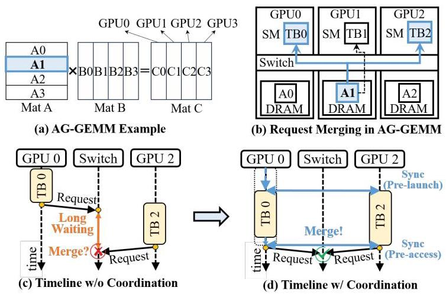

Fig. 7 展示为什么仅靠 merge unit 不够：如果 TB 请求错开到达，交换机要么等很久，要么过早驱逐。TB Group coordination 的作用是把“语义上可合并”的请求变成“时间上也更容易合并”的请求。

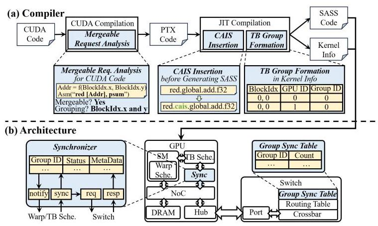

Fig. 8 把编译器、GPU synchronizer 和 switch Group Sync Table 串起来。这个协同设计是 CAIS 的工程核心之一，因为它把静态依赖信息转化成运行时的请求对齐。

**5. Graph-level dataflow optimizer。** 打破 global barrier 后，CAIS 允许 consumer TB 在 producer TB 的 input tile 准备好后提前启动，而不是等待整个 producer kernel 结束。对于 GEMM-RS + LN + AG-GEMM 这样的子图，optimizer 可以建立 TB-level dependency，让后续 GEMM 更早消费 LayerNorm 输出。

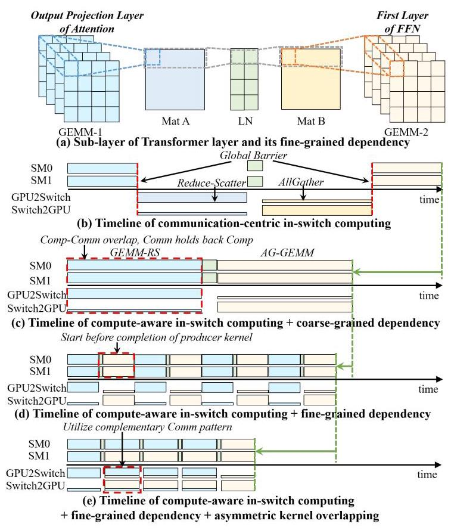

Fig. 9 是 CAIS 从单个访问合并走向端到端加速的关键图。它说明性能提升不只来自减少通信量，还来自把原本按 kernel 串行的 DFG 变成 TB 粒度流水线。

**6. asymmetric kernel overlapping 和 traffic control。** GEMM-RS 与 AG-GEMM 的链路方向需求相反：reduction 更偏 GPU-to-switch，load response 更偏 switch-to-GPU。CAIS 利用这种互补性，把 SM 分成两组并发执行不同 kernel，使两个方向的链路都保持忙碌。为避免 load/reduction 竞争，CAIS 引入分离的 virtual channels 和 round-robin arbitration。

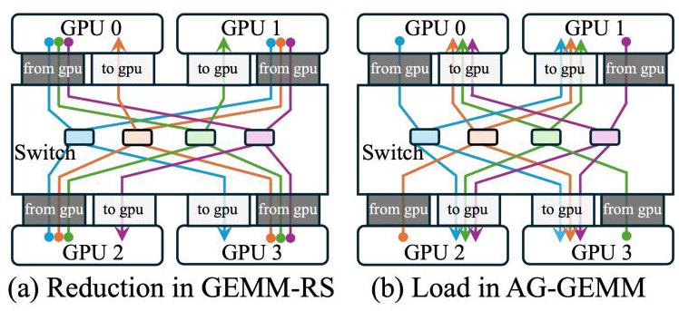

Fig. 10 解释了为什么“减少通信量”之后仍需要 traffic-aware scheduling。如果只看总流量，可能忽略某一方向链路被压满；CAIS 的 overlapping 是在显式利用上下行流量互补。

### 与已有方案的对比

相对 TP-NVLS/SP-NVLS，CAIS 的优势是消除了计算和通信之间的 global barrier，把 collective 变成计算 kernel 内部的远程访问。相对 CoCoNet/FuseLib，CAIS 不依赖大量手写 fused kernel，也能和 NVLS 式 in-switch reduction/multicast 能力结合。相对 T3/T3-NVLS，CAIS 的不同点是让交换机按 compute semantics 做 request merging，并在 graph-level 同时处理 AG-GEMM 和 GEMM-RS 的流量互补，而不是只做 producer collective 的触发和重叠。

不足也要明确。CAIS 要求 GPU ISA、NVSwitch data path、routing、compiler 和 runtime 都配合修改，部署门槛明显高于纯软件 overlap。其地址分析依赖 LLM kernel 中规则的访问模式；对稀疏、动态 shape 或不规则通信模式，TB Group 推断和 merge convergence 可能更难。论文虽然给出面积开销和模拟验证，但没有真实硬件原型，因此硬件时序、死锁边界、编译器覆盖率和系统软件集成仍是开放风险。

## 五、实验评估

### 实验设定

作者模拟一个 8-GPU、4-NVSwitch 的 DGX-H100 类拓扑。GPU 侧基于 Accel-Sim 扩展 Hopper 相关特性，互连侧基于定制 BookSim2，NVLink/NVSwitch 参数参考真实设备：NVLink 使用 16B flit、单 flit header、双向传输；GPU 到 switch 或 switch 到 GPU 的单向 link latency 为 250 ns，round-trip 约 1 us；每个 switch port 配 40 KB Merge Table，约 320 entries，并有 8 个 256-depth virtual channels。

workload 包括 Mega-GPT-4B、Mega-GPT-8B 和 LLaMA-7B，覆盖 training 和 inference，其中 inference 关注通信更重的 prefill stage。GEMM kernel 用 CUTLASS。由于完整大模型模拟成本过高，作者将 hidden size 和 FFN hidden size 缩小 50%，并相应减少 50% SM 数量，以保持 compute-to-communication ratio 的比例关系；Section V-E 专门验证这个 scaled-down 方法。

baseline 分成四类。第一类是 TP-NVLS 和 SP-NVLS，代表使用 NVLS 加速 collective 的 Tensor Parallelism。第二类是不使用 NVLS 的 overlap solutions，包括 CoCoNet、FuseLib 和 T3。第三类是 CoCoNet-NVLS、FuseLib-NVLS、T3-NVLS，也就是把 overlap 方案增强为支持 NVLS。第四类是 locality-aware TB schedule，采用 LADM。作者还给出 CAIS-Base，用来去掉 TB coordination 和 graph-level dataflow optimizer，观察基础 ISA/microarchitecture 的贡献。

### 主要实验与结论

**1. End-to-end speedup。** Fig. 11 显示 CAIS 在 inference 和 training 上都稳定超过九个 baseline。对 inference，CAIS 相对 TP-NVLS、SP-NVLS、CoCoNet、FuseLib、T3、CoCoNet-NVLS、FuseLib-NVLS、T3-NVLS、LADM 的 geomean speedup 分别为 1.38x、1.89x、1.98x、1.90x、1.61x、1.25x、1.21x、1.45x、7.60x；training 中对应 geomean 为 1.37x、1.89x、1.96x、1.89x、1.60x、1.23x、1.20x、1.45x、7.59x。

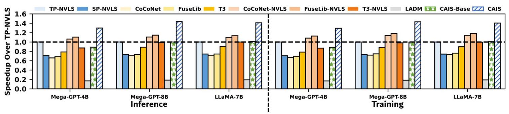

Fig. 11 是论文最主要的结果图。它说明 CAIS 的收益并非只来自某个特别弱的 baseline，面对纯 NVLS、软件 overlap、硬件 overlap、NVLS-enhanced overlap 和 locality-aware schedule 都有收益。

**2. Sub-layer speedup。** Fig. 12 评估四个通信密集子层：[L1] Output projection -> LayerNorm -> First FFN layer；[L2] Second FFN layer -> LayerNorm -> Input projection；[L3] First FFN layer -> LayerNorm -> Output projection；[L4] Input projection -> LayerNorm -> Second FFN layer。它们都包含 GEMM-RS + LN + AG-GEMM，正好对应 CAIS 的 graph-level optimization 场景。CAIS 对九个 baseline 的 geomean speedup 分别为 1.39x、1.91x、1.99x、1.91x、1.64x、1.24x、1.20x、1.47x、7.90x，最大可到 8.08x。

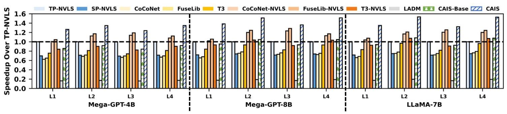

Fig. 12 支撑了作者的机制解释：CAIS 在子层级的收益更直接，因为这些子图正是 global barrier、request merging、TB-level dependency 和 asymmetric traffic 同时出现的地方。

**3. CAIS-Base 对比。** 论文指出，CAIS 相对 CAIS-Base 的最大/geomean speedup 在 end-to-end、inference、training 和 sub-layer 上约为 1.46-1.51x / 1.42-1.47x。原文该句排版有些混乱，但结论清楚：只有 ISA + merge unit 不足以完全兑现收益，TB coordination 与 graph-level optimizer 是必要的第二步。

**4. TB coordination 的效果。** Fig. 13(a) 显示没有 coordination 时，为合并所有可合并请求，单 port Merge Table 可能需要最高 250 KB；启用 coordination 后，需求降到 40 KB 以下，最小所需 table size 减少 87%。Fig. 13(b) 进一步显示同地址请求最早/最晚到达的平均等待时间从 35 us 降到小于 3 us。

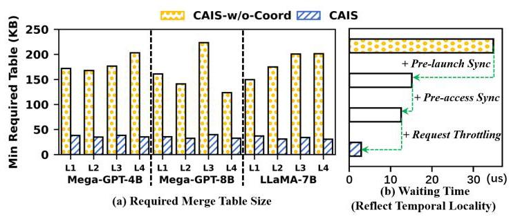

Fig. 13 是 CAIS 中“编译器/运行时对齐请求时间”的直接证据。它把 TB coordination 从一个合理想法变成了可量化的硬件资源节省。

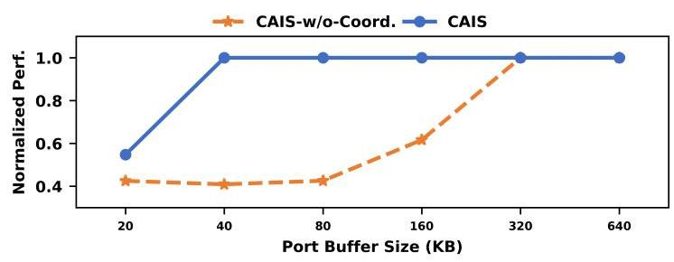

Fig. 14 补充说明，当 Merge Table 很小时，未协调版本性能快速下降，而 CAIS 仍保持较高性能。这说明 coordination 不只是降低面积，也提升了对实际 buffer 约束的鲁棒性。

**5. Graph-level dataflow optimizer 的效果。** Fig. 15 显示平均带宽利用率从 CAIS-Base 的 62.4% 提高到 CAIS-Partial 的 84.7%，再提高到完整 CAIS 的 90.2%。Base 到 Partial 的增益来自 asymmetric kernel overlapping，Partial 到 CAIS 的增益来自 traffic control。Fig. 16 在 LLaMA-7B 的 L2 子层上给出时间序列，完整 CAIS 在 steady state 接近 100% 利用率，而 Partial 会因 contention 出现 dips，Base 最低且波动最大。

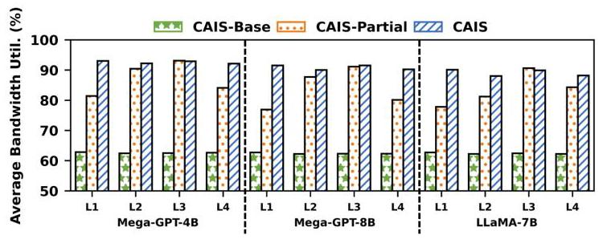

Fig. 15 说明 CAIS 的数据流优化不是只改善一个 kernel latency，而是在系统层把双向互连利用率抬高。

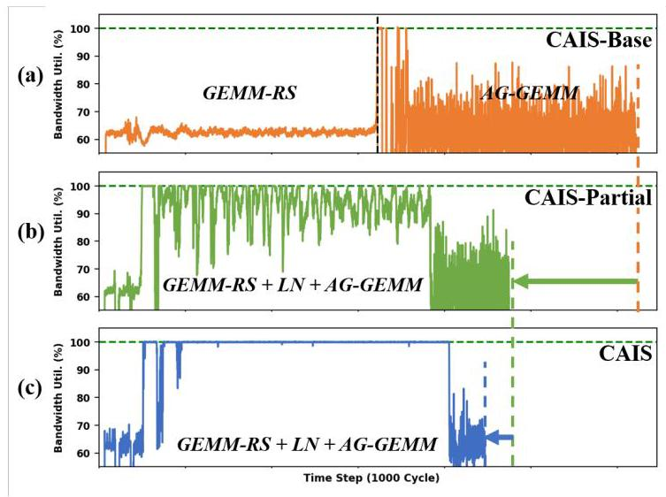

Fig. 16 则说明 traffic control 的必要性：只做 overlap 可能还会出现阶段性拥塞，完整 CAIS 通过 channel/arbitration 把利用率变得更稳定。

**6. scalability、hardware overhead 和 validation。** CAIS 在 LLaMA-7B 上扩展到 32 GPUs 时，per-GPU throughput 相对 8-GPU CAIS 的下降仍在 5% 以内。作者还称系统级 Merge Table 上界不会随 GPU 数增长，因为 coordinated/throttled outstanding request 由单 GPU outstanding remote request 限制；在 8-GPU 系统中上界为 1280 KB，也就是每 switch port 40 KB。硬件面积上，switch 修改约 0.50 mm^2，小于 NVSwitch die 的 1%；GPU 端 TB-group synchronizer 约 0.019 mm^2，不到 H100 die 面积 0.01%。

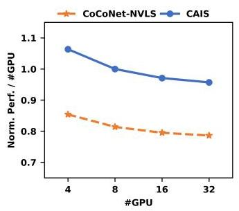

Fig. 17 用 per-GPU throughput 说明 CAIS 的收益没有在更大 GPU 数下快速塌掉。需要注意的是，作者同时按 GPU 数缩放 hidden dimension，以避免计算资源不足，这与固定模型扩 GPU 的 strong scaling 场景不同。

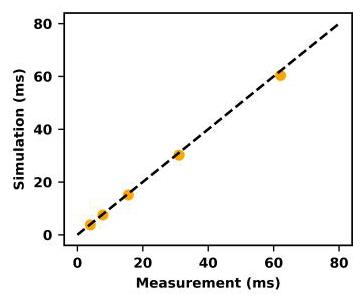

Fig. 18 和 Table II 支撑实验可信度。Table II 中 full-scale 配置的 CAIS over TP-NVLS speedup 为 1.43，half-scale 为 1.40；NVLS AllReduce 模拟相对真实 NCCL 测量的平均误差为 3.87%。这些验证不能替代真实 CAIS 硬件，但说明作者的模拟基线不是完全脱离现实。

### 结论支撑性分析

实验基本支撑了论文的主张：CAIS 的端到端收益、子层收益、TB coordination 消融、Merge Table sensitivity、带宽利用率、scalability 和面积开销都覆盖了主设计的关键环节。尤其是 Fig. 13 与 Fig. 15/16 分别回答了“请求是否真的能合并”和“dataflow optimizer 是否真的提高链路利用率”这两个机制问题。

主要局限有三点。第一，CAIS 需要尚不存在的 GPU ISA 和 NVSwitch microarchitecture 扩展，cycle-accurate simulation 无法完全覆盖真实芯片时序、协议验证和系统软件复杂度。第二，workload 是 scaled-down LLM，虽然作者做了 validation，但真实 1T+ 模型、多节点互连、long-context inference decode 阶段和混合并行组合仍需要更多证据。第三，论文对 compiler coverage 的讨论偏乐观，规则 GEMM/LN 图很适合静态 index analysis，但不规则 kernel、动态路由或 MoE 类通信是否能稳定形成 TB Group 还不清楚。

## 六、附加洞察

**结论 1：仅提高 collective primitive 性能不一定改善 TP critical path。**  
- *出处*：Section II-B、II-C，Fig. 1、Fig. 2。  
- *推理链条*：NVLS 可让 collective primitive 获得 2-8x speedup，但 TP 中 collective 与 GEMM 有严格 producer-consumer 关系；现有 NVLS primitive 的 push/pull 模式与 GEMM read/write 语义错位，仍需 global barrier；因此 collective 变快不等价于 compute-communication overlap 充分，GPU 利用率甚至可低于 60%。

**结论 2：TB temporal alignment 是 in-switch merging 的硬约束，不只是调度细节。**  
- *出处*：Section II-D、III-B、V-B，Fig. 7、Fig. 13。  
- *推理链条*：交换机只能在表项生命周期内合并同地址请求；跨 GPU TB 独立调度会让请求平均错开 35 us；错开会造成表项等待、buffer pressure 和 eviction；编译器分组加 pre-launch/pre-access synchronization 后等待降到小于 3 us，Merge Table 需求降到 40 KB 以下，所以请求对齐是可用硬件成本的前提。

**结论 3：打破 barrier 后，系统瓶颈从“能否 overlap”转移到“能否平衡双向链路”。**  
- *出处*：Section III-C、V-B，Fig. 10、Fig. 15、Fig. 16。  
- *推理链条*：GEMM-RS 与 AG-GEMM 的通信方向相反；只减少通信量仍可能造成单方向链路拥塞；CAIS-Partial 把平均带宽利用率从 62.4% 提高到 84.7%，完整 CAIS 通过 traffic control 提高到 90.2%，并在 steady state 接近 100%；因此 CAIS 的后半段贡献是 resource balancing，而不是单纯更多并发。

**结论 4：CAIS 的 Merge Table 成本在作者模型中可随系统规模摊薄。**  
- *出处*：Section V-C、V-D。  
- *推理链条*：merge-aware coordination 让所有 GPU 对同一组数据发出 outstanding request，request throttling 限制每 GPU outstanding 数；因此系统级 merge state 上界由单 GPU outstanding remote request 决定，而不是 GPU 数线性决定；在 8-GPU 设置中是 1280 KB / 40 KB per switch port，switch 增量面积约 0.50 mm^2。这个结论依赖规则访问和 throttling 有效，真实硬件上还需要更完整压力测试。

**结论 5：scaled-down simulation 的排序可信度比绝对性能更重要。**  
- *出处*：Section IV-B、V-E，Table II、Fig. 18。  
- *推理链条*：作者无法完整模拟最先进大模型，所以把模型维度和 SM 数同时减半；Table II 中 full 与 half 的 CAIS over TP-NVLS speedup 分别为 1.43 和 1.40，说明相对 speedup 排序接近；NVLS 模拟相对真实 NCCL AllReduce 平均误差为 3.87%；因此实验更适合支持“设计相对 baseline 的趋势”，不宜过度解读为真实芯片上的绝对吞吐。

## 七、总结与评价

CAIS 的核心贡献是把 NVLS 这类 in-switch computing 重新解释为计算 kernel 的语义化远程内存访问，并给出一套从 ISA、NVSwitch merge unit、TB coordination 到 graph-level scheduling 的完整 co-design。论文最强的地方在于问题定位清晰：它不是说 NVLS 不快，而是说 NVLS 的通信语义和 TP compute kernel 的内存语义不一致，所以需要让 GEMM 直接发起可合并的远程 load/reduction。

我认为最有价值的设计是 TB Group coordination。新增 `ld.cais`/`red.cais` 和 merge unit 是概念上的核心，但真正决定硬件是否可做的是请求时间窗口是否足够紧；Fig. 13 把这个问题量化得比较扎实。Graph-level optimizer 也很重要，因为它说明 CAIS 的收益不是单点请求合并，而是可以重构 LLM 子图执行方式。

最大不足是落地成本。CAIS 需要改 GPU ISA、NVSwitch、routing、compiler、runtime 和 kernel launch metadata，属于未来架构提案而不是短期软件系统。论文对 irregular workload、真实驱动栈、协议验证、与现有 NCCL/CUDA graph/Transformer engine 的集成讨论较少。后续工作最值得看的方向是：在 RTL 或 FPGA/NoC 原型中验证 merge unit 与 synchronizer 的时序和死锁边界，以及把 CAIS 编译器规则应用到更复杂的 MoE、attention variants 和多节点并行场景。

## 八、章节脉络与段落速览

- **Section I · Introduction**：从 LLM TP 通信瓶颈引出 NVLS 语义错位，并概述 CAIS 的设计和贡献。
  - ¶1 说明 LLM 扩展依赖混合并行，其中 TP 是最通信密集且结构依赖最强的并行方式。
  - ¶2 说明 NVLink/NVSwitch/NVLS 缓解 collective 开销，但 communication-centric NVLS 无法自然 overlap GEMM。
  - ¶3 用 AG-GEMM 和 GEMM-RS 解释 NVLS push/pull primitive 与 GEMM read/write semantics 的错位。
  - ¶4 提出 compute-aware in-switch computing：计算 kernel 直接按内存语义发 load/reduction，switch 负责 request merging。
  - ¶5 总结三大挑战：ISA/microarchitecture 缺失、跨 GPU TB temporal misalignment、isolated operators 限制 DFG 优化。
  - ¶6 列出贡献：发现语义错位、提出 CAIS co-design、在模拟器中验证性能收益。
  - ¶7 给出全文组织。

- **Section II · Background and Motivation**：铺垫 TP、NVLS、现有 in-switch computing 限制，以及 CAIS 的设计哲学。
  - **II-A · LLM and Tensor Parallelism**：解释 TP/SP 为什么比 DP/PP 更容易产生 per-layer collective bottleneck。
    - ¶1 说明 LLM 的 GEMM/GEMV 计算规模随模型维度快速增长，需要多 GPU 并行。
    - ¶2 对比 DP、PP、TP 的通信形态，指出 TP 可贡献 40-60% 端到端延迟。
    - ¶3 用 Fig. 1(a)(b) 说明 Basic TP 与 Sequence Parallelism 的 AllReduce、AllGather、Reduce-Scatter 组合。
  - **II-B · NVLink/NVSwitch-based Multi-GPU Systems**：说明高速互连和 NVLS 的作用及剩余瓶颈。
    - ¶1 用 H100/NVLink/NVSwitch 扩展实验说明通信时间随 GPU 数增长并超过计算时间。
    - ¶2 介绍 NVLS 和 `multimem.*` 指令，强调它们能加速 collective primitive。
  - **II-C · Limits of Current In-Switch Computing**：指出现有 NVLS 的 communication-centric 局限。
    - ¶1 以 AllGather push mode 说明 NVLS 对 collective 友好但不理解 GEMM 消费时机。
    - ¶2 说明 AllGather 后接 GEMM 时 push/store 会造成 global barrier 和 SM idle。
    - ¶3 总结 AG-GEMM、GEMM-RS、AR-GEMM、GEMM-AR 四类组合中的语义错位。
  - **II-D · Design Philosophy and Challenges**：提出 CAIS 的基本哲学和三大挑战。
    - ¶1 提出计算 kernel 应直接按 memory semantics 发起通信，switch 自动合并请求。
    - ¶2 用 AG-GEMM 示例说明 TB-level local barrier 可替代 global barrier。
    - ¶3 用 Fig. 3 概述 load/reduction request merging 的系统结构。
    - ¶4-6 分别说明 ISA/microarchitecture、temporal coordination、cross-kernel fusion 三个挑战。

- **Section III · CAIS Design**：详细介绍 CAIS 的 ISA、switch、TB coordination 和 graph optimizer。
  - ¶1 概述三大组件：compute-aware ISA/microarchitecture、multi-GPU TB coordination、graph-level optimizer。
  - **III-A · Compute-Aware ISA and Microarchitecture Extensions**：定义可合并访问和交换机合并逻辑。
    - ¶1 说明 CAIS 把 switch 从 passive relay 变成 active merging agent。
    - ¶2 介绍 `ld.cais` 和 `red.cais`，通过 1-bit CAIS flag 标记可合并请求。
    - ¶3 介绍 CAM Lookup Table 与 Merging Table 的状态和职责。
    - ¶4 说明 load/reduction micro-functions 如何减少重复远程访问和写回。
    - ¶5 说明 eviction、timeout 和 deterministic routing 如何保证 forward progress 与 merge convergence。
  - **III-B · Cross-GPU TB Coordination**：用编译器和运行时对齐跨 GPU TB 请求。
    - ¶1 说明独立 TB 调度会导致 mergeable request 在时间上错开。
    - ¶2 介绍 TB Group 的概念和 switch/GPU 端跟踪。
    - ¶3 说明静态 index analysis 如何识别 GPU-invariant access 并替换为 CAIS variants。
    - ¶4 说明 pre-launch 与 pre-access synchronization 的触发条件。
    - ¶5 说明同步仅交换轻量 empty packets，约 0.5 us，并限制在 TB Group 内。
    - ¶6 介绍 TB-aware request throttling，用于避免个别 GPU 过早发出过多请求。
    - ¶7 说明 GPU synchronizer 和 switch Group Sync Table 的硬件支持。
  - **III-C · Graph-Level Dataflow Optimizer**：利用 TB-level dependency 做深度融合和链路平衡。
    - ¶1 说明 optimizer 的目标是提升系统资源利用率。
    - ¶2-3 介绍 GEMM-1 -> LN -> GEMM-2 的 TB-level producer-consumer 关系。
    - ¶4-5 解释 GEMM-RS 与 AG-GEMM 的 asymmetric traffic 及其互补性。
    - ¶6 说明 virtual channels 和 round-robin arbitration 用于 traffic control。

- **Section IV · Experimental Methodology**：说明模拟平台、workload 和 baseline。
  - **IV-A · Hardware Configuration**：描述 8-GPU/4-NVSwitch DGX-H100 类拓扑、Accel-Sim + BookSim2、H100 参数、NVLS 支持、Merge Table 和 link latency 配置。
  - **IV-B · Benchmark**：列出 Mega-GPT-4B、Mega-GPT-8B、LLaMA-7B，覆盖 training 和 inference prefill，并解释 scaled-down setup。
  - **IV-C · Baseline**：把九个 baseline 分为 TP-NVLS/SP-NVLS、CoCoNet/FuseLib/T3、NVLS-enhanced overlap solutions 和 LADM。

- **Section V · Experimental Results**：从端到端、子层、机制消融、扩展性、面积和方法验证评估 CAIS。
  - **V-A · End-to-End and Sub-Layer Speedup**：报告 CAIS 对九个 baseline 的端到端和子层 speedup，并分析收益来源。
    - ¶1 用 Fig. 11 给出 inference/training 的 geomean 和最大 speedup。
    - ¶2 用 Fig. 12 评估四类 GEMM-RS + LN + AG-GEMM 子层。
    - ¶3-5 分别解释 CAIS 相对 NVLS、NVLS-enhanced overlap、T3-NVLS、LADM 和 CAIS-Base 的优势。
  - **V-B · Detailed Performance Analysis**：拆解 TB coordination 和 graph optimizer 的机制收益。
    - ¶1 说明本节关注 CAIS 内部关键技术。
    - ¶2-4 用 Fig. 13、Fig. 14 证明 TB coordination 降低 table size 和 waiting time。
    - ¶5-7 用 Fig. 15、Fig. 16 证明 graph optimizer 和 traffic control 提高带宽利用率。
  - **V-C · Scalability Analysis**：说明 CAIS 到 32 GPUs 时 per-GPU throughput 降幅在 5% 以内，并讨论 Merge Table 上界随 GPU 数摊薄。
  - **V-D · Hardware Overhead**：报告 switch 增量面积 0.50 mm^2、GPU 端 synchronizer 0.019 mm^2。
  - **V-E · Methodology Validation**：用 full/half setup speedup 接近和 NVLS AllReduce 平均 3.87% error 验证模拟方法。

- **Section VI · Related Work**：把已有通信优化分为 computation-communication overlapping 与 memory efficiency，并指出 CAIS 与 CoCoNet、FuseLib、T3、Centauri、ACE、LADM 等工作的差别。
  - ¶1 总结相关工作类别，强调直接把这些技术套到 NVLS 上仍会受限于 communication-centric semantics。

- **Section VII · Conclusion**：总结 CAIS 从 communication-centric NVLS 到 compute-integrated in-switch computing 的推进。
  - ¶1 回顾 CAIS 的 ISA/microarchitecture、TB coordination、graph-level optimizer 和代表性 LLM 上的性能收益。

- **Section VIII · Acknowledgment**：列出评审感谢和资助信息。
  - ¶1 说明 HPCA 2026 评审反馈和项目资助来源。
