# LRM-GPU: Alleviating Synchronization Overhead for Multi-Chiplet GPU Architecture 深度解读

> **作者**：Baiqing Zhong, Zhirong Ye, Xiaojie Li, Peilin Wang, Haiqiu Huang, Zhaolin Li, Zhiyi Yu, Mingyu Wang  
> **会议/期刊**：HPCA 2026  
> **一句话总结**：LRM-GPU 面向 multi-chiplet GPU 中显式同步的额外 cache coherence 与跨 chiplet atomic traffic 开销，提出同步变量 owner 目录驱动的 lazy release consistency 和网络内 atomic merge，使同步型 workload 相比 MCM-GPU 平均加速 1.33x、相比 HMG 平均加速 1.22x。

## 一、问题定义

这篇论文解决的是 multi-chiplet GPU 中显式同步的效率问题。chiplet GPU 通过多个小 GPU die 组成逻辑上的大 GPU，以绕开单芯片面积、良率和工艺扩展的瓶颈；但它也带来了明显的 NUMA 特性：chiplet 内通信带宽高、延迟低，跨 chiplet 链路带宽有限。为了缓解普通 load/store 的远端访问开销，已有 multi-chiplet GPU 常加入 chiplet 内共享的额外 cache level，例如 MCM-GPU 的 L1.5 cache，用它缓存 remote data 并保留 chiplet 内 locality。

同步操作正好踩中了这个设计的反面。传统 GPU 往往假设线程间同步较粗粒度、较少发生，因此用简单的软件管理 coherence：acquire 时 invalidate 私有 cache，release 时 flush dirty data，同步用 atomic 通常绕过 L1、直接到 LLC 执行。在 multi-chiplet GPU 中，多出来的 L1.5 cache 使 acquire/release 需要处理更深 cache hierarchy；同时 atomic synchronization 仍然要跨 chiplet 到 home LLC，无法被 L1.5 cache 缓解，反而受限于 inter-chiplet bandwidth。

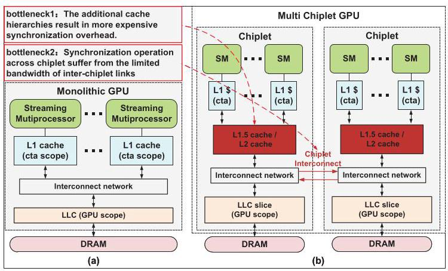

Fig. 1 对比了 monolithic GPU 和 multi-chiplet GPU。关键差别不是计算单元是否更多，而是 cache hierarchy 和通信边界变了：multi-chiplet GPU 为减少 NUMA 普通访存开销而加的中间 cache level，在同步语义下会成为额外的 invalidate/flush 对象。

论文用 4-chiplet GPU 与等价但不可制造的 monolithic GPU 做对比，显示带全局同步的 workload 平均有 50.5% 性能损失，其中 22.5% 来自额外 cache-level invalidation，23.5% 来自 remote atomic access。这组数据让问题动机比较 solid：它不是纯粹的协议洁癖，而是两个量级相近、可分解的真实瓶颈。

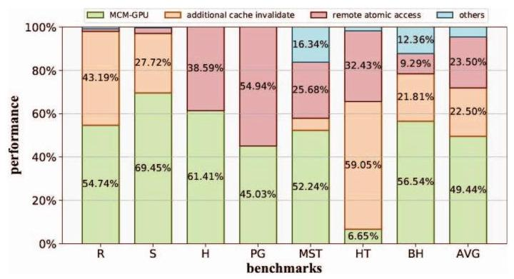

Fig. 2 是本文动机最重要的证据。它把同步开销拆成 additional cache level 和 remote access 两部分，说明只优化普通 NUMA 访存不够，同步路径本身需要单独设计。

**动机评估**：动机较扎实。multi-chiplet GPU 的额外 cache level 是已有架构为普通访存引入的合理优化，但同步操作要求全局可见性和 atomicity，使这个优化在 acquire/release 与 atomic 路径上产生副作用。论文的问题定义也有实验支撑。不过它主要讨论显式同步密集型 workload；如果目标应用基本没有 global synchronization，收益会很小，论文也在 Fig. 12 中确认平均性能差异只有约 2%。

**核心 Insight**：LRM-GPU 的核心洞察是同步存在两类 locality。第一，synchronization behavior 有 chiplet locality：同一个同步变量连续由同一 chiplet 内的 SM 使用时，不需要每次都对 L1.5 cache 做全局式 invalidate/flush。第二，synchronization data 有合并机会：多个跨 chiplet atomic 可能同时访问同一地址或同一 cache-line 区域，可以在网络中合并成更少的请求。这个 insight 直接连接了论文的两个组件：owner directory 负责识别何时真的发生跨 chiplet owner transfer，AMU 负责在网络中压缩 cross-chiplet atomic traffic。

## 二、相关工作

论文把相关工作大致分成三条线。

第一类是 multi-chiplet GPU 的 NUMA 和带宽优化。MCM-GPU 使用 L1.5 cache、first-touch page allocation、distributed CTA scheduling 增强 chiplet 内 locality；AdCoalescer、NearFetch、SAC、MGvm、Barre Chord 分别从 request coalescing、nearby fetching、cache organization、virtual memory 和 translation merging 角度减少跨 chiplet 开销。这些工作主要优化普通 memory access，对同步 atomic 和 acquire/release 的语义开销覆盖不足。

第二类是 GPU synchronization/coherence。DeNovo 和 hLRC 通过 tracking ownership 减少不必要 coherence 操作，LAB、Atomic Cache、ARC、DAB 等则从 L1 buffer、in-cache atomic、warp-level reduction 或 on-SM buffering 优化 atomic traffic。它们的问题在于作用范围多停留在 monolithic GPU、SM 内或 warp 内，难以直接处理 chiplet 间 owner migration 和 inter-chiplet bandwidth bottleneck。

第三类是多 GPU 或 multi-chiplet coherence 协议。HMG 将 cache coherence 扩展到 hierarchical multi-GPU/multi-chiplet 场景，用 hierarchical sharer tracking 降低同步开销；CPElide 利用 command processor 的全局信息优化 implicit inter-kernel synchronization。LRM-GPU 与它们的差别是更聚焦 explicit intra-kernel synchronization：它不尝试维护所有 data 的完整 coherence，而只追踪 synchronization variable 的 chiplet owner；同时它把 atomic 合并推到 interconnect 中，面向跨 chiplet 的并发请求。

## 三、技术挑战

**挑战 1：额外 cache level 放大 acquire/release 的 coherence action。** 在 MCM-GPU 这类架构中，L1.5 cache 由 chiplet 内多个 SM 共享，容量也比单个 SM 的 L1 大。保守地在每次 acquire/release 时 invalidate 或 flush L1.5，不仅成本更高，还会影响同 chiplet 上其他 SM 的数据复用。

**挑战 2：同步变量需要正确性，但完整 coherence 又太重。** 如果像 HMG 那样给更多 data 维护 coherence，协议复杂度、directory 容量和 invalidation traffic 都会上升；如果像传统 GPU 那样完全依赖 coarse invalidation，又会浪费 locality。LRM-GPU 需要在 correctness 和轻量实现之间找到边界。

**挑战 3：atomic synchronization 绕过局部 cache，直接暴露 inter-chiplet bandwidth 瓶颈。** 锁、barrier、semaphore、histogram、pagerank 等 workload 会产生大量 remote atomic。由于同步数据通常不被 L1/L1.5 cache 缓存，额外 cache level 无法降低这类跨 chiplet traffic。

**挑战 4：atomic 合并必须保持语义。** atomicAdd 这类可交换操作容易聚合，但 atomicCAS 只有在比较值相同等条件下才可合并，而且响应还必须正确返回给多个请求者。AMU 需要识别 opcode、地址、mask、请求者列表，并处理等待响应期间不能继续合并的状态。

## 四、解决方案

### 整体思路

LRM-GPU 用两个相对独立的机制分别对应两个瓶颈。针对 acquire/release 的额外 cache-level 开销，它在 LLC 处维护 synchronization variable directory，为每个同步变量记录最近访问它的 chiplet owner；只有当同步变量 owner 从一个 chiplet 转移到另一个 chiplet 时，才对相关 L1.5 cache 执行 flush/invalidate。针对 remote atomic traffic，它在每个 chiplet 的网络入口中加入 Synchronization Atomic Merge Unit (AMU)，将跨 chiplet、同地址或同粗粒度区域的 atomic 请求合并后再发出。

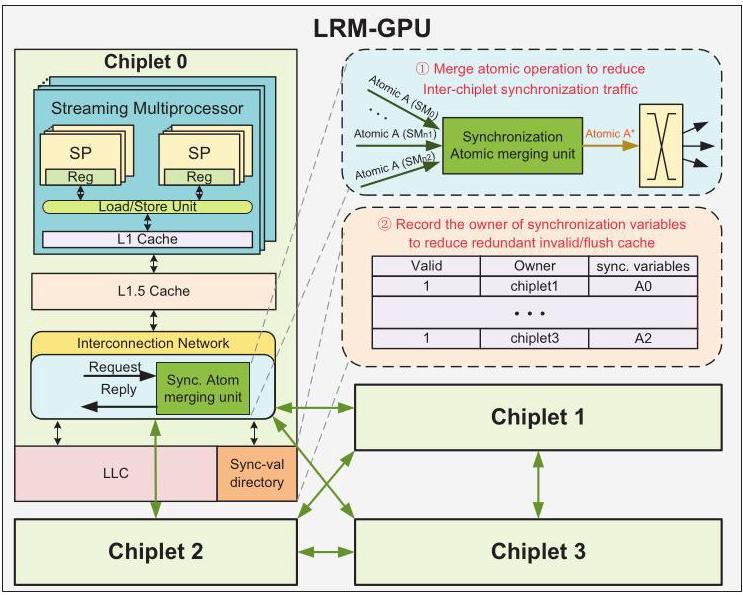

Fig. 4 展示了 LRM-GPU 的两个插入点：LLC 旁的同步变量目录只跟踪 synchronization variables，不跟踪所有普通数据；AMU 嵌入 interconnect 路径，用来处理跨 chiplet atomic 请求。这种切分让设计保持轻量，同时覆盖了论文在动机部分拆出的两个主要开销来源。

### 贯穿示例

可以把多个 SM 竞争同一把锁理解成一个办公室里多个小组轮流修改一份共享表格。SM0 和 SM1 在 chiplet0，SM2 在 chiplet1；锁变量 X 控制对数据 A 的访问。传统 MCM-GPU 像是每次有人拿锁或放锁，都要求整个小组办公室清空本地复印件，即使下一位仍然来自同一个办公室。LRM-GPU 则记录“上一位拿锁的人来自哪个办公室”：如果下一位仍在 chiplet0，就不清空 L1.5；只有当锁从 chiplet0 转到 chiplet1 时，才把 chiplet0 的修改写回 LLC，并让 chiplet1 清掉可能过期的本地副本。

这个例子对应 Fig. 5 和 Fig. 6。SM0 首次 acquire 时目录无记录，需要分配 entry 并 invalidate 本地 L1.5；SM0 release 时 owner 仍是 chiplet0，因此延迟 coherence action。SM1 同属 chiplet0，acquire/release 都不触发 L1.5 coherence。直到 SM2 来自 chiplet1，owner 跨 chiplet 变化，LRM-GPU 才 flush chiplet0 的 L1.5 并 invalidate chiplet1 的 L1.5。

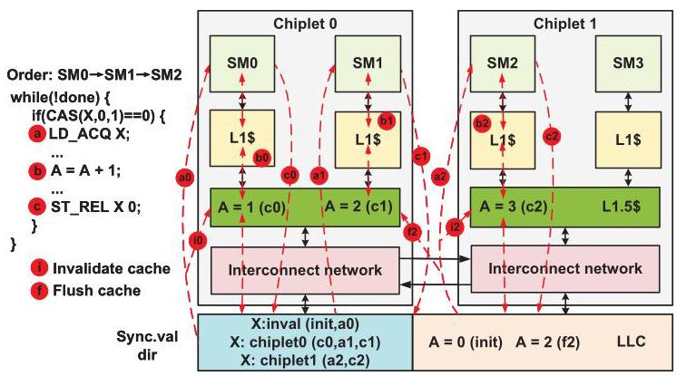

Fig. 5 用三次 lock handoff 说明 lazy release 的边界：不是取消 coherence，而是把 coherence 推迟到同步变量 owner 真正跨 chiplet 迁移的时刻。

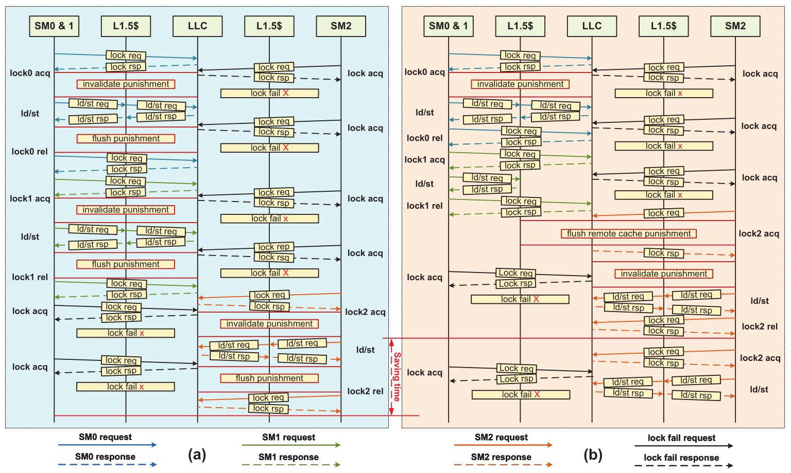

Fig. 6 则把 MCM-GPU 和 LRM-GPU 的执行流放在一起。MCM-GPU 每次 acquire/release 都触发 L1.5 处理；LRM-GPU 把同 chiplet 内连续同步视为 locality，从而减少冗余 invalidation/flush。

### 关键技术点

**Lazy release consistency on multi-chiplet GPU**：目录记录同步变量的 owner，状态可分为 invalid、local chiplet、remote chiplet、evicted。acquire 遇到 invalid 时分配 entry、从 LLC 读同步变量并 invalidate 本地 L1.5；遇到 local chiplet 时直接从 LLC 读，不做 L1.5 coherence action；遇到 remote chiplet 时，如果 L1.5 是 write-back，需要先 flush remote owner 的 L1.5，再更新 owner 并 invalidate 本地 L1.5。release 的逻辑类似，只是对同步变量执行 store to LLC。论文实验配置中 L1.5 是 write-through，因此实际 flush 压力比一般 write-back 场景更低，但协议描述覆盖了更复杂情况。

**同步变量不进入本地 cache**：LRM-GPU 仍采用同步操作 bypass to LLC 的传统 GPU 思路，使 synchronization variables 不在 L1/L1.5 中形成多份副本。这样目录不需要维护同步变量自身的多级 cache coherence，只需要判断与该同步变量关联的普通数据是否可能因 chiplet owner 变化而需要 L1.5 coherence action。

**AMU 的网络内 atomic 合并**：AMU 包含 merge table、instruction decoder、ALU 和 multicast unit。merge table entry 记录 status、opcode、address、SM list、data；valid 表示还可继续合并，reserve 表示请求已发出、等待响应，invalid 表示空闲。请求进入 AMU 后，如果是 cross-chiplet atomic 且能命中 valid entry，就按 opcode 合并数据并记录 SM ID；如果没有命中且有空闲 entry，就暂存并启动 countdown；倒计时到期或 SM list 满后，合并后的请求发出并进入 reserve。响应回来后，AMU 根据 SM list multicast 给相应 SM。

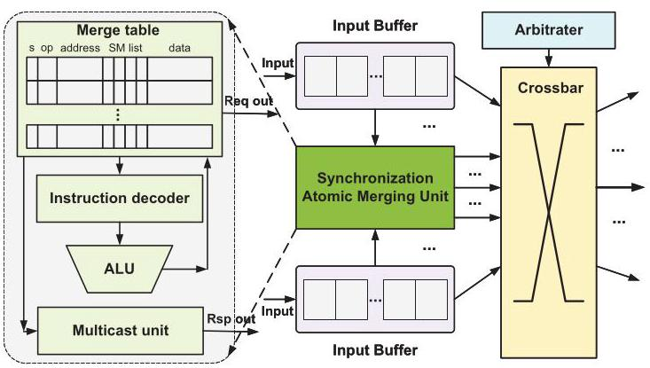

Fig. 7 强调 AMU 是一个面向高并发的硬件单元：CAM 存 key 以便快速查找，SRAM 存 SM list 和 data，多 bank、多通道、双端口设计减少结构冲突。它的目标不是替代 LLC atomic，而是在请求到 LLC 之前减少跨 chiplet 网络交易数。

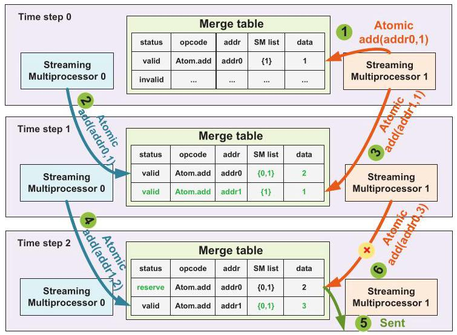

Fig. 8 说明了 AMU 的时间窗口语义：同地址请求在 entry valid 期间可合并；一旦 entry 已发出并处于 reserve，新的同地址请求不能并入该 entry，只能新建 entry 或直通。这个限制保持了请求与响应匹配的可实现性。

**支持的 atomic 类型和语义约束**：AMU 支持 atomicand、atomicor、atomicxor、atomicadd、atomicsub、atomicmax、atomicmin、atomicCAS 等。可交换/无序 atomic 可以通过 ALU 合并；atomicCAS 只有比较数据相同才可合并，而且合并后最多一个请求成功，其余请求按失败语义返回。论文还提到可在 cache-line 粒度做 operation-mask 合并，以提高带宽利用率。

### 与已有方案的对比

相比 MCM-GPU，LRM-GPU 的优势在于不把每次同步都等价为全局 cache 清理，而是让 owner directory 区分同 chiplet 和跨 chiplet 同步。相比 hLRC，它不缓存同步变量本身，避免同步变量在多级 cache 中迁移、写回和阻塞其他请求。相比 HMG，它不维护所有 data 的 coherence directory，降低协议复杂度和 coherence traffic；但它也更专用，只对显式同步路径有效。相比 ARC/LAB/Atomic Cache 等 atomic 优化，AMU 的粒度从 warp/SM/cache 内扩展到 chiplet interconnect，更贴近 multi-chiplet bottleneck。

## 五、实验评估

### 实验设定

论文基于 GPGPU-Sim 扩展 multi-chiplet GPU 模拟器，并集成 BookSim 2.0 风格的 composable chiplet interconnection platform，用于建模 intra-chiplet/inter-chiplet network、heterogeneous router/crossbar microarchitecture。评估系统是 4 个 chiplet、总计 256 个 SM；每个 SM 有 128 KB L1 data cache，每个 chiplet 有 2 MB L1.5 cache，LLC 总计 8 MB，L1.5+LLC 总容量 16 MB。inter-chiplet bandwidth 为 768 GB/s，跨 chiplet hop latency 为 32 cycles，总 DRAM bandwidth 为 3 TB/s。页面使用 4 KB first-touch allocation，CTA 使用 distributed scheduling。

LRM-GPU 的硬件参数是：同步变量目录 64 entries；每个 chiplet 一个 AMU，16 channels，merge table 2K entries、16 banks，每个 entry 的 SM list 最多容纳 8 个 SM ID。baseline 包括 MCM-GPU、hLRC、HMG/NHCC、AMU only 和完整 LRM-GPU。workload 包含 HeteroSync 类 microbenchmarks，以及 reduce、scan、histogram、pagerank、barnes-hut、hash-table、MST 等带 global synchronization 的程序；还评估 b+tree、backprop、bfs、dwt2d、nn、lavaMD、VGG16、GPT-2、hotspot 等不含 global synchronization 的程序，以检查副作用。

### 主要实验与结论

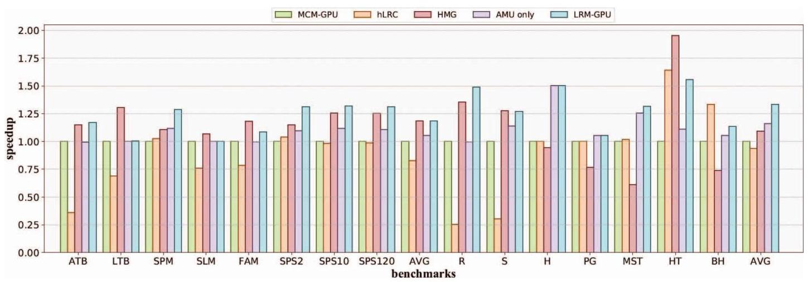

Fig. 9 是核心性能结果。对多种同步 microbenchmarks，LRM-GPU 平均提升 1.19x，说明它不只适用于单一锁模式；对需要 global synchronization 的主要 benchmarks，LRM-GPU 相比 MCM-GPU 平均加速 1.33x，其中 AMU only 单独贡献平均 1.16x。相比 state-of-the-art HMG，LRM-GPU 平均加速 1.22x。hLRC 在不少 benchmark 上表现较差，原因是它虽然减少了部分 invalidation，但同步变量跨 SM/跨 chiplet 迁移时需要远端写回并阻塞其他请求；HMG 在 HT 等 benchmark 上可表现很好，但在 MST、PG 等 atomic 密集程序中会因大量 write-invalidation 受损。

Fig. 10 对比 L1.5 invalidation 数量。LRM-GPU 相比 MCM-GPU 平均减少 30% 的 L1.5 invalidation；hLRC 减少 56%，但性能没有相应更好，因为同步变量写回和重试 traffic 抵消了 invalidation 数量优势。histogram 和 pagerank 主要依赖 atomic update，cache invalidation 基本只在 kernel 完成时发生，因此 hLRC/LRM-GPU 对 invalidation 数量帮助有限。

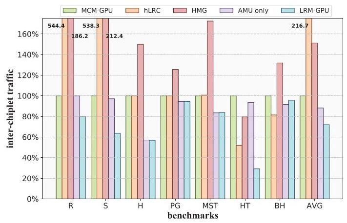

Fig. 11 说明 AMU 和 lazy release 的共同效果。LRM-GPU 相比 MCM-GPU 平均减少 28% inter-chiplet traffic，其中 AMU 贡献 12%；相比 HMG 平均减少 52%。这也解释了为什么 LRM-GPU 的性能收益不完全来自 invalidation 下降：跨 chiplet traffic 才是同步 atomic 密集场景中的另一个主要瓶颈。

Fig. 12 用无 global synchronization 的 workload 检查副作用，LRM-GPU 相比 MCM-GPU 平均性能差异只有 2%。这说明新增目录和 AMU 对普通程序基本透明，但也反过来说明该方案收益高度依赖同步密度。

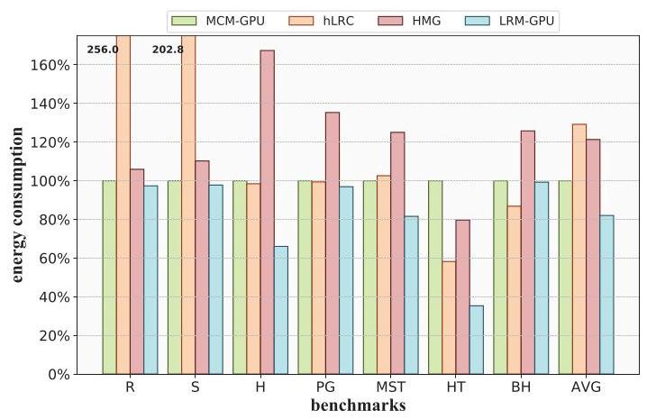

能耗方面，论文使用 AccelWattch 和 0.54 pJ/bit 的 inter-chiplet transmission energy 数据估算 cache system 与 network 动态能耗。LRM-GPU 相比 MCM-GPU 平均降低 18% energy，相比 HMG 降低 32%。Fig. 14 的 breakdown 显示 inter-chiplet/intra-chiplet network 是主要能耗来源，AMU 新增能耗只占 0.13%。

硬件开销方面，AMU merge table 用 Cadence Virtuoso 在 TSMC 40 nm 下定制，其他组件用 Verilog RTL 和 Synopsys Design Compiler 综合。AMU 总功耗为 301.44 mW，总面积 1.84 mm²；作者用 NVIDIA V100 作粗略参照，称其功耗约为 V100 300 W 的 0.1%，面积约为 V100 815 mm² 的 0.2%，但这个对比跨工艺节点，只能说明数量级不大，不能作为严格等效面积/功耗结论。同步变量目录每 entry 51 bits、64 entries，总容量约 0.4 KB，约为单个 L1 cache 容量的 0.3%。

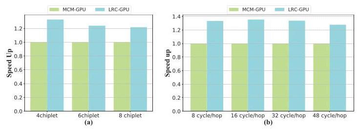

敏感性分析有两个结论。第一，chiplet 数从 4 增至 8 时，LRM-GPU 的 speedup 从 1.33x 降至 1.21x，因为 chiplet 更多会稀释同步变量的 chiplet locality，owner 更频繁跨 chiplet 转移。第二，inter-chiplet latency 从 8 到 32 cycles 时性能几乎不变，48 cycles 才小幅下降；作者认为 GPU 高并发和 warp switching 能隐藏 latency，因此该问题更 bandwidth-sensitive。

### 结论支撑性分析

实验整体能支撑论文的主要声明：Fig. 2 定位两个同步瓶颈，Fig. 9/10/11 分别验证性能、coherence action 和 traffic，Fig. 13/14/Table V 给出能耗面积开销，Fig. 15 说明适用边界。比较扎实的是作者没有只报告整体 speedup，而是通过 AMU only、invalidation count、traffic count 分解了两个组件的贡献。

主要局限有三点。第一，论文依赖扩展后的 GPGPU-Sim，缺少真实 multi-chiplet GPU 硬件验证，这是体系结构论文常见但仍需注意的限制。第二，AMU 的面积/功耗用 40 nm 实现，再与 12 nm V100 粗略对比，不能精确代表现代 GPU 工艺下的成本。第三，64-entry synchronization variable directory、2K-entry AMU merge table、countdown 等参数是否对更多应用稳健，论文虽有 chiplet scale 和 latency sensitivity，但对目录容量、merge window、SM list 长度等关键结构参数的消融不足。

## 六、附加洞察

**结论 1：更多 chiplet 不一定让同步优化收益继续增加，反而会削弱 LRM-GPU 的 locality 假设。**  
- *出处*：Section V.C / Fig. 15(a)  
- *推理链条*：LRM-GPU 依赖同一同步变量在相邻同步操作中继续留在同一 chiplet 的概率；chiplet 数从 4 增至 8 时，访问同一同步变量的请求更可能来自不同 chiplet，owner transfer 增多；因此需要执行的 flush/invalidate 更频繁，speedup 从 1.33x 降到 1.21x。这个结论提示 LRM-GPU 更适合 chiplet locality 仍较强的 MCM GPU，而不是任意规模线性扩展。

**结论 2：在该类 GPU 同步场景中，inter-chiplet bandwidth 比 latency 更关键。**  
- *出处*：Section V.C / Fig. 15(b)  
- *推理链条*：作者把 inter-chiplet latency 从 8 cycles 扫到 48 cycles，发现 8-32 cycles 性能基本稳定，48 cycles 才小幅下降；结合 GPU warp switching 和高并发可隐藏延迟的特性，说明同步 atomic traffic 的拥塞主要来自带宽和请求数量，而不是单次传输延迟。这也反向支持 AMU 通过减少请求数来优化 bandwidth pressure 的设计选择。

**结论 3：减少 invalidation 次数本身不保证性能提升，协议等待和重试 traffic 可能吞掉收益。**  
- *出处*：Section V.A / Fig. 10 与 Fig. 11  
- *推理链条*：hLRC 的 L1.5 invalidation 数量比 LRM-GPU 降得更多，平均减少 56%；但 hLRC 缓存同步变量，跨 SM/跨 chiplet 访问时要等待远端同步变量写回，期间其他请求失败并重发；这些等待和重试增加了 inter-chiplet traffic，导致性能反而较差。这个结论说明同步优化不能只看 coherence action 数量，还必须看请求阻塞路径。

**结论 4：LRM-GPU 对非同步密集程序几乎没有副作用，但这也限定了它的主要收益场景。**  
- *出处*：Section V.A / Fig. 12  
- *推理链条*：作者测试无 global synchronization 的 benchmarks，包括 VGG16 和 GPT-2，平均性能差异仅 2%；这说明 AMU 和目录不显著干扰普通执行路径。但由于这些 workload 基本不触发 LRM-GPU 的核心机制，收益也很小，方案价值主要集中在 explicit synchronization 或 atomic-heavy 应用。

## 七、总结与评价

LRM-GPU 的贡献在于把 multi-chiplet GPU 的同步开销拆成两个可操作的问题：acquire/release 的额外 L1.5 coherence action，以及跨 chiplet atomic 的带宽压力。它没有选择构建完整 coherence 协议，而是用 synchronization variable owner directory 做轻量追踪，再用 AMU 在网络中合并 atomic 请求，设计目标明确且与实验分解吻合。

论文最大的亮点是方案边界清晰：同步变量不进入本地 cache，目录只追踪同步变量 owner，AMU 只处理可安全合并的 cross-chiplet atomic。这使它比 HMG 这类完整 coherence 扩展更轻，也比只在 SM/warp 内优化 atomic 的工作更贴近 chiplet interconnect bottleneck。

不足主要在评估覆盖和参数敏感性。模拟器结果已经说明趋势，但缺少真实硬件或工业级模拟器验证；AMU 的现代工艺成本需要更严格估算；目录容量、merge table 大小、countdown policy、SM list 长度等参数对 workload 的影响没有充分展开。后续如果要把这个设计推向实际 GPU，需要更系统地处理这些微结构参数和 memory model 边界条件。

## 八、章节脉络与段落速览

- **Abstract**：概括 multi-chiplet GPU 同步开销的两个来源，以及 LRM-GPU 通过 lazy release consistency 和 AMU 带来的 1.33x/1.22x 加速、52% traffic 降低和 32% energy 降低。

- **Section I · INTRODUCTION**：从 GPU 扩展瓶颈引出 chiplet GPU，再说明同步语义在更深 cache hierarchy 和有限跨 chiplet 带宽下变成关键瓶颈。
  - ¶1 说明工艺扩展放缓和大 die 制造约束推动 GPU 走向 MCM/chiplet 架构。
  - ¶2 说明 GPU 通用化后需要高效共享数据同步，而同步必须同时保证 consistency 和 atomicity。
  - ¶3 介绍传统 GPU 的简单软件管理 coherence：acquire invalidate、release flush、atomic 到 LLC。
  - ¶4 指出 multi-chiplet GPU 为缓解 NUMA 加入额外 cache level，反而放大同步时的 cache 处理开销，并且 remote atomic 仍受 inter-chiplet bandwidth 限制。
  - ¶5 用 4-chiplet GPU 对比 monolithic GPU，量化 50.5% 总损失及其两个组成部分。
  - ¶6 讨论已有 multi-chiplet NUMA 优化和 HMG/CPElide 的不足，指出显式同步仍缺专门支持。
  - ¶7 提出核心 insight：同步行为有 chiplet locality，同步 atomic 请求有跨 SM/跨 chiplet 合并机会。
  - ¶8-10 列出三项贡献：lazy release directory、in-network atomic merge、扩展 GPGPU-Sim 并评估。

- **Section II · BACKGROUND AND MOTIVATION**：解释 multi-chiplet GPU 架构、同步挑战和已有同步方法为什么不能直接解决本文问题。
  - **A · Multi-Chiplet GPU Architecture**：说明 4-chiplet GPU 的 SM、L1、L1.5、LLC、memory partition 和地址路由结构。
    - ¶1 描述每个 chiplet 的 SM/L1、memory-side LLC、memory partition，以及 LLC bank 不需要相互 coherence 的原因。
    - ¶2 解释 MCM-GPU、CPElide 和 SM-side LLC 等额外 cache level 如何缓解普通 NUMA 访存。
    - ¶3 归纳 MCM-GPU、AdCoalescer、NearFetch 等主要关注普通 remote memory access。
    - ¶4 指出这些工作忽略 atomic synchronization 和同步行为带来的额外开销。
  - **B · Synchronization Challenges in Multi-Chiplet GPUs**：说明传统 GPU 同步协议在 deeper cache hierarchy 下成本上升。
    - ¶1 重申 GPU 常用 coarse-grained software-managed coherence 和 LLC atomic。
    - ¶2 用 acquire 例子说明 L1.5 可能持有 stale data，因此比 monolithic GPU 多一次更昂贵的 invalidate。
    - ¶3 说明同步 atomic 不被 L1/L1.5 缓存，跨 chiplet global atomic 会直接受限于 inter-chiplet bandwidth。
  - **C · To Alleviate the Synchronization Overhead**：回顾 DeNovo/hLRC、LAB/Atomic Cache/ARC、HMG/CPElide 等同步优化。
    - ¶1 引入 prior work 目标。
    - ¶2 说明 DeNovo/hLRC 和 atomic buffer/cache/reduction 类工作各自优化点及缺少 inter-SM/chiplet locality。
    - ¶3 说明 HMG 和 CPElide 在多 GPU/multi-chiplet 同步上的能力与局限。

- **Section III · PROPOSED METHODOLOGY**：给出 LRM-GPU 的两个机制：同步变量 owner directory 和 AMU。
  - **A · Overview**：概述 LRM-GPU 架构。
    - ¶1 引入 Fig. 4 的整体架构。
    - ¶2 说明 lazy release consistency 通过同步变量 owner 只在跨 chiplet owner transfer 时触发 coherence action。
    - ¶3 说明 AMU 在网络中识别并合并跨 chiplet atomicCAS/atomicAdd 等同步 atomic。
  - **B · Lazy Release Consistency on Multi-Chiplet GPU**：定义目录状态与 acquire/release 行为。
    - ¶1 说明 Table I 只关注 L1.5 coherence action，L1 行为沿用传统 GPU。
    - ¶2-5 分别描述 acquire 的 invalid、local chiplet、remote chiplet、evicted 四种情况。
    - ¶6 描述 release 的四种对应情况。
    - ¶7 用三 SM 竞争锁的例子设置 Fig. 5/Fig. 6 的执行顺序和假设。
    - ¶8 详细走读 SM0、SM1、SM2 的 acquire/release 如何触发或跳过 L1.5 action。
    - ¶9 对比 MCM-GPU 每次同步都清理 L1.5 与 LRM-GPU 只在 owner 跨 chiplet 变化时清理。
  - **C · In-Network Atomic Merging for Synchronization**：描述 AMU 微结构、工作流和支持的 atomic 类型。
    - ¶1 说明 AMU 每个 chiplet 一份，包含 merge table、instruction decoder、ALU、multicast unit。
    - ¶2 解释 merge table entry 的 status、opcode、address、SM list、data 字段以及 CAM/SRAM 多 bank 实现。
    - ¶3 描述 cross-chiplet atomic 进入 AMU 后的命中、分配、倒计时、发出、reserve、响应 multicast 流程。
    - ¶4 用 atomicadd(addr0/addr1) 的例子说明合并、reserve 和响应返回。
    - ¶5 说明 atomicadd 之外的 atomic 操作如何按 Table II 合并，尤其 atomicCAS 的约束。
    - ¶6 说明可按 cache-line 等粗粒度地址区域用 operation mask 合并不同 offset 的 atomic。

- **Section IV · EXPERIMENTAL SETUP**：说明模拟平台、baseline 配置和 workload。
  - **A · System Setup**：介绍扩展 GPGPU-Sim 和 BookSim 2.0 风格的 chiplet interconnection platform。
    - ¶1 说明模拟器扩展能统一建模 multi-chiplet system。
    - ¶2 列出 4 chiplets、256 SM、L1/L1.5/LLC、768 GB/s inter-chiplet bandwidth、3 TB/s DRAM bandwidth、first-touch page allocation、distributed CTA scheduling、64-entry directory 和 AMU 参数。
  - **B · Configurations**：定义对比对象。
    - ¶1 引出配置对比。
    - ¶2 说明 MCM-GPU baseline 的 L1.5、first-touch、distributed CTA scheduling 和传统同步处理。
    - ¶3 说明 hLRC 的同步变量多级 cache tracking 及其扩展到 multi-chiplet 后的写回阻塞。
    - ¶4 说明 HMG/NHCC 使用 SM-side LLC、write-through home node 和大规模 coherence directory。
  - **C · Workloads**：列出同步型与非同步型 workload。
    - ¶1 说明主要关注 global synchronization，同时测试无 global synchronization 程序以观察副作用，并说明 workload 对程序员透明。

- **Section V · EXPERIMENTAL RESULTS**：从性能、traffic、能耗面积和敏感性四个角度验证 LRM-GPU。
  - **A · Performance Evaluation**：评估 speedup、invalidation、traffic 和无同步 workload 副作用。
    - ¶1 报告 LRM-GPU 相比 MCM-GPU 1.33x、相比 HMG 1.22x，以及 hLRC/HMG 在不同 benchmark 上的失败原因。
    - ¶2 报告 LRM-GPU 平均减少 30% L1.5 invalidation，并解释 hLRC invalidation 更少但性能不佳的原因。
    - ¶3 报告 LRM-GPU 平均减少 28% inter-chiplet traffic、相比 HMG 减少 52%，并解释 hLRC/HMG traffic 增加来源。
    - ¶4 说明无 global synchronization workload 平均性能差异只有 2%。
  - **B · Energy and Area Evaluation**：评估动态能耗与 AMU/目录硬件开销。
    - ¶1 说明使用 AccelWattch 和 inter-chiplet bit energy 估算能耗，LRM-GPU 相比 MCM-GPU 降低 18%、相比 HMG 降低 32%。
    - ¶2 说明 network 是主要能耗项，AMU 只占 0.13%。
    - ¶3 说明 AMU 的 40 nm 实现流程。
    - ¶4 报告 AMU 301 mW、1.84 mm²，并与 V100 粗略对比。
    - ¶5 报告 64-entry synchronization variable directory 总容量约 0.4 KB。
  - **C · Sensitivity analyses**：评估 chiplet scale 和 inter-chiplet latency。
    - ¶1 引入两个敏感性实验。
    - ¶2 说明 chiplet 从 4 到 8 时 speedup 从 1.33x 降到 1.21x，原因是同步变量 locality 下降。
    - ¶3 说明 8-32 cycles latency 下性能基本不变，GPU 更敏感于 bandwidth 而不是 latency。

- **Section VI · RELATED WORK**：重新从 multi-chiplet GPU 和 GPU synchronization 两类定位 LRM-GPU。
  - ¶1 总结 MCM-GPU、Memory-centric MCM-GPU、AdCoalescer、NearFetch、SAC、MGvm、Barre Chord 等主要解决 NUMA、bandwidth 或 virtual memory 开销。
  - ¶2 总结 hLRC、ARC、LAB、DAB、Atomic Cache、HMG、CPElide，并强调 LRM-GPU 同时用轻量 directory 和 AMU 处理 explicit synchronization。

- **Section VII · CONCLUSION**：重申 LRM-GPU 的问题、机制和主要结果。
  - ¶1 总结 lazy release consistency、同步变量 owner tracking、AMU 合并、1.33x/1.22x speedup、52% traffic 降低、32% energy 降低和低硬件开销。

- **ACKNOWLEDGMENT / REFERENCES**：列出项目资助和 55 条参考文献，用于支撑 multi-chiplet GPU、GPU synchronization、atomic optimization、GPGPU-Sim/AccelWattch 等背景。
