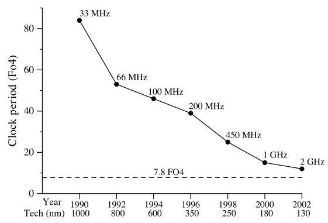
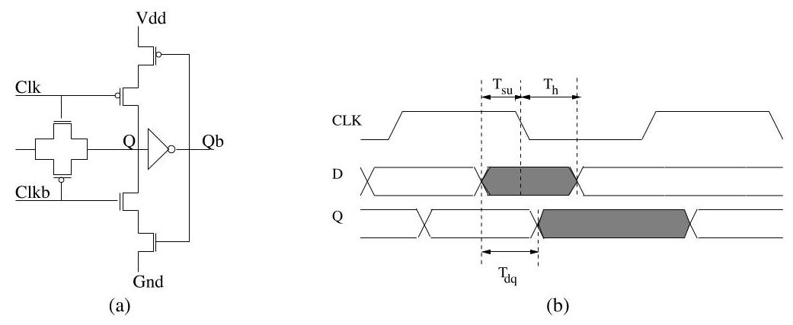
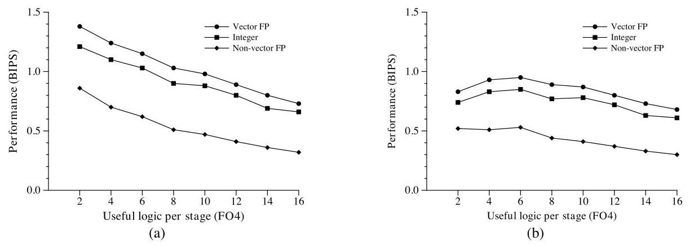
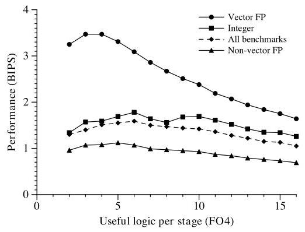
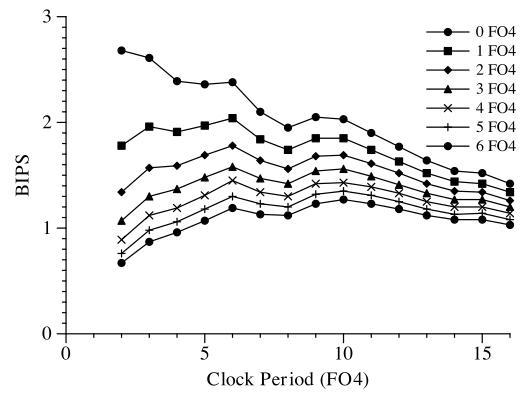
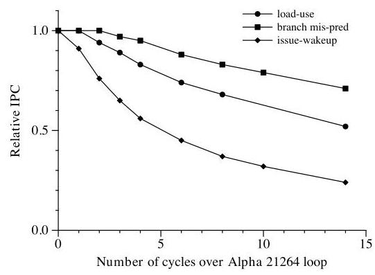
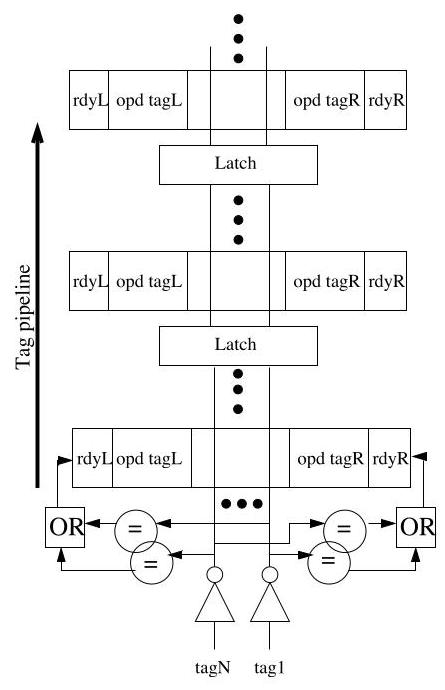
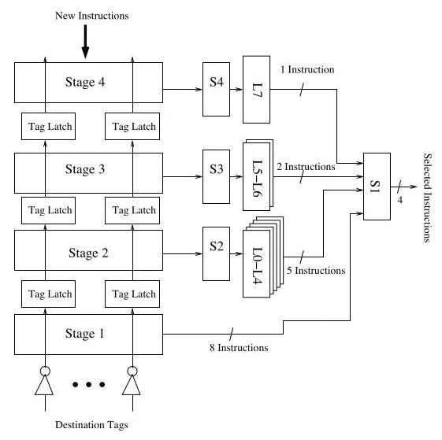

# The Optimal Logic Depth Per Pipeline Stage is 6 to 8 FO4 Inverter Delays 深度解读

> **作者**：M.S. Hrishikesh, Doug Burger, Norman P. Jouppi, Stephen W. Keckler, Keith I. Farkas, Premkishore Shivakumar  
> **会议/期刊**：ISCA 2002  
> **一句话总结**：这篇论文用 FO4 作为技术无关的时延尺度，说明高性能乱序处理器继续加深流水线的最优点大约在每级 6 FO4 有效逻辑、总周期约 7.8 FO4，超过这个深度后 IPC 损失和流水线开销会吞掉频率收益。

## 一、问题定义

这是一篇“在已有趋势上重新定界”的工作。2000 年前后的高性能微处理器主要靠两件事提高时钟频率：工艺缩小让晶体管更快，以及把流水线切得更细，让每一级做更少逻辑。作者关心的问题不是“深流水线是否能提高频率”，而是更具体的系统问题：**流水线还能继续切多深，直到性能收益达到最大？**

关键背景是 FO4（fan-out-of-four inverter delay）。FO4 用一个反相器驱动 4 个同类反相器的延迟来归一化电路速度，因此比皮秒或 GHz 更适合跨工艺比较。一个处理器周期可以拆成有效逻辑延迟和不可直接贡献工作的流水线开销：

$$
\phi = \phi_{\text{logic}} + \phi_{\text{latch}} + \phi_{\text{skew}} + \phi_{\text{jitter}}
$$

如果继续降低 $\phi_{\text{logic}}$，频率会上升，但分支错误代价、load-use latency、issue-wakeup loop 等都可能被拉长，IPC 会下降；同时 latch、clock skew、jitter 这些开销占周期比例更高。论文要找的就是 frequency 与 IPC 的乘积最大点。

Fig. 1 的价值在于把动机量化了：过去十多年时钟周期下降约 60 倍，其中工艺缩小约贡献 8 倍，逻辑级数从 84 FO4 降到 12 FO4 又贡献约 7 倍。虚线说明当时的商业处理器已经接近论文估算的最优区间，所以“继续靠切深流水线提频”的空间并不大。

**动机评估**：动机很 solid。作者不是凭直觉批评深流水线，而是把频率收益、流水线开销和 IPC 损失放进同一套 FO4 模型，并用 SPEC 2000 仿真验证。弱点是模型仍然偏理想化：Section 4 假设片上结构可以按任意级数完美流水化，wire delay 和更大规模微结构带来的长线问题主要放到结论里讨论。

**核心 Insight**：深流水线的最优点不是由工艺单独决定，而是由三类因素共同决定：每周期有效逻辑减少带来的频率收益、latch/skew/jitter 这类固定开销、以及 critical loop 变长造成的 IPC 损失。对整数程序，6 FO4 有效逻辑已经接近甜点；再切更细，频率提升不足以弥补 IPC 下降。

## 二、相关工作

论文主要沿着两条线组织相关工作。

第一条是最优流水线深度的历史工作。Kunkel 和 Smith 曾在 CRAY-1S 上研究类似问题，发现 scalar code 的最优点约为 8 个 ECL gate levels，vector code 约为 4 个 gate levels。作者在 Appendix A 把 CRAY-1S 的 ECL gate 等价到 CMOS FO4，得到 scalar 约 10.9 FO4、vector 约 5.4 FO4。本文的贡献是把这个问题带到现代 CMOS、片上 cache 和 superscalar/out-of-order pipeline 的环境下重新评估。

第二条是 instruction window 延迟优化。Palacharla 等人指出 wakeup/select 会成为 superscalar processor 的复杂度和周期瓶颈；Stark 等人提出 speculative wakeup，把指令在祖父节点发射时提前唤醒，但不能完全避免 IPC 损失；Brown 等人的 select-free scheduling 把选择逻辑移出关键路径，报告能把 IPC 控制在单周期 scheduling logic 的 3% 以内。本文的 segmented instruction window 属于同一方向，但设计目标更贴合本文主线：让 issue window 可以在高频深流水线中运行，同时尽量保留 dependent instructions back-to-back issue 的能力。

这些相关工作的不足在本文看来有两点：旧的最优流水线研究没有覆盖现代 VLSI 和片上 cache 带来的变化；已有 scheduling logic 优化通常解决局部结构延迟，但没有和“处理器全局最优 FO4 周期”放在同一套性能模型里。

## 三、技术挑战

1. **频率和 IPC 的折中不能只看电路周期**。如果只减少每级逻辑，频率可能上涨，但 branch misprediction penalty、DL1 load-use latency、issue-wakeup loop 都会用更多周期表达，最终降低 IPC。

2. **流水线开销在短周期下变得很重**。latch、clock skew、jitter 不产生有效计算。周期越短，它们占比越高。本文用 SPICE 估算 pulse latch overhead 为 36ps，即 100nm 下约 1 FO4；再加上 skew 0.3 FO4 和 jitter 0.5 FO4，总开销为 1.8 FO4。

3. **片上结构 latency 与 capacity 耦合**。cache、register file、rename table、issue window 的容量越大，访问延迟通常越高；但容量减小也可能降低命中率或并行度。作者必须在每个目标 clock period 下同时考虑结构大小和访问周期数。

4. **issue window 是高频乱序核心的关键瓶颈**。wakeup 需要广播 tag 并比较源操作数，select 需要从 ready instructions 中挑选可发射指令。朴素地把 issue window 切成多级会破坏依赖指令连续发射，论文引用的已有结果显示损失可高达 27%。

5. **结论要能跨工艺解释**。论文使用 100nm 参数，但目标是给未来工艺提供判断，所以必须使用 FO4 这类技术无关尺度，同时承认 effective gate length、wire delay 等因素会影响实际 GHz。

## 四、解决方案

### 整体思路

论文的解决方案分成两层。第一层是建模和仿真：用 FO4 分解 clock period，估算流水线开销，然后在 Alpha 21264-like pipeline 上扫描 $\phi_{\text{logic}}=2$ 到 16 FO4，比较性能。第二层是结构设计：在发现 issue-wakeup loop 对 IPC 最敏感后，提出 segmented instruction window，让 wakeup 和 select 能被流水化，同时尽量降低 IPC 损失。

### 贯穿示例

可以把一个 Alpha 21264-like 乱序核心想成每级原本有十几 FO4 的有效逻辑。设计者想把每级切到 6 FO4，频率大约提升，但代价是 DL1 cache、branch predictor、issue window 这些结构在周期数上变慢。例如 Table 3 中 $\phi_{\text{logic}}=6$ FO4 时，DL1 access 需要 6 cycles，branch predictor 4 cycles，issue window 3 cycles。此时如果所有依赖指令都要多等若干周期，IPC 会被压低。本文的策略就是：先证明全局最优点大约在 6 FO4，再专门处理最敏感的 issue-wakeup loop，让指令窗口能适配这个高频目标。

### 关键技术点

**1. 用 pulse latch 和 FO4 量化流水线开销。**作者用 SPICE 模拟 pulse latch，测量 setup/hold/propagation delay，在 100nm 下估计 latch overhead 为 36ps，约 1 FO4；结合 Pentium 4 相关研究给出的 skew 与 jitter，得到总 overhead 1.8 FO4。

Fig. 2/3 支撑了论文的第一个关键假设：短周期不是免费获得的，每一级流水线都要支付锁存与时钟相关开销。这个开销随后进入所有性能曲线的分母。

**2. 用 Alpha 21264-like simulator 扫描最优 $\phi_{\text{logic}}$。**作者使用 Desikan 等人的模拟器，低层特征和执行核心接近 Alpha 21264，并已验证到 Compaq DS-10L workstation 20% 以内。workload 是 SPEC 2000，跳过前 500M 指令，模拟接下来的 500M 指令。实验分别报告 integer、vector FP 和 non-vector FP。

Fig. 4 显示一个容易被忽略的事实：即便没有复杂乱序调度，频率翻倍也不会带来性能翻倍。$\phi_{\text{logic}}$ 从 8 降到 4 FO4 时，整数程序理想频率提升 100%，实际性能只提升 18%；考虑 1.8 FO4 overhead 后，从 10 降到 6 FO4 只换来约 9% 性能提升，虽然频率提升为 50%。

Fig. 5 是主结论的核心证据。乱序处理器整体性能高于顺序发射，但整数程序的最佳 $\phi_{\text{logic}}$ 仍为 6 FO4；vector FP 由于 ILP 更高，能承受更深流水线，最优点降到 4 FO4；non-vector FP 位于 5 FO4。

**3. 做敏感性分析，确认 6 FO4 不是某个参数偶然造成的。**作者把 $\phi_{\text{overhead}}$ 从 1 到 5 FO4 扫描，发现 integer benchmark 的最优 $\phi_{\text{logic}}$ 仍然停在 6 FO4。再对片上结构容量做优化，平均性能提高约 14%，但最大性能点仍是 6 FO4。

Fig. 6 的意义是削弱了“结论依赖 latch/skew/jitter 估计误差”的质疑。即使 overhead 假设变动很大，最优有效逻辑深度也没有明显移动。

**4. 找出最敏感的 critical loop。**作者分别拉长 branch misprediction、DL1 load-use、issue-wakeup 三个环路，观察 IPC 相对 Alpha 21264 baseline 的下降。结果显示 issue-wakeup loop 最敏感，其次是 load-use，branch misprediction 最弱。

Fig. 8 把后文 segmented instruction window 的必要性讲清楚了：如果不能让依赖指令尽可能 back-to-back issue，深流水线的全局最优点即使在模型上存在，实际微结构也很难达到。

**5. segmented instruction window。**wakeup 部分把 32-entry issue window 切成多个 stage，每个周期 tag 只广播到一个 stage，通过 stage 间 latch 逐级传播。这样单周期广播距离变短、可支持更高频率，但新产生的 tag 只能在当周期唤醒第一段中的 dependent instruction。

select 部分进一步降低 fan-in。论文评估一个 32-entry、4-stage 的窗口，S1 的 fan-in 为 16；S2/S3/S4 分别最多预选 5/2/1 条指令，下一周期由 S1 从第一段 ready instructions 和预选结果中选择 4 条发射。

这个设计的结果相当温和：只流水化 wakeup 到 10 stages 时，integer IPC 下降约 11%，FP 下降约 5%；采用论文给出的 4-stage wakeup/select 方案时，integer IPC 只比单周期 32-entry、select fan-in 32 的窗口低 4%，FP 低 1%。

### 与已有方案的对比

和 CRAY-1S 时代的最优流水线研究相比，本文的关键差异是现代片上 cache 和更低 overhead 使 integer workload 的最优 $\phi_{\text{logic}}$ 从约 10.9 FO4 降到 6 FO4，而 vector workload 基本保持在相近区间。和 Stark/Brown 的 instruction scheduling 优化相比，本文没有只追求某个局部电路更快，而是把 segmented window 放在“达到 6 FO4 全局最优周期”的上下文中评估。

不足也很清楚：Section 4 的全局扫描假设片上结构可以理想流水化；Section 5 的 segmented window 只评估 32-entry 和特定 fan-in 配置；wire delay、功耗和设计复杂度没有被完整纳入模型。

## 五、实验评估

### 实验设定

实验平台是修改后的 Alpha 21264-like simulator，基准包括 SPEC 2000 integer、vector FP、non-vector FP。每个 benchmark 跳过前 500M 指令，模拟后 500M 指令。工艺假设为 100nm，使用 FO4 做技术无关归一化；总流水线 overhead 设为 1.8 FO4。片上结构延迟用 CACTI 3.0 建模，结构容量默认匹配 Alpha 21264，之后也做容量优化实验。

baseline 与结构设定包括：4-wide integer issue、2-wide floating-point issue；L2 cache 为 2MB；integer 和 floating-point register file 增加到 512 entries，以免深流水线实验被寄存器数量过早限制。功能单元 fully pipelined，并假设结果可 bypass 到 Issue 和 Execute 之间任意 stage。

### 主要实验与结论

**最优流水线深度**：整数 benchmark 的最佳有效逻辑深度约为 6 FO4；加上 1.8 FO4 overhead，总 clock period 为 7.8 FO4，在 100nm 下对应约 3.6GHz。vector FP 的最佳 $\phi_{\text{logic}}$ 为 4 FO4，总周期 5.8 FO4，对应约 4.8GHz；non-vector FP 约为 5 FO4。

**in-order 与 out-of-order 一致性**：in-order pipeline 考虑 overhead 后最大点也在 6 FO4；out-of-order pipeline 虽然整体性能更高，整数最优点仍为 6 FO4。这说明结论不是乱序调度模型的特殊产物。

**和 CRAY-1S 的差异来源**：CRAY-1S scalar 等价最优点约 10.9 FO4。作者认为现代整数程序最优点下降主要来自两个变化：片上 cache 把原先 12-cycle memory bottleneck 降低了；现代单芯片 VLSI 的 latch/skew 等 overhead 更低，从 CRAY-1S 假设的约 3.4 FO4 降到 1.8 FO4。

**overhead 敏感性**：当 $\phi_{\text{overhead}}$ 在 1 到 5 FO4 之间变化时，integer benchmark 的最佳 $\phi_{\text{logic}}$ 仍是 6 FO4。这说明主结论对 overhead 估计相对稳健。

**结构容量优化**：在每个目标频率下选择更优结构容量后，平均性能提高约 14%，但最大性能点仍在 6 FO4。一个例子是 $\phi_{\text{logic}}=6$ FO4 时，较优配置包括 64KB L1 data cache、6-cycle access，512KB L2 cache、12-cycle access，以及 64-entry instruction window、3-cycle latency。

**critical loop**：IPC 对 issue-wakeup loop 的长度最敏感，其次是 load-use，branch misprediction penalty 相对较弱。这直接支撑了 Section 5 对 issue window 的重点优化。

**segmented instruction window**：只看 wakeup pipeline，32-entry window 从 1 stage 增加到 10 stages 时，integer IPC 下降约 11%，FP 下降约 5%；加入 4-stage partitioned select 后，integer IPC 只下降 4%，FP 下降 1%。这表明 issue window 可以以较小 IPC 代价支持更高频率。

### 结论支撑性分析

实验对“6 FO4 左右是整数程序甜点”支撑较强：它覆盖了顺序/乱序核心、overhead 敏感性、结构容量优化和 critical loop 分解。最薄弱的地方是工程实现成本没有完全闭环。比如更深流水线带来的功耗、verification complexity、wire delay、layout 约束，都没有像 IPC 一样被量化进目标函数。因此论文更像是给微结构设计者划出一个上限区间，而不是给出可直接落地的完整处理器设计。

## 六、附加洞察

**结论 1：整数程序最优点从 CRAY-1S 时代前移，主要不是因为整数程序本身“更容易流水化”。**  
*出处*：Section 4.2 / Appendix A。  
*推理链条*：作者把 CRAY-1S ECL gate level 换算为 1.36 FO4 -> scalar 最优点约 10.9 FO4 -> 现代 Alpha 21264-like pipeline 中整数最优点为 6 FO4 -> 进一步用无 cache、12-cycle memory 模拟重现约 11 FO4 的最优点 -> 因此关键变化是片上 cache 和低开销 VLSI，而不是 workload 性质单独变化。

**结论 2：优化片上结构容量能提高绝对性能，但不改变最优 FO4 区间。**  
*出处*：Section 4.5 / Figure 7。  
*推理链条*：未来高频下 Alpha 21264 原结构容量未必最优 -> 作者分别测 IPC 对容量和 latency 的敏感性 -> 在各频率点选择较优结构 -> 平均性能提高约 14% -> 但最优 $\phi_{\text{logic}}$ 仍为 6 FO4 -> 因此 6 FO4 更像是架构级折中点，而非某个固定结构配置的偶然结果。

**结论 3：issue window 的可流水化程度决定深流水线是否能兑现。**  
*出处*：Section 4.6 / Figure 8 / Section 5。  
*推理链条*：拉长 critical loop 的独立实验显示 issue-wakeup 对 IPC 最敏感 -> 朴素 pipelining 会阻断 dependent instructions 连续发射 -> segmented window 通过局部 tag broadcast 和分层 select 降低电路路径 -> 4-stage 具体设计只造成 integer 4%、FP 1% 的 IPC 损失 -> 所以高频设计的关键不只是全局流水线级数，而是 dependent wakeup/select 的局部组织方式。

**结论 4：继续靠深流水线提高频率的剩余空间有限。**  
*出处*：Abstract / Section 7。  
*推理链条*：当前设计已经接近最佳 FO4 周期 -> 论文估计进一步 pipelining 对整数程序最多带来约 2 倍性能空间 -> 之后 clock rate 增长大致只能跟随 feature size scaling，即约 12-20%/year -> 若要维持历史上约 55%/year 的性能增长，需要 ILP/TLP 等 concurrency 每年增加约 33%，并在 15 年内达到总计约 50 IPC 的量级。

## 七、总结与评价

这篇论文最大的贡献是把“深流水线是否还值得继续”从趋势判断变成了一个可量化的 FO4-IPC 折中问题。它给出的 6 FO4 有效逻辑、7.8 FO4 总周期并不是一个单点神秘数字，而是来自 overhead、critical loop 和 SPEC 2000 workload 的交叉约束。

亮点在于论证链条完整：先量化 latch/skew/jitter，再做全局 pipeline sweep，随后定位 issue-wakeup loop，并给出 segmented instruction window 作为可行微结构方向。最大不足是工程现实仍被简化，尤其是 wire delay、功耗和复杂度没有进入同一个优化目标。放到后来处理器发展看，这篇论文对“频率墙”和“单纯加深流水线不可持续”的判断非常有前瞻性。

## 八、章节脉络与段落速览

- **Abstract**：给出主结论，整数程序最优总周期约 8 FO4，FP 约 6 FO4，并指出 issue window 会成为高频设计瓶颈。

- **Section 1 · Introduction**：建立问题背景和论文路线。
  - ¶1：说明过去性能增长来自 IPC 和频率，本文关注继续减少每级逻辑还能带来多少收益。
  - ¶2：用 Intel x86 历史数据说明工艺缩小和逻辑级数减少曾大致各贡献一半频率提升。
  - ¶3：指出更深流水线会降低 IPC，并让 latch/skew/jitter overhead 占比上升。
  - ¶4：回顾 Kunkel 和 Smith 的 CRAY-1S 最优流水线研究，为现代重评估铺垫。
  - ¶5：用 FO4 定义跨工艺度量方式。
  - ¶6：概括本文两部分贡献：找到现代 superscalar pipeline 的最优 FO4，并提出 segmented instruction window。
  - ¶7：说明全文结构。

- **Section 2 · Estimating Overhead**：量化流水线开销。
  - ¶1：给出 clock period 分解公式。
  - ¶2：解释 latch overhead 的来源，以及选择 level-sensitive pulse latch 的原因。
  - ¶3：描述 pulse latch 的采样和保持机制。
  - ¶4：说明 SPICE 测量 setup/hold/D-Q delay 的方法，并得到 100nm 下 1 FO4 latch overhead。
  - ¶5：引入 clock skew 和 jitter，合计得到 1.8 FO4 overhead。

- **Section 3 · Methodology**：说明仿真平台和如何扫描流水线深度。
  - ¶1：说明使用类似 Alpha 21264 的 superscalar 架构，并改变不同 pipeline 部分的深度。
  - **3.1 Simulation Framework**：描述模拟器、cache/register file 配置、SPEC 2000 benchmark 分类和每个程序的模拟区间。
  - **3.2 Microarchitectural Structures**：用 CACTI 3.0 估计 cache、register file、branch predictor、rename table、issue window 的访问时间。
  - **3.3 Scaling Pipelines**：把 $\phi_{\text{logic}}$ 从 2 到 16 FO4 扫描，并把结构访问时间换算成对应周期数。

- **Section 4 · Pipelined Architectures**：给出核心实验结果。
  - ¶1：说明先研究 in-order pipeline，再研究 dynamically scheduled processor，并在本节做理想化流水化假设。
  - **4.1 In-order Issue Processors**：无 overhead 时加深流水线收益递减；有 1.8 FO4 overhead 后，最大性能在 6 FO4。
  - **4.2 Comparison with the CRAY-1S**：把 CRAY-1S 的 gate level 换算为 FO4，解释现代整数最优点前移来自片上 cache 和更低 overhead。
  - **4.3 Dynamically Scheduled Processors**：乱序核心中整数最优仍为 6 FO4，vector FP 为 4 FO4，non-vector FP 为 5 FO4。
  - **4.4 Sensitivity of $\phi_{\text{logic}}$ to $\phi_{\text{overhead}}$**：overhead 在 1-5 FO4 范围变化时，整数最优点仍是 6 FO4。
  - **4.5 Sensitivity of $\phi_{\text{logic}}$ to Structure Capacity**：优化结构容量平均提升约 14%，但不改变 6 FO4 最优点。
  - **4.6 Effect of Pipelining on IPC**：分解 critical loop，说明 issue-wakeup 对 IPC 最敏感。

- **Section 5 · A Segmented Instruction Window Design**：提出并评估 issue window 的高频设计。
  - ¶1：指出朴素流水化 issue window 会破坏依赖指令连续发射。
  - ¶2：解释传统 instruction window 的 wakeup/select 流程。
  - **5.1 Pipelining Instruction Wakeup**：把 window 分 stage，让 tag 逐 stage 广播；10-stage wakeup 对 integer/FP 的 IPC 损失约 11%/5%。
  - **5.2 Pipelining Instruction Select**：用 preselection + selection 降低 select fan-in；4-stage 设计使 integer/FP IPC 只下降 4%/1%。

- **Section 6 · Related Work**：比较两类 instruction scheduling 优化。
  - ¶1：Stark 等人的 speculative wakeup 能提高频率，但牺牲一些 IPC。
  - ¶2：Brown 等人的 select-free scheduling 把 select 移出关键路径，IPC 接近单周期 scheduling logic。

- **Section 7 · Conclusion**：收束结论和限制。
  - ¶1：重申整数最优 6 FO4、总周期 7.8 FO4，对应 100nm 下约 3.6GHz；vector FP 对应约 4.8GHz。
  - ¶2：指出 issue window 是关键瓶颈，segmented design 能用较小 IPC 损失支持高频。
  - ¶3：说明 FO4 让结论可跨工艺迁移，但实际 GHz 仍受工艺细节影响。
  - ¶4：承认本文未完整考虑慢 wire 和复杂设计带来的长线问题。
  - ¶5：给出更宏观判断：深流水线最多再贡献约 2 倍，未来性能增长必须更多来自 concurrency。

- **Acknowledgments / References**：列出资助与引用文献。

- **Appendix A · ECL gate equivalent in FO4**：解释 CRAY-1S 的一个 ECL gate equivalent 约为 1.36 FO4，用于 Section 4.2 的历史对比。
