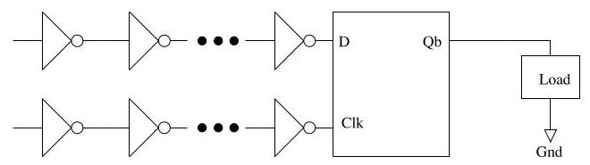
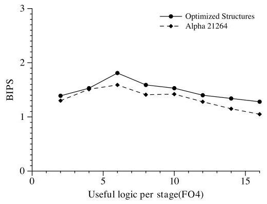
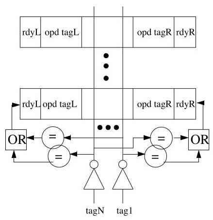
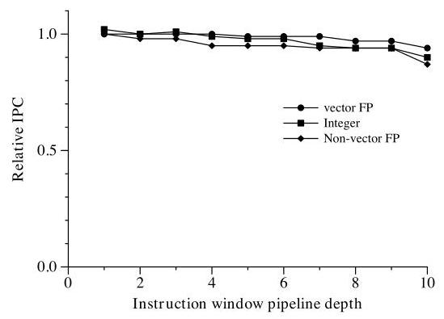
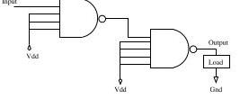

# The Optimal Logic Depth Per Pipeline Stage is 6 to 8 FO4 Inverter Delays

M.S. Hrishikesh*

> 
M.S. Hrishikesh*

Doug Burger†

> 
道格·伯格†

Norman P. Jouppi ${}^{ + }$

> 
Norman P. Jouppi ${}^{ + }$

Stephen W. Keckler†

> 
Stephen W. Keckler†

Keith I. Farkas+

> 
本文研究了高性能微处理器中每流水线级的最优逻辑深度，旨在确定进一步流水线化能在多大程度上提升性能。通过模拟一款与 Alpha 21264 类似、采用 100nm 工艺的超标量架构，本研究对时钟频率与每周期指令数（instructions per cycle, IPC）之间的权衡进行了建模，其中考虑了锁存器、时钟偏差和抖动开销，总计 1.8 个 FO4 延迟。

关键发现是，对于整数基准测试程序，当每级逻辑深度为 6 FO4 时性能达到最优，对应的最优时钟周期为 7.8 FO4。对于浮点基准测试程序，最优逻辑深度为 4–5 FO4。研究表明，该最优点对开销变化不敏感。研究还指出，指令发射窗口是限制时钟频率提升的关键结构，并提出了一种分段式指令窗口设计。该设计通过将窗口划分为多个阶段，对唤醒和选择逻辑进行流水线化，从而在扩展到 10 级时，仅导致整数基准测试程序 IPC 下降 11%、浮点基准测试程序下降 5%，即可实现高频运行。

主要结论是，进一步流水线化最多只能将整数程序的性能在当前设计基础上提升一倍。超过这一限度后，时钟频率的提升将受限于工艺缩放的速度，因此必须转向利用更高的并发度，才能维持历史性的性能增长。

Premkishore Shivakumar†

> 
Premkishore Shivakumar†

*Department of Electrical and Computer Engineering

> 
*电气与计算机工程系 (Department of Electrical and Computer Engineering)

${}^{ \dagger  }$ Department of Computer Sciences

> 
${}^{ \dagger  }$ 计算机科学系 (Department of Computer Sciences)

本文研究了高性能微处理器每级流水线阶段 (pipeline stage) 的最优逻辑深度 (logic depth)，旨在确定进一步流水线化 (pipelining) 能在多大程度上提升性能。基于对一款在 100nm 工艺下、类似 Alpha 21264 的超标量架构 (superscalar architecture) 的模拟，该研究对时钟频率 (clock frequency) 与每周期指令数 (instructions per cycle, IPC) 之间的权衡进行了建模，并计入了总计 1.8 个扇出4延迟 (FO4 delays) 的锁存器 (latch)、时钟偏差 (clock skew) 和抖动 (jitter) 开销。

关键发现是，对于整数基准测试 (integer benchmarks)，每级逻辑深度为 6 个 FO4 时可获得最高性能，对应的最优时钟周期 (clock period) 为 7.8 个 FO4。对于浮点基准测试 (floating-point benchmarks)，最优逻辑深度为 4-5 个 FO4。研究表明，这一最优点对开销的变化不敏感。该研究还指出，指令发射窗口 (instruction issue window) 是限制时钟频率扩展 (clock scaling) 的关键结构，并提出了一种分段式指令窗口 (segmented instruction window) 设计。该设计通过将窗口划分为多个阶段，对唤醒 (wakeup) 和选择 (select) 逻辑进行流水线化，从而在扩展到 10 级时，仅导致整数基准测试的 IPC 下降 11%，浮点基准测试的 IPC 下降 5%，即可实现高频操作。

主要结论是，与当前设计相比，进一步流水线化最多只能将整数程序的性能提升两倍。在此之后，时钟频率的提升将受限于工艺缩放 (technology scaling) 的速度，因此必须转向利用更高的并发性 (concurrency)，才能维持历史性的性能增长。

The University of Texas at Austin

> 
德克萨斯大学奥斯汀分校 (The University of Texas at Austin)

http://www.cs.utexas.edu/users/cart

> 
http://www.cs.utexas.edu/users/cart

+Western Research Lab

> 
+西部研究实验室 (Western Research Lab)

Compaq Computer Corporation

> 
康柏电脑公司 (Compaq Computer Corporation)

http://research.compaqa.com/wrl/

> 
（未提供需要翻译的文本）

## Abstract

Microprocessor clock frequency has improved by nearly 40% annually over the past decade. This improvement has been provided, in equal measure, by smaller technologies and deeper pipelines. From our study of the SPEC 2000 benchmarks, we find that for a high-performance architecture implemented in ${100}\mathrm{\;{nm}}$ technology, the optimal clock period is approximately 8 fan-out-of-four (FO4) inverter delays for integer benchmarks, comprised of 6 FO4 of useful work and an overhead of about 2 FO4. The optimal clock period for floating-point benchmarks is 6FO4. We find these optimal points to be insensitive to latch and clock skew overheads. Our study indicates that further pipelining can at best improve performance of integer programs by a factor of 2 over current designs. At these high clock frequencies it will be difficult to design the instruction issue window to operate in a single cycle. Consequently, we propose and evaluate a high-frequency design called a segmented instruction window.

> 
微处理器（microprocessor）的时钟频率在过去十年间以每年近40%的速度提升。这一提升同样得益于更小的工艺技术和更深的流水线（pipeline）。通过对SPEC 2000基准测试的研究，我们发现，对于采用${100}\mathrm{\;{nm}}$工艺实现的高性能架构，整数基准测试（integer benchmarks）的最优时钟周期约为8个扇出四（fan-out-of-four, FO4）反相器延迟，其中包含6 FO4的有效工作量和约2 FO4的开销。浮点基准测试（floating-point benchmarks）的最优时钟周期为6 FO4。我们发现这些最优点对锁存器（latch）和时钟偏差（clock skew）开销不敏感。我们的研究表明，进一步加深流水线最多只能将整数程序的性能在当前设计基础上提升2倍。在如此高的时钟频率下，将指令发射窗口（instruction issue window）设计为单周期操作将十分困难。因此，我们提出并评估了一种称为分段指令窗口（segmented instruction window）的高频设计。

## 1 Introduction

Improvements in microprocessor performance have been sustained by increases in both instruction per cycle (IPC) and clock frequency. In recent years, increases in clock frequency have provided the bulk of the performance improvement. These increases have come from both technology scaling (faster gates) and deeper pipelining of designs (fewer gates per cycle). In this paper, we examine for how much further reducing the amount of logic per pipeline stage can improve performance. The results of this study have significant implications for performance scaling in the coming decade.

> 
微处理器性能的提升一直得益于每周期指令数（instructions per cycle, IPC）和时钟频率的双重增长。近年来，时钟频率的提升贡献了绝大部分的性能增益。这些提升既源于工艺缩放（technology scaling）带来的更快门电路，也来自设计上更深度的流水线化（deeper pipelining），即每周期处理更少的门电路。本文旨在探讨进一步减少每级流水线的逻辑深度还能在多大程度上提升性能。这项研究的结果对未来十年的性能扩展具有重要启示。

Figure 1 shows the clock periods of the Intel family of x86 processors on the y-axis. The x-axis shows the year of introduction and the feature size used to fabricate each processor. We computed the clock period by dividing the nominal frequency of the processor by the delay of one FO4 at the corresponding technology ${}^{1}$ . The graph shows that clock frequency has increased by approximately a factor of 60 over the past twelve years. During this period process technology has been scaled from 1000nm to ${130}\mathrm{\;{nm}}$ , contributing an 8- fold improvement in clock frequency. The amount of logic per pipeline stage decreased from 84 to 12 FO4, contributing to the increase in clock frequency by a factor of 7 . So far, both technology scaling and reduction in logic per stage have contributed roughly equally to improvements in clock frequency.

> 
图1在y轴上显示了Intel x86处理器系列的时钟周期 (clock period)。x轴显示了推出年份和用于制造每个处理器的特征尺寸 (feature size)。我们通过将处理器的标称频率除以相应技术下单个扇出4 (FO4) 的延迟来计算时钟周期 ${}^{1}$ 。该图显示，在过去十二年中，时钟频率提高了约60倍。在此期间，工艺技术 (process technology) 已从1000nm缩小到 ${130}\mathrm{\;{nm}}$ ，为时钟频率带来了8倍的提升。每流水线阶段 (pipeline stage) 的逻辑量从84个FO4减少到12个FO4，为时钟频率带来了7倍的提升。到目前为止，技术缩放 (technology scaling) 和每阶段逻辑量的减少对时钟频率的提升贡献大致相当。

Figure 1: The year of introduction, clock frequency and fabrication technologies of the last seven generations of Intel processors. Logic levels are measured in fan-out-of-four delays (FO4). The broken line shows the optimal clock period for integer codes.

> 
图1：最近七代英特尔处理器的推出年份、时钟频率和制造工艺。逻辑级数以四扇出延迟 (fan-out-of-four delays, FO4) 衡量。虚线显示了整数代码的最佳时钟周期。

However, decreasing the amount of logic per pipeline stage increases pipeline depth, which in turn reduces IPC due to increased branch misprediction penalties and functional unit latencies. In addition, reducing the amount of logic per pipeline stage reduces the amount of useful work per cycle while not affecting overheads associated with latches, clock skew and jitter. Therefore, shorter pipeline stages cause the overhead to become a greater fraction of the clock period, which reduces the effective frequency gains.

> 
然而，减少每个流水线阶段 (pipeline stage) 的逻辑量会增加流水线深度 (pipeline depth)，这反过来会由于分支预测错误惩罚 (branch misprediction penalties) 和功能单元延迟 (functional unit latencies) 的增加而降低每周期指令数 (IPC)。此外，减少每个流水线阶段的逻辑量会减少每个周期完成的有用工作量，同时不影响与锁存器 (latches)、时钟偏差 (clock skew) 和抖动 (jitter) 相关的开销。因此，更短的流水线阶段导致开销占时钟周期 (clock period) 的比例更大，从而降低了有效频率提升 (effective frequency gains)。

Processor designs must balance clock frequency and IPC to achieve ideal performance. Previously, Kunkel and Smith examined this trade-off [9] by investigating the pipelining of a CRAY 1-S supercomputer to determine the number of levels of logic per pipeline stage that provides maximum performance. They assumed the use of Earle latches between stages of the pipeline, which were representative of high-performance latches of that time. They concluded that, in the absence of latch and skew overheads, absolute performance increases as the pipeline is made deeper. But when the overhead is taken into account, performance increases up to a point beyond which increases in pipeline depth reduce performance. They found that maximum performance was obtained with 8 gate levels per stage for scalar code and with 4 gate levels per stage for vector code, which, using the equivalence we develop in Appendix A, is approximately 10.9 and 5.4 FO4 respectively.

> 
处理器设计必须平衡时钟频率 (clock frequency) 与每周期指令数 (IPC) 以实现理想性能。此前，Kunkel 和 Smith 通过研究 CRAY 1-S 超级计算机的流水线化，考察了这一权衡 [9]，旨在确定每流水线级提供最大性能的逻辑级数。他们假设流水线各级之间使用厄尔锁存器 (Earle latches)，这代表了当时的高性能锁存器。他们得出结论：在没有锁存器和时钟偏差开销的情况下，绝对性能会随着流水线深度的增加而提升。但若将开销考虑在内，性能会提升至某一点，超过该点后，流水线深度的进一步增加反而会降低性能。他们发现，标量代码在每级 8 个门级时获得最大性能，向量代码在每级 4 个门级时获得最大性能，根据我们在附录 A 中推导的等价关系，这分别约等于 10.9 和 5.4 个扇出4延迟 (FO4)。

---

${}^{1}$ We measure the amount of logic per pipeline stage in terms of fan-out-of-four (FO4) - the delay of one inverter driving four copies of itself. Delays measured in FO4 are technology independent. The data points in Figure 1 were computed assuming that 1 FO4 roughly corresponds to 360 picoseconds times the transistor's drawn gate length in microns [6].

> 
${}^{1}$ 我们以四扇出 (fan-out-of-four, FO4) 来衡量每个流水线级的逻辑量——即一个反相器驱动自身四个副本的延迟。以 FO4 度量的延迟与工艺无关。图 1 中的数据点是在假设 1 FO4 大致对应于 360 皮秒乘以晶体管的绘制栅极长度（以微米为单位）[6] 的条件下计算得出的。

---

Figure 2: Circuit and timing diagrams of a basic pulse latch. The shaded area in Figure 2b indicates that the signal is valid.

> 
图2：基本脉冲锁存器 (pulse latch) 的电路和时序图。图2b中的阴影区域表示信号有效。

In the first part of this paper, we re-examine Kunkel and Smith's work in a modern context to determine the optimal clock frequency for current-generation processors. Our study investigates a superscalar pipeline designed using CMOS transistors and VLSI technology, and assumes low-overhead pulse latches between pipeline stages. We show that maximum performance for integer benchmarks is achieved when the logic depth per pipeline stage corresponds to 7.8 FO4-6 FO4 of useful work and 1.8 FO4 of overhead. The dashed line in Figure 1 represents this optimal clock period. Note that the clock periods of current-generation processors already approach the optimal clock period. In the second portion of this paper, we identify a microarchitectural structure that will limit the scal-ability of the clock and propose methods to pipeline it at high frequencies. We propose a new design for the instruction issue window that divides it into sections. We show that although this method reduces the IPC of integer benchmarks by 11% and that of floating-point benchmarks by 5%, it allows significantly higher clock frequencies.

> 
在本文的第一部分，我们在现代语境下重新审视了Kunkel和Smith的工作，以确定当前一代处理器的最优时钟频率。我们的研究考察了一种采用CMOS晶体管和VLSI技术设计的超标量流水线（superscalar pipeline），并假设流水线级之间使用低开销的脉冲锁存器（pulse latches）。我们表明，当每级流水线的逻辑深度对应7.8 FO4（其中6 FO4为有效工作，1.8 FO4为开销）时，整数基准测试程序可获得最高性能。图1中的虚线代表了这一最优时钟周期。请注意，当前一代处理器的时钟周期已接近该最优值。在本文的第二部分，我们识别出一种将限制时钟可扩展性（scalability）的微体系结构单元，并提出了在高频率下对其进行流水线化的方法。我们为指令发射窗口（instruction issue window）提出了一种将其划分为多个区段的新设计。我们表明，尽管该方法会使整数基准测试程序的每周期指令数（IPC）降低11%，浮点基准测试程序的IPC降低5%，但它能支持显著更高的时钟频率。

The remainder of this paper is organized in the following fashion. To determine the ideal clock frequency we first quantify latch overhead and present a detailed description of this methodology in Section 2. Section 3 describes the methodology to find the ideal clock frequency, which entails experiments with varied pipeline depths. We present the results of this study in Section 4. We examine specific microarchitec-tural structures in Section 5 and propose new designs that can be clocked at high frequencies. Section 6 discusses related work, and Section 7 summarizes our results and presents the conclusions of this study.

> 
本文的其余部分按以下方式组织。为确定理想时钟频率，我们首先量化锁存器开销，并在第2节中详细描述该方法。第3节阐述了寻找理想时钟频率的方法，这涉及对不同流水线深度的实验。我们在第4节中呈现了这项研究的结果。第5节考察了特定的微体系结构（microarchitectural structures），并提出了可在高频下运行的新设计。第6节讨论了相关工作，第7节总结了我们的结果并给出了本研究的结论。

## 2 Estimating Overhead

The clock period of the processor is determined by the following equation

> 
处理器的时钟周期由以下公式决定

$$
\phi  = {\phi }_{\text{ logic }} + {\phi }_{\text{ latch }} + {\phi }_{\text{ skew }} + {\phi }_{\text{ jitter }} \tag{1}
$$

> 
$$
\phi  = {\phi }_{\text{ logic }} + {\phi }_{\text{ latch }} + {\phi }_{\text{ skew }} + {\phi }_{\text{ jitter }} \tag{1}
$$

where $\phi$ is the clock period, ${\phi }_{\text{ logic }}$ is useful work performed by logic circuits, ${\phi }_{\text{ latch }}$ is latch overhead, ${\phi }_{\text{ skew }}$ is clock skew overhead and ${\phi }_{\text{ jitter }}$ is clock jitter overhead. In this section, we describe our methodology for estimating the overhead components, and the resulting values.

> 
其中 $\phi$ 为时钟周期 (clock period)，${\phi }_{\text{ logic }}$ 为逻辑电路执行的有效工作 (useful work)，${\phi }_{\text{ latch }}$ 为锁存器开销 (latch overhead)，${\phi }_{\text{ skew }}$ 为时钟偏差开销 (clock skew overhead)，${\phi }_{\text{ jitter }}$ 为时钟抖动开销 (clock jitter overhead)。在本节中，我们将阐述估算这些开销分量的方法及其所得结果。

A pipelined machine requires data and control signals at each stage to be saved at the end of every cycle. In the subsequent clock cycle this stored information is used by the following stage. Therefore, a portion of each clock period, called latch overhead, is required by latches to sample and hold values. Latches may be either edge triggered or level sensitive. Edge-triggered latches reduce the possibility of race through, enabling simple pipeline designs, but typically incur higher latch overheads. Conversely, level-sensitive latches allow for design optimizations such as "slack-passing" and "time borrowing" [2], techniques that allow a slow stage in the pipeline to meet cycle time requirements by borrowing unused time from a neighboring, faster stage. In this paper we model a level-sensitive pulse latch, since it has low overhead and power consumption [4]. We use SPICE circuit simulations to quantify the latch overhead.

> 
流水线机器要求每个阶段的数据和控制信号在每个周期结束时被保存。在随后的时钟周期中，这些存储的信息被下一阶段使用。因此，每个时钟周期中有一部分时间，称为锁存器开销 (latch overhead)，被锁存器用于采样和保持数值。锁存器可以是边沿触发 (edge triggered) 或电平敏感 (level sensitive) 的。边沿触发锁存器降低了穿透 (race through) 的可能性，使流水线设计更简单，但通常会产生更高的锁存器开销。相反，电平敏感锁存器允许设计优化，如“松弛传递 (slack-passing)”和“时间借用 (time borrowing)”[2]，这些技术允许流水线中的慢速阶段通过借用相邻较快阶段未使用的时间来满足周期时间要求。在本文中，我们建模了一种电平敏感脉冲锁存器，因为它具有低开销和低功耗 [4]。我们使用 SPICE 电路仿真来量化锁存器开销。

Figure 2a shows the circuit for a pulse latch consisting of a transmission gate followed by an inverter and a feed-back path. Data values are sampled and held by the latch as follows. During the period that the clock pulse is high, the transmission gate of the latch is on, and the output of the latch (Q) takes the same value as the input (D). When the clock signal changes to low, the transmission gate is turned off. However, the transistors along one of the two feedback paths turn on, completing the feedback loop. The inverter and the feedback loop retain the sampled data value until the following clock cycle.

> 
图2a展示了一个脉冲锁存器 (pulse latch) 的电路，它由一个传输门 (transmission gate)、一个反相器 (inverter) 和一条反馈路径 (feed-back path) 组成。该锁存器按如下方式对数据值进行采样和保持。在时钟脉冲 (clock pulse) 为高电平期间，锁存器的传输门导通，锁存器的输出 (Q) 与输入 (D) 取值相同。当时钟信号变为低电平时，传输门关闭。然而，两条反馈路径之一上的晶体管会导通，从而闭合反馈回路。反相器和反馈回路将采样到的数据值保持到下一个时钟周期到来。

The operation of a latch is governed by three parameters - setup time $\left( {T}_{su}\right)$ , hold time $\left( {T}_{h}\right)$ , and propagation delay $\left( {T}_{dq}\right)$ , as shown in Figure 2b. To determine latch overhead, we measured its parameters using the test circuit shown in Figure 3. The test circuit consists of a pulse latch with its output driving another similar pulse latch whose transmission gate is turned on. On-chip data and clock signals may travel through a number of gates before they terminate at a latch. To simulate the same effect, we buffer the clock and data inputs to the latch by a series of six inverters. The clock signal has a 50% duty cycle while the data signal is a simple step function. We simulated transistors at ${100}\mathrm{\;{nm}}$ technology and performed experiments similar to those by Stojanović et al. [14], using the same P-transistor to N-transistor ratios. In our experiments, we moved the data signal progressively closer to the falling edge of the clock signal. Eventually when D changes very close to the falling edge of the Clk signal the latch fails to hold the correct value of D. Latch overhead is the smallest of the D-Q delays before this point of failure [14]. We estimated latch overhead to be 36ps (1 FO4) at ${100}\mathrm{\;{nm}}$ technology. Since this delay is determined by the switching speed of transistors, which is expected to scale linearly with technology, its value in FO4 will remain constant at all technologies. Note that throughout this paper transistor feature sizes refer to the drawn gate length as opposed to the effective gate length.

> 
锁存器的操作由三个参数决定——建立时间 $\left( {T}_{su}\right)$、保持时间 $\left( {T}_{h}\right)$ 和传播延迟 $\left( {T}_{dq}\right)$，如图2b所示。为确定锁存器开销，我们使用图3所示的测试电路测量了其参数。该测试电路由一个脉冲锁存器组成，其输出驱动另一个传输门导通的类似脉冲锁存器。片上数据和时钟信号在到达锁存器之前可能经过多个门电路。为模拟相同效果，我们通过六个反相器串联对锁存器的时钟和数据输入进行缓冲。时钟信号具有50%的占空比，而数据信号是一个简单的阶跃函数。我们在 ${100}\mathrm{\;{nm}}$ 工艺下对晶体管进行了仿真，并执行了与Stojanović等人[14]类似的实验，采用相同的P型晶体管与N型晶体管比例。在实验中，我们将数据信号逐步移近时钟信号的下降沿。最终，当D的变化非常接近Clk信号的下降沿时，锁存器无法保持D的正确值。锁存器开销是此失效点之前最小的D-Q延迟[14]。我们估计在 ${100}\mathrm{\;{nm}}$ 工艺下，锁存器开销为36ps（1 FO4）。由于该延迟由晶体管的开关速度决定，而开关速度预计随工艺线性缩放，因此其以FO4表示的值在所有工艺下将保持不变。注意，本文中晶体管特征尺寸均指绘制栅极长度，而非有效栅极长度。

Figure 3: Simulation setup to find latch overhead. The clock and data signals are buffered by a series of six inverters and the output drives a similar latch with its transmission gate turned on.

> 
图3：用于确定锁存器开销 (latch overhead) 的仿真设置。时钟和数据信号由六个反相器 (inverter) 组成的串联进行缓冲，输出驱动一个类似的锁存器，其传输门 (transmission gate) 导通。

In addition to latch overhead, clock skew and jitter also add to the total overhead of a clock period. A recent study by Kurd et al. [10] showed that, by partitioning the chip into multiple clock domains, clock skew can be reduced to less than 20ps and jitter to 35ps. They performed their studies at 180nm, which translates into 0.3 FO4 due to skew and 0.5 FO4 due to jitter. Many components of clock skew and jitter are dependent on the speed of the components, and those that are dependent on the transistor components should scale with technology. However, other terms, such as delay due to process variation, may scale differently, hence affecting the overall scalability. For simplicity we assume that clock skew and jitter will scale linearly with technology and therefore their values in FO4 will remain constant. Table 1 shows the values of the different overheads that we use to determine the clock frequency in Section 4. The sum of latch, clock skew and jitter overhead is equal to 1.8 FO4. We refer to this sum in the rest of the paper as ${\phi }_{\text{ overhead }}$ .

> 
除了锁存器开销（latch overhead）之外，时钟偏斜（clock skew）和抖动（jitter）也会增加时钟周期的总开销。Kurd 等人[10]最近的一项研究表明，通过将芯片划分为多个时钟域，时钟偏斜可以降低到 20ps 以下，抖动可以降低到 35ps。他们的研究是在 180nm 工艺下进行的，这相当于偏斜引起的 0.3 FO4 和抖动引起的 0.5 FO4。时钟偏斜和抖动的许多分量取决于组件的速度，而那些依赖于晶体管组件的分量应随工艺缩放。然而，其他项，例如由工艺变化引起的延迟，可能以不同方式缩放，从而影响整体可扩展性。为简单起见，我们假设时钟偏斜和抖动将随工艺线性缩放，因此它们的 FO4 值将保持不变。表 1 显示了我们在第 4 节中用于确定时钟频率的不同开销值。锁存器、时钟偏斜和抖动开销的总和等于 1.8 FO4。在本文的其余部分，我们将此总和称为 ${\phi }_{\text{ overhead }}$。

## 3 Methodology

To study the effect of deeper pipelining on performance, we varied the pipeline depth of a modern superscalar architecture similar to the Alpha 21264. This section describes our simulation framework and the methodology we used to perform this study.

> 
为了研究更深度的流水线化（deeper pipelining）对性能的影响，我们改变了一个类似于 Alpha 21264 的现代超标量架构（superscalar architecture）的流水线深度。本节描述了我们的仿真框架（simulation framework）以及我们用于进行这项研究的方法（methodology）。

<table><tr><td>Symbol</td><td>Definition</td><td>Overhead</td></tr><tr><td>${\phi }_{latch}$</td><td>Latch Overhead</td><td>1.0 FO4</td></tr><tr><td>${\phi }_{skew}$</td><td>Skew Overhead</td><td>0.3 FO4</td></tr><tr><td>${\phi }_{\text{ jitter }}$</td><td>Jitter Overhead</td><td>0.5 FO4</td></tr><tr><td>foverhead</td><td>Total</td><td>1.8 FO4</td></tr></table>

Table 1: Overheads due to latch, clock skew and jitter.

> 
表1：锁存器、时钟偏差和抖动引起的开销（Overheads due to latch, clock skew and jitter）

<table><tr><td>Integer</td><td>Vector FP</td><td>Non-vector FP</td></tr><tr><td>164.gzip</td><td>171.swim</td><td>177.mesa</td></tr><tr><td>175.vpr</td><td>172.mgrid</td><td>178.galgel</td></tr><tr><td>176.gcc</td><td>173.applu</td><td>179.art</td></tr><tr><td>181.mcf</td><td>183.equake</td><td>188.amm</td></tr><tr><td>197.parser</td><td></td><td>189.lucas</td></tr><tr><td>252.eon</td><td></td><td></td></tr><tr><td>253.perlbmk</td><td></td><td></td></tr><tr><td>256.bzip2</td><td></td><td></td></tr><tr><td>300.twolf</td><td></td><td></td></tr></table>

Table 2: SPEC 2000 benchmarks used in all simulation experiments. The benchmarks are further classified into vector and nonvector benchmarks.

> 
表2：所有模拟实验中使用的SPEC 2000基准测试程序 (benchmarks)。这些基准测试程序进一步分为向量 (vector) 和非向量 (nonvector) 基准测试程序。

### 3.1 Simulation Framework

We used a simulator developed by Desikan et al. that models both the low-level features of the Alpha 21264 processor [3] and the execution core in detail. This simulator has been validated to be within an accuracy of ${20}\%$ of a Compaq DS-10L workstation. For our experiments, the base latency and capacities of on-chip structures matched those of the Alpha 21264, and the level-2 cache was configured to be 2MB. The capacities of the integer and floating-point register files alone were increased to 512 each, so that the performance of deep pipelines was not unduly constrained due to unavailability of registers. We modified the execution core of the simulator to permit the addition of more stages to different parts of the pipeline. The modifications allowed us to vary the pipeline depth of different parts of the processor pipeline, including the execution stage, the register read stage, the issue stage, and the commit stage.

> 
我们使用了由Desikan等人开发的模拟器，该模拟器既对Alpha 21264处理器[3]的低级特性进行了建模，也详细模拟了执行核心。该模拟器经验证，其精度在Compaq DS-10L工作站的${20}\%$以内。在我们的实验中，片上结构的基本延迟和容量与Alpha 21264相匹配，二级缓存配置为2MB。仅整数和浮点寄存器文件的容量分别增加到512个，这样深流水线的性能就不会因寄存器不足而受到不当限制。我们修改了模拟器的执行核心，允许在流水线的不同部分增加更多阶段。这些修改使我们能够改变处理器流水线不同部分的流水线深度，包括执行阶段、寄存器读取阶段、发射阶段和提交阶段。

Table 2 lists the benchmarks that we simulated for our experiments, which include integer and floating-point benchmarks taken from the SPEC 2000 suite. Some of the floating-point (FP) benchmarks operate on large matrices and exhibit strong vector-like behavior; we classify these benchmarks as vector floating-point benchmarks. When presenting simulation results, we show individual results for integer, vector FP, and non-vector FP benchmarks separately. All experiments skip the first 500 million instructions of each benchmark and simulate the next 500 million instructions.

> 
表2列出了我们为实验模拟的基准测试程序（benchmarks），其中包括取自SPEC 2000套件（SPEC 2000 suite）的整数和浮点基准测试程序。部分浮点（FP）基准测试程序处理大型矩阵，并表现出强烈的类似向量的行为；我们将这些基准测试程序归类为向量浮点基准测试程序。在展示模拟结果时，我们分别呈现整数、向量浮点和非向量浮点基准测试程序的单独结果。所有实验均跳过每个基准测试程序的前5亿条指令，并模拟接下来的5亿条指令。

<table><tr><td rowspan="2">${\phi }_{\text{ logic }}\left( \mathrm{{FO4}}\right)$</td><td rowspan="2">DL1</td><td rowspan="2">Branch Predictor</td><td rowspan="2">Rename Table</td><td rowspan="2">Issue Window</td><td rowspan="2">Register File</td><td colspan="2">Integer</td><td colspan="4">FLoating Point</td></tr><tr><td>Add</td><td>Mult</td><td>Add</td><td>Div</td><td>Sqrt</td><td>Mult</td></tr><tr><td>2</td><td>16</td><td>10</td><td>9</td><td>9</td><td>6</td><td>9</td><td>61</td><td>35</td><td>105</td><td>157</td><td>35</td></tr><tr><td>3</td><td>11</td><td>7</td><td>6</td><td>6</td><td>4</td><td>6</td><td>41</td><td>24</td><td>70</td><td>105</td><td>24</td></tr><tr><td>4</td><td>9</td><td>5</td><td>5</td><td>5</td><td>3</td><td>5</td><td>31</td><td>18</td><td>53</td><td>79</td><td>18</td></tr><tr><td>5</td><td>7</td><td>4</td><td>4</td><td>4</td><td>3</td><td>4</td><td>25</td><td>14</td><td>42</td><td>63</td><td>14</td></tr><tr><td>6</td><td>6</td><td>4</td><td>3</td><td>3</td><td>2</td><td>3</td><td>21</td><td>12</td><td>35</td><td>53</td><td>12</td></tr><tr><td>7</td><td>6</td><td>3</td><td>3</td><td>3</td><td>2</td><td>3</td><td>18</td><td>10</td><td>30</td><td>45</td><td>10</td></tr><tr><td>8</td><td>5</td><td>3</td><td>3</td><td>3</td><td>2</td><td>3</td><td>16</td><td>9</td><td>27</td><td>40</td><td>9</td></tr><tr><td>9</td><td>5</td><td>3</td><td>2</td><td>2</td><td>2</td><td>2</td><td>14</td><td>8</td><td>24</td><td>35</td><td>8</td></tr><tr><td>10</td><td>4</td><td>2</td><td>2</td><td>2</td><td>2</td><td>2</td><td>13</td><td>7</td><td>21</td><td>32</td><td>7</td></tr><tr><td>11</td><td>4</td><td>2</td><td>2</td><td>2</td><td>1</td><td>2</td><td>12</td><td>7</td><td>19</td><td>29</td><td>7</td></tr><tr><td>12</td><td>4</td><td>2</td><td>2</td><td>2</td><td>1</td><td>2</td><td>11</td><td>6</td><td>18</td><td>27</td><td>6</td></tr><tr><td>13</td><td>4</td><td>2</td><td>2</td><td>2</td><td>1</td><td>2</td><td>10</td><td>6</td><td>17</td><td>25</td><td>6</td></tr><tr><td>14</td><td>4</td><td>2</td><td>2</td><td>2</td><td>1</td><td>2</td><td>9</td><td>5</td><td>15</td><td>23</td><td>5</td></tr><tr><td>15</td><td>3</td><td>2</td><td>2</td><td>2</td><td>1</td><td>2</td><td>9</td><td>5</td><td>14</td><td>21</td><td>5</td></tr><tr><td>16</td><td>3</td><td>2</td><td>2</td><td>2</td><td>1</td><td>2</td><td>8</td><td>5</td><td>14</td><td>20</td><td>5</td></tr><tr><td>Alpha 21264 (17.4)</td><td>3</td><td>1</td><td>1</td><td>1</td><td>1</td><td>1</td><td>7</td><td>4</td><td>12</td><td>18</td><td>4</td></tr></table>

Table 3: Access latencies (clock cycles) of microarchitectural structures and integer and floating-point operations at ${100}\mathrm{\;{nm}}$ technology (drawn gate length). The functional units are fully pipelined and new instructions can be assigned to them every cycle. The last row shows the latency of on-chip structures on the Alpha 21264 processor (180nm).

> 
表3：在 ${100}\mathrm{\;{nm}}$ 工艺（绘制栅极长度）下，微架构结构以及整数和浮点运算的访问延迟（时钟周期）。功能单元完全流水线化，每个周期都可以向它们分配新指令。最后一行显示了 Alpha 21264 处理器（180nm）上片上结构的延迟。

### 3.2 Microarchitectural Structures

We use Cacti 3.0 [12] to model on-chip microarchitectural structures and to estimate their access times. Cacti is an analytical tool originally developed by Jouppi and Wilton [7]. All major microarchitectural structures-data cache, register file, branch predictor, register rename table and instruction issue window-were modeled at ${100}\mathrm{\;{nm}}$ technology and their capacities and configurations were chosen to match the corresponding structures in the Alpha 21264. We use the latencies of the structures obtained from Cacti to compute their access penalties (in cycles) at different clock frequencies.

> 
我们使用 Cacti 3.0 [12] 对片上微体系结构（microarchitectural structures）进行建模，并估算其访问时间（access times）。Cacti 是由 Jouppi 和 Wilton [7] 最初开发的分析工具。所有主要的微体系结构——数据缓存（data cache）、寄存器文件（register file）、分支预测器（branch predictor）、寄存器重命名表（register rename table）和指令发射窗口（instruction issue window）——均在 ${100}\mathrm{\;{nm}}$ 工艺下建模，其容量和配置选择与 Alpha 21264 中的相应结构匹配。我们使用从 Cacti 获得的结构延迟来计算它们在不同时钟频率下的访问惩罚（access penalties，以周期计）。

### 3.3 Scaling Pipelines

We find the clock frequency that will provide maximum performance by simulating processor pipelines clocked at different frequencies. The clock period of the processor is determined by the following equation: $\phi  = {\phi }_{\text{ logic }} + {\phi }_{\text{ overhead }}$ . The overhead term is held constant at 1.8 FO4, as discussed in Section 2. We vary the clock frequency $\left( {1/\phi }\right)$ by varying ${\phi }_{\text{ logic }}$ from 2 FO4 to 16 FO4. The number of pipeline stages (clock cycles) required to access an on-chip structure, at each clock frequency, is determined by dividing the access time of the structure by the corresponding ${\phi }_{\text{ logic }}$ . For example, if the access time of the level-1 cache at 100nm technology is 0.28ns (8 FO4), for a pipeline where ${\phi }_{\text{ logic }}$ equals $2\mathrm{{FO}}4\left( {{0.07}\mathrm{{ns}}}\right)$ , the cache can be accessed in 4 cycles.

> 
我们通过模拟在不同频率下运行的处理器流水线，来寻找能提供最高性能的时钟频率。处理器的时钟周期由以下公式决定：$\phi  = {\phi }_{\text{ logic }} + {\phi }_{\text{ overhead }}$ 。如第2节所述，开销项保持恒定为1.8 FO4。我们通过将 ${\phi }_{\text{ logic }}$ 从2 FO4变化到16 FO4，来改变时钟频率 $\left( {1/\phi }\right)$ 。在每个时钟频率下，访问片上结构所需的流水线级数（时钟周期数），由该结构的访问时间除以对应的 ${\phi }_{\text{ logic }}$ 来确定。例如，若在100nm工艺下一级缓存（level-1 cache）的访问时间为0.28ns（8 FO4），对于 ${\phi }_{\text{ logic }}$ 等于 $2\mathrm{{FO}}4\left( {{0.07}\mathrm{{ns}}}\right)$ 的流水线，该缓存可在4个周期内完成访问。

Though we use a ${100}\mathrm{\;{nm}}$ technology in this study, the access latencies at other technologies in terms of the FO4 metric will remain largely unchanged at each corresponding clock frequency, since delays measured in this metric are technology independent. Table 3 shows the access latencies of structures at each ${\phi }_{\text{ logic }}$ . These access latencies were determined by dividing the structure latencies (in pico seconds) obtained from the cacti model by the corresponding clock period. Table 3 also shows the latencies for various integer and floating-point operations at different clocks. To compute these latencies we determined ${\phi }_{\text{ logic }}$ for the Alpha 21264 processor (800MHz, 180nm) by attributing 10% of its clock period to latch overhead (approximately 1.8 FO4). Using this ${\phi }_{\text{ logic }}$ and the functional unit execution times of the Alpha 21264 (in cycles) we computed the execution latencies at various clock frequencies. In all our simulations, we assumed that results produced by the functional units can be fully bypassed to any stage between Issue and Execute.

> 
尽管本研究采用 ${100}\mathrm{\;{nm}}$ 工艺，但在其他工艺下，以 FO4 度量（FO4 metric）表示的访问延迟在各自对应的时钟频率下将基本保持不变，因为用该度量衡量的延迟与工艺无关。表 3 展示了各 ${\phi }_{\text{ logic }}$ 下结构的访问延迟。这些访问延迟是通过将 cacti 模型得到的结构延迟（以皮秒为单位）除以相应的时钟周期得出的。表 3 还显示了不同时钟下各种整数和浮点操作的延迟。为计算这些延迟，我们通过将 Alpha 21264 处理器（800MHz，180nm）时钟周期的 10% 归为锁存器开销（约 1.8 FO4），确定了其 ${\phi }_{\text{ logic }}$。利用该 ${\phi }_{\text{ logic }}$ 和 Alpha 21264 功能单元的执行时间（以周期计），我们计算了不同时钟频率下的执行延迟。在所有模拟中，我们假设功能单元产生的结果可以完全旁路（bypassed）到发射（Issue）与执行（Execute）之间的任何阶段。

In general, the access latencies of the structures increase as ${\phi }_{\text{ logic }}$ is decreased. In certain cases the access latency remains unchanged despite a change in ${\phi }_{\text{ logic }}$ . For example, the access latency of the register file is 0.39ns at ${100}\mathrm{\;{nm}}$ technology. If ${\phi }_{\text{ logic }}$ was ${10}\mathrm{{FO}}4$ the access latency of the register file would be approximately 1.1 cycles. Conversely, if ${\phi }_{\text{ logic }}$ was reduced to 6 FO4, the access latency would be 1.8 clock cycles. In both cases the access latency is rounded to 2 cycles.

> 
一般来说，结构的访问延迟（access latencies）随着 ${\phi }_{\text{ logic }}$ 的减小而增加。在某些情况下，尽管 ${\phi }_{\text{ logic }}$ 发生变化，访问延迟仍保持不变。例如，在 ${100}\mathrm{\;{nm}}$ 工艺下，寄存器文件（register file）的访问延迟为 0.39ns。如果 ${\phi }_{\text{ logic }}$ 为 ${10}\mathrm{{FO}}4$，寄存器文件的访问延迟大约为 1.1 个时钟周期。相反，如果 ${\phi }_{\text{ logic }}$ 减小到 6 FO4，访问延迟将为 1.8 个时钟周期。在这两种情况下，访问延迟都被取整为 2 个时钟周期。

By varying the processor pipeline as described above, we determine how deeply a high-performance design can be pipelined before overheads, due to latch, clock skew and jitter, and reduction in IPC, due to increased on-chip structure access latencies, begin to reduce performance.

> 
通过如上所述改变处理器流水线，我们确定了高性能设计在流水线深度达到何种程度之前，由于锁存器（latch）、时钟偏差（clock skew）和抖动（jitter）带来的开销，以及由于片上结构访问延迟增加导致的每周期指令数（IPC）下降，会开始降低性能。

## 4 Pipelined Architectures

In this section, we first vary the pipeline depth of an in-order issue processor to determine its optimal clock frequency. This in-order pipeline is similar to the Alpha 21264 pipeline except that it issues instructions in-order. It has seven stages - fetch, decode, issue, register read, execute, write back and commit. The issue stage of the processor is capable of issuing up to four instructions in each cycle. The execution stage consists of four integer units and two floating-point units. All functional units are fully pipelined, so new instructions can be assigned to them at every clock cycle. We compare our results, from scaling the in-order issue processor, with the CRAY 1-S machine [9]. Our goal is to determine if either workloads or processor design technologies have changed the amount of useful logic per pipeline stage $\left( {\phi }_{\text{ logic }}\right)$ that provides the best performance. We then perform similar experiments to find ${\phi }_{\text{ logic }}$ that will provide maximum performance for a dynamically scheduled processor similar to the Alpha 21264. For our experiments in Section 4, we make the optimistic assumption that all microar-chitectural components can be perfectly pipelined and be partitioned into an arbitrary number of stages.

> 
在本节中，我们首先改变顺序发射处理器 (in-order issue processor) 的流水线深度 (pipeline depth)，以确定其最佳时钟频率 (clock frequency)。该顺序流水线类似于 Alpha 21264 流水线，区别在于它按顺序发射指令。它包含七个阶段——取指 (fetch)、译码 (decode)、发射 (issue)、寄存器读取 (register read)、执行 (execute)、写回 (write back) 和提交 (commit)。处理器的发射阶段每个周期最多可发射四条指令。执行阶段包含四个整数单元和两个浮点单元。所有功能单元均完全流水化，因此每个时钟周期都可以为其分配新指令。我们将缩放顺序发射处理器得到的结果与 CRAY 1-S 机器 [9] 进行比较。我们的目标是确定工作负载或处理器设计技术是否改变了每个流水线阶段提供最佳性能的有效逻辑量 $\left( {\phi }_{\text{ logic }}\right)$。然后，我们进行类似实验，为类似于 Alpha 21264 的动态调度处理器 (dynamically scheduled processor) 寻找能提供最大性能的 ${\phi }_{\text{ logic }}$。对于第 4 节中的实验，我们做出乐观假设，即所有微体系结构 (microarchitectural) 组件都可以被完美地流水化，并被划分为任意数量的阶段。

Figure 4: In-order pipeline performance with and without latch overhead. Figure 4a shows that when there is no latch overhead performance improves as pipeline depth is increased. When latch and clock overheads are considered, maximum performance is obtained with 6 FO4 useful logic per stage $\left( {\phi }_{\text{ logic }}\right)$ , as shown in Figure 4b.

> 
图4：有锁存器开销和无锁存器开销时的顺序流水线性能。图4a显示，当没有锁存器开销时，性能随着流水线深度的增加而提升。当考虑锁存器和时钟开销时，如图4b所示，每级6 FO4有效逻辑 $\left( {\phi }_{\text{ logic }}\right)$ 可获得最大性能。

### 4.1 In-order Issue Processors

Figure 4a shows the harmonic mean of the performance of SPEC 2000 benchmarks for an in-order pipeline, if there were no overheads associated with pipelining $\left( {{\phi }_{\text{ overhead }} = 0}\right)$ and performance was inhibited by only the data and control dependencies in the benchmark. The x-axis in Figure 4a represents ${\phi }_{\text{ logic }}$ and the y-axis shows performance in billions of instructions per second (BIPS). Performance was computed as a product of IPC and the clock frequency-equal to $1/{\phi }_{\text{ logic }}$ . The integer benchmarks have a lower overall performance compared to the vector floating-point (FP) benchmarks. The vector FP benchmarks are representative of scientific code that operate on large matrices and have more ILP than the integer benchmarks. Therefore, even though the execution core has just two floating-point units, the vector benchmarks out perform the integer benchmarks. The non-vector FP benchmarks represent scientific workloads of a different nature, such as numerical analysis and molecular dynamics. They have less ILP than the vector benchmarks, and consequently their performance is lower than both the integer and floating-point benchmarks. For all three sets of benchmarks, doubling the clock frequency does not double the performance. When ${\phi }_{\text{ logic }}$ is reduced from 8 to 4 FO4, the ideal improvement in performance is 100%. However, for the integer benchmarks the improvement is only ${18}\%$ . As ${\phi }_{\text{ logic }}$ is further decreased, the improvement in performance deviates further from the ideal value.

> 
图 4a 展示了在顺序流水线 (in-order pipeline) 中，如果不存在与流水线相关的开销 $\left( {{\phi }_{\text{ overhead }} = 0}\right)$，且性能仅受基准测试中的数据依赖和控制依赖 (data and control dependencies) 所抑制时，SPEC 2000 基准测试性能的调和平均值 (harmonic mean)。图 4a 的 x 轴表示 ${\phi }_{\text{ logic }}$，y 轴显示以每秒十亿条指令 (BIPS) 为单位的性能。性能计算为每周期指令数 (IPC) 与时钟频率的乘积——时钟频率等于 $1/{\phi }_{\text{ logic }}$。与向量浮点 (FP) 基准测试相比，整数基准测试的整体性能较低。向量浮点基准测试代表了在大矩阵上运行的科学计算代码，并且比整数基准测试具有更多的指令级并行性 (ILP)。因此，即使执行核心只有两个浮点单元，向量基准测试的性能也优于整数基准测试。非向量浮点基准测试代表了不同性质的科学工作负载，例如数值分析和分子动力学。它们的指令级并行性低于向量基准测试，因此其性能低于整数和浮点基准测试。对于所有三组基准测试，将时钟频率加倍并不会使性能翻倍。当 ${\phi }_{\text{ logic }}$ 从 8 FO4 减少到 4 FO4 时，理想的性能提升为 100%。然而，对于整数基准测试，提升仅为 ${18}\%$。随着 ${\phi }_{\text{ logic }}$ 进一步减小，性能提升与理想值的偏差会进一步加大。

Figure 4b shows performance of the in-order pipeline with ${\phi }_{\text{ overhead }}$ set to 1.8 FO4. Unlike in Figure 4a, in this graph the clock frequency is determined by $1/\left( {{\phi }_{\text{ logic }} + {\phi }_{\text{ overhead }}}\right)$ . For example, at the point in the graph where ${\phi }_{\text{ logic }}$ is equal to 8 FO4, the clock frequency is 1/(10 FO4). Observe that maximum performance is obtained when ${\phi }_{\text{ logic }}$ corresponds to 6 FO4. In this experiment, when ${\phi }_{\text{ logic }}$ is reduced from 10 to 6 FO4 the improvement in performance is only about 9% compared to a clock frequency improvement of ${50}\%$ .

> 
图4b展示了将 ${\phi }_{\text{ overhead }}$ 设为1.8 FO4时顺序流水线 (in-order pipeline) 的性能。与图4a不同，此图中时钟频率 (clock frequency) 由 $1/\left( {{\phi }_{\text{ logic }} + {\phi }_{\text{ overhead }}}\right)$ 决定。例如，在图中 ${\phi }_{\text{ logic }}$ 等于8 FO4的点，时钟频率为1/(10 FO4)。可以观察到，当 ${\phi }_{\text{ logic }}$ 对应6 FO4时获得最大性能。在本实验中，当 ${\phi }_{\text{ logic }}$ 从10 FO4降至6 FO4时，性能提升仅约9%，而时钟频率提升为50%。

### 4.2 Comparison with the CRAY-1S

Kunkel and Smith [9] observed for the Cray-1S that maximum performance can be achieved with 8 gate levels of useful logic per stage for scalar benchmarks and 4 gate levels for vector benchmarks. If the Cray-1S were to be designed in CMOS logic today, the equivalent latency of one logic level would be about 1.36 FO4, as derived in Appendix A. For the Cray- 1S computer this equivalent would place the optimal ${\phi }_{\text{ logic }}$ at 10.9 FO4 for scalar and 5.4 FO4 for vector benchmarks. The optimal ${\phi }_{\text{ logic }}$ for vector benchmarks has remained more or less unchanged, largely because the vector benchmarks have ample ILP, which is exploited sufficiently well by both the in-order superscalar pipeline and the Cray-1S. The optimal ${\phi }_{\text{ logic }}$ for integer benchmarks has more than halved since the time of the Cray-1S processor, which means that a processor designed using modern techniques can be clocked at more than twice the frequency.

> 
Kunkel 和 Smith [9] 针对 Cray-1S 观察到，对于标量基准测试，每级 8 个门级的有用逻辑可实现最高性能，而对于向量基准测试则为 4 个门级。如果今天用 CMOS 逻辑来设计 Cray-1S，根据附录 A 的推导，一个逻辑级的等效延迟约为 1.36 FO4。对于 Cray-1S 计算机，这一等效值将使标量基准测试的最优 ${\phi }_{\text{ logic }}$ 为 10.9 FO4，向量基准测试为 5.4 FO4。向量基准测试的最优 ${\phi }_{\text{ logic }}$ 基本保持不变，这主要是因为向量基准测试具有充足的指令级并行 (ILP)，而顺序超标量流水线和 Cray-1S 都能充分挖掘这种并行性。自 Cray-1S 处理器时代以来，整数基准测试的最优 ${\phi }_{\text{ logic }}$ 已减少一半以上，这意味着采用现代技术设计的处理器可以运行在两倍以上的频率。

One reason for the decrease in the optimal ${\phi }_{\text{ logic }}$ of integer benchmarks is that in modern pipelines average memory access latencies are lower, due to on-chip caches. The Alpha 21264 has a two-level cache hierarchy comprising of a 3-cycle, level-1 data cache and an off-chip unified level-2 cache. In the Cray-1S all loads and stores directly accessed a 12-cycle memory. Integer benchmarks have a large number of dependencies, and any instruction dependent on loads would stall the pipeline for 12 cycles. With performance bottlenecks in the memory system, increasing clock frequency by pipelining more deeply does not improve performance. We examined the effect of scaling a superscalar, in-order pipeline with a memory system similar to the CRAY-1S (12 cycle access memory access, no caches) and found that the optimal ${\phi }_{\text{ logic }}$ was 11 FO4 for integer benchmarks.

> 
整数基准测试中最优 ${\phi }_{\text{ logic }}$ 降低的一个原因是，现代流水线中由于使用了片上高速缓存 (on-chip caches)，平均内存访问延迟更低。Alpha 21264 拥有两级缓存层次结构，包括一个 3 周期的第一级数据缓存和一个片外统一第二级缓存。而在 Cray-1S 中，所有加载和存储操作都直接访问一个 12 周期的内存。整数基准测试存在大量依赖关系，任何依赖于加载操作的指令都会使流水线停顿 12 个周期。当内存系统成为性能瓶颈时，通过更深度的流水线化来提高时钟频率并不能提升性能。我们研究了在类似 CRAY-1S 的内存系统（12 周期内存访问，无缓存）下，扩展超标量顺序流水线 (superscalar, in-order pipeline) 的效果，发现对于整数基准测试，最优 ${\phi }_{\text{ logic }}$ 为 11 FO4。

Figure 5: The harmonic mean of the performance of integer and floating point benchmarks, executing on an out-of-order pipeline, accounting for latch overhead, clock skew and jitter. For integer benchmarks best performance is obtained with 6 FO4 of useful logic per stage $\left( {\phi }_{\text{ logic }}\right)$ . For vector and non-vector floating-point benchmarks the optimal ${\phi }_{\text{ logic }}$ is 4 FO4 and 5 FO4 respectively.

> 
图 5：整数与浮点基准测试在乱序执行流水线（out-of-order pipeline）上的性能调和平均数（harmonic mean），已计入锁存器开销（latch overhead）、时钟偏差（clock skew）和抖动（jitter）。对于整数基准测试，每级 6 FO4 有效逻辑（$\left( {\phi }_{\text{ logic }}\right)$）可获得最佳性能。对于向量和非向量浮点基准测试，最优 ${\phi }_{\text{ logic }}$ 分别为 4 FO4 和 5 FO4。

A second reason for the decrease in optimal ${\phi }_{\text{ logic }}$ is the change in implementation technology. Kunkel and Smith assumed the processor was implemented using many chips at relatively small levels of integration, without binning of parts to reduce manufacturer's worst case delay variations. Consequently, they assumed overheads due to latches, data, and clock skew that were as much as 2.5 gate delays [9] (3.4 FO4). In contrast, modern VLSI microprocessors are comprised of circuits residing on the same die, so their process characteristics are more highly correlated than if they were from separate manufacturing runs fabricated perhaps months apart. Consequently, their speed variations and hence their relative skews are much smaller than in prior computer systems with lower levels of integration. Furthermore, the voltages and temperatures on one chip can be computed and taken into account at design time, also reducing the expected skews. These factors have reduced modern overhead to 1.8 FO4.

> 
最优 ${\phi }_{\text{ logic }}$ 降低的第二个原因是实现技术的改变。Kunkel 和 Smith 假设处理器是使用许多集成度相对较低的芯片实现的，且未采用器件分档（binning of parts）来减少制造商最差情况下的延迟变化。因此，他们假设由锁存器、数据和时钟偏差引起的开销高达 2.5 个门延迟 [9]（3.4 扇出4（FO4））。相比之下，现代超大规模集成电路（VLSI）微处理器由位于同一裸片上的电路组成，因此其工艺特性的相关性远高于来自可能相隔数月制造的不同生产批次的情况。因此，它们的速度变化以及由此产生的相对偏差比集成度较低的先前计算机系统要小得多。此外，单个芯片上的电压和温度可以在设计时计算并加以考虑，这也降低了预期的偏差。这些因素已将现代开销降低至 1.8 FO4。

### 4.3 Dynamically Scheduled Processors

We performed similar experiments using a dynamically scheduled processor to find its optimal ${\phi }_{\text{ logic }}$ . The processor configuration is similar to the Alpha 21264: 4-wide integer issue and 2-wide floating-point issue. We used a modified version of the simulator developed by Desikan et al. [3]. Figure 5 shows a plot of the performance of SPEC 2000 benchmarks when the pipeline depth of this processor is scaled. The performance shown in Figure 5 includes overheads represented by latch, clock skew and jitter $\left( {\phi }_{\text{ overhead }}\right)$ . Figure 5 shows that overall performance of all three sets of benchmarks is significantly greater than for in-order pipelines. For a dynamically scheduled processor the optimal ${\phi }_{\text{ logic }}$ for integer benchmarks is still 6 FO4. However, for vector and non-vector floating-point benchmarks the optimal ${\phi }_{\text{ logic }}$ is 4 FO4 and 5 FO4 respectively. The dashed curve plots the harmonic mean of all three sets of benchmarks and shows the optimal ${\phi }_{\text{ logic }}$ to be 6 FO4.

> 
我们使用动态调度处理器（dynamically scheduled processor）进行了类似实验，以寻找其最优逻辑深度（${\phi }_{\text{ logic }}$）。处理器配置与 Alpha 21264 类似：4 路整数发射（integer issue）和 2 路浮点发射（floating-point issue）。我们使用了 Desikan 等人 [3] 开发的模拟器的修改版本。图 5 展示了当该处理器的流水线深度（pipeline depth）缩放时，SPEC 2000 基准测试的性能曲线。图 5 所示的性能包含了由锁存器（latch）、时钟偏差（clock skew）和抖动（jitter）表示的开销（${\phi }_{\text{ overhead }}$）。图 5 显示，所有三组基准测试的总体性能均显著高于顺序流水线（in-order pipelines）。对于动态调度处理器，整数基准测试的最优逻辑深度（${\phi }_{\text{ logic }}$）仍为 6 FO4。然而，对于向量（vector）和非向量（non-vector）浮点基准测试，最优逻辑深度（${\phi }_{\text{ logic }}$）分别为 4 FO4 和 5 FO4。虚线曲线绘制了三组基准测试的调和平均值（harmonic mean），并显示最优逻辑深度（${\phi }_{\text{ logic }}$）为 6 FO4。

Figure 6: The harmonic mean of the performance of integer benchmarks, executing on an out-of-order pipeline for various values of ${\phi }_{\text{ overhead }}$ .

> 
图6：在乱序流水线上执行整数基准测试时，针对不同 ${\phi }_{\text{ overhead }}$ 值的性能调和平均数（harmonic mean）。

### 4.4 Sensitivity of ${\phi }_{\text{ logic }}$ to ${\phi }_{\text{ overhead }}$

Previous sections assumed that components of ${\phi }_{\text{ overhead }}$ , such as skew and jitter, would scale with technology and therefore overhead would remain constant. In this section, we examine performance sensitivity to ${\phi }_{\text{ overhead }}$ . Figure 6 shows a plot of the performance of integer SPEC 2000 benchmarks against ${\phi }_{\text{ logic }}$ for different values of ${\phi }_{\text{ overhead }}$ . In general, if the pipeline depth were held constant (i.e. constant ${\phi }_{\text{ logic }}$ ), reducing the value of ${\phi }_{\text{ overhead }}$ yields better performance. However, since the overhead is a greater fraction of their clock period, deeper pipelines benefit more from reducing ${\phi }_{\text{ overhead }}$ than do shallow pipelines.

> 
前文假设 ${\phi }_{\text{ overhead }}$ 的组成部分，如时钟偏差 (skew) 和时钟抖动 (jitter)，会随工艺缩放，因此开销 (overhead) 将保持不变。在本节中，我们考察性能对 ${\phi }_{\text{ overhead }}$ 的敏感度。图 6 展示了整数 SPEC 2000 基准测试 (integer SPEC 2000 benchmarks) 的性能随 ${\phi }_{\text{ logic }}$ 变化的曲线，对应不同的 ${\phi }_{\text{ overhead }}$ 值。一般而言，若流水线深度 (pipeline depth) 保持不变（即 ${\phi }_{\text{ logic }}$ 恒定），降低 ${\phi }_{\text{ overhead }}$ 的值会带来更好的性能。然而，由于开销在其时钟周期 (clock period) 中所占比例更大，更深的流水线 (deeper pipelines) 比浅流水线 (shallow pipelines) 从降低 ${\phi }_{\text{ overhead }}$ 中获益更多。

Interestingly, the optimal value of ${\phi }_{\text{ logic }}$ is fairly insensitive to ${\phi }_{\text{ overhead }}$ . In section 2 we estimated ${\phi }_{\text{ overhead }}$ to be 1.8 FO4. Figure 6 shows that for ${\phi }_{\text{ overhead }}$ values between 1 and 5 FO4 maximum performance is still obtained at a ${\phi }_{\text{ logic }}$ of 6 FO4.

> 
有趣的是，${\phi }_{\text{ logic }}$ 的最优值对 ${\phi }_{\text{ overhead }}$ 相当不敏感。在第2节中，我们估计 ${\phi }_{\text{ overhead }}$ 为1.8个扇出4延迟 (FO4)。图6显示，对于1到5个FO4之间的 ${\phi }_{\text{ overhead }}$ 值，最大性能仍然在 ${\phi }_{\text{ logic }}$ 为6个FO4时获得。

### 4.5 Sensitivity of ${\phi }_{\text{ logic }}$ to Structure Capacity

In previous sections we found the optimal ${\phi }_{\text{ logic }}$ by varying the pipeline depth of a superscalar processor with structure capacities configured to match those of the Alpha 21264. However, at future clock frequencies the Alpha 21264 structure capacities may not yield maximum performance. For example, the data cache in the Alpha 21264 processor is ${64}\mathrm{\;{KB}}$ and has a 3-cycle access latency. When the processor pipeline is scaled to higher frequencies, the cache access latency (in cycles) will increase and may unduly limit performance. In such a situation, a smaller capacity cache with a correspondingly lower access latency could provide better performance.

> 
在前面的章节中，我们通过改变超标量处理器 (superscalar processor) 的流水线深度 (pipeline depth)，并使其结构容量配置与 Alpha 21264 相匹配，找到了最优的 ${\phi }_{\text{ logic }}$。然而，在未来的时钟频率下，Alpha 21264 的结构容量可能无法带来最高性能。例如，Alpha 21264 处理器中的数据缓存 (data cache) 为 ${64}\mathrm{\;{KB}}$，具有 3 个周期的访问延迟 (access latency)。当处理器流水线扩展到更高频率时，缓存访问延迟（以周期计）将会增加，并可能过度限制性能。在这种情况下，容量更小、访问延迟相应更低的缓存可能提供更好的性能。

The capacity and latency of on-chip microarchitectural structures have a great influence on processor performance. These structure parameters are not independent and are closely tied together by technology and clock frequency. To identify the best capacity and corresponding latency for various on-chip structures, at each of our projected clock frequencies, we determined the sensitivity of IPC to the size and delay of each individual structure. We performed experiments independent of technology and clock frequency by varying the latency of each structure individually, while keeping its capacity unchanged. We measured how IPC changed with different latencies for each structure. We performed similar experiments to find the sensitivity of IPC to the capacity of each structure. We then used these two IPC sensitivity curves to determine, at each clock frequency, the capacity (and therefore latency) of every structure that will provide maximum performance. With that "best" configuration we simulated structures that were slightly larger/slower and smaller/faster to verify that the configuration was indeed optimal for that clock rate. At a clock with ${\phi }_{\text{ logic }}$ of $6\mathrm{\;{FO}}4$ , the major on-chip structures have the following configuration: a level-1 data cache of ${64}\mathrm{\;{KB}}$ , and 6 cycle access latency; a level-2 cache with ${512}\mathrm{\;{KB}}$ , and ${12}\mathrm{{cycle}}$ access latency and a 64 entry instruction window with a 3 cycle latency. We assumed all on-chip structures were pipelined.

> 
片上微体系结构结构的容量和延迟对处理器性能有很大影响。这些结构参数并非独立，而是通过工艺和时钟频率紧密联系在一起。为了确定各种片上结构的最佳容量和相应延迟，在我们预测的每个时钟频率下，我们确定了每周期指令数 (IPC) 对每个单独结构的大小和延迟的敏感性。我们通过单独改变每个结构的延迟，同时保持其容量不变，进行了独立于工艺和时钟频率的实验。我们测量了每个结构在不同延迟下 IPC 的变化情况。我们进行了类似的实验，以找出 IPC 对每个结构容量的敏感性。然后，我们利用这两条 IPC 敏感性曲线，在每个时钟频率下确定能提供最大性能的每个结构的容量（以及由此产生的延迟）。基于该“最佳”配置，我们模拟了稍大/较慢和稍小/较快的结构，以验证该配置在该时钟频率下确实是最优的。在逻辑深度 ${\phi }_{\text{ logic }}$ 为 $6\mathrm{\;{FO}}4$ 的时钟频率下，主要片上结构具有以下配置：一个 ${64}\mathrm{\;{KB}}$ 的一级数据缓存，6 个周期访问延迟；一个 ${512}\mathrm{\;{KB}}$ 的二级缓存，${12}\mathrm{{cycle}}$ 访问延迟；以及一个 64 条目的指令窗口，3 个周期延迟。我们假设所有片上结构都采用了流水线设计。

Figure 7: The harmonic mean of the performance of all SPEC 2000 benchmarks when optimal on-chip microarchitectural structure capacities are selected.

> 
图7：当选择最优片上微体系结构容量 (optimal on-chip microarchitectural structure capacities) 时，所有SPEC 2000基准测试程序 (SPEC 2000 benchmarks) 性能 (performance) 的调和平均数 (harmonic mean)。

Figure 7 shows the performance of a pipeline with optimally configured microarchitectural structures plotting performance against ${\phi }_{\text{ logic }}$ . This graph shows the harmonic mean of the performance (accounting for ${\phi }_{\text{ overhead }}$ ) of all the SPEC 2000 benchmarks. The solid curve is the performance of a Alpha 21264 pipeline when the best size and latency is chosen for each structure at each clock speed. The dashed curve in the graph is the performance of the Alpha 21264 pipeline, similar to Figure 5. When structure capacities are optimized at each clock frequency, on the average, performance increases by approximately 14%. However, maximum performance is still obtained when ${\phi }_{\text{ logic }}$ is 6FO4.

> 
图 7 展示了具有最优配置微架构结构 (microarchitectural structures) 的流水线 (pipeline) 性能，该图绘制了性能随 ${\phi }_{\text{ logic }}$ 的变化。此图显示了所有 SPEC 2000 基准测试 (benchmarks) 性能的调和平均数 (harmonic mean)（已考虑 ${\phi }_{\text{ overhead }}$）。实线是 Alpha 21264 流水线在每个时钟速度下为每个结构选择最佳大小和延迟时的性能。图中的虚线是 Alpha 21264 流水线的性能，与图 5 类似。当在每个时钟频率下优化结构容量 (structure capacities) 时，平均性能提升约 14%。然而，当 ${\phi }_{\text{ logic }}$ 为 6 扇出4延迟 (FO4) 时，仍能获得最大性能。

### 4.6 Effect of Pipelining on IPC

Thus far we have examined scaling of the entire processor pipeline. In general, increasing overall pipeline depth of a processor decreases IPC because of dependencies within critical loops in the pipeline [2] [13]. These critical loops include issuing an instruction and waking its dependent instructions (issue-wake up), issuing a load instruction and obtaining the correct value (DL1 access time), and predicting a branch and resolving the correct execution path. For high performance it is important that these loops execute in the fewest cycles possible. When the processor pipeline depth is increased, the lengths of these critical loops are also increased, causing a decrease in IPC. In this section we quantify the performance effects of each of the above critical loops and in Section 5 we propose a technique to design the instruction window so that in most cases the issue-delay loop is 1 cycle.

> 
到目前为止，我们已考察了整个处理器流水线的缩放。一般而言，增加处理器的整体流水线深度会降低 IPC（每指令周期数），这是因为流水线中关键循环内的依赖关系所致 [2] [13]。这些关键循环包括：发射一条指令并唤醒其依赖指令（发射-唤醒，issue-wake up）、发射一条加载指令并获取正确数值（DL1 访问时间，DL1 access time），以及预测一个分支并解析出正确的执行路径。为获得高性能，这些循环以尽可能少的周期数执行至关重要。当处理器流水线深度增加时，这些关键循环的长度也会增加，从而导致 IPC 下降。在本节中，我们将量化上述每个关键循环对性能的影响，并在第 5 节中提出一种设计指令窗口（instruction window）的技术，使得在大多数情况下发射延迟循环（issue-delay loop）仅为 1 个周期。

Figure 8: IPC sensitivity to critical loops in the data path. The x-axis of this graph shows the number of cycles the loop was extended over its length in the Alpha 21264 pipeline. The y-axis shows relative IPC.

> 
图 8：IPC 对数据路径中关键循环的敏感度。该图的 x 轴表示该循环相对于 Alpha 21264 流水线中其原始长度所扩展的周期数。y 轴表示相对 IPC。

To examine the impact of the length of critical loops on IPC, we scaled the length of each loop independently, keeping the access latencies of other structures to be the same as those of the Alpha 21264. Figure 8 shows the IPC sensitivity of the integer benchmarks to the branch misprediction penalty, the DL1 access time (load-use) and the issue-wake up loop. The x-axis of this graph shows the number of cycles the loop was extended over its length in the Alpha 21264 pipeline. The y-axis shows IPC relative to the baseline Alpha 21264 processor. IPC is most sensitive to the issue-wake up loop, followed by the load-use and branch misprediction penalty. The issue-wake up loop is most sensitive because it affects every instruction that is dependent on another instruction for its input values. The branch misprediction penalty is the least sensitive of the three critical loops because modern branch predictors have reasonably high accuracies and the misprediction penalty is paid infrequently. The floating-point benchmarks showed similar trends with regard to their sensitivity to critical loops. However, overall they were less sensitive to all three loops than integer benchmarks.

> 
为了考察关键循环长度对 IPC（每指令周期数）的影响，我们独立缩放每个循环的长度，同时保持其他结构的访问延迟与 Alpha 21264 处理器相同。图 8 展示了整数基准测试对分支误预测惩罚（branch misprediction penalty）、DL1 访问时间（加载-使用，load-use）以及发射-唤醒循环（issue-wake up loop）的 IPC 敏感性。该图的 x 轴表示循环相对于 Alpha 21264 流水线延长的周期数，y 轴表示相对于基线 Alpha 21264 处理器的 IPC。IPC 对发射-唤醒循环最为敏感，其次是加载-使用和分支误预测惩罚。发射-唤醒循环之所以最敏感，是因为它会影响每条依赖其他指令获取输入值的指令。分支误预测惩罚在三个关键循环中敏感性最低，因为现代分支预测器具有相当高的准确率，误预测惩罚并不经常发生。浮点基准测试在关键循环敏感性方面表现出类似的趋势，但总体而言，它们对这三个循环的敏感性均低于整数基准测试。

The results from Figure 8 show that the ability to execute dependent instructions back to back is essential to performance. Similar obsevations have been made in other studies [13] [1].

> 
图8的结果表明，连续执行相关指令（dependent instructions back to back）的能力对性能至关重要。其他研究中也得出了类似的观察结果 [13] [1]。

## 5 A Segmented Instruction Window Design

In modern superscalar pipelines, the instruction issue window is a critical component, and a naive pipelining strategy that prevents dependent instructions from being issued back to back would unduly limit performance. In this section we propose a method to pipeline the instruction issue window to enable clocking it at high frequencies.

> 
在现代超标量流水线中，指令发射窗口（instruction issue window）是一个关键组件，而一种简单的流水线化策略会阻止有依赖关系的指令背靠背地发射，从而过度限制性能。在本节中，我们提出一种对指令发射窗口进行流水线化的方法，使其能够在高频率下运行。

Figure 9: A high-level representation of the instruction window.

> 
图9：指令窗口 (instruction window) 的高层表示。

To issue new instructions every cycle, the instructions in the instruction issue window are examined to determine which ones can be issued (wake up). The instruction selection logic then decides which of the woken instructions can be selected for issue. Stark et al. showed that pipelining the instruction window, but sacrificing the ability to execute dependent instructions in consecutive cycles, can degrade performance by up to 27% compared to an ideal machine [13].

> 
为了每个周期发射新指令，需要检查指令发射窗口 (instruction issue window) 中的指令以确定哪些可以发射（唤醒 (wake up)）。然后，指令选择逻辑 (instruction selection logic) 决定哪些被唤醒的指令可以被选中发射。Stark 等人指出，对指令窗口进行流水线化，但牺牲在连续周期中执行相关指令 (dependent instructions) 的能力，与理想机器 (ideal machine) 相比，性能可能下降高达 27% [13]。

Figure 9 shows a high-level representation of an instruction window. Every cycle that a result is produced, the tag associated with the result (destination tag) is broadcast to all entries in the instruction window. Each instruction entry in the window compares the destination tag with the tags of its source operands (source tags). If the tags match, the corresponding source operand for the matching instruction entry is marked as ready. A separate logic block (not shown in the figure) selects instructions to issue from the pool of ready instructions. At every cycle, instructions in any location in the window can be woken up and selected for issue. In the following cycle, empty slots in the window, from instructions issued in the previous cycle, are reclaimed and up to four new instructions can be written into the window. In this section, we first describe and evaluate a method to pipeline instruction wake-up and then evaluate a technique to pipeline instruction selection logic.

> 
图9展示了指令窗口（instruction window）的高层表示。每个产生结果的周期，与该结果关联的标签（目标标签，destination tag）被广播到指令窗口中的所有条目。窗口中的每条指令条目将目标标签与其源操作数的标签（源标签，source tags）进行比较。如果标签匹配，则匹配指令条目的相应源操作数被标记为就绪。一个单独的逻辑块（图中未显示）从就绪指令池中选择要发射（issue）的指令。在每个周期，窗口中任何位置的指令都可以被唤醒（woken up）并选择发射。在下一个周期，窗口中因上一周期发射指令而空出的槽位被回收，最多可将四条新指令写入窗口。在本节中，我们首先描述并评估一种流水线化（pipeline）指令唤醒的方法，然后评估一种流水线化指令选择逻辑的技术。

### 5.1 Pipelining Instruction Wakeup

Palacharla et al. [11] argued that three components constitute the delay to wake up instructions: the delay to broadcast the tags, the delay to perform tag comparisons, and the delay to OR the individual match lines to produce the ready signal. Their studies show that the delay to broadcast the tags will be a significant component of the overall delay at feature sizes of 180nm and below. To reduce the tag broadcast latency, we propose organizing the instruction window into stages, as shown in Figure 10. Each stage consists of a fixed number of instruction entries and consecutive stages are separated by latches. A set of destination tags are broadcast to only one stage during a cycle. The latches between stages hold these tags so that they can be broadcast to the next stage in the following cycle. For example, if an issue window capable of holding 32 instructions is divided into two stages of 16 entries each, a set of tags are broadcast to the first stage in the first cycle. In the second cycle the same set of tags are broadcast to the next stage, while a new set of tags are broadcast to the first 16 entries. At every cycle, the entire instruction window can potentially be woken up by a different set of destination tags at each stage. Since each tag is broadcast across only a small part of the window every cycle, this instruction window can be clocked at high frequencies. However, the tags of results produced in a cycle can wake up instructions only in the first stage of the window during that cycle. Therefore, dependent instructions can be issued back to back only if they are in the first stage of the window.

> 
Palacharla 等人[11]认为，唤醒指令的延迟由三个部分组成：广播标签的延迟、执行标签比较的延迟，以及对各个匹配线进行“或”操作以产生就绪信号的延迟。他们的研究表明，在 180nm 及以下特征尺寸下，广播标签的延迟将成为总延迟的重要组成部分。为了降低标签广播延迟，我们提出将指令窗口组织为多个阶段，如图 10 所示。每个阶段由固定数量的指令条目组成，连续阶段之间由锁存器分隔。一组目的标签在一个周期内仅广播到一个阶段。阶段之间的锁存器保存这些标签，以便在下一个周期将它们广播到下一阶段。例如，如果一个可容纳 32 条指令的发射窗口被划分为两个阶段，每个阶段 16 个条目，则在第一个周期，一组标签被广播到第一阶段。在第二个周期，同一组标签被广播到下一阶段，同时一组新标签被广播到前 16 个条目。在每个周期，整个指令窗口可能被每个阶段的不同目的标签集唤醒。由于每个标签每周期仅广播到窗口的一小部分，该指令窗口可以以高频率时钟驱动。然而，一个周期内产生的结果的标签只能在该周期内唤醒窗口第一阶段的指令。因此，依赖指令只有在它们位于窗口第一阶段时才能背靠背发射。

Figure 10: A segmented instruction window wherein the tags are broadcast to one stage of the instruction window at a time. We also assume that instructions can be selected from the entire window.

> 
图 10：一种分段指令窗口 (segmented instruction window)，其中标签 (tags) 每次被广播到指令窗口的一个阶段 (stage)。我们还假设可以从整个窗口中选择指令。

We evaluated the effect of pipelining the instruction window on IPC by varying the pipeline depth of a 32-entry instruction window from 1 to 10 stages. Figure 11 shows the results from our experiments when the number of stages of the window is varied from 1 to 10. Note that the x-axis on this graph is the pipeline depth of the wake-up logic. The plot shows that IPC of integer and vector benchmarks remain unchanged until the window is pipelined to a depth of 4 stages. The overall decrease in IPC of the integer benchmarks when the pipeline depth of the window is increased from 1 to 10 stages is approximately 11%. The floating-point benchmarks show a decrease of 5% for the same increase in pipeline depth. Note that this decrease is small compared to that of naive pipelining, which prevents dependent instructions from issuing consecutively.

> 
我们通过将32条目指令窗口的流水线深度从1级变化到10级，评估了指令窗口流水线化对IPC的影响。图11展示了当窗口级数从1变化到10时的实验结果。注意，该图的x轴是唤醒逻辑的流水线深度。图中显示，在窗口流水线深度达到4级之前，整数和向量基准测试的IPC保持不变。当窗口的流水线深度从1级增加到10级时，整数基准测试的IPC总体下降约11%。在相同的流水线深度增加下，浮点基准测试的IPC下降5%。注意，与朴素流水线化（naive pipelining）相比，这一下降幅度较小，后者会阻止相关指令连续发射。

### 5.2 Pipelining Instruction Select

In addition to wake-up logic, the selection logic determines the latency of the instruction issue pipeline stage. In a conventional processor, the select logic examines the entire instruction window to select instructions for issue. We propose to decrease the latency of the selection logic by reducing its fan-in. As with the instruction wake-up, the instruction window is partitioned into stages as shown in Figure 12. The selection logic is partitioned into two operations: preselection and selection. A preselection logic block is associated with all stages of the instruction window (S2-S4) except the first one. Each of these logic blocks examines all instructions in its stage and picks one or more instructions to be considered for selection. A selection logic block (S1) selects instructions for issue from among all ready instructions in the first section and the instructions selected by S2-S4. Each logic block in this partitioned selection scheme examines fewer instructions compared to the selection logic in conventional processors and can therefore operate with a lower latency.

> 
除了唤醒逻辑 (wake-up logic) 之外，选择逻辑 (selection logic) 也决定了指令发射流水线阶段 (instruction issue pipeline stage) 的延迟。在传统处理器中，选择逻辑会检查整个指令窗口 (instruction window) 以选择要发射的指令。我们提出通过减少其扇入 (fan-in) 来降低选择逻辑的延迟。与指令唤醒类似，指令窗口被划分为多个阶段，如图 12 所示。选择逻辑被划分为两个操作：预选择 (preselection) 和选择。除第一个阶段外，指令窗口的所有阶段 (S2-S4) 都关联一个预选择逻辑块。每个这样的逻辑块检查其阶段内的所有指令，并挑选一条或多条指令供选择考虑。一个选择逻辑块 (S1) 从第一个阶段中所有就绪指令以及 S2-S4 所选指令中，选择要发射的指令。与传统处理器中的选择逻辑相比，这种划分选择方案中的每个逻辑块检查的指令更少，因此能够以更低的延迟运行。

Figure 11: IPC sensitivity to instruction window pipeline depth, assuming all entries in the window can be considered for selection.

> 
图11：指令窗口流水线深度对IPC的敏感性，假设窗口中的所有条目都可以被考虑用于选择。

Although several configurations of instruction window and selection logic are possible depending on the instruction window capacity, pipeline depth, and selection fan-in, in this study we evaluate the specific implementation shown in Figure 12. This instruction window consists of 32-entries partitioned into four stages and is configured so that the fan-in of S1 is 16. Since each stage in the window contains 8 instructions and all the instructions in Stage 1 are considered for selection by S1, up to 8 instructions may be pre-selected. Older instructions in the instruction window are considered to be more critical than younger ones. Therefore the preselection blocks are organized so that the stages that contain the older instructions have a greater share of the pre-selected instructions. The logic blocks S2, S3, and S4 pre-select instructions from the second, third, and fourth stage of the window respectively. Each select logic block can select from any instruction within its stage that is ready. However, S2 can pre-select a maximum of five instructions, S3 a maximum of 2 and S4 can pre-select only one instruction. The selection process works in the following manner. At every clock cycle, preselection logic blocks S2-S4 pick from ready instructions in their stage. The instructions pre-selected by these blocks are stored in latches L1-L7 at the end of the cycle. In the second cycle the select logic block S1 selects 4 instructions from among all the ready instructions in Stage 1 and those in L1-L7 to be issued to functional units.

> 
尽管根据指令窗口容量、流水线深度和选择扇入的不同，指令窗口和选择逻辑可以有多种配置，但在本研究中，我们评估了图12所示的具体实现。该指令窗口 (instruction window) 包含32个条目，划分为四级，并配置为S1的扇入 (fan-in) 为16。由于窗口中的每一级包含8条指令，且第1级中的所有指令都会被S1考虑选择，因此最多可预选 (pre-selected) 8条指令。指令窗口中较旧的指令被认为比新指令更为关键。因此，预选模块的组织方式使得包含较旧指令的级在预选指令中占有更大份额。逻辑模块S2、S3和S4分别从窗口的第二、第三和第四级预选指令。每个选择逻辑模块可以从其所在级中任何就绪的指令中进行选择。然而，S2最多可预选5条指令，S3最多2条，而S4只能预选1条指令。选择过程按以下方式工作：每个时钟周期，预选逻辑模块S2-S4从其所在级中的就绪指令中进行挑选。这些模块预选的指令在周期结束时存储在锁存器 (latches) L1-L7中。在第二个周期，选择逻辑模块S1从第1级中所有就绪指令以及L1-L7中的指令里选出4条指令，发射到功能单元 (functional units)。

With an instruction window and selection logic as described above, the IPC of integer benchmarks was reduced by only 4% compared to a processor with a single cycle, 32- entry, non-pipelined instruction window and select fan-in of 32. The IPC of floating-point benchmarks was reduced by only 1%. The rather small impact of pipelining the instruction window on IPC is not surprising. The floating-point benchmarks have fewer dependences in their instruction streams than integer codes, and therefore remain unaffected by the increased wake up penalties. For the integer benchmarks, most of the dependent instructions are fairly close to the instructions that produce their source values. Also, the instruction window adjusts its contents at the beginning of every cycle so that the older instructions collect to one end of the window. This feature causes dependent instructions to eventually collect at the "bottom" of the window and thus enables them to be woken up with less delay. This segmented window design will be capable of operating at greater frequencies than conventional designs at the cost of minimal degradation in IPC.

> 
采用上述指令窗口和选择逻辑后，整数基准测试的每周期指令数（IPC）与配备单周期、32条目、非流水线化指令窗口且选择扇入为32的处理器相比，仅降低了4%。浮点基准测试的IPC仅降低了1%。指令窗口流水线化对IPC影响相当小，这并不令人意外。浮点基准测试的指令流中的依赖关系比整数代码少，因此不受增加的唤醒惩罚（wake up penalties）影响。对于整数基准测试，大多数依赖指令与产生其源值的指令相当接近。此外，指令窗口在每个周期开始时调整其内容，使得较旧的指令聚集到窗口的一端。这一特性导致依赖指令最终聚集到窗口的“底部”，从而使它们能够以更少的延迟被唤醒。这种分段窗口（segmented window）设计将能够以比传统设计更高的频率运行，而代价是IPC的极小下降。

Figure 12: A 32-entry instruction window partitioned into four stages with a selection logic fan-in of 16 instructions

> 
图 12：一个 32 条目的指令窗口，被划分为四个阶段，选择逻辑扇入为 16 条指令

## 6 Related Work

Aside from the work of Kunkel and Smith [9] discussed in Section 4, the most relevant related work explores alternate designs for improving instruction window latencies. Stark et al. [13] proposed a technique to pipeline instruction wake up and select logic. In their technique, instructions are woken up "speculatively" when their grandparents are issued. The rationale behind this technique is that if an instruction's grandparents' tags are broadcast during the current cycle its parents will probably be issued the same cycle. While speculatively woken instructions can be selected, they cannot be issued until their parents have been issued. Although this technique reduces the IPC of the processor compared to a conventional 1-cycle instruction window, it enables the instruction window to function at a higher clock frequency.

> 
除了第4节讨论的Kunkel和Smith[9]的工作外，最相关的相关工作探索了改进指令窗口 (instruction window) 延迟的替代设计。Stark等人[13]提出了一种流水线化指令唤醒和选择逻辑 (wake up and select logic) 的技术。在他们的技术中，指令在其祖父指令 (grandparents) 被发射时被“推测性地 (speculatively)”唤醒。该技术背后的原理是，如果一条指令的祖父指令的标签在当前周期被广播，那么其父指令 (parents) 很可能在同一周期被发射。虽然被推测唤醒的指令可以被选择，但它们在其父指令被发射之前不能被发射。尽管与传统单周期指令窗口相比，该技术降低了处理器的每周期指令数 (IPC)，但它使指令窗口能够在更高的时钟频率下运行。

Brown et al. [1] proposed a method to move selection logic off the critical path. In this method, wake-up and select are partitioned into two separate stages. In the first stage (wakeup) instructions in the window are woken up by producer tags, similar to a regular instruction window. All instructions that wake up speculate they will be selected for issue in the following cycle and assert their "available" signals. In the next cycle, the result tags of these instructions are broadcast to the window, as though all of them have been issued. However, the selection logic selects only a limited number of instructions from those that asserted their "available" signal. Instructions that do not get selected (collision victims) and any dependents that are woken up before they can be issued (pileup victims) are detected and re-scheduled. The authors show that this technique has an IPC within 3% of a machine with single-cycle scheduling logic.

> 
Brown 等人 [1] 提出了一种将选择逻辑移出关键路径（critical path）的方法。在该方法中，唤醒（wake-up）与选择（select）被划分为两个独立的阶段。在第一阶段（唤醒阶段），指令窗口（instruction window）中的指令由生产者标签（producer tags）唤醒，这与常规指令窗口类似。所有被唤醒的指令都推测（speculate）自己将在下一周期被选中发射（issue），并置位其“可用（available）”信号。在下一周期，这些指令的结果标签（result tags）被广播（broadcast）到指令窗口，就好像它们全部已被发射一样。然而，选择逻辑仅从那些置位了“可用”信号的指令中选出有限数量的指令。未被选中的指令（冲突受害者，collision victims）以及任何在能够被发射之前就被唤醒的相关指令（堆积受害者，pileup victims）会被检测出来并重新调度（re-scheduled）。作者表明，该技术的每周期指令数（IPC）与采用单周期调度逻辑（single-cycle scheduling logic）的机器相比，差距在 3% 以内。

## 7 Conclusion

In this paper, we measured the effects of varying clock frequency on the performance of a superscalar pipeline. We determined the amount of useful logic per stage $\left( {\phi }_{\text{ logic }}\right)$ that will provide the best performance is approximately 6 FO4 inverter delays for integer benchmarks. If ${\phi }_{\text{ logic }}$ is reduced below 6 FO4 the improvement in clock frequency cannot compensate for the decrease in IPC. Conversely, if ${\phi }_{\text{ logic }}$ is increased to more than 6 FO4 the improvement in IPC is not enough to counteract the loss in performance resulting from a lower clock frequency. For vector floating-point benchmarks the optimal ${\phi }_{\text{ logic }}$ was at 4 FO4. The clock period $\left( {{\phi }_{\text{ logic }} + }\right. \; {\phi }_{\text{ overhead }}$ ) at the optimal point is 7.8 FO4 for integer benchmarks, corresponding to a frequency of ${3.6}\mathrm{{GHz}}$ at ${100}\mathrm{\;{nm}}$ technology. For vector floating-point benchmarks the optimal clock period is ${5.8}\mathrm{{FO}}4$ which corresponds to ${4.8}\mathrm{{GHz}}$ at 100nm technology.

> 
本文中，我们测量了不同时钟频率对超标量流水线（superscalar pipeline）性能的影响。我们确定，对于整数基准测试（integer benchmarks），每级有用逻辑量 $\left( {\phi }_{\text{ logic }}\right)$ 的最佳值约为 6 个 FO4 反相器延迟（FO4 inverter delays）。若 ${\phi }_{\text{ logic }}$ 降至 6 FO4 以下，时钟频率的提升无法弥补每周期指令数（IPC）的下降。反之，若 ${\phi }_{\text{ logic }}$ 增至 6 FO4 以上，IPC 的提升不足以抵消因时钟频率降低而导致的性能损失。对于向量浮点基准测试（vector floating-point benchmarks），最优 ${\phi }_{\text{ logic }}$ 为 4 FO4。在最优工作点，整数基准测试的时钟周期 $\left( {{\phi }_{\text{ logic }} + }\right. \; {\phi }_{\text{ overhead }}$ ) 为 7.8 FO4，对应 ${100}\mathrm{\;{nm}}$ 工艺（technology）下 ${3.6}\mathrm{{GHz}}$ 的频率。对于向量浮点基准测试，最优时钟周期为 ${5.8}\mathrm{{FO}}4$，对应 100nm 工艺下 ${4.8}\mathrm{{GHz}}$ 的频率。

These optimal clock frequencies can be achieved only if on-chip microarchitectural structures can be pipelined to operate at high frequencies. We identified the instruction issue window as a critical structure, which will be difficult to scale to those frequencies. We propose a segmented instruction window design that will allow it to be pipelined to four stages without significant decrease in IPC. Scaling the pipeline depth of the window to 10 stages only decreases the IPC of SPEC 2000 integer benchmarks by 11% and floating-point benchmarks by 5%.

> 
这些最优时钟频率只有在片上微体系结构（microarchitectural structures）能够被流水线化（pipelined）以在高频率下运行时才能实现。我们确定指令发射窗口（instruction issue window）是一个关键结构，它很难扩展到这些频率。我们提出了一种分段指令窗口（segmented instruction window）设计，使其能够流水线化为四级，而不会显著降低每周期指令数（IPC）。将窗口的流水线深度扩展到10级，仅会使SPEC 2000整数基准测试的IPC降低11%，浮点基准测试的IPC降低5%。

Although this study uses the parameters of a ${100}\mathrm{\;{nm}}$ technology, our use of the technology-independent FO4 metric will permit our results to be translated to other technologies. We assume that 1 FO4 corresponds to 360 picoseconds times the transistor's drawn gate length. But, for highly tuned processes, such as the Intel 0.13-μm process, the drawn gate length and effective gate length may differ substantially [16]. However, our estimate of the optimal pipeline depth remains unchanged regardless of the exact value assigned to a FO4 delay though the actual cycle time will depend on the operating conditions and process technology specifications.

> 
尽管本研究使用的是 ${100}\mathrm{\;{nm}}$ 工艺的参数，但我们采用与工艺无关的扇出4（FO4）度量，使得我们的结果能够迁移到其他工艺。我们假设 1 FO4 对应 360 皮秒乘以晶体管的绘制栅极长度（drawn gate length）。但是，对于高度优化的工艺，例如英特尔 0.13-μm 工艺，绘制栅极长度与有效栅极长度（effective gate length）可能存在显著差异 [16]。然而，无论赋予 FO4 延迟的具体数值如何，我们对最优流水线深度（pipeline depth）的估计保持不变，尽管实际周期时间将取决于工作条件和工艺技术规格。

While we did not consider the effects of slower wires, they should not affect this study, which uses a fixed microarchitecture. To first order, wire delays remain constant as a fixed design is scaled to smaller feature sizes [15]. Although wire resistance increases, wire lengths decrease, thus preserving the absolute wire delay across technologies. However, long wires that arise as design complexity increases can have a substantial impact on the pipelining of the microarchitecture. For example, the high clock rate target of the Intel Pentium IV forced the designers to dedicate two pipeline stages just for data transportation [5]. We will examine the effects of wire delays on our pipeline models and optimal clock rate selection in future work.

> 
虽然我们没有考虑较慢导线的影响，但它们不应影响这项使用固定微架构（microarchitecture）的研究。在一阶近似下，当固定设计缩小到更小的特征尺寸（feature sizes）时，导线延迟（wire delays）保持不变[15]。尽管导线电阻增加，但导线长度减小，从而在不同工艺下保持了绝对导线延迟。然而，随着设计复杂度的增加而出现的长导线，可能对微架构的流水线设计产生重大影响。例如，英特尔奔腾IV（Intel Pentium IV）的高时钟频率目标迫使设计者专门分配了两个流水线级（pipeline stages）仅用于数据传输[5]。我们将在未来的工作中研究导线延迟对我们流水线模型和最佳时钟频率选择的影响。

Microprocessor performance has improved at about 55% per year for the last three decades, with much of the gains resulting from higher clock frequencies, due to process technology and deeper pipelines. However, our results show that pipelining can contribute at most another factor of two to clock rate improvements. Subsequently, in the best case, clock rates will increase at the rate of feature size scaling, which is projected to be 12-20% per year. Any additional performance improvements must come from increases in concurrency, whether they be instruction-level parallelism, thread-level parallelism, or a combination of the two. If the goal is to maintain historical performance growth rates, concurrency must start increasing at 33% per year and sustain a total of 50 IPC within the next 15 years. While this goal presents tremendous challenges, particularly in the face of increasing on-chip communication delays, rich opportunities for novel architectures lie ahead.

> 
在过去的三十年中，微处理器性能以每年约55%的速度提升，其中很大一部分收益来自更高的时钟频率，这得益于工艺技术和更深的流水线。然而，我们的结果表明，流水线技术最多只能再使时钟频率提升两倍。此后，在最好的情况下，时钟频率将以特征尺寸缩放 (feature size scaling) 的速度增长，预计为每年12-20%。任何额外的性能提升都必须来自并发性 (concurrency) 的增加，无论是指令级并行 (instruction-level parallelism)、线程级并行 (thread-level parallelism)，还是两者的结合。如果目标是维持历史性能增长率，并发性必须开始以每年33%的速度增长，并在未来15年内达到并维持总共50 IPC。尽管这一目标带来了巨大挑战，尤其是在片上通信延迟 (on-chip communication delays) 不断增加的情况下，但新颖架构的丰富机遇就在前方。

## Acknowledgments

We thank the anonymous referees for their comments and suggestions. Thanks also to Mary Brown and members of the CART research group for their valuable suggestions. This research is supported by the Defense Advanced Research Projects Agency under contract F33615-01-C-1892, NSF CAREER grants CCR-9985109 and CCR-9984336, two IBM University Partnership awards, and a grant from the Intel Research Council.

> 
感谢匿名审稿人提出的意见和建议。同时感谢 Mary Brown 以及 CART 研究小组成员的宝贵建议。本研究得到了美国国防高级研究计划局 (Defense Advanced Research Projects Agency) 合同 F33615-01-C-1892、美国国家科学基金会 (NSF) 职业奖 CCR-9985109 和 CCR-9984336、两项 IBM 大学合作奖 (IBM University Partnership awards) 以及英特尔研究委员会 (Intel Research Council) 的一项资助。

## References

[1] Mary D Brown, Jared Stark, and Yale N. Patt. Select-free instruction scheduling logic. In Proceedings of the 34rd International Symposium on Microarchitecture, pages 204-213, December 2001.

> 
[1] Mary D Brown, Jared Stark 和 Yale N. Patt. 无选择指令调度逻辑 (Select-free instruction scheduling logic). 见第34届国际微架构研讨会论文集 (Proceedings of the 34rd International Symposium on Microarchitecture), 第204-213页, 2001年12月.

[2] Anantha Chandrakasan, William J. Bowhill, and Frank Fox , editors. Design of High-Performance Microprocessor Circuits. IEEE Press, Piscataway, NJ, 2001.

> 
[2] Anantha Chandrakasan, William J. Bowhill 和 Frank Fox, 编辑. 《高性能微处理器电路设计 (Design of High-Performance Microprocessor Circuits)》. IEEE 出版社 (IEEE Press), Piscataway, NJ, 2001.

[3] Rajagopalan Desikan, Doug Burger, and Stephen W. Keckler. Measuring experimental error in microprocessor simulation. In Proceedings of the 28th Annual International Symposium on Computer Architecture, pages 266-277, July 2001.

> 
[3] Rajagopalan Desikan, Doug Burger 和 Stephen W. Keckler. 测量微处理器模拟中的实验误差 (Measuring experimental error in microprocessor simulation). 收录于第28届计算机体系结构年度国际研讨会论文集 (Proceedings of the 28th Annual International Symposium on Computer Architecture), 第266-277页, 2001年7月.

[4] Seongmoo Heo, Ronny Krashinsky, and Krste Asanović. Activity-sensitive flip-flop and latch selection for reduced energy. In Conference on Advanced Research in VLSI, pages 59- 74, March 2001.

> 
[4] Seongmoo Heo, Ronny Krashinsky, 和 Krste Asanović. 面向降低能耗的活动敏感型触发器与锁存器选择 (Activity-sensitive flip-flop and latch selection for reduced energy). 收录于《超大规模集成电路前沿研究会议》 (Conference on Advanced Research in VLSI), 第 59-74 页, 2001 年 3 月.

[5] Glenn Hinton, Dave Sager, Mike Upton, Darrell Boggs, Doug Carmean, Alan Kyker, and Patrice Roussel. The microarchitecture of the pentium 4 processor. Intel Technology Journal, 1, February 2001.

> 
[5] Glenn Hinton, Dave Sager, Mike Upton, Darrell Boggs, Doug Carmean, Alan Kyker, 和 Patrice Roussel. 奔腾4处理器的微架构 (The microarchitecture of the pentium 4 processor). Intel Technology Journal, 1, 2001年2月.

[6] Ron Ho, Kenneth W. Mai, and Mark A. Horowitz. The future of wires. Proceedings of the IEEE, 89(4):490-504, April 2001.

> 
[6] Ron Ho, Kenneth W. Mai, and Mark A. Horowitz. 导线的未来 (The future of wires). Proceedings of the IEEE, 89(4):490-504, 2001年4月.

[7] Norman P. Jouppi and Steven J. E. Wilton. An enhanced access and cycle time model for on-chip caches. Technical Report 93.5, Compaq Computer Corporation, July 1994.

> 
[7] Norman P. Jouppi 和 Steven J. E. Wilton. 一种增强的片上缓存访问和周期时间模型 (An enhanced access and cycle time model for on-chip caches). 技术报告 93.5 (Technical Report 93.5), 康柏电脑公司 (Compaq Computer Corporation), 1994年7月.

[8] James S. Kolodzey. Cray-1 computer technology. IEEE Transactions on Components, Hybrids, and Manufacturing Technology CHMT-4(2), 4(2):181-187, March 1981.

> 
[8] James S. Kolodzey. Cray-1计算机技术 (Cray-1 computer technology). IEEE组件、混合与制造技术汇刊 (IEEE Transactions on Components, Hybrids, and Manufacturing Technology) CHMT-4(2), 4(2):181-187, 1981年3月.

[9] Steven R. Kunkel and James E. Smith. Optimal pipelining in supercomputers. In Proceedings of the 13th Annual International Symposium on Computer Architecture, pages 404-411, June 1986.

> 
[9] Steven R. Kunkel 和 James E. Smith. 超级计算机中的最优流水线设计 (Optimal pipelining in supercomputers). 收录于第13届计算机体系结构年度国际研讨会论文集 (Proceedings of the 13th Annual International Symposium on Computer Architecture)，第404-411页，1986年6月.

[10] Nasser A. Kurd, Javed S. Barkatullah, Rommel O. Dizon, Thomas D. Fletcher, and Paul D. Madland. Multi-GHz clocking scheme for Intel Pentium 4 microprocessor. In Proceedings of the International Solid-state Circuits Conference, pages 404- 405, February 2001.

> 
[10] Nasser A. Kurd, Javed S. Barkatullah, Rommel O. Dizon, Thomas D. Fletcher, and Paul D. Madland. 英特尔奔腾4微处理器的多GHz时钟方案 (Multi-GHz clocking scheme for Intel Pentium 4 microprocessor). 见 国际固态电路会议论文集 (Proceedings of the International Solid-state Circuits Conference), 第 404-405 页, 2001年2月.

[11] Subbarao Palacharla, Norman P. Jouppi, and J.E. Smith. Complexity-effective superscalar processors. In Proceedings of the 24th Annual International Symposium on Computer Architecture, pages 206-218, June 1997.

> 
[11] Subbarao Palacharla, Norman P. Jouppi 和 J.E. Smith. 复杂度有效的超标量处理器 (Complexity-effective superscalar processors). 收录于第24届年度国际计算机体系结构研讨会论文集 (Proceedings of the 24th Annual International Symposium on Computer Architecture), 第206-218页, 1997年6月.

[12] Premkishore Shivakumar and Norman P. Jouppi. Cacti 3.0: An integrated cache timing, power and area model. Technical Report 2001/2, Compaq Computer Corporation, August 2001.

> 
[12] Premkishore Shivakumar 与 Norman P. Jouppi. Cacti 3.0：一个集成的缓存时序、功耗与面积模型 (Cacti 3.0: An integrated cache timing, power and area model). 技术报告 2001/2，康柏电脑公司 (Compaq Computer Corporation)，2001年8月.

[13] Jared Stark, Mary D. Brown, and Yale N. Patt. On pipelining dynamic instruction scheduling logic. In Proceedings of the 33rd International Symposium on Microarchitecture, pages 57- 66, December 2000.

> 
[13] Jared Stark, Mary D. Brown 和 Yale N. Patt. 关于流水线化动态指令调度逻辑。见第33届微架构国际研讨会论文集，第57-66页，2000年12月。

[14] Vladimir Stojanović and Vojin G. Oklobdžija. Comparative analysis of master-slave latches and flip-flops for high-performance and low-power systems. IEEE Journal of Solid-state Circuits, 34(4):536-548, April 1999.

> 
[14] Vladimir Stojanović 和 Vojin G. Oklobdžija. 面向高性能与低功耗系统的主从锁存器与触发器的比较分析 (Comparative analysis of master-slave latches and flip-flops for high-performance and low-power systems). IEEE 固态电路杂志 (IEEE Journal of Solid-state Circuits), 34(4):536-548, 1999年4月.

[15] Dennis Sylvester and Kurt Keutzer. Rethinking deep-submicron circuit design. IEEE Computer, 32(11):25-33, November 1999.

> 
[15] Dennis Sylvester 和 Kurt Keutzer. 重新思考深亚微米电路设计 (Rethinking deep-submicron circuit design). IEEE计算机 (IEEE Computer), 32(11):25-33, 1999年11月.

[16] S. Tyagi, M. Alavi, R. Bigwood, T. Bramblett, J. Brandenburg, W. Chen, B. Crew, M. Hussein, P. Jacob, C. Kenyon, C. Lo, B. Mcintyre, Z. Ma, P. Moon, P. Nguyen, L. Rumaner, R. Schwe-infurth, S. Sivakumar, M. Stettler, S. Thompson, B. Tufts, J. Xu, S. Yang, and M. Bohr. A 130nm generation logic technology featuring 70nm transistors, dual vt transistors and 6 layers of cu interconnects. In Proceedings of International Electronic Devices Meeting, December 2000.

> 
[16] S. Tyagi, M. Alavi, R. Bigwood, T. Bramblett, J. Brandenburg, W. Chen, B. Crew, M. Hussein, P. Jacob, C. Kenyon, C. Lo, B. Mcintyre, Z. Ma, P. Moon, P. Nguyen, L. Rumaner, R. Schwe-infurth, S. Sivakumar, M. Stettler, S. Thompson, B. Tufts, J. Xu, S. Yang, and M. Bohr. 一种130纳米代逻辑技术，采用70纳米晶体管、双阈值电压（dual vt）晶体管和6层铜（Cu）互连。载于《国际电子器件会议论文集》（Proceedings of International Electronic Devices Meeting），2000年12月。

## A ECL gate equivalent in FO4

The Cray-1S processor was designed in an ECL technology, using four and five input NAND gates [8] with eight gate levels at every pipeline stage. Because of its implementation from discrete ECL devices and the design of transmission lines for the wires connecting the chips, the latency of one wire and one gate delay were roughly equivalent. Furthermore, because of the transmission line effect of the wires, additional gate fanout loading can largely be ignored. The result is that the latency of a pipeline stage was approximately equal to the delay of 16 logic gates. Our CMOS equivalent of one Cray ECL gate circuit consists of a 4-input NAND driving a 5-input NAND, where the first accounts for gate delay and the second accounts for the wire delay. Figure 13 shows the test circuit we used to perform this measurement. SPICE simulations show that this one ECL gate equivalent has a latency equal to 1.36 FO4.

> 
Cray-1S 处理器采用 ECL (发射极耦合逻辑，Emitter-Coupled Logic) 技术设计，使用四输入和五输入与非门 (NAND gate) [8]，每个流水线级 (pipeline stage) 包含八级门电路。由于它由分立 ECL 器件实现，且连接芯片的导线采用传输线设计，一条导线的延迟与一个门延迟大致相当。此外，由于导线的传输线效应，额外的门扇出负载 (gate fanout loading) 在很大程度上可以忽略。结果是一个流水线级的延迟约等于 16 个逻辑门的延迟。我们为 Cray ECL 门电路构建的 CMOS 等效电路由一个驱动五输入与非门的四输入与非门组成，前者代表门延迟，后者代表导线延迟。图 13 展示了我们用于进行此项测量的测试电路。SPICE 仿真表明，这一等效 ECL 门的延迟为 1.36 FO4 (扇出4延迟，Fan-Out of 4 delay)。

Figure 13: Circuit to measure the delay of CRAY-1S gates in terms of FO4.

> 
图13：用于测量CRAY-1S门延迟（以FO4为单位）的电路。
