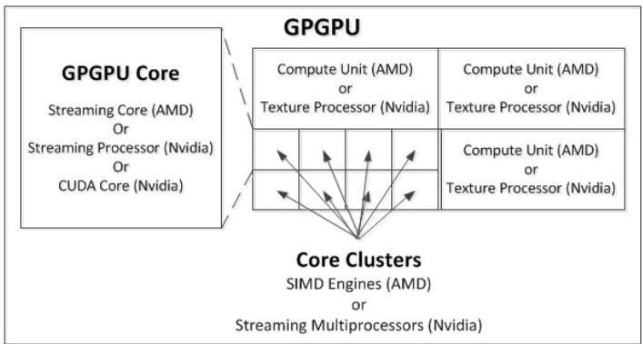
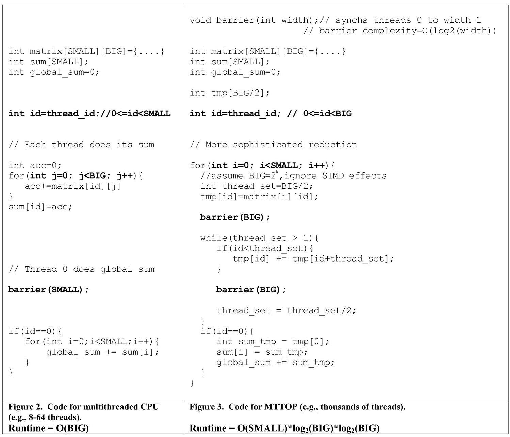
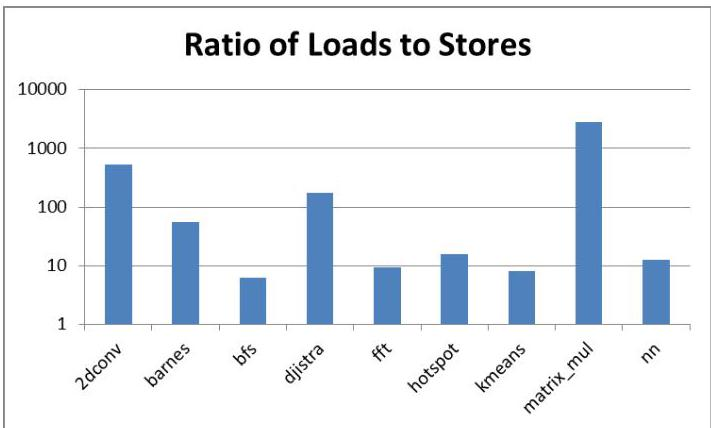
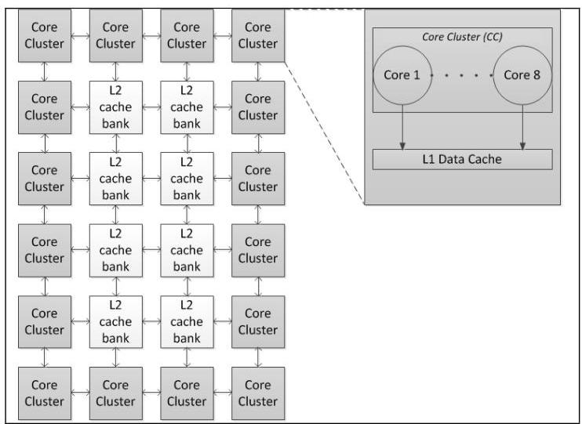
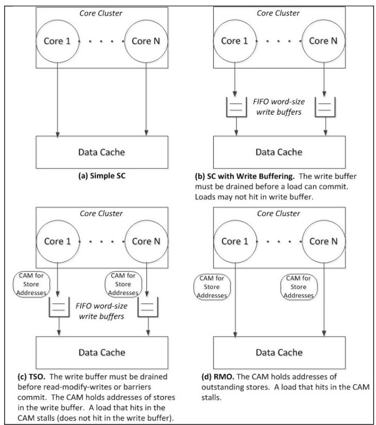
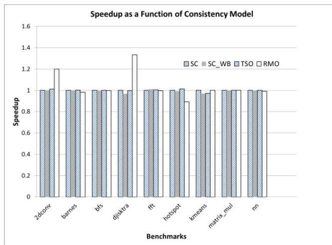

# Exploring Memory Consistency for Massively-Threaded Throughput-Oriented Processors 深度解读

> **作者**：Blake A. Hechtman, Daniel J. Sorin  
> **会议/期刊**：ISCA 2013  
> **一句话总结**：这篇论文在一个具备 cache-coherent shared memory 的 MTTOP/GPGPU 类处理器模型上比较 SC、TSO、RMO 等硬件 memory consistency model，发现弱一致性通常并不能带来显著性能收益，因此一致性模型选择更应由硬件复杂度、能效和系统可编程性决定。

## 一、问题定义

这是一篇偏 First 类型的论文：它不是第一次研究 memory consistency model，也不是第一次研究 GPGPU/MTTOP，但它首次系统地把“CPU 时代关于强/弱一致性模型的权衡”放到 massively-threaded throughput-oriented processors（MTTOPs）这个新硬件上下文里重新审视。论文的问题可以概括为：当一个吞吐导向处理器拥有成百上千个线程、简单 in-order core、SIMT 执行方式，并逐渐走向 cache-coherent shared memory 时，它的硬件 memory consistency model 是否仍然必须像传统观点认为的那样越弱越好？

背景上，CPU 多核长期明确规定硬件一致性模型，例如 x86/TSO、SPARC TSO、IBM Power 等。弱模型允许更多 load/store 重排，通常被认为能换取性能；强模型如 Sequential Consistency（SC）更容易推理，但在 CPU 研究中常被认为会带来 10% 到 40% 的性能差距，靠 speculation 等技术可缩小到 10% 到 15%。MTTOP 的直觉正好更偏向弱一致性：线程数量极大、并发极高、当前 GPU 高层语言也提供较弱的排序保证，因此“GPU/MTTOP 硬件应该弱排序”是很自然的工程判断。

论文挑战的就是这个判断。作者认为 GPGPU/MTTOP 与 CPU 的差异不只体现在“线程更多”，还体现在 per-thread memory-level parallelism 较低、core 可通过切换大量线程隐藏延迟、同步窗口更短、store 相对更少、程序员被中间 ISA 和 finalizer 隔离在硬件之外等方面。这些差异可能让弱一致性模型的传统收益大幅缩水。

Figure 1 帮助统一论文里的 GPGPU/MTTOP 术语：作者把 commercial 名称抽象成 core、core cluster 和完整 GPGPU 层级，避免 AMD/Nvidia 命名差异干扰分析。这个抽象很重要，因为后续评估的不是某一代具体 GPU，而是一个代表未来趋势的通用 MTTOP 模型。

**动机评估**：动机是 solid 的。首先，2013 年前后 GPGPU、Intel MIC、HSA、cache-coherent GPU 研究都在推动吞吐处理器走向更通用的共享内存编程；其次，当硬件开始支持 coherence 后，consistency model 会成为编程语义、finalizer、驱动和硬件实现都绕不开的问题；最后，论文不是只停留在直觉层面，而是把 SC、TSO、RMO 放进同一模拟平台比较性能、复杂度和能效。

**核心 Insight**：MTTOP 的“更多线程”并不自动意味着弱一致性更有价值。相反，更多线程往往伴随更高同步频率、更小的每线程重排窗口、更强的 latency tolerance 和更少 store 优化机会，因此弱模型能利用的空间可能比 CPU 小得多。这个 insight 连接了问题与方案：作者不直接设计新模型，而是先复用 CPU 经典模型，在 MTTOP 条件下重新量化它们的收益。

## 二、相关工作

论文的相关工作可以按三条脉络理解。

第一条是 CPU memory consistency model 研究。SC 提供最简单的全局顺序语义；TSO 主要允许 store 后面的不同地址 load 先执行，从而支持 FIFO write buffer；RMO/Alpha/SPARC RMO 一类模型进一步放松不同地址 load/store 之间的顺序，依赖 Fence 恢复必要顺序；SC for DRF 则把“无数据竞争程序表现为 SC”作为强语义和弱硬件之间的折中。作者借用这些模型作为 MTTOP 评估对象，而不是先发明新模型。

第二条是当时已有 MTTOP/GPGPU memory system。AMD Southern Islands 把地址空间分为 global memory、LDS 和 GDS；LDS/GDS 在特定作用域内可提供强排序，但 global memory 默认不 coherent，需要 Fence/Barrier 让 L1 写回并失效。Nvidia Fermi 也提供 unified address space、L1/L2 层次和 Fence 机制，但公开文档主要描述实现行为，没有给出 implementation-independent hardware memory model。Intel MIC 则因为基于 x86，继承 x86/TSO。作者的结论是：当前系统已有同步机制和部分共享内存能力，但 GPGPU 领域缺少清晰硬件一致性模型。

第三条是 GPU/accelerator 共享内存和 coherence 相关研究。Fung 等人的 GPU transactional memory 研究提供了另一种内存语义；Rigel 给 many-core accelerator 提供 local/global 两类访问和软件 coherence，但没有讨论类似 CPU memory model 的 load/store 排序规则；Cohesion 在 coherence 层面动态选择 software/hardware coherence；Cuckoo Directory 和大规模 on-chip coherence 研究则说明作者假设“未来 MTTOP 可具备 scalable hardware coherence”并非完全脱离现实。

这些相关工作都不能直接回答本文问题：CPU 模型的经验不一定迁移到 MTTOP；GPU 公开文档没有严谨硬件模型；coherence 研究解决的是“值是否可见”的缓存一致性扩展问题，而不是“load/store 以什么合法顺序可见”的 consistency 问题。

## 三、技术挑战

**挑战 1：MTTOP 的硬件特征会改变一致性模型的收益函数。** CPU 上弱一致性常通过隐藏 store 延迟、扩大 per-thread memory-level parallelism、允许更激进乱序来提高性能；而论文的 MTTOP core 是 1-wide、in-order、nonspeculative，每个 core 有 64 个 thread context，每个 thread 至多一个 outstanding load miss。这样的 core 更靠线程切换隐藏延迟，而不是靠单线程乱序执行榨取 ILP/MLP。

**挑战 2：线程数增多会提高同步压力，而同步会压缩可重排窗口。** 在 CPU 上几到几十个线程可以用较粗粒度锁或 barrier；MTTOP 往往有成百上千线程，粗粒度同步会造成严重 contention，程序需要更细粒度 reduction、barrier 或 atomic。每次同步都会迫使前序内存操作完成，弱一致性模型只能在同步之间的小窗口内发挥作用。

Figure 2/3 用同一个矩阵求和示例展示这种变化：CPU 版本沿 SMALL 维度并行，每个线程处理一整行，最后由一个线程汇总；MTTOP 版本沿 BIG 维度展开以获得更多并行度，但代价是每轮 reduction 都需要 barrier。这个图不是在证明算法优劣，而是在说明 MTTOP 为了填满线程并行度，常常把同步变成主路径的一部分。

**挑战 3：MTTOP 工作负载的 load/store 结构削弱了 store 优化价值。** 论文观察到 MTTOP benchmark 的 load/store ratio 全部大于 6，matrix multiplication 甚至达到约 2700；而 CPU benchmark 常见范围约为 1.5 到 5。TSO 这类模型的核心硬件收益之一是 write buffer 隐藏 store 延迟，但当 store 很少时，优化 store 的收益自然变小。

Figure 4 是论文动机中最有说服力的证据之一：2dconv、barnes、dijkstra、matrix_mul 等 benchmark 都呈现远高于 CPU 的 load/store 比例。它支撑了作者关于“TSO 的 write-buffer 优势在 MTTOP 上可能不值成本”的判断。

**挑战 4：系统模型必须足够通用但又不能脱离现实。** 作者没有直接模拟某一代 GPU，而是假设未来 MTTOP 具备 cache-coherent shared memory、directory-style MOESI coherence、16 个 core cluster、每 cluster 8 个 core、每 core 64 个 thread context。这让结论能面向未来通用 MTTOP，但也带来外推风险：如果真实 GPU 仍大量依赖 scratchpad、write-through cache 或更强的乱序 core，结论可能变化。

**挑战 5：programmability 的受益者发生了变化。** CPU 程序员可能直接面对硬件 ISA 和 flag synchronization；GPGPU 程序员通常只看到 CUDA/OpenCL 和 PTX 一类 intermediate assembly。硬件 consistency model 对普通应用程序员的直接帮助下降，但对 finalizer、compiler、driver 的帮助上升，因为这些组件需要把同步语义映射到真实硬件。

## 四、解决方案

### 整体思路

论文没有提出一个全新的 MTTOP-specific consistency model，而是做了一个更基础的系统性比较：先构建一个代表未来趋势的 coherent MTTOP 系统模型，再实现 SC、SC with write buffering、TSO、RMO 四种硬件模型，最后从 performance、implementation complexity、energy-efficiency 和 programmability 四个维度比较。这个设计让论文可以直接回答“弱模型是否值得”的问题，而不是被新模型设计细节分散焦点。

### 贯穿示例

可以把 MTTOP 想成一个同时运行上千个工人的矩阵处理工厂。CPU 版本里，几十个工人每人负责一整行，最后少量同步即可；MTTOP 为了让上千个工人都有活干，会把每一行再拆得很细，让许多工人一起做一行的 reduction。这样虽然并行度上去了，但工人必须频繁对齐进度：一轮加法结束后 barrier，下一轮再继续。此时如果硬件允许某个工人把 store 和 load 随意重排，理论上有机会省一点等待；但由于每轮都很快遇到同步，且每个工人本来就没有太多 outstanding memory operation，可重排空间很小。硬件为了支持这些重排引入 write buffer、CAM、额外端口和复杂检查，可能比收益更贵。

### 关键技术点

**系统模型**：作者的 MTTOP 有 16 个 core cluster，每个 cluster 有 8 个 core；core 是 in-order、Alpha-like ISA、64 thread context；interconnect 是 2D torus；L1D 是 16KB、4-way、20-cycle hit，所有 cluster 共享 256KB、8-bank、8-way L2，L2 hit latency 为 50 cycles。这个模型刻意保留“大量简单 core + 大量线程 + SIMT + coherent shared memory”这些关键特征。

Figure 7 展示了这个系统模型：多个 core cluster 和 L2 bank 通过网络连接，每个 core cluster 内 8 个 core 共享 L1 data cache。它说明论文评估的是一个有层次、有 coherence、也有片上网络成本的系统，而不是单 core microbenchmark。

**SC_simple**：最保守实现，core 的 load/store 到达 pipeline head 后必须等访问 cache 完成。优点是硬件最简单，只需每 thread context 最多一个 outstanding memory operation；缺点是直觉上可能阻塞 load/store，影响性能。

**SC_wb**：在 SC 上加入 FIFO write buffer，但为了保持 SC，后续 load commit 前必须 drain write buffer，load 也不能 hit in write buffer。它尝试给 SC 加一点 store 缓冲能力，但仍保留严格顺序。

**TSO**：每个 MTTOP core 和 L1 data cache 之间有 FIFO write-only write buffer，Fence 和 atomic 前必须 drain；write buffer 只带地址 CAM，不支持 load 从 write buffer 读值。作者明确牺牲了 CPU TSO 常见的 store-to-load forwarding，因为 Section 5.5 的分析认为 MTTOP 中这种 RAW dependence 很少，实验中也追踪到如果加读端口会被使用的次数为 0。

**RMO**：允许 load/store 更直接访问 cache，不使用 write buffer，而用 CAM 记录等待 coherence permission 的 store 地址；load 命中 CAM 时 stall，Fence 等待所有 outstanding stores 更新 cache。这个实现用更弱语义换取 load/store 重排机会，但需要额外地址匹配逻辑。

Figure 6 是方案部分最核心的图：它把四种模型的硬件差异压缩到 write buffer、CAM 和 cache 访问路径上。报告这张图的意义不只是“有哪些实现”，而是能看出作者为什么最后偏向 SC_simple：当性能接近时，少一个 write buffer、少一组 CAM、少一些 fence/drain 交互，就是实实在在的复杂度和能耗优势。

### 与问题/挑战的关联

面对“弱一致性是否必要”的核心问题，作者用实现比较而不是语义讨论来回应：如果 RMO/TSO 在同一工作负载上没有显著快于 SC_simple，那么弱模型的传统性能理由就站不稳。面对“同步频繁、load 多 store 少、per-thread MLP 小”的挑战，作者在实现里有意识地去掉了 CPU 上常见但 MTTOP 难以利用的优化，例如 TSO write buffer read port、RMO load hitting outstanding store MSHR。这样做让比较更贴近 MTTOP 的真实收益，而不是照搬 CPU 高成本实现。

### 与已有方案的对比

相比传统 CPU 研究，论文的关键差异在于评估对象从 latency-sensitive、OOO、少线程 CPU 变为 latency-tolerant、in-order、大量线程 MTTOP。CPU 研究中弱模型常被视为性能工具；本文则发现，在 MTTOP 上 SC_simple 可能是合理甚至更优的工程点。相比当时 GPGPU 的弱排序实践，论文并不否认 graphics 场景适合弱排序，而是指出 GPGPU computing 和通用 MTTOP computing 不应自动继承 graphics 的内存模型选择。

局限也很明显：作者没有提出形式化的 MTTOP-specific memory model，也没有覆盖真实商业 GPU 的所有 microarchitectural quirks；评估依赖模拟器和一组 ported/handwritten workloads，因此结论更像“弱模型不一定值得”的反证，而不是“所有 MTTOP 都应该实现 SC”的定论。

## 五、实验评估

### 实验设定

实验使用修改版 gem5 full-system simulator，模拟 Section 4 的 coherent MTTOP。关键配置包括 16 个 core clusters、每 cluster 8 cores、每 core 64 thread contexts、2D torus 网络、1GHz 频率、16KB L1D（20-cycle hit）和 256KB shared L2（8 banks，50-cycle hit）。write buffer 和 CAM 被设置为 perfect、instant access，这一点对论文结论反而偏向弱模型，因为它没有把这些结构的真实面积、时序和能耗成本完全算进去。

benchmark 共 9 个：手写的 barnes-hut、matrix multiplication、dijkstra、2D convolution、FFT，以及从 Rodinia port 的 nearest neighbor、hotspot、kmeans、BFS。Rodinia port 的原因是原版面向没有 cache-coherent shared memory 的 GPU，而本文模型假设 coherent shared memory。所有 benchmark 用 C/C++ 编写并编译到 Alpha-like ISA；因为 Alpha 接近 RMO，能在 RMO 上正确运行的程序也能在更强的 SC/TSO 上运行。

### 主要实验与结论

性能指标是相对 SC_simple 的 speedup。Figure 8 显示，大多数 benchmark 下 SC、SC_wb、TSO、RMO 的速度都接近 1.0；作者认为这些差异很小，很多可能处于运行时间自然波动的“noise”范围内。少数场景弱模型有可见收益，例如 Section 7.5 明确报告允许 load reordering 后，2D convolution 有约 20% performance improvement，因为它有小 mask 和大矩阵，存在较多相互独立的小数据 load。与此同时，kmeans 等含频繁同步的 benchmark 可能在更弱模型上略有性能损失，原因是 Fence latency 更频繁地进入关键路径。

Figure 8 是论文最直接的结论证据：如果弱模型是 MTTOP 性能的必要条件，RMO/TSO 应该在多数 benchmark 上明显高于 SC_simple；但图中大部分柱子都围绕 1.0。作者因此把决策权从 performance 转移到 hardware complexity、energy-efficiency 和 programmability。

作者还扫了 L1 data cache size 和 L1 hit latency，发现不同 cache size/latency 下的 speedup 结果与 Figure 8 几乎不可区分，尽管 absolute runtime 会变化。这个观察对习惯 CPU 研究的体系结构读者很重要：CPU 上 cache latency/size 往往强烈影响性能，但 MTTOP 的大量线程 latency tolerance 会削弱这种敏感性。

实现复杂度和能效方面，SC_simple 被认为最有吸引力：硬件只需要简单的 coherent cache 访问路径和每 thread context 单 outstanding memory operation；TSO/RMO 需要 write buffer、CAM 或更复杂的 Fence/drain 交互。由于论文的性能实验已经没有显示弱模型有稳定收益，SC_simple 的低复杂度和潜在低能耗就成为主要优势。

### 结论支撑性分析

实验基本支撑论文的主张：在作者设定的 coherent MTTOP、简单 in-order core、MTTOP-style workload 下，弱一致性模型通常不能显著提升性能，因此一致性模型选择不能只按 CPU 经验推断。尤其是 64 thread contexts、load/store ratio 全部大于 6、最高约 2700、以及多数 speedup 接近 1.0 这些数据，形成了从动机到结论的完整链条。

但实验也有边界。第一，write buffer/CAM 被 idealized，真实硬件中弱模型结构成本更高，这会进一步支持 SC_simple，但也意味着能耗结论没有直接量化。第二，workload 覆盖的是作者认为代表未来 MTTOP 的程序，如果未来 MTTOP 执行更 CPU-like 的 workload，store 比例更高、线程数更少、可重排窗口更大，结论可能变弱。第三，RMO 对 2D convolution 有 20% 改善，说明“弱模型完全无用”不是论文结论；更准确的结论是弱模型收益不够普遍，不能成为默认选择理由。

## 六、附加洞察

**结论 1：公开 GPGPU 文档缺少 implementation-independent hardware memory model，会把复杂度推给软件和 finalizer。**
- *出处*：Section 2.1、Section 8。
- *推理链条*：作者检查 AMD Southern Islands 和 Nvidia Fermi 的公开资料，只能看到 Fence、L1 写回/失效、L2 可见性等实现行为，未看到完整硬件一致性模型；没有清晰模型时，finalizer 必须理解具体硬件细节并做保守假设；因此，显式 consistency model 的价值不只在应用程序员，也在编译和驱动链路。

**结论 2：SC 对普通 MTTOP 应用程序员的直接 programmability 优势可能小于 CPU，但对系统软件作者仍有价值。**
- *出处*：Section 5.7、Section 5.8、Section 8。
- *推理链条*：GPGPU 应用程序员通常写 HLL，看到的是 intermediate assembly，而不是硬件 ISA；大量线程也不适合手写 flag synchronization；因此硬件模型强弱对普通程序员的直接可见性下降。但 finalizer 需要把 Fence、Barrier、atomic 等中间指令映射到机器码，显式强模型能让它少依赖硬件实现细节，所以 programmability 的受益者从应用层转向编译/驱动层。

**结论 3：scratchpad memory 会进一步降低 consistency model 的重要性，但它也会改变论文的 shared-memory 假设。**
- *出处*：Section 9.1 System Model。
- *推理链条*：作者的 MTTOP 模型没有 scratchpad；如果加入 scratchpad，更多访问会停留在显式管理的本地存储中，进入 shared coherent memory 的访问更少，一致性模型影响可能更小；但如果剩余 shared-memory 访问更集中在关键路径上，也可能放大其性能影响。因此这个 caveat 支持“结论依赖系统模型”，而不是单向加强主结论。

**结论 4：更激进 core 和更 CPU-like workload 是最可能推翻结论的方向。**
- *出处*：Section 7.5、Section 9.2 Workloads。
- *推理链条*：作者为了测试更复杂 core，允许 RMO 下 load reordering，发现多数 benchmark 仍收益不大，但 2D convolution 有约 20% 改善；Section 9.2 又指出如果 workload 变得更 CPU-like，load/store ratio 变低或可并行线程减少，弱模型优化空间可能回升。因此论文真正排除的是“当前这类 MTTOP workload 下弱模型必然重要”，不是排除所有未来架构上的弱模型。

## 七、总结与评价

这篇论文的核心贡献是把 memory consistency model 的经典问题放进 MTTOP 语境重新实证化：作者没有接受“线程越多越需要弱模型”的直觉，而是指出 MTTOP 的同步频率、latency tolerance、load/store 比例和程序栈结构共同削弱了弱一致性的性能收益。它最有价值的地方在于把一个容易被经验判断带偏的问题拆成可实现、可模拟、可比较的硬件设计点。

论文最大的亮点是反直觉但克制：它不是宣称 SC 一定最好，而是说明在许多 MTTOP 条件下，SC_simple 的性能并不差，且硬件复杂度和能耗更有吸引力。最大的不足是评估强依赖模拟模型和 workload 集合，且没有真实量化 write buffer/CAM 的能耗与面积；此外，coherent shared memory 的 MTTOP 假设在 2013 年仍偏前瞻，真实 GPU 的 scratchpad、warp 层级和 graphics/compute 双模型会让工程选择更复杂。

从今天回看，这篇论文的价值仍在：当 GPU、accelerator 和 CPU 共享内存持续融合时，硬件一致性模型不能只按 CPU 或 graphics GPU 的历史惯性选择。更合理的做法是像本文一样，先问目标 workload 是否真的能利用弱模型提供的重排空间，再决定是否值得为此支付硬件和软件复杂度。

## 八、章节脉络与段落速览

- **ABSTRACT**：概括本文在 MTTOP 上比较硬件一致性模型，发现性能影响很小，选择应更多基于复杂度、能效和可编程性。

- **Section 1 · INTRODUCTION**：提出为什么要在 MTTOP 上重新审视 memory consistency model，并概述贡献。
  - ¶1 说明 CPU 多核都明确规定硬件一致性模型，且模型选择会影响可编程性、性能和实现复杂度。
  - ¶2 引入 MTTOP/GPGPU/MIC/Rigel 等新系统类型，说明它们与 CPU 在 core 数、pipeline、线程数和 SIMT 上不同，并假设未来会走向 cache-coherent shared memory。
  - ¶3 指出传统观点认为 GPU 适合弱排序，但这种观点主要来自 graphics 场景，不一定适用于 GPGPU computing。
  - ¶4 说明高层语言弱内存模型不代表硬件也必须弱，类比 C++/Java 与 CPU 硬件模型之间的关系。
  - ¶5 给出本文主张：MTTOP 上硬件一致性模型对性能影响很小，强模型可能因简单和能效而有吸引力。
  - ¶6 列出三项贡献：讨论 MTTOP 一致性实现、探索模型权衡、实验展示性能影响常常可忽略。
  - ¶7 交代全文结构，从现有 MTTOP memory system 到 CPU consistency tutorial、系统模型、动机、实现、实验和限制。

- **Section 2 · Current MTTOP Memory Systems**：梳理当前 GPGPU/MIC memory system 现状，说明领域缺少明确硬件一致性模型。
  - **2.1 · GPGPU Memory Systems**：根据公开资料推断 GPGPU 排序保证并统一术语。
    - ¶1 说明没有厂商发布完整 GPGPU 硬件一致性模型，因此作者只能根据公开实现行为推断。
    - ¶2 通过 Figure 1 统一 core、core cluster、SIMT 等术语。
    - ¶3 区分 Fence 和 Barrier：前者排序内存操作，后者同步一组线程执行。
  - **2.1.1 · AMD's Southern Islands**：描述 AMD GPU 的 global memory、LDS、GDS 及其 ordering/coherence 行为。
    - ¶1 说明 Southern Islands 将虚拟地址空间分为 global memory、LDS 和 GDS。
    - ¶2 说明 LDS/GDS 在相应作用域内强排序，global memory 默认不 coherent，需要同步指令触发写回和失效。
  - **2.1.2 · Nvidia's Fermi**：描述 Fermi 的 unified address space、L1/L2 和 Fence 行为。
    - ¶1 说明 Fermi 地址空间和 L1/L2 组织。
    - ¶2 说明 Fence 保证前序写传播到 L2/memory 并失效 L1。
    - ¶3 指出公开文档描述实现行为，但没有 implementation-independent hardware memory model。
  - **2.2 · Intel's Many Integrated Core (MIC)**：说明 MIC 是 throughput-oriented many-core，但继承 x86/TSO。
    - ¶1 介绍 MIC 的多线程简单 core、cache-coherent shared memory 和 ring coherence。
    - ¶2 指出 MIC 使用 x86/TSO，这个模型不是为 MTTOP 特征设计的。

- **Section 3 · HARDWARE CONSISTENCY FOR CPUs**：回顾 CPU 上 SC、TSO、RMO、SC for DRF 及强弱模型争论。
  - **3.1 · Sequential Consistency (SC)**：定义 SC 为尊重每线程 program order 的全局 load/store 总序。
  - **3.2 · Total Store Order (TSO) / x86**：说明 TSO 允许 store 后不同地址 load 重排，以支持 FIFO write buffer，并用 Fence 恢复顺序。
  - **3.3 · Relaxed Memory Order (RMO)**：说明 RMO 类模型放松不同地址 load/store 排序，依赖 Fence 约束必要顺序。
  - **3.4 · SC for Data Race Free**：说明无数据竞争程序可在弱硬件上表现为 SC，并认为 MTTOP 也可能适用。
  - **3.5 · The Debate**：总结 CPU 时代强弱模型争论：强模型更易编程，弱模型通常有性能优势但差距可被 speculation 缩小。

- **Section 4 · MTTOP SYSTEM MODEL**：定义评估用的通用 MTTOP 模型。
  - ¶1 说明作者不模拟当前 GPU 的所有 quirks，而保留 MTTOP 相对 CPU 的根本特征。
  - ¶2 概括模型关键特征：大量 core、简单 pipeline、大量 thread context、SIMT。
  - ¶3 给出具体 core/cluster 配置：8-core cluster、1-wide in-order core、64 thread contexts、共享 fetch/decode 和 L1 cache。
  - ¶4 说明模型采用 cache-coherent shared memory，并解释为什么 coherence 是未来 MTTOP 软件生态的重要趋势。

- **Section 5 · WHY REVISIT MEMORY CONSISTENCY?**：从八个角度解释为什么 MTTOP 会改变一致性模型权衡。
  - **5.1 · Outstanding Cache Misses per Thread to Potential MLP**：说明 MTTOP 每线程 outstanding request 少，弱模型优化 per-thread MLP 的收益下降。
  - **5.2 · Threads per Core to Latency Tolerance**：说明大量 thread context 能隐藏内存延迟，弱模型优化 latency 的价值下降。
  - **5.3 · Threads per System to Synchronization and Contention**：说明大量线程让同步和共享数据 contention 更严重，Figure 2/3 用 reduction 示例说明 MTTOP 会更频繁 barrier。
  - **5.4 · Threads per System to Opportunities for Reordering**：说明更多线程导致每线程内存操作减少，同步比例上升，可重排窗口变小。
  - **5.5 · Register Spills/Fills to RAW Dependences**：说明大 register file 和 SIMT vectorization 减少 spill/fill，从而减少通过内存的 RAW dependence。
  - **5.6 · Algorithms to Ratio of Loads to Stores**：说明 MTTOP 算法 load/store ratio 远高于 CPU，削弱 store-buffer 优化价值。
  - **5.7 · Intermediate Assembly Languages**：说明 finalizing 延迟和 HLL/intermediate ISA 隔离改变了硬件一致性模型的可编程性意义。
  - **5.8 · Threads per System to Programmability**：说明 MTTOP 程序员较少直接依赖硬件一致性模型做 flag synchronization，SC 的直接可编程性收益下降。

- **Section 6 · IMPLEMENTING MEMORY MODELS FOR MTTOPs**：给出 SC、SC_wb、TSO、RMO 四种实现。
  - ¶1 说明本文比较的是 CPU 模型的自然扩展：SC、TSO、RMO，而不是新 MTTOP-specific 模型。
  - ¶2 说明所有实现都基于 directory-style MOESI coherence，且基本 core 模型不支持 load-to-load reordering。
  - **6.1 · Simple SC**：说明 SC_simple 直接让 load/store 访问 cache 完成后再继续，硬件简单但可能阻塞。
  - **6.2 · SC with Write Buffering**：说明 SC_wb 加 FIFO write buffer，但 load commit 前必须 drain。
  - **6.3 · Total Store Order**：说明 TSO 使用 write-only FIFO write buffer 和 CAM，Fence/atomic 前 drain，并刻意不支持 load hit in write buffer。
  - **6.4 · Relaxed Memory Ordering**：说明 RMO 使用 CAM 记录 outstanding store 地址，load 命中 CAM 时 stall，Fence 等待所有 stores 完成。
  - **6.5 · Graphics Compatibility**：说明 graphics memory accesses 可采用不同模型，例如 store bypass L1、load 不缓存，不必与 compute 共用同一 ordering 策略。

- **Section 7 · EXPERIMENTAL COMPARISON OF MTTOP MEMORY MODELS**：评估四种模型的性能、复杂度和对更复杂 core 的影响。
  - **7.1 · Simulation Methodology**：说明使用修改版 gem5 和 Table 1 的 MTTOP 配置。
  - **7.2 · Benchmarks**：说明使用 5 个手写 benchmark 和 4 个 Rodinia port，并保证 RMO 正确程序也适用于 SC/TSO。
  - **7.3 · Performance Results**：说明 Figure 8 中大多数模型 speedup 接近 1.0，cache size/latency sweep 也几乎不改变相对结论。
  - **7.4 · Implementation Complexity and Energy-Efficiency**：说明性能接近时 SC_simple 因硬件最简单和潜在低能耗成为有吸引力选择。
  - **7.5 · Implication of More Sophisticated Cores**：说明若 core 更激进，RMO load reordering 可能有用，但多数 benchmark 仍收益不大，2D convolution 约有 20% 改善。

- **Section 8 · FINALIZER PROGRAMMABILITY**：把可编程性讨论从应用程序员转向 finalizer 作者。
  - ¶1 重申普通 GPGPU 程序员被 HLL 和 intermediate language 隔离，硬件模型直接影响较小。
  - ¶2 说明 finalizer 需要在缺少原始源代码上下文下处理寄存器分配、Fence、Barrier 和 atomic 映射。
  - ¶3 说明显式硬件一致性模型能让 finalizer 不必理解全部硬件实现细节，从而减少保守同步和 cache thrashing。

- **Section 9 · CAVEATS AND LIMITATIONS**：说明结论依赖系统模型和 workload 假设。
  - **9.1 · System Model**：讨论 register file size、scratchpad、SIMT width、write-through cache、non-write-atomic memory system 等模型变化可能影响结论。
  - **9.2 · Workloads**：讨论 CPU-like workloads 和 hierarchical threading 可能改变一致性模型收益。

- **Section 10 · RELATED WORK**：把本文与 TM、accelerator memory model 和 scalable coherence 区分开。
  - ¶1 概括已有 emerging chip memory model 工作。
  - ¶2 说明 GPU transactional memory 与本文互补，因为本文关注非事务内存操作。
  - ¶3 说明 Rigel 提供 local/global 访问和软件 coherence，但未讨论 CPU-style load/store ordering。
  - ¶4 说明 Cohesion 关注动态 software/hardware coherence，与本文关注 consistency model 正交。
  - ¶5 说明 Cuckoo Directory 和 large-scale coherence 研究支撑本文的 coherent MTTOP 假设。

- **Section 11 · CONCLUSIONS**：总结本文反驳弱一致性必然适合 MTTOP 的传统观点，并指出强模型可能促进 MTTOP 与 CPU 集成。
  - ¶1 说明 SC 在多种 MTTOP benchmark 上性能接近弱模型，因此传统偏好弱模型的观点可能被误导，但现在下定论仍为时过早。

- **Section 12 · ACKNOWLEDGMENTS**：感谢讨论和资助来源。
  - ¶1 感谢 Brad Beckmann、Steve Reinhardt、Mark Hill、Milo Martin、Mark Oskin，并说明 AMD 与 NSF 资助。

- **Section 13 · REFERENCES**：列出本文引用的 memory model、benchmark、GPU/coherence 和体系结构相关文献。
