# MCM-GPU: Multi-Chip-Module GPUs for Continued Performance Scalability

Akhil Arunkumar ${}^{ \ddagger  }$ Evgeny Bolotin ${}^{ \dagger  }$ Benjamin Cho ${}^{ \mp  }$ Ugljesa Milic ${}^{ + }$ Eiman Ebrahimi ${}^{ \dagger  }$

> 
Akhil Arunkumar ${}^{ \ddagger  }$ Evgeny Bolotin ${}^{ \dagger  }$ Benjamin Cho ${}^{ \mp  }$ Ugljesa Milic ${}^{ + }$ Eiman Ebrahimi ${}^{ \dagger  }$

Oreste Villa ${}^{ \dagger  }$ Aamer Jaleel ${}^{ \dagger  }$ Carole-Jean Wu ${}^{ \ddagger  }$ David Nellans ${}^{ \dagger  }$

> 
Oreste Villa ${}^{ \dagger }$ Aamer Jaleel ${}^{ \dagger }$ Carole-Jean Wu ${}^{ \ddagger }$ David Nellans ${}^{ \dagger }$

Arizona State University ${}^{ \ddagger  }$ NVIDIA ${}^{ \dagger  }$ University of Texas at Austin ${}^{ \mp  }$ Barcelona Supercomputing Center / Universitat Politecnica de Catalunya+

> 
亚利桑那州立大学 (Arizona State University) ${}^{ \ddagger  }$ 英伟达 (NVIDIA) ${}^{ \dagger  }$ 德克萨斯大学奥斯汀分校 (University of Texas at Austin) ${}^{ \mp  }$ 巴塞罗那超级计算中心 / 加泰罗尼亚理工大学 (Barcelona Supercomputing Center / Universitat Politecnica de Catalunya)+

\{akhil.arunkumar, carole-jean.wu\}@asu.edu,\{ebolotin, eebrahimi, ovilla, ajaleel, dnellans\}@nvidia.com bjcho@utexas.edu, ugljesa.milic@bsc.es

> 
\{akhil.arunkumar, carole-jean.wu\}@asu.edu,\{ebolotin, eebrahimi, ovilla, ajaleel, dnellans\}@nvidia.com bjcho@utexas.edu, ugljesa.milic@bsc.es

## ABSTRACT

Historically, improvements in GPU-based high performance computing have been tightly coupled to transistor scaling. As Moore's law slows down, and the number of transistors per die no longer grows at historical rates, the performance curve of single monolithic GPUs will ultimately plateau. However, the need for higher performing GPUs continues to exist in many domains. To address this need, in this paper we demonstrate that package-level integration of multiple GPU modules to build larger logical GPUs can enable continuous performance scaling beyond Moore's law. Specifically, we propose partitioning GPUs into easily manufacturable basic GPU Modules (GPMs), and integrating them on package using high bandwidth and power efficient signaling technologies. We lay out the details and evaluate the feasibility of a basic Multi-Chip-Module GPU (MCM-GPU) design. We then propose three architectural optimizations that significantly improve GPM data locality and minimize the sensitivity on inter-GPM bandwidth. Our evaluation shows that the optimized MCM-GPU achieves 22.8% speedup and 5x inter-GPM bandwidth reduction when compared to the basic MCM-GPU architecture. Most importantly, the optimized MCM-GPU design is 45.5% faster than the largest implementable monolithic GPU, and performs within 10% of a hypothetical (and unbuildable) monolithic GPU. Lastly we show that our optimized MCM-GPU is 26.8% faster than an equally equipped Multi-GPU system with the same total number of SMs and DRAM bandwidth.

> 
从历史上看，基于GPU的高性能计算的进步一直与晶体管缩放紧密相关。随着摩尔定律放缓，单颗芯片上的晶体管数量不再以历史速度增长，单芯片GPU的性能曲线最终将趋于平缓。然而，许多领域对更高性能GPU的需求依然存在。为满足这一需求，本文展示了通过封装级集成多个GPU模块来构建更大规模的逻辑GPU，能够实现超越摩尔定律的持续性能扩展。具体而言，我们提出将GPU划分为易于制造的基本GPU模块（GPM），并利用高带宽、高能效的信号传输技术在封装上将其集成。我们详细阐述了一种基础多芯片模块GPU（MCM-GPU）的设计，并评估了其可行性。随后，我们提出了三项架构优化，显著提升了GPM数据局部性，并最大限度降低了对GPM间带宽的敏感度。评估结果表明，与基础MCM-GPU架构相比，优化后的MCM-GPU实现了22.8%的加速比，并将GPM间带宽需求降低了5倍。最重要的是，优化后的MCM-GPU设计比可制造的最大单芯片GPU快45.5%，且性能与一个假设的（且无法制造的）单芯片GPU相差在10%以内。最后，我们证明，在流式多处理器（SM）总数和显存带宽相同的情况下，优化后的MCM-GPU比同等配置的多GPU系统快26.8%。

## CCS CONCEPTS

- Computing methodologies $\rightarrow$ Graphics processors; $\bullet$ Computer systems organization $\rightarrow$ Parallel architectures; Single instruction, multiple data;

> 
- 计算方法学 (Computing methodologies) $\rightarrow$ 图形处理器 (Graphics processors); $\bullet$ 计算机系统组织 (Computer systems organization) $\rightarrow$ 并行架构 (Parallel architectures); 单指令多数据 (Single instruction, multiple data);

## KEYWORDS

Graphics Processing Units, Multi-Chip-Modules, NUMA Systems, Moore's Law

> 
图形处理单元 (Graphics Processing Units), 多芯片模块 (Multi-Chip-Modules), 非统一内存访问系统 (NUMA Systems), 摩尔定律 (Moore's Law)

## ACM Reference format:

Akhil Arunkumar* Evgeny Bolotin ${}^{ \dagger  }$ Benjamin Cho ${}^{ \mp  }$ Ugljesa Milic ${}^{ + }$ Eiman Ebrahimi ${}^{ \dagger  }$ Oreste Villa ${}^{ \dagger  }$ Aamer Jaleel ${}^{ \dagger  }$ Carole-Jean Wu ${}^{ \ddagger  }$ David Nellans ${}^{ \dagger  }$ .2017.MCM-GPU: Multi-Chip-Module GPUs for Continued Performance Scalability. In Proceedings of ISCA '17, Toronto, ON, Canada, June 24-28, 2017, 13 pages.

> 
Akhil Arunkumar* Evgeny Bolotin ${}^{ \dagger  }$ Benjamin Cho ${}^{ \mp  }$ Ugljesa Milic ${}^{ + }$ Eiman Ebrahimi ${}^{ \dagger  }$ Oreste Villa ${}^{ \dagger  }$ Aamer Jaleel ${}^{ \dagger  }$ Carole-Jean Wu ${}^{ \ddagger  }$ David Nellans ${}^{ \dagger  }$ .2017.MCM-GPU: 面向持续性能可扩展性的多芯片模块GPU. 见 ISCA '17 会议论文集, 加拿大多伦多, 2017年6月24-28日, 13页.

https://doi.org/http://dx.doi.org/10.1145/3079856.3080231

> 
本文提出了一种多芯片模块GPU（Multi-Chip-Module GPU, MCM-GPU）架构，旨在突破因摩尔定律放缓和掩模版尺寸限制而导致的单体芯片制造瓶颈，实现GPU性能的持续扩展。该研究通过利用高带宽、高能效的信号传输技术（如NVIDIA的地参考信号（Ground-Referenced Signaling, GRS）），在单一封装上集成多个基础GPU模块（GPU Module, GPM），以满足高性能计算和人工智能领域对更强大GPU的需求。

其核心贡献在于一种详细的MCM-GPU设计，该设计向软件呈现为一个单一逻辑GPU，从而避免了多GPU系统带来的编程难题。由于跨GPM带宽低于片上带宽，基线设计暴露了一种非统一内存访问（NUMA）架构。为缓解这一问题，作者提出了三项架构优化：（1）在GPM侧设置一个仅存储远程数据的L1.5缓存（L1.5 cache），以减少跨GPM流量和延迟；（2）采用分布式、批处理的协作线程阵列（CTA）调度器，将连续的线程块分组到同一GPM上，以利用跨CTA的数据局部性；（3）采用首次接触页面分配策略，将内存页面映射到首次访问它的GPM的本地内存分区，与CTA调度器协同作用，使访问保持本地化。

主要结论是，这些组合优化将跨GPM带宽降低了5倍，并相较于基线MCM-GPU实现了22.8%的加速。拥有256个流式多处理器（SM）的优化后MCM-GPU，比可制造的最大单体GPU（128个SM）快45.5%，性能与一个假设无法制造的256-SM单体GPU相差在10%以内，且比同等配置的多GPU系统快26.8%。

## 1 INTRODUCTION

GPU-based compute acceleration is the main vehicle propelling the performance of high performance computing (HPC) systems [12, 17, 29], machine learning and data analytics applications in large-scale cloud installations, and personal computing devices [15, 17, 35, 47]. In such devices, each computing node or computing device typically consists of a CPU with one or more GPU accelerators. The path forward in any of these domains, either to exascale performance in HPC, or to human-level artificial intelligence using deep convolutional neural networks, relies on the ability to continuously scale GPU performance [29, 47]. As a result, in such systems, each GPU has the maximum possible transistor count at the most advanced technology node, and uses state-of-the-art memory technology [17]. Until recently, transistor scaling improved single GPU performance by increasing the Streaming Multiprocessor (SM) count between GPU generations. However, transistor scaling has dramatically slowed down and is expected to eventually come to an end [7, 8]. Furthermore, optic and manufacturing limitations constrain the reticle size which in turn constrains the maximum die size (e.g. $\approx  {800}{\mathrm{\;{mm}}}^{2}\left\lbrack  {{18},{48}}\right\rbrack$ ). Moreover, very large dies have extremely low yield due to large numbers of irreparable manufacturing faults [31]. This increases the cost of large monolithic GPUs to undesirable levels. Consequently, these trends limit future scaling of single GPU performance and potentially bring it to a halt.

> 
基于图形处理器 (GPU) 的计算加速是推动高性能计算 (HPC) 系统 [12, 17, 29]、大规模云设施中的机器学习和数据分析应用以及个人计算设备 [15, 17, 35, 47] 性能的主要手段。在此类设备中，每个计算节点或计算设备通常由一个中央处理器 (CPU) 和一个或多个图形处理器 (GPU) 加速器组成。在这些领域中的任何一个，无论是实现高性能计算 (HPC) 的百亿亿次 (exascale) 性能，还是利用深度卷积神经网络实现人类水平的人工智能，前进的道路都依赖于持续扩展图形处理器 (GPU) 性能的能力 [29, 47]。因此，在此类系统中，每个图形处理器 (GPU) 在采用最先进技术节点时拥有尽可能多的晶体管数量，并使用最先进的内存技术 [17]。直到最近，晶体管缩放通过在不同代图形处理器 (GPU) 之间增加流式多处理器 (Streaming Multiprocessor, SM) 的数量来提高单个图形处理器 (GPU) 的性能。然而，晶体管缩放已大幅放缓，并预计最终将走向终结 [7, 8]。此外，光学和制造限制制约了光罩尺寸 (reticle size)，进而制约了最大芯片尺寸 (die size)（例如 $\approx  {800}{\mathrm{\;{mm}}}^{2}\left\lbrack  {{18},{48}}\right\rbrack$）。此外，非常大的芯片由于大量不可修复的制造缺陷而良率极低 [31]。这使得大型单片图形处理器 (GPU) 的成本增加到不可接受的水平。因此，这些趋势限制了未来单个图形处理器 (GPU) 性能的扩展，并可能使其陷入停滞。

An alternate approach to scaling performance without exceeding the maximum chip size relies on multiple GPUs connected on a PCB, such as the Tesla K10 and K80 [10]. However, as we show in this paper, it is hard to scale GPU workloads on such "multi-GPU" systems, even if they scale very well on a single GPU. This is due to multiple unsolved challenges related to work partitioning, load balancing, and data sharing across the slow on-board interconnection network [20, 23, 33, 36]. However, due to recent advances in packaging [30] and signaling technologies [45], package-level integration provides a promising integration tier that lies between the existing on-chip and on-board integration technologies.

> 
一种在不超出最大芯片尺寸的前提下扩展性能的替代方法，依赖于在印刷电路板 (PCB) 上连接多个 GPU，例如 Tesla K10 和 K80 [10]。然而，正如我们在本文中所展示的，即使 GPU 工作负载在单个 GPU 上扩展得很好，也很难在这样的“多 GPU (multi-GPU)”系统上扩展。这是由于与工作划分 (work partitioning)、负载均衡 (load balancing) 以及跨缓慢的板载互连网络 (on-board interconnection network) 进行数据共享 (data sharing) 相关的多个未解决的挑战 [20, 23, 33, 36]。不过，得益于封装 (packaging) [30] 和信号传输技术 (signaling technologies) [45] 的最新进展，封装级集成 (package-level integration) 提供了一个有前景的集成层级，它介于现有的片上 (on-chip) 和板载 (on-board) 集成技术之间。

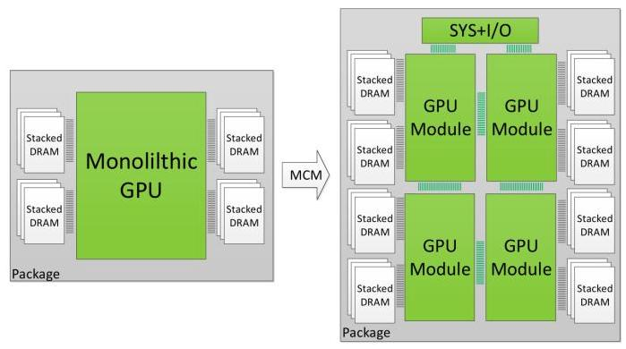

Figure 1: MCM-GPU: Aggregating GPU modules and DRAM on a single package.

> 
图1：多芯片模块GPU (MCM-GPU)：在单个封装上聚合GPU模块和DRAM。

Leveraging this new integration tier, we propose a novel Multi-Chip Module GPU (MCM-GPU) architecture that enables continued GPU performance scaling despite the slowdown of transistor scaling and photoreticle limitations. Our proposal aggregates multiple GPU Modules (GPMs) within a single package as illustrated in Figure 1. First, we detail the basic MCM-GPU architecture that leverages NVIDIA's state-of-the-art Ground Reference Signaling (GRS) [45]. We then optimize our proposed MCM-GPU design using three architectural innovations targeted at improving locality and minimizing inter-GPM communication: (i) hardware caches to capture remote traffic in the local GPM, (ii) distributed and batched co-operative thread array (CTA) scheduling to better leverage inter-CTA locality within a GPM, and (iii) first touch page allocation policy to minimize inter-GPM traffic. Overall, this paper makes the following contributions:

> 
利用这一新的集成层级，我们提出了一种新颖的多芯片模块GPU（Multi-Chip Module GPU，MCM-GPU）架构，该架构能够在晶体管缩放放缓和光罩尺寸限制的情况下，实现持续的GPU性能扩展。如图1所示，我们的方案将多个GPU模块（GPU Module，GPM）聚合在单个封装内。首先，我们详细介绍了基于NVIDIA先进地参考信号（Ground Reference Signaling，GRS）[45]的基础MCM-GPU架构。随后，我们通过三项旨在提升局部性并最小化GPM间通信的架构创新，对所提出的MCM-GPU设计进行优化：(i) 硬件缓存，用于捕获本地GPM中的远程流量；(ii) 分布式批量协作线程阵列（co-operative thread array，CTA）调度，以更好地利用GPM内的CTA间局部性；(iii) 首次接触页面分配策略，以最小化GPM间流量。总体而言，本文做出了以下贡献：

- We motivate the need for more powerful GPUs by showing that many of today's GPU applications scale very well with increasing number of SMs. Given future GPUs can no longer continue their performance scaling using today's monolithic architectures, we propose the MCM-GPU architecture that allows performance and energy efficient scaling beyond what is possible today.

> 
- 我们通过展示当今许多 GPU 应用程序随着 SM 数量的增加而具有良好的可扩展性，来论证对更强大 GPU 的需求。鉴于未来 GPU 无法再使用当今的单片架构 (monolithic architectures) 继续提升性能，我们提出了多芯片模块 GPU (MCM-GPU) 架构，该架构能够实现超越当前可能的性能和能效扩展。

- We present a modular MCM-GPU with 256 SMs and discuss its memory system, on-package integration, and signaling technology. We show its performance sensitivity to inter-GPM bandwidth both analytically and via simulations. Our evaluation shows that since inter-GPM bandwidth is lower than a monolithic GPU's on-chip bandwidth, an on-package non-uniform memory access (NUMA) architecture is exposed in the MCM-GPU.

> 
- 我们提出了一种具有 256 个 SM 的模块化多芯片模块 GPU (MCM-GPU)，并讨论了其内存系统、封装内集成和信号技术。我们通过分析和模拟展示了其对 GPU 模块 (GPM) 间带宽的性能敏感性。我们的评估表明，由于 GPM 间带宽低于单片 GPU 的片上带宽，MCM-GPU 中暴露了封装内非统一内存访问 (NUMA) 架构。

- We propose a locality-aware MCM-GPU architecture, better suited to its NUMA nature. We use architectural enhancements to mitigate the penalty introduced by nonuniform memory accesses. Our evaluations show that these optimizations provide an impressive 5x inter-GPM bandwidth reduction, and result in a 22.8% performance speedup compared to the baseline MCM-GPU. Our optimized MCM-GPU architecture achieves a 44.5% speedup over the largest possible monolithic GPU (assumed as a 128 SMs GPU), and comes within 10% of the performance of an unbuild-able similarly sized monolithic GPU.

> 
- 我们提出了一种感知局部性的多芯片模块GPU（MCM-GPU）架构，以更好地适应其非统一内存访问（NUMA）特性。我们利用架构增强来减轻非统一内存访问带来的性能损失。评估结果表明，这些优化实现了显著的5倍跨GPM带宽降低，并相较于基线MCM-GPU带来了22.8%的性能提升。我们优化后的MCM-GPU架构相比最大可制造的单片GPU（假设为128个SM的GPU）实现了44.5%的加速，且性能仅比无法制造的同等规模单片GPU低10%以内。

<table><tr><td></td><td>Fermi</td><td>Kepler</td><td>Maxwell</td><td>Pascal</td></tr><tr><td>SMs</td><td>16</td><td>15</td><td>24</td><td>56</td></tr><tr><td>BW (GB/s)</td><td>177</td><td>288</td><td>288</td><td>720</td></tr><tr><td>L2 (KB)</td><td>768</td><td>1536</td><td>3072</td><td>4096</td></tr><tr><td>Transistors (B)</td><td>3.0</td><td>7.1</td><td>8.0</td><td>15.3</td></tr><tr><td>Tech. node (nm)</td><td>40</td><td>28</td><td>28</td><td>16</td></tr><tr><td>Chip size (mm2)</td><td>529</td><td>551</td><td>601</td><td>610</td></tr></table>

Table 1: Key characteristics of recent NVIDIA GPUs.

> 
表1：近期NVIDIA图形处理器 (GPU) 的关键特性。

- Finally, we compare our MCM-GPU architecture to a multi-GPU approach. Our results confirm the intuitive advantages of the MCM-GPU approach.

> 
- 最后，我们将我们的多芯片模块GPU (MCM-GPU) 架构与多GPU方法进行比较。我们的结果证实了MCM-GPU方法的直观优势。

## 2 MOTIVATION AND BACKGROUND

Modern GPUs accelerate a wide spectrum of parallel applications in the fields of scientific computing, data analytics, and machine learning. The abundant parallelism available in these applications continually increases the demands for higher performing GPUs. Table 1 lists different generations of NVIDIA GPUs released in the past decade. The table shows an increasing trend for the number of streaming multiprocessors (SMs), memory bandwidth, and number of transistors with each new GPU generation [14].

> 
现代 GPU 加速了科学计算、数据分析和机器学习等领域中广泛的并行应用。这些应用中丰富的并行性不断提高对更高性能 GPU 的需求。表 1 列出了过去十年中发布的不同代 NVIDIA GPU。该表显示，随着每一代新 GPU 的推出，流式多处理器 (streaming multiprocessors, SMs) 数量、内存带宽 (memory bandwidth) 和晶体管数量 (number of transistors) 呈增长趋势[14]。

### 2.1 GPU Application Scalability

To understand the benefits of increasing the number of GPU SMs, Figure 2 shows performance as a function of the number of SMs on a GPU. The L2 cache and DRAM bandwidth capacities are scaled up proportionally with the SM count, i.e., 384 GB/s for a 32-SM GPU and 3 TB/s for a 256-SM GPU ${}^{1}$ . The figure shows two different performance behaviors with increasing SM counts. First is the trend of applications with limited parallelism whose performance plateaus with increasing SM count (Limited Parallelism Apps). These applications exhibit poor performance scalability (15 of the total 48 applications evaluated) due to the lack of available parallelism (i.e. number of threads) to fully utilize larger number of SMs. On the other hand, we find that 33 of the 48 applications exhibit a high degree of parallelism and fully utilize a 256-SM GPU. Note that such a GPU is substantially larger $\left( {{4.5} \times  }\right)$ than GPUs available today. For these High-Parallelism Apps, 87.8% of the linearly-scaled theoretical performance improvement can potentially be achieved if such a large GPU could be manufactured.

> 
为了理解增加 GPU 流式多处理器 (SM) 数量所带来的收益，图 2 展示了性能随 GPU 上 SM 数量变化的函数关系。二级缓存 (L2 cache) 和 DRAM 带宽容量与 SM 数量成比例扩展，即 32-SM GPU 为 384 GB/s，256-SM GPU 为 3 TB/s ${}^{1}$ 。该图显示了随着 SM 数量增加，两种不同的性能表现。第一种是并行度有限的应用，其性能随 SM 数量增加而趋于平缓（有限并行度应用，Limited Parallelism Apps）。这些应用由于缺乏足够的并行度（即线程数量）来充分利用更多的 SM，表现出较差的性能可扩展性（在评估的 48 个应用中占 15 个）。另一方面，我们发现 48 个应用中有 33 个表现出高度并行性，能够充分利用 256-SM GPU。请注意，这样的 GPU 比当今可用的 GPU 大得多 $\left( {{4.5} \times  }\right)$ 。对于这些高并行度应用 (High-Parallelism Apps)，如果能够制造出如此大的 GPU，则有可能实现线性扩展理论性能提升的 87.8%。

Unfortunately, despite the application performance scalability with the increasing number of SMs, the observed performance gains are unrealizable with a monolithic single-die GPU design. This is because the slowdown in transistor scaling [8] eventually limits the number of SMs that can be integrated onto a given die area. Additionally, conventional photolithography technology limits the maximum possible reticle size and hence the maximum possible die size. For example, $\approx  {800}{\mathrm{\;{mm}}}^{2}$ is expected to be the maximum possible die size that can be manufactured [18, 48]. For the purpose of this paper we assume that GPUs with greater than 128 SMs are not manufacturable on a monolithic die. We illustrate the performance of such an unmanufacturable GPU with dotted lines in Figure 2.

> 
遗憾的是，尽管应用性能随着SM（流式多处理器）数量的增加而扩展，但观察到的性能提升无法通过单芯片单die的GPU设计实现。这是因为晶体管缩放速度的放缓[8]最终限制了在给定芯片面积上可集成的SM数量。此外，传统光刻技术限制了最大可能的掩模版尺寸（reticle size），进而限制了最大可能的芯片尺寸。例如，$\approx {800}{\mathrm{\;{mm}}}^{2}$ 预计是可制造的最大芯片尺寸[18, 48]。就本文而言，我们假设超过128个SM的GPU无法在单芯片上制造。我们在图2中用虚线展示了这种无法制造的GPU的性能。

---

${}^{1}$ See Section 4 for details on our experimental methodology

> 
${}^{1}$ 有关我们实验方法 (experimental methodology) 的详细信息，请参见第4节。

---

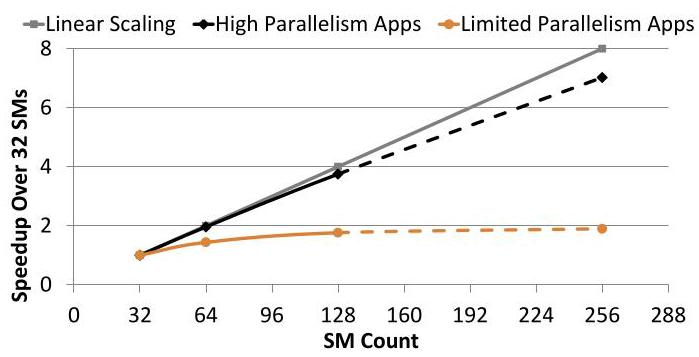

Figure 2: Hypothetical GPU performance scaling with growing number of SMs and memory system. 48 applications are grouped into 33 that have enough parallelism to fill a 256 SMs GPU, and 15 that do not.

> 
图 2：假设的 GPU 性能随流式多处理器（SM）数量和内存系统增长而扩展。48 个应用程序被分为 33 个具有足够并行度以填充 256 个 SM 的 GPU 的应用程序，以及 15 个不具有足够并行度的应用程序。

### 2.2 Multi-GPU Alternative

An alternative approach is to stop scaling single GPU performance, and increase application performance via board- and system-level integration, by connecting multiple maximally sized monolithic GPUs into a multi-GPU system. While conceptually simple, multi-GPU systems present a set of critical challenges. For instance, work distribution across GPUs cannot be done easily and transparently and requires significant programmer expertise [20, 25, 26, 33, 42, 50]. Automated multi-GPU runtime and system-software approaches also face challenges with respect to work partitioning, load balancing, and synchronization [23, 49].

> 
另一种方法是停止扩展单GPU性能，转而通过板级和系统级集成，将多个最大尺寸的单体GPU (monolithic GPU) 连接成一个多GPU系统 (multi-GPU system) 来提高应用性能。虽然概念上简单，但多GPU系统带来了一系列关键挑战。例如，跨GPU的工作分配 (work distribution) 无法轻松且透明地完成，需要大量的程序员专业知识 [20, 25, 26, 33, 42, 50]。自动化的多GPU运行时 (multi-GPU runtime) 和系统软件方法在工作划分 (work partitioning)、负载均衡 (load balancing) 和同步 (synchronization) 方面也面临挑战 [23, 49]。

Moreover, a multi-GPU approach heavily relies on multiple levels of system interconnections. It is important to note that the data movement and synchronization energy dissipated along these interconnects significantly affects the overall performance and energy efficiency of such multi-GPU systems. Unfortunately, the quality of interconnect technology in terms of available bandwidth and energy per bit becomes progressively worse as communication moves off-package, off-board, and eventually off-node, as shown in Table 2 [9, 13, 16, 32, 46]. While the above integration tiers are an essential part of large systems (e.g. [19]), it is more desirable to reduce the off-board and off-node communication by building more capable GPUs.

> 
此外，多GPU方案严重依赖多级系统互连。需要指出的是，沿这些互连耗散的数据移动和同步能耗会显著影响此类多GPU系统的整体性能和能效。不幸的是，随着通信从封装外（off-package）移至板外（off-board）并最终移至节点外（off-node），互连技术在可用带宽和每比特能耗方面的质量会逐渐恶化，如表2所示 [9, 13, 16, 32, 46]。虽然上述集成层级是大型系统（例如 [19]）的重要组成部分，但通过构建功能更强大的GPU来减少板外和节点外通信更为可取。

### 2.3 Package-Level Integration

Recent advances in organic package technology are expected to address today's challenges and enable on-package integration of active components. For example, next generation packages are expected to support a ${77}\mathrm{\;{mm}}$ substrate dimension [30], providing enough room to integrate the MCM-GPU architecture described in this paper. Furthermore, advances in package level signaling technologies such as NVIDIA's Ground-Referenced Signaling (GRS), offer the necessary high-speed, high-bandwidth signaling for organic package substrates. GRS signaling can operate at ${20}\mathrm{{Gb}}/\mathrm{s}$ while consuming just 0.54 pJ/bit in a standard 28nm process [45]. As this technology evolves, we can expect it to support up to multiple TB/s of on-package bandwidth. This makes the on-package signaling bandwidth eight times larger than that of on-board signaling.

> 
有机封装技术 (organic package technology) 的最新进展有望应对当今的挑战，并实现封装上有源组件的集成。例如，下一代封装预计将支持 ${77}\mathrm{\;{mm}}$ 的基板尺寸 [30]，为集成本文所述的多芯片模块 GPU (MCM-GPU) 架构提供足够空间。此外，封装级信号技术的进步，如 NVIDIA 的地参考信号 (Ground-Referenced Signaling, GRS)，为有机封装基板提供了必要的高速、高带宽信号传输。GRS 信号在标准 28nm 工艺下可以 ${20}\mathrm{{Gb}}/\mathrm{s}$ 的速率运行，而每比特功耗仅为 0.54 pJ [45]。随着该技术的发展，我们有望看到它支持高达数 TB/s 的封装内带宽。这使得封装内信号带宽达到板级信号带宽的八倍。

<table><tr><td></td><td>Chip</td><td>Package</td><td>Board</td><td>System</td></tr><tr><td>BW</td><td>10s TB/s</td><td>1.5 TB/s</td><td>256 GB/s</td><td>12.5 GB/s</td></tr><tr><td>Energy</td><td>80 fJ/bit</td><td>0.5 pJ/bit</td><td>10 pJ/bit</td><td>250 pJ/bit</td></tr><tr><td>Overhead</td><td>Low</td><td>Medium</td><td>High</td><td>Very High</td></tr></table>

Table 2: Approximate bandwidth and energy parameters for different integration domains.

> 
表2：不同集成域 (integration domains) 的近似带宽 (bandwidth) 和能量参数 (energy parameters)

The aforementioned factors make package level integration a promising integration tier, that qualitatively falls in between chip-and board-level integration tiers (See Table 2). In this paper, we aim to take advantage of this integration tier and set the ambitious goal of exploring how to manufacture a $2 \times$ more capable GPU, comprising 256 or more SMs within a single GPU package.

> 
上述因素使得封装级集成 (package level integration) 成为一个有前景的集成层级，它在性质上介于芯片级和板级集成层级 (chip- and board-level integration tiers) 之间（见表2）。在本文中，我们旨在利用这一集成层级，并设定了一个雄心勃勃的目标：探索如何制造一个性能提升 $2 \times$ 的GPU，在单个GPU封装内包含256个或更多的流式多处理器 (SM)。

## 3 MULTI-CHIP-MODULE GPUS

The proposed Multi-Chip Module GPU (MCM-GPU) architecture is based on aggregating multiple GPU modules (GPMs) within a single package, as opposed to today's GPU architecture based on a single monolithic die. This enables scaling single GPU performance by increasing the number of transistors, DRAM, and I/O bandwidth per GPU. Figure 1 shows an example of an MCM-GPU architecture with four GPMs on a single package that potentially enables up to $4 \times$ the number of SMs (chip area) and $2 \times$ the memory bandwidth (edge size) compared to the largest GPU in production today.

> 
所提出的多芯片模块 GPU（Multi-Chip Module GPU，MCM-GPU）架构基于在单一封装内聚合多个 GPU 模块（GPU Module，GPM），这与当今基于单一单片式芯片（monolithic die）的 GPU 架构不同。这使得能够通过增加每个 GPU 的晶体管数量、DRAM 和 I/O 带宽来扩展单 GPU 性能。图 1 展示了一个在单一封装上集成四个 GPM 的 MCM-GPU 架构示例，与当前量产的最大 GPU 相比，该架构有可能实现高达 $4 \times$ 的 SM 数量（芯片面积）和 $2 \times$ 的内存带宽（边缘尺寸）。

### 3.1 MCM-GPU Organization

In this paper we propose the MCM-GPU as a collection of GPMs that share resources and are presented to software and programmers as a single monolithic GPU. Pooled hardware resources, and shared I/O are concentrated in a shared on-package module (the SYS + I/O module shown in Figure 1). The goal for this MCM-GPU is to provide the same performance characteristics as a single (unmanufacturable) monolithic die. By doing so, the operating system and programmers are isolated from the fact that a single logical GPU may now be several GPMs working in conjunction. There are two key advantages to this organization. First, it enables resource sharing of underutilized structures within a single GPU and eliminates hardware replication among GPMs. Second, applications will be able to transparently leverage bigger and more capable GPUs, without any additional programming effort.

> 
在本文中，我们提出将 MCM-GPU 设计为一组 GPM 的集合，这些 GPM 共享资源，并以单个整体式 GPU 的形式呈现给软件和程序员。池化的硬件资源和共享的 I/O 集中在一个共享的封装内模块（即图 1 所示的 SYS + I/O 模块）中。该 MCM-GPU 的目标是提供与单个（无法制造的）整体式芯片相同的性能特征。通过这种方式，操作系统和程序员无需感知单个逻辑 GPU 实际上可能是多个 GPM 协同工作的事实。这种组织方式有两个关键优势。首先，它支持在单个 GPU 内对未充分利用的结构进行资源共享，并消除了 GPM 之间的硬件复制。其次，应用程序将能够透明地利用更大、更强大的 GPU，而无需任何额外的编程工作。

Alternatively, on-package GPMs could be organized as multiple fully functional and autonomous GPUs with very high speed interconnects. However, we do not propose this approach due to its drawbacks and inefficient use of resources. For example, if implemented as multiple GPUs, splitting the off-package I/O bandwidth across GPMs may hurt overall bandwidth utilization. Other common architectural components such as virtual memory management, DMA engines, and hardware context management would also be private rather than pooled resources. Moreover, operating systems and programmers would have to be aware of potential load imbalance and data partitioning between tasks running on such an MCM-GPU that is organized as multiple independent GPUs in a single package.

> 
或者，封装上的 GPM 可以组织为多个功能完整且自主的 GPU，并通过极高速的互连进行通信。然而，我们不建议采用这种方法，因为它存在诸多缺点且资源利用效率低下。例如，若实现为多个 GPU，将片外 I/O 带宽拆分给各个 GPM 可能会损害整体带宽利用率。其他常见的架构组件，如虚拟内存管理、DMA 引擎（直接内存访问引擎）和硬件上下文管理，也将成为私有资源而非池化资源。此外，操作系统和程序员必须意识到，在这样一个将多个独立 GPU 组织在单一封装内的 MCM-GPU 上运行的任务之间，可能存在负载不均衡和数据分区问题。

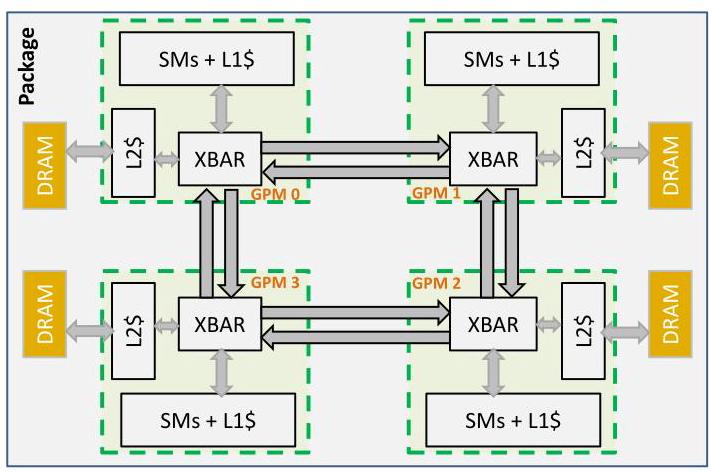

Figure 3: Basic MCM-GPU architecture comprising four GPU modules (GPMs).

> 
图3：基本多芯片模块GPU (MCM-GPU) 架构，由四个GPU模块 (GPMs) 组成。

### 3.2 MCM-GPU and GPM Architecture

As discussed in Sections 1 and 2, moving forward beyond 128 SM counts will almost certainly require at least two GPMs in a GPU. Since smaller GPMs are significantly more cost-effective [31], in this paper we evaluate building a 256 SM GPU out of four GPMs of 64 SMs each. This way each GPM is configured very similarly to today's biggest GPUs. Area-wise each GPM is expected to be 40% - 60% smaller than today's biggest GPU assuming the process node shrinks to ${10}\mathrm{\;{nm}}$ or $7\mathrm{\;{nm}}$ . Each GPM consists of multiple SMs along with their private L1 caches. SMs are connected through the GPM-Xbar to a GPM memory subsystem comprising a local memory-side L2 cache and DRAM partition. The GPM-Xbar also provides connectivity to adjacent GPMs via on-package GRS [45] inter-GPM links.

> 
如第1节和第2节所述，将SM数量扩展到128个以上几乎必然要求GPU中至少包含两个GPM。由于更小的GPM在成本效益上显著更优[31]，本文评估了用四个各含64个SM的GPM构建一个256 SM GPU的方案。这样，每个GPM的配置与当今最大的GPU非常相似。假设工艺节点缩小至${10}\mathrm{\;{nm}}$或$7\mathrm{\;{nm}}$，每个GPM的面积预计比当今最大的GPU小40%–60%。每个GPM由多个SM及其私有的一级缓存 (L1 cache) 组成。SM通过GPM交叉开关 (GPM-Xbar) 连接到GPM内存子系统，该子系统包含本地内存侧二级缓存 (L2 cache) 和DRAM分区。GPM-Xbar还通过封装内GRS [45] GPM间链路提供与相邻GPM的连接。

Figure 3 shows the high-level diagram of this 4-GPM MCM-GPU. Such an MCM-GPU is expected to be equipped with 3TB/s of total DRAM bandwidth and 16MB of total L2 cache. All DRAM partitions provide a globally shared memory address space across all GPMs. Addresses are fine-grain interleaved across all physical DRAM partitions for maximum resource utilization. GPM-Xbars route memory accesses to the proper location (either the local or a remote L2 cache bank) based on the physical address. They also collectively provide a modular on-package ring or mesh interconnect network. Such organization provides spatial traffic locality among local SMs and memory partitions, and reduces on-package bandwidth requirements. Other network topologies are also possible especially with growing number of GPMs, but a full exploration of inter-GPM network topologies is outside the scope of this paper. The L2 cache is a memory-side cache, caching data only from its local DRAM partition. As such, there is only one location for each cache line, and no cache coherency is required across the L2 cache banks. In the baseline MCM-GPU architecture we employ a centralized CTA scheduler that schedules CTAs to MCM-GPU SMs globally in a round-robin manner as SMs become available for execution, as in the case of a typical monolithic GPU.

> 
图 3 展示了该 4-GPM 多芯片模块 GPU (MCM-GPU) 的高层示意图。这样的 MCM-GPU 预计将配备总计 3TB/s 的 DRAM 带宽和 16MB 的总 L2 缓存。所有 DRAM 分区在所有 GPM 之间提供一个全局共享的内存地址空间。地址以细粒度方式交错分布到所有物理 DRAM 分区上，以实现最大的资源利用率。GPM 交叉开关 (GPM-Xbar) 根据物理地址将内存访问路由到正确的位置（本地或远程 L2 缓存体）。它们还共同提供一个模块化的封装内环形或网状互连网络。这种组织方式在本地 SM 和内存分区之间提供了空间流量局部性，并降低了对封装内带宽的需求。其他网络拓扑也是可能的，尤其是随着 GPM 数量的增加，但对 GPM 间网络拓扑的全面探索超出了本文的范围。L2 缓存是一个内存侧缓存，仅缓存其本地 DRAM 分区中的数据。因此，每个缓存行只有一个位置，且 L2 缓存体之间不需要缓存一致性。在基线 MCM-GPU 架构中，我们采用一个集中式 CTA 调度器，当 SM 可用于执行时，以轮询方式将 CTA 全局调度到 MCM-GPU 的 SM 上，这与典型单芯片 GPU 的情况相同。

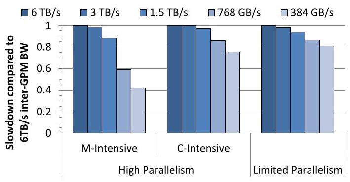

Figure 4: Relative performance sensitivity to inter-GPM link bandwidth for a 4-GPM, 256SM MCM-GPU system.

> 
图4：4-GPM、256SM MCM-GPU 系统对 GPM 间链路带宽 (inter-GPM link bandwidth) 的相对性能敏感度。

The MCM-GPU memory system is a Non Uniform Memory Access (NUMA) architecture, as its inter-GPM links are not expected to provide full aggregated DRAM bandwidth to each GPM. Moreover, an additional latency penalty is expected when accessing memory on remote GPMs. This latency includes data movement time within the local GPM to the edge of the die, serialization and deserialization latency over the inter-GPM link, and the wire latency to the next GPM. We estimate each additional inter-GPM hop latency, for a potentially multi-hop path in the on-package interconnect as 32 cycles. Each additional hop also adds an energy cost compared to a local DRAM access. Even though we expect the MCM-GPU architecture to incur these bandwidth, latency, and energy penalties, we expect them to be much lower compared to off-package interconnects in a multi-GPU system (see Table 2).

> 
MCM-GPU 内存系统是一种非统一内存访问 (Non Uniform Memory Access, NUMA) 架构，因为其 GPM 间链路预计无法为每个 GPM 提供完整的聚合 DRAM 带宽。此外，访问远程 GPM 上的内存时还会产生额外的延迟开销。该延迟包括本地 GPM 内部数据移动到芯片边缘的时间、通过 GPM 间链路的串行化与反串行化延迟，以及到达下一个 GPM 的线路延迟。我们估计，对于封装内互连中可能存在的多跳路径，每增加一跳的延迟为 32 个周期。与本地 DRAM 访问相比，每增加一跳还会增加能量成本。尽管我们预计 MCM-GPU 架构会带来这些带宽、延迟和能量开销，但我们预计它们将远低于多 GPU 系统中封装外互连的开销（见表 2）。

### 3.3 On-Package Bandwidth Considerations

3.3.1 Estimation of On-package Bandwidth Requirements. We calculate the required inter-GPM bandwidth in a generic MCM-GPU. The basic principle for our analysis is that on-package links need to be sufficiently sized to allow full utilization of expensive DRAM bandwidth resources. Let us consider a 4-GPM system with an aggregate DRAM bandwidth of ${4b}$ units (3TB/s in our example), such that $b$ units of bandwidth (768 GB/s in our example) are delivered by the local memory partition directly attached to each GPM. Assuming an L2 cache hit-rate of $\sim  {50}\%$ for the average case, ${2b}$ units of bandwidth would be supplied from each L2 cache partition. In a statistically uniform address distribution scenario, ${2b}$ units of bandwidth out of each memory partition would be equally consumed by all four GPMs. Extending this exercise to capture inter-GPM communication to and from all memory partitions results in the total inter-GPM bandwidth requirement of the MCM-GPU. A link bandwidth of ${4b}$ would be necessary to provide ${4b}$ total DRAM bandwidth. In our 4-GPM MCM-GPU example with 3TB/s of DRAM bandwidth (4b), link bandwidth settings of less than 3TB/s are expected to result in performance degradation due to NUMA effects. Alternatively, inter-GPM bandwidth settings greater than 3TB/s are not expected to yield any additional performance.

> 
3.3.1 封装内带宽需求估算。我们计算了一个通用 MCM-GPU (多芯片模块 GPU) 中所需的 GPM 间带宽 (inter-GPM bandwidth)。我们分析的基本原则是，封装内链路需要足够大的带宽，以充分利用昂贵的 DRAM 带宽资源。考虑一个由 4 个 GPM (GPU 模块) 组成的系统，其聚合 DRAM 带宽为 ${4b}$ 单位（在我们的示例中为 3TB/s），这样每个 GPM 直接连接的本地内存分区可提供 $b$ 单位带宽（在我们的示例中为 768 GB/s）。假设平均情况下二级缓存 (L2 cache) 命中率约为 $\sim  {50}\%$，则每个二级缓存分区将提供 ${2b}$ 单位带宽。在统计均匀的地址分布场景下，每个内存分区中 ${2b}$ 单位的带宽将被所有四个 GPM 均等消耗。将此分析扩展至涵盖所有内存分区之间的 GPM 间通信，即可得出 MCM-GPU 的总 GPM 间带宽需求。要提供 ${4b}$ 的总 DRAM 带宽，就需要 ${4b}$ 的链路带宽。在我们这个 DRAM 带宽为 3TB/s (4b) 的 4-GPM MCM-GPU 示例中，若链路带宽设置低于 3TB/s，预计会因 NUMA (非统一内存访问) 效应导致性能下降。反之，若 GPM 间带宽设置高于 3TB/s，则预计不会带来额外的性能提升。

#### 3.3.2 Performance Sensitivity to On-Package Bandwidth.

Figure 4 shows performance sensitivity of a 256 SM MCM-GPU system as we decrease the inter-GPM bandwidth from an abundant 6TB/s per link all the way to ${384}\mathrm{{GB}}/\mathrm{s}$ . The applications are grouped into two major categories of high- and low-parallelism, similar to Figure 2. The scalable high-parallelism category is further subdivided into memory-intensive and compute-intensive applications (For further details about application categories and simulation methodology see Section 4).

> 
图 4 展示了随着我们将 GPM 间 (inter-GPM) 带宽从每链路充裕的 6TB/s 一路降低至 ${384}\mathrm{{GB}}/\mathrm{s}$ 时，一个 256 SM 的 MCM-GPU (多芯片模块 GPU) 系统的性能敏感性。与图 2 类似，这些应用程序被分为高并行度 (high-parallelism) 和低并行度 (low-parallelism) 两大类。可扩展的高并行度类别进一步细分为内存密集型 (memory-intensive) 和计算密集型 (compute-intensive) 应用程序（有关应用程序类别和模拟方法的更多细节，请参见第 4 节）。

Our simulation results support our analytical estimations above. Increasing link bandwidth to 6TB/s yields diminishing or even no return for an entire suite of applications. As expected, MCM-GPU performance is significantly affected by the inter-GPM link bandwidth settings lower than 3TB/s. For example, applications in the memory-intensive category are the most sensitive to link bandwidth, with ${12}\% ,{40}\%$ , and ${57}\%$ performance degradation for ${1.5}\mathrm{{TB}}/\mathrm{s}$ , 768GB/s, and 384GB/s settings respectively. Compute-intensive applications are also sensitive to lower link bandwidth settings, however with lower performance degradations. Surprisingly, even the non-scalable applications with limited parallelism and low memory intensity show performance sensitivity to the inter-GPM link bandwidth due to increased queuing delays and growing communication latencies in the low bandwidth scenarios.

> 
我们的模拟结果支持了上述分析估计。将链路带宽 (link bandwidth) 提升至 6TB/s 对于整个应用套件而言，收益递减甚至毫无回报。正如预期，多芯片模块 GPU (MCM-GPU) 的性能在低于 3TB/s 的 GPM 间链路带宽 (inter-GPM link bandwidth) 设置下会受到显著影响。例如，内存密集型 (memory-intensive) 类别的应用对链路带宽最为敏感，在 ${1.5}\mathrm{{TB}}/\mathrm{s}$、768GB/s 和 384GB/s 的设置下，性能分别下降 ${12}\%$、${40}\%$ 和 ${57}\%$。计算密集型 (compute-intensive) 应用对较低的链路带宽设置也很敏感，但性能下降幅度较小。令人惊讶的是，即使是并行度有限且内存强度低的不可扩展 (non-scalable) 应用，也表现出对 GPM 间链路带宽的性能敏感性，原因在于低带宽场景下排队延迟 (queuing delays) 增加和通信延迟 (communication latencies) 上升。

#### 3.3.3 On-Package Link Bandwidth Configuration.

NVIDIA's GRS technology can provide signaling rates up to 20 Gbps per wire. The actual on-package link bandwidth settings for our 256 SM MCM-GPU can vary based on the amount of design effort and cost associated with the actual link design complexity, the choice of packaging technology, and the number of package routing layers. Therefore, based on our estimations, an inter-GPM GRS link bandwidth of 768 GB/s (equal to the local DRAM partition bandwidth) is easily realizable. Larger bandwidth settings such as 1.5 TB/s are possible, albeit harder to achieve, and a 3TB/s link would require further investment and innovations in signaling and packaging technology. Moreover, higher than necessary link bandwidth settings would result in additional silicon cost and power overheads. Even though on-package interconnect is more efficient than its on-board counterpart, it is still substantially less efficient than on-chip wires and thus we must minimize inter-GPM link bandwidth consumption as much as possible.

> 
NVIDIA 的接地参考信号 (Ground-Referenced Signaling, GRS) 技术可提供每线高达 20 Gbps 的信号传输速率。我们 256 个流式多处理器 (Streaming Multiprocessor, SM) 的多芯片模块 GPU (Multi-Chip-Module GPU, MCM-GPU) 的实际封装内链路带宽设置，会根据实际链路设计复杂度所需的设计投入和成本、封装技术的选择以及封装布线层数而有所不同。因此，根据我们的估算，768 GB/s（等于本地动态随机存取存储器 (DRAM) 分区带宽）的 GPM 间 GRS 链路带宽是容易实现的。更大的带宽设置（如 1.5 TB/s）是可能的，尽管更难实现，而 3TB/s 的链路则需要进一步在信号和封装技术上进行投入和创新。此外，高于必要水平的链路带宽设置会导致额外的硅片成本和功耗开销。尽管封装内互连比其板载互连更高效，但其效率仍远低于片上连线，因此我们必须尽可能减少 GPM 间链路带宽的消耗。

In this paper we assume a low-effort, low-cost, and low-energy link design point of ${768}\mathrm{{GB}}/\mathrm{s}$ and make an attempt to bridge the performance gap due to relatively lower bandwidth settings via architectural innovations that improve communication locality and essentially eliminate the need for more costly and less energy efficient links. The rest of the paper proposes architectural mechanisms to capture data-locality within GPM modules, which eliminate the need for costly inter-GPM bandwidth solutions.

> 
在本文中，我们假设采用一种低工作量、低成本和低能耗的链路设计点，即 ${768}\mathrm{{GB}}/\mathrm{s}$，并尝试通过提高通信局部性的架构创新来弥合因相对较低的带宽设置而导致的性能差距，从而从根本上消除对更昂贵且能效更低的链路的需求。本文的其余部分提出了在 GPM 模块（GPU 模块）内捕获数据局部性的架构机制，从而消除了对昂贵的 GPM 间带宽解决方案的需求。

## 4 SIMULATION METHODOLOGY

We use an NVIDIA in-house simulator to conduct our performance studies. We model the GPU to be similar to, but extrapolated in size compared to the recently released NVIDIA Pascal GPU [17]. Our SMs are modeled as in-order execution processors that accurately model warp-level parallelism. We model a multi-level cache hierarchy with a private L1 cache per SM and a shared L2 cache. Caches are banked such that they can provide the necessary parallelism to saturate DRAM bandwidth. We model software based cache coherence in the private caches, similar to state-of-the-art GPUs. Table 3 summarizes baseline simulation parameters.

> 
我们使用 NVIDIA 内部模拟器（in-house simulator）进行性能研究。我们建模的 GPU 类似于最近发布的 NVIDIA Pascal GPU [17]，但在规模上进行了外推（extrapolated in size）。我们的 SM 被建模为顺序执行处理器，能够精确模拟 warp 级并行（warp-level parallelism）。我们建模了一个多级缓存层次结构（multi-level cache hierarchy），每个 SM 配备私有 L1 缓存，并共享 L2 缓存。缓存采用分 bank（banked）设计，以提供必要的并行性来饱和 DRAM 带宽（saturate DRAM bandwidth）。我们模拟了私有缓存中基于软件的缓存一致性（software-based cache coherence），类似于当前最先进的 GPU。表 3 总结了基线模拟参数（baseline simulation parameters）。

<table><tr><td>Number of GPMs</td><td>4</td></tr><tr><td>Total number of SMs.</td><td>256</td></tr><tr><td>GPU frequency</td><td>1GHz</td></tr><tr><td>Max number of warps</td><td>64 per SM</td></tr><tr><td>Warp scheduler</td><td>Greedy then Round Robin</td></tr><tr><td>L1 data cache</td><td>128 KB per SM, 128B lines, 4 ways</td></tr><tr><td>Total L2 cache</td><td>16MB, 128B lines, 16 ways</td></tr><tr><td>Inter-GPM interconnect</td><td>768GB/s per link, Ring, 32 cycles/hop</td></tr><tr><td>Total DRAM bandwidth</td><td>3 TB/s</td></tr><tr><td>DRAM latency</td><td>100ns</td></tr></table>

Table 3: Baseline MCM-GPU configuration.

> 
表3：基线MCM-GPU配置。

<table><tr><td>Benchmark</td><td>Abbr.</td><td>Memory Footprint (MB)</td></tr><tr><td>Algebraic multigrid solver</td><td>AMG</td><td>5430</td></tr><tr><td>Neural Network Convolution</td><td>NN-Conv</td><td>496</td></tr><tr><td>Breadth First Search</td><td>BFS</td><td>37</td></tr><tr><td>CFD Euler3D</td><td>CFD</td><td>25</td></tr><tr><td>Classic Molecular Dynamics</td><td>CoMD</td><td>385</td></tr><tr><td>Kmeans clustering</td><td>Kmeans</td><td>216</td></tr><tr><td>Lulesh (size 150)</td><td>Lulesh1</td><td>1891</td></tr><tr><td>Lulesh (size 190)</td><td>Lulesh2</td><td>4309</td></tr><tr><td>Lulesh unstructured</td><td>Lulesh3</td><td>203</td></tr><tr><td>Adaptive Mesh Refinement</td><td>MiniAMR</td><td>5407</td></tr><tr><td>Mini Contact Solid Mechanics</td><td>MnCtct</td><td>251</td></tr><tr><td>Minimum Spanning Tree</td><td>MST</td><td>73</td></tr><tr><td>Nekbone solver (size 18)</td><td>Nekbone1</td><td>1746</td></tr><tr><td>Nekbone solver (size 12)</td><td>Nekbone2</td><td>287</td></tr><tr><td>SRAD (v2)</td><td>Srad-v2</td><td>96</td></tr><tr><td>Shortest path</td><td>SSSP</td><td>37</td></tr><tr><td>Stream Triad</td><td>Stream</td><td>3072</td></tr></table>

Table 4: The high parallelism, memory intensive workloads and their memory footprints ${}^{2}$ .

> 
表4：高并行度、内存密集型工作负载及其内存占用${}^{2}$ .

We study a diverse set of 48 benchmarks that are taken from four benchmark suites. Our evaluation includes a set of production class HPC benchmarks from the CORAL benchmarks [6], graph applications from Lonestar suite [43], compute applications from Rodinia [24], and a set of NVIDIA in-house CUDA benchmarks. Our application set covers a wide range of GPU application domains including machine learning, deep neural networks, fluid dynamics, medical imaging, graph search, etc. We classify our applications into two categories based on the available parallelism - high parallelism applications (parallel efficiency >= 25%) and limited parallelism applications (parallel efficiency $< {25}\%$ ). We further categorize the high parallelism applications based on whether they are memory-intensive (M-Intensive) or compute-intensive (C-Intensive). We classify an application as memory-intensive if it suffers from more than 20% performance degradation if the system memory bandwidth is halved. In the interest of space, we present the detailed per-application results for the M-Intensive category workloads and present only the average numbers for the C-Intensive and limited-parallelism workloads. The set of M-Intensive benchmarks, and their memory footprints are detailed in Table 4. We simulate all our benchmarks for one billion warp instructions, or to completion, whichever occurs first.

> 
我们研究了来自四个基准测试套件的48个多样化的基准测试。我们的评估包括来自CORAL基准测试[6]的一组生产级HPC基准测试、来自Lonestar套件[43]的图应用、来自Rodinia[24]的计算应用，以及一组NVIDIA内部CUDA基准测试。我们的应用集涵盖了广泛的GPU应用领域，包括机器学习、深度神经网络、流体动力学、医学成像、图搜索等。我们根据可用的并行度将应用分为两类——高并行度应用（并行效率 (parallel efficiency) >= 25%）和有限并行度应用（并行效率 $< {25}\%$ ）。我们进一步根据高并行度应用是内存密集型 (memory-intensive, M-Intensive) 还是计算密集型 (compute-intensive, C-Intensive) 对其进行分类。如果某应用在系统内存带宽减半时性能下降超过20%，我们将其归类为内存密集型。为节省篇幅，我们仅展示M-Intensive类别工作负载的详细逐应用结果，而对C-Intensive和有限并行度工作负载仅展示平均值。M-Intensive基准测试集及其内存占用详见表4。我们对所有基准测试模拟十亿条warp指令 (warp instructions)，或直至完成，以先到者为准。

---

${}^{2}$ Other evaluated compute intensive and limited parallelism workloads are not shown in Table 4.

> 
${}^{2}$ 其他评估的计算密集型和有限并行性（limited parallelism）的工作负载未在表4中显示。

---

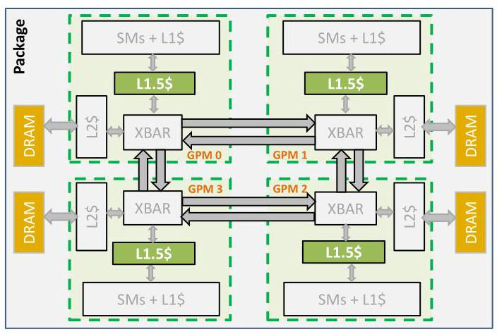

Figure 5: MCM-GPU architecture equipped with L1.5 GPM-side cache to capture remote data and effectively reduce inter-GPM bandwidth and data access latency.

> 
图5：配备GPM侧L1.5缓存（L1.5 GPM-side cache）的MCM-GPU架构，用于捕获远程数据（remote data）并有效降低GPM间带宽（inter-GPM bandwidth）和数据访问延迟（data access latency）。

## 5 OPTIMIZED MCM-GPU

We propose three mechanisms to minimize inter-GPM bandwidth by capturing data locality within a GPM. First, we revisit the MCM-GPU cache hierarchy and propose a GPM-side hardware cache. Second, we augment our architecture with distributed CTA scheduling to exploit inter-CTA data locality within the GPM-side cache and in memory. Finally, we propose data partitioning and locality-aware page placement to further reduce on-package bandwidth requirements. The three mechanisms combined significantly improve MCM-GPU performance.

> 
我们提出三种机制，通过捕捉GPM内的数据局部性来最小化跨GPM带宽。首先，我们重新审视MCM-GPU缓存层次结构，并提出一个GPM端硬件缓存。其次，我们通过分布式CTA调度增强架构，以利用GPM端缓存和内存中的跨CTA数据局部性。最后，我们提出数据分区和局部性感知的页面放置，以进一步降低封装内带宽需求。这三种机制相结合，显著提升了MCM-GPU的性能。

### 5.1 Revisiting MCM-GPU Cache Architecture

5.1.1 Introducing L1.5 Cache.

> 
5.1.1 引入 L1.5 缓存 (L1.5 Cache)

The first mechanism we propose to reduce on-package link bandwidth is to enhance the MCM-GPU cache hierarchy. We propose to augment our baseline GPM architecture in Figure 3 with a GPM-side cache that resides between the L1 and L2 caches. We call this new cache level the L1.5 cache as shown in Figure 5. Architecturally, the L1.5 cache can be viewed as an extension of the L1 cache and is shared by all SMs inside a GPM. We propose that the L1.5 cache stores remote data accesses made by a GPM partition. In other words, all local memory accesses will bypass the L1.5 cache. Doing so reduces both remote data access latency and inter-GPM bandwidth. Both these properties improve performance and reduce energy consumption by avoiding inter-GPM communication.

> 
我们提出的第一种减少封装内链路带宽的机制是增强MCM-GPU的缓存层次结构。我们提议在图3所示的基准GPM架构中，在L1和L2缓存之间增加一个GPM侧缓存。我们将这个新的缓存层级称为L1.5缓存，如图5所示。从架构上看，L1.5缓存可视为L1缓存的扩展，由GPM内部的所有SM共享。我们建议L1.5缓存存储GPM分区发出的远程数据访问。换言之，所有本地内存访问都将绕过L1.5缓存。这样做既能降低远程数据访问延迟，又能减少GPM间带宽。这两项特性通过避免GPM间通信来提升性能并降低能耗。

To avoid increasing on-die transistor overhead for the L1.5 cache, we add it by rebalancing the cache capacity between the L2 and L1.5 caches in an iso-transistor manner. We extend the GPU L1 cache coherence mechanism to the GPM-side L1.5 caches as well. This way, whenever an L1 cache is flushed on a synchronization event such as reaching a kernel execution boundary, the L1.5 cache is flushed as well. Since the L1.5 cache can receive multiple invalidation commands from GPM SMs, we make sure that the L1.5 cache is invalidated only once for each synchronization event.

> 
为避免增加 L1.5 缓存的片上晶体管开销，我们通过以等晶体管数（iso-transistor）方式在 L2 和 L1.5 缓存之间重新平衡缓存容量来添加它。我们还将 GPU L1 缓存一致性机制扩展到 GPM 侧的 L1.5 缓存。这样，每当 L1 缓存在同步事件（例如到达内核执行边界）时被刷新，L1.5 缓存也会被刷新。由于 L1.5 缓存可能从 GPM 的 SM 接收多个无效化命令，我们确保 L1.5 缓存在每个同步事件中仅被无效化一次。

5.1.2 Design Space Exploration for the L1.5 Cache.

> 
5.1.2 L1.5缓存 (L1.5 Cache) 的设计空间探索 (Design Space Exploration)。

We evaluate MCM-GPU performance for three different L1.5 cache capacities: an 8MB L1.5 cache where half of the memory-side L2 cache capacity is moved to the L1.5 caches, a 16MB L1.5 cache where almost all of the memory-side L2 cache is moved to the L1.5 caches ${}^{3}$ , and finally a 32MB L1.5 cache, a non iso-transistor scenario where in addition to moving the entire L2 cache capacity to the L1.5 caches we add an additional 16MB of cache capacity. As the primary objective of the L1.5 cache is to reduce the inter-GPM bandwidth consumption, we evaluate different cache allocation policies based on whether accesses are to the local or remote DRAM partitions.

> 
我们评估了三种不同L1.5缓存（L1.5 cache）容量下的多芯片模块GPU（MCM-GPU）性能：8MB L1.5缓存，其中一半的内存侧L2缓存容量被移至L1.5缓存；16MB L1.5缓存，其中几乎全部的内存侧L2缓存被移至L1.5缓存${}^{3}$；以及32MB L1.5缓存，这是一种非等晶体管数（non iso-transistor）场景，除了将整个L2缓存容量移至L1.5缓存外，我们还额外增加了16MB的缓存容量。由于L1.5缓存的主要目标是减少跨GPU模块（inter-GPM）带宽消耗，我们根据访问是针对本地还是远程动态随机存取存储器分区（DRAM partitions）来评估不同的缓存分配策略。

Figure 6 summarizes the MCM-GPU performance for different L1.5 cache sizes. We report the average performance speedups for each category, and focus on the memory-intensive category by showing its individual application speedups. We observe that performance for the memory-intensive applications is sensitive to the L1.5 cache capacity, while applications in the compute-intensive and limited-parallelism categories show very little sensitivity to various cache configurations. When focusing on the memory-intensive applications, an 8MB iso-transistor L1.5 cache achieves 4% average performance improvement compared to the baseline MCM-GPU. A 16MB iso-transistor L1.5 cache achieves 8% performance improvement, and a 32MB L1.5 cache that doubles the transistor budget achieves an 18.3% performance improvement. We choose the 16MB cache capacity for the L1.5 and keep the total cache area constant.

> 
图6总结了不同L1.5缓存大小下的MCM-GPU性能。我们报告了每个类别的平均性能加速比，并重点关注内存密集型类别，展示了其各个应用程序的加速比。我们观察到，内存密集型应用程序的性能对L1.5缓存容量敏感，而计算密集型和有限并行度类别的应用程序对各种缓存配置的敏感度非常低。聚焦于内存密集型应用程序时，与基线MCM-GPU相比，8MB等晶体管预算（iso-transistor）L1.5缓存实现了4%的平均性能提升。16MB等晶体管预算L1.5缓存实现了8%的性能提升，而晶体管预算翻倍的32MB L1.5缓存则实现了18.3%的性能提升。我们为L1.5选择16MB的缓存容量，并保持总缓存面积不变。

Our simulation results confirm the intuition that the best allocation policy for the L1.5 cache is to only cache remote accesses, and therefore we employ a remote-only allocation policy in this cache. From Figure 6 we can see that such a configuration achieves the highest average performance speedup among the two iso-transistor configurations. It achieves an 11.4% speedup over the baseline for the memory-intensive GPU applications. While the GPM-side L1.5 cache has minimal impact on the compute-intensive GPU applications, it is able to capture the relatively small working sets of the limited-parallelism GPU applications and provide a performance speedup of 3.5% over the baseline. Finally, Figure 6 shows that the L1.5 cache generally helps applications that incur significant performance loss when moving from a 6TB/s inter-GPM bandwidth setting to 768GB/s. This trend can be seen in the figure as the memory-intensive applications are sorted by their inter-GPM bandwidth sensitivity from left to right.

> 
我们的模拟结果证实了这样的直觉：L1.5 缓存（L1.5 cache）的最佳分配策略是仅缓存远程访问，因此我们在此缓存中采用了仅远程分配策略（remote-only allocation policy）。从图6中我们可以看到，这种配置在两种等晶体管配置（iso-transistor configurations）中实现了最高的平均性能加速比（speedup）。对于内存密集型GPU应用程序（memory-intensive GPU applications），它比基线（baseline）实现了11.4%的加速比。虽然GPM侧（GPM-side）L1.5缓存对计算密集型GPU应用程序（compute-intensive GPU applications）的影响微乎其微，但它能够捕获有限并行度的GPU应用程序（limited-parallelism GPU applications）相对较小的工作集（working sets），并比基线提供3.5%的性能加速比。最后，图6显示，L1.5缓存通常有助于那些在从6TB/s的GPM间带宽（inter-GPM bandwidth）设置降至768GB/s时遭受显著性能损失（performance loss）的应用程序。这一趋势可以在图中看到，因为内存密集型应用程序按其对GPM间带宽敏感度（inter-GPM bandwidth sensitivity）从左到右排序。

In addition to improving MCM-GPU performance, the GPM-side L1.5 cache helps to significantly reduce the inter-GPM communication energy associated with on-package data movements. This is illustrated by Figure 7 which summarizes the total inter-GPM bandwidth with and without L1.5 cache. Among the memory-intensive workloads, inter-GPM bandwidth is reduced by as much as 39.9% for the SSSP application and by an average of 16.9%, 36.4%, and 32.9% for memory-intensive, compute-intensive, and limited-parallelism workloads respectively. On average across all evaluated workloads, we observe that inter-GPM bandwidth utilization is reduced by 28% due to the introduction of the GPM-side L1.5 cache.

> 
除了提升 MCM-GPU 性能外，GPM 侧 L1.5 缓存 (GPM-side L1.5 cache) 还有助于显著降低与封装内数据移动 (on-package data movements) 相关的 GPM 间通信能耗 (inter-GPM communication energy)。图 7 对此进行了说明，该图总结了有和没有 L1.5 缓存时的总 GPM 间带宽 (inter-GPM bandwidth)。在内存密集型工作负载 (memory-intensive workloads) 中，SSSP 应用的 GPM 间带宽最多降低了 39.9%，而内存密集型、计算密集型 (compute-intensive) 和有限并行性 (limited-parallelism) 工作负载的 GPM 间带宽平均分别降低了 16.9%、36.4% 和 32.9%。在所有评估的工作负载中，我们观察到，由于引入了 GPM 侧 L1.5 缓存，GPM 间带宽利用率 (inter-GPM bandwidth utilization) 平均降低了 28%。

### 5.2 CTA Scheduling for GPM Locality

In a baseline MCM-GPU similar to monolithic GPU, at kernel launch, a first batch of CTAs are scheduled to the SMs by a centralized scheduler in-order. However during kernel execution, CTAs are allocated to SMs in a round-robin order based on the availability of resources in the SMs to execute a given CTA. In steady state application execution, this could result in consecutive CTAs being scheduled on SMs in different GPMs as shown in Figure 8(a). The colors in this figure represent four groups of contiguous CTAs that could potentially enjoy data locality if they were scheduled in close proximity and share memory system resources. While prior work has attempted to exploit such inter-CTA locality in the private L1 cache [37], here we propose a CTA scheduling policy to exploit this locality across all memory system components associated with GPMs due to the NUMA nature of the MCM-GPU design.

> 
在类似于单体GPU的基线MCM-GPU中，内核启动时，第一批CTA（计算线程阵列）由集中式调度器按顺序调度到SM（流式多处理器）。然而，在内核执行期间，CTA根据SM中执行给定CTA的资源可用性，以轮询（round-robin）顺序分配给SM。在稳态应用执行中，这可能导致连续的CTA被调度到不同GPM（GPU模块）中的SM上，如图8(a)所示。图中的颜色代表四组连续的CTA，如果它们被调度在邻近位置并共享存储系统资源，则可能享有数据局部性。尽管先前的工作已尝试在私有L1缓存中利用这种CTA间局部性[37]，但在此我们提出一种CTA调度策略，以利用MCM-GPU设计因NUMA（非统一内存访问）特性而涉及的所有与GPM关联的存储系统组件上的这种局部性。

---

${}^{3}$ A small cache capacity of 32KB is maintained in the memory-side L2 cache to accelerate atomic operations.

> 
${}^{3}$ 在内存侧二级缓存 (memory-side L2 cache) 中维护了一个 32KB 的小容量缓存，以加速原子操作 (atomic operations)。

---

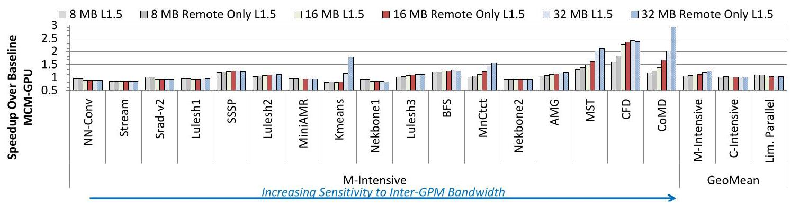

Figure 6: Performance of 256 SM, 768 GB/s inter-GPM BW MCM-GPU with 8MB (iso-transistor), 16 MB (iso-transistor), and 32 MB (non-iso-transistor) L1.5 caches. The M-Intensive applications are sorted by their sensitivity to inter-GPM bandwidth.

> 
图6：配备 8MB（等晶体管数）、16 MB（等晶体管数）和 32 MB（非等晶体管数）L1.5 缓存 (L1.5 caches) 的 256 个流式多处理器 (SM)、768 GB/s GPM 间带宽 (inter-GPM BW) 的多芯片模块 GPU (MCM-GPU) 的性能。内存密集型 (M-Intensive) 应用程序按其 GPM 间带宽 (inter-GPM bandwidth) 敏感度排序。

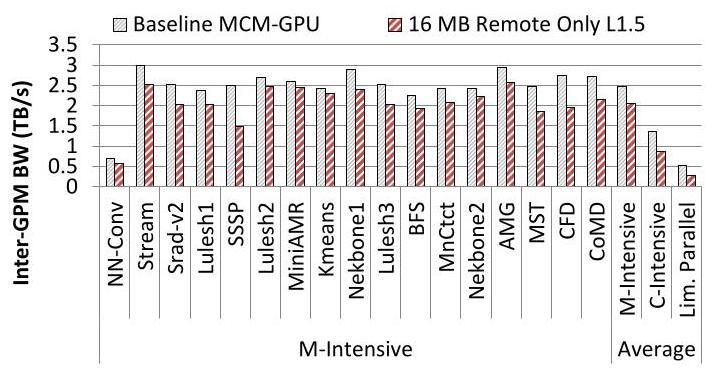

Figure 7: Total inter-GPM bandwidth in baseline MCM-GPU architecture and with a 16MB remote-only L1.5 cache.

> 
图7：基线多芯片模块GPU (MCM-GPU) 架构中以及配备16MB仅远程L1.5缓存 (remote-only L1.5 cache) 时的总GPM间带宽 (inter-GPM bandwidth)。

To this end, we propose using a distributed CTA scheduler for the MCM-GPU. With the distributed CTA scheduler, a group of contiguous CTAs are sent to the same GPM as shown in Figure 8(b). Here we see that all four contiguous CTAs of a particular group are assigned to the same GPM. In the context of the MCM-GPU, doing so enables better cache hit rates in the L1.5 caches and also reduces inter-GPM communication. The reduced inter-GPM communication occurs due to contiguous CTAs sharing data in the L1.5 cache and avoiding data movement over the inter-GPM links. In the example shown in Figure 8, the four groups of contiguous CTAs are scheduled to run on one GPM each, to potentially exploit inter-CTA spatial data locality.

> 
为此，我们提出在MCM-GPU中使用分布式CTA调度器。采用分布式CTA调度器后，一组连续的CTA会被发送到同一个GPM，如图8(b)所示。这里我们看到，特定组的所有四个连续CTA都被分配到同一个GPM。在MCM-GPU的背景下，这样做可以提高L1.5缓存的缓存命中率，并减少GPM间通信。GPM间通信的减少是由于连续CTA在L1.5缓存中共享数据，避免了数据通过GPM间链路移动。在图8所示的示例中，四组连续CTA分别被调度到一个GPM上运行，以潜在地利用CTA间空间数据局部性。

We choose to divide the total number of CTAs in a kernel equally among the number of GPMs, and assign a group of contiguous CTAs to a GPM. Figures 9 and 10 show the performance improvement and bandwidth reduction provided by our proposal when combined with the L1.5 cache described in the previous section. On average, the combination of these proposals improves performance by 23.4% / 1.9% / 5.2% on memory-intensive, compute-intensive, and limited-parallelism workloads respectively. In addition, inter-GPM bandwidth is reduced further by the combination of these proposals. On average across all evaluated workloads, we observe that inter-GPM bandwidth utilization is reduced by 33%.

> 
我们选择将内核中的CTA（协作线程阵列）总数平均分配给各个GPM（GPU模块），并将一组连续的CTA分配给一个GPM。图9和图10展示了我们的方案与上一节所述的L1.5缓存结合使用时，所带来的性能提升和带宽降低。平均而言，这些方案的组合在访存密集型、计算密集型和有限并行度工作负载上，分别将性能提高了23.4% / 1.9% / 5.2%。此外，这些方案的组合进一步降低了GPM间带宽。在所有评估的工作负载中，我们观察到GPM间带宽利用率平均降低了33%。

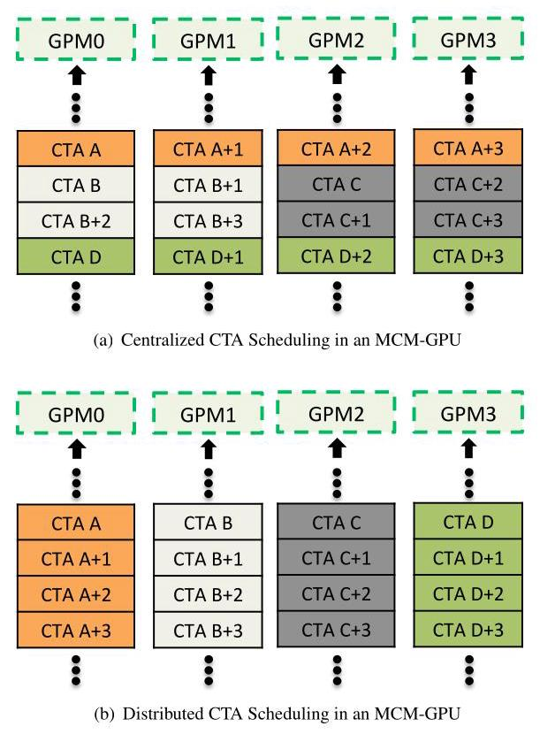

Figure 8: An example of exploiting inter-CTA data locality with CTA scheduling in MCM-GPU.

> 
图 8：在 MCM-GPU 中通过 CTA 调度利用 CTA 间数据局部性（inter-CTA data locality）的示例。

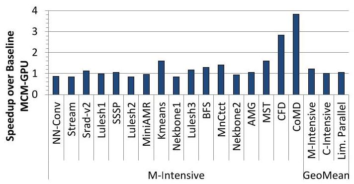

Figure 9: Performance of MCM-GPU system with a distributed scheduler.

> 
图 9：采用分布式调度器的 MCM-GPU 系统性能

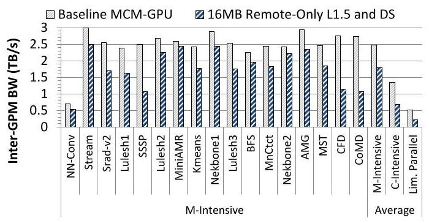

Figure 10: Reduction in inter-GPM bandwidth with a distributed scheduler compared to baseline MCM-GPU architecture.

> 
图 10：与基准 MCM-GPU 架构相比，采用分布式调度器后 GPM 间带宽的减少。

For workloads such as Srad-v2, and Kmeans, the combination of distributed scheduling and remote-only caching provides significant performance improvement while remote-only caching does not improve performance in isolation (Figure 6). This is due to the improved inter-CTA data reuse in the L1.5 cache when distributed scheduling is applied. Although distributed scheduling provides significant additional performance benefit for a number of evaluated workloads, we observe that it causes some applications to experience degradation in performance. Such workloads tend to suffer from the coarse granularity of CTA division and may perform better with a smaller number of contiguous CTAs assigned to each GPM. A case for a dynamic mechanism for choosing the group size could be made. While we do not explore such a design in this paper, we expect a dynamic CTA scheduler to obtain further performance gain.

> 
对于诸如 Srad-v2 和 Kmeans 等工作负载，分布式调度与仅远程缓存的组合带来了显著的性能提升，而仅远程缓存在单独使用时并未提升性能（图 6）。这是因为在应用分布式调度时，L1.5 缓存中的 CTA 间数据重用得到了改善。尽管分布式调度为许多评估的工作负载提供了显著的额外性能收益，但我们观察到它导致某些应用程序的性能下降。此类工作负载往往受 CTA 划分的粗粒度影响，并且可能在为每个 GPM 分配较少数量的连续 CTA 时表现更好。这为选择组大小的动态机制提供了理由。虽然本文未探索此类设计，但我们预期动态 CTA 调度器能获得进一步的性能增益。

### 5.3 Data Partitioning for GPM Locality

Prior work on NUMA systems focuses on co-locating code and data by scheduling threads and placing pages accessed by those threads in close proximity [27, 39, 53]. Doing so limits the negative performance impact of high-latency low-bandwidth inter-node links by reducing remote accesses. In an MCM-GPU system, while the properties of inter-GPM links are superior to traditional inter-package links assumed in prior work (i.e., the ratio of local memory bandwidth compared to remote memory bandwidth is much greater and latency much lower for inter-package links), we revisit page placement policies to reduce inter-GPM bandwidth.

> 
先前关于非统一内存访问（NUMA）系统的研究侧重于通过调度线程并将这些线程访问的页面放置在邻近位置，从而实现代码与数据的协同定位 [27, 39, 53]。这样做通过减少远程访问，限制了高延迟、低带宽跨节点链路对性能的负面影响。在多芯片模块 GPU（MCM-GPU）系统中，尽管跨 GPU 模块（GPM）链路的特性优于先前工作所假设的传统跨封装链路（即，对于跨封装链路，本地内存带宽与远程内存带宽的比率要大得多，且延迟要低得多），我们仍重新审视页面放置策略（page placement policies），以减少跨 GPM 带宽（inter-GPM bandwidth）。

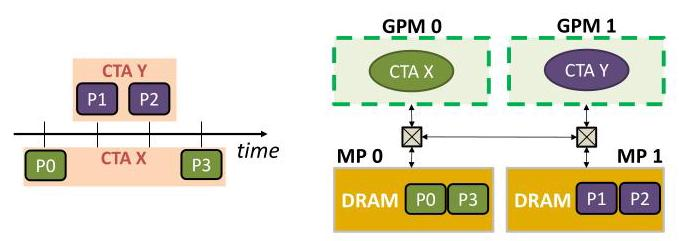

Figure 11: First Touch page mapping policy: (a) Access order. (b) Proposed page mapping policy

> 
图 11：首次接触 (First Touch) 页面映射策略：(a) 访问顺序。(b) 所提出的页面映射策略

To improve MCM-GPU performance, special care is needed for page placement to reduce inter-GPM traffic when possible. Ideally, we would like to map memory pages to physical DRAM partitions such that they would incur as many local memory accesses as possible. In order to maximize DRAM bandwidth utilization and prevent camping on memory channels within the memory partitions, we will still interleave addresses at a fine granularity across the memory channels of each memory partition (analogous to the baseline described in Section 3.2).

> 
为了提升 MCM-GPU 的性能，需要特别关注页面放置，以尽可能减少 GPM 间的流量。理想情况下，我们希望将内存页面映射到物理 DRAM 分区，使得它们能产生尽可能多的本地内存访问。为了最大化 DRAM 带宽利用率并防止内存分区内的内存通道拥塞，我们仍会在每个内存分区的内存通道间以细粒度交错地址（类似于第 3.2 节中描述的基线设计）。

Figure 11 shows a schematic representation of the first touch (FT) page mapping policy we employ in the MCM-GPU. When a page is referenced for the first time in the FT policy, the page mapping mechanism checks which GPM the reference is from and maps the page to the local memory partition (MP) of that GPM. For example, in the figure, page P0 is first accessed by CTA-X which is executing on GPM0. This results in P0 being allocated in MP0. Subsequently, pages P1 and P2 are first accessed by CTA-Y executing on GPM1, which maps those pages to MP1. Following this, page P3 is first accessed by CTA-X, which maps the page to MP0. This policy results in keeping DRAM accesses mostly local. Regardless of the referencing order, if a page is first referenced from CTA-X in GPM0, then the page will be mapped to the MP0, which would keep accesses to that page local and avoid inter-GPM communication. This page placement mechanism is implemented in the software layer by extending current GPU driver functionality. Such driver modification is transparent to the OS, and does not require any special handling from the programmer.

> 
图 11 展示了我们在多芯片模块 GPU（MCM-GPU）中采用的首次接触（first touch, FT）页面映射策略的示意图。在 FT 策略中，当一个页面被首次引用时，页面映射机制会检查该引用来自哪个 GPU 模块（GPM），并将该页面映射到该 GPM 的本地内存分区（memory partition, MP）。例如，在图中，页面 P0 首先被在 GPM0 上执行的协作线程阵列 CTA-X 访问，这导致 P0 被分配到 MP0 中。随后，页面 P1 和 P2 首先被在 GPM1 上执行的 CTA-Y 访问，从而将这些页面映射到 MP1。接着，页面 P3 首先被 CTA-X 访问，将其映射到 MP0。该策略使得 DRAM 访问大部分保持在本地。无论引用顺序如何，如果某个页面首先被 GPM0 中的 CTA-X 引用，那么该页面就会被映射到 MP0，这将使对该页面的访问保持本地化，并避免跨 GPM 通信。这种页面放置机制通过扩展现有 GPU 驱动程序功能在软件层实现。此类驱动程序修改对操作系统（OS）透明，且无需程序员进行任何特殊处理。

An important benefit that comes from the first touch mapping policy is its synergy with our CTA scheduling policy described in Section 5.2. We observe that inter-CTA locality exists across multiple kernels and within each kernel at a page granularity. For example, the same kernel is launched iteratively within a loop in applications that contain convergence loops and CTAs with the same indices are likely to access the same pages. Figure 12 shows an example of this. As a result of our distributed CTA scheduling policy and the first touch page mapping policy described above, we are able to exploit inter-CTA locality across the kernel execution boundary as well. This is enabled due to the fact that CTAs with the same indices are bound to the same GPM on multiple iterative launches of the kernel, therefore allowing the memory pages brought to a GPM's memory partition to continue to be local across subsequent kernel launches. Note that this locality does not show itself without the first touch page mapping policy as it does not increase L1.5 cache hit rates since the caches are flushed at kernel boundaries. However, we benefit significantly from more local accesses when distributed scheduling is combined with first touch mapping.

> 
首次接触映射策略 (first touch mapping policy) 带来的一个重要好处是它与我们在第5.2节中描述的CTA调度策略 (CTA scheduling policy) 的协同作用。我们观察到，跨多个内核 (kernel) 以及每个内核内部，在页面粒度 (page granularity) 上存在CTA间局部性 (inter-CTA locality)。例如，在包含收敛循环 (convergence loops) 的应用程序中，同一个内核在循环内被迭代启动，具有相同索引的CTA很可能访问相同的页面。图12展示了这一现象的一个例子。由于我们上述的分布式CTA调度策略 (distributed CTA scheduling policy) 和首次接触页面映射策略 (first touch page mapping policy)，我们能够跨内核执行边界利用CTA间局部性。这之所以成为可能，是因为具有相同索引的CTA在内核的多次迭代启动中被绑定到同一个GPM (GPU模块)，从而允许被带入某个GPM内存分区的内存页面在后续内核启动中继续保持本地性。请注意，如果没有首次接触页面映射策略，这种局部性不会显现，因为它不会提高L1.5缓存 (L1.5 cache) 的命中率，因为缓存在内核边界处会被清空。然而，当分布式调度与首次接触映射相结合时，我们会从更多的本地访问中显著受益。

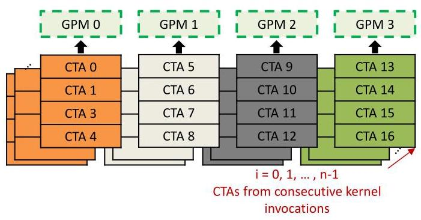

Figure 12: Exploiting cross-kernel CTA locality with First Touch page placement and distributed CTA scheduling

> 
图12：利用首次接触 (First Touch) 页面放置和分布式协作线程数组 (CTA) 调度来利用跨内核协作线程数组 (CTA) 局部性

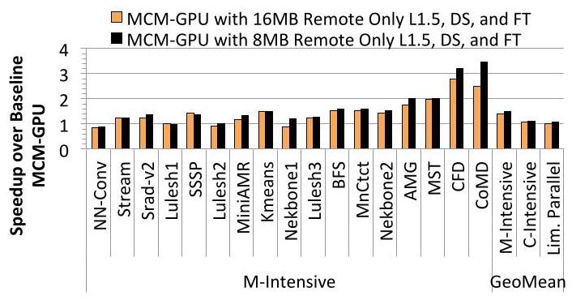

Figure 13: Performance of MCM-GPU with First Touch page placement

> 
图 13：采用首次接触页面放置 (First Touch page placement) 的 MCM-GPU 性能

FT also allows for much more efficient use of the cache hierarchy. Since FT page placement keeps many accesses local to the memory partition of a CTA's GPM, it reduces pressure on the need for an L1.5 cache to keep requests from going to remote memory partitions. In fact using the first touch policy shifts the performance bottleneck from inter-GPM bandwidth to local memory bandwidth. Figure 13 shows this effect. In this figure, we show two bars for each benchmark - FT with DS and 16MB remote-only L1.5 cache, and FT with DS and 8MB remote-only L1.5 cache. The 16MB L1.5 cache leaves room for only 32KB worth of L2 cache in each GPM. This results in sub-optimal performance as there is insufficient cache capacity that is allocated to local memory traffic. We observe that in the presence of FT, an 8MB L1.5 cache along with a larger 8MB L2 achieves better performance. The results show that with this configuration we can obtain 51%/11.3%/7.9% performance improvements compared to the baseline MCM-GPU in memory-intensive, compute-intensive, and limited parallelism applications respectively. Finally Figure 14 shows that with FT page placement a multitude of workloads experience a drastic reduction in their inter-GPM traffic, sometimes almost eliminating it completely. On average our proposed MCM-GPU achieves a $5 \times$ reduction in inter-GPM bandwidth compared to the baseline MCM-GPU.

> 
FT 还允许更高效地利用缓存层次结构。由于 FT 页面放置策略使许多访问局限于 CTA 所在 GPM 的内存分区，这降低了对 L1.5 缓存的需求，从而减少了发往远程内存分区的请求。事实上，采用首次接触策略会将性能瓶颈从 GPM 间带宽转移到本地内存带宽。图 13 展示了这一效果。在该图中，我们为每个基准测试展示了两组数据——采用 FT 与 DS 并配备 16MB 仅远程 L1.5 缓存，以及采用 FT 与 DS 并配备 8MB 仅远程 L1.5 缓存。16MB 的 L1.5 缓存导致每个 GPM 中仅剩 32KB 的 L2 缓存空间。这会造成性能欠佳，因为分配给本地内存流量的缓存容量不足。我们观察到，在采用 FT 的情况下，8MB 的 L1.5 缓存搭配更大的 8MB L2 缓存能实现更优性能。结果表明，采用此配置，在内存密集型、计算密集型和有限并行度应用中，我们分别能获得 51%/11.3%/7.9% 的性能提升（相较于基线 MCM-GPU）。最后，图 14 显示，采用 FT 页面放置后，大量工作负载的 GPM 间流量显著减少，有时几乎完全消除。平均而言，我们提出的 MCM-GPU 相较于基线 MCM-GPU 实现了 $5 \times$ 的 GPM 间带宽降低。

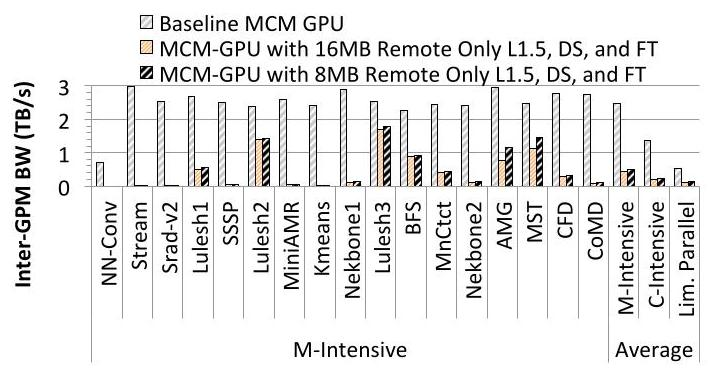

Figure 14: Reduction in inter-GPM bandwidth with First Touch page placement

> 
图14：采用首次接触（First Touch）页面放置策略后，GPM间带宽的减少

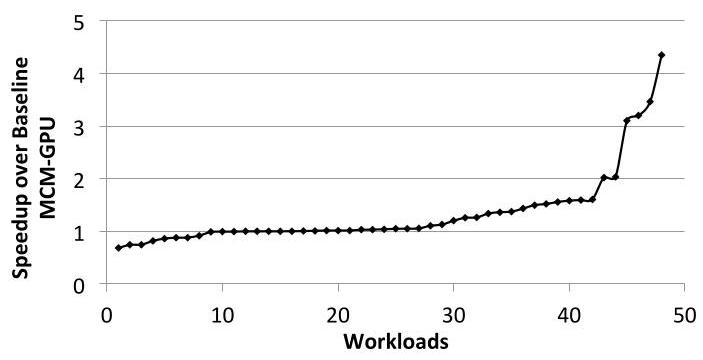

Figure 15: S-curve summarizing the optimized MCM-GPU performance speedups for all workloads.

> 
图15：总结所有工作负载下优化后的多芯片模块GPU (MCM-GPU) 性能加速比 (performance speedups) 的S曲线 (S-curve)。

### 5.4 MCM-GPU Performance Summary

Figure 15 shows the s-curve depicting the performance improvement of MCM-GPU for all workloads in our study. Of the evaluated 48 workloads, 31 workloads experience performance improvement while 9 workloads suffer some performance loss. M-Intensive workloads such as CFD, CoMD and others experience drastic reduction in inter-GPM traffic due to our optimizations and thus experience significant performance gains of up to ${3.2} \times$ and ${3.5} \times$ respectively. Workloads in the C-Intensive and limited parallelism categories that show high sensitivity to inter-GPM bandwidth also experience significant performance gains (e.g. ${4.4} \times$ for SP and ${3.1} \times$ for XSBench). On the flip side, we observe two side-effects of the proposed optimizations. For example, for workloads such as DWT and NN that have limited parallelism and are inherently insensitive to inter-GPM bandwidth, the additional latency introduced by the presence of the L1.5 cache can lead to performance degradation by up to 14.6%. Another reason for potential performance loss as observed in Streamcluster is due to the reduced capacity of on-chip writeback L2 caches ${}^{4}$ which leads to increased write traffic to DRAM. This results in performance loss of up to 25.3% in this application. Finally, we observe that there are workloads (two in our evaluation set) where different CTAs perform unequal amount of work. This leads to workload imbalance due to the coarse-grained distributed scheduling. We leave further optimizations of the MCM-GPU architecture that would take advantage of this potential opportunity for better performance to future work.

> 
图15展示了S曲线（s-curve），描绘了本研究中所有工作负载在MCM-GPU上的性能提升情况。在评估的48个工作负载中，31个负载获得了性能提升，而9个负载出现了一定程度的性能下降。内存密集型（M-Intensive）工作负载，如CFD、CoMD等，由于我们的优化措施，其GPM间（inter-GPM）流量大幅减少，因此分别获得了高达${3.2} \times$和${3.5} \times$的显著性能提升。计算密集型（C-Intensive）和有限并行度类别中，对GPM间带宽高度敏感的工作负载也获得了显著的性能提升（例如，SP提升了${4.4} \times$，XSBench提升了${3.1} \times$）。另一方面，我们观察到所提优化方案的两个副作用。例如，对于DWT和NN这类并行度有限且本身对GPM间带宽不敏感的工作负载，L1.5缓存（L1.5 cache）引入的额外延迟可能导致性能下降高达14.6%。在Streamcluster中观察到的另一个潜在性能损失原因是，片上写回L2缓存（on-chip writeback L2 caches）${}^{4}$的容量减少，导致写入动态随机存取存储器（DRAM）的流量增加。这导致该应用的性能损失高达25.3%。最后，我们观察到有些工作负载（评估集中有两个）中，不同的协作线程阵列（CTA）执行的工作量不相等。这导致粗粒度分布式调度下的工作负载不均衡。我们将利用这一潜在机会进一步优化MCM-GPU架构以获得更好性能的工作留待未来研究。

---

${}^{4}$ L1.5 caches are set up as write-through to support software based GPU coherence implementation

> 
${}^{4}$ L1.5 缓存被设置为写通（write-through）以支持基于软件的 GPU 一致性实现

---

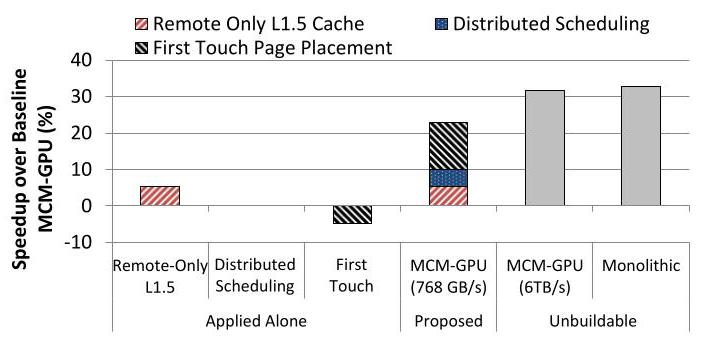

Figure 16: Breakdown of the sources of performance improvements of optimized MCM-GPU when applied alone and together. Three proposed architectural improvements for MCM-GPU almost close the gap with unbuildable monolithic GPU.

> 
图 16：优化后的多芯片模块 GPU (MCM-GPU) 在单独应用和组合应用时性能提升来源的分解。为多芯片模块 GPU (MCM-GPU) 提出的三项架构改进几乎弥合了与无法制造的单片 GPU (monolithic GPU) 之间的差距。

In summary, we have proposed three important mircroarchitec-tural enhancements to the baseline MCM-GPU architecture: (i) a remote-only L1.5 cache, (ii) a distributed CTA scheduler, and (iii) a first touch data page placement policy. It is important to note that these independent optimizations, work best when they are combined together. Figure 16 shows the performance benefit of employing the three mechanisms individually. The introduction of the L1.5 cache provides a 5.2% performance. Distributed scheduling and first touch page placement on the other hand, do not improve performance at all when applied individually. In fact they can even lead to performance degradation, e.g., -4.7% for the first touch page placement policy.

> 
总之，我们为基线 MCM-GPU 架构提出了三项重要的微架构增强 (mircroarchitec-tural enhancements)：(i) 一个仅远程 L1.5 缓存 (remote-only L1.5 cache)，(ii) 一个分布式 CTA 调度器 (distributed CTA scheduler)，以及 (iii) 一个首次接触数据页放置策略 (first touch data page placement policy)。重要的是要注意，这些独立的优化在组合在一起时效果最佳。图 16 展示了单独采用这三种机制的性能收益。引入 L1.5 缓存提供了 5.2% 的性能。另一方面，分布式调度和首次接触页放置单独应用时根本不提高性能。事实上，它们甚至可能导致性能下降，例如，首次接触页放置策略为 -4.7%。

However, when all three mechanisms are applied together, we observe that the optimized MCM-GPU, achieves a speedup of 22.8% as shown in Figure 16. We observe that combining distributed scheduling with the remote-only cache improves cache performance and reduces the inter-GPM bandwidth further. This results in an additional 4.9% performance benefit compared to having just the remote-only cache while also reducing inter-GPM bandwidth by an additional 5%. Similarly, when first touch page placement is employed in conjunction with the remote-only cache and distributed scheduling, it provides an additional speedup of 12.7% and reduces inter-GPM bandwidth by an additional 47.2%. These results demonstrate that our proposed enhancements not only exploit the currently available data locality within a program but also improve it. Collectively, all three locality-enhancement mechanisms achieve a $5 \times$ reduction in inter-GPM bandwidth. These optimizations enable the proposed MCM-GPU to achieve a 45.5% speedup compared to the largest implementable monolithic GPU and be within ${10}\%$ of an equally equipped albeit unbuildable monolithic GPU.

> 
然而，当这三种机制同时应用时，我们观察到优化后的多芯片模块GPU (MCM-GPU) 实现了22.8%的加速比，如图16所示。我们发现，将分布式调度 (distributed scheduling) 与仅远程缓存 (remote-only cache) 相结合，可以提升缓存性能并进一步降低GPM间带宽 (inter-GPM bandwidth)。与仅使用仅远程缓存相比，这带来了额外4.9%的性能提升，同时将GPM间带宽额外降低了5%。类似地，当首次接触页面放置 (first touch page placement) 与仅远程缓存和分布式调度共同使用时，它提供了额外12.7%的加速比，并将GPM间带宽额外降低了47.2%。这些结果表明，我们提出的增强方案不仅利用了程序中当前可用的数据局部性，而且还改善了它。总体而言，这三种局部性增强机制 (locality-enhancement mechanisms) 共同实现了 $5 \times$ 的GPM间带宽降低。这些优化使所提出的MCM-GPU相较于可制造的最大单芯片GPU (monolithic GPU) 实现了45.5%的加速比，并且性能与同等配置但无法制造的单芯片GPU相差在 ${10}\%$ 以内。

## 6 MCM-GPU VS MULTI-GPU

An alternative way of scaling GPU performance is to build multi-GPU systems. This section compares performance and energy efficiency of the MCM-GPU and two possible multi-GPU systems.

> 
扩展 GPU 性能的另一种方法是构建多 GPU 系统 (multi-GPU systems)。本节比较了多芯片模块 GPU (MCM-GPU) 与两种可能的多 GPU 系统的性能和能效。

### 6.1 Performance vs Multi-GPU

A system with 256 SMs can also be built by interconnecting two maximally sized discrete GPUs of 128 SMs each. Similar to our MCM-GPU proposal, each GPU has a private 128KB L1 cache per SM, an 8MB memory-side cache, and 1.5 TB/s of DRAM bandwidth. We assume such a configuration as a maximally sized future monolithic GPU design. We assume that two GPUs are interconnected via the next generation of on-board level links with ${256}\mathrm{{GB}}/\mathrm{s}$ of aggregate bandwidth, improving upon the 160 GB/s commercially available today [17]. For the sake of comparison with the MCM-GPU we assume the multi-GPU to be fully transparent to the programmer. This is accomplished by assuming the following two features: (i) a unified memory architecture between two peer GPUs, where both GPUs can access local and remote DRAM resources with load/store semantics, (ii) a combination of system software and hardware which automatically distributes CTAs of the same kernel across GPUs.

> 
一个拥有256个SM的系统也可以通过将两个最大尺寸的独立GPU（每个128个SM）互连来构建。与我们的MCM-GPU方案类似，每个GPU的每个SM都配有私有的128KB L1缓存，一个8MB的内存侧缓存，以及1.5 TB/s的DRAM带宽。我们将这种配置假定为未来最大尺寸的单片GPU设计。我们假设两个GPU通过下一代板级链路互连，总带宽为${256}\mathrm{{GB}}/\mathrm{s}$，这比目前商用可用的160 GB/s有所提升[17]。为了与MCM-GPU进行比较，我们假设多GPU对程序员完全透明。这通过假设以下两个特性来实现：(i) 两个对等GPU之间采用统一内存架构，其中两个GPU都可以通过加载/存储语义访问本地和远程DRAM资源；(ii) 系统软件和硬件的组合能够自动将同一内核的计算线程阵列（CTA）分布到各个GPU上。

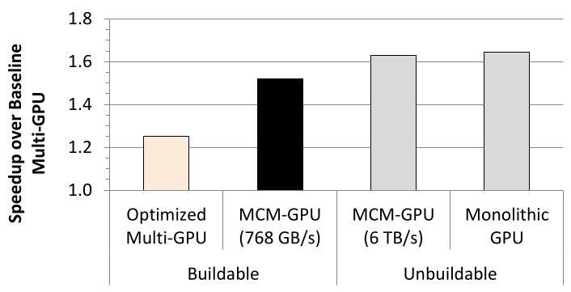

Figure 17: Performance comparison of MCM-GPU and Multi-GPU.

> 
图17：多芯片模块GPU (MCM-GPU) 与多GPU (Multi-GPU) 的性能比较

In such a multi-GPU system the challenges of load imbalance, data placement, workload distribution and interconnection bandwidth discussed in Sections 3 and 5, are amplified due to severe NUMA effects from the lower inter-GPU bandwidth. Distributed CTA scheduling together with the first-touch page allocation mechanism (described respectively in Sections 5.2 and 5.3) are also applied to the multi-GPU. We refer to this design as a baseline multi-GPU system. Although a full study of various multi-GPU design options was not performed, alternative options for CTA scheduling and page allocation were investigated. For instance, a fine grain CTA assignment across GPUs was explored but it performed very poorly due to the high interconnect latency across GPUs. Similarly, round-robin page allocation results in very low and inconsistent performance across our benchmark suite.

> 
在这样的多GPU系统中，第3节和第5节讨论的负载不均衡、数据放置、工作负载分布和互连带宽等挑战，由于较低的GPU间带宽带来的严重非统一内存访问效应（NUMA effects）而被放大。分布式协作线程阵列调度（Distributed CTA scheduling）与首次接触页面分配机制（first-touch page allocation mechanism）（分别在第5.2节和第5.3节中描述）也被应用于该多GPU系统。我们将这种设计称为基线多GPU系统（baseline multi-GPU system）。尽管没有对各种多GPU设计选项进行全面研究，但研究了CTA调度和页面分配的替代选项。例如，探索了跨GPU的细粒度CTA分配（fine grain CTA assignment），但由于跨GPU的高互连延迟，其性能非常差。类似地，轮询页面分配（round-robin page allocation）在我们的基准测试套件（benchmark suite）中导致非常低且不一致的性能。

Remote memory accesses are even more expensive in a multi-GPU when compared to MCM-GPU due to the relative lower quality of on-board interconnect. As a result, we optimize the multi-GPU baseline by adding GPU-side hardware caching of remote GPU memory, similar to the L1.5 cache proposed for MCM-GPU. We have explored various L1.5 cache allocation policies and configurations, and observed the best average performance with a half of the L2 cache capacity moved to the L1.5 caches that are dedicated to caching remote DRAM accesses, and another half retained as the L2 cache for caching local DRAM accesses. We refer to this as the optimized multi-GPU.

> 
与 MCM-GPU 相比，多 GPU 系统中的远程内存访问代价更高，因为板载互连的质量相对较低。因此，我们通过添加 GPU 端硬件缓存来缓存远程 GPU 内存，类似于为 MCM-GPU 提出的 L1.5 缓存，从而优化多 GPU 基线。我们探索了各种 L1.5 缓存分配策略和配置，并观察到最佳平均性能是将一半的 L2 缓存容量移至专用于缓存远程 DRAM 访问的 L1.5 缓存，而另一半保留为用于缓存本地 DRAM 访问的 L2 缓存。我们将此称为优化后的多 GPU。

Figure 17 summarizes the performance results for different buildable GPU organizations and unrealizable hypothetical designs, all normalized to the baseline multi-GPU configuration. The optimized multi-GPU which has GPU-side caches outperforms the baseline multi-GPU by an average of 25.1%. Our proposed MCM-GPU on the other hand, outperforms the baseline multi-GPU by an average of 51.9% mainly due to higher quality on-package interconnect.

> 
图17总结了不同可构建的GPU架构 (buildable GPU organizations) 和无法实现的假设性设计 (unrealizable hypothetical designs) 的性能结果，所有结果均归一化到基准多GPU配置 (baseline multi-GPU configuration)。具有GPU端缓存 (GPU-side caches) 的优化多GPU (optimized multi-GPU) 比基准多GPU平均性能高出25.1%。另一方面，我们提出的多芯片模块GPU (MCM-GPU) 比基准多GPU平均性能高出51.9%，这主要归功于更高质量的封装内互连 (on-package interconnect)。

### 6.2 MCM-GPU Efficiency

Besides enabling performance scalability, MCM-GPUs are energy and cost efficient. MCM-GPUs are energy efficient as they enable denser integration of GPU modules on a package that alternatively would have to be connected at a PCB level as in a multi-GPU case. In doing so, MCM-GPUs require significantly smaller system footprint and utilize more efficient interconnect technologies, e.g., 0.5 pJ/b on-package vs 10 pJ/b on-board interconnect. Moreover, if we assume almost constant GPU and system power dissipation, the performance advantages of the MCM-GPU translate to additional energy savings. In addition, superior transistor density achieved by the MCM-GPU approach allows to lower GPU operating voltage and frequency. This moves the GPU to a more power-efficient operating point on the transistor voltage-frequency curve. Consequently, it allows trading off ample performance (achieved via abundant parallelism and number of transistors in package) for better power efficiency.

> 
除了实现性能可扩展性之外，多芯片模块GPU (MCM-GPU) 还具有能效和成本效益。MCM-GPU 具有能效，因为它们能够在封装上实现更密集的GPU模块集成，否则这些模块将像多GPU情况那样在PCB层面连接。通过这样做，MCM-GPU 所需的系统占用空间显著减小，并利用更高效的互连技术，例如，封装上互连为 0.5 pJ/b，而板上互连为 10 pJ/b。此外，如果假设GPU和系统功耗几乎恒定，MCM-GPU 的性能优势将转化为额外的节能。此外，MCM-GPU 方法实现的更高晶体管密度允许降低GPU的工作电压和频率。这将GPU移动到晶体管电压-频率曲线上能效更高的工作点。因此，它允许用充足的性能（通过丰富的并行性和封装内晶体管数量实现）换取更高的能效。

Finally, at a large scale such as HPC clusters the MCM-GPU improves performance density and as such reduces the number of GPUs per node and/or number of nodes per cabinet. This leads to a smaller number of cabinets at the system level. Smaller total system size translates to smaller number of communicating agents, smaller network size and shorter communication distances. These result in lower system level energy dissipation on communication, power delivery, and cooling. Similarly, higher system density also leads to total system cost advantages and lower overheads as described above. Moreover, MCM-GPUs are expected to result in lower GPU silicon cost as they replace large dies with medium size dies that have significantly higher silicon yield and cost advantages.

> 
最后，在大规模场景如高性能计算 (HPC) 集群中，多芯片模块GPU (MCM-GPU) 提高了性能密度 (performance density)，因此减少了每节点GPU数 (GPUs per node) 和/或每机柜节点数 (nodes per cabinet)。这导致系统级别的机柜 (cabinets) 数量更少。更小的总系统规模意味着更少的通信代理 (communicating agents)、更小的网络规模 (network size) 和更短的通信距离 (communication distances)。这些带来了系统级通信、供电 (power delivery) 和散热 (cooling) 方面更低的能耗 (energy dissipation)。同样，更高的系统密度 (system density) 也带来了如上所述的系统总成本 (total system cost) 优势以及更低的开销 (overheads)。此外，MCM-GPU 有望降低GPU硅成本 (silicon cost)，因为它们用中等尺寸芯片 (medium size dies) 替代了大芯片 (large dies)，而中等尺寸芯片具有显著更高的硅良率 (silicon yield) 和成本优势。

## 7 RELATED WORK

Multi-Chip-Modules are an attractive design point that have been extensively used in the industry to integrate multiple heterogeneous or homogeneous chips in the same package. For example, on the homogeneous front, IBM Power 7 [5] integrates 4 modules of 8 cores each, and AMD Opteron 6300 [4] integrates 2 modules of 8 cores each. On the heterogeneous front, the IBM z196 [3] integrates 6 processors with 4 cores each and 2 storage controller units in the same package. The Xenos processor used in the Microsoft Xbox360 [1] integrates a GPU and an EDRAM memory module with its memory controller. Similarly, Intel offers heterogeneous and homogeneous MCM designs such as the Iris Pro [11] and the Xeon X5365 [2] processors respectively. While MCMs are popular in various domains, we are unaware of any attempt to integrate homogeneous high performance GPU modules on the same package in an OS and programmer transparent fashion. To the best of our knowledge, this is the first effort to utilize MCM technology to scale GPU performance.

> 
多芯片模块（Multi-Chip-Module）是一种极具吸引力的设计思路，已在工业界被广泛用于在同一封装内集成多个异构或同构芯片。例如，在同构方面，IBM Power 7 [5] 集成了 4 个各含 8 核的模块，AMD Opteron 6300 [4] 则集成了 2 个各含 8 核的模块。在异构方面，IBM z196 [3] 在同一封装内集成了 6 个各含 4 核的处理器和 2 个存储控制器单元。微软 Xbox360 [1] 中使用的 Xenos 处理器集成了一个 GPU 和一个带内存控制器的 EDRAM 内存模块。类似地，英特尔也提供了异构和同构的 MCM 设计，例如分别对应 Iris Pro [11] 和 Xeon X5365 [2] 处理器。尽管 MCM 在多个领域广受欢迎，但我们尚未发现任何尝试以对操作系统和程序员透明的方式，在同一封装内集成同构高性能 GPU 模块的工作。据我们所知，这是首次利用 MCM 技术来扩展 GPU 性能的努力。

MCM package level integration requires efficient signaling technologies. Recently, Kannan et al. [31] explored various packaging and architectural options for disintegrating multi-core CPU chips and studied its suitability to provide cache-coherent traffic in an efficient manner. Most recent work in the area of low-power links has focused on differential signaling because of its better noise immunity and lower noise generation [40, 44]. Some contemporary MCMs, like those used in the Power 6 processors, have over 800 single-ended links, operating at speeds of up to 3.2 Gbps, from a single processor [28]. NVIDIA's Ground-Referenced Signaling (GRS) technology for organic package substrates has been demonstrated to work at 20 Gbps while consuming just ${0.54}\mathrm{{pJ}}/$ bit in a standard 28nm process [45].

> 
MCM 封装级集成需要高效的信号传输技术。最近，Kannan 等人 [31] 探索了用于分解多核 CPU 芯片的各种封装和架构选项，并研究了其以高效方式提供缓存一致性流量的适用性。在低功耗链路领域，近期大多数工作都集中在差分信号 (differential signaling) 上，因为它具有更好的抗噪性和更低的噪声产生 [40, 44]。一些当代的 MCM，例如用于 Power 6 处理器的那些，从单个处理器中提供了超过 800 条单端链路 (single-ended links)，运行速度高达 3.2 Gbps [28]。NVIDIA 针对有机封装基板的地参考信号 (Ground-Referenced Signaling, GRS) 技术已被证明可在标准 28nm 工艺中以 20 Gbps 的速度工作，而每比特仅消耗 ${0.54}\mathrm{{pJ}}/$ bit [45]。

The MCM-GPU design exposes a NUMA architecture. One of the main mechanisms to improve the performance of NUMA systems is to preserve locality by assigning threads in close proximity to the data. In a multi-core domain, existing work tries to minimize the memory access latency by thread-to-core mapping [21, 38, 51], or memory allocation policy $\left\lbrack  {{22},{27},{34}}\right\rbrack$ . Similar problems exist in MCM-GPU systems where the primary bottleneck is the inter-GPM interconnection bandwidth. Moreover, improved CTA scheduling has been proposed to exploit the inter-CTA locality, higher cache hit ratios, and memory bank-level parallelism [37, 41, 52] for monolithic GPUs. In our case, distributed CTA scheduling along with the first-touch memory mapping policy exploits inter-CTA localities both within a kernel and across multiple kernels, and improves efficiency of the newly introduced GPM-side L1.5 cache.

> 
MCM-GPU 设计暴露了一种 NUMA 架构。提升 NUMA 系统性能的主要机制之一，是通过将线程分配到靠近数据的位置来保持局部性。在多核领域，现有工作尝试通过线程到核心的映射 [21, 38, 51] 或内存分配策略 $\left\lbrack  {{22},{27},{34}}\right\rbrack$ 来最小化内存访问延迟。类似的问题也存在于 MCM-GPU 系统中，其主要瓶颈是 GPM 间互连带宽。此外，已有研究提出改进的 CTA 调度，以利用单芯片 GPU 的 CTA 间局部性、更高的缓存命中率和存储体级并行性 [37, 41, 52]。在我们的方案中，分布式 CTA 调度与首次接触内存映射策略相结合，利用了内核内部及跨多个内核的 CTA 间局部性，并提高了新引入的 GPM 侧 L1.5 缓存的效率。

Finally, we propose to expose the MCM-GPU as a single logical GPU via hardware innovations and extensions to the driver software to provide programmer- and OS-transparent execution. While there have been studies that propose techniques to efficiently utilize multi-GPU systems [20, 23, 33, 36], none of the proposals provide a fully transparent approach suitable for MCM- GPUs.

> 
最后，我们提出通过硬件创新和驱动软件扩展，将多芯片模块GPU (MCM-GPU) 暴露为单一逻辑GPU，以提供对程序员和操作系统透明的执行。虽然已有研究提出高效利用多GPU系统的技术 [20, 23, 33, 36]，但这些方案均未提供适合 MCM-GPU 的完全透明方法。

## 8 CONCLUSIONS

Many of today's important GPU applications scale well with GPU compute capabilities and future progress in many fields such as exas-cale computing and artificial intelligence will depend on continued GPU performance growth. The greatest challenge towards building more powerful GPUs comes from reaching the end of transistor density scaling, combined with the inability to further grow the area of a single monolithic GPU die. In this paper we propose MCM-GPU, a novel GPU architecture that extends GPU performance scaling at a package level, beyond what is possible today. We do this by partitioning the GPU into easily manufacturable basic building blocks (GPMs), and by taking advantage of the advances in signaling technologies developed by the circuits community to connect GPMs on-package in an energy efficient manner.

> 
当今许多重要的 GPU 应用都能很好地随 GPU 计算能力扩展，而百亿亿次计算（exas-cale computing）和人工智能等众多领域的未来进展，将依赖于 GPU 性能的持续增长。构建更强大 GPU 的最大挑战，源于晶体管密度缩放已接近极限，同时单个单片式 GPU 芯片（monolithic GPU die）的面积也无法继续增大。在本文中，我们提出了 MCM-GPU，这是一种新型 GPU 架构，能够在封装层面将 GPU 性能扩展至超越当前可能的上限。我们通过将 GPU 划分为易于制造的基本构建模块（GPM），并利用电路领域（circuits community）在信号传输技术（signaling technologies）方面取得的进展，以高能效的方式在封装内（on-package）连接这些 GPM 来实现这一目标。

We discuss the details of the MCM-GPU architecture and show that our MCM-GPU design naturally lends itself to many of the historical observations that have been made in NUMA systems. We explore the interplay of hardware caches, CTA scheduling, and data placement in MCM-GPUs to optimize this architecture. We show that with these optimizations, a 256 SMs MCM-GPU achieves 45.5% speedup over the largest possible monolithic GPU with 128 SMs. Furthermore, it performs 26.8% better than an equally equipped discrete multi-GPU, and its performance is within 10% of that of a hypothetical monolithic GPU that cannot be built based on today's technology roadmap.

> 
我们讨论了多芯片模块GPU (MCM-GPU) 架构的细节，并表明我们的MCM-GPU设计自然地契合了在非统一内存访问 (NUMA) 系统中已有的许多历史观察结果。我们探索了MCM-GPU中硬件缓存、协作线程阵列 (CTA) 调度以及数据放置之间的相互作用，以优化该架构。我们表明，通过这些优化，一个拥有256个流式多处理器 (SM) 的MCM-GPU相较于最大可能的128个SM的单片GPU实现了45.5%的加速比。此外，它的性能比同等配置的离散多GPU系统高出26.8%，并且其性能与一个基于当今技术路线图无法构建的假设性单片GPU的性能相差在10%以内。

## REFERENCES

[1] 2005. Xenos: XBOX360 GPU. (2005). http://fileadmin.cs.lth.se/cs/Personal/ Michael_Doggett/talks/eg05-xenos-doggett.pdf Accessed: 2016-08-19.

> 
[1] 2005. Xenos：XBOX360 图形处理器 (GPU)。(2005)。http://fileadmin.cs.lth.se/cs/Personal/ Michael_Doggett/talks/eg05-xenos-doggett.pdf 访问日期：2016-08-19。

[2] 2007. The Xeon X5365. (2007). http://ark.intel.com/products/30702/ Intel-Xeon-Processor-X5365-8M-Cache-3_00-GHz-1333-MHz-FSB Accessed: 2016-08-19.

> 
[2] 2007. 至强 X5365 处理器 (Xeon X5365). (2007). http://ark.intel.com/products/30702/Intel-Xeon-Processor-X5365-8M-Cache-3_00-GHz-1333-MHz-FSB 访问日期: 2016-08-19.

[3] 2011. IBM zEnterprise 196 Technical Guide. (2011). http://www.redbooks.ibm.com/redbooks/pdfs/sg247833.pdf Accessed: 2016-08-19.

> 
[3] 2011. IBM zEnterprise 196 技术指南. (2011). http://www.redbooks.ibm.com/redbooks/pdfs/sg247833.pdf 访问日期: 2016-08-19.

[4] 2012. AMD Server Solutions Playbook. (2012). http://www.amd.com/Documents/ AMD_Opteron_ServerPlaybook.pdf Accessed: 2016-08-19.

> 
[4] 2012. AMD 服务器解决方案手册 (AMD Server Solutions Playbook). (2012). http://www.amd.com/Documents/ AMD_Opteron_ServerPlaybook.pdf 访问日期：2016-08-19.

[5] 2012. IBM Power Systems Deep Dive. (2012). http://www-05.ibm.com/cz/ events/febannouncement2012/pdf/power_architecture.pdf Accessed: 2016-08-19.

> 
[5] 2012. IBM Power 系统深度剖析 (IBM Power Systems Deep Dive). (2012). http://www-05.ibm.com/cz/ events/febannouncement2012/pdf/power_architecture.pdf 访问日期: 2016-08-19.

[6] 2014. CORAL Benchmarks. (2014). https://asc.llnl.gov/CORAL-benchmarks/

> 
[6] 2014. CORAL 基准测试 (CORAL Benchmarks). (2014). https://asc.llnl.gov/CORAL-benchmarks/

[7] 2015. Intel Delays 10nm to 2017. (2015). http://www.extremetech.com/ computing/210050-intel-confirms-10nm-delayed-to-2017-will-introduce-kaby-\\ lake-at-14nm-to-fill-gap

> 
[7] 2015. Intel 将 10nm 推迟到 2017 年 (Intel Delays 10nm to 2017). (2015). http://www.extremetech.com/ computing/210050/intel-confirms-10nm-delayed-to-2017-will-introduce-kaby-\\ lake-at-14nm-to-fill-gap

[8] 2015. International Technology Roadmap for Semiconductors 2.0. (2015). http: //www.itrs2.net/itrs-reports.html

> 
[8] 2015. 国际半导体技术路线图 (International Technology Roadmap for Semiconductors) 2.0. (2015). http: //www.itrs2.net/itrs-reports.html

[9] 2015. Switch-IB 2 EDR Switch Silicon - World's First Smart Switch. (2015). http://www.mellanox.com/related-docs/prod_silicon/PB_SwitchIB2_ EDR_Switch_Silicon.pdf Accessed: 2016-06-20.

> 
[9] 2015. Switch-IB 2 EDR 交换机芯片 (Switch-IB 2 EDR Switch Silicon) —— 全球首款智能交换机 (World's First Smart Switch). (2015). http://www.mellanox.com/related-docs/prod_silicon/PB_SwitchIB2_ EDR_Switch_Silicon.pdf 访问日期: 2016-06-20.

[10] 2015. TESLA K80 GPU ACCELERATOR . (2015). https://images.nvidia.com/content/pdf/kepler/Tesla-K80-BoardSpec-07317-001-v05.pdf Accessed: 2016-06-20.

> 
[10] 2015. TESLA K80 GPU 加速器 (TESLA K80 GPU ACCELERATOR). (2015). https://images.nvidia.com/content/pdf/kepler/Tesla-K80-BoardSpec-07317-001-v05.pdf 访问日期：2016-06-20.

[11] 2015. The Compute Architecture of Intel Processor Graphics Gen8. (2015). https://software.intel.com Accessed: 2016-08-19.

> 
[11] 2015. 英特尔处理器图形 Gen8 的计算架构 (The Compute Architecture of Intel Processor Graphics Gen8). (2015). https://software.intel.com 访问日期：2016-08-19.

[12] 2015. TOP500 Shows Growing Momentum for Accelerators. (2015). http:// insidehpc.com/2015/11/top500-shows-growing-momentum-for-accelerators/ Accessed: 2016-06-20.

> 
[12] 2015. TOP500 显示加速器发展势头强劲. (2015). http:// insidehpc.com/2015/11/top500-shows-growing-momentum-for-accelerators/ 访问日期: 2016-06-20.

[13] 2016. ConnectX-4 VPI Single and Dual Port QSFP28 Adapter Card User Manual. (2016). http://www.mellanox.com/related-docs/user_manuals/ConnectX-4_VPI_ Single_and_Dual_QSFP28_Port_Adapter_Card_User_Manual.pdf Accessed: 2016-06-20.

> 
[13] 2016. ConnectX-4 VPI 单端口和双端口 QSFP28 适配卡用户手册 (ConnectX-4 VPI Single and Dual Port QSFP28 Adapter Card User Manual). (2016). http://www.mellanox.com/related-docs/user_manuals/ConnectX-4_VPI_ Single_and_Dual_QSFP28_Port_Adapter_Card_User_Manual.pdf 访问日期: 2016-06-20.

[14] 2016. Inside Pascal: NVIDIA's Newest Computing Platform. (2016). https: //devblogs.nvidia.com/parallelforall/inside-pascal Accessed: 2016-06-20.

> 
[14] 2016. 深入Pascal：NVIDIA最新计算平台 (Inside Pascal: NVIDIA's Newest Computing Platform). (2016). https://devblogs.nvidia.com/parallelforall/inside-pascal 访问日期：2016-06-20.

[15] 2016. NVIDIA cuDNN, GPU Accelerated Deep Learning. (2016). https:// developer.nvidia.com/cudnn Accessed: 2016-11-17.

> 
[15] 2016. NVIDIA cuDNN，GPU 加速深度学习 (GPU Accelerated Deep Learning)。(2016)。https://developer.nvidia.com/cudnn 访问日期：2016-11-17。

[16] 2016. NVIDIA NVLink High-Speed Interconnect. (2016). http://www.nvidia.com/object/nvlink.html Accessed: 2016-06-20.

> 
[16] 2016. NVIDIA NVLink 高速互连 (NVIDIA NVLink High-Speed Interconnect). (2016). http://www.nvidia.com/object/nvlink.html 访问日期：2016-06-20.

[17] 2016. The New NVIDIA Pascal Architecture. (2016). http://www.nvidia.com/ object/gpu-architecture.html Accessed: 2016-06-20.

> 
[17] 2016. 全新的 NVIDIA Pascal 架构 (The New NVIDIA Pascal Architecture). (2016). http://www.nvidia.com/ object/gpu-architecture.html 访问日期：2016-06-20.

[18] 2016. The TWINSCAN NXT:1950i Dual-Stage Immersion Lithography System. (2016). https://www.asml.com/products/systems/twinscan-nxt/ twinscan-nxt1950i/en/s46772?dfp_product_id=822 Accessed: 2016-11-18.

> 
[18] 2016. TWINSCAN NXT:1950i 双工件台浸没式光刻系统 (Dual-Stage Immersion Lithography System). (2016). https://www.asml.com/products/systems/twinscan-nxt/ twinscan-nxt1950i/en/s46772?dfp_product_id=822 访问日期：2016-11-18.

[19] 2016. Titan : The world's #1 Open Science Super Computer. (2016). https: //www.olcf.ornl.gov/titan/

> 
[19] 2016. Titan：世界排名第一的开放科学超级计算机 (Open Science Super Computer). (2016). https: //www.olcf.ornl.gov/titan/

[20] Tal Ben-Nun, Ely Levy, Amnon Barak, and Eri Rubin. 2015. Memory Access Patterns: The Missing Piece of the multi-GPU Puzzle. In Proceedings of the International Conference for High Performance Computing, Networking, Storage and Analysis (SC '15). ACM, New York, NY, USA, 19:1-19:12. https://doi.org/ 10.1145/2807591.2807611

> 
[20] Tal Ben-Nun, Ely Levy, Amnon Barak, and Eri Rubin. 2015. Memory Access Patterns: The Missing Piece of the multi-GPU Puzzle. 收录于《高性能计算、网络、存储与分析国际会议论文集》(SC '15)。美国计算机协会 (ACM)，纽约，纽约州，美国，19:1-19:12。https://doi.org/10.1145/2807591.2807611

[21] Sergey Blagodurov, Alexandra Fedorova, Sergey Zhuravlev, and Ali Kamali. 2010. A case for NUMA-aware contention management on multicore systems. In Proceedings of the 19th International Conference on Parallel Architectures and Compilation Techniques (PACT '10). IEEE, Vienna, Austria, 557-558. https: //doi.org/10.1145/1854273.1854350

> 
[21] Sergey Blagodurov, Alexandra Fedorova, Sergey Zhuravlev, 和 Ali Kamali. 2010. 多核系统上NUMA感知的争用管理案例研究 (A case for NUMA-aware contention management on multicore systems). 收录于《第19届并行架构与编译技术国际会议论文集》 (Proceedings of the 19th International Conference on Parallel Architectures and Compilation Techniques, PACT '10). IEEE, 维也纳, 奥地利, 557-558. https://doi.org/10.1145/1854273.1854350

[22] William L. Bolosky, Robert P. Fitzgerald, and Michael L. Scott. 1989. Simple but Effective Techniques for NUMA Memory Management. In Proceedings of the Twelfth ACM Symposium on Operating Systems Principles (SOSP '89). ACM, New York, NY, USA, 19-31. https://doi.org/10.1145/74850.74854

> 
[22] William L. Bolosky, Robert P. Fitzgerald 和 Michael L. Scott. 1989. 简单而有效的 NUMA 内存管理技术 (Simple but Effective Techniques for NUMA Memory Management). 收录于《第十二届 ACM 操作系统原理研讨会论文集》 (Proceedings of the Twelfth ACM Symposium on Operating Systems Principles, SOSP '89). ACM, 美国纽约州纽约市, 19-31. https://doi.org/10.1145/74850.74854

[23] Javier Cabezas, Lluís Vilanova, Isaac Gelado, Thomas B. Jablin, Nacho Navarro, and Wen-mei W. Hwu. 2015. Automatic Parallelization of Kernels in Shared-Memory Multi-GPU Nodes. In Proceedings of the 29th ACM on International Conference on Supercomputing (ICS '15). ACM, New York, NY, USA, 3-13. https://doi.org/10.1145/2751205.2751218

> 
[23] Javier Cabezas, Lluís Vilanova, Isaac Gelado, Thomas B. Jablin, Nacho Navarro, and Wen-mei W. Hwu. 2015. 共享内存多GPU节点中内核的自动并行化 (Automatic Parallelization of Kernels in Shared-Memory Multi-GPU Nodes). 收录于第29届ACM国际超级计算会议 (International Conference on Supercomputing, ICS '15) 论文集. ACM, 美国纽约州纽约市, 3-13. https://doi.org/10.1145/2751205.2751218

[24] Shuai Che, Michael Boyer, Jiayuan Meng, David Tarjan, Jeremy W. Sheaffer, Sang-Ha Lee, and Kevin Skadron. 2009. Rodinia: A Benchmark Suite for Heterogeneous Computing. In Proceedings of the IEEE International Symposium on Workload Characterization (IISWC '09). IEEE, Washington, DC, USA, 44-54. https://doi.org/10.1109/IISWC.2009.5306797

> 
[24] Shuai Che, Michael Boyer, Jiayuan Meng, David Tarjan, Jeremy W. Sheaffer, Sang-Ha Lee, and Kevin Skadron. 2009. Rodinia: 面向异构计算的基准测试套件 (A Benchmark Suite for Heterogeneous Computing). 收录于《IEEE 国际负载特征化研讨会论文集》 (Proceedings of the IEEE International Symposium on Workload Characterization, IISWC '09). IEEE, 华盛顿特区, 美国, 44-54. https://doi.org/10.1109/IISWC.2009.5306797

[25] Long Chen, Oreste Villa, and Guang R. Gao. 2011. Exploring Fine-Grained Task-Based Execution on Multi-GPU Systems. In Proceedings of the IEEE International Conference on Cluster Computing (CLUSTER '11). IEEE, Washington, DC, USA, 386-394. https://doi.org/10.1109/CLUSTER.2011.50

> 
[25] Long Chen, Oreste Villa, and Guang R. Gao. 2011. 探索多GPU系统上细粒度任务级执行 (Exploring Fine-Grained Task-Based Execution on Multi-GPU Systems). 收录于《IEEE集群计算国际会议论文集》 (Proceedings of the IEEE International Conference on Cluster Computing, CLUSTER '11). IEEE, 华盛顿特区, 美国, 386-394. https://doi.org/10.1109/CLUSTER.2011.50

[26] Long Chen, Oreste Villa, Sriram Krishnamoorthy, and Guang R. Gao. 2010. Dynamic load balancing on single- and multi-GPU systems. In Proceedings of the IEEE International Symposium on Parallel Distributed Processing (IPDPS '10). IEEE, Atlanta, GA, USA, 1-12. https://doi.org/10.1109/IPDPS.2010.5470413

> 
[26] Long Chen, Oreste Villa, Sriram Krishnamoorthy, and Guang R. Gao. 2010. 单GPU与多GPU系统上的动态负载均衡 (dynamic load balancing). 见《IEEE国际并行与分布式处理研讨会 (IPDPS '10) 论文集》。IEEE，美国佐治亚州亚特兰大，1-12. https://doi.org/10.1109/IPDPS.2010.5470413

[27] Mohammad Dashti, Alexandra Fedorova, Justin Funston, Fabien Gaud, Renaud Lachaize, Baptiste Lepers, Vivien Quema, and Mark Roth. 2013. Traffic Management: A Holistic Approach to Memory Placement on NUMA Systems. In Proceedings of the Eighteenth International Conference on Architectural Support for Programming Languages and Operating Systems (ASPLOS '13). ACM, New York, NY, USA, 381-394. https://doi.org/10.1145/2451116.2451157

> 
[27] Mohammad Dashti, Alexandra Fedorova, Justin Funston, Fabien Gaud, Renaud Lachaize, Baptiste Lepers, Vivien Quema, and Mark Roth. 2013. 流量管理：一种面向非统一内存访问（NUMA）系统内存放置的整体方法. 见 第十八届国际编程语言与操作系统架构支持会议（ASPLOS '13）论文集. 美国计算机协会（ACM），美国纽约州纽约市，381-394. https://doi.org/10.1145/2451116.2451157

[28] Daniel Dreps. 2007. The 3rd generation of IBM's elastic interface on POWER6. In Proceedings of the IEEE Hot Chips 19 Symposium (HCS '19). IEEE, 1-16. https://doi.org/10.1109/HOTCHIPS.2007.7482489

> 
[28] Daniel Dreps. 2007. IBM POWER6 上的第三代弹性接口 (The 3rd generation of IBM's elastic interface on POWER6). 载于 IEEE Hot Chips 19 研讨会论文集 (Proceedings of the IEEE Hot Chips 19 Symposium, HCS '19). IEEE, 1-16. https://doi.org/10.1109/HOTCHIPS.2007.7482489

[29] Michael Feldman, Christopher G. Willard, and Addison Snell. 2015. HPC Application Support for GPU Computing. (2015). http://www.intersect360.com/ industry/reports.php?id=131

> 
[29] Michael Feldman, Christopher G. Willard, and Addison Snell. 2015. 面向 GPU 计算 (GPU Computing) 的高性能计算 (HPC) 应用支持. (2015). http://www.intersect360.com/ industry/reports.php?id=131

[30] Mitsuya Ishida. 2014. Kyocera APX - An Advanced Organic Technology for 2.5D Interposers. (2014). https://www.ectc.net Accessed: 2016-06-20.

> 
[30] Mitsuya Ishida. 2014. Kyocera APX - 一种用于2.5D中介层 (2.5D Interposers) 的先进有机技术 (Advanced Organic Technology). (2014). https://www.ectc.net 访问日期: 2016-06-20.

[31] Ajaykumar Kannan, Natalie Enright Jerger, and Gabriel H. Loh. 2015. Enabling Interposer-based Disintegration of Multi-core Processors. In Proceedings of the 48th International Symposium on Microarchitecture (MICRO-48). ACM, New York, NY, USA, 546-558. https://doi.org/10.1145/2830772.2830808

> 
[31] Ajaykumar Kannan, Natalie Enright Jerger, 和 Gabriel H. Loh. 2015. 实现基于中介层的多核处理器分解 (Enabling Interposer-based Disintegration of Multi-core Processors). 收录于第48届微架构国际研讨会论文集 (Proceedings of the 48th International Symposium on Microarchitecture, MICRO-48). ACM, 纽约, 纽约州, 美国, 546-558. https://doi.org/10.1145/2830772.2830808

[32] Stephen W. Keckler, William J. Dally, Brucek Khailany, Michael Garland, and David Glasco. 2011. GPUs and the Future of Parallel Computing. IEEE Micro 31, 5 (Sept. 2011), 7-17. https://doi.org/10.1109/MM.2011.89

> 
[32] Stephen W. Keckler, William J. Dally, Brucek Khailany, Michael Garland, 和 David Glasco. 2011. GPU 与并行计算的未来 (GPUs and the Future of Parallel Computing). IEEE Micro 31, 5 (2011年9月), 7-17. https://doi.org/10.1109/MM.2011.89

[33] Jungwon Kim, Honggyu Kim, Joo Hwan Lee, and Jaejin Lee. 2011. Achieving a Single Compute Device Image in OpenCL for Multiple GPUs. In Proceedings of the 16th ACM Symposium on Principles and Practice of Parallel Programming (PPoPP '11). ACM, New York, NY, USA, 277-288. https://doi.org/10.1145/ 1941553.1941591

> 
[33] Jungwon Kim, Honggyu Kim, Joo Hwan Lee, 和 Jaejin Lee. 2011. 在 OpenCL 中为多个 GPU 实现单一计算设备映像 (Single Compute Device Image). 收录于《第 16 届 ACM 并行编程原理与实践研讨会论文集》 (PPoPP '11). ACM, 美国纽约州纽约市, 277-288. https://doi.org/10.1145/1941553.1941591

[34] Richard P. LaRowe Jr., James T. Wilkes, and Carla S. Ellis. 1991. Exploiting Operating System Support for Dynamic Page Placement on a NUMA Shared Memory Multiprocessor. In Proceedings of the Third ACM SIGPLAN Symposium on Principles and Practice of Parallel Programming (PPOPP '91). ACM, New York, NY, USA, 122-132. https://doi.org/10.1145/109625.109639

> 
[34] Richard P. LaRowe Jr., James T. Wilkes, 和 Carla S. Ellis. 1991. 利用操作系统支持在 NUMA 共享内存多处理器上实现动态页面放置 (Exploiting Operating System Support for Dynamic Page Placement on a NUMA Shared Memory Multiprocessor). 收录于《第三届 ACM SIGPLAN 并行编程原理与实践研讨会论文集》 (PPOPP '91). ACM, 纽约, 纽约州, 美国, 122-132. https://doi.org/10.1145/109625.109639

[35] Andrew Lavin and Scott Gray. 2016. Fast Algorithms for Convolutional Neural Networks. In Proceedings of the Conference on Computer Vision and Pattern Recognition (CVPR '16). IEEE, Las Vegas, NV, USA, 4013-4021. https://doi.org/ 10.1109/CVPR.2016.435

> 
[35] Andrew Lavin 和 Scott Gray. 2016. 卷积神经网络的快速算法 (Fast Algorithms for Convolutional Neural Networks). 载于《计算机视觉与模式识别会议 (Conference on Computer Vision and Pattern Recognition, CVPR '16) 论文集》. IEEE，美国内华达州拉斯维加斯，4013-4021. https://doi.org/ 10.1109/CVPR.2016.435

[36] Janghaeng Lee, Mehrzad Samadi, Yongjun Park, and Scott Mahlke. 2013. Transparent CPU-GPU Collaboration for Data-parallel Kernels on Heterogeneous Systems. In Proceedings of the 22Nd International Conference on Parallel Architectures and Compilation Techniques (PACT '13). IEEE, Piscataway, NJ, USA, 245-256. http://dl.acm.org/citation.cfm?id=2523721.2523756

> 
[36] Janghaeng Lee, Mehrzad Samadi, Yongjun Park, 和 Scott Mahlke. 2013. 异构系统上数据并行内核的透明 CPU-GPU 协作 (Transparent CPU-GPU Collaboration for Data-parallel Kernels on Heterogeneous Systems). 收录于第22届并行架构与编译技术国际会议论文集 (PACT '13). IEEE, Piscataway, NJ, USA, 245-256. http://dl.acm.org/citation.cfm?id=2523721.2523756

[37] Minseok Lee, Seokwoo Song, Joosik Moon, John Kim, Woong Seo, Yeongon Cho, and Soojung Ryu. 2014. Improving GPGPU resource utilization through alternative thread block scheduling. In Proceedings of the IEEE 20th International Symposium on High Performance Computer Architecture (HPCA '14). IEEE, Orlando, FL, USA, 260-271. https://doi.org/10.1109/HPCA.2014.6835937

> 
[37] Minseok Lee, Seokwoo Song, Joosik Moon, John Kim, Woong Seo, Yeongon Cho, and Soojung Ryu. 2014. 通过替代线程块调度提高GPGPU资源利用率 (Improving GPGPU resource utilization through alternative thread block scheduling). 载于《第20届IEEE国际高性能计算机体系结构研讨会 (HPCA '14) 论文集》. IEEE, 美国佛罗里达州奥兰多, 260-271. https://doi.org/10.1109/HPCA.2014.6835937

[38] Hui Li, Sudarsan Tandri, Michael Stumm, and Kenneth C. Sevcik. 1993. Locality and Loop Scheduling on NUMA Multiprocessors. In Proceedings of the International Conference on Parallel Processing - Volume 02 (ICPP '93). IEEE, Washington, DC, USA, 140-147. https://doi.org/10.1109/ICPP.1993.112

> 
[38] Hui Li, Sudarsan Tandri, Michael Stumm 和 Kenneth C. Sevcik. 1993. NUMA 多处理器上的局部性与循环调度 (Locality and Loop Scheduling on NUMA Multiprocessors). 收录于《国际并行处理会议论文集 - 第 02 卷》 (ICPP '93). IEEE, 华盛顿特区, 美国, 140-147. https://doi.org/10.1109/ICPP.1993.112

[39] Zoltan Majo and Thomas R. Gross. 2012. Matching Memory Access Patterns and Data Placement for NUMA Systems. In Proceedings of the Tenth International Symposium on Code Generation and Optimization (CGO '12). ACM, New York, NY, USA, 230-241. https://doi.org/10.1145/2259016.2259046

> 
[39] Zoltan Majo 和 Thomas R. Gross. 2012. 匹配非统一内存访问 (NUMA) 系统的内存访问模式与数据放置 (Matching Memory Access Patterns and Data Placement for NUMA Systems). 载于《第十届代码生成与优化国际研讨会 (CGO '12) 论文集》(Proceedings of the Tenth International Symposium on Code Generation and Optimization). ACM, New York, NY, USA, 230-241. https://doi.org/10.1145/2259016.2259046

[40] Mozhgan Mansuri, James E. Jaussi, Joseph T. Kennedy, Tzu-Chien Hsueh, Sudip Shekhar, Ganesh Balamurugan, Frank O'Mahony, Clark Roberts, Randy Mooney, and Bryan Casper. 2013. A scalable 0.128-to-1Tb/s 0.8-to-2.6pJ/b 64-lane parallel I/O in 32nm CMOS. In IEEE International Solid-State Circuits Conference Digest of Technical Papers (ISSCC '13). IEEE, San Francisco, CA, USA, 402-403. https://doi.org/10.1109/ISSCC.2013.6487788

> 
[40] Mozhgan Mansuri, James E. Jaussi, Joseph T. Kennedy, Tzu-Chien Hsueh, Sudip Shekhar, Ganesh Balamurugan, Frank O'Mahony, Clark Roberts, Randy Mooney, 和 Bryan Casper. 2013. 一种基于32nm CMOS工艺的可扩展0.128至1Tb/s、0.8至2.6pJ/b的64通道并行I/O。见IEEE国际固态电路会议技术论文摘要 (ISSCC '13)。IEEE，美国加利福尼亚州旧金山，402-403页。https://doi.org/10.1109/ISSCC.2013.6487788

[41] Mengjie Mao, Wujie Wen, Xiaoxiao Liu, Jingtong Hu, Danghui Wang, Yiran Chen, and Hai Li. 2016. TEMP: Thread Batch Enabled Memory Partitioning for GPU. In Proceedings of the 53rd Annual Design Automation Conference (DAC '16). ACM, New York, NY, USA, Article 65, 6 pages. https://doi.org/10.1145/ 2897937.2898103

> 
[41] Mengjie Mao, Wujie Wen, Xiaoxiao Liu, Jingtong Hu, Danghui Wang, Yiran Chen, and Hai Li. 2016. TEMP：面向GPU的线程批处理使能的内存分区 (Thread Batch Enabled Memory Partitioning for GPU). 载于第53届设计自动化会议论文集 (Proceedings of the 53rd Annual Design Automation Conference, DAC '16). ACM, New York, NY, USA, 文章65, 6页. https://doi.org/10.1145/2897937.2898103

[42] Takuji Mitsuishi, Jun Suzuki, Yuki Hayashi, Masaki Kan, and Hideharu Amano. 2016. Breadth First Search on Cost-efficient Multi-GPU Systems. SIGARCH Comput. Archit. News 43, 4 (April 2016), 58-63. https://doi.org/10.1145/2927964.2927975

> 
[42] Takuji Mitsuishi, Jun Suzuki, Yuki Hayashi, Masaki Kan, and Hideharu Amano. 2016. 在成本高效的多GPU系统上的广度优先搜索 (Breadth First Search on Cost-efficient Multi-GPU Systems). SIGARCH Comput. Archit. News 43, 4 (April 2016), 58-63. https://doi.org/10.1145/2927964.2927975

[43] Molly A. O'Neil and Martin Burtscher. 2014. Microarchitectural performance characterization of irregular GPU kernels. In Proceedings of the IEEE International Symposium on Workload Characterization (IISWC '14). IEEE, Raleigh, NC, USA, 130-139. https://doi.org/10.1109/IISWC.2014.6983052

> 
[43] Molly A. O'Neil 和 Martin Burtscher. 2014. 不规则 GPU 内核的微架构性能特征分析 (Microarchitectural performance characterization of irregular GPU kernels). 载于《IEEE 国际负载特征分析研讨会 (IISWC '14) 论文集》(Proceedings of the IEEE International Symposium on Workload Characterization (IISWC '14)). IEEE, Raleigh, NC, USA, 130-139. https://doi.org/10.1109/IISWC.2014.6983052

[44] John Poulton, Robert Palmer, Andrew M. Fuller, Trey Greer, John Eyles, William J. Dally, and Mark Horowitz. 2007. A 14-mW 6.25-Gb/s Transceiver in 90-nm CMOS. IEEE Journal of Solid-State Circuits 42, 12 (Dec 2007), 2745-2757. https://doi.org/10.1109/JSSC.2007.908692

> 
[44] John Poulton, Robert Palmer, Andrew M. Fuller, Trey Greer, John Eyles, William J. Dally, 和 Mark Horowitz. 2007. 一种采用90纳米CMOS工艺的14毫瓦6.25吉比特/秒收发器 (A 14-mW 6.25-Gb/s Transceiver in 90-nm CMOS). IEEE固态电路杂志 (IEEE Journal of Solid-State Circuits) 42, 12 (2007年12月), 2745-2757. https://doi.org/10.1109/JSSC.2007.908692

[45] John W. Poulton, William J. Dally, Xi Chen, John G. Eyles, Thomas H. Greer, Stephen G. Tell, John M. Wilson, and C. Thomas Gray. 2013. A 0.54 pJ/b 20 Gb/s Ground-Referenced Single-Ended Short-Reach Serial Link in 28 nm CMOS for Advanced Packaging Applications. IEEE Journal of Solid-State Circuits 48, 12 (Dec 2013), 3206-3218. https://doi.org/10.1109/JSSC.2013.2279053

> 
[45] John W. Poulton, William J. Dally, Xi Chen, John G. Eyles, Thomas H. Greer, Stephen G. Tell, John M. Wilson, and C. Thomas Gray. 2013. 面向先进封装应用的 28 nm CMOS 工艺下 0.54 pJ/b 20 Gb/s 地参考单端短距串行链路 (Ground-Referenced Single-Ended Short-Reach Serial Link). IEEE 固态电路杂志 (IEEE Journal of Solid-State Circuits) 48, 12 (2013 年 12 月), 3206-3218. https://doi.org/10.1109/JSSC.2013.2279053

[46] Debendra D. Sharma. 2014. PCI Express 3.0 Features and Requirements Gathering for beyond. (2014). https://www.openfabrics.org/downloads/Media/ Monterey_2011/Apr5_pcie%20gen3.pdf Accessed: 2016-06-20.

> 
[46] Debendra D. Sharma. 2014. PCI Express 3.0 特性与未来需求收集 (PCI Express 3.0 Features and Requirements Gathering for beyond). (2014). https://www.openfabrics.org/downloads/Media/Monterey_2011/Apr5_pcie%20gen3.pdf 访问日期: 2016-06-20.

[47] Karen Simonyan and Andrew Zisserman. 2014. Very Deep Convolutional Networks for Large-Scale Image Recognition. ArXiv e-prints (Sept. 2014). arXiv:cs.CV/1409.1556

> 
[47] Karen Simonyan 和 Andrew Zisserman. 2014. 用于大规模图像识别的极深卷积网络 (Very Deep Convolutional Networks for Large-Scale Image Recognition). ArXiv 电子预印本 (2014年9月). arXiv:cs.CV/1409.1556

[48] Bruce W. Smith and Kazuaki Suzuki. 2007. Microlithography: Science and Technology, Second Edition. https://books.google.com/books?id=_hTLDCeIYxoC

> 
[48] Bruce W. Smith and Kazuaki Suzuki. 2007. 微光刻：科学与技术，第二版 (Microlithography: Science and Technology, Second Edition). https://books.google.com/books?id=_hTLDCeIYxoC

[49] Jeff A. Stuart and John D. Owens. 2009. Message Passing on Data-parallel Architectures. In Proceedings of the IEEE International Symposium on Parallel&Distributed Processing (IPDPS '09). IEEE, Washington, DC, USA, 1-12. https://doi.org/10.1109/IPDPS.2009.5161065

> 
[49] Jeff A. Stuart 和 John D. Owens. 2009. 数据并行架构上的消息传递 (Message Passing on Data-parallel Architectures). 收录于 IEEE 国际并行与分布式处理研讨会论文集 (Proceedings of the IEEE International Symposium on Parallel&Distributed Processing, IPDPS '09). IEEE, Washington, DC, USA, 1-12. https://doi.org/10.1109/IPDPS.2009.5161065

[50] Jeff A. Stuart and John D. Owens. 2011. Multi-GPU MapReduce on GPU Clusters. In Proceedings of the IEEE International Parallel & Distributed Processing Symposium (IPDPS '11). IEEE, Washington, DC, USA, 1068-1079. https://doi.org/10.1109/IPDPS.2011.102

> 
[50] Jeff A. Stuart 和 John D. Owens. 2011. 基于 GPU 集群的多 GPU MapReduce (Multi-GPU MapReduce on GPU Clusters). 收录于《IEEE 国际并行与分布式处理研讨会论文集 (IPDPS '11)》。IEEE，华盛顿特区，美国，1068-1079。https://doi.org/10.1109/IPDPS.2011.102

[51] David Tam, Reza Azimi, and Michael Stumm. 2007. Thread Clustering: Sharing-aware Scheduling on SMP-CMP-SMT Multiprocessors. In Proceedings of the 2Nd ACM SIGOPS/EuroSys European Conference on Computer Systems (EuroSys '07). ACM, New York, NY, USA, 47-58. https://doi.org/10.1145/1272996.1273004

> 
[51] David Tam, Reza Azimi, and Michael Stumm. 2007. 线程聚类：在SMP-CMP-SMT多处理器上基于共享感知的调度 (Thread Clustering: Sharing-aware Scheduling on SMP-CMP-SMT Multiprocessors). 载于《第2届ACM SIGOPS/EuroSys欧洲计算机系统会议论文集 (Proceedings of the 2Nd ACM SIGOPS/EuroSys European Conference on Computer Systems)》(EuroSys '07). ACM, 纽约, 纽约州, 美国, 47-58. https://doi.org/10.1145/1272996.1273004

[52] Jin Wang, Norm Rubin, Albert Sidelnik, and Sudhakar Yalamanchili. 2016. LaPerm: Locality Aware Scheduler for Dynamic Parallelism on GPUs. In Proceedings of the 43rd International Symposium on Computer Architecture (ISCA '16). IEEE, Piscataway, NJ, USA, 583-595. https://doi.org/10.1109/ISCA.2016.57

> 
[52] Jin Wang, Norm Rubin, Albert Sidelnik, 和 Sudhakar Yalamanchili. 2016. LaPerm: 面向GPU动态并行的局部性感知调度器 (Locality Aware Scheduler for Dynamic Parallelism on GPUs). 收录于第43届国际计算机体系结构研讨会论文集 (ISCA '16). IEEE, 皮斯卡塔韦, 新泽西州, 美国, 583-595. https://doi.org/10.1109/ISCA.2016.57

[53] Kenneth M. Wilson and Bob B. Aglietti. 2001. Dynamic Page Placement to Improve Locality in CC-NUMA Multiprocessors for TPC-C. In Proceedings of the ACM/IEEE Conference on Supercomputing (SC '01). ACM, New York, NY, USA, 33-33. https://doi.org/10.1145/582034.582067

> 
[53] Kenneth M. Wilson 和 Bob B. Aglietti. 2001. 面向事务处理性能委员会基准测试 (TPC-C) 的缓存一致性非均匀内存访问 (CC-NUMA) 多处理器中用于提升局部性的动态页面放置. 载于《ACM/IEEE 超级计算会议论文集 (SC '01)》. ACM, 美国纽约州纽约市, 33-33. https://doi.org/10.1145/582034.582067
