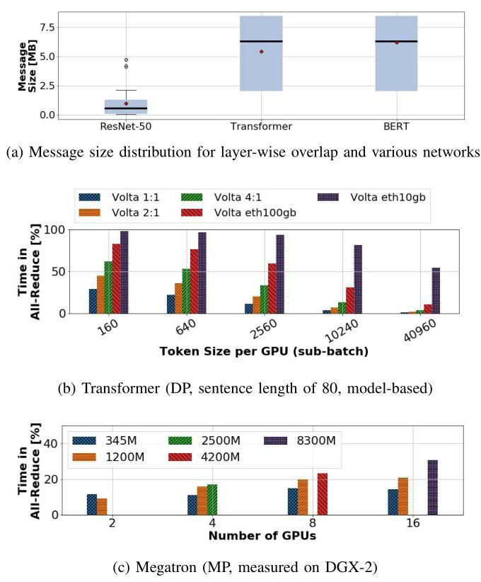
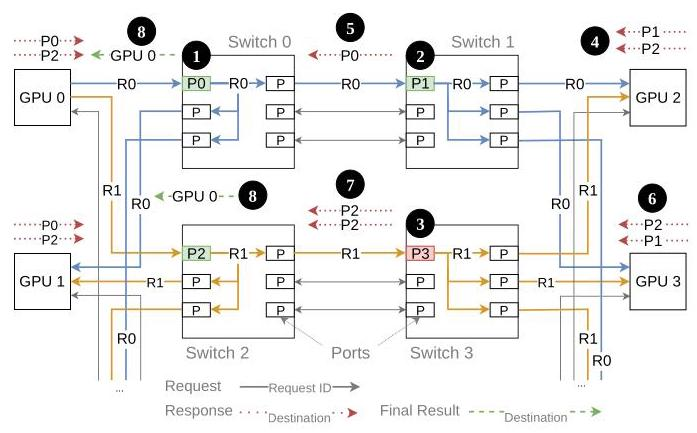
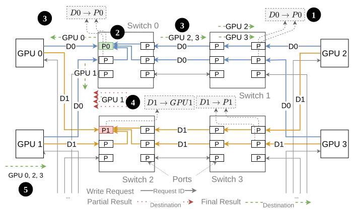
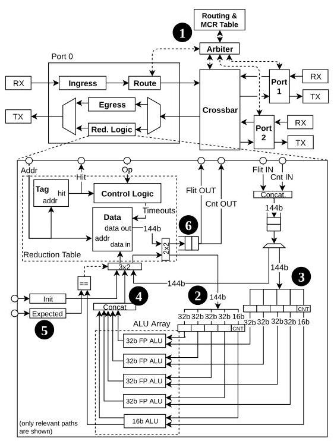
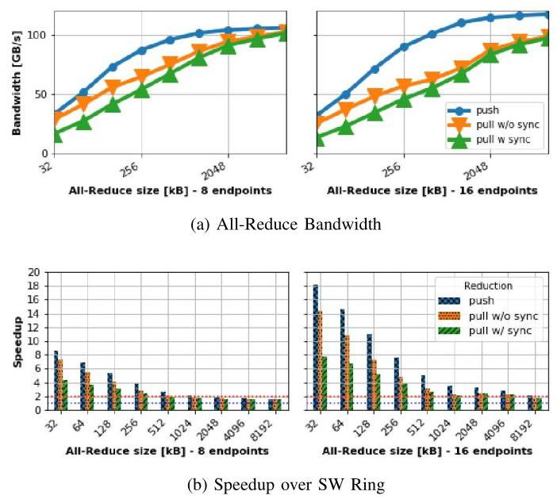
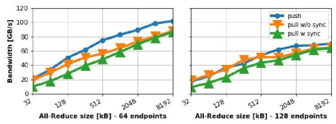
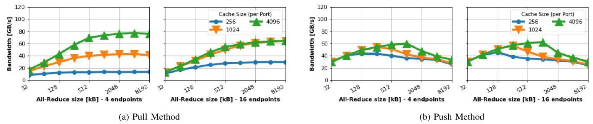
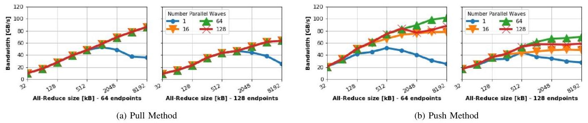
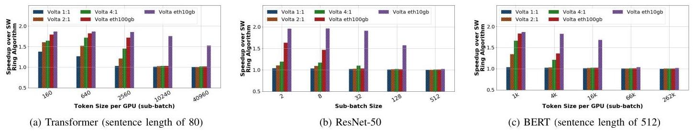

# An In-Network Architecture for Accelerating Shared-Memory Multiprocessor Collectives 深度解读

> **作者**：Benjamin Klenk、Nan Jiang、Greg Thorson、Larry Dennison（NVIDIA）  
> **会议/年份**：ISCA 2020（2020 ACM/IEEE 47th Annual International Symposium on Computer Architecture）  
> **一句话总结**：本文通过网络交换机与 GPU 端点协同设计，在共享内存互连中用 Multicast、Pull/Push in-network reduction 和基于 wave 的注入控制加速 All-Reduce，相比软件 ring 在小消息上最高加速 18×、大消息上趋近 2×，并使 Transformer 训练最高加速 1.4×。

## 一、问题定义（Problem）

### 背景与切入点

在 data-parallel DNN 训练中，每张 GPU 计算一份局部梯度，但每轮更新前必须把所有 GPU 的梯度按元素求和并把结果发回所有参与者，这就是 All-Reduce。它既有“归约”计算，又有“向所有节点分发结果”的通信，无法像普通算子那样完全局部化。随着 tensor core 等专用计算单元使 GPU 算力增长快于互连带宽，All-Reduce 在 step time 中所占比例反而会上升：论文的模型显示，在 16-GPU DGX-2 上，Transformer 的 All-Reduce 已可占 Volta 训练时间约 30%，对计算能力提升 4×、带宽不变的未来 GPU 可达 42%；Megatron 的 8.3B 模型实测也约有 30% step time 花在 All-Reduce 上。

传统 NCCL ring 是 bandwidth-optimal 的软件算法，但每个处理器仍需在 Reduce-Scatter 和 All-Gather 两阶段合计收发约两倍消息量，所以有效带宽上限只有物理网络带宽的一半；它还需要随节点数线性增长的同步步骤、GPU kernel 资源和全系统 memory fence。树算法把步数从 $O(p)$ 降到 $O(\log p)$，却没有消除端点搬运、同步和重复传输。

把归约放入交换机并非本文首创，因此这是一篇**非 First 类型**工作。它的真正切入点是：BlueGene、SHArP 和早期 programmable-switch 方案面向 CPU 发起、message-passing 和显式资源 reservation；而 NVLink/NVSwitch 一类 accelerator-centric shared-memory fabric 承载的是海量、细粒度、乱序的 load/store/atomic 请求。数百万 GPU 线程和多个简单 DMA engine 无法保证消息注入次序，逐消息预约资源的协议开销也会压倒小包本身，因此现有机制不能直接移植。

Fig. 1 把动机落到应用层：layer-wise overlap 产生的大量消息远小于一次性归约，例如 ResNet-50 平均约 1 MB，而 Transformer 平均约 5 MB、约一半小于 6 MB；因此决定训练能否有效重叠的不是只有峰值带宽，还有小消息延迟与启动/同步开销。

**动机评估**：动机很 solid。作者用 DGX-2 实测、逐层性能模型和消息大小分布共同证明瓶颈真实存在，并指出计算/带宽失衡会使问题加剧。弱点在于应用论证主要围绕 2020 年 NVIDIA GPU、NCCL ring 与少数 DNN，跨厂商 shared-memory fabric 的普适性更多是架构推断，而不是多平台实证。

**核心 Insight**：在共享虚拟地址空间里，collective 的“参与者集合”和“操作类型”可以编码到地址映射与 opcode 中，让普通 load/store 自然触发网络内复制或归约；再用 opportunistic table allocation 和 wave-based injection limiting 管住乱序请求，而不依赖全消息 reservation 或固定注入顺序。这个 insight 把“共享内存小包、乱序、海量并发”的限制转化成了交换机按地址识别操作、端点按 wave 控制在途工作集的方案。

## 二、相关工作（Related Work）

论文的相关工作可以按“归约发生在哪里、采用什么通信语义”分为四类。

第一类是 **软件 collective**，包括 NCCL/Baidu ring、double-binary-tree、recursive doubling 以及面向大规模系统的分层或 multi-leader 算法。它们无需修改网络硬件，ring 还能达到链路带宽最优，但端点必须承担归约计算、重复搬运和同步；即使树降低了 step 数，也没有改变 All-Reduce 两阶段导致的约 2× 数据流量。

第二类是 **专用 HPC 网络 collective**，如 BlueGene、PERCS、Anton2 和 Mellanox SHArP。它们证明硬件归约有效，Anton2 的 opportunistic reservation 也与本文 Pull 有相似性；然而这些系统以 CPU/message passing 为中心，依赖 queue pair、消息边界和显式资源预约，不适合共享内存 fabric 中细粒度、乱序且数量巨大的 memory operation。

第三类是 **programmable switch 或附接式 reduction accelerator**。Sapio 等把归约数据路径放入可编程交换机，Li 等给每个交换机增加集中式 accelerator，Parameter Hub 则把归约逻辑附接到交换机。它们面向 Ethernet/rack-scale 训练，集中式数据路径在本文所设想的高 radix、高带宽交换芯片中容易成为吞吐或布线瓶颈；本文因此采用每端口 reduction table 与 ALU，使数据路径分布化并维持 line rate。

第四类是 **in-network cache**，如 IncBricks 和 NetCache。它们同样利用地址/键在网络内聚合状态，但目标主要是缓存与负载均衡，没有把 cache-like table 与共享内存 All-Reduce 的计数、归约、multicast 完成语义结合起来。

本文与 SHArP 并非完全互斥：作者设想在多网络域中分阶段、流水化地执行归约。其新意不是“网络里能算”，而是为 accelerator-centric shared memory 给出无需逐消息 reservation 的完整 switch/endpoint co-design。

## 三、技术挑战（Challenges）

1. **乱序且多源的细粒度内存流量**：GPU 的百万线程和多个 DMA engine 不能保证同一 collective 的元素按固定顺序到达，协议既不能依赖消息级 source，也不能把复杂元数据塞进每个小包。
2. **有限 reduction table 与死锁风险**：交换机 SRAM 很小，而大消息会产生远多于 table entry 的在途元素。Pull 可以 backpressure，但 Push 若在 table 满时阻塞，可能形成协议死锁；直接溢出又会制造大量 partial result 流量。
3. **完成检测与正确同步**：交换机必须知道一个地址已经收到多少 operand 才能发出 final result；Pull 还必须保证所有 GPU 已写完源数据，Push 则必须在 eviction 后继续追踪跨多个 partial result 的总贡献数。
4. **line-rate 数据路径**：归约逻辑要在每周期处理一个 flit，不能成为高带宽、高 radix 交换机的新瓶颈；数据对齐、计数与 ALU 并行度都受硬件时序约束。
5. **multicast 的带宽、流控和无死锁性**：All-Reduce 的结果需发回所有 GPU，复制会放大交换机内部流量并造成拥塞；同时必须与 ordinary unicast 共存，避免 wormhole/协议死锁和 QoS 崩溃。
6. **规模化时的拥塞与资源利用不均**：Pull 主要依赖请求 GPU 的 first-hop port table，Push 则可利用全网 table，但对到达顺序和 capacity miss 更敏感；端点必须让“在途 wave 大小”与分散的网络容量匹配。

## 四、解决方案（Solution）

### 整体思路

论文先在全局虚拟地址空间中增加 Multicast Region（MCR），由 fabric manager 把参与 GPU 集合写入各交换机的 MCR table；访问 MCR 的普通 store 会在沿途被树状复制。随后交换机每端口加入 reduction table、计数器和 ALU array，并提供 Pull 与 Push 两种协议。最后，GPU core 或 DMA engine 通过 wave controller 限制同时在途的元素，使 table 容量被高效使用且不过载网络。

### 贯穿示例：四张 GPU 汇总两个梯度元素

设 GPU0–GPU3 各自算出梯度向量中的两个元素 $D_0,D_1$，目标是求和后让四张 GPU 都得到结果。初始化时，软件把四张 GPU 的目标缓冲区注册为一个 MCR；因此网络只需看到 MCR 地址，就知道包要复制到哪些端点，无需在每个包头携带四个 destination。

在 **Pull** 中，可让 GPU0 对 $D_0$ 发出“带 SUM operator 的 load”。请求沿 multicast tree 到达其余 GPU；返回值在沿途交换机有空 table entry 时被先局部相加，最终所有响应必定汇入 GPU0 first-hop switch 的 entry，计数达到预期后把和返回 GPU0。四张 GPU 分摊元素，每张 Pull $m/p$ 个结果，最后用 MCR multicast 做 All-Gather。它像“指定一位同学去每桌收成绩，路上的组长顺手先小计”：交换机中途没空时可以跳过小计，但第一跳必须留座位。代价是发请求前需要 barrier，确保别人不会在被读取后才更新 $D_0$。

Fig. 3 的关键不是所有交换机都必须成功预约，而是 intermediate table 可 opportunistically bypass，只有 first-hop allocation 是强制的；这避免了跨交换机的复杂 reservation protocol，同时仍保证最终结果有汇合点。

在 **Push** 中，四张 GPU 直接把自己的 $D_0,D_1$ 作为 reduction write 发出。地址 hash 决定 home port，例如 $D_0\rightarrow P0$、$D_1\rightarrow P1$；同地址包自然汇到同一 fully-associative table entry。计数到 4 时，交换机把最终和 multicast 给全部 GPU。它像“每桌主动把成绩投进按科目编号的汇总箱”，无需开始前 barrier，但箱子满时不能阻塞，否则不同地址的等待关系可能死锁。被 LRU/timeout 驱逐的 partial result 因而送回 home GPU，由端点继续相加并在贡献计数完整后 multicast 最终值。

Fig. 4 展示了 Push 的性能来源与复杂性来源是同一件事：所有 GPU 可立即注入，且能用全网 table；但 eviction、partial count、timeout 和 home-GPU completion 都需要额外状态机。

### 关键技术点

**1. 地址化 Multicast。** MCR 是已有 allocation 的网络级映射，每个交换机只为一个 region 保存一条“地址范围→target IDs”记录。包到达后查 MCR table、复制并沿各自 unicast-conforming path 前进；允许部分 output port 先发送、其余端口后续仲裁，提升 crossbar 利用率。把 group 信息放在地址映射中，避免每个 128 B payload 包反复携带目的集合。

**2. Pull 的 guaranteed-first-hop + opportunistic-intermediate allocation。** first-hop table 满时请求被 stall，响应与请求使用不同 VC，确保已有归约能完成并释放资源；中间 table 满则 bypass。这个设计直接解决 table 有限与无全局 reservation 的矛盾，但 barrier、read request 和 write acknowledgment 会损失小消息和峰值带宽。

**3. Push 的 address-hashed home port + eviction recovery。** 所有 operand write 按地址到同一 table，结果本身完成同步。table miss 且无空位时用 LRU/timeout 驱逐，论文选择把 partial result 发给 home GPU，降低因反复 multicast 引发的网络放大。每个包携带 reduction count，端点将 partial result 原子式累加，累计到全部参与者后再广播。

**4. 每端口 line-rate reduction datapath。** routing/MCR lookup 决定请求使用哪个 port table；tag hit 后，table operand 与入站 flit 同时进入 ALU array，结果和 count 写回。对 128 B payload、4 B 元素，要求首地址按 128 B 对齐且元素连续；当 count 达到预设阈值，结果直接送到输出并复位 entry。

Fig. 5 说明方案不是在交换机旁挂一个串行 accelerator，而是把 lookup、存储和多路 32-bit floating-point ALU 放进端口数据路径；目标是一周期处理一个 flit，从结构上避免集中式归约单元成为瓶颈。

**5. Wave synchronization / injection limiting。** 若 collective 有 $m$ 个元素而网络 table 总容量为 $C$，端点把数据切成 wave，并只允许有限个 wave 并发。DMA 的 wave controller 为请求分配 counter 和 credits；只有当前 wave 收到足够响应时才归还 credit、推进后续 wave。多个 counter 让 wave 流水化，以隐藏同步延迟。这既抑制 Push eviction，也避免 Pull backpressure 干扰 ordinary traffic。

**6. 流控、可靠性与数值语义。** 请求/响应分 VC，采用 deterministic routing、cut-through 的整包存储保证，以及与 unicast 一致的 multicast path 来避免死锁。方案假设底层有 link-level retransmission 和 sequence number；更大系统还需端到端重传、多路径和 congestion control。浮点 operand 的到达次序仍不确定，因此默认结果不具 bitwise determinism；要变成 deterministic reduction 需付出更多存储。

### 与已有方案的对比

相较软件 ring，本文在归约树中消除了 Reduce-Scatter/All-Gather 的重复搬运，理论上大消息带宽可接近 2×，小消息还省掉 kernel/fence 同步。相较 SHArP 等 message-passing 方案，它以 load/store、VAS 和地址映射承载语义，不需要逐消息 queue-pair/reservation，更贴合 accelerator-centric shared memory。

Pull 的 GPU/switch 控制更简单、table 不足时行为自然，但需要前置 barrier，且 first-hop table 利用不均；Push 无需 barrier、性能和规模性更好，也能利用全网 table，却引入 eviction、timeout、计数与 home-GPU partial reduction。作者估算 16 nm 下 18 KB SRAM 约 $0.05\,\mathrm{mm}^2$，相对 106 $\mathrm{mm}^2$ NVSwitch die 连同逻辑低于 1% 面积；不过这只是 SRAM/面积类比，不是布局布线、频率与功耗完成后的芯片实现。

## 五、实验评估（Experiments）

### 实验设定

- **模拟器**：bksim2（BookSim 后继），按单个 load/store 粒度建模；in-network traffic generator 模拟 DMA-initiated reduction。
- **系统**：16-GPU DGX-2 式双组 Fat-Tree；以及 128 GPU、144 switches 的两级 Fat-Tree（16 个 leaf group，每组 8 GPU/6 leaf switches，第二级 48 switches）。GPU 均有 6 ports，switch 有 16 ports。
- **网络参数**：每端口 25 GB/s、switch latency 150 ns、uniform-random throughput 超过 95%；request/response 使用 2 个 VC；最大 packet 144 B，其中 payload 128 B、header 16 B；GPU memory latency 为 180 cycles，再随机增加 $[0,180)$ cycles。
- **Baseline**：NCCL 使用的 ring All-Reduce，以 data–fence–flag 语义传递大块数据；作者称其在所模拟规模上是测得带宽最高的软件算法。
- **指标与 workload**：All-Reduce bandwidth、相对 ring speedup、packet latency、table size/wave 数量敏感性，以及 ResNet-50、Transformer、BERT 的 data-parallel 训练模型和 Megatron model parallelism。

### 主要实验与结论

**16 GPU 带宽与消息大小。** 理论最大 payload bandwidth 为 120 GB/s。Push 只需 256 B/port table，Pull 使用 4 KB/port；大消息时 Push 接近上限，Pull 因 request/ack 竞争略低。相对 ring，小消息最高达到 18×，随后随消息增大收敛到约 2×，与“软件需搬两遍、网络内归约搬一遍”的带宽分析一致。

Fig. 7 同时说明两个 regime：左侧小消息主要受同步/启动延迟支配，因而可远超 2×；右侧大消息转为带宽受限，Push/Pull 的优势靠近理论 2×。Pull 的显式同步尤其损害小消息。

**64/128 GPU 规模性。** 64 GPU Fat-Tree 仍可达到约 100 GB/s；128 GPU 时峰值降到约 70 GB/s。作者把异常归因于网络接近满载而没有 congestion control 导致 tree saturation。论文声称大规模小消息相对 ring 可高出多个数量级，但没有展示该对比图，也承认实际软件通常会组合 ring/tree，所以这一“数量级”结论不能等同于对最强大规模软件 baseline 的公平比较。

Fig. 8 是方案“能扩到 128 GPU”的主要证据，但也暴露了规模化瓶颈：协议功能正确并不等于互连在缺少 congestion control 时能保持 16/64 GPU 的峰值效率。

**table size 与 wave。** 不做 wave synchronization 时，Push 对 table 容量明显比 Pull 敏感，因为 capacity miss 会把 partial result 送回 GPU、额外消耗带宽；Pull 的 stall 则形成自调节。加入 wave 后，Fat-Tree 的 Push 用 256 B/port、64 个 8 KB wave（在途 512 KB，接近全网 590 KB table）即可得到高带宽；DGX-2 用 16 个 8 KB wave（128 KB，在途数据约为 48 KB table 的 2.6×）也能高效流水。Pull 需要更大 per-port table，但 4 个 wave 即达峰值。

Little's Law 给出的 DGX-2 容量预测与模拟相符：Pull 约 1.4 KB/port，Push 约 270 B/port。对 16 GPU、8 MB All-Reduce，wave synchronization 还把平均 packet latency 降低约 90%，表明它不仅提高 collective throughput，也改善与其他流量共存时的 QoS。

**DNN 训练影响。** 在 DGX-2 模型中，Transformer 在 NVLink 系统最高约 1.4×，Ethernet 配置约 1.8×；ResNet-50 因模型仅约 50 MB、通信占比低，收益较小。计算/带宽比越高、每 GPU sub-batch 越小，收益越大。对 Megatron，8 MB 以上 All-Reduce 约获 2× 通信加速，而通信占 step time 最高 30%，由 Amdahl 式推算得到当前 Volta 约 15% 的端到端提升。

Fig. 11 显示端到端收益远小于 collective microbenchmark 的 18×：只有原本落在 All-Reduce 上的时间能被消除，而且不同模型、sub-batch 和互连带宽决定了可加速比例。

### 结论支撑性分析

实验较充分地支撑了三项核心主张：网络内归约大消息趋近 2×、小消息显著受益，以及 wave 能用较小 table 保持吞吐。Little's Law 预测与 sensitivity sweep 相互印证，也让参数选择不只是经验调优。

证据边界同样清楚：所有互连结果来自模拟，没有 RTL/FPGA/silicon 原型；训练结论多由 performance model 外推，Megatron 只用真实机器测量“有/无 All-Reduce”占比，再套用模拟通信加速；128 GPU 缺少 congestion control，且 >16 GPU 时只与简单 ring 定性比较；面积与功耗没有综合实现或实测。因而论文有力证明了“架构方向可行且有潜力”，尚未证明产品级实现能在真实混合流量、故障恢复和公平 QoS 下保持这些数字。

## 六、附加洞察（Side Findings）

**结论 1：更大的 model-parallel 模型不一定摊薄通信，反而可能让 All-Reduce 占比上升。**

- *出处*：Section II-B3，Fig. 1(c)。
- *推理链条*：作者在真实 DGX-2 上比较 345M–8.3B 参数的 Megatron → 观察到模型越大，GEMM 计算效率提升得越明显，而通信带宽没有同步提升 → 因此 All-Reduce 占 step time 从较小模型继续上升，8.3B/16 GPU 约达 30%。这反驳了“大模型计算更多，所以通信自然被摊薄”的直觉，但样本只覆盖一个 model-parallel 实现。

**结论 2：对软件 ring，layer-wise overlap 并不天然优于 one-shot。**

- *出处*：Section II-B2 与 Section VI-E。
- *推理链条*：per-layer gradient 使消息从总计 50/420 MB 切成平均约 1/5 MB → 每次 kernel launch、fence 和小消息 latency 的固定成本上升，通信 kernel 还与计算争用 core/memory system → 模型显示 NCCL ring 只有 Transformer token size 大于 640（Volta）或 5120（Volta 4:1）时 overlap 才有益；而低延迟 in-network reduction 在 Transformer 的全部数据点上都使 overlap 胜过 one-shot。

**结论 3：wave synchronization 的价值不仅是防止 table overflow，还能显著改善网络 QoS。**

- *出处*：Section VI-D，Fig. 10。
- *推理链条*：无限制注入会让 Pull 产生深 backpressure、让 Push 反复 eviction → 两者都增加网络排队 → 将在途地址限制成多个流水 wave 后，16-GPU、8 MB All-Reduce 的平均 packet latency 比无 wave 时下降约 90% → 因而 wave controller 也是 collective 与普通流量共存的关键机制。论文只报告平均 latency，没有给 tail latency 或真实混合 workload，QoS 结论仍不完整。

**结论 4：Push 的 microbenchmark 优势在应用层被明显压缩，简单 Pull 仍有工程吸引力。**

- *出处*：Section VI-E，Fig. 11 后的讨论。
- *推理链条*：Push 在大消息上带宽略高于 Pull → 但训练 step 还包含大量不可被 collective 加速的计算 → 两者端到端性能差距变小 → 作者因此判断 Pull 较低的实现复杂度仍“compelling”。这提示硬件选型不能只看 peak All-Reduce bandwidth，还要比较系统级收益与验证成本。

## 七、总结与评价（Wrap-up）

本文最重要的贡献，是把 in-network reduction 从 message-passing/reservation 语境重新设计成适配 shared-memory accelerator fabric 的地址化协议，并把交换机 reduction table、Multicast、Pull/Push completion 与 DMA wave controller 串成一套完整架构。最亮眼之处是：方案用机会式分配和端点注入控制容忍乱序小包，同时以定量模型解释为何很小的 per-port SRAM 就可能接近 line rate。

最大不足是评估离产品实现仍有距离：没有 RTL 时序、真实功耗、混合流量与故障恢复结果，大规模 baseline 也偏弱；Push 的 timeout/eviction、浮点非确定性、aliasing pointer 禁止以及可靠网络假设都会扩大工程复杂度。值得继续探索的方向包括：将 wave controller 与现代 collective scheduler 协同、引入 congestion-aware routing/credit allocation、提供 deterministic/precision-aware reduction，以及在 CXL/UALink/NVLink 类一致或共享内存互连上做可综合原型和真实训练验证。

## 八、章节脉络与段落速览（Structure Map）

- **Abstract**：概述 accelerator-centric in-network collective 架构、两种归约协议与 16–128 GPU 的主要结果。
  - ¶1 说明算力扩展与 All-Reduce 串行瓶颈促使专用网络加速成为必要。
  - ¶2 提出共享内存网络、交换机内计算、Pull/Push trade-off 与端点修改。
  - ¶3 汇总大消息 2×、小消息 18×、训练 1.4× 和 128 GPU 规模性结果。
- **Section I · INTRODUCTION**：从并行计算的通信瓶颈出发，定位现有 message-passing in-network reduction 与共享内存 GPU fabric 的语义鸿沟。
  - ¶1–2 说明计算专用化和系统并行化让 collective communication 成为扩展瓶颈。
  - ¶3 解释 Reduce/All-Reduce 在分布式训练每轮梯度聚合中的关键作用。
  - ¶4 指出现有方案受 CPU 发起、message passing 和 reservation 限制。
  - ¶5–6 给出 accelerator-centric shared-memory 切入点、五项贡献和全文结构。
- **Section II · BACKGROUND AND MOTIVATION**：介绍目标系统，并用训练模型与实测量化 All-Reduce 的重要性。
  - **II-A · Accelerated Computing Systems**：以 DGX-2/NVLink/NVSwitch 说明全局地址空间、Fat-Tree 与 GPU/DMA 乱序小包特征。
    - ¶1–2 界定目标系统并描述 16 GPU、12 NVSwitch、full-bisection 拓扑。
    - ¶3 对比 message-passing reservation 与 shared-memory memory-operation 流量，提出 lean packet 和乱序约束。
  - **II-B · DL Training**：分析 data/model parallelism 的消息规模与通信占比。
    - ¶1–3 介绍训练背景、data-parallel 性能模型和 Megatron 实机测量方法。
    - ¶4–5 说明 SGD 梯度归约，以及 Volta、Volta 2:1/4:1 与 Ethernet 配置。
    - ¶6 解释 batch-size 上限为何使规模增大时通信更敏感。
    - ¶7–8 说明 layer-wise overlap 的小消息/资源争用代价，并量化 Transformer 的通信占比。
    - ¶9–10 介绍 model parallel GEMM 切分，并指出更大 Megatron 模型的 All-Reduce 占比反而升高。
- **Section III · COLLECTIVE COMMUNICATION PRIMITIVES**：定义常见 collective，并分析 ring/tree 软件 All-Reduce 的流量和同步下界。
  - ¶1–4 定义 Broadcast/Multicast、Gather/All-to-All、Reduce/Reduce-Scatter 和 All-Reduce。
  - ¶5–6 解释 ring 的两个阶段、最优带宽与线性同步/fence 成本。
  - ¶7 说明 double-binary-tree 等把步骤降到 $O(\log p)$。
  - ¶8 推导软件方案每节点收发两倍消息，给出网络内归约约 2× 的大消息上限。
- **Section IV · IN-NETWORK REDUCTIONS**：给出 Multicast、Pull/Push、交换机 datapath、系统约束和端点控制的完整设计。
  - **IV-A · Multicast**：用 MCR 地址映射实现无包头目的列表的树状复制。
    - ¶1–4 说明 MCR 注册、switch table 初始化、地址识别和逐级复制流程。
    - ¶5–8 讨论 group 数量、部分端口前进、load 语义与低包头开销。
  - **IV-B · Pull Reduction**：由单个 requester multicast reduction load，并在返回路径机会式归约。
    - ¶1–3 定义每 GPU 发出 $m/p$ Pull、first-hop entry 和多交换机示例。
    - ¶4–6 解释 first-hop stall、中间 bypass、response count 与无需全局 reservation。
    - ¶7 指出源数据必须在请求前通过 barrier 就绪。
    - ¶8–9 用 Little's Law 推导 table 容量并解释除以 $p-1$ 的原因。
  - **IV-C · Push Reduction**：由所有 GPU 主动写入按地址 hash 的 home port，并处理 eviction partials。
    - ¶1–3 定义 reduction write、home port 与 cache-like table 命中/完成过程。
    - ¶4–6 说明无前置同步优势、满表不可阻塞、两种 eviction recovery 及论文选择。
    - ¶7–8 解释 count/timeout 与 Push table-size 公式及全网容量利用。
  - **IV-D · Switch Reduction Tables**：设计每端口 tag/table/counter/ALU 的 line-rate 数据路径。
    - ¶1–2 描述 route/MCR lookup、hit/miss 行为和 Push/Pull 分歧。
    - ¶3–4 规定 128 B 对齐、每周期一 flit、count threshold 和 timeout eviction。
  - **IV-E · Design Considerations**：分析内部带宽、死锁、可靠性和数值语义。
    - ¶1–3 推导约 2× switch internal speedup，并给出 ingress replication 实现方向。
    - ¶4 用不同 VC、整包 cut-through、deterministic/BRCP routing 避免死锁。
    - ¶5 说明 LLR/sequence number 假设及大系统仍需的可靠性与拥塞机制。
    - ¶6–7 指出浮点非确定性和 Push 不支持 aliasing pointer 的限制。
  - **IV-F · Endpoints**：比较 core/DMA 发起方式并提出 wave controller。
    - ¶1–3 说明无序注入、无管制时的拥塞，以及按容量切分并流水化 wave。
    - ¶4 讨论 core-initiated Pull/Push 的同步差异和至少 50% memory-access 降低。
    - ¶5–7 描述 DMA 的 Pull lock-step、Push partial counting 和 counter/credit 控制器。
    - ¶8 说明多 counter 与地址或 packet ID 查找响应所属 wave。
  - **IV-G · Implementation Complexity Discussion**：估算面积和功耗成本。
    - ¶1 用 16 nm SRAM 数据估计 reduction buffer/logic 相对 NVSwitch 小于 1% 面积。
    - ¶2 认为 ALU/SRAM 功耗远小于 SerDes，并可由 GPU 侧减少的操作抵消。
- **Section V · METHODOLOGY**：定义模拟器、baseline、数据包级模型和两种系统规模。
  - ¶1 说明 bksim2、ring baseline、data–fence–flag 与 DMA traffic generator。
  - ¶2 列出 25 GB/s、150 ns、144 B packet、GPU latency，以及 16/128 GPU 拓扑。
- **Section VI · EVALUATION**：评测带宽、规模性、资源敏感性、wave 和训练收益。
  - **VI-A · All-Reduce Bandwidth**：DGX-2 上 Push/Pull 接近 120 GB/s，大消息约 2×、小消息最高 18×。
    - ¶1 给出带宽定义、同步成本与最优参数选择。
    - ¶2 比较 Push 256 B/port 与 Pull 4 KB/port 的峰值及额外控制包开销。
    - ¶3 将小消息 18× 归因于同步消除，将大消息 2× 归因于数据流量减半。
  - **VI-B · Network Scalability**：64 GPU 保持约 100 GB/s，128 GPU 因拥塞降至约 70 GB/s。
    - ¶1 报告大系统趋势并把 128 GPU 异常归因于无 congestion control 的 tree saturation。
    - ¶2 讨论相对 ring 的大幅优势，同时承认真实大规模软件会使用分层 ring/tree。
  - **VI-C · Reduction Table Size Sensitivity**：无 wave 时 Push 的 capacity miss 比 Pull stall 更伤带宽。
    - ¶1 说明选择 DGX-2 和禁用 wave 是为了放大 table-size 敏感性。
    - ¶2 对比 Pull 自调节和 Push eviction traffic 的不同后果。
  - **VI-D · Wave Synchronization**：有限并发 wave 以很小 per-port table 恢复峰值并降低延迟。
    - ¶1–2 量化 Fat-Tree/DGX-2 的 wave 数、在途容量和 Push/Pull table 利用差异。
    - ¶3 报告 16 GPU、8 MB 时平均 packet latency 下降约 90%。
    - ¶4 验证 Little's Law 对 Pull 1.4 KB、Push 270 B 的容量预测。
  - **VI-E · DL Training**：把 collective 加速映射为不同模型、sub-batch 与互连下的端到端收益。
    - ¶1 报告 Transformer 最高 1.4×（NVLink）/1.8×（Ethernet），并解释 ResNet-50 收益较小。
    - ¶2 指出 Push/Pull 应用差距小，因此 Pull 的低复杂度仍有价值。
    - ¶3 比较 in-network 与 NCCL 在 layer-wise overlap 上的适用区间。
    - ¶4 由 Megatron 8 MB 消息与 30% 通信占比推算当前 Volta 约 15% step-time 改善。
- **Section VII · RELATED WORK**：按专用 HPC collective、programmable/in-switch compute、parameter server、in-network cache 和软件算法定位本文差异。
  - ¶1 对比 BlueGene/PERCS/Anton2、Sapio/SHArP、集中式 switch accelerator、Parameter Hub、network cache 与软件优化，并指出多数工作与本文可正交组合。
- **Section VIII · CONCLUSION**：重申两种共享内存 in-network reduction 的权衡和性能结果。
  - ¶1 总结 Pull 简单、Push 在 tight synchronization 下性能与规模性更好。
  - ¶2 汇总大消息 2×、小消息 18× 和 NVLink 训练 1.4× 的核心数字。

