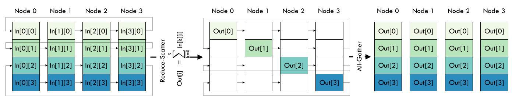
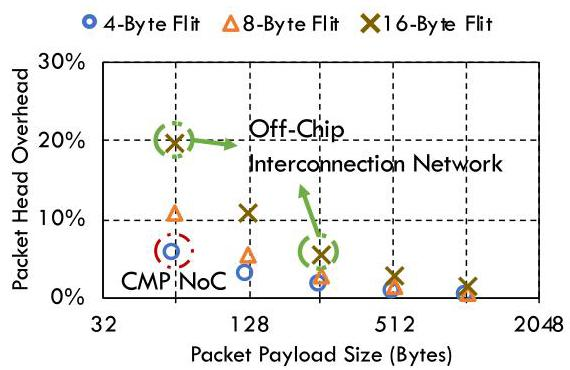
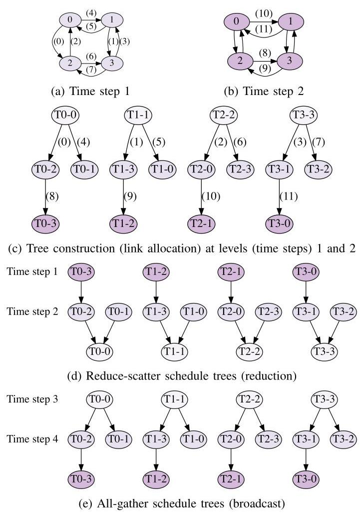
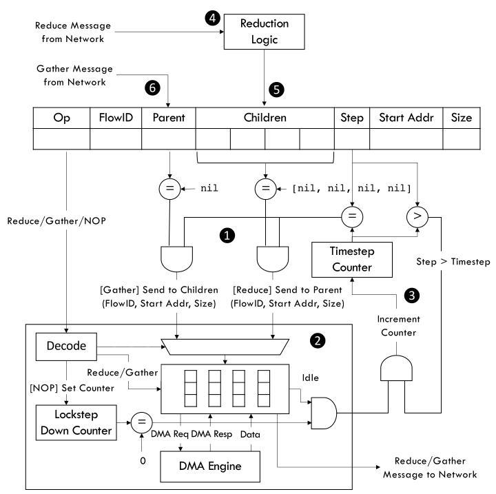
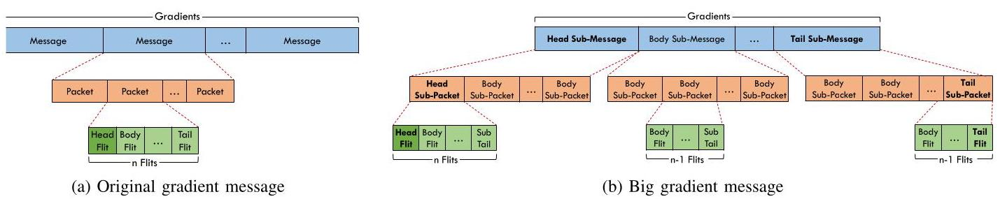
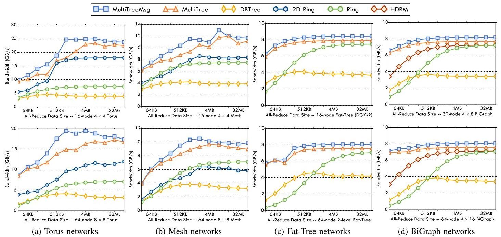
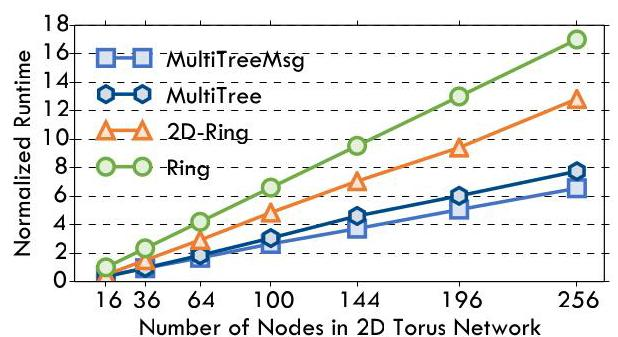
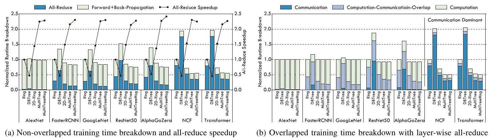

# Communication Algorithm-Architecture Co-Design for Distributed Deep Learning 深度解读

> **作者**：Jiayi Huang, Pritam Majumder, Sungkeun Kim, Abdullah Muzahid, Ki Hwan Yum, Eun Jung Kim  
> **会议/期刊**：2021 ACM/IEEE 48th Annual International Symposium on Computer Architecture (ISCA 2021)  
> **一句话总结**：这篇论文提出 MULTITREE，将 topology-aware 的多生成树 all-reduce、网络接口中的静态调度表和面向大梯度消息的简化 flow control 合在一起，试图同时获得低延迟、带宽最优和跨拓扑可用的分布式训练通信。

## 一、问题定义

这是一篇非 First 类型的改进性工作：all-reduce 作为 data-parallel distributed deep learning 中 SGD 梯度同步的核心通信原语，已经有 ring all-reduce、halving-doubling、double binary tree、2D-ring、HDRM 等成熟路线；本文的切入点是这些方案很难同时满足三个目标：大消息时带宽最优、小消息时低延迟、在多种实际互连拓扑上无争用地运行。

原始问题可以概括为：随着 DNN 模型和训练数据规模增大，计算加速器阵列中的梯度交换越来越容易成为训练瓶颈。论文给出的直接证据是，ring all-reduce 虽然 bandwidth-optimal，但在某些拓扑上资源利用率很低，例如在 $4 \times 4$ 2D Torus 中只有 25% link utilization；double binary tree 虽然减少了逻辑步数，但因为不感知物理拓扑，大消息会在不友好的拓扑上产生严重 contention；2D-ring 和 HDRM 则分别绑定 2D Torus/Mesh 与 BiGraph，难以作为通用方法。

**动机评估**：动机是 solid 的。作者没有把问题限定在某个实验平台的小故障上，而是抓住了 distributed SGD 的通用同步模式和现代 accelerator pod 的拓扑差异：通信算法如果只看逻辑通信图，就可能把本来短距离、可并行的物理链路浪费掉；硬件如果只支持一般短包流量，则又会在大梯度连续传输中付出多余 header、routing 和 arbitration 开销。相对薄弱的一点是，论文主要通过模拟器验证，并假设训练任务拥有稳定且可提前知道的通信集合；在多租户或拓扑动态变化的数据中心里，这个假设会被削弱。

**核心 Insight**：MULTITREE 的关键洞察是“树靠近 root 的层更稀疏，靠近 leaf 的层更密集”。如果按照传统从 leaf 往 root 的 reduction 视角构造树，低层通信会天然拥挤；本文反过来从 root 自顶向下构造 all-gather 树，并在每个 time step 中用物理拓扑图分配可用链路，让更多通信靠近 root 发生，从而把靠近 leaf 的通信稀疏化。这个 insight 把问题和方案连接起来：不是单纯发明一种新的逻辑 collective，而是把 tree construction、link allocation 和 message scheduling 放到同一个拓扑感知过程里。

Fig. 1 展示了 ring all-reduce 的 reduce-scatter 与 all-gather 两阶段流程。它说明 ring 的优势是每一步都很规则、容易做到无争用；但每个 chunk 需要沿单向环走 $n-1$ 步，系统规模增大时延迟会线性增长，这正是 MULTITREE 想用多棵树缩短的部分。

## 二、相关工作

论文对相关工作的组织方式基本围绕 all-reduce 算法和通信硬件两条线展开，而不是按时间顺序罗列。

第一类是 data-parallel training 的梯度同步机制。Parameter server 简单易实现，但在大模型训练中会遇到中心节点带宽和延迟瓶颈；decentralized all-reduce 避免中心瓶颈，因此成为 NCCL、Horovod 等系统里的常用路径。本文继承的是 all-reduce 路线，而不是重新设计训练算法。

第二类是通用 all-reduce 算法。Ring all-reduce 的核心优势是 bandwidth-optimal，并且可嵌入多种拓扑；缺点是步数长，并且在 Torus/Mesh 等拓扑上不能充分利用所有链路。Halving-doubling 和 DBTree 减少逻辑步数，适合小到中等消息；但它们通常 topology-oblivious，树边映射到物理网络后可能跨多个 hop，大梯度场景中 contention 会吞掉低延迟收益。

第三类是 topology-specific co-design。2D-ring 面向 TPU-like 2D Torus/Mesh，能更好利用二维链路并减少步数，但会传输接近两倍的非最优数据量；HDRM 面向 Alibaba EFLOPS 的 BiGraph，通过 rank mapping 避免 contention，但对两级全连接 BiGraph 依赖强，扩展到其他拓扑并不自然。MULTITREE 的定位就是要吸收这类 co-design 的收益，同时避免只服务于一种拓扑。

第四类是更广义的 collective acceleration。Blink、基于 linear programming 的 topology-aware tree scheduling、cloud probing 的层次聚合、in-network reduction 等工作都在尝试利用拓扑或网络硬件。但作者认为这些方法要么优化复杂度高、扩展性有限，要么需要特定网络或 switch 功能；MULTITREE 用较直接的图构造和 NI 调度表来降低落地门槛。

第五类是 flow control 和 arbitration。Flit reservation、pseudo-circuit、token flow control 等方法尝试减少 routing/arbitration 开销或建立近似电路交换路径。本文的 message-based flow control 与这些思路相近，但更专门地利用 all-reduce 大梯度消息“连续、同路由、可提前知道”的特征，只为大消息减少重复 head flit 和仲裁开销。

## 三、技术挑战

**挑战 1：同时优化 latency 和 bandwidth。** Ring all-reduce 带宽最优但步数长；DBTree 步数短但大消息 contention 严重。MULTITREE 必须避免在降低逻辑步数时牺牲大消息的带宽最优性。

**挑战 2：拓扑感知但不能拓扑绑定。** 2D-ring 和 HDRM 已经说明 topology-specific co-design 有价值，但它们不能泛化到 Torus、Mesh、Fat-Tree、BiGraph 等多种网络。本文需要一种能读取拓扑图并自动构造通信树的算法。

**挑战 3：多棵树并发时要避免链路争用。** all-reduce 中每个 node/chunk 都对应一棵 reduction/broadcast 树，多棵树同时运行时，如果只分别构造最短树，很容易在同一物理链路上重叠。难点不只是树长，而是全局 link utilization 和 time step 的协调。

**挑战 4：硬件调度不能引入过重同步成本。** 如果用软件消息传递来维持各节点 schedule 的 lockstep，小消息时协调开销可能抵消收益；如果完全不协调，树调度又可能失效。因此 NI 需要简单、可复用、低状态量的 schedule enforcement。

**挑战 5：大梯度消息和通用 packet flow control 不匹配。** 传统 packet-based switching 每个小包都带 head flit；对 64-256B payload、16B flit 的 off-chip 网络，header 开销可达 6%-25%。all-reduce 大梯度流往往是同一源宿、连续地址、固定路由，因此通用流控的细粒度控制变成冗余。

Fig. 2 把 packet header overhead 随 payload size 变化的趋势画出来。它给 flow-control co-design 提供了直接动机：payload 越小，head flit 所占比例越高；即使现代 off-chip payload 较大，仍有约 6% 的带宽可通过减少重复 header 回收。

## 四、解决方案

### 整体思路

MULTITREE 的算法层方案是：给定网络拓扑图 $G(V,E)$，为每个节点建立一棵以该节点为 root 的 spanning tree，也就是一共构造 $|V|$ 棵树；这些树分别负责不同 data chunk 的 reduce-scatter 和 all-gather。算法先自顶向下构造 all-gather schedule tree，再反向得到 reduce-scatter schedule。每个 time step 使用一份新的拓扑图副本，把已经分配给某棵树的边从图中移除；当当前图里没有可用边继续连接未加入节点时，进入下一个 time step。

架构层方案是：把这些静态树 schedule 转换成每个 NI 一张 all-reduce schedule table，条目包含 opcode、FlowID、parent/children dependency、step、地址和大小。NI 根据 timestep counter、lockstep down-counter 和依赖清除逻辑触发 Reduce/Gather/NOP，减少软件协调。流控层方案则把大梯度 chunk 作为一个大 message，只保留必要的 head sub-packet 和 tail sub-packet，减少每个小 packet 都带 header 的浪费。

### 贯穿示例

可以把一个 $2 \times 2$ Mesh 中的 4 个 accelerator 想成 4 个工人，每个人手上都有一块梯度 chunk，需要最终让所有人拿到全局聚合后的完整梯度。Ring 做法像四个人排成一个单向传送带，每块 chunk 逐站传递；规则简单，但每块都要走 3 步。MULTITREE 则让每个人都当一次 root，为自己的 chunk 建一棵小树：第 1 个 time step 先把每棵树离 root 最近、不会争用的链路用掉；链路不够时进入第 2 个 time step，再从新图里分配下一层连接。这样每个 chunk 的传播像多棵树同时展开，而不是一条长环逐段搬运。

Fig. 3 是理解算法的核心图。(a)(b) 表示每个 time step 可用的 topology graph，边上的编号是全局 link allocation 顺序；(c) 表示 4 棵树轮流扩展，从而保持树形比较均衡；(d)(e) 则分别把同一批树转换成 reduction 和 broadcast schedule。图中的关键证据是：MULTITREE 的每条逻辑边都映射到物理一跳连接，并且同一 time step 内已分配边会被移除，因此 schedule 本身就编码了 contention avoidance。

### 关键技术点

**1. 用多棵 spanning trees 替代 ring。** Ring 可以看成 k=1 的 unary tree，因此 all-reduce 的步数随节点数线性增长。MULTITREE 试图构造近似 $k$-ary trees，把理论步数降低到 $2\log_k n$，同时仍然让每个节点作为一棵树的 root，保持每个 data chunk 都能参与 reduce-scatter 和 all-gather。

**2. 树构造和链路调度合并。** 算法不是先构造树、再映射到网络，而是在构造时就检查 topology graph 中的可用边。每个 time step 里，树按 root ID 轮流加一个节点，候选 parent 按前面 time steps 已加入节点的 breadth-first 顺序检查。这个策略的目标是让靠近 root 的层更密集，靠近 leaf 的层更稀疏，从而减少 reduction 时 leaf 侧拥堵。

**3. 支持 indirect networks。** 对 Fat-Tree、BiGraph 这类 switch-based network，算法把拓扑图扩展为 node-to-switch、switch-to-switch、switch-to-node 三类连接；寻找 child 时从源节点挂载 switch 出发做 BFS，优先利用同一 switch 下的一跳节点，再跨 switch 找节点。这也是 MULTITREE 在 Fat-Tree/BiGraph 小消息上降低延迟的原因。

**4. NI schedule table 执行静态计划。** 论文没有只停留在算法层，而是把 schedule 下沉到 NI。每个节点的 table entry 告诉 NI 在哪个 step、哪个 FlowID、满足哪些 parent/children dependency 后发 Reduce 或 Gather。这样每个训练迭代可以复用同一张 schedule table；64-node 系统中每个 entry 约 200 bits、每张表 128 entries，额外存储约 3.2 KB。

Fig. 6 展示了 NI 端的调度执行路径。表项先经 dependency check 和 opcode decode，再驱动 DMA 和 reduction logic；Reduce 消息完成后清除后续依赖，Gather 消息到达后清除 parent dependence。这个图说明所谓 co-design 不是抽象口号，而是把算法 schedule 变成了可由硬件状态机直接解释的结构。

**5. NOP 和 lockstep down-counter 维持隐式同步。** 某些不均衡拓扑中，如果某节点比其他节点提前进入下一步，就可能破坏全局 schedule。MULTITREE 在 schedule 中插入 NOP，NI 用估计的 serialization latency 启动 lockstep down-counter，避免通过额外消息做全局同步。这个机制有风险：估计过保守会空闲链路，估计过激进会增加 schedule 漂移；作者认为大消息的 serialization latency 足够长，小的时钟偏差影响有限。

**6. Message-based flow control 减少大梯度包头开销。** 传统做法把 gradient 切成许多 message/packet，每个 packet 都要 head flit。本文把整个 gradient chunk 当作一个大 message，再切成 sub-message 和 sub-packet，只在 head sub-message 的第一个 sub-packet 放真正的 head flit，在尾部放 tail/sub-tail 标记。

Fig. 7 对比了传统小 packet 流和本文的大 message 流。右侧设计保留了 packet 化传输的可管理性，但避免了每个小包重复携带同一路由信息，因而能接近 circuit switching 的带宽效率，同时不需要真正建立电路。

### 与已有方案的对比

与 ring 相比，MULTITREE 的优势是减少算法步数并提高 Torus/Mesh 的链路利用率；不足是需要提前知道拓扑并预先生成 schedule。与 DBTree 相比，MULTITREE 同样利用树降低延迟，但它在构造时考虑物理拓扑和 link allocation，不会把逻辑树边随意映射成多 hop 链接；代价是算法和硬件状态都更复杂。与 2D-ring 和 HDRM 相比，MULTITREE 的目标是 generality：它不依赖某一种二维或 BiGraph 结构；但在这些专用拓扑的大消息带宽上，专用方案一旦也能充分用满带宽，MULTITREE 的优势主要来自更少 hop、更低小消息延迟和 6% 左右的 flow-control saving。

## 五、实验评估

### 实验设定

作者扩展 SCALE-Sim 支持 DNN training/back-propagation，并用 BookSim 建模互连网络，通过 Python 接口把 accelerator 和 network interface 连接起来。加速器配置是 TPU-like：16 个 PE，每个 PE 为 $32 \times 32$ systolic array，output stationary dataflow，32-bit precision，1 GHz。网络规模覆盖 16、32、64 个 accelerator，拓扑包括 2D Torus、Mesh、Fat-Tree、BiGraph；link latency/bandwidth 为 150 ns / 16 GB/s，4 个 VC，VC buffer depth 为 318 flits，baseline packet payload 为 256 bytes。

Synthetic study 中 all-reduce data size 从 32 KiB 到 64 MiB；scalability study 使用 $375 \times N$ KiB，其中 $N$ 是节点数，并把 Torus 扩展到 256 accelerators。真实 workload 使用 SCALE-Sim 提供的 AlexNet、AlphaGoZero、FasterRCNN、GoogLeNet、NCF、ResNet50、Transformer，mini-batch size 为 $16 \times N$。baseline 包括 RING、DBTREE、2D-RING、HDRM；被测方案包括 MULTITREE 和启用 message-based flow control 的 MULTITREEMSG。

### 主要实验与结论

**All-reduce bandwidth。** Fig. 9 显示 MULTITREE/MULTITREEMSG 在 Torus 和 Mesh 上总体领先。原因分两层：小数据时树结构减少通信步数，大数据时 topology-aware link allocation 提高链路利用率并避免 DBTree 式 contention。2D-RING 在 $8 \times 8$ Mesh 上甚至可能差于 RING，因为 Mesh 的单维度中没有完美 ring，最长通信对拖慢整体延迟，同时 2D-RING 传输数据量不是 bandwidth-optimal。

Fig. 9 的重要信息不是某个单点数值，而是趋势：在 Torus/Mesh 这种直接网络上，MULTITREEMSG 的曲线在中大消息区间明显高于 Ring 和 2D-Ring；在 Fat-Tree/BiGraph 上，大消息时各 bandwidth-optimal 方法逐渐接近，但小消息时 MULTITREE 仍因优先一跳或少 hop 通信而有优势。

**Scalability。** 在 $375 \times N$ KiB 的 weak scaling 测试中，RING、2D-RING、MULTITREEMSG 都近似线性增长，但斜率不同。MULTITREEMSG 相比 RING 达到约 $3\times$ speedup，相比 2D-RING 约 $1.4\times$ speedup。作者还提到 strong scaling 中各算法变化较小，因为大 all-reduce size 下 serialization latency 占主导。

Fig. 10 说明 MULTITREE 的收益不是只存在于 16 或 64 节点的小规模设置；扩展到 256 节点时，RING 的 link under-utilization 和 2D-RING 的额外通信量都会累积成更大的 normalized communication time。

**DNN benchmark performance。** 在 $8 \times 8$ Torus 上，baseline RING 中 communication time 占比可从 30% 到 88% 不等。对 AlexNet、FasterRCNN、GoogLeNet、ResNet50 等 compute-intensive CNN，MULTITREE 相比 RING 和 2D-RING 分别最多降低训练时间 34% 和 15%；对 NCF、Transformer 等 communication-intensive DNN，训练时间最多降低 81% 和 30%。只看 all-reduce 本身，MULTITREE 平均比 RING 和 2D-RING 快 $2.2\times$ 和 $1.51\times$；启用 message-based flow control 后进一步提升 6%，达到 $2.3\times$ 和 $1.56\times$。

Fig. 11 把论文的系统意义讲得最清楚：通信占比低的 CNN 里，all-reduce 加速会被计算部分稀释；但在 NCF 和 Transformer 这种通信占主导的 workload 中，MULTITREE 对端到端 training time 的影响非常明显。重叠训练的结果也表明，layer-wise all-reduce 能隐藏一部分通信，但无法完全消除非 CNN 模型中的同步瓶颈。

### 结论支撑性分析

实验基本支撑了论文的核心声明：MULTITREE 同时改善 latency-sensitive 小消息和 bandwidth-sensitive 大消息，并且在 Torus、Mesh、Fat-Tree、BiGraph 上都能工作。尤其是把 synthetic bandwidth、scalability 和 DNN benchmark 三类结果连起来后，可以看到算法层和 flow-control 层分别贡献了主要收益与 6% 左右的额外带宽改善。

但实验也有边界。第一，所有结果来自 SCALE-Sim + BookSim 模拟，并非真实多节点训练系统实现，因此 NI 状态机、route precompute、schedule loading 和协议栈集成的复杂度没有被完整暴露。第二，论文假设 all-reduce schedule 可在初始化时计算并复用；共享集群中的拓扑干扰、链路故障和作业共置只在 discussion 中轻描淡写。第三，workload 使用固定 mini-batch size $16 \times N$，模型收敛精度和 batch size trade-off 被明确排除在范围外，因此训练时间收益不能直接等同于端到端 time-to-accuracy 收益。

## 六、附加洞察

**结论 1：message-based flow control 的收益不只属于 MULTITREE。**  
*出处*：Section IV-B 与 Section VI-C。  
*推理链条*：作者先指出大梯度连续流中的 head flit 信息高度重复，传统 payload 配置下约有 6%-25% header bandwidth overhead；随后在 DNN benchmark 中报告 message-based flow control 为 MULTITREE 带来约 6% all-reduce improvement；最后明确说明该 6% bandwidth saving 也可以应用到其他 all-reduce algorithm。因此这部分更像一种可迁移的网络微架构优化，而不是 MULTITREE tree scheduling 的专属效果。

**结论 2：computation-communication overlap 对 CNN 更有效，对 embedding/attention-heavy 模型更不充分。**  
*出处*：Section VI-C / Fig. 11b。  
*推理链条*：作者把 workload 分成 compute-intensive CNN 和 communication-dominant NCF/Transformer；在 layer-wise all-reduce 下，CNN 的 back-propagation computation 可以覆盖大部分通信，因此 MULTITREE 对端到端训练时间最多提升约 10%；而 NCF/Transformer 计算量较少，通信仍留在 critical path 上，MULTITREE 仍能在训练时间上达到约 $2\times$ 和 $1.37\times$ 相对 RING/2D-RING 的 speedup。这个结论提示后续 collective 优化对推荐和 Transformer 类模型更关键。

**结论 3：拓扑越不适合逻辑树，DBTree 的低步数优势越容易反转。**  
*出处*：Section III-B、Section VI-A、Section VI-C。  
*推理链条*：DBTree 的逻辑树高度可以接近 MULTITREE，但 Fig. 4 和后续实验说明逻辑边可能映射为多 hop；在 Torus/Mesh 上，大消息会因这些多 hop 和链路争用恶化，导致 DBTree 在多组实验中表现最差。因此“树比环低延迟”不是无条件成立，树必须与物理拓扑和时序调度一起设计。

**结论 4：MULTITREE 在 switch-based 网络的大消息场景中主要不是带宽优势，而是小消息/少 hop 延迟优势。**  
*出处*：Section VI-A / Fig. 9c、Fig. 9d。  
*推理链条*：Fat-Tree 和 BiGraph 上，当数据量变大时 MULTITREE、RING、HDRM 都能充分利用带宽，曲线逐渐接近；小数据时 MULTITREE 因为优先连接同一 switch 或较少 switch traversal 的节点，避免被最慢跨 leaf-switch 通信对序列化，因而领先。这个结论限定了 MULTITREE 的适用收益来源：不同拓扑上的瓶颈并不相同。

**结论 5：lockstep NOP 是实用折中，但也暴露了静态 schedule 的局限。**  
*出处*：Section IV-A。  
*推理链条*：为防止各 NI 进入不同 time step 后破坏 contention-free schedule，作者加入 NOP 和估计 step time；他们观察到 NOP 导致的 under-utilization 主要出现在 irregular networks 的 leaf 附近，并把 tree pruning/adjusting 留作 future exploration。这说明静态 schedule 并非总能完美填满链路，尤其在不规则拓扑中仍有调度优化空间。

## 七、总结与个人评价

这篇论文的核心贡献是把 all-reduce 从“选择一个通信算法”的问题提升成“通信算法、物理拓扑、NI 调度和 flow control 共同设计”的问题。MULTITREE 的算法本身并不复杂，但它把树构造和链路分配放在同一个循环里，并用硬件 schedule table 执行，形成了比较完整的架构故事。

最大的亮点是问题拆解清楚：ring、DBTree、2D-ring、HDRM 各有一块短板，MULTITREE 的设计点几乎逐一对应这些短板。实验也覆盖了 synthetic、scalability 和 DNN workload，数据支撑相对完整。最大的不足是实现验证仍停在模拟环境，且对动态共享网络的处理偏弱；如果要走向真实训练集群，还需要证明 schedule 生成、部署、异常处理和与现有通信库/NIC 的集成不会吞掉收益。

值得继续探索的方向包括：面向 irregular topology 的 tree pruning 和 schedule refinement；把 MULTITREE 与 topology design 或 fault-aware routing 联合优化；以及在真实 SmartNIC、DPU 或 accelerator-integrated NI 上实现 message-based flow control，验证 6% 带宽收益是否能转化为真实能效和端到端训练收益。

## 八、章节脉络与段落速览

- **Section I · INTRODUCTION**：提出大规模 DNN 训练中的 all-reduce 通信瓶颈，并概述 MULTITREE 的 co-design 方案。
  - ¶1：说明模型和数据规模增长导致训练计算、存储和带宽需求快速上升。
  - ¶2：说明 data parallelism 和 SGD 让 all-reduce 成为每轮训练中的关键通信瓶颈。
  - ¶3：比较 ring、halving-doubling、DBTree 的优势和缺陷，引出 topology-aware scheduling 的必要性。
  - ¶4：通过 Table I 讨论 2D-ring、HDRM 等专用 co-design 的局限，以及通用拓扑可扩展方案的需求。
  - ¶5：概述 MULTITREE 的 topology-aware 多树构造、NI 调度和简化 flow control。
  - ¶6：列出论文四项贡献。
  - ¶7：说明后续章节安排。

- **Section II · BACKGROUND AND MOTIVATION**：介绍 data-parallel training、ring all-reduce 和本文动机。
  - **II.A · Data-Parallel Deep Neural Network Training**：解释 mini-batch SGD、分布式训练和 parameter server/all-reduce 两种梯度聚合路线。
    - ¶1：说明 DNN training 的 forward/backward/update 流程以及大模型训练带来的资源挑战。
    - ¶2：说明 data parallelism 中每个节点计算本地梯度，并通过集中式或去中心化方式聚合。
  - **II.B · All-Reduce for Distributed Stochastic Gradient Descent**：用 Fig. 1 展示 ring all-reduce 的 reduce-scatter 和 all-gather。
    - ¶1：指出 ring all-reduce 由 reduce-scatter 与 all-gather 两阶段组成。
    - ¶2-3：逐步说明 segment 在 ring 中如何完成 reduction 和最终广播。
  - **II.C · Motivation**：系统化指出现有 all-reduce 算法与通用 flow control 的不足。
    - ¶1：说明 ring、2D-ring、DBTree、HDRM 各自在 latency、bandwidth、contention 和 generality 上的取舍。
    - ¶2：说明大梯度连续流使传统 packet head flit 产生冗余开销。

- **Section III · MULTITREE ALL-REDUCE ALGORITHM**：提出 MULTITREE 的算法依据、示例和形式化构造。
  - **III.A · Rationales and Insights**：给出用 spanning trees 替代 rings 和 topology awareness 两个设计依据。
    - ¶1：说明多棵 k-ary tree 可把 ring 的线性步数降低到对数级。
    - ¶2：说明不考虑拓扑会产生 contention，并提出靠近 root 加密通信、靠近 leaves 稀疏通信的洞察。
  - **III.B · Main Idea**：用 $2 \times 2$ Mesh 示例解释 link allocation 和 schedule tree。
    - ¶1：说明每个 time step 使用拓扑图分配链路，链路耗尽后进入下一层。
    - ¶2：结合 Fig. 3 说明树轮流扩展、生成 reduce-scatter 和 all-gather schedule。
    - ¶3：用 Fig. 4 对比 ring 和 DBTree，强调 MULTITREE 的一跳物理映射。
  - **III.C · Algorithm Design**：给出 Algorithm 1、复杂度和 indirect network 支持。
    - ¶1：说明 all-gather 树自顶向下构造，再反向得到 reduce-scatter。
    - ¶2：分析最坏复杂度为 $\mathcal{O}(|V|^2|E|)$。
    - ¶3：说明 indirect network 中通过 node-switch、switch-switch、switch-node 三类连接做 BFS。

- **Section IV · ARCHITECTURAL SUPPORTS**：说明 NI schedule management 和 message-based flow control。
  - **IV.A · All-Reduce Schedule Management**：把算法 schedule 转成每节点硬件表项。
    - ¶1：说明 schedule table 的字段和 Fig. 5 示例。
    - ¶2：解释 Reduce/Gather/NOP 三类 opcode 及其 dependency 规则。
    - ¶3：说明 lockstep NOP 用估计 step time 维持隐式同步。
    - ¶4：结合 Fig. 6 说明 table lookup、decode、DMA、dependency clear 和 timestep increment 的执行流程。
  - **IV.B · Message-based Flow Control for Big Gradient Exchanges**：重新设计大梯度传输的包和 flit 格式。
    - ¶1：说明 all-reduce traffic pattern 可提前知道，适合简化控制与仲裁。
    - ¶2：对比传统 packet-based switching 和本文 big message/sub-packet 设计。
    - ¶3：说明 Fig. 8 的 flit fields、Route Info 和 Tree Info 编码。
    - ¶4：说明一跳通信不会增加死锁风险，并可与 wormhole switching 和 VC 共存。

- **Section V · METHODOLOGY**：描述模拟平台、系统配置和 workload。
  - **V.A · System Modeling and Configuration**：介绍 SCALE-Sim、BookSim、TPU-like accelerator 和网络参数。
    - ¶1：说明扩展 SCALE-Sim 支持 training，并配置 16 PE、$32 \times 32$ systolic array。
    - ¶2：说明 BookSim 建模、NI 调度硬件开销、3.2 KB schedule table 和公平 baseline 设置。
    - ¶3：列出 Torus、Mesh、Fat-Tree、BiGraph 等拓扑和规模。
  - **V.B · Workloads**：说明 synthetic all-reduce 和真实 DNN benchmark。
    - ¶1：说明 bandwidth 和 scalability study 的数据规模选择。
    - ¶2：列出 AlexNet、AlphaGoZero、FasterRCNN、GoogLeNet、NCF、ResNet50、Transformer，并说明 non-overlap 与 layer-wise overlap 两种训练方式。

- **Section VI · EVALUATION**：比较 MULTITREE/MULTITREEMSG 与 RING、DBTREE、2D-RING、HDRM。
  - ¶1：定义被测方案和 baseline。
  - **VI.A · All-Reduce Bandwidth**：评估不同拓扑和消息大小下的 all-reduce bandwidth。
    - ¶1：说明各拓扑配置和 bandwidth 计算方法。
    - ¶2：说明 Torus/Mesh 上 MULTITREE 领先、DBTree 因 contention 最差、2D-RING 在大 Mesh 中可能差于 Ring。
    - ¶3：说明 Fat-Tree/BiGraph 上小消息延迟收益明显，大消息时 bandwidth-optimal 方法接近。
  - **VI.B · Scalability**：在 16 到 256 节点范围评估 weak scaling。
    - ¶1：说明 MULTITREEMSG 相比 RING 和 2D-RING 达到约 $3\times$ 与 $1.4\times$ speedup。
  - **VI.C · DNN Benchmark Performance**：评估真实模型训练时间。
    - ¶1：说明非重叠训练中通信占比从 30% 到 88%，并给出 compute-intensive 与 communication-intensive workload 的训练时间降低。
    - ¶2：说明 all-reduce 平均 speedup 为 $2.2\times$/$1.51\times$，message-based flow control 后为 $2.3\times$/$1.56\times$。
    - ¶3：说明 DBTree 在 2D Torus 上因拓扑不匹配和大消息 contention 表现差。
    - ¶4：说明 layer-wise overlap 对 CNN 有效但对 NCF/Transformer 不足。

- **Section VII · DISCUSSIONS**：讨论 latency/bandwidth 权衡、更广应用和后续机会。
  - **VII.A · Bandwidth versus Latency**：说明理想算法要同时优化带宽和延迟，MULTITREE 以 bandwidth-optimal 和低 hop/低步数回应这一目标。
  - **VII.B · Broader Applications**：说明 MULTITREE 可扩展到 hybrid parallelism、all-to-all、异构链路和可探测拓扑的 cloud network。
  - **VII.C · Opportunities**：承认实际步数受网络直径限制，并提出 topology design、hybrid-parallel 和 tree 数量 trade-off 等机会。

- **Section VIII · ADDITIONAL RELATED WORK**：补充 collectives acceleration 与 flow control/arbitration。
  - **VIII.A · Collectives Acceleration for DNN Training**：比较 LP tree scheduling、partitioning、Blink、PLink、in-network reduction 等方法。
  - **VIII.B · Flow Control and Arbitration**：概述 flit reservation、pseudo-circuit 和 token flow control 等网络控制技术。

- **Section IX · CONCLUSIONS**：总结 MULTITREE 的算法和架构贡献。
  - ¶1：重申 MULTITREE 通过 topology-aware 多树构造、NI lockstep scheduling 和 message-based flow control，实现 6% 带宽改善、$2.3\times$/$1.56\times$ all-reduce speedup，以及最高 81%/30% training time reduction。
