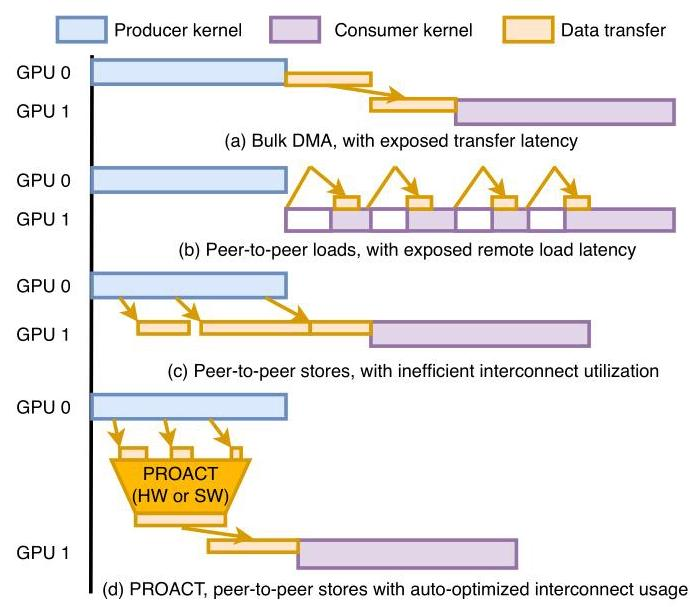
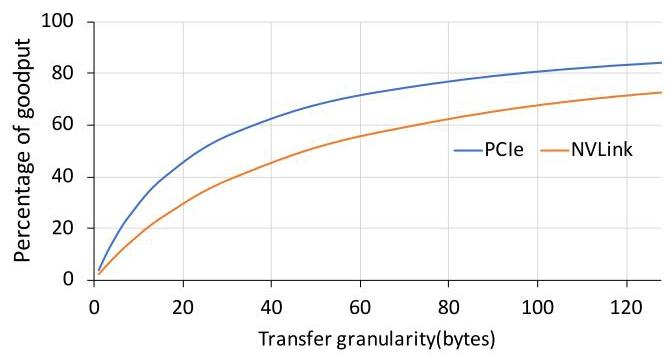
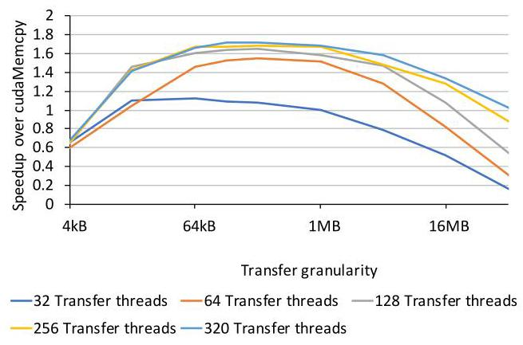
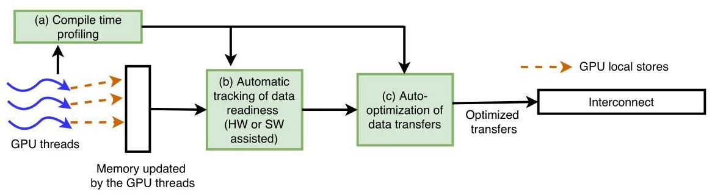
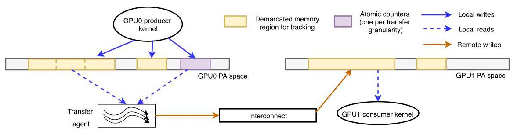
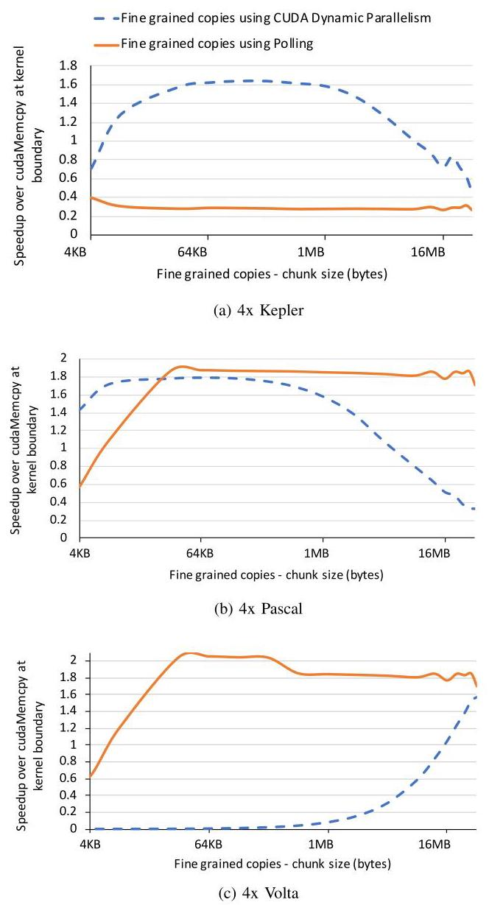
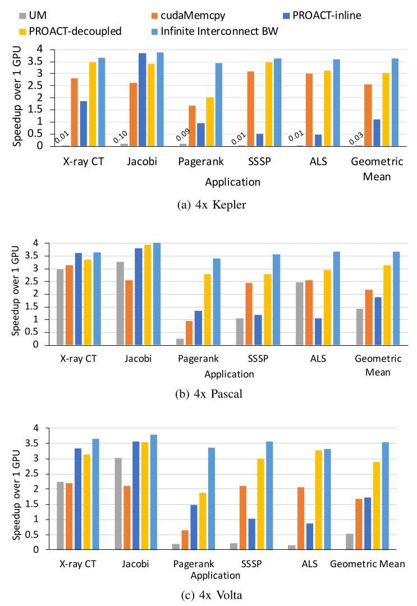
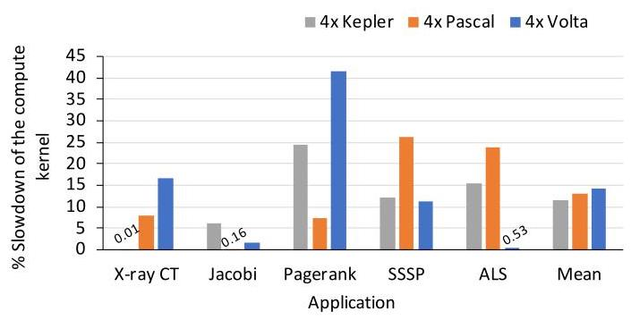
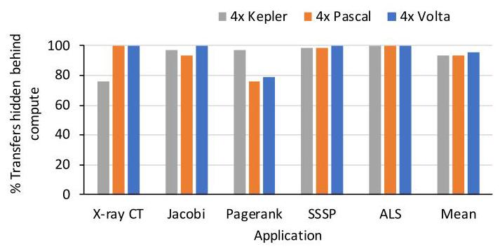
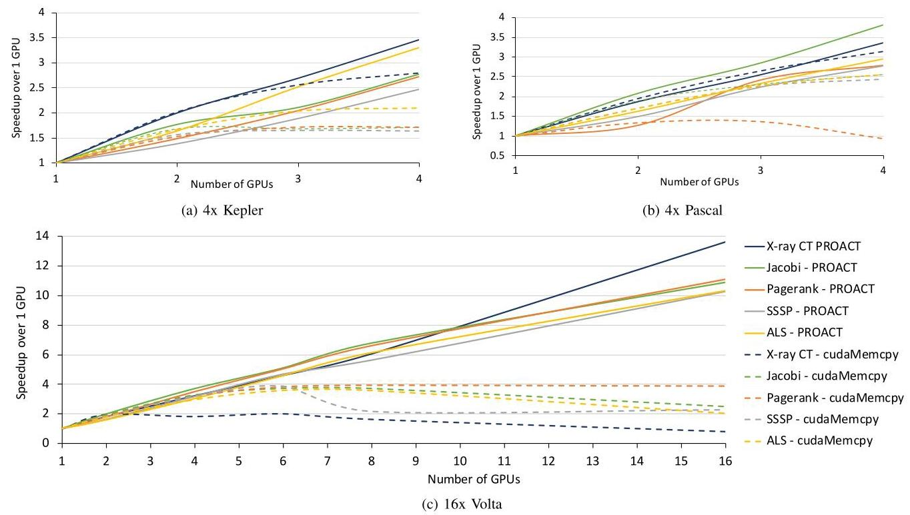

# Efficient Multi-GPU Shared Memory via Automatic Optimization of Fine-Grained Transfers 深度解读

> **作者**：Harini Muthukrishnan, David Nellans, Daniel Lustig, Jeffrey A. Fessler, Thomas F. Wenisch  
> **会议**：ISCA 2021  
> **一句话总结**：这篇论文提出 PROACT，用 profiling、数据就绪追踪和自动选择的细粒度传输机制，把 P2P store 的流水化优势和 bulk DMA 的链路效率结合起来，从而提升多 GPU strong scaling。

## 一、问题定义

这篇论文不是在定义一个全新的大问题，而是在多 GPU 通信这个老问题上抓住了一个很具体的系统矛盾：多 GPU 程序为了 strong scaling 必须在 GPU 间移动数据，但现有通信方式要么浪费计算资源，要么浪费互连带宽。传统 bulk DMA 能把大块数据搬得很高效，但它通常发生在 producer kernel 和 consumer kernel 之间，导致计算阶段和通信阶段被硬性切开；P2P load/store 可以在 kernel 执行期间发生，但 load 会让 consumer 线程暴露远端访问延迟，store 虽然更容易隐藏延迟，却常以 sub-cacheline 粒度发出，互连协议开销占比很高。

图 1 是全文动机最重要的图：DMA 的黄色传输块卡在两个 kernel 中间，P2P load 的箭头直接打断 consumer，P2P store 虽然和 producer 重叠但传输碎片化；PROACT 试图把这些细碎 store 收拢成互连友好的块，同时保持 producer 执行期间主动搬运的时间优势。

**动机评估**：动机很 solid。作者没有只停留在“多 GPU 难优化”这个泛泛问题，而是用互连 goodput 说明小粒度传输的真实代价：4-byte store 在 NVLink 上有效 goodput 低到约 8%，PCIe 上约 14%。这说明问题不是单纯“实现不够好”，而是传输粒度和互连协议开销之间存在结构性冲突。

图 2 直接支撑这个判断：传输粒度越接近 cacheline 级别，PCIe 和 NVLink 的有效数据占比越高；在几十字节以下，packetization overhead 主导总带宽消耗。因此，直接把每个线程的小 store 发到远端 GPU，并不能自然得到高性能。

**核心 Insight**：PROACT 的关键洞察是，GPU memory model 给了普通 weak write / gpu-scope write 一段“可延迟但必须在同步前可见”的 slack。也就是说，数据**不必在每个线程写完的瞬间立刻出现在远端 GPU，只要在后续全局同步或 consumer 读取前到达即可**。PROACT 利用这段 slack，把**本地细粒度写入先聚合到本地内存**，再由 transfer agent 在合适时机、以合适粒度主动推送到远端 GPU。

## 二、相关工作

论文对相关工作的组织方式基本是按“通信机制和系统层抽象”分类，而不是按时间线展开。

第一类是现有 GPU 间通信机制和通信库。bulk DMA、MPI、NCCL、NVSHMEM 等方式擅长大块通信和封装复杂拓扑，但对频繁的小/中粒度通信会暴露初始化、host runtime、同步或 page fault 开销；Unified Memory 让程序员少管数据位置，但依赖 fault/migration/prefetch，性能随应用和平台变化很大。PROACT 的差异在于它不只选择已有后端，而是把小粒度生产和大粒度传输解耦。

第二类是异步多 GPU 编程、NUMA-aware GPU、peer caching、multi-GPU coherence 等体系结构/运行时工作。这些工作关注跨 GPU 数据访问、放置和一致性，但多数没有把“P2P store 非阻塞但互连效率差”作为核心优化目标，也没有自动把细粒度写合并成高 goodput 传输。

第三类是异构系统调度、CPU-GPU/GPU-GPU 数据搬运优化、auto-tuning 和代码生成。PROACT 借鉴了 auto-tuning 的思想，但调优对象不是 kernel block size 这类传统 GPU 参数，而是跨 GPU transfer mechanism、transfer granularity、transfer thread count 这些通信参数。这个定位让它更像一个跨编译器、runtime 和硬件边界的通信优化层。

## 三、技术挑战

**通信重叠和互连效率天然拉扯**：DMA 大块传输效率高，但难以和 kernel 执行细粒度重叠；P2P store 能重叠，但直接发小写会让互连效率崩掉。PROACT 必须同时优化时间位置和空间粒度。

**最优参数强依赖平台和应用**：transfer granularity 太小会 initiation-bound，太大又会留下 tail transfer；transfer thread 太少无法打满互连，太多会抢占 compute kernel 的 SM 资源。Kepler、Pascal、Volta 的最佳机制并不相同，所以硬编码规则不可靠。

图 4 展示了这种参数敏感性：在 Kepler 示例里，64KB 到 1MB 的传输粒度和至少 128 个 transfer threads 才接近最佳，更多线程并不继续提升互连利用率，反而可能浪费执行资源。

**数据就绪追踪不能变成新的瓶颈**：如果 transfer agent 和 producer 线程解耦，就必须知道哪个 chunk 的数据已经全部生成。这个 tracking 既要足够细，才能尽早启动传输，又不能引入过多 atomic 和同步开销。

**软件原型会占用真实 GPU 资源**：论文验证的是软件 PROACT，polling kernel、atomic counter、CDP launch 都会消耗 SM、memory bandwidth 或 runtime latency。作者需要证明即使包含这些开销，整体收益仍然成立。

**适用性有结构化假设**：PROACT 需要 deterministic write pattern，并要求程序员标注 PROACT-enabled shared data structures。对于完全不规则、写次数不可确定或 compute-bound 的程序，软件版 PROACT 的收益可能有限。

## 四、解决方案

### 整体思路

PROACT 把“谁生成数据”和“谁通过互连发送数据”拆开。应用线程仍然像写 P2P shared memory 一样写入被标注的 region，但这些写先落在本地 GPU 内存；系统用 counters 追踪每个 chunk 是否就绪；一旦就绪，transfer agent 以 profiling 选出的机制和粒度把数据推到远端 GPU。这样，程序员看到的是细粒度共享内存式编程接口，互连看到的是较大粒度、可合并、可流水化的数据传输。

图 3 把 PROACT 分成三块：compile-time profiling 决定参数，data readiness tracking 判断什么时候能搬，auto-optimization of data transfers 决定怎么搬。这个分层很重要，因为论文的贡献不是单个传输 API，而是一套跨编译、runtime 和潜在硬件支持的控制闭环。

### 贯穿示例

可以把 PageRank 或 SSSP 想成一个被切到 4 个 GPU 上的图算法。每个 GPU 负责一部分顶点，但每轮迭代会更新一些其他 GPU 下一轮要读的边界顶点状态。如果用 cudaMemcpy，必须等本轮 producer kernel 全部结束，再把边界数组复制到其他 GPU；如果用 P2P load，consumer 在读远端顶点时会等互连；如果用原始 P2P store，每个线程可能把几个字节或一个小字段直接写到远端，互连上到处是小包。

在 PROACT 中，程序员把这些边界数组标成 PROACT region。GPU 线程先把结果写到本地对应位置，并更新该 chunk 的 counter。假设 profiler 发现 Volta 上 128KB chunk、2048 个 polling transfer threads 最合适，那么每当某个 128KB chunk 的所有写入完成，transfer agent 就把这块数据以远比单个 store 更友好的粒度推到其他 GPU。consumer 之后仍从本地副本读数据，但通信已经在 producer 执行期间尽早发生。

图 5 对这个例子最有帮助：黄色区域是需要追踪的 memory region，紫色是每个传输粒度对应的 atomic counter。producer 对本地地址空间写入，transfer agent 轮询或被触发后通过 interconnect 写到 GPU1 的对应地址，consumer 最终读的是 GPU1 本地物理地址空间。

### 关键技术点

**1. Compile-time profiler**：PROACT 用 brute-force sweep 搜索 transfer mechanism、chunk size、transfer thread count 等参数。作者认为这个搜索可行，因为参数空间有限，而且最佳配置会随 GPU 架构、互连和应用访问模式变化。Table II 的结果也说明没有一个单一配置能覆盖所有场景。

**2. Data readiness counters**：每个 chunk 对应一个 atomic counter，初始化为会写这个 chunk 的 CTA 数量。producer 执行时，相关 CTA 完成写入后递减 counter；counter 到 0 表示该 chunk 数据已完整生成，可以被 transfer agent 发送。这个机制把“细粒度 producer 写入”转换成“chunk 级别传输就绪事件”。

**3. 三种传输机制**：PROACT-inline 直接在源 kernel 中插入 remote stores，适合写入天然空间连续、SM 能自动 coalesce 的应用；PROACT-decoupled 可以用 polling kernel 或 CUDA Dynamic Parallelism 启动传输。Polling 启动快但持续占资源，CDP 不需要持续轮询但 launch latency 更高且依赖 runtime/driver。

图 6 说明为什么必须 profiling：Kepler 上 CDP 在 16KB 到 1MB 区间最高约 1.6x，而 polling 因资源浪费很差；Pascal 上 polling 在足够大粒度后能到约 1.9x；Volta 上 CDP 在小粒度几乎不可用，polling 反而在大范围内超过 2x。机制选择不是概念上谁更优，而是平台和粒度共同决定。

**4. 硬件支持设想**：论文的软件原型通过显式 instrumentation 和普通 GPU atomic 实现 tracking。作者进一步设想硬件维护 readiness counters，并在 counter 到 0 时触发简化 DMA-like transfer agent。这个设计能去掉软件 tracking 对 compute kernel 的干扰，是论文实验之后的自然延伸。

### 与已有方案的对比

相对 cudaMemcpy，PROACT 的优势是能在 producer kernel 运行期间搬数据，避免把通信完整暴露在 critical path 上；相对 Unified Memory，它避免了 page fault/migration 的不可控开销；相对裸 P2P store，它用 chunking 和 profiling 恢复互连 goodput。主要不足也很明确：需要结构化标注、需要 profiling、软件版有 10% 到 15% 平均计算开销，且对 deterministic writes 的假设限制了适用范围。

## 五、实验评估

### 实验设定

作者在四个平台上评估软件 PROACT：4x Kepler Tesla K40m + PCIe 3.0，4x Pascal Tesla P100 + NVLink，4x Volta Tesla V100 + NVLink2，以及 16x Volta Tesla V100 + NVSwitch。baseline 包括 cudaMemcpy duplication、带手工 hints 的 Unified Memory、PROACT-inline、PROACT-decoupled，以及一个 infinite interconnect bandwidth 的理论上限。benchmark 包括一个 256MB transfer 的 microbenchmark，以及 MBIR X-ray CT、PageRank、SSSP、ALS、Jacobi Solver。

### 主要实验与结论

端到端 4-GPU 实验是论文最核心的结果。PROACT 在三代 4-GPU 平台上的 geometric mean speedup 约为 3.0x，接近 infinite interconnect bandwidth 的 3.6x 理论机会，捕获了 83% 的可用性能空间；cudaMemcpy 平均约 2.1x；UM 的表现高度不稳定，某些应用能提升，但平均甚至低于单 GPU。

图 7 的细节比均值更重要：X-ray CT 和 Jacobi 这类写入空间局部性好的应用中，PROACT-inline 有时足够好甚至更优；PageRank、SSSP、ALS 这类更新顺序更随机的应用，PROACT-decoupled 更有优势，因为它强制用较大块传输恢复 coalescing。论文还给出 ALS on 4x Volta 的例子：PROACT-inline 的 interconnect store transactions 比 decoupled 多 26x。

Table II 显示 profiler 的选择有明显平台规律：Kepler 上多个不规则 workload 选择 `D 16KB 256 CDP`；Pascal 上常见选择变成 `D 1MB 4096 Poll`；Volta 上常见选择是 `D 128KB 2048 Poll`。这说明 profiling 并不是装饰，而是 PROACT 适配不同 GPU/interconnect 的核心机制。

图 8 给出了软件原型的代价：PROACT-decoupled 的 tracking/instrumentation 平均会造成约 10% 到 15% 的 compute slowdown，PageRank 最坏可接近 40%。这些开销已经计入 Figure 7 和 Figure 10 的性能结果，所以 PROACT 的收益不是忽略成本后的理想化数字。

图 9 解释了为什么带着这些开销仍然有收益：PROACT 至少隐藏了 75% 的 transfer time，很多应用和平台接近 100%。这正对应论文的核心主张：真正的收益来自把通信从 kernel 间 barrier 后移到 producer 执行过程中，并用足够大粒度避免互连浪费。

最后是 strong scaling。2 GPU 时不同方法差距不大，因为通信还不是主瓶颈；GPU 数量继续增加后，cudaMemcpy 开始 flatten 甚至下降，而 PROACT 更接近线性扩展。

图 10(c) 的 16x Volta 结果最有说服力：PROACT 平均达到 11.0x single-GPU speedup，比 cudaMemcpy duplication 在 16 GPU 时高 5.3x，并捕获 77% 的理论机会；在 4、8、16 GPU 上，PROACT 分别比 cudaMemcpy 高 1.2x、2.2x、5.3x。这说明通信优化越到大 GPU 数越关键。

### 结论支撑性分析

实验整体能支撑论文主张。作者没有只在模拟器上展示理想效果，而是在三代 GPU 和 NVSwitch 系统上验证；也没有隐藏软件 tracking 的开销，而是单独拆出来量化。最弱的地方是 benchmark 数量有限，且都适合 deterministic write tracking；此外，硬件版 PROACT 只是设想，没有真实实现。因此论文证明的是“PROACT 思路和软件原型在一类结构化多 GPU workload 上有效”，而不是“所有多 GPU 程序都可以无脑套用”。

## 六、附加洞察

**结论 1：最佳传输机制不是架构无关的，甚至同一思想在不同 GPU 上会反转。**  
*出处*：Section V-A / Figure 6。  
*推理链条*：作者在 Kepler、Pascal、Volta 上分别扫 CDP 和 polling 的 chunk size；Kepler 上 CDP 明显优于 polling，Pascal 上 polling 可超过 CDP，Volta 上 CDP 小粒度代价很高而 polling 表现最好。因此，PROACT 不能只提供一个固定 runtime 策略，必须把 profiler 作为设计的一部分。

**结论 2：软件 tracking 开销是可接受的，但已经足够大到影响机制选择。**  
*出处*：Section V-C / Figure 8。  
*推理链条*：作者把带 tracking 但不做真实远端 store 的运行时间与 infinite interconnect bound 比较，发现平均 slowdown 为 10% 到 15%，PageRank 最坏接近 40%；然而这些开销计入端到端结果后 PROACT 仍提升明显。因此，硬件 tracking 不是锦上添花，而是能进一步扩大 PROACT 收益的重要方向。

**结论 3：PROACT-decoupled 并不总是比 inline 更好，写入空间局部性会改变答案。**  
*出处*：Section V-B / Figure 7 / Table II。  
*推理链条*：X-ray CT 和 Jacobi 中线程生成数据的地址顺序较密集，SM 本身能较好 coalesce remote stores；此时 decoupled 的软件 tracking 和 transfer agent 开销可能抵消互连效率收益。因此 profiler 有时选择 inline，说明 PROACT 的目标不是坚持某一种机制，而是自动选择收益最大的通信形态。

**结论 4：Unified Memory 的 hints 并不能稳定替代显式通信优化。**  
*出处*：Section IV-B / Section V-B。  
*推理链条*：作者为 UM 手工尝试 prefetch、read replication、page table pre-population 等 hints；UM 在 Jacobi 等局部性较好的应用上能表现不错，但在 PageRank 这类 sporadic access 中因 page fault 和 migration 显著变差，平均甚至低于单 GPU。因此，UM 改善了可编程性，却没有解决细粒度跨 GPU 通信的可预测性能问题。

**结论 5：通信优化的重要性随 GPU 数量非线性上升。**  
*出处*：Section V-D / Figure 10。  
*推理链条*：2 GPU 时传输方法差异不大；到 4 GPU 及以上，cudaMemcpy 因同步和通信暴露开始 flatten，而 PROACT 继续接近线性扩展；16 GPU 时 PROACT 对 cudaMemcpy 的优势扩大到 5.3x。这说明 PROACT 主要解决的是 strong scaling 后期的通信墙，而不是小规模并行时的常数优化。

## 七、总结与评价

PROACT 的核心贡献是把多 GPU 通信从“程序员手动安排 bulk copy 或忍受远端访问”推进到“系统自动把细粒度写转化为高效、可重叠的传输”。它最漂亮的地方在于问题切得很准：P2P store 本身并不是错的，错的是把 sub-cacheline store 原样丢给互连；DMA 也不是错的，错的是把大块 copy 放在 kernel 间同步路径上。

这篇论文最大的亮点是设计和实验证据闭合得比较好：Figure 2 说明小粒度 goodput 问题，Figure 6 说明参数必须 profiling，Figure 7/10 说明端到端和扩展性收益，Figure 8/9 则拆解开销和重叠来源。最大的不足是适用范围需要结构化程序和 deterministic writes，且硬件版仍停留在设计设想；如果 workload 的写入次数和目标位置高度动态，或者 compute 本身已是绝对瓶颈，软件 PROACT 未必合适。

后续值得探索的方向包括：把 readiness tracking 做进硬件或 GPU runtime；和 NCCL/NVSHMEM 等库结合成后端；扩展到更动态的图计算或稀疏 workload；以及用更低成本的 profiling/online adaptation 取代每应用 brute-force sweep。

## 八、章节脉络与段落速览

- **Section I · INTRODUCTION**：提出多 GPU 程序在通信和计算之间难以重叠的核心矛盾，并引出 PROACT。
  - ¶1 多 GPU 程序通常按计算阶段和通信阶段交替执行，导致互连或 compute units 轮流空闲。
  - ¶2 手工优化数据分布、通信和同步需要大量体系结构知识，只有专家程序员才能接近峰值性能。
  - ¶3 通过 bulk DMA 示例说明大块传输会暴露 kernel 间传输延迟。
  - ¶4 通过 P2P load/store 示例说明细粒度访问可以重叠但会引入远端 load stall 或低互连利用率。
  - ¶5 提出 PROACT：P2P-store 编程模型加 profiling、data tracking 和动态传输聚合。
  - ¶6 概述评估结论：软件原型在 16 GPU 上达到 11.0x 平均 speedup，显著优于 bulk-synchronous 方案。

- **Section II · BACKGROUND**：介绍 CUDA、多 GPU 通信机制和小粒度互连效率问题。
  - **II.A · CUDA Programming Model**：说明 kernel、warp、SM 和多 GPU 数据划分基本模型。
    - ¶1 解释 CUDA kernel 和线程/warp/SM 执行模型。
    - ¶2 说明多 GPU 并行时通信比例会随 GPU 数增加而成为 strong scaling 瓶颈。
  - **II.B · Inter-GPU Communication Mechanisms**：比较 DMA、P2P access 和通信库。
    - ¶1 定义 producer/consumer kernel 术语并说明通信机制选择的上下文。
    - ¶2 描述 bulk DMA 的高带宽和高初始化/同步开销。
    - ¶3 描述 P2P load 的低初始化开销和远端访问 stall 问题。
    - ¶4 指出 P2P store 非阻塞但小粒度写会浪费互连，是 PROACT 的切入点。
    - ¶5-6 说明 MPI/NCCL/NVSHMEM 等库没有系统性聚合细粒度传输。
  - **II.C · Inter-GPU Interconnect Efficiency**：用 PCIe/NVLink goodput 曲线说明小写入的协议开销。
    - ¶1 介绍 PCIe、NVLink、InfiniBand、Infinity Fabric 等互连背景。
    - ¶2 用 Figure 2 说明小于 cacheline 的 transfer granularity 会显著降低 goodput。

- **Section III · PROACT DESIGN AND IMPLEMENTATION**：给出 PROACT 的设计空间、tracking 机制、传输机制和硬件设想。
  - ¶1 概括 PROACT 的四个目标：重叠通信、增加 coalescing、平滑带宽使用、提高传输粒度。
  - ¶2-3 列出 transfer mechanism、granularity、resources、data generation tracking 四个设计选择，并引出三大组件。
  - **III.A · Optimizing Transfer Efficiency via Profiling**：说明 profiler 如何搜索配置。
    - ¶1 指出过小粒度和 insufficient in-flight writes 都会限制带宽。
    - ¶2 用 Figure 4 展示 thread count 和 granularity 对吞吐的共同影响。
    - ¶3-4 说明 compile-time profiling 通过参数扫面为每个应用/平台选择最佳配置。
  - **III.B · Tracking Local Data Transfer Readiness**：说明 decoupled transfer 如何知道 chunk 已就绪。
    - ¶1 描述本地 staging、remote mirror 和异步 transfer agent。
    - ¶2 利用 GPU memory model 的同步前可见性 slack 延迟并聚合写入。
    - ¶3-4 介绍每 chunk atomic counter 及 Figure 5 的线性内存示例。
  - **III.C · Choosing the Decoupled Data Transfer Mechanism**：比较 polling、CDP 和 inline stores。
    - ¶1 说明 DMA initiation overhead 不适合频繁传输，因此需要其他机制。
    - ¶2 polling 使用少量长期运行 warps 轮询 counters，但会抢 compute 资源。
    - ¶3-4 CDP 在 chunk 就绪时启动 child kernel，避免空轮询但有更高 launch latency。
    - ¶5 direct inline stores 不做 decoupling，适合自然 coalescing 的场景但可能浪费互连。
    - ¶6 说明 PROACT 会在这些机制中选择，并在 sys-scoped release 时 flush buffer。
  - **III.D · Hardware Support for PROACT**：提出硬件 counters 和简化 transfer agent 以去除软件 tracking 开销。
    - ¶1 解释为什么本文先做软件原型，并描述未来硬件支持如何自动追踪 region 和触发传输。

- **Section IV · EXPERIMENTAL METHODOLOGY**：描述实验平台、代码框架、baseline 和 benchmark。
  - ¶1 说明实验覆盖三种 4-GPU 平台和一个 16-GPU Volta 平台。
  - **IV.A · PROACT Code Framework**：说明编译器插桩、metadata 和 mapping 支持。
    - ¶1-2 描述 profiler 参数如何进入代码生成，以及 counter/chunk 初始化方式。
    - ¶3 Listing 1 展示 inline 和 decoupled 两种代码形态。
  - **IV.B · Evaluated Design Alternatives**：定义 cudaMemcpy、UM、PROACT-inline、PROACT-decoupled 和 infinite interconnect BW。
    - ¶1-5 逐一说明各 baseline 的行为和比较意义。
  - **IV.C · Benchmarks**：列出 microbenchmark 和五个应用 workload。
    - ¶1 说明所有 benchmark 使用 CUDA 9.1，并有多个实现版本。
    - ¶2 microbenchmark 固定 256MB 传输并调节 compute/transfer 平衡。
    - ¶3-7 介绍 MBIR X-ray CT、PageRank、SSSP、ALS 和 Jacobi 的计算特征。

- **Section V · RESULTS**：通过 microbenchmark、端到端应用、开销拆解和 strong scaling 验证 PROACT。
  - ¶1 说明结果部分先分析 decoupled mechanisms，再看完整应用。
  - **V.A · Microbenchmarking Decoupled Transfer Mechanisms**：展示 CDP/polling 在不同架构和 chunk size 下的行为。
    - ¶1 定义 Figure 6 的 sweep 范围。
    - ¶2-4 分别解释 Kepler、Pascal、Volta 上的最佳区间和机制差异。
    - ¶5 总结 driver、launch latency 和 resource interference 使最佳机制强平台相关。
  - **V.B · End-to-End Performance on Full Applications**：比较 4-GPU 应用 speedup。
    - ¶1 引出 Figure 7 和 Table II。
    - ¶2 说明 UM 在不同应用和 GPU generation 上表现不稳定。
    - ¶3 cudaMemcpy 除 PageRank 外通常能超过单 GPU，但扩展有限。
    - ¶4-5 解释 inline 在局部性好的应用中胜出，而 decoupled 在随机更新中靠 coalescing 胜出。
    - ¶6 汇总 PROACT 3.0x、83% opportunity、cudaMemcpy 2.1x、UM 平均不可靠等结论。
  - **V.C · Decomposing PROACT's Performance**：拆解 compute overhead 和 transfer overlap。
    - ¶1-2 用 Figure 8 说明软件 tracking 平均 10%-15% slowdown，PageRank 可达 40%。
    - ¶3-4 用 Figure 9 说明 PROACT 至少隐藏 75% transfer time，很多场景接近完全重叠。
  - **V.D · Strong Scaling with PROACT**：说明 GPU 数量增加后 PROACT 相对 cudaMemcpy 的优势扩大。
    - ¶1 引出 Figure 10 的 2/4/16 GPU scaling。
    - ¶2 说明 2 GPU 时差异小，更多 GPU 后 cudaMemcpy flatten 或下降。
    - ¶3 量化 16 GPU Volta 上 PROACT 相对 cudaMemcpy 的 1.2x/2.2x/5.3x 优势和理论机会捕获率。
  - **V.E · Discussion**：总结 PROACT 适用条件和不适用场景。
    - ¶1 明确 PROACT 适合 communication-limited、deterministic writes、structured annotation 的应用，compute-bound 或极小粒度 sporadic access 会受限。

- **Section VI · RELATED WORK**：将相关研究分为 GPU 通信、异构系统性能、auto-tuning/code generation 三类。
  - ¶1 指出既有 GPU 加速和通信优化多面向旧上下文。
  - ¶2-3 比较 GPU 通信、异步多 GPU、NUMA-aware、peer caching 等方向与 PROACT 的差异。
  - ¶4 说明异构系统调度和 CPU-GPU 优化与本文主题互补。
  - ¶5 将 PROACT 放入 auto-tuning 和 code generation 脉络中，强调其新目标是 multi-GPU communication scaling。

- **Section VII · CONCLUSION**：总结 PROACT 的设计价值和性能结果。
  - ¶1 重申 PROACT 结合 P2P flexibility 和 bulk transfer efficiency，在 4 GPU 上平均 3.0x、在 16 GPU 上平均 11.0x，并指出未来多 GPU runtime 的必要性。

- **Section VIII · ACKNOWLEDGMENTS**：致谢审稿人和资金支持。
  - ¶1 感谢 reviewers，并列出 ADA/JUMP/DARPA 和 NIH Grant 支持。
