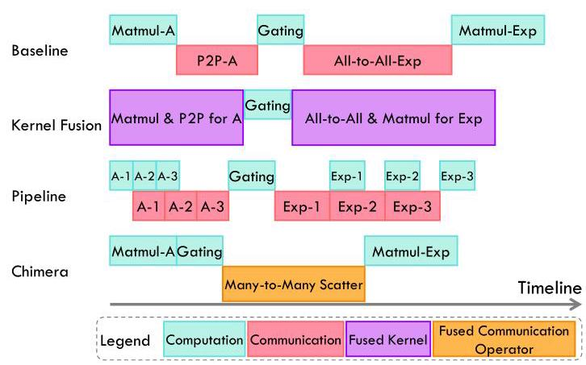
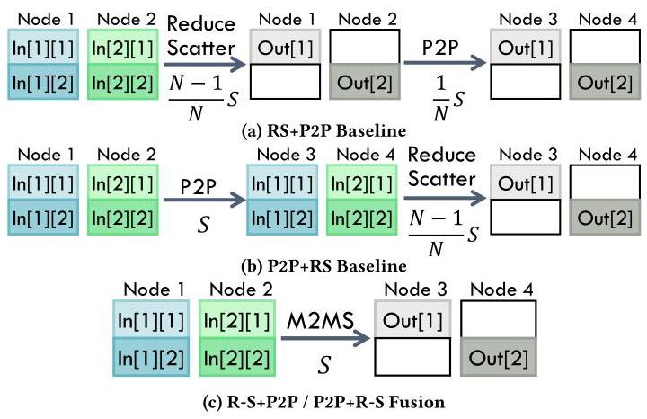
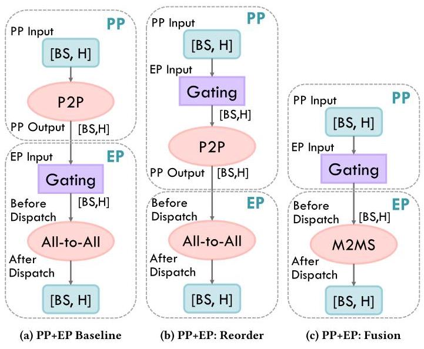
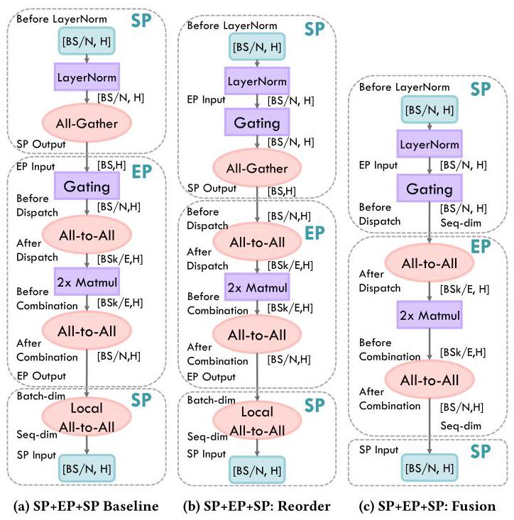
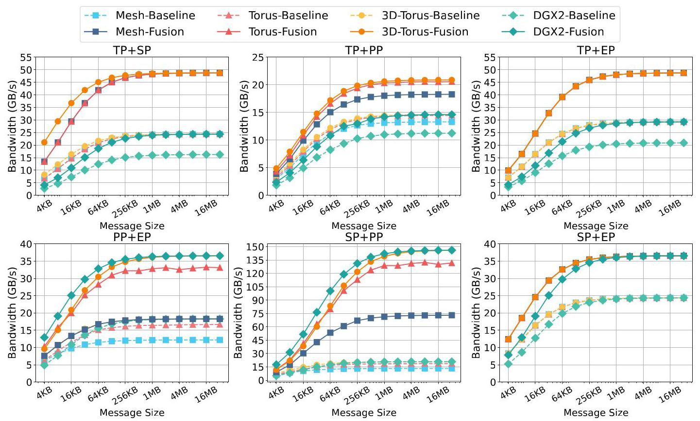
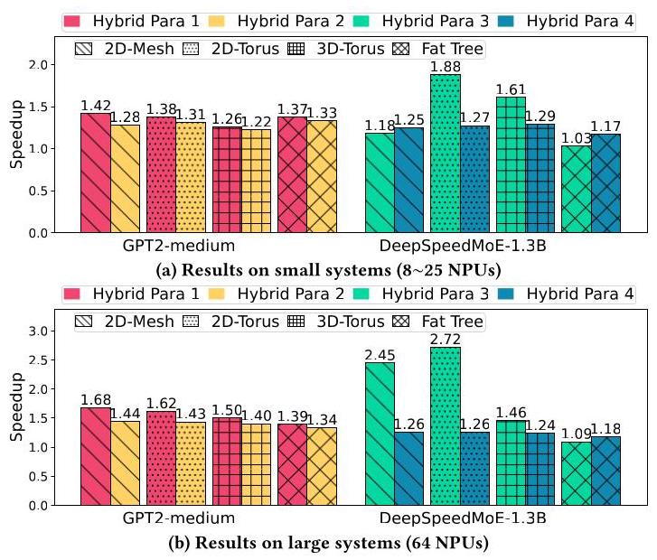
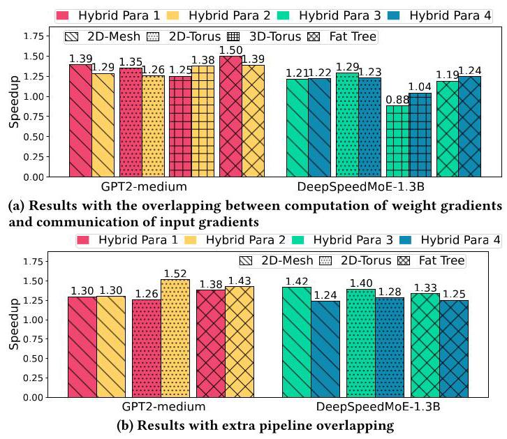
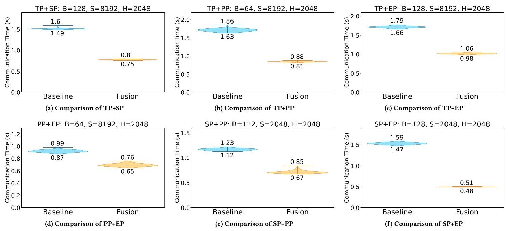

# Chimera: Communication Fusion for Hybrid Parallelism in Large Language Models 深度解读

> **作者**：Le Qin, Junwei Cui, Weilin Cai, Jiayi Huang  
> **会议/年份**：ISCA 2025  
> **一句话总结**：Chimera 把混合并行中相邻 parallelism 转换带来的冗余 collective communication 合并为更小的通信算子，从通信量本身减少 LLM 训练和推理中的通信瓶颈。

## 一、问题定义（Problem）

这篇论文关注的是 LLM 在多 NPU/GPU 集群上采用 hybrid parallelism 时的通信开销。LLM 模型越来越大，单个加速器放不下完整模型，也无法在可接受时间内完成训练或推理，所以系统会组合 data parallelism（DP）、tensor parallelism（TP）、pipeline parallelism（PP）、sequence parallelism（SP）和 expert parallelism（EP）。问题在于，不同并行方式在层与层之间切换时，会连续触发不同 collective communication，而这些通信通常是 blocking 的，计算必须等通信完成。

本文不是第一个发现“LLM 分布式训练通信很贵”的工作，但它切入了一个更具体的问题：已有系统常常为了让前一个 parallelism 得到“完整正确输出”而做同步，但后一个 parallelism 真正需要的只是某种输入布局。前一个同步结果可能马上被后一个并行模式重新切分、重排或路由，因此中间态的通信是冗余的。

Fig. 1 的价值在于把 Chimera 和已有方法区分开：kernel fusion 主要减少内存访问，pipeline scheduling 主要尝试 overlap computation and communication，而 Chimera 直接减少通信算子需要搬运的数据量。图中 PP+EP 的时间线显示，在通信占比很高时，仅靠 overlap 很难消掉瓶颈，因为最终仍要传同样多的数据。

**动机评估**：动机是 solid 的。论文先从 Megatron 的 TP+SP 和 S-LoRA 的通信简化中归纳出现有系统已经“偶然”利用过冗余通信，再把这个现象推广成一个系统性问题。Table 2 进一步给出常见 parallelism transition 的通信量和 real demand，占比可以低到 0%-66.7% 或 50%-66.7%，说明冗余不是边角优化。

**核心 Insight**：通信的目标不应被定义为“完成前一个 parallelism 的输出同步”，而应定义为“为后一个 parallelism 提供正确输入”。一旦把目标从中间态正确性改成最终输入需求，就可以把相邻通信算子融合为一个 redundancy-free operator。

## 二、相关工作（Related Work）

论文把相关工作组织成三条线。

第一类是 hybrid parallelism 框架和系统。Megatron-LM 支持 DP、TP、PP、SP，并已经在 TP+SP 中把 All-Reduce 简化为 Reduce-Scatter；DeepSpeed-TED 和 FasterMoE 等系统处理 MoE 的 tensor/expert/data 混合并行；Alpa 自动搜索 inter-operator 和 intra-operator 的并行切分；MegaScale 关注超大 GPU 集群上的混合并行训练。这些系统证明了混合并行是 LLM 系统的主流方向，但多数优化是面向特定组合或特定部署的经验式处理。

第二类是 kernel fusion。CoCoNet、Data Movement Is All You Need、以及 fused computation-collective operations 等工作把计算算子和通信算子融合，目标是减少数据在内存层级之间的读写，或者提升相邻计算/通信的执行效率。它们的不足在于没有改变 collective communication 的语义目标，也没有系统地消除 communication-communication 之间的冗余数据搬运。

第三类是 communication scheduling 和 collective algorithm。Centauri、Lancet、Themis、C-Cube 等工作通过切分通信、流水化、overlap 或 topology-aware scheduling 来减少可见通信时间。它们适合在已有通信量不变的前提下做执行调度，但如果中间通信本身就是冗余的，调度只能缓解，不能从根上减少需要传的数据。

Chimera 的定位因此比较清楚：它不是替代 kernel fusion、overlap scheduling 或 collective algorithm，而是在这些方法之前先改变图中的通信算子组合，降低后续优化面对的通信量。

## 三、技术挑战（Challenges）

**挑战 1：如何定义“冗余通信”。** 在分布式计算图中，每个 collective 都有局部正确性要求，不能简单删除。论文需要证明某些中间同步不是后续计算真正需要的状态，而只是前一个 parallelism 的惯性输出。

**挑战 2：不同 parallelism 的通信模式差异很大。** TP 对应 All-Reduce，SP 对应 All-Gather，PP 对应 P2P，EP 对应 All-to-All，TP+PP 还可能用 M2MS+All-Gather。Chimera 要能覆盖这些组合，不能只为一个 case 写特化规则。

**挑战 3：fusion 需要保持计算图等价。** 如果两个通信算子之间夹着 computation operator，直接融合会改变依赖关系。论文选择只重排 MoE 中的 Gating，因为 Gating 只决定 token 去哪个 expert，不改变 activation value 本身，因此可以前移到 P2P 或 All-Gather 之前。

**挑战 4：融合后的通信算子要可实现。** Chimera 不想引入大量新 collective，而是把 fused operator 落在 Reduce-Scatter、All-Gather、All-to-All、P2P、M2MS 这五类基本通信上。M2MS 尤其关键，因为多个组合的 fused form 都会变成 M2MS。

**挑战 5：评估要覆盖泛化性。** 如果只在一个 GPU 节点上跑一个 MoE case，很难证明方法通用。论文因此同时做仿真和真实机器实验，覆盖 2D Mesh、2D Torus、3D Torus、Fat-Tree、小规模和 64 节点规模、forward/backward 以及真实 8×RTX 4080 节点。

## 四、解决方案（Solution）

### 整体思路

Chimera 的机制可以概括为三步。

第一步，把 All-Reduce 拆成 Reduce-Scatter + All-Gather。这样做是为了暴露可融合的细粒度通信片段，因为 All-Reduce 常常包含一个后续 parallelism 不需要的 gather 或 scatter 中间目标。

第二步，在保持等价的前提下重排 computation operator。当前论文实际需要重排的是 MoE 的 Gating operator。Gating 负责根据 activation 计算 expert 选择，不改写 activation，因此可以移动到通信之前，让原本隔开的 P2P/All-Gather 与 All-to-All 变成相邻通信。

第三步，用 fused communication 替换相邻通信。论文在 Table 3 中列出五类基本通信的组合规则，例如 P2P+All-to-All 可以融合成 M2MS，All-Gather+All-to-All 可以融合成 All-to-All，All-Gather+Reduce-Scatter 可以直接变成 Zero。

Fig. 7 展示了 Chimera 的基本直觉：R-S+P2P 和 P2P+R-S 都是在把源节点数据搬到目标节点并完成对应切分，但两步执行会构造一个中间态。融合成 M2MS 后，源节点直接把各自需要的 chunk 发到最终目标，避免为了中间结果多走一轮同步。

### 贯穿示例

可以把一个 MoE 层前后的数据流看成“上一段流水线产生一批 token，下一段 expert layer 只关心每个 token 应该到哪个 expert”。传统执行会先用 PP 的 P2P 把整批 token 送到 EP 所在设备，再在 EP 内执行 Gating，然后 All-to-All dispatch 到专家设备。Chimera 的看法是：如果 Gating 不改变 token 值，只计算路由，那么它可以放在上一段流水线设备上先做。这样每个 token 的最终目的地已经知道，系统就不必先发到 EP 入口再二次分发，而是通过 M2MS 直接把 token 发到目标 expert。

这个例子串起了论文的三个核心点：冗余来自“先同步到中间布局”；重排的安全性来自 Gating 不改变 activation；融合后的通信目标是后续 EP 真正需要的 expert dispatch 输入。

### 关键技术点

**通信开销建模。** 论文把各 parallelism 的主要通信量抽象为 B、S、H、N 和 MoE top-k 的函数。TP 的 All-Reduce 开销是 `2(N-1)BSH/N`，SP 的 All-Gather 是 `(N-1)BSH/N`，EP 的 All-to-All 是 `(N-1)BSHk/N`，PP 的 P2P 和 M2MS 都按 `BSH` 计。这个模型不依赖具体拓扑，因此适合用来判断冗余通信的比例。

**transition-level real demand。** Table 2 的核心不是列公式，而是把“当前两段通信量”和“真正需要的通信量”放在一起比较。例如 TP+SP 只需要 Reduce-Scatter，已有 Megatron 相当于把通信量降到 50%；PP+EP 的 real demand 可以只剩 `BSH`，因为 P2P 和 All-to-All 的组合可以被直接 M2MS 化；SP+PP 与 SP+EP 虽然尚未广泛出现在主流部署中，但也能从同一套分析得到可融合形式。

Fig. 8 是论文最重要的 case study。左图是 baseline：PP 结束后 P2P 到 EP 入口，Gating 后再 All-to-All；中图把 Gating 前移到 PP 侧；右图把 P2P+All-to-All 合成 M2MS。这个变化也带来一个实现含义：Gating 的部署位置从 EP 侧变成前一层所在 NPU。

Fig. 9 说明 Chimera 不只是两个通信算子的局部替换。SP+EP+SP 原本包含 SP 末尾 All-Gather、EP 内两次 All-to-All、以及 EP 输出转回 sequence dimension 的 local All-to-All。重排 Gating 并让 dispatch 直接按 sequence split 工作后，末尾 local All-to-All 可以消失，整个路径更接近后续 SP 所需的真实布局。

**M2MS 的实现。** 融合后很多场景落到 Many-to-Many Scatter。论文没有把它当作黑盒，而是用异步 point-to-point 组织 M2MS：每个源组节点按错开的目标顺序发送，结合 DOR 和等距路径随机方向路由，降低 one-to-many 或 many-to-one 争用。Fig. 11 用 2D torus 展示了这种分阶段发送方式。

### 与已有方案的对比

相比 kernel fusion，Chimera 不需要为不同计算形态定制 kernel，而是替换图中的通信算子。相比 overlap scheduling，Chimera 不依赖计算和通信能否重叠，也不要求把算子切成更细粒度 chunk。相比 collective algorithm 设计，Chimera 先减少通信语义上的数据量，后续仍可用已有算法优化 fused operator。

不足也比较明确：Chimera 的收益集中在 parallelism transition 上，对 DP weight update 阶段的 gradient All-Reduce 无能为力；它依赖计算图中存在可安全重排的 operator，目前论文实际展示的是 Gating；真实系统评估只覆盖单节点 8×RTX 4080，尚未证明在生产级多节点训练框架中端到端集成的工程代价。

## 五、实验评估（Experiments）

### 实验设定

论文的评估由四部分组成：synthetic effective bandwidth、link bandwidth sensitivity、end-to-end forward/backward simulation、真实机器 transition performance。

仿真部分使用 SCALE-Sim v2 估算计算时间，用 BookSim2 建模互连网络。加速器配置为 TPU-like：16 个 PE，每个 PE 是 256×256 systolic array，1 GHz，32-bit precision。网络覆盖 2D Mesh、2D/3D Torus、Fat-Tree，小规模包括 5×5 mesh、4×4 torus、2×2×2 3D torus、8×2 fat-tree，大规模扩展到 64 个节点。All-Reduce、Reduce-Scatter、All-Gather、All-to-All 使用常见 ring 或 halving-doubling 类算法，M2MS 用论文实现的异步 P2P 调度。

真实机器部分在一个 8×NVIDIA RTX 4080 节点上运行，PCIe 4.0×16，每张 GPU 标称 32 GB/s host transfer bandwidth，软件栈为 PyTorch 2.5.1、CUDA 12.4、NCCL 2.21.5。

### 主要实验与结论

Fig. 10 是 synthetic bandwidth 的核心结果。随着 message size 增大，fusion 和 baseline 都逐渐饱和，但 fusion 的饱和值明显更高。论文报告在饱和点处，TP+SP、TP+PP、TP+EP、PP+EP、SP+PP、SP+EP 的 effective bandwidth speedup 分别为 1.50-2.56×、1.26-1.43×、1.27-1.67×、1.23-2.65×、1.42-7.06×、1.49-1.50×。SP+PP 的上限特别高，原因不仅是通信量减少，也因为 fused M2MS 缓解了网络链路争用。

link bandwidth sensitivity 的结论是：Chimera 对链路带宽扩展呈较好的线性可扩展性。这个结果符合方法本质，因为它减少的是数据量；节点数扩展的效果则更依赖 fused communication 的调度策略和 collective algorithm 实现。

Fig. 12 评估 GPT2-medium 和 DeepSpeedMoE-1.3B 的 forward pass。小规模系统中，Chimera 对 GPT2 和 DeepSpeedMoE 的平均加速分别为 1.32× 和 1.34×；大规模 64 NPU 配置中，平均加速分别提升到 1.48× 和 1.58×。这说明通信 fusion 的收益能穿透到模型层面的 end-to-end latency，而不仅是 microbenchmark。

Fig. 13 说明 Chimera 在 backward pass 中仍有收益。第一种策略将 weight gradient computation 与 input gradient communication overlap，GPT2 和 DeepSpeedMoE 平均加速为 1.35× 和 1.16×；第二种 two-stage pipeline 同时 overlap communication and computation，平均加速为 1.36× 和 1.32×。这些数值低于某些 synthetic bandwidth speedup，说明在端到端 workload 中计算、非 transition 通信和调度开销会稀释 microbenchmark 收益。

Fig. 14 和 Table 6 是真实机器验证。各 transition 的平均加速分别为：TP+SP 1.96×、TP+PP 2.04×、TP+EP 1.69×、PP+EP 1.32×、SP+PP 1.63×、SP+EP 3.09×。其中 SP+EP 的真实加速最高，和 Table 2 中其冗余比例较高的分析一致。

### 结论支撑性分析

实验总体能支撑论文的核心 claim：Chimera 确实能减少 transition communication，并且收益在多种 topology、model、parallelism 组合和真实机器上都出现。尤其是 synthetic bandwidth、end-to-end simulation、real-node transition 三层证据互相补强，避免了只靠公式论证。

但实验也有边界。第一，end-to-end 结果主要来自模拟器，真实机器只测 transition performance，没有展示完整训练框架中 optimizer、scheduler、runtime graph rewrite 等工程开销。第二，真实机器是单节点 PCIe 系统，还不能完全代表多节点 InfiniBand/NVLink/NVSwitch 混合拓扑。第三，论文强调 Chimera 可用于 inference、fine-tuning 和 multimodal transformer，但实验主线仍集中在 GPT2 与 DeepSpeedMoE。

## 六、附加洞察（Side Findings）

**结论 1：已有系统已经在局部做过“通信冗余消除”，但缺少统一抽象。**  
*出处*：Section 3.1，Fig. 5 和 Fig. 6。  
*推理链条*：Megatron 的 TP+SP 把 All-Reduce 简化为 Reduce-Scatter，S-LoRA 通过重排 Add 让 All-Gather 被 All-Reduce 吞掉；这些优化都说明某些同步中间态并非必需；但它们来自人工观察和特定场景，因此论文进一步抽象为 parallelism transition 中的 communication redundancy。

**结论 2：Gating 前移虽然保持数值等价，但会改变算子部署位置和数据布局。**  
*出处*：Section 4.2，Fig. 8。  
*推理链条*：Gating 只基于输入 activation 计算 expert routing，不修改 activation value；所以它可以从 EP 侧移动到 PP/SP 侧；移动后 P2P/All-Gather 与 All-to-All 相邻，fusion 成为可能；代价是 runtime 需要在前一层所在 NPU 上执行 Gating，并接受新的数据布局。

**结论 3：Chimera 对异构网络是正交优化，而不是拓扑特化优化。**  
*出处*：Section 6.2。  
*推理链条*：很多异构网络优化是在 intra-node 和 inter-node 之间转移通信压力；Chimera 减少的是 semantic communication volume；因此即使不同层级带宽差异很大，减少要传的数据仍然有效；后续仍可叠加 topology-aware collective scheduling。

**结论 4：Chimera 的收益不覆盖所有训练阶段。**  
*出处*：Section 6.1。  
*推理链条*：训练包含 forward、backward 和 weight update；Chimera 优化的是 activation 或 input-gradient 在 parallelism transition 时的通信；如果 weight update 使用 DP All-Reduce 且旁边没有可融合通信，那么该通信无法被 Chimera 消除；因此论文的收益边界主要在 hybrid-parallel layer transition。

## 七、总结与评价（Wrap-up）

Chimera 的贡献在于把“混合并行通信优化”从执行层面的 overlap、kernel fusion、collective algorithm，推进到计算图语义层面的 communication-communication fusion。它通过定义 real demand，系统性识别 parallelism transition 中的冗余同步，并把相邻通信替换成更小的 fused operator。

这篇论文最大的亮点是问题抽象很干净：它没有为某个 MoE kernel 或某个拓扑写特化技巧，而是给出一张通信算子组合表，并在 PP+EP、SP+EP+SP 等 case 中展示如何落地。实验也比较完整，既有公式、仿真，也有真实节点测量。

最大的不足是系统集成深度还不够。Chimera 要在真实框架中稳定生效，需要 compiler/runtime 能识别 parallelism transition、验证 operator reorder 的等价性、生成 fused collective，并和已有 NCCL 或框架通信调度协作。论文证明了机制有价值，但离生产系统的自动化集成还有工程距离。

后续值得探索的方向包括：把 fusion 规则接入 Megatron/DeepSpeed/Alpa 的图优化器；在多节点 NVLink/InfiniBand 混合拓扑上验证 M2MS 的调度质量；把 fusion 与 computation-communication overlap 联合搜索，避免两类优化互相干扰。

## 八、章节脉络与段落速览（Structure Map）

- **Abstract**：提出 hybrid-parallel LLM 的通信瓶颈，并概括 Chimera 通过通信融合带来的 1.23-7.06× bandwidth speedup 与端到端加速。
  - ¶1 说明 LLM 需要多 NPU 混合并行，但频繁 blocking communication 成为系统瓶颈。
  - ¶2 概括 Chimera 的通信冗余识别、算子重排、fused communication 生成和主要性能结果。

- **Section 1 · Introduction**：从 LLM 规模增长引出混合并行，再说明已有通信优化没有减少通信量本身。
  - ¶1 说明模型参数和计算需求增长使单 NPU 不现实，多 NPU 并行成为必要。
  - ¶2 介绍 DP、TP、PP、EP、SP 等并行模式及 hybrid parallelism 的形成原因。
  - ¶3 指出 hybrid parallelism 面临通信模式复杂、blocking overhead 和通用优化困难两个挑战。
  - ¶4 对比 kernel fusion 与 pipeline scheduling，指出它们没有从通信过程本身减少数据量。
  - ¶5 提出 Chimera 通过 operator reordering 和 adjacent communication fusion 消除 transition redundancy。
  - ¶6-8 列出三项贡献：识别冗余通信、提出 Chimera、在多系统与多模型上验证加速。

- **Section 2 · Background**：定义论文后续使用的 LLM 结构、parallelism pattern 和 collective communication。
  - **2.1 · Parallelism Patterns in LLM**：介绍 Transformer/MoE 结构以及 DP、TP、PP、SP、EP 的计算与通信形态。
    - ¶1 解释 Transformer block 和 MoE expert layer 的基本结构。
    - ¶2 引出五种典型 LLM parallelism 并说明 Fig. 3 的符号约定。
    - ¶3-7 分别说明 DP 无 forward 通信、TP 需要 All-Reduce、PP 需要 P2P、SP 需要 All-Gather、EP 需要两次 All-to-All。
  - **2.2 · Collective Communication**：定义 Reduce-Scatter、All-Gather、All-Reduce、P2P、All-to-All 和 M2MS。
    - ¶1 说明 LLM 并行中频繁出现五类 collective 与 P2P。
    - ¶2-5 用 Fig. 4 解释各通信模式的数据切分、聚合、点对点转发和 many-to-many scatter 语义。

- **Section 3 · Motivation**：从已有自然优化中归纳冗余通信，并用通信量模型量化机会。
  - **3.1 · Understanding Communication Redundancy**：说明冗余来自为前一个 parallelism 同步输出，而不是为后一个 parallelism 准备真实输入。
    - ¶1 提出从 communication volume 而非特定拓扑或算法角度寻找通用优化。
    - ¶2 用 Megatron TP+SP 说明 All-Reduce 可以简化为 Reduce-Scatter。
    - ¶3 用 S-LoRA 说明 Add 重排可以让 All-Gather 被省掉。
    - ¶4 总结这些例子缺乏统一定义，并给出本文的 redundancy 解释。
  - **3.2 · Modeling Communication Overhead**：建立各通信模式和常见 transition 的开销模型。
    - ¶1 用 Table 1 建模 TP、PP、SP、EP、R-S、M2MS 的每设备通信量。
    - ¶2 用 Table 2 比较 common cascaded parallelism 的原始通信量与 real demand。
    - ¶3 强调 TP+PP、TP+EP、PP+EP 等常用组合此前尚未系统识别这类冗余。

- **Section 4 · Chimera**：给出通信融合方法和两个 case study。
  - ¶1 说明本节先介绍通用 fusion 方法，再讲 LLM hybrid parallelism 的具体应用。
  - **4.1 · Communication Fusion**：提出 All-Reduce 拆分、Gating 重排、相邻通信替换三步。
    - ¶1 解释拆分 All-Reduce、重排 computation operator 和生成 fused operator 的完整流程。
    - ¶2 说明 Table 3 穷举五类基本通信的相邻组合及对应 fused communication。
    - ¶3 用 Fig. 7 的 R-S/P2P 示例解释为何 M2MS 能避免中间态通信。
  - **4.2 · Case Study I: PP+EP**：通过前移 Gating 将 P2P+All-to-All 融合成 M2MS。
    - ¶1 说明 baseline 中 Gating 隔开 P2P 与 All-to-All，重排后两者相邻。
    - ¶2 解释 Gating 不改变 activation value，所以重排保持图等价。
    - ¶3 指出 fused M2MS 消除 PP 输出同步冗余，但改变 Gating 的部署位置。
  - **4.3 · Case Study II: SP+EP+SP**：把 SP 与 EP 前后转换中的多次通信合并。
    - ¶1 描述 baseline 包含 All-Gather、两次 All-to-All 和 local All-to-All。
    - ¶2 说明重排 Gating 后可以直接按 sequence dimension split，从而删除 local All-to-All。

- **Section 5 · Evaluation**：通过仿真和真实机器验证 Chimera 的 bandwidth 与端到端收益。
  - **5.1 · Methodology**：说明 SCALE-Sim、BookSim2、网络拓扑、collective algorithm 和 8×RTX 4080 真实平台设置。
    - ¶1 概述四类实验目标：synthetic bandwidth、sensitivity、end-to-end、real system。
    - ¶2-4 介绍加速器配置、网络拓扑、collective/M2MS 实现和真实机器软件栈。
  - **5.2 · Synthetic Experiments**：展示不同 transition 的 effective bandwidth speedup。
    - ¶1 定义 parallel degree、message size 和 effective bandwidth。
    - ¶2 报告六类 transition 在饱和点的 1.23-7.06× bandwidth speedup。
    - ¶3 说明 link bandwidth sensitivity 呈较好线性扩展。
  - **5.3 · End-to-End Performance**：在 GPT2 与 DeepSpeedMoE 上评估 forward/backward pass。
    - ¶1 描述 HP1-HP4 的 hybrid parallelism 组合。
    - ¶2 报告 forward pass 在小规模与 64 NPU 大规模系统的平均加速。
    - ¶3 报告 backward pass 在两种 overlap 策略下的平均加速。
  - **5.4 · Real Performance**：在真实 8×RTX 4080 节点上测试各 transition。
    - ¶1 说明每个配置重复运行 100 次并用 violin graph 展示分布。
    - ¶2 报告 Table 6 中 1.32× 到 3.09× 的平均加速范围。

- **Section 6 · Discussion**：讨论适用场景、异构网络和与其他优化的关系。
  - **6.1 · Application Scenarios of Chimera**：说明 Chimera 适用于 training、inference、fine-tuning 和 transformer-based multimodal models。
    - ¶1 区分 forward/backward 可优化通信和 weight update 中不可融合的 DP All-Reduce。
    - ¶2 说明 prefill/decode 场景中长序列 SP 和 hybrid parallelism 也可受益。
    - ¶3 扩展到 ViT、Qwen2.5-VL 等多模态长序列模型。
  - **6.2 · Chimera on Heterogeneous Network**：强调减少通信量对异构拓扑是正交收益。
    - ¶1 说明 Chimera 不靠 intra/inter-node tradeoff，而是直接减少 volume。
    - ¶2 指出它可与 heterogeneous communication optimization 继续叠加。
  - **6.3 · Relationship with Other Work**：比较 kernel fusion、scheduling、collective algorithms 与 Chimera。
    - ¶1 概括已有三类优化各自的协同困难。
    - ¶2-4 从操作对象、实现方式和目标三方面区分 Chimera 与 kernel fusion。
    - ¶5 说明 Chimera 与已有方法兼容，fused operator 后续仍可继续 overlap 或算法优化。

- **Section 7 · Related Work**：按领域回顾 hybrid parallelism、kernel fusion 和 communication scheduling。
  - **7.1 · Hybrid Parallelism in LLM**：总结 Megatron、DeepSpeed-TED、Alpa、MegaScale 等系统。
  - **7.2 · Kernel Fusion**：总结 CoCoNet 等 computation-communication fusion 工作没有探索 communication-communication fusion。
  - **7.3 · Communication Scheduling**：总结 Centauri、Lancet、Themis、C-Cube 等工作主要做 overlap 或 collective scheduling。

- **Section 8 · Conclusion**：重申 Chimera 定义并消除 transition communication redundancy。
  - ¶1 总结 Chimera 的通信融合机制和 1.23-7.06× bandwidth、1.16-1.58× end-to-end speedup。

- **Appendix A · Artifact Appendix**：说明 artifact 的代码、环境、运行脚本和复现实验范围。
  - **A.1-A.2** 概述 artifact 内容、运行环境、指标、磁盘和时间需求。
  - **A.3-A.5** 说明 Zenodo/GitHub 获取方式、硬件软件依赖、安装和运行脚本。
  - **A.6-A.7** 指出输出结果目录和 README 中的补充说明。
