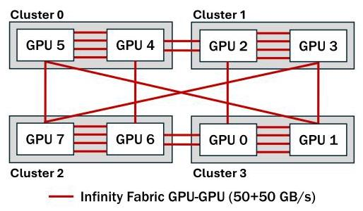
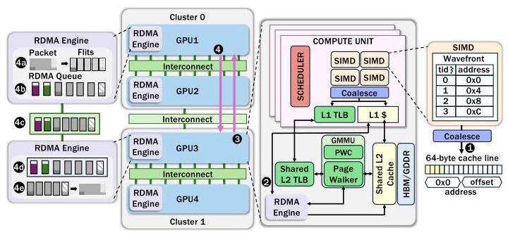
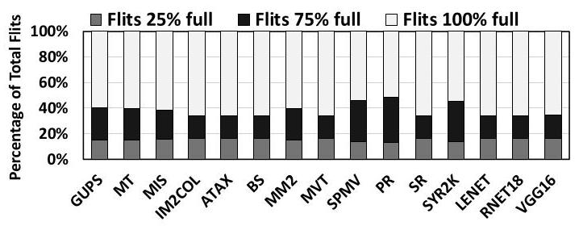
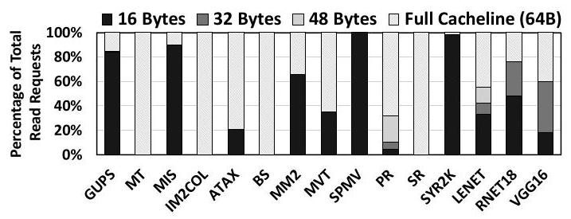
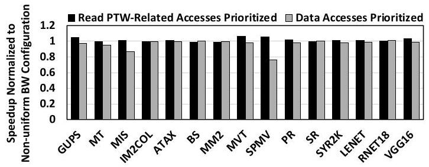
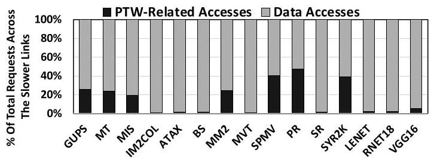
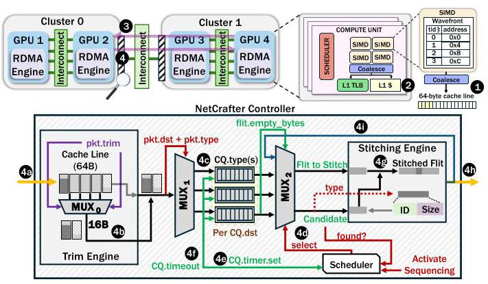
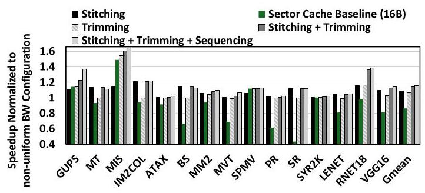
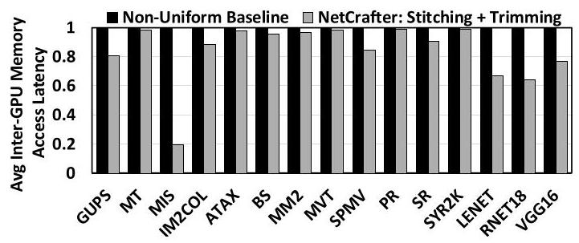
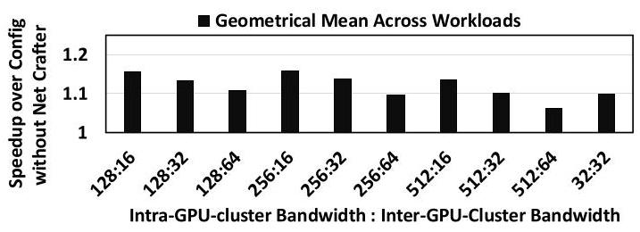

# NetCrafter: Tailoring Network Traffic for Non-Uniform Bandwidth Multi-GPU Systems 深度解读

> **作者**：Amel Fatima, Yang Yang, Yifan Sun, Rachata Ausavarungnirun, Adwait Jog  
> **会议/年份**：ISCA 2025  
> **一句话总结**：NetCrafter 面向非均匀带宽的 multi-GPU 系统，把跨 GPU cluster 的低带宽链路流量按 flit 级空洞、cache-line 实际需求和 PTW 延迟敏感性重新加工，从而通过 Stitching、Trimming 和 Sequencing 同时减少流量并改善关键路径延迟。

## 一、问题定义

这是一篇非 First 类型的改进型工作。原始问题是 multi-GPU 系统如何在 GPU 数量增加后继续扩展性能；已有方向包括 MCM-GPU、统一虚拟内存、多 GPU 数据/线程放置和 NUMA-aware 调度。NetCrafter 的切入点更窄：即使采用 LASP 这类 locality-aware CTA scheduling 和 data placement，现代大规模 GPU 节点仍然常用 hierarchical interconnect，同一 cluster 内 GPU 使用高带宽链路，不同 cluster 之间只能走低带宽链路，这个 bandwidth non-uniformity 会把 remote memory access 和 page table walk 放到拥塞链路上。

图 1 给出了论文动机的硬件背景：Frontier 节点内，同一 cluster 的 GPU-GPU Infinity Fabric 峰值带宽可达 200 GB/s，而跨 cluster 链路只有 50-100 GB/s。作者不是假设一个遥远的未来系统，而是从 Frontier、Summit、Aurora 这类真实 HPC 节点抽象出一个会长期存在的结构趋势：GPU scale-out 会越来越依赖低成本、层次化、非均匀的互连。

论文对问题重要性的支撑比较扎实。作者在 motivation 中把 baseline non-uniform 配置与一个不现实但有上界意义的 all-high-bandwidth ideal 配置对比，ideal 平均达到 $1.5\times$ speedup；同时低带宽网络的 utilization 和 inter-GPU-cluster memory access latency 明显更高。这说明瓶颈不是单纯来自调度/放置不佳，而是系统拓扑本身在规模化后制造了新的通信瓶颈。

**动机评估**：动机是 solid 的。论文用真实系统拓扑给出结构背景，用模拟实验给出理想带宽下的性能上界，再用 utilization 和 latency 说明低带宽链路确实拥塞。一个需要注意的边界是，评估依赖 MGPUSim 中抽象出的 4-GPU、2-cluster 模型，不能直接等同于所有商用 GPU fabric 的协议行为；但作为 architecture paper 的问题定义，这个抽象足够清楚。

**核心 Insight**：低带宽链路上的 flit 并不是都同样“有价值”。作者把这一点拆成三个可操作观察：第一，许多 fixed-size flit 因 packet size 与 flit size 不匹配而带有 padding bytes；第二，很多 inter-GPU read response 传了完整 64B cache line，但 wavefront 实际只需要其中一小段；第三，PTW-related flits 占比小却更 latency-sensitive。NetCrafter 的三个机制分别对应这三个观察：Stitching 利用 padding 空位，Trimming 避免不必要 cache-line bytes，Sequencing 优先处理 PTW 关键路径流量。

## 二、相关工作

论文把相关工作组织成四条线索。

第一类是 network/message optimization。FinePack、DUALOPT、NIC batching、TCP piggybacking 等工作都在减少协议开销或合并细粒度传输，但它们通常工作在 packet/message 层，目标也不一定是 GPU cluster 间的 flit-level waste。NetCrafter 的差异在于，它直接利用 16B flit 内的 padding 空洞，并且只在低带宽 inter-GPU-cluster network 上做处理。

第二类是 CTA scheduling 和 data placement。First-touch、CODA、LASP、Grit 等方法试图把线程块和数据放在更近的位置，减少 remote access。NetCrafter 承认这些工作很重要，并把 LASP 作为 baseline；但它指出即使 locality mapping 已经尽力，GPU 数量增加后仍然会有无法消除的 remote access，因而还需要在网络侧处理剩余流量。

第三类是 cache optimization。Sector cache、remote data caching、memory-side/SM-side LLC 等方法可以改变数据缓存粒度和位置。NetCrafter 的 Trimming 与 sectoring 有交集，但它不是无差别地把所有 L1 fill 都改成 16B sector，而是只在跨低带宽 cluster 的 read response 上裁剪，尽量保留高带宽路径上的 spatial locality。

第四类是 virtual memory / translation optimization。已有工作关注 TLB sharing、PTW forwarding、PTE placement、page migration 等。NetCrafter 不替代这些机制，而是把 PTW-related flits 当作网络内的 latency-critical traffic 来排序。这一点很关键：它不是让地址翻译本身变快，而是避免 PTW 流量在低带宽链路上被大块 data response 阻塞。

总体看，NetCrafter 的定位是一个跨 cache、network、virtual memory 的互补机制。它不主张替代调度、放置或缓存优化，而是把这些机制之后仍然落到低带宽链路上的 traffic 再做一次 flit-level tailoring。

## 三、技术挑战

**挑战 1：在已经做 locality optimization 的 baseline 上证明网络仍是主瓶颈。** 如果 baseline 映射很差，网络拥塞只是人为制造的问题。作者因此采用 LASP，并检查 local/remote access 分布，说明 baseline 已经尽量最大化 local access，但跨 GPU cluster remote access 仍然不可避免。

**挑战 2：减少 flit 数量时不能破坏 packet reassembly。** Stitching 把一个 flit 的空位塞进另一个 packet 的部分 payload 或完整小 packet，因此接收端必须能 un-stitch。NetCrafter 需要在 packet header 的 unused type encoding、ID、Size 等字段里留下足够元数据，同时只 stitching 同 destination / same route 的 flits，避免路由和重组复杂度失控。

**挑战 3：减少 cache-line 传输不能显著伤害 spatial locality。** Trimming 如果过于激进，就会退化成全系统 sector cache，增加 L1 miss。论文的处理是只对 inter-GPU-cluster low-bandwidth request 做 16B 粒度 trimming，且当 wavefront 需要超过 16B 时保留完整 64B cache line。

**挑战 4：优先级调度要改善关键路径而不牺牲普通 data traffic。** PTW-related flits 延迟敏感，但如果它们占比很大，简单优先级会拖慢 data response。作者先证明 PTW-related accesses 平均只有约 13% 的低带宽网络流量，再提出 Sequencing，这让优先级机制有比较可信的低副作用前提。

**挑战 5：三个机制有相互作用。** Stitching 需要等待候选 flit，等待会增加 latency；Sequencing 又要求 PTW flits 不被等待拖慢；Trimming 会改变 response flit 数量，也会影响 Stitching 机会。NetCrafter 通过 Selective Flit Pooling、独立 PTW queue 和 controller pipeline 把这些机制组合起来。

## 四、解决方案

### 整体思路

NetCrafter 的核心是把 inter-GPU-cluster switch 变成一个轻量的 traffic crafting 点。它只处理需要穿越低带宽 cluster 间链路的流量，不试图重写整个 GPU memory hierarchy。Controller 里有 Trim Engine、Cluster Queue 和 Stitching Engine：Trim Engine 在 read response 离开 remote GPU cluster 前裁剪无用 bytes，Cluster Queue 按 destination cluster 和 packet type 暂存 flits，Stitching Engine 把可兼容 flit 的有效信息塞进 parent flit 的空位；同时 scheduler 对 PTW-related flits 做 Sequencing。

图 2 是理解 NetCrafter 的入口。一个 GPU 访问另一个 cluster 内 GPU 上的数据时，请求会经 RDMA engine 和低带宽网络到达远端 GPU，远端再把 read response 拆成 flits 发回。NetCrafter 正是在这些 flits 被送入低带宽链路之前介入，因此它的优化目标不是减少程序层面的 remote request 数量，而是让已经产生的 remote traffic 更紧凑、更有序。

### 贯穿示例

可以用论文 Figure 13 的场景来串起来：Cluster 1 的 GPU 4 上一个 wavefront 访问 Cluster 0 的 GPU 2 上某个 cache line，但它实际只需要这个 64B cache line 的前 16B。baseline 会先经过 TLB/PTW 完成地址翻译，然后发出 remote read request，GPU 2 返回完整 64B read response，这个 response 被切成多个 16B flits 穿过低带宽链路。NetCrafter 会在 GPU 2 所在 cluster 的 switch 里观察这个 response：如果 trim bits 表示只需要 16B，就先删掉不需要的 payload；剩下的 flit 进入按 destination/type 划分的 queue；若 flit 有空位，就尝试把同目的地的其他小 packet 或 partial payload stitch 进去；若当前处理的是 PTW-related flit，则跳过 pooling delay 并获得更高调度优先级。

### 关键技术点

**1. Packet / flit 基础结构。** 论文假设简化 PCIe-style packet：header 加 payload，flit 固定为 16B。不同 packet type 的有效 bytes 很不一样，例如 read request 需要 12B、read response 需要 68B 但占 80B、write response 只需 4B 却占 16B。因此 padding 不是偶发现象，而是 packet 与 flit 粒度不匹配的系统性结果。论文统计显示，低带宽链路上平均 42% 的 flits 含有 25% 或 75% redundant padded data。

图 6 支撑 Stitching 的必要性：如果低带宽链路上的大量 flit 都没有装满，那么只提升链路带宽并不是唯一解，也可以把已经要传输的有效 bytes 重新装箱。这个观察把问题从“网络太慢”转化成“网络中有不少空载容量被 padding 占掉”。

**2. Stitching。** 当一个 parent flit 即将进入网络时，NetCrafter 检查它有多少 empty bytes，并在同一 destination 的 queue 中寻找能放进去的 candidate flit。若 candidate 是完整小 packet，可以直接拼接；若 candidate 只是较大 packet 的部分 payload，就添加 ID 和 Size，使接收端知道这段 payload 属于哪个原始 packet、长度是多少。Header type field 中未使用的编码被用来标记 stitched flit。

**3. Flit Pooling 与 Selective Flit Pooling。** 单纯 Stitching 的机会受限于 flit 弹出时队列里是否刚好有合适候选。Flit Pooling 会短暂延迟 flit ejection，等待更多候选出现；但等待会拉长 latency。Selective Flit Pooling 因此把 PTW-related latency-critical flits 排除在 pooling delay 之外，让 Stitching 更容易发生，同时避免拖慢关键路径。

**4. Trimming。** 论文发现许多 wavefront 对 remote 64B cache line 只使用 16B 或更少。Trimming 在 read response 必须穿越 inter-GPU-cluster low-bandwidth network 且请求所需 bytes 不超过 16B 时，只传必要 sector。为了表达这个信息，NetCrafter 复用 address field 中未使用的 3 个 bits：1 bit 表示是否需要 16B，2 bits 表示 64B cache line 内的 offset。L1 端配合 16B sector cache 来接收部分 cache line。

图 7 解释了为什么 Trimming 不是盲目压缩。很多 inter-GPU-cluster read request 的实际需求集中在 16B 或更小，特别是随机/稀疏访问 workload；但也有应用保留较强 spatial locality，所以 NetCrafter 只在低带宽链路上 selective trimming，避免把所有访问都降到细粒度 sector。

**5. Sequencing。** PTW-related flits 在总 traffic 中占比小，但会阻塞后续 data access，因为虚拟地址到物理地址的转换在 read request 的关键路径上。NetCrafter 给 PTW-related flits 更高优先级，使它们不被大块 data response 排队阻塞。论文强调它只优先处理可能 stall read access 的 PTW-related flits，而不是简单地给所有控制流量开绿灯。

图 8 的意义是把“PTW 更关键”从直觉变成实验观察：优先相同比例的 data accesses 可能反而让性能变差，而优先 read PTW-related accesses 能改善性能。这个结果是 Sequencing 的直接证据。

图 9 则给出 Sequencing 的副作用边界：PTW-related requests/responses 平均约占低带宽网络总访问的 13%。因为占比小，对它们优先排序通常不会显著挤压 data traffic，却能减少关键路径等待。

**6. Controller 组织。** NetCrafter controller 位于每个 cluster switch 中，包含 Trim Engine、Cluster Queue、Stitching Engine 和调度逻辑。Cluster Queue 是两级虚拟结构：先按 destination cluster 分组，再按 request type 分组，因为 type 决定空位大小与 Stitching 兼容性。PTW-related flits 放入单独 queue，避免被 pooling timer 延迟。

图 13 把三个机制放到同一条 read response 路径上：先 trim，再 queue，再 stitch，再按 PTW 敏感性调度。它也说明 NetCrafter 不是三个相互独立的优化开关，而是一个围绕低带宽 egress port 组织的控制器。

**7. 硬件和协议开销。** 每个 GPU cluster 需要一个 NetCrafter controller，主要 SRAM 开销是 1024-entry cluster queue，每个 entry 16B，总体约 16.02KB/cluster。相对 AMD Instinct MI250X 的 16MB L2 cache，这是约 0.098%；相对 64MB SRAM 的 programmable switch，是约 0.024%。作者没有精确量化 timer、mux 和额外控制逻辑的面积/功耗，这是实现层面仍需补足的部分。

### 与已有方案的对比

相对 CTA scheduling / page placement，NetCrafter 不试图减少 remote access 的产生，而是优化剩余 remote traffic。相对 sector cache，Trimming 更 selective，只在低带宽跨 cluster 路径上裁剪，保留高带宽路径上的完整 cache-line locality。相对 FinePack / DUALOPT 这类 message-level 合并，Stitching 更接近 flit-level repacking，利用的是 padding bytes。相对 TLB/PTW 优化，Sequencing 不改变翻译机制，而是在网络队列中降低翻译流量的等待时间。

局限也很清楚：机制依赖 packet header 中有可复用 bits/encoding；16B trimming granularity、32-cycle pooling window、PTW priority 都是经验设计；论文评估的是 cycle-level simulator 而非 RTL 或真实硬件原型。

## 五、实验评估

### 实验设定

作者基于 MGPUSim 和 Akita network model 建模非均匀 multi-GPU 系统。baseline 有 4 个 GPU，每个 GPU 64 个 CU，L1 vector cache 为 64KB/CU，L2 cache 为 4MB/GPU，cache line 为 64B。每个 cluster 内的 intra-GPU-cluster network 是 128 GB/s，跨 cluster 的 inter-GPU-cluster network 是 16 GB/s，带宽比为 8:1。Switch processing latency 设为 30 cycles，I/O buffer 为 1024 entries，flit size 为 16B。NetCrafter 的 Cluster Queue 也是 1024 entries，每个 entry 16B。

Workloads 覆盖 15 个 GPU applications：GUPS、SPMV、PR、MIS 代表 random access，SYR2K、IM2COL 代表 adjacent access，BS 代表 partitioned access，MT/MM2/SR 代表 gather，ATAX/MVT 代表 scatter，还包括 VGG16、LENET、RESNET18 这类 DNN training workload。VGG16/RESNET18 使用 Tiny-ImageNet-200，LENET 使用 MNIST；作者承认没有使用大规模数据集，原因是 simulation time 过长。

### 主要实验与结论

**1. 非均匀带宽确实有明显优化空间。** 与 all-high-bandwidth ideal 配置相比，baseline non-uniform 平均落后到 ideal 可带来 $1.5\times$ speedup 的程度。这个结果说明低带宽 inter-cluster network 是值得专门处理的瓶颈，而不是微小局部优化。

**2. NetCrafter 的总体性能提升明显。** 在 15 个 workload 上，NetCrafter 相对 baseline non-uniform configuration 最高带来 64% speedup，平均提升 16%。其中 Stitching 和 Sequencing 对 bandwidth-constrained workloads 更稳定，Trimming 对 MIS、SPMV、GUPS 这类只使用 cache line 小部分 bytes 的 workload 更有效。

图 14 是实验部分的主图。它把 Stitching、Trimming、Sequencing 和组合效果放在同一组 workload 上比较，说明 NetCrafter 的收益不是单一机制贡献，而是 traffic reduction 与 latency-sensitive sequencing 的叠加。也能看到不同 workload 的收益差异较大，这与它们的 access pattern 和 cache-line utilization 有直接关系。

**3. 平均 inter-GPU-cluster memory access latency 下降。** Figure 15 显示 NetCrafter 减少低带宽网络流量后，跨 cluster 内存访问延迟也下降。这是对 Figure 14 性能结果的机制层解释：speedup 并不是来自更激进的计算调度，而是来自低带宽链路排队和传输压力降低。

图 15 的作用是把“少传 flit”连接到“应用变快”：网络 bytes 减少后，低带宽链路 congestion 缓解，memory access latency 下降，最终反映为 kernel execution time 缩短。

**4. Trimming 优于全局 16B sector cache 的关键在 selective。** 作者把 L1 vector cache 改成 16B sector cache 作为 baseline，与 Trimming 做公平对比。Sector cache 对 MIS、GUPS、SPMV 有帮助，但对依赖较粗粒度 spatial locality 的 workload 会增加 cache misses，导致性能下降。NetCrafter 的 Trimming 只裁剪低带宽 inter-cluster response，因此更好地平衡了 network saving 和 cache locality。

**5. Flit Pooling 的最佳窗口不是越大越好。** Figure 18 显示 pooling time 从 32 到 128 cycles 增大时，Stitching 机会增加，但未成功 stitch 的 flit 会付出额外 latency；32 cycles 是较好的折中。PR 等 workload 在普通 Flit Pooling 下会受到延迟损害，因此论文进一步引入 Selective Flit Pooling。

**6. Selective Flit Pooling 修复了 latency-sensitive traffic 的副作用。** Figure 19 表明，在 32-cycle selective pooling 下，PR 和 SYR2K 不再遭遇普通 pooling 的性能退化；Figure 20 表明 network bytes saving 在更大 pooling window 下逐渐饱和。因此最终设计选择 32 cycles，而不是追求更大的等待窗口。

**7. 不同 flit size 和 bandwidth 配置下仍有收益。** 当 flit size 从 16B 降到 8B 时，Stitching 机会减少，收益变小，但仍有提升。带宽敏感性实验覆盖 8:1 到 2:1 的 ratio、128-512 GB/s intra-cluster 和 16-64 GB/s inter-cluster，以及 homogeneous 32 GB/s 配置，NetCrafter 都保持正收益，且 bandwidth-constrained 场景收益更大。

图 22 支撑了设计的泛化性：NetCrafter 并不只针对 128/16 GB/s 这一组参数有效。当系统依然存在 bandwidth pressure 时，减少和重排 flits 的方法仍能发挥作用；但随着低带宽链路本身变宽，收益会自然收敛。

### 结论支撑性分析

实验总体能支撑论文核心声明：非均匀带宽 multi-GPU 的低带宽网络是瓶颈；低带宽链路中的 flit waste、cache-line overfetch 和 PTW latency sensitivity 都能被量化；三个机制组合后能带来平均 16%、最高 64% speedup。

不足主要有三点。第一，评估完全基于 simulation，缺少 RTL、FPGA 或真实 switch 实现来验证 controller timing、area 和 power。第二，DNN workload 使用 Tiny-ImageNet-200 和 MNIST，规模受 simulation time 限制，不能完全代表生产级训练。第三，协议假设为 simplified PCIe-like packet，真实 NVLink/Infinity Fabric/PCIe/CXL 风格协议中 unused bits、reassembly semantics 和 ordering constraints 可能更复杂。

## 六、附加洞察

**结论 1：即使采用 LASP，remote access 仍然是规模化系统的结构性问题。**  
*出处*：Section 5.1 Methodology。  
*推理链条*：作者先用 LASP 做 CTA scheduling 和 data placement，使 local accesses 最大化、remote accesses 在 GPU 间较均衡；随后指出随着系统规模增加，remote memory accesses 仍不可避免。因此，NetCrafter 的网络侧优化不是在弥补一个弱 baseline，而是在处理 locality optimization 之后剩下的结构性 remote traffic。

**结论 2：PTE placement 本身也是 multi-GPU locality 的一部分。**  
*出处*：Section 2.3 Virtual Memory Support。  
*推理链条*：LASP 主要处理 data page placement，但 PTW 访问的 PTE page 如果远离数据，也会走跨 cluster 低带宽链路；作者把每个映射 2MB virtual region 的 PTE page 放到该 region 第一个 data page 所在 GPU，类比 Linux NUMA-aware PTE placement。这个设计不是 NetCrafter 的主贡献，但它说明地址翻译元数据也需要 locality-aware placement，否则 Sequencing 要处理的 PTW traffic 会更多。

**结论 3：Flit Pooling 的收益存在明确延迟拐点。**  
*出处*：Section 5.4，Figure 18/19/20。  
*推理链条*：延长 pooling window 会增加 Stitching candidate 出现概率，提升 stitched flit 比例和 bytes saving；但未成功 stitch 的 flit 会被白白延迟，PR 等 workload 对此敏感；Selective Flit Pooling 排除 PTW-related flits 后缓解退化，而 32-cycle window 在性能和 bytes saving 上最平衡。这说明 pooling 不是一个单调增强的优化，而是需要和 latency classification 绑定。

**结论 4：全局细粒度 sectoring 并不等价于好的 network trimming。**  
*出处*：Section 5.3，Figure 16/17。  
*推理链条*：16B sector cache 能减少一些 workload 的无用传输，但对仍有 spatial locality 的 workload 会增加 L1 cache MPKI；NetCrafter 的 Trimming 只在 inter-cluster low-bandwidth path 上触发，保留 intra-cluster 和 local path 的完整 cache-line fetch。这说明“少传 bytes”必须受拓扑和访问路径约束，不能简单变成全系统小 sector。

**结论 5：论文的硬件开销数字很小，但不是完整实现成本。**  
*出处*：Section 4.5 Other Design Considerations。  
*推理链条*：作者计算的主要新增 SRAM 是 16KB cluster queue 加 16B stitch buffer，总计约 16.02KB/cluster，仅占 MI250X 16MB L2 的 0.098%；但论文同时说明 timer 和 multiplexer unit overhead 未计入。因而这个数字能说明 storage overhead 小，却不能完整说明 timing closure、control complexity 和 power overhead。

## 七、总结与评价

NetCrafter 的贡献在于把一个宏观系统趋势，即 GPU cluster 间 bandwidth non-uniformity，落到三个非常具体的 traffic 属性上：flit 内有空洞、cache-line 被过度获取、PTW flits 对延迟更敏感。Stitching、Trimming、Sequencing 分别回应这些属性，因此方案不是简单堆优化，而是有清楚的问题-观察-机制对应关系。

我认为论文最大的亮点是跨层视角很自然：它既懂 GPU memory hierarchy 和 virtual memory，又在 network flit granularity 上做文章；实验也通过 ideal bandwidth、occupancy、PTW 占比、latency、overall speedup 和 sensitivity studies 把论证链条闭合。最大不足是实现验证还停留在 simulator 和 simplified protocol，真实 GPU fabric 中的 ordering、flow control、error checking、coherence traffic 和协议字段可用性可能会让机制更难落地。

值得继续探索的方向包括：自适应 trimming granularity，而不是固定 16B；动态选择 pooling window，而不是固定 32 cycles；在硬件 coherence 或 SM-side cache 体系下利用更细粒度 coherence traffic 做 Stitching；以及用更接近真实互连协议的 RTL/FPGA prototype 验证 controller pipeline 和功耗。

## 八、章节脉络与段落速览

- **Section 1 · Introduction**：从 GPU scaling 的系统趋势引出 hierarchical multi-GPU interconnect 的低带宽瓶颈，并概述 NetCrafter 的三项机制。
  - **¶1**：单 GPU scaling 受 transistor scaling 和 die complexity 限制，研究者转向 MCM 和 multi-GPU。
  - **¶2**：现代系统常把高亲和 GPU 用高带宽链路连接，不同 GPU group 之间用低带宽链路扩展规模。
  - **¶3**：低带宽跨 cluster 链路导致 NUMA overhead，作者提出利用 flit 空洞、cache-line overfetch 和 PTW latency sensitivity 来优化。
  - **¶4**：Figure 1 展示 Frontier 节点中同 cluster 与跨 cluster 带宽的差异。
  - **¶5**：Stitching 通过把有效信息塞进 partially filled flits 来减少 flit 数量。
  - **¶6**：Stitching 的候选选择依赖 traffic category、Flit Pooling 和 latency-sensitive filtering。
  - **¶7**：Trimming 利用 wavefront 常只需要 16B cache-line data 的事实，减少低带宽链路上的 read response bytes。
  - **¶8**：Sequencing 优先处理 PTW-related flits，因为它们占比小但会阻塞关键路径。
  - **¶9**：贡献总结为瓶颈表征、NetCrafter 三机制设计，以及在 15 个 workload 上平均 16%、最高 64% speedup。

- **Section 2 · Background**：定义 baseline multi-GPU architecture、CTA/data placement 和 virtual memory model。
  - **2.1 · Baseline Architecture**：说明 4-GPU 非均匀带宽系统、共享 L2/HBM 语义和 remote access 路径。
    - **¶1**：每个 GPU 含 CU、L1、共享 L2 和 HBM/GDDR，thread 以 CTA 和 wavefront 方式执行。
    - **¶2**：系统聚合各 GPU 的 L2 和 memory capacity，remote access 通过 RDMA engine 访问其他 GPU 的 L2/HBM。
    - **¶3**：Figure 2 用 GPU 3 到 GPU 1 的跨 cluster read request 展示 coalescing、L1 miss、RDMA、flitization 和 reassembly 流程。
  - **2.2 · CTA Scheduling and Data Placement**：说明 baseline 采用 LASP 来按静态访问模式放置 CTA 和 data pages。
    - **¶1**：LASP 通过 compile-time static index analysis 降低 remote accesses，是后续分析的强 baseline。
  - **2.3 · Virtual Memory Support**：描述 TLB、GMMU、PWC、PTW 和 PTE placement。
    - **¶1**：每个 CU 有 L1 TLB，GPU 内有 shared L2 TLB/GMMU/PWC，PTW 可能访问远端 GPU 的 PTE。
    - **¶2**：load/store 先查 L1 TLB，再查 L2 TLB 和 PWC，必要时走四级 page table。
    - **¶3**：作者扩展 LASP，把 PTE page 与对应 data page 共置，减少 remote translation overhead。

- **Section 3 · Motivation and Analysis**：量化非均匀带宽瓶颈，并提炼 traffic reduction 与 traffic management 的观察。
  - **¶1**：本节先量化 non-uniform bandwidth 的影响，再分析低带宽网络上的 traffic 属性。
  - **3.1 · Analyzing Network Bottleneck**：用 ideal bandwidth 配置说明低带宽链路的优化空间。
    - **¶1**：all-high-bandwidth ideal 平均比 baseline 快 $1.5\times$，Figure 4/5 进一步显示 utilization 和 latency 更高。
  - **3.2 · Reducing Network Traffic**：从 padding bytes 和 partial cache-line utilization 两个角度说明可以少传。
    - **¶1**：Table 1 把 traffic 分为 read/write request/response 和 page table request/response，显示不同 packet type 的 padding waste。
    - **¶2**：Figure 6 显示平均 42% flits 含 25% 或 75% redundant data，Figure 7 显示许多 read request 只需 16B 或更少。
  - **3.3 · Managing Network Traffic**：识别 PTW-related flits 的 latency-critical 特征。
    - **¶1**：作者通过优先不同 flit category 的实验发现 read PTW-related flits 更影响性能。
    - **¶2**：Figure 8 显示优先 PTW-related accesses 优于优先相同数量 data accesses。
    - **¶3**：Figure 9 显示 PTW-related accesses 平均约占 13%，因此适合被优先调度。

- **Section 4 · NetCrafter: Design and Implementation**：详细介绍 Stitching、Trimming、Sequencing 以及 controller 设计。
  - **¶1**：NetCrafter 由 Stitching、Trimming、Sequencing 组成，应用于 inter-GPU-cluster networks。
  - **4.1 · Packet and Flit Structures**：建立 simplified PCIe-style packet 和 16B flit 模型。
    - **¶1**：packet header 包含 type、destination 和 ID 等元数据，payload 携带数据。
    - **¶2**：不同 packet 被切成不同数量的 flits，read response 等 packet 尾部会留下 padding bytes。
  - **4.2 · Design of Stitching Mechanism**：说明如何把 candidate flit 放进 parent flit。
    - **¶1**：Stitching 用其他 packet 的有效信息替换 redundant data。
    - **¶2**：候选条件是 candidate size 能放入 parent empty bytes，且 destination 相同。
    - **¶3**：partial payload candidate 需要 ID/Size，complete packet candidate 可以直接 stitch。
    - **¶4**：Figure 11(b) 展示五类 stitching 场景及 traffic reduction。
    - **¶5**：packet header unused type encoding 被用来标识 stitched flit。
    - **¶6**：Flit Pooling 延迟 ejection 以等待更多候选，但需要调节 delay。
    - **¶7**：Selective Flit Pooling 排除 PTW-related flits，避免 critical traffic 被 delay。
  - **4.3 · Design of Trimming and Sequencing Mechanisms**：说明 selective trimming 和 PTW priority。
    - **¶1**：Trimming 只在请求不超过 16B 且 response 穿越低带宽跨 cluster 网络时触发。
    - **¶2**：Trim bits 复用 address field 中未使用的 3 bits。
    - **¶3**：L1 sectored cache 支持 16B granularity 的部分 cache line。
    - **¶4**：Trimming 保留 intra-cluster 和 local path 的完整 cache-line fetch，以保留 spatial locality。
    - **¶5**：Sequencing 基于 PTW-related flits 占比小且 latency-sensitive 的观察优先处理这类 flits。
  - **4.4 · Implementation of NetCrafter**：描述 controller 的具体组件和 Figure 13 workflow。
    - **¶1**：NetCrafter controller 位于 cluster switch，包含 Trim Engine、Cluster Queue 和 Stitching Engine。
    - **¶2**：Trim Engine 根据 trim bits 裁剪 read response packets。
    - **¶3**：Cluster Queue 按 destination 和 request type 两级分区，round-robin scheduler 分配服务机会。
    - **¶4**：Stitching Engine 在发送端 stitch、在接收端 un-stitch，并依赖 ID/Size 重新归并 packet。
    - **¶5-7**：Figure 13 串起 read request、trim、queue、sequencing、pooling、stitching 和最终 ejection 的完整流程。
  - **4.5 · Other Design Considerations**：讨论 overhead、latency、coherence 和 deadlock。
    - **¶1**：每 cluster 约 16.02KB SRAM overhead，主要来自 Cluster Queue。
    - **¶2**：controller 采用 pipeline，pooling window 是主要 latency overhead 来源。
    - **¶3**：NetCrafter 与软件/硬件 coherence 基本正交，coherence traffic 可能带来更多 stitching 机会。
    - **¶4**：只 stitch 同方向同 endpoint flits，并通过 buffer sizing 避免 protocol-level deadlock。

- **Section 5 · Experimental Results**：用 MGPUSim 评估总体性能、sector cache 对比和敏感性。
  - **¶1**：本节先说明实验设置，再评估 proposed mechanisms。
  - **5.1 · Methodology**：定义系统参数、workloads 和 baseline mapping。
    - **¶1**：baseline 是 4-GPU、intra 128 GB/s、inter 16 GB/s、8:1 bandwidth ratio。
    - **¶2**：Table 2 给出 CU、cache、TLB、DRAM、PTW、switch 和 NetCrafter queue 参数。
    - **¶3**：Akita network model 以 30-cycle switch pipeline 和 16B flit 建模 GPU network。
    - **¶4**：15 个 workload 覆盖 random、adjacent、partitioned、gather、scatter 和 DNN training。
    - **¶5**：作者检查 local/remote distribution，说明 LASP baseline 已较好但 remote accesses 仍存在。
  - **5.2 · Overall Performance Analysis**：报告 NetCrafter 总体性能。
    - **¶1**：NetCrafter 相比 baseline 最高 64%、平均 16% speedup，Trimming 对部分 cache-line workload 尤其有效。
  - **5.3 · Trimming and L1 Sectored Cache Baseline**：比较 selective trimming 与全局 sector cache。
    - **¶1**：作者实现 16B sector cache baseline 与 Trimming 对比。
    - **¶2**：sector cache 对部分稀疏 workload 有益，但对粗粒度 locality workload 会增加 cache misses。
  - **5.4 · Sensitivity Study with Flit Pooling**：分析 pooling window 和 selective pooling。
    - **¶1**：32-cycle Flit Pooling 是 Stitching 收益和 latency overhead 的折中。
    - **¶2**：Selective Flit Pooling 避免 PR、SYR2K 等 workload 被普通 pooling 拖慢，并在 32 cycles 后收益趋于饱和。
  - **5.5 · Other Sensitivity Studies**：分析 flit size 和 bandwidth ratio。
    - **¶1**：8B flit 下 stitching 机会减少但仍有性能提升。
    - **¶2**：NetCrafter 在 8:1 到 2:1、不同绝对带宽和 homogeneous 32 GB/s 配置下都保持收益。
    - **¶3**：收益在 bandwidth-constrained 场景最明显。

- **Section 6 · Related Work**：把 NetCrafter 放到 network、scheduling、placement 和 cache 优化谱系中。
  - **¶1**：FinePack、DUALOPT、batching、piggybacking 等工作处理不同层次的通信开销，NetCrafter 的特点是 flit-level multi-GPU traffic。
  - **¶2**：CTA scheduling 和 page/data placement 工作降低 remote access，但不能完全消除低带宽链路压力。
  - **¶3**：remote caching、LLC organization 和 sector cache 等 cache 优化与 NetCrafter 正交。
  - **¶4**：memory-side 与 SM-side cache 各有容量、延迟、带宽和 coherence trade-off。
  - **¶5**：作者声称 NetCrafter 是第一个在 lower-bandwidth multi-GPU network 上组合 Stitching、Trimming、Sequencing 的 application-specific complementary approach。

- **Section 7 · Conclusions**：重申 traffic characterization 和 NetCrafter 的三个 crafting techniques。
  - **¶1**：论文总结低带宽 GPU group 间网络是关键性能因素，flits 未充分利用、部分数据不必要且部分 flits 更 latency-sensitive，NetCrafter 因此能提升多 GPU 性能。
