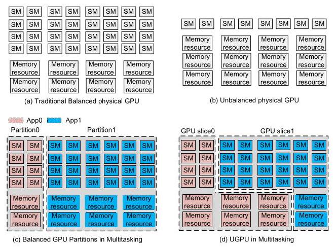
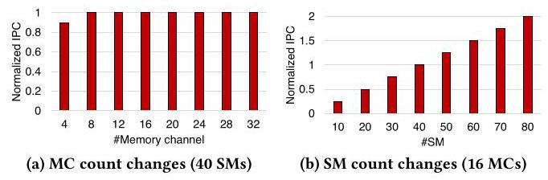
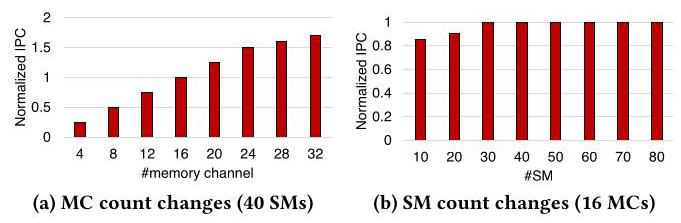
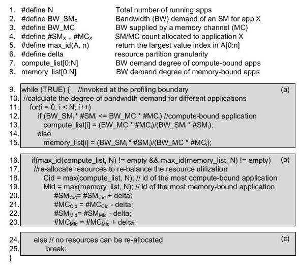
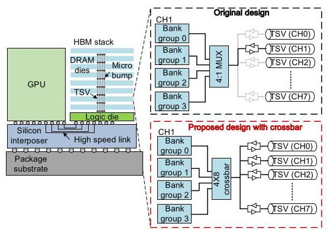
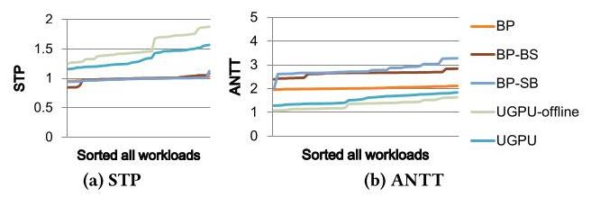
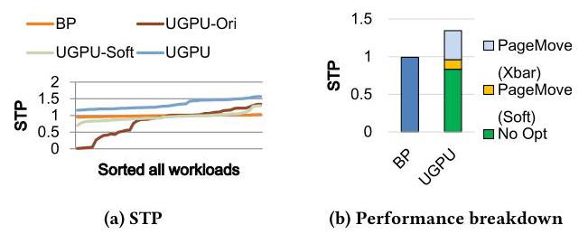
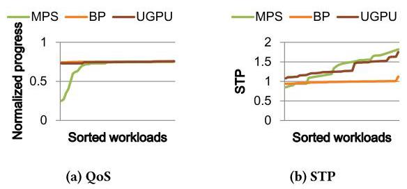

# UGPU: Dynamically Constructing Unbalanced GPUs for Enhanced Resource Efficiency 深度解读

> **作者**：Xia Zhao, Guangda Zhang, Lu Wang, Huadong Dai  
> **会议/期刊**：ISCA 2025, Proceedings of the 52nd Annual International Symposium on Computer Architecture  
> **一句话总结**：UGPU 把一张物理 GPU 在运行时切成计算资源和内存资源比例不对称的 GPU slices，并用 PageMove 降低 memory channel 重分配带来的页迁移开销，从而让异构多租户 workload 更高效地使用 GPU。

## 一、问题定义（Problem）

这篇论文属于 First 类型的工作：它不是在已有 GPU partitioning 机制上微调一个参数，而是明确提出“在多任务环境中动态构造 unbalanced GPUs”这个方向。传统 GPU 在制造时遵循 balanced design，即 SM 数量、LLC、memory controller、HBM bandwidth 等资源大体按固定比例增长；这对通用硬件 SKU 很合理，但对具体应用并不总是合理。compute-bound 应用通常吃不满内存带宽，memory-bound 应用则经常因为 memory saturation 让 SM 空转。物理制造一批“多 SM 少内存”或“少 SM 多内存”的 GPU 不经济，但云场景里多用户任务共用一张 GPU，给了运行时切分资源的机会。

Figure 1 把论文的核心问题画得很直接：传统物理 GPU 和 MIG-like balanced partition 都维持计算/内存资源的固定比例；UGPU 则让 App0 和 App1 得到不同形状的 slice，一个可以拿更多 SM、更少 memory channels，另一个可以拿更少 SM、更多 memory channels。这个图的价值在于，它把“unbalanced”从硬件制造问题转化成了 runtime resource partitioning 问题。

本文要解决的直接问题是：在一张 GPU 上同时运行多个应用时，能不能根据每个应用的 compute/memory demand 动态构造不均衡 GPU slices，并且仍然保持资源隔离和 QoS？这个问题有两个难点。第一，slice 的 SM 和 memory channel 数量不能靠穷举或离线搜索决定，因为 GPU 上大量线程、memory-level parallelism 和资源重叠效应让性能建模很难。第二，memory channel 被重新分配后，已经放在旧 channel 上的页面必须迁移；如果用传统读写搬运，会让 reallocation overhead 大到抵消收益。

**动机评估**：动机比较 solid。论文没有只停留在“balanced GPU 不够灵活”的概念层面，而是用 compute-bound 和 memory-bound 应用在不同 SM/MC 数量下的性能曲线说明需求差异；后续又用 105 个 multiprogram workloads 证明该差异在系统层面有收益。不过它的动机也依赖一个关键场景假设：云平台愿意为了资源隔离采用 slice/partition 模式，而不是完全共享式 MPS；如果 workload 可以接受 contention，MPS 在部分场景可能有更高 throughput。

**核心 Insight**：论文有两个层次的 insight。资源管理层面的 insight 是：compute-bound 应用只要 memory bandwidth 足够，多给 SM 会继续提升性能，少给 MC 未必伤性能；memory-bound 应用则相反，只要 SM 足以打满带宽，多给 MC 会提升性能，少给 SM 未必伤性能。硬件机制层面的 insight 是：HBM stack 内所有 channel 的 TSV 物理上已经和各个 DRAM dies 有连接，而不同 bank groups 可并行工作；只要增加很小的 crossbar 和配套地址映射，就可以把 page migration 限制在同一 HBM stack 内并并行化。

## 二、相关工作（Related Work）

论文把相关工作分成三条线。第一条是 multitasking GPU optimization，包括 MPS、SMK、SM partitioning、warp scheduling、memory bandwidth management 和 slowdown prediction。MPS/SMK 强调共享和吞吐，但 memory resources 共享会引入 contention，难以天然提供强资源隔离；CD-Search 等工作主要重分配 SM，对 memory channels 这种显式隔离资源处理不足；DASE、Themis、HSM 等 slowdown prediction 方法关心共享资源竞争下的 slowdown，不负责为未尝试过的 resource partition 准确预测性能。

第二条是 memory page allocation 和 migration。RowClone 能加速 DRAM 内部 bulk copy，但主要是在 bank/channel 内复制，不解决 HBM channel 重分配后的跨 channel 页面重组织。NUMA page placement、heterogeneous memory placement、GPU UVM/page management 相关工作可以启发“页面放在哪里”，但没有面向 GPU slices 的 memory channel reallocation 设计。

第三条是 CPU resource management。CMP/SMT 领域已经研究了 cache partitioning、bandwidth management、job co-scheduling、hill-climbing 和 learning-based allocation。但 GPU 的并发线程规模、SIMT 执行、memory hierarchy、TLB/page fault 行为以及云 GPU 隔离需求不同，CPU 侧方法不能直接搬过来。UGPU 的定位因此比较清楚：它不是只做调度，也不是只做页放置，而是把 compute resource partition、memory channel partition 和 page migration 连接成一个闭环。

## 三、技术挑战（Challenges）

**挑战 1：不依赖复杂模型决定 slice 大小。** GPU 应用性能不是 SM 数和 MC 数的简单函数。已有 GPU slowdown model 往往需要观察当前 co-execution 状态，难以预测尚未采用的 resource allocation。UGPU 需要一个 online、低开销、可在 epoch 边界运行的算法。

**挑战 2：memory channel reallocation 会触发大量数据迁移。** SM reallocation 可以借鉴 draining 或 context switching，但 memory channels 是页面实际所在的位置。把 channel 从一个应用转给另一个应用，意味着旧应用必须把页面搬走，新应用也要把页面搬进新 channel 以使用新增带宽；传统读写路径会带来高延迟和能耗。

**挑战 3：迁移过程中必须保持地址翻译和数据正确性。** GPU 有多级 TLB、page table walker、L1/L2 cache 和 in-flight memory transactions。PageMove 不能只改 DRAM 数据路径，还必须和 virtual memory management 一起处理 TLB invalidation、page table update、cache flush 和 page fault。

**挑战 4：硬件改动必须小。** 如果 PageMove 需要大规模改 HBM 或 GPU memory controller，它就会失去工程吸引力。论文因此把新增逻辑控制在 HBM 内部 crossbar、tri-state buffer 控制、少量 profiling counters 和 fixed-function partition unit 上，并估算 crossbar 与控制逻辑小于一个 DRAM die 面积的 0.1%。

## 四、解决方案（Solution）

### 整体思路

UGPU 的执行流程是 epoch-based。系统先以 balanced partition 开始运行，在每个 epoch 收集 LLC accesses、LLC hit accesses、memory bandwidth utilization 和 instruction count；然后 demand-aware resource distribution algorithm 判断哪些应用偏 compute-bound，哪些偏 memory-bound；接着把 SM 从最 memory-bound 的应用转给最 compute-bound 的应用，同时把 memory channels 反向转移；最后用 SM draining/switching 处理 compute resource 迁移，用 PageMove 处理 memory page 迁移。

这个设计的关键是“slice 是隔离的，但比例是不对称的”。隔离让云平台仍然可以提供 QoS，非对称让每个应用拿到更接近需求的资源组合。

### 贯穿示例

可以用论文中的 PVC_DXTC workload 理解 UGPU。假设一张 GPU 有 80 个 SM 和 32 个 memory channels，balanced partition 会给 PVC 和 DXTC 各 40 SM、16 MC。DXTC 是 compute-bound，它的内存需求很低；PVC 是 memory-bound，它需要更多带宽。UGPU 的做法是把 DXTC 用不满的 memory channels 拿出来给 PVC，同时把 PVC 不能有效利用的 SM 给 DXTC。结果是两个应用都更接近自己的瓶颈资源，而不是被迫拿一份“看起来公平但不匹配”的资源包。

Figure 2 说明 compute-bound 应用的行为：在 40 SM 固定时，memory channels 从 16 增到 32 并不能提高性能；在 16 MC 固定时，增加 SM 基本线性提高 IPC。这给算法提供了依据：compute-bound 应用可以让出部分 MC，换取更多 SM。

Figure 3 则给出相反现象：memory-bound 应用增加 MC 会明显提升性能，而 SM 从 40 增到 80 基本没有收益；只要剩余 SM 能打满内存带宽，少一些 SM 也不会伤害性能。这解释了为什么 UGPU 要把 MC 从 compute-bound 应用转给 memory-bound 应用。

### 关键技术点

第一，UGPU 用 demand-aware resource distribution 取代复杂性能模型。算法估计单个 SM 的带宽需求 `BW_SM` 和单个 memory channel 的有效带宽供给 `BW_MC`。`BW_SM` 由最大 IPC、每千条指令 LLC access、cache line size 和 SM frequency 估算；`BW_MC` 结合 LLC hit bandwidth、LLC miss bandwidth 和 memory bandwidth 上限。若应用总需求小于当前 MC 可供给带宽，就标记为 compute-bound，否则标记为 memory-bound。

Figure 5 展示了算法闭环：先为每个应用计算 bandwidth demand degree，然后选出最 compute-bound 和最 memory-bound 的应用，前者增加 SM、减少 MC，后者减少 SM、增加 MC；当找不到可重分配资源时停止。它的优点是低开销、online、和应用数无强绑定；缺点是粒度和判断依赖 epoch 内 profiling，短 kernel 或阶段变化很快的应用不一定能及时受益。

第二，SM reallocation 采用已有思路组合。若 thread block 能在 epoch 内自然完成，就用 SM draining 等待它结束后调度新应用；否则用 SM switching 保存上下文并切换。这部分不是论文最主要的新意，主要是为了让 compute resource migration 成为完整系统的一环。

第三，PageMove 重新设计 HBM 内部迁移路径。传统 HBM 中每个 channel 通过 TSV 和对应 die 连接，PageMove 利用“TSV 已经物理连到所有 dies”的事实，在每个 memory channel 内加入 fully-connected `4 x 8` crossbar，让一个 channel 内的 4 个 bank groups 可以连接到任意 TSV set。这样 page migration 可以利用不同 bank groups 并行传输，而不是沿传统 memory read/write 路径来回搬。

Figure 7 是 PageMove 的硬件关键图。上半部分传统设计里 4 个 bank groups 只能通过 `4 x 1` mux 使用当前 channel 的 TSV；下半部分 PageMove 用 `4 x 8` crossbar 让 bank group 能连到其它 channel 的 TSV。这个改动把“跨 memory channel 搬页”变成了 HBM stack 内部的并行数据移动。

第四，PageMove 配套定制 address mapping 和 PPMM。论文使用 4 个 HBM stacks、每 stack 8 个 channels、每 channel 4 个 bank groups 的基线。地址 bits `[7:8]` 用于 HBM stack id，bits `[12:14]` 用于 stack 内 channel，bits `[10:9]` 用于 bank group。这样驱动可以通过控制物理页地址位决定页面在哪个 channel，并把迁移限制在同一 stack 内，避免跨 stack 重组织。PPMM 通过新 DRAM command `MIGRATION` 搬运 cache line；一个 4 KB page 需要 32 条 MIGRATION commands，并且可在多个 HBM stacks 和 bank groups 上并行执行。论文估计单个 page migration 的 DRAM 迁移延迟约 40 GPU cycles，外加约 1000 cycles 的 driver handling delay。

第五，PageMove 改造 GPU virtual memory management。memory reallocation 发生时，系统 flush L1 TLB、cache 和 in-flight transactions。对失去 channel 的应用，如果 L2 TLB 或 page table 翻译到已经不属于它的 channel，PageMove 会 invalidate 对应 entry，触发 page fault，让 GPU driver 在仍属于该应用的 channel 上分配新物理页并启动迁移。对获得新 channel 的应用，PageMove 会逐步把页面迁到新增 channel，使其真正利用新增 bandwidth。L2 TLB 中还维护 channel list register，用 app id、状态位和 channel bitmap 跟踪每个应用当前的 channel 状态。

### 与已有方案的对比

相比 BP/MIG-like balanced partition，UGPU 的优势不是“给某个应用更多资源”，而是让资源形状匹配瓶颈：compute-bound 应用拿更多 SM，memory-bound 应用拿更多 MC。相比 CD-Search 这类 SM-only 动态分配，UGPU 同时移动 SM 和 memory channels，实验中相对 BP(CD-Search) 仍有 22.4% STP 和 43.6% ANTT 优势。相比 MPS，UGPU 牺牲了部分共享带来的峰值利用率，但提供 compute 和 memory resource isolation，因此更适合有 QoS 目标的云租户。

不足也比较明确：PageMove 需要 HBM 内部 crossbar 和 memory controller/VM 管理改动；评估基于 GPGPU-sim/Ramulator 而非真实芯片；基线没有覆盖 memory-oversubscribed workloads；epoch-based profiling 对频繁短 kernel 或行为剧烈变化的 workload 可能不稳定。

## 五、实验评估（Experiments）

### 实验设定

论文修改 GPGPU-sim v3.2.2 支持 multitasking，并集成 Ramulator 模拟 HBM memory subsystem。基线 GPU 有 80 SM、4 个 HBM stacks、每 stack 8 个 channels，共 32 memory channels，总带宽 900 GB/s；LLC 共 6 MB，分 64 slices；page size 默认 4 KB；TLB 和 page table walker 也纳入模拟。功耗使用 GPUWattch 并更新 HBM power model。

benchmark 来自 Rodinia、Parboil、CUDA SDK 和 Mars，共 15 个 GPU-compute benchmarks，覆盖 PVC、LBM、DWT2D、LAVAMD、SRAD、DXTC、HOTSPOT、PATHFINDER 等，按 bandwidth demand 分成 memory-bound 和 compute-bound。论文构造 105 个 two-program workloads，其中 50 个 heterogeneous mixes 和 55 个 homogeneous mixes；每个 workload 模拟 25M cycles。主要指标是 STP（higher is better）和 ANTT（lower is better）。主要 baseline 包括 BP、BP-BS、BP-SB、UGPU、UGPU-offline、UGPU-Ori 和 UGPU-Soft。

### 主要实验与结论

Figure 10 是核心性能图。BP、BP-BS 和 BP-SB 三条线相近，说明简单把一个 balanced partition 变大、另一个变小并不能解决问题；因为它仍然保持 SM/MC 同比例变化，不能匹配应用瓶颈。UGPU 相比 BP 在 heterogeneous workloads 上平均提升 STP 34.3%，最高 56.7%；ANTT 平均改善 46.7%。相比理想 offline partition，online UGPU 的动态迁移使 STP 和 ANTT 分别损失 12.1% 和 13.6%，但仍保留了主要收益。

Figure 11 说明 PageMove 不是锦上添花，而是 UGPU 能成立的必要条件。UGPU-Ori 使用传统 page migration，平均 STP 反而比 BP 低 16.8%；仅使用 customized address mapping 和 VM 更新的 UGPU-Soft 比 UGPU-Ori 提升 12.7%；完整 PageMove 加入 HBM crossbar 和并行迁移后，才把整体提升拉到相对 BP 的 34.3%。

resource reallocation overhead 方面，Figure 12 显示 SM migration 和 data migration 平均占 epoch time 的 8.9%，最坏 19.5%。能耗方面，UGPU 让 memory system energy 平均增加 38%，但 HBM 在总系统能耗中平均只占 11.6%；由于性能提升减少了 static/constant energy，整体 GPU system energy 平均下降 7.1%。

与已有 work 对比时，BP(CD-Search) 通过跨 partition 重分配 SM，相比 BP 提升 STP 11.2%；UGPU 进一步同时重分配 SM 和 MC，相比 BP(CD-Search) 在 STP 和 ANTT 上分别提升 22.4% 和 43.6%。当 workload 扩展到 4 个程序，UGPU 平均 STP 提升 38.3%、ANTT 改善 101.8%；8 个程序时 STP 提升 30.3%、ANTT 改善 89.3%，收益下降的原因是每个应用初始能拿到的资源更少，重分配空间变小。

AI workloads 方面，UGPU 与 compute-bound benchmarks 混合运行 AlexNet、ResNet、SqueezeNet、GRU、LSTM 等 workload，平均 STP 提升 39.4%，ANTT 改善 57.6%。QoS 实验设定 high-priority compute-bound app 的目标为 0.75 normalized progress。

Figure 16 表明 BP 和 UGPU 都能满足所有 workload 的 QoS target，因为它们提供隔离资源；MPS 在一些 workload 上由于 memory contention 违反 QoS。UGPU 在满足 QoS 的同时，相比 BP 平均提升 STP 33.7%。不过论文也承认 MPS 在部分 workload 上因为共享 memory resources，STP 可以超过 UGPU；这说明 UGPU 的价值主要在“需要隔离和 QoS”的场景，而不是所有场景都绝对最优。

### 结论支撑性分析

实验整体支撑了论文主张：仅做 balanced partition size 调整不够；没有 PageMove 的 UGPU 会被迁移成本拖垮；完整 UGPU 在 heterogeneous、multi-program、AI 和 QoS 场景都给出稳定收益。薄弱点在于评估全部来自模拟器，真实 HBM crossbar 的 timing closure、DRAM command scheduling、driver/page fault path 与云调度系统集成没有被实机验证。另一个限制是没有纳入 memory oversubscription workloads，虽然作者声称算法可扩展到 capacity constraint，但这部分没有实验闭环。

## 六、附加洞察（Side Findings）

**结论 1：简单制造“大 slice + 小 slice”的 balanced partition 不能解决资源错配。**  
*出处*：Section 6.1 / Figure 10。  
*推理链条*：作者比较 BP、BP-BS 和 BP-SB，发现三者 STP 接近，而 BP-BS/BP-SB 会显著伤害小 partition 上应用的 ANTT；原因是它们只是同方向增减 SM 和 MC，没有改变 compute/memory 比例，因此仍无法同时满足 compute-bound 和 memory-bound 应用。

**结论 2：PageMove 是 UGPU 的成败点，不是可选优化。**  
*出处*：Section 6.2 / Figure 11。  
*推理链条*：UGPU-Ori 用传统 page migration 后平均 STP 比 BP 低 16.8%，说明 unbalanced slices 的理论收益会被迁移开销吞掉；UGPU-Soft 只解决地址映射和 VM 管理仍不够；加入 HBM crossbar 和 PPMM 后才获得 34.3% 平均 STP 提升。

**结论 3：动态重分配的开销主要被 PageMove 压到 epoch 内可接受范围。**  
*出处*：Section 6.3 / Figure 12。  
*推理链条*：reallocation 平均占 epoch time 8.9%、最坏 19.5%，且应用在资源重分配期间仍可继续执行；这说明 UGPU 不是假设“迁移免费”，而是通过 PageMove 把迁移成本控制到收益可以覆盖的水平。

**结论 4：UGPU 的性能提升可以抵消额外 memory energy。**  
*出处*：Section 6.3。  
*推理链条*：memory resource reallocation 让 memory system energy 平均增加 38%，但 baseline 中 GPU core energy 平均占 88.3%、HBM 只占 11.6%；UGPU 提升性能后减少 static/constant energy，最终 whole GPU system energy 平均下降 7.1%。这个结论依赖模拟功耗模型，真实芯片上仍需验证。

**结论 5：MPS 和 UGPU 不是简单替代关系，而是面向不同服务语义。**  
*出处*：Section 6.7 / Figure 16。  
*推理链条*：MPS 因共享 memory resources，在一些 workload 上 STP 可能高于 UGPU；但同样因为共享，它会在部分 workload 上违反 high-priority app 的 QoS target。UGPU 更适合资源隔离和 QoS 优先的云场景，MPS 更适合允许 contention 换 throughput 的场景。

## 七、总结与个人评价（Wrap-up）

UGPU 的核心贡献是把“unbalanced GPU”从不现实的硬件 SKU 设计，转化为多租户 GPU 上的 runtime slice construction 问题；再用 demand-aware partition algorithm 和 PageMove 把这个想法做成完整系统。论文最亮的地方是问题拆得很干净：资源分配算法解释“为什么要切成不均衡”，PageMove 解释“怎样承受 memory channel 重分配的代价”。

最大的不足是工程可落地性仍主要停留在模拟层面。HBM 内部 crossbar、MIGRATION command、GPU driver fault handling 和 cache/TLB flush 的组合会牵涉供应链与系统软件，真实部署难度不低。此外，epoch-based profiling 对短 kernel、强阶段性 workload、memory oversubscription 和多 GPU 集群调度的交互还需要更细的评估。

总体看，这篇论文的价值不只在具体的 34.3% STP 数字，而在于提出了一个值得后续研究的问题模板：云 GPU partition 不应只追求“大小公平”，还应追求“资源形状匹配”。

## 八、章节脉络与段落速览（Structure Map）

- **Abstract**：概述 balanced GPU 与应用需求错配的问题，提出 UGPU 和 PageMove，并给出 34.3% 平均性能提升。

- **Section 1 · Introduction**：从 balanced GPU 制造逻辑转向云多任务运行时资源构造。
  - **¶1**：说明 GPU 代际增长仍保持 compute/memory balanced proportion，但不同应用对 SM 和 memory bandwidth 的需求不同。
  - **¶2**：指出云 GPU 多租户环境提供了探索 unbalanced GPU 的机会。
  - **¶3**：提出动态构造 dedicated asymmetric GPU slices，并引出 slice sizing 与 memory reallocation 两个挑战。
  - **¶4**：解释 GPU performance model 难以预测未尝试 resource allocation。
  - **¶5**：提出 demand-aware 思路，即 SM 给 compute-bound、MC 给 memory-bound。
  - **¶6**：说明 memory channel reallocation 需要大量 page migration，因此引入 PageMove。
  - **¶7**：概述 PageMove 通过 HBM crossbar、地址映射、PPMM 和 VM 管理减少迁移开销。
  - **¶8**：列出四项贡献：unbalanced slice 概念、资源分配算法、PageMove、性能结果。

- **Section 2 · Background and Motivation**：解释传统 balanced GPU、MIG-like partition 与 UGPU 的差异。
  - **Traditional balanced GPU designs / ¶1**：说明物理 GPU 和 memory system 的 balanced design 为什么通用但不一定高效。
  - **Traditional balanced GPU designs / ¶2**：说明 BP/MIG 在 multitasking 中仍维持 balanced virtual GPU，导致资源利用不足。
  - **Towards Unbalanced GPU designs / ¶1**：用 80 SM、32 MC 的两应用例子说明 balanced allocation 无法匹配 compute-bound 与 memory-bound。
  - **Towards Unbalanced GPU designs / ¶2**：提出 UGPU 用 flexible SM/MC allocation 构造 unbalanced slices。

- **Section 3 · Resource Partition Algorithm**：提出按 bandwidth demand 分配 SM 和 MC 的 online 算法。
  - **Intro / ¶1**：说明本节目标是提升单应用性能与系统吞吐。
  - **3.1 / ¶1**：回顾 CPU/GPU 资源管理模型并指出 GPU 性能预测困难。
  - **3.1 / ¶2**：介绍 Figure 2/3 的实验设置。
  - **3.1 / ¶3**：总结 compute-bound 应用可少 MC、多 SM。
  - **3.1 / ¶4**：总结 memory-bound 应用可少 SM、多 MC。
  - **3.1 / ¶5**：用 PVC_DXTC 说明异构 workload 的系统性能随资源形状改变。
  - **3.2 / ¶1**：概述算法根据当前 allocation 是否满足 demand 来重新计算资源。
  - **3.2 / ¶2**：解释 Figure 5 的 classify、select 和 reallocate 三阶段。
  - **3.2 / ¶3-4**：定义 `BW_SM` 与 `BW_MC` 的计算方式和 profiling 来源。
  - **3.2 / ¶5**：说明算法可扩展到 memory capacity constraint。
  - **3.2 / ¶6**：强调算法不限于两个应用，可迭代处理多个 co-located applications。
  - **3.3 / ¶1**：说明 profiling counters 与 epoch 机制的硬件开销。
  - **3.3 / ¶2**：估算 fixed-function partition unit 的 cycle latency。
  - **3.3 / ¶3**：说明 SM migration 可借鉴 draining/switching，而 memory migration 需要 PageMove。

- **Section 4 · PageMove Design**：从 HBM 硬件、地址映射和 VM 管理三个层次解决 page migration。
  - **Intro / ¶1**：说明本节先用例子解释 memory channel reallocation，再介绍 fast migration。
  - **4.1 / ¶1**：用 App0/App1 在 8-channel HBM stack 中的页面迁移说明 VPN/RPN 需要更新。
  - **4.2 / ¶1**：介绍 HBM stack、DRAM dies、logic die、TSV、bank group 的结构。
  - **4.2 / ¶2**：说明 PageMove 加入 `4 x 8` crossbar 并估算面积开销小于 0.1% DRAM die。
  - **4.3 / ¶1**：说明需要 address mapping 避免跨 stack 和多 bank group 到单 channel 的低效迁移。
  - **4.3 / ¶2**：给出 stack/channel/bank group 的地址位映射和 driver 可见信息。
  - **4.3 / ¶3**：说明 PPMM 如何在同一 HBM stack 内从 source channel 迁移到 destination channel。
  - **4.3 / ¶4**：定义 MIGRATION command、两周期接口和每页 32 条命令的迁移方式。
  - **4.4 / ¶1**：回顾 GPU virtual memory system 的 L1/L2 TLB、PTW、page fault 和 page table。
  - **4.4 / ¶2**：描述失去 memory channels 的应用如何触发迁移和更新 page table/TLB。
  - **4.4 / ¶3**：描述获得 memory channels 的应用如何把页面迁到新增 channel。
  - **4.4 / ¶4**：说明 L2 TLB channel list register 如何记录 channel allocation status。
  - **4.5 / ¶1**：拆解 page migration 的 driver delay 和 DRAM data migration latency。

- **Section 5 · Methodology**：描述模拟平台、workloads 和指标。
  - **Simulated System / ¶1**：说明 GPGPU-sim、Ramulator、80 SM、32 MC、TLB/page fault 和功耗模型。
  - **Workloads / ¶1**：列出 benchmark 来源、105 个 workload、25M cycles 和无 oversubscription 设定。
  - **Metrics / ¶1**：定义 STP 和 ANTT。

- **Section 6 · Evaluation**：证明 UGPU、PageMove 和 QoS 支持的收益。
  - **Overview / ¶1**：列出 BP、BP-BS、BP-SB、UGPU、UGPU-offline、UGPU-Ori 等对比对象。
  - **6.1 / ¶1**：说明 balanced partition size 调整不能提升性能。
  - **6.1 / ¶2**：给出 UGPU 平均 34.3% STP、46.7% ANTT 改善和相对 offline 的迁移损失。
  - **6.2 / ¶1**：证明没有 PageMove 的 UGPU 会低于 BP，完整 PageMove 才带来净收益。
  - **6.3 / ¶1**：量化 reallocation 平均 8.9%、最坏 19.5% epoch time。
  - **6.3 / ¶2**：说明 memory energy 增加但总系统能耗下降。
  - **6.4 / ¶1**：比较 CD-Search，说明同时分配 SM 和 MC 优于 SM-only。
  - **6.5 / ¶1**：展示 4-program 和 8-program workloads 的扩展结果。
  - **6.6 / ¶1**：展示 AI workloads 的 STP 和 ANTT 改善。
  - **6.6 / ¶2**：讨论 UGPU 在多 GPU/LLM training 场景的潜在用途。
  - **6.7 / ¶1**：比较 MPS、BP 和 UGPU 的 QoS 与 STP，指出 UGPU 更适合隔离场景。

- **Section 7 · Related Work**：把 UGPU 放入 multitasking GPU、page allocation 和 CPU resource management 三类工作中定位。
  - **¶1**：声明本文是首次探索 unbalanced GPU design。
  - **Multitasking GPU optimization / ¶1**：总结 MPS、SMK、SM management、memory scheduling 和 slowdown prediction 的局限。
  - **Memory Page Allocation / ¶1**：比较 RowClone、NUMA、heterogeneous memory placement 和 GPU page placement。
  - **CPU Resource Management / ¶1**：说明 CPU 资源管理技术不能直接解决 GPU isolation、partition search 和 reallocation overhead。

- **Section 8 · Conclusion**：重申 UGPU 通过 demand-aware partition 和 PageMove 构造 unbalanced slices，并在 heterogeneous workloads 上平均提升 34.3%。
