# MTIA 300: Meta's First Training Chip Featuring Built-in NICs and Collective Offloading Engines 深度解读

> 作者：MTIA Team，Meta Platforms；完整贡献者名单见原文附录，通讯作者 Chunqiang Tang。
> 会议/年份：ISCA 2026（依据输入文件与任务提供的元数据；导出的正文首页未显示会议栏）。
> 一句话总结：MTIA 300 将推荐训练中昂贵的数据搬运与集合通信交给封装内 NIC、独立消息引擎和近存归约单元，以较适中的算力换取更匹配负载的存储、网络与成本效率。

本文仅依据所提供论文全文解读；示例是为解释机制构造的简化场景，评价与原文结论分开表述。

## 一、问题定义（Problem）

### 背景与问题来源

推荐模型 DLRM 通常把两种性质很不同的计算接在一起：年龄等稠密特征进入多层感知机 MLP，帖子 ID 等离散特征用于查询 embedding table，再通过交互层组合结果。矩阵乘法需要算力，查表却往往受随机访存、缓存或指令执行能力限制。原文指出，embedding 有时占模型参数的 99% 以上，单卡内存容不下，必须拆到多卡。

因此训练采用混合并行：稠密层做 data parallelism，每卡处理不同样本并通过 AllReduce 同步梯度；embedding 按表或行做 model parallelism，通过可变长的 AllToAllv 交换索引、向量或梯度；分布式 Shampoo 优化器还引入 AllGather。AllReduce 是让所有卡得到逐元素归约结果，AllGather 是把各卡分片汇集到每卡，AllToAllv 则允许每一对卡交换不同长度的数据。频繁通信、超大参数容量与相对有限的矩阵运算量，使“更高峰值 FLOPS”不自动变成“更快训练”。

这是一项**非 First 类型的系统改进工作**：GPU 已能完成这些训练，Meta 的 MTIA 100/200 也已解决推荐推理问题；本文切入的是训练扩展后通信与内存供给不足，以及让昂贵计算核心执行通信归约所带来的资源争用。作者关于“首个内置 NIC chiplet 与通用集合卸载引擎的加速器”的表述属于组合架构的新颖性声明，不意味着首次发现推荐系统通信瓶颈。

### 动机评估与核心 Insight

动机较扎实：生产模型约有 1500 亿参数、99% 在稀疏部分，每样本约 30 亿次浮点运算；40 卡实验里单次迭代出现 35 个 AllToAllv，消息跨越 1 KB 到 1 GB，AllReduce 与 AllGather 的入站消息分别达到 1.6 GB、2.1 GB。这些证据说明数据路径确实影响实际训练，而非只在合成测试中出现。

但该动机的适用范围是有类似稀疏特征与通信结构的负载，不能直接推广到计算密集的所有训练任务。原文也承认，推荐模型开始增大稠密部分、采用 Transformer 后，更高 FLOPS 会重新变得重要。

**核心 Insight：通信本质上主要需要搬数据、管理依赖和执行简单归约，不必占用完整的矩阵计算核心；把这些能力放到内存和 I/O 附近，才能同时提高面积效率并减少片上网络争用。** 这是对全文设计逻辑的归纳：内置 NIC 缩短封装外路径，ME/NMC 分离执行资源，边缘布局缩短片内路径，HCCL 再把集合算法编译成可由设备独立执行的工作图。

## 二、相关工作（Related Work）

原文 Section VII 主要按产业背景、Meta 代际演进、通信卸载与软件生态组织比较，而非给出系统性的算法分类。

**GPU 与通用 AI ASIC。** GPU 以高矩阵算力和成熟软件服务多类任务；云厂商及初创公司则构建各类专用 AI 芯片。本文认为，面向 GenAI 的常见算力配置未充分匹配 DLRM 的内存与通信比例。其直接实测参照是特定配置的 H100/H200，不能从相关工作名单推断 MTIA 对所有被引用芯片的性能优势。

**Meta 推理芯片到训练芯片。** MTIA-2i 提供此前的 PE、数据流执行和软件基础，但训练需要更强的浮点、非 GEMM、存储与跨卡通信支持。MTIA 300 从 LPDDR 转向 HBM3E，加入网络 chiplet、ME 与 NMC，并把 GEMM:SIMD 比例从 32:1 改成 16:1；贡献是负载驱动的系统重配，而非只增加 PE 数量。

**TPU sparse core。** 原文承认 TPU sparse core 也能卸载通信，区别在于其面向非 RDMA、非交换式 torus 网络，且缺少本文所强调的通用 collective library 接口。MTIA 选择 RoCE/RDMA 与熟悉的集合 API，使卸载适用于 scale-up 和 scale-out。这里的“通用”指通信接口和集合表达能力，并非不限 QP、任意拓扑都能无代价支持。

**软件可用性。** MTIA 采用 PyTorch 原生路径，包括 TorchDynamo、TorchInductor、Triton，以及 eager/graph 两种模式，降低模型迁移门槛。论文对其他 ASIC 的比较较概括，缺少逐平台实测；而本文自身也承认 eager 模式性能仍不成熟。因此要区分“能运行、接口熟悉”和“性能已经与 GPU 持平”。

## 三、技术挑战（Challenges）

1. **算力、容量、带宽难以同时平衡。** embedding 需要大容量与不规则访存，稠密层需要 GEMM，优化器及反向查表又需要 SIMD 和指令吞吐；单独增加某项峰值会把瓶颈推向其他环节。
2. **通信卸载必须覆盖整个执行路径。** 仅集成网卡仍不足以处理 1.2 TB/s I/O 下的提交、完成队列和归约；若这些工作依赖 host 或 PE，控制开销与资源争用依旧存在。
3. **独立引擎仍会共享物理资源。** ME 与 PE 共用 NoC、缓存和 HBM；如果通信流量穿过计算网格，即使不占计算核心也会影响算子运行。
4. **集合通信同时需要依赖正确性和并发。** 收到数据后才能归约，归约后才能发送下一阶段结果，但独立分片应尽量并行；过强屏障会串行化，过弱约束会读到未就绪数据。
5. **芯片设计速度跟不上模型变化。** 网络比例、低精度格式、算子形状和并行策略不断演进，需要系统可配置性以及持续的软件优化；原生支持 FP8 也不等于高效支持带自定义缩放的 FP8 通信。

## 四、解决方案（Solution）

### 整体思路与贯穿示例

可以把 MTIA 300 看作三个协作的角色：PE 做模型计算，ME/NMC 做通信调度及归约，NIC 做跨卡传输；CPU-C 控制核心统一把满足依赖的工作送给对应角色。192 MB 全局 SRAM、216 GB HBM3E 与封装内 12 个 800 Gbps NIC 为这套分工提供数据供给。

为贯穿机制，假设四张卡 A/B/C/D 训练推荐模型：每卡都有一份小 MLP，各持一部分大 embedding 表，并处理不同用户样本。A 的样本可能同时查询 A 与 C 上的帖子向量。前向阶段先通过 AllToAllv 把查询送到表所在的卡，PE 查表并把向量送回；反向阶段交换 embedding 梯度，并对重复索引聚合更新；MLP 梯度在四卡间 AllReduce；Shampoo 的分布式状态再通过 AllGather 汇集。四卡只是教学规模，论文生产实验使用 40 卡或 24 卡。

### 1. 为查表和非 GEMM 工作重配计算芯片

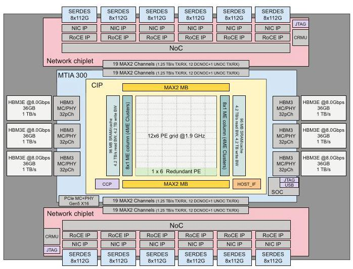

图 1 表明网络是封装中的组成部分，而非经 PCIe 接到外置网卡；主机接口仍使用 PCIe，所以“消除 PCIe 开销”应理解为消除加速器与网卡之间该段通信路径的开销。

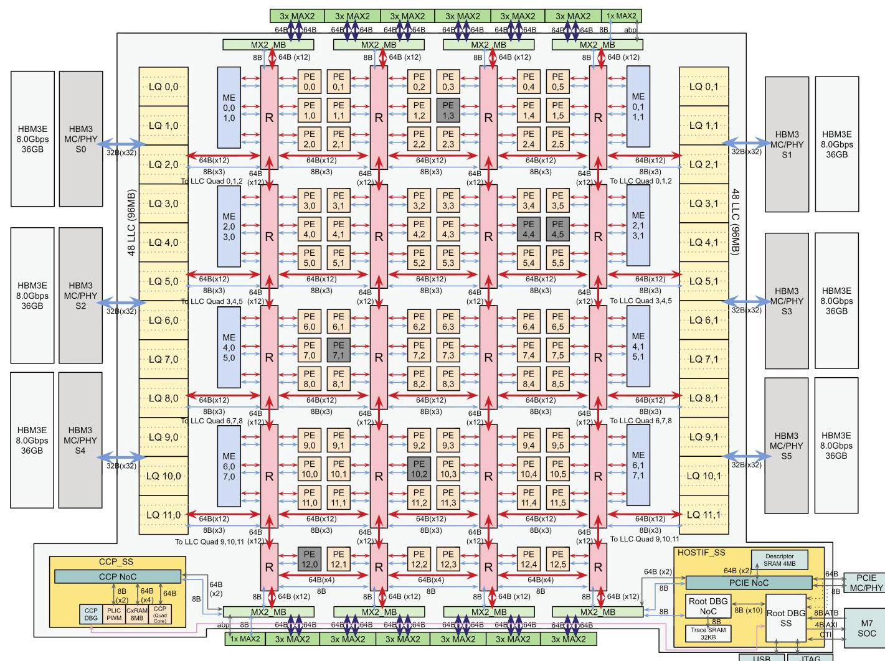

图 2 中 12×6 PE 网格承担计算，16 个 ME 与东西两侧 SRAM/HBM 配合。NoC 使用二维 mesh、六 PE 的局部 cluster router、L-routing 与避免死锁的 virtual lane。ME 的边缘位置使集合数据尽量不穿越整个计算网格，直接回应共享 NoC 的挑战；这并不意味着通信与计算完全没有共享带宽。

每个 PE 有 512 KB 软件管理的 local scratch，两个 64 B 宽 RISC-V vector core，DPE 矩阵乘法单元、RE 归约单元、SIMD/SFU 和布局转换 MLU。命令处理器用 circular buffer 抽象追踪生产者—消费者依赖，固定功能单元按数据依赖异步执行。芯片支持 FP8、FP16/BF16、TF32 等；BF16 峰值 560 TFLOPS，HBM 带宽 6.1 TB/s。

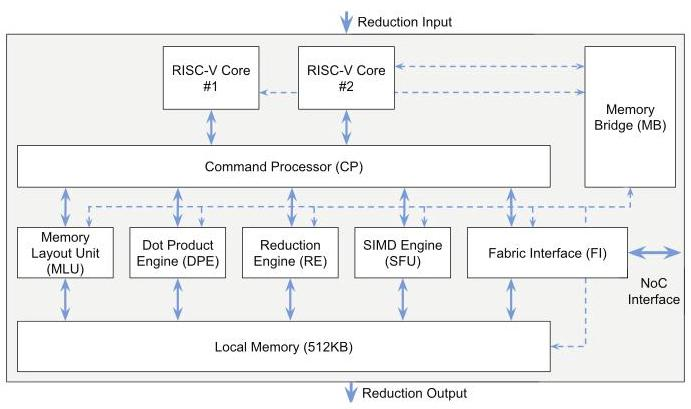

图 3 将控制、局部缓冲、搬运与运算分开：RISC-V 核发命令，专用单元执行，数据经局部内存衔接。在四卡示例里，indexed DMA 按索引列表做 gather/scatter，减少查表地址处理；byte-aligned DMA 帮助切片；硬件 radix sort 把反向传播中的相同 embedding 索引聚到一起。SFU 宽度由每周期 32 元素提高到 128 元素，为非 GEMM 操作补足能力，回应第一项挑战。

### 2. ME 与 NMC 承担通信控制及归约

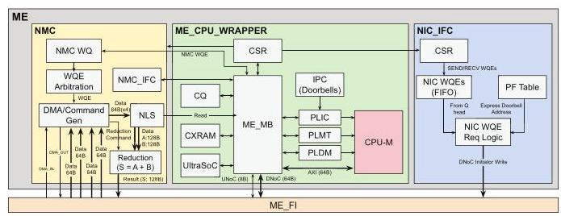

图 5 的三个核心部件对应完整的卸载路径：标量 CPU-M 加 256 KB context SRAM 执行控制；NIC interface 将单一 FIFO 中的请求路由到正确 NIC doorbell；NMC 在内存附近执行归约或 DMA。每 ME 使用一个大共享 completion queue，避免轮询多个完成队列。

四卡示例中，MLP 梯度 AllReduce 不再把加法交给矩阵计算 PE，而由 NMC 执行。原文给出 NMC 归约或 DMA 能力为 128 B/cycle，全部并发时降为 96 B/cycle；所有 ME 可提供最高约 2.8 TB/s 归约吞吐，超过 1.2 TB/s I/O。作者称相同通信吞吐下，ME 仅使用 PE 核约三分之一面积，但未给出详细布局面积分解或完整能耗消融，应视为设计报告中的结果。

### 3. 内置 NIC 去掉中间路径，网络比例留到系统层调整

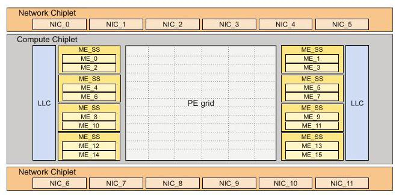

两块网络 chiplet 各提供 6×800 Gbps，即每块 600 GB/s，总计 1.2 TB/s。Express doorbell 直接以 work request 作为 doorbell 写入，省掉原本从 HBM ring buffer 读请求的步骤，原文给出约 800 ns/transaction 的被避免开销。图 4 展示的是多 NIC 并行结构，不能把总带宽误读为一条链路的速率。

NIC 删除不需要的虚拟交换等功能并移除 QP caching，以简化硬件。代价是活跃 queue pair 数受限，HCCL 必须按需连接、减少闲置 QP 并复用资源。原文 II-E 写“每 NIC chiplet 1100 active QPs”，IV-B 又写“每 NIC 可供 HCCL 使用 1088、12 NIC 共 13056”，另有每 IP block 的 1024 QP 描述；这些口径无法仅凭正文完全统一，因此不将它们合成一个无歧义硬件上限。

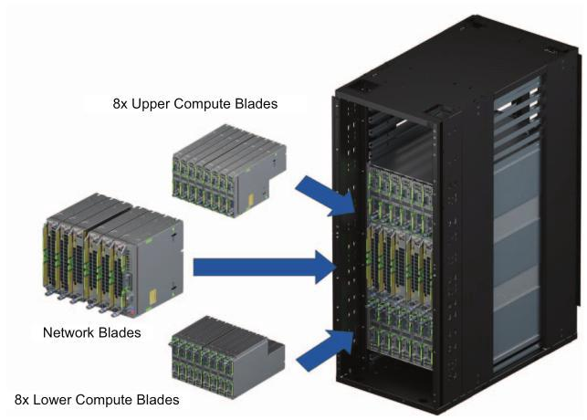

图 6 的分离设计让每机箱 16 个计算槽与 6 个网络槽通过背板连接，不必装满网络刀片。每计算刀片是一颗 CPU、512 GB 主存与一颗 MTIA 300，CPU/加速器为 1:1；这种配置保留主机运算余量，但其成本与能耗需要纳入系统比较。

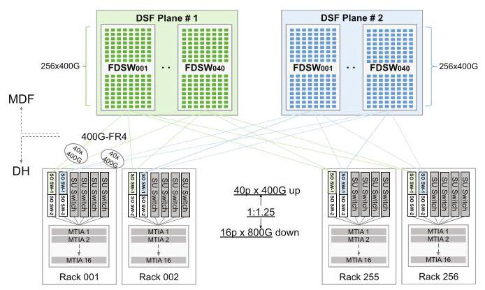

图 7 表明典型 scale-up 域为 16 卡，带宽 800 GB/s，可选提高至 1 TB/s；scale-out 为每卡 200 GB/s，一级域 4096 卡，二级可扩到 16K 卡以上。scale-out 的 packet spray 避免热点链路，并通过交换结构保证有序交付和端到端 credit 可靠性。可调整网络刀片与 NIC 分配，回应模型变化带来的带宽比例挑战。

### 4. 用 HCCL 把集合操作编译成设备执行图

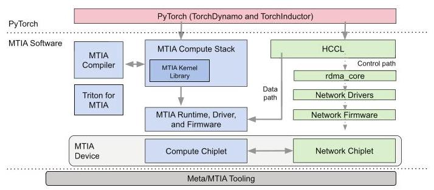

图 8 的价值在于把专用硬件接回模型开发者熟悉的接口：TorchDynamo 捕获前向图，AOTAutograd 产生反向图，TorchInductor/Triton 与手写 kernel 共同实现算子；调度、融合和 activation rematerialization 降低峰值内存压力。计算与集合可进入同一个图，通过 semaphore 管理依赖，减少子图启动开销。静态 shape collective 已完整支持，动态 shape 与设备端动态收发计数仍在开发。

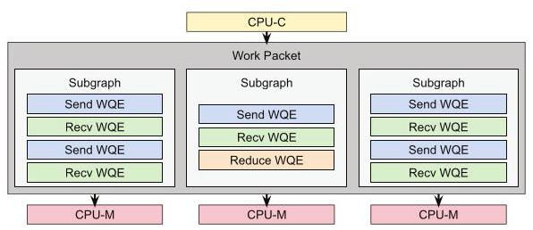

HCCL 在主机预先选择集合算法与通道，生成 work packet、subgraph 和 WQE；CPU-C 检查依赖并分派，16 个 ME 可并行处理多个子图。图 9 展示的是逻辑任务到消息引擎的映射，子图逻辑并行并不保证硬件始终足够，必要时仍排队。

WQE 包括 SEND、RECV、WRITE、WAIT、SET、REDUCE。WAIT/SET 表达跨子图条件，REDUCE 执行 `S=A+B` 或拷贝；`wqe_sync` 等待指定先前 WQE，`fence` 阻止继续发射，`rx_sync` 等待未完成接收，`sync` 等待所有先前操作。这些约束让收、算、发在保证正确性的同时重叠。

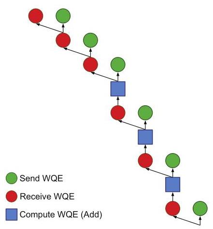

回到四卡梯度同步，先做 ReduceScatter，让各卡最终持有全局归约结果的一部分，再做 AllGather，让每卡收齐全部结果。图 10 要从下向上读：首个发送和接收可并行，收到数据后才做加法，加法完成才解锁后续阶段；最后三步汇集归约分片。图中依赖边解释了为什么“异步”不等于任意乱序。

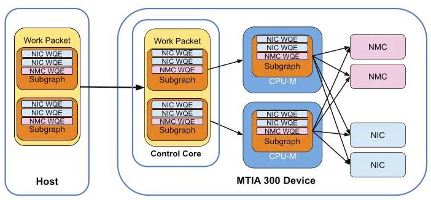

图 11 串联了整个示例：PyTorch 调用 HCCL，主机准备计划，设备执行收发和归约并报告完成。HCCL 在工作进入设备后不再驱动数据路径，但仍有后台线程管理资源、监控错误并通知应用。因此准确说法是 host 不参与集合数据路径，而非 host 从整个通信生命周期消失。

### 与已有方案的对比及代价

相对被测 GPU，MTIA 把硬件预算更多给 HBM、网络和通信执行资源，适合四卡示例这样的频繁查表与同步；代价是大矩阵受较低峰值 FLOPS 限制、小消息和小 kernel 延迟尚未充分优化，并且专用 NIC 简化要求软件管理有限 QP。它保留熟悉的 API，但移植后要获得好性能，仍需调整量化、优化器卸载与 batch 策略。

## 五、实验评估（Experiments）

### 实验设定与比较口径

实测包括算子 microbenchmark、集合与重叠测试、一个生产 DLRM 训练配置，以及 DeepSeek-R1 推理；不是模拟器论文。Table III 的主要配置如下。

| 指标 | MTIA 300 | H100（定制配置） | H200 |
|---|---:|---:|---:|
| BF16 峰值 | 560 TFLOPS | 780 TFLOPS | 1000 TFLOPS |
| HBM 容量 / 带宽 | 216 GB / 6.1 TB/s | 96 GB / 2.4 TB/s | 141 GB / 4.8 TB/s |
| 加速器功耗栏 | 912 W | 500 W | 700 W |
| host 功耗栏 | 1500 W | 6500 W | 8850 W |
| 每 host 加速器数 | 1 | 8 | 8 |
| scale-up 域 / 带宽 | 16 卡 / 800 GB/s | 8 卡 / 450 GB/s | 8 卡 / 450 GB/s |
| scale-out 带宽 | 200 GB/s | 50 GB/s | 50 GB/s |

H100 设置 500 W power cap，以提高每瓦性能，峰值由 700 W 时的 1000 TFLOPS 降至 780；因此结果针对这一配置，不等同于任意 H100。功耗表不能直接推出各工作负载的实际平均能耗，尤其 host 行的设备数量不同。

### 1. 算子表现：强在数据供给，弱点随粒度与算术强度改变

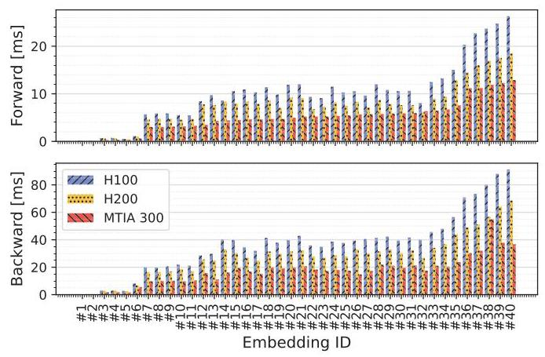

对来自生产负载的形状和输入分布，TBE 前向几何平均加速比分别为 H100 的 **2.0×**、H200 的 **1.6×**；反向为 **2.1×**、**1.6×**。图 12 支持稀疏算子获益，而非所有算子普遍翻倍；归因包括更高存储/缓存带宽和 radix sort 等功能，但没有逐一关闭单元的消融。

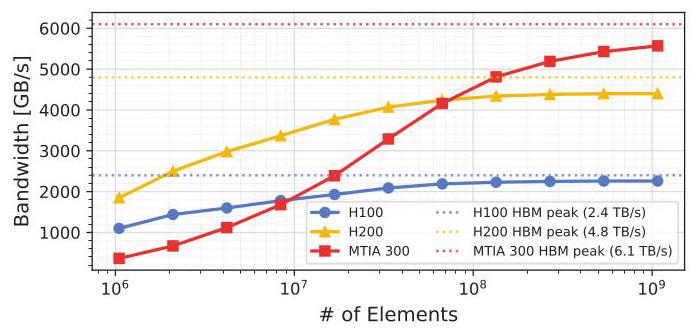

大张量下达到 5.57 TB/s，约为 MTIA 峰值的 91%；H100 为 2.26 TB/s、94%，H200 为 4.40 TB/s、92%。图 13 显示 MTIA 的优势主要来自较高绝对带宽，HBM 利用效率与 GPU 接近；小粒度时延迟开销会抵消优势。

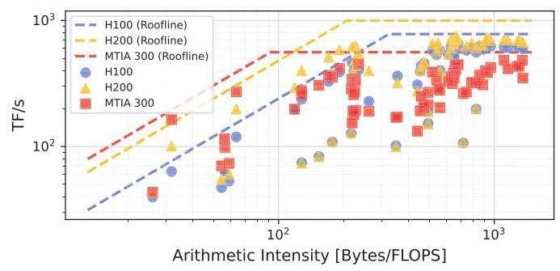

图 14 将小型 memory-bound GEMM 的带宽优势与大型 compute-bound GEMM 的算力上限分开。被测高强度形状的效率为 MTIA 59%、H100 63%、H200 54%；MTIA 在有利形状的其他 microbenchmark 可超过 90%，因此库的形状覆盖也是瓶颈。原文把算术强度阈值写为“400 bytes/FLOPS”，与常见 FLOPs/byte 定义不一致；这里保留其定性结论，不用该单位计算分界点。

### 2. 集合操作与计算重叠

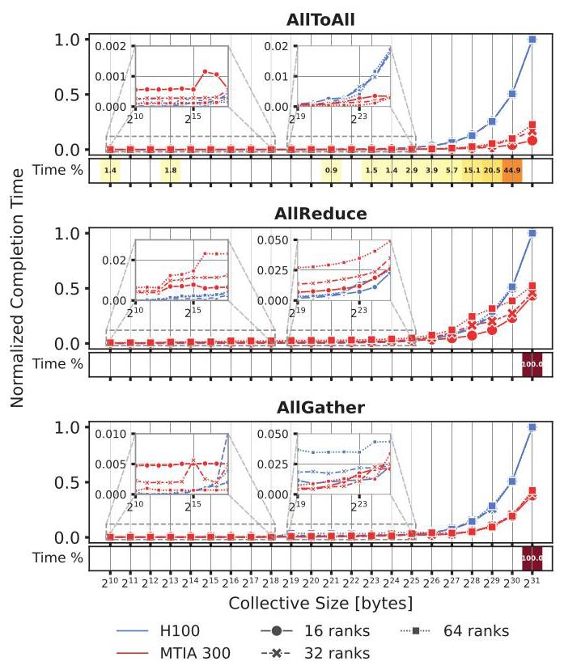

图 15 对比 AllGather、AllReduce、AllToAll 的归一化延迟；“Time%”是相应消息大小在作者负载中占用的时间比例。MTIA 在主要工作区间总体更好，特别是 ≥16 卡或消息 >16 MB 时；小消息则常由 H100/NCCL 领先。这里既有硬件差异，也有软件优化程度与 scale-up 域大小差异。

原文将部分优势归因为“2.2× scale-up bandwidth”，但 Table III 的 800/450 约为 1.78，只有可选的 1000/450 接近 2.22；正文没有明确消除此口径差异，不能将 2.2× 当作表中默认配置的精确倍数。

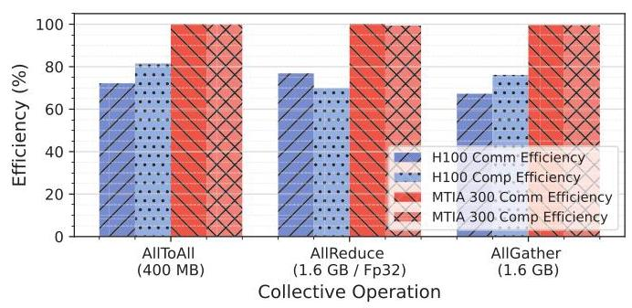

16 卡上运行 1000 次 4K×4K×4K 的 TF32 GEMM，同时执行代表性消息大小的集合操作；100% 效率表示与单独运行同样快。图 16 显示 MTIA 的两类工作更接近独立执行，H100 则受到计算核心争用影响。这是 ME/NMC 设计最直接的功能证据，但仅覆盖特定大 GEMM 和消息配置，不能推出所有 memory-bound kernel 都无干扰；正文也没有给出可直接引用的所有柱状精确数值。

### 3. 生产 DLRM：通信收益和端到端成本收益分开看

模型约 1500 亿参数、稀疏占 99%，每样本约 30 亿 FLOPs，使用 TorchRec、分布式 Shampoo；两平台均用 TorchInductor 完整编译。40 卡、local batch 6144 时比较通信。

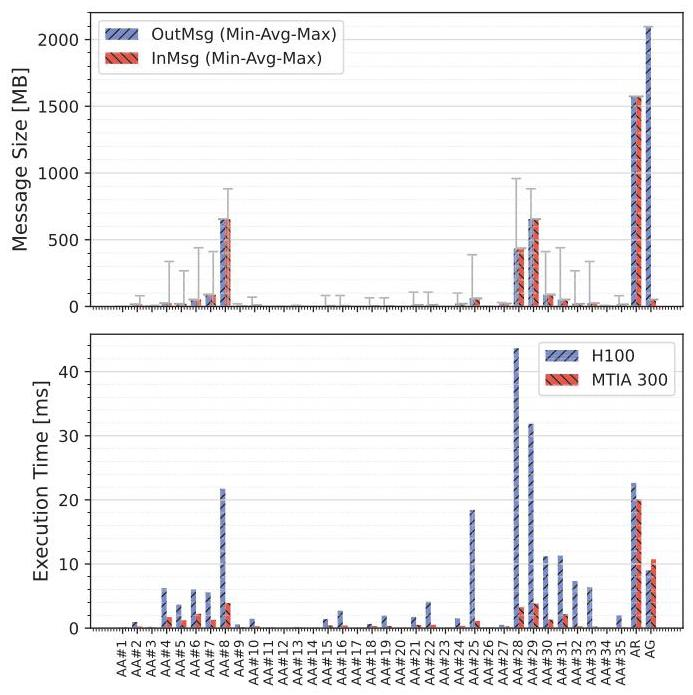

图 17 显示不规则 AllToAllv 与大 AllReduce/AllGather 混合存在，总体通信性能为 H100 的 **3.9×**。这不是整轮训练吞吐的 3.9×，因为还包括模型计算、优化器与其他开销。

端到端指标是归一化 **Perf/TCO**，即性能相对于总体拥有成本的比值，原文未给出详细成本构成。

| 配置 | local batch | global batch（由表计算） | 归一化 Perf/TCO |
|---|---:|---:|---:|
| 40×H100 | 6144 | 245760 | 1.00 |
| 40×MTIA 300 | 6144 | 245760 | 1.39 |
| 24×MTIA 300 | 10240 | 245760 | 1.42 |

三个协同设计策略解释怎样释放收益。第一，Shampoo 的矩阵特征分解卸载给 CPU，利用 1:1 host 比例保证精度与算力余量；原文称若采用 1:8 比例会损失 7.8% 性能，这不是 H100 本身必然损失的数值。第二，关闭原为 H100 优化的行级 FP8 量化通信，避免 MTIA 上低效的 RISC-V 缩放操作，性能提高 4.4%。第三，利用较大 HBM 增大 local batch、减少卡数而保持 global batch，Perf/TCO 从 1.39 到 1.42，约改善 2%。这些结果没有形成完整的逐项累加消融表，不能把百分比直接相加重建最终收益。

### 4. LLM 推理：有条件的外延验证

DeepSeek-R1 用 InferenceMax 与 vLLM 测试，attention/KV-cache 为 BF16，MoE 为 FP8；两平台均为 8 卡。输入与输出长度独立均匀采样于 `[0.8×1024,1024]`，并发 4—256，使用 mixed batching。作者选择 H200 而非 H100，是因为本文所用 H100 配置的容量不足以运行这一评测配置，不能推广成 H100 在任何规模下都无法运行该模型。

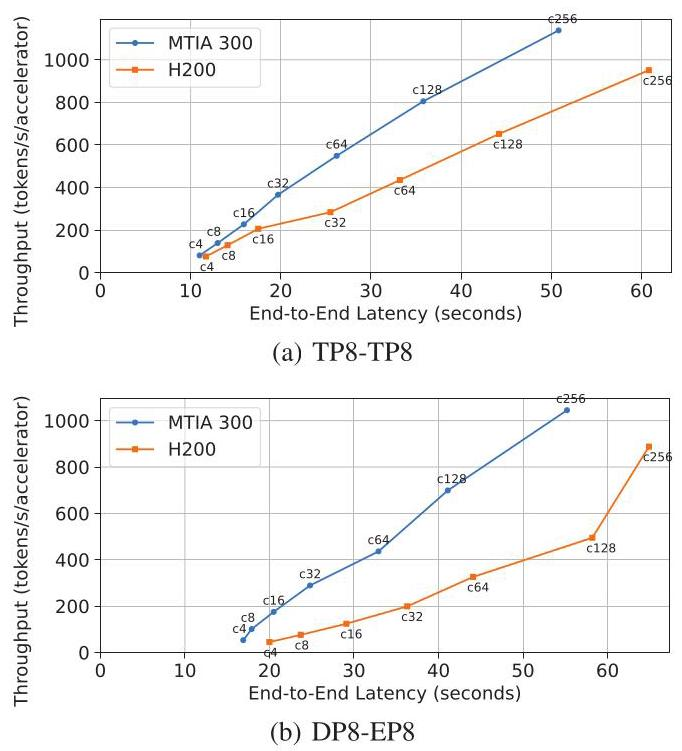

图 18 横轴是客户端请求端到端延迟，纵轴是每加速器 token 吞吐，曲线点标出并发量。TP8-TP8 将 attention/MoE 都做张量并行；DP8-EP8 复制 attention、拆分专家并用 AllToAll 路由 token。该短提示、decode 主导场景下 MTIA 总体表现较好，尤其并发 >64；低并发优势缩小，原因包括小消息通信开销和部分 kernel 只在 batch/token 维度并行，导致 PE 未充分利用。原文未给出一个统一精确加速比，也未覆盖长提示 prefill、其他模型或所有服务延迟约束。

### 结论支撑性分析

论文用“部件能力—并发干扰—生产通信—端到端成本”的证据链支持工作负载匹配的架构主张，跨度比仅报告峰值规格更完整。最大限制是：端到端训练只有一个详细模型，TCO 缺少成本分项，未给出从去除 ME、移动 ME 布局到使用外置 NIC 的完整消融，也没有同一网络/功耗条件下的纯架构比较。因而可以接受“在其配置和负载上通信更快、Perf/TCO 更高”，但难以精确拆分每项硬件创新的独立贡献，或据此宣称通用训练优势。

## 六、附加洞察（Side Findings）

**结论 1：embedding 的带宽收益受输入偏斜限制，HBM 提速不会线性映射成算子提速。** 出处：V-A，Embedding performance。推理链条是 HBM 相对 H100 约有 2.5× 带宽，而 TBE 未达到同等加速 → 作者指出大量索引反复访问相同特征时，瓶颈转向缓存或指令执行 → 因此继续扩大 HBM 带宽不一定有效。论文给出机制解释，但没有单独报告偏斜程度扫描，边界尚未量化。

**结论 2：跨平台数值差异可能在训练数小时或数天后才表现为收敛问题。** 出处：VI，Numerical accuracy。推理链条是浮点精度、舍入与支持类型不同，kernel 的算法和操作次序也可能不同 → 这些局部差异影响长期迭代 → 单次算子能运行并不足以保证训练数值一致。作者已开发调试工具但仍需成熟；该结论来自工程经验，文中没有公开具体失败轨迹或发生概率。

**结论 3：推荐训练的软件维护难度来自算子与形状的长尾，以及模型迭代持续改变支持面。** 出处：VI，Model enablement and operator authoring。作者经历每个新模型快照都需要新增算子、形状和图变换 → 高性能手写投入无法经济地覆盖所有尾部算子 → 必须采集生产 trace、合成测试并维护 CI/CD，编码 agent 已有早期成功。这里的经验说明“支持 PyTorch”仍需持续工程投入，论文未量化 agent 的完整成本收益。

## 七、总结与评价（Wrap-up）

MTIA 300 的核心贡献是把推荐训练的数据路径做成一套完整体系：封装内 NIC 负责网络连接，边缘 ME/NMC 负责独立通信与归约，HCCL 把标准集合语义变成设备可执行工作图。最有说服力的是重叠实验和真实模型通信结果互相呼应，解释了为何较低峰值算力仍能获得较高 Perf/TCO。

最大的不足是优势对负载和软件状态敏感，且成本与硬件贡献拆分不够透明。值得进一步研究的是在真实小 kernel、动态 AllToAllv 和不同通信/计算比例下，如何自动决定分片、并发与 local batch；这是本报告提出的后续方向。作者已列出的未来工作包括 GEMM/小集合优化、专用 TorchRec sharding 与同一 PE 网格上的 kernel co-location，应与已验证结果区分。

## 八、章节脉络与段落速览（Structure Map）

以下按原文自然段定位；图、表和页脚不单列成正文段，嵌入列表合并入引导段，跨页断开的 NIC interface 段合为一段，编号在各节重新开始。

- **Abstract**：概括推荐训练需求、三项架构设计与性能定位。
  - ¶1 从负载不匹配引出内置 NIC、集合卸载、近存计算及后续适用方向。
- **I. INTRODUCTION**：由推荐模型的通信结构推导芯片设计动机。
  - ¶1 介绍 Meta 推荐业务和前两代推理芯片到训练芯片的演进。
  - ¶2 对比 DLRM 与 GenAI 对算力、存储和网络的需求。
  - ¶3 解释稠密/稀疏模型结构及混合并行的必要性。
  - ¶4 列出混合并行与 Shampoo 引入的集合通信。
  - ¶5（含三项列表）用内置 NIC、ME 与近存布局回应通信数据路径问题。
  - ¶6 说明还将介绍发挥专用硬件能力的软件栈。
  - ¶7 归纳贡献并与 TPU sparse core 的网络和接口定位区分。
  - ¶8 交代设计时间线和后续 MTIA 代际的范围。
  - ¶9 给出全文组织。
- **II. MTIA 300 ARCHITECTURE**：介绍芯片整体与各模块。
  - ¶1 引出 chiplet 概览以及与前代和 GPU 的比较。
  - **A. Comparing MTIA 300 with MTIA-2i and GPUs**：说明从推理走向训练的资源重配。
    - ¶1 逐项比较工艺封装、功耗、存储、浮点与 SIMD 能力。
    - ¶2 概括相对 GPU 更强调 HBM 与网络的定位。
  - **B. MTIA 300 Compute Chiplet**：说明网格、存储和系统控制组织。
    - ¶1 介绍 PE、ME、SRAM 与 HBM 的整体分布。
    - ¶2 解释 NoC 的通道、局部路由器、路由策略与防死锁机制。
    - ¶3 描述 PCIe、DMA、安全启动与调试接口。
    - ¶4 介绍协调 PE/ME 的 RISC-V 控制核心。
    - ¶5 解释冗余 PE 行如何提高良率并对软件透明。
  - **C. Processing Element (PE)**：介绍 PE 内部数据流与训练专用加速。
    - ¶1 总览 PE 核心、功能单元与内存连接。
    - ¶2 描述 Memory Bridge 的连接和外设职责。
    - ¶3 介绍 local scratch 与 circular buffer 划分。
    - ¶4 解释双向量核和异步数据流执行模型。
    - ¶5 描述 MLU 的布局转换能力。
    - ¶6 介绍 DPE 的矩阵乘法数据流和数值格式。
    - ¶7 说明 RE 保存中间结果并进行跨 PE 归约。
    - ¶8 解释 SFU 的功能、输入路径和 SIMD 扩宽动机。
    - ¶9 描述新增 SFU 操作及 radix sort 加速 embedding 反向传播。
    - ¶10 说明 CP 的调度、依赖检查与局部内存仲裁。
    - ¶11 说明 FI 的 DMA、分包和流量整形。
    - ¶12 介绍字节对齐和 indexed DMA 对数据搬运的帮助。
  - **D. Message Engine (ME)**：从主机、计算核心和 NoC 三方面解释卸载。
    - ¶1 引出 ME 的设计目标。
    - ¶2 解释为何需要避免主机参与高速 I/O 数据路径。
    - ¶3 说明专用归约引擎的面积效率优势。
    - ¶4 解释边缘布局如何减少穿越计算网格的流量。
    - ¶5 引出 ME 的三个内部功能块。
    - ¶6 描述 CPU-M、上下文 SRAM 与共享完成队列。
    - ¶7 说明 NIC interface 如何把请求路由到对应 doorbell。
    - ¶8 给出 NMC 的归约与 DMA 能力及其集合用途。
  - **E. MTIA 300 Network Chiplet**：解释内置 RDMA NIC 及精简设计。
    - ¶1 总览网络 chiplet、带宽和物理接口。
    - ¶2 介绍 express doorbell 省去请求读取步骤。
    - ¶3 说明删除 QP caching 的面积与容量权衡。
    - ¶4 说明删去不需要的网卡功能以简化数据包处理。
    - ¶5 说明 AXI steering tag 支持不同流量的缓存分区。
- **III. SYSTEM ARCHITECTURE: RACK AND NETWORK**：说明可配置的机架与网络。
  - **A. Rack System**：以模块化补偿芯片设计周期长的问题。
    - ¶1 解释计算/网络刀片分离、槽位与背板布局。
    - ¶2 比较 scale-up 和 scale-out 刀片及其网络能力。
    - ¶3 介绍单 CPU 对单加速器的计算刀片配置。
  - **B. Network Design**：给出两级网络的带宽和扩展规模。
    - ¶1 说明当前配置与可选扩容路径。
- **IV. SOFTWARE STACK**：说明 PyTorch 体验与计算通信统一执行。
  - ¶1 总览开发库、编译链、运行模式与 kernel 编写方式。
  - ¶2 说明图生成、融合、调度和内存优化。
  - ¶3 解释计算与集合进入同一图的收益及动态形状限制。
  - ¶4 引出使用 RDMA verbs 和流接口的 HCCL。
  - ¶5 解释 CPU-C 如何分派并等待 PE/ME 工作。
  - **A. Collective Graph Processing**：把集合图转换为可执行工作条目。
    - ¶1 介绍 WQE 操作类型及语义。
    - ¶2（含四项列表）说明控制发射顺序的依赖字段。
    - ¶3 说明 NMC 如何独立完成归约型集合。
    - ¶4 用 ring AllReduce 展示收发归约依赖与两个阶段。
  - **B. Collective Communications Library (HCCL)**：连接集合 API、算法计划和设备执行。
    - ¶1 说明 RDMA 控制路径、QP 建立与错误处理。
    - ¶2 说明在有限 QP 下的按需连接与复用。
    - ¶3 说明 PyTorch 语义到 buffer/communicator 的映射。
    - ¶4 解释集合算法预选与设备卸载准备。
    - ¶5 解释 stream、work packet、subgraph 和 WQE 的多层并发。
    - ¶6 描述后台线程的清理、错误监控和完成通知。
- **V. EVALUATION**：从算子到生产模型检验性能与成本。
  - ¶1 说明代际比较背景、测试平台和评估范围。
  - **A. Compute Operations**：分析主要计算和存储算子的表现。
    - ¶1 引出计算 microbenchmark。
    - ¶2 比较 TBE 前反向并解释非线性的带宽收益。
    - ¶3 用 BF16 加法测量大张量带宽及小 kernel 弱点。
    - ¶4 用 roofline 分析 GEMM 的资源上限和库优化空间。
  - **B. Collective Operations**：比较集合在不同消息大小与规模下的延迟。
    - ¶1 解释主要消息区间的优势及小消息软件不足。
  - **C. Overlapping Compute and Collective Operations**：检验卸载是否减少并发干扰。
    - ¶1 定义重叠效率实验并解释两平台差异。
  - **D. Production Training Workload**：分析真实 DLRM 的通信和端到端收益。
    - ¶1 介绍模型规模、计算量、框架和优化器。
    - **1) Collectives**：定位生产迭代的集合开销。
      - ¶1 说明消息分布与 MTIA 的总体通信优势。
    - **2) End-to-end training performance**：介绍面向芯片的模型协同设计。
      - ¶1 引出三项优化与 Perf/TCO 收益。
      - ¶2 说明 CPU 卸载 Shampoo 特征分解的动机与配置影响。
      - ¶3 说明关闭量化通信为何改善性能。
      - ¶4 说明固定全局 batch 下增加本地 batch 的作用。
      - ¶5 列出分片、kernel 优化与网格内共置的未来机会。
  - **E. LLM Inference**：检验带宽导向架构对生成式推理的适用性。
    - ¶1 介绍模型、比较平台、精度、请求分布和并发设置。
    - ¶2 定义两种八卡分片策略与 mixed batching。
    - ¶3 解释吞吐—延迟结果及高低并发差异。
- **VI. CHALLENGES AND LIMITATIONS**：总结专用化与持续演进的矛盾。
  - ¶1 引出后续代际要兼顾 DLRM 与 LLM 的方向。
  - ¶2 说明稠密和 Transformer 成分增加后的算力需求。
  - ¶3 解释新缩放格式缺少原生支持时的性能代价。
  - ¶4 说明浮点和算法差异导致长期训练数值一致性困难。
  - ¶5 说明 eager 模式中主机开销的瓶颈。
  - ¶6 解释训练速度、收敛约束与本地 batch 的权衡。
  - ¶7 说明长尾算子、模型迭代及测试基础设施的工程负担。
- **VII. RELATED WORK**：定位产业背景、通信能力与开发体验。
  - ¶1 概述自研芯片与独立 AI 芯片厂商的发展。
  - ¶2 归纳相对 Meta 推理芯片的三项差异。
  - ¶3 说明 TPU sparse core 的网络和接口适用范围。
  - ¶4 对比 PyTorch/eager 支持以及 DLRM 优化定位。
- **VIII. CONCLUSION**：收束架构贡献并展望下一代芯片。
  - ¶1 总结 DLRM 训练效率结果并提出未来模型协同设计机会。
- **REFERENCES**：条目 [1]—[36] 列出芯片、模型、算法与软件来源，无正文论证段落。
- **APPENDIX: CONTRIBUTORS TO MTIA 300**：给出完整贡献者名单。
  - ¶1–2 列举参与 MTIA 300 项目的贡献者，无新增技术或实验内容。
