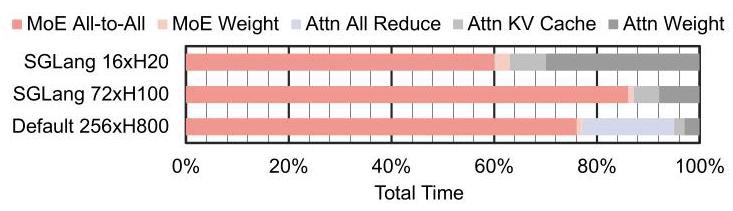
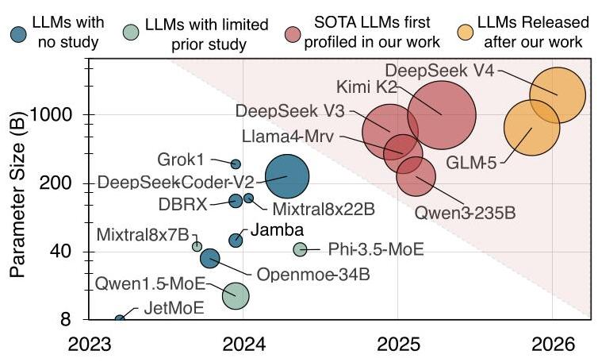
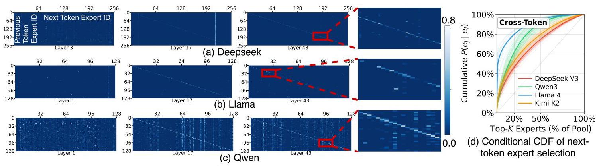
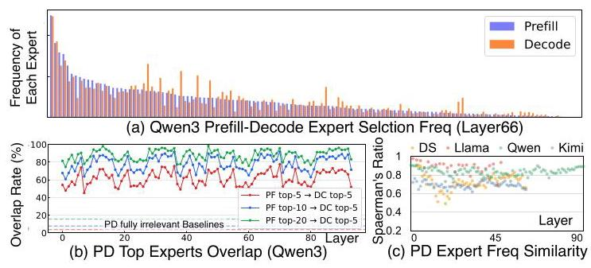
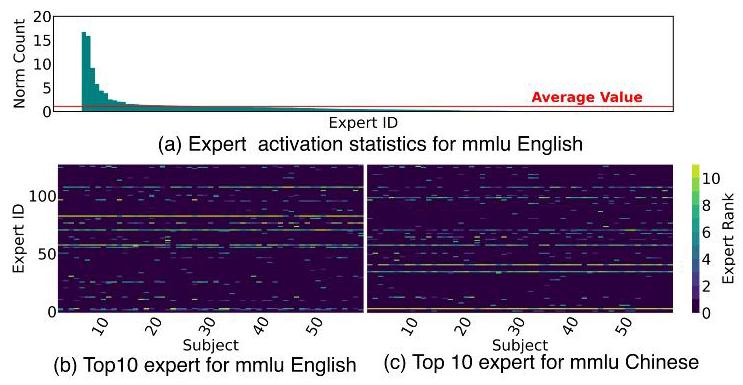

# Patterns behind Chaos: Forecasting Data Movement for Efficient Large-Scale MoE LLM Inference 深度解读

> **作者**：Zhongkai Yu, Yue Guan, Zihao Yu, Chenyang Zhou, Zhengding Hu, Shuyi Pei, Yangwook Kang, Yufei Ding, Po-An Tsai  
> **会议/期刊**：ISCA 2026，authors' preprint  
> **一句话总结**：本文把大规模 MoE LLM 的专家选择从“看似随机”的系统开销问题，重构为可画像、可预测、可用于系统设计的数据移动规律问题，并用 wafer-scale GPU 架构和 8xH100 上的 prefill-guided expert placement 证明这些规律能转化为实际加速。

## 一、问题定义

MoE LLM 的核心机制是在每个 MoE layer 中由 gating mechanism 为 token 动态选择少量 experts。它的好处是模型总参数量可以扩到数百 B 甚至 1000B，而每个 token 只激活一小部分参数；代价是 expert selection 在运行时才知道，服务系统必须在 GPU、chiplet、HBM、CXL/CPU memory 或 flash 等层级之间搬运 expert weights 或 token activations。对于 dense LLM，权重访问相对稳定；对于 MoE，专家选择带来的 all-to-all、remote HBM read、expert migration 等数据移动会变成主瓶颈。

图 2 是问题动机的直接证据：在 DeepSeek V3 的 4K sequence 场景里，MoE All-to-All 和 MoE Weights 相关的数据移动占总延迟的 60%-90%。这说明本文不是在优化一个边缘开销，而是在处理大规模 MoE serving 的主要性能瓶颈。

这是一篇偏 **First 类型** 的 profiling 和设计指导工作。已有 MoE serving 研究通常围绕具体平台做优化，例如 CPU-GPU offloading、多 GPU all-to-all、processing-in-memory 或特定集群部署；本文的问题不是“如何在某个系统上再做一个 placement heuristic”，而是先问：大规模 MoE 的 expert selection 背后是否存在跨模型、跨任务、跨平台可利用的数据移动规律？如果存在，这些规律如何指导不同层级的 serving system 设计？

**动机评估**：动机是 solid 的。论文给出三层支撑：第一，大规模 MoE 已成为 2025 年 frontier open-weight model 的主流形态，研究对象覆盖 DeepSeek V3、Llama4 Maverick、Qwen3-235B 和 Kimi K2，规模从 235B 到 1000B；第二，已有 profiling 主要停留在小模型或单一系统视角，缺少 200B+ MoE 的系统性数据移动分析；第三，若 expert selection 真正随机，DeepSeek V3 一类模型的组合空间可达 $C_{256}^{8}=4,426,165,368$，prefetch、cache、placement 和 load balancing 都会失效。因此，只要能证明“随机背后有结构”，就有明确的系统价值。

图 1 把本文的定位说得很清楚：已有工作多集中在较小 MoE 或窄视角分析，而本文覆盖 2025 年新出现的 200B-1000B 级模型。这个图的价值不只是展示“模型更大”，而是说明旧结论未必能外推到 expert 数量、参数规模、部署规模都显著扩大的新 regime。

**核心 Insight**：本文的核心洞察是，MoE expert selection 虽然由 gating 动态决定，但并非不可预测。它在时间维度上存在 layer-level、token-level、prefill-decode-level correlation，在空间维度上存在 expert activation skew、expert-pair co-activation affinity 和 task/language-dependent hot experts。换句话说，MoE 的数据移动不是纯随机噪声，而是有可利用结构；系统设计应该从“平台先行”转向“模型行为先行”，先画像 expert movement pattern，再选择 prefetch、cache、replication、placement 或 task allocation 策略。

## 二、相关工作

论文把相关工作分成三条脉络。

第一类是 **MoE model behavior studies**。一些技术报告或博客已经观察到 MoE routing 的局部现象，例如 Mixtral 报告中的 temporal locality、OLMoE 中的 domain specialization、SGLang 博客中 DeepSeek V3 的 expert distribution 和 prefill/decode 相似性。这些工作的问题是视角零散，通常只针对单个模型或某个现象，缺少跨多个 200B+ 模型、从数据移动角度组织起来的 profiling methodology。

第二类是 **MoE LLM inference data movement optimization**。COMET、MegaScale-Infer、MoE-Lightning、Fiddler、Sida、Lina、SmartMoE、Pre-gated MoE、LYNX 等系统都在减少 MoE inference 的数据移动或负载不均衡。有的关注 multi-GPU communication overlap，有的关注 CPU/GPU offloading，有的关注 expert locality 或 active expert reduction。这些方案的问题不是无效，而是往往绑定特定平台假设，优化策略和 insight 不容易迁移到 CXL、wafer-scale GPU、PIM 或 flash-tiered systems。

第三类是 **wafer-scale 和 chiplet architectures**。这类工作探索 chiplet/wafer-scale 的 interconnect、topology、data placement 或 LLM serving 架构，例如 WSC-LLM、WaferLLM、MoEntwine 以及若干 interconnect/topology 论文。本文与它们的区别在于，它并非单纯提出一个 wafer-scale MoE 架构，而是把 wafer-scale 作为验证 profiling insights 的 case study：先通过 MoE expert selection trace 得到系统无关规律，再映射到硬件任务分配和 HBM 管理。

## 三、技术挑战

**挑战 1：expert selection 的组合空间极大，直接预测单个组合不可行。** 以 DeepSeek V3 为例，一个 token 在 256 个 experts 中选 8 个，组合数量超过 44 亿。如果系统把问题理解为“精确预测下一次会选哪组 experts”，搜索空间会迅速爆炸。本文选择不预测完整组合，而是统计条件概率、CDF、Spearman correlation、frequency skew 和 co-activation pattern，这降低了问题难度，也让结论能服务于 cache、placement、replication 等近似策略。

**挑战 2：时间相关性有多个尺度，不能用单一 locality 概念概括。** Adjacent layers 的 reuse distance 很短，适合 LLC 或近端缓存；adjacent tokens 的 reuse distance 更长，适合 local HBM 或 remote memory migration；prefill-decode correlation 则跨 serving stage，适合初始 decode placement。论文需要把这些尺度分开，否则会把不同层级 memory hierarchy 的机会混在一起。

**挑战 3：空间不均衡既来自热门专家，也来自专家对共同激活。** 单个 expert activation skew 会让某些 GPU/die 负载过高；expert-pair co-activation 则会让某些 placement 组合在同一时间集中冲击同一个 unit。前者提示 popular expert decentralization，后者提示 expert-pair separation，但二者与通信开销之间存在 trade-off。

**挑战 4：系统平台跨度大，insight 必须足够抽象又要能落地。** 本文声称 insights 适用于 multi-GPU、wafer-scale GPU、CXL/CPU memory disaggregation、flash offloading 和 PIM。要让这个声明可信，不能只停留在 observation，还要在至少两个差异很大的系统中验证。论文选择未来 wafer-scale GPU 和现有 8xH100 集群，分别覆盖硬件辅助和软件 placement 两条路径。

**挑战 5：评估难度高。** 200B-1000B MoE 的 trace 收集本身很贵，论文报告 24,000+ requests、70,000+ expert selection traces、150GB JSON trace 和超过 2000 GPU hours。Wafer-scale GPU 又无法直接实机验证，只能构建 event-driven simulator 并用 8xH100 的单 GPU MoE layer 和 P2P communication 数据校准。

## 四、解决方案

### 整体思路

论文的方案可以概括为三步：先收集四个 SOTA MoE 模型在多任务、多语言 workload 上的 expert selection trace；再从 temporal relations 和 spatial relations 两个维度提炼六条系统设计 insight；最后把这些 insight 映射到两个 case study，一个是面向未来 wafer-scale GPU 的 command processor 与 hardware-managed HBM 设计，另一个是现有 8xH100 上的 prefill-guided decode expert placement。

图 3 是全文方法论的骨架。作者没有把 expert selection 当成一个单点统计量，而是按时间维度拆成 layer、token、prefill/decode 三个尺度，按空间维度拆成 single expert skew 和 expert-pair co-activation。后面的六条 insight 都从这张分类图展开。

### 贯穿示例

可以把一个 MoE serving 系统想成一个有很多仓库的厨房：每个 expert 是一种食材，GPU/die 是厨师所在的工作台，token 是一道道订单。表面上，每道订单要拿哪些食材由 gating 临时决定，似乎没法提前准备。但如果观察足够多订单，就会发现几个规律：某些菜系总是用相近食材，上一道工序用过的食材会影响下一道工序，某些热门食材几乎所有菜都会用，某些食材对经常一起出现。于是系统不必猜完整菜单，只要把热门食材复制到多个工作台，把经常一起出现但会造成拥塞的食材分散开，把 prefill 阶段看到的食材需求用于 decode 初期摆放，就能减少来回搬运和等待。

这个例子对应到论文中：expert weights 是“食材”，local HBM/LLC 是“工作台附近的储物格”，remote HBM/CXL/CPU memory 是“远端仓库”，task allocation 是“订单分配给哪个工作台”，prefetch/cache/duplication 是“提前备料”，expert-pair separation 是“避免两个热点食材压到同一工作台”。

### 关键技术点

**1. Temporal profiling：expert selection 在不同时间尺度上可预测。**

图 4 展示 adjacent layers 之间的 conditional probability heatmap。白点表示某些 expert pair 在相邻层之间有明显更高的条件概率，亮竖线表示某些 experts 无论前一层选了谁都更容易被选中。CDF 结果显示，top 20% 的 next-layer candidates 覆盖 DeepSeek V3、Qwen3、Llama 4、Kimi K2 中 50%、65%、77%、56% 的条件概率质量。这支撑了 layer-level correlation 可用于短 reuse distance 的缓存或 prefetch。

图 5 进一步说明 adjacent tokens 在同一层也存在相关性，尤其高层出现明显对角线，意味着相邻 token 倾向选择同一 expert。top 20% next-token candidates 覆盖 47%、62%、80%、53% 的条件概率质量。和 layer-level 相比，token-level reuse distance 更长，因此更适合 local DRAM/HBM 级管理。

图 6 把 prefill 和 decode 的 cross-layer、cross-token heatmap 放在一起比较，Spearman ratio 多数层达到强相关区间，论文采用 $|\rho|>0.7$ 作为强相关标准。这是 Insight 1 的依据：decode 初期缺少历史 token，但 prefill 阶段已经暴露了大量 expert selection 信息。

图 7 从单 expert frequency 角度验证相同结论：top-5 prefill experts 覆盖约 60% 的 top-5 decode experts，top-10 和 top-20 分别升到 75% 和 90%。这让 prefill-guided placement 不只依赖 pair heatmap，也可以用简单频率统计落地。

**2. Spatial profiling：专家热度、任务类型和专家对共同激活决定负载均衡。**

图 8 的 Llama4 layer 7 例子显示，一小部分 experts 的激活次数超过平均值 16 倍；MMLU 57 个 subject 的热门专家既有共享部分，也有任务相关差异；当题目内容相同但语言从英文换成中文时，热门专家集合显著变化，只保留 5-6 个跨 subject 热门专家，且与英文最常选专家只重叠两个。这支持两条系统策略：popular experts 应该复制或分散，serving system 可以利用 task/language metadata 预先迁移或复制对应专家。

图 9 说明不是只有单个 expert 热门，expert pair 也有强 co-activation affinity。某些 pair 的共同激活概率达到随机理论值的 20-40 倍，top 10% expert pairs 贡献 60%-80% 的总 co-activations。这支持 expert-pair separation：把经常同时出现的专家对放在不同 unit 上可提高并行度，但同时要权衡 cross-unit communication。

**3. 六条系统 insight。**

本文从 profiling 中提炼六条 insight：Insight 1 是用 prefill trace 预测 decode expert selection；Insight 2 是把 layer-level 和 token-level temporal relation 映射到跨层级 memory management；Insight 3 是 task distribution 要感知 expert placement；Insight 4 是复制或去中心化 popular experts；Insight 5 是分离高频 co-activated expert pairs；Insight 6 是利用 workload metadata，例如 task type 和 language，在 serving 前做 expert migration 或 placement。

这些 insight 的重要性在于粒度不同。Insight 1 和 2 更偏动态、单 unit 或 memory hierarchy 内部优化；Insight 3-6 更偏静态或周期性、跨 unit 的 workload balancing。这样，本文不是给出一个孤立算法，而是给出一套可以映射到不同系统层级的设计词汇。

**4. Case Study 1：wafer-scale GPU 的两级 command processor 和 hardware-managed HBM。**

图 10 展示了硬件 case study 的核心：在 single-GPU-like programming model 下，软件看不到每个 die 的数据位置，因此优化负担落到硬件。作者加入 Global CP 和 Local CP 两级 command processor，Global CP 持有 expert distribution table 和 cross-token heatmap；D2D controller 增加 ATU 和 PDU，支持 remote expert 的本地复制、地址重定向和 prediction-guided caching。

图 11 对应两个关键算法。Task allocation algorithm 根据 expert request count 和 expert-to-die map 生成 candidate dies，用 cost model 在 DRAM access、compute 和 D2D communication 之间做近似选择，并按 block 粒度分配请求。Data-driven predictor 根据当前 MoE kernel 的 expert selection 在 heatmap 中取对应行，预测下一 token 的高概率 experts，并指导 PDU 决定哪些 remote experts 要复制到 local HBM。

这个设计直接回应前文挑战：Global CP 解决传统 command processor 不感知 physical location 和 expert placement 的问题；PDU/ATU 解决统一 HBM abstraction 下无法区分 local/remote access 的问题；predictor 利用 temporal relation 降低 remote HBM read；allocator 利用 spatial relation 平衡 workload。

**5. Case Study 2：现有 GPU 集群上的 prefill-guided decode expert placement。**

图 16 展示了在 8xH100 上的两个软件 placement 算法。Remap-based algorithm 不增加专家副本，只按 prefill frequency 估计 roofline cost，然后贪心地把 experts 重新分配到负载最小 GPU，保持每个 GPU 的 expert 数量不变。Duplication-based algorithm 从默认 contiguous layout 出发，每个 GPU 预留一个额外 slot，选择最能降低瓶颈负载的 expert-GPU pair 做复制，并让 replicated expert 的 tokens 在副本间均分。

这部分对应 Insight 1：初始 decode 阶段还没有 decode profiling 数据，EPLB 一类周期性重平衡方法通常要等 3000+ steps，而短输出请求可能根本等不到；prefill trace 则在 decode 开始前就已经可用。

### 与已有方案的对比

相较于系统中心的 MoE serving 优化，本文的优势是把“为什么这个系统优化有效”上升到模型行为规律层面。它不只是说在 wafer-scale GPU 上要减少 remote HBM read，也解释了 layer/token/prefill-decode correlation 如何支撑 predictor；不只是说要重排 experts，也解释了 hot expert skew、task dependence 和 co-activation affinity 如何导致 imbalance。

不足也很明确。第一，profiling 覆盖四个大模型，但它们都来自 2025 年附近的 open-weight MoE，结论对未来 routing policy 明显不同的模型仍需重新验证。第二，wafer-scale GPU 结果依赖模拟器，虽然做了 8xH100 校准，但完整系统仍是未来架构假设。第三，8xH100 placement case study 只测 Qwen3-235B 和 MoE computation time，不包含 attention、all-to-all、top-k 的端到端收益，因此实际 serving 加速会小于 MoE kernel 层面的数字。

## 五、实验评估

### 实验设定

Profiling 阶段覆盖四个模型：DeepSeek V3 671B、Llama4-Maverick-128E 402B、Qwen3-235B 235B、Kimi K2 1000B，结果对 24,000+ requests 求平均。作者收集所有 layers 和 tokens 的 expert selection trace，形成超过 150GB JSON 文件，并在 artifact 中开放 70,000+ traces。

Wafer-scale case study 使用自研 Python event-driven multi-chiplet GPU simulator。模拟器建模 LLC、HBM、compute units、D2D links、central resource manager、contention 和 congestion，并用 8xH100 DGX 上的 MoE layer execution 与 P2P transfer 实测数据校准。评测 metric 是 decode 阶段 MoE layers throughput。硬件配置包括 5x5 Dojo、3x8 TSMC-SoW 和 Dojo-Enhanced；每个 die 采用 H100-like 配置，80GB HBM、3.35TB/s local HBM bandwidth、1.7TB/s adjacent D2D bandwidth，另有增强版本模拟更高算力和带宽趋势。

图 13 是模拟可信度的关键支撑：单 GPU MoE layer 和双 GPU P2P transfer 的模拟误差均在 5% 内。它不能证明未来 wafer-scale 全系统完全准确，但至少说明基础 compute 和 data transfer 模型被实测校准过。

Baselines 包括 Base、EP、Allo Only、Pred Only、Allo+Pred。Base 类似当前 GPU 的简单策略，专家均匀放置但任务分配不感知 expert placement；EP 把 expert computation 分配给 expert 所在 die，避免 D2D 通信但可能造成负载不均；Allo Only、Pred Only 和 Allo+Pred 分别测试 task allocation、predictor 和二者组合。

Real GPU case study 部署 Qwen3-235B 到 8xH100 NVLink 系统，使用 SGLang、DeepEP 和修改过的 expert placement 接口。指标是 MoE computation time，排除 attention、all-to-all 和 top-k；benchmark 使用 MMLU 和 Global-MMLU，batch size 从 64 到 16,384。Baselines 包括 Default contiguous placement、oracle Best、oracle Worst、Remap 和 Dup。

### 主要实验与结论

图 12 是 wafer-scale case study 的主结果。Allo+Pred 在 DeepSeek、Kimi、Llama、Qwen 上分别达到 7.0x、8.2x、7.3x、4.1x throughput improvement，平均约 6.6x。按 topology 看，Dojo 上提升 6.0x，TSMC-SoW 上提升 7.5x；后者 rectangular layout 让远距离通信更突出，因此更受益于 placement-aware allocation。

相对 EP，Allo+Pred 在小 batch size 4096 时优势不明显，因为每个 expert token 数少，执行更 memory-bound，算法退化得接近 EP；在 batch size 16,384 时，Allo+Pred 比 EP 快 1.44x，说明大 batch 下把热门 expert 的工作拆到多个 dies 能缓解 EP 的负载不均。

Hop reduction 结果进一步解释了收益来源。Pred Only 把 hop count 降低 4.5x，对应 3.0x performance gain，说明 baseline 主要受 cross-die communication 限制。Allo Only 把 hop count 降低 142x，但性能只提升 6.3x，说明通信不再是唯一瓶颈，负载均衡开始主导。Allo+Pred 把 hop count 降低超过 213x，但相对 Allo Only 只再提升 1.1x，说明 allocator 已经消除了大多数远程访问，predictor 的边际收益受剩余 bottleneck 限制。

图 14 从 DRAM access 角度验证机制：baseline 中大多数 reads 是 remote reads；Pred Only、Allo Only 和 Allo+Pred 把大量 remote reads 转成 local reads。Allo+Pred 比 Pred Only remote reads 更少，因为任务多数分配到持有对应 expert 的 dies；比 Allo Only 进一步少，是因为 popular remote experts 被缓存到 local HBM。

图 15 说明为什么作者把 allocator 放在 GPU command processor，而不是简单交给 host CPU。Dojo 上 host-CPU allocation overhead 对 DeepSeek V3 是 5.2%-6.4%，对 Qwen3 是 11.1%-14.2%；Dojo-Enhanced 上分别升到 19.3%-23.8% 和 42.0%-51.6%。Qwen3 开销更高是因为 MoE layers 更多，PCIe 往返更频繁，单层计算又较小；增强 GPU 上开销更高则说明 GPU 越快，固定 CPU-GPU 控制开销越不可接受。

硬件开销方面，Prediction Table、ATU、Heatmap Cache、Expert Distribution Table、Global/Local CP 等总 area 和 power overhead 都低于 0.04%。这支持“轻量 architectural modifications”的说法，不过这些估算依赖 Yosys、CACTI 和 ARM core 数据，属于设计级估算，不是流片后实测。

图 17 是 real GPU case study 的主结果。Remap 和 Dup 分别比 Default 快 15.5% 和 12.5%，相比 Worst 超过 2x，并且距离使用 oracle decode-stage selection 的 Best 在 10% 以内。这说明 prefill trace 对 decode placement 的预测价值在现有系统上也成立。作者也指出 EP8 本身限制了提升空间：每个 GPU 持有 16 个 experts，默认布局已经混入一些冷热 experts，max/min execution-time ratio 约 1.3x；更大 EP scale 下 imbalance 更强，预计收益更高。

### 结论支撑性分析

实验总体能支撑论文的核心主张：expert selection pattern 确实可用于系统设计，并能在未来硬件和现有 GPU 集群中产生收益。Profiling 的四模型覆盖面、24,000+ requests、temporal/spatial 两类指标和两个 case study 之间的对应关系，使论文论证比较完整。

但支撑性也有边界。Wafer-scale GPU 的 6.6x 来自模拟器，尽管基础模型校准到 5% 误差内，未来芯片的真实 D2D controller、HBM behavior、scheduler 和 compiler 栈仍可能引入偏差。Real GPU 的 15.5%/12.5% 是 MoE computation time，不是完整 request latency；all-to-all、attention、KV cache、scheduler queueing 等部分可能稀释端到端收益。此外，prefill-guided placement 的实验只展示 Qwen3-235B，虽然 profiling 跨四个模型，但 placement 算法的实机泛化仍需要更多模型和更大 EP scale 验证。

## 六、附加洞察

**结论 1：prefill-decode correlation 不仅体现在 expert pair heatmap，也体现在单 expert frequency 上。**  
- *出处*：Section III-B3，Figure 6 和 Figure 7。  
- *推理链条*：作者先比较 prefill 与 decode 的 cross-layer/cross-token heatmap，发现亮点分布相似且多数层 Spearman ratio 强相关；再比较单 expert frequency，发现 top-5、top-10、top-20 的热门专家重叠率逐步提高到约 60%、75%、90%；因此，prefill 信息既能用于复杂 pair-level predictor，也能用于简单 hot expert placement。薄弱点是低频 experts 存在差异，因此这种预测更适合优化热点和初始 decode，而不是精确覆盖所有 experts。

**结论 2：task type 和 language 会显著改变 hot expert set，workload metadata 有系统价值。**  
- *出处*：Section III-C1，Figure 8。  
- *推理链条*：作者在 MMLU 57 个 subjects 上看到不同 subject 的 top experts 既有共享又有差异；再用中文版本 MMLU Pro 控制题目内容但改变语言，发现中文和英文的热门专家集合明显不同；因此，任务类型和语言不仅影响模型输出，也影响底层 expert routing。这个结论支持 workload-aware serving，但需要离线 profiling 维护 task-to-expert mapping，且新任务分布可能需要重新校准。

**结论 3：减少 hop count 到一定程度后，性能瓶颈会从通信转向负载分配。**  
- *出处*：Section V-D，Figure 12。  
- *推理链条*：Pred Only 的 4.5x hop reduction 带来 3.0x 性能提升，说明初始 bottleneck 是 cross-die communication；Allo Only 进一步把 hop count 降到 baseline 的 1/142，但性能只到 6.3x；Allo+Pred 超过 213x hop reduction，却只比 Allo Only 平均多 1.1x。由此可见，通信优化存在边际收益，后续需要关注热门 expert 的工作拆分和 compute load balance。

**结论 4：host CPU 执行细粒度 allocator 会随着 GPU 性能提升而越来越不合适。**  
- *出处*：Section V-F，Figure 15。  
- *推理链条*：作者把同一 allocator 放到 host CPU 路径下估算 overhead，发现 Dojo-Enhanced 中固定 PCIe transfer 和控制开销占比显著升高，Qwen3 最高达到 42.0%-51.6%；这是因为 GPU die 更快后每层 compute 时间变短，而 CPU-GPU 往返没有同步缩短。因此，面向未来更快 chiplet/wafer GPU 的 fine-grained MoE scheduling 需要更靠近 GPU 的 command processor 或硬件路径。

**结论 5：8-GPU EP scale 下默认 expert placement 已经有一定负载平衡，限制了 prefill-guided placement 的实测上限。**  
- *出处*：Section VI-C，Figure 17 后的讨论。  
- *推理链条*：Qwen3-235B 在 EP8 下每个 GPU 持有 16 个 experts，默认 contiguous layout 中每个 GPU 大概率同时含有 hot 和 cold experts；作者报告默认布局下 max/min execution-time ratio 约 1.3x，因此 Remap/Dup 的收益被自然平衡削弱。这个结论提醒读者，15.5%/12.5% 不是方法上限，而是受实验规模影响；更大 EP scale 可能出现更明显 imbalance，也可能带来更大 placement 收益。

## 七、总结与评价

本文最大的贡献不是某一个 allocator 或 predictor，而是把大规模 MoE LLM 的 expert selection 组织成一套 data-movement-centric profiling 框架，并从中抽象出六条能跨系统复用的设计 insight。它证明了 MoE routing 的随机性背后有强结构：时间上可预测，空间上有 skew 和 affinity，任务上受 workload 影响。

我认为论文最亮的地方是“profiling insight 到系统设计”的闭环做得比较完整。Figure 3 的分类法、Figure 4-9 的规律、Figure 10-17 的 case studies 之间有清楚映射，不是为了硬件 case study 临时找 observation。最大的不足是两个 case study 的外推边界仍需谨慎：wafer-scale GPU 是模拟未来架构，8xH100 只覆盖 Qwen3 的 MoE computation time。后续如果能在更大 EP scale、多模型实机和端到端 serving latency 上验证，会更有说服力。

从研究启发看，本文提示 MoE serving 不应只依赖在线 reactive load balancing。对于长尾任务、短输出请求或 decode 初期，offline profiling、prefill trace 和 workload metadata 都是可用信号；系统可以把它们和在线统计结合起来，形成“启动前放置 + decode 初期预测 + 长期在线重平衡”的分层策略。

## 八、章节脉络与段落速览

- **Title / Abstract**：论文提出对 200B-1000B MoE LLM 做数据移动中心的 profiling，并在 wafer-scale GPU 与现有 GPU 集群上验证 insight 的系统价值。  
  - ¶1 标题和作者信息，指出论文主题是预测大规模 MoE LLM inference 中的数据移动。  
  - ¶2 摘要说明 expert selection 带来的数据移动已成为 multi-unit serving 的 dominant bottleneck，并概括四模型 profiling、六条 insight、6.6x wafer-scale 加速和 1.25x real-GPU MoE computation 加速。  
  - ¶3 Index terms 给出 MoE、LLM、wafer-scale GPU、profiling 和 serving system 等关键词。

- **Section I · Introduction**：从大规模 MoE 的兴起和数据移动瓶颈出发，说明为何需要系统性研究 expert selection pattern。  
  - ¶1 说明 2025 年以来 200B+ MoE LLM 成为 frontier/open-weight LLM 的重要形态。  
  - ¶2 对比 dense LLM 和 MoE LLM，指出 MoE 动态 routing 导致显著数据移动，已有小模型或窄平台研究不足以覆盖新规模。  
  - ¶3 从时间和空间两个角度解释如果 expert selection 完全随机会导致 prefetch/cache/placement 失效和 workload imbalance。  
  - ¶4 脚注说明论文为 ISCA 2026 accepted preprint。  
  - ¶5 介绍四个 2025 SOTA MoE 模型、24,000 requests、150GB traces 和六个面向系统设计的问题。  
  - ¶6 说明两个应用验证：future wafer-scale GPU 上 6.6x throughput improvement，existing multi-GPU 上最高 1.25x speedup。  
  - ¶7-10 用贡献列表总结 profiling、六条 insight、两个 case study 和 trace/simulator artifact。

- **Section II.A · LLM and MoE Model Architecture**：介绍 decoder-only LLM 的 prefill/decode 流程和 MoE layer 的 expert routing 机制。  
  - ¶1 说明 autoregressive LLM serving 分为 prefill 和 decode 两个阶段。  
  - ¶2 说明 MoE 用多个 experts 替换传统 FFN，每个 token 只路由到少量 experts，带来参数扩展能力和运行时动态性。

- **Section II.B · Prior MoE Serving Systems**：解释已有系统为何不足以替代本文的模型中心 profiling。  
  - ¶1 用 Figure 2 说明 DeepSeek V3 中 MoE data movement 占 60%-90% latency，并列举 CPU offloading、multi-GPU communication、PIM 等已有系统方向。  
  - ¶2 指出现有工作多为 system-centric，关注特定平台的数据移动模式，insight 难以泛化。  
  - ¶3 提出本文改用 model-centric profiling，抽取 system-agnostic MoE data movement insights。

- **Section III · MoE Profiling and System Insights**：系统刻画四个大规模 MoE 模型的 temporal 和 spatial expert selection relation。  
  - ¶1 说明 profiling 对象为 DeepSeek V3、Llama4-Maverick-128E、Qwen3-235B 和 Kimi K2，结果平均自 24,000+ requests。

- **Section III.A · Categorization Methodology**：给出 profiling 分类框架。  
  - ¶1 将 expert selection profiling 分为 temporal relations 和 spatial relations。  
  - ¶2 解释 temporal relations 可支持 prefetching、caching 和 migration，并细分 layer-level、token-level、prefill-decode-level。  
  - ¶3 解释 spatial relations 可支持 expert placement 和 workload balancing，并细分 single-expert imbalance 和 expert-pair co-activation affinity。

- **Section III.B · Temporal Relations**：分析 expert selection 在层、token、prefill/decode 三个时间尺度上的相关性。  
  - ¶1 总览三个时间尺度：相邻层、相邻 token 和 prefill/decode 阶段。  
  - **III.B.1 Layer-Level Correlation**：用 adjacent layer heatmap 和 CDF 说明跨层 expert selection 有显著条件相关性。  
    - ¶1 说明 Figure 4 的 heatmap 表示给定上一层 expert 后下一层 expert 的条件概率。  
    - ¶2 解释热图中的白点、亮竖线和模型/层差异，并指出 Qwen3 相关性强于 DeepSeek。  
    - ¶3 给出 top 20% next-layer candidates 覆盖 50%、65%、77%、56% 条件概率质量的结果。  
  - **III.B.2 Token-Level Correlation**：说明同一层相邻 tokens 的 expert choice 也有相关性。  
    - ¶1 介绍 Figure 5 的 cross-token conditional probability heatmap。  
    - ¶2 指出高层出现对角线，表示相邻 tokens 倾向选择同一 expert。  
    - ¶3 给出 top 20% next-token candidates 覆盖 47%、62%、80%、53% 概率质量的结果。  
  - **III.B.3 Prefill-Decode-Level Correlation**：说明 prefill trace 可预测 decode 初期 behavior。  
    - ¶1 通过 Figure 6 比较 prefill 与 decode heatmap，指出二者亮点分布相似。  
    - ¶2 解释 Spearman ratio 的含义和强相关标准，并报告多数层达到强相关或中等相关。  
    - ¶3 脚注说明 Llama4 的 dense FFN 插入导致相邻 MoE layers 以 $N$ 和 $N+2$ 配对。  
    - ¶4 从 Figure 7 的 frequency distribution、top-k overlap 和 Spearman correlation 补充验证 prefill/decode 单 expert 热度相似。  
  - **Temporal System Insights**：把 temporal observations 转化为系统设计原则。  
    - ¶1 指出 temporal relations 可支持单 unit 上的 fine-grained dynamic strategies。  
    - ¶2-3 Insight 1 说明 prefill trace 可用于 decode expert prediction，特别适用于 decode 初期和 PD-disaggregated serving。  
    - ¶4-6 Insight 2 说明 layer-level 和 token-level reuse distance 对应不同 memory hierarchy 层级，可泛化到 chiplet、CXL、SSD offloading 和 PIM。

- **Section III.C · Spatial Relation**：分析 expert activation 的空间分布和共同激活。  
  - ¶1 总览 single-expert activation imbalance 和 expert-pair co-activation affinity。  
  - **III.C.1 Single Expert Activation Imbalance**：说明专家热度高度不均且受任务和语言影响。  
    - ¶1 Figure 8 显示 Llama4 layer 7 中部分 experts 激活次数超过平均 16 倍。  
    - ¶2 MMLU 57 个 subjects 显示一些 experts 全局热门，另一些随 subject 改变。  
    - ¶3 中文 MMLU Pro 进一步证明语言本身会显著改变 expert activation pattern。  
  - **III.C.2 Expert Pair Co-activation Affinity**：说明 expert pairs 也有强 skew。  
    - ¶1 Figure 9 用 normalized co-activation frequency 衡量专家对共同激活。  
    - ¶2 指出某些 expert pairs 比随机理论值高 20-40 倍，DeepSeek 的 routing restriction 形成特殊亮方块。  
    - ¶3 top 10% expert pairs 贡献 60%-80% activations，提示可以分离共同激活 experts。  
  - **Spatial System Insights**：把 spatial observations 转化为 coarse-grained placement 和 workload strategies。  
    - ¶1 指出 spatial relation 适合 startup 或周期性 redistribution。  
    - ¶2 Insight 3 要求 workload distribution 感知 expert placement，并利用新系统中的远端 dies。  
    - ¶3 Insight 4 要求复制或去中心化 popular experts。  
    - ¶4 Insight 5 要求分离频繁 co-activated expert pairs，但要权衡通信开销。  
    - ¶5 Insight 6 要求利用 task/language metadata 做 serving 前的 expert migration。

- **Section IV · Case Study 1: Wafer-Scale GPU Architecture Design for MoE Serving**：把 insight 映射到未来 wafer-scale GPU 的硬件和算法设计。  
  - ¶1 说明 case study 使用 Insight 3 做 task allocation，并用 Insight 1/2 构建 predictor。

- **Section IV.A · Trend of Future GPU Architecture**：说明 chiplet 到 wafer-scale GPU 的硬件趋势。  
  - ¶1 解释单 die 面积和 Moore's Law 限制推动 MI300、Blackwell、Rubin 等 multi-chiplet 设计。  
  - ¶2 介绍 TSMC SoW 可集成 24 compute dies 和 96 HBM dies，具备 3TB+ HBM 和 PFLOPS 级算力。  
  - ¶3 说明 LSI/SerDes 尽管带宽高，remote HBM access 的多跳延迟和 contention 仍是瓶颈。

- **Section IV.B · Background on Wafer-scale GPU Programming model**：比较 multi-GPU-like 和 single-GPU-like 两种编程模型。  
  - ¶1 说明 wafer-scale programming model 尚未定型。  
  - ¶2 multi-GPU-like model 可控性强但与商业 GPU 抽象和工具链趋势不一致。  
  - ¶3 single-GPU-like model 更符合 Blackwell/Rubin 趋势，但让 locality 和 data placement 优化落到硬件。

- **Section IV.C · Challenges of serving MoE with future GPUs**：指出未来 GPU 服务 MoE 的两个架构瓶颈。  
  - ¶1 说明 wafer-scale GPU 可容纳完整 MoE 模型并支持超大 batch，但现有 GPU 架构有局限。  
  - ¶2 当前 command processor 不感知 SM/die 物理位置和 expert placement，导致 D2D traffic 和 imbalance。  
  - ¶3 当前统一 HBM abstraction 不区分 local/remote HBM，无法自动缓存远端热门 experts。

- **Section IV.D · Motivation and Insights**：把挑战对应到两类硬件支持策略。  
  - ¶1 基于 Insight 3 提出 placement-aware task allocation 和 multi-level command processor。  
  - ¶2 基于 Insight 1/2 提出 data-driven predictor 和 hardware-managed HBM。  
  - ¶3 说明若未来采用 multi-GPU-like abstraction，这些策略也可由系统软件实现。

- **Section IV.E · Architecture Design**：详细描述两级 CP、D2D controller 扩展、数据结构、工作流、算法和 predictor。  
  - ¶1-2 架构概述：Global CP、Local CP、ATU 和 PDU 共同支持智能分配和本地 HBM 缓存。  
  - ¶3-5 数据结构包括 expert distribution table、cross-token heatmap 和 PDU prediction table。  
  - ¶6 kernel launch 时 Global CP 生成 sub-kernels 和 prediction info，Local CP 分配 SM 并配置 D2D controller。  
  - ¶7-8 remote data read 时 PDU 决定是否复制，ATU 支持已复制 remote data 的 local address redirection。  
  - ¶9 Algorithm 1 给出 task allocation 的输入、候选 die 生成、cost model 选择和 block 分配流程。  
  - ¶10 local duplicated read 通过 ATU 转成本地 LLC/HBM 访问。  
  - ¶11 说明 allocator 和 predictor 都由 Global CP 实现。  
  - ¶12-13 task allocation 使用 candidate mechanism 和 block-granularity distribution 处理 NP-hard 近似问题。  
  - ¶14 predictor 从当前 expert selection 对应的 heatmap rows 中取 top candidates，预测下一 token 需要的 experts。

- **Section V · Evaluation**：评估 wafer-scale case study 的模拟准确性、吞吐、hop reduction、DRAM access、host CPU overhead 和硬件开销。  
  - **V.A Experiment Setup**：描述 simulator、metric、hardware configuration、baseline、models 和 workloads。  
    - ¶1-2 使用 SGLang 在 8xH100/8xH200 上收集 traces，并构建 event-driven simulator。  
    - ¶3 metric 聚焦 decode 阶段 MoE layer throughput。  
    - ¶4 Table I 给出 Dojo、TSMC-SoW 和 Dojo-Enhanced 配置。  
    - ¶5-6 解释 Dojo 与 TSMC SoW topology、H100-like die 配置和 10% DRAM reserve。  
    - ¶7-9 定义 Base、EP、Allo Only、Pred Only 和 Allo+Pred。  
    - ¶10 models/workloads 使用 Qwen3、DeepSeek V3 和 MMLU、MMLU-Pro、ChineseSimpleQA、LiveCodeBench traces。  
  - **V.B Validation of Simulator**：用实测数据校准模拟器。  
    - ¶1 使用 8xH100 DGX 的 single-GPU execution 和 two-GPU P2P communication 验证。  
    - ¶2 benchmark 单个 MoE expert 的三次 GEMM。  
    - ¶3 P2P payload 覆盖 4KB 到 4GB，Figure 13 显示误差在 5% 内。  
  - **V.C Throughput**：报告 Allo+Pred 的主吞吐结果。  
    - ¶1 四个模型分别获得 7.0x、8.2x、7.3x、4.1x 提升。  
    - ¶2 Dojo 和 TSMC-SoW 分别获得 6.0x 与 7.5x，TSMC 更受益于减少远距离通信。  
    - ¶3 小 batch 下接近 EP，大 batch 16,384 时比 EP 快 1.44x。  
  - **V.D Hop Reduction**：解释通信减少与性能提升的关系。  
    - ¶1 定义 hop count 和 hop reduction ratio。  
    - ¶2 Pred Only 4.5x hop reduction 对应 3.0x performance improvement。  
    - ¶3 Allo Only 142x hop reduction 但只 6.3x speedup，说明瓶颈已转移。  
    - ¶4 Allo+Pred 超过 213x hop reduction，但只比 Allo Only 多 1.1x，说明剩余瓶颈是 workload distribution。  
  - **V.E DRAM Access Breakdown**：解释 local/remote DRAM read 的变化。  
    - ¶1 baseline 大量 remote reads，而三种策略都把多数 remote reads 转成 local reads。  
  - **V.F Comparison with Host CPU-Based Implementation**：评估把 allocator 放到 host CPU 的代价。  
    - ¶1 host CPU 在 Dojo 上引入 5.2%-14.2% overhead，在 Dojo-Enhanced 上最高 51.6%。  
    - ¶2 Qwen3 overhead 高于 DeepSeek，因为层数更多且每层计算更小。  
    - ¶3 Dojo-Enhanced overhead 更高，说明未来更快 GPU 需要 GPU-side command processor。  
  - **V.G Area and Power Overhead**：估算硬件扩展代价。  
    - ¶1 设计支持 100 layers 和 512 experts/layer，heatmap 存 Global CP DRAM，表格/缓存用 register/SRAM 建模，总开销低于 0.04%。

- **Section VI · Case Study 2: Prefill-Guided Decode Expert Placement on Real GPU Clusters**：在现有 GPU 集群上验证 prefill trace 指导 decode placement。  
  - **VI.A Introduction**：提出 decode 初期缺少 profiling 数据的问题。  
    - ¶1 EPLB 等动态 placement 需要 3000+ steps，短输出请求和 decode 初期无法受益。  
    - ¶2 Algorithm 2 给出 remap_based_placement 和 dup_based_placement。  
    - ¶3 Remap 在固定 expert/GPU 数量下按 roofline cost 贪心均衡，Dup 每 GPU 增加一个 replica slot 来复制 hot experts。  
  - **VI.B Methodology**：说明实机部署和指标。  
    - ¶1 在 8xH100 NVLink 上用 SGLang、DeepEP 和 cuda.Event profiler 测量各操作。  
    - ¶2 metric 是 MoE computation time，不含 attention、all-to-all、top-k。  
    - ¶3 模型是 Qwen3-235B，benchmark 是 MMLU 和 Global-MMLU，batch size 64 到 16,384。  
    - ¶4 baselines 包括 Default、oracle Best/Worst、Remap 和 Dup，Dup 每层从 128 experts 增至 136 placements。  
  - **VI.C Results**：报告 Remap/Dup 的实机收益和规模限制。  
    - ¶1 Remap 和 Dup 分别比 Default 快 15.5% 和 12.5%，并接近 oracle Best。  
    - ¶2 EP8 下默认 placement 已较均衡，预计更大 EP scale 会带来更大收益。

- **Section VII · Discussion**：强调两个 case study 只是 profiling insights 的应用示例。  
  - ¶1 总结 wafer-scale case study 使用 Insight 3 和 Insight 1/2，prefill-guided placement 使用 Insight 1。  
  - ¶2 指出 insights 可推广到 multi-GPU clusters、CXL/CPU memory disaggregation、flash-tiered systems、PIM 和其他新平台。

- **Section VIII · Related Work**：系统归纳与本文相关的三类研究。  
  - ¶1 MoE behavior studies 已有 routing pattern 观察，但缺少跨多个 200B+ 模型的数据移动中心 methodology。  
  - ¶2 MoE inference data movement optimization 已有大量系统工作，本文提供更通用的跨模型 profiling principles。  
  - ¶3 Wafer-scale/chiplet architecture 研究多关注 interconnect 或特定算法 data placement，本文首次从 MoE serving profiling 推导 wafer-scale HW/SW codesign。

- **Section IX · Conclusion**：总结本文以 model-focused profiling 替代 system-centric optimization。  
  - ¶1 论文通过 200B-1000B MoE profiling 揭示 seemingly random data movement 的结构化规律，并在未来和现有系统中验证其可操作性。

- **Acknowledgment**：感谢审稿人并说明部分由 Samsung Semiconductor 支持。  
  - ¶1 给出致谢和资助信息。

- **Artifact Appendix**：说明复现实验的代码、trace、脚本和硬件需求。  
  - **A.1 Abstract**：artifact 覆盖两个 case study，分别复现 Figure 12 和 Figure 17。  
  - **A.2 Artifact Check-List**：说明 Python 3、Linux、CPU/GPU 硬件、磁盘、运行时间和 Apache-2.0 license。  
  - **A.3 Description**：给出两个 GitHub/Zenodo artifact、硬件依赖、软件依赖和 trace dataset 来源。  
  - **A.4 Installation**：说明安装步骤见各 repository README。  
  - **A.5 Experiment Workflow**：说明 main_ae.py 会下载 traces、运行实验并生成 figures。  
  - **A.6 Evaluation and Expected Results**：说明 simulator deterministic，real GPU 结果允许约 ±5% timing variation，整体趋势稳定。  
  - **A.7 Methodology**：说明 artifact reviewing 和 badging 遵循 ACM/cTuning AE guidelines。

- **References**：列出 LLM、MoE、serving systems、chiplet/wafer-scale architectures 和 artifact 依赖相关文献。  
  - ¶1-98 参考文献覆盖 LLM 应用、DeepSeek/Llama/Qwen/Kimi 技术报告、MoE serving 系统、wafer/chiplet 架构、仿真器、benchmark、artifact 工具和相关优化方法。
