# Patterns behind Chaos: Forecasting Data Movement for Efficient Large-Scale MoE LLM Inference

Zhongkai Yu

> 
余中凯

UCSD

> 
加州大学圣地亚哥分校

La Jolla, USA

> 
拉霍亚，美国

zhy055@ucsd.edu

> 
zhy055@ucsd.edu

Yue Guan

> 
越关

UCSD

> 
加州大学圣迭戈分校

La Jolla, USA

> 
拉霍亚，美国

y9guan@ucsd.edu

> 
y9guan@ucsd.edu

Zihao Yu

> 
于子豪

Indiana University Bloomington

> 
印第安纳大学伯明顿分校

Bloomington, USA

> 
美国布卢明顿

yuzih@iu.edu

> 
yuzih@iu.edu

Chenyang Zhou

> 
Chenyang Zhou

Columbia University

> 
哥伦比亚大学

New York, USA

> 
美国纽约

cz2791@columbia.edu

> 
cz2791@columbia.edu

Zhengding Hu

> 
胡正定

UCSD

> 
加州大学圣地亚哥分校

La Jolla, USA

> 
美国拉霍亚

zhh068@ucsd.edu

> 
zhh068@ucsd.edu

Shuyi Pei

> 
裴淑仪

Samsung Semiconductor

> 
三星半导体

San Jose, USA

> 
美国圣何塞

shuyi.pei@samsung.com

> 
shuyi.pei@samsung.com

Yangwook Kang

> 
姜扬旭

Samsung Semiconductor

> 
三星半导体

San Jose, USA

> 
美国圣何塞

yangwook.k@samsung.com

> 
yangwook.k@samsung.com

Yufei Ding

> 
丁宇飞

UCSD

> 
加州大学圣地亚哥分校

La Jolla, USA

> 
美国拉霍亚

yufeiding@ucsd.edu

> 
yufeiding@ucsd.edu

Po-An Tsai

> 
蔡博安

NVIDIA

> 
英伟达

Santa Clara, USA

> 
美国圣克拉拉

poant@nvidia.com

> 
poant@nvidia.com

Abstract-Large-scale Mixture of Experts (MoE) Large Language Models (LLMs) have recently become the frontier open-weight models, achieving remarkable model capability similar to proprietary ones. But their random expert selection mechanism introduces significant data movement overhead that becomes the dominant bottleneck in multi-unit LLM serving systems.

> 
摘要 - 大规模混合专家 (MoE) 大型语言模型 (LLM) 最近已成为前沿的开放权重模型，实现了与专有模型相当的卓越模型能力。但其随机专家选择机制引入了显著的数据移动开销，成为多单元 LLM 服务系统中的主要瓶颈。

To understand the patterns underlying this data movement, we conduct comprehensive data-movement-centric profiling across four state-of-the-art large-scale MoE models released in 2025 (200B-1000B) using over 24,000 requests spanning diverse workloads. We perform systematic analysis from both temporal and spatial perspectives and distill six key insights to guide the design of diverse serving systems. We verify these insights on both future wafer-scale GPU architectures and existing GPU systems. On wafer-scale GPUs, lightweight architectural modifications guided by our insights yield a 6.6x average speedup across four 200B- 1000B models. On existing GPU systems, our insights drive the design of a prefill-aware expert placement algorithm that achieves up to 1.25x speedup on MoE computation. Our work presents the first comprehensive data-centric analysis of large-scale MoE models together with a concrete design study applying the learned lessons. Our profiling traces are publicly available at https: //huggingface.co/datasets/core12345/MoE_expert_selection_trace

> 
为了理解这种数据移动背后的模式，我们以数据移动为中心，对2025年发布的四个最先进的大规模MoE模型（200B-1000B参数）进行了全面的剖析，使用了超过24,000个请求，涵盖了多种工作负载。我们从时间和空间两个角度进行系统分析，提炼出六项关键见解，以指导各种服务系统的设计。我们在未来的晶圆级GPU架构和现有GPU系统上验证了这些见解。在晶圆级GPU上，根据我们的见解进行的轻量级架构修改，在四个200B- 1000B模型上平均获得了6.6倍的加速。在现有GPU系统上，我们的见解驱动了预填充感知的专家放置算法设计，该算法在MoE计算上实现了最高1.25倍的加速。我们的工作首次对大规模MoE模型进行了全面的以数据为中心的分析，并结合应用所学经验进行了具体的设计研究。我们的剖析追踪数据可在https: //huggingface.co/datasets/core12345/MoE_expert_selection_trace公开获取。

Index Terms-Mixture of Experts, Large Language Model, Wafer-Scale GPU, Profiling, LLM Serving System

> 
关键词-混合专家，大语言模型，晶圆级GPU，性能分析，大语言模型服务系统

## I. INTRODUCTION

Large Language Models (LLMs) have demonstrated remarkable capabilities across diverse domains, including programming assistance [1], [2], translation [3], [4], and chat-bots [5], [6]. Since the beginning of 2025, large-scale Mixture of Experts (MoE) LLMs (200B+ model with 100+ experts) have become the leading models for frontier LLMs [7] and the most widely used open weight models.

> 
大型语言模型（LLMs）在编程辅助[1]、[2]、翻译[3]、[4]和聊天机器人[5]、[6]等多个领域都展现出了卓越的能力。自2025年初以来，大规模混合专家（MoE）大型语言模型（200B+参数量的模型，包含100+个专家）已成为前沿大型语言模型的领先模型[7]，也是最广泛使用的开源权重模型。

Unlike dense LLMs that activate all model weights uniformly, MoE models dynamically route each token to only a subset of experts, introducing substantial data movement overhead. Such overhead already exceeds 50% of execution time for small models (e.g., Mixtral 8x7B) on modest systems (2-4 GPUs), and it exacerbates further with larger models such as DeepSeek V3 with 32× experts and 15× parameters deployed on multi-node systems (32+ GPUs) [8], [9]. Moreover, this scaling trend is accelerating: recent releases such as DeepSeek V4 [10] and GLM-5 [11] continue to push the frontier, making the associated data movement patterns ever more critical. Yet as shown in Figure 1 no prior work has systematically investigated these patterns at scale. Earlier studies [12]-[14] confined themselves to profiling one or two small MoEs on limited hardware, reporting surface-level observations without system-level insights. As parameter sizes and expert counts surge, new data movement patterns have emerged but remain unexplored, leaving significant optimization opportunities on the table. A comprehensive characterization of data movement in SOTA MoE models therefore presents a fruitful opportunity for better efficiency.

> 
与所有模型权重统一激活的稠密大语言模型不同，专家混合模型动态地将每个令牌仅路由至部分专家，导致显著的数据移动开销。这一开销在中等规模系统（2-4块GPU）上运行小型模型（如Mixtral 8x7B）时，已超过执行时间的50%，而在多节点系统（32块以上GPU）上部署专家数量达32倍、参数量达15倍的更大模型（如DeepSeek V3）时，该问题进一步加剧[8],[9]。此外，规模扩展的趋势正在加速：近期发布的DeepSeek V4[10]和GLM-5[11]等模型持续突破前沿，使得与之相关的数据移动模式愈发关键。然而如图1所示，此前尚无研究系统性地探究大规模场景下的此类模式。早期研究[12]-[14]仅局限于在有限硬件上对一两个小型专家混合模型进行性能剖析，得出表层观察结论却缺乏系统级洞见。随着参数规模和专家数量激增，新的数据移动模式已然出现但尚未被探索，这使得大量优化机遇被搁置。因此，对最先进的专家混合模型进行数据移动模式的全面特征分析，为提升效率提供了富有价值的契机。

![Figure 1. MoE LLM models sizes and release dates. Bubble size indicates the number of experts in each layer. Prior studies [13], [15]-[17] provide limited analysis of smaller models from narrow perspectives, while our work presents the first comprehensive analysis of multiple unstudied SOTA models.](images/fig01.jpg)

Figure 1. MoE LLM models sizes and release dates. Bubble size indicates the number of experts in each layer. Prior studies [13], [15]-[17] provide limited analysis of smaller models from narrow perspectives, while our work presents the first comprehensive analysis of multiple unstudied SOTA models.

> 
图1. MoE LLM模型的大小和发布日期。气泡大小表示每层中的专家数量。先前的研究[13]、[15]-[17]从狭窄的视角对较小的模型进行了有限的分析，而我们的工作首次对多个尚未研究的SOTA模型进行了全面分析。

If data movement in MoE models were fully unpredictable, it would present significant challenges for deployments on multi-unit systems. From a temporal perspective, the explosive growth in expert combinations would make it impossible to prefetch, cache, or replicate experts in advance. For example, large-scale MoE models like DeepSeek V3 have ${C}_{256}^{8} = 4,{426},{165},{368}$ combinations in expert selection. When served with host memory-offload systems, such unpredictability would result in data movement like expert migrations between GPU and host, incurring substantial overhead, as inter-unit communication becomes the primary bottleneck. From a spatial perspective, if expert selection were truly random, it would lead to severe workload imbalance across units. When queries from diverse tasks are served concurrently, the number of queries assigned to each expert would vary dramatically, creating significant workload disparities. Consequently, most units would remain idle and wait for heavily loaded units to finish, resulting in poor hardware resource utilization.

> 
如果MoE模型中的数据移动完全不可预测，将对多单元系统上的部署构成重大挑战。从时间角度看，专家组合的爆炸式增长将使得预取、缓存或提前复制专家变得不可能。例如，像DeepSeek V3这样的大规模MoE模型有${C}_{256}^{8} = 4,{426},{165},{368}$种专家选择组合。当使用主机内存卸载系统提供服务时，这种不可预测性将导致诸如专家在GPU与主机之间迁移的数据移动，产生大量开销，因为单元间通信成为主要瓶颈。从空间角度看，如果专家选择真正随机，将导致各单元之间严重的工作负载不均衡。当来自不同任务的查询被并发处理时，分配给每个专家的查询数量会大幅变化，造成显著的工作负载差异。因此，大多数单元将保持空闲并等待高负载单元完成，导致硬件资源利用率低下。

---

${}^{0}$ Accepted to ISCA 2026. This is the authors’ preprint version.

> 
${}^{0}$ 已被 ISCA 2026 接收。这是作者的预印本版本。

---

Fortunately, as we later show in the paper, MoE expert selections indeed have predictability that designers can exploit to reduce data movement. To uncover the inherent patterns in MoE models, we conduct a comprehensive data-movement-centric profiling of four state-of-the-art MoE models ranging from 235B to 1000B parameters released in 2025. As highlighted in Figure 1, we profile DeepSeek V3 [18], Llama4 Maverick [19], Qwen3-235B [20], and Kimi K2 [21] across 24,000 requests involving varied tasks, topics, and languages, which consumes >2000 GPU hours in total. We then collect the expert selection trace of all layers and tokens in each request to create an expert selection database of over 150 GB JSON files. From these extensive traces, we conduct a comprehensive analysis to uncover data movement patterns from both temporal and spatial perspectives, making our findings system-agnostic and applicable to various serving architectures at any scale. We then distill six key insights that serve as a solid foundation to understand MoE data movement and directly inform future MoE LLM serving system design, addressing critical questions that have remained unanswered in the field, such as: Is there a correlation between previously selected experts and those selected later? Are there discernible rules underlying the observed expert selection skewness? Do different tasks tend to activate different experts? Our work represents the first systematic effort to characterize data movement patterns at the scale of up-to 1000B model across a wide range of tasks, providing actionable insights that can guide the design of next-generation MoE serving systems.

> 
幸运的是，正如我们在论文后续部分所展示的，MoE 专家选择确实具有可预测性，设计者可以利用这一特性来减少数据搬运。为揭示 MoE 模型的内在规律，我们对四个在 2025 年发布的、参数规模从 235B 到 1000B 的顶尖 MoE 模型进行了以数据搬运为中心的全面剖析。如图 1 所强调的，我们剖析了 DeepSeek V3 [18]、Llama4 Maverick [19]、Qwen3-235B [20] 和 Kimi K2 [21]，涵盖涉及不同任务、主题和语言的 24,000 个请求，总计消耗超过 2000 GPU 小时。随后，我们收集每个请求中所有层和 token 的专家选择轨迹，构建了一个超过 150 GB 的 JSON 文件专家选择数据库。基于这些海量轨迹，我们从时间和空间两个维度进行全面分析，以揭示数据搬运模式，使我们的发现与系统无关，可适用于各种规模和架构的服务系统。我们进而提炼出六项关键洞见，为理解 MoE 数据搬运提供坚实基础，并直接指导未来 MoE 大模型服务系统的设计，解答了该领域此前悬而未决的关键问题，例如：先前选择的专家与后续选择的专家之间是否存在关联？所观察到的专家选择偏斜是否存在可识别的规律？不同任务是否倾向于激活不同的专家？我们的工作是首个系统性的努力，在涵盖广泛任务的前提下，刻画高达 1000B 参数规模模型的数据搬运模式，为下一代 MoE 服务系统的设计提供可操作的指导。

To demonstrate the broad applicability of our insights, we present case studies on both future and existing GPU systems. On the architecture side, we observe that modern GPUs have already adopted multi-chiplet designs due to single-die size limitations [22]-[24] and are evolving toward wafer-scale integration enabled by emerging on-wafer packaging technologies [25], [26]. Targeting this trend, we develop a two-level data-placement-aware command processor and a hardware-managed HBM scheme that jointly balance workload across dies and reduce inter-die communication, achieving an average ${6.6} \times$ speedup in MoE serving throughput on wafer-scale GPUs. On existing multi-GPU systems, we observe that prefill-stage expert selections can effectively predict decode-stage behavior. Building on this observation, we propose prefill-aware expert placement algorithms to reduce decode workload imbalance, and achieve up to ${1.25} \times$ speedup. Our main contributions can be summarized as follows:

> 
为证明我们见解的广泛适用性，我们针对未来和现有GPU系统进行了案例研究。在架构方面，我们观察到由于单芯片尺寸限制，现代GPU已采用多芯粒设计[22]-[24]，并正借助新兴的晶圆级封装技术[25], [26]向晶圆级集成演进。针对这一趋势，我们开发了一种两级数据放置感知的命令处理器和一种硬件管理的HBM方案，二者共同平衡跨芯粒的工作负载并减少芯粒间通信，在晶圆级GPU上实现MoE服务吞吐量平均${6.6} \times$的加速。在现有多GPU系统上，我们观察到预填充阶段的专家选择能有效预测解码阶段的行为。基于这一观察，我们提出了预填充感知的专家放置算法以减少解码工作负载不均衡，并实现最高${1.25} \times$的加速。我们的主要贡献可总结如下：

![Figure 2. Latency breakdown for different data movement in DeepSeekV3 (4K sequence), modeled after various serving configurations [18], [27], [28].](images/fig02.jpg)

Figure 2. Latency breakdown for different data movement in DeepSeekV3 (4K sequence), modeled after various serving configurations [18], [27], [28].

> 
图2. DeepSeekV3（4K序列）中不同数据移动的延迟分解，参照多种服务配置[18], [27], [28]建模。

- We propose a comprehensive and systematic data-movement-centric profiling across four latest, large-scale MoE models released in 2025 between 235B and 1000B to uncover the data movement patterns from both temporal and spatial perspectives.

> 
- 我们提出了一种全面且系统的以数据移动为中心的性能剖析，针对2025年发布的四个最新大规模MoE模型（参数规模介于235B至1000B之间），旨在从时间和空间两个维度揭示数据移动模式。

- We distill six key insights for designing efficient MoE serving systems based on our profiling and analysis, providing actionable guidance that can inspire future research in MoE serving systems.

> 
- 我们基于深入剖析与分析，提炼出六项关键见解以指导高效 MoE 服务系统的设计，为未来 MoE 服务系统的研究提供了可操作性指导。

- Leveraging these insights, we conduct case studies on both future and existing GPU systems. On future wafer-scale GPUs, we improve MoE throughput by ${6.6} \times$ with minor hardware modifications. On existing multi-GPU systems, we achieve up to ${1.25} \times$ speedup on an $8 \times  \mathrm{H}{100}$ .

> 
- 基于这些见解，我们对未来及现有的GPU系统进行了案例研究。在未来的晶圆级GPU上，我们通过微小的硬件修改，将MoE吞吐量提升了${6.6} \times$。在现有的多GPU系统上，我们在$8 \times \mathrm{H}{100}$配置下实现了最高${1.25} \times$的加速。

- We collect over 70,000 expert selection traces across multiple models and datasets, totaling over 150 GB in JSON format, and have open-sourced all traces with our multi-chiplet simulator to facilitate future research.

> 
- 我们收集了跨多个模型和数据集的超过70,000条专家选择轨迹，总计超过150 GB的JSON格式数据，并已将全部轨迹与我们的多芯粒模拟器一并开源，以促进未来的研究。

## II. BACKGROUND

### A.LLM and MoE Model Architecture

Most state-of-the-art LLMs adopt a decoder-only transformer architecture that follows a token-by-token autoregressive workflow [29]. As shown in Figure 3(a), after users input queries, the serving process is divided into two stages: the prefill stage and the decode stage. During the prefill stage, all input tokens are processed simultaneously to generate the first output token. The decode stage follows immediately, where tokens are generated sequentially. The generated token from each iteration is appended to the input sequence to produce the next token in the following iteration.

> 
大多数最先进的大语言模型采用了仅解码器的Transformer架构，遵循逐令牌自回归工作流程 [29]。如图3(a)所示，在用户输入查询后，服务过程分为两个阶段：预填充阶段和解码阶段。在预填充阶段，所有输入令牌被同时处理以生成第一个输出令牌。解码阶段紧随其后，在此阶段令牌被顺序生成。每次迭代生成的令牌会被附加到输入序列中，以在后续迭代中生成下一个令牌。

The Mixture of Experts (MoE) mechanism is a state-of-the-art approach to improve LLM performance and has become prevalent among current frontier LLMs [30]. As shown in Figure 3(b), MoE-based LLMs replace the feed-forward network (FFN) layers in traditional LLMs with MoE layers. In each layer, multiple experts are deployed, and each request is routed to a small subset of the most suitable experts based on a gating mechanism. This innovation enables MoE models to scale model parameters without incurring extra inference overhead, since only a fraction of parameters are activated for each request. However, this mechanism also introduces dynamic randomness, since expert selection is unknown until gating is completed, posing new challenges for serving systems.

> 
混合专家（MoE）机制是一种提升大语言模型性能的先进方法，已在当前前沿的大语言模型中广泛普及 [30]。如图 3(b) 所示，基于 MoE 的 LLM 将传统 LLM 中的前馈网络（FFN）层替换为 MoE 层。在每一层中，会部署多个专家，每个请求根据门控机制被路由至一个由最合适专家组成的小型子集。这一创新使得 MoE 模型能够扩展模型参数，而不会产生额外的推理开销，因为每个请求仅会激活一小部分参数。然而，该机制也引入了动态随机性，因为在门控完成之前专家选择是未知的，这给服务系统带来了新的挑战。

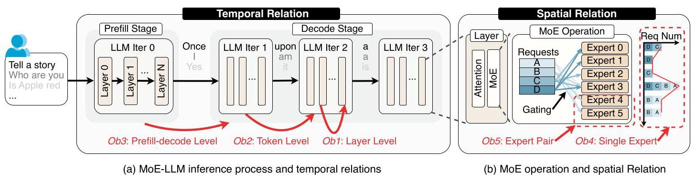

Figure 3. Inference process of MoE LLMs and the categorization method for our proposed data-centric profiling approach.

> 
图3. MoE LLMs的推理过程以及我们提出的以数据为中心的性能剖析方法的分类方法。

## B. Prior MoE Serving Systems

The MoE mechanism constitutes the primary source of data movement overhead in modern serving systems. As illustrated in Figure 2 take DeepSeek V3 as an example, MoE-related data movement (MoE All-to-All and MoE Weights) dominates the overhead across different serving configurations, accounting for 60%-90% of total latency under 4K sequence length. To address this , existing research has developed numerous system-level solutions targeting different performance and cost objectives. Edge systems like MoE-Lightning [31] and CoServe [32] employ CPU memory offloading techniques to address GPU memory capacity constraints, while cloud systems such as Comet [9] and MegaScale-Infer [15] target multi-GPU systems and address GPU-GPU communications in MoE for higher throughput. Novel hardware architectures like Duplex [33] explore processing-in-memory to accelerate data movement in MoE LLMs.

> 
MoE机制构成了现代推理系统中数据移动开销的主要来源。如图2所示，以DeepSeek V3为例，与MoE相关的数据移动（MoE All-to-All和MoE权重）在不同推理配置中占据了开销的主导地位，在4K序列长度下占总延迟的60%-90%。为解决这一问题，现有研究已开发了许多系统级解决方案，针对不同的性能和成本目标。边缘系统，如MoE-Lightning[31]和CoServe[32]，采用CPU内存卸载技术来解决GPU内存容量限制问题；而云系统，如Comet[9]和MegaScale-Infer[15]，则针对多GPU系统并解决MoE中的GPU间通信问题，以实现更高吞吐量。Duplex[33]等新型硬件架构探索了内存处理技术，以加速MoE LLM中的数据移动。

However, these prior studies employ a system-centric methodology when optimizing for MoE LLMs. Namely, they inherently focus on a specific platform and the corresponding data movement patterns of MoE in such platform (e.g., CPU-GPU, multi-GPU, ML accelerators). As a result, they propose deployment-specific optimizations that may not generalize across different serving platforms, and their insights are often a slice of the overall inherent patterns in MoE LLMs.

> 
然而，这些先前的研究在优化混合专家（MoE）大语言模型时，采用了以系统为中心的方法。具体而言，它们从根本上聚焦于特定平台以及该平台上MoE相应的数据流动模式（如CPU-GPU、多GPU、机器学习加速器）。因此，它们提出的优化方案往往针对特定部署环境，可能无法推广到不同的服务平台，且其洞察通常仅揭示了MoE大语言模型整体固有模式的一个侧面。

In this work, we flip the process and adopt a model-centric strategy by conducting system-independent profiling to extract system-agnostic insights about MoE data movement patterns. These insights are therefore broadly applicable across various platforms, providing a foundation for optimization strategies that transcend specific system implementations.

> 
在本工作中，我们反转了这一过程，采用以模型为中心的策略，通过进行与系统无关的性能剖析，提取关于MoE数据移动模式的系统无关洞见。因此，这些洞见广泛适用于各种平台，为超越特定系统实现的优化策略奠定了基础。

### III.MOE PROFILING AND SYSTEM INSIGHTS

In this section, we conduct a data-movement-centric profiling of the expert selection behavior in four state-of-the-art MoE models: Deepseek V3 (671B), Llama4-Maverick- 128E (402B), Qwen3-235B (235B), and Kimi K2 (1000B). All results are averaged over more than 24,000 requests.

> 
在本节中，我们对四种最先进的 MoE 模型中的专家选择行为进行了以数据移动为中心的剖析：Deepseek V3 (671B)、Llama4-Maverick- 128E (402B)、Qwen3-235B (235B) 和 Kimi K2 (1000B)。所有结果基于超过 24,000 个请求取平均。

## A. Categorization Methodology

As in Figure 3, we categorize MoE expert selection profiling results into two categories: temporal and spatial relations.

> 
如图3所示，我们将MoE专家选择分析结果分为两类：时间关系和空间关系。

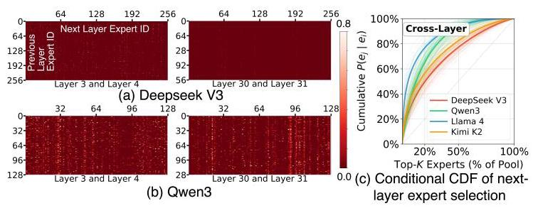

Figure 4. Cross-layer expert correlation. (a, b) Joint co-activation heatmaps between layers $N$ and $N + 1$ in DeepSeek-V3 and Qwen3. (c) Conditional CDF $P\left( {{e}_{j} \mid  {e}_{i}}\right)$ for each layer’s top-1 expert.

> 
图 4. 跨层专家相关性。(a, b) DeepSeek-V3 和 Qwen3 中层 $N$ 与层 $N + 1$ 之间的联合共激活热图。(c) 每层 top-1 专家的条件 CDF $P\left( {{e}_{j} \mid  {e}_{i}}\right)$。

Temporal relations capture time-dependent expert selection patterns where current choices inform future selections. These patterns enable single-unit strategies that optimize data movement for individual units through prefetching, caching, and data migration. For example, in multi-chiplet GPU systems, caching experts in local DRAM after remote fetches significantly reduces inter-unit communication. To exploit temporal predictability, we analyze expert selection at multiple time scales shown in Figure 3(a): layer-level, token-level, and prefill-decode-level patterns.

> 
时间关系捕捉了与时间相关的专家选择模式，其中当前的选择会影响未来的选择。这些模式使得单单元策略能够通过预取、缓存和数据迁移来优化单个单元的数据移动。例如，在多芯粒 GPU 系统中，远程获取后将专家缓存于本地 DRAM 能显著降低单元间通信。为了利用时间可预测性，我们在图 3(a) 所示的多个时间尺度上分析了专家选择：层级、令牌级和预填充-解码级模式。

Spatial relations capture how expert activations are distributed across compute units within a given time window. This distributional information enables multi-unit strategies that optimize expert placement and workload balancing across the system, reducing data movement and preventing bottlenecks. We classify spatial relations into single-expert activation imbalance and expert-pair co-activation affinity as shown in Figure 3(b), and investigate how task types influence these patterns to inform system-level optimization.

> 
空间关系捕捉在给定时间窗口内专家激活如何分布在计算单元之间。这种分布信息使得多单元策略能够优化专家放置和工作负载在整个系统中的平衡，减少数据移动并防止瓶颈。我们将空间关系分类为单专家激活不平衡和专家对共激活亲和性，如图 3(b) 所示，并研究任务类型如何影响这些模式，为系统级优化提供信息。

## B. Temporal Relations

As shown in Figure 3(a), we classify the temporal relations of expert selection into three categories, arranged in order of increasing time scale. At the layer level, we examine the relationship between two adjacent model layers. At the token level, we focus on the same model layer across two adjacent tokens. At the stage level, we analyze the relationship between the prefill stage and the decode stage.

> 
如图 3(a) 所示，我们将专家选择的时间关系划分为三个类别，并按时间尺度递增的顺序排列。在层级别，我们考察相邻两个模型层之间的关系。在 Token 级别，我们重点关注跨相邻两个 Token 的同一模型层。在阶段级别，我们分析预填充阶段与解码阶段之间的关系。

## 1) Layer-Level Correlation: (Ob1)

As shown in Figure 4 (a) and (b), we present heatmaps for Deepseek and Qwen illustrating expert selection relationships across adjacent layers. Each pixel in the heatmap displays the conditional probability of selecting expert $j$ in the next layer given that expert $i$ was activated in the previous layer, with bright colors indicating higher probabilities.

> 
如图 4 (a) 和 (b) 所示，我们展示了 Deepseek 和 Qwen 的热力图，以说明相邻层间的专家选择关系。热力图中的每个像素显示了在上一层激活专家 $i$ 的条件下，下一层选择专家 $j$ 的条件概率，亮色表示较高的概率。

Figure 5. Cross-token expert correlation. (a, b, c) Joint co-activation heatmaps between tokens $t$ and $t + 1$ in DeepSeek-V3, Llama 4, and Qwen3. (d) Conditional CDF for each layer's top-1 expert: top ${20}\%$ of the next-token expertalready covers most of probability mass.

> 
图 5. 跨 token 专家相关性。(a, b, c) DeepSeek-V3、Llama 4 与 Qwen3 中 token $t$ 与 $t + 1$ 之间的联合共激活热力图。(d) 每层 top-1 专家的条件累积分布函数：top ${20}\%$ 的下一个 token 专家已覆盖大部分概率质量。

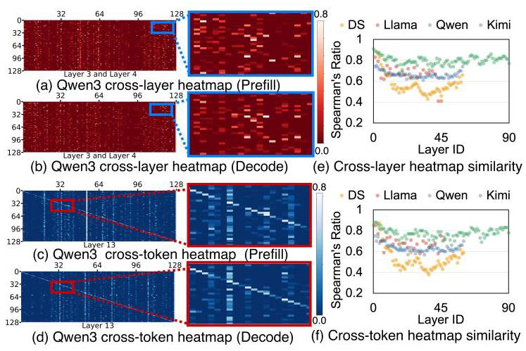

Figure 6. Expert activation patterns remain consistent across prefill and decode stages for both (a, b) cross-layer heatmap and (c, d) cross-token heatmaps. Spearman’s ratio quantified in (e, f) shows a strong relation $\left( { \geq  {0.7}}\right)$ .

> 
图6. 专家激活模式在预填充和解码阶段保持一致，(a, b)跨层热力图和(c, d)跨令牌热力图均如此。(e, f)中量化后的斯皮尔曼比率显示出强相关性 $\left( { \geq  {0.7}}\right)$ 。

The heatmaps reveal clear cross-layer correlations with white dots highlighting specific expert pairs with significantly higher selection probabilities across adjacent layers. However, correlation patterns vary across layers within the same model and differ between models due to architectural variations. For instance, patterns between layers 3-4 differ from those between layers 30-31. Qwen3's notably brighter heatmap indicates stronger cross-layer correlations than Deepseek. Beyond the white dots, there are also consistent bright vertical lines, suggesting certain experts are frequently chosen regardless of previous layer selections. These patterns indicate generally popular experts, analyzed further in Sec. III-C1

> 
热力图清晰地揭示了跨层相关性，其中白点突出显示了特定的专家对，这些专家对在相邻层之间的选择概率显著较高。然而，同一模型内不同层之间的相关性模式会变化，并且因架构差异而在不同模型间有所不同。例如，层3-4之间的模式与层30-31之间的模式不同。Qwen3的热力图明显更亮，表明其跨层相关性比Deepseek更强。除了白点之外，还存在持续出现的明亮竖线，这表明某些专家无论上一层的选择如何都会被频繁选中。这些模式表明存在普遍受欢迎的专家，将在第III-C1节进一步分析。

To quantify these relationships, we analyze the conditional CDF $P\left( {{e}_{j} \mid  {e}_{i}}\right)$ in Figure 4(c): the top ${20}\%$ of next-layer candidates already cover ${50}\% ,{65}\% ,{77}\%$ , and 56% of the conditional probability mass for DeepSeek-V3, Qwen3, Llama 4 and Kimi K2, respectively. This reveals strong, model-dependent cross-layer correlations, with Llama4 showing the strongest effect and Deepseek the weakest.

> 
为量化这些关系，我们分析了图4(c)中的条件累积分布函数$P\left( {{e}_{j} \mid  {e}_{i}}\right)$：顶部${20}\%$的下一层候选答案已分别覆盖DeepSeek-V3、Qwen3、Llama 4和Kimi K2条件概率质量的${50}\% ,{65}\% ,{77}\%$和56%。这揭示了强烈的、模型依赖的跨层相关性，其中Llama4效应最强，而Deepseek最弱。

## 2) Token-Level Correlation: (Ob2)

We examine expert selection relations for the same layer between adjacent tokens in Figure 5 Each pixel in the heatmap displays the conditional probability of selecting expert $j$ in the next token given that expert $i$ was activated in the previous token, with bright colors indicating higher probabilities.

> 
我们在图5中考察了相邻 token 之间同一层的专家选择关系。热力图中的每个像素显示了在给定前一个 token 激活了专家 $i$ 的条件下，选择下一个 token 中专家 $j$ 的条件概率，明亮的颜色表示较高的概率。

Similar to layer-level patterns, cross-token heatmaps exhibit white dots, bright vertical lines, and variation across layers and models, indicating correlations between adjacent tokens. However, token-level relations reveal a common pattern appearing across all models: the bright diagonal line that indicates the tendency to select the same expert across adjacent tokens. This diagonal pattern emerges predominantly in higher layers (17 and 43) but not in lower layers (1 and 3), regardless of models.

> 
与层级模式类似，跨词元热力图呈现出白点、明亮垂直线以及在不同层和模型间的变化，这表明相邻词元之间存在相关性。然而，词元级关系揭示了一个在所有模型中普遍出现的模式：明亮的对角线，它表明相邻词元倾向于选择相同的专家。无论模型如何，这种对角线模式主要出现在较高层（17和43），而非较低层（1和3）。

We apply the same conditional-CDF analysis to the token-level relation. As shown in Figure 5(d), the top 20% of next-token expert candidates cover ${47}\% ,{62}\% ,{80}\%$ , and ${53}\%$ of the cumulative conditional probability in DeepSeek-V3, Qwen3, Llama 4, and Kimi K2, respectively, averaged across all MoE layers. The correlation is again strongest in Llama 4 and weakest in DeepSeek-V3.

> 
我们将相同的条件CDF分析应用于词元级别的关系。如图5(d)所示，在DeepSeek-V3、Qwen3、Llama 4和Kimi K2中，前20%的下一个词元专家候选者分别覆盖了 ${47}\% ,{62}\% ,{80}\%$ 和 ${53}\%$ 的累积条件概率，该结果平均了所有MoE层。相关性再次在Llama 4中最强，在DeepSeek-V3中最弱。

## 3) Prefill-Decode-Level Correlation: (Ob3)

Building on the layer-level and token-level relations, we observe notable similarities in expert selection patterns between prefill and decode stages. Comparing heatmaps across stages in Figure 6(a)(b)(c)(d), we find similar distributions of bright dots, indicating that expert pair heatmap during prefill and decode shares similarities. This cross-stage consistency suggests us that the prefill-collected information can guide initial decode steps until sufficient decode data accumulates.

> 
基于层级和token级关系，我们观察到预填充阶段与解码阶段在专家选择模式上存在显著相似性。通过对比图6(a)(b)(c)(d)中各阶段的热力图，我们发现亮点分布相似，表明预填充和解码阶段的专家对热力图具有一致性。这种跨阶段的一致性提示我们，预填充阶段收集的信息可以指导初始解码步骤，直至积累足够的解码数据。

To quantify this similarity, we compute Spearman's ratio ( $\rho$ ) across all model layers, comparing prefill and decode heatmaps. Spearman’s Ratio $\rho$ measures monotonic relationships between variables, ranging from -1 (perfect negative correlation) to 1 (perfect positive correlation). Generally, $\left| \rho \right|  >$ 0.7 indicates strong correlation, ${0.4} < \left| \rho \right|  \leq  {0.7}$ indicates moderate correlation, and $\left| \rho \right|  \leq  {0.4}$ suggests weak correlation [34]. The results in Figure 6(e)(f) show that most layers demonstrate strong correlation, while a few show moderate correlation. This makes it possible to predict decode-stage expert selection with prefill-stage data.

> 
为了量化这种相似性，我们计算了所有模型层的斯皮尔曼比率（$\rho$），比较预填充与解码热图。斯皮尔曼比率$\rho$衡量变量间的单调关系，范围从-1（完全负相关）到1（完全正相关）。通常，$\left| \rho \right|  >$ 0.7 表示强相关，${0.4} < \left| \rho \right|  \leq  {0.7}$ 表示中等相关，$\left| \rho \right|  \leq  {0.4}$ 表示弱相关[34]。图6(e)(f)的结果显示，大多数层表现出强相关，而少数层表现出中等相关。这使得利用预填充阶段数据预测解码阶段的专家选择成为可能。

---

${}^{1}$ Llama 4 inserts dense FFN layers between MoE layers, so we pair adjacent MoE layers ( $N$ and $N + 2$ ).

> 
${}^{1}$ Llama 4 在 MoE 层之间插入密集 FFN 层，因此我们将相邻的 MoE 层（$N$ 和 $N + 2$）配对。

---

Figure 7. (a) Expert frequency distributions between prefill and decode stages exhibit similarity. (b) The most popular experts in the two stages overlap substantially. (c) All models show a high Spearman correlation between prefill and decode expert frequencies.

> 
图7. (a) 预填充阶段与解码阶段的专家频率分布表现出相似性。(b) 这两个阶段中最热门的专家大量重叠。(c) 所有模型都显示出预填充与解码专家频率之间较高的斯皮尔曼相关性。

Beyond expert-pair heatmaps, we also identify prefill-to-decode correlation at the single-expert frequency level. As shown in Figure 7(a), the frequency distributions of prefill and decode stages are substantially similar, though some discrepancies exist among low-frequency experts. To examine the most popular experts, we report the overlap rate of top experts between stages in Figure 7(b): the top-5 prefill experts cover around ${60}\%$ of the top-5 decode experts, rising to 75% and 90% for top-10 and top-20, respectively. This indicates that prefill information can help predict the hottest decode experts. The cross-model Spearman correlation in Figure 7(c) confirms this relationship holds across all four models.

> 
除了专家对热图之外，我们还在单个专家频率层面识别出预填充到解码的相关性。如图7(a)所示，预填充和解码阶段的频率分布基本相似，尽管低频专家之间存在一些差异。为考察最热门的专家，我们在图7(b)中报告了各阶段前K个专家的重叠率：预填充阶段的前5名专家覆盖了约${60}\%$的解码阶段前5名专家，而对于前10名和前20名，该比例分别上升至75%和90%。这表明预填充信息有助于预测最热门的解码专家。图7(c)中的跨模型斯皮尔曼相关性证实，这种关系在所有四个模型中都成立。

4) System Insights from Temporal Relation: The observed temporal relations in expert selection motivate us to design fine-grained, dynamic strategies on every single unit to reduce data movement. For example, when expert weights are read from remote memory, such as remote DRAM in multi-chiplet systems, or CXL extension memory in memory-disaggregated systems, caching, migration, and prefetching strategies can be deployed to reduce data movement.

> 
4) 来自时间关系的系统洞察：在专家选择中观察到的时间关系促使我们设计针对每个单元的细粒度、动态策略，以减少数据移动。例如，当从远程内存（如多芯粒系统中的远程DRAM，或内存解耦系统中的CXL扩展内存）读取专家权重时，可部署缓存、迁移和预取策略来减少数据移动。

★Insight 1: Prefill-data-driven prediction (Db3). Leverage the expert selection trace from the prefill stage to predict expert selection during the decoding stage.

> 
★洞察1：预填充数据驱动的预测（Db3）。利用预填充阶段的专家选择轨迹，预测解码阶段的专家选择。

Empirical analysis shows that expert selection patterns during prefill exhibit strong similarity to those during decode. Thus, expert selection information collected in the prefill phase can serve as a valuable reference for predicting decode-phase selections, particularly at the beginning of decoding when only a few tokens have been generated and historical context is scarce. Our section VI demonstrates how prefill information can guide expert placement during decode. This is especially relevant in modern PD-disaggregated serving systems, where the prefill and decode stages execute on separate machines.

> 
实证分析表明，预填充阶段的专家选择模式与解码阶段表现出高度相似性。因此，预填充阶段收集的专家选择信息可作为预测解码阶段选择的重要参考，尤其在解码初始仅生成少量令牌且历史上下文稀缺时。我们的第六节展示了预填充信息如何指导解码期间专家的放置。这在现代的预填充-解码分离服务系统中尤为相关，其中预填充与解码阶段在分离的机器上执行。

Figure 8. Single-expert spatial relation analysis of Llama4 layer 7 shows: (a) non-uniform expert activation distribution; (b) expert selection strongly correlates with task type; (c) expert activation patterns shift significantly when language changes while content remains identical.

> 
图8. Llama4第7层单专家空间关系分析显示：(a) 专家激活分布不均匀；(b) 专家选择与任务类型强相关；(c) 语言变化而内容相同的情况下，专家激活模式发生显著改变。

★Insight 2: Cross-hierarchy memory management Ob1, Ob2). Token- and layer-level temporal relations enable dynamic expert prefetching and caching across memory hierarchies.

> 
★见解2：跨层次内存管理 Ob1, Ob2）。标记级和层级时间关系使得跨内存层次的动态专家预取和缓存成为可能。

Layer-level and token-level temporal relations are similar in definition but differ in reuse distance, making them suitable for different levels of the memory hierarchy. Layer-level relations exhibit short reuse distances because consecutive MoE layers execute in immediate succession, while token-level relations incur longer reuse distances because a new token is generated only after traversing all layers.

> 
层级时序关系与令牌级时序关系在定义上相似，但在重用距离上有所不同，这使得它们分别适用于内存层次结构的不同级别。层级关系表现出较短的重用距离，因为连续的MoE层会立即依次执行；而令牌级关系则产生较长的重用距离，因为只有在遍历所有层之后才会生成新的令牌。

This maps naturally onto the multi-level memory hierarchies in modern serving systems. For example, in multi-chiplet architectures, each die contains both an LLC and local DRAM, forming a two-tier hierarchy. The faster but smaller LLC is well-suited to managing experts with short reuse distances (layer-level), while the larger local DRAM accommodates experts with longer reuse distances (token-level). Accordingly, we can leverage layer-level relations for LLC management and token-level relations for DRAM management.

> 
这自然地映射到现代服务系统中的多级内存层次结构。例如，在多芯粒架构中，每个裸片都包含LLC和本地DRAM，形成二级层次结构。更快但更小的LLC非常适合管理具有短重用距离（层级）的专家，而更大的本地DRAM则容纳具有更长重用距离（令牌级）的专家。因此，我们可以利用层级关系进行LLC管理，并利用令牌级关系进行DRAM管理。

This principle generalizes to other system configurations: CXL-based systems with local DRAM and remote CXL memory, SSD offloading systems with DRAM and flash storage, and PIM systems with local and remote DRAM dies. In each case, layer-level relations guide the faster memory tier and token-level relations guide the slower one.

> 
该原理可推广至其他系统配置：具有本地DRAM和远程CXL内存的基于CXL的系统，具有DRAM和闪存存储的SSD卸载系统，以及具有本地和远程DRAM芯片的PIM系统。在每种情况下，层级别关系指导更快的内存层级，而令牌级别关系指导较慢的内存层级。

## C. Spatial Relation

As shown in Figure 3(b), we analyze spatial patterns in expert selection for both single-expert activation imbalance and expert pair co-activation affinity. For single experts, we examine statistical skewness and the factors affecting each expert's activation. For expert pairs, we analyze co-activation properties across all two-expert combinations.

> 
如图3(b)所示，我们分析了专家选择中的空间模式，包括单专家激活不平衡和专家对共激活亲和性两方面。对于单专家，我们考察统计偏度以及影响每个专家激活的因素。对于专家对，我们分析所有两专家组合的共激活特性。

## 1) Single Expert Activation Imbalance: (Ob4)

We examine expert selection frequency at each layer, presenting results for layer 7 of Llama4 in Figure 8 We observe pronounced skewness where a subset of experts is activated over 16 times more frequently than average. This workload imbalance suggests system designs should duplicate or decentralize frequently used experts.

> 
我们分析了每一层的专家选择频率，并在图8中展示了Llama4第7层的结果。我们观察到明显的偏斜，其中一部分专家的激活频率超过平均水平的16倍。这种工作负载不均衡表明，系统设计应将频繁使用的专家进行复制或分散化处理。

To investigate selection patterns across different tasks, we analyze all 57 MMLU subjects spanning diverse fields, including biology, history, and math, etc [35]. Figure 8(b) shows the top 10 most popular experts for each subject. Horizontal bright lines indicate certain experts are consistently activated regardless of subject, while remaining popular experts vary significantly between subjects, demonstrating both overlap and distinction in task-based expert selection.

> 
为了研究不同任务中的选择模式，我们分析了涵盖生物学、历史学和数学等多个领域的全部57个MMLU学科[35]。图8(b)展示了每个学科排名前10的最热门专家。水平亮线表明，无论学科如何，某些专家始终被激活，而其余热门专家则在不同学科间差异显著，这显示了基于任务的专家选择既有重叠又有区别。

We further examine task impact using the Chinese version of MMLU in MMLU Pro [36] with identical questions but different languages. Figure 8(c) reveals distinctly different patterns: although 5-6 experts remain popular across subjects, only two overlap with English MMLU's most frequently selected experts. This confirms that task characteristics, including language, significantly influence expert selection, enabling task-aware serving systems that optimize expert distribution to balance workloads and reduce data movement.

> 
我们使用MMLU Pro [36]中的中文版MMLU，以相同问题但不同语言来进一步考察任务影响。图8(c)显示了截然不同的模式：尽管5-6个专家在各学科中依然热门，但仅有两位专家与英文MMLU最常被选中的专家重合。这证实了包括语言在内的任务特征显著影响专家选择，从而能够实现任务感知服务系统，优化专家分布以平衡工作负载并减少数据移动。

## 2) Expert Pair Co-activation Affinify: (Ob5)

Beyond single expert patterns, we observe spatial relations for expert pairs where certain experts are more likely to be co-activated. We present co-activation heatmaps in Figure 9(a)(b), where both axes indicate expert IDs. Each pixel represents an expert pair with values showing co-activation frequency normalized by theoretical random selection probability: $p = \; \frac{2}{n\left( {n - 1}\right) }$ , where $n$ is the number of experts.

> 
除了单一专家模式，我们还观察到专家对之间的空间关系，其中某些专家更有可能被共同激活。我们在图9(a)(b)中展示了共同激活热力图，两个坐标轴均表示专家ID。每个像素代表一对专家，其值显示了通过理论随机选择概率归一化后的共同激活频率：$p = \; \frac{2}{n\left( {n - 1}\right) }$ ，其中 $n$ 是专家的数量。

Bright dots appear with probabilities 20-40 times higher than theoretical values, indicating strong co-activation tendencies. All heatmaps exhibit central symmetry since expert pair $\left( {i, j}\right)$ equals $\left( {j, i}\right)$ . In Deepseek’s heatmap Figure 9(a), frequently activated pairs lie between red lines forming bright squares, reflecting Deepseek's routing restriction where tokens are routed only to adjacent nodes to reduce communication overhead. This suggests the potential of separating co-activated expert pairs to balance workload.

> 
亮点出现的概率比理论值高出20至40倍，表明存在强烈的共激活倾向。所有热图均呈现中心对称性，因为专家对$\left( {i, j}\right)$等同于$\left( {j, i}\right)$。在DeepSeek的热图图9(a)中，频繁激活的专家对位于红线之间形成明亮方块，这反映了DeepSeek的路由限制，即token仅被路由至相邻节点以减少通信开销。这表明分离共激活专家对以平衡工作负载的潜力。

We quantify this relation by in Figure 9(c). The top ${10}\%$ of expert pairs account for 60-80% of total activations, indicating strong skewness. This suggests the potential for separating co-activated expert pairs to balance the workload. We only analyze Deepseek and Qwen since Llama selects one expert per MoE layer, eliminating co-activation relations.

> 
我们在图9(c)中量化了这一关系。排名前${10}\%$的专家对占据了总激活次数的60-80%，表明存在强烈的偏斜。这提示了分离共激活的专家对以平衡工作负载的潜力。我们仅分析了Deepseek和Qwen，因为Llama在每个MoE层中仅选择一个专家，从而消除了共激活关系。

3) System Insights from Spatial Relation: Spatial Relation enables coarse-grained, static strategies to address workload imbalance across the system. These strategies could be applied at system startup or during periodic redistribution (e.g., every 10 minutes) through appropriate task distribution.

> 
3) 基于空间关系的系统洞察：空间关系通过适当的任务分配，赋能粗粒度、静态策略以应对系统内的工作负载不平衡。这些策略可在系统启动时或在周期性重分布（例如每10分钟）期间应用。

★Insight 3: Expert-placement-aware workload distribution (Ob4 Ob5). Employ expert placement information to design workload-balanced task distribution strategies.

> 
★洞察 3：专家放置感知的工作负载分配 (Ob4 Ob5)。利用专家放置信息设计工作负载均衡的任务分配策略。

Expert placement in serving systems can change dynamically due to expert migration strategies. Therefore, when allocating workload to system units, expert placement should be considered for better workload balance. Besides, the design space for task allocation could be enlarged with emerging new systems. Traditional multi-GPU systems tend to allocate experts to local GPUs to avoid cross-unit communication. However, in multi-chiplet GPUs, we can consider allocating tasks to remote dies for better workload balance as inter-unit communication becomes faster.

> 
在服务系统中，专家放置会因专家迁移策略而动态变化。因此，向系统单元分配负载时，应考虑专家放置以实现更好的负载均衡。此外，随着新兴系统的出现，任务分配的设计空间得以扩大。传统多GPU系统倾向于将专家分配给本地GPU以避免跨单元通信。然而，在多芯粒GPU中，由于跨单元通信变得更快，我们可以考虑将任务分配到远程裸片以获得更好的负载均衡。

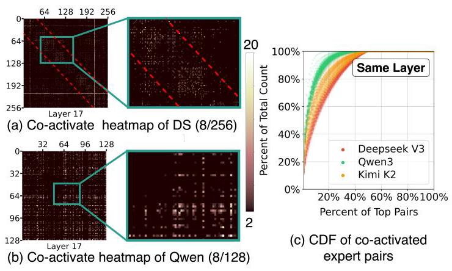

Figure 9. Expert-pair co-activation affinity. (a)(b) Heatmaps for DeepSeek and Qwen. (c) CDF of co-activated expert pairs across all layers: a small fraction of expert pairs accounts for the majority of co-activations.

> 
图9. 专家对共激活亲和性。(a)(b) DeepSeek和Qwen的热图。(c) 所有层中共激活专家对的累积分布函数：一小部分专家对占据了大部分共激活。

★Insight 4: Popular expert decentralization (Db4). Duplicate or decentralize frequently used experts to balance workloads.

> 
★洞察 4：热门专家去中心化 (Db4)。复制或去中心化频繁使用的专家以平衡工作负载。

Expert skewness causes workload imbalance and suboptimal resource utilization. Duplicating popular experts across multiple compute units distributes load more evenly. Additionally, avoiding co-location of highly popular experts in the same unit further enhances workload balance.

> 
专家偏斜导致负载不均衡和资源利用效率低下。将热门专家复制到多个计算单元中可以更均匀地分配负载。此外，避免将高度热门的专家放在同一单元中，可以进一步增强负载平衡。

★Insight 5: Expert-pair separation (Ob5). Separate frequently co-activated expert pairs to maximize parallelism.

> 
★见解5：专家对分离（Ob5）。分离频繁共激活的专家对，以最大化并行性。

Certain experts are frequently activated simultaneously, exhibiting strong co-activation patterns. Assigning these co-activated expert pairs to different compute units maximizes hardware parallelism and prevents workload concentration on specific units. However, separation also introduces cross-unit communication overhead. The effectiveness depends on system topology and batch size, requiring careful trade-off between parallelism benefits and communication costs.

> 
某些专家经常被同时激活，表现出强烈的共激活模式。将这些共激活的专家对分配给不同的计算单元，可以最大化硬件并行性，并防止工作负载集中在特定单元上。然而，这种分离也会引入跨单元通信开销。其有效性取决于系统拓扑和批次大小，需要在并行收益和通信成本之间进行仔细权衡。

★Insight 6: Workload-aware serving system (Ob4). Leverage the workload information, like task type and language, to make expert migration prior to serving.

> 
★洞察6：工作负载感知的服务系统（Ob4）。利用任务类型和语言等工作负载信息，在服务前进行专家迁移。

Hot experts vary by task and language. English queries, for instance, activate different expert subsets than Chinese queries. Providing task metadata during serving enables proactive expert placement: when workloads are predominantly English, systems can pre-duplicate or reassign English-relevant experts, reducing communication and balancing loads. This task-to-expert mapping requires only one-time offline profiling per model and can be reused throughout deployment, making the approach practical and efficient.

> 
热门专家因任务和语言而异。例如，英语查询激活的专家子集与中文查询不同。在服务期间提供任务元数据可以实现主动专家放置：当工作负载主要为英语时，系统可以预复制或重新分配与英语相关的专家，减少通信并平衡负载。这种任务到专家的映射仅需对每个模型进行一次离线分析，即可在整个部署过程中重复使用，使得该方法实用且高效。

## IV. CASE STUDY 1: WAFER-SCALE GPU ARCHITECTURE DESIGN FOR MOE SERVING

In this section, we adopt future GPU architecture design as a use case to validate our proposed insights. We follow Insight 3 to design a task allocation algorithm and leverage the temporal relation insights (Insight 1 and Insight 2) to build a data-driven predictor. We also make slight architectural modifications to support the proposed strategies.

> 
在本节中，我们以未来GPU架构设计为用例，验证我们提出的洞察。我们遵循洞察3设计任务分配算法，并利用时序关系洞察（洞察1和洞察2）构建数据驱动的预测器。我们还进行了微小的架构修改以支持所提出的策略。

## A. Trend of Future GPU Architecture

GPU vendors are increasingly adopting multi-chiplet architectures to overcome single-die performance limitations. As Moore's Law approaches its limits [37] and single-die size remains constrained by photomask dimensions (800- 1,000 ${\mathrm{{mm}}}^{2}$ ), advanced packaging technologies like TSMC's CoWoS [38], Samsung's X-Cube [39], and Intel's EMIB [40] enable multiple chiplets within a single package. Leading vendors have adopted such designs: AMD's MI300 [22] integrates eight compute chiplets, NVIDIA's Blackwell features two chiplets [24], and upcoming Rubin expects four [41].

> 
GPU 供应商越来越多地采用多芯粒架构，以突破单芯片的性能限制。随着摩尔定律逼近极限[37]，且单芯片尺寸仍受光罩尺寸（800- 1,000 ${\mathrm{{mm}}}^{2}$）的制约，诸如台积电的 CoWoS [38]、三星的 X-Cube [39] 以及英特尔的 EMIB [40] 等先进封装技术使得单封装内集成多个芯粒成为可能。领先的供应商已采用此类设计：AMD 的 MI300 [22] 集成了八个计算芯粒，NVIDIA 的 Blackwell 配备了两个芯粒 [24]，而即将推出的 Rubin 预计将集成四个芯粒 [41]。

This trend is evolving toward wafer-scale systems [42]. TSMC's System-on-Wafer (SoW) technology accommodates up to 24 compute dies and 96 HBM dies on a single wafer, exceeding 200,000 ${\mathrm{{mm}}}^{2}$ [43]. As shown in Figure 10(a), a typical wafer-scale multi-chiplet GPU consists of multiple units, each containing a GPU die and several HBM dies interconnected in a mesh topology. Such systems contain over 3 TB of HBM and PFLOPS-level computing power, supporting extremely large models and batch sizes.

> 
这一趋势正在向晶圆级系统演进[42]。台积电的系统集成晶圆（SoW）技术可在单一晶圆上容纳多达24个计算芯片和96个HBM芯片，面积超过200,000 ${\mathrm{{mm}}}^{2}$[43]。如图10(a)所示，典型的晶圆级多芯粒GPU由多个单元组成，每个单元包含一个GPU芯片和数个以网格拓扑互连的HBM芯片。此类系统拥有超过3 TB的HBM和PFLOPS级计算能力，支持超大模型与批量规模。

The TSMC SoW technology shown in Figure 10(b) connects each GPU die to local HBM dies through local-silicon interconnects (LSI) [44], with adjacent GPU dies communicating via LSI vertically or XSR SerDes links horizontally. Although LSI and SerDes both provide terabit-level bandwidth, inter-GPU-die communication remains the primary bottleneck. Remote data access requires multiple hops across die-to-die links, resulting in high latency. Simultaneous remote HBM access by multiple dies creates bandwidth contention and traffic congestion, further degrading performance.

> 
图10(b)所示的台积电SoW技术通过局部硅互连（LSI）将每个GPU芯片与本地HBM芯片相连[44]，相邻GPU芯片之间则通过垂直方向的LSI或水平方向的XSR SerDes链路进行通信。尽管LSI和SerDes均能提供太比特级带宽，但GPU芯片间的通信仍是主要瓶颈。远程数据访问需要跨越芯片间链路进行多次跳转，导致高延迟。多个芯片同时远程访问HBM会引发带宽竞争和流量拥塞，进一步降低性能。

## B. Background on Wafer-scale GPU Programming model

The programming model of future wafer-scale chip remains an open question, but two major candidates have emerged: the multi-GPU-like and the single-GPU-like programming model.

> 
未来晶圆级芯片的编程模型仍然是一个开放性问题，但已经出现了两个主要的候选方案：类似多GPU和类似单GPU的编程模型。

Multi-GPU-like programming model. WSC-LLM [26] and MoEntwine [45] adopt a multi-GPU-like programming model that exposes the entire wafer as a multi-GPU system. Programmers can program the wafer similarly to a conventional multi-GPU system, with the key difference being the 2D mesh topology where each die communicates directly only with its neighbors. While this approach offers fine-grained control over individual dies and enables flexible software strategies, it diverges from current industry trends. For instance, although Blackwell and Rubin both integrate two compute dies, NVIDIA exposes no toolchain for fine-grained die-level control. Multi-Instance GPU (MIG) can partition a multi-die GPU into independent GPU instances, making each die act independently, but the high-speed D2D link is disabled in this mode [46], forcing inter-die communication through the 10-100× slower NVLink or PCIe and negating the benefit of multi-die packaging. Therefore, extending this programming model to wafer-scale GPUs would require substantial architectural changes to current GPU designs, including redesigning the D2D/C2C controller workflow and distributed LLC structure, making it infeasible in the near term.

> 
类多GPU编程模型。WSC-LLM [26] 和 MoEntwine [45] 采用了一种类多GPU的编程模型，将整个晶圆视为一个多GPU系统。程序员可以像对传统多GPU系统一样对晶圆进行编程，关键区别在于其2D网格拓扑结构，每个芯片仅与相邻芯片直接通信。尽管这种方法提供了对单个芯片的细粒度控制，并支持灵活的软件策略，但它与当前的行业趋势存在分歧。例如，虽然 Blackwell 和 Rubin 都集成了两个计算芯片，但 NVIDIA 并未提供用于细粒度芯片级控制的工具链。多实例GPU（MIG）可以将多芯片GPU划分为独立的GPU实例，使每个芯片独立运行，但在该模式下高速芯片间互连（D2D）链路会被禁用 [46]，迫使芯片间通信通过慢10–100倍的 NVLink 或 PCIe 进行，从而抵消了多芯片封装的优势。因此，将这种编程模型扩展到晶圆级GPU需要对当前GPU设计进行大幅架构改造，包括重新设计 D2D/C2C 控制器工作流程和分布式末级缓存结构，这使得其在短期内难以实现。

Single-GPU-like programming model. HDPAT [47], Hec-ton [48], and our work adopt a single-GPU-like programming model that exposes the entire wafer as a unified GPU, fully abstracting the multi-die topology and data placement from software so that the programming experience is identical to that of a monolithic GPU. We adopt this model for two key reasons. First, it aligns with commercial multi-chiplet GPUs such as Blackwell and Rubin, ensuring practical industry relevance. Second, it eliminates the programming complexity of explicit inter-die communication management through libraries such as NCCL or NVSHMEM. However, this programming simplicity shifts the optimization burden entirely to the hardware. Given the inherently distributed architecture, local versus remote data access costs vary by up to ${15} \times$ , yet the abstraction prevents programmers from controlling cross-die data movement. Consequently, architecture-level optimizations become critical to achieve high hardware utilization.

> 
模拟单体GPU的编程模式。HDPAT [47]、Hecton [48]与本研究均采用模拟单体GPU的编程模式，将整片晶圆呈现为统一GPU，从软件层面完全抽象化多芯粒拓扑结构与数据布局，使编程体验与单体GPU无异。我们采用此模式基于两大关键因素：其一，这与Blackwell、Rubin等商用多芯粒GPU保持一致，确保实际产业相关性；其二，它消除了通过NCCL或NVSHMEM等库进行显式芯粒间通信管理的编程复杂性。然而，这种编程简易性将优化负担完全转移至硬件层面。鉴于其本质上的分布式架构，本地与远程数据访问成本差异高达${15} \times$，但该抽象机制却阻断了程序员对跨芯粒数据迁移的控制。因此，架构级优化对实现高硬件利用率变得至关重要。

## C. Challenges of serving MoE with future GPUs

Unlike current multi-GPU systems, wafer-scale GPUs can fit entire MoE models on a single chip and support batch sizes over 10,000. However, current GPU architectures introduce two key limitations for such large-scale chips.

> 
与当前的多GPU系统不同，晶圆级GPU能够将整个MoE模型集成在单个芯片上，并支持超过10,000的批处理大小。然而，当前的GPU架构对此类大规模芯片引入了两个关键限制。

Simplistic Task Allocation. Current GPUs integrate a CPU in their SoC to serve as a command processor and allocate tasks to all SMs. However, the traditional command processors treat all SMs equally, ignoring their physical locations and data placement [49], [50]. This oblivious task-to-SM assignment generates excessive D2D traffic and ignores MoE expert selection skewness, leading to poor utilization when most dies remain idle while others become overloaded.

> 
过于简化的任务分配。当前GPU在其SoC中集成了一个CPU，充当命令处理器并向所有SM分配任务。然而，传统的命令处理器平等对待所有SM，忽略了它们的物理位置和数据放置[49], [50]。这种无视差异的任务至SM分配方式会产生过多的D2D流量，并忽略MoE专家选择的偏斜性，导致大多数芯片保持空闲而其他芯片过载，从而造成利用率低下。

Inadequate Local HBM Management. Current GPUs treat all HBM dies as uniform memory space, but wafer-scale GPUs connect each compute die directly to local HBM, where access is significantly faster than a remote HBM. Frequently accessed experts in remote HBM could be cached locally to minimize D2D traffic, but current GPUs do not distinguish between local and remote HBM and therefore generate unnecessary traffic.

> 
本地 HBM 管理不足。当前 GPU 将所有 HBM 裸片视为统一内存空间，但晶圆级 GPU 将每个计算裸片直接连接到本地 HBM，其访问速度远快于远程 HBM。远程 HBM 中频繁访问的专家可缓存于本地以减少芯片间通信流量，然而现有 GPU 不区分本地与远程 HBM，因而产生不必要的流量。

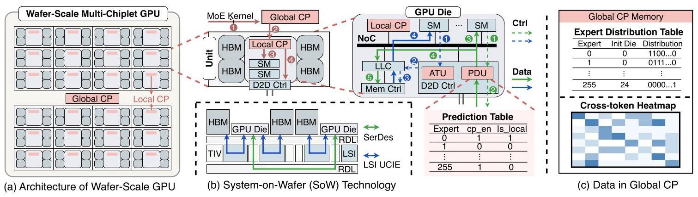

Figure 10. (a) Wafer-scale multi-chiplet GPU architecture with additional units highlighted in orange. (b) SoW (System-on-Wafer) technology structure. (c) Data format in the Global Command Processor for our proposed task distribution strategy.

> 
图10. (a) 晶圆级多芯粒GPU架构，附加单元以橙色突出显示。(b) SoW（系统级晶圆）技术结构。(c) 我们提出的任务分配策略中全局命令处理器的数据格式。

## D. Motivation and Insights

To address these challenges, we propose two strategies with architectural support. First, based on Insight 3 that identifies the need for expert-placement-aware task distribution, we propose an intelligent task allocation algorithm with a multi-level, data-placement-aware command processor architecture. This approach considers expert placement and selection skewness across dies, enabling dynamic task allocation that minimizes D2D traffic while balancing workload.

> 
为了解决这些挑战，我们提出了两种具备架构支持的策略。首先，基于洞察 3 指出的专家放置感知任务分配需求，我们设计了一种智能任务分配算法，并配合多级、数据放置感知的命令处理器架构。该方法充分考虑了跨芯片的专家放置与选择偏斜，实现动态任务分配，从而在平衡工作负载的同时最小化 D2D 流量。

Second, leveraging Insight 1 and Insight 2 that reveal the predictability behind expert selection across different timescales, we introduce a data-driven predictor with hardware-managed HBM architecture. Local HBM caches frequently accessed experts from remote dies, while a lightweight predictor analyzes selection patterns to estimate future needs, caching predicted experts locally to reduce D2D traffic.

> 
其次，利用揭示不同时间尺度下专家选择可预测性的洞察1和洞察2，我们引入了一种数据驱动的预测器，并采用硬件管理的HBM架构。本地HBM缓存来自远程芯片的频繁访问专家，同时轻量级预测器分析选择模式以估计未来需求，将预测的专家缓存至本地以减少D2D流量。

To implement these two strategies under a single-GPU-like programming model, we a few architectural extensions to the GPU architecture. If future programming models evolve toward multi-GPU-like abstractions with finer-grained control over each die, these strategies could alternatively be realized at the system level without any architectural modification.

> 
为了在类似单GPU的编程模型下实现这两种策略，我们对GPU架构做出了一些架构扩展。如果未来编程模型向类似多GPU的抽象演变，并对每个裸片提供更细粒度的控制，那么这些策略也可以在系统层面实现，而无需任何架构修改。

## E. Architecture Design

1) Architecture Overview: To support our proposed predictor and task allocation algorithm, we implement two architectural modifications with minimal overhead, as illustrated in Figure 10(a). These changes, highlighted in orange, consist of an enhanced Command Processor structure and an extended D2D controller design.

> 
1) 架构概述：为了支持我们提出的预测器和任务分配算法，我们实施了两项架构修改，开销极小，如图10(a)所示。这些以橙色高亮显示的修改包括增强的命令处理器结构和扩展的D2D控制器设计。

First, we redesign the Command Processor (CP) with a two-level hierarchical structure: a Global CP at the wafer level and Local CPs within each die. The Global CP maintains systemwide expert selection and placement information for intelligent resource management. Second, we extend the D2D controller with an Address Translation Unit (ATU) and a Prediction Unit (PDU). The ATU translates remote HBM addresses to local addresses when remote data is duplicated, while the PDU identifies important remote data requiring duplication. These enable autonomous caching of remote data in local HBM and intelligent redirection of data requests, reducing inter-die communication overhead.

> 
首先，我们重新设计了命令处理器(CP)，采用双层分级结构：晶圆级全局命令处理器(Global CP)与各核心芯片内部的本地命令处理器(Local CP)。全局命令处理器维护系统级专家选择与布局信息，以实现智能资源管理。其次，我们扩展了芯片间互联(D2D)控制器，为其增加地址转换单元(ATU)和预测单元(PDU)。当远程数据被复制时，地址转换单元将远程高带宽存储器(HBM)地址转换为本地地址；预测单元则识别需要复制的关键远程数据。这些设计实现了本地HBM对远程数据的自主缓存与数据请求的智能重定向，从而降低了芯片间互联的通信开销。

2) Key Data Structures: There are two key data structures: Global CP data and the PDU prediction table.

> 
2) 关键数据结构：有两个关键数据结构：全局CP数据和PDU预测表。

Global CP Data Structures: As shown in Figure 10(c), the Global CP maintains two structures. The expert distribution table stores each expert's initial die ID and distribution status as an $n$ -bit binary code, where each bit indicates expert presence on the corresponding die. The cross-token heatmap records expert activation patterns over time, providing historical data for prediction generation.

> 
全局CP数据结构：如图10(c)所示，全局CP维护两个结构。专家分配表将每个专家的初始芯片（die）ID及分布状态存储为一个$n$位二进制码，其中每一位表示该专家在对应芯片上的存在情况。跨token热图记录专家随时间的激活模式，为预测生成提供历史数据。

PDU Prediction Table: Each PDU stores a prediction table with two key fields per expert: the cp_en bit indicating whether the expert should be cached locally (calculated by Global CP and transferred to each die), and the is_local bit tracking whether the expert is already cached in local HBM.

> 
PDU 预测表：每个 PDU 存储一张预测表，每个专家在其中包含两个关键字段：cp_en 位，指示该专家是否应被本地缓存（由全局 CP 计算并传输到每个芯片），以及 is_local 位，跟踪该专家是否已缓存在本地 HBM 中。

3) Workflow During Kernel Launch: When a new kernel launches (1), the Global CP runs our task allocation algorithm to split the MoE kernel into per-die sub-kernels and executes the predictor to generate duplication guidance (cp_en field is PDU). The Global CP then sends sub-kernels and prediction information to local CPs (2). Each local CP allocates tasks to its SMs (3) and configures the prediction table in the D2D controller for local HBM management (4). After computation, local CPs collect expert duplication statistics and send them to Global CP to update expert distribution information.

> 
3) 内核启动期间的工作流程：当新内核启动时(1)，全局CP运行我们的任务分配算法将MoE内核拆分为每个die的子内核，并执行预测器生成复制引导（cp_en字段为PDU）。随后全局CP将子内核和预测信息发送给本地CP(2)。每个本地CP将任务分配给其SM(3)，并配置D2D控制器中的预测表，用于本地HBM管理(4)。计算完成后，本地CP收集专家复制统计信息，并将其发送给全局CP，以更新专家分布信息。

4) Dataflow for Remote Data Access: We integrate ATU and PDU into the D2D controller to support hardware-managed HBM by modifying the remote data access flow. With these two units, our architecture automatically duplicates important remote data in local HBM, with green lines representing non-duplicated data reads and blue lines representing duplicated data reads, as shown in Figure 10(a).

> 
4) 远程数据访问的数据流：我们通过修改远程数据访问流程，将 ATU 和 PDU 集成到 D2D 控制器中以支持硬件管理的 HBM。借助这两个单元，我们的架构能够自动将重要的远程数据复制到本地 HBM 中，其中绿线表示非重复数据读取，蓝线表示重复数据读取，如图 10(a) 所示。

Remote Data Read (Non-duplicated): When an SM reads remote data not in local HBM (➃), the D2D controller routes the request conventionally (Q). Upon return, the PDU checks the Prediction Table to make a duplication decision and sends data to the SM regardless of the decision (3). If duplication is required, the PDU writes to LLC and local HBM (4, 5), updates the address into ATU, and sets the is_local bit in PDU's Prediction Table to 1.

> 
远程数据读取（非复制）：当SM读取不在本地HBM中的远程数据（➃）时，D2D控制器以常规方式（Q）路由该请求。返回后，PDU检查预测表以做出复制决策，并将数据发送给SM，不论决策如何（3）。如果需要复制，PDU将数据写入LLC和本地HBM（4, 5），将地址更新到ATU中，并将PDU预测表中的is_local位设置为1。

Algorithm 1: Task Allocation Algorithm

> 
算法 1：任务分配算法

---

Input: expert_reqs_dict, expert_die_map

> 
expert_reqs_dict, expert_die_map

Output: allo_plan

> 
输出: allo_plan

Initialize the workload of each die: load_per_die;

> 
初始化每个裸片的工作负载：load_per_die；

Sort (expert_reqs_dict, by req_num ascending);

> 
排序 (expert_reqs_dict, 按 req_num 升序);

for (expert_id, req_num) in expert_reqs_dict do

> 
for (expert_id, req_num) in expert_reqs_dict do

candi_list $\leftarrow$ GenCandidateList (expert_id, dis = 1);

> 
candi_list $\leftarrow$ GenCandidateList (expert_id, dis = 1);

candi_list $\leftarrow$ Sort (candi_list, $i \mapsto$ load_per_die[i])

> 
candi_list $\leftarrow$ Sort (candi_list, $i \mapsto$ load_per_die[i])

while req_num $> 0$ do

> 
当 req_num $> 0$ 时执行

costs_of_dies $\leftarrow$ CostModel (candi_list);

> 
costs_of_dies $\leftarrow$ CostModel (candi_list);

target_die $\leftarrow$ Argmin (costs_of_dies);

> 
target_die $\leftarrow$ Argmin (costs_of_dies);

allo_plan.append([expert_id, target_die, req_blk]);

> 
allo_plan.append([expert_id, target_die, req_blk]);

Update (load_per_die);

> 
更新 (load_per_die);

req_num ← req_num - req_blk;

> 
req_num ← req_num - req_blk;

allo_plan ← MergeTasks (allo_plan);

> 
allo_plan ← MergeTasks (allo_plan);

return allo_plan;

> 
return allo_plan;

Function GenCandidateList (expert_id, dis):

> 
Function GenCandidateList (expert_id, dis):

local_die_list = expert_die_map[expert_id];

> 
local_die_list = expert_die_map[expert_id];

remote_die_list = FindNearDies (local_die_list, dis);

> 
remote_die_list = FindNearDies (local_die_list, dis);

return local_die_list + remote_die_list;

> 
return local_die_list + remote_die_list;

---

Local Data Read (Duplicated): When an SM reads remote data already cached in local HBM (➏), the ATU translates the remote address to a local address and redirects the request to LLC (2). The LLC and memory controller then retrieve data and send it back to the SM(3, 4).

> 
本地数据读取（重复）：当SM读取已在本地HBM中缓存的远程数据时（➏），ATU将远程地址转换为本地地址并将请求重定向到LLC（2）。然后LLC和内存控制器检索数据并将其发送回SM（3、4）。

5) Algorithm Design: This subsection presents our task allocation algorithm and data-driven predictor, both implemented by the global CP.

> 
5) 算法设计：本小节介绍我们的任务分配算法与数据驱动预测器，二者均由全局CP实现。

Task Allocation Algorithm: Since accurate task distribution is NP-hard, we propose two heuristic mechanisms: a candidate mechanism that reduces the number of dies to consider and a block-granularity distribution mechanism that searches for approximate solutions among candidates.

> 
任务分配算法：由于精确的任务分配是NP-hard的，我们提出两种启发式机制：一种候选机制，减少需要考虑的晶片数量；以及一种块粒度分配机制，在候选中搜索近似解。

This algorithm splits MoE kernel computation into subtasks for individual dies based on expert selection and distribution information. As shown in algorithm 1 the input expert_reqs_dict contains the number of requests belonging to each expert, while expert_die_map provides dynamic expert distribution information from the Expert Distribution Table in Figure 10(c), indicating where each expert is stored.

> 
该算法根据专家选择和分布信息，将MoE内核计算拆分为针对各个die的子任务。如算法1所示，输入的expert_reqs_dict包含属于每个专家的请求数量，而expert_die_map提供来自图10(c)中专家分布表的动态专家分布信息，指示每个专家存储的位置。

The algorithm iterates through all experts to generate allocation plans. For each expert, it creates a candidate die list including dies storing expert weights and their adjacent dies (shown as green and red in Figure 11(a)). We sort candidates by workload and limit the list to ${ma}{x}_{s}{pli}{t}_{n}{um}$ dies, determined by the expert's request count (line 3-5). Requests are distributed to candidate dies in blocks of size 50 to balance efficiency and accuracy (line 6-11). For each block, the algorithm selects the optimal die using our cost model, which considers DRAM access, computation, and die-to-die communication. Finally, we merge blocks allocated to the same die to generate the final allocation plan (line 12).

> 
该算法遍历所有专家以生成分配计划。对于每个专家，它创建一个候选芯片列表，包括存储专家权重的芯片及其相邻芯片（如图11(a)中的绿色和红色所示）。我们根据工作负载对候选芯片进行排序，并将列表限制为${ma}{x}_{s}{pli}{t}_{n}{um}$个芯片，该数量由专家的请求数决定（第3-5行）。请求以大小为50的块为单位分配到候选芯片，以平衡效率和准确性（第6-11行）。对于每个块，算法使用我们的成本模型选择最优芯片，该模型考虑了DRAM访问、计算以及芯片间通信。最后，我们合并分配到同一芯片的块，生成最终的分配计划（第12行）。

Data-Driven Predictor: Our predictor algorithm, implemented by the global CP, uses current MoE kernel expert selection information to predict popular experts for the next token on each die. This prediction result is transferred to local CPs and configured in each die's PDU to guide hardware-managed local HBM. As shown by the red shadow in Figure 11(b), we first identify corresponding rows from the heatmap based on current expert selection (1), then select the top $n$ experts from each row (2) and identify corresponding experts for the next token as prediction results, denoted by the green shadow (3). In this example, a die computes experts 1 and 4 during the current MoE kernel and we predict experts 2, 4, and 6 will be used next. Since this die only reads experts 1 and 4 currently, we duplicate only expert 4 in its local DRAM.

> 
数据驱动预测器：我们的预测算法由全局CP实现，利用当前MoE内核的专家选择信息来预测每个芯片上下一个token的热门专家。该预测结果被传输到本地CP，并在每个芯片的PDU中进行配置，以指导硬件管理的本地HBM。如图11(b)中的红色阴影所示，我们首先根据当前专家选择从热图中识别相应的行（1），然后从每行中选择前 $n$ 名专家（2），并识别出下一个token对应的专家作为预测结果，如绿色阴影所示（3）。在这个例子中，一个芯片在当前MoE内核期间计算专家1和4，我们预测专家2、4和6将在接下来被使用。由于该芯片当前只读取专家1和4，我们仅在其本地DRAM中复制专家4。

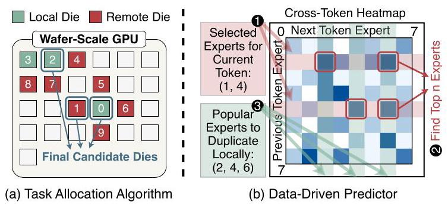

Figure 11. Proposed task allocation algorithm and data-driven predictor.

> 
图11. 提出的任务分配算法与数据驱动的预测器。

## V. EVALUATION

## A. Experiment Setup

Methodology: We conduct experiments using event-driven simulation on a validated simulator. Expert selection traces are collected by deploying SGLang [51] on an $8 \times  \mathrm{H}{100}\mathrm{{DGX}}$ server and an $8 \times  \mathrm{H}{200}$ AWS instance.

> 
方法：我们在经验证的模拟器上采用事件驱动仿真进行实验。通过在$8 \times  \mathrm{H}{100}\mathrm{{DGX}}$服务器和$8 \times  \mathrm{H}{200}$ AWS实例上部署SGLang [51]，收集专家选择轨迹。

We developed a custom multi-chiplet GPU simulator in Python, as existing tools are inadequate for our needs. Cycle-accurate simulators such as Gem5 [52], gpgpusim [53], and mgpusim [54] accurately model single GPUs but are prohibitively slow for large-scale systems with 20+ dies and batch sizes exceeding 15,000. Event-driven simulators such as ASTRA-sim [55] support multi-GPU systems but lack detailed microarchitecture modeling and do not support the single-GPU-like programming model we adopt. Our simulator models all key multi-chiplet GPU components, including LLC, HBM, compute units, and D2D links across all dies, with a central resource manager that captures contention and congestion. We validated the simulator against real measurements from an $8 \times  \mathrm{H}{100}\mathrm{{DGX}}$ server, as detailed in subsection V-B

> 
我们开发了一个定制的Python多芯粒GPU模拟器，因为现有工具无法满足我们的需求。诸如Gem5 [52]、gpgpusim [53]和mgpusim [54]等周期精确模拟器能够精确建模单GPU，但对于具有20+芯片和超过15,000批次大小的大规模系统而言，速度过慢。如ASTRA-sim [55]等事件驱动模拟器支持多GPU系统，但缺乏详细的微架构建模，且不支持我们所采用的类单GPU编程模型。我们的模拟器对所有关键的多芯粒GPU组件进行建模，包括跨所有芯片的末级缓存、高带宽内存、计算单元和芯片到芯片链路，并配有一个捕捉争用与拥塞的中央资源管理器。我们对照一个$8 \times  \mathrm{H}{100}\mathrm{{DGX}}$服务器的实际测量数据验证了该模拟器，详情见第V-B小节。

Metric: We measure the throughput of MoE layers during the decode stage as modern LLM serving systems show a trend toward fine-granularity disaggregation. Traditional LLMs benefit from separating prefill and decode stages across different machines, as demonstrated by DistServe [56] and subsequent works [57], [58]. For MoE models, this disaggregation extends further. MegaScale-Infer [15] separates attention and MoE operations onto different machines for optimal batch sizes. Following this trend, we focus on optimizing MoE operations during the decode stage.

> 
指标：我们测量解码阶段MoE层的吞吐量，因为现代大语言模型服务系统正呈现出细粒度解耦的趋势。传统大语言模型通过将预填充阶段和解码阶段分离到不同机器上而受益，如DistServe [56]及后续工作[57]，[58]所示。对于MoE模型，这种解耦进一步延伸。MegaScale-Infer [15]将注意力操作和MoE操作分离到不同机器上，以获得最优批次大小。遵循这一趋势，我们专注于在解码阶段优化MoE操作。

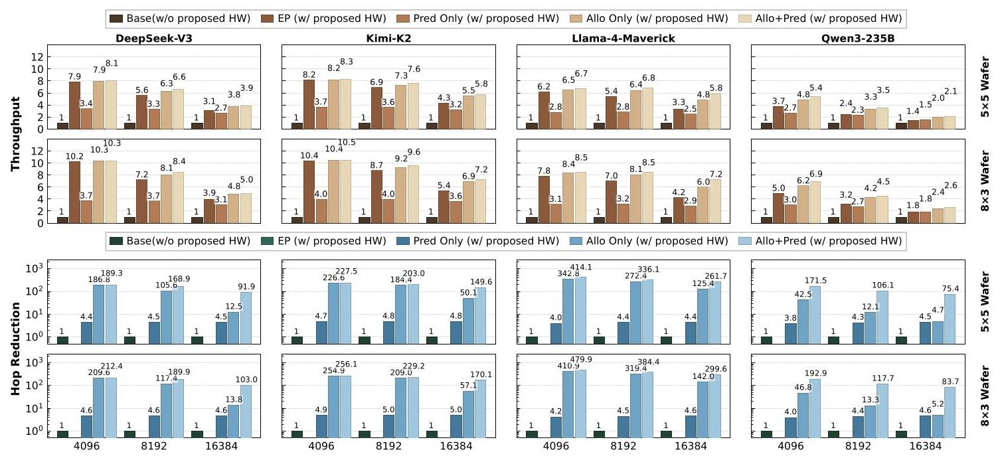

Figure 12. Throughput of MoE layers (Top) and hop number reduction ratio (Bottom). All figures are scaled to baseline.

> 
图12. MoE层的吞吐量（上图）和跳数减少比率（下图）。所有数据均相对于基线进行了缩放。

Table I

> 
表 I

HARDWARE CONFIGURATIONS

> 
硬件配置

<table><tr><td></td><td>X-die</td><td>Y-die</td><td>DRAM BW</td><td>D2D BW</td><td>DRAM</td><td>Cmpt Power per Die (FP16)</td></tr><tr><td>Dojo</td><td>5</td><td>5</td><td>3.35 TB/s</td><td>1.7 TB/s</td><td>80GB</td><td>989 TFLOPS</td></tr><tr><td>TSMC-SoW</td><td>3</td><td>8</td><td>3.35 TB/s</td><td>1.7 TB/s</td><td>80GB</td><td>989 TFLOPS</td></tr><tr><td>Dojo-Enhanced</td><td>5</td><td>5</td><td>8 TB/s</td><td>2 TB/s</td><td>180GB</td><td>4500 TFLOPS</td></tr><tr><td>Other Params</td><td colspan="6">LLC hit latency: 100ns, LLC miss penalty: 110ns,   LLC write latency: 30ns, LLC size: 64 MB   D2D link latency: 200ns, Routing Alg: XY routing, Command and address size for each remote request: 16B Loca HBM access latency: 300 ns</td></tr></table>

Hardware Configuration: We evaluate two multi-chiplet topologies: Tesla Dojo [59], [60] and the TSMC SoW roadmap [61]. As summarized in Table I, Dojo uses a $5 \times  5$ 2D mesh, while TSMC SoW adopts an $8 \times  3$ 2D mesh. These choices reflect a deployed system (Dojo) and near-future industry support (TSMC SoW).

> 
硬件配置：我们评估了两种多芯粒拓扑结构：Tesla Dojo [59], [60] 和 TSMC SoW 路线图 [61]。如表I所总结，Dojo 采用 $5 \times 5$ 的二维网格，而 TSMC SoW 采用 $8 \times 3$ 的二维网格。这些选择反映了一个已部署的系统（Dojo）和近期的产业支持（TSMC SoW）。

For both the Dojo and TSMC SoW configurations, each chiplet is H100-like, providing 1,000 TFLOPS FP16 compute, 80GB HBM, 3.35TB/s local HBM bandwidth, and 1.7 TB/s inter-die bandwidth to adjacent chiplets. We also include an extended experiment in subsection V-F with a Dojo-Enhanced configuration, where each die is B300-like to reflect an anticipated hardware performance trend in the future. We reserve 10% of DRAM for system and hardware management.

> 
对于 Dojo 和台积电系统级晶圆（SoW）两种配置，每个芯粒均类似 H100，提供 1,000 TFLOPS 的 FP16 计算能力、80GB HBM 内存、3.35TB/s 本地 HBM 带宽，并具备 1.7 TB/s 与相邻芯粒的芯片间互连带宽。我们还在第 V-F 小节中增设了一项拓展实验，采用 Dojo-Enhanced 配置，其中每个裸片均类似 B300，以反映未来预期的硬件性能趋势。我们预留 10% 的 DRAM 用于系统及硬件管理。

Baseline Configurations: We compare our approach against the simple strategy currently used by GPU.

> 
基线配置：我们将我们的方法与 GPU 当前使用的简单策略进行比较。

The Base configuration adopts an EP-like data placement and assigns an equal number of experts to each die. However, the entire wafer operates as a single large GPU: each die handles the same amount of expert computation without considering expert placement.

> 
Base 配置采用了类似 EP 的数据放置方式，并为每个裸片分配了相同数量的专家。然而，整个晶圆作为单个大型 GPU 运行：每个裸片处理相同量的专家计算，而不考虑专家的放置位置。

EP assigns each expert's computation to the die where it resides, as also adopted by MoEntwine [45]. This eliminates all D2D communication but can cause severe workload imbalance. Note that even under EP, our Global CP and Local CP architecture remains necessary, as expert placement information is still required.

> 
EP 将每个专家的计算分配到其所在的晶片上，MoEntwine [45] 也采用了这种方式。这消除了所有 D2D 通信，但可能导致严重的工作负载不均衡。请注意，即使在 EP 下，我们的 Global CP 和 Local CP 架构仍然是必需的，因为仍然需要专家放置信息。

We implement three variants: Allo Only uses solely our task allocation strategy; Pred Only includes only the data-driven predictor; and Allo+Pred combines both techniques. These configurations evaluate the individual and combined effects of our proposed methods.

> 
我们实现了三种变体：Allo Only 仅使用我们的任务分配策略；Pred Only 仅包含数据驱动的预测器；而 Allo+Pred 则结合了这两种技术。这些配置评估了我们所提出方法的单独及组合效果。

Models and Workloads: We conduct evaluations with real traces collected from Qwen3 and Deepseek V3. The traces are gathered from diverse datasets, including MMLU [35], MMLU Pro [36], ChineseSimpleQA [62], and LiveCodeBench [63], comprising over 24,000 requests per model. Each test batch is filled by sequentially adding requests in the order of MMLU, MMLU-Pro (CH), ChineseSimpleQA, and LiveCodeBench until the target batch size is reached.

> 
模型与工作负载：我们使用从 Qwen3 和 Deepseek V3 收集的真实轨迹进行评估。这些轨迹源自多个数据集，包括 MMLU [35]、MMLU Pro [36]、ChineseSimpleQA [62] 和 LiveCodeBench [63]，每个模型包含超过 24,000 个请求。每个测试批次按 MMLU、MMLU-Pro（中文）、ChineseSimpleQA 和 LiveCodeBench 的顺序依次添加请求，直至达到目标批次大小。

## B. Validation of Simulator

We validate our simulator using real measurements from an 8×H100 DGX server. We evaluate both single-GPU execution and two-GPU peer-to-peer (P2P) communication.

> 
我们使用来自 8×H100 DGX 服务器的实际测量数据来验证我们的模拟器。我们同时评估了单 GPU 执行和双 GPU 点对点（P2P）通信。

For single-GPU execution, we benchmark one expert in a MoE layer, which consists of three GEMM operations, across varying batch sizes for both DeepSeek and Qwen.

> 
针对单GPU执行，我们在不同批次大小下，对 DeepSeek 和 Qwen 的 MoE 层中的一个专家进行基准测试，该层包含三个 GEMM 操作。

For P2P communication, we measure data migration between two GPUs over payload sizes ranging from 4 KB to 4 GB. To ensure simulation fidelity, we calibrate key parameters to fit the measured data. As shown in Figure 13 the simulator’s error remains within $5\%$ for all test cases.

> 
对于P2P通信，我们测量了两块GPU之间在4 KB至4 GB的有效载荷大小范围内的数据迁移。为确保仿真保真度，我们校准关键参数以拟合测量数据。如图13所示，对于所有测试用例，模拟器的误差保持在 $5\%$ 以内。

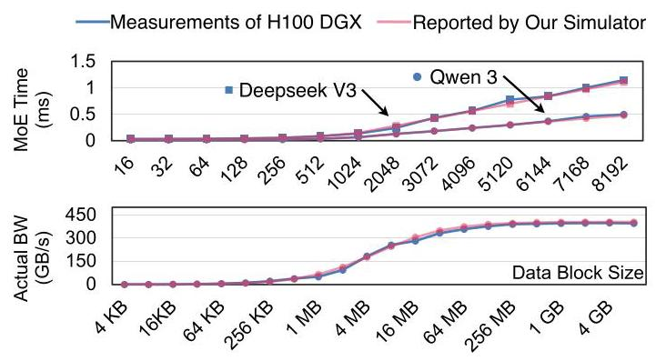

Figure 13. Simulator validation with real data generated from 8xH100 DGX, including both MoE Layer (Top) and P2P data transfer (Bottom) test cases.

> 
图13. 使用8xH100 DGX生成的真实数据对模拟器进行验证，包括MoE层（上）和P2P数据传输（下）的测试用例。

## C. Throughput

We evaluate MoE decode stage throughput in Figure 12 with results normalized to the baseline configuration.

> 
我们在图12中评估了MoE解码阶段吞吐量，结果相对于基线配置进行了归一化。

Comparison across models: Our Allo+Pred strategy achieves ${7.0} \times  ,{8.2} \times  ,{7.3} \times$ , and ${4.1} \times$ throughput improvement on Deepseek, Kimi, Llama, and Qwen, respectively. Deepseek and Kimi benefit more due to their larger expert count (256 vs. 128) and more complex selection patterns.

> 
模型间比较：我们的 Allo+Pred 策略在 Deepseek、Kimi、Llama 和 Qwen 上分别实现了 ${7.0} \times  ,{8.2} \times  ,{7.3} \times$ 和 ${4.1} \times$ 的吞吐量提升。Deepseek 和 Kimi 获益更多，因为它们拥有更多的专家数量（256 对 128）和更复杂的选择模式。

Comparison across chiplet architectures: Our strategy shows ${6.0} \times$ improvement on Dojo and ${7.5} \times$ on TSMC, despite similar die counts (25 vs. 24). TSMC's rectangular layout places dies farther apart, introducing more inter-unit communication without strategic task allocation, hence the larger gain under our strategy.

> 
跨小芯片架构比较：尽管裸片数量相近（25 对 24），我们的策略在 Dojo 上实现了 ${6.0} \times$ 的改进，在 TSMC 上实现了 ${7.5} \times$ 的改进。TSMC 的矩形布局使裸片间距更大，在没有战略性任务分配的情况下引入了更多单元间通信，因此在本策略下增益更大。

Comparison with EP: At small batch sizes such as 4096, our strategy and EP perform similarly: few tokens per expert make execution memory-bound, so splitting one expert across multiple dies offers no benefit, and our strategy degenerates to EP. The advantage emerges at larger batches, achieving 1.44 $\times$ speedup over EP at batch size 16,384.

> 
与EP比较：在小批量如4096时，我们的策略与EP表现相似：每个专家的少量token使执行受内存限制，因此将单个专家拆分到多个die没有收益，我们的策略退化为EP。优势在大批量时显现，在批量大小16,384时相较EP实现了1.44 $\times$ 加速。

### D.Hop Reduction

We report hop counts in Figure 12 to show the reduction in inter-unit communication. Hop count is the sum of Manhattan distances for all cross-unit communications. Higher hop counts indicate frequent cross-die data movement. We normalize results to baseline and report hop reduction ratios, where a ratio of 10 means the hop count is reduced to $1/{10}$ .

> 
我们在图12中报告跳数，以展示跨单元通信的减少。跳数是所有跨单元通信的曼哈顿距离之和。更高的跳数表明频繁的跨芯片数据移动。我们将结果归一化至基线并报告跳数缩减比率，其中比率为10意味着跳数减少到 $1/{10}$ 。

Pred Only reduces hop counts by ${4.5} \times$ , aligning with performance improvement of ${3.0} \times$ . This indicates cross-unit communication is the primary bottleneck in baseline, and reducing hop counts proportionally improves performance.

> 
Pred Only 将跳数减少了 ${4.5} \times$ , 与性能提升 ${3.0} \times$ . 这表明跨单元通信是基线中的主要瓶颈，按比例减少跳数可提升性能。

Allo Only reduces hop counts by ${142} \times$ , exceeding the performance improvement of ${6.3} \times$ . This shows that with our allocation algorithm, inter-unit communication is no longer the sole bottleneck. While reducing hop counts still improves performance, the improvement is not proportional.

> 
Allo Only 将跳数减少了 ${142} \times$ , 超过了 ${6.3} \times$ 的性能提升。这表明，使用我们的分配算法，单元间通信不再是唯一的瓶颈。虽然减少跳数仍能提升性能，但这种提升并不是成比例的。

Allo+Pred reduces hop counts by over ${213} \times$ compared to baseline. However, performance improvement is only ${6.63} \times$ over baseline, with just ${1.1} \times$ average improvement over Allo Only. This demonstrates that hop count is no longer a performance bottleneck. With the help of our task allocation algorithm, most tasks are distributed to local dies holding related experts, with only extremely popular experts requiring remote allocation. This leads to minimal D2D traffic and shifts the bottleneck to workload distribution.

> 
Allo+Pred 相比基线降低了超过 ${213} \times$ 的跳数。然而，相比基线，性能提升仅为 ${6.63} \times$，而相比 Allo Only 的平均提升仅为 ${1.1} \times$。这表明跳数不再是性能瓶颈。借助我们的任务分配算法，大多数任务被分配至存有相关专家的本地裸片，仅极热门专家需要远程分配。这导致极少的 D2D 流量，并将瓶颈转移至工作负载分布。

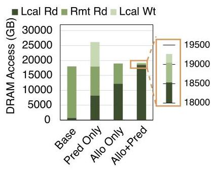

Figure 14. DRAM access breakdown for Qwen3 on TSMC-SoW Configuration with batch size 4096.

> 
图14. 在TSMC-SoW配置上，批量大小为4096的Qwen3的DRAM访问细分

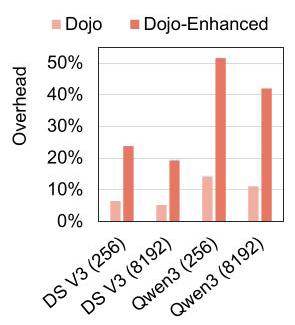

Figure 15. Host CPU implementation overhead under varying models and batch sizes.

> 
图15. 不同模型与批量大小下的主机CPU实现开销。

## E. DRAM Access Breakdown

We provide a breakdown of DRAM access patterns in Figure 14 to show how our strategies reduce inter-unit communication. We categorize DRAM access into three types: reads from local dies, reads from remote dies, and writes to local dies, where writes to local dies only occur when we duplicate a remote expert locally. Most reads in the baseline are from remote dies, resulting in high inter-unit traffic and poor performance. With our strategies (Pred Only, Allo Only, and Allo+Pred), most remote DRAM reads are converted to local DRAM reads, significantly reducing traffic. Compared with Pred Only, Allo+Pred achieves fewer remote reads by allocating most tasks to local dies, with only extremely popular experts requiring computation across multiple dies. Compared with Allo Only, Allo+Pred further reduces remote reads by caching popular experts in local HBM.

> 
图 14 中 DRAM 访问模式的分析表明，我们的策略如何减少单元间通信。我们将 DRAM 访问分为三类：本地芯片读取、远程芯片读取和本地芯片写入，其中本地芯片写入仅发生在将远程专家复制至本地时。基线方法中多数读取来自远程芯片，导致高单元间流量与性能瓶颈。通过应用单一及组合优化策略（仅预测、仅分配和分配+预测），大多数远程 DRAM 读取被转换为本地 DRAM 读取，显著降低了通信流量。相较于仅预测策略，分配+预测通过将多数任务分配至本地芯片，仅对极热门专家进行跨芯片计算，从而实现了更少的远程读取。相较于仅分配策略，分配+预测通过将热门专家缓存至本地 HBM 进一步减少了远程读取。

## F. Comparison with Host CPU-Based Implementation

Our task allocation algorithm runs on a new GPU command processor, but it could, in principle, be executed on the host CPU with a higher overhead. As shown in Figure 15 we evaluate both the Dojo and Dojo-Enhanced configurations. In Dojo, the overhead of host-CPU allocation is 5.2%-6.4% for DeepSeek V3 and 11.1%-14.2% for Qwen3. In Dojo-Enhanced, the overhead rises to 19.3%-23.8% for DeepSeek V3 and 42.0%-51.6% for Qwen3.

> 
我们的任务分配算法运行在一个新的GPU命令处理器上，但原则上可以在主机CPU上执行，开销会更高。如图15所示，我们评估了Dojo和Dojo-Enhanced两种配置。在Dojo配置中，主机CPU分配的开销对于DeepSeek V3为5.2%-6.4%，对于Qwen3为11.1%-14.2%。在Dojo-Enhanced配置中，该开销对于DeepSeek V3上升至19.3%-23.8%，对于Qwen3上升至42.0%-51.6%。

DeepSeek vs Qwen: Qwen3 incurs higher overhead than DeepSeek V3 due to CPU-GPU data transfers over PCIe, which occur once per MoE layer. The CPU needs the Expert Distribution Table from the GPU to run the allocator, and the allocation results must be sent back to the GPU before kernel execution. Qwen3 has (i) more MoE layers (94 vs. 58), increasing transfer frequency, and (ii) smaller per-layer compute, which amplifies the relative cost of transfers.

> 
DeepSeek 对比 Qwen：Qwen3 相比 DeepSeek V3 产生更高开销，原因在于每个 MoE 层都需要通过 PCIe 进行一次 CPU 与 GPU 间的数据传输。CPU 需要从 GPU 获取专家分布表来运行分配器，而分配结果必须在核函数执行前传回 GPU。Qwen3 具有 (i) 更多的 MoE 层（94 个对比 58 个），增加了传输频率，以及 (ii) 更小的每层计算量，这放大了传输的相对成本。

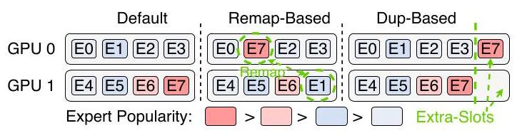

Figure 16. Demonstration of expert placement strategies.

> 
图16. 专家放置策略演示。

Dojo vs Dojo-Enhanced: Dojo-Enhanced shows over 3.7× higher overhead than Dojo because its GPU dies are significantly faster, making fixed PCIe transfer costs dominate more. As GPU performance outpaces interconnect bandwidth, implementing the allocator in the GPU command processor becomes increasingly necessary to sustain performance.

> 
Dojo与Dojo-Enhanced对比：Dojo-Enhanced显示的开销较Dojo高出3.7倍以上，原因是其GPU芯片速度显著更快，使得固定的PCIe传输成本更加占据主导地位。随着GPU性能超越互连带宽，在GPU命令处理器中实现分配器对于维持性能变得日益必要。

## G. Area and Power Overhead

We estimate the area and power overhead of all added modules in Table II. Our design supports up to 100 layers with 512 experts per layer, well beyond SOTA MoE model (Kimi-K2: 61 layers, 384 experts). The full heatmap (50 MB) is stored in Global CP DRAM, with a 0.5 MB on-chip cache buffering one layer at a time. The Prediction Table is implemented in registers due to its small size; all other components use SRAM. Registers are synthesized with Yosys [64] and SRAM is modeled with CACTI [65], both scaled to $5\mathrm{\;{nm}}$ to match the H100 process node. Global and Local CP area estimates are derived from ARM core data. As shown in Table II, total area and power overhead is less than 0.04%.

> 
我们估算了表II中所有新增模块的面积和功耗开销。我们的设计支持多达100层，每层512个专家，远超当前最先进的MoE模型（Kimi-K2：61层，384专家）。完整的热图（50 MB）存储在全局CP DRAM中，并配有0.5 MB的片上缓存，每次缓冲一层。预测表由于尺寸较小，采用寄存器实现；所有其他组件均使用SRAM。寄存器使用Yosys [64] 综合，SRAM使用CACTI [65] 建模，两者均缩放至$5\mathrm{\;{nm}}$以匹配H100工艺节点。全局和局部CP的面积估算基于ARM核心数据。如表II所示，总开销不到0.04%。

Table II

> 
表二

AREA AND POWER OVERHEAD.

> 
面积与功耗开销。

<table><tr><td></td><td>Capacity</td><td>Bit Width</td><td>Num Per Wafer</td><td>Tot Area (mm2)</td><td>Tot Power (mW)</td></tr><tr><td>Prediction Table</td><td>128 B</td><td>16 bit</td><td>25</td><td>0.0020</td><td>55.75</td></tr><tr><td>Address Translation Unit</td><td>4.25 KB</td><td>68 bit</td><td>25</td><td>0.0048</td><td>334.25</td></tr><tr><td>Local CP (A72) 66</td><td>N/A</td><td>N/A</td><td>25</td><td>~7.5000</td><td>$\sim  {7000}$</td></tr><tr><td>Expert Distribution Table</td><td>4.5 KB</td><td>72 bit</td><td>1</td><td>0.0002</td><td>13.94</td></tr><tr><td>Heatmap Cache</td><td>0.5 MB</td><td>512 bit</td><td>1</td><td>0.0278</td><td>184.67</td></tr><tr><td>Global CP (A76) 67]</td><td>N/A</td><td>N/A</td><td>1</td><td>$\sim  {1.1000}$</td><td>~1000</td></tr><tr><td>Total</td><td></td><td></td><td></td><td>6.13</td><td>8588.61</td></tr><tr><td>Overhead (25-die wafer)</td><td></td><td></td><td></td><td>~0.04%</td><td>~ 0.04%</td></tr></table>

## VI. CASE STUDY 2: PREFILL-GUIDED DECODE EXPERT PLACEMENT ON REAL GPU CLUSTERS

## A. Introduction

Workload imbalance is one of the biggest challenges in large-scale MoE serving (200+ GPUs). EPLB [68] addresses this by dynamically adjusting expert placement, but it is triggered every 3000+ steps and relies on periodically collected profiling data [69]. A natural question then arises: how to set expert placement for the initial $\sim  {1000}$ decode tokens when no profiling data are yet available? This is especially pressing for short-output requests, for which EPLB never collects enough data to be effective. Inspired by Insight 1 which reveals temporal correlation between prefill and decode stages, we propose leveraging prefill-stage expert selection information to guide expert placement for initial decode steps.

> 
工作负载不均衡是大规模 MoE 服务（200+ GPU）中的主要挑战之一。EPLB [68] 通过动态调整专家放置来应对这一问题，但它的触发间隔超过 3000 步，并且依赖周期性收集的性能分析数据 [69]。如此一来，一个自然的问题就出现了：在初始的 $\sim  {1000}$ 个解码令牌尚无性能分析数据可用时，该如何设置专家放置？这对短输出请求而言尤为紧迫，因为 EPLB 永远无法为这类请求收集到足够数据以发挥作用。受洞察 1 的启发——该洞察揭示了预填充与解码阶段之间的时间相关性——我们提出利用预填充阶段的专家选择信息，来指导初始解码步骤的专家放置。

Algorithm 2: Prefill-Guided Expert Placement

> 
算法 2：预填充引导的专家放置

---

Input: Prefill traces $\mathcal{D}$ , GPU count $G$ , extra slots per GPU $R$

> 
预填充轨迹 $\mathcal{D}$，GPU 数量 $G$，每个 GPU 的额外槽位 $R$

Output: Per-layer expert-to-GPU assignment ${\left\{  {\mathcal{S}}_{g}\right\}  }_{q = 1}^{G}$

> 
输出：每层专家到GPU分配 ${\left\{  {\mathcal{S}}_{g}\right\}  }_{q = 1}^{G}$

Notation: $E$ : total experts; ${f}_{l, e}$ : freq of expert $e$ at layer $l;{L}_{g}$ : load

> 
符号说明：$E$：专家总数；${f}_{l, e}$：第$l$层专家$e$的频率；${L}_{g}$：负载

of GPU $g;{r}_{g}$ : remaining slots on GPU $g;{\delta }_{e, g} : \mathop{\max }\limits_{{q}^{\prime }}{L}_{{q}^{\prime }}$

> 
GPU $g$ 的；${r}_{g}$ : GPU $g$ 上的剩余槽位；${\delta }_{e, g} : \mathop{\max }\limits_{{q}^{\prime }}{L}_{{q}^{\prime }}$

change after copying expert $e$ to GPU $g$

> 
将专家 e 复制到 GPU g 后的变化

Function remap_based_placement $\left( {\mathcal{D}, G}\right)$ :

> 
函数 remap_based_placement $\left( {\mathcal{D}, G}\right)$ :

for each layer $l$ do

> 
对于每一层 $l$ 执行

Compute ${f}_{l, e}$ from $\mathcal{D}$ ; sort exps by decreasing $\operatorname{Cost}\left( {f}_{l, e}\right)$ ;

> 
从 $\mathcal{D}$ 计算 ${f}_{l, e}$；按 $\operatorname{Cost}\left( {f}_{l, e}\right)$ 降序对实验排序；

${L}_{g} \leftarrow  0$ for all $g$ ;

> 
${L}_{g} \leftarrow  0$ 对所有 $g$ ;

for each expert $e$ in sorted order do

> 
对于排序顺序中的每个专家 $e$ 执行

Assign $e$ to least-loaded GPU ${g}^{ * }$ s.t. $\left| {\mathcal{S}}_{{g}^{ * }}\right|  < E/G$ ;

> 
将 $e$ 分配给负载最小的 GPU ${g}^{ * }$，使得 $\left| {\mathcal{S}}_{{g}^{ * }}\right|  < E/G$ ;

${L}_{{g}^{ * }} +  = \operatorname{Cost}\left( {f}_{l, e}\right)$

> 
${L}_{{g}^{ * }} +  = \operatorname{Cost}\left( {f}_{l, e}\right)$

return $\left\{  {\mathcal{S}}_{g}\right\}$ for each layer;

> 
为每一层返回 $\left\{  {\mathcal{S}}_{g}\right\}$；

Function dup_based_placement $\left( {\mathcal{D}, G, R}\right)$ :

> 
函数 dup_based_placement $\left( {\mathcal{D}, G, R}\right)$ :

for each layer $l$ do

> 
对于每一层 $l$ 执行：

Compute ${f}_{l, e}$ from $\mathcal{D}$ ; generate default placement ${\mathcal{S}}_{g}$ ;

> 
计算 ${f}_{l, e}$ 从 $\mathcal{D}$ 中 ; 生成默认放置 ${\mathcal{S}}_{g}$ ;

${r}_{q} \leftarrow  R$ for all $g$ ;

> 
${r}_{q} \leftarrow  R$ 对所有 $g$ ;

${L}_{g} \leftarrow  \mathop{\sum }\limits_{{e \in  {\mathcal{S}}_{g}}}\operatorname{Cost}\left( {f}_{l, e}\right)$ for all $g$ ;

> 
${L}_{g} \leftarrow  \mathop{\sum }\limits_{{e \in  {\mathcal{S}}_{g}}}\operatorname{Cost}\left( {f}_{l, e}\right)$ 对于所有 $g$ ;

for $i \leftarrow  1$ to $R \cdot  G$ do

> 
对于 $i \leftarrow  1$ 到 $R \cdot  G$ 执行

$\left( {{e}^{ * },{g}^{ * }}\right)  \leftarrow  \arg \mathop{\min }\limits_{{e, g : {r}_{q} > 0, g \notin  \operatorname{hosts}\left( e\right) }}{\delta }_{e, g};$

> 
$\left( {{e}^{ * },{g}^{ * }}\right)  \leftarrow  \arg \mathop{\min }\limits_{{e, g : {r}_{q} > 0, g \notin  \operatorname{hosts}\left( e\right) }}{\delta }_{e, g};$

Assign ${e}^{ * }$ to ${\mathcal{S}}_{{g}^{ * }};{r}_{{g}^{ * }} \leftarrow  {r}_{{g}^{ * }} - 1$ ;

> 
将 ${e}^{ * }$ 分配给 ${\mathcal{S}}_{{g}^{ * }}$；${r}_{{g}^{ * }} \leftarrow  {r}_{{g}^{ * }} - 1$；

update affected ${L}_{g}$ ;

> 
更新受影响的 ${L}_{g}$ ;

return $\left\{  {\mathcal{S}}_{g}\right\}$ for each layer;

> 
为每个层返回 $\left\{  {\mathcal{S}}_{g}\right\}$；

---

As shown in Figure 16, we design two placement algorithms (details in algorithm 2). The Remap-based algorithm keeps the number of experts per GPU unchanged and reassigns experts across GPUs for a more balanced workload: it sorts experts by decreasing roofline cost and greedily assigns each to the least-loaded GPU, subject to a uniform capacity of $E/G$ experts per GPU. The Duplication-based algorithm reserves extra expert slots on each GPU and uses prefill traces to duplicate hot experts, thereby avoiding congestion: starting from the default contiguous layout (e.g., experts 0-15 on GPU,0, 16-31 on GPU,1, etc.), it greedily adds up to $R$ extra replicas per GPU, selecting at each step the (expert, GPU) pair that maximally reduces the bottleneck load $\mathop{\max }\limits_{g}{\text{ load }}_{g}$ ; tokens of a replicated expert are evenly split among all its copies. Both algorithms use a roofline-based cost model to estimate per-GPU load.

> 
如图16所示，我们设计了两种放置算法（详见算法2）。基于重映射的算法保持每个GPU上的专家数量不变，重新跨GPU分配专家以实现更均衡的工作负载：它按递减的roofline成本对专家排序，并贪婪地将每个专家分配给负载最轻的GPU，约束是每个GPU统一容量为$E/G$个专家。基于复制的算法在每个GPU上预留额外的专家槽位，并使用预填充轨迹来复制热门专家，从而避免拥塞：从默认的连续布局开始（例如，专家0-15在GPU,0上，16-31在GPU,1上，等等），它贪婪地为每个GPU添加最多$R$个额外副本，在每一步选择能最大程度降低瓶颈负载$\mathop{\max }\limits_{g}{\text{ load }}_{g}$的（专家，GPU）对；被复制的专家的令牌在其所有副本之间均匀分配。两种算法都使用基于roofline的成本模型来估计每个GPU的负载。

## B. Methodology

We deploy Qwen3-235B with SGLang on $8 \times  \mathrm{H}{100}$ GPUs with NVLink. We build a distributed profiler by inserting cuda.Event timers into SGLang to measure individual operations (attention, top- $k$ , all-to-all, and MoE) on each GPU independently. We manipulate expert placement through SGLang's init_expert_location interface and use DeepEP as the MoE backend. The ep_dispatch_- algorithm is set to "dynamic" so that tokens are evenly distributed across replicas of a duplicated expert.

> 
我们在配备 NVLink 的 $8 \times \mathrm{H}{100}$ GPU 上部署 Qwen3-235B 与 SGLang。我们通过向 SGLang 插入 cuda.Event 计时器来构建一个分布式分析器，以独立测量每块 GPU 上的各个操作（注意力、top- $k$、全对全和 MoE）。我们通过 SGLang 的 init_expert_location 接口操纵专家放置，并使用 DeepEP 作为 MoE 后端。ep_dispatch_- 算法被设为 “dynamic”，以便 token 被均匀地分布到一个复制专家的各个副本上。

Metric. We report MoE computation time, i.e., all three expert linear layers, excluding attention, all-to-all, and top- $k$ .

> 
指标。我们报告 MoE 的计算时间，即所有三个专家线性层，不包括注意力、all-to-all 和 top- $k$。

Model and Benchmark. We evaluate on Qwen3-235B (94 MoE layers, 128 experts per layer, 8 selected). We use MMLU and Global-MMLU datasets, following the original ordering. Batch sizes range from 64 to 16,384.

> 
模型与基准测试。我们在 Qwen3-235B（94 个 MoE 层，每层 128 个专家，选取 8 个）上进行评估。我们使用 MMLU 和 Global-MMLU 数据集，遵循原始顺序。批次大小范围为 64 到 16,384。

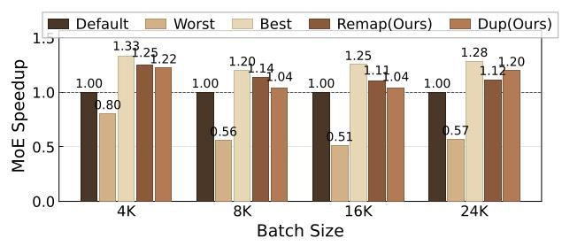

Figure 17. Performance of our prefill-aware expert placement.

> 
图 17. 我们的预填充感知专家放置的性能。

Baselines. Default is the standard contiguous placement used by Qwen and SGLang (experts 0-15 on GPU-0, 16- 31 on GPU-1, etc.). Best and Worst are the theoretically optimal and worst placements generated with oracle decode-stage selections (not available in practice). Remap and Dup are our two prefill-guided strategies. For Dup, we use one extra slot per GPU, yielding 128+8=136 experts per layer.

> 
基线方法。默认方式为Qwen与SGLang所采用的标准连续放置（专家0-15置于GPU-0，16-31置于GPU-1，依此类推）。Best与Worst分别代表利用理论最优和理论最劣的oracle解码阶段选择（实践中不可用）生成的放置方案。Remap与Dup是我们提出的两种预填充引导策略。对于Dup，我们为每个GPU增加一个额外槽位，从而每层得到128+8=136个专家。

## C. Results

As shown in Figure 17, Remap and Dup achieve speedups of 15.5% and 12.5% over Default, respectively, and deliver over 2× speedup compared with Worst. Both remain within 10% of Best, which exploits oracle decode-stage information unavailable in practice, which demonstrates the effectiveness of our approach. Since the two algorithms perform comparably, one can choose between them to fit different memory and system constraints.

> 
如图 17 所示，Remap 和 Dup 相对于 Default 分别实现了 15.5% 和 12.5% 的加速，并且相比 Worst 提供了超过 2 倍的加速。两者均保持在 Best 的 10% 以内，而 Best 利用了实际中不可用的先知解码阶段信息，这证明了我们方法的有效性。由于这两种算法性能相当，可以根据不同的内存和系统约束在它们之间进行选择。

We note that our 8-GPU EP scale inherently limits the achievable improvement: with EP8, each GPU holds 16 experts per layer, so every GPU likely contains a mix of hot and cold experts, naturally yielding a relatively balanced workload even under the Default layout (the max/min execution-time ratio is only about ${1.3} \times  )$ . We expect greater speedups at larger EP scales where load imbalance is more pronounced.

> 
我们注意到，8-GPU 专家并行规模天然限制了可实现的提升幅度：在 EP8 配置下，每张 GPU 每层承载 16 个专家，因此每张 GPU 很可能同时包含热门和冷门专家，即使在默认布局下也能自然形成相对均衡的工作负载（最大/最小执行时间比仅为 ${1.3} \times$）。我们预期在负载不均衡更为显著的更大 EP 规模下，加速效果将更为明显。

## VII. DISCUSSION

Both the wafer-scale GPU architecture and the prefill-guided expert placement strategy serve as case studies demonstrating the practical applicability of our profiling insights, which constitute the paper's primary contribution. Specifically, the wafer-scale GPU design follows Insight 3 for task allocation and leverages temporal relation insights (Insight 1 and part of Insight 2) to build a data-driven predictor. The prefill-guided placement strategy utilizes Insight 1 to guide decode-stage expert placement using information collected during prefill.

> 
晶圆级GPU架构与预填充引导的专家放置策略均作为案例研究，展示了我们的剖析洞察的实际适用性，而这些洞察构成了本文的主要贡献。具体而言，晶圆级GPU设计遵循洞察3进行任务分配，并借助时序关系洞察（洞察1与洞察2的部分内容）构建数据驱动的预测器；预填充引导的放置策略则利用洞察1，通过预填充阶段收集的信息来指导解码阶段的专家放置。

Importantly, our insights extend far beyond these two case studies and can benefit a wide range of MoE serving systems, including multi-GPU clusters (Multi-Node DGX [9], [15], [70] and NVL72 [71]), CXL-/CPU-based memory disaggregation [12], [31], flash-based multi-tier systems [72], [73], PIM architectures [33], [74], [75], and other emerging platforms.

> 
重要的是，我们的见解远不止于这两个案例研究，还可惠及广泛的MoE服务系统，包括多GPU集群（多节点DGX [9], [15], [70]和NVL72 [71]），基于CXL/CPU的内存分解[12], [31]，基于闪存的多层系统[72], [73]，PIM架构[33], [74], [75]以及其他新兴平台。

## VIII. RELATED WORK

MoE model behavior studies: Several MoE model tech reports [76]-[79] provide the MoE routing patterns as part of their evaluation. For example, the Mixtral report [77] shows the temporal locality of expert selection by reporting the percentage of repetitive assignment. The OLMoE report [76] shows the co-activation pattern and domain specialization among the experts. A blog post from SGLang [28] shows expert distribution statistics for the DeepSeekV3 model and the inherent imbalance in expert selection and similarity between prefill and decode. None of these studies provides a comprehensive profiling across multiple large-scale $\left( { > {200}\mathrm{\;B}}\right)$ MoE models, nor do they present a data-movement-centric methodology to highlight the opportunities like this paper.

> 
MoE 模型行为研究：多份 MoE 模型技术报告 [76]-[79] 在评估中提供了 MoE 路由模式。例如，Mixtral 报告 [77] 通过报告重复分配的百分比展示了专家选择的时间局部性。OLMoE 报告 [76] 展示了专家间的共激活模式和领域专长。SGLang 的一篇博客文章 [28] 展示了 DeepSeekV3 模型的专家分布统计信息，以及专家选择中固有的不平衡性与预填充和解码之间的相似性。这些研究均未对多个大规模（$\left( { > {200}\mathrm{\;B}}\right)$）MoE 模型进行全面剖析，也未像本文一样提出一种以数据移动为中心的方法论来凸显机遇。

Data movement optimization for MoE LLM inference Various prior works [9], [16], [31], [33], [80]-[87] have focused on improving the efficiency of MoE LLM inference by reducing data movement. For example, Lina and SmartMoE [81], [88] exploit expert selection skewness to dynamically schedule resources during inference and balance traffic across GPUs. LYNX [82] dynamically reduces active experts while preserving model accuracy. Pre-gate MoE [80] uses a pre-gating function to alleviate the dynamic nature of expert selection. Sida [85] builds an offline hash function to predict expert usage and reduce data movement between CPU and GPU. MoE-Lightning [31] leverages a CPU-GPU pipeline and paged weights to improve resource utilization. Eliseev and Mazur [84] exploit expert locality and leverage LRU caching to manage GPU and CPU memory. This work targets data movement reduction in MoE LLM inference. Our cross-model profiling reveals optimization principles that apply broadly to current and future systems regardless of scale.

> 
MoE LLM 推理的数据移动优化  多种先前工作 [9], [16], [31], [33], [80]-[87] 专注于通过减少数据移动来提升 MoE LLM 推理的效率。例如，Lina 和 SmartMoE [81], [88] 利用专家选择的偏斜性，在推理期间动态调度资源并平衡跨 GPU 的流量。LYNX [82] 在保持模型精度的同时动态减少活跃专家。Pre-gate MoE [80] 使用预门控函数来缓解专家选择的动态特性。Sida [85] 构建离线哈希函数以预测专家使用情况，并减少 CPU 与 GPU 之间的数据移动。MoE-Lightning [31] 利用 CPU-GPU 流水线和分页权重来提升资源利用率。Eliseev 和 Mazur [84] 利用专家局部性，并借助 LRU 缓存来管理 GPU 和 CPU 内存。本工作旨在减少 MoE LLM 推理中的数据移动。我们的跨模型分析揭示了广泛适用于当前及未来系统的优化原则，而无论其规模如何。

Wafer-Scale and Chiplet Architectures As single-chip scaling slows, wafer-scale and chiplet packaging offer promising paths for improved compute efficiency. Prior work targets either interconnect design [89]-[95] or data placement for specific algorithms [25], [96] and applications [26], [97], [98]. In contrast, we are the first to study MoE LLM serving on wafer-scale GPUs and propose data-movement-centric HW/SW codesign optimizations.

> 
随着单芯片扩展速度放缓，晶圆级和小芯片封装为提高计算效率提供了有前景的途径。先前的工作要么聚焦于互连设计[89]-[95]，要么针对特定算法[25]、[96]和应用[26]、[97]、[98]的数据放置。相比之下，我们首次研究了在晶圆级GPU上服务MoE LLM，并提出了以数据移动为中心的硬件/软件协同设计优化。

## IX. CONCLUSION

Unlike prior MoE serving studies that take system-centric approaches with deployment-specific strategies, we study MoE serving from a model-focused perspective. We conduct comprehensive data-movement-centric profiling of state-of-the-art MoE models (200B-1000B) to extract system-agnostic insights, revealing structured patterns underlying seemingly random data movement and providing actionable guidance on system design. We validate these insights on both a future wafer-scale GPU architecture and existing multi-GPU systems, achieving significant performance improvements through minimal architectural modifications and lightweight software design, demonstrating their broad applicability.

> 
与以往采用以系统为中心、针对特定部署进行策略设计的MoE服务研究不同，我们从以模型为中心的视角研究MoE服务。我们对最先进的MoE模型（2000亿至10000亿参数）进行了全面的、以数据移动为核心的特征分析，提取出与系统无关的洞察，揭示了看似随机的数据移动背后存在的结构化模式，并为系统设计提供了可操作的指导。我们既在未来的晶圆级GPU架构上，也在现有的多GPU系统上验证了这些洞察，通过最小的架构修改和轻量级软件设计实现了显著的性能提升，证明了它们的广泛适用性。

## ACKNOWLEDGMENT

We thank all reviewers for their constructive feedback and insightful suggestions. This work is partially supported by Samsung Semiconductor.

> 
我们感谢所有审稿人富有建设性的反馈与深刻的建议。本工作部分由三星半导体支持。

## ARTIFACT APPENDIX

### A.1 Abstract

This artifact packages the code, traces, scripts, and plotting utilities for reproducing the paper's main results across the two case studies.

> 
此构件打包了代码、执行轨迹、脚本和绘图工具，用于在两项案例研究中复现论文的主要结果。

Case Study 1 is a CPU-runnable wafer-scale GPU simulator for MoE inference. It evaluates our expert allocation and prediction strategies across four large-scale MoE models and two chiplet topologies, reproducing Figure 12

> 
案例研究1是一个用于MoE推理的可运行于CPU的晶圆级GPU模拟器。它在四个大规模MoE模型和两种小芯片拓扑上评估了我们的专家分配和预测策略，复现了图12。

Case Study 2 contains the real-GPU expert placement experiments and reproduces Figure 17 on an $8 \times  \mathrm{H}{100}$ system. It requires a specialized GPU software stack. Both artifacts provide a main_ae.py workflow for downloading traces, running experiments, and generating figures.

> 
案例研究 2 包含真实的 GPU 专家放置实验，并在一个 $8 \times  \mathrm{H}{100}$ 系统上复现了图 17。它需要一个专门的 GPU 软件栈。这两个工件都提供了一个 main_ae.py 工作流程，用于下载轨迹、运行实验和生成图表。

### A.2 Artifact Check-List

Program: Python 3.

> 
程序：Python 3

Run-time environment: Linux with Python $\geq  {3.10}$ .

> 
运行环境：Linux 搭配 Python $\geq  {3.10}$。

Hardware: Case Study 1 requires a CPU server with $\geq  {64}\mathrm{{GB}}$ RAM. Case Study 2 requires an $8 \times$ NVIDIA H100 80 GB GPU server.

> 
硬件：案例研究1需要一台内存 $\geq  {64}\mathrm{{GB}}$ 的CPU服务器。案例研究2需要一台 $8 \times$ NVIDIA H100 80 GB GPU服务器。

Output: Paper figures and CSV result files.

> 
输出：论文图表和CSV结果文件。

Disk space: About 80 GB for one model and up to 300 GB for all four models.

> 
磁盘空间：单个模型约 80 GB，全部四个模型则高达 300 GB。

Experiment time: Case Study 1 takes 8-12 hours for one model or 18-36 hours for all models. Case Study 2 takes 12- 16 hours.

> 
实验时间：案例研究1针对单个模型需要8-12小时，针对所有模型则需要18-36小时。案例研究2需要12-16小时。

Publicly available: Yes.

> 
公开可用：是。

Code license: Apache-2.0.

> 
代码许可证：Apache-2.0

### A.3 Description

A.3.1 How to Access: Case Study 1 (wafer-scale GPU simulator): GitHub: waferscale_gpu_moe_sim; DOI: 10.5281/zenodo.19617713

> 
A.3.1 如何访问：案例研究 1（晶圆级 GPU 模拟器）：GitHub：waferscale_gpu_moe_sim；DOI：10.5281/zenodo.19617713

Case Study 2 (real-GPU expert placement): GitHub: moe_exp_placement; DOI: 10.5281/zenodo.19617695

> 
案例研究2（真实GPU专家放置）：GitHub：moe_exp_placement；DOI：10.5281/zenodo.19617695

Each repository contains a README.md with setup, execution, and troubleshooting instructions. The Zenodo archives provide persistent snapshots of the evaluated artifact versions.

> 
每个仓库都包含一个 README.md 文件，其中提供了安装、运行和故障排除说明。Zenodo 存档则为评估后的工件版本提供了持久快照。

A.3.2 Hardware Dependencies: Case Study 1 runs on a CPU server with at least 64GB RAM and does not require a GPU. Case Study 2 requires an $8 \times$ NVIDIA H100 80 GB GPU server, CUDA 12.0 or newer, and about 300 GB of disk space. Reviewers without GPU access can still evaluate the primary simulator artifact.

> 
A.3.2 硬件依赖项：案例研究1运行在至少具有64GB RAM的CPU服务器上，无需GPU。案例研究2需要一台配备$8 \times$ NVIDIA H100 80 GB GPU的服务器、CUDA 12.0或更新版本以及约300 GB的磁盘空间。没有GPU访问权限的审阅者仍可评估主要模拟器构件。

A.3.3 Software Dependencies: Case Study 1 requires Python $\geq  {3.10}$ plus numpy, pandas, and matplotlib; the scripts install them automatically. Case Study 2 additionally requires PyTorch, a modified SGLang fork, DeepEP, and DeepGEMM. The repository documents exact installation commands and environment settings.

> 
A.3.3 软件依赖：案例研究 1 需要 Python $\geq  {3.10}$ 以及 numpy、pandas 和 matplotlib；脚本会自动安装它们。案例研究 2 额外需要 PyTorch、一个修改过的 SGLang 分支、DeepEP 和 DeepGEMM。仓库详细记录了确切的安装命令与环境设置。

A.3.4 Datasets: Both artifacts use pre-recorded MoE expert-selection traces from MMLU. The traces are hosted on HuggingFace and downloaded automatically by the AE scripts.

> 
A.3.4 数据集：两个工件均使用来自MMLU的预录MoE专家选择轨迹。这些轨迹托管于HuggingFace，并由AE脚本自动下载。

### A.4 Installation

Installation instructions are provided in each repository's README . md. Case Study 1 is self-contained and intended as the default AE path. Case Study 2 includes GPU stack and communication library setup.

> 
安装说明详见各仓库的 README . md。案例研究1是自包含的，旨在作为默认的AE路径。案例研究2包括GPU技术栈及通信库设置。

### A.5 Experiment Workflow

Both repositories provide a main_ae.py entry point. The script downloads traces, runs experiments, collects CSV files, and regenerates the corresponding paper figure. Reviewers may also run individual model configurations using the repository README .md commands.

> 
两个代码库都提供了一个 main_ae.py 入口点。该脚本会下载轨迹数据、运行实验、收集 CSV 文件，并重新生成对应的论文图表。审稿人也可以使用代码库的 README .md 中的命令来运行单个模型配置。

### A.6 Evaluation and Expected Results

Case Study 1 reproduces Figure 12 The simulator is deterministic, so generated results should match the reported trends when using the same traces and configuration files.

> 
案例研究1再现了图12。该模拟器是确定性的，因此在使用相同的跟踪与配置文件时，生成的结果应与报告的趋势相匹配。

Case Study 2 reproduces Figure 17 Because it measures real GPU execution, small timing variations are expected from thermals, system load, NCCL non-determinism, and SGLang micro-batching. In our runs, variation is typically within $\pm  5\%$ . The high-level result is stable: prefill-aware placement improves MoE kernel performance by about 5-25% over the default placement.

> 
案例研究 2 复现了图 17。由于测量的是真实 GPU 执行时间，预计会因散热、系统负载、NCCL 非确定性以及 SGLang 微批处理而出现小幅时间变化。在我们的运行中，变化通常保持在 $\pm  5\%$ 以内。高层结果是稳定的：与默认放置相比，预填充感知放置将 MoE 内核性能提升了约 5-25%。

### A.7 Methodology

Submission, reviewing, and badging follow the ACM artifact review guidelines and the cTuning AE guidelines

> 
提交、评审和颁发徽章遵循 ACM 工件审查指南和 cTuning AE 指南。

## REFERENCES

[1] D. Nam, A. Macvean, V. Hellendoorn, B. Vasilescu, and B. Myers, "Using an llm to help with code understanding," in Proceedings of the IEEE/ACM 46th International Conference on Software Engineering, ser. ICSE '24, 2024.

> 
[1] D. Nam, A. Macvean, V. Hellendoorn, B. Vasilescu, 和 B. Myers, “使用 llm 辅助代码理解,” 见 IEEE/ACM 第46届软件工程国际会议论文集, ser. ICSE '24, 2024.

[2] Y. Wang, W. Wang, S. Joty, and S. C. H. Hoi, "Codet5: Identifier-aware unified pre-trained encoder-decoder models for code understanding and generation," arXiv, 2021.

> 
[2] Y. Wang, W. Wang, S. Joty 和 S. C. H. Hoi, “Codet5：面向代码理解与生成的标识符感知统一预训练编码器-解码器模型,” arXiv, 2021.

[3] J. Achiam, S. Adler, S. Agarwal, L. Ahmad, I. Akkaya, F. L. Aleman, D. Almeida, J. Altenschmidt, S. Altman, S. Anadkat et al., "Gpt-4 technical report," arXiv, 2023.

> 
[3] J. Achiam, S. Adler, S. Agarwal, L. Ahmad, I. Akkaya, F. L. Aleman, D. Almeida, J. Altenschmidt, S. Altman, S. Anadkat 等，“GPT-4 技术报告”，arXiv，2023。

[4] Y. Lu, W. Zhu, L. Li, Y. Qiao, and F. Yuan, "Llamax: Scaling linguistic horizons of llm by enhancing translation capabilities beyond 100 languages," arXiv, 2024.

> 
[4] Y. Lu, W. Zhu, L. Li, Y. Qiao, 和 F. Yuan, "Llamax: 通过增强超越100种语言的翻译能力来拓展大语言模型的语言边界," arXiv, 2024.

[5] S. K. Dam, C. S. Hong, Y. Qiao, and C. Zhang, "A complete survey on llm-based ai chatbots," arXiv, 2024.

> 
[5] S. K. Dam, C. S. Hong, Y. Qiao, and C. Zhang, "一份关于基于LLM的AI聊天机器人的全面调查," arXiv, 2024.

[6] S. Vakayil, D. S. Juliet, S. Vakayil et al., "Rag-based llm chatbot using llama-2," in 2024 7th International Conference on Devices, Circuits and Systems (ICDCS), 2024.

> 
[6] S. Vakayil、D. S. Juliet、S. Vakayil 等，“基于RAG的LLM聊天机器人使用Llama-2”，见2024年第七届器件、电路与系统国际会议(ICDCS)，2024年。

[7] W.-L. Chiang, L. Zheng, Y. Sheng, A. N. Angelopoulos, T. Li, D. Li, B. Zhu, H. Zhang, M. Jordan, J. E. Gonzalez et al., "Chatbot arena: An open platform for evaluating llms by human preference," in Forty-first International Conference on Machine Learning, 2024.

> 
[7] W.-L. Chiang, L. Zheng, Y. Sheng, A. N. Angelopoulos, T. Li, D. Li, B. Zhu, H. Zhang, M. Jordan, J. E. Gonzalez 等人，“Chatbot Arena: 一个通过人类偏好评估大语言模型的开放平台，”收录于第四十一届国际机器学习会议，2024年。

[8] S. Go and D. Mahajan, "Moetuner: Optimized mixture of expert serving with balanced expert placement and token routing," arXiv preprint arXiv:2502.06643, 2025.

> 
[8] S. Go 和 D. Mahajan，"Moetuner: 基于均衡专家放置与令牌路由的优化混合专家服务，" arXiv 预印本 arXiv:2502.06643，2025。

[9] S. Zhang, N. Zheng, H. Lin, Z. Jiang, W. Bao, C. Jiang, Q. Hou, W. Cui, S. Zheng, L.-W. Chang, Q. Chen, and X. Liu, "COMET: Fine-grained computation-communication overlapping for mixture-of-experts," in Eighth Conference on Machine Learning and Systems, 2025. [Online]. Available: https://openreview.net/forum?id=fGgQS5VW09

> 
[9] S. Zhang, N. Zheng, H. Lin, Z. Jiang, W. Bao, C. Jiang, Q. Hou, W. Cui, S. Zheng, L.-W. Chang, Q. Chen, and X. Liu, “COMET：面向混合专家的细粒度计算-通信重叠,” 见第八届机器学习与系统会议, 2025. [在线]. 获取: https://openreview.net/forum?id=fGgQS5VW09

[10] DeepSeek-AI, "DeepSeek-V4: Towards highly efficient million-token context intelligence," Technical report, 2026. [Online]. Available: https://huggingface.co/deepseek-ai/DeepSeek-V4-Flash

> 
[10] DeepSeek-AI，《DeepSeek-V4：迈向高效百万token上下文智能》，技术报告，2026年。[在线]。可用：https://huggingface.co/deepseek-ai/DeepSeek-V4-Flash

[11] GLM-5 Team, A. Zeng, X. Lv, Z. Hou, Z. Du, Q. Zheng, B. Chen, D. Yin et al., "GLM-5: from vibe coding to agentic engineering," arXiv preprint arXiv:2602.15763, 2026.

> 
[11] GLM-5 团队，A. Zeng，X. Lv，Z. Hou，Z. Du，Q. Zheng，B. Chen，D. Yin 等，《GLM-5：从氛围编码到智能体工程》，arXiv 预印本 arXiv:2602.15763，2026 年。

[12] Z. Fang, Y. Huang, Z. Hong, Y. Lyu, W. Chen, Y. Yu, F. Yu, and Z. Zheng, "Klotski: Efficient mixture-of-expert inference via expert-aware multi-batch pipeline," in Proceedings of the 30th ACM International Conference on Architectural Support for Programming Languages and Operating Systems, Volume 2, 2025.

> 
[12] Z. Fang, Y. Huang, Z. Hong, Y. Lyu, W. Chen, Y. Yu, F. Yu, Z. Zheng, “Klotski：通过专家感知的多批次流水线实现高效混合专家推理”，载于《第30届ACM编程语言与操作系统体系结构支持国际会议论文集》，第2卷，2025年。

[13] S. Tairin, S. Mahmud, H. Shen, and A. Iyer, "emoe: Task-aware memory efficient mixture-of-experts-based (moe) model inference," arXiv preprint arXiv:2503.06823, 2025.

> 
[13] S. Tairin, S. Mahmud, H. Shen 和 A. Iyer, "emoe：任务感知型内存高效混合专家模型推理," arXiv 预印本 arXiv:2503.06823, 2025.

[14] J. Yao, Q. Anthony, A. Shafi, H. Subramoni, and D. K. D. Panda, "Exploiting inter-layer expert affinity for accelerating mixture-of-experts model inference," in 2024 IEEE International Parallel and Distributed Processing Symposium (IPDPS). IEEE, 2024.

> 
[14] J. Yao, Q. Anthony, A. Shafi, H. Subramoni, and D. K. D. Panda, “利用层间专家亲和性加速混合专家模型推理，” 载于 2024年IEEE国际并行与分布式处理研讨会 (IPDPS)。IEEE，2024。

[15] R. Zhu, Z. Jiang, C. Jin, P. Wu, C. A. Stuardo, D. Wang, X. Zhang, H. Zhou, H. Wei, Y. Cheng et al., "Megascale-infer: Serving mixture-of-experts at scale with disaggregated expert parallelism," arXiv preprint arXiv:2504.02263, 2025.

> 
[15] R. Zhu, Z. Jiang, C. Jin, P. Wu, C. A. Stuardo, D. Wang, X. Zhang, H. Zhou, H. Wei, Y. Cheng 等, “Megascale-infer: 通过解聚专家并行实现大规模混合专家服务,” arXiv 预印本 arXiv:2504.02263, 2025.

[16] A. Skliar, T. van Rozendaal, R. Lepert, T. Boinovski, M. Van Baalen, M. Nagel, P. Whatmough, and B. E. Bejnordi, "Mixture of cache-conditional experts for efficient mobile device inference," arXiv preprint arXiv:2412.00099, 2024.

> 
[16] A. Skliar, T. van Rozendaal, R. Lepert, T. Boinovski, M. Van Baalen, M. Nagel, P. Whatmough 和 B. E. Bejnordi, “用于高效移动设备推理的缓存条件专家混合模型,” arXiv 预印本 arXiv:2412.00099, 2024.

[17] K. T. Chitty-Venkata, S. Madireddy, M. Emani, and V. Vishwanath, "Lexi: Layer-adaptive active experts for efficient moe model inference," arXiv preprint arXiv:2509.02753, 2025.

> 
[17] K. T. Chitty-Venkata, S. Madireddy, M. Emani 和 V. Vishwanath, "Lexi: 用于高效MoE模型推理的层自适应主动专家," arXiv预印本 arXiv:2509.02753, 2025.

[18] A. Liu, B. Feng, B. Xue, B. Wang, B. Wu, C. Lu, C. Zhao, C. Deng, C. Zhang, C. Ruan et al., "Deepseek-v3 technical report," arXiv preprint arXiv:2412.19437, 2024.

> 
[18] A. Liu、B. Feng、B. Xue、B. Wang、B. Wu、C. Lu、C. Zhao、C. Deng、C. Zhang、C. Ruan 等, “Deepseek-v3 技术报告,” arXiv 预印本 arXiv:2412.19437, 2024.

[19] Meta. (2025) Llama4 technical report. [Online]. Available: https: //ai.meta.com/blog/llama-4-multimodal-intelligence/

> 
[19] Meta. (2025) Llama4 技术报告. [在线]. 获取地址: https: //ai.meta.com/blog/llama-4-multimodal-intelligence/

[20] A. Yang, A. Li, B. Yang, B. Zhang, B. Hui, B. Zheng, B. Yu, C. Gao, C. Huang, C. Lv et al., "Qwen3 technical report," arXiv preprint arXiv:2505.09388, 2025.

> 
[20] A. Yang, A. Li, B. Yang, B. Zhang, B. Hui, B. Zheng, B. Yu, C. Gao, C. Huang, C. Lv 等, "Qwen3 技术报告," arXiv 预印本 arXiv:2505.09388, 2025.

[21] K. Team, Y. Bai, Y. Bao, G. Chen, J. Chen, N. Chen, R. Chen, Y. Chen, Y. Chen, Y. Chen et al., "Kimi k2: Open agentic intelligence," arXiv preprint arXiv:2507.20534, 2025.

> 
[21] K. Team, Y. Bai, Y. Bao, G. Chen, J. Chen, N. Chen, R. Chen, Y. Chen, Y. Chen, Y. Chen 等，《Kimi k2: Open agentic intelligence》，arXiv预印本 arXiv:2507.20534，2025年。

[22] A. Smith, G. H. Loh, J. Wuu, S. Naffziger, T. Huang, H. McIntyre, R. Mangaser, W. Jung, and R. Swaminathan, "Amd instinct™ mi300x accelerator: Packaging and architecture co-optimization," in 2024 IEEE Symposium on VLSI Technology and Circuits (VLSI Technology and Circuits). IEEE, 2024.

> 
[22] A. Smith, G. H. Loh, J. Wuu, S. Naffziger, T. Huang, H. McIntyre, R. Mangaser, W. Jung, 和 R. Swaminathan, "Amd instinct™ mi300x 加速器：封装与架构协同优化," 发表于 2024 年 IEEE VLSI 技术与电路研讨会 (VLSI 技术与电路). IEEE, 2024.

[23] P. Dalmia, R. S. Kumar, and M. D. Sinclair, "Cpelide: Efficient multi-chiplet gpu implicit synchronization," in 2024 57th IEEE/ACM International Symposium on Microarchitecture (MICRO), 2024.

> 
[23] P. Dalmia, R. S. Kumar 和 M. D. Sinclair，《Cpelide：高效多芯粒GPU隐式同步》，载于 2024 年第 57 届 IEEE/ACM 国际微架构研讨会 (MICRO)，2024。

[24] NVIDIA, "Nvidia blackwell architecture overview," https://resources.nvidia.com/en-us-blackwell-architecture 2025.

> 
[24] NVIDIA，“NVIDIA Blackwell 架构概述”，https://resources.nvidia.com/en-us-blackwell-architecture 2025。

[25] C. He, Y. Huang, P. Mu, Z. Miao, J. Xue, L. Ma, F. Yang, and L. Mai, "Waferlim: Large language model inference at wafer scale," in 19th USENIX Symposium on Operating Systems Design and Implementation (OSDI 25). USENIX Association, 2025.

> 
[25] C. He, Y. Huang, P. Mu, Z. Miao, J. Xue, L. Ma, F. Yang, 和 L. Mai, “Waferlim: 大规模语言模型在晶圆级进行推理,” 在第十九届USENIX操作系统设计与实现研讨会（OSDI 25）中. USENIX协会, 2025.

[26] Z. Xu, D. Kong, J. Liu, J. Li, J. Hou, X. Dai, C. Li, S. Wei, Y. Hu, and S. Yin, "Wsc-llm: Efficient llm service and architecture co-exploration for wafer-scale chips," in Proceedings of the 52nd Annual International Symposium on Computer Architecture, 2025, pp. 1-17.

> 
[26] Z. Xu、D. Kong、J. Liu、J. Li、J. Hou、X. Dai、C. Li、S. Wei、Y. Hu 和 S. Yin，“Wsc-llm：面向晶圆级芯片的高效大语言模型服务与架构协同探索，”见《第52届国际计算机体系结构研讨会论文集》，2025年，第1-17页。

[27] S. T. from LMSYS Org. (2025) Together with sglang: Best practices for serving deepseek-r1 on h20-96g. [Online]. Available: https://lmsys.org/blog/2025-09-26-sglang-ant-group/

> 
[27] 来自 LMSYS 组织的 S. T. (2025) 与 sglang 携手：在 H20-96G 上部署 DeepSeek-R1 的最佳实践. [在线]. 获取地址: https://lmsys.org/blog/2025-09-26-sglang-ant-group/

[28] - . (2025) Deploying deepseek with pd disaggregation and large-scale expert parallelism on 96 h100 gpus. [Online]. Available: https://lmsys.org/blog/2025-05-05-large-scale-ep/

> 
[28] - . (2025) 在96块H100 GPU上采用预填充-解码分离与大规模专家并行部署DeepSeek. [在线]. 可访问: https://lmsys.org/blog/2025-05-05-large-scale-ep/

[29] A. Vaswani, N. Shazeer, N. Parmar, J. Uszkoreit, L. Jones, A. N. Gomez, Ł. Kaiser, and I. Polosukhin, "Attention is all you need," Advances in neural information processing systems, 2017.

> 
[29] A. Vaswani、N. Shazeer、N. Parmar、J. Uszkoreit、L. Jones、A. N. Gomez、Ł. Kaiser 和 I. Polosukhin，“注意力即你所需要的一切”，《神经信息处理系统进展》，2017年。

[30] S. Masoudnia and R. Ebrahimpour, "Mixture of experts: a literature survey," Artificial Intelligence Review, pp. 275-293, 2014.

> 
[30] S. Masoudnia 和 R. Ebrahimpour，“专家混合：文献综述”，《人工智能评论》，第 275-293 页，2014 年。

[31] S. Cao, S. Liu, T. Griggs, P. Schafhalter, X. Liu, Y. Sheng, J. E. Gonzalez, M. Zaharia, and I. Stoica, "Moe-lightning: High-throughput moe inference on memory-constrained gpus," in Proceedings of the 30th ACM International Conference on Architectural Support for Programming Languages and Operating Systems, 2025.

> 
[31] S. Cao, S. Liu, T. Griggs, P. Schafhalter, X. Liu, Y. Sheng, J. E. Gonzalez, M. Zaharia, 和 I. Stoica, “Moe-lightning：内存受限GPU上的高吞吐量MoE推理,” 见《第30届ACM编程语言与操作系统架构支持国际会议论文集》, 2025.

[32] J. Suo, X. Liao, L. Xiao, L. Ruan, J. Wang, X. Su, and Z. Huo, "Coserve: Efficient collaboration-of-experts (coe) model inference with limited memory," in Proceedings of the 30th ACM International Conference on Architectural Support for Programming Languages and Operating Systems, 2025.

> 
[32] J. Suo, X. Liao, L. Xiao, L. Ruan, J. Wang, X. Su 和 Z. Huo, “Coserve：内存受限下高效的专家协作推理模型,” 收录于第30届ACM编程语言与操作系统架构支持国际会议论文集, 2025.

[33] S. Yun, K. Kyung, J. Cho, J. Choi, J. Kim, B. Kim, S. Lee, K. Sohn, and J. H. Ahn, "Duplex: A device for large language models with mixture of experts, grouped query attention, and continuous batching," in 2024 57th IEEE/ACM International Symposium on Microarchitecture (MICRO), 2024.

> 
[33] S. Yun, K. Kyung, J. Cho, J. Choi, J. Kim, B. Kim, S. Lee, K. Sohn, 与 J. H. Ahn，“Duplex：面向混合专家、分组查询注意力与连续批处理的大语言模型设备”，载于《2024年第57届IEEE/ACM国际微架构研讨会（MICRO）》，2024年。

[34] P. Schober, C. Boer, and L. A. Schwarte, "Correlation coefficients: appropriate use and interpretation," Anesthesia & analgesia, 2018.

> 
[34] P. Schober、C. Boer 和 L. A. Schwarte，“相关系数：恰当使用与解释”，《Anesthesia & analgesia》，2018。

[35] D. Hendrycks, C. Burns, S. Basart, A. Zou, M. Mazeika, D. Song, and J. Steinhardt, "Measuring massive multitask language understanding," arXiv preprint arXiv:2009.03300, 2020.

> 
[35] D. Hendrycks, C. Burns, S. Basart, A. Zou, M. Mazeika, D. Song 和 J. Steinhardt, “测量大规模多任务语言理解,” arXiv 预印本 arXiv:2009.03300, 2020.

[36] Y. Wang, X. Ma, G. Zhang, Y. Ni, A. Chandra, S. Guo, W. Ren, A. Arulraj, X. He, Z. Jiang et al., "Mmlu-pro: A more robust and challenging multi-task language understanding benchmark," Advances in Neural Information Processing Systems, 2024.

> 
[36] Y. Wang, X. Ma, G. Zhang, Y. Ni, A. Chandra, S. Guo, W. Ren, A. Arulraj, X. He, Z. Jiang 等，“Mmlu-pro：一个更鲁棒且更具挑战性的多任务语言理解基准”，《神经信息处理系统进展》，2024。

[37] M. Lundstrom, "Moore's law forever?" Science, 2003.

> 
[37] M. Lundstrom, "摩尔定律永存？", Science, 2003.

[38] Y.-C. Hu, Y.-M. Liang, H.-P. Hu, C.-Y. Tan, C.-T. Shen, C.-H. Lee, and S. Hou, "Cowos architecture evolution for next generation hpc on 2.5 d system in package," in 2023 IEEE 73rd Electronic Components and Technology Conference (ECTC), 2023.

> 
[38] Y.-C. Hu、Y.-M. Liang、H.-P. Hu、C.-Y. Tan、C.-T. Shen、C.-H. Lee 与 S. Hou，《基于2.5D系统级封装的下一代高性能计算Cowos架构演进》，收录于 2023 IEEE第73届电子元件与技术大会（ECTC），2023年。

[39] J. Shin, H. Eslampour, S. Jeong, W. Kim, S. Yong, S.-O. Ahn, E. Park, and S. Song, "Signal integrity of die-to-die interface with advanced packages for co-packaged optics," in 2024 IEEE 33rd Conference on Electrical Performance of Electronic Packaging and Systems (EPEPS), 2024.

> 
[39] J. Shin, H. Eslampour, S. Jeong, W. Kim, S. Yong, S.-O. Ahn, E. Park, and S. Song, "用于共封装光学的先进封装中裸片间接口的信号完整性，" 收录于 2024 IEEE 第33届电子封装与系统电气性能会议（EPEPS），2024。

[40] R. Mahajan, R. Sankman, N. Patel, D.-W. Kim, K. Aygun, Z. Qian, Y. Mekonnen, I. Salama, S. Sharan, D. Iyengar et al., "Embedded multi-die interconnect bridge (emib)-a high density, high bandwidth packaging interconnect," in 2016 IEEE 66th Electronic Components and Technology Conference (ECTC), 2016.

> 
[40] R. Mahajan、R. Sankman、N. Patel、D.-W. Kim、K. Aygun、Z. Qian、Y. Mekonnen、I. Salama、S. Sharan、D. Iyengar 等，“嵌入式多芯片互连桥接（EMIB）——一种高密度、高带宽封装互连技术”，载于《2016 IEEE 第66届电子元件与技术大会（ECTC）》，2016年。

[41] NVIDIA, "Nvidia gtc 2025," https://www.nvidia.com/gtc/ 2025.

> 
[41] 英伟达，"英伟达 GTC 2025，" https://www.nvidia.com/gtc/ 2025.

[42] S. Hou, W. C. Chen, C. Hu, C. Chiu, K. Ting, T. Lin, W. Wei, W. Chiou, V. J. Lin, V. C. Chang et al., "Wafer-level integration of an advanced logic-memory system through the second-generation cowos technology," IEEE Transactions on Electron Devices, 2017.

> 
[42] S. Hou, W. C. Chen, C. Hu, C. Chiu, K. Ting, T. Lin, W. Wei, W. Chiou, V. J. Lin, V. C. Chang 等，“基于第二代CoWoS技术的先进逻辑-内存系统晶圆级集成”，《IEEE电子器件汇刊》，2017年。

[43] P.-C. Shih, A.-J. Su, K.-H. Tam, T.-C. Huang, K. Chuang, and J. Yeh, "Sow-x: A novel system-on-wafer technology for next generation ai server application," in 2025 IEEE 75th Electronic Components and Technology Conference (ECTC). IEEE, 2025.

> 
[43] P.-C. Shih, A.-J. Su, K.-H. Tam, T.-C. Huang, K. Chuang, and J. Yeh, “Sow-x: 一种面向下一代AI服务器应用的新型晶圆上系统技术,” 收录于 2025年IEEE第75届电子元器件与技术大会 (ECTC)。IEEE, 2025.

[44] S. Hou, H. Hsia, C. Tsai, K. Ting, T. Yu, Y. Lee, F. Chen, W. Chiou, C. Wang, C. Wu et al., "Integrated deep trench capacitor in si interposer for cowos heterogeneous integration," in 2019 IEEE International Electron Devices Meeting (IEDM). IEEE, 2019, pp. 19-5.

> 
[44] S. Hou, H. Hsia, C. Tsai, K. Ting, T. Yu, Y. Lee, F. Chen, W. Chiou, C. Wang, C. Wu 等, “用于CoWoS异构集成的硅中介层集成深槽电容器,” 载于 2019年IEEE国际电子器件会议 (IEDM). IEEE, 2019, pp. 19-5.

[45] X. Tang, J. Hou, D. Jiang, T. Wei, J. Liu, J. Deng, H. Wang, Q. Yang, H. Shang, C. Li et al., "Moentwine: Unleashing the potential of wafer-scale chips for large-scale expert parallel inference," arXiv preprint arXiv:2510.25258, 2025.

> 
[45] X. Tang、J. Hou、D. Jiang、T. Wei、J. Liu、J. Deng、H. Wang、Q. Yang、H. Shang、C. Li 等人，“Moentwine：释放晶圆级芯片在大规模专家并行推理中的潜力，” arXiv预印本 arXiv:2510.25258，2025。

[46] M. Joshi, B. Joo, Z. Susskind, A. Hendriksen, and K. Clark. (2026) Accelerating data processing with NVIDIA multi-instance GPU and NUMA node localization. NVIDIA Technical Blog. [Online]. Available: https://developer.nvidia.com/blog/accelerating-data-processing-with-nvidia-multi-instance-gpu-and-numa-node-localization/

> 
[46] M. Joshi, B. Joo, Z. Susskind, A. Hendriksen, 与 K. Clark. (2026) 利用NVIDIA多实例GPU与NUMA节点本地化加速数据处理. NVIDIA Technical Blog. [Online]. Available: https://developer.nvidia.com/blog/accelerating-data-processing-with-nvidia-multi-instance-gpu-and-numa-node-localization/

[47] D. Xu, Y. Li, Y. Sun, J. Ren, and Y. Sun, "Hdpat: Hierarchical distributed page address translation for wafer-scale gpus," in 2026 IEEE International Symposium on High Performance Computer Architecture (HPCA), 2026.

> 
[47] D. Xu, Y. Li, Y. Sun, J. Ren 和 Y. Sun，“Hdpat: 晶圆级GPU的分层分布式页地址转换”，载于2026年IEEE国际高性能计算机体系结构研讨会(HPCA)，2026年。

[48] Z. Huang, S. Fan, C. Tang, X. Lin, S. Deng, and Y. Liu, "Hecaton: Training large language models with scalable chiplet systems," arXiv preprint arXiv:2407.05784, 2024.

> 
[48] Z. Huang, S. Fan, C. Tang, X. Lin, S. Deng 和 Y. Liu, “Hecaton: Training large language models with scalable chiplet systems,” arXiv 预印本 arXiv:2407.05784, 2024 年。

[49] M. LeBeane, K. Hamidouche, B. Benton, M. Breternitz, S. K. Reinhardt, and L. K. John, "Comp-net: Command processor networking for efficient intra-kernel communications on gpus," in Proceedings of the 27th International Conference on Parallel Architectures and Compilation Techniques, 2018.

> 
[49] M. LeBeane, K. Hamidouche, B. Benton, M. Breternitz, S. K. Reinhardt 和 L. K. John，“Comp-net：面向 GPU 高效核内通信的命令处理器网络化”，发表于《第 27 届并行架构与编译技术国际会议论文集》，2018 年。

[50] A. Gutierrez, B. M. Beckmann, A. Dutu, J. Gross, M. LeBeane, J. Kala-matianos, O. Kayiran, M. Poremba, B. Potter, S. Puthoor et al., "Lost in abstraction: Pitfalls of analyzing gpus at the intermediate language level," in 2018 IEEE International Symposium on High Performance Computer Architecture (HPCA), 2018.

> 
[50] A. Gutierrez, B. M. Beckmann, A. Dutu, J. Gross, M. LeBeane, J. Kala-matianos, O. Kayiran, M. Poremba, B. Potter, S. Puthoor 等, “Lost in abstraction: Pitfalls of analyzing gpus at the intermediate language level,” 载于《2018 IEEE International Symposium on High Performance Computer Architecture (HPCA)》，2018年。

[51] L. Zheng, L. Yin, Z. Xie, C. L. Sun, J. Huang, C. H. Yu, S. Cao, C. Kozyrakis, I. Stoica, J. E. Gonzalez et al., "Sglang: Efficient execution of structured language model programs," Advances in neural information processing systems, 2024.

> 
[51] L. Zheng、L. Yin、Z. Xie、C. L. Sun、J. Huang、C. H. Yu、S. Cao、C. Kozyrakis、I. Stoica、J. E. Gonzalez 等人，“Sglang：结构化语言模型程序的高效执行”，《神经信息处理系统进展》，2024年。

[52] N. Binkert, B. Beckmann, G. Black, S. K. Reinhardt, A. Saidi, A. Basu, J. Hestness, D. R. Hower, T. Krishna, S. Sardashti et al., "The gem5 simulator," ACM SIGARCH computer architecture news, 2011.

> 
[52] N. Binkert, B. Beckmann, G. Black, S. K. Reinhardt, A. Saidi, A. Basu, J. Hestness, D. R. Hower, T. Krishna, S. Sardashti 等，"The gem5 simulator"，刊于《ACM SIGARCH 计算机体系结构通讯》，2011年。

[53] A. Bakhoda, G. L. Yuan, W. W. Fung, H. Wong, and T. M. Aamodt, "Analyzing cuda workloads using a detailed gpu simulator," in 2009 IEEE international symposium on performance analysis of systems and software, 2009.

> 
[53] A. Bakhoda, G. L. Yuan, W. W. Fung, H. Wong, 和 T. M. Aamodt, “使用详细GPU模拟器分析cuda工作负载,” 在2009年IEEE系统与软件性能分析国际研讨会上, 2009年。

[54] Y. Sun, T. Baruah, S. A. Mojumder, S. Dong, X. Gong, S. Treadway, Y. Bao, S. Hance, C. McCardwell, V. Zhao et al., "Mgpusim: Enabling multi-gpu performance modeling and optimization," in Proceedings of the 46th International Symposium on Computer Architecture, 2019.

> 
[54] Y. Sun, T. Baruah, S. A. Mojumder, S. Dong, X. Gong, S. Treadway, Y. Bao, S. Hance, C. McCardwell, V. Zhao 等, “Mgpusim: 实现多GPU性能建模与优化,” 见第46届计算机体系结构国际研讨会论文集, 2019.

[55] W. Won, T. Heo, S. Rashidi, S. Sridharan, S. Srinivasan, and T. Krishna, "Astra-sim2. 0: Modeling hierarchical networks and disaggregated systems for large-model training at scale," in 2023 IEEE International Symposium on Performance Analysis of Systems and Software (ISPASS), 2023.

> 
[55] W. Won, T. Heo, S. Rashidi, S. Sridharan, S. Srinivasan, and T. Krishna, “Astra-sim2.0：面向大规模大模型训练的分层网络与分解系统建模，”载于 2023 年 IEEE 国际系统与软件性能分析研讨会 (ISPASS)，2023 年。

[56] Y. Zhong, S. Liu, J. Chen, J. Hu, Y. Zhu, X. Liu, X. Jin, and H. Zhang, "\{DistServe\}: Disaggregating prefill and decoding for goodput-optimized large language model serving," in 18th USENIX Symposium on Operating Systems Design and Implementation (OSDI 24), 2024.

> 
[56] Y. Zhong、S. Liu、J. Chen、J. Hu、Y. Zhu、X. Liu、X. Jin 和 H. Zhang, “{DistServe}：面向有效吞吐量优化的大型语言模型服务中的预填充与解码分离,” 载于第18届 USENIX 操作系统设计与实现研讨会 (OSDI 24)，2024年。

[57] B. Wu, S. Liu, Y. Zhong, P. Sun, X. Liu, and X. Jin, "Loongserve: Efficiently serving long-context large language models with elastic sequence parallelism," in Proceedings of the ACM SIGOPS 30th Symposium on Operating Systems Principles, 2024, pp. 640-654.

> 
[57] B. Wu, S. Liu, Y. Zhong, P. Sun, X. Liu 和 X. Jin, “Loongserve: 利用弹性序列并行高效服务长上下文大语言模型，” 收录于《第30届ACM SIGOPS操作系统原理研讨会论文集》，2024年，第640-654页。

[58] R. Qin, Z. Li, W. He, J. Cui, F. Ren, M. Zhang, Y. Wu, W. Zheng, and X. Xu, "Mooncake: Trading more storage for less computation-a \{KVCache-centric\} architecture for serving \{LLM\} chatbot," in 23rd USENIX Conference on File and Storage Technologies (FAST 25), 2025.

> 
[58] R. Qin, Z. Li, W. He, J. Cui, F. Ren, M. Zhang, Y. Wu, W. Zheng 和 X. Xu，“Mooncake: 以更多存储换取更少计算——一种以 \{KVCache\} 为中心的 \{LLM\} 聊天机器人服务架构”，收录于第23届USENIX文件与存储技术会议 (FAST 25)，2025年。

[59] E. Talpes, D. D. Sarma, D. Williams, S. Arora, T. Kunjan, B. Floering, A. Jalote, C. Hsiong, C. Poorna, V. Samant et al., "The microarchitecture of dojo, tesla's exa-scale computer," IEEE Micro, 2023.

> 
[59] E. Talpes, D. D. Sarma, D. Williams, S. Arora, T. Kunjan, B. Floering, A. Jalote, C. Hsiong, C. Poorna, V. Samant et al., "Dojo——特斯拉百亿亿次级计算机的微架构，" IEEE Micro, 2023.

[60] E. Talpes, D. Williams, and D. D. Sarma, "Dojo: The microarchitecture of tesla's exa-scale computer," in 2022 IEEE Hot Chips 34 Symposium (HCS), 2022.

> 
[60] E. Talpes, D. Williams 和 D. D. Sarma, “Dojo：特斯拉百亿亿次级计算机的微架构，” 收录于 2022年IEEE Hot Chips 34研讨会(HCS)，2022。

[61] TSMC. (2025) Tsmc's next generation of system-on-wafer package will make today's cpus and gpus look pathetically feeble in comparison. [Online]. Available: https://www.pcgamer.com/hardware/processors/tsmcs-next-generation-of-system-on-wafer-packaging-will-make-todays-cpus-and-gpus-look-pathetically-feeble-in-comparison/

> 
[61] TSMC. (2025) 台积电的下一代晶圆级系统封装，将让今日的CPU与GPU相比之下显得孱弱不堪。[Online]. Available: https://www.pcgamer.com/hardware/processors/tsmcs-next-generation-of-system-on-wafer-packaging-will-make-todays-cpus-and-gpus-look-pathetically-feeble-in-comparison/

[62] Y. He, S. Li, J. Liu, Y. Tan, W. Wang, H. Huang, X. Bu, H. Guo, C. Hu, B. Zheng et al., "Chinese simpleqa: A chinese factuality evaluation for large language models," arXiv preprint arXiv:2411.07140, 2024.

> 
[62] Y. He, S. Li, J. Liu, Y. Tan, W. Wang, H. Huang, X. Bu, H. Guo, C. Hu, B. Zheng 等，“Chinese simpleqa: A chinese factuality evaluation for large language models，” arXiv 预印本 arXiv:2411.07140，2024年。

[63] N. Jain, K. Han, A. Gu, W.-D. Li, F. Yan, T. Zhang, S. Wang, A. Solar-Lezama, K. Sen, and I. Stoica, "Livecodebench: Holistic and contamination free evaluation of large language models for code," arXiv preprint arXiv:2403.07974, 2024.

> 
[63] N. Jain, K. Han, A. Gu, W.-D. Li, F. Yan, T. Zhang, S. Wang, A. Solar-Lezama, K. Sen, 和 I. Stoica, “Livecodebench: 对大型语言模型代码能力的全面且无污染评估”，arXiv 预印本 arXiv:2403.07974，2024年。

[64] C. Wolf, J. Glaser, and J. Kepler, "Yosys-a free verilog synthesis suite," in Proceedings of the 21st Austrian Workshop on Microelectronics (Austrochip), vol. 97, 2013, pp. 1-6.

> 
[64] C. Wolf, J. Glaser 和 J. Kepler，“Yosys——一款免费的Verilog综合套件”，载于《第21届奥地利微电子学研讨会（Austrochip）论文集》，第97卷，2013年，第1-6页。

[65] R. Balasubramonian, A. B. Kahng, N. Muralimanohar, A. Shafiee, and V. Srinivas, "Cacti 7: New tools for interconnect exploration in innovative off-chip memories," ACM Transactions on Architecture and Code Optimization (TACO), vol. 14, no. 2, pp. 1-25, 2017.

> 
[65] R. Balasubramonian, A. B. Kahng, N. Muralimanohar, A. Shafiee 和 V. Srinivas, “Cacti 7：面向创新片外存储器互连探索的新工具,”《ACM 架构与代码优化汇刊》（TACO），卷14，期2，页码1-25，2017。

[66] G. Shan, Y. Zheng, C. Xing, D. Chen, G. Li, and Y. Yang, "Architecture of computing system based on chiplet," Micromachines, vol. 13, no. 2, p. 205, 2022.

> 
[66] G. Shan, Y. Zheng, C. Xing, D. Chen, G. Li 和 Y. Yang, “基于芯粒的计算系统架构,” *Micromachines*, 第13卷, 第2期, 第205页, 2022年.

[67] K. Wang, J. Chen, Y. Xu, Z. Yu, W. He, D. Tang, N. Sun, and Y. Bao, "Xiangshan: An open-source project for high-performance risc-v processors meeting industrial-grade standards," IEEE Micro, 2025.

> 
[67] K. Wang, J. Chen, Y. Xu, Z. Yu, W. He, D. Tang, N. Sun, 和 Y. Bao, “香山：一个满足工业级标准的高性能risc-v处理器开源项目,” IEEE Micro, 2025.

[68] deepseek-ai, "Eplb: Expert parallelism load balancer," 2026, gitHub repository (Python implementation: eplb.py). [Online]. Available: https://github.com/deepseek-ai/EPLB

> 
[68] deepseek-ai，《Eplb: 专家并行负载均衡器》，2026年，GitHub仓库（Python实现：eplb.py）。[在线]。访问地址：https://github.com/deepseek-ai/EPLB

[69] vLLM Team. (2025) Expert parallel deployment - configuration. VLLM Documentation, version 0.12.0. [Online]. Available: https://docs.vllm.ai/en/v0.12.0/serving/expert_parallel_deployment/#configuration_1

> 
[69] vLLM 团队. (2025) 专家并行部署 - 配置. VLLM 文档, 版本 0.12.0. [在线]. 可用: https://docs.vllm.ai/en/v0.12.0/serving/expert_parallel_deployment/#configuration_1

[70] C. Chen, M. Li, Z. Wu, D. Yu, and C. Yang, "Ta-moe: Topology-aware large scale mixture-of-expert training," Advances in Neural Information Processing Systems, vol. 35, pp. 22 173-22 186, 2022.

> 
[70] C. Chen, M. Li, Z. Wu, D. Yu 和 C. Yan，“Ta-moe：拓扑感知的大规模混合专家训练，”《神经信息处理系统进展》，第35卷，第22 173-22 186页，2022年。

[71] W. Li, J. Peng, Z. Jing, T. Zhang, Z. Long, X. Qiao, X. Chen, D. Yang, K. Duan, and J. Yang, "Dwdp: Distributed weight data parallelism for high-performance llm inference on nv172," arXiv preprint arXiv:2604.01621, 2026.

> 
[71] W. Li, J. Peng, Z. Jing, T. Zhang, Z. Long, X. Qiao, X. Chen, D. Yang, K. Duan 和 J. Yang, "Dwdp: 面向 nv172 上高性能大语言模型推理的分布式权重数据并行," arXiv 预印本 arXiv:2604.01621, 2026。

[72] Z. Yu, S. Liang, T. Ma, Y. Cai, Z. Nan, D. Huang, X. Song, Y. Hao, J. Zhang, T. Zhi et al., "Cambricon-llm: A chiplet-based hybrid architecture for on-device inference of 70b llm," in 2024 57th IEEE/ACM International Symposium on Microarchitecture (MICRO), 2024.

> 
[72] Z. Yu, S. Liang, T. Ma, Y. Cai, Z. Nan, D. Huang, X. Song, Y. Hao, J. Zhang, T. Zhi 等, “Cambricon-llm: 一种基于芯粒的混合架构，用于70b大语言模型的设备端推理,” 收录于 2024 年第 57 届 IEEE/ACM 国际微架构研讨会 (MICRO), 2024.

[73] Y. Sheng, L. Zheng, B. Yuan, Z. Li, M. Ryabinin, B. Chen, P. Liang, C. Ré, I. Stoica, and C. Zhang, "Flexgen: High-throughput generative inference of large language models with a single gpu," in International Conference on Machine Learning, 2023.

> 
[73] Y. Sheng、L. Zheng、B. Yuan、Z. Li、M. Ryabinin、B. Chen、P. Liang、C. Ré、I. Stoica 和 C. Zhang，“Flexgen: High-throughput generative inference of large language models with a single gpu，”收录于机器学习国际会议，2023年。

[74] Y. Pan, Z. Xia, P.-K. Hsu, L. Hu, H. Kim, J. Sharda, M. Zhou, N. S. Kim, S. Yu, T. Rosing et al., "Stratum: System-hardware co-design with tiered monolithic 3d-stackable dram for efficient moe serving," in Proceedings of the 58th IEEE/ACM International Symposium on Microarchitecture, 2025, pp. 1-17.

> 
[74] Y. Pan、Z. Xia、P.-K. Hsu、L. Hu、H. Kim、J. Sharda、M. Zhou、N. S. Kim、S. Yu、T. Rosing 等人，“Stratum：采用分层单片 3D 可堆叠 DRAM 的系统-硬件协同设计，实现高效 MoE 服务，”收录于第 58 届 IEEE/ACM 微架构国际研讨会论文集，2025 年，第 1-17 页。

[75] Z. Yu, H. Ye, C. Zhou, O. R. Venkatachalam, Z. Pan, Z. Hu, J. Kim, W. W. Ro, P.-A. Tsai, S. Pei, Y. Kang, and Y. Ding, "Amma: A multi-chiplet memory-centric architecture for low-latency $1\mathrm{\;m}$ context attention serving," arXiv preprint arXiv:2604.26103, 2026.

> 
[75] Z. Yu, H. Ye, C. Zhou, O. R. Venkatachalam, Z. Pan, Z. Hu, J. Kim, W. W. Ro, P.-A. Tsai, S. Pei, Y. Kang 和 Y. Ding，《Amma：面向低延迟 $1\mathrm{\;m}$ 上下文注意力服务的多芯粒内存中心架构》，arXiv 预印本 arXiv:2604.26103，2026。

[76] N. Muennighoff, L. Soldaini, D. Groeneveld, K. Lo, J. Morrison, S. Min, W. Shi, P. Walsh, O. Tafjord, N. Lambert et al., "Olmoe: Open mixture-of-experts language models," arXiv preprint arXiv:2409.02060, 2024.

> 
[76] N. Muennighoff, L. Soldaini, D. Groeneveld, K. Lo, J. Morrison, S. Min, W. Shi, P. Walsh, O. Tafjord, N. Lambert 等，《Olmoe：开放式混合专家语言模型》，arXiv预印本 arXiv:2409.02060，2024。

[77] A. Q. Jiang, A. Sablayrolles, A. Roux, A. Mensch, B. Savary, C. Bamford, D. S. Chaplot, D. d. 1. Casas, E. B. Hanna, F. Bressand et al., "Mixtral of experts," arXiv preprint arXiv:2401.04088, 2024.

> 
[77] A. Q. Jiang, A. Sablayrolles, A. Roux, A. Mensch, B. Savary, C. Bamford, D. S. Chaplot, D. d. 1. Casas, E. B. Hanna, F. Bressand 等, “Mixtral专家模型,” arXiv预印本 arXiv:2401.04088, 2024.

[78] D. Dai, C. Deng, C. Zhao, R. Xu, H. Gao, D. Chen, J. Li, W. Zeng, X. Yu, Y. Wu et al., "Deepseekmoe: Towards ultimate expert specialization in mixture-of-experts language models," arXiv preprint arXiv:2401.06066, 2024.

> 
[78] D. Dai, C. Deng, C. Zhao, R. Xu, H. Gao, D. Chen, J. Li, W. Zeng, X. Yu, Y. Wu 等，“Deepseekmoe：迈向混合专家语言模型中的终极专家专业化，” arXiv预印本 arXiv:2401.06066，2024。

[79] X. Sun, Y. Chen, Y. Huang, R. Xie, J. Zhu, K. Zhang, S. Li, Z. Yang, J. Han, X. Shu et al., "Hunyuan-large: An open-source moe model with 52 billion activated parameters by tencent," arXiv preprint arXiv:2411.02265, 2024.

> 
[79] X. Sun, Y. Chen, Y. Huang, R. Xie, J. Zhu, K. Zhang, S. Li, Z. Yang, J. Han, X. Shu 等，“Hunyuan-large：腾讯推出的拥有 520 亿激活参数的开放源代码 MoE 模型，”arXiv 预印本 arXiv:2411.02265，2024。

[80] R. Hwang, J. Wei, S. Cao, C. Hwang, X. Tang, T. Cao, and M. Yang, "Pre-gated moe: An algorithm-system co-design for fast and scalable mixture-of-expert inference," in 2024 ACM/IEEE 51st Annual International Symposium on Computer Architecture (ISCA). IEEE, 2024, pp. 1018-1031.

> 
[80] R. Hwang, J. Wei, S. Cao, C. Hwang, X. Tang, T. Cao, 和 M. Yang, “预门控MoE：面向快速可扩展的混合专家推理的算法-系统协同设计，” 收录于《2024年ACM/IEEE第51届国际计算机体系结构研讨会（ISCA）》。IEEE，2024，第1018-1031页。

[81] J. Li, Y. Jiang, Y. Zhu, C. Wang, and H. Xu, "Accelerating distributed moe training and inference with lina," in 2023 USENIX Annual Technical Conference (USENIX ATC 23), 2023, pp. 945-959.

> 
[81] J. Li, Y. Jiang, Y. Zhu, C. Wang, 和 H. Xu, "Accelerating distributed moe training and inference with lina," 收录于 2023 USENIX 年度技术会议 (USENIX ATC 23), 2023, 页码 945-959.

[82] V. Gupta, K. Sinha, A. Gavrilovska, and A. P. Iyer, "Lynx: Enabling efficient moe inference through dynamic batch-aware expert selection," arXiv preprint arXiv:2411.08982, 2024.

> 
[82] V. Gupta、K. Sinha、A. Gavrilovska 和 A. P. Iyer，“Lynx：通过动态批感知专家选择实现高效 MoE 推理”，arXiv 预印本 arXiv:2411.08982，2024。

[83] K. Kamahori, T. Tang, Y. Gu, K. Zhu, and B. Kasikci, "Fiddler: CPU-GPU orchestration for fast inference of mixture-of-experts models," in The Thirteenth International Conference on Learning Representations, 2025. [Online]. Available: https://openreview.net/ forum?id=N5fVv6PZGz

> 
[83] K. Kamahori, T. Tang, Y. Gu, K. Zhu 和 B. Kasikci，“Fiddler: CPU-GPU 协同加速混合专家模型推理，”收录于第十三届国际学习表征会议，2025年。[在线]. 可用: https://openreview.net/forum?id=N5fVv6PZGz

[84] A. Eliseev and D. Mazur, "Fast inference of mixture-of-experts language models with offloading," arXiv preprint arXiv:2312.17238, 2023.

> 
[84] A. Eliseev 和 D. Mazur，“利用卸载技术快速推断混合专家语言模型”，arXiv 预印本 arXiv:2312.17238，2023 年。

[85] Z. Du, S. Li, Y. Wu, X. Jiang, J. Sun, Q. Zheng, Y. Wu, A. Li, H. Li, and Y. Chen, "Sida: Sparsity-inspired data-aware serving for efficient and scalable large mixture-of-experts models," Proceedings of Machine Learning and Systems, vol. 6, pp. 224-238, 2024.

> 
[85] Z. Du, S. Li, Y. Wu, X. Jiang, J. Sun, Q. Zheng, Y. Wu, A. Li, H. Li 和 Y. Chen, “Sida：受稀疏性启发的数据感知服务，用于高效可扩展的大规模专家混合模型,” 《机器学习与系统会议录》，第6卷，第224-238页，2024年。

[86] J. Li, S. Tripathi, L. Rastogi, Y. Lei, R. Pan, and Y. Xia, "Optimizing mixture-of-experts inference time combining model deployment and communication scheduling," arXiv preprint arXiv:2410.17043, 2024.

> 
[86] J. Li、S. Tripathi、L. Rastogi、Y. Lei、R. Pan 和 Y. Xia，“结合模型部署与通信调度的专家混合推理时间优化”，arXiv 预印本 arXiv:2410.17043，2024 年。

[87] C. Hwang, W. Cui, Y. Xiong, Z. Yang, Z. Liu, H. Hu, Z. Wang, R. Salas, J. Jose, P. Ram et al., "Tutel: Adaptive mixture-of-experts at scale," Proceedings of Machine Learning and Systems, vol. 5, pp. 269-287, 2023.

> 
[87] C. Hwang, W. Cui, Y. Xiong, Z. Yang, Z. Liu, H. Hu, Z. Wang, R. Salas, J. Jose, P. Ram 等, “Tutel: 大规模自适应混合专家,” Proceedings of Machine Learning and Systems, 第5卷, 第269-287页, 2023年.

[88] M. Zhai, J. He, Z. Ma, Z. Zong, R. Zhang, and J. Zhai, "\{SmartMoE\}: Efficiently training \{Sparsely-Activated\} models through combining offline and online parallelization," in 2023 USENIX Annual Technical Conference (USENIX ATC 23), 2023, pp. 961-975.

> 
[88] M. Zhai, J. He, Z. Ma, Z. Zong, R. Zhang 和 J. Zhai，“{SmartMoE}：通过结合离线和在线并行化高效训练\{Sparsely-Activated\}模型”，载于 2023 USENIX 年度技术大会 (USENIX ATC 23)，2023 年，第 961-975 页。

[89] S. Rashidi, W. Won, S. Srinivasan, P. Gupta, and T. Krishna, "Fred: A wafer-scale fabric for 3d parallel dnn training," in Proceedings of the 52nd Annual International Symposium on Computer Architecture, 2025, pp. 34-48.

> 
[89] S. Rashidi、W. Won、S. Srinivasan、P. Gupta 和 T. Krishna，“Fred：用于3D并行DNN训练的晶圆级结构”，载于《第52届计算机体系结构年度国际研讨会论文集》，2025年，第34-48页。

[90] Q. Yang, T. Wei, S. Guan, C. Li, H. Shang, J. Deng, H. Wang, C. Li, L. Wang, Y. Zhang et al., "Pd constraint-aware physical/logical topology co-design for network on wafer," in Proceedings of the 52nd Annual International Symposium on Computer Architecture, 2025, pp. 49-64.

> 
[90] Q. Yang, T. Wei, S. Guan, C. Li, H. Shang, J. Deng, H. Wang, C. Li, L. Wang, Y. Zhang 等, "面向晶圆级网络的钯约束感知物理/逻辑拓扑协同设计," 载于《第52届年度计算机体系结构国际研讨会论文集》, 2025, 第49-64页。

[91] X. Yu, D. Jiang, J. Deng, J. Liu, C. Li, S. Yin, and Y. Hu, "Cramming a data center into one cabinet, a co-exploration of computing and hardware architecture of waferscale chip," in Proceedings of the 52nd Annual International Symposium on Computer Architecture, 2025, pp. 631-645.

> 
[91] X. Yu、D. Jiang、J. Deng、J. Liu、C. Li、S. Yin 和 Y. Hu，《将数据中心压缩至单机柜：晶圆级芯片计算与硬件架构的协同探索》，收录于第52届计算机体系结构国际研讨会论文集，2025年，第631-645页。

[92] Z. Li and D. Wentzlaff, "Lucie: A universal chiplet-interposer design framework for plug-and-play integration," in 2024 57th IEEE/ACM International Symposium on Microarchitecture (MICRO). IEEE, 2024, pp. 423-436.

> 
[92] Z. Li 和 D. Wentzlaff，“Lucie：一种面向即插即用集成的通用小芯片中介层设计框架，”收录于2024年第57届IEEE/ACM国际微架构研讨会（MICRO）。IEEE，2024，第423-436页。

[93] S. Chen, S. Pal, and R. Kumar, "Waferscale network switches," in 2024 ACM/IEEE 51st Annual International Symposium on Computer Architecture (ISCA). IEEE, 2024, pp. 215-229.

> 
[93] S. Chen、S. Pal 和 R. Kumar，“晶圆级网络交换机”，载于《2024年ACM/IEEE第51届计算机体系结构年度国际研讨会（ISCA）》。IEEE，2024年，第215-229页。

[94] Y. Feng, D. Xiang, and K. Ma, "Heterogeneous die-to-die interfaces: Enabling more flexible chiplet interconnection systems," in Proceedings of the 56th Annual IEEE/ACM International Symposium on Microarchitecture, 2023, pp. 930-943.

> 
[94] Y. Feng, D. Xiang 和 K. Ma, “异构芯片间接口：实现更灵活的小芯片互连系统,” 载于《第56届年度IEEE/ACM微架构国际研讨会论文集》, 2023, 页码 930-943.

[95] ——, “A scalable methodology for designing efficient interconnection network of chiplets," in 2023 IEEE International Symposium on High-Performance Computer Architecture (HPCA). IEEE, 2023, pp. 1059- 1071.

> 
[95] ——, “一种设计高效小芯片互连网络的可扩展方法，” 载于《2023年IEEE国际高性能计算机架构研讨会（HPCA）》。IEEE，2023年，第1059-1071页。

[96] Z. Tan, H. Cai, R. Dong, and K. Ma, "Nn-baton: Dnn workload orchestration and chiplet granularity exploration for multichip accelerators," in 2021 ACM/IEEE 48th Annual International Symposium on Computer Architecture (ISCA). IEEE, 2021, pp. 1013-1026.

> 
[96] Z. Tan、H. Cai、R. Dong 和 K. Ma，“Nn-baton: Dnn workload orchestration and chiplet granularity exploration for multichip accelerators，” 载于《2021 ACM/IEEE 第48届计算机体系结构国际研讨会 (ISCA)》。IEEE，2021 年，第 1013-1026 页。

[97] Y. S. Shao, J. Clemons, R. Venkatesan, B. Zimmer, M. Fojtik, N. Jiang, B. Keller, A. Klinefelter, N. Pinckney, P. Raina et al., "Simba: Scaling deep-learning inference with multi-chip-module-based architecture," in Proceedings of the 52nd annual IEEE/ACM international symposium on microarchitecture, 2019, pp. 14-27.

> 
[97] Y. S. Shao, J. Clemons, R. Venkatesan, B. Zimmer, M. Fojtik, N. Jiang, B. Keller, A. Klinefelter, N. Pinckney, P. Raina 等，“Simba：基于多芯片模块架构扩展深度学习推理”，载于《第52届IEEE/ACM国际微架构研讨会年会论文集》，2019年，第14-27页。

[98] M. Odema, L. Chen, H. Kwon, and M. A. Al Faruque, "Scar: Scheduling multi-model ai workloads on heterogeneous multi-chiplet module accelerators," in 2024 57th IEEE/ACM International Symposium on Microarchitecture (MICRO). IEEE, 2024, pp. 565-579.

> 
[98] M. Odema, L. Chen, H. Kwon 和 M. A. Al Faruque，“Scar：多模型AI工作负载在异构多芯粒模块加速器上的调度”，载于《2024年第57届IEEE/ACM国际微架构研讨会（MICRO）》。IEEE，2024年，第565-579页。
