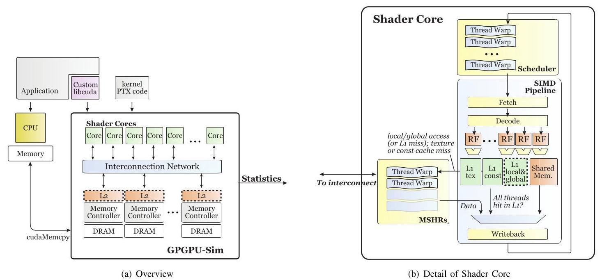
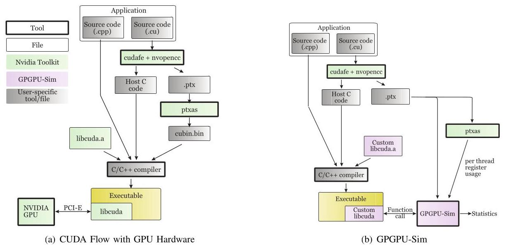
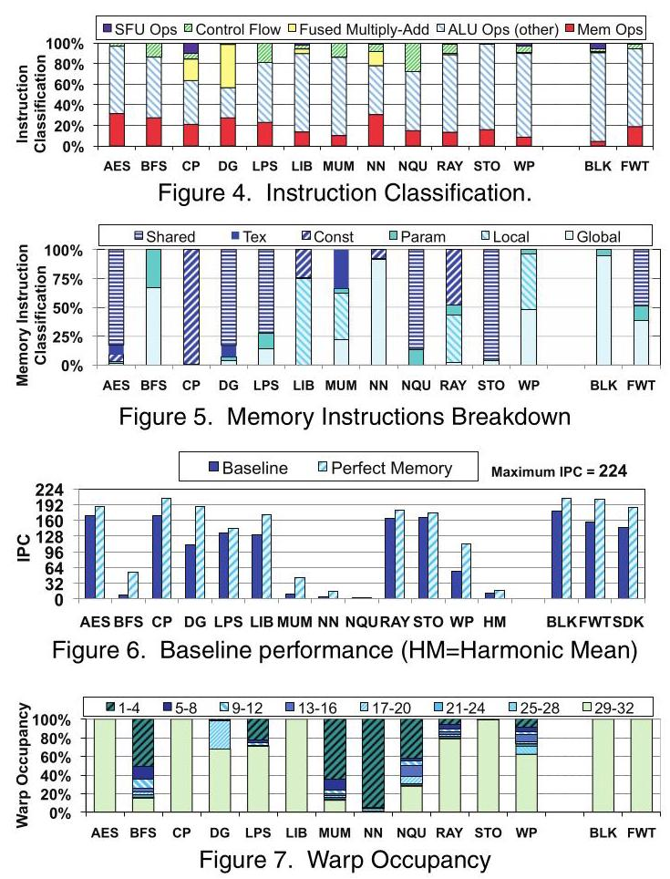
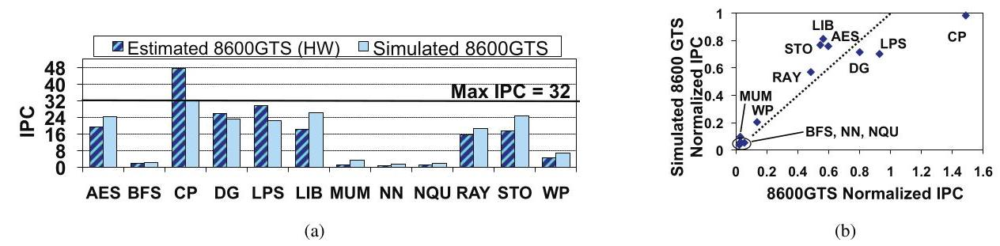
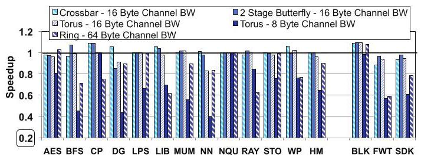
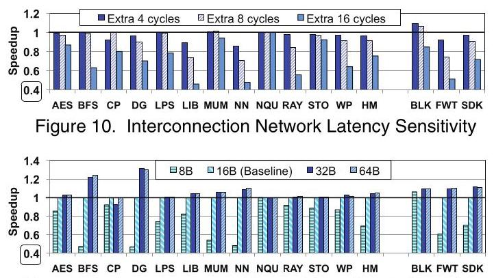
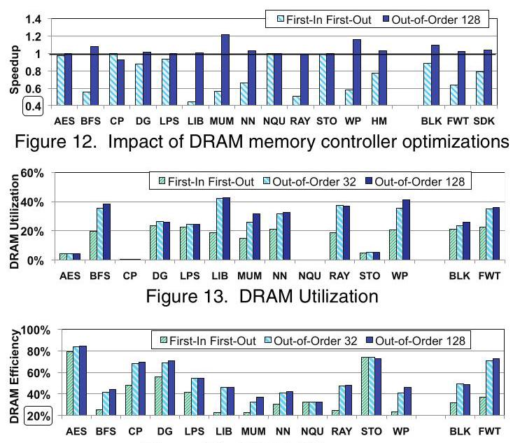
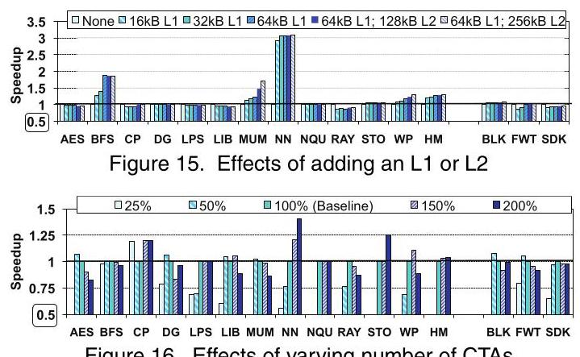
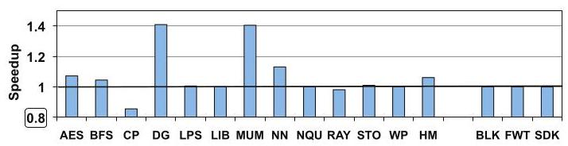

# Analyzing CUDA Workloads Using a Detailed GPU Simulator 深度解读

> **作者**：Ali Bakhoda, George L. Yuan, Wilson W. L. Fung, Henry Wong, Tor M. Aamodt  
> **会议/年份**：IEEE International Symposium on Performance Analysis of Systems and Software (ISPASS), 2009  
> **一句话总结**：这篇论文通过扩展 GPGPU-Sim 支持 CUDA/PTX，对 12 个非图形 CUDA workload 做微架构级仿真，指出 GPU 应用性能常常更受 interconnect bandwidth、DRAM contention、CTA 并发度和访存合并策略影响，而不是单纯受峰值算力或零负载延迟支配。

## 一、问题定义

这篇论文处在 CUDA 刚出现不久的时间点：NVIDIA 已经把 GPU 从固定图形流水线推向可编程的 SIMT 并行处理器，CUDA 让程序员用接近 C 的方式表达大量线程，但当时对“非图形 CUDA 程序为什么跑不满 GPU”仍缺少可控、细粒度的体系结构解释。真实 GPU 可以测 runtime，却很难系统地改变 interconnect topology、router latency、cache 层次、memory controller policy、CTA 并发资源等硬件参数；传统图形 GPU 模拟器又多聚焦 graphics pipeline，不能直接承载 CUDA/PTX workload。

本文要解决的核心问题是：如何用一个足够详细、能运行真实 CUDA 程序的 GPU simulator 来刻画非图形 CUDA workload 的性能瓶颈，并用它回答一些硬件设计问题，例如 interconnect 应该优先优化 latency 还是 bandwidth、cache 是否总有收益、是否应该尽可能塞满更多 CTA、以及更激进的 memory coalescing 是否值得。

**动机评估**：动机是 solid 的。论文不是泛泛声称 GPU 很快，而是特意选取当时 CUDA Zone 中 reported speedup 低于 $50\times$ 的应用，因为这些应用更可能暴露硬件/软件调优空间。它还避免只看 microbenchmark，而是选择 AES、BFS、CP、gpuDG、LIBOR、MUMmerGPU、ray tracing、weather prediction 等 12 个非平凡 CUDA 应用，再加部分 SDK 程序作对照。这个 workload 集合虽然以 2007-2009 年的 CUDA 生态为背景，但问题本身很真实：GPU 峰值吞吐和实际应用效率之间存在明显缺口。

**核心 Insight**：本文的关键洞察是，GPU 性能不是“更多线程 + 更低延迟 + 更多 cache”这类单调关系。SIMT 机器用大量 warp 隐藏延迟，但这些 warp 同时也会在 interconnect、DRAM controller、cache miss queue 和 shared resource 上制造 contention。因此更高并发度可能降低性能；更大 cache 可能因 write miss/dirty eviction 反而拖慢；interconnect 的 bisection bandwidth 在很多 workload 上比 router latency 更关键。这一 insight 直接驱动了论文的实验设计。

## 二、相关工作

论文的 related work 可以分为四类。

第一类是 graphics-oriented GPU simulator，例如 Qsilver 和 ATTILA。这类工具能模拟图形架构的一些执行行为，但要么不建模 programmable shader，要么重点仍在 graphics-specific feature，无法回答 CUDA/PTX 非图形程序在微架构参数变化下的性能问题。

第二类是 CUDA 应用优化和 GPU 上的科学计算实践，例如 Ryoo 等人的 CUDA 优化研究。这些工作在真实 NVIDIA 8800GTX 等硬件上优化程序，能说明某些代码优化策略有效，但不能自由替换 interconnect、memory controller 或 cache 层次，因此对硬件设计空间的解释能力有限。

第三类是其他 accelerator 或 stream processor 架构，例如 xPU、Cell、Merrimac、Imagine、UltraSPARC T2 等。这些系统体现了多线程、SIMD、streaming 或专用加速方向的不同设计取舍，但它们的 programming model 与 CUDA/SIMT 不同，不能直接解释 CUDA workload 在 contemporary GPU 上的瓶颈。

第四类是本文所用 CUDA benchmark 的原始应用论文。这些论文关注各自应用如何利用 GPU 加速，而不是横向比较这些应用在 cache、DRAM、interconnect、CTA scheduling 等硬件参数上的敏感性。本文的定位就是补上这块空白：用同一个详细模拟框架统一观察这些 workload。

## 三、技术挑战

**挑战 1：既要真实运行 CUDA 应用，又要能做微架构探索。** 如果要求开发者手工改写应用到某个研究 ISA，workload 覆盖面会很窄；但如果只跑真实硬件，又无法替换硬件参数。本文需要在二者之间建立桥梁：接入 CUDA compilation flow，运行 PTX，并把 PTX 的资源需求映射到模拟器中的 shader core、register、shared memory、warp scheduler 等结构上。

**挑战 2：GPU 性能瓶颈高度 workload-dependent。** AES、STO 这类大量使用 shared memory 的程序与 BFS、MUM、WP 这类 memory/divergence heavy 程序完全不同。一个平均结论很容易掩盖个别应用的瓶颈，因此实验必须同时报告整体趋势和 workload-by-workload 行为。

**挑战 3：SIMT 并发既隐藏延迟，也制造争用。** 传统直觉会认为更多 active warp/CTA 更好，因为能覆盖 memory latency。但在 GPU 中，更多 CTA 也会增加 outstanding memory request、interconnect traffic 和 DRAM row/bank pressure。要解释这个非单调关系，仿真器必须能追踪 CTA distribution、memory queue、DRAM efficiency 和 warp occupancy。

**挑战 4：cache/coalescing/DRAM policy 的效果不能只看命中率或峰值带宽。** 例如 local/global cache 对某些应用可加速，对 write miss 和 dirty eviction 行为不友好的应用则可能减速；inter-warp coalescing 可以减少重复请求，但需要大容量、可关联查找的 outstanding miss 结构。论文必须把这些机制放进完整执行中评估。

**挑战 5：仿真结果需要可信度校验。** 研究模拟器如果完全不对照真实硬件，结论容易变成模型内自洽。本文用 GeForce 8600GTS 配置做相关性验证，虽然无法完全复刻 ptxas 后端优化，但至少证明模拟器能区分真实硬件上高性能和低性能应用。

## 四、解决方案

### 整体思路

本文的方案是扩展 GPGPU-Sim，使其能运行 NVIDIA PTX 虚拟指令集，并用它模拟一个类似当时高端 GPU 的 SIMT 微架构。模拟器包含多个 shader core、warp scheduler、SIMD pipeline、shared/constant/texture/global/local memory、interconnection network、memory controller、DRAM timing、cache 与 coalescing 机制。随后作者围绕几个硬件设计轴做 controlled experiments：interconnect topology/latency/bandwidth、DRAM controller、L1/L2 cache、CTA 并发资源、inter-warp memory coalescing。

Fig. 1 展示了本文的建模边界：CPU 端负责启动 kernel 和 `cudaMemcpy`，GPU 端由多个 shader core 通过 interconnect 访问 memory controller/DRAM；单个 shader core 内部有 warp scheduler、SIMD pipeline、register file、shared memory、texture/constant cache，以及论文探索中可选的 local/global L1 与 MSHR-like 结构。这个图很关键，因为后续实验的每个变量都能映射到这里的某个硬件部件。

### 贯穿示例

可以用 MUMmerGPU 作为贯穿例子来理解本文。MUMmerGPU 做 DNA sequence alignment，每个 CUDA thread 查询一段字符串，参考 suffix tree 放在 texture memory 中。程序编译时，CUDA frontend 生成 host C 和 PTX；GPGPU-Sim 链接自定义 `libcuda.a`，拦截 kernel launch，读取 PTX 并根据 `ptxas` 得到的 register/shared memory 用量决定每个 shader core 能放多少 CTA。执行时，warp scheduler 以 32-thread warp 为单位发射，thread 的数据依赖查询会产生不规则访存和 branch divergence，请求经 coalescing、cache、interconnect 进入 DRAM。于是同一个 MUM workload 可以在不同 cache、大/小 CTA 并发度、不同 interconnect bandwidth、是否开启 inter-warp coalescing 下反复运行，直接暴露“并发越多越好吗”“访存合并是否有价值”等问题。

### 关键技术点

**CUDA/PTX 支持**：论文修改 CUDA build flow，不再链接 NVIDIA 提供的 `libcuda.a`，而是链接 GPGPU-Sim 的 custom `libcuda.a`。这样普通 CUDA 应用仍经过 cudafe/nvopencc 生成 PTX，但 kernel launch 会进入模拟器。模拟器解析 PTX，使用 immediate post-dominator 分析标注 branch reconvergence point，并用 functional simulator 按 performance simulator 的调度顺序执行多线程指令。

Fig. 3 说明了本文最实用的工程贡献：CUDA 源码、PTX 生成流程大体保留，差异集中在链接自定义 runtime stub 和模拟器解析 PTX。作者还用 `ptxas` 获取每线程 register 用量和每 CTA shared memory 用量，避免 PTX 虚拟寄存器数量过大导致 occupancy 模型失真。

**Baseline GPU 模型**：默认配置包含 28 个 shader core，warp size 为 32，SIMD pipeline width 为 8，因此理想最大 scalar IPC 为 $28 \times 8 = 224$。每个 shader core 使用 24-stage in-order pipeline，warp 每 4 cycles 发射到 8-wide SIMD pipeline。baseline 有 16KB per-core shared memory、8KB constant cache、64KB texture cache、8 个 memory channel，local/global access 默认不经 L1/L2 cache。

**Interconnect 与 DRAM 建模**：作者建模 mesh、torus、butterfly、crossbar、ring 等 topology，并改变 flit/channel bandwidth 与 router latency。DRAM controller 方面，baseline 是 OoO FR-FCFS，另比较 FIFO 与更大输入队列的 OoO128。这样可以把“网络延迟”“网络带宽”“DRAM row locality”和“controller queue capacity”分开观察。

**CTA distribution 与 resource scaling**：本文用 breadth-first heuristic 把 CTA 分配给当前 CTA 数最少的 shader core，并通过缩放 threads/registers/shared memory/CTA slots 到 baseline 的 25%-200% 来改变每 core 可同时运行的 CTA 数。这让作者能在不改源代码的情况下评估 occupancy 与 contention 的关系。

**Memory coalescing 与 cache**：baseline 尝试将一个 warp 内 32 个 thread 的访存合并；进一步实验 inter-warp coalescing，即后续 warp 如果请求已有 outstanding request 覆盖的数据，就合并到同一请求上。cache 实验则加入 local/global L1 以及 memory-side L2，但模型是 non-coherent cache，适用于作者所选“不通过 global memory 跨 CTA 通信”的程序。

### 与已有方案的对比

相比真实硬件测量，本文牺牲了一些后端实现细节准确性，但换来可控的硬件参数扫掠；相比 graphics GPU simulator，它能运行 CUDA/PTX 非图形应用；相比手写 microbenchmark，它覆盖真实应用并模拟到 completion。局限也很明确：模型基于 CUDA 1.1/GeForce 8 时代，host code 不计入性能，PTX 到真实 ISA 的 ptxas 优化无法完全复刻，CTA load imbalance 在小 grid 上会引入一些模拟器/调度策略相关现象。

## 五、实验评估

### 实验设定

论文选择 12 个 CUDA 应用：AES、BFS、CP、gpuDG、LPS、LIBOR、MUMmerGPU、NN、N-Queens、Ray Tracing、StoreGPU、Weather Prediction，并额外模拟若干 CUDA SDK 程序，以 BLK、FWT 和 SDK harmonic mean 作为对照。作者模拟所有 benchmark 到 completion，避免只观察 kernel 前半段而漏掉 tail behavior。baseline 硬件参数如上所述，实验指标主要是 scalar IPC、speedup、warp occupancy、DRAM utilization/efficiency 等。

Fig. 4-7 是理解 workload 差异的入口。ALU 占比很高并不自动代表高 IPC，memory type 和 warp occupancy 更能解释瓶颈。例如 CP 超过 99% 访存到 constant memory，NN 大量访问 global memory；MUM 超过 60% 的 warp 少于 5 个 active threads，BFS 超过 75% 的 warp occupancy 低于 50%。这说明 branch divergence、unfilled warp 和 memory behavior 必须一起看。

### 主要实验与结论

**模拟器可信度**：作者把模拟器配置成类似 GeForce 8600GTS 的 4 shader、2 memory controller，并和真实硬件估算 IPC 对比，得到相关系数 0.899。CP 在真实硬件上 normalized IPC 超过 1，作者认为可能来自 ptxas 在真实后端减少了指令数，而模拟器只执行 PTX。这个验证不能证明绝对周期完全准确，但足以支撑“高/低性能应用排序大体可信”。

Fig. 8 的价值在于校验模型方向性：BFS、MUM、NN、NQU 在真实硬件和模拟器中都很低，AES、CP、LPS、STO 相对较高。后续设计空间探索建立在这种相关性之上。

**Interconnect topology**：多数 benchmark 对 topology 本身不敏感，通常相对 baseline 变化小于 20%，例外主要是 ring 和 8B-channel torus。baseline mesh 平均上接近 input speedup 为 2 的 crossbar。作者的解释是，在 bandwidth 足够时，很多非图形 CUDA workload 能容忍 moderate latency，因此简单、低成本的 mesh/ring-like 结构仍有吸引力。

**Interconnect latency vs bandwidth**：将 router 额外增加 4 cycles latency，平均只损失 3.5%；增加 8 cycles 平均 slowdown 9%；增加 16 cycles 平均 slowdown 25%。相比之下，把 mesh channel bandwidth 从 16B 降到 8B 会明显伤害多数应用。DG 对 bandwidth 最敏感，32B flit 获得 31% speedup，而 8B flit 造成 53% slowdown；当 flit 到 64B 后不再继续提速，因为 32B 已消除 return interconnect input port 的 16% stall。

Fig. 10-11 支撑论文最重要的结论之一：在这些 workload 上，bisection bandwidth 比 zero-load latency 更关键。换句话说，GPU 的多线程可以隐藏一定网络延迟，但如果带宽变窄，请求排队和拥塞会直接降低吞吐。

**DRAM controller**：FIFO controller 对 AES、CP、NQU、STO 几乎没有 slowdown，因为这些 workload 要么 DRAM utilization 很低，要么 row locality 好；AES 和 STO 的 DRAM efficiency 超过 75%。但对 BFS、LIB、MUM、RAY、WP，FIFO 使性能下降超过 40%，这些 benchmark 在简单 controller 下 DRAM utilization/efficiency 都明显恶化。OoO FR-FCFS 能利用 row buffer locality 和 pending request 重排，对 memory-intensive workload 很重要。

Fig. 12-14 说明“带宽瓶颈”并不只是物理 pin bandwidth，controller 能否把请求排成更高 row hit rate 也会显著影响有效带宽。对于共享内存优化充分的 AES/STO，controller policy 不敏感；对 BFS/MUM/WP 这类随机或高流量访问，policy 是性能关键。

**Cache effects**：加入 local/global L1/L2 cache 并非总是好事。BFS 和 NN 因 global memory instruction 比例最高（分别约 19% 和 27%）而收益最大；但 CP、RAY、FWT 反而会因 L1 cache 减速。作者解释 RAY 和 FWT 的减速来自 write miss 和 dirty line eviction：baseline 下部分写不会强制读取整块 DRAM，而 cache write miss 会阻塞 warp 直到 cache block 读入，dirty eviction 又会写回整块 line。

**CTA 并发度**：增加同时运行线程/CTA 可以隐藏 memory latency，但也可能制造 interconnect/DRAM contention。LPS、NN、STO 从更多 CTA 中受益；NQU 访存很少，因此变化不大；AES 和 MUM 随 CTA 增加呈明显下降趋势。作者观测到从 50% 到 200% resource 配置，AES 和 MUM 的平均 memory latency 分别恶化 $8.6\times$ 和 $5.4\times$。BFS、RAY、WP 有非单调最优点，分别在 100%、100%、150% baseline 附近。

Fig. 15-16 是本文最反直觉的一组结果：cache 和 occupancy 都不是越多越好。对 GPU 调度策略而言，最大化 resident CTA 只是一个静态启发式；真正理想的策略需要根据 workload 的 memory pressure 动态调节并发度。

**Inter-warp memory coalescing**：相对只做 intra-warp coalescing，inter-warp memory coalescing 的 harmonic mean speedup 为 6.1%，个别应用最高可达 41%。AES、DG、MUM 的数据依赖访问难以完全用 shared memory 手工优化，inter-warp merging 能消除多个 warp 对同一 cache block 的重复请求。但 CUDA SDK benchmark 的 harmonic mean speedup 小于 1%，说明高度手工优化的程序已经减少了冗余请求。

Fig. 17 表明更强的 outstanding request 合并能力确实有价值，但收益集中在不规则、数据依赖访存应用上；对规则、已优化 workload，硬件复杂度可能换不来明显性能。

### 结论支撑性分析

整体上，实验能支撑论文的核心主张。作者不仅报告平均值，还解释了个别应用的例外，例如 CP/BLK 因 CTA load imbalance 出现反常 speedup/slowdown，RAY/FWT 因 cache 写策略减速，NN 低 occupancy 不是 branch divergence 而是 single-thread block。主要不足是 workload、CUDA 版本和 GPU 架构较老，且模拟器只以 PTX 为输入，无法完全覆盖真实后端编译优化；但对“带宽/争用/并发度/访存合并是 GPU 性能设计关键”的结论，实验链条比较完整。

## 六、附加洞察

**结论 1：control-flow instruction 比例不能直接等价于 branch divergence。**  
*出处*：Section 4.1 / Fig. 4 与 Fig. 7。  
*推理链条*：BFS、LPS、NQU 的 control flow instruction 比例较高，但 LPS 有 19% control flow 时仍有 75% 时间 full warp occupancy；NN 只有 7% control flow，却因两个 kernel 的 block 只有单线程而 occupancy 最低。因此，判断 SIMT 效率要看 warp 内线程是否同向执行，以及 block/thread 组织是否填满 warp，而不是只数 branch 指令。

**结论 2：CTA load imbalance 会让局部“更快”的配置在整体上变慢。**  
*出处*：Section 3 / Section 4.3、4.7 多处解释。  
*推理链条*：breadth-first CTA distributor 会把新 CTA 发给当前 CTA 数较少或先空出来的 core；某个配置如果让部分 core 稍早完成，可能把后续 CTA 集中到同一个 core，造成尾部负载不均。作者用 6 CTA/2 core 的例子说明，即使单 CTA 从 $T$ 改善到约 $0.9T$，分配不均也可能让总时间从 $3T$ 变成至少 $3.6T$。这既是解释实验异常的 caution，也提示真实 GPU scheduler 需要考虑 tail balance。

**结论 3：shared memory 优化会改变硬件优化的边际收益。**  
*出处*：Section 4.5 / Fig. 12-14 与 Section 4.6 / Fig. 15。  
*推理链条*：AES 和 STO 大量使用 shared memory，虽然处理数据量大，但 DRAM utilization 较低且 efficiency 超过 75%，FIFO controller 几乎不拖慢；这些应用对 cache 也不敏感。相反，BFS/NN/MUM/WP 等依赖 global/local/texture 不规则访问的应用更需要 controller、cache 或 coalescing 支持。也就是说，软件显式管理 memory hierarchy 会改变硬件机制的收益空间。

**结论 4：inter-warp coalescing 的收益与程序优化成熟度负相关。**  
*出处*：Section 4.8 / Fig. 17。  
*推理链条*：AES、DG、MUM 等存在 data-dependent access，手工 shared memory tiling 难以覆盖全部局部性，所以 inter-warp merging 可显著减少重复 cache block 请求；但 SDK benchmark 已被仔细优化，冗余 memory request 少，平均收益低于 1%。这说明同一硬件机制在“应用生态早期/不规则 workload”上更有价值，在规则且成熟优化的库函数上可能不划算。

**结论 5：cache 的负收益来自具体策略，而不是 cache 这个概念本身无用。**  
*出处*：Section 4.6 / Fig. 15。  
*推理链条*：RAY 和 FWT 加 L1 后变慢，作者追溯到 write miss 必须先读整块、dirty eviction 写回整块 line 等简化策略；论文也明确把 better cache policies 留作未来工作。因此这不是“GPU 不需要 cache”的结论，而是“对 local/global memory 的 cache 设计必须匹配写行为和访问粒度”。

## 七、总结与评价

这篇论文的核心贡献有两层：工程上，它把 GPGPU-Sim 推到能运行 CUDA/PTX 应用的程度；研究上，它用真实非图形 CUDA workload 证明 GPU 性能瓶颈常常来自 bandwidth、contention、warp underutilization 和 memory-system policy，而不是单一的计算峰值或固定延迟。

最大的亮点是实验问题拆得清楚：interconnect latency/bandwidth、DRAM controller、cache、CTA occupancy、inter-warp coalescing 都各有独立 sweep，同时又回到具体 workload 解释机制。最大的不足是时代限制明显：CUDA 1.1、GeForce 8/Tesla 风格架构、non-coherent cache 假设、PTX 与真实 ISA 的差异，都让数值不能直接外推到现代 GPU。但作为 GPGPU-Sim 和 GPU workload characterization 的早期论文，它建立的分析框架仍然有参考价值。

后续值得沿着两个方向继续：一是动态 CTA/warp admission control，根据运行时 memory pressure 调节并发度；二是更现代的 GPU cache/coherence/interconnect 模型，重新检验 bandwidth、coalescing 与 occupancy 的非单调关系是否在 Volta/Ampere/Hopper 级架构上仍成立。

## 八、章节脉络与段落速览

- **Abstract**：提出用详细 PTX GPU simulator 分析 12 个 CUDA workload，并预告两个主要发现：interconnect bandwidth 比 latency 更敏感，减少并发线程有时能缓解 memory contention。

- **Section 1 · Introduction**：说明 CUDA 让非图形 GPU 计算快速扩张，但许多 reported speedup 低于 $50\times$ 的应用仍有调优空间。  
  - ¶1：从 CPU 单线程增长放缓与 GPU teraflop 级并行能力引出研究背景。  
  - ¶2：介绍 CUDA/SIMT 的可编程优势，并说明本文关注 speedup 低于 $50\times$ 的应用群体。  
  - ¶3：列出四项贡献：12 个应用的 GPGPU-Sim characterization、bandwidth sensitivity、减少并发 CTA 的收益、instruction/divergence/DRAM locality 分析。  
  - ¶4：说明论文结构。

- **Section 2 · Design and Implementation**：描述被模拟 GPU 架构、GPGPU-Sim CUDA 支持和 benchmark。  
  - **2.1 · Baseline Architecture**：定义 CUDA grid/block/CTA、shader core、warp、SIMD pipeline、memory spaces、texture/constant cache、coalescing、interconnect 与 DRAM 分布。  
  - **2.2 · GPU Architectural Exploration**：分别介绍 interconnect topology、CTA distribution、memory access coalescing、local/global caching 等实验变量。  
  - **2.3 · Extending GPGPU-Sim to Support CUDA**：解释如何替换 `libcuda.a`，解析 PTX，使用 `ptxas` 提取资源用量，并用 immediate post-dominator 支持 SIMT branch reconvergence。  
  - **2.4 · Benchmarks**：列出 12 个非 SDK 应用和 SDK 对照，说明每个应用的线程组织、memory space 使用和主要性能风险。

- **Section 3 · Methodology**：给出硬件配置、interconnect 配置、completion-based simulation 原则和 CTA load imbalance 注意事项。  
  - ¶1：用 Table 2/3 定义 shader core、warp、cache、DRAM、controller、interconnect 等参数。  
  - ¶2：强调所有 benchmark 模拟到完成，以捕捉 kernel tail behavior。  
  - ¶3：用简化例子解释 CTA load imbalance 如何造成反直觉 slowdown。  
  - ¶4：说明通过缩放 thread/register/shared memory/CTA 资源来改变并发 CTA 数。

- **Section 4 · Experimental Results**：按硬件设计轴报告性能结果。  
  - **4.1 · Baseline**：展示 instruction mix、memory instruction type、baseline IPC、warp occupancy，并用 8600GTS 相关性验证模拟器。  
  - **4.2 · Branch Divergence**：承接 baseline 结果，指出 warp occupancy 低可能来自 divergence，也可能来自 block/thread 组织。  
  - **4.3 · Interconnect Topology**：比较 mesh、torus、butterfly、crossbar、ring，结论是多数 workload 对 topology 不太敏感。  
  - **4.4 · Interconnection Latency and Bandwidth**：分别扫 router latency 与 channel bandwidth，得出 bandwidth 更关键的结论。  
  - **4.5 · DRAM Utilization and Efficiency**：比较 FIFO、OoO32、OoO128，说明 memory-intensive workload 强依赖 controller 重排。  
  - **4.6 · Cache Effects**：展示 L1/L2 对 BFS/NN 明显有益，但对 CP/RAY/FWT 可能减速。  
  - **4.7 · Are More Threads Better?**：用资源缩放说明更多 CTA 不总是更好，memory contention 会带来非单调最优点。  
  - **4.8 · Memory Request Coalescing**：评估 inter-warp coalescing，平均收益 6.1%，对 SDK 优化程序收益低于 1%。

- **Section 5 · Related Work**：把本文放在 GPU simulator、CUDA application optimization、stream/accelerator architecture 和 benchmark 原始应用论文之间，强调本文首次系统量化 cache size、DRAM bandwidth 等参数对这些 CUDA workload 的影响。

- **Section 6 · Conclusions**：总结四个主要结论：interconnect bandwidth 比 latency 更敏感；cache 对无 locality 的 global/local access 可能减速；减少 CTA 并发度有时能降低 memory contention；aggressive inter-warp coalescing 在部分应用最高可提升 41%。

- **Acknowledgments / References**：列出资助、致谢和 46 篇参考文献，主要覆盖 CUDA/GPU 架构、stream processor、DRAM scheduling、benchmark 应用与 GPGPU-Sim 前身研究。
