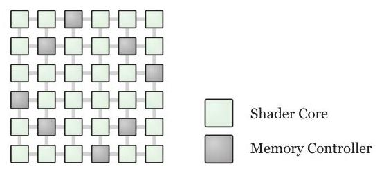

# Analyzing CUDA Workloads Using a Detailed GPU Simulator

Ali Bakhoda, George L. Yuan, Wilson W. L. Fung, Henry Wong and Tor M. Aamodt University of British Columbia,

> 
阿里·巴霍达、George L. Yuan、Wilson W. L. Fung、黄亨利与Tor M. Aamodt，不列颠哥伦比亚大学，

Vancouver, BC, Canada

> 
加拿大不列颠哥伦比亚省温哥华

\{bakhoda, gyuan, wwlfung, henryw, aamodt\}@ece.ubc.ca

> 
\{bakhoda, gyuan, wwlfung, henryw, aamodt\}@ece.ubc.ca

## Abstract

Modern Graphic Processing Units (GPUs) provide sufficiently flexible programming models that understanding their performance can provide insight in designing tomorrow's manycore processors, whether those are GPUs or otherwise. The combination of multiple, multithreaded, SIMD cores makes studying these GPUs useful in understanding tradeoffs among memory, data, and thread level parallelism. While modern GPUs offer orders of magnitude more raw computing power than contemporary CPUs, many important applications, even those with abundant data level parallelism, do not achieve peak performance. This paper characterizes several non-graphics applications written in NVIDIA's CUDA programming model by running them on a novel detailed microarchitecture performance simulator that runs NVIDIA's parallel thread execution (PTX) virtual instruction set. For this study, we selected twelve non-trivial CUDA applications demonstrating varying levels of performance improvement on GPU hardware (versus a CPU-only sequential version of the application). We study the performance of these applications on our GPU performance simulator with configurations comparable to contemporary high-end graphics cards. We characterize the performance impact of several microarchitecture design choices including choice of interconnect topology, use of caches, design of memory controller, parallel workload distribution mechanisms, and memory request coalescing hardware. Two observations we make are (1) that for the applications we study, performance is more sensitive to interconnect bisection bandwidth rather than latency, and (2) that, for some applications, running fewer threads concurrently than on-chip resources might otherwise allow can improve performance by reducing contention in the memory system.

> 
现代图形处理单元（GPU）提供了足够灵活的编程模型，因此理解其性能可以为设计未来的众核处理器提供洞见，无论这些处理器是否是GPU。多个多线程SIMD核心的组合使得研究这些GPU有助于理解内存、数据和线程级并行性之间的权衡。尽管现代GPU提供的原始计算能力比当代CPU高出几个数量级，许多重要的应用，甚至那些具有丰富数据级并行性的应用，也无法达到峰值性能。本文通过在一种新型的详细微架构性能模拟器上运行几个非图形应用来对其进行特征分析，该模拟器运行的是NVIDIA的并行线程执行（PTX）虚拟指令集，这些应用均采用NVIDIA的CUDA编程模型编写。对于本研究，我们选取了12个非平凡的CUDA应用，它们在GPU硬件上（相对于仅CPU的串行版本应用）表现出不同程度的性能提升。我们在配置与当代高端显卡相当的GPU性能模拟器上研究了这些应用的性能。我们特征分析了若干微架构设计选择对性能的影响，包括互连拓扑的选择、缓存的使用、内存控制器的设计、并行工作负载分配机制以及内存请求合并硬件。我们得到的两点观察是：(1) 对于所研究的应用，性能对互连对分带宽比延迟更敏感，以及 (2) 对于某些应用，同时运行的线程数少于片上资源本可支持的线程数，可以通过减少内存系统中的争用来提高性能。

## 1. Introduction

While single-thread performance of commercial superscalar microprocessors is still increasing, a clear trend today is for computer manufacturers to provide multithreaded hardware that strongly encourages software developers to provide explicit parallelism when possible. One important class of parallel computer hardware is the modern graphics processing unit (GPU) [22,25]. With contemporary GPUs recently crossing the teraflop barrier [2,34] and specific efforts to make GPUs easier to program for non-graphics applications [1, 29, 33], there is widespread interest in using GPU hardware to accelerate non-graphics applications.

> 
尽管商用超标量微处理器的单线程性能仍在提升，但当今计算机厂商的一个明显趋势是提供多线程硬件，大力鼓励软件开发者在可能的情况下显式提供并行性。一类重要的并行计算机硬件就是现代图形处理单元（GPU）[22,25]。随着当代GPU近期突破万亿次浮点运算大关[2,34]，以及为使GPU更易于非图形应用编程所做的专门努力[1,29,33]，人们对利用GPU硬件加速非图形应用产生了广泛兴趣。

Since its introduction by NVIDIA Corporation in February 2007, the CUDA programming model [29,33] has been used to develop many applications for GPUs. CUDA provides an easy to learn extension of the ANSI C language. The programmer specifies parallel threads, each of which runs scalar code. While short vector data types are available, their use by the programmer is not required to achieve peak performance, thus making CUDA a more attractive programming model to those less familiar with traditional data parallel architectures. This execution model has been dubbed a single instruction, multiple thread (SIMT) model [22] to distinguish it from the more traditional single instruction, multiple data (SIMD) model. As of February 2009, NVIDIA has listed 209 third-party applications on their CUDA Zone website [30]. Of the 136 applications listed with performance claims, 52 are reported to obtain a speedup of ${50} \times$ or more, and of these 29 are reported to obtain a speedup of ${100} \times$ or more. As these applications already achieve tremendous benefits, this paper instead focuses on evaluating CUDA applications with reported speedups below ${50} \times$ since this group of applications appears most in need of software tuning or changes to hardware design.

> 
自 NVIDIA 公司于 2007 年 2 月推出 CUDA 编程模型 [29,33] 以来，它已被用于为 GPU 开发众多应用程序。CUDA 提供了易于学习的 ANSI C 语言扩展。程序员指定并行线程，每个线程执行标量代码。虽然提供了短向量数据类型，但程序员无需使用它们即可达到峰值性能，这使得 CUDA 对那些不太熟悉传统数据并行架构的人而言，成为更具吸引力的编程模型。这种执行模型被称为单指令多线程（SIMT）模型 [22]，以区别于更传统的单指令多数据（SIMD）模型。截至 2009 年 2 月，NVIDIA 已在其 CUDA Zone 网站 [30] 上列出了 209 个第三方应用程序。在提供了性能声明的 136 个应用程序中，有 52 个报告的加速比达到 ${50} \times$ 或更高，其中 29 个报告的加速比达到 ${100} \times$ 或更高。由于这些应用程序已经取得了巨大的效益，本文转而专注于评估那些报告的加速比低于 ${50} \times$ 的 CUDA 应用程序，因为这组应用程序似乎最需要进行软件调优或硬件设计修改。

This paper makes the following contributions:

> 
本文做出以下贡献：

- It presents data characterizing the performance of twelve existing CUDA applications collected on a research GPU simulator (GPGPU-Sim).

> 
- 它展示了在研究型 GPU 模拟器（GPGPU-Sim）上收集的十二个现有 CUDA 应用程序的性能特征数据。

- It shows that the non-graphics applications we study tend to be more sensitive to bisection bandwidth versus latency.

> 
- 研究表明，我们所研究的非图形应用往往对平分带宽比对延迟更为敏感。

- It shows that, for certain applications, decreasing the number of threads running concurrently on the hardware can improve performance by reducing contention for on-chip resources.

> 
- 研究表明，对于某些应用，减少硬件上并发运行的线程数可以通过降低片内资源争用来提高性能。

- It provides an analysis of application characteristics including the dynamic instruction mix, SIMD warp branch divergence properties, and DRAM locality characteristics.

> 
- 它提供了对应用程序特性的分析，包括动态指令组合、SIMD warp 分支发散特性以及 DRAM 局部性特征。

We believe the observations made in this paper will provide useful guidance for directing future architecture and software research.

> 
我们相信，本文提出的观察结果将为引导未来的架构与软件研究方向提供有益的指导。

The rest of this paper is organized as follows. In Section 2 we describe our baseline architecture and the microarchitecture design choices that we explore before describing our simulation infrastructure and the benchmarks used in this study. Our experimental methodology is described in Section 3 and Section 4 presents and analyzes results. Section 5 reviews related work and Section 6 concludes the paper.

> 
本文的其余部分组织如下：第2节描述我们的基准架构以及我们所探索的微架构设计选择，随后介绍本研究的仿真基础设施与所使用的基准测试。第3节阐述实验方法，第4节展示并分析结果。第5节回顾相关工作，第6节总结全文。

![Figure 1. Modeled system and GPU architecture [11]. Dashed portions (L1 and L2 for local/global accesses) omitted from baseline.](images/fig01.jpg)

Figure 1. Modeled system and GPU architecture [11]. Dashed portions (L1 and L2 for local/global accesses) omitted from baseline.

> 
图1. 建模的系统与GPU架构[11]。虚线部分（用于局部/全局访问的L1和L2）从基线配置中省略。

## 2. Design and Implementation

In this section we describe the GPU architecture we simulated, provide an overview of our simulator infrastructure and then describe the benchmarks we selected for our study.

> 
在本节中，我们描述了所模拟的 GPU 架构，概述了模拟器基础设施，随后介绍了为本研究选定的基准测试程序。

### 2.1. Baseline Architecture

Figure 1(a) shows an overview of the system we simulated. The applications evaluated in this paper were written using CUDA [29, 33]. In the CUDA programming model, the GPU is treated as a co-processor onto which an application running on a CPU can launch a massively parallel compute kernel. The kernel is comprised of a grid of scalar threads. Each thread is given an unique identifier which can be used to help divide up work among the threads. Within a grid, threads are grouped into blocks, which are also referred to as cooperative thread arrays (CTAs) [22]. Within a single CTA threads have access to a common fast memory called the shared memory and can, if desired, perform barrier synchronizations.

> 
图1(a)展示了我们模拟的系统概览。本文评估的应用程序均采用 CUDA [29, 33] 编写。在 CUDA 编程模型中，GPU 被视为协处理器，运行在 CPU 上的应用程序可向其启动大规模并行计算内核。该内核由标量线程组成的网格构成，每个线程被赋予唯一标识符，可用于在线程间划分工作。网格内部的线程被组织成块，这些块也称为协作线程数组（CTAs）[22]。在单个 CTA 内，线程可访问称为共享内存的公共快速存储器，并可在需要时执行屏障同步。

Figure 1(a) also shows our baseline GPU architecture. The GPU consists of a collection of small data-parallel compute cores, labeled shader cores in Figure 1, connected by an interconnection network to multiple memory modules (each labeled memory controller). Each shader core is a unit similar in scope to a streaming multiprocessor (SM) in NVIDIA terminology [33]. Threads are distributed to shader cores at the granularity of entire CTAs, while per-CTA resources, such as registers, shared memory space, and thread slots, are not freed until all threads within a CTA have completed execution. If resources permit, multiple CTAs can be assigned to a single shader core, thus sharing a common pipeline for their execution. Our simulator omits graphics specific hardware not exposed to CUDA.

> 
图1(a)也展示了我们的基线GPU架构。该GPU由多个小型数据并行计算核心组成（在图1中标注为着色器核心），这些核心通过互连网络与多个内存模块（每个模块标注为内存控制器）相连。每个着色器核心在功能范围上类似于NVIDIA术语中的流式多处理器(SM)[33]。线程以整个CTA为粒度分配到各个着色器核心，而在一个CTA内的所有线程完成执行之前，每个CTA所占用的资源（如寄存器、共享内存空间和线程槽）不会被释放。如果资源允许，一个着色器核心可以被分配多个CTA，使它们共享同一条执行流水线。我们的模拟器省略了CUDA无法使用的图形专用硬件。

Figure 1(b) shows the detailed implementation of a single shader core. In this paper, each shader core has a SIMD width of 8 and uses a 24-stage, in-order pipeline without forwarding. The 24-stage pipeline is motivated by details in the CUDA Programming Guide [33], which indicates that at least 192 active threads are needed to avoid stalling for true data dependencies between consecutive instructions from a single thread (in the absence of long latency memory operations). We model this pipeline with six logical pipeline stages (fetch, decode, execute, memory1, memory2, writeback) with super-pipelining of degree 4 (memory1 is an empty stage in our model). Threads are scheduled to the SIMD pipeline in a fixed group of 32 threads called a warp [22]. All 32 threads in a given warp execute the same instruction with different data values over four consecutive clock cycles in all pipelines (the SIMD cores are effectively 8-wide). We use the immediate post-dominator reconvergence mechanism described in [11] to handle branch divergence where some scalar threads within a warp evaluate a branch as "taken" and others evaluate it as "not taken".

> 
图1(b)展示了单个着色器核心的详细实现。在本文中，每个着色器核心的SIMD宽度为8，并使用24级顺序流水线，无前递机制。该24级流水线源自CUDA编程指南[33]中的细节，该指南指出至少需要192个活跃线程，才能避免单条线程的连续指令之间因真数据依赖而停顿（在没有长延迟内存操作的情况下）。我们将此流水线建模为六个逻辑流水线阶段（取指、译码、执行、访存1、访存2、写回），并采用4度超级流水线（访存1在我们的模型中为空阶段）。线程以固定的32线程组（称为线程束[22]）调度到SIMD流水线上。给定线程束中的所有32个线程，在四个连续的时钟周期内，于所有流水线阶段中执行同一条指令，但使用不同的数据值（SIMD核心实际上为8宽）。我们使用文献[11]中描述的立即后支配重汇聚机制来处理分支发散情况，即线程束内某些标量线程将分支判定为“跳转”，而其他线程判定为“不跳转”。

Threads running on the GPU in the CUDA programming model have access to several memory regions (global, local, constant, texture, and shared [33]) and our simulator models accesses to each of these memory spaces. In particular, each shader core has access to a 16KB low latency, highly-banked per-core shared memory; to global texture memory with a per-core texture cache; and to global constant memory with a per-core constant cache. Local and global memory accesses always require off chip memory accesses in our baseline configuration. For the per-core texture cache, we implement a 4D blocking address scheme as described in [14], which essentially permutes the bits in requested addresses to promote spatial locality in a 2D space rather than in linear space. For the constant cache, we allow single cycle access as long as all threads in a warp are requesting the same data. Otherwise, a port conflict occurs, forcing data to be sent out over multiple cycles and resulting in pipeline stalls [33]. Multiple memory accesses from threads within a single warp to a localized region are coalesced into fewer wide memory accesses to improve DRAM efficiency ${}^{1}$ . To alleviate the DRAM bandwidth bottleneck that many applications face, a common technique used by CUDA programmers is to load frequently accessed data into the fast on-chip shared memory [40].

> 
在CUDA编程模型中，运行于GPU的线程可以访问多个内存区域（全局、本地、常量、纹理和共享内存[33]），我们的模拟器对这些内存空间的访问均进行了建模。特别是，每个着色器核都配有一个16KB低延迟、高度分bank的核内共享内存；一个带核内纹理缓存的全局纹理内存；以及一个带核内常量缓存的全局常量内存。在我们基线配置中，本地和全局内存的访问始终需要芯片外内存访问。对于核内纹理缓存，我们实现了文献[14]中描述的4D阻塞地址方案，该方案本质上是重排请求地址中的比特位，以增强在二维空间而非线性空间中的空间局部性。对于常量缓存，只要warp中的所有线程请求相同的数据，我们就允许单周期访问；否则会发生端口冲突，迫使数据在多个周期内送出，并导致流水线停顿[33]。同一warp内对局部区域的多次内存访问会被合并为更少的宽内存访问，以提高DRAM效率${}^{1}$。为缓解许多应用面临的DRAM带宽瓶颈，CUDA程序员常用的一种技术是将频繁访问的数据加载到快速的片上共享内存中[40]。

Figure 2. Layout of memory controller nodes in mesh ${}^{3}$

> 
图2. 网格中内存控制器节点的布局 ${}^{3}$

Thread scheduling inside a shader core is performed with zero overhead on a fine-grained basis. Every 4 cycles, warps ready for execution are selected by the warp scheduler and issued to the SIMD pipelines in a loose round robin fashion that skips non-ready warps, such as those waiting on global memory accesses. In other words, whenever any thread inside a warp faces a long latency operation, all the threads in the warp are taken out of the scheduling pool until the long latency operation is over. Meanwhile, other warps that are not waiting are sent to the pipeline for execution in a round robin order. The many threads running on each shader core thus allow a shader core to tolerate long latency operations without reducing throughput.

> 
着色器核心内部的线程调度以零开销的细粒度方式进行。每4个周期，线程束调度器会选择准备就绪的线程束，并以宽松的轮询方式将它们发往SIMD流水线，跳过尚未就绪的线程束（例如那些正在等待全局内存访问的线程束）。换言之，当线程束中的任何线程遇到长延迟操作时，该线程束中的所有线程都会从调度池中移除，直到长延迟操作完成。与此同时，其他未处于等待状态的线程束则按轮询顺序送入流水线执行。每个着色器核心上运行的大量线程使得着色器核心能够容忍长延迟操作而不会降低吞吐量。

In order to access global memory, memory requests must be sent via an interconnection network to the corresponding memory controllers, which are physically distributed over the chip. To avoid protocol deadlock, we model physically separate send and receive interconnection networks. Using separate logical networks to break protocol deadlock is another alternative, but one we did not explore. Each on-chip memory controller then interfaces to two off-chip GDDR3 DRAM chips ${}^{2}$ . Figure 2 shows the physical layout of the memory controllers in our $6 \times  6$ mesh configuration as shaded areas ${}^{3}$ . The address decoding scheme is designed in a way such that successive 2KB DRAM pages [19] are distributed across different banks and different chips to maximize row locality while spreading the load among the memory controllers.

> 
为了访问全局内存，内存请求必须通过互连网络发送到相应的内存控制器，这些控制器物理分布在芯片上。为避免协议死锁，我们建模了物理分离的发送和接收互连网络。使用分离的逻辑网络来打破协议死锁是另一种选择，但我们未进行探索。每个片上内存控制器随后与两个片外 GDDR3 DRAM 芯片接口${}^{2}$。图 2 展示了在我们 $6 \times  6$ 网格配置中，内存控制器的物理布局以阴影区域表示${}^{3}$。地址解码方案的设计方式使得连续的 2KB DRAM 页 [19] 分布在不同存储体和不同芯片上，从而在内存控制器之间分散负载的同时最大化行局部性。

#### 2.2.GPU Architectural Exploration

This section describes some of the GPU architectural design options explored in this paper. Evaluations of these design options are presented in Section 4.

> 
本节描述了本文所探讨的一些 GPU 架构设计选项，相关评估结果将在第 4 节中呈现。

2.2.1. Interconnect. The on-chip interconnection network can be designed in various ways based on its cost and performance. Cost is determined by complexity and number of routers as well as density and length of wires. Performance depends on latency, bandwidth and path diversity of the network [9]. (Path diversity indicates the number of routes a message can take from the source to the destination.)

> 
2.2.1. 互连网络。片上互连网络可根据成本与性能进行多种方式设计。成本由路由器的复杂度和数量以及连线的密度与长度决定。性能则取决于网络的延迟、带宽和路径多样性 [9]。（路径多样性指消息从源到目的地可选取的路由数量。）

Butterfly networks offer minimal hop count for a given router radix while having no path diversity and requiring very long wires. A crossbar interconnect can be seen as a 1-stage butterfly and scales quadratically in area as the number of ports increase. A 2D torus interconnect can be implemented on chip with nearly uniformly short wires and offers good path diversity, which can lead to a more load balanced network. Ring and mesh interconnects are both special types of torus interconnects. The main drawback of a mesh network is its relatively higher latency due to a larger hop count. As we will show in Section 4, our benchmarks are not particularly sensitive to latency so we chose a mesh network as our baseline while exploring the other choices for interconnect topology.

> 
蝶形网络在给定路由器基数的情况下提供最小的跳数，但缺乏路径多样性且需要很长的连线。交叉开关互连可视为单级蝶形网络，其面积随端口数增加呈平方级增长。二维环面互连可在芯片上实现，连线几乎均匀短小，并具有良好的路径多样性，从而可能导致更均衡的网络负载。环形与网格互连均为环面互连的特殊类型。网格网络的主要缺点是由于跳数较多导致相对较高的延迟。正如我们将在第4节中展示的，我们的基准测试对延迟并不特别敏感，因此我们选择网格网络作为基线，同时探索其他互连拓扑选择。

2.2.2. CTA distribution. GPUs can use the abundance of parallelism in data-parallel applications to tolerate memory access latency by interleaving the execution of warps. These warps may either be from the same CTA or from different CTAs running on the same shader core. One advantage of running multiple smaller CTAs on a shader core rather than using a single larger CTA relates to the use of barrier synchronization points within a CTA [40]. Threads from one CTA can make progress while threads from another CTA are waiting at a barrier. For a given number of threads per CTA, allowing more CTAs to run on a shader core provides additional memory latency tolerance, though it may imply increasing register and shared memory resource use. However, even if sufficient on-chip resources exist to allow more CTAs per core, if a compute kernel is memory-intensive, completely filling up all CTA slots may reduce performance by increasing contention in the interconnection network and DRAM controllers. We issue CTAs in a breadth-first manner across shader cores, selecting a shader core that has a minimum number of CTAs running on it, so as to spread the workload as evenly as possible among all cores.

> 
2.2.2. CTA 分布。GPU 利用数据并行应用中的丰富并行性，通过交错执行不同 warp 来容忍内存访问延迟。这些 warp 可能来自同一个 CTA，也可能来自运行在相同着色器核心上的不同 CTA。在着色器核心上运行多个较小 CTA 相比使用单个较大 CTA 的一个优势，与 CTA 内部的屏障同步点有关 [40]。当一个 CTA 的线程在屏障处等待时，另一个 CTA 的线程可以继续推进。在每 CTA 线程数固定的情况下，允许在着色器核心上运行更多 CTA 可提供额外的内存延迟容忍能力，但可能意味着寄存器与共享内存资源使用的增加。然而，即使片上资源充足，能够支持每个核心运行更多 CTA，若计算内核属于内存密集型，完全用满所有 CTA 槽位反而可能因加剧互连网络与 DRAM 控制器的争用而降低性能。我们以广度优先的方式将 CTA 分发到各着色器核心，优先选择当前运行 CTA 数量最少的核心，使工作负载尽量均匀地分散到所有核心上。

2.2.3. Memory Access Coalescing. The minimum granularity access for GDDR3 memory is 16 bytes and typically scalar threads in CUDA applications access 4 bytes per scalar thread [19]. To improve memory system efficiency, it thus makes sense to group accesses from multiple, concurrently-issued, scalar threads into a single access to a small, contiguous memory region. The CUDA programming guide indicates that parallel memory accesses from every half-warp of 16 threads can be coalesced into fewer wide memory accesses if they all access a contiguous memory region [33]. Our baseline models similar intra-warp memory coalescing behavior (we attempt to coalesce memory accesses from all 32 threads in a warp).

> 
2.2.3. 内存访问合并。GDDR3 内存的最小访问粒度为 16 字节，而 CUDA 应用程序中的标量线程通常每次访问 4 字节[19]。为提高内存系统效率，将多个并发执行的标量线程的访问合并为对一小块连续内存区域的单次访问是合理的。CUDA 编程指南指出，如果每半个线程束（16 个线程）的并行内存访问都位于连续的内存区域，那么它们可以被合并为更少的宽内存访问[33]。我们的基线模型模拟了类似的线程束内内存访问合并行为（我们尝试合并一个线程束中所有 32 个线程的内存访问）。

---

1. When memory accesses within a warp cannot be coalesced into a single memory access, the memory stage will stall until all memory accesses are issued from the shader core. In our design, the shader core can issue a maximum of 1 access every 2 cycles.

> 
当 warp 内的内存访问无法合并为单次内存访问时，内存阶段将停滞，直到所有内存访问都从着色器核心发出。在我们的设计中，着色器核心每 2 个周期最多可发出 1 次访问。

2. GDDR3 stands for Graphics Double Data Rate 3 [19]. Graphics DRAM is typically optimized to provide higher peak data bandwidth.

> 
2. GDDR3 代表图形双倍数据速率 3 [19]。图形 DRAM 通常经过优化以提供更高的峰值数据带宽。

3. Note that with area-array (i.e., "flip-chip") designs it is possible to place I/O buffers anywhere on the die [6].

> 
3. 请注意，采用区域阵列（即“倒装芯片”）设计，可以将I/O缓冲器放置在芯片上的任意位置[6]。

---

Figure 3. Compilation Flow for GPGPU-Sim from a CUDA application in comparison to the normal CUDA compilation flow.

> 
图3. 从CUDA应用程序到GPGPU-Sim的编译流程与正常CUDA编译流程的对比。

A related issue is that since the GPU is heavily multithreaded a balanced design must support many outstanding memory requests at once. While microprocessors typically employ miss-status holding registers (MSHRs) [21] that use associative comparison logic merge simultaneous requests for the same cache block, the number of outstanding misses that can be supported is typically small (e.g., the original Intel Pentium 4 used four MSHRs [16]). One way to support a far greater number of outstanding memory requests is to use a FIFO for outstanding memory requests [17]. Similarly, our baseline does not attempt to eliminate multiple requests for the same block of memory on cache misses or local/global memory accesses. However, we also explore the possibility of improving performance by coalescing read memory requests from later warps that require access to data for which a memory request is already in progress due to another warp running on the same shader core. We call this inter-warp memory coalescing. We observe that inter-warp memory coalescing can significantly reduce memory traffic for applications that contain data dependent accesses to memory. The data for inter-warp merging quantifies the benefit of supporting large capacity MSHRs that can detect a secondary access to an outstanding request [45].

> 
一个相关问题是，由于GPU采用大量多线程设计，均衡的架构必须同时支持大量未完成的内存请求。微处理器通常使用缺失状态保持寄存器（MSHR）[21]，通过相联比较逻辑合并对同一缓存块的并发请求，但所能支持的未完成缺失数量通常较少（例如，英特尔初代Pentium 4仅使用四个MSHR [16]）。支持更多未完成内存请求的一种方法是使用FIFO队列来管理待处理的内存请求[17]。类似地，我们的基线设计并未尝试消除缓存缺失或局部/全局内存访问中对同一内存块的重复请求。不过，我们也探索了通过合并后续warp的读取内存请求来提升性能的可能性——这些请求需要访问的数据，其内存请求正因同一着色器核心上运行的另一个warp而处于进行中。我们将此称为跨warp内存合并。我们观察到，对于包含数据依赖型内存访问的应用，跨warp内存合并能够显著减少内存流量。跨warp合并的数据量化了支持大容量MSHR所带来的收益，这类MSHR能够检测到对未完成请求的二次访问[45]。

2.2.4. Caching. While coalescing memory requests captures spatial locality among threads, memory bandwidth requirements may be further reduced with caching if an application contains temporal locality or spatial locality within the access pattern of individual threads. We evaluate the performance impact of adding first level, per-core L1 caches for local and global memory access to the design described in Section 2.1. We also evaluate the effects of adding a shared L2 cache on the memory side of the interconnection network at the memory controller. While threads can only read from texture and constant memory, they can both read and write to local and global memory. In our evaluation of caches for local and global memory we model non-coherent caches. (Note that threads from different CTAs in the applications we study do not communicate through global memory.)

> 
2.2.4. 缓存。虽然合并内存请求能捕获线程间的空间局部性，但如果应用程序在单个线程的访问模式中存在时间局部性或空间局部性，采用缓存可以进一步降低内存带宽需求。我们评估了为局部内存和全局内存访问添加第一级每核 L1 缓存对第 2.1 节所述设计的性能影响。我们还评估了在内存控制器侧互连网络的内存端添加共享 L2 缓存的效果。尽管线程只能从纹理内存和常量内存读取数据，但它们可以读写局部内存和全局内存。在评估局部内存和全局内存缓存时，我们采用非一致性缓存模型。（注意，在我们研究的应用程序中，来自不同 CTA 的线程不会通过全局内存进行通信。）

### 2.3. Extending GPGPU-Sim to Support CUDA

We extended GPGPU-Sim, the cycle-accurate simulator we developed for our earlier work [11]. GPGPU-Sim models various aspects of a massively parallel architecture with highly programmable pipelines similar to contemporary GPU architectures. A drawback of the previous version of GPGPU-Sim was the difficult and time-consuming process of converting/parallelizing existing applications [11]. We overcome this difficulty by extending GPGPU-Sim to support the CUDA Parallel Thread Execution (PTX) [35] instruction set. This enables us to simulate the numerous existing, optimized CUDA applications on GPGPU-Sim. Our current simulator infrastructure runs CUDA applications without source code modifications on Linux based platforms, but does require access to the application's source code. To build a CUDA application for our simulator, we replace the common.mk makefile used in the CUDA SDK with a version that builds the application to run on our microarchitecture simulator (while other more complex build scenarios may require more complex makefile changes).

> 
我们扩展了 GPGPU-Sim，这是我们为先前工作 [11] 开发的周期精确模拟器。GPGPU-Sim 对大规模并行架构的多个方面进行建模，其高度可编程的流水线类似于当代 GPU 架构。此前版本的 GPGPU-Sim 的一个缺陷在于，将现有应用进行转换/并行化的过程既困难又耗时 [11]。我们通过扩展 GPGPU-Sim 以支持 CUDA 并行线程执行（PTX）[35] 指令集，克服了这一难题，从而能够在 GPGPU-Sim 上模拟大量现有的、经过优化的 CUDA 应用。我们当前的模拟器基础设施可在基于 Linux 的平台上无需修改源代码即可运行 CUDA 应用，但需要访问应用的源代码。为在我们的模拟器上构建 CUDA 应用，我们将 CUDA SDK 中使用的 common.mk makefile 替换为一个专门构建以运行于微架构模拟器的版本（而其他更复杂的构建场景可能需要更复杂的 makefile 修改）。

Figure 3 shows how a CUDA application can be compiled for simulation on GPGPU-Sim and compares this compilation flow to the normal CUDA compilation flow [33]. Both compilation flows use cudafe to transform the source code of a CUDA application into host C code running on the CPU and device C code running on the GPU. The GPU C code is then compiled into PTX assembly (labeled ".ptx" in Figure 3) by nvopencc, an open source compiler provided by NVIDIA based on Open64 [28, 36]. The PTX assembler (ptxas) then assembles the PTX assembly code into the target GPU's native ISA (labeled "cubin.bin" in Figure 3(a)). The assembled code is then combined with the host C code and compiled into a single executable linked with the CUDA Runtime API library (labeled "libcuda.a" in Figure 3) by a standard C compiler. In the normal CUDA compilation flow (used with NVIDIA GPU hardware), the resulting executable calls the CUDA Runtime API to set up and invoke compute kernels onto the GPU via the NVIDIA CUDA driver.

> 
图3展示了如何将CUDA应用程序编译为可在GPGPU-Sim上模拟的形式，并将此编译流程与常规CUDA编译流程进行了比较[33]。两种编译流程均使用cudafe，将CUDA应用程序的源代码转换为运行在CPU上的主机C代码和运行在GPU上的设备C代码。随后，GPU C代码由nvopencc编译为PTX汇编（图3中标记为“.ptx”），nvopencc是NVIDIA基于Open64提供的一个开源编译器[28, 36]。接着，PTX汇编器（ptxas）将PTX汇编代码汇编为目标GPU的原生指令集（在图3(a)中标记为“cubin.bin”）。汇编后的代码与主机C代码合并，并由标准C编译器编译为链接了CUDA运行时API库（图3中标记为“libcuda.a”）的单一可执行文件。在常规CUDA编译流程（与NVIDIA GPU硬件配合使用）中，生成的可执行文件会调用CUDA运行时API，通过NVIDIA CUDA驱动程序在GPU上设置并启动计算内核。

When a CUDA application is compiled to use GPGPU-Sim, many steps remain the same. However, rather than linking against the NVIDIA supplied libcuda.a binary, we link against our own libcuda.a binary. Our libcuda.a implements "stub" functions for the interface defined by the header files supplied with CUDA. These stub functions set up and invoke simulation sessions of the compute kernels on GPGPU-Sim (as shown in Figure 3(b)). Before the first simulation session, GPGPU-Sim parses the text format PTX assembly code generated by nvopence to obtain code for the compute kernels. Because the PTX assembly code has no restriction on register usage (to improve portability between different GPU architectures), nvopencc performs register allocation using far more registers than typically required to avoid spilling. To improve the realism of our performance model, we determine the register usage per thread and shared memory used per CTA using ptxas ${}^{4}$ . We then use this information to limit the number of CTAs that can run concurrently on a shader core. The GPU binary (cubin.bin) produced by ptxas is not used by GPGPU-Sim. After parsing the PTX assembly code, but before beginning simulation, GPGPU-Sim performs an immediate post-dominator analysis on each kernel to annotate branch instructions with reconvergence points for the stack-based SIMD control flow handling mechanism described by Fung et al. [11]. During a simulation, a PTX functional simulator executes instructions from multiple threads according to their scheduling order as specified by the performance simulator. When the simulation completes, the host CPU code is then allowed to resume execution. In our current implementation, host code runs on a normal CPU, thus our performance measurements are for the GPU code only.

> 
当使用GPGPU‑Sim编译CUDA应用时，许多步骤保持不变。然而，我们并不链接NVIDIA提供的libcuda.a二进制文件，而是链接自己的libcuda.a二进制文件。我们的libcuda.a实现了由CUDA头文件定义接口的“存根”函数。这些存根函数负责配置并调用在GPGPU‑Sim上对计算内核的模拟会话（如图3(b)所示）。在首次模拟会话之前，GPGPU‑Sim会解析nvopencc生成的文本格式PTX汇编代码，以获取计算内核的代码。由于PTX汇编代码对寄存器使用没有限制（目的是提高不同GPU架构间的可移植性），nvopencc会使用远多于实际所需的寄存器进行分配，以避免溢出。为提升性能模型的真实度，我们利用ptxas ${}^{4}$ 确定每个线程的寄存器使用量以及每个CTA的共享内存使用量。随后，我们根据这些信息来限制着色器核心上可并发运行的CTA数量。GPGPU‑Sim并不使用由ptxas生成的GPU二进制文件（cubin.bin）。在解析完PTX汇编代码之后、开始模拟之前，GPGPU‑Sim会对每个内核执行立即后支配分析，为分支指令标注重汇聚点，以支持Fung等人[11]所描述的基于栈的SIMD控制流处理机制。模拟过程中，PTX功能模拟器会根据性能模拟器指定的调度顺序，执行来自多个线程的指令。模拟结束后，主机CPU代码方可继续执行。在我们当前的实现中，主机代码运行在普通CPU上，因此我们的性能测量仅针对GPU代码。

### 2.4. Benchmarks

Our benchmarks are listed in Table 1 along with the main application properties, such as the organization of threads into CTAs and grids as well as the different memory spaces on the GPU exploited by each application. Multiple entries separated by semi-colons in the grid and CTA dimensions indicate the application runs multiple kernels.

> 
表 1 列出了我们的基准测试程序及其主要应用特性，例如线程组成 CTA 和网格的组织方式，以及每个应用所使用的 GPU 上不同的内存空间。网格和 CTA 维度中由分号分隔的多个条目表示该应用运行了多个内核。

For comparison purposes we also simulated the following benchmarks from NVIDIA's CUDA software development kit (SDK) [32]: Black-Scholes Option Pricing, Fast Walsh Transform, Binomial Option Pricing, Separable Convolution, 64-bin Histogram, Matrix Multiply, Parallel Reduction, Scalar Product, Scan of Large Arrays, and Matrix Transpose. Due to space limitations, and since most of these benchmarks already perform well on GPUs, we only report details for Black-Scholes (BLK), a financial options pricing application, and Fast Walsh Transform (FWT), widely used in signal and image processing and compression. We also report the harmonic mean of all SDK applications simulated, denoted as SDK in the data bar charts in Section 4.

> 
为了对比，我们还模拟了 NVIDIA CUDA 软件开发工具包（SDK）[32] 中的以下基准测试程序：Black-Scholes 期权定价、快速沃尔什变换、二叉树期权定价、可分离卷积、64 格直方图、矩阵乘法、并行归约、标量积、大数组扫描和矩阵转置。由于篇幅所限，且这些基准测试程序大多已在 GPU 上表现良好，我们仅报告 Black-Scholes（BLK，一种金融期权定价应用）和快速沃尔什变换（FWT，广泛用于信号与图像处理及压缩）的详细信息。此外，我们报告了所有模拟 SDK 应用的调和平均值，在第 4 节的数据柱状图中记为 SDK。

Below, we describe the CUDA applications not in the SDK that we use as benchmarks in our study. These applications were developed by the researchers cited below and run unmodified on our simulator.

> 
下面，我们描述本研究中用作基准测试的非SDK CUDA应用程序。这些应用程序由下文引用的研究人员开发，并在我们的模拟器上未经修改地运行。

AES Encryption (AES) [24] This application, developed by Manavski [24], implements the Advanced Encryption Standard (AES) algorithm in CUDA to encrypt and decrypt files. The application has been optimized by the developer so that constants are stored in constant memory, the expanded key stored in texture memory, and the input data processed in shared memory. We encrypt a 256KB picture using 128-bit encryption.

> 
AES 加密 (AES) [24] 该应用由 Manavski [24] 开发，在 CUDA 中实现了高级加密标准（AES）算法，用于加密和解密文件。开发者已对其进行了优化，将常量存储在常量内存中，扩展密钥存储在纹理内存中，输入数据则在共享内存中进行处理。我们使用 128 位加密对一个 256KB 的图片进行加密。

Graph Algorithm: Breadth-First Search (BFS) [15] Developed by Harish and Narayanan [15], this application performs breadth-first search on a graph. As each node in the graph is mapped to a different thread, the amount of parallelism in this applications scales with the size of the input graph. BFS suffers from performance loss due to heavy global memory traffic and branch divergence. We perform breadth-first search on a random graph with 65,536 nodes and an average of 6 edges per node.

> 
图算法：广度优先搜索（BFS） [15] 由 Harish 和 Narayanan [15] 开发，此应用程序在图上执行广度优先搜索。由于图中的每个节点被映射到一个不同的线程，此应用程序中的并行度随输入图的规模而扩展。BFS 因大量全局内存流量和分支发散而导致性能下降。我们在一个具有 65,536 个节点、平均每个节点包含 6 条边的随机图上执行广度优先搜索。

Coulombic Potential (CP) [18,41] CP is part of the Parboil Benchmark suite developed by the IMPACT research group at UIUC [18,41]. CP is useful in the field of molecular dynamics. Loops are manually unrolled to reduce loop overheads and the point charge data is stored in constant memory to take advantage of caching. CP has been heavily optimized (it has been shown to achieve a ${647} \times$ speedup versus a CPU version [40]). We simulate 200 atoms on a grid size of ${256} \times  {256}$ .

> 
库仑势（CP）[18,41] CP 是 UIUC 的 IMPACT 研究组开发的 Parboil 基准测试套件的一部分 [18,41]。CP 在分子动力学领域中具有实用价值。为减少循环开销，循环被手动展开，且点电荷数据存储在常量内存中以利用缓存。CP 已经过高度优化（据显示，对比 CPU 版本可实现 ${647} \times$ 的加速 [40]）。我们在 ${256} \times {256}$ 的网格大小上模拟 200 个原子。

gpuDG (DG) [46] gpuDG is a discontinuous Galerkin time-domain solver, used in the field of electromagnetics to calculate radar scattering from 3D objects and analyze wave guides, particle accelerators, and EM compatibility [46]. Data is loaded into shared memory from texture memory. The inner loop consists mainly of matrix-vector products. We use the 3D version with polynomial order of $\mathrm{N} = 6$ and reduce time steps to 2 to reduce simulation time.

> 
gpuDG (DG) [46] gpuDG 是一种时域不连续伽辽金法求解器，用于电磁学领域，计算三维物体的雷达散射，并分析波导、粒子加速器和电磁兼容性 [46]。数据从纹理内存加载到共享内存。内层循环主要由矩阵-向量乘积组成。我们使用多项式阶数为 $\mathrm{N} = 6$ 的三维版本，并将时间步减少到 2 以缩短仿真时间。

3D Laplace Solver (LPS) [12] Laplace is a highly parallel finance application [12]. As well as using shared memory, care was taken by the application developer to ensure coalesced global memory accesses. We observe that this benchmark suffers some performance loss due to branch divergence. We run one iteration on a 100x100x100 grid.

> 
三维拉普拉斯求解器（LPS）[12] 拉普拉斯是一个高度并行的金融应用[12]。除了使用共享内存外，应用开发者还注意确保合并的全局内存访问。我们观察到，该基准测试因分支发散而遭受一定的性能损失。我们在一个100x100x100的网格上运行一次迭代。

LIBOR Monte Carlo (LIB) [13] LIBOR performs Monte Carlo simulations based on the London Interbank Offered Rate Market Model [13]. Each thread reads a large number of variables stored in constant memory. We find the working set for constant memory fits inside the 8KB constant cache per shader core that we model. However, we find memory bandwidth is still a bottleneck due to a large fraction of local memory accesses. We use the default inputs, simulating 4096 paths for 15 options.

> 
LIBOR 蒙特卡洛（LIB）[13] 基于伦敦银行间同业拆借利率市场模型执行蒙特卡洛模拟[13]。每个线程会读取大量存储在常量内存中的变量。我们发现，常量内存的工作集可以容纳在我们所建模的每个着色器核心 8KB 的常量缓存中。然而，我们发现内存带宽仍然是瓶颈，因为存在大量本地内存访问。我们采用默认输入，对 15 种期权模拟 4096 条路径。

---

4. By default, the version of ptxas in CUDA 1.1 appears to attempt to avoid spilling registers provided the number of registers per thread is less than 128 and none of the applications we studied reached this limit. Directing ptxas to further restrict the number of registers leads to an increase in local memory usage above that explicitly used in the PTX assembly, while increasing the register limit does not increase the number of registers used.

> 
4. 默认情况下，CUDA 1.1 中的 ptxas 版本似乎在每个线程的寄存器数量少于 128 时尽量避免寄存器溢出，而我们研究的所有应用程序均未达到这一限制。引导 ptxas 进一步限制寄存器数量会导致本地内存使用量超过 PTX 汇编代码中显式使用的量，而提高寄存器限制并不会增加实际使用的寄存器数量。

---

Table 1. Benchmark Properties

> 
表1. 基准测试属性

<table><tr><td>Benchmark</td><td>Abr.</td><td>Grid Dimensions</td><td>CTA Dimensions</td><td>Concurrent CTAs/core</td><td>Total Threads</td><td>Instruction Count</td><td>Shared Memory?</td><td>Constant Memory?</td><td>Texture Memory?</td><td>Barriers?</td></tr><tr><td>AES Cryptography [24]</td><td>AES</td><td>(257,1,1)</td><td>(256,1,1)</td><td>2</td><td>65792</td><td>28M</td><td>Yes</td><td>Yes</td><td>1D</td><td>Yes</td></tr><tr><td>Graph Algorithm: Breadth First Search [15]</td><td>BFS</td><td>(128,1,1)</td><td>(512,1,1)</td><td>4</td><td>65536</td><td>17M</td><td>No</td><td>No</td><td>No</td><td>No</td></tr><tr><td>Coulombic Potential [18,41]</td><td>CP</td><td>(8,32,1)</td><td>(16,8,1)</td><td>8</td><td>32768</td><td>126M</td><td>No</td><td>Yes</td><td>No</td><td>No</td></tr><tr><td rowspan="3">gpuDG [46]</td><td>DG</td><td>(268,1,1);</td><td>(84,1,1);</td><td>5</td><td>22512;</td><td>596M</td><td>Yes</td><td>No</td><td>1D</td><td>Yes</td></tr><tr><td></td><td>(268,1,1);</td><td>(112,1,1);</td><td>6</td><td>30016;</td><td></td><td></td><td></td><td></td><td>Yes</td></tr><tr><td></td><td>(603,1,1)</td><td>(256,1,1)</td><td>4</td><td>154368</td><td></td><td></td><td></td><td></td><td>No</td></tr><tr><td>3D Laplace Solver [12]</td><td>LPS</td><td>(4,25,1)</td><td>(32,4,1)</td><td>6</td><td>12800</td><td>82M</td><td>Yes</td><td>No</td><td>No</td><td>Yes</td></tr><tr><td>LIBOR Monte Carlo [13]</td><td>LIB</td><td>(64,1,1)</td><td>(64,1,1)</td><td>8</td><td>4096</td><td>907M</td><td>No</td><td>Yes</td><td>No</td><td>No</td></tr><tr><td>MUMmerGPU [42]</td><td>MUM</td><td>(782,1,1)</td><td>(64,1,1)</td><td>3</td><td>50000</td><td>77M</td><td>No</td><td>No</td><td>2D</td><td>No</td></tr><tr><td>Neural Network</td><td>NN</td><td>(6,28,1);</td><td>(13,13,1);</td><td>5</td><td>28392:</td><td>68M</td><td>No</td><td>No</td><td>No</td><td>No</td></tr><tr><td>Digit Recognition [5]</td><td></td><td>(50,28,1);</td><td>(5,5,1);</td><td>8</td><td>35000;</td><td></td><td></td><td></td><td></td><td>No</td></tr><tr><td></td><td></td><td>(100,28,1);</td><td>(1,1,1);</td><td>8</td><td>2800;</td><td></td><td></td><td></td><td></td><td>No</td></tr><tr><td></td><td></td><td>(10,28,1)</td><td>(1,1,1)</td><td>8</td><td>280</td><td></td><td></td><td></td><td></td><td>No</td></tr><tr><td>N-Queens Solver [37]</td><td>NQU</td><td>(223,1,1)</td><td>(96,1,1)</td><td>1</td><td>21408</td><td>2M</td><td>Yes</td><td>No</td><td>No</td><td>Yes</td></tr><tr><td>Ray Tracing [26]</td><td>RAY</td><td>(16,32,1)</td><td>(16,8,1)</td><td>3</td><td>65536</td><td>71M</td><td>No</td><td>Yes</td><td>No</td><td>Yes</td></tr><tr><td>StoreGPU [4]</td><td>STO</td><td>(384,1,1)</td><td>(128,1,1)</td><td>1</td><td>49152</td><td>134M</td><td>Yes</td><td>No</td><td>No</td><td>No</td></tr><tr><td>Weather Prediction [27]</td><td>WP</td><td>(9,8,1)</td><td>(8,8,1)</td><td>3</td><td>4608</td><td>215M</td><td>No</td><td>No</td><td>No</td><td>No</td></tr><tr><td>Black-Scholes option pricing [32]</td><td>BLK</td><td>(256,1,1)</td><td>(256,1,1)</td><td>3</td><td>65536</td><td>236M</td><td>No</td><td>No</td><td>No</td><td>No</td></tr><tr><td>Fast Walsh Transform [32]</td><td>FWT</td><td>(512,1,1);   (256,1,1);</td><td>(256,1,1);   (512,1,1)</td><td>4   2</td><td>131072:   131072</td><td>240M</td><td>Yes</td><td>No</td><td>No</td><td>Yes   Yes</td></tr></table>

MUMmerGPU (MUM) [42] MUMmerGPU is a parallel pairwise local sequence alignment program that matches query strings consisting of standard DNA nucleotides (A, C, T, G) to a reference string for purposes such as genotyping, genome resequencing, and metagenomics [42]. The reference string is stored as a suffix tree in texture memory and has been arranged to exploit the texture cache's optimization for 2D locality. Nevertheless, the sheer size of the tree means high cache miss rates, causing MUM to be memory bandwidth-bound. Since each thread performs its own query, the nature of the search algorithm makes performance also susceptible to branch divergence. We use the first 140,000 characters of the Bacillus anthracis str. Ames genome as the reference string and 50,000 25-character queries generated randomly using the complete genome as the seed.

> 
MUMmerGPU (MUM) [42] MUMmerGPU 是一个并行双序列局部比对程序，它将由标准 DNA 核苷酸（A、C、T、G）组成的查询字符串与参考字符串进行匹配，用于基因分型、基因组重测序和宏基因组学等目的 [42]。参考字符串以后缀树的形式存储在纹理内存中，其布局方式旨在利用纹理缓存对二维局部性的优化。然而，后缀树的庞大体量意味着高缓存缺失率，导致 MUM 受限于内存带宽。由于每个线程执行自己的查询，搜索算法的特性使性能也容易受到分支发散的影响。我们使用炭疽杆菌 Ames 菌株基因组的前 140,000 个字符作为参考字符串，并使用完整基因组作为种子随机生成的 50,000 个长度为 25 的查询序列。

Neural Network (NN) [5] Neural network uses a convolutional neural network to recognize handwritten digits [5]. Pre-determined neuron weights are loaded into global memory along with the input digits. We modified the original source code to allow recognition of multiple digits at once to increase parallelism. Nevertheless, the last two kernels utilize blocks of only a single thread each, which results in severe underutilization of the shader core pipelines. We simulate recognition of 28 digits from the Modified National Institute of Standards Technology database of handwritten digits.

> 
神经网络（NN）[5] 神经网络使用卷积神经网络来识别手写数字 [5]。预定的神经元权重与输入数字一同加载到全局内存中。我们修改了原始源代码，允许同时识别多个数字以增加并行性。然而，最后两个内核每个仅使用单个线程的线程块，这导致着色器核心流水线严重利用不足。我们模拟对来自修改版国家标准与技术研究所手写数字数据库中的28个数字进行识别。

N-Queens Solver (NQU) [37] The N-Queen solver tackles a classic puzzle of placing $\mathrm{N}$ queens on a $\mathrm{{NxN}}$ chess board such that no queen can capture another [37]. It uses a simple backtracking algorithm to try to determine all possible solutions. The search space implies that the execution time grows exponentially with N. Our analysis shows that most of the computation is performed by a single thread, which explains the low IPC. We simulate $\mathrm{N} = {10}$ .

> 
N-皇后求解器（NQU）[37] 该 N-皇后求解器处理一个经典谜题：在 $\mathrm{{NxN}}$ 棋盘上放置 $\mathrm{N}$ 个皇后，使得任意两个皇后都无法互相攻击[37]。它采用简单的回溯算法，试图找出所有可能的解。搜索空间意味着执行时间随 N 指数增长。我们的分析表明，大部分计算由单个线程完成，这解释了 IPC 较低的原因。我们模拟了 $\mathrm{N} = {10}$。

Ray Tracing (RAY) [26] Ray-tracing is a method of rendering graphics with near photo-realism. In this implementation, each pixel rendered corresponds to a scalar thread in CUDA [26]. Up to 5 levels of reflections and shadows are taken into account, so thread behavior depends on what object the ray hits (if it hits any at all), making the kernel susceptible to branch divergence. We simulate rendering of a 256x256 image.

> 
光线追踪（RAY）[26] 光线追踪是一种渲染出近似照片般真实感图形的方法。在此实现中，每个被渲染的像素对应 CUDA 中的一个标量线程[26]。最多会考虑 5 级反射和阴影，因此线程行为取决于光线击中的物体（如果击中任何物体的话），这使得内核容易受到分支发散的影响。我们模拟渲染一幅 256×256 图像。

StoreGPU (STO) [4] StoreGPU is a library that accelerates hashing-based primitives designed for middleware [4]. We chose to use the sliding-window implementation of the MD5 algorithm on an input file of size 192KB. The developers minimize off-chip memory traffic by using the fast shared memory. We find STO performs relatively well.

> 
StoreGPU (STO) [4] StoreGPU 是一个加速为中间件设计的基于哈希的原语的库 [4]。我们选择在大小为 192KB 的输入文件上使用 MD5 算法的滑动窗口实现。开发者通过利用快速的共享内存来最小化片外内存流量。我们发现 STO 表现相对良好。

Weather Prediction (WP) [27] Numerical weather prediction uses the GPU to accelerate a portion of the Weather Research and Forcast model (WRF), which can model and predict condensation, fallout of various precipitation and related thermodynamic effects of latent heat release [27]. The kernel has been optimized to reduce redundant memory transfer by storing the temporary results for each altitude level in the cell in registers. However, this requires a large amount of registers, thus limiting the maximum allowed number of threads per shader core to 192, which is not enough to cover global and local memory access latencies. We simulate the kernel using the default test sample for 10 timesteps.

> 
天气预报 (WP) [27] 数值天气预报使用 GPU 加速天气研究与预报模型 (WRF) 的一部分，该模型能够模拟和预测凝结、各种降水的沉降以及潜热释放的相关热力学效应 [27]。该内核经过优化，通过将每个高度层在单元格中的临时结果存储在寄存器中，来减少冗余的内存传输。然而，这需要大量寄存器，从而将每个着色器核心允许的最大线程数限制为 192，这不足以掩盖全局和局部内存访问延迟。我们使用默认测试样本，对该内核进行了 10 个时间步长的模拟。

## 3. Methodology

Table 2 shows the simulator's configuration. Rows with multiple entries show the different configurations that we have simulated. Bold values show our baseline. To simulate the mesh network, we used a detailed interconnection network model, incorporating the configurable interconnection network simulator introduced by Dally et al. [9]. Table 3 shows the interconnection configuration used in our simulations.

> 
表2展示了模拟器的配置。包含多个条目的行显示了我们所模拟的不同配置。加粗值表示我们的基线。为模拟网状网络，我们采用了一个详细的互连网络模型，其中集成了Dally等人[9]引入的可配置互连网络模拟器。表3展示了我们仿真中使用的互连配置。

Table 2. Hardware Configuration

> 
表 2. 硬件配置

<table><tr><td>Number of Shader Cores</td><td>28</td></tr><tr><td>Warp Size</td><td>32</td></tr><tr><td>SIMD Pipeline Width</td><td>8</td></tr><tr><td>Number of Threads / Core</td><td>256 / 512 / 1024 / 1536 / 2048</td></tr><tr><td>Number of CTAs / Core</td><td>2 / 4 / 8 / 12 / 16</td></tr><tr><td>Number of Registers / Core</td><td>4096 / 8192 / 16384 / 24576 / 32768</td></tr><tr><td>Shared Memory / Core (KB)</td><td>4/8/16/24/32 (16 banks, 1 access/cycle/bank)</td></tr><tr><td>Constant Cache Size / Core</td><td>8KB (2-way set assoc. 64B lines LRU)</td></tr><tr><td>Texture Cache Size / Core</td><td>64KB (2-way set assoc. 64B lines LRU)</td></tr><tr><td>Number of Memory Channels</td><td>8</td></tr><tr><td>L1 Cache</td><td>None / 16KB / 32KB / 64KB 4-way set assoc. 64B lines LRU</td></tr><tr><td>L2 Cache</td><td>None / 128KB / 256KB 8-way set assoc. 64B lines LRU</td></tr><tr><td>GDDR3 Memory Timing</td><td>${t}_{CL} = 9,{t}_{RP} = {13},{t}_{RC} = {34} \; {t}_{RAS} = {21},{t}_{RCD} = {12},{t}_{RRD} = 8$</td></tr><tr><td>Bandwidth per Memory Module</td><td>8 (Bytes/Cycle)</td></tr><tr><td>DRAM request queue capacity</td><td>32 / 128</td></tr><tr><td>Memory Controller</td><td>out of order (FR-FCFS) / in order (FIFO) [39]</td></tr><tr><td>Branch Divergence Method</td><td>Immediate Post Dominator [11]</td></tr><tr><td>Warp Scheduling Policy</td><td>Round Robin among ready warps</td></tr></table>

Table 3. Interconnect Configuration

> 
表3. 互连配置

<table><tr><td>Topology</td><td>Mesh / Torus / Butterfly / Crossbar / Ring</td></tr><tr><td>Routing Mechanism</td><td>Dimension Order / Destination Tag</td></tr><tr><td>Routing delay</td><td>1</td></tr><tr><td>Virtual channels</td><td>2</td></tr><tr><td>Virtual channel buffers</td><td>4</td></tr><tr><td>Virtual channel allocator</td><td>iSLIP / PIM</td></tr><tr><td>Alloc iters</td><td>1</td></tr><tr><td>VC alloc delay</td><td>1</td></tr><tr><td>Input Speedup</td><td>2</td></tr><tr><td>Flit size (Bytes)</td><td>8 / 16 / 32 / 64</td></tr></table>

We simulate all benchmarks to completion to capture all the distinct phases of each kernel in the benchmarks, especially the behavior at the tail end of the kernels, which can vary drastically compared to the beginning. If the kernels are relatively short and are frequently launched, the difference in performance when not simulating the benchmark to completion can be significant.

> 
我们对所有基准测试程序进行完整的模拟，以捕捉基准测试程序中每个内核的所有不同阶段，特别是内核末尾的行为，与开始阶段相比可能会发生巨大变化。如果内核相对较短且频繁启动，那么不将基准测试程序模拟到完成时的性能差异可能会非常显著。

We note that the breadth-first CTA distribution heuristic described in Section 2.2.2 can occasionally lead to counterintuitive performance results due to a phenomina we will refer to as CTA load imbalance. This CTA load imbalance can occur when the number of CTAs in a grid exceeds the number that can run concurrently on the GPU. For example, consider six CTAs on a GPU with two shader cores where at most two CTAs can run concurrently on a shader core. Assume running one CTA on one core takes time T and running two CTAs on one core takes time 2T (e.g., no off-chip accesses and six or more warps per CTA—enough for one CTA to keep our 24 stage pipeline full). If each CTA in isolation takes equal time T, total time is 3T (2T for the first round of four CTAs plus T for the last two CTAs which run on separate shader cores). Suppose we introduce an enhancement that causes CTAs to run in time 0.90T to 0.91T when run alone (i.e., faster). If both CTAs on the first core now finish ahead of those on the other core at time 1.80T versus 1.82T, then our CTA distributor will issue the remaining 2 CTAs onto the first core, causing the load imbalance. With the enhancement, this actually causes an overall slowdown since now 4 CTAs need to be completed by the first core, requiring a total time of at least 3.6T. We carefully verified that this behavior occurs by plotting the distribution of CTAs to shader cores versus time for both configurations being compared. This effect would be less significant in a real system with larger data sets and therefore grids with a larger number of CTAs. Rather than attempt to eliminate the effect by modifying the scheduler (or the benchmarks) we simply note where it occurs.

> 
我们注意到，第2.2.2节描述的广度优先CTA分配启发式有时会因一种我们称为CTA负载不平衡的现象而导致违反直觉的性能结果。当网格中的CTA数量超过GPU能同时运行的数量时，就可能出现这种CTA负载不平衡。例如，考虑一个拥有两个着色器核心的GPU上运行六个CTA，每个着色器核心最多可同时运行两个CTA。假设在一个核心上运行一个CTA耗时T，运行两个CTA耗时2T（例如，无片外访问且每个CTA有六个或更多warp——足以让一个CTA填满我们24级流水线）。如果每个CTA单独运行耗时均为T，那么总时间为3T（第一轮四个CTA耗时2T，加上最后两个CTA分别在不同着色器核心上运行耗时T）。假设我们引入一项改进，使得CTA单独运行时耗时变为0.90T到0.91T（即更快）。如果第一个核心上的两个CTA均在时间1.80T完成，早于另一个核心上的1.82T，那么我们的CTA分发器会将剩余的两个CTA分配到第一个核心上，导致负载不平衡。在该改进下，这实际上会造成整体性能下降，因为第一个核心现在需要完成四个CTA，总时间至少需要3.6T。我们通过绘制两种对比配置中CTA分配到着色器核心随时间变化的情况，仔细验证了这种行为。在具有更大数据集、因而网格中CTA数量更多的真实系统中，这种效应会不那么显著。我们没有试图通过修改调度器（或基准测试）来消除这种效应，而只是指出它发生的位置。

In Section 4.7 we measure the impact of running greater or fewer numbers of threads. We model this by varying the number of concurrent CTAs permitted by the shader cores, which is possible by scaling the amount of on-chip resources available to each shader core. There are four such resources: Number of concurrent threads, number of registers, amount of shared memory, and number of CTAs. The values we use are shown in Table 2. The amount of resources available per shader core is a configurable simulation option, while the amount of resources required by each kernel is extracted using ptxas.

> 
在第4.7节中，我们衡量了运行更多或更少线程数所带来的影响。我们通过改变着色器核心允许的并发CTA数量来对此进行模拟，这可以通过调整每个着色器核心可用的片上资源量来实现。此类资源共有四种：并发线程数、寄存器数量、共享内存量以及CTA数量。我们使用的具体数值如表2所示。每个着色器核心的可用资源量是一个可配置的模拟选项，而每个内核所需的资源量则通过ptxas提取。

## 4. Experimental Results

In this section we evaluate the designs introduced in Section 2. Figure 4.1 shows the classification of each benchmark's instruction type (dynamic instruction frequency). The Fused Multiply-Add and ALU Ops (other) sections of each bar show the proportion of total ALU operations for each benchmark (which varies from 58% for NQU to 87% for BLK). Only DG, CP and NN utilize the Fused Multiply-Add operations extensively. Special Function Unit (SFU) ${}^{6}$ instructions are also only used by a few benchmarks. CP is the only benchmark that has more than 10% SFU instructions.

> 
在本节中，我们评估第 2 节所介绍的设计方案。图 4.1 展示了各个基准测试程序指令类型的分类（动态指令频率）。每个柱状图中融合乘加部分和 ALU 其他操作部分显示了各基准测试程序中 ALU 操作的总占比（从 NQU 的 58% 到 BLK 的 87% 不等）。只有 DG、CP 和 NN 大量使用了融合乘加操作。特殊功能单元（SFU）${}^{6}$指令同样仅被少数基准测试程序使用。CP 是唯一一个 SFU 指令占比超过 10% 的基准测试程序。

The memory operations portion of Figure 4.1 is further broken down in terms of type as shown in Figure 5. Note that "param" memory refers to parameters passed through the GPU kernel call, which we always treat as cache hits. There is a large variation in the memory instruction types used among benchmarks: for CP over 99% of accesses are to constant memory while for NN most accesses are to global memory.

> 
图4.1中的内存操作部分进一步按类型细分，如图5所示。注意，“param”内存指的是通过GPU内核调用传递的参数，我们始终将其视为缓存命中。在基准测试程序之间，所使用的内存指令类型存在很大差异：对于CP，超过99%的访问是针对常量内存，而对于NN，大多数访问是针对全局内存。

### 4.1. Baseline

We first simulated our baseline GPU configuration with the bolded parameters shown in Table 2. Figure 6 shows the performance of our baseline configuration (for the GPU only) measured in terms of scalar instructions per cycle (IPC). For comparison, we also show the performance assuming a perfect memory system with zero memory latency. Note that the maximum achievable IPC for our configuration is architectures with intra-warp branch divergence [11]. Figure 7 shows warp occupancies (number of active threads in an issued warp) over the entire runtime of the benchmarks. This metric can be seen as a measure of how much GPU throughput potential is wasted due to unfilled warps. The control flow portion of the bars in Figure 4 shows that BFS, LPS, and NQU contain from 13% to 28% control flow operations. However, intensive control flow does not necessarily translate into high branch divergence; it depends more on whether or not all threads in a warp branch in the same direction. NN has the lowest warp occupancy while it contains only 7% control flow operations. On the other hand, LPS with 19% control flow has full warp occupancy 75% of the time. It is best to analyze Figure 7 with Table 1 in mind, particularly in the case of NN. In NN, two of the four kernels have only a single thread in a block and they take up the bulk of the execution time, meaning that the unfilled warps in NN are not due to branch divergence. Some benchmarks (such as AES, CP, LIB, and STO) do not incur significant branch divergence, while others do. MUM experiences severe performance loss in particular because more than ${60}\%$ of its warps have less than 5 active threads. BFS also performs poorly since threads in adjacent nodes in the graph (which are grouped into warps) behave differently, causing more than 75% of its warps to have less than ${50}\%$ occupancy. Warp occupancy for NN and NQU is low due to large portions of the code being spent in a single thread.

> 
我们首先使用表2中加粗的参数模拟了我们的基线GPU配置。图6显示了我们的基线配置（仅GPU）的性能，以标量指令每周期数（IPC）衡量。为了比较，我们还展示了假设完美内存系统（零内存延迟）下的性能。请注意，对于具有warp内分支分歧的架构[11]，我们的配置可达到的最大IPC是架构限定的。图7显示了在整个基准测试运行时间内的warp占用率（一个被发射的warp中的活跃线程数）。该指标可以视为衡量由于未填满的warp而浪费的GPU吞吐潜力的一个量度。图4中的柱状图控制流部分显示，BFS、LPS和NQU包含13%到28%的控制流操作。然而，密集的控制流并不一定转化为高分支分歧；它更多取决于warp中的所有线程是否朝着同一方向分支。NN的warp占用率最低，但它只包含7%的控制流操作。另一方面，LPS有19%的控制流，却在75%的时间里拥有满warp占用率。分析图7时最好结合表1，特别是NN的情况。在NN中，四个内核中有两个仅在一个块中有一个线程，并且它们占用了大部分执行时间，这意味着NN中未填满的warp并非由于分支分歧。一些基准测试程序（如AES、CP、LIB和STO）不会导致显著的分支分歧，而其他程序则会。特别是MUM遭受了严重的性能损失，因为其超过${60}\%$的warp活跃线程少于5个。BFS同样表现不佳，因为图中相邻节点的线程（这些线程被分组成warp）行为不同，导致其超过75%的warp占用率低于${50}\%$。NN和NQU的warp占用率低是由于代码的大部分时间花费在单个线程中。

---

5. We model the shared memory to service up to 1 access per cycle in each bank. This may be more optimistic than what can be inferred from the CUDA Programming Guide (1 access/2 cycles/bank) [33].

> 
5. 我们建模的共享内存每个存储体每周期最多可服务 1 次访问。这可能比从 CUDA 编程指南（每存储体每 2 周期 1 次访问）[33] 中推断出的更为乐观。

6. The architecture of the NVIDIA GeForce 8 Series GPUs includes a special function unit for transcendental and attribute interpolation operations [22]. We include the following PTX instructions in our SFU Ops classification: cos, ex2, 1g2, rcp, rsqrt, sin, sqrt.

> 
6. NVIDIA GeForce 8 系列 GPU 的架构包含一个用于超越函数和属性插值操作的特殊功能单元 [22]。我们在 SFU 操作分类中纳入了以下 PTX 指令：cos, ex2, 1g2, rcp, rsqrt, sin, sqrt。

---

224 (28 shader cores x 8-wide pipelines). We also validated our simulator against an Nvidia Geforce 8600GTS (a "low end" graphics card) by configuring our simulator to use 4 shaders and two memory controllers. The IPC of the GPU hardware, as shown in Figure 8(a), was estimated by dividing the dynamic instruction count measured (in PTX instructions) in simulation by the product of the measured runtime on hardware and the shader clock frequency [31]. Figure 8(b) shows the scatter plot of IPC obtained with our simulations mimicking the 8600GTS normalized to the theoretical peak IPC versus the normalized IPC data measured using the 8600GTS. The correlation coefficient was calculated to be 0.899. One source of difference, as highlighted by the data for CP which actually achieves a normalized IPC over 1, is likely due to compiler optimizations in ptxas which may reduce the instruction count on real hardware ${}^{7}$ . Overall, the data shows that applications that perform well in real GPU hardware perform well in our simulator and applications that perform poorly in real GPU hardware also perform poorly in our simulator. In the following sections, we explore reasons why some benchmarks do not achieve peak performance.

> 
224（28 个着色器核心 × 8 路流水线）。我们还通过将模拟器配置为 4 个着色器和两个内存控制器，将其与 Nvidia Geforce 8600GTS（一款“低端”图形卡）进行验证。图 8(a) 所示的 GPU 硬件的 IPC，是通过将模拟中测得的动态指令数（以 PTX 指令为单位）除以在硬件上测得的运行时间与着色器时钟频率的乘积来估算的 [31]。图 8(b) 展示了我们模拟 8600GTS 所得的 IPC 相对于理论峰值 IPC 的归一化散点图，与使用 8600GTS 测得的归一化 IPC 数据的对比。计算得出的相关系数为 0.899。差异的一个来源，如 CP 的数据所突显的那样——其归一化 IPC 实际超过了 1——很可能是由于 ptxas 中的编译器优化，这可能会减少实际硬件上的指令数量 ${}^{7}$。总体而言，数据表明，在真实 GPU 硬件上表现良好的应用程序在我们的模拟器中也表现良好，而在真实 GPU 硬件上表现不佳的应用程序在我们的模拟器中也表现不佳。在后续章节中，我们将探讨某些基准测试未能达到峰值性能的原因。

### 4.2. Branch Divergence

Branch divergence was highlighted by Fung et al. as a major source of performance loss for multithreaded SIMD

> 
Fung 等人强调，分支分歧是多线程 SIMD 性能损失的一个主要来源。

### 4.3. Interconnect Topology

Figure 9 shows the speedup of various interconnection network topologies compared to a mesh with 16 Byte channel bandwidth. On average our baseline mesh interconnect performs comparable to a crossbar with input speedup of two for the workloads that we consider. We also have evaluated two torus topologies: "Torus - 16 Byte Channel BW", which has double the bisection bandwidth of the baseline "Mesh" (a determining factor in the implementation cost of a network); and "Torus - 8 Byte Channel BW", which has the same bisection bandwidth as "Mesh". The "Ring" topology that we evaluated has a channel bandwidth of 64. The "Crossbar" topology has a parallel iterative matching (PIM) allocator as opposed to an iSLIP allocator for other topologies. The two-stage butterfly and crossbar employ destination tag routing while others use dimension-order routing. The ring and mesh networks are the simplest and least expensive networks to build in terms of area.

> 
图 9 展示了各种互连网络拓扑相比于具有 16 字节通道带宽的网格的加速比。平均而言，就我们所考察的工作负载，基准网格互连的性能与输入加速比为 2 的交叉开关相当。我们还评估了两种环面拓扑：“Torus - 16 Byte Channel BW”，其二分带宽是基准“Mesh”的两倍（这是网络实现成本的决定性因素）；以及“Torus - 8 Byte Channel BW”，其二分带宽与“Mesh”相同。我们评估的“Ring”拓扑具有 64 的通道带宽。“Crossbar”拓扑使用并行迭代匹配（PIM）分配器，而其他拓扑使用 iSLIP 分配器。两级蝶形和交叉开关采用目的地标签路由，而其他拓扑则使用维序路由。环形和网格网络在面积方面是最简单且构建成本最低的网络。

As Figure 9 suggests, most of the benchmarks are fairly insensitive to the topology used. In most cases, a change in topology results in less than 20% change in performance from the baseline, with the exception of the Ring and Torus with 8 Byte channel bandwidth. BLK experiences a performance gain with Ring due to the CTA load imbalance phenomena described in Section 3. BLK has 256 CTAs. For the Ring configuration, the number of CTAs executed per shader core varies from 9 to 10. However, for the baseline configuration, one of the shader cores is assigned 11 CTAs due to small variations in time coupled with our greedy CTA distribution heuristic. When more CTAs run on a shader core, all CTAs on that shader core take longer to complete, resulting in a performance loss for the baseline configuration for BLK.

> 
如图9所示，大多数基准测试对所使用的拓扑结构相当不敏感。在大多数情况下，拓扑的变化导致性能相对于基线的变化小于20%，唯一的例外是每通道8字节带宽下的环形和环面拓扑。由于第3节所述的CTA负载不平衡现象，BLK在环形拓扑下获得了性能提升。BLK共有256个CTA。在环形配置中，每个着色器核心执行的CTA数量从9到10不等。然而，在基线配置中，由于时间上的微小波动以及我们采用的贪心CTA分配启发式方法，其中一个着色器核心被分配了11个CTA。当某个着色器核心上运行更多的CTA时，该核心上的所有CTA都需要更长时间才能完成，从而导致BLK基准测试在基线配置下出现性能损失。

---

7. We only simulate the input PTX code which, in CUDA, ptxas then assembles into a proprietary binary format that we are unable to simulate.

> 
7. 我们仅模拟输入的 PTX 代码，在 CUDA 中，ptxas 随后会将其汇编为一种专有二进制格式，我们无法模拟该格式。

---

Figure 8. Performance Comparison with 8600GTS

> 
图8. 与8600GTS的性能对比

Figure 9. Interconnection Network Topology

> 
图9. 互连网络拓扑

As we will show in the next section, one of the reasons why different topologies do not change the performance of most benchmarks dramatically is that the benchmarks are not sensitive to small variations in latency, as long as the interconnection network provides sufficient bandwidth.

> 
正如我们将在下一节中展示的，不同拓扑结构没有显著改变大多数基准测试性能的原因之一是，只要互连网络提供足够的带宽，这些基准测试对延迟的微小变化并不敏感。

### 4.4. Interconnection Latency and Bandwidth

Figure 10 shows the IPC results for various mesh network router latencies. Without affecting peak throughput, we add an extra pipelined latency of 4, 8, or 16 cycles to each router on top of our baseline router's 2-cycle latency. An extra 4 cycle latency per router is easily tolerated for most benchmarks and causes only 3.5% performance loss when harmonically averaged across all benchmarks. BLK and CP experience a performance gain due to the CTA load imbalance phenomena described in Section 3. With 8 extra cycles of latency per router, the performance degradation is noticeable (slowdown by 9% on average) and becomes much worse (slowdown by 25% on average) at 16 cycles of extra latency. Note that these experiments are only intended to show the latency sensitivity of benchmarks.

> 
图10展示了不同网状网络路由器延迟下的IPC结果。在不影响峰值吞吐量的情况下，我们在基线路由器2周期延迟的基础上，为每个路由器额外增加了4、8或16个周期的流水线延迟。对于大多数基准测试，每个路由器额外的4周期延迟很容易被容忍，并且对所有基准测试进行调和平均时，仅造成3.5%的性能损失。BLK和CP由于第3节所述的CTA负载不均衡现象而获得了性能提升。当每个路由器额外增加8周期延迟时，性能下降变得明显（平均减慢9%），而在额外增加16周期延迟时，情况变得更加糟糕（平均减慢25%）。请注意，这些实验仅旨在展示基准测试的延迟敏感性。

We also modify the mesh interconnect bandwidth by varying the channel bandwidth from 8 bytes to 64 bytes. Figure 11 shows that halving the channel bandwidth from 16 bytes to 8 bytes has a noticeable negative impact on most benchmarks, but doubling and quadrupling channel bandwidth only results in a small gain for a few workloads i.e., BFS and DG.

> 
我们还通过将通道带宽从8字节变化到64字节来修改网状互连带宽。图11显示，将通道带宽从16字节减半至8字节对大多数基准测试有明显负面影响，但将通道带宽翻倍和增至四倍仅为少数工作负载（即BFS和DG）带来小幅增益。

DG is the most bandwidth sensitive workload, getting a 31% speedup and 53% slowdown for flit sizes of 32 and 8 respectively. The reason why DG does not exhibit further speedup with flit size of 64 is because at this point, the interconnect has already been overprovisioned. Our analysis shows that for the baseline configuration, the input port to the return interconnect from memory to the shader cores is stalled 16% of the time on average. Increasing the flit size to 32 completely eliminates these stalls, which is why there is no further speedup for interconnect flit size of 64 . Note that our memory read request packet sizes are 8 bytes, allowing them to be sent to the memory controllers in a single flit for all of the configurations shown in Figure 11.

> 
DG 是对带宽最敏感的工作负载，在微片大小为 32 和 8 时分别获得 31% 的加速和 53% 的减速。DG 在微片大小为 64 时没有表现出进一步加速的原因是，此时互连网络已经过度配置。我们的分析表明，对于基准配置，从内存到着色器核心的返回互连输入端口平均有 16% 的时间处于停顿状态。将微片大小增加到 32 完全消除了这些停顿，这就是为什么互连微片大小为 64 时没有进一步的加速。请注意，我们的内存读取请求数据包大小为 8 字节，允许它们以单个微片发送到内存控制器，适用于图 11 所示的所有配置。

Figure 11. Interconnection Network Bandwidth Sensitivity

> 
图 11. 互连网络带宽敏感性

Overall, the above data suggests that performance is more sensitive to interconnect bandwidth than to latency for the non-graphics workloads that we study. In other words, restricting channel bandwidth causes the interconnect to become a bottleneck.

> 
总体而言，上述数据表明，对于我们研究的非图形工作负载，性能对互连带宽的敏感度高于对延迟的敏感度。换言之，限制通道带宽会导致互连成为瓶颈。

### 4.5. DRAM Utilization and Efficiency

In this section we explore the impact that memory controller design has on performance. Our baseline configuration uses an Out-of-Order (OoO) First-Ready First-Come First-Serve (FR-FCFS) [39] memory controller with a capacity of 32 memory requests. Each cycle, the OoO memory controller prioritizes memory requests that hit an open row in the DRAM over requests that require a precharge and activate to open a new row. Against this baseline, we compare a simple First-In First-Out (FIFO) memory controller that services memory requests in the order that they are received, as well as a more aggressive FR-FCFS OoO controller with an input buffer capacity of 128 (OoO128). We measure two metrics besides performance: The first is DRAM efficiency, which is the percentage of time spent sending data across the pins of DRAM over the time when there are any memory requests being serviced or pending in the memory controller input buffer; the second is DRAM

> 
本节我们探讨内存控制器设计对性能的影响。我们的基线配置采用容量为 32 个内存请求的乱序（OoO）优先就绪先到先服务（FR-FCFS）[39] 内存控制器。每个周期，OoO 内存控制器会优先处理命中 DRAM 中已打开行的内存请求，而非那些需要预充电与激活操作才能打开新行的请求。以此基线为对照，我们比较一种简单的先入先出（FIFO）内存控制器，其按照请求的接收顺序依次服务，以及一种更激进的 FR-FCFS OoO 控制器，其输入缓冲区容量为 128（OoO128）。除性能外，我们还衡量两项指标：第一项是 DRAM 效率，即在内存控制器输入缓冲区中有任何正在服务或待处理的内存请求的时间段内，用于通过 DRAM 引脚发送数据的时间所占的百分比；第二项是 DRAM

Figure 14. DRAM Efficiency utilization, which is the percentage of time spent sending data across the DRAM data pins over the entire kernel execution time. These two measures can differ if an application contains GPU computation phases during which it does not access DRAM (e.g., if it has been heavily optimized to use "shared memory").

> 
图 14. DRAM 效率利用率，即在整个内核执行时间内，通过 DRAM 数据引脚发送数据的时间百分比。如果应用程序包含不访问 DRAM 的 GPU 计算阶段（例如，如果它已被高度优化以使用“shared memory”），则这两个测量值可能有所不同。

Figure 12 compares the performance of our baseline to FIFO and OoO128. We observe that AES, CP, NQU, and STO exhibit almost no slowdown for FIFO. Figure 14 shows AES and STO obtain over 75% DRAM efficiency. Close examination reveals that at any point in time all threads access at most two rows in each bank of each DRAM, meaning that a simple DRAM controller policy suffices. Furthermore, Figure 13 shows that AES and STO have low DRAM utilization despite the fact that they process large amounts of data. Both these applications make extensive use of shared memory (see Figure 5). NQU and CP have very low DRAM utilization, making them insensitive to memory controller optimizations (CP slows down for OoO128 due to variations in CTA load distribution). Performance is reduced by over 40% when using FIFO for BFS, LIB, MUM, RAY, and WP. These benchmarks all show drastically reduced DRAM efficiency and utilization with this simple controller.

> 
图12比较了基线配置与FIFO和OoO128的性能。我们观察到AES、CP、NQU和STO在FIFO下几乎没有性能下降。图14显示AES和STO获得了超过75%的DRAM效率。仔细观察表明，在任何时刻，所有线程在每个DRAM的每个bank中最多访问两行，这意味着简单的DRAM控制器策略就足够了。此外，图13显示AES和STO虽然处理大量数据，其DRAM利用率却很低。这两个应用大量使用共享内存（见图5）。NQU和CP的DRAM利用率非常低，使其对内存控制器优化不敏感（CP因CTA负载分布的变化而在OoO128下减速）。当对BFS、LIB、MUM、RAY和WP使用FIFO时，性能降低超过40%。这些基准测试在使用这种简单控制器时，DRAM效率和利用率都大幅下降。

### 4.6. Cache Effects

Figure 15 shows the effects on IPC of adding caches to the system. The first 3 bars show the relative speedup of adding a 16KB, 32KB or 64KB cache to each shader core. The last two bars show the effects of adding a 128KB or 256KB L2 cache to each memory controller in addition to a 64KB L1 cache in each shader. CP, RAY and FWT exhibit a slowdown with the addition of L1 caches. Close examination shows that CP experiences a slowdown due to the CTA load imbalance phenomena described in Section 3, whereas RAY and FWT experience a slowdown due to the way write misses and evictions of dirty lines are handled. For the baseline (without caches for local/global accesses) writes to memory only cause the memory controller to read data out of DRAM if a portion of a 16B is modified due to writes that are not coalesced. When caches are added for local and global accesses, for simplicity, a write miss prevents a warp from being scheduled until the cache block is read from DRAM. Furthermore, when a dirty line is evicted, the entire line is written to DRAM even if only a single word of that line is modified. We leave exploration of better cache policies to future work.

> 
图15展示了在系统中添加缓存对IPC的影响。前3个柱状条分别显示为每个着色器核心添加16KB、32KB或64KB缓存所获得的相对加速比。最后两个柱状条显示在每个内存控制器上添加128KB或256KB二级缓存，同时每个着色器核心保留64KB一级缓存的效果。CP、RAY和FWT在添加一级缓存后出现了性能下降。仔细分析表明，CP的性能下降源于第3节所述的CTA负载不均衡现象，而RAY和FWT的性能下降则是由于写未命中和脏行逐出的处理方式所致。在基线配置（未为局部/全局访问设置缓存）中，对内存的写操作仅当因写入不合并而导致16B数据块的部分内容被修改时，才会引发内存控制器从DRAM中读取数据。当为局部和全局访问添加缓存后，为简化起见，一次写未命中会阻止一个warp被调度，直到缓存块从DRAM中读取完毕。此外，当脏行被逐出时，即使该行中只有一个字被修改，整行仍会写回DRAM。我们将更好的缓存策略探索留给未来的工作。

Figure 16. Effects of varying number of CTAs

> 
图 16. 不同 CTA 数量变化的影响

Benchmarks that make extensive use of "shared memory", namely AES, LPS, NQU, and STO, do not respond significantly to caches. On the other hand, BFS and NN have the highest ratio of global memory instructions to all instructions (at 19% and 27% respectively) and so they experience the highest speedup among workloads.

> 
大量使用“共享内存”的基准测试，即 AES、LPS、NQU 和 STO，对缓存的响应并不显著。另一方面，BFS 和 NN 的全局内存指令占所有指令的比例最高（分别为 19% 和 27%），因此它们在各工作负载中获得了最高的加速比。

#### 4.7.Are More Threads Better?

Increasing the number of simultaneously running threads can improve performance by having a greater ability to hide memory access latencies. However, doing so may result in higher contention for shared resources, such as interconnect and memory. We explored the effects of varying the resources that limit the number of threads and hence CTAs that can run concurrently on a shader core, without modifying the source code for the benchmarks. We vary the amount of registers, shared memory, threads, and CTAs between 25% to 200% of those available to the baseline. The results are shown in Figure 16. For the baseline configuration, some benchmarks are already resource-constrained to only 1 or 2 CTAs per shader core, making them unable to run using a configuration with less resources. We do not show bars for configurations that for this reason are unable to run. NQU shows little change when varying the number of CTAs since it has very few memory operations. For LPS, NN, and STO, performance increases as more CTAs per core are used. LPS cannot take advantage of additional resources beyond the baseline (100%) because all CTAs in the benchmark can run simultaneously for the baseline configuration. Each CTA in STO uses all the shared memory in the baseline configuration, therefore increasing shared memory by half for the 150% configuration results in no increase in the number of concurrently running CTAs. AES and MUM show clear trends in decreasing performance as the number of CTAs increases. We observed that with more concurrent CTAs, AES and MUM experience increased contention in the memory system resulting in ${8.6} \times$ and ${5.4} \times$ worse average memory latency, respectively comparing 200% resources vs. 50%. BFS, RAY, and WP show distinct optima in performance when the CTA limit is at ${100}\% ,{100}\%$ , and 150% of the baseline shader, respectively. Above these limits, we observe DRAM efficiencies decrease and memory latencies increase, again suggesting increased contention in the memory system. For configuration with limits below the optima, the lack of warps to hide memory latencies reduces performance. CP suffers CTA load imbalance due to CTA scheduling for the 50% and 100% configurations. Similarly, DG suffers CTA load imbalance in the 150% configuration.

> 
增加同时运行的线程数量可以更有效地隐藏内存访问延迟，从而提升性能。然而，这样做可能导致共享资源（例如互连网络和内存）的争用加剧。我们探索了限制线程数量进而限制着色器核心上可并发运行的CTA数量的资源变化所带来的影响，且未修改基准测试的源代码。我们将寄存器、共享内存、线程和CTA的数量在基准可用值的25%至200%之间变动。结果如图16所示。在基准配置下，部分基准测试已受资源限制，每个着色器核心只能运行1或2个CTA，因此它们无法在资源更少的配置下执行。对于这些无法运行的配置，我们没有显示相应的柱状条。NQU在CTA数量变化时性能变化很小，因为它的内存操作极少。对于LPS、NN和STO，随着每个核心使用的CTA数量增加，性能也随之提升。LPS无法利用超过基准（100%）的额外资源，因为在基准配置下，该测试的所有CTA已经可以同时运行。STO中的每个CTA在基准配置下已占用全部共享内存，因此将共享内存增加一半达到150%配置时，同时运行的CTA数量并未增加。AES和MUM表现出随CTA数量增加而性能下降的明显趋势。我们观察到，随着并发CTA增多，AES和MUM在内存系统中的争用加剧，导致在200%资源与50%资源相比时，平均内存延迟分别恶化了${8.6} \times$和${5.4} \times$。BFS、RAY和WP分别在CTA限制为基准着色器的${100}\%$、${100}\%$和150%时呈现明显的性能最优值。超过这些限制后，我们观察到DRAM效率下降且内存延迟增加，再次表明内存系统中的争用加剧。对于限制值低于最优值的配置，由于缺少足够的warp来隐藏内存延迟，性能会下降。CP在50%和100%配置中因CTA调度而出现CTA负载不均衡。同样，DG在150%配置中也出现CTA负载不均衡。

Figure 17. Inter-Warp Memory Coalescing

> 
图 17. 线程束间内存合并

Given the widely-varying workload-dependent behavior, always scheduling the maximal number of CTAs supported by a shader core is not always the best scheduling policy. We leave for future work the design of dynamic scheduling algorithms to adapt to the workload behavior.

> 
考虑到工作负载相关行为千差万别，始终调度着色器核心所支持的最大CTA数量并非总是最佳调度策略。我们将动态调度算法的设计留待未来工作，以使其适应工作负载行为。

### 4.8. Memory Request Coalescing

Figure 17 presents data showing the improvement in performance when enabling inter-warp memory coalescing described in Section 2.2.3. The harmonic mean speedup versus intra-warp coalescing is 6.1%. CP's slowdown with inter-warp coalescing is due to load imbalance in CTA distribution. Accesses in AES, DG, and MUM are to data dependent locations which makes it harder to use the explicitly managed shared memory to capture locality. These applications use the texture cache to capture this locality and inter-warp merging effectively eliminates additional requests for the same cache block at the expense of associative search hardware.

> 
图17给出了数据，显示了启用第2.2.3节中描述的线程束间内存合并时的性能提升。与线程束内合并相比，调和平均加速比为6.1%。CP启用线程束间合并时的性能下降是由CTA分配中的负载不均衡导致的。AES、DG和MUM中访问的是数据相关的位置，这使得更难使用显式管理的共享内存来捕获局部性。这些应用程序使用纹理缓存来捕获这种局部性，而线程束间合并有效地消除了对同一缓存块的额外请求，代价是使用了关联搜索硬件。

It is interesting to observe that the harmonic mean speedup of the CUDA SDK benchmarks is less than $1\%$ , showing that these highly optimized benchmarks do not benefit from inter-warp memory coalescing. Their careful program optimizations ensure less redundancy in memory requests generated by each thread.

> 
值得注意的是，CUDA SDK 基准测试的调和平均加速比不到 $1\%$，这表明这些高度优化的基准并未受益于跨 warp 内存合并。其精心进行的程序优化确保了每个线程生成的内存请求具有较少的冗余。

## 5. Related Work

Existing graphics-oriented GPU simulators include Qsil-ver [43], which does not model programmable shaders, and ATTILLA [10], which focuses on graphics specific features. Ryoo et al. [41] use CUDA to speedup a variety of relatively easily parallelizable scientific applications. They explore the use of conventional code optimization techniques and take advantage of the different memory types available on NVIDIA's 8800GTX to obtain speedup. While their analysis is performed by writing and optimizing applications to run on actual CUDA hardware, we use our novel performance simulator to observe the detailed behavior of CUDA applications upon varying architectural parameters.

> 
现有的面向图形的GPU模拟器包括Qsil-ver[43]（它不建模可编程着色器）和ATTILLA[10]（专注于图形特定功能）。Ryoo等人[41]利用CUDA加速了多种相对容易并行化的科学应用。他们探索了传统代码优化技术的使用，并利用NVIDIA 8800GTX上可用的不同内存类型来获得加速。他们的分析是通过编写和优化在实际CUDA硬件上运行的应用程序来完成的，而我们则使用我们新颖的性能模拟器，在改变架构参数的情况下观察CUDA应用程序的详细行为。

There have been acceleration architectures proposed besides the GPU model that we analyze in this paper. Mahesri et al. introduce a class of applications for visualization, interaction, and simulation [23]. They propose using an accelerator architecture (xPU) separate from the GPU to improve performance of their benchmark suite. The Cell processor [7, 38] is a hardware architecture that can function like a stream processor with appropriate software support. It consists of a controlling processor and a set of SIMD co-processors each with independent program counters and instruction memory. Merrimac [8] and Imagine [3] are both streaming processor architectures developed at Stanford.

> 
除了本文所分析的 GPU 模型之外，还有其他被提出的加速架构。Mahesri 等人介绍了一类面向可视化、交互与仿真的应用 [23]。他们提出使用一种独立于 GPU 的加速器架构（xPU）来提升基准测试套件的性能。Cell 处理器 [7, 38] 是一种在适当软件支持下可以像流处理器一样工作的硬件架构。它由一个控制处理器和一组 SIMD 协处理器组成，每个协处理器都有独立的程序计数器和指令存储器。Merrimac [8] 与 Imagine [3] 均是斯坦福大学开发的流处理器架构。

Khailany et al. [20] explore VLSI costs and performance of a stream processor as the number of streaming clusters and ALUs per cluster scales. They use an analytical cost model. The benchmarks they use also have a high ratio of ALU operations to memory references, which is a property that eases memory requirements of streaming applications. The UltraSPARC T2 [44] microprocessor is a multithreading, multicore CPU which is a member of the SPARC family and comes in 4, 6, and 8 core variations, with each core capable of running 8 threads concurrently. They have a crossbar between the L2 and the processor cores (similar to our placement of the L2 in Figure 1(a)). Although the T1 and T2 support many concurrent threads (32 and 64, respectively) compared to other contemporary CPUs, this number is very small compared to the number on a high end contemporary GPU (e.g., the Geforce 8800 GTX supports 12,288 threads per chip).

> 
Khailany等人[20]探讨了随着流式簇数量和每个簇中ALU数量的扩展，流处理器的VLSI成本与性能。他们采用了一种分析成本模型。他们所采用的基准测试程序还具有较高的ALU操作与存储器引用之比，这一特性缓解了流式应用的存储需求。UltraSPARC T2[44]微处理器是一款多线程、多核CPU，属于SPARC家族，提供4核、6核和8核版本，每个核能同时运行8个线程。它们在L2缓存与处理器核之间采用交叉开关（类似于我们在图1(a)中放置L2的方式）。尽管与其他同期CPU相比，T1和T2支持大量并发线程（分别为32和64个），但这一数量与同期高端GPU（例如Geforce 8800 GTX每芯片支持12,288个线程）相比仍然非常小。

We quantified the effects of varying cache size, DRAM bandwidth and other parameters which, to our knowledge, has not been published previously. While the authors of the CUDA applications which we use as benchmarks have published work, the emphasis of their papers was not on how changes in the GPU architecture can affect their applications $\left\lbrack  {4,5,{12},{13},{15},{24},{26},{27},{37},{41},{42},{46}}\right\rbrack$ . In terms of streaming multiprocessor design, all of the above-mentioned works have different programming models from the CUDA programming model that we employ.

> 
我们量化了改变缓存大小、DRAM 带宽以及其他参数所带来的影响，据我们所知，这些影响此前尚未发表过。尽管我们用作基准测试的 CUDA 应用程序的作者们已发表相关成果，但他们论文的重点并非在于 GPU 架构的变化如何影响其应用程序 $\left\lbrack  {4,5,{12},{13},{15},{24},{26},{27},{37},{41},{42},{46}}\right\rbrack$。在流多处理器设计方面，上述所有工作所用的编程模型均与我们采用的 CUDA 编程模型不同。

## 6. Conclusions

In this paper we studied the performance of twelve contemporary CUDA applications by running them on a detailed performance simulator that simulates NVIDIA's parallel thread execution (PTX) virtual instruction set architecture. We presented performance data and detailed analysis of performance bottlenecks, which differ in type and scope from application to application. First, we found that generally performance of these applications is more sensitive to interconnection network bisection bandwidth rather than (zero load) latency: Reducing interconnect bandwidth by ${50}\%$ is even more harmful than increasing the per-router latency by ${5.3} \times$ from 3 cycles to 19 cycles. Second, we showed that caching global and local memory accesses can cause performance degradation for benchmarks where these accesses do not exhibit temporal or spatial locality. Third, we observed that sometimes running fewer CTAs concurrently than the limit imposed by on-chip resources can improve performance by reducing contention in the memory system. Finally, aggressive inter-warp memory coalescing can improve performance in some applications by up to 41%.

> 
本文通过在一个详细模拟 NVIDIA 并行线程执行（PTX）虚拟指令集架构的性能仿真器上运行十二个当代 CUDA 应用程序，研究了它们的性能。我们给出了性能数据，并对性能瓶颈进行了深入分析，这些瓶颈的类型和范围因应用而异。首先，我们发现这些应用的性能通常对互连网络的对分带宽比对（零负载）延迟更为敏感：将互连带宽降低 ${50}\%$ 甚至比将每路由器延迟从 3 个周期提高到 19 个周期（增加 ${5.3} \times$）更具破坏性。其次，我们表明，对于全局和本地内存访问未表现出时间或空间局部性的基准测试程序，将其缓存反而可能导致性能下降。第三，我们观察到，有时同时运行的 CTA 数量少于片上资源所允许的上限，可以通过降低内存系统的争用来提高性能。最后，积极的线程束间内存合并可以将某些应用程序的性能提升高达 41%。

## Acknowledgments

We thank Kevin Skadron, Michael Shebanow, John Kim, Andreas Moshovos, Xi Chen, Johnny Kuan and the anonymous reviewers for their valuable comments on this work. This work was partly supported by the Natural Sciences and Engineering Research Council of Canada.

> 
我们感谢 Kevin Skadron、Michael Shebanow、John Kim、Andreas Moshovos、Xi Chen、Johnny Kuan 以及匿名审稿人对本工作提出的宝贵意见。本研究部分得到了加拿大自然科学与工程研究理事会的资助。

## References

[1] Advanced Micro Devices, Inc. ATI CTM Guide, 1.01 edition, 2006.

> 
[1] Advanced Micro Devices, Inc. ATI CTM 指南，1.01 版，2006 年。

[2] Advanced Micro Devices, Inc. Press Release: AMD Delivers Enthusiast Performance Leadership with the Introduction of the ATI Radeon HD 3870 X2, 28 January 2008.

> 
[2] Advanced Micro Devices, Inc. 新闻稿：AMD 通过推出 ATI Radeon HD 3870 X2 实现发烧级性能领先，2008 年 1 月 28 日。

[3] J. H. Ahn, W. J. Dally, B. Khailany, U. J. Kapasi, and A. Das. Evaluating the Imagine stream architecture. In Proc. 31st Int'l Symp. on Computer Architecture, page 14, 2004.

> 
[3] J. H. Ahn, W. J. Dally, B. Khailany, U. J. Kapasi 和 A. Das. 评估Imagine流架构. 见第31届计算机体系结构国际研讨会论文集，第14页，2004年.

[4] S. Al-Kiswany, A. Gharaibeh, E. Santos-Neto, G. Yuan, and M. Ripeanu. StoreGPU: exploiting graphics processing units to accelerate distributed storage systems. In Proc. 17th Int'l Symp. on High Performance Distributed Computing, pages 165-174, 2008.

> 
[4] S. Al-Kiswany, A. Gharaibeh, E. Santos-Neto, G. Yuan 和 M. Ripeanu. StoreGPU：利用图形处理器加速分布式存储系统. 见第17届高性能分布式计算国际研讨会会议录，页码165-174，2008年。

[5] Billconan and Kavinguy. A Neural Network on GPU. http://www.codeproject.com/KB/graphics/GPUNN.aspx.

> 
[5] Billconan 和 Kavinguy. GPU 上的神经网络. http://www.codeproject.com/KB/graphics/GPUNN.aspx.

[6] P. Buffet, J. Natonio, R. Proctor, Y. Sun, and G. Yasar. Methodology for I/O cell placement and checking in ASIC designs using area-array power grid. In IEEE Custom Integrated Circuits Conference, 2000.

> 
[6] P. Buffet, J. Natonio, R. Proctor, Y. Sun, and G. Yasar. 采用面积阵列电源网格的ASIC设计中I/O单元布局与检查方法. IEEE定制集成电路会议, 2000.

[7] S. Clark, K. Haselhorst, K. Imming, J. Irish, D. Krolak, and T. Ozguner. Cell Broadband Engine interconnect and memory interface. In Hot Chips 17, Palo Alto, CA, August 2005.

> 
[7] S. Clark, K. Haselhorst, K. Imming, J. Irish, D. Krolak 和 T. Ozguner. Cell Broadband Engine 互连与内存接口. 载于 Hot Chips 17, 加利福尼亚州帕洛阿尔托, 2005年8月.

[8] W. J. Dally, F. Labonte, A. Das, P. Hanrahan, J.-H. Ahn, J. Gummaraju, M. Erez, N. Jayasena, I. Buck, T. J. Knight, and U. J. Kapasi. Merrimac: Supercomputing with streams. In SC '03: Proc. 2003 ACM/IEEE Conf. on Supercomputing, page 35, 2003.

> 
[8] W. J. Dally, F. Labonte, A. Das, P. Hanrahan, J.-H. Ahn, J. Gummaraju, M. Erez, N. Jayasena, I. Buck, T. J. Knight, and U. J. Kapasi. Merrimac: Supercomputing with streams. 载于 SC '03: Proc. 2003 ACM/IEEE Conf. on Supercomputing, 第35页, 2003.

[9] W. J. Dally and B. Towles. Interconnection Networks. Morgan Kaufmann, 2004.

> 
[9] W. J. Dally 和 B. Towles. 《互连网络》. Morgan Kaufmann, 2004.

[10] V. del Barrio, C. Gonzalez, J. Roca, A. Fernandez, and E. E. ATTILA: a cycle-level execution-driven simulator for modern GPU architectures. Int'l Symp. on Performance Analysis of Systems and Software, pages 231-241, March 2006.

> 
[10] V. del Barrio, C. Gonzalez, J. Roca, A. Fernandez, 和 E. E. ATTILA：一种面向现代GPU架构的周期级执行驱动模拟器。载于《系统与软件性能分析国际研讨会论文集》，第231-241页，2006年3月。

[11] W. W. L. Fung, I. Sham, G. Yuan, and T. M. Aamodt. Dynamic warp formation and scheduling for efficient GPU control flow. In Proc. 40th IEEE/ACM Int'l Symp. on Microarchitecture, 2007.

> 
[11] W. W. L. Fung, I. Sham, G. Yuan 和 T. M. Aamodt. 面向高效GPU控制流的动态warp形成与调度. 见第40届IEEE/ACM国际微架构研讨会会议论文集, 2007.

[12] M. Giles. Jacobi iteration for a Laplace discretisation on a 3D structured grid. http://people.maths.ox.ac.uk/~gilesm/hpc/NVIDIA/laplace3d.pdf.

> 
[12] M. Giles. Jacobi iteration for a Laplace discretisation on a 3D structured grid. http://people.maths.ox.ac.uk/~gilesm/hpc/NVIDIA/laplace3d.pdf.

[13] M. Giles and S. Xiaoke. Notes on using the NVIDIA 8800 GTX graphics card. http://people.maths.ox.ac.uk/~gilesm/hpc/.

> 
[13] M. Giles 和 S. Xiaoke. 关于使用 NVIDIA 8800 GTX 显卡的说明. http://people.maths.ox.ac.uk/~gilesm/hpc/.

[14] Z. S. Hakura and A. Gupta. The design and analysis of a cache architecture for texture mapping. In Proc. 24th Int'l Symp. on Computer Architecture, pages 108-120, 1997.

> 
[14] Z. S. Hakura 和 A. Gupta. 一种用于纹理映射的缓存架构的设计与分析. 见第24届国际计算机体系结构研讨会论文集，页码 108-120，1997.

[15] P. Harish and P. J. Narayanan. Accelerating Large Graph Algorithms on the GPU Using CUDA. In HiPC, pages 197-208, 2007.

> 
[15] P. Harish 和 P. J. Narayanan. 利用CUDA在GPU上加速大型图算法. 见 HiPC, 第197-208页, 2007.

[16] G. Hinton, D. Sager, M. Upton, D. Boggs, D. Carmean, A. Kyker, and P. Roussel. The Microarchitecture of the Pentium ${}^{\circledR }4$ Processor. Intel ${}^{\circledR }$ Technology Journal, 5(1), 2001.

> 
[16] G. Hinton、D. Sager、M. Upton、D. Boggs、D. Carmean、A. Kyker和P. Roussel. Pentium ${}^{\circledR }4$ 处理器的微体系结构. Intel ${}^{\circledR }$ Technology Journal, 5(1), 2001.

[17] H. Igehy, M. Eldridge, and K. Proudfoot. Prefetching in a texture cache architecture. In Proc. SIGGRAPH/EUROGRAPHICS Workshop on Graphics Hardware, 1998.

> 
[17] H. Igehy, M. Eldridge 和 K. Proudfoot. 纹理缓存架构中的预取。见：SIGGRAPH/EUROGRAPHICS 图形硬件研讨会论文集，1998。

[18] Illinois Microarchitecture Project utilizing Advanced Compiler Technology Research Group. Parboil benchmark suite. http://www.crhc.uiuc.edu/IMPACT/parboil.php.

> 
[18] 伊利诺伊微架构项目，依托高级编译器技术研究小组。Parboil 基准测试套件。http://www.crhc.uiuc.edu/IMPACT/parboil.php。

[19] Infineon. 256Mbit GDDR3 DRAM, Revision 1.03 (Part No. HYB18H256321AF). http://www.infineon.com, December 2005.

> 
[19] 英飞凌（Infineon）. 256Mbit GDDR3 DRAM，修订版 1.03（部件号 HYB18H256321AF）. http://www.infineon.com, 2005年12月.

[20] B. Khailany, W. J. Dally, S. Rixner, U. J. Kapasi, J. D. Owens, and B. Towles. Exploring the VLSI scalability of stream processors. In Proc. 9th Int'l Symp. on High Performance Computer Architecture, page 153, 2003.

> 
[20] B. Khailany, W. J. Dally, S. Rixner, U. J. Kapasi, J. D. Owens, 和 B. Towles. 探索流处理器的VLSI可扩展性. 载于第9届国际高性能计算机体系结构研讨会会议录, 第153页, 2003.

[21] D. Kroft. Lockup-free Instruction Fetch/Prefetch Cache Organization. In Proc. 8th Int'l Symp. Computer Architecture, pages 81-87, 1981.

> 
[21] D. Kroft. 无锁定的指令取指/预取缓存组织. 见: 第8届国际计算机体系结构研讨会论文集, 81-87页, 1981.

[22] E. Lindholm, J. Nickolls, S. Oberman, and J. Montrym. NVIDIA Tesla: A Unified Graphics and Computing Architecture. IEEE Micro, 28(2):39- 55, 2008.

> 
[22] E. Lindholm, J. Nickolls, S. Oberman, and J. Montrym. NVIDIA Tesla: 统一图形与计算架构. IEEE Micro, 28(2):39-55, 2008.

[23] A. Mahesri, D. Johnson, N. Crago, and S. J. Patel. Tradeoffs in designing accelerator architectures for visual computing. In Proc. 41st IEEE/ACM Int'l Symp. on Microarchitecture, 2008.

> 
[23] A. Mahesri、D. Johnson、N. Crago 与 S. J. Patel. 面向视觉计算的加速器架构设计中的权衡. 见第41届IEEE/ACM国际微架构研讨会论文集, 2008.

[24] S. A. Manavski. CUDA compatible GPU as an efficient hardware accelerator for AES cryptography. In ICSPC 2007: Proc. of IEEE Int'l Conf. on Signal Processing and Communication, pages 65-68, 2007.

> 
[24] S. A. Manavski. CUDA 兼容 GPU 作为 AES 密码学的高效硬件加速器. 收录于 ICSPC 2007: 2007 年 IEEE 国际信号处理与通信会议论文集, 第 65-68 页, 2007.

[25] Marco Chiappetta. ATI Radeon HD 2900 XT - R600 Has Arrived. http://www.hothardware.com/printarticle.aspx?articleid=966.

> 
[25] Marco Chiappetta. ATI Radeon HD 2900 XT - R600 问世. http://www.hothardware.com/printarticle.aspx?articleid=966.

[26] Maxime. Ray tracing. http://www.nvidia.com/cuda.

> 
[26] Maxime. 光线追踪。http://www.nvidia.com/cuda.

[27] J. Michalakes and M. Vachharajani. GPU acceleration of numerical weather prediction. IPDPS 2008: IEEE Int'l Symp. on Parallel and Distributed Processing, pages 1-7, April 2008.

> 
[27] J. Michalakes 和 M. Vachharajani. 数值天气预报的 GPU 加速. IPDPS 2008：IEEE 国际并行与分布式处理研讨会，第 1-7 页，2008 年 4 月.

[28] M. Murphy. NVIDIA's Experience with Open64. In 1st Annual Workshop on Open64, 2008.

> 
[28] M. Murphy. NVIDIA 在 Open64 上的经验. 见：第 1 届 Open64 年度研讨会, 2008.

[29] J. Nickolls, I. Buck, M. Garland, and K. Skadron. Scalable Parallel Programming with CUDA. ACM Queue, 6(2):40-53, Mar.-Apr. 2008.

> 
[29] J. Nickolls, I. Buck, M. Garland, and K. Skadron. Scalable Parallel Programming with CUDA. ACM Queue, 6(2):40-53, 3-4月 2008.

[30] NVIDIA. CUDA ZONE. http://www.nvidia.com/cuda.

> 
[30] NVIDIA. CUDA ZONE（CUDA 专区）. http://www.nvidia.com/cuda.

[31] NVIDIA. Geforce 8 series. http://www.nvidia.com/page/geforce8.html.

> 
[31] NVIDIA. Geforce 8 系列. http://www.nvidia.com/page/geforce8.html.

[32] NVIDIA Corporation. NVIDIA CUDA SDK code samples. http://developer.download.nvidia.com/compute/cuda/ sdk/website/samples.html.

> 
[32] NVIDIA公司. NVIDIA CUDA SDK 代码示例. http://developer.download.nvidia.com/compute/cuda/ sdk/website/samples.html.

[33] NVIDIA Corporation. NVIDIA CUDA Programming Guide, 1.1 edition, 2007.

> 
[33] NVIDIA Corporation. 《NVIDIA CUDA 编程指南》，1.1 版，2007 年。

[34] NVIDIA Corporation. Press Release: NVIDIA Tesla GPU Computing Processor Ushers In the Era of Personal Supercomputing, 20 June 2007.

> 
[34] NVIDIA Corporation. 新闻稿：NVIDIA Tesla GPU计算处理器开启个人超级计算时代，2007年6月20日。

[35] NVIDIA Corporation. PTX: Parallel Thread Execution ISA, 1.1 edition, 2007.

> 
[35] NVIDIA Corporation. PTX：并行线程执行指令集架构，1.1版，2007.

[36] Open64. The open research compiler. http://www.open64.net/.

> 
[36] Open64. 开源研究编译器。http://www.open64.net/。

[37] Pcchen. N-Queens Solver.

> 
[37] Pcchen. N皇后求解器.

http://forums.nvidia.com/index.php?showtopic=76893.

> 
http://forums.nvidia.com/index.php?showtopic=76893.

[38] D. Pham, S. Asano, M. Bolliger, M. D. , H. Hofstee, C. Johns, J. Kahle, A.Kameyama, J. Keaty, Y. Masubuchi, D. S. M. Riley, D. Stasiak, M. Suzuoki, M. Wang, J. Warnock, S. W. D. Wendel, T.Yamazaki, and K. Yazawa. The design and implementation of a first-generation Cell processor. Digest of Technical Papers, IEEE Int'l Solid-State Circuits Conference (ISSCC), pages 184-592 Vol. 1, 10-10 Feb. 2005.

> 
[38] D. Pham, S. Asano, M. Bolliger, M. D. , H. Hofstee, C. Johns, J. Kahle, A.Kameyama, J. Keaty, Y. Masubuchi, D. S. M. Riley, D. Stasiak, M. Suzuoki, M. Wang, J. Warnock, S. W. D. Wendel, T.Yamazaki, 和 K. Yazawa. 第一代Cell处理器的设计与实现. IEEE国际固态电路会议(ISSCC)技术论文摘要, pages 184-592 Vol. 1, 10-10 Feb. 2005.

[39] S. Rixner, W. J. Dally, U. J. Kapasi, P. Mattson, and J. D. Owens. Memory access scheduling. In Proc. 27th Int'l Symp. on Computer Architecture, pages 128-138, 2000.

> 
[39] S. Rixner, W. J. Dally, U. J. Kapasi, P. Mattson, J. D. Owens. 内存访问调度. 载于第27届国际计算机体系结构研讨会会议录，第128-138页，2000.

[40] S. Ryoo, C. Rodrigues, S. Stone, S. Baghsorkhi, S.-Z. Ueng, J. Stratton, and W. W. Hwu. Program optimization space pruning for a multithreaded GPU. In Proc. 6th Int'l Symp. on Code Generation and Optimization (CGO), pages 195-204, April 2008.

> 
[40] S. Ryoo, C. Rodrigues, S. Stone, S. Baghsorkhi, S.-Z. Ueng, J. Stratton 和 W. W. Hwu. 面向多线程GPU的程序优化空间剪枝. 见: 第6届代码生成与优化国际研讨会 (CGO) 论文集, 页码 195-204, 2008 年 4 月.

[41] S. Ryoo, C. I. Rodrigues, S. S. Baghsorkhi, S. S. Stone, D. B. Kirk, and W. W. Hwu. Optimization principles and application performance evaluation of a multithreaded GPU using CUDA. In Proc. 13th ACM SIGPLAN Symp. on Principles and Practice of Parallel Programming, pages 73-82, 2008.

> 
[41] S. Ryoo, C. I. Rodrigues, S. S. Baghsorkhi, S. S. Stone, D. B. Kirk 和 W. W. Hwu. 基于 CUDA 的多线程 GPU 优化原理及应用性能评估. 见第 13 届 ACM SIGPLAN 并行编程原理与实践研讨会论文集，第 73-82 页，2008 年.

[42] M. Schatz, C. Trapnell, A. Delcher, and A. Varshney. High-throughput sequence alignment using Graphics Processing Units. BMC Bioinfor-matics, 8(1):474, 2007.

> 
[42] M. Schatz, C. Trapnell, A. Delcher, and A. Varshney. 使用图形处理单元的高通量序列比对. BMC Bioinfor-matics, 8(1):474, 2007.

[43] J. W. Sheaffer, D. Luebke, and K. Skadron. A flexible simulation framework for graphics architectures. In Proc. ACM SIG-GRAPH/EUROGRAPHICS Conference on Graphics Hardware, pages 85-94, 2004.

> 
[43] J. W. Sheaffer、D. Luebke 和 K. Skadron。一种用于图形架构的灵活仿真框架。收录于《美国计算机协会图形学专业组/欧洲图形学学会图形硬件会议论文集》，第85–94页，2004年。

[44] Sun Microsystems, Inc. OpenSPARC™ T2 Core Microarchitecture Specification, 2007.

> 
[44] 太阳微系统公司. OpenSPARC™ T2 核心微架构规范，2007.

[45] J. Tuck, L. Ceze, and J. Torrellas. Scalable Cache Miss Handling for High Memory-Level Parallelism. In Proc. 39th IEEE/ACM Int'l Symp. on Microarchitecture, pages 409-422, 2006.

> 
[45] J. Tuck, L. Ceze 和 J. Torrellas. 《面向高内存级并行性的可扩展缓存缺失处理》. 载于第39届IEEE/ACM国际微架构研讨会论文集，第409–422页，2006年。

[46] T. C. Warburton. Mini Discontinuous Galerkin Solvers. http://www.caam.rice.edu/~timwar/RMMC/MIDG.html.

> 
[46] T. C. Warburton. 微型间断伽辽金求解器. http://www.caam.rice.edu/~timwar/RMMC/MIDG.html.
