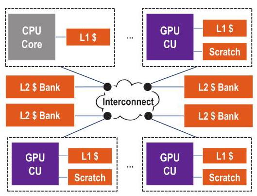

# Efficient GPU Synchronization without Scopes: Saying No to Complex Consistency Models 深度解读

> **作者**：Matthew D. Sinclair, Johnathan Alsop, Sarita V. Adve  
> **会议/年份**：MICRO-48, 2015  
> **一句话总结**：这篇论文把 DeNovo coherence protocol 扩展到 GPU，说明在不暴露 synchronization scopes、仍使用 DRF/SC-for-DRF 编程模型的前提下，也能以适度硬件开销获得接近甚至超过 scoped synchronization 的性能和能效。

## 一、问题定义

这篇论文讨论的是 unified CPU-GPU address space 之后出现的一个系统问题：GPU 不再只运行规则的数据并行 kernel，而开始面对 fine-grained synchronization、动态共享和更一般的 sharing pattern。传统 GPU coherence 通常假设程序大体 data-race-free，主要在 kernel 边界做粗粒度同步；private L1 在 acquire 时整体 self-invalidate，dirty data 在 release 前写回或 write-through 到共享 L2，同步原子操作也常在 L2 执行。这套机制简单，但一旦同步变细，acquire/release 的全局失效、store buffer flush 和远端原子都会成为主要开销。

前人的 scoped synchronization 试图把同步限制在某个 memory hierarchy 层次。例如 local scope 表示只有同一 CU 内共享 L1 的 thread blocks 参与同步，因此原子操作可以在 L1 完成，acquire 不必清空 L1，release 也不必把 dirty data 推到 L2。这个方案性能上合理，但代价是把硬件层级暴露给程序员，并要求使用比 DRF 更复杂的 heterogeneous-race-free (HRF) memory consistency model。HRF 还引入 synchronization race：不同 scope 的同步访问如果没有被 HRF happens-before 排序，就不能用来保证数据访问顺序。

所以本文的核心问题是：**能否设计一种接近传统 GPU coherence 简单性的协议，让 GPU 支持 fine-grained synchronization，同时不要求程序员标注 scopes，也不把 memory model 提升到比 DRF 更复杂的 HRF？** 作者给出的答案是把 DeNovo 这种 hybrid hardware-software coherence protocol 用到 GPU 上。DeNovo 不做 writer-initiated invalidation，也不需要 directory 维护 sharer list，但会为写入数据和同步变量获取 ownership，从而让 L1 能跨同步点复用已经拥有的最新数据。

**动机评估**：动机是 solid 的。论文从两个方向支撑问题真实存在：一方面，HSA 和 OpenCL 2.0 已经采用类似 HRF 的 scoped synchronization，说明产业界确实在处理这个问题；另一方面，实验显示 GPU+DRF 在 fine-grained synchronization 上很差，而 GPU+HRF 对 local scope 有明显收益。不过论文的实证 workload 仍以微基准为主，因为当时公开的真实 GPU 细粒度同步应用很少，这使“未来真实应用是否同样受益”仍有外推风险。

**核心 Insight**：作者真正抓住的是“性能问题不一定必须用 scope 来解决”。Scoped synchronization 通过程序员声明同步作用域来避免不必要的 invalidation/flush；DeNovo 则通过 ownership/registration 在硬件协议层记录最新副本位置，让 written data 和 synchronization variables 可以在 L1 复用。换句话说，scope 是让程序员告诉硬件“这次同步只影响哪里”，而 DeNovo 是让协议自己知道“谁拥有最新数据”。这个转移把复杂性从 memory model annotation 移回 coherence protocol，并保留 DRF 这种更熟悉的软件模型。

## 二、相关工作

论文把相关工作组织成两条主线：memory consistency model 和 coherence protocol。Consistency 方面，DRF 给 data-race-free 程序提供 sequential consistency；HRF 在 DRF 上增加 scope 属性，只在同 scope 同步访问之间建立 synchronization order。HRF-Direct 要求同步双方使用相同 scope，HRF-Indirect 进一步支持跨 scope 的传递同步，但同步 race 仍然是程序员必须理解的概念。作者还提到 GPU 上的 TSO、relaxed memory model 研究，指出这些工作没有同时评估 coherence overhead 和替代协议。

Coherence 方面，作者先给出一个有用的分类：传统 CPU 硬件协议如 MESI 依靠 writer-initiated invalidation 和 ownership；传统 GPU 软件式协议依靠 reader-initiated invalidation 和 writethrough，不跟踪 ownership；DeNovo 是混合路线，仍由 reader 在 acquire 触发 invalidation，但用硬件 tracking ownership 来定位最新副本。这一分类直接服务于本文论证：DeNovo 试图保留 GPU 协议没有 directory/ack storm 的简单性，同时拿到 ownership 带来的数据复用。

Figure 1 展示了论文的基线 tightly coupled CPU-GPU 架构：CPU core 和多个 GPU CU 都是网络节点，每个节点有本地 L1，GPU CU 还有 scratchpad，分布式 L2 bank 通过 interconnect 共享。这个结构让 local scope 和 global scope 的含义很直观：local 基本对应单个 CU/L1 内部，global 则需要跨 interconnect 到共享 L2/其他节点。

更接近的 GPU coherence 工作包括 HSC、QuickRelease、RemoteScopes、Stash、TemporalCoherence 和 FusionCoherence。HSC 使用层次化 ownership 但协议比 DeNovo 复杂；QuickRelease 可以复用同步点间数据但需要 broadcast invalidation；RemoteScopes 支持动态共享时的 scope promotion，但仍要重型硬件机制来防止 stale data；Stash 关注 scratchpad/cache 统一地址空间，不处理 GPU fine-grained synchronization。作者的定位是：这些工作各自覆盖了 DeNovo-D 的一部分能力，但没有把 ownership 对 memory model complexity 的影响作为核心问题。

## 三、技术挑战

**挑战 1：在不引入 CPU 式复杂 coherence 的情况下避免 stale data。** GPU 适合高吞吐和大量线程，传统 MESI/MOESI 那套 writer-initiated invalidation、directory、transient states 和 acknowledgement 流量不适合直接搬过来。本文需要让 L1 复用数据，却不能把协议复杂度推到传统 CPU coherence 的水平。

**挑战 2：fine-grained synchronization 会放大 acquire/release 的固定成本。** 传统 GPU-D 在 acquire 清空 L1，在 release 刷 dirty data，同步原子还在 L2 完成。粗粒度 kernel boundary 下这些成本可以接受，但 mutex、semaphore、barrier 等微同步会频繁触发这些动作，使 store buffer flush、atomic traffic 和网络流量成为瓶颈。

**挑战 3：scope annotation 本身不稳定且硬件相关。** local/global scope 的选择依赖数据共享范围、调度位置和层级结构。对动态共享如 work stealing，程序员往往必须保守使用 global scope，导致 scoped synchronization 的优势失效；若使用错误 scope，又会出现 HRF 下的 synchronization race 或 stale data 风险。

**挑战 4：ownership 要带来收益，必须处理同步变量高竞争。** DeNovo 对同步读写也要 registration，高竞争时不同 CU 的注册请求会形成分布式队列。协议要利用同一 CU 内多个 thread block 的 locality，同时避免 registration 串行化成为新的 critical path。

**挑战 5：评估样本有限。** 2015 年公开 GPU 应用里真正使用 intra-kernel fine-grained synchronization 的并不多，作者不得不用 Rodinia/Parboil 常规应用、Stuart/Owens 同步微基准和 UTS 组合评估。这能覆盖机制空间，但不能完全替代真实大规模同步应用。

## 四、解决方案

### 整体思路

论文的方案不是发明新的 memory model，而是把 DeNovo coherence protocol 移植到 GPU，并与 DRF/HRF 组合评估。核心配置是 DeNovo-D：使用 DeNovoSync0 协议，不使用 regions，不暴露 scoped synchronization，memory model 保持 DRF。为了完整比较，作者还评估传统 GPU-D、带 HRF scope 的 GPU-H、加 read-only selective invalidation 的 DeNovo-D+RO，以及同时使用 DeNovo 和 HRF 的 DeNovo-H。

### 贯穿示例

可以把一个 GPU kernel 想成 15 个 CU 上的 thread blocks 反复进入临界区：有些版本每个 CU 只操作本地数据，有些版本所有 CU 争用同一个全局锁或全局任务队列。GPU-D 会在每次 acquire 后保守清空 L1，并让同步原子去 L2；GPU-H 如果知道这是 local lock，就能在本地 L1 完成并保留数据，但一旦锁对应全局队列，就必须回到 global scope；DeNovo-D 不需要程序员声明 scope，而是在第一次访问锁或写入数据时注册 ownership，此后同一 CU 内后续同步访问和写访问可以在 L1 命中，直到 ownership 被其他 CU 请求走。

### 关键技术点

DeNovo 使用 L2 data bank 作为 registry：某个 word 的最新副本要么在 L2，要么由 registry 记录在哪个 L1 拥有。L1 中每个 word 有 Registered、Valid、Invalid 三种状态。与 MSI 类似但更简单的是，DeNovo 不维护 sharer list，也没有 writer-initiated invalidation 和复杂 transient state；它依赖 DRF 程序语义，通过 acquire 时的 reader-initiated invalidation 避免 stale data。

对数据写和同步读写，DeNovo 都通过 registration 获取 ownership。同步访问采用 DeNovoSync0：如果同步变量已经在本 L1 registered，就可以命中；否则向 registry 请求 registration。若另一个 L1 当前拥有该 word，registry 会把请求转发给拥有者。高竞争下，请求可能形成分布式队列，但同一 CU 内多个 thread block 的同步请求可以在 MSHR 内合并并优先服务，因此能利用 CU 内 temporal locality。

DeNovo 的 program order enforcement 也围绕 registration 定义：data write 和 synchronization access 在获取 registration 后才算 complete，data read 在返回值后 complete。这样它满足 DRF/HRF 对 acquire、release 和 synchronization order 的要求，同时避免传统 GPU 在 release 上大量 writethrough 的突发流量。

DeNovo-D+RO 是一个小增强：baseline DeNovo 在 acquire 时仍会 invalidate valid read-only data，因此 local-scope workload 中可能不如 GPU-H。作者增加 read-only region 信息，让 acquire 不再失效这些只读区域。这个信息虽然需要软件传递，但它是 hardware-oblivious 的程序属性，比给每个 synchronization access 标注 local/global scope 更少依赖硬件层级和调度。

Figure 2 说明 DeNovo 在传统无细粒度同步应用上基本没有破坏性：10 个 Rodinia/Parboil 类应用中，DeNovo* 的平均执行时间和能耗只增加约 0.5%，网络流量平均下降 5%。LavaMD 的网络流量尤其受益，因为 GPU* 的 store buffer 溢出导致多次写同一位置无法很好合并，而 DeNovo 获取 word ownership 后后续写可以在 L1 命中。

### 与已有方案的对比

相比 GPU-D，DeNovo-D 的主要优势是复用 written data 和 synchronization variables，避免 release 写回突发流量，并能以 word-granularity 解耦 coherence granularity 和 data transfer granularity。相比 GPU-H，DeNovo-D 不需要 scope，也更适合动态共享，因为它不依赖程序员提前判断同步只发生在本地。相比 MESI/HSC 这类 ownership-based 硬件协议，DeNovo 避免 writer-initiated invalidation、directory sharer tracking 和大量 transient states，但代价是每 word 状态位和 registration 机制。相比 RemoteScopes/QuickRelease，DeNovo 用 ownership 来定位最新副本，不需要为动态共享大量 broadcast invalidation 或全 cache flush。

## 五、实验评估

### 实验设定

作者使用集成 CPU-GPU simulator：Simics 做 CPU 功能模拟，Wisconsin GEMS 做 memory timing，GPGPU-Sim v3.2.1 模拟类似 NVIDIA GTX 480 的 GPU，Garnet 模拟 4x4 mesh interconnect。系统包含 1 个 2GHz CPU core、15 个 700MHz GPU CU、32KB 8-way L1、4MB NUCA L2、256-entry store buffer；L1 hit latency 是 1 cycle，remote L1 hit 35-83 cycles，L2 hit 29-61 cycles，memory latency 197-261 cycles。能耗用 GPUWattch 和 McPAT 估算。

被比较的配置是 GD、GH、DD、DD+RO、DH。GD 是传统 GPU coherence + DRF，所有同步在 L2；GH 是 GPU coherence + HRF-Indirect，local sync 在 L1、global sync 在 L2；DD 是 DeNovoSync0 + DRF，所有同步访问在 registration 后可在 L1；DD+RO 加 read-only selective invalidation；DH 是 DeNovo + HRF，兼有 ownership 和 local scopes。

benchmark 分三类：10 个无 intra-kernel synchronization 的 Rodinia/Parboil 应用；4 个 global synchronization 微基准 FAM_G、SLM_G、SPM_G、SPMBO_G；以及 local/hybrid synchronization workload，包括 local mutex、reader-writer semaphore、tree barrier、TBEX_LG、TB_LG 和 UTS。作者明确承认公开真实 fine-grained GPU benchmark 稀缺，因此微基准承担了主要机制评估责任。

### 主要实验与结论

无细粒度同步应用上，DeNovo* 与 GPU* 基本持平：平均执行时间和能耗增加 0.5%，网络流量下降 5%。这支持一个前提：为 fine-grained synchronization 加 ownership 机制，不会明显伤害传统 GPU workload。

Figure 3 是本文最有力的结果。对于只使用 global synchronization 的四个微基准，HRF 没有帮助，因为没有 local scope 可以利用；DeNovo* 相比 GPU* 平均降低 28% 执行时间、51% 能耗和 81% 网络流量。图中的平均柱也直观显示，DeNovo 的执行时间约为 GPU 的 72%，动态能耗约为 49%，网络流量约为 19%。原因是同步变量 ownership 让同一 CU 上后续原子访问可以命中，owned data 不会在 acquire 后失效，release 也不必把所有 dirty write-through 到 L2。

对 local synchronization，GPU-H 相比 GPU-D 的收益很大：平均执行时间下降 46%，能耗下降 42%，local acquire 在 L1 完成使 atomic traffic 平均下降 94%，L1/L2/network 能耗组件平均下降 71%，非 atomic network traffic 平均下降 78%。这说明 scoped synchronization 本身确实解决了传统 GPU-D 的重要瓶颈。

Figure 4 展示了 local/hybrid workload 上的边界：GPU-H 比 baseline DeNovo-D 平均执行时间低 6%、能耗低 4%，最大优势分别是 13% 和 10%。这个差距主要来自 DeNovo-D 仍会失效 read-only valid data，且 UTS 等需要全局同步/动态队列的场景会频繁触发 invalidate 和 store buffer flush。加入 DD+RO 后，GPU-H 的平均性能和能耗优势基本消失；在少数 case 中 GPU-H 仍领先，但最多只有 7% 执行时间和 4% 能耗。DH 通常最好，因为它同时拥有 ownership 和 local scope，但它又回到了 HRF 的复杂 memory model。

### 结论支撑性分析

实验较好地支撑了“HRF 的复杂性不是获得高性能的必要条件”：全局同步场景下 DD 明显优于 GPU-H/GD，local 同步场景下 DD+RO 与 GH 平均持平，而 DD 保留 DRF。它也支撑了“HRF 不是充分条件”：GPU-H 在 global sync 上仍无法解决 L2 原子、flush 和缺少 ownership 的问题。需要谨慎的是，实验平台和 CUDA 版本较老，真实细粒度同步应用不足，很多结论来自微基准；因此更准确的表述是，本文证明了 DeNovo+DRF 是一个有力设计点，而不是最终证明所有未来 GPU workload 都不需要 scoped synchronization。

## 六、附加洞察

**结论 1：store buffer 行为会显著影响 coherence 方案的相对优劣。**  
*出处*：Section 6.2.1 的 LavaMD 分析，以及 Section 6.2.3 的 TB_LG/TBEX_LG 分析。  
*推理链条*：GPU coherence 依赖 store buffer 合并 write-through → 当 LavaMD 或 tree barrier 类 workload 让 store buffer 溢出时，同一位置多次写无法有效合并 → GPU* 或 GPU-H 需要向 L2 发送更多 write-through/flush 流量 → DeNovo 一旦获得 ownership，后续写在 L1 命中且 release 成本更低 → 因此 DeNovo 的收益不仅来自同步变量 locality，也来自缓解 store buffer 溢出带来的突发流量。

**结论 2：read-only data 是 DeNovo-D 的一个具体短板，而不是 ownership 思路本身的失败。**  
*出处*：Section 6.2.3 和 Section 6.3。  
*推理链条*：baseline DeNovo-D 只保证 registered/owned data 可跨同步点复用 → read-only valid data 在 acquire 后仍会被失效 → local-scope workload 中 GPU-H 可以保留这些数据，因此在 SS_L、UTS 等场景略占优势 → 加入 read-only selective invalidation 后，GPU-H 的平均优势被消除 → 这说明 DD 的主要缺口可以用硬件无关的软件区域信息弥补，而不必把每个同步操作都改成 scope-aware。

**结论 3：scopes 对静态本地同步很有效，但对动态共享并不自然。**  
*出处*：Section 4.1 对 GPU-H 的定性分析，以及 Section 5.4/6.2.3 对 UTS、TB_LG、TBEX_LG 的讨论。  
*推理链条*：local scope 只有在同步参与者确实局限于同一 CU/L1 时才安全 → UTS 这类不平衡工作窃取会在本地队列和全局任务队列之间切换 → 程序员必须保守使用 global synchronization 或处理 scope promotion → global scope 又恢复 L2 同步、flush 和 invalidation 成本 → DeNovo 用 ownership 跟踪实际最新副本位置，因此对动态共享更直接。

**结论 4：ownership 也有开销，只是本文 workload 中收益占主导。**  
*出处*：Section 4.1 和 Section 6.2.1。  
*推理链条*：DeNovo 获取 ownership 可能导致远端 L1 miss 多一跳，也可能在高竞争同步变量上发生 registration 串行化 → 这些开销在某些应用会增加 network traffic 和 energy → 但常规应用中它们不在性能 critical path，而 global synchronization benchmark 中同步变量命中、owned data 复用和 release 流量减少更大 → 因此实验中平均收益覆盖了 ownership 的额外 latency。

## 七、总结与评价

本文最大的贡献是把“GPU fine-grained synchronization 必须暴露 scopes 才高效”这个假设拆开了：性能收益来自减少不必要的失效、写回和远端原子，而这些目标可以通过 DeNovo 的 ownership/registration 达成，不一定要让程序员承担 HRF 的复杂性。DeNovo-D 在 global synchronization 上明显优于 GPU-H，在 local synchronization 上通过一个 read-only 区域增强就能平均追平 GPU-H，因而构成了一个性能、能耗、硬件开销和 memory model complexity 之间很均衡的设计点。

论文的亮点是问题拆解清楚，协议比较维度很系统，实验结论没有简单宣称 DeNovo 全面胜出，而是承认 GPU-H 在局部同步上小幅领先、DH 在接受 HRF 后最好。主要不足是评估 workload 受限，很多细粒度同步结论来自微基准；此外，DeNovo 依赖 DRF discipline 和 word-granularity state，在更现代 GPU cache hierarchy、更多真实 irregular applications、更多并发 CPU 参与时还需要重新验证。

## 八、章节脉络与段落速览

- **Abstract**：提出传统 GPU coherence 在 fine-grained synchronization 下低效，scoped synchronization 带来 HRF 复杂性，DeNovo+DRF 在性能、能耗和模型复杂度之间给出 sweet spot。
- **Section 1 · Introduction**：从 unified CPU-GPU address space 和新兴 GPGPU sharing pattern 引出 coherence/synchronization/memory consistency 问题。
  - ¶1 说明 GPU 变得通用后，需要在统一地址空间下处理 coherence、synchronization 和 consistency。
  - ¶2 解释传统 GPU coherence 依赖 kernel 边界粗粒度同步、acquire invalidate 和 release flush。
  - ¶3 对比 CPU coherence，强调 GPU-style protocol 的简单性和 DRF 友好性。
  - ¶4 引出 fine-grained synchronization workload，并说明 scoped synchronization 如何把 local sync 放到 L1。
  - ¶5-6 指出 scopes 会破坏 DRF 的简单性，引入 HRF 和 synchronization race。
  - ¶7-8 提出研究问题：能否保持 DRF，同时接近 scopes 的性能；随后给出 DeNovo 作为答案。
  - ¶9-13 列出贡献：DeNovo-D、GPU/DeNovo 与 DRF/HRF 对比、DD+RO、DeNovo-H，以及不采用 MESI 对比的原因。
- **Section 2 · Background: Memory Consistency Models**：定义 DRF、HRF 及其 happens-before/synchronization order 差异。
  - ¶1 说明协议是否使用 scopes 决定采用 DRF 或 HRF。
  - ¶2 概括 DRF 如何为 data-race-free 程序提供 SC。
  - ¶3 说明 HRF 在同步访问上加入 scope，并引入 synchronization race。
  - ¶4 给出 acquire/release/synchronization 的 program order completion requirement。
- **Section 3.A · Classification of Coherence Protocols**：把 coherence 的任务分成避免 stale data 和定位 up-to-date data。
  - ¶1-3 用 Table 1 分类 CPU hardware、GPU software 和 DeNovo hybrid protocol。
  - **Conventional Hardware Protocols used in CPUs**：说明 MESI 类协议依靠 writer invalidation、directory 和 ownership，适合 CPU 但不适合 GPU。
  - **Software Protocols used in GPUs**：说明 GPU 协议用 reader invalidation 和 writethrough 保证正确性，但 fine-grained sync 成本高；local/global scopes 能降低成本但暴露硬件层级。
  - **DeNovo: A Hybrid Hardware-Software Protocol**：介绍 DeNovo 的 registry、Registered/Valid/Invalid 状态、selective invalidation、DeNovoSync0、registration queue 和 completion 规则。
- **Section 4 · Qualitative Analysis of the Protocols**：用定性维度比较 GD、GH、DD、DH 的能力和开销。
  - **4.1 Qualitative Performance Analysis**：从 written data reuse、valid data reuse、bursty traffic、network traffic、granularity、sync reuse、dynamic sharing 七个角度比较协议。
  - **4.2 Protocol Implementation Overheads**：列出 GPU-D、GPU-H、DeNovo-D/H、DD+RO 的状态位和实现支持开销。
- **Section 5 · Methodology**：说明仿真环境、硬件参数、配置和 benchmark。
  - **5.1 Baseline Heterogeneous Architecture**：描述 CPU/GPU CU 通过 interconnect 连接私有 L1、scratchpad 和共享 L2 bank。
  - **5.2 Simulation Environment and Parameters**：列出 Simics、GEMS、GPGPU-Sim、Garnet、CUDA 3.1、GPUWattch/McPAT 和关键延迟/容量参数。
  - **5.3 Configurations**：定义 GD、GH、DD、DD+RO、DH 五种配置。
  - **5.4 Benchmarks**：说明使用常规应用、同步微基准和 UTS 覆盖无同步、全局同步、本地/混合同步三类场景。
- **Section 6 · Results**：给出性能、能耗和网络流量结果。
  - ¶1-3 解释 Figure 2-4 的归一化方式和总体结论。
  - **6.1 GPU-D vs. GPU-H**：证明 local scopes 对 GPU-H 很有效，执行时间和能耗分别平均下降 46% 和 42%。
  - **6.2.1 Traditional GPU Applications**：说明 DeNovo 在无同步应用上基本持平，并用 LavaMD 解释 store buffer 溢出带来的流量差异。
  - **6.2.2 Global Synchronization Benchmarks**：说明 DeNovo 在全局同步上通过同步变量 ownership 和 owned data reuse 平均降低 28% 时间、51% 能耗、81% 流量。
  - **6.2.3 Local Synchronization Benchmarks**：比较 DD 与 GH，指出 DD 对 owned data 强、对 read-only valid data 弱，GH 平均小幅领先。
  - **6.3 DeNovo-D with Selective (RO) Invalidations**：说明 DD+RO 消除 GH 的平均优势，并且所需信息比 scope 更硬件无关。
  - **6.4 Applying HRF to DeNovo**：说明 DH 因同时利用 ownership 和 scopes 成为性能最佳，但 memory model complexity 也最高。
- **Section 7 · Related Work**：把本文放回 consistency model 和 GPU coherence 研究脉络。
  - **7.1 Consistency**：指出 TSO/relaxed GPU memory model 工作没有同时评估 coherence overhead。
  - **7.2 Coherence Protocols**：比较 HSC、Stash、TemporalCoherence、FusionCoherence、QuickRelease、RemoteScopes 与 DD 的能力差异。
- **Section 8 · Conclusion**：重申 DeNovo+DRF 可以在不暴露 scopes 的情况下高效支持 fine-grained synchronization，并指出未来需要 full-sized applications 验证。
- **Acknowledgments / References**：列出资助、致谢和引用来源。
