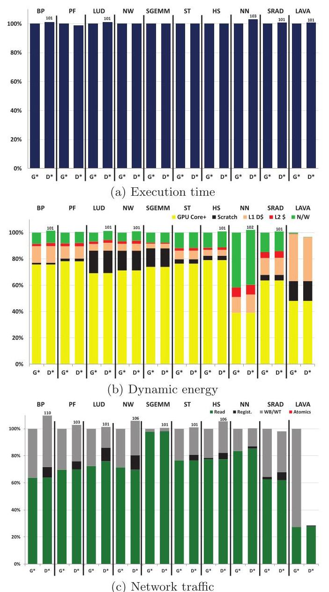
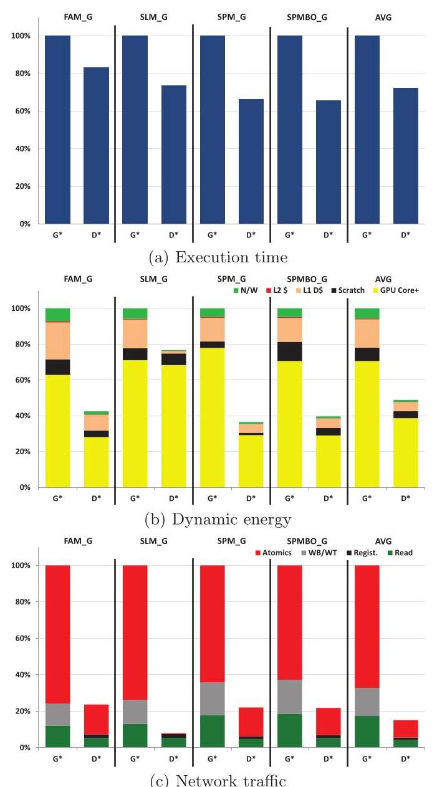
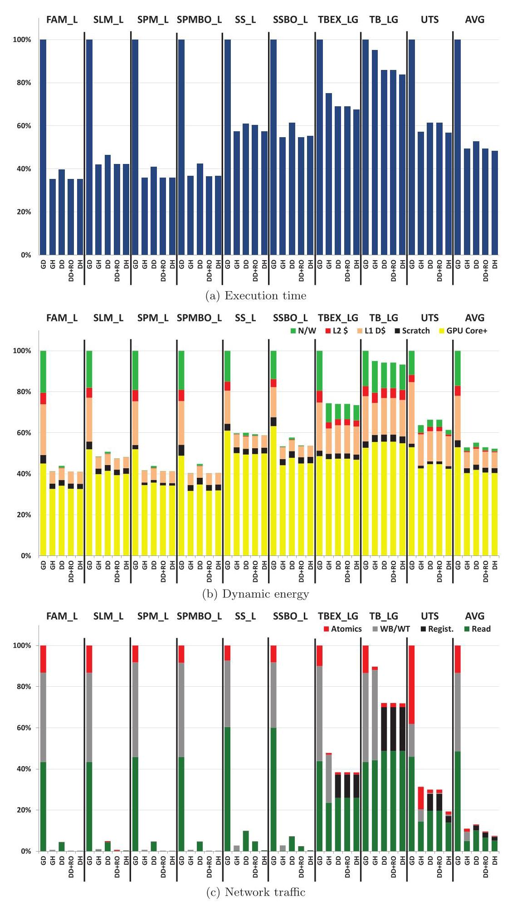

# Efficient GPU Synchronization without Scopes: Saying No to Complex Consistency Models

Matthew D. Sinclair† Johnathan Alsop† Sarita V. Adve##

> 
Matthew D. Sinclair† Johnathan Alsop† Sarita V. Adve##

† University of Illinois at Urbana-Champaign

> 
† 伊利诺伊大学厄巴纳-香槟分校 (University of Illinois at Urbana-Champaign)

‡ École Polytechnique Fédérale de Lausanne

> 
‡ 洛桑联邦理工学院 (École Polytechnique Fédérale de Lausanne)

hetero@cs.illinois.edu

> 
hetero@cs.illinois.edu

## ABSTRACT

As GPUs have become increasingly general purpose, applications with more general sharing patterns and fine-grained synchronization have started to emerge. Unfortunately, conventional GPU coherence protocols are fairly simplistic, with heavyweight requirements for synchronization accesses. Prior work has tried to resolve these inefficiencies by adding scoped synchronization to conventional GPU coherence protocols, but the resulting memory consistency model, heterogeneous-race-free (HRF), is more complex than the common data-race-free (DRF) model. This work applies the DeNovo coherence protocol to GPUs and compares it with conventional GPU coherence under the DRF and HRF consistency models. The results show that the complexity of the HRF model is neither necessary nor sufficient to obtain high performance. DeNovo with DRF provides a sweet spot in performance, energy, overhead, and memory consistency model complexity.

> 
随着 GPU 的通用性不断增强，具有更通用共享模式和细粒度同步的应用程序开始涌现。不幸的是，传统的 GPU 一致性协议相当简单，并且对同步访问有繁重的要求。先前的工作试图通过向传统 GPU 一致性协议中添加作用域同步来解决这些低效问题，但由此产生的内存一致性模型——异构无竞争 (heterogeneous-race-free, HRF)——比常见的数据无竞争 (data-race-free, DRF) 模型更为复杂。本工作将 DeNovo 一致性协议应用于 GPU，并在 DRF 和 HRF 一致性模型下将其与传统 GPU 一致性进行比较。结果表明，HRF 模型的复杂性对于获得高性能既非必要也不充分。采用 DRF 的 DeNovo 在性能、能耗、开销和内存一致性模型复杂性方面提供了一个最佳平衡点。

Specifically, for benchmarks with globally scoped fine-grained synchronization, compared to conventional GPU with HRF (GPU+HRF), DeNovo+DRF provides 28% lower execution time and 51% lower energy on average. For benchmarks with mostly locally scoped fine-grained synchronization, GPU+HRF is slightly better - however, this advantage requires a more complex consistency model and is eliminated with a modest enhancement to DeNovo+DRF. Further, if HRF's complexity is deemed acceptable, then DeNovo+HRF is the best protocol.

> 
具体而言，对于具有全局作用域细粒度同步（globally scoped fine-grained synchronization）的基准测试，与采用HRF的传统GPU（GPU+HRF）相比，DeNovo+DRF在执行时间上平均降低28%，能耗平均降低51%。对于大部分为局部作用域细粒度同步的基准测试，GPU+HRF表现略好——然而，这一优势需要更复杂的一致性模型（consistency model），并且可以通过对DeNovo+DRF的适度增强来消除。此外，如果HRF的复杂性被认为可以接受，那么DeNovo+HRF就是最佳协议。

## Categories and Subject Descriptors

B.3.2 [Hardware]: Memory Structures - Cache memories; Shared memory; C.1.2 [Processor Architectures]: Single-instruction-stream, multiple-data-stream processors (SIMD); I.3.1 [Computer Graphics]: Graphics processors

> 
B.3.2 [硬件]: 存储器结构 (Memory Structures) - 高速缓存 (Cache memories)；共享存储器 (Shared memory)；C.1.2 [处理器体系结构 (Processor Architectures)]：单指令流多数据流处理器 (Single-instruction-stream, multiple-data-stream processors, SIMD)；I.3.1 [计算机图形学 (Computer Graphics)]：图形处理器 (Graphics processors)

## Keywords

GPGPU, cache coherence, memory consistency models, data-race-free models, synchronization

> 
通用图形处理器 (GPGPU)，缓存一致性 (cache coherence)，内存一致性模型 (memory consistency models)，无数据竞争模型 (data-race-free models)，同步 (synchronization)

## 1. INTRODUCTION

GPUs are highly multithreaded processors optimized for data-parallel execution. Although initially used for graphics applications, GPUs have become more general-purpose and are increasingly used for a wider range of applications. In an ongoing effort to make GPU programming easier, industry has integrated CPUs and GPUs into a single, unified address space [1, 2]. This allows GPU data to be accessed on the CPU and vice versa without an explicit copy. While the ability to access data simultaneously on the CPU and GPU has the potential to make programming easier, GPUs need better support for issues such as coherence, synchronization, and memory consistency.

> 
GPU 是高度多线程的处理器，针对数据并行执行进行了优化。尽管最初用于图形应用，但 GPU 已变得更加通用，并越来越多地用于更广泛的应用。在为简化 GPU 编程而进行的持续努力中，产业界已将 CPU 和 GPU 集成到单一的、统一的地址空间 (unified address space) 中 [1, 2]。这使得 GPU 数据可以在 CPU 上访问，反之亦然，无需显式复制。虽然同时在 CPU 和 GPU 上访问数据的能力有可能简化编程，但 GPU 需要在一致性 (coherence)、同步 (synchronization) 和内存一致性 (memory consistency) 等问题上获得更好的支持。

Previously, GPUs focused on data-parallel, mostly streaming, programs which had little or no sharing or data reuse between Compute Units (CUs). Thus, GPUs used very simple software-driven coherence protocols that assume data-race-freedom, regular data accesses, and mostly coarse-grained synchronization (typically at GPU kernel boundaries). These protocols invalidate the cache at acquires (typically the start of the kernel) and flush (writethrough) all dirty data before the next release (typically the end of the kernel) [3]. The dirty data flushes go to the next level of the memory hierarchy shared between all participating cores and CUs (e.g., a shared L2 cache). Fine-grained synchronization (implemented with atomics) was expected to be infrequent and executed at the next shared level of the hierarchy (i.e., bypassing private caches).

> 
以往，GPU 主要面向数据并行、大多为流式处理的程序，这类程序的计算单元 (Compute Unit, CU) 之间几乎没有共享或数据重用。因此，GPU 采用了非常简单的软件驱动一致性协议，这些协议假定程序是无数据竞争的、数据访问是规则的，并且同步以粗粒度为主（通常在 GPU 内核边界处）。这些协议会在获取 (acquire) 操作（通常是内核启动）时使缓存失效，并在下一次释放 (release) 操作（通常是内核结束）之前将所有脏数据冲刷（写穿）出去 [3]。脏数据会冲刷到所有参与核心与 CU 共享的下一级存储层次（例如共享的 L2 缓存）。细粒度的同步（通过原子操作实现）被认为很少发生，并且会在共享的下一级存储层次上执行（即绕过私有缓存）。

Thus, unlike conventional multicore CPU coherence protocols, conventional GPU-style coherence protocols are very simple, without need for writer-initiated invalidations, ownership requests, downgrade requests, protocol state bits, or directories. Further, although GPU memory consistency models have been slow to be clearly defined $\left\lbrack  {4,5}\right\rbrack$ , GPU coherence implementations were amenable to the familiar data-race-free model widely adopted for multicores today.

> 
因此，与常规多核CPU一致性协议不同，常规GPU风格的一致性协议非常简单，无需写入者发起的无效化（writer-initiated invalidations）、所有权请求（ownership requests）、降级请求（downgrade requests）、协议状态位（protocol state bits）或目录（directories）。此外，尽管GPU内存一致性模型（memory consistency models）的定义一直进展缓慢$\left\lbrack  {4,5}\right\rbrack$，但GPU一致性实现与如今多核处理器广泛采用的无数据竞争模型（data-race-free model）相适应。

However, the rise of general-purpose GPU (GPGPU) computing has made GPUs desirable for applications with more general sharing patterns and fine-grained synchronization $\left\lbrack  {6,7,8,9,{10},{11}}\right\rbrack$ . Unfortunately, conventional GPU-style coherence schemes involving full cache invalidates, dirty data flushes, and remote execution at synchronizations are inefficient for these emerging workloads. To overcome these inefficiencies, recent work has proposed associating synchronization accesses with a scope that indicates the level of the memory hierarchy where the synchronization should occur [8, 12]. For example, a synchronization access with a local scope indicates that it synchronizes only the data accessed by the thread blocks within its own CU (which share the L1 cache). As a result, the synchronization can execute at the CU's L1 cache, without invalidating or flushing data to lower levels of the memory hierarchy (since no other CUs are intended to synchronize through this access). For synchronizations that can be identified as having local scope, this technique can significantly improve performance by eliminating virtually all sources of synchronization overhead.

> 
然而，通用 GPU 计算（General-Purpose GPU, GPGPU）的兴起使得 GPU 对具有更通用共享模式和细粒度同步（fine-grained synchronization）$\left\lbrack  {6,7,8,9,{10},{11}}\right\rbrack$ 的应用变得颇具吸引力。遗憾的是，传统 GPU 风格的一致性方案涉及在同步时进行完整的缓存无效化、脏数据刷新和远程执行，对这类新兴工作负载效率低下。为克服这些低效问题，近期工作提出将同步访问与一个作用域（scope）关联起来，该作用域指明了同步应在内存层次结构的哪一层级发生 [8, 12]。例如，带有局部作用域的同步访问表示它只同步其所在 CU（计算单元，Compute Unit）内线程块（thread block）所访问的数据（这些线程块共享 L1 缓存）。如此一来，该同步就可以在 CU 的 L1 缓存上执行，而无需将数据无效化或刷新到内存层次结构的更低层级（因为不打算让其他 CU 通过此访问进行同步）。对于可被识别为具有局部作用域的同步，该技术能够通过实质上消除所有同步开销来源，显著提升性能。

---

Permission to make digital or hard copies of all or part of this work for personal or classroom use is granted without fee provided that copies are not made or distributed for profit or commercial advantage and that copies bear this notice and the full citation on the first page. To copy otherwise, to republish, to post on servers or to redistribute to lists, requires prior specific permission and/or a fee. Request permissions from Permissions@acm.org.MICRO-48, December 05-09, 2015 Waikiki, HI, USA

> 
允许个人或课堂使用本作品全部或部分内容制作数字或硬拷贝，无需付费，前提是这些拷贝不得用于盈利或商业目的，且拷贝须附有本声明及首页的完整引用。否则，进行复制、再版、发布到服务器或分发给列表，均需事先获得明确许可和/或支付费用。请通过 Permissions@acm.org 申请许可。MICRO-48, 2015年12月5-9日，美国夏威夷州威基基。

Copyright 2015 ACM 978-1-4503-4034-2/15/12 ...\$15.00.

> 
Copyright 2015 ACM 978-1-4503-4034-2/15/12 ...$15.00.
本文探讨了 GPU 是否能够高效支持细粒度同步，而无需求助于引入作用域同步（scoped synchronization）的复杂异构无竞争（heterogeneous-race-free, HRF）内存模型。传统的 GPU 一致性协议（软件驱动，获取时自失效，释放时刷新）对于新兴的不规则 GPU 工作负载表现不佳。先前的工作通过 HRF 下的作用域同步提升了性能，但 HRF 将内存层次暴露给程序员，并显著增加了复杂性。作者追问，更简单的数据无竞争（data-race-free, DRF）模型能否达到可比的性能。

他们提出将 DeNovo 混合一致性协议应用于 GPU。DeNovo 采用读者发起的失效（reader-initiated invalidations），并在写入时获取所有权，从而避免了笔者发起的失效（writer-initiated invalidations）和目录。该研究将 DeNovo-DRF、带有只读区域优化的 DeNovo-DRF 以及 DeNovo-HRF 与传统 GPU 一致性协议（分别在 DRF 和 HRF 下）进行了比较，并使用传统的 GPU 应用程序和带有全局或局部同步的微基准测试进行评估。

主要发现：对于不含细粒度同步的应用，DeNovo 的性能与传统 GPU 相当。对于全局作用域的细粒度同步，DeNovo-DRF 相比 GPU-HRF 平均减少了 28% 的执行时间和 51% 的能耗。对于大多为局部作用域同步的基准测试，GPU-HRF 相比 DeNovo-DRF 平均执行时间仅降低了 6%，但这一优势被 DeNovo-DRF 的一个简单只读区域增强所消除，且 HRF 需要更复杂的一致性模型。若接受 HRF 的复杂性，DeNovo-HRF 则成为整体最佳协议。工作结论是，带有 DRF 的 DeNovo 在性能、能耗、硬件开销和模型简洁性之间提供了最优平衡——对于 GPU 上高效的细粒度同步，HRF 的额外复杂性并非必要。

DOI: http://dx.doi.org/10.1145/2830772.2830821

> 
本文研究GPU是否能够高效支持细粒度同步（fine‑grained synchronization），而无需诉诸复杂的异构无竞争（heterogeneous‑race‑free, HRF）内存模型，该模型引入了作用域同步（scoped synchronization）。传统GPU一致性协议（软件驱动，获取时自失效，释放时刷新）对于新兴的不规则GPU工作负载表现不佳。先前工作通过HRF下的作用域同步提升了性能，但HRF将内存层次暴露给程序员并增加了显著复杂性。作者探讨了更简单的数据无竞争（data‑race‑free, DRF）模型是否能达到相当的性能。

他们提出将DeNovo混合一致性协议应用于GPU。DeNovo采用读者发起失效（reader‑initiated invalidations）并在写入时获取所有权，从而避免了写者发起失效（writer‑initiated invalidations）和目录。研究在传统GPU应用和具有全局或局部同步的微基准测试（microbenchmarks）上，将DeNovo‑DRF、带只读区域优化的DeNovo‑DRF以及DeNovo‑HRF，与在DRF和HRF下的传统GPU一致性进行了比较。

主要发现：对于无细粒度同步的应用，DeNovo的性能与传统GPU相当。对于全局作用域的细粒度同步，DeNovo‑DRF平均比GPU‑HRF的执行时间降低28%，能耗降低51%。对于主要使用局部作用域同步的基准测试，GPU‑HRF相比DeNovo‑DRF平均执行时间仅降低6%，但这一优势被对DeNovo‑DRF的简单只读区域增强所消除，且需更复杂的一致性模型。若接受HRF的复杂性，DeNovo‑HRF成为整体最优协议。工作得出结论：结合DRF的DeNovo在性能、能耗、硬件开销和模型简洁性之间提供了最优平衡——对于GPU上高效的细粒度同步，HRF的额外复杂性并非必要。

---

Although the introduction of scopes is an efficient solution to the problem of fine-grained GPU synchronization, it comes at the cost of programming complexity. Data-race-free is no longer a viable memory consistency model since locally scoped synchronization accesses potentially lead to "synchronization races" that can violate sequential consistency in non-intuitive ways (even for programs deemed to be well synchronized by the data-race-free memory model). Recently, Hower et al. addressed this problem by formalizing a new memory model, heterogeneous-race-free (HRF), to handle scoped synchronization. The Heterogeneous System Architecture (HSA) Foundation [1], a consortium of several industry vendors, and OpenCL 2.0 [13] have recently adopted a model similar to HRF with scoped synchronization.

> 
尽管引入作用域（scope）是解决细粒度GPU同步问题的有效方案，但这是以编程复杂性为代价的。无数据竞争（data-race-free）不再是一个可行的内存一致性模型，因为局部作用域的同步访问可能引发“同步竞争（synchronization races）”，这种竞争会以非直观的方式破坏顺序一致性（sequential consistency）（即使对于被无数据竞争内存模型视为同步良好的程序也是如此）。近期，Hower等人通过形式化一种新的内存模型——异构无竞争（heterogeneous-race-free, HRF）——来解决此问题，以处理作用域同步。异构系统架构（HSA）基金会[1]（由多家行业厂商组成的联盟）和OpenCL 2.0[13]最近已采纳了一种类似HRF并支持作用域同步的模型。

Although HRF is a very well-defined model, it cannot hide the inherent complexity of using scopes. Intrinsically, scopes are a hardware-inspired mechanism that expose the memory hierarchy to the programmer. Using memory models to expose a hardware feature is consistent with the past evolution of memory models (e.g., the IBM 370 and total store order (TSO) models essentially expose hardware store buffers), but is discouraging when considering the past confusion generated by such an evolution. Previously, researchers have argued against such a hardware-centric view and proposed more software-centric models such as data-race-free [14]. Although data-race-free is widely adopted, it is still a source of much confusion [15]. Viewing the subtleties and complexities associated even with the so-called simplest models, we argue GPU consistency models should not be even more complex than the CPU models.

> 
尽管 HRF 是一个非常明确的模型，但它无法掩盖使用作用域 (scopes) 所固有的复杂性。本质上，作用域是一种受硬件启发的机制，它会将内存层次结构暴露给程序员。利用内存模型来暴露硬件特性，这与内存模型过去的发展历程是一致的（例如，IBM 370 和全存储定序 (total store order, TSO) 模型本质上就是暴露了硬件存储缓冲区），但考虑到这种演进在过去造成的诸多困惑，这令人沮丧。此前，研究者已经反对过这种以硬件为中心的观点，并提出更以软件为中心的模型，如无数据竞争 (data-race-free) 模型 [14]。尽管无数据竞争模型被广泛采用，但它仍然是许多困惑的来源 [15]。考虑到即使是所谓最简单模型也存在的微妙性和复杂性，我们主张 GPU 一致性模型不应比 CPU 模型更加复杂。

We therefore ask the question - can we develop coherence protocols for GPUs that are close to the simplicity of conventional GPU protocols but give the performance benefits of scoped synchronization, while enabling a memory model no more complex than data-race-free?

> 
我们因此提出一个问题——能否开发出接近传统 GPU 协议简易性的 GPU 一致性协议，同时提供作用域同步（scoped synchronization）的性能优势，并支持一种复杂度不高于数据无竞争（data-race-free）的内存模型？

We show that this is possible by considering a recent hardware-software hybrid protocol, DeNovo [16, 17, 18], originally proposed for CPUs. DeNovo does not require writer-initiated invalidations or directories, but does obtain ownership for written data. The key additional overhead for DeNovo over GPU-style coherence with HRF is 1 bit per word at the caches (previous work on DeNovo uses software regions [16] for selective invalidations; our baseline DeNovo protocol does not use these to minimize overhead). Specifically, this paper makes the following contributions:

> 
我们展示了这一点是可行的，方法是考察一种最近为 CPU 提出的软硬件混合协议——DeNovo [16, 17, 18]。DeNovo 不需要写入者发起的无效化（writer-initiated invalidations）或目录（directories），但确实会为已写入的数据获取所有权（ownership）。相较于采用 HRF 的 GPU 风格一致性，DeNovo 的额外开销主要是在缓存中每个字（word）增加 1 比特（先前关于 DeNovo 的工作使用软件区域（software regions）[16] 来实现选择性无效化（selective invalidations）；我们的基准 DeNovo 协议未使用这些机制，以将开销降至最低）。具体而言，本文做出了以下贡献：

- We identify DeNovo (without regions) as a viable coherence protocol for GPUs. Due to its use of ownership on writes, DeNovo is able to exploit reuse of written data and synchronization variables across synchronization boundaries, without the additional complexity of scopes.

> 
我们将 DeNovo（无区域）界定为 GPU 上一种可行的一致性协议。得益于在写入时采用所有权，DeNovo 能够跨同步边界利用已写入数据与同步变量的重用，而无需作用域（scopes）的额外复杂性。

- We compare DeNovo with the DRF consistency model (i.e., no scoped synchronization) to GPU-style coherence with the DRF and HRF consistency models (i.e., without and with scoped synchronization). As expected, GPU+DRF performs poorly for applications with fine-grained synchronization. However, DeNovo+DRF provides a sweet spot in terms of performance, energy, implementation overhead, and memory model complexity.

> 
- 我们将采用 DRF 一致性模型（即无范围同步）的 DeNovo 与采用 DRF 和 HRF 一致性模型（即不含与含范围同步）的 GPU 风格一致性进行对比。如预期所示，GPU+DRF 在涉及细粒度同步的应用中表现不佳。然而，DeNovo+DRF 在性能、能耗、实现开销以及内存模型复杂性方面达到了理想的平衡点。

Specifically, we find the following when comparing the performance and energy for DeNovo+DRF and GPU+HRF. For benchmarks with no fine-grained synchronization, DeNovo is comparable to GPU. For microbenchmarks with globally scoped fine-grained synchronization, DeNovo is better than GPU (on average 28% lower execution time and 51% lower energy). For microbenchmarks with mostly locally scoped synchronization, GPU does better than DeNovo - on average 6% lower execution time, with a maximum reduction of 13% (4% and 10% lower, respectively, for energy). However, GPU+HRF's modest benefit for locally scoped synchronization must be weighed against HRF's higher complexity and GPU's much lower performance for globally scoped synchronization.

> 
具体而言，在对比 DeNovo+DRF 与 GPU+HRF 的性能与能耗时，我们得出以下发现。对于无细粒度同步的基准测试，DeNovo 与 GPU 表现相当。对于具有全局作用域细粒度同步的微基准测试，DeNovo 优于 GPU（平均执行时间降低 28%，能耗降低 51%）。对于以局部作用域同步为主的微基准测试，GPU 的表现优于 DeNovo——平均执行时间降低 6%，最大降幅为 13%（能耗分别降低 4% 和 10%）。然而，GPU+HRF 在局部作用域同步上的有限优势，需要与其更高的复杂性以及 GPU 在全局作用域同步上明显较低的性能进行权衡。

- For completeness, we also enhance DeNovo+DRF with selective invalidations to avoid invalidating valid, read-only data regions at acquires. The addition of a single software (read-only) region does not add any additional state overhead, but does require the software to convey the read-only region information. This enhanced DeNovo+DRF protocol provides the same performance and energy as GPU+HRF on average.

> 
为了完整性，我们还通过选择性失效（selective invalidations）增强了DeNovo+DRF，以避免在获取（acquire）时使有效的只读数据区域失效。添加单个软件（只读）区域不会增加任何额外的状态开销，但确实需要软件传递只读区域信息。这种增强的DeNovo+DRF协议平均可提供与GPU+HRF相同的性能和能耗。

- For cases where HRF's complexity is deemed acceptable, we develop a version of DeNovo for the HRF memory model. We find that DeNovo+HRF is the best performing protocol - it is either comparable to or better than GPU+HRF for all cases and significantly better for applications with globally scoped synchronization.

> 
对于可以接受 HRF 复杂性的情况，我们为 HRF 内存模型开发了一个 DeNovo 版本。我们发现 DeNovo+HRF 是性能最佳的协议——它在所有情况下均与 GPU+HRF 相当或优于后者，并且在具有全局作用域同步（globally scoped synchronization）的应用程序中明显更优。

Although conventional hardware protocols such as MESI support fine-grained synchronization with DRF, we do not compare to them here because prior research has observed that they incur significant complexity (e.g., writer-initiated invalidations, directory overhead, and many transient states leading to cache state overhead) and are a poor fit for conventional GPU applications [3, 19] (also evidenced by HSA's adoption of HRF). Additionally, the DeNovo project has shown that for CPUs, DeNovo provides comparable or better performance than MESI at much less complexity [16, 17, 18].

> 
尽管传统的硬件协议（如MESI协议（MESI））在DRF（数据无竞争，data‑race‑free）下支持细粒度同步，但本文不将其纳入比较，因为前人研究已观察到，它们会引入显著的复杂性（如写者发起的无效化（writer‑initiated invalidations）、目录开销（directory overhead）以及大量瞬态状态导致的缓存状态开销（cache state overhead）），并与传统GPU应用不相适配[3, 19]（HSA对HRF（异构无竞争，heterogeneous‑race‑free）的采用也印证了这一点）。此外，DeNovo项目已证明，在CPU上，DeNovo协议能以远低于MESI的复杂度，实现与之相当或更优的性能[16, 17, 18]。

This work is the first to show that GPUs can support fine-grained synchronization efficiently without resorting to the complexity of the HRF consistency model at modest hardware overhead. DeNovo with DRF provides a sweet spot for performance, energy, overhead, and memory model complexity, questioning the recent move towards memory models for GPUs that are more complex than those for CPUs.

> 
本工作首次表明，在适度的硬件开销下，GPU 能够高效支持细粒度同步 (fine-grained synchronization)，而无需采用复杂的 HRF 一致性模型 (HRF consistency model)。采用数据竞争自由 (DRF) 的 DeNovo 在性能、能耗、开销和内存模型复杂性 (memory model complexity) 之间提供了一个最佳平衡点，从而对近期趋向于采用比 CPU 内存模型更为复杂的 GPU 内存模型的动向提出了质疑。

## 2. BACKGROUND: MEMORY CONSISTENCY MODELS

Depending on whether the coherence protocol uses scoped synchronization or not, we assume either data-race-free (DRF) [14] or heterogeneous-race-free (HRF) [8] as our memory consistency model.

> 
根据一致性协议是否使用作用域同步，我们分别采用无数据竞争（data-race-free, DRF）[14] 或无异构竞争（heterogeneous-race-free, HRF）[8] 作为我们的内存一致性模型。

DRF ensures sequential consistency (SC) to data-race-free programs. A program is data-race-free if its memory accesses are distinguished as data or synchronization, and, for all its SC executions, all pairs of conflicting data accesses are ordered by DRF's happens-before relation. The happens-before relation is the irreflexive, transitive closure of program order and synchronization order, where the latter orders a synchronization write (release) before a synchronization read (acquire) if the write occurs before the read.

> 
DRF 确保对无数据竞争程序提供顺序一致性（SC, sequential consistency）。如果一个程序的内存访问被区分为数据访问或同步访问，并且在其所有 SC 执行中，所有冲突数据访问对都由 DRF 的先于发生（happens-before）关系所排序，则该程序是无数据竞争的。先于发生关系是程序顺序和同步顺序的自反传递闭包，其中同步顺序在写操作先发生于读操作时，将一个同步写（释放，release）排序在一个同步读（获取，acquire）之前。

HRF is defined similar to DRF except that each synchronization access has a scope attribute and HRF's synchronization order only orders synchronization accesses with the same scope. There are two variants of HRF: HRF-Direct, which requires all threads that synchronize to use the same scope, and HRF-Indirect, which builds on HRF-Direct by providing extra support for transitive synchronization between different scopes. One key issue is the prospect of synchronization races - conflicting synchronization accesses to different scopes that are not ordered by HRF's happens-before. Such races are not allowed by the model and cannot be used to order data accesses.

> 
HRF 的定义与 DRF 类似，不同之处在于每个同步访问都有一个范围（scope）属性，且 HRF 的同步顺序仅对具有相同范围的同步访问进行排序。HRF 有两种变体：直接 HRF（HRF-Direct）要求所有参与同步的线程使用相同的范围，间接 HRF（HRF-Indirect）则在直接 HRF 的基础上增加了对不同范围之间传递同步的支持。一个关键问题是出现同步竞争的可能性——即对不同范围的、未被 HRF 的发生前（happens-before）关系排序的冲突同步访问。该模型不允许此类竞争，并且不能将其用于对数据访问进行排序。

Common implementations of DRF and HRF enforce a program order requirement: an access $X$ must complete before an access $Y$ if $X$ is program ordered before $Y$ and either (1) $X$ is an acquire and $Y$ is a data access, (2) $X$ is a data access and $Y$ is a release, or (3) $X$ and $Y$ are both synchronization. For systems with caches, the underlying coherence protocol governs the program order requirement by defining what it means for an access to complete, as discussed in the next section.

> 
DRF（Data-Race-Free，无数据竞争）和 HRF（Heterogeneous-Race-Free，异构无竞争）的常见实现强制满足如下程序顺序（program order）要求：如果访问 $X$ 在程序顺序上先于访问 $Y$，并且满足以下任一条件——(1) $X$ 是获取（acquire）操作且 $Y$ 是数据访问（data access），(2) $X$ 是数据访问且 $Y$ 是释放（release）操作，或者 (3) $X$ 和 $Y$ 均为同步（synchronization）操作——则 $X$ 必须在 $Y$ 之前完成。对于带有缓存的系统，底层一致性协议（coherence protocol）通过定义访问“完成”的含义来约束程序顺序要求，如下一节所述。

### 3.A CLASSIFICATION OF COHERENCE PROTOCOLS

The end-goal of a coherence protocol is to ensure that a read returns the correct value from the cache. For the DRF and HRF models, this is the value from the last conflicting write as ordered by the happens-before relation for the model. Following the observations made for the DeNovo protocol [16, 17], we divide the task of a coherence protocol into the following:

> 
一致性协议 (coherence protocol) 的最终目标是确保读操作从缓存中返回正确的值。对于 DRF 和 HRF 模型，该值即为根据模型的发生前关系 (happens-before relation) 排序后的最后一次冲突写入的值。借鉴针对 DeNovo 协议的观察 [16, 17]，我们将一致性协议的任务划分为以下几个部分：

<table><tr><td></td><td>Invalidation Initiator</td><td>Tracking up-to-date copy</td><td>Different scopes?</td></tr><tr><td>Conv HW</td><td>writer</td><td>ownership</td><td>yes</td></tr><tr><td>SW</td><td>reader</td><td>writethrough</td><td>yes</td></tr><tr><td>Hybrid</td><td>reader</td><td>ownership</td><td>yes</td></tr></table>

Table 1: Classification of protocols covering conventional HW (e.g., MESI), SW (e.g., GPU), and Hybrid (e.g., DeNovo) coherence protocols.

> 
表 1：涵盖传统硬件 (HW，如 MESI)、软件 (SW，如 GPU) 和混合 (Hybrid，如 DeNovo) 一致性协议 (coherence protocols) 的分类。

(1) No stale data: A load hit in a private cache should never see stale data.

> 
(1) 无过时数据 (stale data)：在私有缓存 (private cache) 中命中的加载操作绝不应读到过时数据。

(2) Locatable up-to-date data: A load miss in a private cache(s) must know where to get the up-to-date copy.

> 
(2) 可定位的最新数据 (Locatable up-to-date data)：私有缓存(s) (private cache(s)) 中的加载缺失 (load miss) 必须知道从哪里获取最新副本 (up-to-date copy)。

Table 1 classifies three classes of hardware coherence protocols in terms of how they enforce these requirements. Modern coherence protocols accomplish the first task through invalidation operations, which may be initiated by the writer or the reader of the data. The responsibility for the second task is usually handled by the writer, which either registers its ownership (e.g., at a directory) or uses writethroughs to keep a shared cache up-to-date. The HRF consistency model adds an additional dimension of whether a protocol can be enhanced with scoped synchronization.

> 
表1根据如何执行这些要求，将三类硬件一致性协议（hardware coherence protocols）进行了分类。现代一致性协议通过无效化操作（invalidation operations）完成第一个任务，这些操作可以由数据的写入者（writer）或读取者（reader）发起。第二个任务的责任通常由写入者承担，它要么注册其所有权（ownership）（例如，在目录（directory）处），要么使用写直达（writethroughs）来保持共享缓存（shared cache）的最新状态。HRF一致性模型（HRF consistency model）增加了一个额外维度，即协议是否可以通过作用域同步（scoped synchronization）来增强。

Although our taxonomy is by no means comprehensive, it covers the space of protocols commonly used in CPUs and GPUs as well as recent work on hybrid software-hardware protocols. We next describe example implementations from each class. Without loss of generality, we assume a two level cache hierarchy with private L1 caches and a shared last-level L2 cache. In a GPU, the private L1 caches are shared by thread blocks [20] executing on the corresponding GPU CU.

> 
尽管我们的分类法远非全面，但它涵盖了 CPU 和 GPU 中常用的协议空间以及最近关于软硬件混合协议的工作。接下来我们描述每种类别的示例实现。不失一般性，我们假设采用两级缓存层次结构，包含私有 L1 缓存和共享的末级 L2 缓存。在 GPU 中，私有 L1 缓存由线程块（thread blocks）[20] 共享，这些线程块在相应的 GPU 计算单元（Compute Unit, CU）上执行。

## Conventional Hardware Protocols used in CPUs

CPUs conventionally use pure hardware coherence protocols (e.g., MESI) that rely on writer-initiated invalidations and ownership tracking. They typically use a directory to maintain the list of (clean) sharers or the current owner of (dirty) data (at the granularity of a cache line). If a core issues a write to a line that it does not own, then it requests ownership from the directory, sending invalidations to any sharers or the previous owner of the line. For the purpose of invalidations and ownership, data and synchronization accesses are typically treated uniformly. For the program order constraint described in Section 2, a write is complete when its invalidations reach all sharers or the previous owner of the line. A read completes when it returns its value and that value is globally visible.

> 
CPU 通常采用纯硬件一致性协议（例如 MESI），这类协议依赖于写入方发起的无效化（writer‑initiated invalidation）与所有权跟踪（ownership tracking）。它们通常借助目录（directory）来维护（缓存行粒度的）（干净）共享者列表或（脏）数据的当前所有者。如果某个核心对一条它不拥有的缓存行发出写入，便会向目录请求所有权，从而向该行的所有共享者或前一个所有者发送无效化消息。在进行无效化与所有权处理时，数据访问与同步访问通常被统一对待。对于第 2 节中描述的程序顺序约束，当一条写入的无效化消息到达所有共享者或该行的前一个所有者时，这条写入才算完成。而一条读取则在返回值且该值已达到全局可见时，才算完成。

Although such protocols have not been explored with the HRF memory model, it is possible to exploit scoped synchronization with them. However, the added benefits, are unclear. Furthermore, as discussed in Section 1, conventional CPU protocols are a poor fit for GPUs and are included here primarily for completeness.

> 
尽管此类协议尚未在 HRF（异构无竞争）内存模型下进行探索，但仍有可能利用其实现作用域同步 (scoped synchronization)。然而，由此带来的额外好处尚不明确。此外，正如第 1 节所讨论的，传统 CPU 协议并不适合 GPU，此处将其纳入主要是为了完整性。

## Software Protocols used in GPUs

GPUs use simple, primarily software-based coherence mechanisms, without writer-initiated invalidations or ownership tracking. We first consider the protocols without scoped synchronization.

> 
GPU 使用简单的、主要基于软件的一致性机制 (coherence mechanisms)，无需写入者发起的无效化 (writer-initiated invalidations) 或所有权跟踪 (ownership tracking)。我们首先考虑没有作用域同步 (scoped synchronization) 的协议。

GPU protocols use reader-initiated invalidations - an acquire synchronization (e.g., atomic reads or kernel launches) invalidates the entire cache so future reads do not return stale values. A write results in a writethough to a cache (or memory) shared by all the cores participating in the coherence protocol (the L2 cache with our assumptions) - for improved performance, these writethroughs are buffered and coalesced until the next release (or until the buffer is full). Thus, a (correctly synchronized) read miss can always obtain the up-to-date copy from the L2 cache.

> 
GPU 协议采用读端发起的无效化（reader-initiated invalidation）——获取同步（acquire synchronization，例如原子读或内核启动）会使整个缓存无效，从而确保后续读取不会返回过时值。写操作会将数据写直达（writethrough）至所有参与一致性协议的核心所共享的缓存（或内存）（根据我们的假设，此共享缓存为 L2 缓存）——为提升性能，这些写直达会被缓冲并合并（coalesce），直至下一次释放（release）操作（或缓冲区已满）。因此，（正确同步的）读缺失（read miss）总能从 L2 缓存中获取到最新副本。

Since GPU protocols do not have writer-initiated invalidations, ownership tracking, or scoped synchronization, they perform synchronization accesses at the shared L2 (more generally, the closest memory shared by all participating cores). For the program order requirement, preceding writes are now considered complete by a release when their writethroughs reach the shared L2 cache. Synchronization accesses are considered complete when they are performed at the shared L2 cache.

> 
由于 GPU 协议没有写入者发起的无效化（writer-initiated invalidations）、所有权追踪（ownership tracking）或作用域同步（scoped synchronization），它们在共享 L2（更一般地说，是所有参与核心共享的最近内存）处执行同步访问。对于程序顺序要求，释放操作之前的写操作，当其直写（writethroughs）到达共享 L2 缓存时，便被视为已完成。当同步访问在共享 L2 缓存中执行时，它们被视为完成。

The GPU protocols are simple, do not require protocol state bits (other than valid bits), and do not incur invalidation and other protocol traffic overheads. However, synchronization operations are expensive - the operations are performed at the L2 (or the closest shared memory), an acquire invalidates the entire cache, and a release must wait until all previous writethroughs reach the shared L2. Scoped synchronizations reduce these penalties for local scopes.

> 
GPU 协议简单，不需要协议状态位 (protocol state bits)（有效位 (valid bits) 除外），也不产生失效 (invalidation) 和其他协议流量开销 (protocol traffic overheads)。然而，同步操作 (synchronization operations) 开销高昂——这些操作在 L2（或最近的共享内存）上执行，获取 (acquire) 操作会使整个缓存失效，而释放 (release) 操作必须等待所有先前的写直达 (writethroughs) 到达共享 L2。作用域同步 (scoped synchronizations) 可减轻本地作用域 (local scopes) 下的这些代价。

In our two level hierarchy, there are two scopes - private L1 (shared by thread blocks on a CU) and shared L2 (shared by all cores and CUs). We refer to these as local and global scopes, respectively. A locally scoped synchronization does not have to invalidate the L1 (on an acquire), does not have to wait for writethroughs to reach the L2 (on a release), and is performed locally at the L1. Globally scoped synchronization is similar to synchronization accesses without scopes.

> 
在我们两级层次结构中，存在两种作用域（scope）——私有 L1（由计算单元 (CU) 上的线程块共享）和共享 L2（由所有核心和计算单元共享）。我们分别称之为局部（local）和全局（global）作用域。局部作用域的同步无需（在获取 (acquire) 时）使 L1 失效，无需（在释放 (release) 时）等待直写 (writethrough) 到达 L2，且完全在 L1 本地执行。全局作用域的同步类似于没有作用域的同步访问。

Although scopes reduce the performance penalty, they complicate the programming model, effectively exposing the memory hierarchy to the programmer.

> 
尽管作用域（scopes）减轻了性能损失，但它们使编程模型（programming model）复杂化，实际上将内存层次结构（memory hierarchy）暴露给了程序员。

## DeNovo: A Hybrid Hardware-Software Protocol

DeNovo is a recent hybrid hardware-software protocol that uses reader-initiated invalidations with hardware tracked ownership. Since there are no writer-initiated invalidations, there is no directory needed to track sharers lists. DeNovo uses the shared L2's data banks to track ownership - either the data bank has the up-to-date copy of the data (no L1 cache owns it) or it keeps the ID of the core that owns the data. DeNovo refers to the L2 as the registry and the obtaining of ownership as registration. DeNovo has three states - Registered, Valid, and Invalid - similar to the Modified, Shared, and Invalid states of the MSI protocol. The key difference with MSI is that DeNovo has precisely these three states with no transient states, because DeNovo exploits data-race-freedom and does not have writer-initiated invalidations. A consequence of exploiting data-race-freedom is that the coherence states are stored at word granularity (although tags and data communication are at a larger conventional line granularity, like sector caches). ${}^{1}$

> 
DeNovo 是一种新近的软硬件混合协议，它采用由读者发起的无效化（reader-initiated invalidations）并利用硬件跟踪的所有权（hardware tracked ownership）。由于没有写者发起的无效化，因此无需目录来追踪共享者列表。DeNovo 利用共享 L2 缓存的数据存储体（data bank）来跟踪所有权——该数据存储体要么持有数据的最新副本（此时没有 L1 缓存拥有它），要么保存拥有该数据的核心的 ID。DeNovo 将 L2 称为注册表（registry），而所有权的获取则称为注册（registration）。DeNovo 具有三种状态——已注册（Registered）、有效（Valid）和无效（Invalid）——类似于 MSI 协议中的已修改（Modified）、共享（Shared）和无效（Invalid）状态。与 MSI 的关键区别在于，DeNovo 恰好仅有这三种状态而没有瞬态状态（transient states），因为 DeNovo 利用了无数据竞争（data-race-freedom）特性，并且没有写者发起的无效化。利用无数据竞争的一个结果是，一致性状态以字粒度（word granularity）存储（尽管标签和数据通信采用更大的常规缓存行粒度，类似于扇区缓存（sector caches））。${}^{1}$

Like GPU protocols, DeNovo invalidates the cache on an acquire; however, these invalidations can be selective in several ways. Our baseline DeNovo protocol exploits the property that data in registered state is up-to-date and thus does not need to be invalidated (even if the data is accessed globally by multiple CUs). Previous DeNovo work has also explored additional optimizations such as software regions and touched bits. We explore a simple variant where we identify read-only data regions and do not invalidate those on acquires (for simplicity, we do not explore more comprehensive regions or touched bits). The read-only region is a hardware oblivious, program level property and is easier to determine than annotating all synchronization accesses with (hardware- and schedule-specific) scope information.

> 
与 GPU 协议类似，DeNovo 协议（DeNovo）在获取（acquire）时会使缓存无效；然而，这些无效化操作可以有多种方式选择性地进行。我们的基线 DeNovo 协议利用了这样一个特性：处于已注册状态（registered state）的数据是最新的，因此不需要被无效化（即使该数据被多个计算单元（CU）全局访问）。先前的 DeNovo 工作还探索了其他优化，例如软件区域（software regions）和接触位（touched bits）。我们探索了一种简单的变体，其中识别只读数据区域（read-only data regions），并在获取时不使这些区域无效（为简单起见，我们不探索更全面的区域或接触位）。只读区域是一种硬件无关的（hardware oblivious）、程序级别的属性，并且比用（特定于硬件和调度的）作用域信息（scope information）注释所有同步访问（synchronization accesses）更容易确定。

For synchronization accesses, we use the DeNovoSync0 protocol [18] which registers both read and write synchronizations. That is, unless the location is in registered state in the L1, it is treated as a miss for both (synchronization) reads and writes and requires a registration operation. This potentially provides better performance than conventional GPU protocols, which perform all synchronization at the L2 (i.e., no synchronization hits).

> 
对于同步访问，我们采用 DeNovoSync0 协议 [18]，该协议同时注册（register）读和写同步。即，除非访问位置在 L1 中处于已注册状态（registered state），否则对于（同步）读和写均视为缺失（miss），并需要执行注册操作（registration operation）。与传统 GPU 协议将所有同步操作都放在 L2 处理（即没有同步命中）相比，这种方法有望提供更高的性能。

DeNovoSync0 serves racy synchronization registrations immediately at the registry, in the order in which they arrive. For an already registered word, the registry forwards a new registration request to the registered L1. If the request reaches the L1 before the L1's own registration acknowledgment, it is queued at the L1's MSHR. In a high contention scenario, multiple racy synchronizations from different cores will form a distributed queue. Multiple synchronization requests from the same CU (from different thread blocks) are coalesced within the CU's MSHR and all are serviced before any queued remote request, thereby exploiting locality even under contention. As noted in previous work, the distributed queue serializes registration acknowledgments from different CUs - this throttling is beneficial when the contending synchronizations will be unsuccessful (e.g., unsuccessful lock accesses) but can add latency to the critical path if several of these synchronizations (usually readers) are successful. As discussed in [18], the latter case is uncommon.

> 
DeNovoSync0 在注册表中按到达顺序立即处理竞争性（racy）同步注册请求。对于已经注册的字，注册表会将新的注册请求转发给已注册的 L1。如果该请求在 L1 自身的注册确认之前到达，则会在 L1 的 MSHR 中排队。在高竞争场景下，来自不同核心的多个竞争性同步将形成一个分布式队列。来自同一计算单元（CU）（但来自不同线程块）的多个同步请求会在该 CU 的 MSHR 内合并，并且所有请求都会在任何排队的远程请求之前得到服务，从而即使在竞争下也能利用局部性。正如先前工作所指出的，分布式队列会串行化来自不同 CU 的注册确认——当竞争的同步操作将不成功时（例如，不成功的锁获取），这种节流是有益的；但如果这些同步操作中有几个（通常是读操作）会成功，则可能会给关键路径增加延迟。正如[18]中所讨论的，后一种情况并不常见。

DeNovoSync optimizes DeNovoSync0 by incorporating a backoff mechanism on registered reads when there is too much read-read contention. We do not explore it for simplicity.

> 
DeNovoSync（DeNovo同步）通过在读-读竞争过于激烈时对注册读取（registered reads）引入回退机制（backoff mechanism）来优化DeNovoSync0（DeNovo同步0）。为简化起见，我们未对其展开探索。

To enforce the program order requirement, DeNovo considers a data write and a synchronization (read or write) complete when it obtains registration. As before, data reads are complete when they return their value.

> 
为了强制执行程序顺序要求，DeNovo 将数据写入和同步（读取或写入）视为在获得注册（registration）时完成。与之前相同，数据读取在返回其值时视为完成。

DeNovo has not been previously evaluated with scoped synchronization, but can be extended in a natural way. Local acquires and releases do not invalidate the cache or flush the store buffer. Additionally, local synchronization operations can delay obtaining ownership.

> 
DeNovo 此前未通过范围同步 (scoped synchronization) 进行评估，但可以自然地扩展。局部获取 (acquire) 与释放 (release) 操作不会使缓存失效或冲刷存储缓冲区 (store buffer)。此外，局部同步操作可以延迟获取所有权 (ownership)。

---

${}^{1}$ This does not preclude byte granularity accesses as discussed in [16]. None of our benchmarks, however, have byte granularity accesses.

> 
${}^{1}$ 这并不排除文献[16]中讨论的字节粒度访问 (byte granularity accesses)。然而，我们的测试基准均不涉及字节粒度访问。

---

## 4. QUALITATIVE ANALYSIS OF THE PRO- TOCOLS

### 4.1 Qualitative Performance Analysis

We study the GPU and DeNovo protocols, with and without scopes, as described in Section 3. In order to understand the advantages and disadvantages of each protocol, Table 2 qualitatively compares coherence protocols across several key features that are important for emerging workloads with fine-grained synchronization: exploiting reuse of data across synchronization points (in L1), avoiding bursty traffic (especially for writes), decreasing network traffic by avoiding overheads like invalidations and acknowledgment messages, only transferring useful data by decoupling the coherence and transfer granularity, exploiting reuse of synchronization variables (in L1), and efficient support for dynamic sharing patterns such as work stealing. The coherence protocols have different advantages and disadvantages based on their support for these features:

> 
我们按照第3节所述，研究带与不带作用域（scopes）的GPU和DeNovo协议。为了理解每种协议的优缺点，表2定性比较了各一致性协议在几个关键特性上的表现，这些特性对于具有细粒度同步（fine-grained synchronization）的新兴工作负载至关重要：跨同步点重用数据（在一级缓存L1中）、避免突发流量（尤其对写操作）、通过避免无效化和确认消息等开销来降低网络流量、通过解耦一致性与传输粒度做到只传输有用数据、重用同步变量（在L1中），以及高效支持动态共享模式（如工作窃取，work stealing）。这些一致性协议基于对这些特性的支持程度，各有利弊：

GPU coherence, DRF consistency (GPU-D): Conventional GPU protocols with DRF do not require invalidation or acknowledgment messages because they self-invalidate all valid data at all synchronization points and write through all dirty data to the shared, backing LLC. However, there are also several inefficiencies which stem from poor support for fine-grained synchronization and not obtaining ownership. Because GPU coherence protocols do not obtain ownership (and don't have writer-initiated invalidations), they must perform synchronization accesses at the LLC, they must flush all dirty data from the store buffer on releases, and they must self-invalidate the entire cache on acquires. As a result, GPU-D cannot reuse any data across synchronization points (e.g., acquires, releases, and kernel boundaries). Flushing the store buffer at releases and kernel boundaries also causes bursty writethrough traffic. GPU coherence protocols also transfer data at a coarse granularity to exploit spatial locality; for emerging workloads with fine-grained synchronization or strided accesses, this can be sub-optimal. Furthermore, algorithms with dynamic sharing must synchronize at the LLC to prevent stale data from being accessed.

> 
GPU 一致性，DRF 一致性（GPU-D）：采用 DRF 的传统 GPU 协议不需要无效化或确认消息，因为它们会在所有同步点自我无效化所有有效数据，并将所有脏数据写穿至共享后备末级缓存（LLC）。然而，也存在若干低效之处，这源于对细粒度同步的支持不佳以及不获取所有权。由于 GPU 一致性协议不获取所有权（且没有写者发起的无效化），它们必须在 LLC 处执行同步访问，必须在释放时冲刷存储缓冲区中的所有脏数据，并且必须在获取时自我无效化整个缓存。因此，GPU-D 无法在同步点（例如获取点、释放点和内核边界）之间重用任何数据。在释放和内核边界处冲刷存储缓冲区还会导致突发性的写穿流量。GPU 一致性协议也会以粗粒度传输数据以利用空间局部性；对于具有细粒度同步或跨步访问的新兴工作负载，这可能不是最优的。此外，具有动态共享的算法必须在 LLC 处进行同步，以防止访问到陈旧数据。

GPU coherence, HRF consistency (GPU-H): Changing the memory model from DRF to HRF removes several inefficiencies from GPU coherence protocols while retaining the benefit of no invalidation or acknowledgment messages. Although globally scoped synchronization accesses have the same behavior as ${GPU} - D$ , locally scoped synchronization accesses occur locally and do not require bursty writebacks, self-invalidations, or flushes, improving support for fine-grained synchronization and allowing data to be reused across synchronization points. However, scopes do not provide efficient support for algorithms with dynamic sharing because programmers must conservatively use a global scope for these algorithms to prevent stale data from being accessed.

> 
GPU 一致性，HRF 一致性（GPU-H）：将内存模型从无数据竞争（DRF）改为异构无竞争（HRF），在保留无需失效或确认消息这一优势的同时，消除了 GPU 一致性协议中的若干低效问题。虽然全局范围同步访问的行为与 ${GPU} - D$ 相同，但局部范围同步访问在本地发生，不需要突发的写回、自我失效或刷新，从而改善了对细粒度同步的支持，并允许数据在同步点之间重用。然而，范围（scope）并不能为具有动态共享的算法提供高效支持，因为程序员必须保守地为这些算法使用全局范围，以防止访问到过时数据。

DeNovo coherence, DRF consistency (DeNovo-D): The DeNovo coherence protocol with DRF has several advantages over GPU-D. DeNovo-D's use of ownership enables it to provide several of the advantages of ${GPU}$ - $H$ without exposing the memory hierarchy to the programmer. For example, DeNovo-D can reuse written data across synchronization boundaries since it does not self-invalidate registered data on an acquire. With the read-only optimization, this benefit also extends to read-only data. DeNovo-D also sees hits on synchronization variables with temporal locality both within a thread block and across thread blocks on the same CU. Obtaining ownership also allows DeNovo-D to avoid bursty writebacks at releases and kernel boundaries. Unlike GPU-H, obtaining ownership specifically provides efficient support for applications with dynamic sharing and also transfers less data by decoupling the coherence and transfer granularity.

> 
DeNovo一致性 (DeNovo coherence)，DRF一致性模型 (DRF consistency)（下文简称DeNovo-D）：与GPU-D相比，采用DRF的DeNovo一致性协议具有多项优势。DeNovo-D利用所有权 (ownership) 机制，能够提供 ${GPU}$ - $H$ 的若干优势，同时无需向程序员暴露内存层次结构。例如，DeNovo-D可以在同步边界之间重用已写入数据，因为它在获取 (acquire) 操作时不会自失效 (self-invalidate) 已注册的数据。借助只读优化 (read-only optimization)，这一优势还可以扩展到只读数据。DeNovo-D还能在同步变量上观察到缓存命中，这些变量在同一线程块 (thread block) 内以及同一计算单元 (CU) 上的跨线程块访问中表现出时间局部性 (temporal locality)。获取所有权还使DeNovo-D能够避免在释放 (release) 操作和内核边界处出现突发写回 (bursty writebacks)。与GPU-H不同，获取所有权专门为具有动态共享 (dynamic sharing) 的应用程序提供高效支持，并且通过解耦一致性 (coherence) 和传输粒度 (transfer granularity) 来减少数据传输量。

Although obtaining ownership usually results in a higher hit rate, it can sometimes increase miss latency; e.g., an extra hop if the requested word is in a remote L1 cache or additional serialization for some synchronization patterns with high contention (Section 3). The benefits, however, dominate in our results.

> 
尽管获取所有权 (ownership) 通常能提高命中率 (hit rate)，但有时也可能增加缺失延迟 (miss latency)；例如，若请求的字在远程 L1 缓存 (remote L1 cache) 中，则需额外一跳，或对于某些高争用的同步模式 (synchronization patterns) 会引入额外的串行化 (serialization)（第 3 节）。然而，在我们的结果中，这些好处占据主导地位。

DeNovo coherence, HRF consistency (DeNovo- $H)$ : Using the HRF memory model with the DeNovo coherence protocol combines all the advantages of ownership that DeNovo-D enjoys with the advantages of local scopes that GPU-H enjoys.

> 
DeNovo 一致性（DeNovo coherence），HRF 一致性（HRF consistency）（DeNovo- $H)$：将 HRF 内存模型与 DeNovo 一致性协议结合使用，集成了 DeNovo‑D 所享有的所有权（ownership）优势与 GPU‑H 所享有的局部作用域（local scopes）优势。

### 4.2 Protocol Implementation Overheads

Each of these protocols has several sources of implementation overhead:

> 
每种协议都有多个实现开销来源：

GPU-D: Since GPU-D does not track ownership, the L1 and L2 caches only need 1 bit (a valid bit) per line to track the state of the cache line. GPU coherence also needs support for flash invalidating the entire cache on acquires and buffering writes until a release occurs.

> 
GPU-D：由于 GPU-D 不跟踪所有权，一级（L1）和二级（L2）缓存每行仅需 1 比特（有效位）来记录缓存行的状态。GPU 一致性还需要支持在获取操作（acquire）时快速清空整个缓存，以及将写入缓冲直至释放操作（release）发生。

GPU-H: GPU coherence with the HRF memory model additionally requires a bit per word in the L1 caches to keep track of partial cache block writes (3% overhead compared to GPU-D's L1 cache). Like GPU-D, GPU- $H$ also requires support for flash invalidating the cache for globally scoped acquires and releases and has an L2 overhead of 1 valid bit per cache line.

> 
GPU-H：采用HRF内存模型（HRF memory model）的GPU一致性（GPU coherence）还需要在L1缓存（L1 caches）中为每个字额外增加一位，用于追踪部分缓存块写入（partial cache block writes，相比GPU-D的L1缓存有3%的开销）。与GPU-D类似，GPU-H也需要支持对全局范围获取与释放（globally scoped acquires and releases）进行缓存的快速失效操作（flash invalidating），并在L2层为每个缓存行（cache line）引入1个有效位（valid bit）的开销。

DeNovo-D and DeNovo-H: DeNovo needs per-word state bits for the DRF and HRF memory models because DeNovo tracks coherence at the word granularity. Since DeNovo has 3 coherence states, at the L1 cache we need 2 bits per-word ( $3\%$ overhead over GPU-H). At the L2, DeNovo needs one valid and one dirty bit per line and one bit per word (3% overhead versus GPU-H).

> 
DeNovo-D 和 DeNovo-H：DeNovo 需要为数据竞争自由 (DRF) 和异构无竞争 (HRF) 内存模型配备逐字状态位 (per-word state bits)，因为 DeNovo 以字粒度 (word granularity) 跟踪一致性。由于 DeNovo 有 3 个一致性状态，在一级缓存 (L1 cache) 中我们需要每个字 2 位 (2 bits per-word)（相较于 GPU-H 有 $3\%$ 的开销）。在二级缓存 (L2 cache) 中，DeNovo 每个缓存行需要一个有效位 (valid bit) 和一个脏位 (dirty bit)，并且每个字需要一位 (one bit per word)（相较于 GPU-H 有 3% 的开销）。

DeNovo-D with read-only optimization (DeNovo-D+RO): Logically, DeNovo needs an additional bit per word at the L1 caches to store the read-only information. However, to avoid incurring additional overhead, we reuse the extra, unused state from DeNovo's coherence bits. There is some overhead to convey the region information from the software to the hardware. We pass this information through an opcode bit for memory instructions.

> 
带只读优化的 DeNovo-D（DeNovo-D+RO）：从逻辑上讲，DeNovo 需要在 L1 缓存（L1 caches）中为每字（per word）额外增加一个位（bit）来存储只读信息（read‑only information）。然而，为避免产生额外开销，我们复用了 DeNovo 一致性位（coherence bits）中额外且未使用的状态。将区域信息（region information）从软件传递到硬件存在一定开销。我们通过内存指令（memory instructions）的一个操作码位（opcode bit）来传递该信息。

<table><tr><td>Feature</td><td>Benefit</td><td>GD</td><td>GH</td><td>DD</td><td>DH</td></tr><tr><td>Reuse Written Data</td><td>Reuse written data across synch points</td><td>✘</td><td>✓ (if local scope)</td><td>✓</td><td>✓</td></tr><tr><td>Reuse Valid Data</td><td>Reuse cached valid data across synch points</td><td>✘</td><td>✓ (if local scope)</td><td>${X}^{2}$</td><td>✓ (if local scope)</td></tr><tr><td>No Bursty Traffic</td><td>Avoid bursts of writes</td><td>✘</td><td>✓ (if local scope)</td><td>✓</td><td>✓</td></tr><tr><td>No Invalidations/ACKs</td><td>Decreased network traffic</td><td>✓</td><td>✓</td><td>✓</td><td>✓</td></tr><tr><td>Decoupled Granularity</td><td>Only transfer useful data</td><td>✘</td><td>✘</td><td>✓</td><td>✓</td></tr><tr><td>Reuse Synchronization</td><td>Efficient support for fine-grained synch</td><td>✘</td><td>✓ (if local scope)</td><td>✓</td><td>✓</td></tr><tr><td>Dynamic Sharing</td><td>Efficient support for work stealing</td><td>✘</td><td>✘</td><td>✓</td><td>✓</td></tr></table>

Table 2: Comparison of studied coherence protocols.

> 
表 2：所研究的一致性协议 (coherence protocols) 比较

![Figure 1: Baseline heterogeneous architecture [21].](images/fig01.jpg)

Figure 1: Baseline heterogeneous architecture [21].

> 
图1：基准异构架构 [21]。

## 5. METHODOLOGY

Our work is influenced by previous work on DeN-ovo [16, 17, 18, 21]. We leverage the project's existing infrastructure [21] and extend it to support GPU synchronization operations based on the DeNovoSync0 coherence protocol for multicore CPUs [18].

> 
我们的工作受到先前关于DeNovo的研究[16, 17, 18, 21]的影响。我们利用了该项目现有的基础设施[21]，并扩展它以支持基于用于多核CPU的DeNovoSync0一致性协议[18]的GPU同步操作。

### 5.1 Baseline Heterogeneous Architecture

We model a tightly coupled CPU-GPU architecture with a unified shared memory address space and coherent caches. The system connects all CPU cores and GPU Compute Units (CUs) via an interconnection network. Like prior work, each CPU core and each GPU CU (analogous to an NVIDIA SM) is on a separate network node. Each network node has an L1 cache (local to the CPU core or GPU CU) and a bank of the shared L2 cache (shared by all CPU cores and GPU CUs). ${}^{3}$ The GPU nodes also have a scratchpad. Figure 1 illustrates this baseline system which is similar to our prior work [21]. The coherence protocol, consistency model, and write policy depend on the system configuration studied (Section 5.3).

> 
我们建模了一个紧耦合（tightly coupled）的 CPU‑GPU 架构，具有统一的共享内存地址空间（unified shared memory address space）和一致缓存（coherent caches）。系统通过互连网络将所有 CPU 核心与 GPU 计算单元（Compute Units, CUs）相连。与先前工作类似，每个 CPU 核心和每个 GPU CU（类似于 NVIDIA 的流式多处理器（Streaming Multiprocessor, SM））位于独立的网络节点上。每个网络节点配有一个 L1 缓存（CPU 核心或 GPU CU 本地）以及一个共享 L2 缓存的一个存储体（bank）（由所有 CPU 核心和 GPU CU 共享）。${}^{3}$ GPU 节点还配有一个便笺式存储器（scratchpad）。图 1 展示了该基线系统，与我们先前的工作[21]相似。具体的一致性协议、一致性模型（consistency model）及写策略取决于所研究的系统配置（第 5.3 节）。

### 5.2 Simulation Environment and Parameters

We simulate the above architecture using an integrated CPU-GPU simulator built from the Simics full-system functional simulator to model the CPUs, the Wisconsin GEMS memory timing simulator [22], and GPGPU-Sim v3.2.1 [23] to model the GPU (the GPU is similar to an NVIDIA GTX 480). The simulator also uses Garnet [24] to model a 4x4 mesh interconnect with a GPU CU or a CPU core at each node. We use CUDA 3.1 [20] for the GPU kernels in the applications since this is the latest version of CUDA that is fully supported in GPGPU-Sim. Table 3 summarizes the common key parameters of our system.

> 
我们使用基于Simics全系统功能模拟器构建的集成CPU-GPU模拟器来模拟上述架构，其中CPU部分使用Wisconsin GEMS内存时序模拟器[22]，GPU部分使用GPGPU-Sim v3.2.1[23]（该GPU类似于NVIDIA GTX 480）。该模拟器还利用Garnet[24]模拟一个4×4网格互连，每个节点上设有一个GPU计算单元（CU）或一个CPU核心。我们使用CUDA 3.1[20]来运行应用程序中的GPU内核，因为这是GPGPU-Sim完全支持的最新版CUDA。表3总结了系统共用的关键参数。

<table><tr><td colspan="2">CPU Parameters</td></tr><tr><td>Frequency</td><td>2 GHz</td></tr><tr><td>Cores</td><td>1</td></tr><tr><td colspan="2">GPU Parameters</td></tr><tr><td>Frequency</td><td>700 MHz</td></tr><tr><td>CUs</td><td>15</td></tr><tr><td colspan="2">Memory Hierarchy Parameters</td></tr><tr><td>L1 Size (8 banks, 8-way assoc.)</td><td>32 KB</td></tr><tr><td>L2 Size (16 banks, NUCA)</td><td>4 MB</td></tr><tr><td>Store Buffer Size</td><td>256 entries</td></tr><tr><td>L1 hit latency</td><td>1 cycle</td></tr><tr><td>Remote L1 hit latency</td><td>35-83 cycles</td></tr><tr><td>L2 hit latency</td><td>29-61 cycles</td></tr><tr><td>Memory latency</td><td>197-261 cycles</td></tr></table>

Table 3: Simulated heterogeneous system parameters.

> 
表3：模拟的异构系统 (heterogeneous system) 参数

For energy modeling, GPU CUs use GPUWattch [25] and the NoC energy measurements use McPAT v.1.1 [26] (our tightly coupled architecture more closely resembles a multicore system's NoC than the NoC modeled in GPUWattch). We do not model the CPU core or CPU L1 energy since the CPU is only functionally simulated and not the focus of this work.

> 
在能耗建模方面，GPU 计算单元（Compute Units, CUs）使用 GPUWattch [25]，而片上网络（Network-on-Chip, NoC）能耗测量则使用 McPAT v.1.1 [26]（我们的紧耦合架构更类似于多核系统的 NoC，而非 GPUWattch 中所建模的 NoC）。我们没有对 CPU 核心或 CPU L1 缓存的能耗进行建模，因为 CPU 仅进行了功能模拟，并非本工作的重点。

We provide an API for manually inserted annotations for region information (for DeNovo-D+RO) and distinguishing synchronization instructions and their scope (for HRF).

> 
我们提供了一个 API，用于手动插入区域信息的标注（annotations）（针对 DeNovo-D+RO）以及区分同步指令及其作用域（scope）（针对 HRF）。

### 5.3 Configurations

We evaluate the following configurations with GPU and DeNovo coherence protocols combined with DRF and HRF consistency models, using the implementations described in Section 3. The CPU always uses the DeNovo coherence protocol. For all configurations we assume 256 entry coalescing store buffers next to the L1 caches. We also assume support for performing synchronization accesses (using atomics) at the L1 and L2. We do not allow relaxed atomics [12] since precise semantics for them are under debate and their use is discouraged [15, 27].

> 
我们评估以下结合了图形处理器（GPU）和 DeNovo 一致性协议（DeNovo coherence protocol）与数据无竞争（DRF）和异构无竞争（HRF）一致性模型的配置，使用第 3 节中描述的实现。中央处理器（CPU）始终采用 DeNovo 一致性协议。对于所有配置，我们假设 L1 缓存（L1 caches）旁设有 256 项的合并存储缓冲区（coalescing store buffers）。我们还假设支持在 L1 和 L2 执行同步访问（使用原子操作（atomics））。我们不允许使用宽松原子操作（relaxed atomics）[12]，因为其精确语义仍存在争议且其使用不被鼓励 [15, 27]。

GPU-D (GD): GD combines the baseline DRF memory model (no scopes) with GPU coherence and performs all synchronization accesses at the L2 cache.

> 
GPU-D (GD)：GD 将基线无数据竞争 (DRF) 内存模型（无作用域）与 GPU 一致性 (GPU coherence) 相结合，并在 L2 缓存 (L2 cache) 执行所有同步访问。

---

${}^{2}$ Mitigated by the read-only enhancement.

> 
${}^{2}$ 通过只读增强得到缓解。

${}^{3}$ HRF [8] uses a three-level cache hierarchy; we use two levels because the GEMS simulation environment (Section 5.2) only supports two levels. We believe our results are not qualitatively affected by the depth of the memory hierarchy.

> 
${}^{3}$ HRF [8] 采用三级缓存层次结构；我们使用两级，因为 GEMS 模拟环境（第5.2节）仅支持两级。我们相信，我们的结果在定性上不会受到内存层次结构深度的影响。

---

<table><tr><td>Benchmark</td><td>Input</td></tr><tr><td colspan="2">No Synchronization</td></tr><tr><td>Backprop (BP) 28</td><td>32 KB</td></tr><tr><td>Pathfinder (PF) 28</td><td>10 x 100K matrix</td></tr><tr><td>LUD 28</td><td>256x256 matrix</td></tr><tr><td>NW 28</td><td>512x512 matrix</td></tr><tr><td>SGEMM 29</td><td>medium</td></tr><tr><td>Stencil (ST) 29</td><td>128x128x4,4 iters</td></tr><tr><td>Hotspot (HS) 28</td><td>512x512 matrix</td></tr><tr><td>NN|28</td><td>171K records</td></tr><tr><td>SRAD v2 (SRAD)|28</td><td>256x256 matrix</td></tr><tr><td>LavaMD (LAVA)|28</td><td>2x2x2 matrix</td></tr><tr><td colspan="2">Global Synchronization</td></tr><tr><td>FA Mutex (FAM_G),</td><td></td></tr><tr><td>Sleep Mutex (SLM_G),</td><td>3 TBs/CU,</td></tr><tr><td>Spin Mutex (SPM_G),</td><td>100 iters/TB/kernel,</td></tr><tr><td>Spin Mutex+backoff (SPMBO_G),</td><td>10 Ld&St/thr/iter</td></tr><tr><td colspan="2">Local or Hybrid Synchronization</td></tr><tr><td>FA Mutex (FAM_L).</td><td></td></tr><tr><td>Sleep Mutex (SLM_L),</td><td></td></tr><tr><td>Spin Mutex (SPM_L),</td><td>3 TBs/CU,</td></tr><tr><td>Spin Mutex+backoff (SPMBO_L),</td><td>100 iters/TB/kernel,</td></tr><tr><td>Tree Barr+local exch (TBEX_LG),</td><td>10 Ld&St/thr/iter</td></tr><tr><td>Tree Barr (TB_LG),</td><td></td></tr><tr><td></td><td>3 TBs/CU,</td></tr><tr><td>Spin Sem (SS_L),</td><td>100 iters/TB/kernel,</td></tr><tr><td>Spin Sem+backoff (SSBO_L)[6]</td><td>readers: 10 Ld/thr/iter</td></tr><tr><td></td><td>writers: 20 St/thr/iter</td></tr><tr><td>UTS 8</td><td>16K nodes</td></tr></table>

Table 4: Benchmarks with input sizes. All thread blocks (TBs) in the synchronization microbenchmarks execute the critical section or barrier many times. Microbench-marks with local and global scope are denoted with a '_L' and '_G', respectively.

> 
表 4：基准测试及其输入规模。同步微基准测试中的所有线程块 (thread block, TB) 都会多次执行临界区 (critical section) 或屏障 (barrier)。具有局部和全局作用域的微基准测试分别以 '_L' 和 '_G' 后缀表示。

GPU-H (GH): GH uses GPU coherence and HRF's HRF-Indirect memory model. GH performs locally scoped synchronization accesses at the L1s and globally scoped synchronization accesses at the L2.

> 
GPU‑H (GH)：GH 使用 GPU 一致性协议 (GPU coherence) 和 HRF 的 HRF‑Indirect 内存模型 (HRF‑Indirect memory model)。GH 在 L1 缓存上执行局部范围的同步访问，在 L2 缓存上执行全局范围的同步访问。

DeNovo-D (DD): DD uses the DeNovoSync0 coherence protocol (without regions), a DRF memory model, and performs all synchronization accesses at the L1 (after registration).

> 
德诺沃-D（DeNovo-D, DD）：DD 采用德诺沃同步0（DeNovoSync0）一致性协议（无区域）、一个 DRF 内存模型，并且所有同步访问均在 L1 执行（注册后）。

DeNovo-D with read-only optimization (DD+RO): ${DD} + {RO}$ augments ${DD}$ with selective invalidations to avoid invalidating valid read-only data on acquires.

> 
具有只读优化的 DeNovo-D（DD+RO）：${DD} + {RO}$ 通过选择性失效来增强 ${DD}$，以避免在获取操作时使有效的只读数据失效。

DeNovo-H (DH): DH combines DeNovo-D with the HRF-Indirect memory model. Like ${GH}$ , local scope synchronizations always occur at the L1 and do not require invalidations or flushes.

> 
DeNovo-H（DH）：DH 将 DeNovo-D 与 HRF-Indirect（HRF-间接）内存模型相结合。与 ${GH}$ 类似，局部范围的同步始终在 L1 发生，不需要无效化（invalidations）或刷新（flushes）。

### 5.4 Benchmarks

Evaluating our configurations is challenging because there are very few GPU application benchmarks that use fine-grained synchronization. Thus, we use a combination of application benchmarks and microbenchmarks to cover the space of use cases with (1) no synchronization within a GPU kernel, (2) synchronization that requires global scope, and (3) synchronization with mostly local scope. All codes execute GPU kernels on 15 GPU CUs and use a single CPU core. Parallelizing the CPU portions is left for future work.

> 
评估我们的配置颇具挑战，因为使用细粒度同步（fine-grained synchronization）的GPU应用基准测试（application benchmark）非常少。因此，我们结合应用基准测试和微基准测试（microbenchmark）来覆盖以下使用场景：（1）GPU内核（GPU kernel）内部无同步，（2）需要全局范围（global scope）的同步，以及（3）主要具有局部范围（local scope）的同步。所有代码均在15个GPU计算单元（CU）上执行GPU内核，并使用单个CPU核心。将CPU部分并行化留待未来工作。

#### 5.4.1 Applications without Intra-Kernel Synchroniza- tion

We examine 10 applications from modern heterogeneous computing suites such as Rodinia [28, 30] and Parboil [29]. None of these applications use synchronization within the GPU kernel and are also not written to exploit reuse across kernels. These applications therefore primarily serve to establish DeNovo as a viable protocol for today's use cases. The top part of Table 4 summarizes these applications and their input sizes.

> 
我们考察了来自现代异构计算套件（如 Rodinia [28, 30] 和 Parboil [29]）的 10 个应用程序。这些应用程序均未在 GPU 内核中使用同步，也未编写为利用跨内核的重用。因此，这些应用程序主要用于验证 DeNovo 作为当今用例可行协议的地位。表 4 的上半部分总结了这些应用程序及其输入规模。

#### 5.4.2 (Micro)Benchmarks with Intra-Kernel Synchro- nization

Most GPU applications do not use fine-grained synchronization because it is not well supported on current GPUs. Thus, to examine the performance for benchmarks with various kinds of synchronization we use a set of synchronization primitive microbenchmarks, developed by Stuart and Owens [6] - these include mutex locks, semaphores, and barriers. We also use the Unbalanced Tree Search (UTS) benchmark [8], the only benchmark that uses fine-grained synchronization in the HRF paper. ${}^{4}$ The microbenchmarks include centralized and decentralized algorithms with a wide range of stall cycles and scalability characteristics. The amount of work per thread also varies: the mutex and tree barrier algorithms access the same amount of data per thread while UTS and the semaphores access different amounts of data per thread. The bottom part of Table 4 summarizes the benchmarks and their input sizes.

> 
当前大多数 GPU 应用程序并不使用细粒度同步（fine-grained synchronization），因为现有 GPU 对其支持不佳。因此，为考察各类同步基准测试的性能，我们使用了 Stuart 与 Owens [6] 开发的一组同步原语微基准测试（synchronization primitive microbenchmarks）——包括互斥锁（mutex locks）、信号量（semaphores）和屏障（barriers）。我们还采用了非平衡树搜索（Unbalanced Tree Search, UTS）基准测试 [8]，这也是 HRF 论文中唯一使用细粒度同步的基准测试。${}^{4}$ 这些微基准测试涵盖了集中式与去中心化算法（centralized and decentralized algorithms），具有广泛的停顿周期（stall cycles）和可扩展性（scalability）特征。每个线程的工作量也各不相同：互斥锁和树形屏障算法中每个线程访问的数据量相同，而 UTS 和信号量测试中每个线程访问的数据量不同。表 4 的下半部分总结了这些基准测试及其输入规模。

We modified the original synchronization primitive microbenchmarks to perform data accesses in the critical section such that the mutex microbenchmarks have two versions: one performs local synchronization and accesses unique data per CU while the other uses global synchronization because the same data is accessed by all thread blocks. We also changed the globally synchronized barrier microbenchmark to use local and global synchronization with a tree barrier: all thread blocks on a CU access unique data and join a local barrier before one thread block from each CU joins the global barrier. After the global barrier, thread blocks exchange data for the subsequent iteration of the compute phase. We also added a version of the tree barrier where each CU exchanges data locally before joining the global barrier. Additionally, we changed the semaphores to use a reader-writer format with local synchronization: each CU has one writer thread block and two reader thread blocks. Each reader reads half of the CU's data. The writer shifts the reader thread block's data to the right such that all elements are written except for the first element of each thread block. To ensure that no stale data is accessed, the writers obtain the entire semaphore. The working set fits in the L1 cache for all microbench-marks except TBEX_LG and TB_LG, which have larger working sets because they repeatedly exchange data across CUs.

> 
我们修改了原始的同步原语微基准测试，使其在临界区中执行数据访问，从而互斥锁微基准测试具有两个版本：一个执行本地同步并访问每个计算单元 (CU) 的独有数据，而另一个使用全局同步，因为所有线程块都访问相同的数据。我们还修改了全局同步屏障微基准测试，使其利用树形屏障 (tree barrier) 执行本地和全局同步：每个 CU 上的所有线程块访问独有数据，并在每个 CU 的一个线程块加入全局屏障之前，先加入一个本地屏障。在全局屏障之后，线程块交换数据以进行下一轮计算迭代。我们还添加了一个树形屏障版本，其中每个 CU 在加入全局屏障之前先在本地交换数据。此外，我们将信号量 (semaphore) 修改为采用读者-写者格式并执行本地同步：每个 CU 有一个写者线程块和两个读者线程块。每个读者读取该 CU 一半的数据。写者将读者线程块的数据向右移位，使得除每个线程块的第一个元素外，所有元素都被写入。为确保不会访问到陈旧数据，写者获取整个信号量。对于所有微基准测试，工作集都能装入 L1 缓存，除了 TBEX_LG 和 TB_LG，它们因反复跨 CU 交换数据而具有较大的工作集。

---

${}^{4}$ RemoteScopes [11] uses several GPU benchmarks with fine-grained synchronization from Pannotia [10] but these benchmarks are not publicly available.

> 
${}^{4}$ 远程作用域 (RemoteScopes) [11] 使用了若干来自 Pannotia (Pannotia) [10] 的具有细粒度同步的 GPU 基准测试程序，但这些基准测试程序并未公开。

---

Figure 2: ${G}^{ * }$ and ${D}^{ * }$ , normalized to ${D}^{ * }$ , for benchmarks without synchronization.

> 
图2：无同步（synchronization）基准测试（benchmarks）的 ${G}^{ * }$ 与 ${D}^{ * }$（以 ${D}^{ * }$ 归一化）

Similar to the tree barrier, the UTS benchmark utilizes both local and global synchronization. By performing local synchronization accesses, UTS quickly completes its work. However, since the tree is unbalanced, it is likely that some thread blocks will complete before others. To mitigate load imbalance, CU's push to and pull from a global task queue when their local queues become full or empty, respectively.

> 
类似于树屏障（tree barrier），UTS 基准测试同时利用本地和全局同步（local and global synchronization）。通过执行本地同步访问，UTS 得以快速完成其工作。然而，由于树是不平衡的，一些线程块（thread block）很可能会先于其他线程块完成。为了缓解负载不平衡，当本地队列满或空时，CU 分别向全局任务队列推入（push）和拉取（pull）任务。

## 6. RESULTS

Figures 2, 3, and 4 show our results for the applications without fine-grained synchronization, for mi-crobenchmarks with globally scoped fine-grained synchronization, and for codes with locally scoped or hybrid synchronization, respectively. Parts (a)-(c) in each figure show execution time, energy consumed, and network traffic, respectively. Energy is divided into multiple components based on the source of energy: GPU core+, ${}^{5}$ scratchpad, L1, L2, and network. Network traffic is measured in flit crossings and is also divided into multiple components: data reads, data registrations (writes), writebacks/writethroughs, and atomics.

> 
图2、图3和图4分别展示了无细粒度同步的应用程序、全局范围细粒度同步的微基准测试，以及局部范围或混合同步的代码的结果。每张图中的(a)–(c)部分分别给出了执行时间、能量消耗和网络流量。能量根据来源分为多个组成部分：GPU核心+、${}^{5}$暂存存储器、L1、L2及网络。网络流量以flit穿越次数衡量，同样分为多个部分：数据读取、数据注册（写入）、写回/写直达和原子操作。

Figure 3: ${G}^{ * }$ and ${D}^{ * }$ , normalized to ${G}^{ * }$ , for globally scoped synchronization benchmarks.

> 
图3：针对全局作用域同步基准测试的 ${G}^{ * }$ 和 ${D}^{ * }$（以 ${G}^{ * }$ 归一化）

In Figures 2 and 3, we only show the GPU-D and DeNovo-D configurations because HRF does not affect these cases (there is no local synchronization) - we denote the systems as ${G}^{ * }$ to indicate that ${GPU}$ - $D$ and ${GPU} - H$ obtain the same results and ${D}^{ * }$ to indicate that DeNovo-D and DeNovo-H obtain the same results. ${}^{6}$ For Figure 4, we show all five configurations, denoted as GD, GH, DD, DD+RO, and DH.

> 
在图 2 和图 3 中，我们仅展示了 GPU-D 和 DeNovo-D 配置，因为 HRF（异构无竞争）不影响这些情况（没有局部同步）——我们以 ${G}^{ * }$ 表示系统，表明 ${GPU}$ - $D$ 和 ${GPU} - H$ 获得相同结果，并以 ${D}^{ * }$ 表示 DeNovo-D 和 DeNovo-H 获得相同结果。${}^{6}$ 对于图 4，我们展示了全部五种配置，分别记为 GD、GH、DD、DD+RO 和 DH。

Overall, compared to the best GPU coherence protocol $\left( {{GPU} - H}\right)$ , we find that DeNovo-D is comparable for applications with no fine-grained synchronization and better for microbenchmarks that employ synchronization with only global scopes (average of ${28}\%$ lower execution time, 51% lower energy). For microbenchmarks with mostly locally scoped synchronization, GPU-H is better (on average 6% lower execution time and 4% lower energy) than DeNovo-D. This modest benefit of GPU-H comes at the cost of a more complex memory model - adding a read-only region enhancement with DeNovo-D removes most of this benefit and using HRF with DeNovo makes it the best performing protocol.

> 
总体而言，与最佳的 GPU 一致性协议 $\left( {{GPU} - H}\right)$ 相比，我们发现在无细粒度同步的应用中，德诺沃-D (DeNovo-D) 的性能与之相当，而在仅使用全局作用域同步的微基准测试中则表现更优（平均执行时间降低 ${28}\%$，能耗降低 51%）。对于主要使用局部作用域同步的微基准测试，GPU-H 协议 (GPU-H) 优于德诺沃-D (DeNovo-D)（平均执行时间降低 6%，能耗降低 4%）。GPU-H 的这一适度收益是以更复杂的内存模型为代价的——在德诺沃-D (DeNovo-D) 中加入只读区域增强功能即可消除大部分收益，而若将异构无竞争 (HRF) 模型与德诺沃 (DeNovo) 结合使用，则使其成为性能最佳的协议。

---

${}^{5}$ GPU core+ includes the instruction cache, constant cache, register file, SFU, FPU, scheduler, and the core pipeline.

> 
${}^{5}$ GPU core+ 包括指令缓存 (instruction cache)、常量缓存 (constant cache)、寄存器文件 (register file)、特殊函数单元 (SFU)、浮点单元 (FPU)、调度器 (scheduler) 和核心流水线 (core pipeline)。

${}^{6}$ We do not show the read-only enhancement here because ${D}^{ * }$ is significantly better than ${G}^{ * }$ .

> 
我们在此未展示只读优化（read-only enhancement），因为 ${D}^{ * }$ 显著优于 ${G}^{ * }$。

---

### 6.1 GPU-D vs. GPU-H

Figure 4 shows that when locally scoped synchronization can be used, ${GPU} - H$ can significantly improve performance over GPU-D, as noted in prior work [8]. On average GPU-H decreases execution time by ${46}\%$ and energy by ${42}\%$ for benchmarks that use local synchronization. There are two main sources of improvement. First, the latency of locally scoped acquires is much smaller because they are performed at L1 (which reduces atomic traffic by an average of 94%). Second, local acquires do not invalidate the cache and local releases do not flush the store buffer. As a result, data can be reused across local synchronization boundaries. Since accesses hit more frequently in the L1 cache, execution time, energy, and network traffic improve. On average, the L1, L2, and network energy components decrease by 71% for ${GPU} - H$ while data (non-atomic) network traffic decreases by an average of 78%.

> 
图4表明，当可以使用局部作用域同步 (locally scoped synchronization) 时，${GPU} - H$ 相比 GPU-D 能显著提升性能，正如先前工作 [8] 所指出的。平均而言，对于使用局部同步的基准测试，GPU-H 的执行时间减少了 ${46}\%$，能耗减少了 ${42}\%$。性能提升主要来源于两个方面。首先，局部作用域获取操作 (locally scoped acquires) 的延迟显著更低，因为它们在一级缓存 (L1) 中执行（这使得原子操作流量平均减少了 94%）。其次，局部获取操作不会使缓存失效，局部释放操作也不会冲刷存储缓冲区。因此，数据可以跨局部同步边界被重用。由于在一级缓存中的命中更加频繁，执行时间、能耗和网络流量都得到改善。平均而言，对于 ${GPU} - H$，一级缓存、二级缓存和网络能耗分量减少了 71%，而数据（非原子）网络流量平均减少了 78%。

### 6.2 DeNovo-D vs. GPU Coherence

#### 6.2.1 Traditional GPU Applications

For the ten applications studied that do not use fine-grained synchronization, Figure 2 shows there is generally little difference between DeNovo* and GPU*. De-Novo* increases execution time and energy by 0.5% on average and reduces network traffic by $5\%$ on average.

> 
对于所研究的十个不使用细粒度同步的应用程序，图 2 显示 DeNovo* 与 GPU* 之间通常差异甚微。DeNovo* 平均增加 0.5% 的执行时间和能耗，并平均减少 $5\%$ 的网络流量。

For LavaMD, DeNovo* significantly decreases network traffic because LavaMD overflows the store buffer, which prevents multiple writes to the same location from being coalesced in ${GP}{U}^{ * }$ . As a result, each of these writes has to be written through separately to the L2. Unlike ${GP}{U}^{ * }$ , after DeNovo* obtains ownership to a word, all subsequent writes to that word hit and do not need to use the store buffer.

> 
对于 LavaMD，DeNovo* 显著降低了网络流量，因为 LavaMD 导致存储缓冲区 (store buffer) 溢出，这阻止了在 ${GP}{U}^{ * }$ 中对同一位置的多次写入被合并。因此，这些写操作中的每一次都必须单独写穿 (write through) 到 L2。与 ${GP}{U}^{ * }$ 不同，DeNovo* 在获得某个字的所有权后，对该字的所有后续写入都会命中，无需使用存储缓冲区。

For some other applications, obtaining ownership causes DeNovo* to slightly increase network traffic and energy. First, multiple writes to the same word may require multiple ownership requests if the word is evicted from the cache before the last write. ${GP}{U}^{ * }$ may be able to coalesce these writes in the store buffer and incur a single writethrough to the L2. Second, DeNovo* may incur a read or registration miss for a word registered at another core, requiring an extra hop on the network compared to ${GP}{U}^{ * }$ (which always hits in the L2). In our applications, however, these sources of overheads are minimal and do not affect performance. In general, the first source (obtaining ownership) is not on the critical path for performance and the second source (remote L1 miss) can be partly mitigated (if needed) using direct cache to cache transfers as enabled by DeNovo [16].

> 
对于某些其他应用，获取所有权（ownership）会导致 DeNovo* 略微增加网络流量和能耗。首先，对同一个字（word）的多次写入，如果该字在最后一次写入前被从缓存（cache）中逐出，则可能需要多次所有权请求。${GP}{U}^{ * }$ 或许可以在存储缓冲区（store buffer）中合并这些写入，并仅产生一次对二级缓存（L2）的写直达（writethrough）。其次，对于在另一个核心（core）上注册的字，DeNovo* 可能会产生读未命中或注册未命中（read or registration miss），与 ${GP}{U}^{ * }$（总是在 L2 中命中）相比，这需要在网络中产生额外的跳数（hop）。然而，在我们的应用中，这些开销来源极小，且不影响性能。总的来说，第一个来源（获取所有权）并不处于性能的关键路径（critical path）上，第二个来源（远程 L1 未命中）可以通过 DeNovo 所支持的直接缓存到缓存传输（direct cache to cache transfers）得到部分缓解（如有需要）[16]。

#### 6.2.2 Global Synchronization Benchmarks

Figure 3 shows the execution time, energy, and network traffic for the four benchmarks that use only globally scoped fine-grained synchronization. For these benchmarks, HRF has no effect because there are no synchronizations with local scope.

> 
图 3 展示了四个仅使用全局范围细粒度同步的基准测试的执行时间、能耗和网络流量。对于这些基准测试，由于不存在局部范围的同步，异构无竞争内存模型 (HRF) 没有产生任何影响。

The main difference between GPU* and DeNovo* is that DeNovo* obtains ownership for written data and global synchronization variables, which gives the following key benefits for our benchmarks with global synchronization. First, once DeNov* obtains ownership for a synchronization variable, subsequent accesses from all thread blocks on the same CU incur hits (until another CU is granted ownership or the variable is evicted from the cache). These hits reduce average synchronization latency and network traffic for DeNovo*. Second, DeNovo* also benefits because owned data is not invalidated on an acquire, resulting in data reuse across synchronization boundaries for all thread blocks on a CU. Finally, release operations require getting ownership for dirty data instead of writing through the data to L2, resulting in less traffic.

> 
GPU* 与 DeNovo* 之间的主要区别在于，DeNovo* 会为写入数据和全局同步变量（global synchronization variables）获取所有权（ownership），这为使用全局同步的基准测试程序带来了以下关键优势。第一，一旦 DeNov* 获得了某个同步变量的所有权，同一计算单元（CU）上所有线程块（thread block）的后续访问都会命中（直到另一个 CU 被授予所有权或该变量从缓存中被逐出）。这些命中降低了 DeNovo* 的平均同步延迟和网络流量。第二，DeNovo* 还受益于这样一个事实：所拥有的数据在获取（acquire）操作时不会失效，使得同一 CU 上所有线程块的数据能够跨同步边界复用。最后，释放（release）操作需要为脏数据（dirty data）获取所有权，而不是将数据写穿（write through）到二级缓存（L2），从而减少了流量。

As discussed in Section 4.1, obtaining ownership can incur overheads relative to GPU coherence in some cases. However, for our benchmarks with global synchronization, these overheads are compensated by the reuse effects mentioned above. As a result, on average, DeN-ovo* reduces execution time, energy, and network traffic by ${28}\% ,{51}\%$ , and ${81}\%$ , respectively, relative to ${GP}{U}^{ * }$ .

> 
如第 4.1 节所述，在某些情况下，获取所有权相对于 GPU 一致性可能会产生开销。然而，对于我们具有全局同步的基准测试，这些开销被上述重用效应所补偿。因此，平均而言，相对于 ${GP}{U}^{ * }$，DeNovo* 将执行时间、能耗和网络流量分别减少了 ${28}\%$、${51}\%$ 和 ${81}\%$。

#### 6.2.3 Local Synchronization Benchmarks

For the microbenchmarks with mostly locally scoped synchronization, we focus on comparing DeNovo-D with ${GPU} - H$ since Figure 4 shows that the latter is the best GPU protocol.

> 
对于主要采用局部作用域同步的微基准测试，我们专注于比较 DeNovo-D 与 ${GPU} - H$，因为图 4 显示后者是最佳的图形处理器（GPU）协议。

DeNovo-D and GPU-H both increase reuse and synchronization efficiency relative to ${GPU} - D$ for applications that use fine-grained synchronization, but they do so in different ways. GPU-H enables data reuse across local synchronization boundaries, and can perform locally scoped synchronization operations at L1. Therefore, these benefits can only be achieved if the application can explicitly define locally scoped synchronization points. In contrast, DeNovo enables reuse implicitly because owned data can be reused across any type of synchronization point. In addition, DeNovo-D obtains ownership for all synchronization operations, so even global synchronization operations can be performed locally. Like the globally scoped benchmarks, obtaining ownership for atomics also improves reuse and locality for benchmarks like TB_LG and TBEX_LG that have both global and local synchronization.

> 
相对于使用细粒度同步 (fine-grained synchronization) 的应用程序，DeNovo-D 和 GPU-H 相较于 ${GPU} - D$ 均提升了重用 (reuse) 和同步效率 (synchronization efficiency)，但实现方式不同。GPU-H 能够跨局部同步边界重用数据，并且可以在 L1 执行局部作用域同步 (locally scoped synchronization) 操作。因此，这些好处仅在应用程序能够显式定义局部作用域同步点时才能实现。相比之下，DeNovo 隐式地实现了重用，因为拥有数据可以跨任何类型的同步点重用。此外，DeNovo-D 为所有同步操作获取所有权，因此即便是全局同步操作也能在本地执行。与全局作用域基准测试类似，为原子操作 (atomic) 获取所有权也能改善像 TB_LG 和 TBEX_LG 这类同时具有全局和局部同步的基准测试的重用性和局部性 (locality)。

Since ${GPU}$ - $H$ does not obtain ownership, on a globally scoped release, it must flush and downgrade all dirty data to the L2. As a result, if the store buffer is too small, then ${GPU} - H$ may see limited coalescing of writes to the same location, as described in Section 6.2.1. TB_LG and TBEX_LG exhibit this effect. DeNovo-D also occasionally suffers from full store buffers for these benchmarks, but its cost for flushing is lower - each dirty cache line only needs to send an ownership request to L2. Furthermore, once DeNovo-D obtains ownership, any additional writes will hit and do not need to use the store buffer, effectively reducing the number of flushes of a full store buffer. By obtaining ownership for the data, DeNovo- $D$ is able to exploit more reuse. In doing so, DeNovo reduces network traffic and energy relative to ${GPU} - H$ for these applications.

> 
由于 ${GPU} - H$ 不会获取所有权，在全局作用域释放时，它必须将所有脏数据刷新并降级到 L2。因此，如果存储缓冲（store buffer）太小，${GPU} - H$ 可能只对同一地址的写操作实现有限的合并，如第 6.2.1 节所述。TB_LG 和 TBEX_LG 便表现出这种效应。DeNovo-D 在这些基准测试中偶尔也会遇到存储缓冲满的情况，但它的刷新成本更低——每个脏缓存行（dirty cache line）只需向 L2 发送一个所有权请求（ownership request）。此外，一旦 DeNovo-D 获得了所有权，后续的写操作都会命中，无需使用存储缓冲，从而有效减少了因存储缓冲满而进行的刷新次数。通过为数据获取所有权，DeNovo- $D$ 能够利用更多的重用（reuse）。这样一来，对于这些应用，DeNovo 相对于 ${GPU} - H$ 减少了网络流量和能耗。

Figure 4: All configurations with synchronization benchmarks that use mostly local synchronization, normalized to GD.

> 
图4：所有配置与主要使用本地同步的同步基准测试，归一化至 GD。

Conversely, DeNovo only enables reuse for owned data; i.e., there is no reuse across synchronization boundaries for read-only data. performance and increases network traffic with locally scoped synchronization. SS_L is also hurt by the order that the readers and writers enter the critical section: many readers enter first, so read-write data is invalidated until the writer enters and obtains ownership for it. DeNovo-D also performs slightly worse than ${GPU} - H$ for UTS because DeNovo-D uses global synchronization and must frequently invalidate the cache and flush the store buffer. Although ownership mitigates many disadvantages of global synchronization, frequent invalidations and store buffer flushes limit the effectiveness of DeNovo-D.

> 
相反，DeNovo 仅能对已获得所有权 (ownership) 的数据进行重用；也就是说，对于只读数据，跨越同步边界时不存在重用。这会降低性能，并在局部作用域同步 (locally scoped synchronization) 下增加网络流量。SS_L 还会因读者与写者进入临界区 (critical section) 的顺序而受损：许多读者先进入，因此读写数据会一直被无效化，直到写者进入并获取其所有权 (ownership)。对于 UTS，DeNovo‑D 的性能也略逊于 ${GPU} - H$，因为 DeNovo‑D 使用全局同步 (global synchronization)，必须频繁地使缓存无效化并刷新存储缓冲区 (store buffer)。尽管所有权缓解了全局同步的许多缺点，但频繁的无效化和存储缓冲区刷新限制了 DeNovo‑D 的有效性。

On average, GPU-H shows 6% lower execution time and 4% lower energy than DeNovo-D, with maximum benefit of ${13}\%$ and ${10}\%$ respectively. However, GPU-H's advantage comes at the cost of increased memory model complexity.

> 
平均而言，GPU-H（采用异构无竞争内存模型的GPU）的执行时间比 DeNovo-D（采用数据无竞争模型的DeNovo）低 6%，能耗低 4%，最大收益分别达到 ${13}\%$ 和 ${10}\%$。然而，GPU-H 的优势是以增加内存模型复杂性为代价的。

### 6.3 DeNovo-D with Selective (RO) Invalidations

DeNovo-D's inability to avoid invalidating read-only data is a key reason GPU-H outperforms it for the locally scoped microbenchmarks. Using the read-only region enhancement for DeNovo-D, however, removes any performance and energy benefit from GPU-H on average. In some cases, ${GPU} - H$ is better, but only up to 7% for execution time and 4% for energy. Although DeNovo-D+RO needs more program information, unlike HRF, this information is hardware agnostic.

> 
DeNovo-D 无法避免对只读数据进行无效化是其在局部范围微基准测试中表现逊于 GPU-H 的关键原因。然而，为 DeNovo-D 引入只读区域增强（read-only region enhancement）后，GPU-H 在平均性能和能耗上的优势便不复存在。在某些情况下，${GPU} - H$ 更优，但执行时间最多仅降低 7%，能耗最多仅降低 4%。尽管 DeNovo-D+RO 需要更多的程序信息，但与 HRF 不同，这些信息与硬件无关。

### 6.4 Applying HRF to DeNovo

DeNovo-H enjoys the benefits of ownership for data accesses and globally scoped synchronization accesses as well as the benefits of locally scoped synchronization. Reuse in L1 is possible for owned data across global synchronization points and for all data across local synchronization points. Local synchronization operations are always performed locally, and global synchronization operations are performed locally once ownership is acquired for the synchronization variable.

> 
DeNovo-H（DeNovo-H）既享有数据访问与全局范围同步访问的所有权（ownership）优势，也享有局部范围同步（locally scoped synchronization）的优势。对于已拥有的（owned）数据，跨全局同步点（global synchronization points）可在L1中重用；对于所有数据，跨局部同步点（local synchronization points）也可在L1中重用。局部同步操作始终在本地执行，而全局同步操作一旦获得同步变量（synchronization variable）的所有权，同样在本地执行。

Compared to DeNovo-D, DeNovo-H provides some additional benefits. With DeNovo-D many synchronization accesses that would be locally scoped already occur at L1 and much data locality is already exploited through ownership. However, by explicitly defining local synchronization accesses, DeNovo-H is able to reuse read-only data and data that is read multiple times before it is written across local synchronization points. It is also able to delay obtaining ownership for both local writes and local synchronization operations. As a result, compared to DeNovo-D, DeNovo-H reduces execution time, energy, and network traffic for all applications with local scope.

> 
与 DeNovo-D 相比，DeNovo-H 提供了若干额外优势。在 DeNovo-D 中，许多本应是局部作用域的同步访问已在 L1 缓存中发生，且大量数据局部性已通过所有权（ownership）得以利用。然而，通过显式定义局部同步访问，DeNovo-H 能够重用只读数据，以及那些在多次读取之后、跨越局部同步点（local synchronization points）才被写入的数据。它还能够延迟为局部写入和局部同步操作获取所有权。因此，相较于 DeNovo-D，DeNovo-H 在所有具有局部作用域的应用中均降低了执行时间、能耗与网络流量。

Although DeNovo-D+RO allows reuse of read-only data, DeNovo-H's additional advantages described above also provide it a slight benefit over DeNovo-D+RO in a few cases.

> 
尽管DeNovo-D+RO（具有只读区域优化的DeNovo-D）允许重用只读数据，但DeNovo-H的上述额外优势在少数情况下也使其比DeNovo-D+RO略有优势。

Compared to GPU-H, DeNovo-H is able to exploit more locality because owned data can be reused across any synchronization scope and because registration for synchronization variables allows global synchronization requests to also be executed locally.

> 
与 GPU-H 相比，DeNovo-H 能够利用更多局部性，因为已拥有的数据可以在任何同步范围（synchronization scope）内重用，并且由于同步变量的注册（registration）允许全局同步请求也能在本地执行。

These results show that DeNovo-H is the best configuration of those studied because it combines the advantages of ownership (from DeNovo-D) and scoped synchronization (from GPU-H) to minimize synchronization overhead and maximize data reuse across all synchronization points. However, DeNovo-H significantly increases memory model complexity and does not provide significantly better results than DeNovo-D+RO, which uses a simpler memory model but has some overhead to identify the read-only data.

> 
这些结果表明，DeNovo-H 是所研究配置中的最佳方案，因为它结合了来自 DeNovo-D 的所有权 (ownership) 优势与来自 GPU-H 的作用域同步 (scoped synchronization) 优势，能够在所有同步点最小化同步开销并最大化数据重用。然而，DeNovo-H 显著增加了内存模型复杂性，且与使用更简单内存模型但需要一定开销来识别只读数据 (read-only data) 的 DeNovo-D+RO 相比，并未带来显著更优的结果。

## 7. RELATED WORK

### 7.1 Consistency

Previous work on memory consistency models for GPUs found that the TSO and relaxed memory models did not significantly outperform SC in a system with MOESI coherence and writeback caches [31, 32]. However, the work does not measure the coherence overhead of the studied configurations or evaluate alternative coherence protocols. The DeNovo coherence protocol also has several advantages over an ownership-based MOESI protocol, as discussed in Section 2.

> 
以往关于GPU内存一致性模型的研究发现，在配备MOESI一致性和写回缓存（writeback caches）的系统中，TSO和放松（relaxed）内存模型并未显著优于SC [31, 32]。然而，该工作并未测量所研究配置的一致性开销（coherence overhead），也未评估其他替代的一致性协议。DeNovo一致性协议相较于基于所有权的MOESI协议还具有若干优势，如第2节所述。

### 7.2 Coherence Protocols

There has also been significant prior work on optimizing coherence protocols for standalone GPUs or CPU-GPU systems. Table 5 compares DeNovo-D to the most closely related prior work across the key features from Table 2:

> 
在优化独立 GPU 或 CPU-GPU 系统的一致性协议方面，也有大量的先前工作。表 5 在表 2 的关键特性上，将 DeNovo-D 与最密切相关的先前工作进行了比较：

HSC[33]: Heterogeneous System Coherence (HSC) is a hierarchical, ownership-based CPU-GPU cache coherence protocol. HSC provides the same advantages as the ownership-based protocols we discussed in Section 2. By adding coarse-grained hardware regions to MOESI, HSC aggregates coherence traffic and reduces MOESI's network traffic overheads when used with GPUs. However, HSC's coarse regions restrict data layout and the types of communication that can effectively occur. Furthermore, HSC's coherence protocol is significantly more complex than DeNovo.

> 
HSC[33]：异构系统一致性（Heterogeneous System Coherence，HSC）是一种分层的、基于所有权的 CPU‑GPU 缓存一致性协议。HSC 提供了与我们在第 2 节讨论的基于所有权的协议相同的优点。通过在 MOESI 中加入粗粒度硬件区域，HSC 汇聚了一致性通信流量，并在与 GPU 搭配时降低了 MOESI 的网络流量开销。然而，HSC 的粗粒度区域限制了数据布局以及可有效发生的通信类型。此外，HSC 的一致性协议明显比 DeNovo 复杂。

Stash[21], TemporalCoherence[19], FusionCoher-ence[34]: Stash uses an extension of DeNovo for CPU-GPU systems, but focuses on integrating specialized, private memories like scratchpads into the unified address space. It does not provide support for fine-grained synchronization and does not draw any comparisons with conventional GPU style coherence or comment on consistency models. By extending the cache's coherence protocol used in this work to support local and global GPU synchronization operations, DeNovo-D reuses written data across synchronization points. We also explore DRF and HRF consistency models, while the stash assumes a DRF consistency model. FusionCoherence and TemporalCoherence use timestamp-based protocols that utilize self-invalidations and self-downgrades and thus provide many of the same benefits as DeNovo-D. However, this work does not consider fine-grained synchronization or impact on consistency models.

> 
Stash[21]、TemporalCoherence[19]、FusionCoherence[34]：Stash 使用了一种面向 CPU-GPU 系统的 DeNovo 扩展，但侧重于将暂存器（scratchpads）等专用私有存储器集成到统一地址空间中。它不支持细粒度同步，也未与传统 GPU 风格的一致性进行任何比较或对一致性模型发表评论。通过扩展本工作中使用的缓存一致性协议，以支持局部和全局 GPU 同步操作，DeNovo-D 能够跨同步点重用已写入的数据。我们还探索了 DRF 和 HRF 一致性模型，而 Stash 假设的是 DRF 一致性模型。FusionCoherence 和 TemporalCoherence 采用基于时间戳的协议，利用自失效（self-invalidations）和自降级（self-downgrades），因而提供了许多与 DeNovo-D 相同的优势。然而，该工作并未考虑细粒度同步或对一致性模型的影响。

<table><tr><td>Feature</td><td>Benefit</td><td>HSC [33]</td><td>Stash[21], TC[19]. FC[34]</td><td>Quick Release [3]</td><td>Remote Scopes[11]</td><td>DD</td></tr><tr><td>Reuse Written Data</td><td>Reuse written data across synchs</td><td>✓</td><td>✘</td><td>✓</td><td>✓</td><td>✓</td></tr><tr><td>Reuse Valid Data</td><td>Reuse cached valid data across synchs</td><td>✓</td><td>✘</td><td>✓</td><td>✘</td><td>✘</td></tr><tr><td>No Bursty Traffic</td><td>Avoid bursts of writes</td><td>✓</td><td>✓</td><td>✘</td><td>✘</td><td>✓</td></tr><tr><td>No Invalidations/ACKs</td><td>Decreased network traffic</td><td>✘</td><td>✓</td><td>✘</td><td>✘</td><td>✓</td></tr><tr><td>Decoupled Granularity</td><td>Only transfer useful data</td><td>✘</td><td>✓</td><td>✓ (for STs)</td><td>✓ (for STs)</td><td>✓</td></tr><tr><td>Reuse Synchronization</td><td>Efficient support for fine-grained synch</td><td>✓</td><td>✘</td><td>✓</td><td>✓</td><td>✓</td></tr><tr><td>Dynamic Sharing</td><td>Efficient support for work stealing</td><td>✓</td><td>✓</td><td>✘</td><td>✓</td><td>✓</td></tr></table>

Table 5: Comparison of DeNovo to other GPU coherence schemes. The read-only region enhancement to DeNovo also allows valid data reuse for read-only data.

> 
表 5：DeNovo 与其他 GPU 一致性方案的比较。DeNovo 中的只读区域增强也支持对只读数据进行有效数据重用。

QuickRelease[3]: QuickRelease reduces the overhead of synchronization operations in conventional GPU coherence protocols and allows data to be reused across synchronization points. However, QuickRelease requires broadcast invalidations to ensure that no stale data can be accessed. Additionally, QuickRelease does not have efficient support for algorithms with dynamic sharing.

> 
快速释放 (QuickRelease)[3]：快速释放 (QuickRelease) 降低了传统 GPU 一致性协议中同步操作的开销，并允许数据在同步点之间复用。然而，快速释放 (QuickRelease) 需要广播无效化，以确保不会访问到任何过期数据。此外，快速释放 (QuickRelease) 无法高效支持具有动态共享的算法。

RemoteScopes[11]: RemoteScopes improves on Quick-Release by providing better support for algorithms with dynamic sharing. In the common case, dynamically shared data synchronizes with a local scope and when data is shared, RemoteScopes "promotes" the scope of the synchronization access to a larger common scope to synchronize properly. Although RemoteScopes improves performance for applications with dynamic sharing, because it does not obtain ownership, it must use heavyweight hardware mechanisms to ensure that no stale data is accessed. For example, RemoteScopes flushes the entire cache on acquires and uses broadcast invalidations and acknowledgments to ensure data is flushed.

> 
远程作用域（RemoteScopes）[11]：RemoteScopes 在快速释放（Quick-Release）的基础上改进，为具有动态共享的算法提供更好支持。在常见情况下，动态共享数据与局部作用域（local scope）同步；当数据被共享时，RemoteScopes 会将同步访问的作用域“提升（promotes）”至一个更大的公共作用域（common scope），以正确进行同步。尽管 RemoteScopes 能提升动态共享应用的性能，但由于它不获取所有权（ownership），因此必须采用重量级硬件机制来确保不会访问到过时数据。例如，RemoteScopes 在获取操作时会刷新整个缓存，并使用广播无效化（invalidation）及确认（acknowledgment）来保证数据已被刷新。

Overall, while each of the coherence protocols in previous work provides some of the same benefits as DeNovo-D, none of them provide all of the benefits of DeNovo-D. Furthermore, none of the above work explores the impact of ownership on consistency models.

> 
总体而言，虽然先前工作中的每种一致性协议（coherence protocols）都提供了与 DeNovo-D 相同的部分优势，但没有一个能提供 DeNovo-D 的全部优势。此外，上述工作均未探讨所有权（ownership）对一致性模型（consistency models）的影响。

## 8. CONCLUSION

GPGPU applications with more general sharing patterns and fine-grained synchronization have recently emer Unfortunately, conventional GPU coherence protocols do not provide efficient support for them. Past work has proposed HRF, which uses scoped synchronization, to address the inefficiencies of conventional GPU coherence protocols. In this work, we choose instead to resolve these inefficiencies by extending DeNovo's software-driven, hardware coherence protocol to GPUs. DeNovo is a hybrid coherence protocol that provides the best features of ownership-based and GPU-style coherence protocols. As a result, DeNovo provides efficient support for applications with fine-grained synchronization. Furthermore, the DeNovo coherence protocol enables a simple SC-for-DRF memory consistency model. Unlike HRF, SC-for-DRF does not expose the memory hierarchy or require programmers to carefully annotate all synchronization accesses with scope information.

> 
具有更通用共享模式和细粒度同步的 GPGPU 应用最近出现了。不幸的是，传统的 GPU 一致性协议无法为它们提供高效支持。过去的工作提出了使用作用域同步的异构无竞争（HRF）模型，以解决传统 GPU 一致性协议的低效问题。在本工作中，我们选择通过将 DeNovo 的软件驱动、硬件一致性协议扩展到 GPU 来解决这些低效问题。DeNovo 是一种混合一致性协议，它结合了基于所有权（ownership-based）和 GPU 风格一致性协议的最佳特性。因此，DeNovo 为具有细粒度同步的应用提供了高效支持。此外，DeNovo 一致性协议能够支持一种简单的“为无数据竞争程序提供顺序一致性”（SC-for-DRF）内存一致性模型。与 HRF 不同，SC-for-DRF 不会暴露内存层次结构，也不要求程序员用作用域信息仔细标注所有同步访问。

Across 10 CPU-GPU applications, which do not use fine-grained synchronization or dynamic sharing, DeN-ovo provides comparable performance to a conventional GPU coherence protocol. For applications that utilize fine-grained, globally scoped synchronization, DeNovo significantly outperforms a conventional GPU coherence protocol. For applications that utilize fine-grained, locally scoped synchronization, GPU coherence with HRF modestly outperforms the baseline DeNovo protocol, but at the cost of a more complex consistency model. Augmenting DeNovo with selective invalidations for read-only regions allows it to obtain the same average performance and energy as GPU coherence with HRF. Furthermore, if HRF's complexity is deemed acceptable, then a (modest) variant of DeNovo under HRF provides better performance and energy than conventional GPU coherence with HRF. These findings show that DeNovo with DRF provides a sweet spot for performance, energy, hardware overhead, and memory model complexity - HRF's complexity is not needed for efficient fine-grained synchronization on GPUs. Moving forward, we will analyze full-sized applications with fine-grained synchronization, once they become available, to ensure that DeNovo with DRF provides similar benefits for them. We will also examine what additional benefits we can obtain by applying additional optimizations, such as direct cache to cache transfers [16], to DeNovo with DRF.

> 
在10个未使用细粒度同步（fine-grained synchronization）或动态共享（dynamic sharing）的CPU-GPU应用程序中，DeNovo提供了与传统GPU一致性协议相当的性能。对于利用细粒度、全局作用域同步（globally scoped synchronization）的应用程序，DeNovo显著优于传统GPU一致性协议。对于利用细粒度、局部作用域同步（locally scoped synchronization）的应用程序，采用HRF（异构无竞争，heterogeneous-race-free）的GPU一致性略优于基线DeNovo协议，但代价是更复杂的一致性模型。通过为只读区域（read-only regions）增加选择性失效（selective invalidations）来增强DeNovo，使其能够获得与采用HRF的GPU一致性相同的平均性能和能耗。此外，如果HRF的复杂性被认为可以接受，那么HRF下的一个（适度）DeNovo变体能提供比传统GPU一致性结合HRF更好的性能和能耗。这些发现表明，采用DRF（无数据竞争，data-race-free）的DeNovo在性能、能耗、硬件开销和内存模型复杂性方面提供了一个最佳平衡点（sweet spot）——GPU上高效细粒度同步不需要HRF的复杂性。未来，当具备细粒度同步的完整规模应用程序（full-sized applications）可用时，我们将对其进行分析，以确保采用DRF的DeNovo能为它们提供类似的收益。我们还将研究，通过将额外优化（例如直接缓存到缓存传输 [16]）应用于采用DRF的DeNovo，可以获得哪些额外收益。

## Acknowledgments

1. This work was supported in part by a Qualcomm Innovation Fellowship for Sinclair, the Center for Future Architectures Research (C-FAR), one of the six centers of STARnet, a Semiconductor Research Corporation program sponsored by MARCO and DARPA, and the National Science Foundation under grants CCF-1018796 and CCF-1302641. We would also like to thank Brad Beckmann and Mark Hill for their insightful comments that improved the quality of this paper.

> 
1. 这项工作部分得到了授予 Sinclair 的高通创新奖学金（Qualcomm Innovation Fellowship）、未来架构研究中心（C-FAR，属于 STARnet 的六个中心之一，STARnet 是一项由 MARCO 和 DARPA 赞助的半导体研究公司计划）、以及美国国家科学基金会（National Science Foundation）资助号 CCF-1018796 和 CCF-1302641 的支持。我们还要感谢 Brad Beckmann 和 Mark Hill 的深刻见解，他们的意见提升了本文的质量。

## 9. REFERENCES

[1] "HSA Platform System Architecture Specification." http://www.hsafoundation.com/?ddownload=4944, 2015.

> 
[1]“HSA平台系统架构规范 (HSA Platform System Architecture Specification)”。http://www.hsafoundation.com/?ddownload=4944，2015年。

[2] IntelPR, "Intel Discloses Newest Microarchitecture and 14 Nanometer Manufacturing Process Technical Details," Intel Newsroom, 2014.

> 
[2] IntelPR，“英特尔披露最新微架构与14纳米制造工艺技术细节”，英特尔新闻室，2014年。

[3] B. Hechtman, S. Che, D. Hower, Y. Tian, B. Beckmann, M. Hill, S. Reinhardt, and D. Wood, "QuickRelease: A Throughput-Oriented Approach to Release Consistency on GPUs," in IEEE 20th International Symposium on High Performance Computer Architecture, 2014.

> 
[3] B. Hechtman, S. Che, D. Hower, Y. Tian, B. Beckmann, M. Hill, S. Reinhardt, and D. Wood, “QuickRelease: 面向吞吐量 (Throughput-Oriented) 的 GPU 释放一致性 (Release Consistency) 方法,” 载于《IEEE 第 20 届国际高性能计算机体系结构研讨会 (IEEE 20th International Symposium on High Performance Computer Architecture)》, 2014.

[4] T. Sorensen, J. Alglave, G. Gopalakrishnan, and V. Grover, "ICS: U: Towards Shared Memory Consistency Models for GPUs," in International Conference on Supercomputing, 2013.

> 
[4] T. Sorensen, J. Alglave, G. Gopalakrishnan 和 V. Grover, “ICS: U: 面向 GPU 的共享内存一致性模型探讨”，收录于国际超级计算大会（International Conference on Supercomputing），2013年。

[5] J. Alglave, M. Batty, A. F. Donaldson, G. Gopalakrishnan, J. Ketema, D. Poetzl, T. Sorensen, and J. Wickerson, "GPU Concurrency: Weak Behaviours and Programming Assumptions," in Proceedings of the 20th International Conference on Architectural Support for Programming Languages and Operating Systems, 2015.

> 
[5] J. Alglave, M. Batty, A. F. Donaldson, G. Gopalakrishnan, J. Ketema, D. Poetzl, T. Sorensen 和 J. Wickerson, “GPU 并发：弱行为与编程假设（GPU Concurrency: Weak Behaviours and Programming Assumptions）,” 载于《第20届面向编程语言和操作系统的体系结构支持（Architectural Support for Programming Languages and Operating Systems）国际会议论文集》，2015年。

[6] J. A. Stuart and J. D. Owens, "Efficient Synchronization Primitives for GPUs," CoRR, vol. abs/1110.4623, 2011.

> 
[6] J. A. Stuart 和 J. D. Owens, “面向 GPU 的高效同步原语,” CoRR, vol. abs/1110.4623, 2011.

[7] M. Burtscher, R. Nasre, and K. Pingali, "A Quantitative Study of Irregular Programs on GPUs," in IEEE International Symposium on Workload Characterization, 2012.

> 
[7] M. Burtscher, R. Nasre 和 K. Pingali, “GPU 上不规则程序的定量研究 (A Quantitative Study of Irregular Programs on GPUs),” 收录于 IEEE 工作负载特征描述国际研讨会 (IEEE International Symposium on Workload Characterization), 2012.

[8] D. R. Hower, B. A. Hechtman, B. M. Beckmann, B. R. Gaster, M. D. Hill, S. K. Reinhardt, and D. A. Wood, "Heterogeneous-Race-Free Memory Models," in Proceedings of the 19th International Conference on Architectural Support for Programming Languages and Operating Systems, 2014.

> 
[8] D. R. Hower, B. A. Hechtman, B. M. Beckmann, B. R. Gaster, M. D. Hill, S. K. Reinhardt 和 D. A. Wood, “异构无竞争内存模型（Heterogeneous-Race-Free Memory Models）,” 收录于第19届面向编程语言和操作系统的架构支持国际会议（International Conference on Architectural Support for Programming Languages and Operating Systems）论文集, 2014.

[9] J. Y. Kim and C. Batten, "Accelerating Irregular Algorithms on GPGPUs Using Fine-Grain Hardware Worklists," in 47th Annual IEEE/ACM International Symposium on Microarchitecture, 2014.

> 
[9] J. Y. Kim 和 C. Batten，“利用细粒度硬件工作列表在通用 GPU 上加速不规则算法”，第 47 届 IEEE/ACM 国际微架构研讨会，2014 年。

[10] S. Che, B. Beckmann, S. Reinhardt, and K. Skadron, "Pannotia: Understanding Irregular GPGPU Graph Applications," in IEEE International Symposium on Workload Characterization, 2013.

> 
[10] S. Che, B. Beckmann, S. Reinhardt 和 K. Skadron，“Pannotia：理解不规则的 GPGPU 图应用”（Pannotia: Understanding Irregular GPGPU Graph Applications），载于 IEEE 国际工作负载特性研讨会（IEEE International Symposium on Workload Characterization），2013 年。

[11] M. S. Orr, S. Che, A. Yilmazer, B. M. Beckmann, M. D. Hill, and D. A. Wood, "Synchronization Using Remote-Scope Promotion," in Proceedings of the 20th International Conference on Architectural Support for Programming Languages and Operating Systems, 2015.

> 
[11] M. S. Orr、S. Che、A. Yilmazer、B. M. Beckmann、M. D. Hill 与 D. A. Wood，“使用远程作用域提升的同步（Synchronization Using Remote-Scope Promotion）”，载于《第20届编程语言与操作系统架构支持国际会议论文集》（Proceedings of the 20th International Conference on Architectural Support for Programming Languages and Operating Systems），2015年。

[12] B. R. Gaster, D. Hower, and L. Howes, "HRF-Relaxed: Adapting HRF to the Complexities of Industrial Heterogeneous Memory Models," ACM Transactions on Architecture and Code Optimizations, vol. 12, April 2015.

> 
[12] B. R. 加斯特 (B. R. Gaster)、D. 豪尔 (D. Hower) 与 L. 豪斯 (L. Howes)，《HRF-Relaxed：使 HRF 适配工业异构内存模型的复杂性》(HRF-Relaxed: Adapting HRF to the Complexities of Industrial Heterogeneous Memory Models)，《ACM 架构与代码优化汇刊》(ACM Transactions on Architecture and Code Optimizations)，第 12 卷，2015 年 4 月。

[13] L. Howes and A. Munshi, "The OpenCL Specification, Version 2.0." Khronos Group, 2015.

> 
[13] L. Howes 和 A. Munshi，《OpenCL 规范，2.0 版》。科纳斯组织，2015 年。

[14] S. Adve and M. Hill, "Weak Ordering - A New Definition," in Proceedings of the 17th Annual International Symposium on Computer Architecture, 1990.

> 
[14] S. Adve 和 M. Hill，“弱排序——一种新定义（Weak Ordering - A New Definition）”，载于《第17届计算机体系结构国际研讨会论文集（Proceedings of the 17th Annual International Symposium on Computer Architecture）》，1990年。

[15] S. V. Adve and H.-J. Boehm, "Memory Models: A Case for Rethinking Parallel Languages and Hardware," Communications of the ACM, pp. 90-101, August 2010.

> 
[15] S. V. Adve 与 H.-J. Boehm，“内存模型（Memory Models）：重新思考并行语言与硬件的一个案例（A Case for Rethinking Parallel Languages and Hardware）”，《ACM 通讯（Communications of the ACM）》，第 90–101 页，2010 年 8 月。

[16] B. Choi, R. Komuravelli, H. Sung, R. Smolinski, N. Honarmand, S. Adve, V. Adve, N. Carter, and C.-T. Chou, "DeNovo: Rethinking the Memory Hierarchy for Disciplined Parallelism," in Proceedings of the 20th International Conference on Parallel Architectures and Compilation Techniques, 2011.

> 
[16] B. 崔, R. 科穆拉维利, H. 宋, R. 斯莫林斯基, N. 霍纳曼德, S. 阿德维, V. 阿德维, N. 卡特, 和 C.-T. 周, “DeNovo: 重新思考面向规整并行性的内存层次结构 (DeNovo: Rethinking the Memory Hierarchy for Disciplined Parallelism),” 载于《第20届国际并行架构与编译技术会议论文集》 (Proceedings of the 20th International Conference on Parallel Architectures and Compilation Techniques), 2011年。

[17] H. Sung, R. Komuravelli, and S. V. Adve, "DeNovoND: Efficient Hardware Support for Disciplined Non-determinism," in Proceedings of the 18th International Conference on Architectural Support for Programming Languages and Operating Systems, pp. 13-26, 2013.

> 
[17] H. Sung, R. Komuravelli 和 S. V. Adve, "DeNovoND: 有纪律的非确定性的高效硬件支持，" 收录于《第18届编程语言与操作系统的架构支持国际会议论文集》，第13-26页，2013年。

[18] H. Sung and S. V. Adve, "DeNovoSync: Efficient Support for Arbitrary Synchronization without Writer-Initiated Invalidations," in Proceedings of the 20th International Conference on Architectural Support for Programming Languages and Operating Systems, 2015.

> 
[18] H. Sung 和 S. V. Adve, “DeNovoSync: 无需写者发起无效化的任意同步高效支持 (Efficient Support for Arbitrary Synchronization without Writer-Initiated Invalidations),” 载于《第20届编程语言与操作系统架构支持国际会议论文集 (Proceedings of the 20th International Conference on Architectural Support for Programming Languages and Operating Systems)》, 2015.

[19] I. Singh, A. Shriraman, W. W. L. Fung, M. O'Connor, and T. M. Aamodt, "Cache Coherence for GPU Architectures," in 19th International Symposium on High Performance Computer Architecture, 2013.

> 
[19] I. Singh, A. Shriraman, W. W. L. Fung, M. O'Connor, 和 T. M. Aamodt, “用于 GPU 架构的缓存一致性 (Cache Coherence for GPU Architectures),” 载于 第19届高性能计算机体系结构国际研讨会 (International Symposium on High Performance Computer Architecture), 2013.

[20] NVIDIA, "CUDA SDK 3.1." http://developer.nvidia.com/object/cuda_3_1_downloads.html.

> 
[20] NVIDIA, “CUDA SDK 3.1.” http://developer.nvidia.com/object/cuda_3_1_downloads.html.

[21] R. Komuravelli, M. D. Sinclair, J. Alsop, M. Huzaifa, P. Srivastava, M. Kotsifakou, S. V. Adve, and V. S. Adve, "Stash: Have Your Scratchpad and Cache it Too," in Proceedings of the 42nd Annual International Symposium on Computer Architecture, pp. 707-719, 2015.

> 
[21] R. Komuravelli, M. D. Sinclair, J. Alsop, M. Huzaifa, P. Srivastava, M. Kotsifakou, S. V. Adve 和 V. S. Adve, “Stash：兼得暂存器与缓存（Stash: Have Your Scratchpad and Cache it Too）,” 收录于第42届国际计算机体系结构研讨会论文集（Proceedings of the 42nd Annual International Symposium on Computer Architecture）, 第707–719页, 2015年。

[22] M. M. K. Martin, D. J. Sorin, B. M. Beckmann, M. R. Marty, M. Xu, A. R. Alameldeen, K. E. Moore, M. D. Hill, and D. A. Wood, "Multifacet's General Execution-driven Multiprocessor Simulator (GEMS) Toolset," SIGARCH Computer Architecture News, 2005.

> 
[22] M. M. K. Martin、D. J. Sorin、B. M. Beckmann、M. R. Marty、M. Xu、A. R. Alameldeen、K. E. Moore、M. D. Hill 和 D. A. Wood，“Multifacet 的通用执行驱动多处理器模拟器 (GEMS) 工具集，”《SIGARCH 计算机体系结构新闻》，2005.

[23] A. Bakhoda, G. L. Yuan, W. W. L. Fung, H. Wong, and T. M. Aamodt, "Analyzing CUDA Workloads Using a Detailed GPU Simulator," in IEEE International Symposium on Performance Analysis of Systems and Software, 2009.

> 
[23] A. Bakhoda, G. L. Yuan, W. W. L. Fung, H. Wong, and T. M. Aamodt, “使用详细图形处理器 (GPU) 模拟器分析统一计算设备架构 (CUDA) 工作负载 (Analyzing CUDA Workloads Using a Detailed GPU Simulator),” 收录于 IEEE 国际系统与软件性能分析研讨会 (IEEE International Symposium on Performance Analysis of Systems and Software), 2009.

[24] N. Agarwal, T. Krishna, L.-S. Peh, and N. Jha, "GARNET: A Detailed On-chip Network Model Inside a Full-system Simulator," in IEEE International Symposium on Performance Analysis of Systems and Software, 2009.

> 
[24] N. Agarwal, T. Krishna, L.-S. Peh, 和 N. Jha, “GARNET: 一种全系统仿真器内部的详细片上网络模型 (GARNET: A Detailed On-chip Network Model Inside a Full-system Simulator),” 见 IEEE 国际系统与软件性能分析研讨会 (IEEE International Symposium on Performance Analysis of Systems and Software), 2009.

[25] J. Leng, T. Hetherington, A. ElTantawy, S. Gilani, N. S. Kim, T. M. Aamodt, and V. J. Reddi, "GPUWattch: Enabling Energy Optimizations in GPGPUs," in Proceedings of the 40th Annual International Symposium on Computer Architecture, 2013.

> 
[25] J. Leng, T. Hetherington, A. ElTantawy, S. Gilani, N. S. Kim, T. M. Aamodt 和 V. J. Reddi, “GPUWattch: 在 GPGPU 中实现能耗优化”，收录于第 40 届国际计算机体系结构研讨会论文集（Proceedings of the 40th Annual International Symposium on Computer Architecture），2013 年。

[26] S. Li, J.-H. Ahn, R. Strong, J. Brockman, D. Tullsen, and N. Jouppi, "McPAT: An Integrated Power, Area, and Timing Modeling Framework for Multicore and Manycore Architectures," in 42nd Annual IEEE/ACM International Symposium on Microarchitecture, 2009.

> 
[26] S. Li, J.-H. Ahn, R. Strong, J. Brockman, D. Tullsen, and N. Jouppi, “McPAT: 面向多核与众核架构的集成功耗、面积和时序建模框架（McPAT: An Integrated Power, Area, and Timing Modeling Framework for Multicore and Manycore Architectures）,” 载于第42届IEEE/ACM微架构国际研讨会（42nd Annual IEEE/ACM International Symposium on Microarchitecture）, 2009.

[27] H.-J. Boehm and B. Demsky, "Outlawing Ghosts: Avoiding Out-of-thin-air Results," in Proceedings of the Workshop on Memory Systems Performance and Correctness, 2014.

> 
[27] H.-J. Boehm 和 B. Demsky，《取缔幽灵：避免凭空出现的结果（Outlawing Ghosts: Avoiding Out-of-thin-air Results）》，载于《内存系统性能与正确性研讨会论文集（Proceedings of the Workshop on Memory Systems Performance and Correctness）》，2014 年。

[28] S. Che, M. Boyer, J. Meng, D. Tarjan, J. Sheaffer, S.-H. Lee, and K. Skadron, "Rodinia: A Benchmark Suite for Heterogeneous Computing," in IEEE International Symposium on Workload Characterization, 2009.

> 
[28] S. Che, M. Boyer, J. Meng, D. Tarjan, J. Sheaffer, S.-H. Lee, and K. Skadron, “Rodinia: A Benchmark Suite for Heterogeneous Computing,” in *IEEE 国际工作负载特征表征研讨会（IEEE International Symposium on Workload Characterization）*, 2009.

[29] J. A. Stratton, C. Rodrigues, I.-J. Sung, N. Obeid, L.-W. Chang, N. Anssari, G. D. Liu, and W. Hwu, "Parboil: A Revised Benchmark Suite for Scientific and Commercial Throughput Computing," tech. rep., Department of ECE and CS, University of Illinois at Urbana-Champaign, 2012.

> 
[29] J. A. Stratton、C. Rodrigues、I.-J. Sung、N. Obeid、L.-W. Chang、N. Anssari、G. D. Liu 和 W. Hwu，《Parboil：一套面向科学与商业吞吐量计算的修订基准测试套件 (A Revised Benchmark Suite for Scientific and Commercial Throughput Computing)》，技术报告 (tech. rep.)，伊利诺伊大学厄巴纳-香槟分校电子与计算机工程系及计算机科学系 (Department of ECE and CS, University of Illinois at Urbana-Champaign)，2012 年。

[30] S. Che, J. Sheaffer, M. Boyer, L. Szafaryn, L. Wang, and K. Skadron, "A Characterization of the Rodinia Benchmark Suite with Comparison to Contemporary CMP workloads," in IEEE International Symposium on Workload Characterization, 2010.

> 
[30] S. Che、J. Sheaffer、M. Boyer、L. Szafaryn、L. Wang 和 K. Skadron，“Rodinia基准测试套件的特性及其与当代CMP工作负载的比较 (A Characterization of the Rodinia Benchmark Suite with Comparison to Contemporary CMP workloads),” 载于 IEEE国际负载特征分析研讨会 (IEEE International Symposium on Workload Characterization), 2010.

[31] B. Hechtman and D. Sorin, "Evaluating Cache Coherent Shared Virtual Memory for Heterogeneous Multicore Chips," in IEEE International Symposium on Performance Analysis of Systems and Software, 2013.

> 
[31] B. Hechtman 和 D. Sorin, “评估面向异构多核芯片的缓存一致性（Cache Coherent）共享虚拟内存（Shared Virtual Memory）,” 载于 IEEE 系统与软件性能分析国际研讨会 (IEEE International Symposium on Performance Analysis of Systems and Software), 2013 年.

[32] B. A. Hechtman and D. J. Sorin, "Exploring Memory Consistency for Massively-threaded Throughput-oriented Processors," in Proceedings of the 40th Annual International Symposium on Computer Architecture, 2013.

> 
[32] B. A. Hechtman 和 D. J. Sorin, “面向大规模线程 (Massively-threaded) 吞吐量导向 (Throughput-oriented) 处理器的内存一致性 (Memory Consistency) 探索”，载于《第40届国际计算机体系结构年度研讨会论文集》(Proceedings of the 40th Annual International Symposium on Computer Architecture)，2013年。

[33] J. Power, A. Basu, J. Gu, S. Puthoor, B. M. Beckmann, M. D. Hill, S. K. Reinhardt, and D. A. Wood, "Heterogeneous System Coherence for Integrated CPU-GPU Systems," in Proceedings of the 46th Annual IEEE/ACM International Symposium on Microarchitecture, 2013.

> 
[33] J. Power、A. Basu、J. Gu、S. Puthoor、B. M. Beckmann、M. D. Hill、S. K. Reinhardt 和 D. A. Wood，《面向集成 CPU-GPU 系统的异构系统一致性》（Heterogeneous System Coherence for Integrated CPU-GPU Systems），载于《第46届 IEEE/ACM 微架构国际研讨会论文集》（Proceedings of the 46th Annual IEEE/ACM International Symposium on Microarchitecture），2013年。

[34] S. Kumar, A. Shriraman, and N. Vedula, "Fusion: Design Tradeoffs in Coherence Cache Hierarchies for Accelerators," in Proceedings of the 42nd Annual International Symposium on Computer Architecture, 2015.

> 
[34] S. Kumar, A. Shriraman, and N. Vedula, "Fusion: Design Tradeoffs in Coherence Cache Hierarchies for Accelerators（融合：加速器一致性缓存层次结构的设计权衡）," in Proceedings of the 42nd Annual International Symposium on Computer Architecture（第42届计算机体系结构年度国际研讨会论文集）, 2015.
