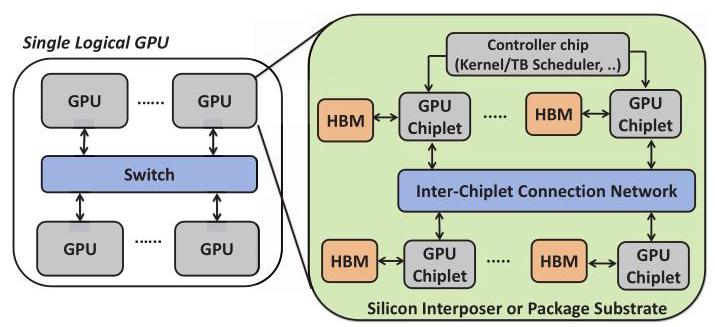
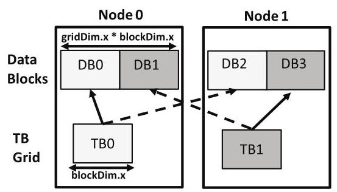
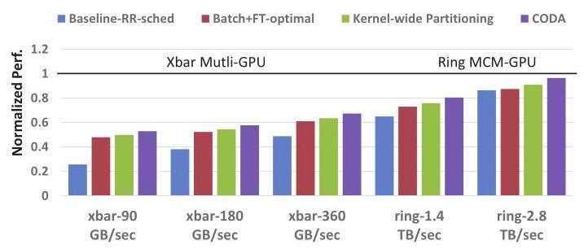
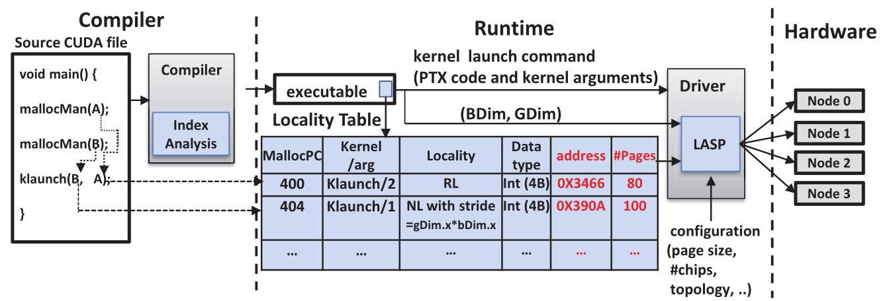
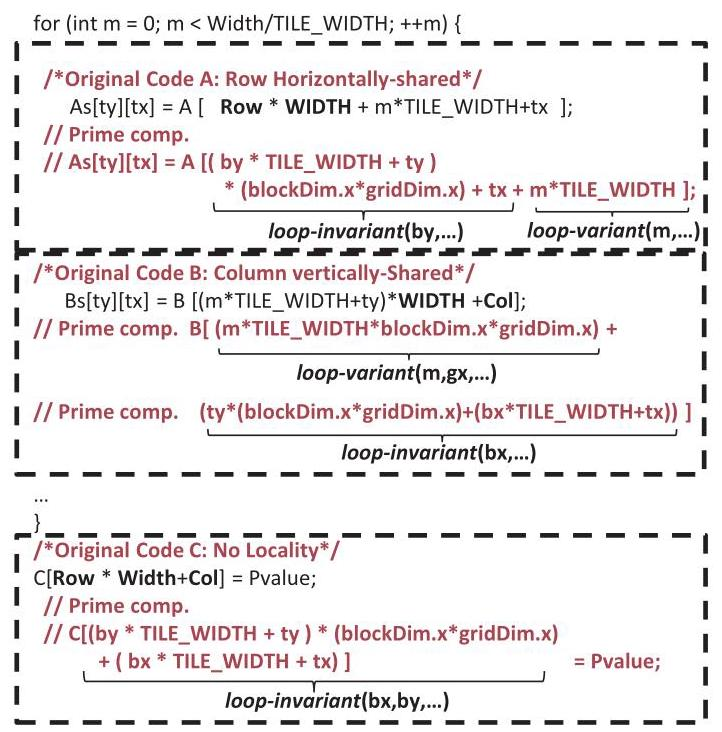
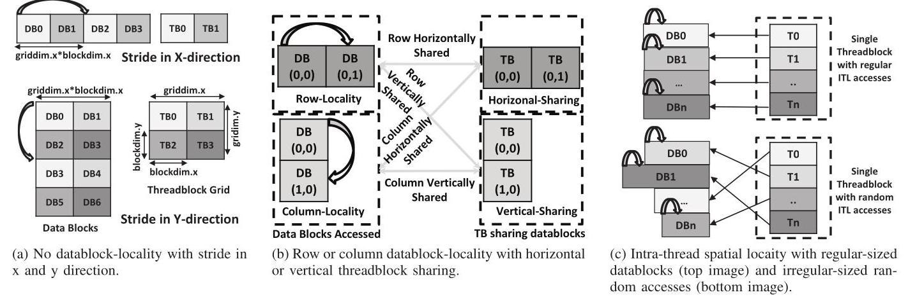
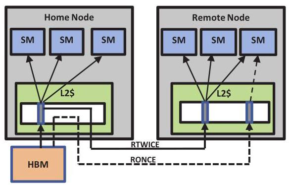
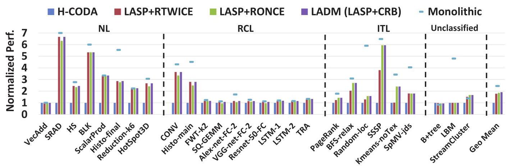
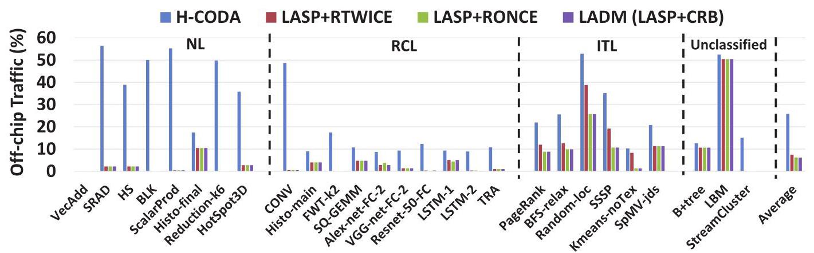
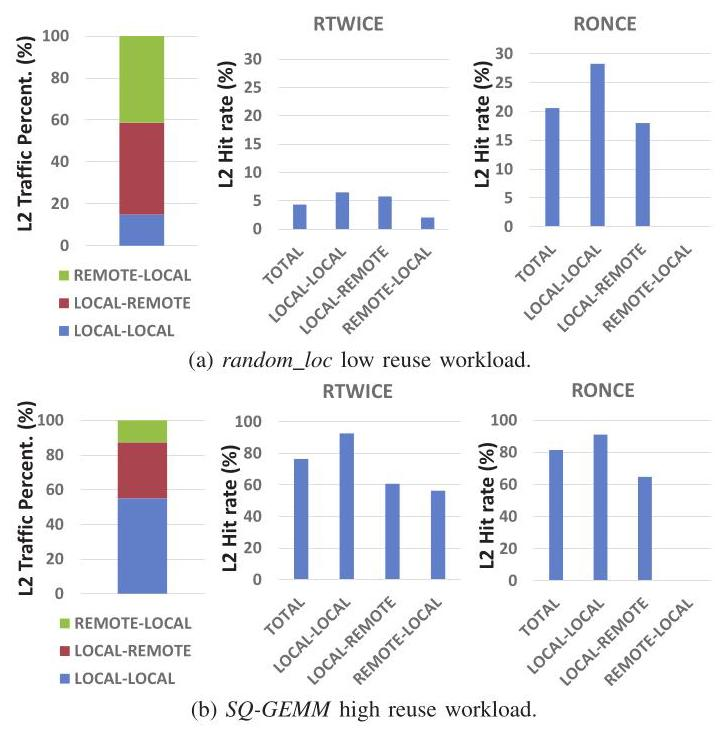

# Locality-Centric Data and Threadblock Management for Massive GPUs

Mahmoud Khairy

> 
马哈茂德·凯里

Purdue University

> 
普渡大学

abdallm@purdue.edu

> 
abdallm@purdue.edu

Vadim Nikiforov

> 
瓦季姆·尼基福罗夫

Purdue University

> 
普渡大学

vnikifor@purdue.edu

> 
vnikifor@purdue.edu

David Nellans

> 
大卫·内兰斯

NVIDIA

> 
本文针对未来由多个分立的设备和芯粒组成的大规模GPU中，因非统一内存访问（NUMA）效应而产生的性能与能效挑战。核心研究问题是如何透明地管理数据放置、线程块调度和缓存，以在保持单GPU编程模型的同时最小化片外流量。

作者提出了一套全面的局部性感知数据管理（LADM）系统，其三大贡献如下：
- **静态的、以线程块为中心的索引分析**，将全局内存访问分类为不同的局部性模式（无数据块局部性、行/列共享、线程内局部性），并推导出数据块大小与步长。
- **局部性感知的调度与放置（LASP）运行**时，利用上述编译分析主动放置页面和调度线程块，采用了对齐感知、步长感知、行/列绑定以及内核级策略，并包含针对多层次NUMA的层级感知。
- **编译器辅助的缓存插入策略**（cache-remote-once），对具有线程内局部性的工作负载，绕过本地L2缓存中的远程请求，从而减少缓存污染。

在一个模拟4个GPU、每GPU 4个小芯片的系统上，对27个可扩展GPU工作负载的评估显示，LADM相比当前最先进的H-CODA系统，将跨芯片内存流量降低了4倍，性能提升了1.8倍，达到了理想单芯片GPU性能的82%。结果表明，编译器—运行时—硬件协同的技术能够有效减轻NUMA惩罚，潜在降低未来GPU设计中对昂贵高带宽互连的需求。

NVIDIA

dnellans@nvidia.com

> 
dnellans@nvidia.com

Timothy G. Rogers

> 
蒂莫西·G·罗杰斯

Purdue University

> 
普渡大学  
以下是文章全文的摘要，供翻译时参考上下文：  
本文探讨了由多个独立设备和芯粒组成的未来大规模GPU中，由于非一致性内存访问（NUMA）效应所带来的性能和能效挑战。核心研究问题是，如何透明地管理数据放置、线程块调度和缓存，以最小化片外流量，同时保持单GPU编程模型。  

作者提出了一套整体的位置感知数据管理（LADM）系统，包含三个关键贡献：  
- **静态线程块中心索引分析**，将全局内存访问划分为不同的位置模式（无数据块局部性、行/列共享、线程内局部性），并推导出数据块大小和步长。  
- **位置感知调度与放置（LASP）运行时**，利用编译分析结果主动放置页和调度线程块，采用对齐感知、步长感知、行/列绑定和内核级策略，并包含面向多级NUMA的层级感知。  
- **编译器辅助的缓存插入策略**（cache-remote-once），对于具有线程内局部性的工作负载，在本地L2缓存中绕过远程请求，以减少缓存污染。  

在模拟的4 GPU、每GPU包含4芯粒的系统上，对27个可扩展GPU工作负载进行评估，LADM相比当前最先进的H-CODA系统，将片间内存流量降低了4倍，性能提升了1.8倍，达到了理想单芯片GPU性能的82%。结果表明，协调的编译器—运行时—硬件技术可以有效缓解NUMA损失，从而可能降低未来GPU设计中对昂贵高带宽互连的需求。

timrogers@purdue.edu

> 
timrogers@purdue.edu

Abstract-Recent work has shown that building GPUs with hundreds of SMs in a single monolithic chip will not be practical due to slowing growth in transistor density, low chip yields, and photoreticle limitations. To maintain performance scalability, proposals exist to aggregate discrete GPUs into a larger virtual GPU and decompose a single GPU into multiple-chip-modules with increased aggregate die area. These approaches introduce non-uniform memory access (NUMA) effects and lead to decreased performance and energy-efficiency if not managed appropriately. To overcome these effects, we propose a holistic Locality-Aware Data Management (LADM) system designed to operate on massive logical GPUs composed of multiple discrete devices, which are themselves composed of chiplets. LADM has three key components: a threadblock-centric index analysis, a runtime system that performs data placement and threadblock scheduling, and an adaptive cache insertion policy. The runtime combines information from the static analysis with topology information to proactively optimize data placement, threadblock scheduling, and remote data caching, minimizing off-chip traffic. Compared to state-of-the-art multi-GPU scheduling, LADM reduces inter-chip memory traffic by $4 \times$ and improves system performance by ${1.8} \times$ on a future multi-GPU system.

> 
Abstract-最近的研究表明，由于晶体管密度增长放缓、芯片良率低以及光刻版限制，在单个单片芯片上构建具有数百个SM的GPU将不切实际。为了保持性能可扩展性，已有提案将多个分立GPU聚合成一个更大的虚拟GPU，并将单个GPU分解为多个芯片模块以增加总的裸片面积。这些方法引入了非一致内存访问（NUMA）效应，若管理不当，会导致性能和能效下降。为了克服这些效应，我们提出了一种整体的局部性感知数据管理（LADM）系统，该系统设计用于由多个分立器件组成的海量逻辑GPU，而这些器件本身又由芯粒构成。LADM有三个关键组件：以线程块为中心的索引分析，执行数据放置和线程块调度的运行时系统，以及自适应缓存插入策略。运行时将静态分析得到的信息与拓扑信息相结合，主动优化数据放置、线程块调度和远程数据缓存，从而最小化片外流量。与最先进的多GPU调度相比，LADM在未来的多GPU系统上将芯片间内存流量减少了$4 \times$，并将系统性能提高了${1.8} \times$。

Index Terms-GPGPU, Multi-GPU, NUMA

> 
索引术语—GPGPU、Multi-GPU、NUMA

## I. INTRODUCTION

GPU accelerated workloads are commonly used in deep learning and exascale computing systems [79], [81]. These workloads exhibit high levels of implicit parallelism, which enables performance scalability, but only if GPUs can continue to scale their hardware resources. Over the past decade, GPUs have more than quadrupled the number of Streaming Multiprocessors (SMs) in their designs, while simultaneously increasing their on-chip transistors by an order of magnitude. Prior work by Arunkumar et al. [5] demonstrates linear performance scalability if GPU resources (SMs, SM-interconnect bandwidth, registers, caches, and DRAM bandwidth) are able to scale proportionally. However, building a GPU with hundreds of SMs in a single monolithic GPU die will not be possible due to low manufacturing yields and the high cost of building large chips at small technology nodes [5], [33].

> 
GPU 加速工作负载广泛用于深度学习和百亿亿次计算系统 [79], [81]。这些工作负载表现出高度的隐式并行性，这为性能的可扩展性提供了可能，但前提是 GPU 能够持续扩展其硬件资源。过去十年间，GPU 设计中的流式多处理器（SM）数量增加了四倍以上，同时片上晶体管数量也提升了一个数量级。Arunkumar 等人 [5] 先前的工作表明，如果 GPU 资源（SM、SM 互连带宽、寄存器、缓存和 DRAM 带宽）能够按比例扩展，性能将呈线性可扩展性。然而，由于低制造良率以及在小技术节点上构建大型芯片的高昂成本，在单个单片 GPU 芯片上构建包含数百个 SM 的 GPU 将无法实现 [5], [33]。

To overcome these problems and enable continuous performance scaling as Moore's law slows [13], [73], researchers have proposed increasing GPU transistor count by aggregating multiple GPUs together (as a single logical GPU) as well as disaggregating single-GPUs into scalable multi-chip-modules [5], [51], [53], [63]. Compared to single-chip systems, chiplet based architectures ${}^{1}$ are desirable because they provide a larger aggregate chip perimeter for I/O, enabling a higher number of DRAM interfaces to be connected to the system and thus scale memory bandwidth and capacity alongside compute resources [5], [6], [28], [32], [48], [79].

> 
为了克服这些问题并在摩尔定律放缓 [13]、[73] 的情况下实现持续的性能扩展，研究者们提出通过聚合多个 GPU，使其作为单个逻辑 GPU 工作，并将单个 GPU 分解为可扩展的多芯片模块 [5]、[51]、[53]、[63]，从而增加 GPU 的晶体管数量。与单芯片系统相比，基于芯粒（chiplet）的架构 ${}^{1}$ 更具吸引力，因为它们提供了更大的总芯片 I/O 周长，使系统能够连接更多的 DRAM 接口，从而在增加计算资源的同时，同步扩展内存带宽和容量 [5]、[6]、[28]、[32]、[48]、[79]。

Fig. 1: Future massive logical GPU containing multiple discrete GPUs, which are themselves composed of chiplets in a hierarchical interconnect.

> 
图 1：未来大规模逻辑 GPU，包含多个分立 GPU，这些 GPU 本身又由小芯片组成，并通过分层互连连接。

Future chiplet-based designs will be limited by the size of silicon interposers or the short haul, high bandwidth interconnects needed to traverse a small printed circuit board. Compared to chiplets, multiple GPUs are more easily combined into large coordinated systems but suffer from lower inter-GPU bandwidth, which increases the NUMA performance penalty. As shown in Figure 1, these approaches are complimentary and it is likely that both will be employed in future systems with hierarchical interconnects to create a massive logical GPU.

> 
未来基于芯粒的设计将受限于硅中介层的尺寸，或穿越小型印刷电路板所需的短距离高带宽互连。与芯粒相比，多个GPU更容易组合成大型协调系统，但受限于较低的GPU间带宽，这增加了NUMA性能损失。如图1所示，这些方法是互补的，未来的系统很可能同时采用两者，通过分层互连构建大规模的虚拟GPU。

Architecture and runtime systems must coordinate to maintain the existing single-GPU programming model and support transparent scaling for current CUDA programs. The goal is to create a single programmer-visible GPU that may be comprised of hierarchical locality domains. Maintaining this illusion enables rapid software development on small local GPU resources while allowing scalable performance on larger and more complex GPU systems. Transparently overcoming locality effects will be a challenging problem for GPUs over the next decade. Such an extreme NUMA scale requires new techniques to place pages, cache data, and schedule the many thousands of threads managed in such systems.

> 
架构与运行时系统必须协同工作，以维持现有的单GPU编程模型，并为当前CUDA程序提供透明的可扩展性。其目标是创建一个程序员可见的单一GPU，而它可能由分层的局部性域构成。维持这种假象可以在小规模本地GPU资源上实现快速软件开发，同时允许在更大、更复杂的GPU系统上获得可扩展的性能。透明地克服局部性效应将是GPU未来十年面临的一个严峻挑战。如此极端的NUMA规模需要全新的技术来放置页面、缓存数据，并调度此类系统中管理的成千上万个线程。

---

${}^{1}$ In this paper, chiplet and multi-chip-module (MCM) are used interchangeably.

> 
${}^{1}$ 在本文中，小芯片(chiplet)与多芯片模块(MCM)这两个术语可以互换使用。

---

Recent work on static analysis for transparent multi-GPU programs, CODA [36], is a step in the right direction. Using the compiler to perform index analysis, CODA calculates the width of the data accessed by one threadblock and ensures that threadblocks and the data they access are placed on the same GPU for the locality types they can identify. However, a more robust analysis of the code is required to exploit different GPU access patterns on hierarchical GPUs. In this work, we deconstruct the accesses patterns observed across a diverse set of GPU applications and detail which patterns are captured by recent state-of-the-art NUMA-GPU mechanisms and those that remain unexploited. We show that many of the previously unexploited patterns can be successfully detected by static analysis, which we use to drive data placement, caching, and thread scheduling decisions in our Locality-Aware Data Management (LADM) system.

> 
针对透明多GPU程序的最新静态分析工作CODA[36]，是朝着正确方向迈出的一步。通过利用编译器进行索引分析，CODA计算单个线程块访问的数据宽度，并确保线程块及其访问的数据被放置在同一个GPU上，以适应其所能识别的局部性类型。然而，要利用层次化GPU上不同的GPU访问模式，需要对代码进行更鲁棒的分析。在这项工作中，我们分解了在各种GPU应用中观察到的访问模式，并详细说明了哪些模式已被最新的先进NUMA-GPU机制捕获，以及哪些尚未被利用。我们表明，许多先前未被利用的模式可以通过静态分析成功检测到，我们在局部性感知数据管理（LADM）系统中利用这些分析来驱动数据放置、缓存和线程调度决策。

Static index analysis has been extensively used in sequential code to perform affine loop transformations, eliminate data dependencies, and partition work for automatic parallelization [3], [46]. In many ways, a static analysis of a GPU program is more straightforward than a sequential one, as the parallelism in CUDA programs is inherent to the programming model. A parallel GPU program can be transformed into a sequential program by converting the threadblock and grid dimensions into loop index variables on data-parallel outer loops. Once this transformation is made, any sequential program analysis can be applied to the GPU code. However, it is less obvious how the nature of the hierarchical programming model (i.e., threadblocks and kernels) can be combined with sequential locality analysis to map schedulable chunks of work (i.e., threads within the same threadblock) to data structure accesses. To tackle this issue, we introduce the concept of datablock locality analysis that maps each threadblock in a kernel to chunks of data we predict it will access.

> 
静态索引分析已被广泛用于顺序代码中，以执行仿射循环变换、消除数据依赖并划分工作以实现自动并行化 [3], [46]。在许多方面，对 GPU 程序的静态分析比顺序程序更直接，因为 CUDA 程序中的并行性是编程模型固有的。一个并行的 GPU 程序可以通过将线程块和网格维度转换为数据并行外层循环的循环索引变量，从而转换成一个顺序程序。一旦完成这种转换，任何顺序程序分析都可以应用于 GPU 代码。然而，不那么明显的是，层次化编程模型（即线程块和核函数）的特性如何能与顺序局部性分析相结合，将可调度的工作块（即同一线程块内的线程）映射到数据结构访问。为解决这一问题，我们引入了数据块局部性分析的概念，它将该核函数中的每个线程块映射到我们预测它将访问的数据块。

Fundamentally, the programming model for GPUs is different than for CPUs. Due to their massively-multithreaded nature, GPU programs are composed of many fine-grained threads, where each individual thread exhibits little spatial or temporal locality to global memory. This, combined with the expressiveness of thread IDs in the CUDA programming model creates both a new challenge and an interesting opportunity to apply static analysis for NUMA data placement and thread scheduling. We make three primary contributions over the state-of-the-art NUMA-GPU systems:

> 
从根本上说，GPU 的编程模型与 CPU 不同。由于其大规模多线程的特性，GPU 程序由许多细粒度线程组成，其中每个单独的线程对全局内存仅表现出很弱的时空局部性。这与 CUDA 编程模型中线程 ID 的表现力相结合，既带来了新的挑战，也为利用静态分析进行 NUMA 数据放置和线程调度提供了有趣的机会。相比于最先进的 NUMA-GPU 系统，我们做出了三项主要贡献：

- We perform a detailed analysis of the locality types present in GPU programs and show that no state-of-the-art NUMA-GPU system can exploit them all. We propose LADM, which uses static index analysis to inform runtime data placement, threadblock scheduling, and remote caching decisions by exploiting a new logical abstraction called the GPU datablock.

> 
- 我们对 GPU 程序中存在的局部性类型进行了详细分析，并表明目前最先进的 NUMA-GPU 系统都无法利用所有类型。我们提出了 LADM，该方法借助一种称为 GPU 数据块的新逻辑抽象，利用静态索引分析来指导运行时数据放置、线程块调度及远程缓存决策。

- We leverage this automatic analysis to perform thread-block and datablock co-placement within hierarchical GPUs. By pre-calculating an optimized data layout in the compiler, LADM can orchestrate prefetching that negates on-demand page-faulting effects and adjust the thread-block schedule based on dynamic data structure sizes.

> 
- 我们利用这种自动分析，在分层 GPU 内执行线程块和数据块的协同放置。通过在编译器中预先计算优化后的数据布局，LADM 能够统筹预取操作以消除按需缺页带来的影响，并根据动态数据结构的大小调整线程块调度。

- Building on our program analysis, we architect a novel compiler-informed cache organization that selectively inserts requests into each L2 cache partition based on the memory request's origin relative to the data's home node and its likelihood for reuse. By understanding the expected reuse patterns for datablocks, LADM's cache hierarchy minimizes both inter-GPU and inter-chiplet bandwidth, the primary factor influencing the scalability of future GPUs.

> 
- 基于我们的程序分析，我们设计了一种新颖的编译器信息驱动缓存组织，该组织根据内存请求的源相对于数据所属节点的位置及其复用可能性，选择性地将请求插入每个 L2 缓存分区。通过理解数据块的预期复用模式，LADM 的缓存层次结构最小化了跨 GPU 和跨小芯片带宽，这是影响未来 GPU 可扩展性的主要因素。

## II. MOTIVATION AND BACKGROUND

Figure 1 depicts what next-generation exascale GPU compute accelerators may look like in the future. Within a single GPU, monolithic GPU dies will be subdivided into disaggregated chiplets, where each chiplet is composed of a group of SMs associated with its own local High Bandwidth Memory (HBM) and hardware thread block scheduler. Several different ways to connect these chiplets have been proposed. Interposer-based through-silicon vias (TSVs), similar to those proposed in AMD's future exascale node [53], [79], high rate signaling through organic substrate-based connections similar to NVIDIA's Ground Reference Signaling (GRS) [5], [65], [70], Intel's Embedded Multi-die Interconnect Bridge (EMIB) [27] or waferscale integration using Silicon Interconnection Fabric (Si-IF) [62], [63] are all possible solutions. While these links may provide high enough bandwidth to alleviate the NUMA-GPU performance penalty [79], such solutions are likely to be expensive and hard to manufacture. These same technologies could be conservatively applied to provide cost-effective, bandwidth restricted interconnections [5]. Architectural and software techniques are necessary to reduce off-chiplet traffic and mitigate the performance loss due to bandwidth constraints. While reducing off-chiplet traffic across exotic high-speed connections may not lead to performance improvement, LADM still improves overall energy efficiency by minimizing data movement among the chiplets [6].

> 
图1展示了下一代百亿亿次GPU计算加速器未来可能的形态。在单一GPU内部，单片式GPU芯片将被解聚为多个独立的芯粒（chiplet），每个芯粒由一组流式多处理器（SM）、与之关联的本地高带宽内存（HBM）及硬件线程块调度器组成。目前已提出多种芯粒互连方案：基于硅中介层的硅通孔（TSV），类似于AMD未来百亿亿次节点中提出的方案[53], [79]；通过有机基板连接的高速信号传输，类似NVIDIA的地参考信号（GRS）技术[5], [65], [70]；英特尔嵌入式多芯粒互连桥（EMIB）[27]；或利用硅互连织物（Si-IF）实现的晶圆级集成[62], [63]。尽管这些链路可能提供足够高的带宽以缓解NUMA-GPU的性能损失[79]，但它们很可能成本高昂且难以制造。同样的技术也可以较保守地用于构建具备成本效益但带宽受限的互连[5]。因此，通过架构和软件技术来减少跨芯粒流量、缓解带宽受限导致的性能下降是必要的。即使利用尖端高速互连削减跨芯粒流量可能不会带来性能提升，LADM仍能通过最小化芯粒间的数据移动来提升整体能效[6]。

NUMA-GPU designs will not only exist within on-package solutions. With the arrival of high bandwidth switch-connected GPUs such as NVIDIA's DGX-2 and NVLink [55], [74] interconnect, aggregating multiple discrete GPUs into a large virtual GPU is now being considered [51]. Because these GPUs may operate as both individual GPUs and in aggregate (as a single GPU), this aggregation must be done with more limited hardware support, primarily by the GPU runtime software. In addition, the type of hierarchical NUMA present in Figure 1 must be accounted for both page placement and threadblock scheduling. Previous, hierarchy-oblivious approaches [5], [36], [51] to NUMA-GPU should be applied recursively, accounting for the fact that chiplets on the same discrete GPU will have greater peer-to-peer bandwidth than chiplets that reside on different GPUs.

> 
NUMA-GPU 设计将不仅仅存在于封装内解决方案中。随着高带宽交换机连接 GPU（如 NVIDIA 的 DGX-2 和 NVLink [55], [74] 互连）的出现，将多个分立 GPU 聚合成一个大型虚拟 GPU 的方案正被考虑 [51]。由于这些 GPU 既可以作为独立 GPU 运行，也可以聚合（作为单个 GPU）运行，这种聚合必须在更有限的硬件支持下完成，主要由 GPU 运行时软件来实现。此外，图 1 中存在的层次化 NUMA 类型必须同时为页面放置和线程块调度所考虑。先前那些对层次结构不敏感的 NUMA-GPU 方法 [5], [36], [51] 应被递归应用，并考虑到同一分立 GPU 上的芯粒之间的对等带宽大于位于不同 GPU 上的芯粒。

![Fig. 2: OpenMP vs CUDA thread mapping for sgemm [75].](images/fig02.jpg)

Fig. 2: OpenMP vs CUDA thread mapping for sgemm [75].

> 
图2：OpenMP与CUDA在sgemm上的线程映射对比 [75]

## A. NUMA Locality in CPUs vs GPUs

Parallel programming on NUMA multi-processor and on-chip multi-core CPU systems is a well studied problem. Many proposals attempt to minimize NUMA memory access latency transparently through software memory allocation and migration policies [12], [20], [22], [26], [69] or thread-to-core mapping [11], [19], [45], [78] techniques. Most of these works are reactive solutions, wherein they detect locality and congestion at runtime, then they perform page migration, replication and thread-clustering based on runtime observations. Although reactive systems can be applied to GPUs, they introduce a substantial performance penalty that can outweigh the benefits. For example, data replication increases memory capacity pressure, which is a scarce resource in contemporary GPUs [84]. First-touch page placement policy can reduce performance significantly, stalling SMs for 20-50 microseconds [85]. Furthermore, the sheer number of threads in flight makes reactive work re-distribution intractable, and the cost of page migration in bandwidth-limited GPU workloads is high [1], [7]. These all motivate a proactive, prediction-based solution based on static program analysis.

> 
在NUMA多处理器和片上多核CPU系统上的并行编程是一个被深入研究的问题。许多方案试图通过软件内存分配与迁移策略[12]、[20]、[22]、[26]、[69]或线程到核的映射[11]、[19]、[45]、[78]技术来透明化地减少NUMA内存访问延迟。这些工作大多为反应式方案，即在运行时检测局部性和拥塞，然后基于运行时观察执行页面迁移、复制和线程聚集。尽管反应式系统可应用于GPU，但它们会引入巨大的性能损失，可能得不偿失。例如，数据复制会加剧内存容量压力，而内存在当代GPU中是稀缺资源[84]。首次接触页面放置策略会显著降低性能，导致SM停顿20-50微秒[85]。此外，巨量的在飞线程使得反应式的工作重分配难以处理，且在带宽受限的GPU工作负载中页面迁移成本很高[1]、[7]。这些都促使我们寻求一种基于静态程序分析的主动式、预测性解决方案。

The GPU programming model introduces new challenges in the design space for NUMA systems that did not exist in traditional NUMA-based multi-processor systems. Since GPUs are programmed using a huge number of threads, the work done by each individual thread is small, resulting in far more thread scheduling decisions. To manage all these threads, they are grouped into a multi-dimensional grid of threadblocks, where each block operates on one multi-dimensional chunk of the data structure. This is in contrast to the coarse-grain nature of CPU threads, where far fewer threads do much more work each. Figure 2 illustrates how threads in CPUs and GPUs typically access a row-based data structure with an example from the Parboil benchmark suite [75]. In the coarse-grained CPU case, each thread has significant spatial locality and static index analysis of the single-threaded code can easily determine the access pattern of each thread. In the fine-grained GPU case, the same per-thread analysis can be applied. However, the reach of each individual thread is minimal, as each thread will access very few (or even just one) elements in the row. In order to capture the locality pattern in GPUs, an interthread analysis must be performed, to account for both the hierarchy of the grid (i.e. the presence of threadblocks) and the dimensionality of the thread grid. This type of inter-thread analysis is what we propose in LADM.

> 
GPU编程模型给NUMA系统的设计空间带来了新的挑战，而这些挑战在传统的基于NUMA的多处理器系统中并不存在。由于GPU使用大量线程进行编程，每个线程完成的工作量很小，因此会产生远多于以往的线程调度决策。为了管理所有这些线程，它们被组织成一个多维线程块网格，每个线程块负责数据结构的一个多维块。这与CPU线程的粗粒度特性形成对比，在CPU中线程数量少得多，但每个线程完成的工作量要大得多。图2通过Parboil基准测试套件[75]中的一个示例，说明了CPU和GPU中的线程通常如何访问基于行的数据结构。在粗粒度CPU场景下，每个线程都具有显著的空间局部性，并且对单线程代码的静态索引分析可以轻松确定每个线程的访问模式。在细粒度GPU场景下，同样的逐线程分析也是可行的。然而，每个线程的访问范围非常有限，因为每个线程只会访问行中极少数（甚至只有一个）元素。为了捕捉GPU中的局部性模式，必须进行线程间分析，以兼顾网格的层次结构（即线程块的存在）和线程网格的维度。这种线程间分析正是我们在LADM中所提出的。

TABLE I: LADM vs state-of-the-art techniques

> 
表 I：LADM 与现有技术的对比

<table><tr><td></td><td>Batch+FT [5]</td><td>Kernel-wide [51]</td><td>CODA [36]</td><td>LD / TB clus-tring [43], [76], [80]</td><td>LADM</td></tr><tr><td>Page placement policy</td><td>First-Touch</td><td>Kernel-wide chunks</td><td>Sub-page round robin</td><td>Hand-tuned APIs</td><td>LASP</td></tr><tr><td>Threadblock scheduling policy</td><td>Static batched round robin</td><td>Kernel-wide chunks</td><td>Alignment-aware batched round robin</td><td>Hand-tuned APIs</td><td>LASP</td></tr><tr><td>Page alignment</td><td>✘</td><td>✓</td><td>✓</td><td>✓</td><td>✓</td></tr><tr><td>Threadblock-stride aware</td><td>✓</td><td>✘</td><td>✘</td><td>✓</td><td>✓</td></tr><tr><td>Row sharing</td><td>✘</td><td>✓</td><td>✘</td><td>✓</td><td>✓</td></tr><tr><td>Col sharing</td><td>✘</td><td>✘</td><td>✘</td><td>✓</td><td>✓</td></tr><tr><td>Adjacent locality (stencil)</td><td>✘</td><td>✓</td><td>✘</td><td>✓</td><td>✓</td></tr><tr><td>Intra-thread loc</td><td>✓</td><td>✘</td><td>✓</td><td>✘</td><td>✓</td></tr><tr><td>Input size aware</td><td>✘</td><td>✘</td><td>✘</td><td>✓</td><td>✓</td></tr><tr><td>Overhead</td><td>+First-touch page faulting</td><td>-</td><td>+Hardware for sub-pages</td><td>+APIs</td><td>-</td></tr><tr><td>Transparency</td><td>✓</td><td>✓</td><td>✓</td><td>✘</td><td>✓</td></tr><tr><td>Hierarchical-aware</td><td>✘</td><td>✘</td><td>✘</td><td>✘</td><td>✓</td></tr></table>

In addition, there is little intra-thread locality in highly-optimized GPU applications with regular access patterns. Instead of repeatedly accessing values on the same cache line, GPU programs typically access values on the same line in different coalesced threads. Optimized GPU programs also make extensive use of a scratchpad memory, which effectively prevents a large portion of global data from being accessed more than once. The end result is that there is very little global data reuse in GPU programs, making the initial decision on where a page should be placed extremely important, since temporal locality in upper-level caches is rare.

> 
此外，在具有规则访问模式的高度优化的GPU应用中，线程内局部性很少。GPU程序通常不会重复访问同一缓存行上的值，而是在不同的合并线程中访问同一行上的值。优化后的GPU程序还广泛使用便笺存储器，这有效地防止了大量全局数据被多次访问。最终结果是，GPU程序中的全局数据重用非常少，这使得页面的初始放置决策极其重要，因为上层缓存中的时间局部性很罕见。

## B. Existing NUMA-GPU Optimizations

In this section, we qualitatively and quantitatively study state-of-the-art NUMA-GPU page placement and threadblock scheduling techniques for both MCM [5] and Multi-GPU [36], [51], [80] configurations, teasing out the fundamental properties they exploit and highlighting opportunities they miss.

> 
在本节中，我们定性和定量地研究面向 MCM [5] 和多 GPU [36]、[51]、[80] 配置的最新 NUMA-GPU 页面放置与线程块调度技术，梳理它们所利用的基本特性，并指出它们错失的优化机会。

The first work on chiplet-based GPUs by Arunkumar et al. [5] optimizes per-chiplet locality through a synergistic approach of statically batching threadblocks and performing a reactive first-touch (Batch+FT) page placement policy. While optimizing for locality, Batch+FT relies on the GPU unified virtual memory (UVM) system to page fault data to the chiplet on which the data is first accessed. While effective for improving data locality, relying on the UVM first-touch page placement policy can introduce a substantial performance penalty as data must be page-faulted into GPU memory from system memory, stalling SMs for 20-50 microseconds [85]. An ideal GPU locality management system should make an educated guess about threadblock and data locality before execution begins, so that data and computation can proactively be pushed to the right location whenever possible.

> 
Arunkumar 等人 [5] 关于基于芯粒的 GPU 的首项工作，通过静态批处理线程块并执行反应式首次接触（Batch+FT）页放置策略的协同方法，来优化每个芯粒的局部性。在优化局部性的同时，Batch+FT 依赖于 GPU 统一虚拟内存（UVM）系统，将数据按缺页处理并调入首次访问该数据的芯粒。虽然这对改善数据局部性有效，但依赖 UVM 的首次接触页放置策略可能带来显著的性能损失，因为数据必须通过缺页处理从系统内存调入 GPU 内存，导致 SM 停顿 20-50 微秒 [85]。理想的 GPU 局部性管理系统应在执行开始前，对线程块和数据局部性做出有根据的预测，从而尽可能主动地将数据和计算推送到正确的位置。

Fig. 3: Behavior of kernel-wide partitioning in a 2-node system with 2 threadblocks that access a 4 datablock data structure with a stride of one datablock.

> 
图3：在具有2个线程块的2节点系统中，内核范围分区在访问步幅为1个数据块的4数据块数据结构时的行为。

The second work, by Milic et al. [51], focuses on multiple discrete GPUs. Their solution partitions both the kernels grid and each data structure (i.e., every call to cudaMalloc) into $N$ contiguous chunks, where $N$ is the number of GPUs. Each chunk of data and threadblocks are then assigned to each respective GPU. We call this technique kernel-wide grid and data partitioning and it is pictured in Figure 3.

> 
第二项工作由 Milic 等人 [51] 完成，专注于多个独立 GPU。他们的解决方案将内核网格和每个数据结构（即每次调用 cudaMalloc）划分为 $N$ 个连续块，其中 $N$ 是 GPU 的数量。随后，每个数据块和线程块被分配给相应的 GPU。我们将这种技术称为内核范围网格与数据分区，如图 3 所示。

The third class of work, by Vijaykumar et al. [80] and Sun et al. [76], propose a flexible and portable software interface, called the Locality Descriptor (LD), to explicitly express data locality with a series of highly-specific APIs. Similarly, Cabezas et al. [15] rely on programmer input to shape the data placement in the program. Locality-aware threadblock clustering with code annotations was also proposed in a single GPU context [43]. Our proposed research seeks to marry the locality description benefits of these manual APIs with the transparency benefits of the locality-agnostic techniques.

> 
第三类工作由 Vijaykumar 等人 [80] 和 Sun 等人 [76] 提出，他们设计了一个灵活且可移植的软件接口，称为局部性描述符（Locality Descriptor，LD），通过一系列高度专用的 API 显式地表达数据局部性。类似地，Cabezas 等人 [15] 依赖程序员输入来塑造程序中的数据放置。在单 GPU 环境下，也曾有人提出借助代码注解实现局部性感知的线程块聚类 [43]。我们提出的研究旨在将这些人工 API 的局部性描述优势与局部性无关技术的透明性优势结合起来。

Finally, the most closely related work to our own is CODA by Kim et al. [36]. CODA is a compiler-assisted index analysis framework that calculates the data accessed by each thread-block to ensure page alignment. CODA applies round-robin page and sub-page interleaving and launches static batches of threadblocks that share the same sub-page on the same node. However, CODA is only able to exploit one specific locality pattern and requires hardware changes to support sub-page address mapping.

> 
最后，与我们的工作最密切相关的是 Kim 等人提出的 CODA [36]。CODA 是一个编译器辅助的索引分析框架，它计算每个线程块所访问的数据，以确保页面对齐。CODA 采用轮询方式的页面与子页交错分布，并启动一批共享同一子页的静态线程块，将它们放在同一节点上。然而，CODA 仅能利用一种特定的局部性模式，且需要硬件修改来支持子页地址映射。

Table I breaks down a number of common access patterns found in contemporary GPU workloads and details which prior work is able to capture them, preventing off-chip traffic. The first pattern that is Page alignment. If the data-placement mechanism and threadblock scheduler are unaware of how much data is accessed by a threadblock, and round-robin threadblocks among chiplets, they may not place contiguous threadblocks accessing the same page on the same chiplet. The Batch+FT scheduler launches a statically-defined batch of threadblocks (4-8 threadblocks) in a loose round-robin fashion across chiplets, in an attempt to load-balance the workload. Without knowing how big the threadblock batch should be, unnecessary off-chip accesses may occur. On the other hand, CODA is explicitly-designed to capture this pattern and to ensure that the batches are page-aligned. Kernel-wide partitioning captures this pattern as well by avoiding a round-robin scheduler and launch threadblocks in coarse-grained chunks.

> 
表 I 分解了当代 GPU 工作负载中几种常见的访存模式，并详细说明了哪些先前的工作能够捕获这些模式以避免片外流量。第一种模式是页对齐。如果数据放置机制和线程块调度器不知道线程块访问的数据量，并在小芯片之间以轮询方式调度线程块，它们可能不会将访问同一页面的连续线程块放置在同一个芯片上。Batch+FT 调度器以宽松的轮询方式跨芯片启动静态定义的线程块批次（4–8 个线程块），以试图实现工作负载均衡。但若不知道线程块批次应为多大，就可能产生不必要的片外访问。相比之下，CODA 专门设计用于捕获此模式并确保批次是页对齐的。全核划分也通过避免轮询调度器并以粗粒度块启动线程块，捕获了这一模式。

Fig. 4: Bandwidth sensitivity analysis of state-of-the-art techniques normalized to a hypothetical monolithic GPU with the same number of SMs. Performance is averaged over the applications listed in Section IV-A.

> 
图4：相对于具有相同SM数量的假设单片GPU最先进技术的带宽敏感性分析。性能是在第IV-A节列出的应用程序上平均得到的。

The second pattern is Threadblock-stride aware. In this pattern, threadblocks access one chunk of data, then jump with a constant stride to read another chunk of data. Batch+FT is able to capture this pattern since the first-touch page placement policy will bring the page to the correct node. Kernel-wide partitioning and CODA are unaware of this strided behavior and will generate off-chip traffic if the stride does not accidentally match their partitioning. Figure 3 depicts an example of how kernel-wide partitioning works in a simple strided accesses scenario where the stride is misaligned with the system configuration, resulting in 50% off-chip accesses.

> 
第二种模式是线程块步长感知。在此模式下，线程块访问一块数据，然后以恒定步长跳跃读取另一块数据。Batch+FT 能够捕捉这种模式，因为首次接触页面放置策略会将页面放置到正确的节点。内核范围分区和 CODA 无法感知这种跨步行为，如果步长没有偶然与它们的分区匹配，就会产生片外流量。图3描绘了一个例子，展示了在简单的跨步访问场景中，当步长与系统配置不对齐时，内核范围分区如何工作，导致50%的片外访问。

The next two patterns: Row sharing and Column sharing occur when a row or a column of threadblocks in a two-dimensional grid access the same row or column of a data structure. None of the prior techniques account for these sharing patterns, but kernel-wide partitioning is able to exploit row sharing by dividing both the grid and data structures into contiguous row-wise chunks.

> 
接下来的两种模式：行共享和列共享，出现在二维线程网格中的一行或一列线程块访问某个数据结构的同一行或同一列时。此前没有任何技术能处理这些共享模式，但内核级分区能够通过将线程网格和数据结构划分为连续的行向块，从而利用行共享特性。

The Adjacency locality pattern is commonly found in stencil applications where adjacent threads share data on their boundaries. The round-robin nature of Batch+FT and CODA create memory traffic at the edge of every threadblock batch. Since kernel-wide partitioning is scheduled in large chunks, the number of grid cuts is minimized and so is the off-chip traffic in stencil workloads.

> 
相邻局部性模式常见于模板应用中，相邻线程在其边界处共享数据。Batch+FT 和 CODA 的轮询特性会在每个线程块批次的边缘产生内存流量。由于内核范围分区以较大的块进行调度，网格切分的次数被最小化，模板工作负载中的片外流量也因此减少。

The Intra-thread locality pattern is often found in irregular workloads that have significant spatial locality in a single thread [67]. Batch+FT naturally captures this locality by moving pages to where they are first accessed. Finally, none of the existing techniques account for the size of a program's data structures and are hence input-size unaware. We explicitly design LADM to exploit all of these characteristics, which we describe in more detail in Section III.

> 
线程内局部性模式常见于单个线程内具有显著空间局部性的不规则工作负载 [67]。Batch+FT 通过将页面移动到首次访问的位置，自然地捕捉到了这种局部性。最后，现有技术均未考虑程序数据结构的大小，因此对输入规模不敏感。我们特意设计了 LADM 以利用所有这些特性，并在第三节中详细阐述。

To demonstrate the relative performance of prior techniques across a variety of integration domains, we implement and evaluate several pieces of state-of-the-art work [5], [36], [51], along with a baseline round-robin placement and scheduling mechanism adopted from [79]. Figure 4 shows the average performance of a four GPU NUMA system with 64 SMs on each node for each evaluated technique. All values are normalized to the performance of a hypothetical monolithic GPU (where there is no NUMA access penalty to remote memories) with the same number of SMs (256).

> 
为了展示先前技术在各种集成域中的相对性能，我们实现并评估了几项最先进的研究工作 [5]，[36]，[51]，以及一个从 [79] 中采纳的基线轮询放置和调度机制。图 4 展示了每个评估技术在具有 64 个 SM 的每个节点上的四 GPU NUMA 系统的平均性能。所有数值都归一化到一个假想的具有相同 SM 数量 (256) 的单片 GPU（该 GPU 对远程内存没有 NUMA 访问惩罚）的性能。

Fig. 5: End-to-end overview of our proposed Locality-Aware Data Management System. In the locality table: MallocPC, the kernel/arg tuple, the locality type and data type are filled statically, whereas memory address and #pages are filled dynamically.

> 
图5：我们提出的局部性感知数据管理系统的端到端概述。在局部性表中：MallocPC、kernel/arg 元组、局部性类型和数据类型是静态填充的，而内存地址和页面数则是动态填充的。

To understand the effect topology and interconnect has on their relative performance, we simulate two different interconnection configurations connecting the four GPU nodes. First, a crossbar inter-GPU switch, similar to an NVSwitch [56], with different link bandwidths. Second, a hypothetical high-speed bi-directional ring with 1.4 and 2.8 TB/sec per-GPU to model an MCM-like topology [5]. We model optimal on-demand paging (Batch+FT-optimal) assuming page faults have zero overhead. Ideally, we would like to achieve the same monolithic chip performance with the cheapest possible interconnection. We observe that uniformly, CODA outperforms Batch+FT-optimal and kernel-wide partitioning, thanks to its alignment-aware static index analysis. Yet CODA only achieves 52% and 80% of the monolithic GPU for the xbar-90 GB/sec and ring-1.4 TB/sec configurations. This implies that while CODA should be considered state-of-the-art versus other policies, there still remains significant room for improvement.

> 
为了理解拓扑结构和互连对其相对性能的影响，我们模拟了两种连接四个GPU节点的不同互连配置。第一种是类似于NVSwitch [56]的交叉开关GPU间交换机，但具有不同的链路带宽。第二种是一个假想的高速双向环，每个GPU带宽为1.4和2.8 TB/秒，用于模拟类似MCM的拓扑[5]。我们模拟了最优按需分页（Batch+FT-optimal），并假设缺页中断零开销。理想情况下，我们希望通过最便宜的互连方式达到与单芯片相同的性能。我们观察到，由于CODA具有对对齐感知的静态索引分析能力，其性能一致优于Batch+FT-optimal和内核级分区。然而，对于xbar-90 GB/秒和ring-1.4 TB/秒配置，CODA仅分别达到单芯片GPU性能的52%和80%。这意味着尽管与其他策略相比，CODA应被视为当前最优技术，但仍有显著的改进空间。

## III. LOCALITY-AWARE DATA MANAGEMENT

The goal of Locality-Aware Data Management is to optimize NUMA-GPU page placement, threadblock scheduling, and GPU cache management based on access patterns derived from a new threadblock-aware compiler pass with unmodified applications.

> 
基于局部性感知的数据管理目标是通过从未修改的应用程序中通过新的线程块感知编译器遍次推导出的访问模式，优化NUMA-GPU的页面放置、线程块调度和GPU缓存管理。

## A. LADM System Design

Figure 5 depicts an end-to-end overview of our proposed LADM mechanism. First, we perform a symbolic off-line index analysis on CUDA source code during the compilation process, detailed in Sections III-B and III-C. Our analysis generates a locality table, which is embedded in the executable. There is one row in the table for every access to a global data pointer passed to every __global__ CUDA function. The compiler fills the locality table with the detected locality type, data type and the MallocPC of the associated cudaMalloc-Managed call from the CPU that allocated this data structure. The MallocPC is used to connect the symbolic compile-time information with dynamic runtime parameters. At runtime, each cudaMallocManaged call inserts the number of allocated pages and address information into the kernel/argument tuples associated with this call. The mapping between cudaMal-locManaged calls and kernel launch arguments is provided by the CPU compiler. Fortunately, the way GPU programs are written today, cudaMallocManaged(ptr); followed by kernel_launch(ptr); almost always occurs. This allows us to statically determine which cudaMallocManaged is associated with which kernel argument. We use traditional pointer aliasing analysis to determine the safety of this argument binding. If the static analysis is not successful, then LADM has no choice but to use a default policy for that particular call operation. Finally, on every kernel launch, the Locality-Aware Scheduling and Placement (LASP) component, described in Section III-D, reads the locality table and decides the proper scheduling policy, data placement and cache strategy to reduce off-chip traffic and mitigate NUMA impact.

> 
图5展示了我们提出的LADM机制的端到端概述。首先，我们在编译过程中对CUDA源代码执行符号化的离线索引分析，详细内容见III-B节和III-C节。我们的分析生成一个局部性表，该表嵌入在可执行文件中。对于传递给每个__global__ CUDA函数的全局数据指针的每次访问，表中都有一行。编译器用检测到的局部性类型、数据类型以及从CPU分配此数据结构的关联cudaMalloc-Managed调用的MallocPC填充局部性表。MallocPC用于将符号化的编译时信息与动态运行时参数连接起来。在运行时，每个cudaMallocManaged调用将分配的页数和地址信息插入到与该调用关联的内核/参数元组中。cudaMallocManaged调用与内核启动参数之间的映射由CPU编译器提供。幸运的是，现今编写GPU程序的方式中，几乎总是出现cudaMallocManaged(ptr);后跟kernel_launch(ptr);的模式。这使我们能够静态地确定哪个cudaMallocManaged与哪个内核参数相关联。我们使用传统的指针别名分析来确定这种参数绑定的安全性。如果静态分析不成功，那么LADM别无选择，只能对该特定调用操作使用默认策略。最后，在每次内核启动时，III-D节中描述的局部性感知调度与放置（LASP）组件读取局部性表，并决定适当的调度策略、数据放置和缓存策略，以减少片外流量并减轻NUMA影响。

Fig. 6: Matrix multiplication indices analysis

> 
图6: 矩阵乘法索引分析

Fig. 7: Common locality types found in GPU workloads. Arrows indicate threadblock motion and datablocks are shaded based on the shade of the threadblock (TB) that accesses them.

> 
图 7：GPU 工作负载中常见的局部性类型。箭头表示线程块移动，数据块根据访问它们的线程块（TB）的阴影进行着色。

## B. Threadblock-centric Locality Patterns

When work is launched to a transparent NUMA-GPU system, threads are assigned to GPUs at the threadblock granularity [51]. To create a 1:1 mapping between data placement and threadblock scheduling, we define a datablock as the region of data accessed by a threadblock on each iteration of the kernel's outermost loop. For example, consider the simplified kernel code for a dense $A \times  B = C$ matrix-matrix multiply listed in Figure 6. Each thread computes one output element of the $C$ matrix, striding through a row of $A$ and a column of $B$ on each loop iteration. Across an entire threadblock, each iteration of the loop will access a square region of both matrix $A$ and $B$ . The data accessed by the threadblock on this loop iteration is what we call a datablock. The datablock's size is directly related to the size of the data type being accessed by each thread, the dimensions of the threadblock and the components that make up the array index. Using this taxonomy, it is possible to classify the way threadblocks access data structures into one of three categories: No datablock-locality, row/column-locality, and intra-thread locality. Figure 7 plots a visual representation of our datablock-locality definitions.

> 
当工作被启动到一个透明的 NUMA-GPU 系统时，线程以线程块粒度被分配到 GPU[51]。为了在数据放置和线程块调度之间建立 1:1 的映射，我们将数据块定义为线程块在核函数最外层循环的每次迭代中所访问的数据区域。例如，考虑图 6 中列出的稠密矩阵乘 $A \times  B = C$ 的简化核函数代码。每个线程计算 $C$ 矩阵的一个输出元素，在每次循环迭代中遍历 $A$ 的一行和 $B$ 的一列。在整个线程块范围内，循环的每次迭代将访问矩阵 $A$ 和 $B$ 的一个方形区域。线程块在此次循环迭代中所访问的数据就是我们所称的数据块。数据块的大小与每个线程访问的数据类型的大小、线程块的维度以及构成数组索引的组件直接相关。利用这种分类法，可以将线程块访问数据结构的方式划分为三类：无数据块局部性、行/列局部性和线程内局部性。图 7 绘制了我们数据块局部性定义的直观表示。

Figure 7a shows the No datablock-Locality (NL) case, where threadblocks do not access the same datablocks. A simple example of an application with no datablock-locality is $C = A + B$ vector addition, where each threadblock accesses a contiguous region of $A$ and $B$ with no reuse or sharing. Stencil applications are another example where there is no locality among threadblocks, except among the adjacent elements. Applications that have no datablock-locality come in two forms. In the first, the kernel does not contain any loops, each datablock is computed on and then discarded. In the second, the kernel has loops and on each iteration of the loop, the threadblock strides across the data structure to another non-shared datablock. We call this movement among datablocks, threadblock motion. As shown in Figure 7a, threadblocks can access exclusive datablocks with a stride in either the $\mathrm{x}$ or $\mathrm{y}$ direction. Strided accesses frequently exist in GPGPU workloads when kernels increase the work in each thread by launching fewer threads than elements in the input data structures. Increasing work granularity per thread is a widely used optimization in CUDA programs to reduce thread initialization overhead and redundant computation [40].

> 
图7a展示了无数据块局部性（NL）的情况，其中线程块不会访问相同的数据块。一个简单的无数据块局部性应用示例是 $C = A + B$ 向量加法，每个线程块访问 $A$ 和 $B$ 的一个连续区域，没有重用或共享。模板应用是另一个例子，其中线程块之间除了相邻元素外没有局部性。无数据块局部性的应用有两种形式。第一种，内核不包含任何循环，每个数据块被计算后被丢弃。第二种，内核包含循环，在循环的每次迭代中，线程块跨过数据结构移动到另一个非共享数据块。我们称这种在数据块之间的移动为线程块运动。如图7a所示，线程块可以以 $\mathrm{x}$ 或 $\mathrm{y}$ 方向上的步幅访问独占数据块。跨步访问经常出现在 GPGPU 工作负载中，当内核通过启动比输入数据结构中元素更少的线程来增加每个线程的工作量时。增加每个线程的工作粒度是 CUDA 程序中广泛使用的优化方法，用于减少线程初始化开销和冗余计算 [40]。

It is also common for groups of threadblocks to share groups of datablocks. Figure 7b illustrates a sharing pattern where datablocks are accessed in either the row or column directions, by either a row or a column of threadblocks from the thread grid. For example, consider the $A$ matrix in $A \times  B = C$ matrix-matrix multiplication. A row of datablocks is shared among horizontal threadblocks. The accesses to the $B$ matrix in matrix-matrix multiply demonstrate a different pattern. Here, a column of datablocks will be shared among vertical threadblocks. Two other possible combinations occur when rows are vertically shared and when columns are horizontally shared. We call workloads that have Row and/or Column Locality RCL workloads.

> 
线程块组共享数据块组也很常见。图7b展示了一种共享模式，其中数据块从线程网格中按行或列方向被一行或一列线程块访问。例如，考虑矩阵乘法 $A \times B = C$ 中的 $A$ 矩阵。一行数据块在水平方向的线程块之间共享。矩阵乘法中对 $B$ 矩阵的访问展示了不同的模式。这里，一列数据块将在垂直方向的线程块之间共享。当行被垂直共享或列被水平共享时，还会出现另外两种组合。我们将具有行和/或列局部性的工作负载称为RCL工作负载。

Figure 7c demonstrates the last type of common locality present in GPU workloads: Intra-Thread Locality (ITL). For these data structures, individual threads exhibit spatial locality across strided, regularly-sized datablocks or data-dependent, irregularly-sized datablocks. A number of prior works have shown that these applications can have significant intra-thread locality [29], [30], [34], [67], [68], making shared-cache interference a significant problem.

> 
图7c展示了GPU工作负载中最后一种常见的局部性类型：线程内局部性（ITL）。对于这些数据结构，各个线程在跨步的、大小规则的数据块或数据依赖的、大小不规则的数据块上表现出空间局部性。许多先前的工作已经表明，这些应用程序可能具有显著的线程内局部性[29]，[30]，[34]，[67]，[68]，从而使共享缓存干扰成为一个重要问题。

## C. Static Locality and Sharing Detection

We make the observation that static compiler analysis can make reasonable predictions about which of these three common locality patterns exist in GPU programs. We show that each locality and sharing pattern can be predicted based on an index analysis of accesses to each global data structure. The core idea is to extend traditional CPU index analysis [3] to be aware of threadblock-level definitions of parallelism. This index analysis is performed on the CUDA source code.

> 
我们观察到，静态编译器分析能够合理预测 GPU 程序中存在这三种常见局部性模式中的哪一种。我们表明，每种局部性与共享模式都可以基于对每个全局数据结构的访问索引分析来预测。核心思想是扩展现有的 CPU 索引分析 [3]，使其能够感知线程块级别的并行性定义。这种索引分析是在 CUDA 源代码上执行的。

For regular kernels, there are two key elements we seek to determine from the static analysis: (1) the direction the threadblock moves on each loop iteration (i.e., threadblock motion), and (2) which threadblocks in the grid share the same datablocks. To determine these two variables, our source analysis begins by identifying global array accesses and expanding their index equations such that they are composed of only prime variables. We consider the following variables prime: thread IDs, block IDs, grid dims, block dims, induction variables (i.e., the loop counter) and constants. Using these variables, we then perform the analysis detailed in Algorithm 1 to classify the access, if possible.

> 
对于常规内核，我们试图通过静态分析确定两个关键要素：（1）每次循环迭代中线程块的移动方向（即线程块运动），以及（2）网格中哪些线程块共享相同的数据块。为了确定这两个变量，我们的源代码分析首先识别全局数组访问，并将其索引方程展开，使其仅由基本变量组成。我们将以下变量视为基本变量：线程ID、块ID、网格维度、块维度、归纳变量（即循环计数器）和常量。然后，我们使用这些变量执行算法1中详述的分析，以对访问进行分类（如果可能）。

TABLE II: Index analysis and taken actions. ${bx} =$ blockIdx.x, by $=$ blockIdx.y, ${gDimx} =$ gridDim.x, $\mathrm{m}$ is an induction variable. For the loopInvariant function, if one of ${bx}$ or ${by}$ is not listed, then none of the terms in the equation contain that variable. For the loopVariant function, if ${gDimx}$ is not listed, then none of the terms in the equation contain ${gDimx}$ .

> 
表II：索引分析及采取的操作。${bx} =$ blockIdx.x, by $=$ blockIdx.y，${gDimx} =$ gridDim.x，$\mathrm{m}$ 为归纳变量。对于 loopInvariant 函数，若 ${bx}$ 或 ${by}$ 之一未列出，则方程中各项均不包含该变量。对于 loopVariant 函数，若 ${gDimx}$ 未列出，则方程中各项均不包含 ${gDimx}$。

<table><tr><td>Locality Types</td><td>Index Equation</td><td>Fig</td><td>Dims</td><td>Threadblock Scheduling</td><td>Data Placement</td><td>Cache Policy</td></tr><tr><td>1: No datablock-locality</td><td>loopInvariant $\left( {{bx},{by},\ldots }\right)  +$ stride $\times  m\forall$ stride $\neq  1$</td><td>7a</td><td>1D/2D</td><td>Align-aware</td><td>Stride-aware</td><td>RTWICE</td></tr><tr><td>2: Row-locality, horizontally shared</td><td>loopInvariant $\left( {{by},\ldots }\right)  +$ loopVariant $\left( {m,\ldots }\right)$</td><td>7b</td><td>2D</td><td>Row-binding</td><td>Row-based</td><td>RTWICE</td></tr><tr><td>3: Column-locality, horizontally shared</td><td>loopInvariant $\left( {{bx},\ldots }\right)  +$ loopVariant $\left( {m,\ldots }\right)$</td><td>7b</td><td>2D</td><td>Col-binding</td><td>Row-based</td><td>RTWICE</td></tr><tr><td>4: Row-locality, vertically shared</td><td>${loopInvariant}\left( {{by},\ldots }\right)  + {loopVariant}\left( {m,{gDimx},\ldots }\right)$</td><td>7b</td><td>2D</td><td>Row-binding</td><td>Col-based</td><td>RTWICE</td></tr><tr><td>5: Column locality, vertically shared</td><td>${loopInvariant}\left( {{bx},\ldots }\right)  + {loopVariant}\left( {m,{gDimx},\ldots }\right)$</td><td>7b</td><td>2D</td><td>Col-binding</td><td>Col-based</td><td>RTWICE</td></tr><tr><td>6: Intra-thread locality</td><td>loopVariant $\left( m\right)  = m$</td><td>7c</td><td>1D</td><td>Kernel-wide</td><td>Kernel-wide</td><td>RONCE</td></tr><tr><td>7: Unclassified</td><td>none of the above</td><td>N/A</td><td>1D/2D</td><td>Kernel-wide</td><td>Kernel-wide</td><td>RTWICE</td></tr></table>

Table II details the general index equations that are matched by our static analysis to determine which type of locality is predicted for each global array access. The compiler will attempt to match each array access to one of these 6 mutually exclusive types using Algorithm 1. The basic idea behind our index analysis is to break the index in two groups of terms. One group contains all the terms dependent on an induction variable, which we call the loop-variant group. The second group is composed of all the terms that are not dependent on the induction variable, which we call the loop-invariant group. That is, all the terms that are multiplied by an induction variable are combined in the loop-variant group, and all the remaining terms are collected in loop-invariant group. The loop-variant group determines the threadblock motion of the access, i.e., do threadblocks move horizontally or vertically through the data structure and how far do they move. Conversely, the loop-invariant terms do not change on each loop iteration and are used to determine which datablock each threadblock starts at.

> 
表II详细说明了我们通过静态分析匹配的通用索引方程，以预测每个全局数组访问具有哪种类型的局部性。编译器将尝试使用算法1将每个数组访问匹配到这6种互斥类型之一。我们索引分析的基本思想是将索引分解为两组项。一组包含所有依赖于归纳变量的项，我们称之为循环变量组。第二组由所有不依赖于归纳变量的项组成，我们称之为循环不变组。也就是说，所有与归纳变量相乘的项都被归入循环变量组，而所有其余项都被收集到循环不变组。循环变量组决定了访问的线程块移动方式，即线程块是在数据结构中水平移动还是垂直移动，以及移动多远。相反，循环不变项在每次循环迭代中都不发生改变，它们用于确定每个线程块从哪个数据块开始。

To illustrate how global array-based data structures are typically accessed in GPU programs, we refer to the matrix multiplication example in Figure 6. The comments below the accesses to matrix $A, B$ and $C$ decompose the Row, ${Col}$ and WIDTH variables into the prime components using backward substitution and algebraic simplification. Once the access has been broken down into invariant and variant components, the compiler determines which key variables the groups are dependent on and detects the locality type using Algorithm 1.

> 
为了说明基于全局数组的数据结构在 GPU 程序中通常是如何被访问的，我们以图 6 中的矩阵乘法为例。访问矩阵 $A, B$ 和 $C$ 下方的注释使用后向替换和代数化简，将 Row、${Col}$ 和 WIDTH 变量分解为基本组成部分。一旦访问被分解为不变部分和可变部分，编译器就能确定这些分组依赖于哪些关键变量，并使用算法 1 检测局部性类型。

The classification in Algorithm 1 begins by testing the special-case that the only term in the loop-variant group is the induction variable multiplied by 1 . If this is the case, then we assume the access has intra-thread locality and classify the access as ITL (row 6 in Table II). If that test fails, the algorithm tests if the access has no locality, by checking if the loop-invariant terms are dependent on both ${bx}$ and ${by}$ (for 2D threadblocks) or just ${bx}$ (for 1D threadblocks). If so, we predict the access has no locality and then derive the stride by dividing the loop-variant term by $\mathrm{m}$ , classifying the access as row 1 of Table II. The access to $C$ in Figure 6 is an example of a no locality access. If neither of these first checks are true, then we search for the 4 sharing patterns in Figure 7b. If the loop-invariant term depends on ${by}$ and not ${bx}$ , then the starting datablock of all the threadblocks with the same by (i.e., all threadblocks in the same row) will be the same. The same is true for a dependence on ${bx}$ only, except threadblocks in the same grid column start in the same place.

> 
算法 1 中的分类首先测试一种特殊情况：循环变量组中仅包含与 1 相乘的归纳变量。若满足此条件，则假设该访问具有线程内局部性，并将其归类为 ITL（表 II 第 6 行）。如果此测试失败，算法会通过检查循环不变量是否同时依赖于 ${bx}$ 和 ${by}$（针对 2D 线程块）或仅依赖于 ${bx}$（针对 1D 线程块）来判断该访问是否无局部性。若确实如此，我们预测该访问无局部性，然后通过将循环变量部分除以 $\mathrm{m}$ 来推导步长，并将其归类为表 II 的第 1 行。图 6 中对 $C$ 的访问就是一个无局部性访问的例子。若前两项检查均不成立，我们则搜索图 7b 中的 4 种共享模式。若循环不变量依赖于 ${by}$ 而非 ${bx}$，则所有具有相同 by（即同一行中的所有线程块）的线程块的起始数据块均相同。对于仅依赖于 ${bx}$ 的情况也是如此，只是同一网格列中的线程块起始位置相同。

Algorithm 1 Access classification algorithm.

> 
算法1 访问分类算法。

---

if loopVariant $\left( {m,\ldots }\right)  = m$ then

> 
如果 loopVariant $\left( {m,\ldots }\right)  = m$ 则

access = ITL;

> 
access = ITL;

else if loopInvariant $\left( {{bx},{by},\ldots }\right)$ then

> 
否则如果 loopInvariant $\left( {{bx},{by},\ldots }\right)$ then

access = NoLocality;

> 
access = NoLocality;

stride $= \operatorname{loopVariant}\left( {m,\ldots }\right) /m$ ;

> 
步长 $= \operatorname{loopVariant}\left( {m,\ldots }\right) /m$ ；

else if 2D Blocks then

> 
else if 2D Blocks then

if loopInvariant $\left( {{by},\ldots }\right)$ then

> 
如果 loopInvariant $\left( {{by},\ldots }\right)$ 那么

access = ThreadblockRowShares;

> 
access = ThreadblockRowShares;

else if loopInvariant $\left( {{bx},\ldots }\right)$ then

> 
否则如果 loopInvariant $\left( {{bx},\ldots }\right)$ then

access = ThreadblockColsShares;

> 
access = ThreadblockColsShares;

if loopVariant $\left( {m,{gDimx},\ldots }\right)$ then

> 
如果 loopVariant $\left( {m,{gDimx},\ldots }\right)$ 则

access $\mid   =$ ColumnThreadblockMotion;

> 
access $\mid   =$ ColumnThreadblockMotion;

stride $=$ loopVariant $\left( {m,{gDimx},\ldots }\right) /m$ ;

> 
stride $=$ loopVariant $\left( {m,{gDimx},\ldots }\right) /m$ ;

else if loopVariant $\left( {m,\ldots }\right)$ then

> 
否则如果 loopVariant $\left( {m,\ldots }\right)$ 则

access $\mid   =$ RowThreadblockMotion;

> 
access $\mid   =$ RowThreadblockMotion;

---

After the sharing pattern is determined, the loop-variant terms are checked to determine the threadblock motion direction. If the loop-variant terms depend on ${gDimx}$ , then we predict a whole row is being skipped on each iteration and that the threadblock motion is in the column direction, otherwise we predict that threadblocks move across a row of the data structure so long as a loop-variant term exists. Based on which combination of sharing and motion is detected, one of rows 2 through 5 in Table II is selected for accesses in 2D threadblocks. The $A$ access in Figure 6 is an example of row threadblock motion, shared across threadblocks in a grid row and the $B$ access illustrates column threadblock motion, shared across columns of threadblocks. If the array index does not match one of the locality types in Table II, for example the array index contains a data-dependent component with no intra-thread locality (i.e., $X\left\lbrack  {Y\left\lbrack  \text{ tid }\right\rbrack  }\right\rbrack$ ), we leave it as unclassified (row 7 in Table II) and the default placement policy is used.

> 
在确定了共享模式之后，会检查循环变化项以确定线程块的运动方向。如果循环变化项依赖于 ${gDimx}$，那么我们预测每次迭代都会跳过一整行，并且线程块的运动方向为列方向；否则，只要存在循环变化项，我们就预测线程块在数据结构的一行上移动。根据检测到的共享与运动组合，在二维线程块的访问中选择表 II 中第 2 至 5 行中的某一行。图 6 中的 $A$ 访问是行方向线程块运动的示例，在网格行中的线程块之间共享，而 $B$ 访问则展示了列方向线程块运动，在线程块列之间共享。如果数组下标与表 II 中的任何一种局部性类型都不匹配，例如数组下标包含一个无线程内局部性的数据依赖分量（即 $X\left\lbrack  {Y\left\lbrack  \text{ tid }\right\rbrack  }\right\rbrack$），那么我们将其保留为未分类（表 II 第 7 行），并使用默认的放置策略。

After classifying each of the global array accesses in a kernel to one of the rows in Table II, the compiler's work is done. The final classification of each symbol is embedded into the binary and used by the runtime system, described in the next section, to determine appropriate placement and threadblock scheduling.

> 
在将内核中每个全局数组访问分类到表 II 中的某一行之后，编译器的工作就完成了。每个符号的最终分类被嵌入到二进制文件中，并由下一节描述的运行时系统使用，以确定适当的放置和线程块调度。

## D. Locality-Aware Scheduling and Page Placement

LASP is LADM's runtime system that implements page placement and threadblock scheduling based on locality patterns identified by the compiler.

> 
LASP 是 LADM 的运行时系统，它基于编译器识别的局部性模式来实现页放置和线程块调度。

1) LASP Data Placement: Based on the locality pattern detected for each data structure, LASP places data using the following methods.

> 
1) LASP 数据放置：基于对每个数据结构检测到的局部性模式，LASP 使用以下方法放置数据。

Stride-aware placement (Row 1 in Table II): To avoid off-chip traffic from strided accesses, LASP must ensure that all the datablocks accessed by a particular threadblock map to the same node. Using the stride information provided by the compiler analysis, we determine which pages need to be co-located on a given node. We interleave the pages in a round robin fashion using the page granularity given by Equation 1. Note that, in order to determine which threadblock maps to the next node we need to know what decision the threadblock scheduler will make. Here we assume that the aligned scheduler described in Section III-D2 will be used.

> 
步长感知的放置（表II中的第1行）：为避免跨步访问带来的片外流量，LASP必须确保特定线程块访问的所有数据块映射到同一节点。利用编译器分析提供的步长信息，我们确定哪些页面需要在给定节点上共同放置。我们使用公式1给出的页面粒度以轮询方式交错放置页面。需要注意的是，确定哪个线程块映射到下一个节点时，我们需要知晓线程块调度器将做出何种决策。此处我们假设将采用第III-D2节所述的对齐调度器。

$$
\text{ InterleavingGranularity } = {\left\lceil  \frac{\text{ strideSize }}{\text{ \#nodes }}\right\rceil  }^{\text{ pageSize }} \tag{1}
$$

> 
$$
\text{ 交错粒度 } = {\left\lceil  \frac{\text{ 步长大小 }}{\text{ 节点数 }}\right\rceil  }^{\text{ 页面大小 }} \tag{1}
$$

Row- and column-based placement (Rows 2-5): LASP uses row- or column-based page placement to put a whole row or column of data on the same node. For example, when rows are horizontally shared, row-based placement is used along with the row-binding scheduler (Section III-D2). When column-based locality is horizontally shared, column-based placement is employed with row-binding scheduler. In column-based placement, we interleave data over nodes in a round-robin fashion using Equation 1 where stride size is the data structure's row width.

> 
基于行和列的放置（第2–5行）：LASP 使用基于行或列的页放置，将一整行或一整列数据放置在同一个节点上。例如，当行在水平方向上被共享时，结合行绑定调度器（第 III-D2 节）采用基于行的放置。当基于列的局部性在水平方向上被共享时，结合行绑定调度器采用基于列的放置。在基于列的放置中，我们使用公式1以轮询方式在节点间交错数据，其中步长大小是数据结构的行宽。

Kernel-wide data partitioning (Rows 6 and 7): If a data structure has intra-thread locality or unclassified irregular accesses, such as graph traversal workloads. In this case, we fall back to the default data placement strategy of kernel-wide partitioning that has experimentally shown good performance for workloads that use CSR data or perform stencil operations. In these difficult to predict workloads, LADM relies on our caching mechanism described in Section III-E to further mitigate off-chip accesses by improving the L2 hit rate.

> 
内核范围数据分区（行 6 和 7）：若数据结构具有线程内局部性或未分类的不规则访问（如图遍历负载），则采用此策略。此时，我们回退到默认的内核范围分区数据放置策略，该策略在处理使用 CSR 数据或执行模板操作的负载时，实验证明性能良好。对于这类难以预测的负载，LADM 借助第 III-E 节描述的缓存机制，通过提高二级缓存命中率进一步减少片外访问。

Timing of page placement and prefetching opportunities: LASP works with UVM, relieving the programmer from the burden of manually copying memory to the device. However, unlike traditional first-touch page placement, LASP makes a prediction about where every page should be placed. The pages for the data structure can be copied to the correct node as soon as the first kernel that uses a data structure is launched. We must wait until kernel launch time in order to determine the threadblock and grid sizes, which are required to compute the datablock size and strides. However, if the compiler can statically determine what the size of the first kernel launch will be, copying could potentially be started before kernel launch. It is possible that the placement derived from the first kernel launch is sub-optimal for subsequent kernel launches. Despite this potential disagreement, we find that the access pattern from the first kernel launch is often consistent with subsequent kernel launches. We leave the exploration of inter-kernel data transformations as future work.

> 
页面放置和预取时机的时机：LASP 与 UVM 协同工作，使程序员无需手动将内存复制到设备，从而减轻了这一负担。然而，与传统首次接触页面放置不同，LASP 会预测每个页面应该放置在何处。一旦第一个使用某数据结构的内核启动，该数据结构的页面即可被复制到正确的节点。我们必须等到内核启动时，才能确定线程块和网格大小，这些是计算数据块大小和步长所必需的。不过，如果编译器能够静态地确定首次内核启动的大小，那么复制工作有可能在内核启动之前就开始。根据首次内核启动推导出的放置策略，可能对后续内核启动并非最优。尽管存在这种潜在的不一致，我们发现首次内核启动的访问模式通常与后续内核启动一致。关于跨内核数据转换的研究将留待未来工作探索。

2) LASP Threadblock Scheduling: Based on the locality pattern detected for each data structure, LASP schedules threadblocks using the following methods.

> 
2) LASP 线程块调度：基于为每个数据结构检测到的局部性模式，LASP 使用以下方法调度线程块。

Alignment-aware and kernel-wide scheduler (Rows 1, 6 and 7): In the absence of any strong row or column data affinity, the scheduler attempts to load balance the work in a page-aligned fashion. To avoid the issue of page-misalignment suffered by Batch+FT [5], we can predict what the minimum threadblock batch size by using Equation 2, where dividing the page size by the datablock size tells us the minimum number of consecutive threadblocks (MinTBBatch) that should be assigned to each node to avoid misaligning datablocks and threadblocks.

> 
对齐感知和内核级调度器（行1、6和7）：在没有强烈的行或列数据亲和性的情况下，调度器试图以页对齐的方式均衡工作负载。为避免Batch+FT[5]所遭受的页不对齐问题，我们可以使用公式2来预测最小线程块批次大小，其中将页面大小除以数据块大小，即可得出应分配给每个节点的最小连续线程块数（MinTBBatch），以避免数据块和线程块不对齐。

$$
\text{ MinTBBatch } = \frac{\text{ pageSize }}{\text{ datablockSize }} \tag{2}
$$

> 
$$
\text{ MinTBBatch } = \frac{\text{ pageSize }}{\text{ datablockSize }} \tag{2}
$$

The minimum batch size will change depending on the page size and kernel arguments, since the datablock size will vary between kernels. As a result, the static batch size used in [5] will suffer when the datablocks are mis-aligned. In workloads with no locality, we have found that the datablock size is often equal to ${bx} \times$ primitive Size, where primitive size is 4 or 8 bytes (i.e., float versus double). Unlike CODA [36], which changes the physical page interleaving granularity and proposes fine-grained sub-page interleaving to ensure alignment, LASP keeps the page interleaving as-is and applies dynamic batch sizing using Equation 2 to maintain data alignment. The scheduler interleaving granularity can be any multiple of the batch size (i.e., $n \times$ MinTBBatch, $n \geq  1$ ). In kernel-wide scheduling, $n$ is the maximum possible value, in which we partition the threadblock grid into $N$ contiguous chunks of threadblocks, where $N$ is the number of GPU nodes.

> 
最小批大小会因页面大小和内核参数而改变，因为数据块大小会随不同内核而变化。因此，当数据块未对齐时，[5]中所用的静态批大小就会表现不佳。在无局部性的工作负载中，我们发现数据块大小通常等于${bx} \times$基本类型大小，其中基本类型大小为4或8字节（即float与double）。与CODA [36]改变物理页交错粒度并提出细粒度的子页交错以确保对齐不同，LASP保持页交错方式不变，并应用公式2 的动态批大小调整来维持数据对齐。调度器的交错粒度可以是批大小的任意整数倍（即$n \times$ MinTBBatch，$n \geq 1$）。在全内核调度中，$n$取最大可能值，此时我们将线程块网格划分成$N$个连续的线程块块，其中$N$是GPU节点数。

Row- and Column-binding scheduler (Rows 2-5): The row-binding scheduler will place all threadblocks from the same row on the same node such that row-level datablock-locality is exploited. For a grid with more rows than GPU nodes, we place contiguous rows of threadblocks on each node. Similar to the row-binding scheduler, the column-binding scheduler assigns all threadblocks from the same column of the grid to the same node in order to exploit column-level datablock-locality.

> 
行绑定与列绑定调度器（第2-5行）：行绑定调度器将同一行的所有线程块放置在同一节点上，从而利用行级数据块局部性。对于行数多于GPU节点数的网格，我们在每个节点上放置连续的若干行线程块。与行绑定调度器类似，列绑定调度器将网格中同一列的所有线程块分配到同一节点，以利用列级数据块局部性。

Hierarchical-aware Scheduling: To exploit the fact that chiplets on the same discrete GPU will have greater bandwidth than chiplets that reside on different GPUs, the hardware and runtime system must coordinate to expose the hierarchically clustered locality domains of the underlying hardware to LASP. This allows LASP to assign adjacent threadblocks to the physically co-located chiplets on the same GPU, before moving to the next GPU. LASP employs a hierarchical affinity round-robin scheduler wherein we assign a chuck of contiguous rows or columns of threadblocks to a discrete GPU, then the assigned threadblocks are scheduled in a round-robin fashion among the chiplets within the GPU.

> 
分层感知调度：为利用同一独立GPU上的芯粒之间带宽高于不同GPU上芯粒之间带宽这一事实，硬件和运行时系统必须协调，将底层硬件的分层聚类局部域暴露给LASP。这使LASP能够将相邻的线程块分配到同一GPU上物理共置的芯粒，然后再移至下一个GPU。LASP采用分层亲和轮询调度器，将连续的行或列的一组线程块分配给一个独立GPU，然后在该GPU内的各芯粒之间以轮询方式调度这些已分配的线程块。

Data structure Locality Disagreements: Some kernels will access multiple data structures in different ways. When this happens, each structure will be placed in the way we predict is optimal, but there is only one threadblock scheduler we can select for a particular kernel. For example, in the matrix multiply example in Figure 6, the placement of the $A$ matrix favors a row-binding threadblock scheduler, whereas the placement of $B$ favors column-binding scheduling. Since it is not possible to give each data structure the scheduler that suits it best, we must pick a winner. To break the tie, we favor the scheduling policy that is associated with the larger data structure, because it will intuitively have a bigger effect on off-chip accesses, whereas smaller, frequently accessed data structures have a much greater chance of residing and hitting in the requesting node's L2. So, in our matrix multiply example, if matrix $A$ is larger than $B$ , we opt for a row-binding scheduling and rely on the L2 cache to reduce the off-chip traffic of the smaller matrix $B$ . Unequal matrix sizes are commonly found in deep learning applications where a small matrix of images is multiplied by a large matrix of neuron weights.

> 
数据结构局部性冲突：某些内核会以不同方式访问多个数据结构。此时，每个结构都会按照我们预测的最优方式进行放置，但针对特定内核我们只能选择一个线程块调度器。例如，在图6的矩阵乘法示例中，矩阵 $A$ 的放置适合行绑定的线程块调度器，而矩阵 $B$ 的放置则适合列绑定的调度。由于无法为每个数据结构都分配最合适的调度器，我们必须选择一个胜出者。为打破平局，我们优先选择与较大数据结构的调度策略，因为直观上它会对片外访问产生更大影响，而较小且频繁访问的数据结构则有更大机会驻留并命中请求节点的L2缓存。因此，在我们的矩阵乘法例子中，如果矩阵 $A$ 大于 $B$，我们就选择行绑定调度，并依赖L2缓存减少较小矩阵 $B$ 的片外流量。这种矩阵大小不相等的情况在深度学习应用中很常见，此时一个小的图像矩阵会与一个大的神经元权重矩阵相乘。

## E. Compiler-assisted Remote Request Bypassing

LASP is an efficient solution for regular workloads. However, there are additional opportunities presented in NUMA-GPU when the workloads are irregular and have intra-thread locality. Predicting the data-dependent access patterns of these irregular applications is not possible at compile time. Therefore, these irregular workloads, shown in Figure 7c, rely heavily on L2 caches to reduce off-chip traffic and mitigate NUMA issues [51]. We seek to improve these workloads via an intelligent cache management technique we call cache-remote-once that makes better use of cache in NUMA-GPUs.

> 
LASP 对于规则工作负载是一种高效的解决方案。然而，当工作负载不规则且具有线程内局部性时，NUMA-GPU 还存在额外的优化机会。这些不规则应用的数据依赖访问模式无法在编译时预测。因此，如图 7c 所示，这些不规则工作负载严重依赖 L2 缓存来减少片外流量并缓解 NUMA 问题 [51]。我们试图通过一种称为 cache-remote-once 的智能缓存管理技术来改进这些工作负载，从而更好地利用 NUMA-GPU 中的缓存。

Figure 8 illustrates the key idea of cache-remote-once (RONCE). In our baseline, the L2 cache is shared between local and remote traffic, similar to the dynamic shared L2 cache proposed in [51]. That is, the remote request checks the local L2 first, and if it is a miss, the request is redirected to the correct home node through the inter-chip connection. In this scenario, remote read requests are cached twice, once at the L2 cache of the home GPU and another time at the L2 cache of the GPU that sends the request. In fact, cache-remote-twice (RTWICE) can be beneficial in RCL workloads that count on the remote cache to minimize the NUMA effects on the victim data structure. In these workloads, remote requests are accessed by multiple SMs across the GPUs (i.e. inter-GPU locality), as shown by the solid line in Figure 8. However, workloads with intra-thread locality, caching requests twice is a waste of cache resources if the line is only accessed by one warp and one SM in the requesting GPU, as depicted by the dashed line in Figure 8. Therefore, there is no need to cache the request at the home GPU, since it may interfere with local traffic. To this end, we propose compiler-assisted remote request bypassing (CRB). In CRB, we use our compiler index analysis to determine the locality type found in the program (i.e., RCL vs ITL) and enable the RONCE bypassing policy only in ITL workloads, since our experiments show that applying RONCE for RCL may hurt the performance.

> 
图 8 展示了 cache-remote-once（RONCE）的核心思想。在我们的基线系统中，L2 缓存在本地与远端流量之间共享，类似于 [51] 中提出的动态共享 L2 缓存。也就是说，远端请求会首先查询本地 L2 缓存，若未命中，则该请求通过芯片间互连被重定向到正确的本地节点。在这种场景下，远端读请求会被缓存两次：一次在所属 GPU 的 L2 缓存中，另一次在发起请求的 GPU 的 L2 缓存中。实际上，对于依赖远端缓存来降低受害数据结构 NUMA 效应的 RCL 工作负载，缓存两次（cache-remote-twice，RTWICE）可能是有益的。在这些工作负载中，远端请求会被多个 GPU 上的 SM 访问（即 GPU 间局部性），如图 8 中的实线所示。然而，对于具有线程内局部性的工作负载，如果缓存行仅被请求 GPU 中的一个 warp 和一个 SM 访问，如图 8 中的虚线所示，则两次缓存是对缓存资源的浪费。因此，没有必要在所属 GPU 端缓存该请求，因为这可能干扰本地流量。为此，我们提出了编译器辅助的远端请求绕过（CRB）。在 CRB 中，我们用编译器的索引分析来确定程序中存在的局部性类型（即 RCL 与 ITL），并仅在 ITL 工作负载中启用 RONCE 绕过策略，因为我们的实验表明对 RCL 应用 RONCE 可能会损害性能。

Fig. 8: llustration of existing NUMA caching policy cache-remote-twice (the solid line) and our proposed cache-remote-once cache management strategy (the dashed line)

> 
图8：现有NUMA缓存策略cache-remote-twice（实线）和我们提出的cache-remote-once缓存管理策略（虚线）的示意图

## IV. EXPERIMENTAL METHODOLOGY

## A. Simulation Methodology

To evaluate LADM we use GPGPU-Sim version 4.0 with the recent memory system improvements from Accel-Sim simulation framework [35]. We have modified the simulator in order to model a hierarchical multi-GPU design with four GPUs connected via a switch, where each GPU is composed of four chiplets as depicted in Figure 1. The configuration parameters used in our system are listed in Table III and are similar to prior works [5], [51], [66]. We have implemented the dynamically shared L2 multi-GPU cache coherence proposal from Milic et al. [51] with cache insertion policy changes that have been described in Section III-E.

> 
为评估 LADM，我们使用 GPGPU-Sim 4.0 版本，并结合了 Accel-Sim 仿真框架 [35] 近期对内存系统的改进。我们对模拟器进行了修改，以建模一种由四块 GPU 通过交换机连接的分层多 GPU 设计，其中每块 GPU 由四个芯粒组成，如图 1 所示。本系统使用的配置参数列于表 III，与先前的工作 [5]、[51]、[66] 相似。我们实现了 Milic 等人 [51] 提出的动态共享 L2 多 GPU 缓存一致性方案，并根据第 III-E 节中描述的缓存插入策略变更进行了修改。

We have implemented the NUMA-GPU analysis proposed in the CODA system [36] and have also extended it to be aware of the GPU's hierarchical nature (H-CODA). We consider the offline profiling proposed in CODA to be an orthogonal approach to static analysis, thus we did not apply it to any evaluated technique. In all results, H-CODA is operating on top of the baseline cache coherence system. The original CODA work did not utilize any remote caching capability in hardware, but as shown in [51], utilizing remote caching in NUMA-GPUs significantly improves performance scalability on a wide range of workloads. In particular, our experiments show that enabling remote caching improves performance of general matrix multiplication (GEMM) operations by ${4.8} \times$ on average, reducing off-chip traffic by $4 \times$ .

> 
我们实现了CODA系统[36]中提出的NUMA-GPU分析，并进一步扩展使其能够感知GPU的层次化特性（H-CODA）。我们认为CODA中提出的离线分析是一种与静态分析正交的方法，因此未将其应用于任何评估技术。在所有结果中，H-CODA均运行在基准缓存一致性系统之上。最初的CODA工作并未利用硬件中的任何远程缓存功能，但如文献[51]所示，在NUMA-GPU中利用远程缓存可显著提高多种工作负载的性能可扩展性。特别是，我们的实验表明，启用远程缓存可使通用矩阵乘法（GEMM）操作的性能平均提升${4.8} \times$，并将片外流量减少$4 \times$。

TABLE III: Multi-GPU Configuration

> 
表 III：多 GPU 配置

<table><tr><td>#GPUs</td><td>4 GPUs, 4 chiplets per GPU</td></tr><tr><td>#SMs</td><td>256 SMs (64 SMs per GPU, 16 SMs per chiplet)</td></tr><tr><td>SM configuration</td><td>Volta-like SM [35], 64 warps, 4 warp scheds, 64KB shared memory, 64KB L1 cache, 1.4 GHZ</td></tr><tr><td>L2 cache</td><td>16MB (1MB per GPU chiplet), 256 banks, Dynamic shared L2 with remote caching [51]</td></tr><tr><td>Intra-Chiplet Connect</td><td>16x16 crossbar, total BW=720 GB/s</td></tr><tr><td>Inter-Chiplet Connect</td><td>bi-directional ring, 720 GB/s per GPU</td></tr><tr><td>Inter-GPU Connect</td><td>4x4 crossbar, 180 GB/s per link, bi-directional</td></tr><tr><td>Monolithic Interconnect</td><td>256x256 crossbar, total BW=11.2 TB/s</td></tr><tr><td>Memory BW</td><td>180 GB/s per chiplet, 720 GB/s per GPU</td></tr></table>

## B. Workload Selection and Characterization

We run LADM on a selection of 53 scalable workloads from Rodinia 3.1 [17], CUDA SDK [57], Parboil [75], Lonestar [60] and Pannotia [16]. In addition, we include a variety of deep learning matrix math operations in which we exploit intra-layer model parallelism by running GEMM operation on multiple GPU nodes as practiced in large model training frameworks [72]. We used the optimized sgemm from [57], [75] as our reference implementation of GEMM and we extract layer and matrices dimensions from several popular DL networks [4], [25], [77]. Like prior work [5], [51], we initially pare a broader set of 53 workloads from all the benchmarks suites listed above and select only those workloads that have enough parallelism to scale-up on our simulated multi-GPU system. Of these 27 scalable benchmarks, LADM's locality detector places 24 into identifiable patterns and places 3 into the unclassified category. Table IV lists the workloads used in this study, along with their detected locality types, scheduler decision, number of launched threadblocks, input size and L2 sector misses per kilo warp instructions (MPKI). It is worth noting that a workload can contain more than one locality type and kernel. In the table, we list the dominant locality type found in the dominant kernel.

> 
我们在选自 Rodinia 3.1 [17]、CUDA SDK [57]、Parboil [75]、Lonestar [60] 和 Pannotia [16] 的 53 个可扩展工作负载上运行 LADM。此外，我们还纳入了一系列深度学习矩阵数学运算，通过在多 GPU 节点上运行 GEMM 操作来利用层内模型并行，这与大规模模型训练框架 [72] 中的实践一致。我们使用 [57]、[75] 中的优化 sgemm 作为 GEMM 的参考实现，并从多个流行的 DL 网络 [4]、[25]、[77] 中提取层和矩阵维度。与先前工作 [5]、[51] 类似，我们最初从上述所有基准测试套件中筛选出更广泛的 53 个工作负载，并仅选择那些具有足够并行度、能在我们模拟的多 GPU 系统上扩展的工作负载。在这 27 个可扩展基准测试中，LADM 的局部性检测器将 24 个归入可识别模式，将 3 个归入未分类类别。表 IV 列出了本研究中使用的工作负载，以及它们检测到的局部性类型、调度器决策、启动的线程块数量、输入大小和每千个 warp 指令的 L2 扇区缺失 (MPKI)。值得注意的是，一个工作负载可能包含不止一种局部性类型和内核。在表中，我们列出了在主要内核中发现的主要局部性类型。

## C. Hardware Validation of LASP Principles

Like prior work, the LADM system relies on co-designed hardware and software features to maximize locality and performance. Features like remote caching, inter-GPU cache coherence, programmatically available hierarchical locality cluster information, and the capability to perform fine grained data placement among chiplets in GPUs are not present in GPUs that are available to researchers today. However, the compiler analysis provided by LASP allows us to test the software based placement of thread and data blocks on real GPUs today. We hand implemented LASP for the RCL machine learning workloads listed in Table IV when running on a 4-GPU cluster within an NVIDIA DGX-1 system [74].

> 
与先前的工作类似，LADM系统依赖于协同设计的硬件和软件特性，以最大化局部性和性能。远程缓存、GPU间缓存一致性、可编程获取的分层局部性集群信息，以及在小芯片之间进行细粒度数据放置的能力等特性，在当今研究人员可用的GPU中尚不存在。然而，LASP提供的编译器分析使我们能够在当前真实GPU上测试基于软件的线程块和数据块放置。我们在NVIDIA DGX-1系统[74]内的4-GPU集群上运行表IV所列的RCL机器学习工作负载时，手动实现了LASP。

TABLE IV: Workloads used to evaluate LADM in simulation.

> 
表 IV：用于在仿真中评估 LADM 的工作负载。

<table><tr><td>Workload</td><td>Locality Type</td><td>Scheduler Decision</td><td>TB Dim</td><td>Input Size</td><td>Launched TBs</td><td>L2 MPKI</td></tr><tr><td>VecAdd [57]</td><td>NL</td><td>Align-aware</td><td>(128,1)</td><td>60 MB</td><td>10240</td><td>570</td></tr><tr><td>SRAD [17]</td><td>NL</td><td>Align-aware</td><td>(16,16)</td><td>96 MB</td><td>16384</td><td>290</td></tr><tr><td>HS [17]</td><td>NL</td><td>Align-aware</td><td>(16,16)</td><td>16 MB</td><td>7396</td><td>58</td></tr><tr><td>ScalarProd [57]</td><td>NL-Xstride</td><td>Align-aware</td><td>(256,1)</td><td>120 MB</td><td>2048</td><td>329</td></tr><tr><td>BLK [57]</td><td>NL-Xstride</td><td>Align-aware</td><td>(128,1)</td><td>80 MB</td><td>1920</td><td>291</td></tr><tr><td>Histo-final [75]</td><td>NL-Xstride</td><td>Align-aware</td><td>(512,1)</td><td>36 MB</td><td>1530</td><td>268</td></tr><tr><td>Reduction-k6 [57]</td><td>NL-Xstride</td><td>Align-aware</td><td>(256,1)</td><td>32 MB</td><td>2048</td><td>1056</td></tr><tr><td>Hotspot3D [17]</td><td>NL-Ystride</td><td>Align-aware</td><td>(64,4)</td><td>128 MB</td><td>1024</td><td>87</td></tr><tr><td>CONV [57]</td><td>RCL</td><td>Row-sched</td><td>(16,4)</td><td>120 MB</td><td>18432</td><td>66</td></tr><tr><td>Histo-main [75]</td><td>RCL</td><td>Col-sched</td><td>(16,16)</td><td>36 MB</td><td>1743</td><td>201</td></tr><tr><td>FWT-k2 [57]</td><td>RCL</td><td>Col-sched</td><td>(256,1)</td><td>64 MB</td><td>4096</td><td>102</td></tr><tr><td>SO-GEMM [57]</td><td>RCL</td><td>Row-sched</td><td>(16.16)</td><td>128 MB</td><td>2048</td><td>61</td></tr><tr><td>Alexnet-FC-2 [57]. [77]</td><td>RCL</td><td>Col-sched</td><td>(32,4)</td><td>400 MB</td><td>2048</td><td>8</td></tr><tr><td>VGGnet-FC-2 [57]. [77]</td><td>RCL</td><td>Col-sched</td><td>(32,4)</td><td>76 MB</td><td>8192</td><td>8</td></tr><tr><td>Resnet-50-FC [57]. [77]</td><td>RCL</td><td>Col-sched</td><td>(32,4)</td><td>99 MB</td><td>16384</td><td>17</td></tr><tr><td>LSTM-1 [4], [57]</td><td>RCL</td><td>Col-sched</td><td>(32,4)</td><td>64 MB</td><td>4096</td><td>6</td></tr><tr><td>LSTM-2 [4], [57]</td><td>RCL</td><td>Col-sched</td><td>(32,4)</td><td>32 MB</td><td>2048</td><td>27</td></tr><tr><td>TRA [57]</td><td>RCL</td><td>Row-sched</td><td>(16,16)</td><td>32 MB</td><td>16384</td><td>291</td></tr><tr><td>PageRank [16]</td><td>ITL</td><td>Kernel-wide</td><td>(128,1)</td><td>18 MB</td><td>23365</td><td>85</td></tr><tr><td>BFS-relax [60]</td><td>ITL</td><td>Kernel-wide</td><td>(256,1)</td><td>220 MB</td><td>2048</td><td>508</td></tr><tr><td>SSSP [16]</td><td>ITL</td><td>Kernel-wide</td><td>(64,1)</td><td>57 MB</td><td>4131</td><td>585</td></tr><tr><td>Random-loc [84]</td><td>ITL</td><td>Kernel-wide</td><td>(256,1)</td><td>64 MB</td><td>41013</td><td>4128</td></tr><tr><td>Kmeans-noTex [67]</td><td>ITL</td><td>Kernel-wide</td><td>(256,1)</td><td>60 MB</td><td>1936</td><td>158</td></tr><tr><td>SpMV-jds [75]</td><td>ITL</td><td>Kernel-wide</td><td>(32,1)</td><td>30 MB</td><td>4585</td><td>640</td></tr><tr><td>B+tree [17]</td><td>unclassified</td><td>Kernel-wide</td><td>(256,1)</td><td>16 MB</td><td>6000</td><td>112</td></tr><tr><td>LBM [75]</td><td>unclassified</td><td>Kernel-wide</td><td>(120,1)</td><td>370 MB</td><td>18000</td><td>784</td></tr><tr><td>StreamCluster [75]</td><td>unclassified</td><td>Kernel-wide</td><td>(512,1)</td><td>56 MB</td><td>1024</td><td>89</td></tr></table>

We use the cudaMemAdvise API to place the data in the correct node, assuming a 4k page. For threadblock scheduling, we used multi-kernel execution where we launch each kernel on a different GPU using CUDA streams. The kernel code was not changed and we did not employ any data replication or reactive solutions as practiced in optimized multi-GPU libraries [58], [72]. If we had access to the GPU driver, we could provide these features to the user transparently. When applying LASP's input aware scheduler and placement on real hardware, we observed ${1.9} \times$ and ${1.4} \times$ performance improvement compared to CODA and kernel-wide partitioning respectively. This performance improvement is achieved by preserving row-and column-locality and favoring column-binding scheduling over the row-binding scheduling when matrix $B$ is larger than matrix $A$ . Although this speedup required hand application coding to implement the LASP placement functionality, it is an existence proof that static analysis based locality management can lead to significant changes in performance on real systems today and into the future.

> 
我们使用 cudaMemAdvise API 将数据放置在正确的节点上，假设页面大小为 4k。对于线程块调度，我们采用了多内核执行方式，即通过 CUDA 流将每个内核启动到不同的 GPU 上。内核代码未做修改，我们也没有采用优化多 GPU 库中常见的数据复制或被动响应方案 [58], [72]。如果我们能够访问 GPU 驱动程序，就可以透明地为用户提供这些功能。在真实硬件上应用 LASP 的输入感知调度和放置时，我们观察到相较于 CODA 和内核范围分区，性能分别提升了 ${1.9} \times$ 和 ${1.4} \times$。这一性能提升是通过保持行和列局部性，并在矩阵 $B$ 大于矩阵 $A$ 时优先采用列绑定调度而非行绑定调度来实现的。尽管这种加速需要手动编写应用代码来实现 LASP 放置功能，但它作为一个存在性证明，表明基于静态分析的局部性管理能够在当今及未来的真实系统上显著改变性能。

## V. EXPERIMENTAL RESULTS

## A. Simulation Results of LADM

Figure 9 and 10 show the normalized performance and off-chip memory traffic for LADM, H-CODA [36] and a hypothetical monolithic GPU, when running on our simulated multi-GPU system described in Section IV-A. Compared to H-CODA, LADM improves the performance by ${1.8} \times$ and decrease inter-GPU memory traffic by $4 \times$ on average. H-CODA and LADM are both aware of page-alignment issues. Thus, for the VecAdd, they both achieve the same performance. However, LADM achieves better performance in the remaining no-locality workloads due to its stride-aware placement. H-CODA fails to exploit the strided accesses found in the no-locality workloads, which causes more than 50% of memory accesses to go off-chip. Moreover, in stencil workloads, SRAD, HS and HotSpot3D, LADM outperforms H-CODA by $4 \times$ on average by launching contiguous threadblocks and exploiting adjacent locality of stencil workloads.

> 
图9和图10展示了在我们第IV-A节描述的多GPU模拟系统上运行时，LADM、H-CODA [36] 以及一个假设的单一整体GPU的归一化性能和片外内存流量。与H-CODA相比，LADM平均性能提升${1.8} \times$，并将GPU间内存流量降低$4 \times$。H-CODA和LADM都能感知页面对齐问题，因此在VecAdd上两者性能相同。然而，在其余无数据块局部性的工作负载中，LADM因其步幅感知的放置而获得了更好的性能。H-CODA未能利用这些无局部性工作负载中的步幅访问，导致超过50%的内存访问需要片外传输。此外，在模板类工作负载SRAD、HS和HotSpot3D中，LADM通过启动连续的线程块并利用模板工作负载的邻接局部性，平均性能比H-CODA高出$4 \times$。

Fig. 9: Performance of H-CODA, LASP with RTWICE and RONCE, LADM and hypothetical monolithic GPU. The data are normalized to H-CODA performance.

> 
图9：H-CODA、带有RTWICE和RONCE的LASP、LADM以及假设的单片式GPU的性能。数据已对H-CODA的性能进行归一化。

Fig. 10: Percentage of total memory traffic that goes off-node for H-CODA vs LASP vs LADM.

> 
图 10：H-CODA vs LASP vs LADM 中离开节点的内存流量占总流量的百分比

In column-locality and row-locality workloads, LADM outperforms H-CODA by ${2.25} \times$ . Exploiting the column and row locality efficiently and launching the same threadblock row or column to the same chip has a substantial effect on performance. However, due to the round-robin page and threadblock interleaving of H-CODA, it fails to exploit row-and column-locality. In the machine-learning workloads, L2 remote-caching filters out off-chip traffic significantly with only 8% remaining in H-CODA. However, because of its row and column schedulers, along with its input size awareness, LADM reduces off-chip traffic further, and outperforms H-CODA by 17% on average. Although H-CODA's static analysis is agnostic to column sharing among threadblocks, it performs well when column placement is preferable. The matrix sizes in these machine-learning layers are aligned such that H-CODA's static page interleaving happens to place shared pages on the same node.

> 
在列局部性和行局部性工作负载中，LADM 的性能比 H-CODA 高出 ${2.25} \times$。高效利用列和行局部性，并将同一 threadblock 的行或列调度到同一芯片，对性能有显著影响。然而，由于 H-CODA 采用轮询方式的页面和 threadblock 交错，它无法利用行和列局部性。在机器学习工作负载中，L2 远程缓存大幅过滤了片外流量，H-CODA 中仅剩 8%。但由于其行列调度器及对输入尺寸的感知，LADM 进一步减少了片外流量，平均性能比 H-CODA 高出 17%。虽然 H-CODA 的静态分析对 threadblock 之间的列共享不敏感，但在适合列放置时，它表现良好。这些机器学习层的矩阵尺寸对齐，使得 H-CODA 的静态页面交错恰好将共享页面放置在同一节点上。

In the ITL workloads, H-CODA fails to exploit the locality between adjacent edges in graphs represented in CSR format. In contrast, LASP preserves locality by partitioning the data into large chunks of consecutive pages, improving performance by ${1.7} \times$ on average. Furthermore, after applying our RONCE policy, LASP+RONCE outperforms RTWICE by an average of 38%. However, applying RTWICE outperforms RONCE by 8% on average for RCL and stencil workloads. Thus, CRB takes the best of both policies by enabling RONCE in ITL workloads and RTWICE in other locality patterns. In the unclassified workloads, LADM does not improve either performance or off-chip data accesses, except for streamclus-ter. Some workloads, like b+tree and streamcluster achieve higher performance than the monolithic GPU due to reducing bank conflicts and higher cache hit rate in the distributed L2 cache of the multi-GPU configuration. Similar trends were also observed in prior work [84].

> 
在ITL工作负载中，H-CODA未能利用CSR格式图中相邻边之间的局部性。相比之下，LASP通过将数据划分为连续页面的大块来保留局部性，平均性能提升了${1.7} \times$。此外，应用我们的RONCE策略后，LASP+RONCE相较于RTWICE平均性能高出38%。然而，对于RCL和模板工作负载，采用RTWICE的平均性能比RONCE高出8%。因此，CRB通过在ITL工作负载中启用RONCE，在其他局部性模式中启用RTWICE，取两者之长。在未分类工作负载中，除streamcluster外，LADM既未提升性能，也未减少片外数据访问。有些工作负载，如b+tree和streamcluster，由于减少了bank冲突且多GPU配置的分布式L2缓存命中率更高，其性能超越了单片GPU。先前的工作[84]也观察到了类似的趋势。

Overall, LADM outperforms H-CODA by ${1.8} \times$ on average and capturing ${82}\%$ of monolithic chip performance. The reasons behind the remaining ${18}\%$ performance gap between LADM and monolithic chip are three-fold. First, complex indices are used, as in lbm and histo, and LADM fails to exploit their locality. Second, irregular data-dependent accesses with no intra-thread locality are frequently generated in many ITL graph workloads, and L2 remote-caching has limited impact to reduce off-chip traffic. Third, the L2 cache coherence overhead, that invalidates L2 caches between kernel boundaries, combined with global synchronization, destroys the inter-kernel locality that was exploited in the large L2 cache of the monolithic chip. Recent work [66] on hardware-supported L2 cache coherence is orthogonal to LADM and can be integrated to reduce the L2 coherence overhead.

> 
总体而言，LADM 平均比 H-CODA 快 ${1.8} \times$，并达到了单芯片性能的 ${82}\%$。LADM 与单芯片之间剩余 ${18}\%$ 性能差距的原因有三方面。首先，如 lbm 和 histo 中使用了复杂索引，LADM 未能利用其局部性。其次，许多 ITL 图工作负载中频繁产生无线程内局部性的不规则数据依赖访问，而 L2 远程缓存对减少片外流量的影响有限。第三，L2 缓存一致性开销会在核边界之间使 L2 缓存失效，再加上全局同步，破坏了单芯片大容量 L2 缓存所利用的核间局部性。最近一项关于硬件支持的 L2 缓存一致性的工作[66]与 LADM 正交，可以集成以降低 L2 一致性开销。

Fig. 11: Case study of RONCE cache policy effectiveness on high and low reuse workloads.

> 
图 11：RONCE 缓存策略在高重用和低重用工作负载上有效性的案例研究。

## B. Remote Request Bypassing Analysis

To better understand the remote request bypassing technique, we classify incoming L2 traffic into one of three categories: (1) LOCAL-LOCAL: A memory request generated from a local (in-node) core and serviced by local DRAM. (2) LOCAL-REMOTE: A memory request generated from a local (in-node) core. On a miss, the DRAM for the memory request is on a remote node. (3) REMOTE-LOCAL: A memory request generated from a remote node. On a miss, the DRAM for the memory request is on the local DRAM node. The total number of misses in LOCAL-REMOTE traffic is equal to the total number of REMOTE-LOCAL accesses.

> 
为了更好地理解远程请求绕过技术，我们将传入的L2流量分为三大类：(1) LOCAL-LOCAL：由本地（节点内）核心生成并由本地DRAM提供服务的内存请求。(2) LOCAL-REMOTE：由本地（节点内）核心生成的内存请求。未命中时，该内存请求的DRAM位于远程节点。(3) REMOTE-LOCAL：由远程节点生成的内存请求。未命中时，该内存请求的DRAM位于本地DRAM节点。LOCAL-REMOTE流量中的未命中总数等于REMOTE-LOCAL访问的总数。

Figure 11a presents a case study of the random_loc workload, where RONCE improves the performance. In random_loc, REMOTE-LOCAL traffic has a low hit-rate when applying RTWICE. Additionally, REMOTE-LOCAL represents 45% of the L2 traffic and causes severe contention with local accesses. Applying RONCE to bypass the REMOTE-LOCAL accesses gives more cache resources to the other traffic types and improves total L2 hit-rate by $4 \times$ . Improving the LOCAL-REMOTE hit-rate leads to fewer off-chip accesses, resulting in better performance. In contrast, Figure 11b plots the results when RONCE hurts the performance in SQ-GEMM workload. As shown in figure, REMOTE-LOCAL represents 12% of the traffic and has a relatively high hit-rate from the inter-GPU data sharing of the shared matrix. Thus, bypassing REMOTE-LOCAL leads to a performance degradation.

> 
图 11a 展示了 random_loc 工作负载的案例研究，其中 RONCE 提升了性能。在 random_loc 中，应用 RTWICE 时，REMOTE-LOCAL 流量的命中率较低。此外，REMOTE-LOCAL 占 L2 流量的 45%，并与本地访问产生严重的争用。应用 RONCE 绕过 REMOTE-LOCAL 访问，为其他流量类型提供了更多缓存资源，并将总 L2 命中率提高了 $4 \times$。LOCAL-REMOTE 命中率的提高减少了片外访问，从而带来了更好的性能。相比之下，图 11b 绘制了 RONCE 在 SQ-GEMM 工作负载中损害性能的结果。如图所示，REMOTE-LOCAL 占总流量的 12%，并且由于共享矩阵的跨 GPU 数据共享而具有相对较高的命中率。因此，绕过 REMOTE-LOCAL 会导致性能下降。

## VI. RELATED WORK

A number of researchers [28], [32], [48] have explored disintegrating multi-core CPUs into smaller chips in order to improve manufacturing yield. In a multi-GPU context, past work [36], [51], [84] investigated similar multi-socket and MCM NUMA GPU designs to scale GPU performance beyond a single socket. We have discussed their approaches in details throughout this paper and compare their results with LADM. Baruah et al. [7] propose hardware-software support for page migration in multi-GPU shared-memory systems. Milic et al. [51] propose dynamic, phase-aware interconnect bandwidth partitioning. They also dynamically adapt L2 caching policy to minimize NUMA effects. These works employ reactive runtime solutions whereas we apply a low-overhead proactive approach.

> 
许多研究者[28], [32], [48]探索了将多核CPU分解为更小的芯片以提高制造良率。在多GPU环境下，过去的工作[36], [51], [84]研究了类似的多插槽和MCM NUMA GPU设计，以将GPU性能扩展到单个插槽之外。我们在本文中详细讨论了他们的方法，并将其结果与LADM进行了比较。Baruah等人[7]为多GPU共享内存系统中的页面迁移提出了硬件-软件支持。Milic等人[51]提出了动态的、阶段感知的互连带宽划分。他们还动态调整L2缓存策略以最小化NUMA效应。这些工作采用反应式的运行时解决方案，而我们应用一种低开销的主动方法。

Young et al. [84] propose a DRAM-cache with optimized hardware coherence for multi-GPU systems. Xiaowei et al. [66] propose a customized L2 cache coherence protocol for hierarchical multi-chiplet multi-GPU systems. These cache coherence protocols are orthogonal to our work and can be applied on top of LADM for further performance improvement.

> 
Young 等人 [84] 提出了一种针对多 GPU 系统优化的硬件一致性 DRAM-cache。Xiaowei 等人 [66] 为分层多芯粒多 GPU 系统提出了一种定制的 L2 缓存一致性协议。这些缓存一致性协议与我们的工作正交，可以应用于 LADM 之上以进一步提升性能。

While significant work has been done to optimize weak-scaling performance using MPI + GPUs (where each rank controls a GPU operating on a relatively isolated partition of data [2], [39]) or via the OpenCL runtime driver [38], [41]. However, transparently achieving strong scaling on NUMA-GPU systems with diverse sharing patterns is still an open problem, which we aim to address in this work.

> 
尽管已有大量工作致力于使用 MPI + GPU（其中每个 rank 控制一个 GPU，处理相对独立的数据分区 [2], [39]）或通过 OpenCL 运行时驱动 [38], [41] 优化弱扩展性能。然而，在具有多样共享模式的 NUMA-GPU 系统上透明地实现强扩展仍是一个未解决的问题，这正是本文旨在解决的挑战。

Prior work on locality-aware threadblock scheduling in single GPU contexts has either not used static analysis [29], [42], [82] or performed a subset of the analysis done by LADM [18], [43] simply because the placement of data has not been an objective. Handling page alignment, the effect of remote caching, and matching competing access patterns to data structures are all issues that arise in the NUMA context that are not addressed in prior work on threadblock scheduling for cache locality. It is difficult to provide a fair quantitative comparison to these works, as it requires us to fill-in-the-blanks on how the techniques would be applied to NUMA-GPUs.

> 
先前在单GPU环境中进行局部性感知的线程块调度研究，要么未使用静态分析[29], [42], [82]，要么仅完成了LADM所做分析的一个子集[18], [43]，这仅仅是因为数据放置尚未成为优化目标。处理页对齐、远程缓存的影响以及将竞争的访问模式匹配到数据结构，都是在NUMA环境中出现的问题，而先前针对缓存局部性的线程块调度工作并未解决这些问题。对这些工作进行公平的定量比较十分困难，因为这要求我们自己填补这些技术如何应用于NUMA-GPU的空白。

Several works [1], [37], [44], [85] have provided batching and reactive prefetching to improve UVM performance in single GPU systems. LASP can be extended to efficiently support oversubscribed memory by proactively placing the next page where it is predicted to be accessed, avoiding page-faulting overheads. Using the locality table information, the pages that are already accessed by finished threadblocks and will not be used again, can be evicted and replaced with the new pages proactively.

> 
一些工作[1], [37], [44], [85] 提供了批处理和反应式预取，以提升单GPU系统中的统一虚拟内存（UVM）性能。LASP 可以扩展为通过主动将下一个页面放置到预测将被访问的位置来高效支持超额预订内存，从而避免缺页开销。利用局部性表信息，已完成线程块且不再使用的页面可以被主动逐出并替换为新页面。

Compiler-assisted index analysis has been used in CPUs and GPUs to perform affine loops transformation in order to: (1) improve locality via data tiling within a single-GPU machine [8], [71], [83], and (2) automatically parallelize serial code on parallel machines [9], [31], [46], [61]. However, these works perform source-to-source transformation and do not provide any runtime decisions on how to efficiently schedule the threads. Furthermore, prior work on GPU static analysis does not exploit all the locality patterns identified by LADM. In this work, we extend single thread index analysis to be threadblock-centric for the NUMA-GPU domain.

> 
编译器辅助的索引分析已在CPU和GPU中用于执行仿射循环变换，目的是：(1) 通过单GPU机器上的数据分块提高局部性 [8], [71], [83]，以及 (2) 在并行机器上自动并行化串行代码 [9], [31], [46], [61]。然而，这些工作执行的是源到源转换，并未提供关于如何高效调度线程的运行时决策。此外，先前的GPU静态分析工作并未利用LADM识别出的所有局部性模式。在本工作中，我们将单线程索引分析扩展为面向NUMA-GPU域、以线程块为中心的分析。

It is worth mentioning that, with modifications to account for threadblock motion and inter-thread sharing, a polyhedral framework [10], [24], [71] could be used in place of LADM's index analysis. However, we believe that LADM's simpler and effective index-based analysis increases the likelihood it will be adopted in contemporary GPU compilers (e.g. NVCC [54]). Either way, the choice of compiler infrastructure used is orthogonal to the datablock analysis proposed in this paper.

> 
值得注意的是，经过修改以考虑线程块移动和线程间共享后，多面体框架[10]、[24]、[71]可替代LADM的索引分析。然而，我们相信LADM更简单且有效的基于索引的分析方法，增加了其在当代GPU编译器（如NVCC [54]）中被采用的可能性。无论如何，所选编译器基础设施的选择与本文提出的数据块分析是正交的。

Data placement has been a focus of CPU research in OpenMP NUMA systems. Solutions include adding new OpenMP language primitives which are explicitly used by the programmer [14], [21], [49], [50], compiler-assited page migration [47], [64] or reactively changing the virtual page size [23]. Although thread scheduling is a concern in CPU-NUMA systems, the focus is largely on workload balancing via advanced work stealing algorithms [59] or avoiding cache thrashing [52], but not to ensure memory page locality. In this work, we coordinate both data placement and thread scheduling to exploit various locality patterns of massively multithreaded multi-GPU systems.

> 
在 OpenMP NUMA 系统中，数据放置一直是 CPU 研究的重点。相关解决方案包括：添加由程序员显式使用的全新 OpenMP 语言原语 [14]、[21]、[49]、[50]，借助编译器辅助的页面迁移 [47]、[64]，或者动态调整虚拟页面大小 [23]。尽管线程调度在 CPU-NUMA 系统中同样受到关注，但其重点主要在于通过先进的工作窃取算法 [59] 实现负载均衡，或避免缓存颠簸 [52]，而非确保内存页面的局部性。在本工作中，我们同时协调数据放置与线程调度，以充分利用大规模多线程多 GPU 系统中的各种局部性模式。

## VII. CONCLUSION

Thanks to high levels of inherent parallelism, many GPU workloads will be able to strongly scale performance, if large enough GPUs can be built. However, due to the physical limitations of chip and interconnect technologies, GPUs built with enough resources to leverage this abundant parallelism will have to overcome significant NUMA effects. This work describes a locality-aware data management system designed to transparently overcome the NUMA effects of future hierarchical GPUs. By combining static analysis with hardware data placement, thread scheduling, and cache insertion policies LADM decreases inter-GPU memory traffic by $4 \times$ , improving system performance by ${1.8} \times$ across a range of workloads with varying locality. LADM demonstrates that intelligent coordination of threadblock scheduling and data placement can offset the need for expensive GPU interconnect technologies in the future.

> 
得益于高度的固有并行性，许多GPU工作负载将能够实现强扩展性能，前提是能够构建足够大的GPU。然而，由于芯片和互连技术的物理限制，构建拥有足够资源来利用这一丰富并行性的GPU将必须克服显著的NUMA效应。本文描述了一个局部性感知的数据管理系统，旨在透明地克服未来层次化GPU的NUMA效应。通过结合静态分析与硬件数据放置、线程调度和缓存插入策略，LADM将GPU间内存流量减少了$4 \times$，在具有不同局部性的各种工作负载下，系统性能提高了${1.8} \times$。LADM表明，线程块调度和数据放置的智能协调可以抵消未来对昂贵GPU互连技术的需求。

## ACKNOWLEDGMENTS

This work was supported, in part, by NSF CCF #1910924 and Sandia National Labs ${}^{2}$ .

> 
这项研究部分得到了美国国家科学基金会（NSF）CCF项目#1910924和桑迪亚国家实验室${}^{2}$的资助。

## REFERENCES

[1] N. Agarwal, D. Nellans, M. O'Connor, S. W. Keckler, and T. F. Wenisch, "Unlocking Bandwidth for GPUs in CC-NUMA Systems," in IEEE 21st International Symposium on High Performance Computer Architecture (HPCA), 2015, pp. 354-365.

> 
[1] N. Agarwal、D. Nellans、M. O'Connor、S. W. Keckler 和 T. F. Wenisch，“解锁 CC-NUMA 系统中 GPU 的带宽”，载于《IEEE 第21届高性能计算机体系结构国际研讨会 (HPCA)》，2015 年，第 354-365 页。

${}^{2}$ Sandia National Laboratories is a multimission laboratory managed and operated by National Technology and Engineering Solutions of Sandia, LLC., a wholly owned subsidiary of Honeywell International, Inc., for the U.S. Department of Energy's National Nuclear Security Administration under contract DE-NA0003525.

> 
${}^{2}$ 桑迪亚国家实验室是一个多任务实验室，由霍尼韦尔国际公司的全资子公司——桑迪亚国家技术与工程解决方案有限责任公司，根据合同 DE-NA0003525 为美国能源部国家核安全管理局管理和运营。

[2] A. M. Aji, L. S. Panwar, F. Ji, M. Chabbi, K. Murthy, P. Balaji, K. R. Bisset, J. Dinan, W.-c. Feng, J. Mellor-Crummey et al., "On the Efficacy of GPU-Integrated MPI for Scientific Applications," in Proceedings of the 22nd international symposium on High-performance parallel and distributed computing, 2013, pp. 191-202.

> 
[2] A. M. Aji, L. S. Panwar, F. Ji, M. Chabbi, K. Murthy, P. Balaji, K. R. Bisset, J. Dinan, W.-c. Feng, J. Mellor-Crummey 等, “论 GPU 集成 MPI 在科学应用中的效能,” 载于 第22届高性能并行与分布式计算国际研讨会论文集, 2013, 191-202 页.

[3] R. Allen and K. Kennedy, Optimizing compilers for modern architectures: a dependence-based approach. Morgan Kaufmann San Francisco, 2002, vol. 289.

> 
[3] R. Allen 和 K. Kennedy，《面向现代体系结构的优化编译器：一种基于依赖性的方法》。Morgan Kaufmann 出版社，旧金山，2002 年，第 289 卷。

[4] J. Appleyard, T. Kocisky, and P. Blunsom, "Optimizing Performance of Recurrent Neural Networks on GPUs," arXiv preprint arXiv:1604.01946, 2016.

> 
[4] J. Appleyard, T. Kocisky, and P. Blunsom, “在GPU上优化循环神经网络的性能,” arXiv预印本 arXiv:1604.01946, 2016.

[5] A. Arunkumar, E. Bolotin, B. Cho, U. Milic, E. Ebrahimi, O. Villa, A. Jaleel, C.-J. Wu, and D. Nellans, "MCM-GPU: Multi-Chip-Module GPUs for Continued Performance Scalability," in Proceedings of the 44th Annual International Symposium on Computer Architecture (ISCA), 2017, pp. 320-332.

> 
[5] A. Arunkumar, E. Bolotin, B. Cho, U. Milic, E. Ebrahimi, O. Villa, A. Jaleel, C.-J. Wu, 与 D. Nellans, “MCM-GPU：面向持续性能扩展的多芯片模块GPU,” 载于《第44届国际计算机体系结构年度研讨会（ISCA）论文集》, 2017, 第320-332页.

[6] A. Arunkumar, E. Bolotin, D. Nellans, and C.-J. Wu, "Understanding the Future of Energy Efficiency in Multi-Module GPUs," in IEEE 25th International Symposium on High Performance Computer Architecture (HPCA), 2015, pp. 519-532.

> 
[6] A. Arunkumar, E. Bolotin, D. Nellans 和 C.-J. Wu，“理解多模块GPU能效的未来”，载于《IEEE第25届高性能计算机体系结构国际研讨会（HPCA）》，2015年，第519-532页。

[7] T. Baruah, Y. Sun, A. T. Diner, S. A. Mojumder, J. L. Abelln, Y. Ukidave, A. Joshi, N. Rubin, J. Kim, and D. Kaeli, "Griffin: Hardware-Software Support for Efficient Page Migration in Multi-GPU Systems," in IEEE International Symposium on High Performance Computer Architecture (HPCA), 2020, pp. 596-609.

> 
[7] T. Baruah, Y. Sun, A. T. Diner, S. A. Mojumder, J. L. Abelln, Y. Ukidave, A. Joshi, N. Rubin, J. Kim, and D. Kaeli, "Griffin: Hardware-Software Support for Efficient Page Migration in Multi-GPU Systems," 载于 IEEE 国际高性能计算机体系结构研讨会 (HPCA), 2020, 第 596-609 页。

[8] M. M. Baskaran, U. Bondhugula, S. Krishnamoorthy, J. Ramanujam, A. Rountev, and P. Sadayappan, "A Compiler Framework for Optimization of Affine Loop Nests for GPGPUs," in Proceedings of the 22nd annual international conference on Supercomputing, 2008, pp. 225-234.

> 
[8] M. M. Baskaran、U. Bondhugula、S. Krishnamoorthy、J. Ramanujam、A. Rountev 和 P. Sadayappan，“一种针对 GPGPU 的仿射循环嵌套优化编译器框架”，载于《第22届国际超级计算年会论文集》，2008 年，第 225-234 页。

[9] M. M. Baskaran, J. Ramanujam, and P. Sadayappan, "Automatic C-to-CUDA Code Generation for Affine Programs," in International Conference on Compiler Construction, 2010, pp. 244-263.

> 
[9] M. M. Baskaran、J. Ramanujam 和 P. Sadayappan，“面向仿射程序的自动 C 到 CUDA 代码生成”，载于编译器构造国际会议，2010 年，第 244-263 页。

[10] C. Bastoul, "Code Generation in the Polyhedral Model Is Easier Than You Think," in Proceedings of the 13th International Conference on Parallel Architectures and Compilation Techniques (PACT), 2004, pp. 7-16.

> 
[10] C. Bastoul，“多面体模型中的代码生成比你想象的简单”，载于《第13届并行架构与编译技术国际会议论文集》（PACT），2004年，第7-16页。

[11] S. Blagodurov, S. Zhuravlev, A. Fedorova, and A. Kamali, "A Case for NUMA-aware Contention Management on Multicore Systems," in Proceedings of the 19th international conference on Parallel architectures and compilation techniques (PACT), 2010, pp. 557-558.

> 
[11] S. Blagodurov, S. Zhuravlev, A. Fedorova 和 A. Kamali, “多核系统中面向 NUMA 感知争用管理的案例研究”，载于第 19 届并行架构与编译技术国际会议 (PACT) 论文集，2010 年，第 557-558 页。

[12] W. Bolosky, R. Fitzgerald, and M. Scott, "Simple But Effective Techniques for NUMA Memory Management," ACM SIGOPS Operating Systems Review, pp. 19-31, 1989.

> 
[12] W. Bolosky, R. Fitzgerald 和 M. Scott, “简单但有效的 NUMA 内存管理技术，” ACM SIGOPS 操作系统评论，第 19-31 页，1989 年。

[13] P. Bright, "Moore's law really is dead this time," https://arstechnica.com/ information-technology/2016/02/moores-law-really-is-dead-this-time/, 2016.

> 
[13] P. Bright, “摩尔定律这次真的死了,” https://arstechnica.com/ information-technology/2016/02/moores-law-really-is-dead-this-time/, 2016.

[14] F. Broquedis, N. Furmento, B. Goglin, P.-A. Wacrenier, and R. Namyst, "ForestGOMP: an Efficient OpenMP Environment for NUMA Architectures," International Journal of Parallel Programming, pp. 418-439, 2010.

> 
[14] F. Broquedis, N. Furmento, B. Goglin, P.-A. Wacrenier, R. Namyst, “ForestGOMP：一种面向NUMA架构的高效OpenMP环境,” 国际并行编程杂志, pp. 418-439, 2010.

[15] J. Cabezas, L. Vilanova, I. Gelado, T. B. Jablin, N. Navarro, and W.- m. W. Hwu, "Automatic Parallelization of Kernels in Shared-Memory Multi-GPU Nodes," in Proceedings of the 29th ACM on International Conference on Supercomputing, 2015, pp. 3-13.

> 
[15] J. Cabezas, L. Vilanova, I. Gelado, T. B. Jablin, N. Navarro 和 W.- m. W. Hwu，“共享内存多 GPU 节点中内核的自动并行化”，载于《第 29 届 ACM 国际超级计算会议论文集》，2015 年，第 3-13 页。

[16] S. Che, B. M. Beckmann, S. K. Reinhardt, and K. Skadron, "Pannotia: Understanding Irregular GPGPU Graph Applications," in IEEE International Symposium on Workload Characterization (IISWC), 2013, pp. 185-195.

> 
[16] S. Che, B. M. Beckmann, S. K. Reinhardt 和 K. Skadron, "Pannotia: 理解不规则 GPGPU 图应用," 载于 IEEE 国际工作负载表征研讨会 (IISWC), 2013, 第 185-195 页.

[17] S. Che, M. Boyer, J. Meng, D. Tarjan, J. W. Sheaffer, S.-H. Lee, and K. Skadron, "Rodinia: A Benchmark Suite for Heterogeneous Computing," in IEEE International Symposium on Workload Characterization (IISWC), 2009, pp. 44-54.

> 
[17] S. Che, M. Boyer, J. Meng, D. Tarjan, J. W. Sheaffer, S.-H. Lee, and K. Skadron, “Rodinia: 面向异构计算的基准测试套件，” 收录于 IEEE 国际负载特性研讨会 (IISWC)，2009，页码 44-54。

[18] L.-J. Chen, H.-Y. Cheng, P.-H. Wang, and C.-L. Yang, "Improving GPGPU Performance via Cache Locality Aware Thread Block Scheduling," IEEE Computer Architecture Letters, pp. 127-131, 2017.

> 
[18] L.-J. Chen、H.-Y. Cheng、P.-H. Wang 和 C.-L. Yang，“通过缓存局部性感知的线程块调度提升GPGPU性能”，《IEEE计算机体系结构通讯》，第127-131页，2017年。

[19] R. Das, R. Ausavarungnirun, O. Mutlu, A. Kumar, and M. Azimi, "Application-to-Core Mapping Policies to Reduce Memory Interference in Multi-Core Systems," in IEEE 19th International Symposium on High Performance Computer Architecture (HPCA), 2013, pp. 107-118.

> 
[19] R. Das、R. Ausavarungnirun、O. Mutlu、A. Kumar 和 M. Azimi，《减少多核系统中内存干扰的应用到核心映射策略》，收录于 IEEE 第19届高性能计算机架构国际研讨会 (HPCA)，2013年，第107-118页。

[20] M. Dashti, A. Fedorova, J. Funston, F. Gaud, R. Lachaize, V. Quema, and M. Roth, "Traffic Management: A Holistic Approach to Memory Placement on NUMA Systems," in Proceedings of the 18th International Conference on Architectural Support for Programming Languages and Operating Systems (ASPLOS), 2013, p. 381394.

> 
[20] M. Dashti, A. Fedorova, J. Funston, F. Gaud, R. Lachaize, V. Quema, 和 M. Roth, “流量管理：NUMA系统上内存放置的整体方法,” 载于《第18届国际编程语言与操作系统架构支持会议（ASPLOS）论文集》，2013年，第381-394页。

[21] M. Diener, E. H. Cruz, M. A. Alves, P. O. Navaux, and I. Koren, "Affinity-Based Thread and Data Mapping in Shared Memory Systems," ACM Computing Surveys (CSUR), 2017.

> 
[21] M. Diener, E. H. Cruz, M. A. Alves, P. O. Navaux, 和 I. Koren, “共享内存系统中基于亲和力的线程与数据映射,”《ACM计算概观》(CSUR), 2017.

[22] B. Falsafi and D. A. Wood, "Reactive NUMA: A Design for Unifying S-COMA and CC-MAMA," in Proceedings of the 24th annual international symposium on Computer architecture (ISCA), 1997, pp. 229-240.

> 
[22] B. Falsafi and D. A. Wood, "Reactive NUMA: A Design for Unifying S-COMA and CC-MAMA," in Proceedings of the 24th annual international symposium on Computer architecture (ISCA), 1997, pp. 229-240.

[23] F. Gaud, B. Lepers, J. Decouchant, J. Funston, A. Fedorova, and V. Quéma, "Large Pages May Be Harmful on NUMA Systems," in Proceedings of 2014 USENIX Annual Technical Conference (USENIX ATC), 2014, pp. 231-242.

> 
[23] F. Gaud, B. Lepers, J. Decouchant, J. Funston, A. Fedorova, and V. Quéma, “大页在NUMA系统上可能是有害的,” 载于《2014年USENIX年度技术会议 (USENIX ATC) 论文集》, 2014, 第231-242页.

[24] T. Grosser, A. Groesslinger, and C. Lengauer, "Polly: Performing Polyhedral Optimizations on a Low-Level Intermediate Representation," Parallel Processing Letters, pp. 1-27, 2012.

> 
[24] T. Grosser, A. Groesslinger 和 C. Lengauer, "Polly：在低级中间表示上执行多面体优化," *Parallel Processing Letters*, 第 1-27 页, 2012.

[25] S. Han, H. Mao, and W. J. Dally, "Deep Compression: Compressing Deep Neural Networks with Pruning, Trained Quantization and Huffman Coding," arXiv preprint arXiv:1510.00149, 2015.

> 
[25] S. Han, H. Mao, 和 W. J. Dally，“深度压缩：通过剪枝、训练量化和霍夫曼编码压缩深度神经网络，” arXiv 预印本 arXiv:1510.00149，2015。

[26] N. Hardavellas, M. Ferdman, B. Falsafi, and A. Ailamaki, "Reactive NUCA: Near-Optimal Block Placement and Replication in Distributed Caches," in Proceedings of the 36th annual international symposium on Computer architecture (ISCA), 2009, pp. 184-195.

> 
[26] N. Hardavellas, M. Ferdman, B. Falsafi 和 A. Ailamaki，“Reactive NUCA: 分布式缓存中的近最优块放置与复制”，收录于《第36届计算机体系结构国际研讨会 (ISCA) 论文集》，2009年，第184-195页。

[27] Intel, "Intel EMIB," https://www.intel.com/content/www/us/en/foundry/ emib.html/, 2016.

> 
[27] Intel，“Intel EMIB”，https://www.intel.com/content/www/us/en/foundry/ emib.html/，2016。

[28] N. E. Jerger, A. Kannan, Z. Li, and G. H. Loh, "NoC Architectures for Silicon Interposer Systems: Why Pay for more Wires when you Can Get them (from your interposer) for Free?" in Proceedings of the 47th Annual International Symposium on Microarchitecture (MICRO), 2014, pp. 458-470.

> 
[28] N. E. Jerger, A. Kannan, Z. Li 和 G. H. Loh，“用于硅中介层系统的 NoC 架构：当你可以（从中介层）免费获得更多连线时，为何还要为它们付费？”收录于第47届微架构国际研讨会（MICRO），2014年，第458-470页。

[29] A. Jog, O. Kayiran, N. Chidambaram Nachiappan, A. K. Mishra, M. T. Kandemir, O. Mutlu, R. Iyer, and C. R. Das, "OWL: Cooperative Thread Array Aware Scheduling Techniques for Improving GPGPU Performance," in Proceedings of the 18th International Conference on Architectural Support for Programming Languages and Operating Systems (ASPLOS), 2013, pp. 395-406.

> 
[29] A. Jog, O. Kayiran, N. Chidambaram Nachiappan, A. K. Mishra, M. T. Kandemir, O. Mutlu, R. Iyer 和 C. R. Das, “OWL: 协作线程阵列感知调度技术以提升GPGPU性能,” 见于《第18届国际编程语言与操作系统架构支持会议 (ASPLOS) 论文集》, 2013, 第395–406页.

[30] A. Jog, O. Kayiran, A. K. Mishra, M. T. Kandemir, O. Mutlu, R. Iyer, and C. R. Das, "Orchestrated Scheduling and Prefetching for GPGPUs," in Proceedings of the 40th Annual International Symposium on Computer Architecture (ISCA), 2013, pp. 332-343.

> 
[30] A. Jog, O. Kayiran, A. K. Mishra, M. T. Kandemir, O. Mutlu, R. Iyer 和 C. R. Das, “面向GPGPU的协同调度与预取,” 收录于第40届年度国际计算机体系结构研讨会（ISCA）论文集，2013年，第332–343页。

[31] J. Juega, J. Gomez, C. Tenllado, S. Verdoolaege, A. Cohen, and F. Catthoor, "Evaluation of state-of-the-art polyhedral tools for automatic code generation on GPUs," XXIII Jornadas de Paralelismo, Univ. Complutense de Madrid, 2012.

> 
[31] J. Juega, J. Gomez, C. Tenllado, S. Verdoolaege, A. Cohen, 和 F. Catthoor, "用于GPU自动代码生成的最新多面体工具评估," 第二十三届并行处理研讨会, 马德里康普顿斯大学, 2012.

[32] A. Kannan, N. E. Jerger, and G. H. Loh, "Enabling Interposer-based Disintegration of Multi-core Processors," in 48th Annual IEEE/ACM International Symposium on Microarchitecture (MICRO), 2015, pp. 546- 558.

> 
[32] A. Kannan, N. E. Jerger 和 G. H. Loh，“使能基于中介层的多核处理器分解”，载于第48届IEEE/ACM国际微架构研讨会（MICRO），2015年，第546-558页。

[33] —, "Exploiting Interposer Technologies to Disintegrate and Reintegrate Multicore Processors," IEEE Micro, pp. 84-93, 2016.

> 
[33] —, “利用中介层技术分解与重组多核处理器,” IEEE Micro, 第84-93页, 2016年。

[34] O. Kayran, A. Jog, M. T. Kandemir, and C. R. Das, "Neither More Nor Less: Optimizing Thread-level Parallelism for GPGPUs," in Proceedings of the 22nd International Conference on Parallel Architectures and Compilation Techniques (PACT), 2013, pp. 157-166.

> 
[34] O. Kayran、A. Jog、M. T. Kandemir 和 C. R. Das，“Neither More Nor Less: Optimizing Thread-level Parallelism for GPGPUs”，载于《第22届并行架构与编译技术国际会议论文集》（PACT），2013年，第157-166页。

[35] M. Khairy, Z. Shen, T. M. Aamodt, and T. G. Rogers, "Accel-Sim: An Extensible Simulation Framework for Validated GPU Modeling," in ACM/IEEE 47th Annual International Symposium on Computer Architecture (ISCA), 2020, pp. 473-486.

> 
[35] M. Khairy, Z. Shen, T. M. Aamodt, 和 T. G. Rogers, “*Accel-Sim: 一个用于已验证 GPU 建模的可扩展模拟框架*,” 载于第47届 ACM/IEEE 计算机体系结构国际研讨会 (ISCA), 2020, pp. 473-486.

[36] H. Kim, R. Hadidi, L. Nai, H. Kim, N. Jayasena, Y. Eckert, O. Kayiran, and G. Loh, "CODA: Enabling Co-location of Computation and Data for Multiple GPU Systems," ACM Transactions on Architecture and Code Optimization (TACO), pp. 1-23, 2018.

> 
[36] H. Kim, R. Hadidi, L. Nai, H. Kim, N. Jayasena, Y. Eckert, O. Kayiran, and G. Loh, “CODA: 为多GPU系统实现计算与数据的协同定位,”《ACM架构与代码优化汇刊》（TACO），第1-23页，2018年。

[37] H. Kim, J. Sim, P. Gera, R. Hadidi, and H. Kim, "Batch-Aware Unified Memory Management in GPUs for Irregular Workloads," in Proceedings of the Twenty-Fifth International Conference on Architectural Support for Programming Languages and Operating Systems (ASPLOS), 2020, pp. 1357-1370.

> 
[37] H. Kim, J. Sim, P. Gera, R. Hadidi 和 H. Kim，“面向不规则工作负载的GPU中批量感知的统一内存管理”，载于《第二十五届编程语言和操作系统体系结构支持国际会议（ASPLOS）论文集》，2020年，第1357-1370页。

[38] J. Kim, H. Kim, J. H. Lee, and J. Lee, "Achieving a Single Compute Device Image in OpenCL for Multiple GPUs," in Proceedings of the 16th ACM symposium on Principles and practice of parallel programming (PPOPP), 2011, pp. 277-288.

> 
[38] J. Kim, H. Kim, J. H. Lee 和 J. Lee，“在 OpenCL 中为多个 GPU 实现单一计算设备映像”，载于第 16 届 ACM 并行编程原理与实践研讨会 (PPOPP) 论文集，2011 年，第 277-288 页。

[39] V. V. Kindratenko, J. J. Enos, G. Shi, M. T. Showerman, G. W. Arnold, J. E. Stone, J. C. Phillips, and W.-m. Hwu, "GPU Clusters for High-Performance Computing," in 2009 IEEE International Conference on Cluster Computing and Workshops, 2009, pp. 1-8.

> 
[39] V. V. Kindratenko, J. J. Enos, G. Shi, M. T. Showerman, G. W. Arnold, J. E. Stone, J. C. Phillips, and W.-m. Hwu, "面向高性能计算的GPU集群," in 2009 IEEE International Conference on Cluster Computing and Workshops, 2009, pp. 1-8.

[40] D. Kirk and W. Wen-mei, Programming Massively Parallel Processors: A Hands-on Approach. Morgan Kaufmann, 2010.

> 
[40] D. Kirk 和 W. Wen-mei，《大规模并行处理器编程：实践方法》。Morgan Kaufmann，2010。

[41] J. Lee, M. Samadi, Y. Park, and S. Mahlke, "Transparent CPU-GPU Collaboration for Data-Parallel Kernels on Heterogeneous Systems," in Proceedings of the 22nd international conference on Parallel architectures and compilation techniques (PACT), 2013, pp. 245-256.

> 
[41] J. Lee, M. Samadi, Y. Park, and S. Mahlke，“异构系统上数据并行内核的透明CPU-GPU协作”，载于第22届国际并行架构与编译技术会议（PACT）论文集，2013年，第245-256页。

[42] M. Lee, S. Song, J. Moon, J. Kim, W. Seo, Y. Cho, and S. Ryu, "Improving GPGPU Resource Utilization Through Alternative Thread Block Scheduling," in 2014 IEEE 20th International Symposium on High Performance Computer Architecture (HPCA), 2014, pp. 260-271.

> 
[42] M. Lee, S. Song, J. Moon, J. Kim, W. Seo, Y. Cho, and S. Ryu，“通过备用线程块调度提升GPGPU资源利用率”，载于2014年IEEE第20届高性能计算机体系结构国际研讨会（HPCA），2014年，第260–271页。

[43] A. Li, S. L. Song, W. Liu, X. Liu, A. Kumar, and H. Corporaal, "Locality-Aware CTA Clustering for Modern GPUs," in Proceedings of the 22nd International Conference on Architectural Support for Programming Languages and Operating Systems (ASPLOS), 2017, pp. 297-311.

> 
[43] A. Li, S. L. Song, W. Liu, X. Liu, A. Kumar, 和 H. Corporaal，“面向现代GPU的局部性感知CTA聚类”，载于第22届国际编程语言与操作系统架构支持会议（ASPLOS）论文集，2017年，第297-311页。

[44] C. Li, R. Ausavarungnirun, C. J. Rossbach, Y. Zhang, O. Mutlu, Y. Guo, and J. Yang, "A Framework for Memory Oversubscription Management in Graphics Processing Units," in Proceedings of the 24th International Conference on Architectural Support for Programming Languages and Operating Systems (ASPLOS), 2019, pp. 49-63.

> 
[44] C. Li, R. Ausavarungnirun, C. J. Rossbach, Y. Zhang, O. Mutlu, Y. Guo, and J. Yang, “一种用于图形处理单元内存超额使用管理的框架”，见《第24届编程语言和操作系统架构支持国际会议（ASPLOS）论文集》，2019年，第49-63页。

[45] H. Li, S. Tandri, M. Stumm, and K. C. Sevcik, "Locality and Loop Scheduling on NUMA Multiprocessors," in International Conference on Parallel Processing (ICPP), 1993, pp. 140-147.

> 
[45] H. Li、S. Tandri、M. Stumm 和 K. C. Sevcik，“NUMA 多处理器上的局部性与循环调度”，发表于国际并行处理会议 (ICPP)，1993 年，第 140-147 页。

[46] W. Li, "Compiling for NUMA Parallel Machines," Cornell University, Tech. Rep., 1994.

> 
[46] W. Li, "面向NUMA并行机器的编译," 康奈尔大学, 技术报告, 1994.

[47] Y. Li, R. Melhem, A. Abousamra, and A. K. Jones, "Compiler-assisted Data Distribution for Chip Multiprocessors," in Proceedings of the 19th International Conference on Parallel Architectures and Compilation Techniques (PACT), 2010, pp. 501-512.

> 
[47] Y. Li, R. Melhem, A. Abousamra 和 A. K. Jones, “面向芯片多处理器的编译器辅助数据分布,” 载于《第19届国际并行架构与编译技术会议（PACT）论文集》, 2010, pp. 501-512.

[48] G. H. Loh, N. E. Jerger, A. Kannan, and Y. Eckert, "Interconnect-Memory Challenges for Multi-chip, Silicon Interposer Systems," in Proceedings of the 2015 International Symposium on Memory Systems (MEMSYS), 2015, pp. 3-10.

> 
[48] G. H. Loh, N. E. Jerger, A. Kannan 和 Y. Eckert，“多芯片、硅中介层系统的互连与内存挑战”，载于《2015年国际内存系统研讨会（MEMSYS）论文集》，2015年，第3-10页。

[49] Z. Majo and T. R. Gross, "Matching Memory Access Patterns and Data Placement for NUMA Systems," in Proceedings of the Tenth International Symposium on Code Generation and Optimization (CGO), 2012, pp. 230-241.

> 
[49] Z. Majo 和 T. R. Gross，“匹配内存访问模式与数据放置以用于 NUMA 系统”，收录于《第十届代码生成与优化国际研讨会 (CGO) 论文集》，2012 年，第 230-241 页。

[50] C. McCurdy and J. Vetter, "Memphis: Finding and Fixing NUMA-related Performance Problems on Multi-core Platforms," in 2010 IEEE International Symposium on Performance Analysis of Systems & Software (ISPASS), 2010, pp. 87-96.

> 
[50] C. McCurdy 和 J. Vetter，“Memphis：在多核平台上发现并修复 NUMA 相关的性能问题”，载于 2010 年 IEEE 国际系统与软件性能分析研讨会 (ISPASS)，2010 年，第 87-96 页。

[51] U. Milic, O. Villa, E. Bolotin, A. Arunkumar, E. Ebrahimi, A. Jaleel, A. Ramirez, and D. Nellans, "Beyond the Socket: NUMA-aware GPUs," in Proceedings of the 50th Annual International Symposium on Microarchitecture (MICRO), 2017, pp. 123-135.

> 
[51] U. Milic, O. Villa, E. Bolotin, A. Arunkumar, E. Ebrahimi, A. Jaleel, A. Ramirez, and D. Nellans，“超越插槽：NUMA感知的GPU”，载于《第50届国际微架构研讨会（MICRO）论文集》，2017年，第123-135页。

[52] A. Muddukrishna, P. A. Jonsson, and M. Brorsson, "Locality-Aware Task Scheduling and Data Distribution for OpenMP Programs on NUMA Systems and Manyocre Processors," Scientific Programming, 2015.

> 
[52] A. Muddukrishna, P. A. Jonsson 和 M. Brorsson，“面向 NUMA 系统与多核处理器上 OpenMP 程序的局部性感知任务调度与数据分布”，《科学编程》，2015 年。

[53] S. Naffziger, K. Lepak, M. Paraschou, and M. Subramony, "AMD Chiplet Architecture for High-Performance Server and Desktop Products," in IEEE International Solid- State Circuits Conference - (ISSCC), 2020, pp. 44-45.

> 
[53] S. Naffziger, K. Lepak, M. Paraschou 和 M. Subramony, “面向高性能服务器与台式机产品的 AMD 小芯片架构”，载于 IEEE 国际固态电路会议 (ISSCC)，2020 年，第 44-45 页。

[54] NVIDIA, "NVCC," https://docs.nvidia.com/cuda/cuda-compiler-driver-nvcc/index.html.

> 
[54] NVIDIA, “NVCC,” https://docs.nvidia.com/cuda/cuda-compiler-driver-nvcc/index.html.

[55] —, "NVIDIA NVLink: High Speed GPU Interconnect," https://www.nvidia.com/en-us/design-visualization/nvlink-bridges/.

> 
[55] —, "NVIDIA NVLink：高速GPU互连," https://www.nvidia.com/en-us/design-visualization/nvlink-bridges/.

[56] ——, “NVIDIA NVSWITCH,” https://images.nvidia.com/content/pdf/ nvswitch-technical-overview.pdf.

> 
[56] ——, “NVIDIA NVSWITCH,” https://images.nvidia.com/content/pdf/ nvswitch-technical-overview.pdf.

[57] —, "CUDA C/C++ SDK Code Samples," http://developer.nvidia.com/ cuda-cc-sdk-code-samples, 2011.

> 
[57] —, “CUDA C/C++ SDK 代码示例,” http://developer.nvidia.com/ cuda-cc-sdk-code-samples, 2011.

[58] ——, “cuBLASXt," https://docs.nvidia.com/cuda/cublas/index.html# using-the-cublasXt-api, 2020.

> 
[58] ——, “cuBLASXt,” https://docs.nvidia.com/cuda/cublas/index.html# using-the-cublasXt-api, 2020.

[59] S. L. Olivier, A. K. Porterfield, K. B. Wheeler, M. Spiegel, and J. F. Prins, "OpenMP task scheduling strategies for multicore NUMA systems," The International Journal of High Performance Computing Applications, pp. 110-124, 2012.

> 
[59] S. L. Olivier, A. K. Porterfield, K. B. Wheeler, M. Spiegel 和 J. F. Prins, “面向多核 NUMA 系统的 OpenMP 任务调度策略,” 《国际高性能计算应用期刊》, 第 110-124 页, 2012 年。

[60] M. A. O'Neil and M. Burtscher, "Microarchitectural Performance Characterization of Irregular GPU Kernels," in IEEE International Symposium on Workload Characterization (IISWC), 2014, pp. 130-139.

> 
[60] M. A. O'Neil 与 M. Burtscher，“不规则GPU内核的微架构性能特征分析”，载于《IEEE国际负载特征分析研讨会(IISWC)》，2014年，第130-139页。

[61] Y. Paek and D. A. Padua, "Experimental Study of Compiler Techniques for NUMA Machines," in Proceedings of the First Merged International Parallel Processing Symposium and Symposium on Parallel and Distributed Processing, 1998, pp. 187-193.

> 
[61] Y. Paek 和 D. A. Padua，“Experimental Study of Compiler Techniques for NUMA Machines”，载于《第一届合并国际并行处理研讨会暨并行与分布式处理研讨会会议录》，1998年，第 187-193 页。

[62] S. Pal, D. Petrisko, A. A. Bajwa, P. Gupta, S. S. Iyer, and R. Kumar, "A Case for Packageless Processors," in IEEE International Symposium on High Performance Computer Architecture (HPCA), 2018, pp. 466-479.

> 
[62] S. Pal、D. Petrisko、A. A. Bajwa、P. Gupta、S. S. Iyer 和 R. Kumar，《无封装处理器的一个案例》，载于 IEEE 国际高性能计算机体系结构研讨会 (HPCA)，2018 年，第 466–479 页。

[63] S. Pal, D. Petrisko, M. Tomei, P. Gupta, S. S. Iyer, and R. Kumar, "Architecting Waferscale Processors-A GPU Case Study," in IEEE International Symposium on High Performance Computer Architecture (HPCA), 2019, pp. 250-263.

> 
[63] S. Pal、D. Petrisko、M. Tomei、P. Gupta、S. S. Iyer 和 R. Kumar，“晶圆级处理器架构——GPU 案例研究”，见 IEEE 国际高性能计算机体系结构研讨会 (HPCA)，2019，第 250-263 页。

[64] G. Piccoli, H. N. Santos, R. E. Rodrigues, C. Pousa, E. Borin, and F. M. Quintão Pereira, "Compiler Support for Selective Page Migration in NUMA Architectures," in Proceedings of the 23rd International Conference on Parallel Architectures and Compilation Techniques (PACT), 2014, pp. 369-380.

> 
[64] G. Piccoli, H. N. Santos, R. E. Rodrigues, C. Pousa, E. Borin 和 F. M. Quintão Pereira，“NUMA架构中选择性页面迁移的编译器支持”，载于第23届并行架构与编译技术国际会议（PACT）论文集，2014年，第369-380页。

[65] J. W. Poulton, W. J. Dally, X. Chen, J. G. Eyles, T. H. Greer, S. G. Tell, J. M. Wilson, and C. T. Gray, "A 0.54 pJ/b 20 Gb/s Ground-Referenced Single-Ended Short-Reach Serial Link in 28 nm CMOS for Advanced Packaging Applications," IEEE Journal of Solid-State Circuits, pp. 3206-3218, 2013.

> 
[65] J. W. Poulton, W. J. Dally, X. Chen, J. G. Eyles, T. H. Greer, S. G. Tell, J. M. Wilson, 和 C. T. Gray, “面向先进封装应用的28 nm CMOS 0.54 pJ/b 20 Gb/s地参考单端短距串行链路，” IEEE固态电路杂志， 第3206-3218页， 2013年。

[66] X. Ren, D. Lustig, E. Bolotin, A. Jaleel, O. Villa, and D. Nellans, "HMG: Extending Cache Coherence Protocols Across Modern Hierarchical Multi-GPU Systems," in IEEE International Symposium on High Performance Computer Architecture (HPCA), 2020, pp. 582-595.

> 
[66] X. Ren, D. Lustig, E. Bolotin, A. Jaleel, O. Villa 和 D. Nellans，“HMG：在现代分层多GPU系统中扩展缓存一致性协议”，载于 IEEE 国际高性能计算机体系结构研讨会（HPCA），2020，第 582-595 页。

[67] T. G. Rogers, M. O'Connor, and T. M. Aamodt, "Cache-Conscious Wavefront Scheduling," in Proceedings of the 45th Annual IEEE/ACM International Symposium on Microarchitecture (MICRO), 2012, pp. 72- 83.

> 
[67] T. G. Rogers, M. O'Connor 和 T. M. Aamodt，《缓存感知的波阵面调度》，第45届IEEE/ACM国际微架构研讨会（MICRO）论文集，2012年，第72-83页。

[68] ——, “Divergence-aware Warp Scheduling,” in Proceedings of the 46th Annual IEEE/ACM International Symposium on Microarchitecture (MICRO), 2013, pp. 99-110.

> 
[68] ——，“分歧感知的Warp调度，” 收录于第46届IEEE/ACM微架构国际研讨会（MICRO）论文集，2013年，第99-110页。

[69] A. Saulsbury, T. Wilkinson, J. Carter, and A. Landin, "An Argument for Simple COMA," in First IEEE Symposium on High-Performance Computer Architecture (HPCA), 1995, pp. 276-285.

> 
[69] A. Saulsbury、T. Wilkinson、J. Carter 和 A. Landin，“An Argument for Simple COMA”，收录于第一届 IEEE 高性能计算机体系结构研讨会 (HPCA)，1995 年，页码 276-285。

[70] Y. S. Shao, J. Clemons, R. Venkatesan, B. Zimmer, M. Fojtik, N. Jiang, B. Keller, A. Klinefelter, N. Pinckney, P. Raina et al., "Simba: Scaling Deep-Learning Inference with Multi-Chip-Module-Based Architecture," in Proceedings of the 52nd Annual IEEE/ACM International Symposium on Microarchitecture (MICRO), 2019, pp. 14-27.

> 
[70] Y. S. Shao, J. Clemons, R. Venkatesan, B. Zimmer, M. Fojtik, N. Jiang, B. Keller, A. Klinefelter, N. Pinckney, P. Raina 等, “Simba：基于多芯片模块架构的深度学习推理扩展,” 见《第52届IEEE/ACM国际微架构研讨会（MICRO）论文集》, 2019, 第14-27页。

[71] J. Shirako, A. Hayashi, and V. Sarkar, "Optimized Two-Level Parallelization for GPU Accelerators using the Polyhedral Model," in Proceedings of the 26th International Conference on Compiler Construction, 2017, pp. 22-33.

> 
[71] J. Shirako、A. Hayashi 和 V. Sarkar，“使用多面体模型的GPU加速器优化两级并行化，”见《第26届编译器构造国际会议论文集》，2017年，pp. 22-33。

[72] M. Shoeybi, M. Patwary, R. Puri, P. LeGresley, J. Casper, and B. Catanzaro, "Megatron-LM: Training Multi-Billion Parameter Language Models Using Model Parallelism," arXiv preprint arXiv:1909.08053, 2019.

> 
[72] M. Shoeybi, M. Patwary, R. Puri, P. LeGresley, J. Casper 和 B. Catanzaro，《Megatron-LM: 使用模型并行训练数十亿参数语言模型》，arXiv 预印本 arXiv:1909.08053，2019。

[73] T. Simonite, "Moores Law Is Dead. Now What?" https://www.technologyreview.com/s/601441/moores-law-is-dead-now-what/, 2016.

> 
[73] T. Simonite, "摩尔定律已死。现在怎么办?" https://www.technologyreview.com/s/601441/moores-law-is-dead-now-what/, 2016.

[74] B. Solca, "NVIDIA DGX-2 is the world largest gpu." https://www.notebookcheck.net/Nvidia-DGX-2-is-the-world-s-largest-GPU.292930.0.html, 2018.

> 
[74] B. Solca，《NVIDIA DGX-2 是世界上最大的 GPU》，https://www.notebookcheck.net/Nvidia-DGX-2-is-the-world-s-largest-GPU.292930.0.html，2018 年。

[75] J. A. Stratton, C. Rodrigues, I.-J. Sung, N. Obeid, L.-W. Chang, N. Anssari, G. D. Liu, and W.-m. W. Hwu, "Parboil: A Revised Benchmark Suite for Scientific and Commercial Throughput Computing," Center for Reliable and High-Performance Computing, vol. 127, 2012.

> 
[75] J. A. Stratton, C. Rodrigues, I.-J. Sung, N. Obeid, L.-W. Chang, N. Anssari, G. D. Liu 和 W.-m. W. Hwu，“Parboil：面向科学与商业吞吐量计算的修订基准测试套件”，可靠与高性能计算中心，第 127 卷，2012 年。

[76] Y. Sun, T. Baruah, S. A. Mojumder, S. Dong, X. Gong, S. Treadway, Y. Bao, S. Hance, C. McCardwell, V. Zhao et al., "MGPUSim: Enabling Multi-GPU Performance Modeling and Optimization," in Proceedings of the 46th International Symposium on Computer Architecture (ISCA), 2019, pp. 197-209.

> 
[76] Y. Sun, T. Baruah, S. A. Mojumder, S. Dong, X. Gong, S. Treadway, Y. Bao, S. Hance, C. McCardwell, V. Zhao 等, “MGPUSim: 实现多GPU性能建模与优化,” 载于《第46届国际计算机体系结构研讨会（ISCA）论文集》, 2019, 第197–209页。

[77] V. Sze, Y.-H. Chen, T.-J. Yang, and J. S. Emer, "Efficient Processing of Deep Neural Networks: A Tutorial and Survey," Proceedings of the IEEE, pp. 2295-2329, 2017.

> 
[77] V. Sze、Y.-H. Chen、T.-J. Yang 和 J. S. Emer，《高效处理深度神经网络：教程与综述》，《IEEE学报》，第 2295-2329 页，2017 年。

[78] D. Tam, R. Azimi, and M. Stumm, "Thread Clustering: Sharing-Aware Scheduling on SMP-CMP-SMT Multiprocessors," in ACM SIGOPS Operating Systems Review, 2007, pp. 47-58.

> 
[78] D. Tam, R. Azimi 和 M. Stumm，“线程聚类：SMP-CMP-SMT 多处理器上的共享感知调度”，载于《ACM SIGOPS 操作系统评论》，2007 年，第 47-58 页。

[79] T. Vijayaraghavany, Y. Eckert, G. H. Loh, M. J. Schulte, M. Igna-towski, B. M. Beckmann, W. C. Brantley, J. L. Greathouse, W. Huang, A. Karunanithi et al., "Design and Analysis of an APU for Exascale Computing," in IEEE International Symposium on High Performance Computer Architecture (HPCA), 2017, pp. 85-96.

> 
[79] T. Vijayaraghavany, Y. Eckert, G. H. Loh, M. J. Schulte, M. Igna-towski, B. M. Beckmann, W. C. Brantley, J. L. Greathouse, W. Huang, A. Karunanithi等，“面向百亿亿次计算的APU设计与分析”，载于IEEE高性能计算机体系结构国际研讨会（HPCA），2017年，第85-96页。

[80] N. Vijaykumar, E. Ebrahimi, K. Hsieh, P. B. Gibbons, and O. Mutlu, "The Locality Descriptor: A Holistic Cross-Layer Abstraction to Express Data Locality In GPUs," in 45th Annual International Symposium on Computer Architecture (ISCA), 2018, pp. 829-842.

> 
[80] N. Vijaykumar, E. Ebrahimi, K. Hsieh, P. B. Gibbons 和 O. Mutlu, “The Locality Descriptor: A Holistic Cross-Layer Abstraction to Express Data Locality In GPUs,” 见第45届国际计算机体系结构年度研讨会（ISCA）, 2018, 第829-842页。

[81] O. Villa, D. R. Johnson, M. Oconnor, E. Bolotin, D. Nellans, J. Luitjens, N. Sakharnykh, P. Wang, P. Micikevicius, A. Scudiero et al., "Scaling the Power Wall: A Path to Exascale," in Proceedings of the International Conference for High Performance Computing, Networking, Storage and Analysis (SC), 2014, pp. 830-841.

> 
[81] O. Villa, D. R. Johnson, M. Oconnor, E. Bolotin, D. Nellans, J. Luitjens, N. Sakharnykh, P. Wang, P. Micikevicius, A. Scudiero 等，“突破功耗墙：百亿亿次计算之路”，载于《国际高性能计算、网络、存储与分析会议论文集》(SC)，2014年，第830-841页。

[82] X. Xie, Y. Liang, Y. Wang, G. Sun, and T. Wang, "Coordinated Static and Dynamic Cache Bypassing for GPUs," in IEEE 21st International Symposium on High Performance Computer Architecture (HPCA), 2015, pp. 76-88.

> 
[82] X. Xie, Y. Liang, Y. Wang, G. Sun, and T. Wang, “面向GPU的静态与动态协同缓存旁路，” 收录于第21届IEEE国际高性能计算机体系结构研讨会(HPCA)，2015，第76-88页。

[83] Y. Yang, P. Xiang, J. Kong, and H. Zhou, "A GPGPU Compiler for Memory Optimization and Parallelism Management," in InProceedings of the 31st ACM SIGPLAN Conference on Programming Language Design and Implementation (PLDI), 2010, pp. 86-97.

> 
[83] Y. Yang, P. Xiang, J. Kong, 和 H. Zhou，“一种用于内存优化和并行性管理的 GPGPU 编译器”，发表于第 31 届 ACM SIGPLAN 编程语言设计与实现会议 (PLDI) 论文集，2010 年，第 86-97 页。

[84] V. Young, A. Jaleel, E. Bolotin, E. Ebrahimi, D. Nellans, and O. Villa, "Combining HW/SW Mechanisms to Improve NUMA Performance of Multi-GPU Systems," in Proceedings of the 51th Annual IEEE/ACM International Symposium on Microarchitecture (MICRO), 2018, pp. 339- 351.

> 
[84] V. Young, A. Jaleel, E. Bolotin, E. Ebrahimi, D. Nellans 和 O. Villa，“结合硬件/软件机制提升多GPU系统的NUMA性能”，载于《第51届IEEE/ACM国际微架构研讨会（MICRO）会议论文集》，2018年，第339-351页。

[85] T. Zheng, D. Nellans, A. Zulfiqar, M. Stephenson, and S. W. Keck-ler, "Towards High Performance Paged Memory for GPUs," in IEEE International Symposium on High Performance Computer Architecture (HPCA), 2016, pp. 345-357.

> 
[85] T. Zheng, D. Nellans, A. Zulfiqar, M. Stephenson 和 S. W. Keck-ler，“面向高性能GPU分页内存的研究”，载于IEEE国际高性能计算机体系结构研讨会（HPCA），2016年，第345-357页。
