# GPS: A Global Publish-Subscribe Model for Multi-GPU Memory Management 深度解读

> **作者**：Harini Muthukrishnan, Daniel Lustig, David Nellans, Thomas Wenisch  
> **会议/年份**：MICRO-54, 2021  
> **一句话总结**：GPS 用一个硬件/软件协同的 publish-subscribe 内存模型，把多 GPU 共享数据的读路径变成本地副本读取，把跨 GPU 通信转移到可提前发出、可合并的写路径，从而在保持 Unified Memory 风格编程接口的同时改善 strong scaling。

## 一、问题定义

这篇论文关注的是多 GPU 系统中的 strong scaling 问题：当一个应用被切分到多个 GPU 上执行时，理论上应该获得更高的计算吞吐和总内存带宽，但现实中常常被 inter-GPU interconnect 卡住。根因不是 GPU 缺少算力，而是 local GPU memory bandwidth 和 remote GPU memory bandwidth 之间长期存在数量级差距；一旦关键读请求落到远程 GPU 的物理内存上，线程会在读路径上等待，GPU 的多线程隐藏延迟能力也不一定救得回来。

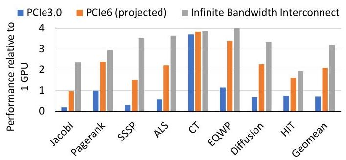

Figure 1 是整篇论文的动机证据：在 4 个 NVIDIA GV100 GPU 上，当前 PCIe 3.0 互连甚至让若干应用比单 GPU 更慢，几何平均性能约低于单 GPU 30%；即使使用 projected PCIe 6.0，也只能达到约 $2\times$，而无限带宽上界约为 $3\times$。这说明问题不是简单地“多买几块 GPU”或“等下一代互连”就能解决，数据放置和通信时机是一等问题。

这不是一个 first 类型的问题，已有方案很多：Unified Memory 提供统一地址空间但依赖 page fault/page migration；UM hints 试图让专家手动提示放置、prefetch 和 access-by；peer-to-peer load/store 允许 GPU 直接访问远程内存；`cudaMemcpy` 和 MPI 让程序员显式搬运数据；Gunrock/Groute 等框架在特定领域做通信优化。这些方案各有用处，但都没有同时满足三个目标：保留共享内存式可编程性、避免远程读落在关键路径上、避免把数据广播给不会消费它的 GPU。

**动机评估**：动机是 solid 的。论文用 Figure 1 证明了 hard-to-scale HPC workloads 的性能瓶颈，用 Figure 3 指出即使 NVLink/NVSwitch 相比 PCIe 3.0 的互连带宽提升了 $38\times$，local memory 仍约快 $3\times$。不足是评估对象有选择性：作者明确排除了 Tartan 中不受 inter-GPU communication 限制的应用，所以 GPS 的适用场景是通信受限、且有可预测共享模式的多 GPU 应用。

**核心 Insight**：多 GPU 通信的关键不只是“搬多少数据”，还包括“在哪条路径上搬”。远程 load 会阻塞消费者的关键路径，而 remote store 通常不阻塞生产者；同时 NVIDIA GPU memory model 对非 sys-scoped accesses 的跨 GPU可见性要求较弱，允许 store 在同步边界前被延迟、重排和 coalescing。GPS 正是把这两个观察连接起来：让生产者把更新 proactively publish 给真正的 subscribers，让消费者之后从本地副本读。

## 二、相关工作

论文把相关工作组织成几类通信和内存管理范式。

第一类是 Unified Memory 及其 hints。UM 的价值是程序员友好：所有 GPU 看到同一个虚拟地址空间，运行时通过 page fault 和 migration 把页搬到访问者附近。但 page fault 发生在读路径上，开销高；多 GPU 同时访问同一页时还会造成页在 GPU 间 thrashing。UM hints 能提供 read-mostly、prefetch、placement、accessed-by 等提示，但这需要程序员非常了解访问模式，而且 UM 对“至少一个 writer、多个 readers”的 read-write page 不能保持多副本：一旦写入，read-duplicated page 会 collapse 到单 GPU 并触发昂贵的 TLB shootdown。

第二类是手工通信，包括 peer-to-peer transfers、`cudaMemcpy` 和 MPI。peer-to-peer load 粒度细，但远程读延迟可能进入关键路径；peer-to-peer store 可以提前推送数据，但如果不知道谁会读，就容易浪费稀缺互连带宽。`cudaMemcpy` 能把数据批量复制到本地，kernel 执行时没有远程访问，但通常在同步边界搬运，难以和计算充分重叠。MPI/CUDA-aware MPI 更通用，但移植成本高，也不自动解决细粒度 overlap 问题。

第三类是领域框架和多 GPU 内存系统优化。Gunrock、Groute 等框架在图处理等领域有效，但适用范围有限。Griffin、CARVE 等多 GPU memory management 工作尝试优化 migration 或远程缓存，但仍可能让首次远程读发生在 demand path 上。GPS 与这些工作的区别是，它不实现昂贵的 inter-GPU cache coherence，而是利用 GPU memory model 的 relaxed scope 语义，只在需要同步的地方维护必要可见性。

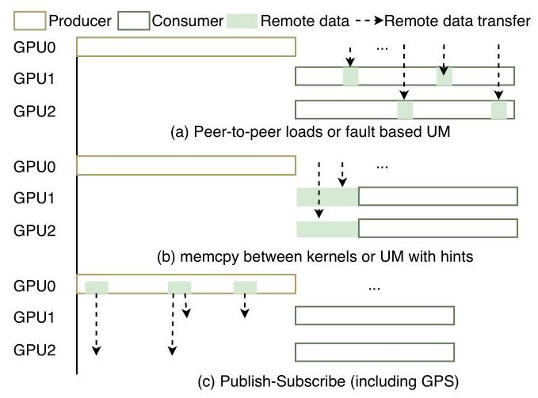

Figure 4 可以看作相关工作的对照图：UM 和 demand load 是 on-demand，`memcpy` 是 bulk-synchronous，GPS 是 kernel 运行中 fine-grained proactive transfer。GPS 的新意不是 publish-subscribe 概念本身，而是把它落到 GPU 虚拟内存、页订阅、写合并和 memory consistency 上。

## 三、技术挑战

**挑战 1：本地读性能和共享地址空间可编程性难以兼得。** 纯手工复制能让读在本地发生，但要求程序员显式维护副本和同步；UM 保留统一地址空间，却可能把读变成远程访问或 page migration。GPS 必须让普通 load/store 语法基本不变，同时改变底层行为。

**挑战 2：proactive transfer 容易浪费互连带宽。** 如果每个 producer 都把更新广播到所有 GPU，读路径是快了，但 all-to-all writes 会把 interconnect 打满。系统需要知道每个 page 的消费者集合，即 subscribers。

**挑战 3：订阅信息不能成为正确性前提。** 如果程序员写错 subscription，或者 profiling 没捕捉到某个访问，系统不能返回错误值或崩溃。GPS 因此把 subscription 定义为 performance hints：没订阅的 GPU 仍可远程读，只是性能下降。

**挑战 4：写路径上的额外硬件不能成为新瓶颈。** GPS 要对 store 做复制、地址转换、队列合并和远程发送。如果这些逻辑在关键路径上太重，收益会被抵消。因此论文把 GPS page table、GPS-TLB、remote write queue 设计在写路径上，并利用同步前可延迟可见的语义来隐藏延迟。

**挑战 5：必须兼容 NVIDIA GPU memory model。** GPS aggressively coalesces weak stores，但 sys-scoped accesses/fences 仍然要提供跨 GPU 同步语义。系统必须区分普通数据更新和同步变量更新，并在同步边界 flush 或退回传统处理。

## 四、解决方案

### 整体思路

GPS 把多 GPU 共享内存页变成一个 publish-subscribe 对象：每个 GPS page 可以在多个 subscriber GPU 的本地物理内存中拥有 replica。对 GPS page 的 load 通常翻译到本地 replica；对 GPS page 的 store 先写本地 replica，再由 GPS hardware 把更新复制给订阅该页的远程 GPU。这样，消费者之后读到的是本地 DRAM，而不是远程 GPU memory。

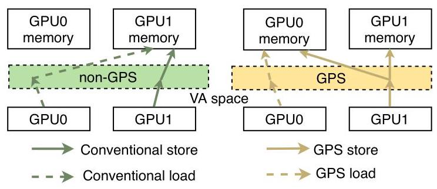

Figure 2 是最核心的行为差异：conventional pages 的 load/store 取决于物理页在哪个 GPU；GPS pages 的 load 总是面向本地副本，store 则被 publish 到其他订阅者。这个设计把最痛的 remote load latency 从 critical path 上移走。

### 贯穿示例

可以用 Jacobi/stencil 的 halo exchange 来理解 GPS。假设 GPU0 负责网格左半部分，GPU1 负责右半部分。GPU0 每轮迭代会更新边界 halo，GPU1 下一轮需要读这些 halo。

在 UM 中，GPU1 读 halo 可能触发 page fault，把页迁移到 GPU1；如果 GPU0 下一轮又写这个页，页可能再迁回去。UM hints 能缓解，但程序员需要准确描述访问范围和时机。在 `cudaMemcpy` 中，GPU0 可以在 kernel 结束后把 halo 复制给 GPU1，但通信变成同步边界上的批量搬运，不容易和计算重叠。在 peer-to-peer load 中，GPU1 可以直接读 GPU0 内存，但读延迟落在 GPU1 的关键路径上。

在 GPS 中，halo 所在页被 GPU1 订阅。GPU0 在 kernel 中写 halo 时，store 被 GPS remote write queue 捕获、合并，并主动发送到 GPU1 的本地 replica。GPU1 下一次读 halo 时直接访问本地 DRAM。如果 profiling 发现某些页从不被 GPU1 读，GPU1 会被自动 unsubscribe，避免无用传输。

### GPS address space 与 subscription

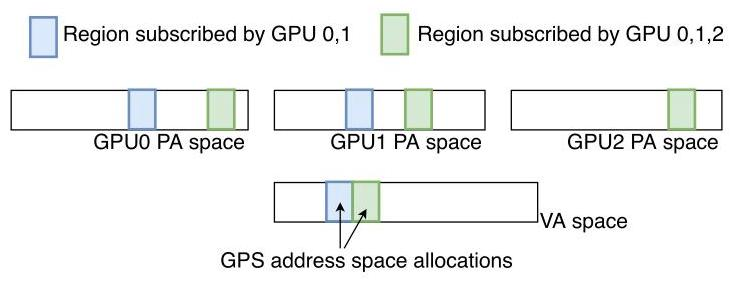

Figure 6 展示了 GPS address space 的语义：同一个虚拟地址范围可以在 GPU0/GPU1/GPU2 的 physical address space 中有不同副本，订阅集合决定哪些 GPU 拥有本地 replica。程序员通过 `cudaMallocGPS()` 分配 GPS memory；专家可以用扩展的 `cuMemAdvise()` flag 手动 `GPS_SUBSCRIBE` 或 `GPS_UNSUBSCRIBE`；普通用户可以用 `cuGPSTrackingStart()`/`cuGPSTrackingStop()` 触发 profiling，由硬件记录哪些 GPU 访问了哪些页，driver 再自动更新订阅集合。

这里一个关键设计是：subscription 是 hint，不是 correctness contract。如果一个 GPU 没订阅某页但发起 load，硬件会远程读某个 subscriber 的副本；这会慢，但保持功能正确。这让 GPS 的 API 更接近 UM hints 的容错模型，而不是要求程序员写出完全精确的通信图。

### 写合并与 memory consistency

GPS 利用 GPU memory model 的 relaxed semantics 对非 sys-scoped stores 做 aggressive coalescing。同一 cache line 内的多个 weak stores 不必立即对其他 GPU 可见，只要在 sys-scoped synchronization 或 grid 结束等边界前 flush 即可；不同 GPU 对同一地址的未同步弱写本来就是 data race，模型不要求全局一致的可见顺序。于是 GPS remote write queue 可以在发送前合并写，减少 interconnect traffic。

sys-scoped accesses 不能这样处理，因为它们用于跨 GPU 同步。论文的实现选择在检测到 GPS page 上的 sys-scoped store 时触发 fault，flush in-flight accesses，把该页 collapse 成单副本并 demote 为 conventional page。作者认为 sys-scoped operations 在典型 GPU 程序中较少，且程序员应把同步变量放在非 GPS allocation 中；如果提示错了，性能会受罚，但正确性仍保留。

### 硬件实现

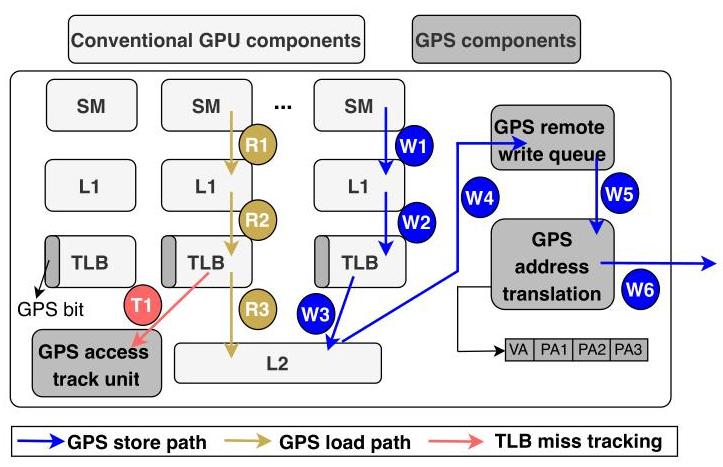

Figure 7 把实现拆成三条路径：普通本地 load 路径、GPS store publish 路径，以及 profiling 用的 TLB miss tracking 路径。论文提出的硬件扩展主要包括：

- 在传统 GPU PTE 中复用一个 unused bit 标记 GPS page。
- 增加 GPS page table，记录同一 virtual page 在各 subscriber GPU 上的 physical page address；4-GPU、64KB page 配置下，一个 GPS-PTE 最小约 126 bits。
- 增加 GPS remote write queue，以 cache block granularity、virtual address 做全相联合并；最终 proposal 为 512 entries，约 68KB SRAM。
- 增加 GPS address translation unit 和 GPS-TLB。实验中 32-entry、8-way GPS-TLB 就接近 100% hit rate，因为它只服务 GPS heap 的写传播，不服务普通读路径。
- 增加 access tracking unit，在 profiling phase 通过 last-level TLB miss 设置 page bitmap；跟踪 32GB GPS virtual address range 只需要约 64KB DRAM bitmap。

### 与已有方案的对比

GPS 相比 UM 的优势是避免 page fault/migration 出现在消费者读路径上；相比 UM hints 的优势是支持 read-write pages 的多副本更新，而不是写入后 collapse；相比 peer-to-peer demand load 的优势是消费者读本地；相比 `cudaMemcpy` 的优势是细粒度、kernel 内、可 overlap；相比领域框架的优势是接口更通用。

代价也很明确：GPS 需要硬件和 driver 支持；它会复制 shared pages，增加本地显存压力；64KB page 和 cache-line 粒度仍可能产生 false sharing；automatic subscription 依赖 phase-stable access patterns；sys-scoped writes 到 GPS page 会退回昂贵路径。

## 五、实验评估

### 实验设定

论文扩展 NVIDIA Architectural Simulator (NVAS)，模拟由 NVIDIA GV100 GPU 组成的多 GPU 系统，使用 NVBit 在真实硬件上采集 SASS-level traces。模拟器建模 kernel instructions、memory addresses、CUDA API events、调度、barrier synchronization 和 load dependencies，并对 PCIe 互连参数做校准或投影。

主要硬件参数包括：16GB global memory、80 SM、每 SM 64 CUDA cores、6MB L2、128B cache block；GPS remote write queue 为 512 entries，每 entry 135B；GPS-TLB 为 32 entries、8-way。应用集合包括 Jacobi、Pagerank、SSSP、ALS、CT、B2rEqwp/EQWP、Diffusion、HIT，覆盖 peer-to-peer、many-to-many、all-to-all 等通信模式。Baselines 包括 UM without hints、hand-tuned UM with hints、Remote Demand Loads (RDL)、Memcpy、GPS with automatic subscription，以及 Infinite bandwidth upper bound。

### 主要实验与结果

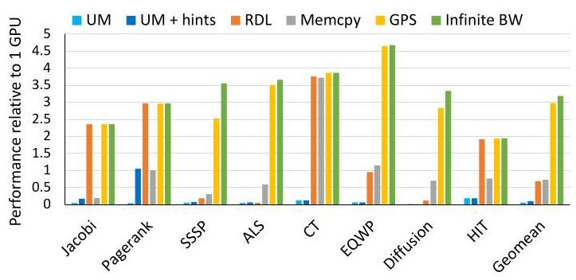

Figure 8 是核心结果。在 4-GPU 系统上，GPS 的几何平均 speedup 约为 $3.0\times$，接近 infinite bandwidth 的 $3.2\times$ 上界，捕获 93.7% 的可用机会；论文还报告 GPS 平均比 next best multi-GPU memory management technique 快 $2.3\times$。UM 基线整体很差，说明 page fault/migration 对这些 workloads 不可接受；UM hints 有改善但仍不稳定；`memcpy` 对 CT 表现好，但几何平均没有超过优化后的单 GPU；RDL 对能隐藏远程 load 延迟的应用有效，但对关键路径读敏感应用会严重退化。

值得注意的是 EQWP 在 4-GPU 上超过 $4\times$，作者解释为 aggregate cache capacity 增加后 L2 hit rate 从 55% 提升到 68%。这不是 GPS 机制单独带来的线性扩展，而是多 GPU 分区后缓存行为也变好了，属于应用相关收益。

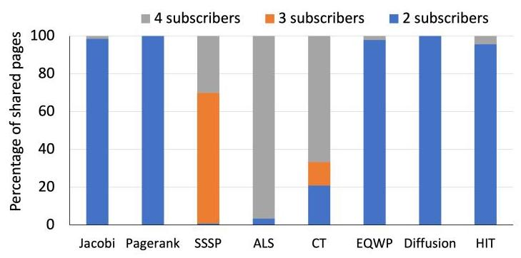

Figure 9 支撑 subscription tracking 的必要性：ALS 接近 all-to-all，CT 有相当比例 3/4 subscribers，而 Jacobi、Pagerank、Diffusion、HIT 等大多数 shared pages 只有 2 subscribers。这说明如果默认把所有更新广播到所有 GPU，会在很多应用中浪费大量带宽；但如果让程序员精确管理每页订阅，又会增加负担。GPS 的 automatic unsubscribe 正好切中这个中间地带。

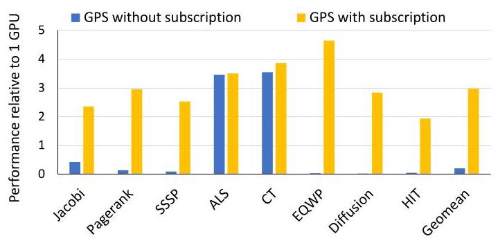

Figure 11 进一步说明 subscription tracking 是 GPS 可扩展性的关键。没有 subscription 的 GPS 在 Jacobi、Pagerank、SSSP、EQWP、Diffusion、HIT 上几乎失去大部分收益；带 subscription 后几何平均接近 $3\times$。ALS 和 CT 的差别较小，因为它们的共享页本来就多为 all-to-all。

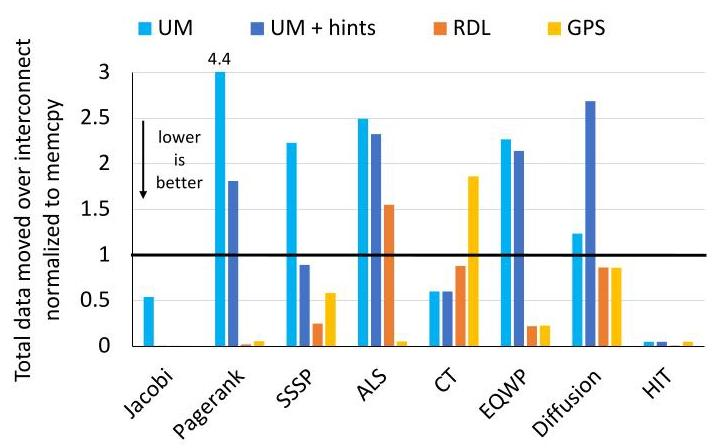

Figure 10 显示 GPS 并不总是传输最少字节，但通常能把无用传输控制在较低水平。UM 在 Pagerank、SSSP、ALS、EQWP 等应用上会引起大量 interconnect traffic，来自多 GPU 对同一页的迁移和 thrashing；UM hints 多数情况下减少数据量，但 diffusion 仍出现 over-fetch；RDL 在 ALS 中因为缺少 temporal locality 会重复拉取同一 cache line。GPS 的优势在于即使某些场景传输量相对 `memcpy` 上升，只要写路径不饱和互连，就不一定阻塞计算。

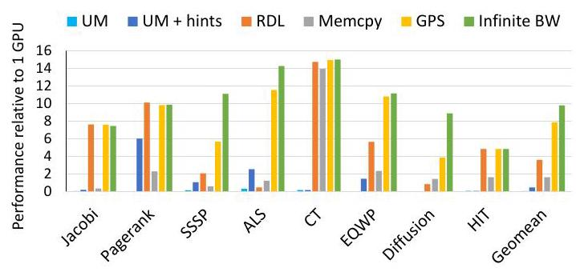

Figure 12 把规模扩到 16-GPU，并使用 projected PCIe 6.0 互连（128GB/s）。GPS 的平均 speedup 为 $7.9\times$，捕获 infinite bandwidth 上界约 80% 的机会；传统范式的趋势与 4-GPU 相似，说明 GPU 数量增加后，错误的数据管理策略不会自然变好，反而更容易暴露通信瓶颈。

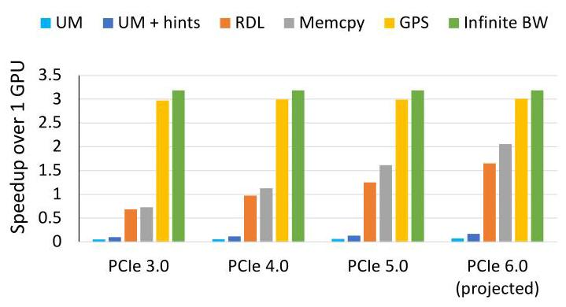

Figure 13 的结论很重要：即使互连从 PCIe 3.0 提升到 projected PCIe 6.0，传统范式的几何平均 strong scaling 仍明显落后于 GPS。GPS 则在不同互连下都接近 infinite bandwidth upper bound。这说明 GPS 的价值不是替代硬件互连升级，而是让系统更有效地使用互连。

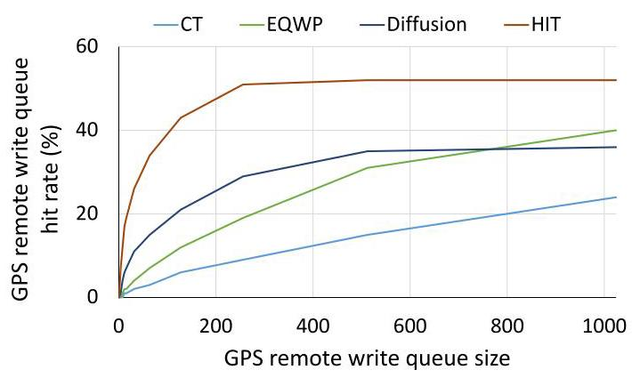

Figure 14 评估 remote write queue 大小。512 entries 时各应用基本达到 near-peak performance。继续增大队列收益有限，因为剩下的写要么随机、缺少时间/空间局部性，要么是 atomics。作者还指出 Jacobi 的 queue hit rate 为 0%，因为 spatial locality 已被 SM 内部 coalescer 捕获；Pagerank、ALS、SSSP hit rate 为 0%，因为主要是 atomics，而 GPS write queue 不合并 atomics。

### 结论支撑性分析

实验整体支撑了论文主张：GPS 的性能收益来自本地读、细粒度 proactive store、subscription tracking 和 write coalescing 的组合，而不是单一优化。作者同时给了 end-to-end speedup、traffic analysis、subscription ablation、GPU count scaling、interconnect sensitivity、queue/TLB/page-size sensitivity，论证链条比较完整。

主要局限也清楚。第一，实验是 simulation，并包含 projected PCIe 6.0；真实 GPU 上实现 GPS 的 driver、TLB、page table 和 fault/demotion 机制可能有额外复杂度。第二，自动订阅依赖应用有迭代或 phase behavior，profiling phase 能代表后续访问。第三，评估排除了不受通信限制的 Tartan 应用，因此不能把 $3.0\times$ 几何平均推广到所有多 GPU workloads。

## 六、附加洞察

**结论 1：仅提高 interconnect bandwidth 不能自动解决 multi-GPU strong scaling。**  
*出处*：Section 1、Section 7.4、Figure 1、Figure 13。  
*推理链条*：Figure 1 先显示 PCIe 3.0 下部分应用比单 GPU 慢，projected PCIe 6.0 也只让几何平均约到 $2\times$；Figure 13 再展示随着 PCIe 3.0 到 PCIe 6.0，传统范式虽然改善，但仍远低于 GPS 和 infinite bandwidth。由此可见，瓶颈不只是链路峰值带宽，而是通信发生在错误路径、错误粒度和错误接收者集合上。

**结论 2：UM hints 的问题不是“没有调好”，而是机制上不适合 read-write multi-subscriber pages。**  
*出处*：Section 2.1、Section 6、Section 7.1。  
*推理链条*：论文在实验中已经 hand-tune UM hints，包括 placement、accessed-by、prefetch 等；但作者说明这些应用没有 read-only pages accessed by multiple GPUs，因此 read-mostly hint 不适用。UM 对 read-write 多副本页的写入会 collapse 到单副本并触发 TLB shootdown，这意味着即使专家调参，也绕不过机制限制。

**结论 3：GPS 把“订阅准确性”从正确性问题降级成性能问题。**  
*出处*：Section 3.2、Section 4。  
*推理链条*：作者明确规定 subscription 是 hint；如果 GPU 未订阅某页仍然 load，硬件远程访问某个 subscriber 而不是 fault。这样 automatic profiling 可以不完美，manual subscription 也允许保守或不精确；代价只是远程访问变慢。这是 GPS 可用性的重要设计，不只是实现细节。

**结论 4：64KB page 是 false sharing 和 TLB pressure 的折中点。**  
*出处*：Section 5.2、Section 7.4。  
*推理链条*：小页能减少 GPS page false sharing，但会增加 GPU TLB 压力；大页能提高 TLB 覆盖，但会扩大冗余远程传输。实验中 4KB 比 64KB 慢 42%，2MB 比 64KB 慢 15%，所以作者选择 64KB 作为评估主配置。

## 七、总结与评价

GPS 的核心贡献是把 publish-subscribe 思路系统化地嵌入 GPU memory management：用 page-level subscription 决定哪些 GPU 持有副本，用 proactive stores 维护副本，用 weak memory model 支持写合并，并用小规模硬件结构把这些机制接到现有 GPU 虚拟内存路径上。它在论文选取的通信受限多 GPU workloads 上效果明显：4-GPU 平均 $3.0\times$，16-GPU projected PCIe 6.0 平均 $7.9\times$。

我认为这篇论文最强的地方是 insight 很干净：把远程通信从 load critical path 挪到 store path，并且不是粗暴广播，而是用 subscription 和 coalescing 控制带宽。它也没有假装自己实现完整 coherence，而是严肃利用 NVIDIA GPU memory model 的 scope 语义，边界划得比较准确。

最大不足是工程落地风险。GPS 需要 GPU MMU、page table、driver、CUDA runtime 和 memory model 处理的协同修改，真实产品化成本远高于论文中的结构图；automatic subscription 对 phase stability 有假设；对 sys-scoped writes 的 demotion 处理虽然正确，但如果程序员把同步相关数据误放进 GPS allocation，性能可能突然退化。后续值得探索的是更细粒度的 subscription、cache-line/sub-page 级 false sharing 控制，以及把 GPS-like 机制和现有 UM/prefetch runtime 融合。

## 八、章节脉络与段落速览

- **Section 1 · Introduction**：提出多 GPU strong scaling 被互连和内存管理限制的问题，并概述 GPS 的基本思想和贡献。
  - **¶1**：说明 GPU 是 HPC 的核心算力来源，但多 GPU 资源利用仍困难。
  - **¶2**：用 Figure 1 说明 local/remote bandwidth gap 会让 strong scaling 受限，PCIe 3.0 甚至可能慢于单 GPU。
  - **¶3**：梳理 UM、peer-to-peer、domain-specific frameworks 的不足。
  - **¶4-5**：提出 GPS，通过自动跟踪 subscribers、本地副本和 proactive stores 改善性能。
  - **¶6**：列出 GPS 的三个性能来源：fine-grained proactive transfer、本地 load、coalescing。
  - **¶7**：总结论文贡献和主要实验结果。

- **Section 2 · Background and Motivation**：解释 inter-GPU 通信机制、publish-subscribe 框架和 GPU memory consistency。
  - **2.1 · Inter-GPU communication mechanisms**：比较 `cudaMemcpy`、UM fault migration、UM hints、peer-to-peer transfers、MPI 的优缺点。
  - **2.2 · Publish-subscribe frameworks**：说明 proactive transfer 需要 subscriber tracking，否则 all-to-all 会浪费带宽。
  - **2.3 · GPU memory consistency**：引入 weak/strong accesses 与 sys scope，为 GPS 的 store coalescing 提供语义依据。

- **Section 3 · GPS Architectural Principles**：定义 GPS address space、subscription management 和 functionally correct coalescing。
  - **3.1 · The GPS address space**：说明 GPS pages 在 subscriber GPU 上拥有本地 physical replicas，load 本地读，store 被转发。
  - **3.2 · Subscription management**：说明 manual 和 automatic subscription，并强调 subscription 是 performance hint。
  - **3.3 · Functionally correct coalescing**：解释非 sys-scoped stores 可以合并，sys-scoped accesses 必须走传统一致性路径。

- **Section 4 · GPS Programming Interface**：给出最小 CUDA API 扩展。
  - **¶1**：说明 GPS API 位于 CUDA library 和 driver 中，目标是最小化应用修改。
  - **Listing 1**：用矩阵向量乘示例展示 `cudaMallocGPS()` 和 profiling API。
  - **¶2**：定义 `cudaMallocGPS()` 和 `cudaFree()` 的 allocation/release 行为。
  - **¶3**：说明通过扩展 `cuMemAdvise()` 支持手动 subscribe/unsubscribe。
  - **¶4**：说明 `cuGPSTrackingStart()`/`cuGPSTrackingStop()` 的自动 profiling 机制。

- **Section 5 · Architectural Support for GPS**：提出一种具体硬件实现。
  - **5.1 · GPS memory operations**：分别描述 conventional accesses、GPS loads、GPS stores/atomics 的路径。
  - **5.2 · GPS hardware units and extensions**：介绍 PTE GPS bit、GPS page table、remote write queue、GPS address translation、access tracking unit。
  - **5.3 · Discussion**：讨论 L2 内 coalescing 替代方案、virtual-addressed write queue、sys-scoped writes 处理和 memory oversubscription。

- **Section 6 · Experimental Methodology**：说明模拟平台、benchmark 和 baseline。
  - **¶1**：介绍 NVAS 扩展、NVBit trace、timing model 和 PCIe 参数校准。
  - **Table 1**：列出 GV100 和 GPS 结构参数。
  - **¶2**：说明应用集合来自 PROACT 和 Tartan，并只保留通信受限应用。
  - **¶3-8**：定义 UM、UM hints、RDL、Memcpy、GPS automatic subscription 和 Infinite bandwidth。

- **Section 7 · Experimental Results**：从性能、带宽、扩展性和敏感性验证 GPS。
  - **¶1**：概述 GPS 收益来自 proactive publish、本地读取、subscription bandwidth savings 和 write coalescing。
  - **7.1 · End-to-end performance**：Figure 8 展示 4-GPU GPS 几何平均 $3.0\times$，接近 $3.2\times$ 上界。
  - **7.2 · Benefits of subscription tracking**：Figure 9/10/11 展示 subscription distribution、interconnect traffic 和 subscription ablation。
  - **7.3 · Scalability beyond 4-GPUs**：Figure 12 展示 16-GPU projected PCIe 6.0 下 GPS 平均 $7.9\times$。
  - **7.4 · Sensitivity Studies**：分析 interconnect bandwidth、write queue size、GPS-TLB size、page size。
  - **7.5 · Limitations of the GPS approach**：指出 false sharing、cache-line 粒度冗余传输和 coalescing buffer 时间局部性不足。

- **Section 8 · Related Work**：把 GPS 放入 multi-GPU memory management、prefetching、publish-subscribe、NUMA 和 memory model 工作中。
  - **¶1**：说明 GPS 与 multi-GPU performance 和 inter-GPU coherence 工作的关系。
  - **¶2**：对比 Griffin 和 CARVE 等 memory management 方案。
  - **¶3**：讨论 single/multi-GPU prefetching 和 UM hints 的限制。
  - **¶4**：连接 distributed publish-subscribe、NUMA placement、peer caching 和 DRAM-cache。
  - **¶5**：说明 scoped synchronization 相关工作支撑 GPS 的 memory model 利用。

- **Section 9 · Conclusion**：重申 GPS 的机制和主要结果。
  - **¶1**：总结 GPS 自动跟踪 subscribers、proactively broadcasts fine-grained stores、本地读高带宽，以及 4-GPU/16-GPU 性能结果。
