# Uncovering Real GPU NoC Characteristics: Implications on Interconnect Architecture

Zhixian Jin

KAIST

Daejeon, Republic of Korea

kimjihyun@kaist.ac.kr

Christopher Rocca

KAIST

Daejeon, Republic of Korea

christopher.rocca@kaist.ac.kr

Jiho Kim

KAIST

Daejeon, Republic of Korea

jihokim@kaist.ac.kr

Hans Kasan

KAIST

Daejeon, Republic of Korea

hanskasan@kaist.ac.kr

Minsoo Rhu

KAIST

Daejeon, Republic of Korea

mrhu@kaist.ac.kr

Ali Bakhoda

Microsoft

Bellevue, WA, USA

Ali.Bakhoda@Microsoft.com

Tor M. Aamodt

University of British Columbia

Vancouver, Canada

aamodt@ece.ubc.ca

John Kim

KAIST

Daejeon, Republic of Korea

jjk12@kaist.ac.kr

Abstract-A critical component of high-throughput processors such as GPUs is the network-on-chip (NoC) that interconnects the large number of cores and the memory partitions together. In this work, we provide a detailed analysis, in terms of latency and bandwidth, of real GPU NoC across several generations of modern NVIDIA GPUs. Our analysis identifies how non-uniform latency exists between the cores and the memory partitions based on their physical location in the GPU. The non-uniformity can result in up to approximately \( {70}\% \) difference in on-chip latency. In comparison, the bandwidth provided from the cores to the memory partitions is approximately uniform. However, recent GPUs that consist of multiple GPU "partitions" present different on-chip latency and bandwidth characteristics when communicating between the partitions. Based on our analysis of real GPU interconnect, we discuss potential implications including its impact on timing used in side-channel attacks as well as NoC microarchitectures. We show how the non-uniform latency can be exploited in a timing side-channel attack within a GPU as the core location impacts performance (or timing). In addition, proper understanding (and proper assumptions) of GPU NoC is critical to ensure a network that does not bottleneck the overall system performance.

Index Terms-GPU, network-on-chip, timing side-channel attack

## I. INTRODUCTION

The acceleration of parallel applications has become a significant component of modern computing [1]-[3]. These emerging workloads often require high-throughput architectures such as GPUs, and along with parallel programming models such as CUDA and OpenCL, they have enabled GPUs to be widely used across different application domains [4]. To sustain high performance, the GPUs need to support high compute throughput and high memory bandwidth. A high-level summary of the recent three generations of NVIDIA GPUs used in this work is summarized in Table I. The number of cores (or streaming multiprocessors (SMs)) has increased to provide high compute throughput and the memory capacity and bandwidth, as well as on-chip cache, has also significantly increased. As a result, the network-on-chip(NoC) [5] that interconnects a large number of on-chip components is becoming a critical component of overall system performance.

<table><tr><td></td><td>V100</td><td>A100</td><td>H100</td></tr><tr><td>SMs</td><td>80</td><td>108</td><td>132</td></tr><tr><td>TPCs</td><td>40</td><td>54</td><td>66</td></tr><tr><td>GPCs</td><td>6</td><td>7</td><td>8</td></tr><tr><td>Max SMs / GPC</td><td>14</td><td>16</td><td>18</td></tr><tr><td>L2 cache size</td><td>6MB</td><td>40MB</td><td>50MB</td></tr><tr><td>L2 cache slices</td><td>32</td><td>80</td><td>80</td></tr><tr><td>GPU memory bandwidth</td><td>0.9TB/s</td><td>2TB/s</td><td>3.35TB/s</td></tr><tr><td>Memory controllers</td><td>8</td><td>10</td><td>10</td></tr><tr><td>GPU max clock speed</td><td>1.38GHz</td><td>1.41GHz</td><td>1.755GHz</td></tr></table>

TABLE I: Microarchitecure comparison of NVIDIA GPUs.

While there has been a lot of research on GPU NoC and its impact on the overall system performance, most prior work have focus on simulation-based evaluations and are not necessarily reflective in NoC found in real GPUs. To the best of our knowledge, this is one of the first works to provide a detailed analysis of real, modern GPU NoC. In this work, we first provide a detailed analysis of modern GPU NoC - both in terms of latency and throughput (bandwidth). Our analysis on NVIDIA GPUs shows on "average", on-chip latency is similar across all of the cores; however, non-uniform latency to memory partitions exists in GPU NoC, based on the physical placement of the cores and the L2 slices. In comparison, bandwidth to the remote L2 (or the L2 fabric bandwidth) is approximately uniform regardless of the placement of the cores and the memory partitions. The recent GPUs (e.g., A100, H100) that have multiple GPU "partitions" introduce different characteristics both in terms of latency and bandwidth when traffic crosses from one partition to the other partition.

Based on the analysis, we explore the implications on two aspects of GPU architecture - timing side-channel attacks and GPU NoC microarchitecture. There has been recent work on timing side-channel attacks in GPUs, based on various microarchitecture features [6]-[11]. However, timing attacks are fundamentally based on measuring execution time (or latency). We show how the non-uniform latency of GPU NoC can be exploited in timing side-channel attacks to potentially enable attacks as well as help mitigate side-channel attacks. In addition, GPU NoC architecture presents unique challenges, compared to conventional multicore NoC, because of the high-bandwidth (and high-throughput) that is required to interconnect the components together. Based on the analysis of real GPUs, we highlight some of the challenges (and opportunities) in the design of the future GPU NoC as well as pitfalls when exploring GPU NoC architectures. In particular, the main contributions of this work include the following.

- We provide a detailed characterization and analysis of real network-on-chip (NoC) across several generations of NVIDIA GPUs. One key observation is how latency can be non-uniform but bandwidth is uniformly provided between the cores and memory partitions.

- Based on NoC characterization, we show its impact on timing side-channel attacks and how the non-uniform latency can be exploited both during the attack as well as a defense against timing side-channel attacks.

- We also show the impact of NoC assumptions in GPU architectural explortations to ensure that the on-chip network (or on-chip bandwidth) does not bottleneck overall system performance.

## II. BACKGROUND

### A.GPU Architecture

GPU is a highly parallel processor that can execute thousands of threads simultaneously to enable high throughput processing [12]. A GPU consists of multiple cores or SM (Streaming Multiprocessor) and memory partitions that are interconnected together by a network-on-chip (NoC). A GPU context which is written in a GPU-specific programming model such as CUDA/OpenCL has multiple thread blocks and a thread block scheduler [13] schedules each thread block. In a GPU pipeline, a warp or a group of threads is the unit of execution and executes the same instruction with different data for each thread. In addition, multiple warps execute concurrently based on the warp-scheduling algorithm [14]- [17]. Each core has a private L1 cache and shared memory, while a globally shared L2 cache is near the memory controllers. Each memory partition (MP) contains multiple L2 slices and a memory controller (MC) managing the off-chip memory [18], [19]. The NoC interconnects the SMs with the memory partitions (MPs). The GPU architecture is hierarchical: within a Texture Processing Cluster (TPC), two SMs are connected by a multiplexer; 7 to 9 TPCs form a Graphics Processing Cluster (GPC), and 6 to 8 GPCs form a GPU [12], [20], [21]. Recent GPUs (e.g., A100, H100) include a central interconnect that splits the GPU into left and right "partitions". In this work, we analyze GPU interconnect and explore the impact of the NoC on high-throughput processors, both in terms of latency and bandwidth.

## B. Related Work

Analysis of recent GPU systems, including V100 [22] and A100 [23], have been done and some work has analyzed the memory hierarchy in GPUs [24]. While these work provides an in-depth understanding of the various components of a GPU, they do not provide a detailed analysis of the interconnect within the GPU. Multi-GPU systems have also been analyzed

Algorithm 1 Latency measurement algorithm.

---

Inputs D[] : data array loaded into L2

					M[] : L2 slice to data \( \left( {D\left\lbrack  \right\rbrack  }\right) \) index mapping

Output L[][] : Measured L2 access latency

		function L2_LATENCY

				for \( s \leftarrow  1 \) to \( S \) do

						\( {idx} \leftarrow  M\left\lbrack  s\right\rbrack \)

						for \( n \leftarrow  1 \) to \( N \) do \( \vartriangleright  N \) : # of cores

								start ← clock ();

								___ldcg (&D[idx]);

								end \( \leftarrow \) clock ();

								\( L\left\lbrack  s\right\rbrack  \left\lbrack  n\right\rbrack   \leftarrow \) end - start;

---

to understand the impact of GPU-to-GPU interconnect [25]- [27], but their discussion of on-chip interconnect is limited.

Network-on-chip (NoC) for high-throughput processors presents different challenges compared to multi-core CPU NoC. Throughput-effective NoC for GPGPUs [28] was proposed where the "reply" network bottleneck was identified based on the many-to-few-to-many traffic pattern. To address this bottleneck, alternative NoC architectures [29]-[32] have been proposed to minimize the impact of the reply network. To reduce the amount of on-chip traffic, coalescing has been proposed to reduce the amount of on-chip traffic injected into the NoC [33]. However, many of these work often assume a multi-hop network such as a 2D-mesh topology and can result in an on-chip bandwidth bottleneck.

Recent work [34], [35] have assumed a hierarchical crossbar organization. To the best of our knowledge, GPU interconnect in real systems are organized similarly to a hierarchical crossbar; however, these work do not provide a detailed analysis of real GPU NoC. More importantly, many prior work do not consider the impact of the NoC bandwidth on the L2 bandwidth - i.e., the NoC bandwidth needs to be provisioned such that sufficient L2 bandwidth can be provided. Accel-sim [36] also argues how L2 bandwidth is potentially a bottleneck that prevents more accurate modeling of their simulator in modern GPUs.

## C. Methodology

In this work, we used the three GPUs that were described earlier (Table I). To analyze the performance impact of GPU network-on-chip (NoC), synthetic micro-benchmark kernels were written to isolate the effects of different factors and components within the GPU. In particular, the measurements focused on understanding NoC latency and bandwidth.

1) Latency Measurement: A high-level overview of how latency was measured in this work is shown in Algorithm 1. Only one thread within one warp is utilized to send a request to minimize the impact of other components in the GPU - thus, there is no coalescing and no contention for any resource within the GPU. The memory access made is guaranteed to bypass the L1 and unless otherwise stated, the working set fits within the L2. Memory accesses to \( D\left\lbrack  \right\rbrack \) are done to warm up the L2 cache to ensure all accesses hit in L2. The measured (round-trip) latency includes the core (SM), NoC, and the L2 access latency. As the measurement is carried out across different SM and L2 slices, the core or the L2 latency is approximately the same but the change in overall latency comes from the impact of the NoC. Memory accesses used in evaluation bypass the per-SM L1 cache through the -dlcm=cg compilation option. Latency was measured using the hardware clock counter clock () that is provided within each SM.

To understand the impact of the NoC, the source and the destination of packets (or memory requests) need to be known. The source (or the SM) is determined by smid register and is used to "pin" kernels to a particular SM as necessary. The destination (or the L2 slice) can be determined by using nvprof with "non-aggregated" mode to monitor the per-slice traffic. The profiler was also used to collect information on addresses that access the same L2 slice. \( {}^{1} \) The mapping information from slice ID \( s \) to the appropriate index of \( D\left\lbrack  \right\rbrack  \left( {idx}\right) \) is stored in \( M\left\lbrack  \right\rbrack \) (i.e., \( M\left\lbrack  s\right\rbrack   = {idx} \) ). Note that the numerical number of the SM or the L2 slice ID is not significant but is only needed to ensure different (or for bandwidth measurements, the same) SM or L2 slices are accessed. Initial evaluations were done on the V100 but similar trends were observed on A100 and H100. However, the larger GPUs (i.e., A100, H100) with multiple "partitions" had some different characteristics that we also analyze.

2) Bandwidth Measurement: Micro-benchmark was written to measure on-chip (or L2 fabric bandwidth) as summarized in Algorithm 2 and is very similar to streaming benchmarks that are commonly used to measure bandwidth. Sequential, strided memory access pattern was used and similar to the latency measurements, L1 cache was bypassed and when measuring L2 fabric bandwidth, \( {}^{2} \) and L2 cache was warmed up to ensure all accesses hit in the L2. Unless otherwise stated, read accesses were performed. Unlike latency measurements, all threads within a warp were utilized, as well as multiple thread blocks, to saturate the bandwidth - thus, each thread executes the kernel described in Algorithm 2. A unique aspect of Algorithm 2 is that the destination (or L2 slice) was controlled, similar to the latency measurements. A set of addresses for the data \( \left( {D\left\lbrack  \right\rbrack  }\right) \) was determined prior to the evaluation and multiple accesses were issued to the same L2 slice \( \left( s\right) \) to evaluate L2 bandwidth - thus, \( M\left\lbrack  s\right\rbrack  \left\lbrack  \right\rbrack \) contained the indices that were used by threads that sent request to the same L2 slice \( s \) . Different L2 bandwidth measurements were performed including per L2 slice, per memory partition, and aggregate (total) L2 bandwidth. Performance (or bandwidth) was determined based on the data (message) size transferred and the amount of time it took to execute the micro-benchmark.

Algorithm 2 Bandwidth measurement algorithm.

---

Inputs D[] : data array loaded into L2

		M[s][] : set of data \( \left( {D\left\lbrack  \right\rbrack  }\right) \) index mapping to L2 slice \( s \)

Output L2 Bandwidth for L2 slice \( s \)

	function L2_BANDWIDTH \( \left( s\right) \; \vartriangleright  s \) : target L2 slice

		stride \( \leftarrow \) blockDim. \( x \) ;

		tid \( \leftarrow \) blockIdx. \( x \times \) stride + threadIdx. \( x \) ;

		index \( \leftarrow  M\left\lbrack  s\right\rbrack  \left\lbrack  \text{ tid }\right\rbrack \) ;

		_1dcg (&D[index]);

---

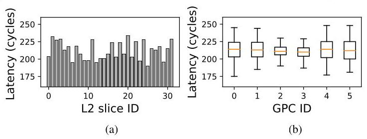

Fig. 1: (a) Non-uniform L2 access latency from an SM (i.e. SM 24) to all of the L2 slices on a V100 GPU and (b) average latency and the latency variation within each GPC.

## III. ON-CHIP LATENCY ANALYSIS

In this section, we provide an analysis of the on-chip (network-on-chip) latency of GPUs. We demonstrate how nonuniform latency is observed in GPUs, often determined by the physical location of the cores and the memory partition (MP) (and L2 slice). In addition, the increasing GPU size results in a monolithic GPU consisting of multiple "partitions" and we analyze the impact of such GPU partitions on on-chip latency.

## A. Non-uniform Latency

The L2 access latency or the round-trip latency from the SM to the L2 slice that includes the core (SM) latency, NoC latency, and the L2 access latency is shown in Figure 1. The L2 access latency is measured by a memory read access that misses in the local L1 cache and hits in the shared L2 cache. Figure 1(a) plots the L2 access latency distribution from one particular core (SM 24) to the 32 different L2 slices on a V100 GPU and the \( x \) -axis is the L2 slice ID provided by the NVIDIA profiler [37]. Although the plot shows only one SM, the other SMs also have a non-uniform latency distribution with the lowest latency of 175 cycles while the highest latency is 248 cycles and the average latency is approximately 212 cycles. The accesses to the different L2 slices share the same components (e.g., core latency, L2 latency) but the main difference is in the physical location of the L2 slice (and the SM location).

Observation #1: Latency from the cores (SMs) to individual L2 slices through the GPU NoC is nonuniform.

Overall, average L2 access latency is approximately 212 cycles on V100, similar to prior work that reported an L2 latency of 193 cycles [22]. While the average L2 latency is consistent across the GPCs, as shown in Figure 1(b), the variation within each GPC can be significant. For example, GPC2 and GPC3 have a narrow latency distribution, whereas other GPCs have a wider distribution as the the L2 latency within a GPU can differ by as much as 71 cycles for GPC4 - representing approximately 33% difference in L2 latency. L2 latency histograms for two different GPCs are shown in Figure 2 where the latency from all SMs within the GPC to all memory L2 slices are collected on the V100 GPU for two GPCs. While the average latency for the two GPCs is very similar, the latency variation is very different - i.e., GPC0 ( \( \mu  = {213} \) cycles, \( \sigma  = {13.9} \) cycles) and GPC2 ( \( \mu  = {209} \) cycles, \( \sigma  = {7.5} \) cycles). Thus, the L2 latency varies based on the source (SM) and destination (L2 slice).

---

\( {}^{1} \) The profiler (and the performance counters) that was used for V100 is no longer supported on A100 or H100 [37]. As a result, a more manual approach was taken where two kernels were written and one kernel always accessing a single address (single slice) while the address accessed by the other kernel was varied. When "contention" occurs, we assume that the same L2 slice is being accessed.

\( {}^{2} \) The measured bandwidth is not necessarily L2 bandwidth since L2 bandwidth represents cache read/write performance. In comparison, we measure the interconnect or fabric bandwidth to/from the L2.

---

Observation #2: The average L2 latency from a GPC (i.e., latency from the SMs within a GPC to all L2 slices) is similar across all GPCs; however, the L2 latency variation exists between the SM within a GPC and latency variation differs across the GPCs.

## B. Physical Placement and Latency

As discussed earlier in Sec II, GPUs are organized hierarchically with multiple cores located within a GPC and multiple L2 slices within a single MP. The exact latency of the L2 access latency (and network-on-chip) is determined by the physical location of the core (or SM) within the GPC as well as the physical L2 slice location within the MP - in addition to the GPC and MP location itself. To better understand the impact of placement, we plot L2 latency in Figure 3 but the L2 slice IDs are first grouped together based on their MP ID - i.e., L2 slices located within the same MP are grouped. The L2 slice IDs are then sorted based on the latency values - from the lowest L2 latency to the highest. The sorted order of the slice ID across the different SMs are identical - e.g., for MP 0 , all four plots show L2 latency in the following L2 slice ID order: 0, 4, 27, 31, ... For illustration purposes, latency distributions for only four SMs are shown, with a group of two SMs from the same GPC. While the exact latency values differ, the SMs from the same GPC show the same trend in terms of latency change (e.g., Figure 3(a, b) and Figure 3(c, d)). While the latency across the different MPs differs, the latency trend within each MP is similar across the different SMs as well.

An approximate logical floorplan for the V100, based on die photo [38] and our analysis, is shown in Figure 4. The diagram includes an approximate placement of the SMs for one GPC (i.e., GPC 4) and the L2 slice placement for one memory partition (MP) (i.e., MP 3). The actual SM ID or the L2 slice ID is not important but the diagram shows the relevant placement of the cores (SM) and the L2 slices. The SM and L2 slice that are closely located have the lowest latency (e.g., L2 slice 17 and SM64 with L2 latency of 180 cycles) while the ones farthest away (e.g., L2 slice 15 and SM4) have the highest latency with 217 cycles. For simplicity, the figure only shows one GPC and one MP, but this trend holds across different GPC and MP combinations. Detailed latency analysis across

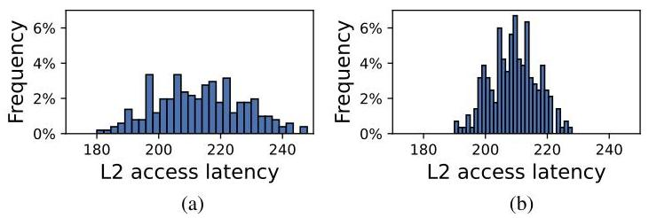

Fig. 2: L2 latency histogram distribution of two different GPCs, (a) GPC0 and (b) GPC2. Both GPCs have very similar average L2 latency but different latency distributions.

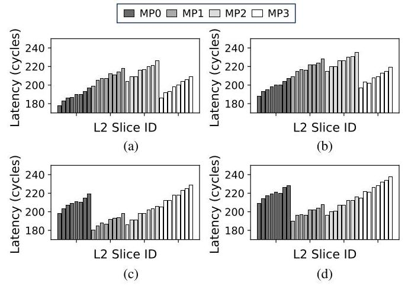

Fig. 3: Latency variation plot for multiple SMs, including two SMs from GPC0 ((a) SM60 and (b) SM24) and GPC4 ((c) SM64 and (d) SM28). The L2 slice indexes are sorted as the L2 slices in the same memory partitions are grouped together.

different SMs and L2 slices is shown in Figure 5. The results show that different SM locations result in a constant difference in L2 latency while some L2 slices always have lower latency compared to other L2 slices.

Observation #3: The non-uniform L2 latency is determined by the physical location of the SM within the GPC and the L2 slice within the memory partition.

Pearson Correlation [39], a common measure of linear correlation between two data sets, can be applied to measure the similarity in L2 latency distribution between two SMs. This correlation \( \left( r\right) \) is defined as follows,

\[
r = \frac{\mathop{\sum }\limits_{{i = 1}}^{n}\left( {{X}_{i} - \bar{X}}\right) \left( {{Y}_{i} - \bar{Y}}\right) }{\sqrt{\mathop{\sum }\limits_{{i = 1}}^{n}{\left( {X}_{i} - \bar{X}\right) }^{2}}\sqrt{\mathop{\sum }\limits_{{i = 1}}^{n}{\left( {Y}_{i} - \bar{Y}\right) }^{2}}} \tag{1}
\]

where \( n \) is the number of samples, and \( {X}_{i},{Y}_{i} \) are the individual latency samples from two different SMs. Pearson correlation of 0 means no correlation, 1 means perfect positive (linear) correlation, and -1 indicates perfect negative correlation. The latency distributions in Figure 3(a, b) have a Pearson correlation of 0.998 , suggesting nearly identical distributions. However, the correlation between Figure 3(a, c) is approximately -0.365 , indicating minimal amount of correlation.

Pearson correlation heatmap for V100 is shown in Figure 6(a). Each axis shows the different SMs, grouped together based on their GPC ID. The heatmap shows a high correlation between SMs in GPC0 with every other SM in GPC0 and GPC1. In general, the SMs inside the same GPC show (near) perfect correlation and the group of two neighboring GPCs have a very high, positive correlation value. However, GPCs that are farther away have a lower correlation. The analysis suggest that two groups of GPCs (GPC0&1 and GPC4&5) have similar characteristics, compared to the other two GPC (GPC2&3). This likely results from the symmetric GPU physical placement, with GPC2&3 centrally located and GPC0&1 and GPC4&5 at the edges (Figure 4).

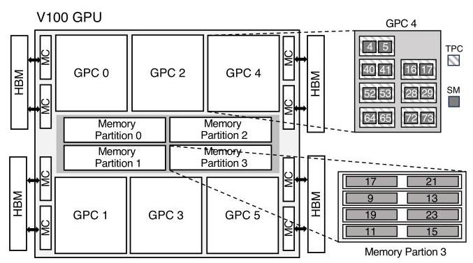

Fig. 4: Block diagram (approximate logical floorplan) of the V100 GPU showing L2 slices placement inside the MP and SM placement inside the GPC.

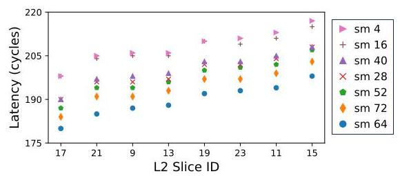

Fig. 5: L2 access latency between the SMs in GPC4 to different L2 slices inside memory partition (MP) 3 on V100. Physically closer SMs and L2 slices have lower latency.

Observation #4: Similarities in on-chip latency distribution using Pearson correlation can be used to determine the placement of SMs.

## C. Impact of GPU Partitions

The Pearson correlation heatmap of A100 (Figure 6(b)) shows some difference among SMs within a single GPC, unlike V100 where the Pearson correlation was relatively constant between all SMs within a GPC. Since the size of the GPU increased from V100 to A100, both in terms of the physical die size and the number of SMs per GPC, the GPU effectively consists of two "partitions" and impacts the latency characteristics. While not shown, the non-uniform L2 latency observed on V100 also exists in A100 and H100. However, the SMs between the GPCs for A100 do not necessarily have the same latency distribution characteristics (as what was observed in V100). The latency among the SMs within the same GPC is nearly identical, as shown by the diagonal line in the heatmap but the similarity that existed with neighboring GPCs in V100 is reduced in A100. \( {}^{3} \) The difference between SMs in a GPC is much greater in H100 as shown in Figure 6(c). A group of 4 or 6 SMs (i.e. 2 or 3 TPCs) have similar latency characteristics that are very different compared with other groups of SMs within the same GPC. This similarity in latency distribution suggests the potential existence of a new hierarchy of cores between the TPC and GPC hierarchies, which we will refer to as CPC. \( {}^{4} \)

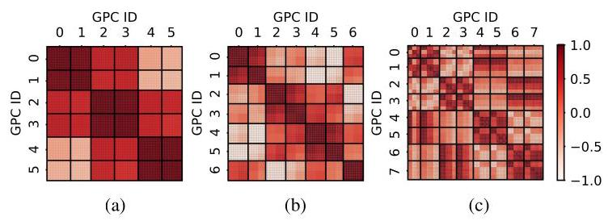

Fig. 6: Pearson correlation heatmap for L2 latency on the (a) V100, (b) A100, and (c) H100 GPUs. For A100 and H100, GPCs 0-3 are located on the left "partition," while GPC 4-7 are located on the right "partition."

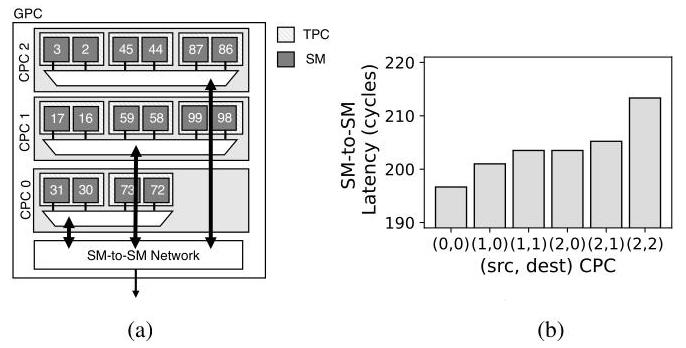

Fig. 7: (a) Block diagram of CPC hierarchy within a GPC of H100 that provides SM-to-SM communication, and (b) average SM-to-SM latency based on CPC location.

A high-level block diagram of the CPC hierarchy within a GPC is shown in Figure 7(a) with three CPC's located within a GPC that are interconnected with a SM-to-SM network. One unique feature of H100, compared to the previous generation of GPUs, is the distributed shared memory [12] that enables access to remote shared memory through the SM-to-SM network. To understand the latency characteristics of the SM-to-SM network, a synthetic kernel was used, similar to Algorithm 1, but the key difference was that load was issued to a remote shared memory within the same GPC. The average latency for the SM-to-SM communication across different CPC combinations within a GPC is shown in Figure 7(b), represented with (src, dest) CPC pairing information. The CPC's relative distances impacts the latency - e.g., latency is lowest (196 cycles) when two SMs within CPC0 communicate but increases to around 213 cycles for communications between SMs in CPC2 which is likely farthest away. The other

---

\( {}^{3} \) The reason for this is not clear but we suspect the additional number of SMs as well as the bigger chip area has some effect on the latency correlation.

\( {}^{4} \) While NVIDIA documentation does not disclose this level of hierarchy, some hardware teardown [40] have also identified a potential intermediate level of hierarchy that they refer to as "CPC" or Compute Processing Cluster. We use the same terminology in this work. The existence of this hierarchy is not confirmed; however, our work shows the impact of such hierarchy on the interconnect performance.

---

combination of source and destination CPCs show varying latency based on their distance and placement.

Observation #5: Larger GPUs (with multiple "partitions") result in different latency characteristics and more non-uniformity. In particular, H100 includes another level of SM core hierarchy, between TPC and GPC, that impacts the latency characteristics.

Recent GPUs (A100, H100) also have a significantly different characteristics (compared to V100) in L2 latency when crossing the GPU "partitions." In Figure 8(a, b, c), we plot the average L2 access latency across the 3 different GPUs - averaged across requests from all SMs within a GPC to different L2 slices within a single MP. V100 shows an average latency of approximately 212 cycles (Figure 8(a)) (similar to earlier results in this section); however, for A100, the average L2 latency differs significantly - e.g., requests from GPCs 1,2,6,7 have latency that is similar to V100 but L2 accesses from GPCs 0,3,4,5 have much higher latency. In our evaluation, we assumed the destination (or L2 slice) was located on the left "partition." Since GPCs 1,2,6,7 were located on the same partition as the destination L2 slice, the latency was lower as requests destination was located in the near partition. However, for GPCs 0,3,4,5, the destination L2 slices were on the far partition - resulting in a much higher latency of approximately 400 cycles - caused by the extra latency of traversing back and forth across the GPU partitions.

H100 also has two partitions, similar to A100. However, the latency values are much more uniform across the GPCs (Figure 8(c)). \( {}^{5} \) While the details are not clear, the memory hierarchy (and the cache organization) for H100 has optimizations where "L2 ... caches data for memory accesses from SMs in GPCs directly connected to the partition." [12] As a result, latency from an SM is relatively similar regardless of the memory address. To better understand the L2 latency behavior, we measure the L2 miss penalty - i.e., the amount of for the cache line to be brought in from the main memory to the L2. For both V100 and A100, the L2 miss penalty is relatively constant (Figure 8(d, e)) but for H100, the latency is not constant since depending on where the data is cached, the miss penalty will vary (Figure 8(f)). This work does not completely reverse-engineer the GPU NoC architecture or the memory hierarchy; however, as the size of a GPU increases, more latency non-uniformity is introduced.

Observation #6: Recent GPUs with multiple GPU "partitions" has additional uniformity depending on the L2 cache policy.

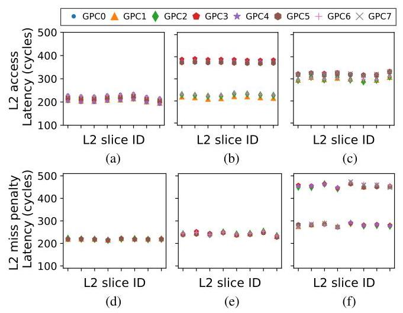

Fig. 8: Average L2 hit latency from one GPC to one MP (top) and average L2 miss penalty or latency from global memory to L2 (bottom) on (a, d) V100, (b, e) A100, and (c, f) H100.

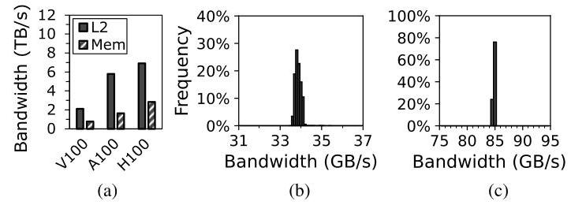

Fig. 9: (a) On-chip aggregate L2 and global memory bandwidth. Distribution of L2 bandwidth to a single L2 slice when accessed by (b) a single SM and (c) a single GPC in V100.

## IV. NETWORK-ON-CHIP BANDWIDTH ANALYSIS

In this section, we analyze on-chip bandwidth in GPUs and in particular, bandwidth to the L2 slices (or the memory partition) or the L2 fabric bandwidth.

## A. Uniform On-Chip Bandwidth

In Figure 9(a), we compare the total aggregate on-chip L2 fabric bandwidth and global memory bandwidth measured across the different GPUs. Aggregated L2 fabric bandwidth has all SMs send traffic to all L2 slices (and hit in the L2) while memory bandwidth measurements assume accesses to not hit in the L2. Both bandwidths were measured with sequential memory accesses and memory bandwidth reaches approximately 85-90% of the peak maximum memory bandwidth. While off-chip memory bandwidth has continued to increase, the on-chip L2 bandwidth has also increased accordingly and is approximately \( {2.4} \times \) to \( {3.5} \times \) higher compared to off-chip memory bandwidth. While having higher L2 bandwidth is not necessarily suprising [22], it does have implications on the design of GPU NoC, as we discuss in Section VI, since the NoC significantly impacts the L2 fabric bandwidth.

Observation #7: On-chip aggregate (total) L2 fabric bandwidth exceeds the total off-chip memory bandwidth in modern GPUs.

While on-chip latency is non-uniform (Observation 3), the bandwidth to the different destinations (or L2 slices) is more uniform. Figure 9(b) shows a histogram of the L2 bandwidth in V100 when one SM sends traffic to a single L2 slice, showing the bandwidth distribution across all combination of source (SMs) and destination (L2 slices). The average bandwidth from a single SM to an L2 slice is approximately 34 GB/s with \( \sigma  = {0.147}\mathrm{{GB}}/\mathrm{s} \) . When all SMs within a GPC send traffic to a single L2 slice, the achievable bandwidth is approximately \( {85}\mathrm{{GB}}/\mathrm{s} \) with \( \sigma  = {0.06}\mathrm{{GB}}/\mathrm{s} \) , as shown in Figure 9(c) - measured across all combinations of GPCs and a destination L2 slice. Both of these results demonstrate a tight distribution of bandwidth and suggests that the bandwidth provided to each L2 slice from the different cores (SMs) and GPCs are approximately similar. The results also show that to saturate a single L2 slice bandwidth, a minimum of 4 SMs are needed.

---

\( {}^{5} \) The results are collected for each GPC separately but because of local caching in H100, the L2 slice ID for the same address can vary among the GPCs. However, for simplicity, the \( x \) -axis just shows 8 different L2 slices and different GPCs do not necessarily access the same set of L2 slices.

---

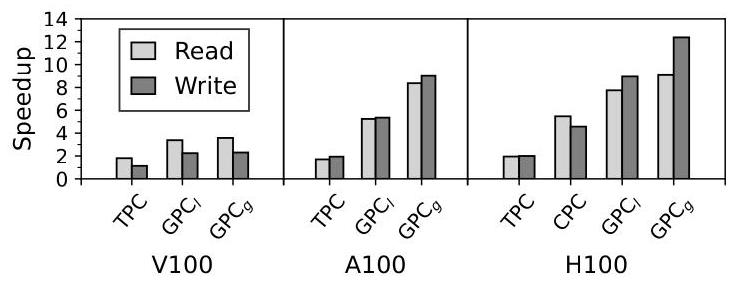

Fig. 10: Interconnect input speedup comparison across different GPU architecture.

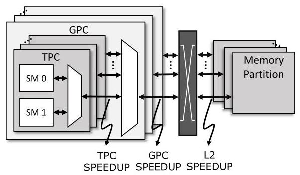

Fig. 11: Block diagram that illustrates the various interconnect speedup that are provided within the GPU NoC.

Observation #8: While latency to different L2 slices is non-uniform, the bandwidth to the different L2 slices is (mostly) uniform.

In this work, input speedup is defined as the excess bandwidth that is provided into the GPU interconnect [5]. GPUs are organized hierarchically and input speedup is necessary to minimize potential performance bottlenecks from the hierarchical bandwidth sharing. In the GPUs that we evaluate, two SMs are clustered together in a TPC and TPC speedup (Figure 11) is effectively the bandwidth ratio of the TPC output to the SM output. With a 2-to-1 sharing, TPC speedup of 1 means only 50% of the bandwidth can be provided across both SMs. TPC speedup value of 2 results in "full" bandwidth from the two SMs into the NoC, towards the destination L2 slices. Speedup was measured as the bandwidth (performance) ratio of \( x \) SMs compared to one SM, with the SMs sending traffic to all L2 slices. For TPC speedup, \( x = 2 \) while for \( {\mathrm{{GPC}}}_{l}, x \) is the number of TPCs and for \( {\mathrm{{GPC}}}_{g}, x \) is the number of TPCs multiplied by the number of SMs per TPC. 6

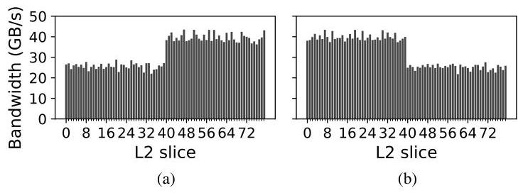

Fig. 12: L2 slice bandwidth for (a) SM0 and (b) SM2 on A100 where SM0 and SM2 are located on different GPU partitions.

The speedup across the different GPUs are shown in Figure 10 for Reads and Writes. For Reads, the bandwidth required from the SM (i.e., small request messages) is lower than the bandwidth to the SM (i.e., large reply message with cache line data) while the opposite is true for Writes. For TPC speedup, full bandwidth is provided for Reads across all GPUs (i.e., TPC speedup of 2); however, for Writes, a speedup of only \( {1.09} \times \) is achieved on the V100. For A100 and H100, full bandwidth is also achieved for the TPC Writes. For \( {\mathrm{{GPC}}}_{l} \) , achieving full bandwidth requires a speedup of 7, 8, and 9 for the V100, A100, and H100, respectively. V100 reaches about 50% of this speedup while the H100 approaches 85%, with a speedup close to 8. The evaluations show that input bandwidth speedup is provided to minimize any performance impact from the hierarchical organization and recent GPUs have more on-chip bandwidth or input speedup. In particular, \( {\mathrm{{GPC}}}_{g} \) provides additional speedup compared to \( {\mathrm{{GPC}}}_{l} \) , especially for A100 and H100. For H100, CPC speedup is also shown and results show that the added hierarchy does not have any impact on Read accesses but when all SMs within the CPC are utilized for Writes, there is a slight performance degradation as only a speedup of approximately 4.6 is provided (compared to a speedup of 6 needed for full bandwidth).

Observation #9: Although GPUs are organized hierarchically, input speedup exists to provide higher bandwidth in to the on-chip interconnect.

## B. Non-Uniform Bandwidth with GPU Partitions

In recent GPUs with multiple GPU partitions (i.e., A100, H100), additional non-uniform latency was introduced when crossing the partition (Observation 6) but in this section, we show how bandwidth non-uniformity occurs when accessing L2 slice in a different partition. An example of L2 bandwidth non-uniformity for A100 is shown in Figure 12. SM0 is located on the same partition as L2 slices 0-39 while SM2 is located on the same partition as L2 slices 40-79. For the "near" partition, higher bandwidth (approximately 39.5 GB/s) can be achieved but for L2 accesses to "far" partitions, the bandwidth drops to approximately 26 GB/s. For SM2 which is located on the other partition, similar L2 bandwidth can be achieved but "near" and "far" L2 slices are swapped.

---

\( {}^{6}{\mathrm{{GPC}}}_{l} \) is local GPC speedup between the TPC and GPC hierarchy while \( {\mathrm{{GPC}}}_{g} \) is global speedup when all SMs within the GPC are sending traffic.

---

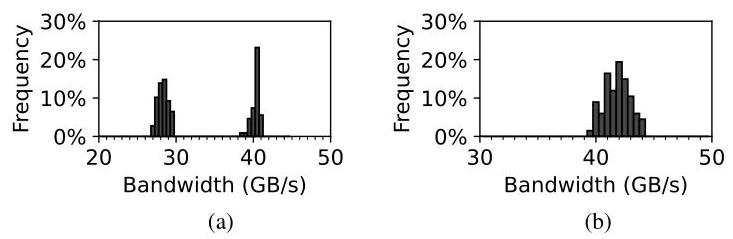

Fig. 13: L2 bandwidth distribution to a single L2 slice in (a) A100 and (b) H100 GPUs.

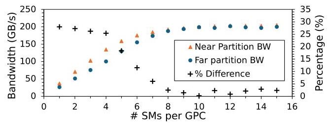

Fig. 14: Single L2 slice bandwidth on A100 as the number of SMs sending traffic is increased.

Figure 13(a) shows the bandwidth distribution for a single L2 slice when accessed by each SMs in A100. Similar results of bimodal distribution are shown for other L2 slices - the higher value peak occurring for SMs in the same partition as the L2 slice and the smaller value peak occurring for the remote partition SMs. Figure 13(b) shows the L2 bandwidth distribution for the H100, which exhibits a single peak due to the localized L2 cache [12]. Compared to the V100, both A100 and H100 have higher per-L2 slice bandwidth but also higher variation.

To understand the lower bandwidth when accessing remote partition L2 in A100, Figure 14 shows how L2 slice bandwidth increases as more SMs send traffic to the same L2 slice. At approximately 8 SMs, the bandwidth saturates regardless of whether the L2 is on the near partition or the far partition. However, for smaller number of SMs, the bandwidth that can be achieved is lower for far partition - i.e., for one or two SMs, the amount of bandwidth that can be achieved for far partition is up to \( {28}\% \) lower. Since the latency to the far partition L2 slice is higher, the longer latency results in lower bandwidth according to Littel's Law until sufficient SMs are used to saturate the bandwidth.

Observation #10: Recent GPUs (e.g., A100, H100) have more on-chip bandwidth (and more speedup) compared to previous GPUs; however, it also results in nonuniform bandwidth.

Since there are multiple L2 slices within a single memory partition (MP), the bandwidth into the MP can become the bottleneck, and L2 input speedup (Figure 11) from the output of the NoC is needed. To evaluate L2 input speedup, we vary the number of L2 slices (and their allocation across the MPs) and evaluate a kernel where all SMs are sending traffic. Contiguous MP has the L2 slices used within the same MP while Distributed MP has the L2 slices spread out across different MPs - thus, for contiguous MP, the number of MP accessed does not change but for distributed MP, the number of MPs increase from 1 to 4. Results show that there is minimal difference in bandwidth (performance) between the two approaches on V100 (Figure 15(a)) - suggesting near ideal L2 input speedup to minimize the impact from L2 slices sharing NoC output bandwidth.

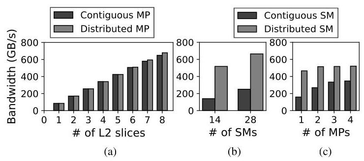

Fig. 15: L2 bandwidth on V100 with (a) all SMs accessing different num. of L2 slices, (b) different num. of SMs accessing one MP, and (c) 14 SMs accessing varied num. of MPs.

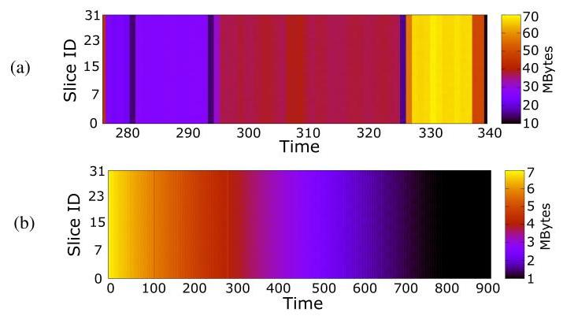

Fig. 16: Memory access pattern for (a) BFS and (b) Gaussian workloads measured on the NVIDIA V100 GPU.

In comparison, varying the SM location while sending traffic to one MP results in significant performance degradation (Figure 15(b)). Contiguous SM places all SMs in 1 GPC (for 14 SMs) or 2 GPCs (for 28 SMs) and compared to distributed SM where the SMs are distributed across 6 GPCs, there is significant performance degradation - approximately 62% when 28 SMs are accessing a single MP - caused by the limited GPC speedup. To further understand the impact of GPC speedup, 14 SMs were used and their traffic were distributed across different numbers of MPs. With distributed SM, the impact on performance was relatively small; however, with contiguous SM, as the number of MP destinations increased from 1 to 4, performance increased by 218% - thus, demonstrating that some of the GPC speedup is provided in space (i.e., additional connectivity) and not entirely in time (i.e., more bandwidth).

Observation #11: Load-balancing kernels across the SMs is more critical than load-balancing L2 slices because of the asymmetric NoC speedup.

## C. On-Chip Traffic

On-chip traffic in GPU is determined by the memory traffic (or L2 traffic) and in particular, the memory address. If a memory access pattern results in one memory channel being over-utilized, the overall memory throughput (and system performance) can degrade - a behavior referred to as memory camping [41]. To prevent memory camping, modern GPUs employ complex address hashing to ensure access across all L2 slices is load-balanced [42]. To understand the effect of hashing, memory access patterns for two workloads (bfs, gaussian) from the Rodinia benchmark suite [43] are shown in Figure 16 for the V100 GPU as a function of time and the varying intensities indicate the amount of traffic destined for each L2 slice. Although the amount of memory accesses changes over time, the distribution of traffic across the channels remains relatively consistent. Thus, load-balancing of on-chip traffic from the NoC is not critical but uniform bandwidth needs to be provided to each destination to support address hashing.

Observation #12: Since memory traffic is load-balanced across the memory channels, the NoC traffic is also load-balanced.

### V.GPU TIMING SIDE-CHANNEL IMPLICATIONS

This section explores how NoC characteristics impact GPU timing side-channel attacks and how non-uniform latency can be leveraged to enable timing side-channel attacks and be used as a defense mechanism against timing side-channel attacks.

### A.GPU Co-Location Placement

In highly parallel GPU architectures, side-channel (or covert-channel) attacks often require careful co-location of kernels on the cores (or SMs) to exploit the GPU's parallelism. However, given the increasing threat of side-channel attacks in modern GPUs, GPU vendors are limiting availability of some performance counters that are exploited in side-channel attacks - e.g., in response to prior work [44], performance counter is no longer available without the root privilege [45]. In addition, information obtained from profilers are also limited - e.g., per-L2 slice performance counters are no longer available in recent NVIDIA GPUs [37] as only aggregate performance counter values are available. In this work, we argue how NoC latency characteristics can be exploited to determine core (SM) placement information and can be leveraged for the co-location placement of kernels. As stated earlier in Observation 3, the L2 cache access latency serves as a reliable proxy for estimating the distance between the SM and the L2 slice. Consequently, the Pearson correlation (Observation 4) can be exploited to reverse-engineer core placement within a GPU. This includes determining the SM's position within the GPC as well as the L2 slice's location within the memory partition. Thus, the latency characteristics can be leveraged when co-location is necessary for a GPU side-channel attack [46]-[48]. In addition, SM placement can establish a covert channel at the GPU NoC input but if a covert channel is desired at the output of the GPU NoC (or at the input of the L2), the L2 slice placement can potentially be exploited as well.

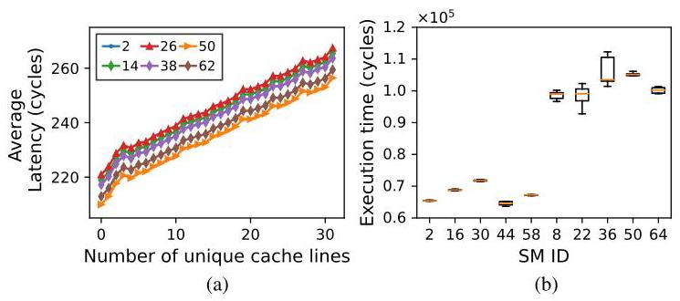

Fig. 17: (a) Average timing (latency) when the number of unique cache lines are varied and (b) average execution time of square kernel for A100 across different cores (SM).

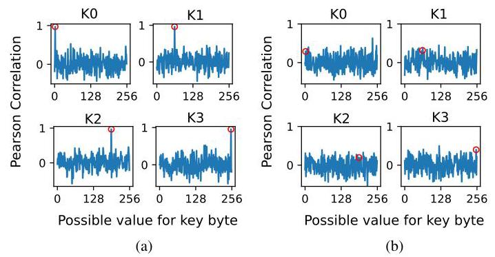

Fig. 18: AES key-recovery attack on GPU with (a) conventional (static) and (b) random thread block scheduling. The correct key value is circled in the plots and only 4 out of the 16 keys are shown for simplicity.

Implication #1: NoC characterization can be leveraged to obtain information about the core and/or L2 slice placement in GPUs for timing side-channel attacks.

## B. Attack: Non-uniform Latency

The correlation between performance or execution time and input-dependent microarchitecture features are commonly exploited in timing side-channel attacks in GPUs [6], [7] Timing is impacted by L2 latency and for a given source (or SM) and a given destination (or L2), the latency does not change but if the kernel is executed across different cores, the latency or timing will change. In this section, we explore the impact of NoC latency on two previously proposed timing side-channel attacks for GPUs - AES key recovery [6] and RSA side-channel attack [49] - and discuss the NoC's implications on both the attack and defense mechanism.

1) AES key recovery: Prior work [6] exploited the linear correlation between the number of unique cache line requests and execution time to recover AES key in GPUs. \( {}^{7} \) For a synthetic kernel using one warp (with 32 threads), depending on the amount of memory coalescing, the latency is linearly proportional to the number of unique cache lines accessed (Figure 17(a)). These results are consistent with prior work [6], [7] that have demonstrated similar linear relationships across different GPUs. However, this relationship holds only when the same SM (or core) is utilized. When different SMs are allocated while the destination (or the L2 slice) does not change, the linear relationship "shifts" as shown in Figure 17(a) for different SMs.

---

\( {}^{7} \) A detailed description of the side channel attack can be found in [6]. Due to space constraints, we only highlight the key differences caused by the non-uniform interconnect latency.

---

Since the threat model assumes that the attacker knows the linear relationship, the attacker will obtain the execution time of the AES kernel with the possible keys. However, unless the attacker knows the exact core location of the kernel, the range of unique cache lines can vary significantly. For example, if a latency of 240 cycles is observed, the number of unique cache lines can vary from 12 to 18. Thus, when the AES kernels are executed on different cores, the linear relationship for the particular core needs to be known; otherwise, the attacker cannot accurately infer the number of unique cache line requests using the timing and guess the key byte.

2) RSA key recovery: Prior work [49] demonstrated how the fraction of 1's in the RSA key can be inferred based on its linear relationship with execution time. During the decryption, RSA performs square () and reduction () for bit 0 , and additional multiply () and reduction () for bit 1 . Since each function requires a constant amount of computation, the execution time for processing a bit 1 is approximately twice as long as a bit 0 . Thus, an attacker can exploit the linear increase in the RSA program's execution time with the number of functions executed to infer the number of 1's.

However, based on the core (SM) that is executing the code, the kernel execution time can vary significantly because of the non-uniform latency to the memory partitions. An example of the square () kernel timing on the A100 across different SMs is shown in Figure 17(b). In this example, SM 2, 16, 30, 44, 58 are located on one partition and the other SMs are located on the other partition. The square kernel [50] utilizes two SMs and for illustration purposes, one SM is fixed while the other SM placement is varied. Based on the placement of the other SMs, the timing (latency) can vary significantly - i.e., when SMs are located on different GPU partitions, the added latency between the partition and the synchronization overhead results in longer execution time, by up to \( {1.7} \times \) . Even for SMs located within the same partition, the non-uniform latency introduces up to 12% difference in performance.

It remains to be seen if the non-uniform latency can be exploited for a different type of attack. For example, recent work [51] has leveraged distance in a multi-hop (2D mesh) network and higher latency to determine the L2 access pattern. The hop-count is not necessarily different in GPUs but the latency characteristics can potentially be exploited to enable new types of side-channel attacks.

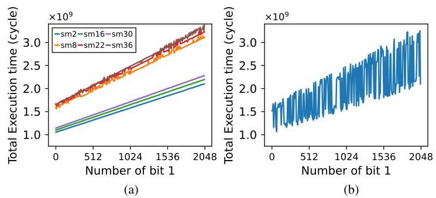

Fig. 19: RSA timing attack with (a) static and (b) random thread-block scheduling.

## C. Defense: Random Thread-block Scheduling

While prior side-channel attacks have been demonstrated on real GPU systems, they require collecting a lot of data samples but every time the workloads are executed, the assignment of cores (or SMs) is the same - i.e., the latency observed is the same since the same SMs are assigned - and the non-uniform latency is not observed. Thread block (or CTA) scheduling in GPUs, which is responsible for assigning the kernel to the cores, is effectively static scheduling. Thus, we propose dynamic scheduling using random assignment as the thread blocks are initially mapped to random SMs for each kernel execution to prevent side-channel attacks. Random thread-block scheduling is effectively a random seed scheduling as the assignment of the cores begins at a random core.

1) AES key recovery: The impact of random thread block scheduling for AES key recovery is shown in Figure 18 which shows the different possible key values on the \( x \) -axis and the Pearson correlation values. Pearson correlation is used to compare the distribution of the timing and number of unique cache line requests, and when the correct key byte is guessed, a high correlation value is obtained. With conventional static scheduling, Figure 18(a) shows how AES key can be recovered. \( {}^{8} \) However, with the proposed random thread block scheduling, the high Pearson correlation disappears (Figure 18(b)) as the random scheduling results in the nondeterministic execution time of AES based on the non-uniform latency to the L2 cache slices.

2) RSA key recovery: Impact of random thread block scheduling on RSA key recovery is shown in Figure 19. With static thread-block scheduling, a linear relationship exists between the number of ' 1's and the execution time; however, when the RSA code is executed across different SMs, the linear relationship shifts based on the core location. In comparison, when random thread-block scheduling is used, the linear relationship becomes very noisy as shown in Figure 19(b). The individual kernel within RSA timing varies based on placement and leads to significant variability in the overall execution time. Thus, if the attacker has a measured timing, the range of the amount of ' 1's can vary significantly - e.g., with an execution time of \( 2 \times  {10}^{9} \) cycles, the number of ’ 1's can vary between 416 and 1920.

---

Implication #2: Non-uniform L2 latency does not fundamentally change the timing side-channel attacks but differences in timing between cores can impact side-channel attack behavior.

\( {}^{8} \) Due to space constraints, only the first four out of the 16 keys are shown but the remain keys follow the same pattern.

---

Fig. 20: Communication pattern of many-to-few-to-many in throughput processors. (a) Bisection bandwidth \( \left( {B{W}_{{NoC} - {B}_{c}}}\right) \) and (b) memory bandwidth \( \left( {B{W}_{MEM}}\right) \) and the interface bandwidth \( \left( {B{W}_{{NoC} - {MEM}}}\right) \) are highlighted.

Implication #3: Random thread block scheduling can exploit the non-uniform latency to reduce the impact timing side-channel attacks in GPUs.

Randomization is commonly used to prevent collection of useful timing measurements in side-channel attacks [52]-[54]. However, randomization is often added to the hardware (e.g., randomize coalescing logic [52]) which introduces some complexity and potentially degrades performance. In comparison, our random thread-block scheduling is effectively a random seed scheduling that does not introduce additional hardware complexity. While random thread block scheduling can reduce the impact of previously proposed timing side-channel attacks, it remains to be seen if the proposed solution is fully secure against various timing side-channel attacks.

### VI.GPU NOC ARCHITECTURE IMPLICATIONS

In this section, we explore the implications of the NoC analysis on the GPU NoC itself. More importantly, we revisit the GPU NoC bottleneck identified in prior GPU NoC [28] and we show how the previously assumed NoC bottleneck does not properly model the impact of NoC bandwidth on overall memory and L2 bandwidth.

## A. Bandwidth Bottleneck in NoC

The network-on-chip (NoC) in GPUs consists of a request network and a reply network (Figure 20(a)) with many-to-few-to-many traffic pattern [28] - with the few memory controllers becoming the performance bottleneck compared to the many cores. Since memory access for high-throughput workloads is often Read operation with small, read request size but larger reply data size, the reply bandwidth (BW \( {}_{\text{ noc-mem }} \) in Figure 20(b)) was identified as a NoC bottleneck for throughput processors [28], [30], [31], [33]. When congestion builds up at the NoC-MEM interface of the reply network, congestion backpressure impacts not only the memory bandwidth utilization and the request network. However, we revisit the reply bandwidth bottleneck and evaluate its impact on memory bandwidth utilization. Using a similar configuration as prior work [28], Figure 21(a) plots the memory utilization of a single memory channel over time when executing a memory-intensive synthetic kernel. The memory bandwidth reaches maximum bandwidth but the bandwidth cannot be sustained as the average memory bandwidth utilization is significantly lower - approximately 20% utilization - as the reply bandwidth interface congestion blocks the memory system and backpressure towards the request NoC. However, evaluations on real GPUs, as shown earlier in Figure 9(a), provide high bandwidth utilization across different GPUs, exceeding 85% utilization. Thus, the simulator NoC modeling is not necessarily representative of real GPU systems

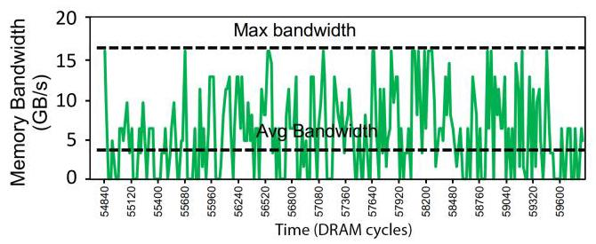

Fig. 21: Memory channel utilization fluctuation from back-pressure from the reply bandwidth bottleneck in a simulation-based evaluation.

In addition to the memory bandwidth, the L2 fabric bandwidth or the on-chip bandwidth provided to the L2 is affected by the NoC bandwidth. As shown earlier in Figure 9, L2 bandwidth exceeds overall memory bandwidth in recent GPUs; however, simulations using the same configuration also show that L2 bandwidth is lower than the maximum memory bandwidth. \( {}^{9} \) As a result, NoC in GPUs needs to be designed (and modeled) such that it does not bottleneck both the memory and the L2 bandwidth.

Implication #4: NoC does not bottleneck memory (or L2) bandwidth in real GPUs but inaccurate assumptions of NoC can limit overall system bandwidth.

## B. Bandwidth Hierarchy

Baseline NoC of throughput processors in prior work [28] provided a balance between memory bandwidth and NoC bisection bandwidth to achieve cost-effective (or "throughput-effective") NoC. However, the bisection bandwidth \( \left( {B{W}_{{NoC} - {B}_{C}}}\right. \) in Figure 20(a)) only becomes an important metric if the nodes (i.e., compute nodes for the request network and memory nodes for the reply network) are injecting sufficient bandwidth to saturate the bisection bandwidth. With communication occurring from the cores to the memory nodes (and vice-versa), the terminal or interface bandwidth from the nodes (in particular, \( B{W}_{{NoC} - {MEM}} \) in Figure 20(b)) becomes the bottleneck. Insufficient interface bandwidth fundamentally limits the memory (and L2) bandwidth. Another approach to view the problem is using a bottleneck analysis [55] to identify that interface bandwidth can be the bottleneck. Since the cores, the NoC, and the memory system are connected in series,"the maximum throughput of \( K \) sub-systems in series is the minimum of the subsystem throughput" [56]. Thus, even if high memory bandwidth is provided, the system cannot sustain such high bandwidth if the aggregate terminal bandwidth \( \left( {B{W}_{{NoC} - {MEM}}}\right) \) becomes the bottleneck, even if sufficient bisection bandwidth is provided. In general, the on-chip bandwidth hierarchy [57] should reflect the hierarchical system organization with the memory bandwidth being the most costly yet the most limited resource, while the NoC bandwidth is the (relatively) lowest cost resource and should be provisioned such that it does not bottleneck the memory or the L2 bandwidth.

---

\( {}^{9} \) Note that this is not from the L2 cache modeling in the simulator but from modeling/assumption of the NoC.

---

Implication #5: On-chip bandwidth hierarchy needs to be considered for the NoC to ensure it does not bottleneck the overall system; in particular, the interface bandwidth needs to be properly provisioned in addition to the bisection bandwidth.

## C. Baseline NoC in GPUs

There have been many simulation-based architectural studies of GPUs, including NoC architectures, warp scheduling, and memory hierarchy. For such evaluations, the baseline NoC needs to be properly defined to ensure proper insights are drawn. In Figure 22, we collect data from several prior work [14], [15], [17], [28]-[32], [58], [59]. We plot the memory bandwidth \( \left( {B{W}_{MEM}}\right) \) vs. the NoC-MEM interface bandwidth used where interface bandwidth is defined as \( B{W}_{{NoC} - {MEM}} = {f}_{NoC} \times  w \times  C,\left( {{f}_{NoC} : }\right. \) NoC clock frequency, \( w \) : NoC channel width, \( C \) : number of MPs). For data points below the sloped line (i.e., \( B{W}_{{NoC} - {MEM}} < \; B{W}_{MEM} \) ), the NoC interface bandwidth is the bottleneck and can limit overall performance for memory intensive workloads and effectively create a "network wall." While different techniques to improve the NoC bandwidth can improve overall performance for such systems, the baseline NoC or the on-chip bandwidth becomes the system bottleneck and not the memory bandwidth. In comparison, when \( B{W}_{{NoC} - {MEM}} > B{W}_{MEM} \) , the memory bandwidth is the bottleneck and is more representative of modern GPU systems. As a result, simulations of GPU architecture should ensure that on-chip bandwidth does not bottleneck the more expensive, global memory bandwidth or create a "network wall" - otherwise, insights can lead to potentially overstating the benefits of NoC optimizations.

Throughput processors such as GPUs are bandwidth sensitive and uniform bandwidth should be provided across different destinations or memory partitions (Section IV-A). However, if a multi-hop such as a 2D mesh is assumed as the NoC topology, providing uniform bandwidth is a challenge as shown in Figure 23(a). \( {}^{10} \) Based on the physical location of the core nodes, some nodes will receive much higher throughput, by up to \( {2.4} \times \) . If globally fair arbitration such as age-based arbitration [61], [62] is used, then global fair bandwidth can be achieved (Figure 23(b)) on a 2D mesh topology but comes at the cost of additional complexity for the flow control. In addition, providing any necessary speed-up in the NoC is a challenge in a flat topology like 2D mesh. Recent work [34], [35] have leveraged a hierarchical crossbar as the baseline NoC topology that does not necessarily have the same limitations as a 2D mesh NoC. While hierarchical crossbar can provide more bandwidth, the NoC to memory (and L2) bandwidth needs to be carefully provisioned for GPU architectural explorations. A recent GPU simulator exploration (Accel-Sim [36]) discussed how the L2 bandwidth discrepancy can potentially explain some inaccuracy in their modeling of modern GPUs. Thus, the bandwidth hierarchy of the entire system and not just NoC bandwidth needs to be considered and properly modeled in simulations.

![Fig. 22: Comparison of memory bandwidth and NoC-Mem interface bandwidth modeled as different symbols represent different simulation-based prior work [14], [15], [17], [28]- [32], [58], [59].](images/fig22.jpg)

Fig. 22: Comparison of memory bandwidth and NoC-Mem interface bandwidth modeled as different symbols represent different simulation-based prior work [14], [15], [17], [28]- [32], [58], [59].

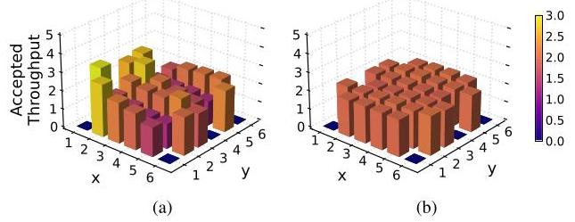

Fig. 23: Bandwidth unfairness that occurs in a multi-hop (2D mesh) topology architecture for (a) round-robin arbitration and (b) globally fair, age-based arbitration.

Implication #6: Multi-hop topologies (e.g., 2D mesh) present challenges in providing support for uniform bandwidth across the nodes, regardless of the placement, as well as difficulty in providing any speedup needed in the NoC.

## VII. CONCLUSION

This work provided a detailed analysis of modern GPU network-on-chip (NoC), in terms of its latency and bandwidth. In particular, non-uniform latency occurs based on the placement of the cores and the L2 slices while on-chip bandwidth is approximately uniform. However, the larger GPU with multiple "partitions" introduces additional non-uniformity in bandwidth and performance. Based on the characterization of the NoC, we introduce some implications including its impact on timing side-channel attacks of GPUs as well as NoC architecture designs.

---

\( {}^{10} \) Network-only simulation [60] was used with \( 6 \times  6 \) 2D mesh with random traffic from the 30 compute nodes to 6 memory controllers on the edges with dimension-ordered routing and round-robin arbitration. Nodes with zero throughput are the memory nodes.

---

## ACKNOWLEDGMENT

We would like to thank the anonymous reviewers for their insightful comments and Jo Sangheon for collecting NoC traffic distribution data. This work was supported in part by IITP-RS202300228255, NRF-2023R1A2C200422912, and IITP-RS202400402898.

## REFERENCES

[1] J. L. Hennessy and D. A. Patterson, "A new golden age for computer architecture," Communications of the ACM, vol. 62, no. 2, pp. 48-60, 2019.

[2] A. Vaswani, N. Shazeer, N. Parmar, J. Uszkoreit, L. Jones, A. N. Gomez, L. Kaiser, and I. Polosukhin, "Attention is all you need," in Proceedings of the 31st International Conference on Neural Information Processing Systems, 2017, p. 6000-6010.

[3] J. Devlin, M.-W. Chang, K. Lee, and K. Toutanova, "Bert: Pre-training of deep bidirectional transformers for language understanding," 2019.

[4] D. B. Kirk and W.-m. W. Hwu, Programming Massively Parallel Processors: A Hands-on Approach, 1st ed. San Francisco, CA, USA: Morgan Kaufmann Publishers Inc., 2010.

[5] W. Dally and B. Towles, Principles and Practices of Interconnection Networks. Morgan Kaufmann Publishers Inc., 2003.

[6] Z. H. Jiang, Y. Fei, and D. Kaeli, "A complete key recovery timing attack on a gpu," in 2016 IEEE International Symposium on High Performance Computer Architecture (HPCA), 2016, pp. 394-405.

[7] J. Ahn, C. Jin, J. Kim, M. Rhu, Y. Fei, D. Kaeli, and J. Kim, "Trident: A hybrid correlation-collision gpu cache timing attack for aes key recovery," in 2021 IEEE International Symposium on High-Performance Computer Architecture (HPCA), 2021, pp. 332-344.

[8] C. Luo, Y. Fei, and D. Kaeli, "Side-channel timing attack of rsa on a gpu," ACM Transactions on Architecture and Code Optimization (TACO), vol. 16, no. 3, pp. 1-18, 2019.

[9] Y. Wang, R. Paccagnella, Z. Gang, W. Vasquez, D. Kohlbrenner, H. Shacham, and C. Fletcher, "Gpu.zip: On the side-channel implications of hardware-based graphical data compression," in 2024 IEEE Symposium on Security and Privacy (SP), 2024, pp. 84-84.

[10] S. B. Dutta, H. Naghibijouybari, A. Gupta, N. Abu-Ghazaleh, A. Marquez, and K. Barker, "Spy in the gpu-box: Covert and side channel attacks on multi-gpu systems," in Proceedings of the 50th Annual International Symposium on Computer Architecture, 2023, pp. 1-13.

[11] Z. H. Jiang, Y. Fei, and D. Kaeli, "A novel side-channel timing attack on gpus," in Proceedings of the on Great Lakes Symposium on VLSI 2017, 2017, pp. 167-172.

[12] NVIDIA, "H100 Whitepaper," NVIDIA Corporation, Tech. Rep., 2022, https://resources.nvidia.com/en-us-tensor-core.

[13] CUDA C++ Programming Guide, NVIDIA, https://docs.nvidia.com/ cuda/cuda-c-programming-guide/index.html.

[14] T. G. Rogers, M. O'Connor, and T. M. Aamodt, "Cache-conscious wavefront scheduling," in Proceedings of the 2012 45th Annual IEEE/ACM International Symposium on Microarchitecture. IEEE Computer Society, 2012, pp. 72-83.

[15] A. Sethia, D. A. Jamshidi, and S. Mahlke, "Mascar: Speeding up gpu warps by reducing memory pitstops," in 2015 IEEE 21st International Symposium on High Performance Computer Architecture (HPCA), 2015, pp. 174-185.

[16] T. G. Rogers, M. O'Connor, and T. M. Aamodt, "Divergence-aware warp scheduling," in 2013 46th Annual IEEE/ACM International Symposium on Microarchitecture (MICRO), 2013, pp. 99-110.

[17] M. Lee, G. Kim, J. Kim, W. Seo, Y. Cho, and S. Ryu, "ipaws: Instruction-issue pattern-based adaptive warp scheduling for gpgpus," in High Performance Computer Architecture (HPCA), 2016 IEEE International Symposium on, 2016, pp. 370-381.

[18] S. Jain, I. Baek, S. Wang, and R. Rajkumar, "Fractional gpus: Software-based compute and memory bandwidth reservation for gpus," in 2019 IEEE Real-Time and Embedded Technology and Applications Symposium (RTAS), 2019, pp. 29-41.

[19] NVIDIA, "NVIDIA Pascal Architecture Whitepaper," NVIDIA Corporation, Tech. Rep., 2012, https://images.nvidia.com/content/pdf/tesla/ whitepaper/pascal-architecture-whitepaper.pdf.

[20] NVIDIA, "NVIDIA Tesla V100 GPU Architecture," NVIDIA Corporation, Tech. Rep., 2017, https://images.nvidia.com/content/volta-architecture/pdf/volta-architecture-whitepaper.pdf.

[21] NVIDIA, "NVIDIA Ampere Architecture Whitepaper," NVIDIA Corporation, Tech. Rep., 2020, https://images.nvidia.com/aem-dam/en-zz/ Solutions/data-center/nvidia-ampere-architecture-whitepaper.pdf.

[22] Z. Jia, M. Maggioni, B. Staiger, and D. P. Scarpazza, "Dissecting the nvidia volta gpu architecture via microbenchmarking," arXiv preprint arXiv:1804.06826, 2018.

[23] H. Abdelkhalik, Y. Arafa, N. Santhi, and A.-H. Badawy, "Demystifying the nvidia ampere architecture through microbenchmarking and instruction-level analysis," 2022. [Online]. Available: https://arxiv.org/ abs/2208.11174

[24] S. Dublish, V. Nagarajan, and N. Topham, "Evaluating and mitigating bandwidth bottlenecks across the memory hierarchy in gpus," in 2017 IEEE International Symposium on Performance Analysis of Systems and Software (ISPASS), 2017, pp. 239-248.

[25] A. Li, S. L. Song, J. Chen, X. Liu, N. Tallent, and K. Barker, "Tartan: Evaluating modern gpu interconnect via a multi-gpu benchmark suite," in 2018 IEEE International Symposium on Workload Characterization (IISWC), 2018, pp. 191-202.

[26] A. Li, S. L. Song, J. Chen, J. Li, X. Liu, N. R. Tallent, and K. J. Barker, "Evaluating modern gpu interconnect: Pcie, nvlink, nv-sli, nvswitch and gpudirect," IEEE Transactions on Parallel and Distributed Systems, vol. 31, no. 1, pp. 94-110, 2019.

[27] C. Lutz, S. Breß, S. Zeuch, T. Rabl, and V. Markl, "Pump up the volume: Processing large data on gpus with fast interconnects," in Proceedings of the 2020 ACM SIGMOD International Conference on Management of Data, 2020, pp. 1633-1649.

[28] A. Bakhoda, J. Kim, and T. M. Aamodt, "Throughput-effective on-chip networks for manycore accelerators," in 2010 43rd Annual IEEE/ACM International Symposium on Microarchitecture, 2010, pp. 421-432.

[29] X. Cheng, Y. Zhao, H. Zhao, and Y. Xie, "Packet pump: Overcoming network bottleneck in on-chip interconnects for gpgpus," in Proceedings of the 55th Annual Design Automation Conference, 2018, pp. 1-6.

[30] H. Jang, J. Kim, P. Gratz, K. H. Yum, and E. J. Kim, "Bandwidth-efficient on-chip interconnect designs for gpgpus," in Proceedings of the 52nd Annual Design Automation Conference, 2015, pp. 1-6.

[31] H. Kim, J. Kim, W. Seo, Y. Cho, and S. Ryu, "Providing cost-effective on-chip network bandwidth in gpgpus," in 2012 IEEE 30th International Conference on Computer Design (ICCD), 2012, pp. 407-412.

[32] X. Zhao, S. Ma, Y. Liu, L. Eeckhout, and Z. Wang, "A low-cost conflict-free noc for gpgpus," in Proceedings of the 53rd Annual Design Automation Conference, 2016, pp. 1-6.

[33] K. H. Kim, R. Boyapati, J. Huang, Y. Jin, K. H. Yum, and E. J. Kim, "Packet coalescing exploiting data redundancy in gpgpu architectures," in Proceedings of the International Conference on Supercomputing, 2017, pp. 1-10.

[34] X. Zhao, M. Jahre, Y. Tang, G. Zhang, and L. Eeckhout, "Nuba: Nonuniform bandwidth gpus," in Proceedings of the 28th ACM International Conference on Architectural Support for Programming Languages and Operating Systems, Volume 2, 2023, pp. 544-559.

[35] X. Zhao, A. Adileh, Z. Yu, Z. Wang, A. Jaleel, and L. Eeckhout, "Adaptive memory-side last-level gpu caching," in Proceedings of the 46th international symposium on computer architecture, 2019, pp. 411- 423.

[36] M. Khairy, Z. Shen, T. M. Aamodt, and T. G. Rogers, "Accel-sim: An extensible simulation framework for validated gpu modeling," in 2020 ACM/IEEE 47th Annual International Symposium on Computer Architecture (ISCA), 2020, pp. 473-486.

[37] NVIDIA, "Profiler User's Guide," NVIDIA Corporation, Tech. Rep., 2024, https://docs.nvidia.com/cuda/profiler-users-guide/index.html#nvprof.

[38] Techpowerup, "NVIDIA GV100 GPU specs," https://www.techpowerup.com/gpu-specs/nvidia-gv100.g809.

[39] K. Pearson, "Notes on regression and inheritance in the case of two parents proceedings of the royal society of london, vol. 58," 1895.

[40] Locuza, "Nvidia's Ada lineup, configurations, estimated die sizes and a comparison with other chips," 2022, https://locuza.substack.com/p/nvidias-ada-lineup-configurations?utm_ source=%2Fsearch%2FCPC&utm_medium=reader2.

[41] A. M. Aji, M. Daga, and W.-c. Feng, "Bounding the effect of partition camping in gpu kernels," in Proceedings of the 8th ACM International Conference on Computing Frontiers, 2011, pp. 1-10.

[42] Z. Zhang, T. Allen, F. Yao, X. Gao, and R. Ge, "Tunnels for bootlegging: Fully reverse-engineering gpu tlbs for challenging isolation guarantees of nvidia mig," in Proceedings of the 2023 ACM SIGSAC Conference on Computer and Communications Security, ser. CCS '23. New York, NY, USA: Association for Computing Machinery, 2023, p. 960-974. [Online]. Available: https://doi.org/10.1145/3576915.3616672

[43] S. Che, M. Boyer, J. Meng, D. Tarjan, J. W. Sheaffer, S.-H. Lee, and K. Skadron, "Rodinia: A benchmark suite for heterogeneous computing," in 2009 IEEE International Symposium on Workload Characterization (IISWC), 2009, pp. 44-54.

[44] H. Naghibijouybari, A. Neupane, Z. Qian, and N. Abu-Ghazaleh, "Rendered insecure: Gpu side channel attacks are practical," in Proceedings of the 2018 ACM SIGSAC conference on computer and communications security, 2018, pp. 2139-2153.

[45] NVIDIA, "NVIDIA Response to "Rendered Insecure: GPU Side Channel Attacks are Practical"," NVIDIA Corporation, Tech. Rep., 2018, https://nvidia.custhelp.com/app/answers/detail/a_id/4738/~/security-notice%3A-nvidia-response-to-.

[46] H. Naghibijouybari, K. N. Khasawneh, and N. Abu-Ghazaleh, "Constructing and characterizing covert channels on gpgpus," in 2017 50th Annual IEEE/ACM International Symposium on Microarchitecture (MICRO), 2017.

[47] J. Ahn, J. Kim, H. Kasan, L. Delshadtehrani, W. Song, A. Joshi, and J. Kim, "Network-on-chip microarchitecture-based covert channel in gpus," in MICRO-54: 54th Annual IEEE/ACM International Symposium on Microarchitecture, 2021, pp. 565-577.

[48] J. Wei, Y. Zhang, Z. Zhou, Z. Li, and M. A. Al Faruque, "Leaky dnn: Stealing deep-learning model secret with gpu context-switching side-channel," in 2020 50th Annual IEEE/IFIP International Conference on Dependable Systems and Networks (DSN), 2020, pp. 125-137.

[49] Y. Wang and G. E. Suh, "Efficient timing channel protection for on-chip networks," in 2012 IEEE/ACM Sixth International Symposium on Networks-on-Chip, 2012, pp. 142-151.

[50] NVIDIA, "CUDA Code Samples," 2024, https://developer.nvidia.com/ cuda-code-samples.

[51] F. Mahmud, S. Kim, H. S. Chawla, E. J. Kim, C.-C. Tsai, and A. Muza-hid, "Attack of the knights: Non uniform cache side channel attack," in Proceedings of the 39th Annual Computer Security Applications Conference, 2023, pp. 691-703.

[52] G. Kadam, D. Zhang, and A. Jog, "Bcoal: Bucketing-based memory coalescing for efficient and secure gpus," in 2020 IEEE International Symposium on High Performance Computer Architecture (HPCA), 2020, pp. 570-581.

[53] E. Karimi, Y. Fei, and D. Kaeli, "Hardware/software obfuscation against timing side-channel attack on a gpu," in 2020 IEEE International Symposium on Hardware Oriented Security and Trust (HOST), 2020, pp. 122-131.

[54] G. Kadam, D. Zhang, and A. Jog, "Rcoal: Mitigating gpu timing attack via subwarp-based randomized coalescing techniques," in 2018 IEEE International Symposium on High Performance Computer Architecture (HPCA), 2018, pp. 156-167.

[55] E. D. Lazowska, J. Zahorjan, G. S. Graham, and K. C. Sevcik, Quantitative system performance: computer system analysis using queueing network models. Prentice-Hall, Inc., 1984.

[56] M. D. Hill, "Three other models of computer system performance," arXiv preprint arXiv:1901.02926, 2019.

[57] J. Kim, S. Cho, M. Rhu, A. Bakhoda, T. M. Aamodt, and J. Kim, "Bandwidth bottleneck in network-on-chip for high-throughput processors," in Proceedings of the ACM International Conference on Parallel Architectures and Compilation Techniques, 2020, pp. 157-158.

[58] J. Kloosterman, J. Beaumont, M. Wollman, A. Sethia, R. Dreslinski, T. Mudge, and S. Mahlke, "Warppool: Sharing requests with inter-warp coalescing for throughput processors," in 2015 48th Annual IEEE/ACM International Symposium on Microarchitecture (MICRO), Dec 2015, pp. 433-444.

[59] X. Chen, L.-W. Chang, C. I. Rodrigues, J. Lv, Z. Wang, and W.-M. Hwu, "Adaptive cache management for energy-efficient gpu computing," in 2014 47th Annual IEEE/ACM International Symposium on Microarchitecture, 2014, pp. 343-355.

[60] N. Jiang, D. U. Becker, G. Michelogiannakis, J. Balfour, B. Towles, D. E. Shaw, J. Kim, and W. J. Dally, "A detailed and flexible cycle-accurate network-on-chip simulator," in 2013 IEEE international symposium on performance analysis of systems and software (ISPASS), 2013, pp. 86- 96.

[61] M. M. Lee, J. Kim, D. Abts, M. Marty, and J. W. Lee, "Probabilistic distance-based arbitration: Providing equality of service for many-core cmps," in 2010 43rd Annual IEEE/ACM International Symposium on Microarchitecture, 2010, pp. 509-519.

[62] D. Abts and D. Weisser, "Age-based packet arbitration in large-radix k-ary n-cubes," in Proceedings of the 2007 ACM/IEEE Conference on Supercomputing, 2007, pp. 1-11.