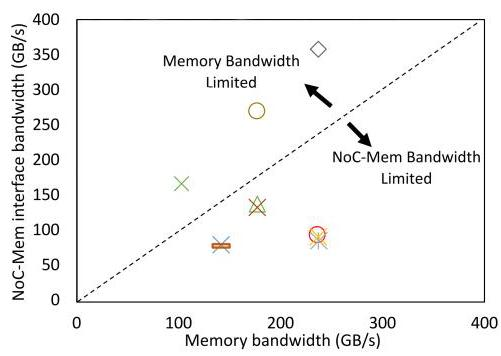

# Uncovering Real GPU NoC Characteristics: Implications on Interconnect Architecture 深度解读

> **作者**：Zhixian Jin、Christopher Rocca、Jiho Kim、Hans Kasan、Minsoo Rhu、Ali Bakhoda、Tor M. Aamodt、John Kim  
> **会议 / 年份**：MICRO 2024（年份与会议按输入文件名标识；导出正文未保留出版信息栏）  
> **一句话总结**：通过 V100、A100、H100 实机微基准，论文揭示 GPU 片上互连“延迟随位置变化、带宽通常较均匀”的特征及分区例外，并据此重新审视时序侧信道和 GPU 模拟器的带宽配置。

原文全文见 [original.md](original.md)，逐段双语版本见 [translated.md](translated.md)。下文的章节、图表编号均对应原论文；“本文评述”用于区分分析判断与作者的测量结论。

## 一、问题定义

### 背景与关键假设

GPU 的 Streaming Multiprocessor（SM）负责执行线程，SM 内有私有 L1 cache 和 shared memory；多个 SM 共享分布在芯片上的 L2 cache。L2 又被切成多个 slice，若干 slice 和一个 memory controller 构成 memory partition（MP）。SM 与这些 MP 之间由 network-on-chip（NoC）传输请求及返回数据。因此，即使两次访问都命中 L2，它们也可能经过不同的物理路径。

计算侧本身也有层次：两个 SM 组成 TPC，多个 TPC 组成 GPC，再由多个 GPC 构成 GPU。A100、H100 还存在左右两个较大的 GPU “partition”。这里的左右 partition 是论文讨论的芯片内部组织，**不同于 MP，也不应直接等同于 MIG 实例**。论文并未完整逆向互连拓扑；“像分层 crossbar”是背景判断，不是本研究证明了全部路由器和连线。

读请求通常很小，返回的 cache line 却大得多，因此 GPU NoC 的 reply network 容易成为关注焦点。已有模拟研究常以 2D mesh、固定通道宽度等假设建立基线，再优化回复网络。但如果基线给的片上带宽本来就低于真实 GPU，那么测出的收益可能主要来自修复人为制造的瓶颈。

### 本文究竟解决什么

本文是以真实硬件刻画补足既有研究的工作，不是第一次提出 GPU NoC，也不是提出一种全新的完整互连。它要回答三件相互关联的事：真实 GPU 的 SM–L2 延迟与吞吐是否均匀；扩大芯片和引入内部 partition 后，这些规律如何变化；这些实测规律如何改变安全分析与架构模拟的前提。

图 1 的关键不是某个柱子的绝对数值，而是“一个平均值不够”。正文给出的 V100 访问延迟范围约为 175–248 cycles，平均约 212 cycles；不同 GPC 的平均值接近，却可能有明显不同的离散程度。这里测到的是 **SM 发出访问到收到数据的往返 L2 访问延迟**，包含 SM、NoC、L2 的组成部分，不能将 212 cycles 直接写成纯 NoC 路由延迟。

**动机评估**：动机有实测支持。三代 GPU 的延迟矩阵、带宽分布和分区对照，使问题不是只存在于人为流量中的猜想；真实 GPU 达到约 85%–90% 的峰值片外带宽，而某些既有配置的模拟只有约 20% 平均利用率，更直接说明基线校准的重要性。但“真实 GPU 的 NoC 不构成瓶颈”需要限定在论文考察的配置与流量下，不能推广成任何访问热点、任何并发数或任何应用都不会受 NoC 限制。

**核心 Insight**：延迟和吞吐不是同一件事。距离远会增加一次访问的时间，却不必降低管线充分填满后的吞吐；层次共享也不必意味着带宽被简单等分，因为实现可以提供额外 input speedup。只有把物理位置、并发请求数、缓存策略和接口带宽分开考察，才能理解看似矛盾的测量结果。

## 二、相关工作

论文 II-B 的研究脉络主要按研究对象和方法组织，后续 V、VI 节再补充安全与模拟器背景。

| 路线 | 主要思路与代表文献 | 本文指出的缺口 |
|---|---|---|
| GPU 微架构 / 内存层次逆向 | V100 [22]、A100 [23] 的微基准及内存带宽分析 [24]，识别各组件参数 | 对片上源—目的组合、布局与层次共享缺少细粒度刻画 |
| 多 GPU 互连分析 | [25]–[27] 研究 GPU 间通信和外部互连 | 不能替代单颗 GPU 内 SM–L2 路径的测量 |
| GPU NoC 优化 | [28] 以 many-to-few-to-many 流量识别回复网络问题，[29]–[32] 改进互连，[33] 合并流量 | 常依赖多跳拓扑和模拟参数，可能预先制造片上带宽瓶颈 |
| 分层 crossbar 与模拟校准 | [34]、[35] 使用分层 crossbar；Accel-Sim [36] 关注 L2 带宽建模偏差 | 拓扑名称正确仍不保证 SM、NoC、L2、内存之间的接口配比正确 |
| GPU 时序侧信道与随机化 | AES [6]、[7]，RSA 相关工作，及 coalescing 随机化 [52]–[54] | 同一输入特征与执行时间的关系还依赖 kernel 被放在哪些 SM 上 |

这些工作的共同缺口是：抽象模型通常把位置差异、终端接口或层次共享压缩掉，而本文把它们重新变成可测量的变量。作者并非否定 NoC 优化，而是要求先验证优化所针对的瓶颈确实对应真实硬件。

## 三、技术挑战

1. **从端到端访问时间中辨认互连影响。** 直接读一次内存同时涉及指令执行、缓存命中、排队和网络传输，必须控制 L1 bypass、L2 预热及并发，才能主要比较路径差异；即便如此，测量仍不是纯 NoC 延迟探针。
2. **控制请求从哪来、到哪去。** CUDA 程序通常不显式控制 L2 slice；SM ID 也不是物理坐标。需要读取 `smid`、筛选执行位置，并构造地址到 slice 的映射；A100/H100 缺少原来可用的细粒度计数器，使定位更依赖争用实验和推断。
3. **区分供给不足与链路容量不足。** 单个 SM 测得的低带宽，可能来自长延迟下在途请求不够，而不是远端链路更窄；必须增加 SM 数目观察饱和点，而不能只测一条吞吐曲线。
4. **理解多个共享层次的非对称性。** SM→TPC→GPC 与 NoC→MP→slice 两侧的扩带宽方式不同，读写数据方向也不同，不能用一个统一的“每级共享系数”描述。
5. **把测量结论转化成有边界的架构启示。** 位置相关时间能帮助或干扰侧信道，却不自动证明安全；真实 GPU 支持高片外利用率，也不自动给出最优拓扑、面积或能耗配置。

## 四、解决方案

### 整体思路

论文先建立受控的 SM–L2 延迟与吞吐测量，再用关联关系解释物理组织，最后将结果用于两类问题：时序攻击中的位置混淆，以及架构模拟中的错误带宽瓶颈。它的主要产物是经验规律与建模约束，而非一个替换现有 GPU NoC 的完整硬件设计。

### 贯穿示例：两个工作区向共享仓库取件

把 SM 想成工作台，L2 slice 想成已经备好货物的仓位；TPC、GPC 是逐级汇集工作台的通道，MP 是包含多个仓位的仓库入口，GPU 两个 partition 是工作场所的左右两个区域。取一件货来回要多久对应延迟，每秒能持续搬多少货对应带宽。这只是解释用的例子，数值判断仍依据原文实验。

**第一步，确保真的在测路程。** 先把货放入指定仓位（预热 L2），要求工作台不从身边的小抽屉取货（绕过 L1），一次只有一位搬运者行动（单 warp 的单线程发出请求）。逐个换工作台、逐个换仓位，记录时间。这对应 Algorithm 1：用 `clock()` 计时，用 `smid` 确认 SM，用地址映射表选择 slice。假定相同条件下 SM 和 L2 内部开销近似一致，组合间差异才主要归于 NoC。

V100 通过 `nvprof` 非聚合计数器辨认 slice；A100/H100 改用两个 kernel 的地址争用推测是否落在同一 slice。后者是测量假设，不是对每次请求目的地的直接硬件观测，也需要警惕其他共享资源造成的争用。

**第二步，比较“路线指纹”，而非给工作台编号赋予坐标。** 对每个 SM 收集到所有 slice 的延迟向量，计算不同 SM 向量的 Pearson correlation。同一 GPC 内的曲线高度相似，如图 3(a,b) 的相关系数约为 0.998；相距较远的示例约为 −0.365。结合 die photo，作者提出近似布局解释。

图 4 说明延迟既取决于 GPC 与 MP 的相对位置，也取决于各自内部 SM 与 slice 的位置。图 5 进一步给出这种内部位置变化的测量证据。因此不能只给每个 GPC 配一个固定平均延迟，就以为保留了全部空间差异。

V100 的块状高相关区域较清晰，H100 在单个 GPC 内出现更细的分组，提示 TPC 与 GPC 之间可能还有 CPC 层次。原文脚注明确说 **CPC 的存在并未得到官方确认**。作者又用 H100 distributed shared memory 的 SM-to-SM 访问辅助观察，图 7 中部分组合约为 196 cycles，另一些约为 213 cycles；这些数据支持“通信位置影响时间”，但不能独立还原所有内部连线。

**第三步，处理左右区域和就近缓存。** 对 A100，工作台向另一区域仓位取货多跨一次中央连接，往返 L2 命中延迟可接近 400 cycles，而同侧接近 V100 的约 212 cycles 量级。H100 则通过本地 L2 caching 使命中时间更接近，但数据首次从片外取回的代价随所在区域不同。

图 8 上排显示 A100 的明显分层，下排显示 H100 的 miss penalty 分层，说明“命中延迟更均匀”可能来自缓存放置策略，不能简单解释成物理网络没有远近。尤其 H100 中，同一个地址从不同 GPC 访问时可能由不同本地 slice 服务，图中横坐标不能被当成跨 GPC 严格相同的物理目的地。

**第四步，让足够多搬运者持续搬运，再判断通道有多宽。** Algorithm 2 启用所有 warp 线程及多个 thread block，并预先筛选同一 slice 的地址集合。实验逐步改变参与 SM 数、目的 slice 数和所属 MP，分别测单条关系与聚合吞吐。这回应了“供给不足还是容量不足”的挑战。

为理解这一点，可用 Little's Law 的直观形式：持续吞吐大致等于在途数据量除以往返延迟；在途请求数量有限时，路更远会降低测得吞吐，但增加搬运者后仍可能达到相同的饱和带宽。A100 的近远端实验正是这种情况，不能只由单 SM 带宽较低就断言跨区通道的最终容量较低。

在两个工作台共享一个出口的例子里，若出口只等于单台吞吐，两个工作台无法同时满速；若出口达到单台的两倍，就能保持合计满速。论文称这一额外供给为 input speedup：TPC 的理想比例是 2，而不是 kernel 执行时间加速两倍。GPC 与 L2 入口也有各自的比例，不能混为同一个数值。

**第五步，把位置差异用于安全分析。** 假设观察者根据取货时间推测取了多少种货物，固定工作台时会得到稳定关系，换了工作台后关系会平移。AES 例子中，240 cycles 可对应约 12–18 条不同 cache line；RSA 例子中，仅改变参与 SM 的位置，所测 square kernel 跨 partition 可出现最高约 1.7 倍的时间差，同 partition 内也可差约 12%。

作者据此提出每次 kernel 执行随机选择 thread block 分配起点，使观察者无法直接套用固定 SM 的时间模型。这一方案针对的是此前攻击对稳定位置的依赖；它没有移除数据相关访存，也没有证明攻击者无法重新分组、校准或累积更多样本。

**第六步，用真实搬运能力校准模拟器。** 即使主通道的二分带宽很大，仓库门口太窄也会限制整体吞吐。论文因此要求同时检查 NoC–MEM 接口，而非只检查 bisection bandwidth。其使用的聚合接口容量表达式为：

\[
BW_{\mathrm{NoC-MEM}}=f_{\mathrm{NoC}}\times w\times C,
\]

其中频率、每接口通道宽度、MP 数共同决定带宽，实际计算需统一 bit/byte 单位。接口低于内存带宽，便可能形成 network wall；但接口高于片外带宽也只是基本条件，因为 L2 命中流量的目标带宽更高，还要检查 L2 fabric 与源端层次的容量。

### 与已有方案的对比

相对只看平均 L2 延迟或只在模拟器中优化 reply network，本研究的优势是用真实硬件把平均值拆成位置矩阵、把吞吐拆成不同并发与层次，再讨论设计后果。其限制同样清楚：没有完整拓扑逆向，没有给出经面积、功耗、频率约束优化过的新 NoC，也没有证明随机调度对所有时序攻击安全。

## 五、实验评估

### 实验设定

| 项目 | V100 | A100 | H100 |
|---|---:|---:|---:|
| SM / TPC / GPC 数 | 80 / 40 / 6 | 108 / 54 / 7 | 132 / 66 / 8 |
| 每 GPC 最大 SM 数 | 14 | 16 | 18 |
| L2 容量 / slice 数 | 6 MB / 32 | 40 MB / 80 | 50 MB / 80 |
| 内存控制器数 | 8 | 10 | 10 |
| 标称内存带宽 | 0.9 TB/s | 2 TB/s | 3.35 TB/s |
| 表 I 的最大时钟 | 1.38 GHz | 1.41 GHz | 1.755 GHz |

这是原文表 I 的实验对象配置，不应外推到所有同名产品变体。论文以自编 synthetic microbenchmark 为主体，辅以 Rodinia 的 BFS/Gaussian 流量、AES/RSA 时序案例，以及网络模拟。延迟用硬件 `clock()`、L1 bypass 和预热 L2；吞吐采用多线程、多 block 和受控地址。主要指标包括 cycles、GB/s 或 TB/s、延迟向量相关性、input speedup、内存利用率及攻击时间相关性。

不存在一个贯穿所有实验的“新设计对 baseline”比较：不同实验分别对照位置、近远 partition、SM 数、源端/目的端分散方式、静态/随机调度和不同仲裁。图 23 明确使用 [60] 所述网络模拟器的 6×6 mesh，30 个 compute node、6 个边缘 memory node、dimension-ordered routing；VI-A 只说明采用类似 [28] 的配置，正文没有给出足够完整的全系统配置表，不能自行补写成某个已确认版本的完整 GPU 仿真平台。

### 主要实验与结论

**1. 延迟的空间差异真实存在，但平均值很容易掩盖它。** V100 整体平均约 212 cycles；图 2 的 GPC0 均值为 213、标准差 13.9 cycles，GPC2 均值为 209、标准差 7.5 cycles。两者平均差很小，分布宽度却差很多。A100 的跨 partition 增加更明显，H100 又呈现不同的缓存与层次特征。摘要“最高约 70%”是跨实例的概括，不能与 V100 图 1 中“相对平均约 33%”或 RSA kernel 的 1.7 倍直接混用。

**2. 片上 L2 fabric 必须服务比片外内存更高的吞吐。**

顺序访问时，实测片外带宽约达峰值的 85%–90%；L2 fabric 带宽约为片外实测带宽的 2.4–3.5 倍。V100 单 SM→单 slice 平均约 34 GB/s、标准差 0.147 GB/s；单 GPC→单 slice 约 85 GB/s、标准差 0.06 GB/s。这些很窄的分布支持“在所测范围内目的地吞吐近似均匀”。测到的是到 L2 的互连服务吞吐，不等于脱离互连后的 L2 SRAM 原生读写峰值。

**3. A100 的远端低带宽主要体现为不足并发下的差异。** 图 12 的单 SM 近端约 39.5 GB/s，远端约 26 GB/s；图 13 中 A100 出现双峰，H100 因本地缓存表现为单峰。

图 14 的关键对照是增加供给者数量：少量 SM 时远端可低约 28%，约 8 个 SM 后接近饱和，近远端最终吞吐趋近。这里“28%”属于该 SM 数扫描实验，不能强行由图 12 的两个近似数值算出。该结果支持并发量和往返时间解释，反对将所有“低带宽”直接归咎于更小物理链路容量。

**4. 源端分散比目的 slice 分散更敏感。**

图 15(a) 中，将多个 slice 放在同一 MP 或分散到不同 MP，带宽差别小，支持 L2 入口有接近充分的 speedup。图 15(b) 中，28 个 SM 集中在少数 GPC，而不是分布到六个 GPC，访问一个 MP 时性能可低约 62%。图 15(c) 中，14 个集中 SM 将目的 MP 数由 1 增到 4，性能提高约 218%；这也说明部分 speedup 依赖更多并行连接，而不只是同一连接提高传输速率。

**5. 随机调度破坏所测试攻击的稳定时间映射。**

静态调度下正确 key byte 的相关系数形成显著峰值，随机调度后所示四个字节的峰值不再清晰。图展示的是 16 个字节中的 4 个，作者称其余趋势相同；论文没有给出完整的攻击成功率随采样预算变化曲线。

随机调度后，相同时间可对应更宽的 key 中 1-bit 数量范围，作者给出约 2×10⁹ cycles 对应 416–1920 个 1 的例子。注意该 RSA 实验推断的是 1-bit 数量这一统计特征，而不能据此说已经恢复完整 RSA 私钥；图 19(b) 仍保留整体上升趋势，因此更合适的结论是时间推断受干扰，而非信息泄漏归零。

**6. 错误的终端接口带宽会放大模拟收益。** 图 21 中类似先前研究的配置出现严重 reply 反压，内存带宽虽短时到峰值，平均仅约 20%；这与真实 GPU 超过 85% 的结果形成差距。同一配置的 L2 fabric 也低于最大内存带宽，反常之处不只在片外利用率。

图 22 的虚线是两者相等，虚线下方的配置在终端处就可能限制内存吞吐。其价值是提供基线自查坐标，而不是证明图中每篇工作的所有结论都无效；具体影响仍取决于 workload 对带宽的需求及其基线目标。

### 结论支撑性与证据边界

对于“位置影响延迟”“V100 多数组合吞吐接近”“A100 少量 SM 远端吞吐较低但可被更多并发补足”这些局部命题，论文具有直接对照，证据较强。源端和目的端分散实验也有效定位了层次共享的不对称性。对模拟器而言，串联系统的吞吐受最小环节限制，这一逻辑与实测带宽层次相互支持。

范围更大的命题则需要谨慎。实验覆盖三代 NVIDIA GPU，但并未展示其他厂商、广泛真实应用、所有请求类型和复杂并发干扰；不少论据来自精心控制的 synthetic 流量。片上流量负载均衡只展示了两个 Rodinia 示例。原文没有完整交代每组实验的重复次数、置信区间、实际锁频/温控、软件版本和全部 kernel 实现，因此读者不能据此复现实验的每个周期值。

随机调度的安全结论尤其有限：没有面对可辨认 SM 位置、重新分类采样或自适应攻击的完整评估，也没有完整报告随机调度对应用性能和公平性的开销。作者本身承认尚不能确定其全面安全。CPC 和物理位置则是有数据支持的解释，不能升级为官方确认的硬件事实。

**原文一致性提示**：图 6 图注把两侧 GPC 写成 0–3 与 4–7，III-C 对图 8 的讨论却使用 1/2/6/7 与 0/3/4/5；表 I 又给 A100 为 7 个 GPC。本文不据此建立确定的 GPC ID→物理左右表，只保留近远分区的实测结论。此外，V-B 对 RSA 前序攻击使用 [49]，而参考文献 [49] 的题名是片上网络 timing channel protection，RSA GPU 攻击文献实际列在 [8]；这是原文引用对应关系疑点，不应替作者悄悄改号。

## 六、附加洞察

以下选择主线之外的次要结论，保留作者推理及其适用条件。

**结论 1：读带宽看起来充分，不代表同一层次的写带宽也充分。** 出处：IV-A、图 10。作者先区分小读请求/大读回复与写数据相反的方向，再分别测量层次 speedup：V100 TPC 读可达理想 2 倍，写仅约 1.09 倍；A100/H100 TPC 写改善，而 H100 CPC 写约为 4.6 倍，低于六个 SM 全速对应的 6 倍。由方向不同却共享相同层次的对照，得出应分别建模读写供给能力；未给出的内部实现不能仅靠这些数字还原。

图中读写柱子的差异提醒我们，单个“GPC 带宽”参数可能掩盖方向性瓶颈；越新一代也不意味着每一层、每个方向都达到理想线性扩展。

**结论 2：地址散列已经承担了一部分流量均衡工作，因此网络需要首先保证均匀的目的端服务能力。** 出处：IV-C、图 16。作者从 memory camping 问题出发，说明现代 GPU 用复杂地址散列分散访问；随后观察 BFS/Gaussian 中各时间段流量总量会变化，但各 slice 的分配相对均匀，进而认为这些情况下 NoC 无需再把均衡流量当成主要任务。这个归纳有明确样本限制：两种工作负载支持其示例，不能排除其他程序形成热点。

图中的明暗变化主要沿时间展开，同一时间的目的 slice 分布更接近；它支持的是散列后流量的规律，不是任何时刻所有路径都没有争用。

**结论 3：只限制性能计数器，仍可能留下推断布局的时序信息。** 出处：V-A、结合 III-B 的 Observation 4。作者先指出细粒度计数器受限或不再提供，再利用不依赖该类输出的延迟关联来辨认 SM 的相对分组，因而认为 co-location 所需信息仍可能从时间获得。这表明“禁止一种观测接口”不等于“消除该信息”；但论文未给出布局推断在各种噪声、权限和调度环境中的全面成功率，更未完成一个由此出发的新端到端攻击。

**结论 4：各路由器局部公平，不保证多跳网络对所有端点全局公平。** 出处：VI-C、图 23。相同 6×6 mesh 和流量模型下，round-robin 仲裁出现最高约 2.4 倍的节点吞吐差；改用全局 age-based 仲裁后分布更均匀，说明问题不只是总带宽不足，还涉及路径上连续竞争的分配方式。作者因此指出平面多跳拓扑要复现真实 GPU 的均匀吞吐和 speedup，可能需要额外控制复杂度；实验未给出该复杂度的面积/功耗量化。

零吞吐位置是 memory node，不是被饿死的 compute node；排除这些节点后，两个面板的差异才是仲裁公平性证据。

## 七、总结与个人评价

本文最大的贡献，是将“GPU L2 延迟”和“GPU NoC 带宽”从单一常数重新拆成位置、层次、并发和缓存策略共同决定的量。它用真实 GPU 数据提醒架构研究者：先保证模拟器能服务合理的片外与 L2 吞吐，再讨论网络优化，结论才更可信。

亮点是对照实验的解释力，尤其 A100 增加 SM 后近远带宽趋同，以及源端/目的端分散的不对称；不足是关键硬件组织仍有推断成分，复现配置交代有限，安全防御也停留在对特定时间模型的干扰。值得进一步研究的是将这些位置与带宽约束纳入可校准模拟器，并在自适应攻击与真实应用负载下同时衡量随机调度的安全收益和性能代价。

## 八、章节脉络与段落速览

下述 ¶ 按各节或小节内的自然论述段顺序编号；跨页插图、脚注打断的同一段合并，算法/公式并入引入它的段落，独立 Observation / Implication 归入其论证段，贡献列表合并为一条。小节标题按原文保留，排版空格作统一；图注不单独算自然段。

- **Abstract**：概述真实 GPU 的延迟、带宽规律及两类影响。
  - ¶1：以三代实测总结位置相关延迟、分区效应和安全/建模启示。
- **I. INTRODUCTION**：从 GPU 扩张引出真实 NoC 刻画的缺口。
  - ¶1：算力与存储带宽增长使片上互连成为关键组件，并用表 I 对照硬件规模。
  - ¶2：指出既有研究偏重模拟，提出实测延迟非均匀、带宽较均匀及 partition 例外。
  - ¶3：将真实 NoC 的规律连接到时序侧信道和架构探索。
  - 贡献列表：分别概括硬件刻画、安全影响及模拟带宽假设三项贡献。
- **II. BACKGROUND**：介绍层次结构、研究背景和测量方法。
  - **A. GPU Architecture**：定义 GPU 计算、缓存及互连的层次关系。
    - ¶1：从线程执行说明 SM、TPC、GPC、MP 与左右 partition 的组织。
  - **B. Related Work**：比较硬件分析、NoC 优化和层次互连研究。
    - ¶1：指出已有 GPU 及多 GPU 微基准缺少详细片上互连分析。
    - ¶2：梳理回复网络瓶颈及流量缩减路线，并质疑多跳模拟假设的代表性。
    - ¶3：说明分层 crossbar 研究也需要校准 NoC 与 L2 的带宽关系。
  - **C. Methodology**：用受控微基准分离延迟与带宽的影响因素。
    - ¶1：说明采用表 I 三款 GPU 和 synthetic kernel 隔离组件影响。
    - **1) Latency Measurement**：构建 SM–slice 往返延迟矩阵。
      - ¶1：以 Algorithm 1 说明单线程、L1 bypass、L2 预热及计时组成。
      - ¶2：说明如何确定源 SM、映射目的 slice，并交代跨代测量差异。
    - **2) Bandwidth Measurement**：用多线程多 block 饱和目标路径。
      - ¶1：以 Algorithm 2 说明定向地址集合、预热及多种聚合带宽测量。
- **III. ON-CHIP LATENCY ANALYSIS**：刻画位置与 GPU partition 对访问时间的影响。
  - ¶1：提出从物理位置和更大芯片组织解释延迟非均匀性。
  - **A. Non-uniform Latency**：区分平均延迟与完整分布。
    - ¶1：用图 1(a) 展示同一 SM 到不同 slice 的延迟差异。
    - ¶2：用图 1(b)、图 2 说明 GPC 平均接近但内部离散程度不同。
  - **B. Physical Placement and Latency**：用曲线相似性推断相对位置。
    - ¶1：将图 3 的 slice 按 MP 分组及排序，观察同 GPC 的一致趋势。
    - ¶2：结合图 4、图 5 的近似布局说明 SM 与 slice 内部位置的作用。
    - ¶3：定义 Pearson correlation 并比较同组与跨组 SM 的延迟向量。
    - ¶4：用图 6(a) 的相关性块状结构解释中心与边缘 GPC 分组。
  - **C. Impact of GPU Partitions**：比较更大 GPU 的层次与缓存策略。
    - ¶1：通过 A100/H100 相关性热图提出更细 CPC 分组的可能性。
    - ¶2：用 distributed shared memory 的远程访问观察 CPC 组合的时间差异。
    - ¶3：用图 8(a,b) 比较 V100 与 A100 的近远 partition 命中延迟。
    - ¶4：通过 H100 的命中与 miss penalty 解释本地缓存对观测结果的影响。
- **IV. NETWORK-ON-CHIP BANDWIDTH ANALYSIS**：从聚合吞吐扩展到层次共享与流量分布。
  - ¶1：明确考察对象是到 L2 的 fabric 带宽。
  - **A. Uniform On-Chip Bandwidth**：测量总带宽、目的地均匀性及输入 speedup。
    - ¶1：用图 9(a) 比较片上 L2 和片外内存实测带宽。
    - ¶2：用图 9(b,c) 展示 V100 单 SM、单 GPC 到 slice 的窄带宽分布。
    - ¶3：定义 TPC、局部 GPC、全局 GPC 的 input speedup 测量方式。
    - ¶4：用图 10 比较三代 GPU 读写方向及不同层次的 speedup。
  - **B. Non-Uniform Bandwidth with GPU Partitions**：区分分区延迟、请求并发与共享接口。
    - ¶1：用图 12 对照 A100 两侧 SM 的近远 slice 带宽。
    - ¶2：用图 13 比较 A100 双峰与 H100 本地缓存下的单峰。
    - ¶3：用图 14 的 SM 数扫描说明远端较长延迟可被更多并发补足。
    - ¶4：以同 MP/跨 MP 的 slice 分配判断 L2 入口 speedup 是否充分。
    - ¶5：以 SM 集中/分散和目的 MP 数变化说明源端共享及空间连接的限制。
  - **C. On-Chip Traffic**：把地址散列与片上流量均衡联系起来。
    - ¶1：用 BFS/Gaussian 的时空流量图说明目的端访问分布相对均衡。
- **V. GPU TIMING SIDE-CHANNEL IMPLICATIONS**：分析位置变化如何影响攻击与防御。
  - ¶1：提出利用 NoC 非均匀延迟研究时序侧信道。
  - **A. GPU Co-Location Placement**：说明时序观测可以辅助空间定位。
    - ¶1：从计数器受限转向用延迟相关性推测 SM/L2 布局及 co-location。
  - **B. Attack: Non-uniform Latency**：重新检查已有攻击对稳定时间模型的依赖。
    - ¶1：说明更换 kernel 的执行 SM 会改变原有时间关系。
    - **1) AES key recovery**：展示 cache line 数量—时间关系的空间偏移。
      - ¶1：复述独立 cache line 数与执行时间的线性关系及 SM 变化的影响。
      - ¶2：说明缺少 SM 位置信息会使 cache line 数量及 key byte 推断含糊。
    - **2) RSA key recovery**：展示运算时间随执行位置改变。
      - ¶1：说明 RSA 每个 1-bit 带来额外函数执行，从而形成统计时间关系。
      - ¶2：用 square kernel 说明跨 partition 及同侧位置变化都会改变时间。
      - ¶3：讨论基于距离的其他攻击可能性，并承认尚未验证。
  - **C. Defense: Random Thread-block Scheduling**：用每次执行的随机位置扰动固定模型。
    - ¶1：提出改变 thread block 初始 SM 分配起点的随机调度。
    - **1) AES key recovery**：评估正确 key byte 的相关性峰值。
      - ¶1：用图 18 对比静态调度的明显峰值与随机调度后的相关性减弱。
    - **2) RSA key recovery**：评估 1-bit 数量推断的模糊化。
      - ¶1：用图 19 说明位置随机化扩大给定时间所对应的 bit 数范围。
    - 收束 ¶1：比较其他硬件随机化方式，并明确尚未证明全面安全。
- **VI. GPU NOC ARCHITECTURE IMPLICATIONS**：重新审视架构探索中的带宽基线。
  - ¶1：提出已有 NoC 瓶颈模型可能没有正确反映内存与 L2 带宽。
  - **A. Bandwidth Bottleneck in NoC**：展示回复接口反压造成的模型偏差。
    - ¶1：结合 many-to-few-to-many 模式和图 21 说明低接口带宽压低内存利用率。
    - ¶2：指出相同配置也会使 L2 fabric 带宽过低。
  - **B. Bandwidth Hierarchy**：区分二分带宽和终端接口带宽。
    - ¶1：从串联系统最小吞吐原则说明接口带宽及系统带宽层次必须共同满足需求。
  - **C. Baseline NoC in GPUs**：给出模拟研究自查基线的标准。
    - ¶1：用图 22 与接口容量公式识别可能人为形成 network wall 的配置。
    - ¶2：用图 23 讨论 mesh 公平性、speedup 和分层 crossbar 的建模要求。
- **VII. CONCLUSION**：回顾实测特征及其两类影响。
  - ¶1：总结位置相关延迟、较均匀带宽、partition 例外与安全/设计启示。
- **ACKNOWLEDGMENT**：交代致谢和资助。
  - ¶1：感谢评审、数据采集协助者及项目支持。
- **REFERENCES**：列出 62 项背景、方法、硬件与安全文献。
  - 条目 [1]–[62]：作为引文索引保留，不按正文自然段重复概括。
