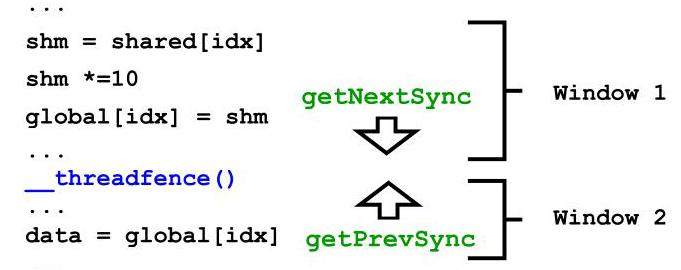
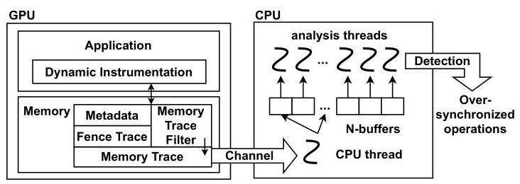
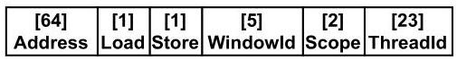
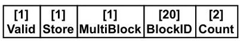
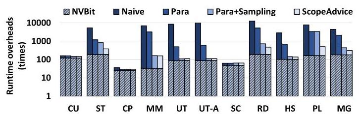

# Over-synchronization in GPU Programs 深度解读

> **作者**：Ajay Nayak, Arkaprava Basu  
> **会议/期刊**：IEEE/ACM MICRO 2024  
> **一句话总结**：这篇论文指出 CUDA 程序中常见的 scoped synchronization 没有被充分利用，导致 device-scope fence 等同步操作过宽或冗余，并提出动态分析工具 ScopeAdvice 来定位这些 over-synchronization，按建议修改后多个 GPU 应用最高获得约 55% 性能提升。

## 一、问题定义

这是一篇偏 **First 类型** 的工作：它不是在已有 over-synchronization 工具上做增量优化，而是首次把 GPU 程序中“同步范围过宽”明确抽象成一种性能 bug。GPU 程序通常有成千上万线程并发执行，线程被组织成 warp、threadblock 和 grid。CUDA/OpenCL 提供了 scope，让程序员可以选择 block、device、system 等同步可见范围；范围越大，硬件需要做的事情越多，例如 device-scope fence 需要让跨 threadblock 的线程看到更新，通常涉及 L1 flush/invalidate 到 coherent L2，而 block-scope fence 只需在同一 threadblock 内保证可见性。

问题在于 CUDA 和 OpenCL 的默认同步范围偏宽，尤其是 CUDA 中常用的 `__threadfence()` 是 device scope。程序员为了避免 data race，经常宁愿用更大的 scope，而不是推理某个 fence 是否真的需要跨 threadblock 可见性。论文把这种“用更窄 scope 或直接删除也不改变程序行为”的情况称为 **over-synchronization**。作者给出的动机很直接：在 NVIDIA RTX 3090 上，block-scope fence 比 device-scope fence 快约 `21x`；实际库中只改平均 3 行代码，就能让若干 GPU 应用最高加速 55%。

**动机评估**：动机是 solid 的。首先，GPU 硬件成本和能耗在服务器中占比很高，论文引用估算称 4 张 A100 的 DGX 服务器中 87% 成本来自 GPU；其次，GPU 程序性能受同步影响明显，device-scope fence 会造成 stall；再次，问题出现在 cuML、cudpp、cuBLAS、gpufilter 等真实库或程序中，不是人工构造的微基准。不过它也有边界：论文关注单 GPU 上 block/device scope 的 fence 和 atomic 场景，对新架构中的 cluster scope、多 GPU system scope、以及更复杂语言层面的同步抽象覆盖较少。

**核心 Insight**：作者的关键洞察是：**很多 fence 被用来同时保证 ordering 和 visibility，但在某些 CUDA 构造中 visibility 已经由其他机制保证，fence 实际只剩 ordering 作用，而 ordering 不需要 device scope。** 例如 `volatile` load 和 device-scoped atomic RMW 都会绕过 incoherent L1，直接访问 coherent L2；此时跨 threadblock 的可见性由 load/atomic 本身保证，consumer 侧的 fence 只需防止读 `status` 和读 `sum` 被重排，block-scope fence 就足够。这个洞察把问题从“同步有没有必要”转化成“这个 fence 的宽 scope 有没有必要”，也直接启发了 ScopeAdvice 的检测规则。

## 二、相关工作

论文把相关工作分成两条主线：GPU 性能调优工具和 GPU 正确性分析工具。

GPU 性能工具方面，NVIDIA Nsight 能指出 stall、吞吐、访存等性能现象，但通常不给出足够具体的代码修改建议。后续研究分别针对 value redundancy、memory-use inefficiency、GPU stall cycles、redundant barriers 等场景给出更具体的优化提示。ScopeAdvice 的定位与它们互补：它不是泛化的 profiler，而是专门寻找 scope 过宽的 fence 和冗余 fence。Orr 等人的 remote scope promotion 通过硬件动态提升 scope，目标也和 scoped synchronization 相关，但它需要硬件支持；ScopeAdvice 是纯软件动态分析。

GPU 正确性工具方面，iGUARD、ScoRD、Barracuda、CURD、Racecheck 等 race detector 主要找 under-synchronization，也就是同步不够导致 data race。ScopeAdvice 做的是正交方向：同步太多或同步太宽造成性能浪费，但不一定影响正确性。Synccheck 关注 CUDA barrier 使用错误，ScopeAdvice 关注 fence scope 选择低效。换句话说，已有正确性工具帮助程序员“不少同步”，ScopeAdvice 帮程序员“别同步过头”。

论文没有把“静态分析”作为主要路线，反而专门讨论了为什么不用纯 static analysis：GPU kernel 的数组下标、地址空间、分支路径和 fence 是否执行经常依赖输入和运行时状态，静态方法很容易保守到无法给出可操作建议。因此 ScopeAdvice 采用 runtime trace，再配合多输入和 fuzzer 降低 false positive。

## 三、技术挑战

**挑战 1：同步语义同时涉及 ordering 和 visibility，容易误判。** CUDA fence 既能限制同一线程内内存操作重排，也能按 scope 保证对其他线程的可见性。一个 device-scope fence 看起来是跨 threadblock 通信所必需，但如果读操作本身绕过 L1，visibility 已经满足，剩下的 ordering 并不需要 device scope。工具必须区分这两种语义责任。

**挑战 2：over-synchronization 的证据依赖动态执行。** 判断某个地址是否被多个 threadblock 读写、某条 load 是否访问 global memory、某个 fence 是否在具体路径上执行，往往只能在运行时知道。过度依赖静态分析会把大量 fence 判为“可能需要”，从而漏掉优化机会。

**挑战 3：不能把性能优化建议变成 correctness bug。** 删除或缩小同步 scope 必须保证两个条件：不引入 data race，并保持原程序的 store-to-load 关系。论文因此不仅基于 CUDA programming guide 解释，还用 PTX memory model 对三类变换做语义论证。

**挑战 4：动态工具本身开销很容易失控。** 如果记录所有 load/store/atomic/fence 的动态实例，GPU 到 CPU 的 trace 传输、CPU 聚合分析、metadata 存储都会非常昂贵。ScopeAdvice 需要在保留检测所需信息的同时，用 buffering、sampling 和 trace filtering 控制开销。

**挑战 5：runtime advice 可能受输入影响。** 小输入或覆盖不足的输入可能让某些跨 block 交互没有出现，导致 fence 被误报为过宽。论文必须用多输入和 CLFuzz 这类 input generation 技术增强建议可信度。

## 四、解决方案

### 整体思路

论文先总结三类 over-synchronization，再把这些现象转化成动态检测规则。ScopeAdvice 运行 CUDA kernel 时用 NVBit 插桩，记录 global memory 访问、atomic、volatile 访问、device-scope fence 以及必要的线程和地址元数据；kernel 结束后，CPU analyzer 根据“哪些地址被谁读写、是否跨 threadblock、读写是否绕过 L1、相关 fence 在哪个 window 中”来判断每个宽 scope fence 是否真的需要。如果宽 scope 的必要性不能被证明，工具报告 source file、line number 和 over-synchronization 类型，让程序员把 fence 改窄或删除。

### 贯穿示例

可以把论文的主线想成一个 producer-consumer GPU kernel：block A 先算出 `sum`，写 `status=1` 表示数据就绪；block B 轮询 `status`，看到就绪后读取 `sum`。程序员担心 block B 读不到最新 `sum`，于是 producer 和 consumer 两侧都加 `__threadfence()`。这在普通 global load/store 场景下很合理，因为跨 block 可见性需要 device scope；但如果 `status` 和 `sum` 是 `volatile`，或者读写通过 device-scoped atomic RMW 完成，读操作会绕过 L1 到 L2，最新值可见性已经由这些操作提供。此时 consumer 侧的 fence 只是在保证“先看到 status，再读 sum”的顺序，`__threadfence_block()` 也能完成这个 ordering 任务。

这个示例贯穿了后文几个设计点：ScopeAdvice 要知道 load 是否 skip L1，要知道写是否是 volatile 或 device atomic，要把 load/store 关联到前后 fence，还要判断访问同一地址的线程是否跨 threadblock。最终工具不是简单地看到 `__threadfence()` 就建议改窄，而是基于执行 trace 检查这个 fence 的宽 scope 是否由实际通信模式证明为必要。

### 关键技术点

**三类 over-synchronization。** Variant 1 是跨 threadblock 通信中 consumer 侧 fence scope 过宽：当 consumer 的读是 `volatile` load 或 device-scoped atomic RMW 时，L1 被绕过，visibility 由 L2/atomic 语义保证，fence 只需 ordering。Variant 2 是 barrier 邻近 fence 冗余：CUDA `__syncthreads()` 除了执行屏障，也包含 block-scope fence 语义，紧邻 barrier 的 block-scope fence 可删除；如果原来是 device-scope fence，先按规则判定它不需要 device scope，再由 barrier 使它冗余。Variant 3 是 lock/unlock routine 复用过宽：若 critical section 的通信线程都在同一 threadblock 内，acquire/release 中的 fence 用 block scope 即可。

**PTX memory model 论证。** 对 Variant 1，作者证明替换为 block-scope fence 后，volatile 操作或 device-scoped atomic 操作仍然是 morally strong，不会引入 data race；而 fence 任意 scope 都保证 program order，配合 `flag` 的 observation order，能保证 consumer 读到 producer 写入的 `sum`。对 Variant 2，PTX 的 `bar.sync` 语义覆盖 block-scope fence，删除邻近 fence 不改变行为。对 Variant 3，block-scope fence 本来就保证同一 threadblock 内可见性，所以把 intra-threadblock lock 的 fence 改窄是有效的。

**trace 和 window。** ScopeAdvice 把 kernel 执行建模为操作流：`rd(t,x)`、`wr(t,x)`、`rdSkipL1(t,x)`、`wrV(t,x)`、`atm(t,x,scope)` 和 `fence(t)`。每个线程的指令流按 fence 切成 window；read 关联到当前 window 前面的 fence，即 `getPrevSync`；write 关联到当前 window 后面的 fence，即 `getNextSync`。这样工具可以回答“这个 load 读到的值由哪个 fence 影响”“这个 store 的可见性由哪个 fence 决定”。

图 5 展示了 window 的直觉：fence 像分隔符一样把同一线程的指令分段，读操作找前一个 fence，写操作找后一个 fence。这个建模是 ScopeAdvice 从动态 memory trace 回到具体 fence 的桥梁。

**检测规则。** Rule 1 对应 skip-L1 场景：如果跨 threadblock 的读是 `rdSkipL1`，对应 consumer 侧 `getPrevSync` 找到的 fence 应是 block scope；对 volatile write 侧，除非它来自 device-scoped atomic，否则 producer 侧 `getNextSync` 仍可能需要 device scope。Rule 2 对应同一 threadblock 访问：如果读写同一 global address 的线程属于同一 block，相关前后 fence 都只需要 block scope。Rule 3 对应 barrier 冗余：已经被 Rule 1/2 认为可改窄的 fence，如果紧邻 barrier，就可以删除。

**实现架构。** ScopeAdvice 用 NVBit 在 SASS 层插桩，GPU 侧收集 trace 和少量 metadata，经 channel 发送到 CPU，CPU 多线程聚合并运行规则。

图 6 的价值在于把 ScopeAdvice 分成三段：GPU kernel instrumentation、trace/metadata transport、CPU-side analyzer。它解释了为什么论文后面既要讨论检测规则，也要讨论 buffering、sampling 和 trace filtering 这些系统优化。

图 7 和图 8 分别展示 trace unit 与 metadata unit。trace unit 记录地址、操作类型、scope、WindowId 等动态信息；metadata unit 则按 4 bytes global memory 记录是否被写过、是否多 block 访问、最后访问 block 等摘要信息。前者用于精确定位 fence，后者用于快速过滤“不可能需要 device-scope fence”的地址。

**开销优化。** 论文用了三类优化降低动态工具成本：N-buffering + parallel CPU analyzer 让 GPU-CPU channel 不易被塞满；execution sampling 对同一线程的同一静态指令只总是采第一个动态实例，后续按 `1/Bound` 采样；trace filtering 先把少量 trace 按地址缓存在 GPU，只在 CPU metadata 发现该地址确实可能需要 fence 时再取回分析。

### 与已有方案的对比

相比 profiler，ScopeAdvice 的优势是建议可直接落到 source line 和具体变换类型：改为 block scope 或删除 fence。相比 race detector，它关注的是性能 bug，而不是 data race。相比硬件 scope promotion，它不需要修改 GPU 架构，能用于现有 CUDA 程序。

局限也很明确。第一，它是 dynamic analysis，建议只对已覆盖输入和 grid 维度有把握；论文用多输入和 fuzzer 缓解但不能形式化穷尽所有路径。第二，运行开销仍然很高，最终 ScopeAdvice 配置下不同应用仍有 `29x` 到 `522x` 的 runtime overhead，只适合作为调试/优化工具而非生产运行组件。第三，它依赖 NVIDIA CUDA/PTX/NVBit 生态，对 AMD/OpenCL 或新 CUDA scope 层级需要重新适配。

## 五、实验评估

### 实验设定

实验平台是 NVIDIA RTX 3090 GPU，CUDA 11.2，NVIDIA driver v470，主机为 16-core CPU 和 128GB DRAM。ScopeAdvice 默认配置包括 2MB GPU-CPU channel、`N=768` 个 buffers、12 个 CPU analysis threads、sampling `Bound=15`、trace filtering `inGPUTraces=2`。

评测应用来自 cuML、cudpp、cuBLAS、ScoRD、KiloTM、gpufilter 等库。作者用 Table I 检查 ScopeAdvice 能否发现 over-synchronization，用 Table II 评估按建议修改后的性能提升和 fence stall cycle 下降，用 Figure 11 和 Table III 分析 ScopeAdvice 自身 runtime/memory overhead。为了降低 false positive，ScopeAdvice 对同一 kernel 使用多个输入；论文还把 CLFuzz 接入工具来生成更多覆盖路径。

### 主要实验与结论

**检测有效性。** Table I 中，ScopeAdvice 对所有可人工验证的应用都报告了与实际一致的 over-synchronization 数量：cuML 有 3 个 Variant 1 volatile 场景，String sort 有 10 个 Variant 2，Compress 有 2 个 Variant 2，Matrix multiplication 有 3 个 Variant 1/3，UT 和 UT-A 分别有 2 个 Variant 1，Stencil 有 2 个 Variant 3。RD、HS、PL、MG 四个无 over-synchronization 的程序均报告 0 个。cuBLAS sgemm 额外报告了 1 个 Variant 2，但因为闭源无法人工验证。作者还观察到，对所有评测应用，最多两个测试输入就足以消除潜在 false positives；小输入导致的误报会被“所有输入都出现才报告”的策略过滤掉。

**性能提升。** 按 ScopeAdvice 建议修改后，除 Compress 外所有含 over-synchronization 的应用都有加速：CU `37%`，ST `29%`，CP `0%`，MM `54%`，UT `17%`，UT-A `11%`，SC `50%`。论文摘要说最高 up to 55%，Table II 中最高显示为 MM 的 54%，可以理解为四舍五入或具体配置差异。对应的 fence stall cycles 也明显下降，例如 CU 从 `24.8` 降到 `14.5`，ST 从 `6.7` 降到 `0`，MM 从 `4.4` 降到 `0.13`，SC 从 `2.8` 降到 `0`。CP 没有加速的原因也清楚：原程序 fence stall 本来就是 0。

**工具开销。** Figure 11 说明 naive 动态插桩非常昂贵，RD 在 naive 下达到 `12611x` overhead；并行 buffer 和 CPU threads 能显著降低阻塞，例如 UT 从 `10349x` 降到 `570x`；sampling 让 MM 和 UT 的 GPU-CPU communication 至少减少 `90%`，overhead 分别降到 `162x` 和 `113x`；trace filtering 又让 PL、ST、RD 相对 Para+Sampling 分别改善 `6.8x`、`2.2x`、`1.5x`。最终 ScopeAdvice 的 overhead 仍为 CU `146x`、ST `431x`、CP `29x`、MM `158x`、UT `116x`、UT-A `111x`、SC `65x`、RD `499x`、HS `137x`、PL `522x`、MG `318x`。

图 11 的重点不是证明 ScopeAdvice 很轻量，而是证明三个优化缺一不可：naive 方案会被 trace 传输和 CPU 分析拖垮；并行、采样和过滤逐步把工具开销压到与 GPU race detector 同一量级。作者也明确把 ScopeAdvice 定位成 performance debugging tool，而不是常驻运行时系统。

**内存开销。** ScopeAdvice 为每 4 bytes application memory 维护 4 bytes metadata，因此 metadata 是 `1x`；trace filtering 额外为每 4 bytes application memory 维护 `2 * 4 bytes`，因此是 `2x`；fence trace 和 sampling metadata 与线程数、fence 数、instrumented instruction 数有关。Table III 中大多数应用主要由 `2x` trace filtering 主导，但 CU 因为 32678 个 threadblock、每 block 256 线程、9 条 memory instructions、8 条 fences，fence/sampling metadata 相对 0.49MB 应用 footprint 看起来很高。作者强调实际 resident memory 受 GPU peak occupancy 限制，CU 的 fence trace 约 0.12MB、sampling metadata 约 1.1MB，绝对值仍较小。

### 结论支撑性分析

实验基本支撑论文的核心声明：它确实在真实库和 benchmark 中发现了多种 over-synchronization；按建议修改能带来可观加速；ScopeAdvice 能给出无 false positive 的报告，至少在作者测试输入集合上如此。性能结果也通过 fence stall cycle 下降解释了加速来源，不只是报告 wall-clock speedup。

主要不足是覆盖范围和外部有效性。应用数量不大，Variant 1 的 device-scoped atomic 场景没有在真实程序中自然发现，而是用 UT-A 修改版评估；cuBLAS sgemm 的报告无法验证；所有实验基于 RTX 3090、CUDA 11.2 和特定驱动，对 Hopper cluster scope 或其他 vendor 的结论还需要扩展。此外，工具开销虽然可接受于 debugging 场景，但若用户希望频繁运行，`29x-522x` overhead 仍然不低。

## 六、附加洞察

**结论 1**：小输入更容易诱发 false positive，因为它减少了 threadblock 间真实交互。  
- *出处*：Section VII-A。  
- *推理链条*：作者在 CU、MM、UT、UT-A 的某些小输入上观察到误报 → 小输入只需要较少线程，threadblock 间交互不足 → 某些 fence 在该输入下看似不需要 device scope → 因此 ScopeAdvice 采用多个输入并要求 over-synchronization 在所有输入上都出现才报告。薄弱点是这个策略降低误报但不保证覆盖所有未来输入。

**结论 2**：动态分析的主要成本不只来自 ScopeAdvice 自身逻辑，NVBit 插桩库占了平均约 64% 的端到端执行延迟。  
- *出处*：Section VII-C / Figure 11。  
- *推理链条*：Figure 11 把每个 bar 拆出 NVBit component → 该 component 在不同 ScopeAdvice 优化配置下基本不变 → 平均约 64% overhead 来自 NVBit → 因此未来 NVBit 改进可以直接降低 ScopeAdvice 总开销。这也说明论文的系统优化主要压缩 trace 传输和分析部分，对插桩基础设施成本影响有限。

**结论 3**：Compress 中发现 over-synchronization 但没有获得性能提升，说明“同步过宽”不必然是当前性能瓶颈。  
- *出处*：Section VII-B / Table II。  
- *推理链条*：CP 有 2 个 Variant 2 over-synchronization → 按建议修改后 performance improvement 为 0% → Nsight stall cycles 原始和修改后均为 0 → 因此 fence 虽然语义上冗余，但在该应用当前执行中没有造成可观 stall。这个结果提醒读者，ScopeAdvice 找到的是优化机会，不保证每个机会都有收益。

**结论 4**：trace filtering 对稀疏访问地址特别有效，因为很多 trace 单元在分析时永远不会被取回 CPU。  
- *出处*：Section VI-C 和 Section VII-C。  
- *推理链条*：工具先用 metadata 判断某地址是否被写且多 block 访问 → 只有可能需要 device-scope fence 的地址才需要详细 trace → PL、ST、RD 这类有大量 sparsely accessed addresses 的应用最受益，ScopeAdvice 相比 Para+Sampling 分别改善 `6.8x`、`2.2x`、`1.5x` → 因此按地址延迟取回 trace 是控制动态分析开销的关键。

**结论 5**：ScopeAdvice 的建议更像“有证据的性能修复候选”，而不是完全自动改写系统。  
- *出处*：Section VI-D、Section VII-A、Conclusion。  
- *推理链条*：工具报告 source file、line number 和 variant → 多输入/fuzzer 用于提高置信度 → 作者仍建议谨慎程序员可再运行 race detector → 因此 ScopeAdvice 的设计目标是把隐藏的 scope 优化机会显式化，而不是完全替代开发者或形式化验证。

## 七、总结与评价

这篇论文的贡献在于把 GPU scoped synchronization 的一个现实痛点讲清楚了：程序员为了正确性倾向于使用 device-scope fence，但现代 GPU 的 `volatile`、atomic、barrier 和 threadblock 层次语义经常让这些宽 scope 同步变得不必要。ScopeAdvice 通过动态 trace、window 关联和三条规则，把这个问题落成了可执行的检测工具，并在真实应用上展示了最高约 55% 的加速。

论文最大的亮点是问题定义和语义论证都很清楚：它不是简单做 pattern matching，而是把“读写可见性由谁保证”“fence 是否只剩 ordering”讲透，并用 PTX memory model 验证变换。最大的不足是工具开销高、动态覆盖依赖输入，且实验平台和应用范围有限。后续值得探索的方向包括：支持 Hopper cluster scope 和 multi-GPU system scope，把 ScopeAdvice 与 race detector/profiler 联合起来排序优化收益，以及在编译器或 IDE 中提供更低开销的预筛选。

## 八、章节脉络与段落速览

- **Abstract**：概述 GPU 同步范围过宽会浪费性能，提出三类 over-synchronization 和 ScopeAdvice，并报告最高 55% 加速。
  - ¶1 说明 GPU 程序性能依赖高效同步，scope 等高级同步特性需要程序员显式使用。
  - ¶2 提出 over-synchronization、三类变体、ScopeAdvice 工具和性能收益。

- **Section I · Introduction**：从 GPU 成本、scoped synchronization、真实库中的过宽同步和 ScopeAdvice 贡献逐步引出问题。
  - ¶1 GPU 被广泛用于深度学习、图处理、数据分析和科学计算，因此 GPU 程序效率影响面很大。
  - ¶2 GPU 是服务器成本和能耗大头，软件低利用率会显著浪费计算成本。
  - ¶3 作者声称首次展示 GPU 程序中次优同步会造成显著性能低效。
  - ¶4 解释 GPU threadblock 层次和 scoped synchronization，并用 `21x` fence 延迟差说明窄 scope 的价值。
  - ¶5 指出默认 device scope 和 data race 风险让程序员倾向于使用过宽同步，定义 over-synchronization。
  - ¶6 概述三类过宽或冗余同步源自 CUDA scoped synchronization 与 GPU 微架构的交互。
  - ¶7 解释 Variant 1：若 consumer 读绕过 L1，fence 只需 ordering，block scope 足够。
  - ¶8 解释 Variant 2 和 Variant 3：barrier 已包含 block fence 语义，intra-threadblock lock 不需要 device scope。
  - ¶9 说明这些变体存在于真实库中，平均只改 3 行可获得最高 55% 性能提升。
  - ¶10 提出需要证明删除 over-synchronization 不改变语义，并转向 PTX memory model。
  - ¶11 引出 ScopeAdvice，说明它用 NVBit trace 自动报告 over-synchronization 的位置和类型。
  - ¶12 说明 ScopeAdvice 也能降低 scoped synchronization 对程序员的负担。
  - ¶13 预测未来 GPU 引入更多层次和 scope 后，over-synchronization 更可能出现。
  - ¶14-17 列出三项贡献：提出问题和三类变体、证明语义保持、实现 ScopeAdvice 并获得加速。

- **Section II · Background**：介绍 GPU 层次、CUDA scope、fence/atomic/barrier/volatile 的语义基础。
  - ¶1 介绍 SM、SIMD、L1、shared memory、L2 和 global memory，并强调 L1 不 coherent、L2 coherent。
  - ¶2 介绍 thread、warp、block、grid 的软件层次。
  - ¶3 说明全 GPU 同步通常不必要，scope 让程序员指定同步线程子集。
  - ¶4 解释 CUDA fence 的 ordering 和 visibility 语义，以及 block/device/system scope 的成本差异。
  - ¶5 解释 atomic RMW 也有 scope，device-scoped atomic 会绕过 L1，lock/unlock 通常由 atomic 和 fence 组合实现。
  - ¶6-7 用代码展示 volatile 和 device-scoped atomic 场景中的潜在过宽 fence。
  - ¶8 说明 `__syncthreads` 同时是执行 barrier 和 block-scope fence。
  - ¶9 说明 volatile load 会绕过 L1，因此跨 block 的可见性可由 volatile 访问保证。

- **Section III · Over-synchronization in GPU Programs**：定义 over-synchronization 的行为保持标准，并展开三类变体。
  - ¶1 定义 over-synchronization 为用窄 scope 不引入 race 且保持 store-to-load 关系的场景。
  - ¶2 说明作者分析开源 CUDA 程序得到三类变体，并由此指导工具设计。
  - ¶3 介绍 Variant 1 的共性：读共享变量的指令若 skip L1，则宽 fence 只剩 ordering 作用。
  - ¶4-5 用 cuML `decoupledLookback` 的 volatile producer-consumer 例子解释 consumer 侧 device fence 可改为 block fence。
  - ¶6-8 用 device-scoped atomic RMW 例子解释 atomic 已保证最新值可见，fence 只需排序。
  - ¶9-11 介绍 Variant 2：barrier 语义覆盖 block fence，cudpp sort 中紧邻 barrier 的 fence 可删除。
  - ¶12-13 介绍 Variant 3：同一 threadblock 内的 lock/unlock 不需要 device-scope fence。

- **Section IV · Validation Against PTX Memory Model**：用 PTX memory model 证明三类变换不会引入 data race 或改变行为。
  - ¶1 说明 CUDA 没有正式 memory model，因此要在 PTX memory model 下验证优化有效性。
  - ¶2 定义 volatile、atomic、membar、barrier 到 PTX 指令的映射，并列出 morally strong、data race、program order、observation order、synchronization order。
  - **IV-A · Validity of Variant 1 over-synchronization**：证明 volatile 和 device atomic 两个 producer-consumer 例子改窄后仍读到正确值。
    - ¶1 给出 Variant 1 优化需要满足的两个条件：无 data race、consumer 读到 producer 值。
    - ¶2-3 给出 Figure 4 的 PTX 表示，作为后续证明对象。
    - ¶4 证明 volatile 操作等价 relaxed.sys，因此访问同址的操作 morally strong，不产生 data race。
    - ¶5-6 说明 block fence 保证 program order，配合 flag 的 observation order 能保证 consumer 读到最新 sum。
    - ¶7 证明 device-scoped atomic RMW 场景中所有内存操作 morally strong，不产生 data race。
    - ¶8-9 说明 atomic RMW 和 block fence 的 program order 足以保证 consumer 观察到 producer 的写。
    - ¶10 指出原程序中的 synchronization order 对保持行为不是必要条件，因为 visibility 已由 volatile/atomic 保证。
  - **IV-B · Validity of Variant 2 and Variant 3 over-synchronizations**：证明 barrier 冗余和 intra-threadblock lock 改窄是直接有效的。
    - ¶1 说明 `bar.sync` 是 block fence 语义超集，删除邻近 block fence 不改变行为。
    - ¶2 说明 block-scope fence 足以同步同一 threadblock 内线程。

- **Section V · ScopeAdvice: Finding Over-synchronization**：把前述语义条件转成动态 trace 模型和检测规则。
  - ¶1 说明手工寻找很难，因此构建 ScopeAdvice 自动定位。
  - ¶2 说明工具默认宽 scope fence 是 over-synchronized，再用 trace 和规则证明其必要性。
  - **V-A · Modeling Program Execution as a Trace**：定义动态执行 trace 中需要记录的操作类型。
    - ¶1 把 GPU kernel 执行建模为操作流，只记录 global memory 和相关同步。
    - ¶2-6 定义 `rd`、`wr`、`rdSkipL1`、`wrV`、`atm`、`fence` 等 trace 元素。
    - ¶7 说明 atomic 在规则中按读写组合处理，block fence 和 barrier 不进动态 trace。
  - **V-B · Relating Memory and Fence Operations**：用 window 把 memory operation 关联到前后 fence。
    - ¶1 说明 synchronization 必要性取决于访问同一位置的线程和相关 fence。
    - ¶2 定义以 fence 为 sentinel 的 windows，以及 `getPrevSync`、`getNextSync`。
    - ¶3 用 Figure 5 说明 window 切分和 fence 关联。
  - **V-C · Identifying Over-synchronized Operations**：提出三条检测规则。
    - ¶1 说明所有宽于 block 的 fence 默认可疑，除非 Rule 1/2 证明需要。
    - ¶2 Rule 1 判断 skip-L1 跨 block 通信中 consumer 侧 fence 可为 block scope。
    - ¶3 Rule 2 判断同一 threadblock 的读写只需 block scope。
    - ¶4 Rule 3 判断邻近 barrier 的已改窄 fence 可删除。
    - ¶5 用 Section III 三个例子说明规则如何分别命中三类变体。
    - ¶6 说明 atomic RMW 在规则中被视作读写或 skip-L1/volatile 写组合。

- **Section VI · Implementation of ScopeAdvice**：说明 NVBit 插桩、trace/metadata 采集、CPU 分析和开销优化。
  - ¶1 概述 Figure 6 的实现流程：GPU 采集 trace，CPU 多线程分析。
  - **VI-A · Instrumentation and Execution Metadata**：介绍插桩信息和运行时 metadata。
    - ¶1 说明使用 NVBit 和 channel 做 SASS 插桩与 GPU-CPU 通信。
    - ¶2 说明用 FenceId/WindowId 在插桩阶段创建逻辑 windows。
    - ¶3 说明 trace unit 记录 load/store/atomic 的地址、类型、WindowId、scope 和 volatile 信息。
    - ¶4 说明 fence trace 用 FenceId × ThreadId bit vector 记录哪些线程执行了哪些 fence，并介绍 memory metadata 字段。
    - ¶5 说明 trace 单元动态流向 CPU，而 fence trace 和 metadata 在 kernel 结束后传输。
    - ¶6 说明用 UVM 分配 metadata，避免预留 GPU 显存限制 kernel。
  - **VI-B · Trace Aggregation and Metadata Analysis on the CPU**：介绍 CPU 侧聚合与 fence 查找。
    - ¶1 说明 CPU threads 从 channel 取 trace，并按地址聚合操作、scope、WindowId、ThreadId。
    - ¶2 解释 `getPrevSync`/`getNextSync` 如何找到影响读值或写可见性的 fence。
    - ¶3-4 给出 `getPrevSync` 和检测逻辑伪代码。
    - ¶5 说明如果 memory instruction 和 fence 位于不同分支，工具用 fence execution trace 确认该线程是否真的执行过 fence。
    - ¶6-7 说明 CPU analysis 从“所有 fence 可疑”开始，用规则移除必要 fence，剩余即 over-synchronized。
    - ¶8-9 说明工具再做 source analysis 应用 Rule 3，并报告文件、行号和原因。
  - **VI-C · Optimizations to Reduce Overheads of ScopeAdvice**：介绍三项降低 overhead 的优化。
    - ¶1 提出 runtime overhead 是调试工具的核心问题。
    - ¶2 说明 N-buffering 和 CPU 并行分析减少 GPU 等待 channel 的时间。
    - ¶3-4 说明 execution sampling 基于同一静态指令动态实例相似性减少 trace 量。
    - ¶5-6 说明 trace filtering 只在 metadata 表明地址可能需要 fence 时才取回详细 trace。
  - **VI-D · Use of Diverse Inputs and Fuzzer**：说明多输入和 fuzzing 用于降低 runtime trace 的 false positive。
    - ¶1 承认 ScopeAdvice 建议只对给定输入和 grid 维度准确。
    - ¶2 说明用库自带多输入提高建议置信度。
    - ¶3 说明集成 CLFuzz 生成更多 CUDA kernel 输入。
    - ¶4 说明在 25 个 kernel 上 stress test 未遇到 false positive，并建议可再配合 race detector。
  - **VI-E · Discussion: Why not static analysis?**：解释纯静态分析过于保守。
    - ¶1 说明复杂索引、地址空间判断和 fence 路径执行都依赖运行时信息。

- **Section VII · Evaluation**：评估检测准确性、应用加速和工具开销。
  - ¶1 给出 RTX 3090、CUDA 11.2、16-core CPU、128GB DRAM、buffer/thread/sampling/filtering 参数。
  - ¶2 列出三个研究问题：能否识别、是否加速、工具 overhead 多大。
  - ¶3 说明应用来源、Table I 中的变体、人工修改 UT-A/SC 的原因和无 over-synchronization baseline。
  - ¶4 Table II 给出性能提升和 fence stall cycle 下降。
  - ¶5 说明最多两个测试输入足以消除可能 false positive。
  - **VII-A · Effectiveness of ScopeAdvice**：验证报告数量和类型。
    - ¶1 说明 ScopeAdvice 找到所有人工确认 cases，且无 false positive。
    - ¶2 解释小输入会导致部分应用短暂 false positive，但多输入/fuzzer 最终过滤。
    - ¶3 说明 GE 中闭源 cuBLAS sgemm 的 1 个 Variant 2 无法验证。
  - **VII-B · Application Performance Improvement**：评估按建议修改后的速度收益。
    - ¶1 说明比较原始版本和去除 over-synchronization 后版本。
    - ¶2 报告应用加速范围为 0-55%。
    - ¶3 说明用 Nsight fence stall cycles 解释不同应用收益差异。
    - ¶4 指出除 CP 外 stall cycles 都显著下降，CP 无收益是因为原本几乎不被 fence stall。
  - **VII-C · Runtime Overheads of ScopeAdvice**：分析动态工具 overhead。
    - ¶1 分解 overhead 来源为插桩、GPU 执行、GPU-CPU 通信和 CPU 分析。
    - ¶2 用 Figure 11 说明各优化配置和 NVBit component，指出 NVBit 平均约占 64%。
    - ¶3 说明 naive 配置中 RD overhead 达 `12611x`。
    - ¶4 说明并行 buffer/thread 让 UT 从 `10349x` 降到 `570x`，但 CU 因同步开销略增。
    - ¶5 Table III 给出 memory overhead。
    - ¶6 说明 sampling 让 MM 和 UT communication 至少降 90%，overhead 降到 `162x` 和 `113x`。
    - ¶7 说明 trace filtering 进一步降低 PL/ST/RD 开销，并列出最终各应用 overhead。
    - ¶8 把 ScopeAdvice overhead 与 iGUARD、BARRACUDA 等 GPU race detector 比较。
    - ¶9 解释 metadata、fence trace、sampling、trace filtering 的 memory overhead 来源。
    - ¶10 说明大多数应用由 `2x` trace filtering 主导，CU 的相对 overhead 高但绝对 resident memory 小。

- **Section VIII · Related Work**：把 ScopeAdvice 放入 GPU 性能工具和 correctness 工具脉络。
  - ¶1 说明 Nsight 和近期 GPU 性能建议工具与 ScopeAdvice 互补，remote scope promotion 需要硬件支持。
  - ¶2 说明 race detector 等工具找 under-synchronization，而 ScopeAdvice 找 over-synchronization。

- **Section IX · Conclusion**：总结三类 over-synchronization、ScopeAdvice 和最高 55% 加速。
  - ¶1 重申 CUDA 程序没有充分利用 scoped synchronization，ScopeAdvice 能检测并带来性能提升。

- **Appendix · Artifact**：描述 ScopeAdvice artifact 的编译、运行环境和复现实验流程。
  - **A · Abstract**：说明 artifact 包含源码、预编译二进制和复现 Tables I/II/III、Figure 11 的脚本。
  - **B · Artifact check-list**：列出 CUDA 11.2、GCC 9.4、Ubuntu 20.04、NVIDIA Volta/Turing/Ampere、约 2GB 空间和约 14 小时复现时间等元信息。
  - **C · Description**：说明 artifact 可从 GitHub 和 Zenodo 获取，并推荐 RTX 3090、16-core CPU、64GB DRAM、PCIe 4.0。
  - **D · Installation**：给出 clone repository 的基本安装步骤。
  - **E · Experiment workflow**：说明 table-1-and-3、table-2、figure 三个目录分别复现实验结果，可在 Docker 或裸机运行。
  - **F · Evaluation and expected results**：说明脚本生成 CSV，可与论文表格和图比较，Figure 11 overhead 可能有运行间波动但趋势一致。
  - **G · Notes**：说明非 Docker 环境需开启 GPU performance counters，预编译二进制支持 Volta/Turing/Ampere，Table I 观察在这些 GPU 上一致但 Table II 会随 GPU 改变。
