# LEGOSim: A Unified Parallel Simulation Framework for Multi-chiplet Heterogeneous Integration 深度解读

> **作者**：Tiantian Lin, Cheng Qiu, Xiaohang Wang, Ling Wang, Zhulin Zheng, Yingtao Jiang, Amit Kumar Singh, Jieming Yin, Sihai Qiu, Xiaodong Li, Xin Tang, Jie Song, Mingzhe Zhang, Kui Ren  
> **会议/期刊**：MICRO 2025  
> **一句话总结**：LEGOSim 把异构 chiplet 的已有模拟器封装为并行运行的 simlet，通过 Unified Integration Interface、Network-on-Interposer 模型和 on-demand synchronization，在尽量少改模拟器的前提下实现多 chiplet 系统的快速、较高精度设计空间探索。

## 一、问题定义

多 chiplet 系统已经成为后摩尔时代的重要架构形态：CPU、GPU、NPU、CiM、DRAM、专用 DSA 等不同 chiplet 被封装到一个系统里，通过 interposer 和 die-to-die link 互连。它的好处是良率、成本、可扩展性和异构算力，但设计空间也随之膨胀：chiplet 数量、拓扑、NoI bandwidth、buffer size、内存协议、D2D 协议和任务划分都会互相影响。真实流片前，体系结构模拟器需要回答这些选择对性能和瓶颈的影响。

本文处理的是一个非 First 类型的问题：架构模拟器和并行仿真本来已经有大量工作，但它们没有很好地覆盖异构 multi-chiplet system。已有的 gem5、GPGPU-Sim、Sniper、Scale-Sim、MNSIM 等模拟器通常擅长单类组件；SimBricks、SST 等模块化框架能做跨组件组合，却缺少面向 Network-on-Interposer 的精细建模或集成开销较高；per-cycle parallel simulation 精度高但同步太频繁，time quantum synchronization 降低同步频率又会引入时间误差。

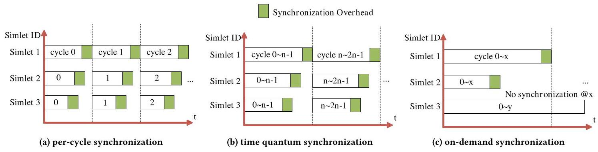

Fig. 1 很好地说明了问题本质：per-cycle 每个周期都全局对齐，准确但同步开销密集；time quantum 把同步间隔拉长，开销下降但会掩盖短周期交互；on-demand synchronization 只在真正发生跨 chiplet 依赖时同步相关 simlet，试图绕开二者的核心矛盾。

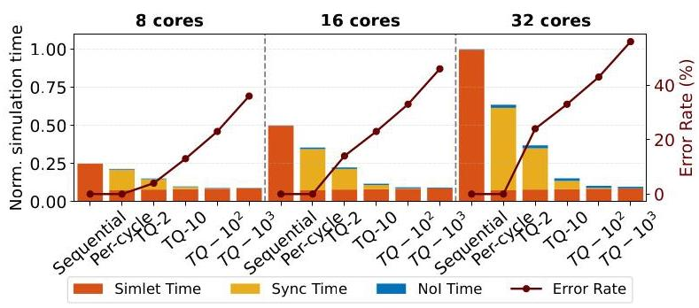

Fig. 2 是本文动机最强的数据支撑。在 32-core 配置下，per-cycle 的 synchronization time 可占总模拟时间约 85%；TQ-1000 虽然将同步开销相对 per-cycle 降低 99.9%，但在 32-core case 中引入 56% timing error。这说明问题不是简单的工程实现慢，而是同步策略在效率和精度之间存在结构性冲突。

**动机评估**：动机比较 solid。作者用实际模拟器和多 core 配置展示了 PC 和 TQ 的 trade-off，又指出 multi-chiplet 场景中的 inter-chiplet communication 间隔通常是几十到几百个 cycle，不像传统 CMP 那样高度密集，因此存在利用通信稀疏性减少同步的机会。一个不足是，论文没有对更多真实商用 chiplet workload 的通信间隔分布做系统 profiling，"通信相对稀疏"这一假设主要由实验场景和 case studies 间接支撑。

**核心 Insight**：multi-chiplet 并行模拟不必把所有 simlet 以固定周期全局对齐；只有当跨 chiplet 通信、共享内存访问、barrier/lock 等事件可能破坏 temporal causality 时，才需要同步相关参与者。换句话说，正确性约束来自 inter-simlet dependency，而不是来自 wall-clock 上所有 simlet 的周期级一致推进。LEGOSim 的 GM、三阶段 latency 获取和 UII 都围绕这个 insight 展开。

## 二、相关工作

论文中的相关工作可以按三条线理解。

第一类是单组件或专用组件模拟器。gem5、Sniper、ZSim、SimpleScalar 面向 CPU 或 many-core；GPGPU-Sim、Accel-Sim、MGPU-Sim、PPT-GPU 面向 GPU；Scale-Sim、NeuroSim、MNSIM、PIMSim 面向 AI accelerator、CiM 或 PIM；BookSim、Garnet、Noxim 等面向 NoC。这些工具的共同优势是局部建模细，缺点是接口和时间模型不统一，不能直接拼成一个包含 CPU/GPU/NPU/CiM/DRAM/NoI 的 chiplet system。

第二类是模块化系统模拟框架。SimBricks 和 SST 尝试将多个模拟器组合起来，但论文认为它们在本文目标场景下仍有不足：SimBricks 机制复杂、速度偏慢且无法建模 inter-chiplet transmission；SST 支持组件插件，但不能直接建模 inter-chiplet communication network，并且把已有模拟器接入时仍有显著改动和开销。gem5-X、gem5-GPU、gem5-AcceSys、gem5-SALAM 等 gem5 系列扩展能覆盖部分异构组合，但通常架构固定、需要深入修改模拟器内部，不适合快速组合多种 chiplet。

第三类是并行仿真的同步机制。per-cycle synchronization 代表准确但同步密度过高；time quantum synchronization 代表以固定窗口减少同步，但窗口选择很难，窗口大损精度、窗口小退化为 per-cycle。Astra-Sim、SimAI、SlackSim、WWT、ZSim 等工作从不同角度使用或放宽 time window，但对紧耦合 multi-simlet 交互、NoI latency 和异构 simlet clock control 的支持并不完整。LEGOSim 的定位是在这三条线之间做工程化整合：复用已有模拟器、单独建模 NoI、并用 on-demand synchronization 降低并行仿真的同步开销。

## 三、技术挑战

**挑战 1：异构 simlet 的接口和时间模型不一致。** CPU 模拟器可能通过 syscall 表达远端读写，GPU 模拟器围绕 CUDA runtime 和 device memory，DSA/NPU 模拟器可能只是脚本或算子级 timing model。要把它们并行组合起来，必须同时处理数据传输、函数调用映射和 local clock advancement。

**挑战 2：减少同步不能牺牲 temporal causality。** 只在通信时同步听起来简单，但 send/receive、shared memory access、barrier、lock 都可能跨 simlet 形成顺序依赖。GM 必须判断哪些 simlet 可以继续推进，哪些需要等待，并保证共享地址的访问顺序不被真实 wall-clock 快慢打乱。

**挑战 3：NoI latency 既影响同步，又不能在每个事件上昂贵地精细模拟。** 如果所有通信都实时调用精细 NoI simulator，会拖慢并行模拟；如果只使用 zero-load latency，又会低估拥塞和排队。LEGOSim 的三阶段设计本质上是在模拟效率和 latency fidelity 之间做折中。

**挑战 4：大规模 chiplet 系统会把中央协调者变成瓶颈。** On-demand synchronization 把同步频率从周期级降到通信事件级，但 GM 仍要处理所有 inter-simlet request。当通信量升高到几百 MB 时，单 GM 的排队和调度开销会显著上升。

**挑战 5：验证难度高。** LEGOSim 面向的是已有模拟器都难以完整覆盖的异构 multi-chiplet 系统，因此很难找到统一 golden reference。作者只能在 SIMBA、CiM accelerator、gem5 小规模 NoI traffic 等相对可对照场景中验证局部精度。

## 四、解决方案

### 整体思路

LEGOSim 的总体方案是把每个 chiplet 的模拟器包装成一个独立进程 simlet，让它们并行执行本地 timing/functional simulation；跨 chiplet 事件通过 Unified Integration Interface 进入 Global Manager；GM 根据 on-demand synchronization 协议决定哪些 simlet 需要等待、推进到哪个 cycle、何时执行数据传输；NoI simulator 负责估计 inter-chiplet latency。为了避免实时精细 NoI 模拟拖慢主流程，LEGOSim 使用三阶段 decoupled simulation：Stage 1 用 zero-load latency 快速运行并记录 traffic trace，Stage 2 单独用 NoI simulator 计算更准确的 flow latency，Stage 3 带着准确 latency 重新运行。

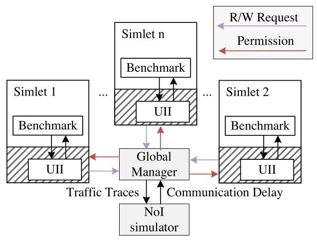

Fig. 3 展示了 LEGOSim 的模块边界：simlet 内部保留各自 benchmark 和模拟器逻辑，UII 是接入层，GM 是同步和数据转发控制点，NoI simulator 只提供通信延迟和 traffic trace 处理。这种边界让 LEGOSim 更像一个仿真编排框架，而不是重写一个统一大模拟器。

### 贯穿示例

可以用一个 CPU-4GPU-NPU-CiM 系统来理解全流程。假设 CPU 负责切分 ResNet-50 的 stage，GPU 跑 CUDA kernel，NPU 和 CiM 跑部分卷积层或矩阵乘任务。每个 chiplet 对应一个 simlet：CPU simlet 可能来自 Sniper，GPU simlet 来自 GPGPU-Sim，NPU/DSA 来自 Scale-Sim 或自定义模型，CiM 来自 MNSIM。当 GPU0 需要把中间 feature map 发给 NPU1 时，benchmark 调用 `sendMessage()`；UII 把它翻译成该模拟器内部能理解的数据搬运和同步动作；GM 收到 request 后不暂停所有 simlet，只让 GPU0 和 NPU1 按通信依赖对齐，并让无关的 GPU2/GPU3 继续运行。Stage 1 先用 zero-load latency 估计这次传输，记录流量；Stage 2 由 NoI simulator 根据拓扑和拥塞重新计算 latency；Stage 3 再把这次传输按更准确 latency 作用回模拟。

### 关键技术点

**1. On-demand synchronization 只同步有依赖的 simlet。** send/receive 事件按 producer-consumer 关系匹配，GM 计算双方下一次可推进的 clock cycle；无关 simlet 不参与这次 fencing。Shared memory access 则按地址维护有序请求列表，只有在同一地址上更早到达的访问完成后，后来的访问才可执行。

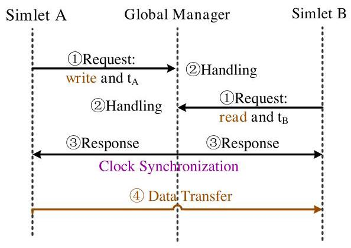

Fig. 5 对应 send/receive 流程：A 和 B 向 GM 发起请求，GM 匹配并返回 permission 与 clock advancement，然后才执行 data transfer。图中真正关键的是 "Clock Synchronization" 只夹在通信双方之间，而不是系统全体 simlet 的全局 barrier。

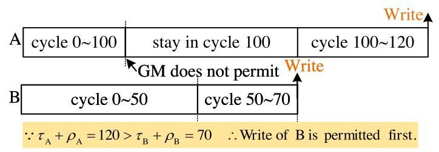

Fig. 6 展示 shared memory 的难点：A 在 wall-clock 上可能跑得更快，已经到 cycle 100，但 B 在 simulated time 上有 cycle 50 的更早写入。GM 不能让 A 先写 M，而必须让 B 的写先发生，再允许 A 推进到对应时间。这正是 on-demand synchronization 需要维护的 causal consistency。

**2. 三阶段 decoupled simulation 把 latency fidelity 从主流程中拆出来。** Stage 1 同时跑 timing 和 functional model，用 zero-load latency 得到可运行的近似并记录 trace；Stage 2 用独立 NoI simulator 对 inter-simlet traffic 做更准确的 latency 模拟；Stage 3 把这些 latency 合回主模拟，得到更接近真实网络拥塞的结果。这个设计回应了挑战 3：实时精细 NoI 太慢，完全近似又不够准。

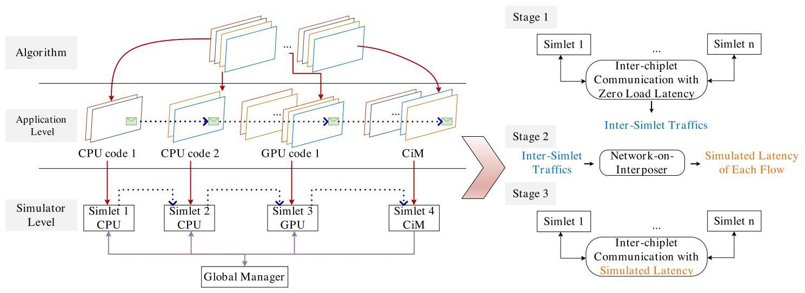

Fig. 4 左边把 algorithm、application-level code 和 simulator-level simlet 对齐，右边说明 latency 从 Stage 1 的 zero-load 估计逐步变成 Stage 3 的 simulated latency。它解释了 LEGOSim 为什么既能接入异构模拟器，又能让 NoI latency 不只是静态常数。

**3. UII 统一 API、数据传输和 clock control。** UII 暴露 `sendMessage()`、`receiveMessage()`、`barrier()`、`lock()`、`unlock()`、`read()`、`write()` 等 benchmark/application-level API。对 syscall-based CPU simulator，这些 API 映射为自定义 syscall；对 GPGPU-Sim，它们映射到 CUDA memory copy 和 GPU cycle 变量控制；对 Scale-Sim 类 DSA 模拟器，则通过输入文件、脚本执行和输出日志来完成 functional/timing 衔接。

**4. Formal analysis 用 NoI arrival rate 解释误差来源。** 论文把 packet latency 分成 zero-load latency 和 queuing latency，后者由 G/G/1 模型近似。LEGOSim 和 golden reference 的 latency 差异主要来自两者对 packet arrival rate `lambda` 的估计不同。作者在 4 CPU-chiplet、2x2 NoI 配置下验证不同 traffic volume：当 inter-chiplet traffic 从 10 MB 到 800 MB 变化时，LEGOSim error 仍低于 5%，arrival-rate error 也低于 5%。

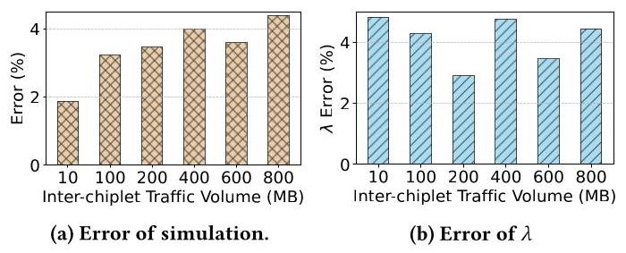

Fig. 7 支撑了三阶段方案的合理性：即使通信量增加，LEGOSim 相对 gem5 的整体误差没有失控。这个验证不是全系统 golden proof，但能说明 NoI latency 近似在受控实验中足够稳定。

### 与已有方案的对比

相比 per-cycle synchronization，LEGOSim 的优势是大幅减少同步事件，不把无通信依赖的 simlet 拉入全局等待；相比固定 TQ，它不会因为窗口过大而漏掉短周期通信依赖；相比 SimBricks/SST/gem5 扩展，它的 UII 更强调把已有模拟器作为进程级 simlet 接入，改动面更小。局限也很明确：中心化 GM 在高通信量下会成为瓶颈；三阶段模拟需要重复运行，Stage 1 占 OD 总模拟时间约 40%；对 shared memory order 的 optimistic rollback 只说在 dataflow-dominated workloads 中冲突少，论文没有给出充分的 rollback 开销统计；此外，UII 虽然说 minimal code changes，但不同模拟器的适配仍需要人工理解其 syscall、runtime 或 timing control。

## 五、实验评估

### 实验设定

实验平台是 20-core Intel Xeon Gold 6133 2.50 GHz、512 GB memory server。workloads 包括 parallel convolution、BFS、matmul、MLP、ResNet 和 Transformer。系统配置覆盖 CPU-4GPU-NPU-3CiM、CPU-20GPU-15NPU、CPU-3GPU、CPU-DSA-CiM-7GPU、CPU-DSA-CiM-47GPU、CPU-DSA-CiM-97GPU 等。simlet 由 Sniper、GPGPU-Sim、自定义 Eyeriss-like NPU simulator、Scale-Sim、MNSIM 等组成。评估指标包括 simulation error、synchronization time/count、total simulation time、execution cycle、traffic volume、bottleneck breakdown 等。

Baseline 主要有三类：精度验证时对比 SIMBA 和 CiM-based accelerator 已发表结果；同步开销对比 sequential simulation、per-cycle synchronization 和多种 TQ-x；case study 中对比不同 NoI topology、flit size、HBM3/DDR5、UCIe/PCIe、以及 DSE 的 reference configurations。

### 主要实验与结论

**精度验证。** 对 SIMBA 的 4/8/32-chiplet 配置，ResNet-50 的 error 分别是 2.52%、3.51%、5.35%，平均约 3.79%。对 CiM-based accelerator 的 4/5/9/18-chiplet 配置，Tiny-Yolo computing utilization error 分别是 2.71%、4.68%、2.69%、5.79%，平均约 3.94%。这些结果支持 LEGOSim 对公开 multi-chiplet accelerator 的性能建模误差低于 10% 的声明。

**同步开销。** 在 CPU-3GPU 上运行 MLP 时，OD 相比 PC、TQ-2、TQ-4、TQ-8、TQ-10、TQ-16、TQ-32、TQ-100、TQ-1000 的 synchronization time 分别降低 99.9%、99.9%、99.8%、99.7%、99.7%、99.4%、98.1%、96.6%、66.1%。OD 的 synchronization error 是 0%，而 TQ-1000 的 error 达 38.4%。

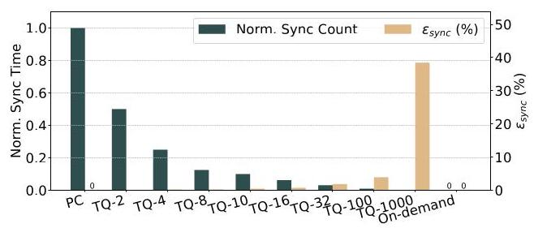

Fig. 9 直观显示 OD 的同步次数接近最低，同时误差保持为 0；TQ-1000 的同步次数也少，但误差柱很高。这是本文最核心的实验：不是单纯把同步做少，而是在少同步的同时保住 causality。

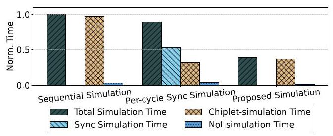

Fig. 11 进一步说明 OD 的整体收益：与 sequential simulation 相比，LEGOSim 总模拟时间降低 61.4%；与 per-cycle synchronized parallel simulation 相比降低 56.7%。其中 chiplet-simulation time 与 synchronization time 分别降低 61.9% 和 98.1%。

**扩展性和瓶颈。** 在 CPU-DSA-CiM-97GPU 的 100-chiplet mesh 系统中，随着 inter-chiplet communication volume 从 10 MB 增加到 800 MB，模拟时间快速上升，说明 GM 处理同步请求会变成瓶颈。作者提出 distributed management：多个 local manager 管一组 simlet，GM 再管 local managers 和 NoI。在 800 MB 通信量下，distributed 方案比 single GM 模拟时间降低 56%。

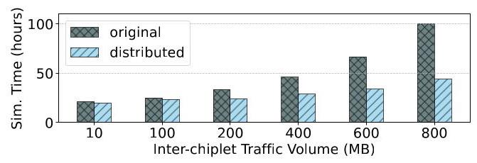

Fig. 12 的价值在于它没有只展示 LEGOSim 的最好情况，而是暴露了 OD 的扩展边界：通信越密，"按需同步"越接近频繁同步，中心化协调开销越明显。

**Design space exploration case study。** 在 CPU-20GPU-15NPU、ResNet-50、100 GB/s NoI bandwidth 的配置中，LEGOSim 发现 NoI latency 和 on-chip buffer access 是瓶颈。Table 6 中 computation、buffer access、NoI 的 normalized time 分别是 0.34、0.72、1。进一步用不同 buffer size 和 NoI bandwidth 采样，作者拟合性能模型，回归误差 8%，再用 NSGA-II 在 6200 W 到 6700 W power budget 下优化。6200 W 时，优化方案比两个 reference configurations 分别降低 30% 和 27% execution time。

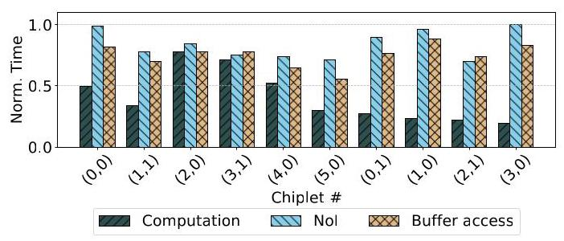

Fig. 13 是 LEGOSim 作为分析工具的例子：不同 chiplet 的 computation、NoI、buffer access 占比不同，说明 DSE 不应只调单一全局参数，而应先定位瓶颈来源。

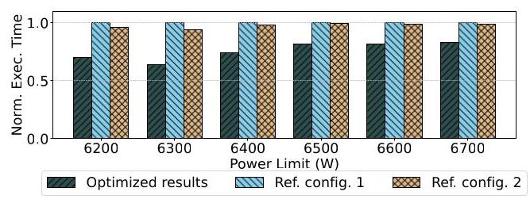

Fig. 15 展示优化后的配置在多个 power limit 下都低于 reference configurations，说明 LEGOSim 生成的模拟数据可以服务于更上层的 architecture search，而不只是单次性能估计。

**其他 case studies。** 在 CPU-4GPU-NPU-3CiM 上，GPU(0,0) 的 computation-to-communication latency ratio 最高，`tau_(0,0)=11.5`；增加两个 GPU 并重新分配该 GPU workload 后，`tau_(0,0)` 降到 7，总 execution time 降低 15%。在 NoI topology 评估中，flit size 从 2 增加到 4 时，Transformer、matmul、BFS、MLP 的 execution time 分别降低 12.56%、43.14%、25.16%、35.74%，star topology 在该实验中表现最好。HBM3 相对 DDR5 总 execution cycle 低 39.1%，UCIe 相对 PCIe 总 execution time 低 32.9%。

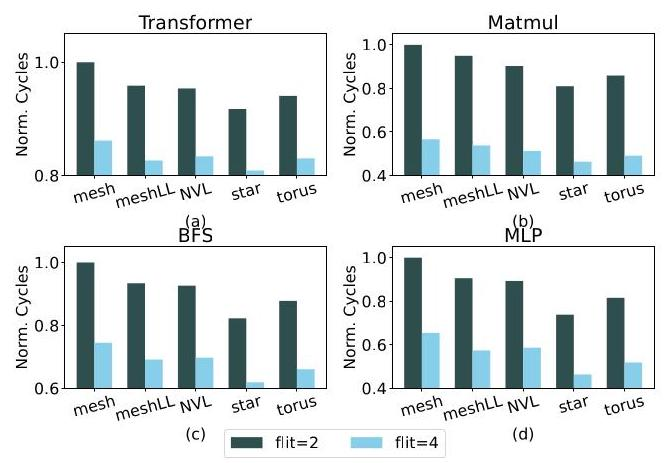

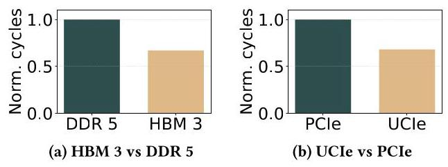

这两张图说明 LEGOSim 的应用范围：既能看拓扑和 packet granularity，也能看内存协议和 D2D 协议。它们不是证明 LEGOSim 本身正确性的实验，而是展示框架可以支撑多类设计问题。

### 结论支撑性分析

实验整体上能支撑论文的三项主要声明：LEGOSim 能接入多类异构 simlet，能在公开参考架构上达到低误差，能显著降低同步开销并支持 DSE。最强证据是同步实验和 SIMBA/CiM 验证；case studies 更多体现工具价值。

不足在于验证覆盖仍不算充分。第一，只有部分场景有外部 reference，许多复杂异构系统没有 golden baseline，只能展示趋势。第二，论文说 rollback conflicts rare，但没有系统报告 rollback 触发率和代价。第三，UII 的 "minimal modifications" 缺少按模拟器统计的改动量、开发时间或代码行数。第四，distributed manager 作为解决 GM bottleneck 的方向只给了性能对比，没有展开一致性协议和更复杂通信模式下的边界。

## 六、附加洞察

**结论 1：TQ 并不是简单地把窗口调大就能获得更好效率，窗口过大会迅速破坏精度。**  
- *出处*：Section 2.2、Figure 2、Section 5.3。  
- *推理链条*：作者先在 8/16/32-core 上比较 sequential、PC 和不同 TQ-x，观察到 TQ-1000 同步开销极低；但 Figure 2 中 32-core case 的 timing error 达 56%，Section 5.3 中 TQ-1000 的 synchronization error 也达 38.4%；因此 TQ 的效率收益不能独立看，必须和短周期跨 chiplet 事件是否被掩盖一起评估。

**结论 2：OD 的收益依赖于 inter-chiplet communication 稀疏性，高通信量会把 GM 推成瓶颈。**  
- *出处*：Section 5.4、Figure 12。  
- *推理链条*：OD 只在通信事件上同步，因此当通信量低时同步事件少；作者在 100-chiplet 系统中逐步增加 traffic volume，看到超过 100 MB 后模拟时间加速增长；distributed manager 在 800 MB 时降低 56% 模拟时间，说明瓶颈确实来自中心化协调，而不是单个 simlet 计算。

**结论 3：NoI 和 buffer access 在某些 multi-chiplet workload 中比计算本身更容易成为瓶颈。**  
- *出处*：Section 6.1、Table 6、Figure 13。  
- *推理链条*：作者在 CPU-20GPU-15NPU 上运行 ResNet-50，先做任务映射和通信插桩，再用 LEGOSim 拆分 computation、buffer access、NoI latency；Table 6 中 computation 只有 NoI 的 0.34，buffer access 是 0.72，若只增加算力未必有效；因此后续 DSE 选择 buffer size 和 NoI bandwidth 作为设计变量。

**结论 4：对具体 workload，拓扑选择和 flit size 的交互可能强于单一拓扑优劣。**  
- *出处*：Section 6.3、Figure 16、Figure 17。  
- *推理链条*：作者在 CPU-4GPU-DSA-CiM 上比较 mesh、meshLL、NVL、star、torus，并同时改变 flit size；Figure 16 中 star 在 flit=4 下表现最好，但不同 benchmark 的下降幅度不同，matmul 的改善大于 Transformer；Figure 17 的 traffic heatmap 进一步说明瓶颈与流量空间分布有关。因此拓扑评价必须与 workload 和 packet granularity 一起看。

**结论 5：论文的 artifact 成本不低，说明这种框架仍是重型系统工具。**  
- *出处*：Artifact Appendix A.2-A.5。  
- *推理链条*：artifact 需要 GCC、CUDA、CMake、libtorch、多类 simulator 依赖以及 16 GB disk；准备 workflow 约 2 小时，完整实验约 14 天；这支持 LEGOSim 的系统性和可复现性，但也说明 "minimal code changes" 不等于低使用门槛，真实复现和扩展仍需要相当工程成本。

## 七、总结与评价

LEGOSim 的核心贡献不是提出一个全新的芯片性能模型，而是把多 chiplet 异构系统模拟中的三个痛点连在一起解决：已有模拟器难组合、并行同步太贵、NoI latency 又不能忽略。UII 让不同模拟器以 simlet 方式接入，GM 和 OD synchronization 只在依赖点同步，三阶段 NoI 流程则把通信延迟从粗略估计推进到更准确模拟。

论文最大的亮点是问题拆解务实：它承认不会重写所有模拟器，而是围绕进程级并行、API wrapper 和中心调度做系统集成；同步实验也给出了清晰的效率/精度对比。最大的不足是一些关键工程声明缺少更细粒度量化，例如每个模拟器的接入改动量、rollback 成本、distributed GM 的一致性细节，以及更广泛 workload 下 OD 假设的稳定性。后续值得继续看的方向是：分布式 GM 协议、自动化 simlet adapter、对真实 chiplet workload trace 的通信稀疏性统计，以及把功耗/热/可靠性与性能模拟更紧密地耦合。

## 八、章节脉络与段落速览

- **Section 1 · Introduction**：提出 multi-chiplet 设计空间探索对模拟器的新需求，并概括 LEGOSim 的动机、方案和贡献。
  - ¶1 说明 multi-chiplet integration 的价值以及它给系统级模拟和评估带来的新挑战。
  - ¶2-4 将挑战分成模块化集成不足和同步效率低两类，分别解释现有模拟器和并行同步方法的局限。
  - ¶5-6 引出 LEGOSim，并说明其在 SIMBA、CiM accelerator 和五个 case studies 中被验证。
  - ¶7 以贡献列表总结 OD synchronization、NoI modeling、UII 和开源实现。

- **Section 2 · Background & Motivation**：用现有模拟器分类和同步机制实验支撑问题动机。
  - **2.1 · Limitations of Existing Simulators in Modular Integration**：说明多 chiplet DSE 需要组合多类模拟器，而现有单组件模拟器和模块化框架都难以满足灵活集成与 NoI 建模。
    - ¶1 用 AMD Zen 5 和 Ponte Vecchio 说明 multi-chiplet 的规模和设计周期压力。
    - ¶2 逐类比较 SimBricks、ZSim、gem5 扩展、SST 等工具，指出它们在 modular integration 或 inter-chiplet modeling 上不足。
  - **2.2 · Limitations of Existing Parallel Simulation Synchronization Schemes**：比较 sequential、PC 和 TQ 同步机制，说明固定频率同步难以同时兼顾速度和精度。
    - ¶1 说明 sequential simulation 资源利用率低，系统增大时模拟时间不可接受。
    - ¶2 解释 per-cycle synchronization 精度高但同步开销随 core 数增长。
    - ¶3 解释 time quantum synchronization 的窗口大小 trade-off。
    - ¶4 用 8/16/32-core 实验说明 TQ-1000 虽快但误差高。
    - ¶5 提出 OD 的两个特征：adaptive accurate time quantum 和 non-global fencing。

- **Section 3 · LEGOSim Architecture and Design Principles**：描述 LEGOSim 的三类核心组件、OD 协议和形式化误差分析。
  - **3.1 · Overview of LEGOSim**：把系统分为 simlets、NoI simulator 和 Global Manager。
    - ¶1-4 分别说明 simlet、NoI simulator、GM 以及三者如何协作完成并行模拟。
  - **3.2 · On-Demand Synchronization Mechanism**：详细解释三阶段模拟和 GM 处理跨 simlet request 的流程。
    - ¶1 说明应用线程通过 UII API 发起 inter-chiplet communication，并由 LEGOSim 三阶段运行获得准确 latency。
    - ¶2-4 说明 simlet 请求、GM 处理 send/receive 与 shared memory access 的逻辑。
    - ¶5-6 说明 GM 返回 permission 和 clock cycle，simlet 据此执行数据传输或共享内存访问。
    - ¶7 讨论 Stage 3 中可能出现的 memory order discrepancy，并用 optimistic rollback 处理少见冲突。
    - ¶8 用 A/B 写共享 memory chiplet M 的例子解释 causal consistency。
  - **3.3 · Formal Analysis for Validation**：用 zero-load latency、queuing latency 和 arrival rate error 建立 NoI latency 误差解释。
    - ¶1-4 定义 transmission latency、zero-load latency、queuing latency 和总通信 latency。
    - ¶5-8 定义 LEGOSim 与 gem5 的 packet latency difference 和 simulation error。
    - ¶9 用不同 traffic volume 下低于 5% 的 error 验证模型 fidelity。

- **Section 4 · Unified System Integration**：介绍 UII 如何把不同模拟器的 API、数据传输和 clock control 统一起来。
  - ¶1 总览 UII 的目标和三类模块。
  - ¶2-7 定义 benchmark/application-level APIs，并说明它们在 syscall、runtime library 和 DSA script 中的映射方式。
  - ¶8-11 说明 CPU、GPU、DSA simlet 的数据传输实现方式。
  - ¶12-15 说明 cycle-accurate、non-cycle-driven 和 DSA simulator 的 clock control 差异。
  - ¶16-18 分别给出 Sniper、GPGPU-Sim 和 Scale-Sim 的接入方式。
  - ¶19 总结 UII 降低异构 simlet interoperability 成本。

- **Section 5 · Evaluation**：验证 LEGOSim 的精度、同步效率和扩展边界。
  - **5.1 · Experimental Setup**：列出硬件平台、benchmark、系统配置、simlet 类型、内存协议和 inter-chiplet topology。
    - ¶1-4 说明服务器配置、workloads、multi-chiplet architectures、simlet 来源和 NoI/topology 参数。
  - **5.2 · Validating Simulation Accuracy**：用 SIMBA 和 CiM-based accelerator 的公开结果做精度对照。
    - ¶1-2 说明验证的 chiplet 数量、workload 和 reference。
    - ¶3-4 定义 SIMBA error 并报告 2.52%、3.51%、5.35%。
    - ¶5-7 定义 CiM utilization error 并报告 2.71%、4.68%、2.69%、5.79%。
  - **5.3 · Synchronization Time Comparison**：比较 OD、PC 和 TQ-x 的同步开销与误差。
    - ¶1-2 报告 OD 对 PC 和多个 TQ-x 的同步时间降低比例以及 synchronization error。
    - ¶3 通过 sequential、PC 和 OD 的时间分解说明总模拟时间降低。
  - **5.4 · Scalability and Bottleneck Analysis**：分析 100-chiplet 系统中通信量增加导致 GM 成为瓶颈，并给出 distributed management 的改进。
    - ¶1 说明 simulation speed 受 inter-chiplet traffic 和 synchronization frequency 影响。
    - ¶2 用 10 MB 到 800 MB traffic 的结果说明 single GM 瓶颈，并报告 distributed 方案在 800 MB 时降低 56% 模拟时间。

- **Section 6 · Case Studies**：展示 LEGOSim 如何用于瓶颈定位和设计空间探索。
  - **6.1 · Exploring the Design Space of On-chip Buffer and Inter-chiplet Interconnection Network**：在 CPU-20GPU-15NPU 上定位 NoI 和 buffer 瓶颈，并优化 buffer size/NoI bandwidth。
    - ¶1-4 说明系统配置、ResNet-50 任务划分和 CPU/GPU/NPU 编程方式。
    - ¶5-6 用 Table 6 与 Figure 13 找到 NoI latency 和 buffer access 瓶颈。
    - ¶7-9 拟合性能模型、定义 power-constrained optimization，并报告 6200 W 下 30%/27% execution time 降低。
    - ¶10 说明额外脚本支持 chiplet repartitioning 和批量 DSE。
  - **6.2 · Alleviating Computation Bottlenecks Using LEGOsim**：用 convolution benchmark 识别 GPU(0,0) 计算瓶颈并通过增加 GPU 降低总时间。
    - ¶1-2 定义 CPU-4GPU-NPU-3CiM baseline 与 `tau_(x,y)` 指标。
    - ¶3-4 报告 `tau_(0,0)=11.5`，添加两个 GPU 后降到 7，总执行时间降低 15%。
  - **6.3 · Evaluating Different Inter-chiplet Network Topology Configurations**：比较 mesh、meshLL、NVL、star、torus 与 flit size 对不同 benchmark 的影响。
    - ¶1-2 说明评估配置，并报告 flit size 从 2 到 4 时多个 benchmark 的执行时间降低比例。
    - ¶3 说明 traffic heatmap 工具有助于定位 D2D interface 瓶颈。
  - **6.4 · Evaluating HBM3 vs. DDR5 in a CPU-4DSA-4DRAM Multi-chiplet System**：比较 HBM3 和 DDR5 对 ResNet-50 的影响。
    - ¶1-2 说明系统和 memory protocol 设置，并报告 HBM3 总 cycle 比 DDR5 低 39.1%。
  - **6.5 · Evaluating UCIe vs. PCIe in a CPU-4DSA-4DRAM Multi-chiplet System**：比较 D2D interconnection protocol。
    - ¶1-3 说明 UCIe 与 PCIe 的配置和结果，报告 UCIe 总 execution time 比 PCIe 低 32.9%。

- **Section 7 · Conclusion**：总结 LEGOSim 的框架能力、精度和同步收益。
  - ¶1 重申 LEGOSim 支持异构 simlet 并行集成、OD synchronization、NoI simulation 和 UII，并总结 3.79%/3.94% 精度误差、99.9%/66.1% 同步开销降低以及 DSE 应用价值。

- **Artifact Appendix**：说明 artifact 的可用性、依赖、安装和实验复现流程。
  - **A.1 · Abstract**：概括 artifact 包含源代码、脚本和复现实验说明。
  - **A.2 · Artifact check-list**：列出算法、语言、编译环境、运行环境、指标、输出、磁盘和时间需求。
  - **A.3 · Description**：说明 artifact 可从 GitHub 和 Zenodo 获取，并列出 CUDA、GCC、CMake、Python、libtorch 等依赖。
  - **A.4 · Installation**：逐步说明 clone 仓库、更新 submodule、设置环境、打 patch、编译 Sniper/gem5/GPGPU-Sim/popnet/interchiplet。
  - **A.5 · Experiment workflow**：说明如何运行 topology/flit、PCIe/UCIe、HBM/DDR、sync overhead 和 DSE 实验。
  - **A.6 · Evaluation and expected results**：说明输出日志、simulation cycle、heatmap 和 bottleneck 文件位置。
  - **A.7 · Experiment customization**：说明用户可按 user manual 添加新的 benchmark。
