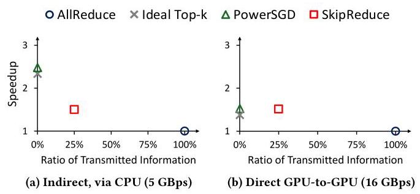
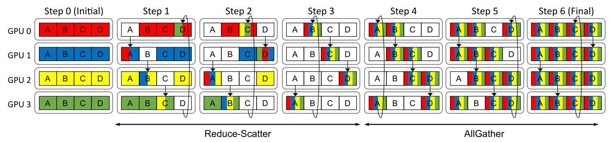
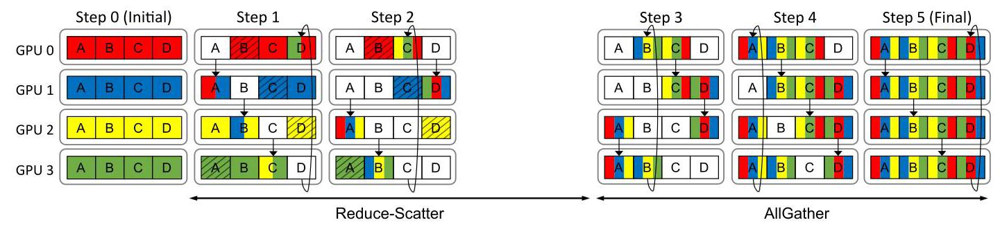
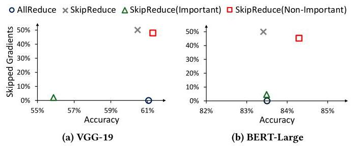

# SkipReduce: (Interconnection) Network Sparsity to Accelerate Distributed Machine Learning 深度解读

> **作者**：Hans Kasan, Dennis Abts, Jungwook Choi, John Kim  
> **会议/期刊**：MICRO 2025  
> **一句话总结**：SkipReduce 把分布式训练中本来要完整执行的 Ring AllReduce 变成一种可控的粗粒度 gradient skipping：跳过部分 Reduce-Scatter 通信步来直接缩短通信时间，再用随机化和按层选择性跳过来控制精度损失。

## 一、问题定义

这篇论文不是第一次提出“分布式训练通信会拖慢训练”，也不是第一次利用梯度稀疏性减少通信。它的切入点更具体：在现代 GPU 集群或高性能互连中，传统 gradient compression 的计算开销、索引开销和重构开销会逐渐抵消通信节省，因此需要一种能真正减少 collective communication 时间、同时几乎不引入额外计算和内存负担的方法。

在 data parallel training 中，每个 worker 完成 backward propagation 后要通过 AllReduce 同步梯度。以 Ring AllReduce 为例，$N$ 个 worker 需要 $2(N-1)$ 个通信步，其中 Reduce-Scatter 和 AllGather 各占 $N-1$ 步。只要 AllReduce 暴露在关键路径上，worker 就会等待通信完成，训练扩展性也会低于线性增长。已有 top-$k$、PowerSGD、quantization 等方法大多试图减少消息内容，但它们往往需要选择重要梯度、维护索引、做低秩近似或保存 error feedback，代价并不小。

**动机评估**：动机比较 solid。作者不是只说“梯度稀疏所以可以少传”，而是补上了两个关键背景：第一，梯度值在训练过程中长期集中在 0 附近，说明把一部分梯度近似为 0 有现实基础；第二，在 5 GBps 到 16 GBps 这类更接近 commodity GPU 或 HPC 系统的带宽下，压缩方法的固定计算开销会变得更显眼，导致低带宽场景下的收益无法直接迁移。

Figure 3 支撑了这篇论文的问题设定：低带宽时通信压缩能明显降低通信瓶颈，但带宽提高后，通信本身变短，而压缩、近似、重构这些额外计算没有同步下降，于是方法的收益被压缩。SkipReduce 的目标正是绕开这类“为了少传而多算”的路径。

**核心 Insight**：作者的关键洞察是，既然 Ring AllReduce 已经把梯度切成 slice 并按通信步推进，那么可以不在元素级别挑选梯度，而是在 collective schedule 层面跳过某些 Reduce-Scatter 步。这样做相当于把一组 gradient slice 近似为 0，同时真正减少通信步数。换句话说，SkipReduce 把“梯度稀疏性”从 tensor value 层面的压缩问题，转化成 interconnection network 上的 schedule sparsity 问题。

Figure 4 展示了这个 insight 的价值：top-$k$ 和 PowerSGD 在低带宽下可以靠极少传输信息换来较大加速，但高带宽下计算开销让收益下降；SkipReduce 损失的信息更多可控，速度收益在高带宽下更接近这些压缩方法，同时保留更多梯度信息。

## 二、相关工作

论文把相关工作主要分成四类。

第一类是 gradient sparsification，典型代表是 DGC、gTopk、OkTopk 和 SparCML。这些方法通常按 magnitude 选择 top-$k$ 梯度，只发送较大的元素。它们的问题是稀疏格式需要索引，COO 格式会把 value 和 index 一起传，作者指出这会让通信量近似多一个 2 倍因子；更麻烦的是不同 worker 的 top-$k$ 索引不一致，AllReduce 过程中 unique indices 会增长，也就是 fill-in issue。为了修正没发出去的梯度，它们还常常需要残差累积，内存开销接近完整模型大小。

第二类是 low-rank compression，例如 PowerSGD。它避免了不规则稀疏通信，和 collective library 的兼容性更好，但要计算低秩近似，并在接收端重构梯度，还常常需要 error feedback。带宽较低时这些计算能换通信收益；带宽提高后，计算部分可能成为新的瓶颈。

第三类是 gradient quantization。它通过低 bit-width 表示梯度，理论速度收益与 bit width 成反比。它和 SkipReduce 正交，因为 quantization 仍然处理每个传输元素的表示方式，而 SkipReduce 改的是 collective 中哪些通信步要执行。

第四类包括 in-network computation、logical topology synthesis、collective scheduling，以及利用 gradient dropping 容忍 lossy transport 尾延迟的方法。它们多在网络设备、拓扑或传输层优化 collective。SkipReduce 可以和这些方向叠加，因为它主要定义的是 AllReduce schedule 中可跳过的工作量。

这篇论文和前人的差异不在“发现梯度稀疏”，而在于它选择了一个更系统化的优化位置：不把稀疏性变成复杂的数据格式和压缩算子，而是把稀疏性落实到 NCCL ring collective 的 step 数量上。

## 三、技术挑战

**挑战 1：细粒度 skipping 不等于通信加速。** 如果像 Dropout 一样对单个梯度元素随机跳过，消息大小和通信步数并不会变，包里只是少聚合了一些 worker 的贡献。这会损失信息，但不能减少 AllReduce 的关键路径时间。SkipReduce 必须找到一种 coarse-grained skipping，使得少用信息的同时少走通信步。

**挑战 2：静态跳过会引入系统性偏置。** 如果每次迭代都跳过同一组 step 或 slice，那么同一部分梯度会长期缺席，某些 worker 或某些 slice 的贡献会持续被削弱。Figure 7 显示 Static SkipReduce 在高 skipping rate 下精度明显恶化，75% skipping 时 Random SkipReduce 相比 Static SkipReduce 的 test accuracy 高 19 个百分点。

**挑战 3：不同层对 skipping 的敏感性不一样。** 作者观察到 important gradients 并不均匀分布在所有层里。简单地按统一比例跳过全部梯度，会把敏感层和不敏感层一起处理，造成不必要的精度损失。方法必须保护少量关键层，同时尽量跳过体量大但梯度不敏感的层。

**挑战 4：AllReduce 的不同阶段语义不同。** Reduce-Scatter 中跳过一个 step，影响的是部分还未完全聚合的 slice；AllGather 中跳过 step，则可能让各 GPU 拿到不一致的最终模型副本。论文实验显示，跳过 AllGather 的代价明显更高，不能简单地认为“跳过同样数量的 step 就有同样的训练影响”。

**挑战 5：公平比较并不直接。** 许多 top-$k$ 方法基于 MPI 或稀疏 collective，实现路径和 NCCL 不同。作者构造了 ideal top-$k$ 下界来比较 TTA，但这个 baseline 不是功能完整的稀疏 AllReduce。这个设计让评测更偏向保守对比，同时也提醒读者：真实系统里的 top-$k$ 成本可能比论文中的 ideal baseline 更高。

## 四、解决方案

### 整体思路

SkipReduce 的核心做法是跳过 Ring AllReduce 的部分 Reduce-Scatter step。Ring AllReduce 原本把每个 worker 的梯度 tensor 切成 $N$ 个 slice，每步把某个 slice 传给相邻节点并做 reduce。SkipReduce 设定要跳过的 Reduce-Scatter step 数 $S$，于是 Reduce-Scatter 从 $N-1$ 步变成 $N-1-S$ 步，而 AllGather 默认保持不变。理论上，它节省的通信时间比例是 $S / 2(N-1)$，同时跳过约 $S/N$ 的梯度。

Figure 1 说明了 baseline 的同步成本来源：4 个 worker 需要 3 个 Reduce-Scatter step 加 3 个 AllGather step。SkipReduce 不改变“按 slice 在 ring 上流动”的基本模型，而是直接让其中部分 Reduce-Scatter step 不发生。

### 贯穿示例

可以把一次 AllReduce 想成 8 个 GPU 一起汇总一批训练报告，每个 GPU 都把自己的报告切成 8 叠纸。Baseline 做法是每轮都把一叠纸传给邻居，邻居把自己的内容加上去，再继续传，直到每叠纸都收集了所有 GPU 的信息。SkipReduce 的想法是：如果某些叠纸里的更新大多接近 0，那么不如跳过若干轮传递，承认这些叠纸少了部分 GPU 的贡献，但把整轮通信时间省下来。

这个例子也暴露出两个问题。第一，如果每次都跳过同一叠纸，那同一部分模型参数会长期缺少信息，训练会偏。第二，不是每叠纸都同样不重要，如果某叠纸对应 embedding 或第一层卷积这类敏感层，就不能粗暴跳过。Random SkipReduce 解决第一个问题，Selective SkipReduce 解决第二个问题。

### 关键技术点

**1. Coarse-grained skipping。** AllReduce_Dropout 在元素级别随机跳过梯度，只改变 reduction kernel 的计算结果，不减少消息大小。SkipReduce 则在 slice/step 级别跳过通信，直接缩短 Reduce-Scatter 的 loop。

Figure 5 是论文最关键的机制图。带斜线的 slice 表示在 Reduce-Scatter 中没有被纳入最终聚合的梯度。这个设计的好处是实现路径很短：不需要 COO、top-$k$ selection 或低秩分解，只要让 collective 少执行一些 step。

**2. Random SkipReduce。** Static SkipReduce 的问题是长期跳过同一批 slice。Random SkipReduce 在每次迭代中对 slice index 加一个随机 offset，让不同迭代跳过的 slice 变化。为了让所有 GPU 生成一致的随机 offset，作者修改 NCCL，把当前 iteration count 从 host 传给所有 GPU，作为共同 seed。这样不需要额外同步。

Figure 6 展示了随机化的本质：不是随机决定每个元素，而是在保持 collective 结构一致的前提下改变 slice 对齐关系。这样既避免长期偏置，又保留了 coarse-grained skipping 的通信收益。

**3. Selective SkipReduce。** 论文用 gradient magnitude 判断层的重要性，但不做元素级 top-$k$。作者在层或 bucket 级别区分敏感和非敏感梯度：保护 important layers，对不敏感 bucket 设置更激进的 skipping rate。由于 PyTorch/NCCL 本来就把梯度分 bucket 并逐个 AllReduce，这种设计可以嵌入现有 communication-computation overlap 流程。

Figure 9 说明“参数多”不等于“梯度重要”。VGG-19 中大梯度集中在少数层，很多大层反而适合跳过。这给 Selective SkipReduce 提供了空间：保护小而关键的层，跳过大而不敏感的层。

Figure 10 是 Selective SkipReduce 的直接证据。VGG-19 中保护参数量仅占 4% 的重要卷积层，可以在跳过大量梯度时达到甚至略高于 baseline 的 accuracy；相反，保护 fully connected layers 虽然保留了 96% 梯度，精度反而下降 5 个百分点。这说明“跳得少”不是关键，“跳哪里”才是关键。

**4. Skip 而不是 Drop。** SkipReduce 把被跳过的梯度当作 0，但平均时仍按 GPU 数 $N$ 做除法。DropReduce 则把这些梯度从平均中移除，相当于按剩余贡献数重新缩放。实验表明 DropReduce 没有收益，反而可能因为放大剩余梯度而引入偏置。因此作者保留了“用 0 近似”的选择。

### 与已有方案的对比

相比 top-$k$，SkipReduce 不需要 sparse COO、索引传输、fill-in 处理或残差累积；相比 PowerSGD，它不需要低秩分解、重构和 error feedback；相比 quantization，它不是改变数值精度，而是减少 collective step。代价是 SkipReduce 的信息选择更粗，不能像 top-$k$ 那样精细保留最大梯度，因此必须依赖随机化和层选择来控制精度。它的适用区间也更偏向通信已经足够快、计算开销不容忽视的系统。

## 五、实验评估

### 实验设定

作者在 NCCL 2.25.1 中实现 SkipReduce，用 cuRAND 支持 Random SkipReduce，并让 PyTorch 链接修改后的 NCCL。平台是 8 张 A40 GPU，通过 PCIe 4.0 互连。评测模型包括 VGG-19/CIFAR-100、BERT-Large/SWAG、LLaMA-3.2 1B/MNLI。VGG-19 使用 SGD 训练 150 epochs，BERT-Large 和 LLaMA-3.2 使用 Adam。所有模型参数和梯度均为 FP32。

主要 baseline 包括 baseline AllReduce、ideal top-$k$ 和 PowerSGD。默认配置中 top-$k$ 选 1% 梯度，PowerSGD rank 为 4，SkipReduce 跳过 50% Reduce-Scatter step。为了让 top-$k$ 对比更接近 NCCL 环境，作者实现了 idealized top-$k$：把 index 和 value 当作 dense tensor 通信，并用额外的模拟方式测 TTA。这给 top-$k$ 一个偏乐观的通信下界。

### 主要实验与结论

Figure 11 比较了 VGG-19、BERT-Large 和 LLaMA-3.2 1B 的 time-to-accuracy。SkipReduce 的优势不是每一步 iteration 都最快，而是在速度和精度保留之间取得更好的整体 TTA。

Figure 12 进一步显示 SkipReduce 在所有 workload 和 run 中都优于 baseline AllReduce 和作者比较的 prior methods。摘要中给出的最高 TTA speedup 是 $1.58\times$。在 LLaMA-3.2 上，SkipReduce 的 iteration time 比 PowerSGD 慢 6%，但平均 TTA 仍比 PowerSGD 快 16%，说明保留更多梯度信息能减少达到目标精度所需的训练时间。

Random SkipReduce 的消融很关键。Figure 7 表明，在 75% skipping rate 下，Random SkipReduce 的 test accuracy 比 Static SkipReduce 高 19 个百分点，并且能接近 AllReduce_Dropout 的精度表现。Figure 8 则显示随机化带来的通信时间开销最高只有 1.1%，因此随机 offset 是一个收益很高的补丁。

Selective SkipReduce 的实验证明了按层选择的重要性。保护 VGG-19 中重要卷积层时，这些层只占 4% 参数量，却能让 accuracy 比 baseline AllReduce 还高 0.23 个百分点；保护 fully connected layers 时，即使剩余 96% 梯度不跳过，accuracy 仍下降 5 个百分点。BERT-Large 中保护 embedding layer 也表现出类似趋势。

Figure 14 说明 SkipReduce 的默认选择有必要性。跳过 50% Reduce-Scatter step 和分别跳过 25% Reduce-Scatter/AllGather step 可以获得相似通信加速，但后者让 final train accuracy 和 test accuracy 分别下降 1.95 和 1.3 个百分点。AllGather 影响的是已经聚合好的梯度传播和 replica consistency，因此比 Reduce-Scatter 更敏感。

讨论部分还把 SkipReduce 扩展到 Sharded Data Parallel。Figure 19 中，只对 Reduce-Scatter 使用 SkipReduce 可获得 9% speedup；同时跳过 AllGather 中权重和 Reduce-Scatter 中梯度可获得 22% speedup，但需要 warm-up 来控制精度损失。这说明 SkipReduce 不只适用于 DP AllReduce，也能影响 FSDP/ZeRO 风格训练中的 AG/RS 通信设计。

### 结论支撑性分析

实验整体能支撑论文主张：SkipReduce 可以在不引入大额计算和内存开销的情况下缩短 communication critical path，并在多模型上改善 TTA。强支撑来自三组证据：高带宽下压缩方法收益下降的 motivation 实验；Random/Selective SkipReduce 对精度损失的消融；三类模型上的 TTA 对比。

主要局限也比较清楚。第一，平台规模是 8 GPU，虽然 Figure 16 分析了 256-node logical topology，但大规模真实集群实验不足。第二，Selective SkipReduce 依赖对 sensitive layers 的判断，论文给出了经验方法，但没有形成严格自动化策略。第三，ideal top-$k$ 是偏理论化 baseline，虽然保守地有利于 prior work，但仍不能完全替代真实 NCCL 稀疏 collective 的系统比较。

## 六、附加洞察

**结论 1：通信压缩的瓶颈会随互连带宽提升而从网络转移到计算。**  
*出处*：Section 3，Figure 3，Figure 4。  
*推理链条*：作者先在 VGG-19 上人为改变 GPU 通道带宽，观察到低带宽时 compression/approximation 的通信节省更有价值；随后指出带宽提高后通信时间下降，而选择、压缩、重构的计算时间基本不随带宽下降；因此高带宽系统需要更少计算介入的通信优化，而不是继续把更多逻辑放进压缩算子。

**结论 2：保护更多梯度不一定带来更高精度，保护正确的层更重要。**  
*出处*：Section 4.4，Figure 9，Figure 10。  
*推理链条*：作者先用 global top-25% magnitude gradients 定位 important gradients，发现它们集中在少数层；再比较保护不同层的 accuracy/skipped-gradient tradeoff；结果是保护 4% 的重要卷积层比保护大量 fully connected 参数更有效，因此 Selective SkipReduce 的关键不是保留梯度比例，而是识别 sensitivity。

**结论 3：在 data parallel AllReduce 中，AllGather skipping 比 Reduce-Scatter skipping 更危险。**  
*出处*：Section 5.2，Figure 14。  
*推理链条*：两种方案跳过的总 step 数相同，通信加速相近；但跳过 AllGather 会让已经 reduce 完的 slice 无法一致分发，造成模型副本分歧，并带来 1.95/1.3 个百分点的 train/test accuracy 下降；所以 DP 中 SkipReduce 默认只跳过 Reduce-Scatter。

**结论 4：把跳过的梯度当作 0 比从平均中删除它们更稳定。**  
*出处*：Section 5.2，Figure 15。  
*推理链条*：DropReduce 通过改变 divisor 把被跳过的梯度真正移除；实验没有看到收益，反而出现性能下降；作者解释为剩余梯度被放大后可能形成偏置，而梯度本身常接近 0，因此用 0 近似更合理。

**结论 5：SkipReduce 可能兼具通信优化和 regularization 效果。**  
*出处*：Section 6.4，Figure 20。  
*推理链条*：SkipReduce 不改变 activation，而是在 weight update 中注入由 gradient skipping 产生的噪声；实验中 SkipReduce 单独带来约 0.3% test accuracy 提升，Dropout 单独约 1%，两者结合约 1.2%；这说明 SkipReduce 和 Dropout 的正则化来源不同且可以互补。

## 七、总结与评价

SkipReduce 的贡献在于把梯度稀疏性放到了 collective communication schedule 层面处理。它没有试图更聪明地编码每个梯度，而是利用 Ring AllReduce 的 slice/step 结构直接减少通信步数，再通过 Random SkipReduce 避免长期偏置，通过 Selective SkipReduce 保护敏感层。这个设计朴素但系统味很强，适合嵌入 NCCL 这类成熟 collective library。

论文最大的亮点是问题位置选得准：当互连带宽提高后，复杂 compression 的计算成本确实会成为限制，SkipReduce 用更少机制换取了更好的 TTA。最大不足是 selectivity 仍偏经验化，且真实大规模多节点系统验证不够充分。后续值得探索的是自动选择 skipping bucket/layer 的策略，以及在 FSDP、tensor parallel、pipeline parallel 中把 AG/RS 的 skipping 对齐问题做成更一般的 runtime policy。

## 八、章节脉络与段落速览

- **Abstract**：概述 SkipReduce 利用 interconnection network sparsity 跳过 AllReduce 中随机梯度 slice，最终最高达到 $1.58\times$ TTA speedup。

- **Section 1 · Introduction**：从分布式训练通信瓶颈引出 SkipReduce。
  - ¶1 说明 DNN 规模增长导致多 GPU/多节点训练普遍化，而 AllReduce 暴露通信时间降低 worker utilization。
  - ¶2 解释 Ring AllReduce 的 step 数和 prior compression 的问题，并指出 top-$k$ 与 PowerSGD 在格式、索引或计算上有额外成本。
  - ¶3 通过 Figure 1 引出 SkipReduce：随机跳过梯度 slice、随机化跳过位置、按层选择性跳过，并列出四点贡献。

- **Section 2 · Background**：补充分布式训练、Ring AllReduce 和相关通信压缩工作的背景。
  - **2.1 · Deep Neural Network Training**：说明 forward/backward propagation、gradient descent 和 SGD 的基本训练流程。
  - **2.2 · Distributed Data Parallel Training**：解释 data parallel 中每个 worker 持有模型副本，并通过 Ring AllReduce 平均梯度。
  - **2.3 · Related Works**：按 top-$k$ sparsification、PowerSGD、quantization、in-network/logical topology/transport 方法梳理前人工作及其开销。

- **Section 3 · Motivation**：论证为什么要跳过 collective step 而不是继续做复杂压缩。
  - ¶1 提出 gradients 接近 0 且通信压缩在高带宽下受计算开销限制。
  - ¶2 借 Figure 2 说明 VGG-19 训练中梯度分布长期围绕 0。
  - ¶3 借 Figure 3 说明带宽提高后 compression overhead 会削弱收益。
  - ¶4 借 Figure 4 比较速度和信息保留的 tradeoff，指出 SkipReduce 在高带宽下更均衡。

- **Section 4 · SkipReduce Collective Communication**：定义 SkipReduce 的机制。
  - **4.1 · Preliminaries**：区分 skipping/dropping 与 fine-grained/coarse-grained，并给出 AllReduce_Dropout、SkipReduce、DropReduce 三种变体。
  - **4.2 · SkipReduce Algorithm**：说明 fine-grained skipping 不能减少消息大小，而 SkipReduce 跳过 Reduce-Scatter step 以减少通信时间。
  - **4.3 · Random SkipReduce**：用 iteration count 作为共同 seed 随机 shift slice index，避免同一 slice 长期被跳过且只有最高 1.1% overhead。
  - **4.4 · Selective SkipReduce**：用 layer-level importance 保护敏感层，并利用 bucketized AllReduce 对不同 bucket 设置不同 skipping rate。

- **Section 5 · Evaluation**：验证 SkipReduce 的性能和精度。
  - **5.1 · Methodology**：描述 NCCL/PyTorch 实现、8 A40 平台、VGG-19/BERT-Large/LLaMA-3.2 workloads、baseline 与 ideal top-$k$ 的测量方式。
  - **5.2 · Results**：展示 SkipReduce 在多模型多随机种子下提升 TTA，并分析 AllGather skipping、DropReduce 和不同 logical topology 的代价。

- **Section 6 · Discussion**：扩展分析 SkipReduce 的适用边界。
  - **6.1 · Alternative Logical Topologies**：说明 ring、halving-doubling 和 tree topology 中 speedup 与 skipped-gradient ratio 的 scaling 不同。
  - **6.2 · Training Convergence**：把 SkipReduce 视为 random gradient compressor，并解释为什么没有 error accumulation 仍可在经验上维持精度。
  - **6.3 · Sharded Data Parallel (SDP)**：讨论 SDP 中 AG/RS 通信与 SkipReduce 的结合，以及为什么需要让 skipped weights 和 skipped gradients 对齐。
  - **6.4 · Implications on Regularization**：指出 SkipReduce 通过更新噪声带来类似 regularization 的效果，并可与 Dropout 互补。

- **Section 7 · Conclusion**：总结 SkipReduce 通过减少 AllReduce step 以低开销加速训练，并可扩展到其他 topology、parallelism 和 regularization 场景。

- **Artifact Appendix**：给出开源实现、依赖、硬件需求和复现实验流程。
  - **A.1-A.2**：说明 artifact 目标和元信息，包括 PyTorch、VGG-19/BERT-Large/LLaMA-3.2、CIFAR-100/SWAG/MNLI。
  - **A.3-A.4**：列出 modified transformers、modified NCCL、evaluation scripts、Zenodo artifact，以及安装方式。
  - **A.5-A.9**：说明初始化、运行各模型评测、预期结果、可调参数和 artifact methodology。
