# SkipReduce: (Interconnection) Network Sparsity to Accelerate Distributed Machine Learning

Hans Kasan*

> 
Hans Kasan*

Korea Advanced Institute of Science and Technology

> 
韩国科学技术院

Daejeon, Republic of Korea

> 
韩国大田

hanskasan@kaist.ac.kr

> 
本文针对分布式数据并行训练中的通信瓶颈，提出了 **SkipReduce**——一种通过跳过部分 AllReduce 步骤来减少通信时间且精度损失极小的集合通信方法。其核心洞察在于，梯度值通常具有稀疏性（接近零），因此随机将一部分梯度视为零——类似于对梯度施加 dropout——是可以容忍的。与先前的梯度压缩技术（例如 top‑k、PowerSGD）不同，SkipReduce 避免了复杂的索引、压缩或误差累积开销；它通过简单地省略一部分通信步骤来修改 Reduce‑Scatter 阶段，从而有效跳过整个梯度切片。

始终跳过相同切片的朴素实现会引入偏差并降低准确率。为缓解这一问题，作者引入了 **Random SkipReduce**，在每次迭代中通过同步的随机偏移量来滑动所跳过切片的索引，在几乎不增加开销的情况下保持了准确率。他们进一步观察到，梯度稀疏性在不同网络层之间存在差异，重要的梯度集中在小而敏感的层中。因此，**Selective SkipReduce** 仅对不敏感的层应用跳过策略，保护关键层，以维持甚至提升准确率。

在 VGG‑19、BERT‑Large 和 LLaMA‑3.2 1B 训练上使用 8 个 GPU 进行的评估显示，SkipReduce 在匹配最终准确率的同时，相比基线 AllReduce 实现了高达 **1.58 倍** 的准确率达标时间加速。在较高带宽的情境下，它优于理想化的 top‑k 和 PowerSGD，因为后两者的计算开销占据主导地位。该技术易于集成到现有基于 NCCL 环形 AllReduce 中，并可扩展到其他逻辑拓扑、分片数据并行，甚至能作为一种有益的 regularizer。
hanskasan@kaist.ac.kr

Dennis Abts

> 
丹尼斯·阿布茨

NVIDIA

> 
NVIDIA

本文通过提出 **SkipReduce** 来解决分布式数据并行训练中的通信瓶颈问题，这是一种跳过部分 AllReduce 步骤以降低通信时间并保持最小精度损失的集合通信方法。其核心洞察在于梯度值通常是稀疏的（接近零），因此随机地将一部分视为零——类似于对梯度应用 dropout——是可容忍的。与先前的梯度压缩技术（如 top‑k、PowerSGD）不同，SkipReduce 避免了复杂的索引、压缩或误差累积开销；它通过简单地省略一部分通信步骤来修改 Reduce‑Scatter 阶段，有效地跳过了整个梯度片。

一个总是跳过相同片的朴素实现会引入偏差并损害精度。为缓解这一问题，作者引入了 **Random SkipReduce**，其中被跳过的片的索引在每次迭代时通过同步的随机偏移进行移位，从而以可忽略的开销保持精度。他们进一步观察到，不同网络层的梯度稀疏性各不相同，重要的梯度集中在小型敏感层中。因此，**Selective SkipReduce** 仅对不敏感的层应用跳过，保护关键层以维持甚至提升精度。

在使用 8 个 GPU 训练的 VGG‑19、BERT‑Large 和 LLaMA‑3.2 1B 模型上的评估显示，SkipReduce 相比基线 AllReduce 实现了高达 **1.58 倍的准确率达成时间加速比**，同时达到相同的最终精度。在较高带宽的设置中，它优于理想化的 top‑k 和 PowerSGD，因为在这些情境下后者的计算开销占据主导。该技术可轻松集成到现有的 NCCL 环形 AllReduce 中，并可扩展至其他逻辑拓扑、分片数据并行，甚至充当有益的正则化项。

Santa Clara, CA, USA

> 
美国加利福尼亚州圣克拉拉

dabts@nvidia.com

> 
本文针对分布式数据并行训练中的通信瓶颈，提出了一种名为**SkipReduce**的集合通信方法，通过跳过部分AllReduce步骤来降低通信时间，同时将精度损失降至最低。其核心洞见在于梯度值常常呈现稀疏性（即接近零），因此随机将一部分梯度视为零——可类比为对梯度应用dropout——是可以容忍的。与之前的梯度压缩技术（如top‑k、PowerSGD）不同，SkipReduce避免了复杂的索引、压缩或误差累积开销；它修改了Reduce‑Scatter阶段，直接省略一个子集的通信步骤，从而有效跳过整个梯度分片。

朴素的实现总是跳过相同的分片会引入偏差并损害精度。为解决这一问题，作者引入了**Random SkipReduce**，即每轮迭代通过同步的随机偏移量改变所跳过分片的索引，以几乎可忽略的额外开销保持精度。他们进一步观察到，梯度稀疏性在网络各层间存在差异，重要的梯度集中在小而敏感的层中。因此，**Selective SkipReduce**仅对不敏感的层进行跳过操作，保护关键层，从而维持甚至提升精度。

在使用8个GPU对VGG‑19、BERT‑Large和LLaMA‑3.2 1B进行训练的实验评估中，SkipReduce相比基准AllReduce实现了最高**1.58倍的达到精度所需时间加速比**，同时匹配最终精度。在带宽相对较高的环境中，由于其他方法的计算开销成为主导，SkipReduce优于理想化的top‑k和PowerSGD。该技术易于集成到已有的NCCL环式AllReduce中，并可扩展到其他逻辑拓扑和分片数据并行，甚至还能起到有益的正则化作用。

Jungwook Choi

> 
本文提出了 **SkipReduce**，一种通过跳过部分 AllReduce 步骤来减少通信时间、且精度损失极小的集合通信方法，以此解决分布式数据并行训练中的通信瓶颈。其核心洞察在于梯度值通常具有稀疏性（接近零），因此随机将一部分视为零——类似于对梯度应用 dropout——是可以接受的。与先前的梯度压缩技术（如 top‑k、PowerSGD）不同，SkipReduce 避免了复杂的索引、压缩或误差累积开销；它通过直接在 Reduce‑Scatter 阶段省略一部分通信步骤，从而有效地跳过整个梯度切片。

总是跳过相同切片的朴素实现会引入偏差并降低精度。为缓解该问题，作者引入了 **Random SkipReduce**，每次迭代中通过同步的随机偏移来改变跳过的切片索引，从而在可忽略的开销下保持精度。他们进一步观察到，梯度稀疏度在网络各层间有所差异，重要的梯度集中在小而敏感的层中。因此，**Selective SkipReduce** 仅对不敏感层应用跳过操作，保护关键层以维持甚至提升精度。

在 VGG‑19、BERT‑Large 和 LLaMA‑3.2 1B 的训练中，使用 8 个 GPU 进行评估，SkipReduce 实现了高达 **1.58 倍的精度达成时间加速比**，同时最终精度与基线 AllReduce 相当。在高带宽环境中，该方法优于理想化的 top‑k 和 PowerSGD，因为此时后两者的计算开销占据主导。该技术易于集成到现有的基于 NCCL 环的 AllReduce 中，并可扩展到其他逻辑拓扑、分片数据并行，甚至能作为一种有益的正则化器。

Jungwook Choi

Hanyang University

> 
本文针对分布式数据并行训练中的通信瓶颈，提出了一种名为**SkipReduce**的集合通信方法。该方法通过跳过部分AllReduce步骤，以极小的精度损失为代价缩短通信时间。其核心洞察在于，梯度值通常是稀疏的（接近零），因此随机将一定比例的梯度视为零——类似于对梯度应用dropout——是可以接受的。与以往的梯度压缩技术（如top‑k、PowerSGD）不同，SkipReduce避免了复杂的索引、压缩或误差累积开销；它通过简单地省略Reduce‑Scatter阶段中的一部分通信步骤，从而有效地跳过整个梯度片段。

一种总是跳过相同片段的朴素实现会引入偏差并降低精度。为缓解该问题，作者引入了**随机跳跃归约（Random SkipReduce）**，每次迭代通过一个同步的随机偏移来移动被跳过的片段索引，在几乎无额外开销的情况下保持了精度。他们进一步观察到，梯度稀疏性在不同网络层之间存在差异，且重要梯度集中于少量敏感层。因此，**选择性跳跃归约（Selective SkipReduce）**仅对不敏感层应用跳跃，保护关键层，从而维持甚至提升精度。

在VGG‑19、BERT‑Large和LLaMA‑3.2 1B上使用8个GPU训练进行的评估表明，SkipReduce相比基线AllReduce，在保持最终精度一致的前提下，实现了最高**1.58倍的时间‑精度加速比**。在更高带宽的环境下，该方法优于理想化的top‑k和PowerSGD，因为后者的计算开销在这些环境中成为了主导因素。该技术可轻松集成到现有的基于NCCL环形拓扑的AllReduce中，并可扩展至其他逻辑拓扑、分片数据并行，甚至能作为一种有益的正则化方法。

汉阳大学

Seoul, Republic of Korea

> 
韩国首尔

choij@hanyang.ac.kr

> 
本论文通过提出 **SkipReduce** 来解决分布式数据并行训练中的通信瓶颈，这是一种跳过部分 AllReduce 步骤以减少通信时间的集合通信方法，且精度损失极小。其核心洞察在于梯度值通常接近零（稀疏），因此随机将一部分视为零值——类似于应用于梯度的 dropout——是可以接受的。与之前的梯度压缩技术（如 top‑k、PowerSGD）不同，SkipReduce 避免了复杂的索引、压缩或误差累积开销；它通过简单地在 Reduce‑Scatter 阶段省略一部分通信步骤，从而有效地跳过整个梯度切片。

一种始终跳过相同切片的简单实现会引入偏差并降低精度。为缓解该问题，作者引入了 **随机 SkipReduce**，在每次迭代中通过同步的随机偏移量来变换被跳过切片的索引，从而以可忽略的开销保持精度。他们进一步观察到，梯度稀疏性在不同网络层之间存在差异，重要梯度集中在小的敏感层中。因此，**选择性 SkipReduce** 仅对不敏感的层应用跳过操作，保护关键层，从而保持甚至提高精度。

在 8 GPU 上对 VGG‑19、BERT‑Large 和 LLaMA‑3.2 1B 训练进行的评估中，SkipReduce 相比基线 AllReduce 实现了高达 **1.58 倍的达到目标准确度时间加速**，同时匹配最终准确度。在更高带宽的设置下，它优于理想化的 top‑k 和 PowerSGD，此时那些方法的计算开销占据主导地位。该技术易于集成到现有的 NCCL 环形 AllReduce 中，并可扩展到其他逻辑拓扑、分片数据并行，甚至作为一种有益的正则化器。

John Kim

> 
约翰·金

Korea Advanced Institute of Science and Technology

> 
韩国科学技术院

Daejeon, Republic of Korea

> 
韩国大田

jjk12@kaist.edu

> 
jjk12@kaist.edu

## Abstract

The interconnection network is a critical component for building scalable systems, as its communication bandwidth directly impacts the collective communication performance of distributed training. In this work, we exploit interconnection network sparsity (or communication sparsity) to address challenges of communication performance and scalability. In particular, we identify how gradients (or packets) during communication can be randomly skipped with minimal impact on accuracy. However, skipping gradients in fine granularity (or individually) results in a loss of gradient information without improving communication performance, due to the synchronous nature of collective communication. Thus, we propose coarse-grained skipping where gradient slices are skipped, which enables skipping of some AllReduce steps to accelerate communication. In particular, we propose SkipReduce collective communication that intentionally skips random gradients during AllReduce. However, a naive implementation of SkipReduce can degrade accuracy by repeatedly skipping gradients from the same node, which introduces bias. To mitigate this accuracy loss, we show how randomizing the skipped gradient slices improves training accuracy with negligible additional runtime. We also observe that not all layers have similar communication sparsity and propose applying SkipReduce selectively where only the sparse layers (or gradients) are skipped to minimize the accuracy impact of SkipReduce. Compared to prior work on communication acceleration, SkipReduce can be seamlessly integrated into existing collective communication libraries with minimal overhead. We implement SkipReduce on top of NCCL's ring-based AllReduce algorithm. Our results show that this method accelerates collective communication while preserving final training accuracy. Compared to baseline AllReduce, SkipReduce provides up to a ${1.58} \times$ speedup in time-to-accuracy. Beyond this performance gain in data parallelism, this work also

> 
互连网络是构建可扩展系统的关键组件，其通信带宽直接影响分布式训练中集合通信的性能。本文利用互连网络稀疏性（或称通信稀疏性），以应对通信性能和可扩展性方面的挑战。具体而言，我们发现通信过程中的梯度（或数据包）可以被随机跳过，而对精度的影响微乎其微。然而，细粒度（或单个）地跳过梯度会导致梯度信息丢失，却无法改善通信性能，这是由于集合通信的同步特性所致。因此，我们提出粗粒度的跳过方式，即跳过梯度切片，这能够跳过部分 AllReduce 步骤，从而加速通信。特别地，我们提出 SkipReduce 集合通信方法，在 AllReduce 过程中有意地跳过随机梯度。然而，SkipReduce 的简单实现可能会因反复跳过来自同一节点的梯度而降低精度，这会引入偏差。为缓解这一精度损失，我们展示了如何通过随机化被跳过的梯度切片来提升训练精度，且额外运行时间可忽略不计。我们还观察到，并非所有层都具有相似的通信稀疏性，因此提出有选择地应用 SkipReduce，仅跳过稀疏层（或梯度），以最小化 SkipReduce 对精度的影响。与以往的通信加速工作相比，SkipReduce 可以无缝集成到现有的集合通信库中，且开销极小。我们在 NCCL 的基于环的 AllReduce 算法之上实现了 SkipReduce。实验结果表明，该方法在加速集合通信的同时，保持了最终训练精度。与基线 AllReduce 相比，SkipReduce 在达到相同精度所需时间上实现了最高 ${1.58} \times$ 的加速。除了在数据并行方面带来的性能提升，本文还

discusses the broader implications of SkipReduce, including its application to other parallelism strategies and logical topologies, as well as its benefits as a model regularizer.

> 
讨论了 SkipReduce 的更广泛意义，包括其在其他并行策略与逻辑拓扑中的应用，以及它作为一种模型正则化器的优势。

## ACM Reference Format:

Hans Kasan, Dennis Abts, Jungwook Choi, and John Kim. 2025. SkipReduce: (Interconnection) Network Sparsity to Accelerate Distributed Machine Learning. In 58th IEEE/ACM International Symposium on Microarchitecture (MICRO '25), October 18-22, 2025, Seoul, Republic of Korea. ACM, New York, NY, USA, 16 pages. https://doi.org/10.1145/3725843.3756092

> 
Hans Kasan, Dennis Abts, Jungwook Choi, and John Kim. 2025. SkipReduce: (互连) 网络稀疏性加速分布式机器学习. 载于第58届IEEE/ACM国际微架构研讨会 (MICRO '25), 2025年10月18-22日, 韩国首尔. ACM, 美国纽约州纽约市, 16页. https://doi.org/10.1145/3725843.3756092

## 1 Introduction

The complexity of Deep Neural Networks (DNNs) has been steadily increasing, both in terms of model [31] and dataset size [6] in pursuit of higher accuracy. The increase in model parameters in turn intensifies computational demand, necessitating more workers (e.g., GPUs) to accelerate DNN training. To cope with the increasing computational demand, large-scale high-performance computing (HPC) systems featuring dedicated, high-performance interconnects have been widely used. Prominent examples include NVIDIA Selene [7], Google TPUv4 [19], and Tesla Dojo [48]. On these systems, workloads are distributed across multiple workers or nodes, allowing parallel learners to cooperate in a process known as distributed training. The computational workloads are distributed by either splitting the training data or the DNN model itself, often referred to as data and model-parallel training, respectively [31, 50]. Unfortunately, the speedup in training time scales sub-linearly with the number of workers [32, 43] as distributed training incurs communication overhead. For data parallelism, an AllReduce collective communication is required after each gradient update to synchronize the model across all workers. Due to the synchronous nature of distributed training, each worker must idle until communication is complete before starting the next training iteration. This exposed communication time directly reduces worker utilization, wasting valuable computing resources.

> 
深度神经网络（DNN）的复杂性一直在稳步增加，无论是模型 [31] 还是数据集大小 [6]，都是为了追求更高的准确率。模型参数的增长反过来加剧了计算需求，因而需要更多的工作单元（如 GPU）来加速 DNN 训练。为了应对日益增长的计算需求，配备专用高性能互连的大规模高性能计算（HPC）系统得到了广泛应用。突出例子包括 NVIDIA Selene [7]、Google TPUv4 [19] 和 Tesla Dojo [48]。在这些系统中，工作负载被分布到多个工作单元或节点上，使并行学习器得以协同合作，这一过程称为分布式训练。计算工作负载的分布方式要么是拆分训练数据，要么是拆分 DNN 模型本身，通常分别称为数据并行训练和模型并行训练 [31, 50]。遗憾的是，训练时间的加速比随着工作单元数量的增加呈亚线性增长 [32, 43]，因为分布式训练会带来通信开销。对于数据并行，每次梯度更新后都需要进行 AllReduce 集合通信，以在所有工作单元之间同步模型。由于分布式训练的同步特性，每个工作单元必须在通信完成前闲置等待，才能开始下一次训练迭代。这段暴露在外的通信时间直接降低了工作单元利用率，浪费了宝贵的计算资源。

This work addresses the communication challenges from AllRe-duce collective operations across large-scale training systems. AllRe-duce collectives consist of two phases: a Reduce-Scatter phase, where gradients from all workers are reduced, and an AllGather phase, where the final reduced gradients are distributed to all other workers. For a system with $N$ workers using ring-based AllReduce, each phase requires $\left( {N - 1}\right)$ steps - resulting in $2\left( {N - 1}\right)$ steps. In this work, we explore how the number of steps in AllReduce can be reduced by "skipping" gradients through the proposed SkipReduce algorithm. Similar to weights in DNNs, the gradients also tend to be "sparse" and have values that are normally distributed with a mean near zero - thus, not all gradients are strictly necessary. In this work, we propose a simple technique to randomly skip gradients during the collective communication. Prior works have looked into methods for accelerating collective communication, primarily by reducing the message size through various compression techniques. A common approach is magnitude-based compression, where only the top- $k$ gradients (those with the largest magnitudes) are communicated in a sparse coordinate format (COO). These gradients are sent along with their indices, which introduces additional communication overhead $\left\lbrack  {3,{12},{25},{38},{41},{42}}\right\rbrack$ . Another major challenge of the top- $k$ approach is the ’fill-in’ issue. Because the indices of top- $k$ gradients differ across workers, the total size of the aggregated sparse message grows with each step of the AllReduce operation. Furthermore, since top- $k$ approaches communicate using the sparse COO format, they cannot be easily integrated into existing collective communication libraries (e.g., NCCL [1]). PowerSGD proposed gradient compression using low-rank approximation [51]. As the gradients are still communicated as dense messages, this approach does not suffer from the fill-in issue and can be integrated into collective communication libraries. However, the compression overhead can increasingly be a bottleneck to performance (i.e., communication time) as the channel bandwidth grows.

> 
本研究针对大规模训练系统中 AllReduce 集合操作带来的通信挑战。AllReduce 操作包含两个阶段：Reduce-Scatter 阶段（归约所有工作节点的梯度）和 AllGather 阶段（将最终归约后的梯度分发至所有其他工作节点）。对于使用基于环形拓扑 AllReduce 的 $N$ 个工作节点系统，每个阶段需要 $\left( {N - 1}\right)$ 步——总计 $2\left( {N - 1}\right)$ 步。在本工作中，我们探索如何通过所提出的 SkipReduce 算法“跳过”梯度，从而减少 AllReduce 的步数。与深度神经网络中的权重类似，梯度也趋于“稀疏”，其数值呈均值接近零的正态分布——因此，并非所有梯度都绝对必要。本文提出一种简单技术，在集合通信过程中随机跳过梯度。以往的工作已研究过加速集合通信的方法，主要通过使用各种压缩技术减小消息体积。一种常见方法是基于大小的压缩，仅以稀疏坐标格式（COO）传输 top‑$k$ 梯度（即大小最大的梯度）。这些梯度连同其索引一起发送，这会引入额外的通信开销 $\left\lbrack  {3,{12},{25},{38},{41},{42}}\right\rbrack$ 。top‑$k$ 方法的另一个主要挑战是“填充”问题。由于不同工作节点的 top‑$k$ 梯度索引不同，聚合后的稀疏消息总大小会随着 AllReduce 操作的每一步而增长。此外，由于 top‑$k$ 方法使用稀疏 COO 格式通信，它们不易集成到现有集合通信库（如 NCCL [1]）中。PowerSGD 提出了利用低秩近似的梯度压缩方法 [51]。由于梯度仍以稠密消息形式通信，该方法不存在填充问题，并且可以集成到集合通信库中。然而，随着信道带宽的增长，压缩开销可能越来越成为性能（即通信时间）的瓶颈。

---

*Part of this work was conducted during an internship at NVIDIA Research.

> 
*这项工作的部分内容是在 NVIDIA 研究院实习期间完成的。

---

Figure 1: Baseline Ring AllReduce with 4 workers (e.g., GPUs) consisting of 3 steps for Reduce-Scatter and 3 additional steps for AllGather. Each box represents a message slice with the letters indicating different slices. We assume a single unidirectional ring and the arrows indicate the slice movements.

> 
图1：基线环形AllReduce，包含4个工作节点（如GPU），由Reduce-Scatter的3个步骤和AllGather的额外3个步骤组成。每个方框代表一个消息切片，字母表示不同的切片。我们假设一个单向环，箭头指示切片的移动方向。

In this work, we explore the observation that gradients can be randomly skipped (similar to using Dropout [45] to avoid overfit-ting) using our proposed SkipReduce collective communication to reduce communication overhead of AllReduce and exploit (interconnection) network sparsity. ${}^{1}$ SkipReduce reduces communication time by "skipping" some of the AllReduce steps, which is functionally equivalent to randomly skipping a fraction of the gradients. However, a naive implementation of SkipReduce is problematic since skipping the same communication steps results in the same slices being skipped. As a result, we propose Random SkipReduce where the workers being skipped are continuously varied. We further identify that sparsity is not uniform across the layers of a neural network. Moreover, we find that important gradients, defined by their magnitude, are often concentrated in only a few parts of the model. To maintain accuracy, we implement SkipReduce to selectively skip gradients from layers that are less sensitive to this process. Our evaluations demonstrate that on a communication-intensive VGG-19 training, the training iteration time can be reduced by up to 21% on an 8-GPU system when 50% of gradients are skipped, while having minimal impact on training accuracy. In particular, the contributions of this work include the following:

> 
在本工作中，我们探索了这样一个观察：利用我们提出的 SkipReduce 集合通信，梯度可以被随机跳过（类似于使用 Dropout [45] 防止过拟合），以减少 AllReduce 的通信开销并利用（互连）网络稀疏性。${}^{1}$ SkipReduce 通过“跳过”部分 AllReduce 步骤来减少通信时间，这在功能上等同于随机跳过一部分梯度。然而，SkipReduce 的简单实现存在问题，因为跳过相同的通信步骤会导致相同的切片被跳过。因此，我们提出了随机 SkipReduce，其中被跳过的工作节点不断变化。我们进一步发现，稀疏性在神经网络各层之间并不均匀。此外，我们发现，以幅度定义的重要梯度往往只集中在模型的少数部分。为了保持精度，我们实现了 SkipReduce，选择性地跳过对这一过程较不敏感的层的梯度。我们的评估表明，在通信密集的 VGG-19 训练中，当 50% 的梯度被跳过时，在 8-GPU 系统上训练迭代时间最多可减少 21%，同时对训练精度的影响极小。具体而言，本工作的贡献包括以下内容：

- We observe that gradients can be randomly skipped in AllRe-duce collective communication with minimal impact on overall training accuracy by exploiting the (interconnection) network sparsity.

> 
- 我们观察到，通过利用（互连）网络稀疏性，在 AllReduce 集合通信中可以随机跳过梯度，而对整体训练精度影响极小。

- We exploit coarse-grained network sparsity to propose a practical implementation of gradient skipping through SkipReduce where some communication steps of AllReduce are skipped, which can be implemented with no overhead on existing collective communication libraries.

> 
- 我们利用粗粒度网络稀疏性，提出了一种通过 SkipReduce 实现梯度跳过的实用方法，即在 AllReduce 中跳过部分通信步骤，可在现有集合通信库中零开销实现。

- We observe how naive implementation of SkipReduce can hurt accuracy since the same gradient slices are always skipped, and show how we can improve accuracy by randomizing the slices to be skipped with negligible overhead.

> 
- 我们观察到朴素的 SkipReduce 实现由于总是跳过相同的梯度切片而可能损害准确率，并展示了如何通过以可忽略的开销随机化要跳过的切片来提升准确率。

- We observe how different parts of the neural network exhibit varying levels of sparsity, and propose to apply SkipReduce selectively to preserve accuracy.

> 
我们观察到神经网络的不同部分表现出不同程度的稀疏性，并提议选择性地应用 SkipReduce 以保持准确性。

## 2 Background

### 2.1 Deep Neural Network Training

Deep neural network (DNN) training is performed in two steps: forward and backward propagation. During forward propagation, the DNN is fed with an input $\mathbf{x}$ , which is propagated through each layer to produce the output $\mathbf{y}$ and to obtain the scalar loss $L\left( {\mathbf{w}}_{t}\right)$ . The loss is a function of ${\mathbf{w}}_{t}$ , the weight of the DNN at iteration $t$ . During backward propagation, the information from the loss flows backward through each layer to compute the gradients. The weights are then updated in the direction of the gradients to minimize the loss. This optimization method is called gradient descent, as shown in Equation 1.

> 
深度神经网络（DNN）训练通过两个步骤完成：前向传播与反向传播。在前向传播过程中，DNN接收输入 $\mathbf{x}$，该输入逐层传播以生成输出 $\mathbf{y}$，并获得标量损失 $L\left( {\mathbf{w}}_{t}\right)$ 。损失是 ${\mathbf{w}}_{t}$ 的函数，即DNN在第 $t$ 次迭代时的权重。在反向传播过程中，来自损失的信息逐层反向流动以计算梯度。随后权重沿梯度方向更新，以最小化损失。这种优化方法被称为梯度下降，如公式1所示。

$$
{\mathbf{w}}_{t + 1} = {\mathbf{w}}_{t} - \alpha {\nabla }_{{\mathbf{w}}_{t}}L\left( {\mathbf{w}}_{t}\right) \tag{1}
$$

> 
$$
{\mathbf{w}}_{t + 1} = {\mathbf{w}}_{t} - \alpha {\nabla }_{{\mathbf{w}}_{t}}L\left( {\mathbf{w}}_{t}\right) \tag{1}
$$

where $\alpha$ is the scalar learning rate, which helps to adjust the step size of the weight updates.

> 
其中 $\alpha$ 是标量学习率，它有助于调整权重更新的步长。

---

${}^{1}$ In this work, network sparsity refers to interconnection network sparsity or the potential sparsity in the data (or packets) communicated among the workers (e.g., GPUs), not necessarily neural network sparsity.

> 
${}^{1}$ 在本文中，网络稀疏性指互连网络稀疏性，或工作节点（如 GPU）之间通信的数据（或数据包）中可能存在的稀疏性，而不一定是神经网络稀疏性。

---

Table 1: High-level comparison of various collective communication algorithms. '+': good, '-': poor.

> 
表1：各种集合通信算法的概要对比。“+”：好，“-”：差。

<table><tr><td>Algorithm</td><td>Communication</td><td>Pattern</td><td>Sparsity</td><td>Indexing Overhead</td><td>Preprocessing Overhead</td><td>Reconstruction Overhead</td><td>Error Accumulation</td></tr><tr><td>Baseline AllReduce</td><td>dense</td><td>regular</td><td>none</td><td>+</td><td>+</td><td>+</td><td>+</td></tr><tr><td>Top- $k\left\lbrack  {{25},{30},{42}}\right\rbrack$</td><td>sparse</td><td>irregular</td><td>high</td><td>-</td><td>-</td><td>-</td><td>-</td></tr><tr><td>PowerSGD [51]</td><td>sparse</td><td>regular</td><td>high</td><td>+</td><td>-</td><td>-</td><td>-</td></tr><tr><td>Gradient Quantization [9]</td><td>dense</td><td>regular</td><td>none</td><td>+</td><td>-</td><td>-</td><td>+</td></tr><tr><td>SkipReduce (This Work)</td><td>sparse</td><td>regular</td><td>medium</td><td>+</td><td>+</td><td>+</td><td>+</td></tr></table>

Depending on the amount of data used for each weight update, gradient descent can be classified as deterministic or stochastic. Deterministic or batch gradient descent uses the entire training dataset, or the "batch", for every single update. On the other hand, stochastic or minibatch gradient descent uses only a small, randomly sampled subset of the training data, which is often referred to as the "minibatch." The size of the minibatch is a tunable parameter [14]. In this work, we train using stochastic gradient descent (SGD).

> 
根据每次权重更新所使用的数据量，梯度下降可分为确定性或随机性。确定性或批量梯度下降每次更新都使用整个训练数据集，即“batch”。而随机或小批量梯度下降仅使用训练数据中一小部分随机采样的子集，通常称为“minibatch”。小批量的大小是一个可调参数 [14]。在本文中，我们使用随机梯度下降（SGD）进行训练。

### 2.2 Distributed Data Parallel Training

Data parallel training [50] distributes the training dataset among a group of workers, where each worker trains an identical replica of the DNN model. As a result, each worker performs forward propagation with different input data, obtains different loss values, and computes different gradients after backward propagation. Before each weight update, the gradients are averaged across the workers using an AllReduce collective communication to synchronize the workers [12]. These averaged gradients are then used to update the weights on each worker's model replica [6]. As a result, at the end of each training step, every worker holds an identical model. In this work, we focus on the commonly used Ring AllReduce [34], which operates by constructing one or more logical rings over the physical network topology. Figure 1 shows the step-by-step operation of the Ring AllReduce on a 4-GPU system. A Ring AllReduce with $N$ workers completes in $2\left( {N - 1}\right)$ steps. Thus, for the 4-GPU example, the operation finishes in six steps. Initially, the local gradients on each GPU are first divided into slices, which are the fundamental unit of transfer. The number of slices is equal to the number of GPUs participating in the collective communication. In each step, every GPU sends one slice to its neighbor. After the first $\left( {N - 1}\right)$ steps, every GPU holds one slice that contains the reduced gradient information from all other GPUs - this is referred to as the Reduce-Scatter phase. The next phase, AllGather, circulates these fully reduced slices so that every GPU ends up with an identical copy of the reduced gradients. This phase also takes $\left( {N - 1}\right)$ steps to complete.

> 
数据并行训练 [50] 将训练数据集分布在一组工作节点之间，每个工作节点训练一个完全相同的 DNN 模型副本。因此，每个工作节点使用不同的输入数据进行前向传播，得到不同的损失值，并在反向传播后计算出不同的梯度。在每次权重更新之前，通过 AllReduce 集合通信对工作节点间的梯度求平均，以同步工作节点 [12]。然后，这些平均后的梯度用于更新每个工作节点模型副本上的权重 [6]。因此，在每个训练步骤结束时，每个工作节点都持有一个完全相同的模型。本文重点关注常用的环形 AllReduce [34]，它通过在物理网络拓扑上构建一个或多个逻辑环来运行。图1展示了在4 GPU系统上环形 AllReduce 的逐步操作过程。具有 $N$ 个工作节点的环形 AllReduce 在 $2\left( {N - 1}\right)$ 步内完成。因此，对于4 GPU的例子，该操作在六步内完成。最初，每个 GPU 上的本地梯度首先被划分为切片，这是传输的基本单元。切片的数量等于参与集合通信的 GPU 数量。每一步中，每个 GPU 向其邻居发送一个切片。在最初的 $\left( {N - 1}\right)$ 步之后，每个 GPU 持有一个切片，该切片包含来自所有其他 GPU 的归约梯度信息——这被称为 Reduce-Scatter 阶段。下一个阶段是 AllGather，它循环传输这些完全归约后的切片，使得每个 GPU 最终获得一份相同的归约后梯度副本。这个阶段也需要 $\left( {N - 1}\right)$ 步来完成。

### 2.3 Related Works

A high-level qualitative comparison of previously proposed techniques to accelerate communication time in distributed training, in particular for data parallelism, is shown in Table 1. The table compares SkipReduce with prior works across several key characteristics. Communication specifies whether the whole data is sent (dense) or only partially (sparse). Pattern indicates if the sparsity pattern is regular, which allows the message size to be reduced without converting the message format, while irregular sparsity pattern necessitates the usage of sparse message format, e.g., coordinate (COO) format. Sparsity indicates the sparsity level, i.e., the proportion of data skipped during communication. We also compare the associated cost or overhead of each algorithm. Indexing Overhead refers to the computation cost due to the conversion to sparse message format. Preprocessing Overhead is the computation overhead for preprocessing the message before transmission, such as message compression in top- $k$ -based approaches $\left\lbrack  {{25},{30},{42}}\right\rbrack$ and PowerSGD [51], or quantization to lower-precision formats. Reconstruction Overhead is the computational cost of restoring a received message back to its original format, e.g., converting a sparse message back to dense message format (as in top- $k$ -based methods) or dequantizing low-precision values back to a higher precision format (as in gradient quantization). Finally, Error Accumulation indicates if the method requires an extra memory space for error accumulation, e.g., to store unsent gradients in top- $k$ -based approaches or to enable error feedback in PowerSGD by storing the difference between the computed and compressed gradients. Prior approaches introduce overheads as they often rely on sparse, irregular communication; use compression methods that add indexing, preprocessing, and reconstruction costs; or require extra memory to track compression errors. In comparison, SkipReduce relies on regular communication patterns already common in collective communication libraries with no additional computation or memory overhead, allowing it to be seamlessly integrated into widely used libraries.

> 
表1展示了此前针对分布式训练中加速通信时间（特别是数据并行）所提出方法的高层次定性比较。该表在几个关键特征上将SkipReduce与先前工作进行了对比。通信方式（Communication）指发送的是完整数据（稠密）还是部分数据（稀疏）。模式（Pattern）表示稀疏模式是否规整；规整模式可在不转换消息格式的情况下减小消息尺寸，而非规整稀疏模式则必须采用稀疏消息格式，例如坐标格式（COO）。稀疏度（Sparsity）表示稀疏程度，即通信过程中被跳过数据的比例。我们也比较了每种算法的关联成本或开销。索引开销（Indexing Overhead）指因转换为稀疏消息格式而产生的计算成本。预处理开销（Preprocessing Overhead）是传输前对消息进行预处理的计算开销，例如基于top- $k$ 方法 $\left\lbrack  {{25},{30},{42}}\right\rbrack$ 和PowerSGD [51]中的消息压缩，或量化到更低精度格式。重构开销（Reconstruction Overhead）是将接收到的消息恢复为原始格式的计算成本，例如将稀疏消息转换回稠密消息格式（如top- $k$ 方法）或将低精度值解量化回高精度格式（如梯度量化）。最后，误差累积（Error Accumulation）指该方法是否需要额外的内存空间用于误差累积，例如在top- $k$ 方法中存储未发送的梯度，或通过在PowerSGD中存储计算梯度与压缩梯度之差来实现误差反馈。先前的方法引入了开销，因为它们通常依赖于稀疏、非规整的通信；使用压缩方法会带来索引、预处理和重构成本；或需要额外的内存来跟踪压缩误差。相比之下，SkipReduce依赖集体通信库中已普遍存在的规整通信模式，没有额外的计算或内存开销，因此能无缝集成到广泛使用的库中。

Gradient compression approaches (e.g., DGC [30], gTopk [42], $\mathrm{O}k$ Top $k$ [25]) leverage the observation that not all weights in the DNN models undergo significant updates, which results in the gradients being mostly sparse. Therefore, communicating all the values of the gradient is not necessary to achieve convergence [6]. These approaches propose selecting and sending only the most important gradients, using their magnitude as the metric for their importance. This is often called the top- $k$ selection, where only the gradients whose magnitude falls within the top $k$ percent are transmitted. The selected gradients are sent in the coordinate (COO) format, which pairs each value with its corresponding indices. The main drawback is that this indexing doubles the total message size $\left\lbrack  {{25},{38},{41},{42}}\right\rbrack$ . The communication time speedup of these spar-sification approaches is simply $\frac{1}{2k} \times$ , where $k$ is the compression ratio, and the factor of 2 in the denominator accounts for the COO format overhead. Conversion to and from the COO format incurs indexing and reconstruction overhead, respectively. Moreover, gradients not selected for transmission are accumulated locally with the gradients from subsequent iterations. This continues until their accumulated magnitude is large enough to be selected [25, 30, 46]. The primary drawback is that storing these residual gradients incurs a memory overhead equivalent to the full model size.

> 
梯度压缩方法（例如 DGC [30]、gTopk [42]、$\mathrm{O}k$ Top $k$ [25]）基于这样的观察：并非 DNN 模型中的所有权重都会发生显著更新，这导致梯度大部分是稀疏的。因此，为了达到收敛，无需通信梯度的所有值 [6]。这些方法提出仅选择和发送最重要的梯度，使用梯度的幅值作为其重要性的度量。这通常称为 top- $k$ 选择，此时仅传输幅值处于前 $k$% 的梯度。选中的梯度以坐标（COO）格式发送，该格式将每个值与其对应索引配对。其主要缺点在于这种索引会使总消息大小翻倍 $\left\lbrack  {{25},{38},{41},{42}}\right\rbrack$。这些稀疏化方法的通信时间加速比仅为 $\frac{1}{2k} \times$，其中 $k$ 是压缩比，分母中的因子 2 代表了 COO 格式的开销。与 COO 格式之间的相互转换分别会带来索引和重构开销。此外，未选中进行传输的梯度会在本地与后续迭代的梯度累积。这一过程持续进行，直到其累积幅值足够大而得以被选中 [25, 30, 46]。其主要缺点是，存储这些残差梯度会带来与完整模型大小相当的内存开销。

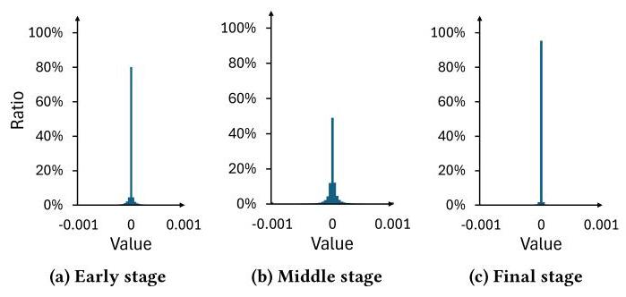

Figure 2: Distribution of the gradient values at three representative stages during VGG-19 training on CIFAR-100 dataset.

> 
图2：在CIFAR-100数据集上训练VGG-19的三个代表性阶段中梯度值的分布。

Prior works have explored various methods to minimize the preprocessing overhead of selecting important gradients. One approach is to use a static threshold to select the top- $k$ gradients [47]. However, this approach suffers from significant error [11], as the optimal threshold changes every iteration [3]. Thus, most recent works utilize a dynamic threshold for top- $k$ gradient selection. Spar-CML proposed selecting the top- $k$ gradients locally at each worker and execute an AllGather operation to synchronize the gradients across all workers [38]. However, one key challenge is that the selected gradient indices often differ across workers. As these sparse messages are aggregated during communication, the total number of unique indices - and thus, the message size - grows, diminishing the benefits of sparsification. This problem is commonly known as the fill-in issue. To mitigate this issue, $\mathrm{{gTop}}k$ proposed to recalculate the top- $k$ gradients at each AllReduce step to keep the message size constant [42] but suffers from high computation overhead. OkTopk proposes to execute additional AllReduce operations to ensure that the number of local top- $k$ gradient values across the workers is approximately the same to balance the communication load [25].

> 
先前的工作探索了多种方法来最小化选择重要梯度时的预处理开销。一种方法是使用静态阈值来选择 top- $k$ 梯度 [47]。然而，这种方法存在显著误差 [11]，因为最优阈值在每次迭代中都会变化 [3]。因此，大多数近期工作采用动态阈值进行 top- $k$ 梯度选择。Spar-CML 提出在每个工作节点本地选择 top- $k$ 梯度，并执行 AllGather 操作以在所有工作节点间同步梯度 [38]。然而，一个关键挑战是所选梯度的索引在不同工作节点之间往往不同。由于这些稀疏消息在通信过程中被聚合，唯一索引的总数 - 因此消息大小 - 会增长，从而削弱了稀疏化的好处。这个问题通常被称为填充（fill-in）问题。为了缓解这个问题，$\mathrm{{gTop}}k$ 提出在每一步 AllReduce 操作中重新计算 top- $k$ 梯度，以保持消息大小恒定 [42]，但计算开销很大。OkTopk 则提出执行额外的 AllReduce 操作，以确保各工作节点上本地 top- $k$ 梯度值的数量大致相同，从而平衡通信负载 [25]。

Low-rank approximation is another method for gradient compression. A notable example is PowerSGD, which uses power iteration [51]. Instead of sending the full gradients, it only communicates the approximation, which is much smaller, thereby reducing the message size. The receiver then reconstructs the full gradient tensor using the received low-rank tensors. Its main benefit is that it avoids irregular communication patterns, making it compatible with existing collective communication libraries. However, this approach introduces computational overhead to create the low-rank approximation and requires memory overhead for error accumulation.

> 
低秩逼近是另一种梯度压缩方法。一个显著的例子是PowerSGD，它使用了幂迭代法[51]。它不是发送完整的梯度，而是仅通信近似结果，这个近似结果要小得多，从而减少了消息大小。然后接收方使用接收到的低秩张量重建完整的梯度张量。其主要好处是它避免了不规则的通信模式，使其与现有的集体通信库兼容。然而，这种方法引入了创建低秩逼近的计算开销，并且需要为误差累积提供内存开销。

Gradient quantization is a method for reducing communication overhead by representing gradients with lower-precision numerical formats [3, 38]. This approach provides a theoretical speedup of $\frac{32}{{b}_{q}} \times$ over a 32-bit representation like FP32, where ${b}_{q}$ is the bit-width of the quantized format. Prior works have attempted to represent the gradients using fewer bits while showing minimal loss in accuracy. Gupta et al. demonstrate that training using 16-bit wide representation results in negligible degradation in image classification accuracy [17]. Aji et al. observe sufficient training accuracy on the MNIST [24] dataset using a 2-bit representation [3]. 1-bit representations have also been considered $\left\lbrack  {{40},{47}}\right\rbrack$ and the convergence guarantees of low-precision SGD have also been explored [4, 39]. It is important to note that gradient quantization is an orthogonal approach to gradient sparsification and compression approaches, as well as to SkipReduce.

> 
梯度量化是一种通过用更低精度的数值格式表示梯度来减少通信开销的方法[3, 38]。该方法理论上可实现相较于FP32等32位表示$\frac{32}{{b}_{q}} \times$的加速，其中${b}_{q}$为量化格式的位宽。先前的工作已尝试用更少的比特数表示梯度，同时仅表现出极小的精度损失。Gupta等人证明，使用16位宽表示进行训练对图像分类精度造成的退化可忽略不计[17]。Aji等人观察到在MNIST[24]数据集上使用2位表示即可达到足够的训练精度[3]。1位表示也已被考虑$\left\lbrack {{40},{47}}\right\rbrack$，并且低精度随机梯度下降的收敛保证也得到了探索[4, 39]。值得注意的是，梯度量化与梯度稀疏化、压缩方法以及SkipReduce都采用相互正交的思路。

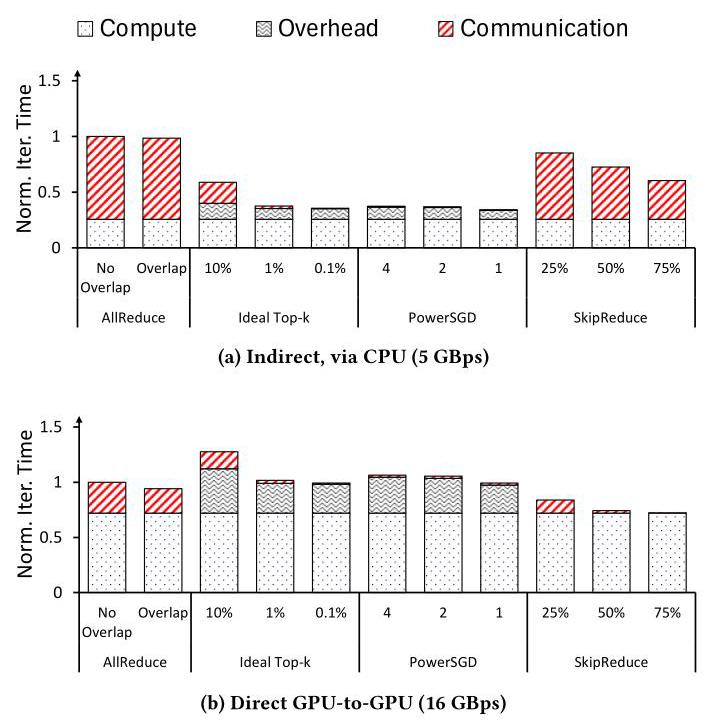

Figure 3: Breakdown of VGG-19 iteration time for various collective communications on an 8-GPU system across different channel bandwidths. The iteration time is normalized to AllReduce (no overlap) for each respective channel bandwidth.

> 
图 3：在不同信道带宽下，8 GPU 系统上各种集合通信的 VGG-19 迭代时间分解。迭代时间根据各自信道带宽下的 AllReduce（无重叠）进行了归一化。

Prior works have proposed in-network computation [15, 18, 20, 26, 27, 36] to accelerate communication by offloading the computation to the network. Software-based approaches have also been proposed to accelerate collective communications, e.g., novel logical topologies [18, 23, 28], logical topology synthesizer [55], and collective communication scheduler [37]. The resiliency of distributed data parallel training towards gradient dropping has also been exploited to reduce the tail latency of collective communications over lossy network transports, as demonstrated by MLT [52] and Op-TIREDUCE [53]. These works are orthogonal to SkipReduce and can be employed together to accelerate communication.

> 
先前的工作提出了网络内计算 [15, 18, 20, 26, 27, 36]，通过将计算卸载到网络来加速通信。也有基于软件的方法被提出以加速集体通信，例如，新型逻辑拓扑 [18, 23, 28]、逻辑拓扑合成器 [55] 以及集体通信调度器 [37]。分布式数据并行训练对梯度丢弃的弹性也被利用来减少在有损网络传输上的集体通信尾部延迟，如 MLT [52] 和 Op-TIREDUCE [53] 所展示的那样。这些工作与 SkipReduce 正交，可以共同用于加速通信。

## 3 Motivation

In this section, we describe the motivation for SkipReduce, which stems from the observation that gradients communicated during distributed training are often sparse. While prior works have also exploited this observation, they typically rely on sorting and compressing the gradients. However, we show how the computation overhead for such approaches can be significant as the channel bandwidth increases. In comparison, the SkipReduce proposed in this work does not have such computation overhead and, because of its simplicity, can be easily implemented in collective communication libraries. In this work, we propose to exploit network sparsity to improve communication performance by skipping some communication steps in AllReduce, effectively dropping gradients in "bunches" - thus, resulting in a reduction of communication time. Skipping gradients is essentially equivalent to assuming that they are zeros, and since the gradients are sparse, assuming them as zeros is a reasonable estimation.

> 
在本节中，我们阐述SkipReduce的动机，它源于这样一个观察：分布式训练中通信的梯度通常是稀疏的。虽然先前的工作也利用了这一点，但它们通常依赖对梯度进行排序和压缩。然而，我们展示了随着通道带宽的增加，这类方法的计算开销可能变得显著。相比之下，本文提出的SkipReduce没有这样的计算开销，并且由于其简单性，可以轻松地在集合通信库中实现。本工作中，我们提出利用网络稀疏性，通过在AllReduce中跳过某些通信步骤来改善通信性能，即以“成批”的方式丢弃梯度——从而减少通信时间。跳过梯度本质上等同于将其假定为零，而由于梯度是稀疏的，将其假定为零是一个合理的估计。

Figure 4: Tradeoff between performance (i.e., iteration time) and the amount of information communicated in LLaMA-3.2 1B training across different channel bandwidths. Communication-computation overlap is enabled. PowerSGD and ideal top- $k$ transmit very little information (close to 0%) and achieve high speedup at low bandwidth (a), but speedup is reduced at higher bandwidth due to computation overhead (b).

> 
图4：LLaMA-3.2 1B训练中性能（即迭代时间）与通信信息量在不同信道带宽下的权衡。通信-计算重叠已启用。PowerSGD和理想top- $k$传输的信息极少（接近0%），在低带宽（a）下实现了高加速比，但在较高带宽下，由于计算开销，加速比有所下降（b）。

Prior works $\left\lbrack  {3,{11},{25},{38},{42},{47}}\right\rbrack$ have shown that the gradients communicated during data parallel training are often narrowly distributed around zero or sparse. Figure 2 shows the gradient distribution over time throughout VGG-19 training. The gradient distribution differs across training stages - as the training progresses, the sparsity level decreases, which is shown by a wider distribution in Figure 2b, indicating a broader range of weights being updated. However, as the model converges, the gradients become increasingly sparse as shown in Figure 2c, reflecting fewer updates to the weights. In general, while the gradient distribution varies across different training stages, the gradients remain centered around zero throughout the entire training process, suggesting that data parallel training inherently exhibits high interconnection network sparsity.

> 
先前的研究$\left\lbrack  {3,{11},{25},{38},{42},{47}}\right\rbrack$表明，数据并行训练过程中传递的梯度通常呈现以零为中心的窄分布或稀疏状态。图2展示了VGG-19训练全过程的梯度分布随时间变化的情况。不同训练阶段的梯度分布存在差异——随着训练推进，稀疏程度下降，图2b中更宽的分布体现了这一点，表明有更广泛的权重参数在更新。然而，当模型趋于收敛时，梯度会如图2c所示变得越来越稀疏，反映出对权重的更新减少。总体而言，尽管梯度分布在不同的训练阶段有所变化，但在整个训练过程中梯度始终以零值为中心，这表明数据并行训练天然地展现出了较高的互连网络稀疏性。

While prior works have shown significant speedup in communication time, the benefits are typically evaluated on bandwidth-constrained systems (approximately 1 GBps bandwidth or lower [25, 29, 30, 38, 42, 51]). However, these approaches incur significant computation overhead on higher-bandwidth systems, which diminishes their benefit. Figure 3 provides the iteration time breakdown of VGG-19 [44] training with various collective communications on a system equipped with 8 A40 GPUs across different channel bandwidths. ${}^{2}$ We compare AllReduce with and without overlapping communication with computation, denoted as Overlap and No Overlap, respectively. For all other collective communications, overlapping is always enabled. To adjust the bandwidth, we configure the NCCL_P2P_DISABLE environment variable. Disabling peer-to-peer (or GPU-to-GPU) communication forces the data to go through the host CPU, reducing the bandwidth to approximately 5 GBps. When peer-to-peer communication is enabled, a bandwidth of up to 16 GBps can be achieved. This value is lower than the theoretical maximum of PCIe 4.0 supported by A40 GPUs since the interconnect between CPU sockets becomes the performance bottleneck. At lower bandwidths, where the training time is dominated by communication time, the communication time savings significantly outweigh the computational overhead, enabling compression or approximate-based approaches to achieve a significant speedup. However, as bandwidth increases, the communication time decreases while the computation overhead remains constant. Eventually, the cost of executing compression or approximation dominates the communication time, diminishing the benefits of such techniques, as illustrated in Figure 3b.

> 
虽然先前的工作在通信时间方面已展现出显著加速，但这些收益通常在带宽受限的系统上评估（约1 GBps带宽或更低[25, 29, 30, 38, 42, 51]）。然而，这些方法在更高带宽系统上会产生显著的计算开销，从而削弱其优势。图3展示了在配备8块A40 GPU的系统上，不同通道带宽条件下VGG-19[44]训练使用各种集合通信的迭代时间分解。${}^{2}$ 我们对比了分别启用与关闭通信计算重叠的AllReduce（标记为重叠与非重叠）。所有其他集合通信方式均始终启用重叠功能。通过配置NCCL_P2P_DISABLE环境变量来调节带宽：禁用点对点（即GPU间直接）通信会强制数据经由主机CPU传输，使带宽降至约5 GBps；而当启用点对点通信时，带宽最高可达16 GBps。这一数值低于A40 GPU所支持PCIe 4.0的理论最大值，因为CPU插槽间的互连成为性能瓶颈。在低带宽环境下（训练时间由通信主导），通信时间的节省显著超过计算开销，使压缩或近似方法得以实现显著加速。然而随着带宽提升，通信时间缩短而计算开销保持恒定，最终执行压缩或近似计算的成本将主导通信时间，从而削弱这些技术的优势，如图3b所示。

To further illustrate the limitations of prior works on higher-bandwidth systems, Figure 4 presents the tradeoff between the ratio of transmitted information and communication time speedup. Ideally, communication should be both fast and with minimal amount of information loss, corresponding to the top-right region of the plots. Prior works either compress or approximate the gradients to aggressively reduce the message size, transmitting only a small fraction of information to achieve substantial speedups at low bandwidth. However, at higher bandwidths, these approaches suffer from the same level of information loss while offering diminished speedups, as their computation overhead becomes more prominent. In contrast, although SkipReduce provides relatively less speedup at lower bandwidths, it achieves comparable speedups to prior works at higher bandwidths with significantly less information loss. This advantage is further validated in the time-to-accuracy evaluations presented in Section 5.2.

> 
为进一步说明先前工作在高带宽系统上的局限性，图 4 展示了信息传输比例与通信时间加速比之间的权衡关系。理想情况下，通信应当既快速又能尽量减少信息损失，对应于图表中右上角的区域。先前的工作要么对梯度进行压缩，要么采用近似方法，以大幅缩减消息体积，在低带宽条件下仅传输一小部分信息即可实现显著加速。然而，在更高带宽环境下，这些方法仍面临同等程度的信息损失，且由于计算开销愈发突出，其加速效果反而减弱。相比之下，尽管 SkipReduce 在低带宽条件下的加速效果相对有限，但在高带宽下它能以远低的信息损失实现与先前工作相近的加速表现。这一优势将在第 5.2 节呈现的到达准确率的时间评估结果中得到进一步验证。

## 4 SkipReduce Collective Communication

Leveraging the observation that gradients are sparse, we explore how training time can be reduced by skipping gradients and propose the SkipReduce collective communication. Unlike prior works, SkipReduce introduces no computation overheads (indexing, preprocessing and reconstruction overhead) and can be easily integrated into existing collective communication libraries.

> 
利用梯度稀疏的观察，我们探索了如何通过跳过梯度来减少训练时间，并提出了 SkipReduce 集合通信方法。与先前工作不同，SkipReduce 不引入任何计算开销（索引、预处理和重构开销），并且可以轻松集成到现有的集合通信库中。

### 4.1 Preliminaries

In this work, we differentiate between skipping and dropping of gradients. Skipping gradients refers to where the values of the gradients are ignored and effectively replaced with zeros. In comparison, dropping gradients refers to where the gradients themselves are completely removed from the operation. For sum operation, there is no difference with skipping, but for average, dropping changes the divisor, resulting in a different outcome. In addition, we differentiate between fine-grained and coarse-grained skipping or dropping. Fine-grained refers to collective communication where each individual gradient is skipped (or dropped). For a coarse-grained implementation, gradients are coarsely skipped (or dropped) at slice-level granularity.

> 
在本工作中，我们区分了跳梯度与丢梯度。跳过梯度是指梯度值被忽略并有效替换为零。相比之下，丢弃梯度是指梯度本身被彻底移出操作。对于求和操作而言，跳过并无区别，但对于求平均而言，丢弃会改变除数，从而导致不同的结果。此外，我们还区分了细粒度与粗粒度的跳过或丢弃。细粒度是指在集合通信中每个梯度被单独跳过（或丢弃）。而粗粒度实现中，梯度以切片级粒度被粗略地跳过（或丢弃）。

---

${}^{2}$ The ideal top- $k$ implementation will be discussed in Section 5.1

> 
${}^{2}$ 理想的 top- $k$ 实现将在第 5.1 节中讨论。

---

Figure 5: Proposed SkipReduce where one step in the Reduce-Scatter phase is skipped. Diagonally striped slices represent gradients that are effectively "dropped" during the Reduce-Scatter phase and are not used during the AllReduce collective communication. AllGather proceeds identically to the baseline AllReduce.

> 
图 5：提议的 SkipReduce，其中 Reduce-Scatter 阶段的一个步骤被跳过。对角条纹的切片代表在 Reduce-Scatter 阶段被有效“丢弃”的梯度，并且在 AllReduce 集合通信期间不被使用。AllGather 与基线 AllReduce 完全相同地进行。

Algorithm 1 AllReduce with Fine-Grained Skipping

> 
算法1 细粒度跳过的AllReduce

---

$N$ : number of workers (e.g., GPUs)

> 
$N$ : 工作节点数量（例如，GPU）

$T$ : tensor of local gradients, divided into slices

> 
$T$：局部梯度张量，被划分为多个切片

$p$ : gradient skipping probability

> 
$p$：梯度跳过概率

ReduceOrSKIP $\left( {A, B, p,{op}}\right)$ :

> 
ReduceOrSKIP $\left( {A, B, p,{op}}\right)$ :

for each index $i$ in $A$ do

> 
对于$A$中的每个索引$i$执行

if rand_float $\left\lbrack  {{0.0},{1.0}}\right\rbrack   < p$ then

> 
如果 rand_float $\left\lbrack  {{0.0},{1.0}}\right\rbrack   < p$ 则

$A\left\lbrack  i\right\rbrack   = B\left\lbrack  i\right\rbrack$

> 
$A\left\lbrack  i\right\rbrack   = B\left\lbrack  i\right\rbrack$

else

> 
本文针对分布式数据并行训练中的通信瓶颈问题，提出 **SkipReduce**——一种通过跳过部分 AllReduce 步骤、以极小精度损失换取通信时间缩短的集合通信方法。其核心洞察在于：梯度值通常呈稀疏分布（接近零），因此随机将一部分梯度视为零——类似于对梯度施加 dropout——是可容忍的。与以往的梯度压缩技术（如 top‑k、PowerSGD）不同，SkipReduce 避免了复杂的索引、压缩或误差累积开销；它通过直接省略 Reduce‑Scatter 阶段的部分通信步骤，从而等效地跳过整个梯度分块。

简单实现若每次都跳过相同的分块会引入偏差，损害精度。为解决此问题，作者提出 **Random SkipReduce**，在每次迭代中利用同步随机偏移量改变所跳过分块的索引，从而在几乎无额外开销的条件下保持精度。他们进一步观察到，不同网络层之间的梯度稀疏度存在差异，且重要梯度集中在小而敏感的层中。因此，**Selective SkipReduce** 仅对不敏感层应用跳过操作，保护关键层，从而维持甚至提升精度。

在采用 8 块 GPU、涵盖 VGG‑19、BERT‑Large 与 LLaMA‑3.2 1B 的训练中评估表明，SkipReduce 较基线 AllReduce 实现了最高 **1.58 倍的精度达标时间加速**，同时最终精度持平。在带宽较高的场景下，该方法优于理想化的 top‑k 和 PowerSGD，因为后者计算开销占据主导。该技术易于集成到现有的 NCCL 环形 AllReduce 中，并可扩展至其他逻辑拓扑结构与分片数据并行，甚至还能充当有益的正则化器。

$A\left\lbrack  i\right\rbrack   = {op}\left( {A\left\lbrack  i\right\rbrack  , B\left\lbrack  i\right\rbrack  }\right)$

> 
$A\left\lbrack  i\right\rbrack   = {op}\left( {A\left\lbrack  i\right\rbrack  , B\left\lbrack  i\right\rbrack  }\right)$

return $A$

> 
return $A$

AllREDUCE_DROPOUT $\left( {p,{op}}\right)$ :

> 
全规约丢弃法 $\left( {p,{op}}\right)$ :

for $i = 0$ to $\left( {N - 2}\right)$ do $//\left( {N - 1}\right)$ Reduce-Scatter steps

> 
for $i = 0$ to $\left( {N - 2}\right)$ do $//\left( {N - 1}\right)$ Reduce-Scatter steps

send_slice $= \left( {\text{ rank } - i}\right) \% N$

> 
send_slice $= \left( {\text{ rank } - i}\right) \% N$

recv_slice $= \left( {\text{ rank } - i - 1}\right) \% N$

> 
recv_slice $= \left( {\text{ rank } - i - 1}\right) \% N$

$\operatorname{SEND}\left( {T\left\lbrack  \text{ send\_slice }\right\rbrack  ,\text{ rank } + 1}\right)$

> 
$\operatorname{SEND}\left( {T\left\lbrack  \text{ send\_slice }\right\rbrack  ,\text{ rank } + 1}\right)$

recv_data = RECEIVE(rank - 1)

> 
recv_data = RECEIVE(rank - 1)

$T\left\lbrack  \text{ recv\_slice }\right\rbrack   = \operatorname{REDUCEORSKIP}(T\left\lbrack  \text{ recv\_slice }\right\rbrack$ ,

> 
$T\left\lbrack  \text{ recv\_slice }\right\rbrack   = \operatorname{REDUCEORSKIP}(T\left\lbrack  \text{ recv\_slice }\right\rbrack$ ,

recv_data, p, op)

> 
recv_data, p, op)

ALLGATHER() // same as baseline AllReduce

> 
ALLGATHER() // 与基线 AllReduce 相同

---

We first summarize different variations of AllReduce and SkipReduce collective communications that are presented in this work.

> 
我们首先总结本文所介绍的 AllReduce 和 SkipReduce 集合通信的不同变体。

- AllReduce_Dropout : fine-grained skipping of individual gradients. Individual gradients are randomly skipped.

> 
- AllReduce_Dropout：细粒度的单个梯度跳过。单个梯度被随机跳过。

- SkipReduce: coarse-grained gradient skipping where some steps of AllReduce are skipped and gradients are effectively replaced by zeros.

> 
- SkipReduce：粗粒度的梯度跳过，其中 AllReduce 的某些步骤被跳过，梯度被有效地替换为零。

- DropReduce: coarse-grained gradient dropping where some steps of AllReduce are skipped and gradients are completely removed by adjusting the divisor (for average operation).

> 
- DropReduce：粗粒度的梯度丢弃，通过跳过 AllReduce 的某些步骤并调整除数（用于平均操作）来完全移除梯度。

### 4.2 SkipReduce Algorithm

Overview of AllReduce with fine-grained skipping, an approach similar to Dropout [45] but applied to gradients, referred to as AllRe-duce_Dropout, is shown in Algorithm 1. The algorithm is based on the conventional Ring AllReduce and the only difference is the introduction of a gradient skipping probability to the reduction kernel (line 14) - to determine whether the gradient should be used or "skipped." For each element in the slice, a random decision is made based on the Bernoulli process to either reduce or skip the local gradient (line 3). If a gradient is skipped, the current GPU simply forwards the gradient that it receives from the previous GPU without adding the local gradient (line 4). This is equivalent to treating the local gradient as zero for that particular operation. If a gradient is not skipped, the current GPU reduces its own local gradient with the gradient received from the previous GPU, and forwards the result to the next GPU (line 6). This behavior is equivalent to the default reduction kernel in NCCL.

> 
细粒度跳过的AllReduce概述，这种方法类似于Dropout [45]但应用于梯度，被称为AllRe-duce_Dropout，如算法1所示。该算法基于传统的Ring AllReduce，唯一的区别是在归约内核（第14行）中引入了梯度跳过概率——用于决定梯度应该被使用还是“跳过”。对于切片中的每个元素，基于伯努利过程做出随机决策，以决定是归约还是跳过本地梯度（第3行）。如果梯度被跳过，当前GPU就简单地将它从前一个GPU接收到的梯度转发出去，而不添加本地梯度（第4行）。这等同于在该特定操作中将本地梯度视为零。如果梯度未被跳过，当前GPU将自身的本地梯度与从前一个GPU接收到的梯度进行归约，并将结果转发给下一个GPU（第6行）。这种行为等同于NCCL中的默认归约内核。

Algorithm 2 Static SkipReduce

> 
算法2 静态 SkipReduce

---

SKIPREDUCE(S, op): // S: # of Reduce-Scatter steps to skip

> 
SKIPREDUCE(S, op): // S: # of Reduce-Scatter steps to skip

for $i = S$ to $\left( {N - 2}\right)$ do // Skip S Reduce-Scatter steps

> 
对于 $i = S$ 到 $\left( {N - 2}\right)$ 执行 // 跳过 S 个 Reduce-Scatter 步骤

send_slice $= \left( {\text{ rank } - i}\right) \% N$

> 
本文针对分布式数据并行训练中的通信瓶颈问题，提出 **SkipReduce**，一种通过跳过部分 AllReduce 步骤来减少通信时间且精度损失极小的集合通信方法。其核心洞察在于梯度值往往是稀疏的（接近零），因此随机将一部分梯度视为零——类似于对梯度施加 dropout——是可接受的。与之前的梯度压缩技术（如 top‑k、PowerSGD）不同，SkipReduce 避免了复杂的索引、压缩或误差累积开销；它通过简单地省略通信步骤的一个子集来修改 Reduce‑Scatter 阶段，从而有效跳过整个梯度片段。

一种总是跳过相同片段的朴素实现会引入偏差并损害精度。为缓解这一问题，作者引入 **Random SkipReduce**，其中跳过的片段索引在每次迭代中通过同步的随机偏移量进行移位，在可忽略的开销下保持了精度。他们进一步观察到，不同网络层的梯度稀疏性存在差异，且重要梯度集中在小型敏感层中。因此，**Selective SkipReduce** 仅对不敏感层应用跳过操作，保护关键层以维持甚至提高精度。

在采用 8 个 GPU 训练 VGG‑19、BERT‑Large 和 LLaMA‑3.2 1B 的实验中，SkipReduce 在匹配最终精度的同时，相对于基线 AllReduce 获得了高达 **1.58 倍的达到特定精度的时间加速比**。在带宽较高的场景中，该方法优于理想化的 top‑k 和 PowerSGD，因为后者的计算开销占据主导地位。该技术易于集成到现有的 NCCL 环状 AllReduce 中，并可扩展至其他逻辑拓扑、分片数据并行，甚至可作为一种有益的正则化手段。

send_slice $= \left( {\text{ rank } - i}\right) \% N$

recv_slice $= \left( {\text{ rank } - i - 1}\right) \% N$

> 
recv_slice $= \left( {\text{ rank } - i - 1}\right) \% N$

$\operatorname{SEND}\left( {T\left\lbrack  \text{ send\_slice }\right\rbrack  ,\text{ rank } + 1}\right)$

> 
$\operatorname{SEND}\left( {T\left\lbrack  \text{ send\_slice }\right\rbrack  ,\text{ rank } + 1}\right)$

recv_data = RECEIVE(rank - 1)

> 
recv_data = RECEIVE(rank - 1)

$T\left\lbrack  \text{ recv\_slice }\right\rbrack   =$ REDUCEORSKIP $(T\left\lbrack  \text{ recv\_slice }\right\rbrack$ ,

> 
$T\left\lbrack  \text{ recv\_slice }\right\rbrack   =$ REDUCEORSKIP $(T\left\lbrack  \text{ recv\_slice }\right\rbrack$ ,

recv_data, 0, op)

> 
本文通过提出 **SkipReduce** 解决了分布式数据并行训练中的通信瓶颈问题，这是一种跳过部分 AllReduce 步骤的集合通信方法，可在降低通信时间的同时仅带来极小精度损失。其核心洞察在于梯度值往往稀疏（接近零），因此随机将一部分视为零——类似对梯度应用 dropout——是可以容忍的。与先前的梯度压缩技术（例如 top‑k、PowerSGD）不同，SkipReduce 避免了复杂的索引、压缩或误差累积开销；它通过简单省略部分通信步骤来修改 Reduce‑Scatter 阶段，从而有效跳过整个梯度分片。

一种总是跳过相同分片的朴素实现会引入偏差并降低精度。为缓解这一问题，作者引入了 **Random SkipReduce**，即每轮迭代通过同步的随机偏移量来移动所跳过的分片索引，以可忽略的开销保持精度。他们进一步观察到，梯度稀疏性在不同网络层间存在差异，重要的梯度集中在小型敏感层中。因此，**Selective SkipReduce** 仅对不敏感层应用跳过，保护关键层，从而维持甚至提升精度。

在 8 GPU 上对 VGG‑19、BERT‑Large 和 LLaMA‑3.2 1B 训练进行的评估中，SkipReduce 相较于基线 AllReduce 实现了高达 **1.58 倍的达到目标精度的时间加速**，同时匹配最终精度。在带宽较高的设置下，其性能优于理想化的 top‑k 和 PowerSGD，因为后两者计算开销占据主导。该技术易于集成到现有的基于 NCCL 环形 AllReduce 中，并可扩展到其他逻辑拓扑、分片数据并行，甚至能作为一种有益的正则化手段。

ALLGATHER() // same as baseline AllReduce

> 
ALLGATHER() // same as baseline AllReduce

---

However, fine-grained skipping (AllReduce_Dropout) does not reduce the message size or the amount of data transmitted between GPUs, but merely reduces the information content that each message carries. For example, without skipping, a packet contains the reduction results from all $\left( {N - 1}\right)$ previous GPUs. In contrast, with skipping, a packet only contains results from $\left( {N - 2}\right)$ GPUs or fewer but the message size remains constant. On the other hand, SkipReduce leverages the fact that NCCL communicates gradients in slices (Section 2.2). By skipping AllReduce steps, it effectively skips gradient "slices", not individual gradients, to reduce communication time. Figure 5 provides an example of SkipReduce where, by skipping one step from the Reduce-Scatter phase, an entire gradient slice from each GPU is skipped from the final reduction. This directly shortens the duration of the collective operation. Theoretically, skipping $S$ steps of Reduce-Scatter cuts the communication time by a fraction of $S/2\left( {N - 1}\right)$ while skipping a corresponding $S/N$ fraction of the gradients.

> 
然而，细粒度的跳过（AllReduce_Dropout）并不会减少消息大小或 GPU 之间传输的数据量，而只是降低了每条消息所携带的信息内容。例如，在不跳过的情况下，一个数据包包含了来自全部 $\left( {N - 1}\right)$ 个先前 GPU 的规约结果。相比之下，采用跳过时，一个数据包仅包含来自 $\left( {N - 2}\right)$ 个或更少 GPU 的结果，但消息大小保持不变。另一方面，SkipReduce 利用了 NCCL 以切片形式通信梯度的特性（第 2.2 节）。通过跳过 AllReduce 步骤，它有效地跳过了梯度“切片”，而非单个梯度，从而减少通信时间。图 5 给出了 SkipReduce 的一个示例，其中通过跳过 Reduce-Scatter 阶段的一个步骤，每个 GPU 的整个梯度切片都被从最终规约中跳过。这直接缩短了集合操作的持续时间。理论上，跳过 Reduce-Scatter 的 $S$ 个步骤可将通信时间降低 $S/2\left( {N - 1}\right)$ 的比例，同时跳过相应的 $S/N$ 比例的梯度。

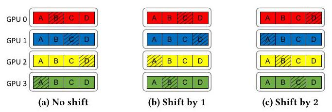

Figure 6: The skipped slices (shown by the diagonal stripes) in (a) baseline SkipReduce, (b) with the slice indices being shifted by one rank, and (c) shifted by two ranks.

> 
图6：在（a）基线SkipReduce、（b）分片索引被移动一个排名以及（c）移动两个排名时，被跳过的分片（斜条纹所示）。

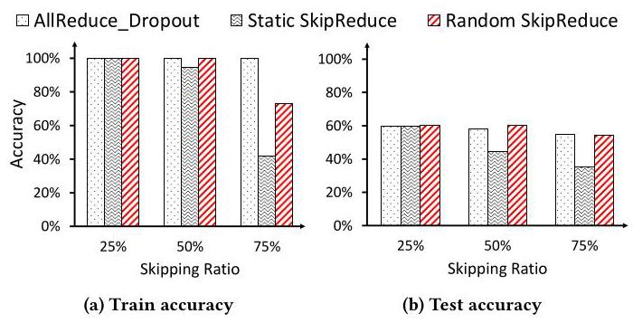

Figure 7: VGG-19 train and test accuracy with AllRe-duce_Dropout, Static SkipReduce and Random SkipReduce. Accuracy is normalized to baseline AllReduce with no skipping of gradients.

> 
图 7：使用 AllReduce_Dropout、静态 SkipReduce 和随机 SkipReduce 时 VGG-19 的训练与测试准确率。准确率以无梯度跳过的基线 AllReduce 为基准进行归一化。

An overview of the SkipReduce algorithm is provided in Algorithm 2. SkipReduce is implemented by reducing the number of iterations in the Reduce-Scatter loop. If $S$ is the number of Reduce-Scatter steps to be skipped, the Reduce-Scatter phase completes in $\left( {N - 1 - S}\right)$ steps (line 2), while the AllGather phase is unmodified and finishes in $\left( {N - 1}\right)$ steps (line 8). As we show later in Section 5.2, steps in the AllGather can also be skipped but result in higher loss of accuracy. Since SkipReduce only skips slices (coarse-grained), the fine-grained gradient skipping probability $\left( p\right)$ of the ReduceOrSkip function is set to zero (line 7) as this is only needed for fine-grain skipping.

> 
算法 2 概述了 SkipReduce 算法。SkipReduce 通过减少 Reduce-Scatter 循环的迭代次数来实现。若 $S$ 为要跳过的 Reduce-Scatter 步数，则 Reduce-Scatter 阶段在 $\left( {N - 1 - S}\right)$ 步内完成（第 2 行），而 AllGather 阶段保持不变，在 $\left( {N - 1}\right)$ 步内完成（第 8 行）。正如我们在第 5.2 节中所示，AllGather 中的步也可被跳过，但会导致更大的精度损失。由于 SkipReduce 仅跳过切片（粗粒度），ReduceOrSkip 函数的细粒度梯度跳过概率 $\left( p\right)$ 设为零（第 7 行），因为仅细粒度跳过才需要该参数。

### 4.3 Random SkipReduce

As discussed earlier, SkipReduce reduces communication time by skipping steps within AllReduce (e.g., Reduce-Scatter steps), skipping data in slice-level granularity in the process. However, naive implementation of SkipReduce (Section 4.2) is deterministic, e.g., each GPU skips the same slice during each iteration. This causes unfairness (or bias), as the same particular slices do not contribute to the collective communication result. To allow each GPU to skip different slices at each iteration, the slice indexes (Algorithm 2, line 3 and 4) can be shifted by a random offset that is regenerated every iteration. We refer to this as Random SkipReduce, as compared to Static SkipReduce in Section 4.2. This ensures that the skipped slices vary across iterations, promoting randomness in the skipped gradient slices. One key challenge is that all GPUs must generate the same random number to ensure that each GPU has a unique index. We implement this without additional synchronizations by modifying NCCL to pass the current iteration count from the host to all GPUs. This iteration count serves as a common seed, ensuring that the random number generator on each GPU is synchronized. An example is shown in Figure 6 where shifting the slice indices changes which slices are skipped by the end of the collective communication for a given training iteration. The skipped slices when no shifting is applied are exactly the same as the example shown in Figure 5.

> 
如前所述，SkipReduce 通过跳过 AllReduce 中的步骤（例如 Reduce-Scatter 步骤）来减少通信时间，并在过程中以切片粒度跳过数据。然而，朴素的 SkipReduce 实现（第 4.2 节）是确定性的，例如，每次迭代时每个 GPU 都跳过相同的切片。这会导致不公平（或偏差），因为相同的特定切片不会对集体通信结果做出贡献。为了让每个 GPU 在每次迭代时跳过不同的切片，切片索引（算法 2，第 3 行和第 4 行）可以通过每次迭代重新生成的随机偏移量进行移位。我们将其称为随机 SkipReduce，以区别于第 4.2 节中的静态 SkipReduce。这确保了每次迭代中跳过的切片各不相同，从而在跳过的梯度切片中引入随机性。一个关键挑战是，所有 GPU 必须生成相同的随机数，以确保每个 GPU 拥有唯一的索引。我们通过修改 NCCL，将当前迭代计数从主机传递给所有 GPU，从而在无需额外同步的情况下实现这一点。该迭代计数作为公共种子，确保每个 GPU 上的随机数生成器保持同步。图 6 给出了一个示例，展示了在给定训练迭代中，通过移位切片索引改变了集体通信结束时跳过的切片。在未应用移位时跳过的切片，与图 5 所示示例完全相同。

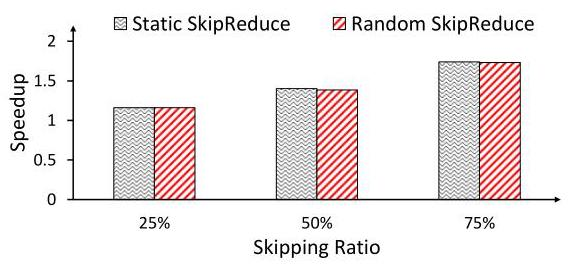

Figure 8: Speedup of Static and Random SkipReduce for different gradient skipping ratios, relative to AllReduce (no gradients skipped) using nccl-test with 1 GB message size AllReduce.

> 
图8：在 nccl-test 中，针对 1 GB 消息大小的 AllReduce，不同梯度跳过比例下静态 SkipReduce 和随机 SkipReduce 相对于 AllReduce（无梯度跳过）的加速比。

Figure 7 compares the training accuracy when Static and Random SkipReduce are used for collective communication on VGG-19 training. ${}^{3}$ AllReduce_Dropout skips gradients in element-wise granularity and thus provides no communication time reduction. Random SkipReduce achieves higher accuracy than Static SkipReduce as the skipping ratio increases, where Random SkipReduce improves the test accuracy by 19 percentage points at a 75% skipping rate. For all rates, Random SkipReduce matches the test accuracy achieved with AllReduce_Dropout. To understand the performance overhead of randomizing the slice indexes, Figure 8 compares the synthetic, collective communication-only performance of Random SkipReduce against Static SkipReduce. Static SkipReduce closely approaches the theoretical speedup of $\frac{2\left( {N - 1}\right) }{2\left( {N - 1}\right)  - S}$ , where $N$ is the number of nodes and $S$ is the number of Reduce-Scatter steps skipped. In comparison, Random SkipReduce achieves a speedup that is nearly identical to its static counterpart, with a performance (i.e., communication time) overhead of only up to 1.1%. This demonstrates that randomization, which improves model accuracy, can be implemented with negligible overhead.

> 
图 7 比较了在 VGG-19 训练中，采用静态 SkipReduce 和随机 SkipReduce 进行集合通信时的训练精度。${}^{3}$ AllReduce_Dropout 以元素级粒度跳过梯度，因此不会减少通信时间。随着跳过比例的增加，随机 SkipReduce 的精度高于静态 SkipReduce，其中在 75% 跳过率下，随机 SkipReduce 将测试精度提升了 19 个百分点。在所有跳过率下，随机 SkipReduce 均达到了与 AllReduce_Dropout 相当的测试精度。为了理解随机化切片索引所带来的性能开销，图 8 对比了随机 SkipReduce 与静态 SkipReduce 在仅包含集合通信的合成测试下的性能。静态 SkipReduce 接近理论加速比 $\frac{2\left( {N - 1}\right) }{2\left( {N - 1}\right)  - S}$ ，其中 $N$ 是节点数，$S$ 是跳过的 Reduce-Scatter 步数。相比之下，随机 SkipReduce 实现的加速比几乎与其静态版本相同，性能（即通信时间）开销最多仅增加 1.1%。这表明，能够提升模型精度的随机化可以以可忽略的开销实现。

### 4.4 Selective SkipReduce

The magnitude of a gradient is often used as a proxy for its "importance" [5]. For example, top- $k$ sparsification techniques, which preserve the top- $k$ largest gradients in an element-wise manner, have been shown to outperform random-based approaches [46]. In this section, we adapt this principle for SkipReduce, but at a coarser, layer-level granularity, rather than an element-wise one. This enables SkipReduce to skip gradients selectively to preserve model accuracy.

> 
梯度的大小常被用作其“重要性”的代理指标 [5]。例如，top- $k$ 稀疏化技术以逐元素的方式保留前 $k$ 个最大的梯度，已被证明优于基于随机的方法 [46]。在本节中，我们将这一原则应用于 SkipReduce，但采用的是更粗的层级粒度，而非逐元素粒度。这使得 SkipReduce 能够有选择地跳过梯度，以保持模型精度。

---

${}^{3}$ Evaluation methodology is described in Section 5.1.

> 
${}^{3}$ 评估方法在第5.1节中描述。

---

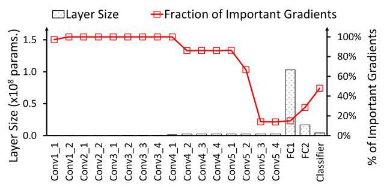

Figure 9: Layer size (number of parameters) and concentration of important gradients within each layer of VGG-19. An important gradient is defined as one that ranks among the global top-25% by magnitude.

> 
图 9：VGG-19 中各层的层大小（参数数量）及重要梯度的集中情况。重要梯度定义为按幅度排名全局前 25% 的梯度。

Figure 10: Tradeoff between the fraction of skipped gradients and test accuracy of (a) VGG-19 and (b) BERT-Large as different parts of the models (or layers) are skipped. SkipReduce skips across all layers, whereas SkipReduce() refers to skipping only the layers specified in the parentheses. The fraction of skipped gradients varies as different layers are targeted.

> 
图 10：对 (a) VGG-19 和 (b) BERT-Large 按模型不同部分（或层）跳过时，跳过梯度的比例与测试准确率之间的权衡。SkipReduce 在所有层上跳过，而 SkipReduce() 表示仅跳过括号中指定的层。跳过梯度的比例随目标层的不同而变化。

Figure 9 shows the layer size or the number of parameters for each layer of VGG-19, along with the distribution of important gradients throughout the model. The important gradients are those whose magnitudes are within the global top ${25}\%$ , sampled at the end of the first epoch. This plot reveals that gradient sparsity is non-uniform across the layers of the model, as shown by the concentration of large-magnitude gradients in certain layers. Since the magnitude of a gradient correlates with its importance, layers with a high concentration of large-magnitude gradients can be considered more important and thus more sensitive to skipping. Conversely, layers with fewer important gradients are less sensitive and are better candidates for skipping. Furthermore, we observe that the important layers can be much smaller in size than the non-important ones. This presents a key opportunity to achieve significant communication speedup by skipping the large, non-important layers while protecting the small, critical ones to maintain training accuracy. While understanding why some layers have relatively higher importance may require rigorous theoretical understanding and is outside the scope of this work, the importance of certain layers can be intuitive. For instance, we can expect the first convolutional layer in VGG-19 and the embedding layer in transformers to be more sensitive to skipping as they initiate the projection of the input into the network's latent space.

> 
图9展示了VGG-19各层的层大小（即参数数量），以及重要梯度在模型中的分布情况。这里的重要梯度是指在前${25}\%$全局幅度内的梯度，采样于第一个epoch结束时刻。该图显示梯度稀疏性在模型各层之间并不均匀，大幅值梯度集中在某些层中。由于梯度的幅度与其重要性相关，因此大幅值梯度高度集中的层可被视为更重要的层，对跳过操作也更为敏感。反之，重要梯度较少的层敏感度更低，是更适合跳过的候选对象。此外，我们观察到重要层的层大小可能远小于非重要层。这提供了一个关键契机：通过跳过大尺寸的非重要层，同时保护小尺寸的关键层以维持训练精度，可以实现显著的通信加速。尽管要理解某些层为何具有相对更高的重要性可能需要严格的理论分析，且已超出本工作的范围，但某些层的重要性依然可以直观理解。例如，可以预料VGG-19的第一层卷积层和Transformer中的嵌入层对跳过操作更为敏感，因为它们负责将输入投射到网络的潜在空间中。

Table 2: Evaluated models and their training datasets.

> 
表 2：评估的模型及其训练数据集。

<table><tr><td>Tasks</td><td>Models</td><td>Datasets</td></tr><tr><td>Image classification</td><td>VGG-19 [44]</td><td>CIFAR-100 [21]</td></tr><tr><td>Multiple choice</td><td>BERT-Large [10]</td><td>SWAG [56]</td></tr><tr><td>Sentence understanding</td><td>LLaMA-3.2 1B [16]</td><td>MNLI [54]</td></tr></table>

To further demonstrate the difference in sensitivity to skipping across different layers of a network, Figure 10 shows the test accuracy as we protect (not skip) some of the layers in the model. The ratio of skipped gradients is calculated by multiplying the proportion of the protected layers relative to the overall model size by a fixed skipping rate of ${50}\%$ . Ideally, we aim to skip as many gradients as possible to achieve communication speedup while maintaining model accuracy. Therefore, data points closer to the top-right corner of the scatter plot are preferred. Figure 10a provides an example of the reduced benefit of protecting less important layers and protecting more gradients does not simply result in higher accuracy. By protecting the important convolutional layers whose number of parameters amounts to only 4% of the total model size, we are able to match and even improve the accuracy by 0.23 percentage point compared to AllReduce (no gradients are skipped). However, by protecting the fully connected layers instead, the accuracy drops by 5 percentage points even though the remaining 96% of the gradients are protected. A similar trend is observed in BERT-Large, as shown in Figure 10b. Protecting the important layers (i.e., embedding) leads to a significant improvement in accuracy. This observation motivates the design of SkipReduce to selectively skip gradients by protecting (not skipping) the important layers.

> 
为了进一步展示网络不同层对跳过（skip）的敏感度差异，图10展示了当我们保护（不跳过）模型中某些层时的测试准确率。跳过梯度的比例是通过将受保护层占总体模型大小的比例乘以固定的${50}\%$跳过率计算得出的。理想情况下，我们的目标是跳过尽可能多的梯度，以在保持模型准确率的同时实现通信加速。因此，散点图中更接近右上角的数据点更受青睐。图10a示例说明了保护不太重要的层带来的收益降低，并且保护更多梯度并不简单地带来更高的准确率。通过保护那些参数数量仅占总体模型大小4%的重要卷积层，我们能够达到甚至超过AllReduce（无梯度跳过）的准确率，提升0.23个百分点。然而，如果改为保护全连接层，尽管其余96%的梯度都受到保护，准确率仍会下降5个百分点。如图10b所示，在BERT-Large中也观察到了类似的趋势。保护重要层（即嵌入层）可以使准确率显著提升。这一观察启发了SkipReduce的设计，即通过保护（不跳过）重要层来选择性地跳过梯度。

To enable selective gradient skipping in SkipReduce, we leverage the fact that gradients are not communicated all at once, but are instead partitioned into buckets. This design, where each bucket is processed by a separate AllReduce kernel launch, allows communication to be overlapped with computation. By exploiting this structure, we can apply different skipping rates to different buckets - aggressively skipping gradients in buckets associated with non-important layers, while preserving those in buckets containing important layers. For the rest of this work, SkipReduce refers to Selective SkipReduce unless otherwise specified - gradients at the non-important layers are skipped randomly, as in Random SkipReduce.

> 
为了在SkipReduce中实现选择性梯度跳过，我们利用了梯度并非一次全部传送，而是被划分为若干桶（buckets）这一事实。这种设计——每个桶由单独的AllReduce内核启动（AllReduce kernel launch）处理——使得通信能够与计算重叠。通过利用这一结构，我们可以对不同桶应用不同的跳过率——对与非重要层关联的桶中的梯度进行激进跳过，同时保留包含重要层的桶中的梯度。在本工作的其余部分，除非另有说明，SkipReduce均指选择性SkipReduce（Selective SkipReduce）——非重要层的梯度采用随机跳过，如同在随机SkipReduce（Random SkipReduce）中那样。

## 5 Evaluation

### 5.1 Methodology

SkipReduce is implemented within NCCL version 2.25.1 [1]. The cu-RAND [2] library is used to generate the random numbers required to implement Random SkipReduce (Section 4.3). PyTorch [33] is then linked to the modified NCCL to implement SkipReduce for training. NCCL is configured to use Ring AllReduce algorithm. Evaluation is conducted on a system with 8 A40 GPUs, interconnected via PCIe 4.0. The models used for the evaluation and their training datasets are listed in Table 2. We train VGG-19 for 150 epochs using SGD optimizer with initial learning rate of ${10}^{-3}$ , momentum of 0.9, weight decay of $5 \times  {10}^{-4}$ , and global batch size of 512. Both BERT-Large and LLaMA-3.2 use Adam optimizer with ${\beta }_{1} = {0.9},{\beta }_{2} = {0.999}$ , and initial learning rates of $2 \times  {10}^{-5}$ for BERT-Large and $5 \times  {10}^{-5}$ for LLaMA-3.2. We use global batch sizes of 16 and 64 for BERT-Large and LLaMA-3.2, respectively. For all models, the parameters and gradients are represented using FP32. Data parallelism is leveraged to train all the models using the DistributedDataParallel provided by PyTorch [33].

> 
SkipReduce 在 NCCL 2.25.1 版本 [1] 中实现。cu-RAND [2] 库用于生成实现随机 SkipReduce（第 4.3 节）所需的随机数。然后将 PyTorch [33] 链接到修改后的 NCCL，以在训练中实现 SkipReduce。NCCL 配置为使用环形 AllReduce 算法。评估在具有 8 个 A40 GPU 的系统上进行，这些 GPU 通过 PCIe 4.0 互连。用于评估的模型及其训练数据集列于表 2。我们使用 SGD 优化器训练 VGG-19 150 个 epoch，初始学习率为 ${10}^{-3}$，动量为 0.9，权重衰减为 $5 \times  {10}^{-4}$，全局批量大小为 512。BERT-Large 和 LLaMA-3.2 均使用 Adam 优化器，其中 ${\beta }_{1} = {0.9},{\beta }_{2} = {0.999}$，初始学习率分别为 BERT-Large 的 $2 \times  {10}^{-5}$ 和 LLaMA-3.2 的 $5 \times  {10}^{-5}$。我们分别为 BERT-Large 和 LLaMA-3.2 使用全局批量大小 16 和 64。对于所有模型，参数和梯度均使用 FP32 表示。利用数据并行性，使用 PyTorch [33] 提供的 DistributedDataParallel 来训练所有模型。

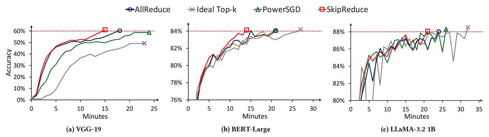

Figure 11: Time-to-accuracy of various collective communications for (a) VGG-19, (b) BERT-Large, and (c) LLaMA-3.2 1B. The red, horizontal dashed lines denote the target accuracy for each model.

> 
图11：针对 (a) VGG-19、(b) BERT-Large 和 (c) LLaMA-3.2 1B 的各种集合通信的时间-准确度。红色水平虚线表示每个模型的目标准确度。

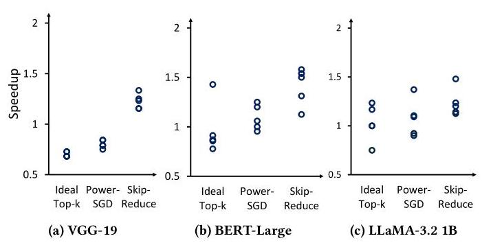

Figure 12: Time-to-accuracy speedup of various collective communications relative to baseline AllReduce across five runs. Each marker corresponds to one run.

> 
图12：五次运行中各种集合通信操作相对于基线AllReduce的时间-精度加速比。每个标记对应一次运行。

We compare SkipReduce against baseline AllReduce, ideal top- $k$ , and PowerSGD. Unless otherwise stated, we configure top- $k$ to select 1% of the gradients, PowerSGD with a rank of 4, and SkipReduce to skip 50% of the Reduce-Scatter steps. For all collective communications, communication is overlapped with computation whenever possible. To the best of our knowledge, prior works on top- $k$ gradient compression have only been implemented using MPI-based communication libraries [25, 30, 38, 42]. Therefore, comparing these approaches against SkipReduce, implemented on NCCL, is not a fair comparison. To address this, we implement an idealized version of top- $k$ , in which the indices and values of the selected gradients are communicated as if they were dense tensors. This eliminates the fill-in issue as no sparse reductions are used and provides a lower bound on the communication time for top- $k$ approaches, assuming they could be efficiently implemented in NCCL. However, this implementation is not functionally correct as it does not support actual sparse reductions. Therefore, to measure its time-to-accuracy (TTA), we adopted a different approach. We first ran the baseline AllReduce but zeroed out all non-selected gradients before communication to simulate the behaviour of top- $k$ . We then evaluated the model every $N$ iterations, where $N$ corresponds to the number of iterations that the ideal top- $k$ implementation could execute within a single sampling period. For PowerSGD, we perform a warm-up for the first 1000 iterations, where gradients are communicated using baseline AllReduce. We apply error correction mechanisms for both top- $k$ and PowerSGD: top- $k$ uses SGD with memory [46], while PowerSGD uses error-feedback SGD [51]. These mechanisms require additional memory equal to the size of the model. In contrast, SkipReduce does not employ any error correction strategy and therefore maintains a smaller memory footprint.

> 
我们将 SkipReduce 与基线 AllReduce、理想 top‑$k$ 以及 PowerSGD 进行对比。除非特别说明，top‑$k$ 配置为选择 1% 的梯度，PowerSGD 的秩设为 4，SkipReduce 跳过 50% 的 Reduce‑Scatter 步骤。在所有集合通信中，通信尽可能与计算重叠。据我们所知，此前 top‑$k$ 梯度压缩方面的工作仅使用基于 MPI 的通信库实现 [25, 30, 38, 42]。因此，将它们与基于 NCCL 实现的 SkipReduce 进行对比并不公平。为解决这一问题，我们实现了一个理想化的 top‑$k$ 版本，其中所选梯度的索引和值以稠密张量的形式进行通信。这消除了稀疏归约带来的填充问题，并给出了 top‑$k$ 方法通信时间的下界，假设它们能被高效实现在 NCCL 中。但该实现在功能上并不正确，因为它不支持实际的稀疏归约。因此，为衡量其达到准确度的时间（TTA），我们采用了另一种方法：先运行基线 AllReduce，但在通信前将所有未选中的梯度置零，以模拟 top‑$k$ 的行为；然后每隔 $N$ 次迭代对模型进行评估，其中 $N$ 对应理想 top‑$k$ 实现在单个采样周期内所能执行的迭代次数。对于 PowerSGD，我们在前 1000 次迭代中进行预热，期间使用基线 AllReduce 通信梯度。我们对 top‑$k$ 和 PowerSGD 均使用了误差修正机制：top‑$k$ 使用带记忆的 SGD [46]，PowerSGD 使用误差反馈 SGD [51]。这些机制需要额外的内存，其大小等于模型参数量。相比之下，SkipReduce 不使用任何误差修正策略，因此保持了更小的内存占用。

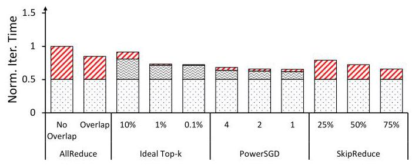

Figure 13: Breakdown of LLaMA-3.2 1B iteration time for various collective communications. The iteration time is normalized to AllReduce (no overlapping).

> 
图13：LLaMA-3.2 1B 在不同集合通信下迭代时间的分解。迭代时间以 AllReduce（无重叠）为基准进行了归一化。

### 5.2 Results

We conducted time-to-accuracy (TTA) measurements for various collective communications across different models over five runs with unique random seeds. In Figure 11, we present the runs where SkipReduce demonstrates the median speedup relative to baseline AllReduce. The distribution of TTA speedups across all runs is shown as a dot plot in Figure 12. For the results shown in Figure 12a, we configured top- $k$ to select 5% of the gradients (up from 1%) to reach the target accuracy at the expense of increased iteration time. SkipReduce is able to outperform baseline AllReduce and prior works in all workloads and runs. However, it is interesting to note that SkipReduce does not always yield faster iteration times compared to ideal top- $k$ and PowerSGD. For instance, on LLaMA- 3.2, SkipReduce exhibits a 6% slower iteration time than PowerSGD, as shown in Figure 13. Despite this, SkipReduce achieves an average TTA speedup of 16% relative to PowerSGD across five runs. This is because SkipReduce does not require aggressive sparsification or compression, thus retaining a significant amount of information while achieving comparable iteration time to PowerSGD, which highlights the limitations of prior works in higher bandwidth settings as discussed in Section 3.

> 
我们在五个不同随机种子的运行中，对不同模型的各种集合通信进行了达到目标精度时间（TTA）的测量。在图11中，我们展示了SkipReduce相对于基线AllReduce实现中位加速的运行情况。所有运行中TTA加速的分布以点图形式呈现在图12中。对于图12a所示结果，我们将top-$k$配置为选取5%的梯度（从1%上调），以牺牲迭代时间为代价达到目标精度。SkipReduce能在所有工作负载和运行中优于基线AllReduce及先前工作。然而，值得注意的是，SkipReduce并不总是比理想化的top-$k$和PowerSGD带来更快的迭代时间。例如，在LLaMA- 3.2上，如图13所示，SkipReduce的迭代时间比PowerSGD慢6%。尽管如此，在五次运行中，SkipReduce相对于PowerSGD仍然实现了平均16%的TTA加速。这是因为SkipReduce无需激进的稀疏化或压缩，从而在保留大量信息的同时实现了与PowerSGD相当的迭代时间，这凸显了先前工作在高带宽设置下的局限性，正如我们在第3节所讨论的。

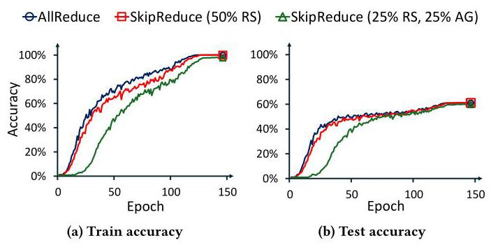

Figure 14: VGG-19 train and test accuracy when SkipReduce skips 50% of the Reduce-Scatter (RS) steps, compared to when 25% of both RS and AllGather (AG) steps are skipped.

> 
图14：VGG-19在SkipReduce跳过50%的Reduce-Scatter（RS）步骤时，与同时跳过25%的RS和AllGather（AG）步骤时的训练和测试准确率对比。

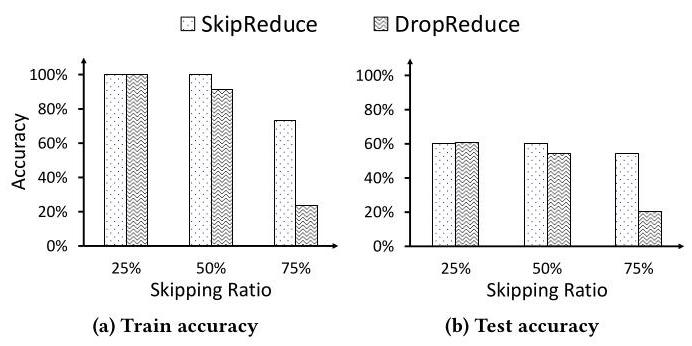

Figure 15: VGG-19 train and test accuracy with SkipReduce and DropReduce.

> 
图15：使用 SkipReduce 和 DropReduce 时 VGG-19 的训练和测试准确率

Another design consideration is to extend SkipReduce to also skip the AllGather steps, since the current implementation reduces communication time by only targeting the Reduce-Scatter phase. While the communication time can be further cut down by skipping the AllGather steps, the performance tradeoff when skipping All-Gather steps is more prominent compared to skipping the Reduce-Scatter steps. Figure 14 shows the performance of SkipReduce when 50% of the gradients are skipped at the Reduce-Scatter phase, compared to when 25% of gradients are skipped at both Reduce-Scatter and AllGather. Since the total number of steps skipped is the same, both schemes achieve similar communication speedup. However, skipping the AllGather steps significantly slows down convergence and reduces the final train and test accuracy by 1.95 and 1.3 percentage points, respectively. Skipping AllGather steps is more costly as the skipped gradients carry reduced information from all other GPUs. Thus, skipping the AllGather steps causes higher information loss relative to Reduce-Scatter. Moreover, skipping the AllGather phase causes the model replicas on each GPU to diverge, violating the synchronization requirements of data parallel training. Consequently, for our evaluation, we measure accuracy using only one sample of the replicas.

> 
另一个设计考虑是将SkipReduce扩展为也跳过AllGather步骤，因为当前实现仅针对Reduce-Scatter阶段来减少通信时间。尽管跳过AllGather步骤可以进一步缩短通信时间，但与跳过Reduce-Scatter步骤相比，跳过AllGather步骤时的性能权衡更为突出。图14展示了SkipReduce在Reduce-Scatter阶段跳过50%梯度与同时在Reduce-Scatter和AllGather阶段跳过25%梯度时的性能对比。由于跳过的步骤总数相同，两种方案实现了相似的通信加速。然而，跳过AllGather步骤会显著减缓收敛速度，并将最终训练和测试准确率分别降低1.95和1.3个百分点。跳过AllGather步骤代价更高，因为被跳过的梯度携带了来自所有其他GPU的归约信息。因此，相对于Reduce-Scatter，跳过AllGather步骤会导致更高的信息损失。此外，跳过AllGather阶段会导致每个GPU上的模型副本产生分歧，违反了数据并行训练的同步要求。因此，在我们的评估中，我们仅使用其中一个模型副本样本来测量准确率。

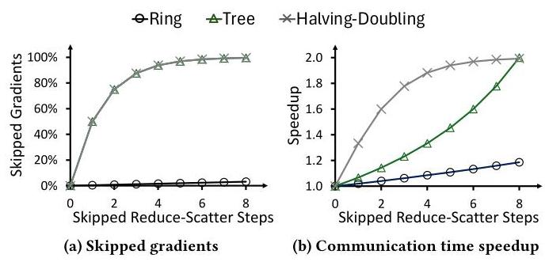

Figure 16: Ratio of skipped gradients and the communication time speedup achieved for each skipped Reduce-Scatter step for various AllReduce logical topologies with 256 nodes.

> 
图16：针对256个节点的各种AllReduce逻辑拓扑，每个跳过Reduce‑Scatter步骤所对应的跳过梯度比例与通信时间加速比。

In data parallel training, the model weights are updated using the average of the local gradients across all GPUs. For SkipReduce, the skipped gradients are effectively replaced with a value of zero as SkipReduce divides the gradients by the number of GPUs $\left( N\right)$ , regardless of how many steps are skipped. An alternative design, however, would be to adjust this divisor to the number of remaining Reduce-Scatter steps $\left( {N - S}\right)$ , effectively removing the gradients. We refer to this as DropReduce (Section 4.1) and compare it with SkipReduce in Figure 15. However, we observed no benefit and, in fact, saw performance degradation. One explanation is that by completely removing the gradients, the contribution of the remaining gradients is amplified, possibly creating bias. In addition, as shown earlier, gradients often have a distribution near 0 - thus, replacing the skipped gradients with zeros is a reasonable approximation. An open question is whether substituting the skipped gradients with other non-zero values can help improve accuracy.

> 
在数据并行训练中，模型权重使用所有 GPU 上局部梯度的平均值进行更新。对于 SkipReduce，被跳过的梯度实际上被替换为零，因为 SkipReduce 将梯度除以 GPU 数量 $\left( N\right)$，而无论跳过了多少步骤。然而，另一种设计是将此除数调整为剩余的 Reduce-Scatter 步骤数 $\left( {N - S}\right)$，从而有效地移除这些梯度。我们将这种方法称为 DropReduce（第 4.1 节），并在图 15 中将其与 SkipReduce 进行了比较。然而，我们没有观察到任何好处，事实上还看到了性能下降。一种解释是，通过完全移除梯度，剩余梯度的贡献被放大了，可能产生偏差。此外，如前所示，梯度通常具有接近 0 的分布——因此，将被跳过的梯度替换为零是一个合理的近似。一个尚未解决的问题是，用其他非零值替换被跳过的梯度是否有助于提高准确性。

## 6 Discussion

In this section, we provide additional analysis on different implementations of SkipReduce, including its implications on other logical topologies, its usage across other types of parallelism, and its benefits as a form of regularization.

> 
在本节中，我们进一步分析了 SkipReduce 的不同实现，包括对其他逻辑拓扑的影响、在其他并行类型中的使用，以及它作为一种正则化形式的益处。

### 6.1 Alternative Logical Topologies

In this work, we focus on the Ring-based AllReduce algorithm where the communication pattern (or the logical topology [8]) is a ring since it is commonly used and has been shown to be bandwidth optimal [34]. However, SkipReduce can also be applied to other logical topologies, each with varying scaling properties. Each logical topology offers a different balance between the amount of skipped gradients (which affects training accuracy) and the amount of communication time saved.

> 
在本工作中，我们聚焦于基于环的AllReduce算法，其中通信模式（或逻辑拓扑[8]）是一个环，因为它被广泛使用且已被证明是带宽最优的[34]。然而，SkipReduce 也可以应用于其他逻辑拓扑，每种拓扑具有不同的扩展特性。每种逻辑拓扑在跳过的梯度量（影响训练精度）与节省的通信时间之间提供了不同的权衡。

An analytical evaluation of SkipReduce on various logical topologies with 256 nodes is presented in Figure 16. For ring and halving-doubling topologies, the communication time speedup and the fraction of skipped gradients scale in a similar manner - linearly for ring and logarithmically for halving-doubling. This means that the trade-off between training speed and accuracy loss remains consistent as more communication steps are skipped. In contrast, there is a mismatch in the scaling properties of both metrics on a logical tree topology. For a tree, the ratio of skipped gradients scales logarithmically, while the communication time speedup scales approximately linearly. This suggests that for a tree, skipping the first few steps yields a small speedup at a high cost to accuracy. However, this tradeoff becomes increasingly favorable as more communication steps are skipped.

> 
针对 256 个节点在各种逻辑拓扑上的 SkipReduce 分析评估见图 16。对于环形和减半-加倍拓扑，通信时间加速比与跳过的梯度比例以相似的方式缩放——环形呈线性，减半-加倍呈对数。这意味着在跳过更多通信步骤时，训练速度与精度损失之间的权衡保持一致。相比之下，在逻辑树形拓扑上，两个指标的缩放特性存在不匹配。对于树形拓扑，跳过的梯度比例呈对数缩放，而通信时间加速比近似线性缩放。这表明对于树形拓扑，跳过最初几步带来的加速比很小，但精度代价较高。然而，随着跳过更多的通信步骤，这种权衡会变得愈发有利。

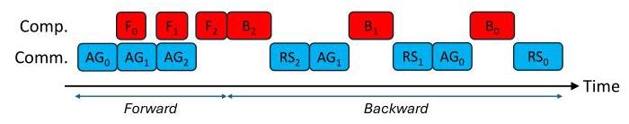

Figure 17: Communications in sharded data parallel training. For layer $i,{\mathbf{F}}_{i}/{\mathbf{B}}_{i}$ : forward/backward computation, ${\mathbf{{AG}}}_{i} :$ All-Gather of model weights, ${\mathrm{{RS}}}_{i}$ : Reduce-Scatter for gradients.

> 
图17：分片数据并行训练中的通信过程。对于层 $i$，${\mathbf{F}}_{i}/{\mathbf{B}}_{i}$：前向/后向计算，${\mathbf{{AG}}}_{i}$：模型权重的全收集，${\mathrm{{RS}}}_{i}$：梯度的 Reduce-Scatter。

### 6.2 Training Convergence

Prior works [5, 46] have provided convergence guarantees of stochastic gradient descent (SGD) with gradient compression operators. Given a total gradient size of $d$ , the compression operator compresses the gradient size to $k$ , where $0 < k \leq  d$ . SkipReduce is essentially a random gradient compressor, whose convergence is also proven [46]. However, one essential difference between SkipReduce and prior works $\left\lbrack  {3,{25},{30},{38},{41},{42}}\right\rbrack$ is that these previous methods use additional memory space to accumulate gradients that are skipped in the current iteration, to possibly be sent in the next iterations, while SkipReduce "forgets" all the skipped gradients. Without gradient accumulation, a random gradient compressor theoretically requires at worst $d/k$ times more iterations to achieve the same model quality as baseline SGD or other gradient compression schemes with gradient accumulation support [46]. However, our empirical results show that SkipReduce can match and even exceed the accuracy of baseline AllReduce on some DNN models with the same amount of training epochs. The intuition here is that since SkipReduce does not simply skip gradients randomly but also selectively, the gradients it skips are typically close to 0 . Therefore, skipping them has a minimal impact on training quality, provided the skipping or dropping ratio $\left( k\right)$ is reasonably small.

> 
先前的工作[5, 46]为带有梯度压缩算子的随机梯度下降(SGD)提供了收敛性保证。给定总梯度大小为$d$，压缩算子将梯度大小压缩至$k$，其中$0 < k \leq  d$。SkipReduce本质上是一个随机梯度压缩器，其收敛性也已得到证明[46]。然而，SkipReduce与先前工作$\left\lbrack  {3,{25},{30},{38},{41},{42}}\right\rbrack$的一个本质区别在于，这些先前的方法使用额外的内存空间来累积在当前迭代中被跳过的梯度，以便可能在后续迭代中发送，而SkipReduce则会“遗忘”所有被跳过的梯度。在没有梯度累积的情况下，随机梯度压缩器理论上在最坏情况下需要多$d/k$倍的迭代次数，才能达到与基线SGD或其他支持梯度累积的梯度压缩方案相同的模型质量[46]。然而，我们的实验结果表明，在相同的训练周期数下，SkipReduce在某些DNN模型上可以达到甚至超过基线AllReduce的准确率。这里的直觉是，由于SkipReduce并非简单地随机跳过梯度，还具有选择性，它所跳过的梯度通常接近于0。因此，只要跳过或丢弃比率$\left( k\right)$足够小，跳过它们对训练质量的影响就微乎其微。

### 6.3 Sharded Data Parallel (SDP)

While data parallel (DP) training accelerates distributed training, the scalability is limited to models that can fit within a single GPU, as it requires replicating the model across multiple GPUs. To overcome this limitation, Sharded Data Parallelism (SDP) [35, 57] partitions or shards not just the input data, but also the model parameters, optimizer states, and gradients across the GPUs. This results in a reduction in memory usage and enabling larger models to be trained [35, 57]. ${}^{4}$ A high-level overview of SDP training across a hypothetical 3-layer network is shown in Figure 17, detailing the sequence of computation and communication across the three layers. Each GPU is assigned a model shard. During the forward pass, an AllGather $\left( {\mathrm{{AG}}}_{i}\right)$ operation is required to gather the parameters before computing the activation for layer $i$ . After computation, these gathered shards are discarded to save memory. ${}^{5}$ The backward pass follows a similar pattern. First, an AllGather is performed to collect the parameters needed for gradient computation. This is followed by a Reduce-Scatter $\left( {\mathrm{{RS}}}_{i}\right)$ operation where each GPU receives the final reduced gradient for its assigned shard. ${}^{6}$

> 
尽管数据并行（DP）训练能够加速分布式训练，但其可扩展性受限于能够装入单个GPU的模型，因为它需要在多个GPU上复制整个模型。为了克服这一限制，分片数据并行（Sharded Data Parallelism, SDP）[35, 57] 不仅将输入数据切分，还将模型参数、优化器状态和梯度在多个GPU之间进行划分或分片。这样做可以减少内存使用，从而支持训练更大的模型 [35, 57]。${}^{4}$ 图17展示了一个假设的3层网络进行SDP训练的高层次概览，详细描述了三层网络中的计算和通信顺序。每个GPU被分配一个模型分片。在前向传播过程中，需要执行AllGather $\left( {\mathrm{{AG}}}_{i}\right)$ 操作来收集参数，然后才能计算第 $i$ 层的激活值。计算完成后，这些聚集来的分片会被丢弃以节省内存。${}^{5}$ 反向传播遵循类似的模式。首先，执行AllGather操作收集梯度计算所需的参数。随后进行Reduce-Scatter $\left( {\mathrm{{RS}}}_{i}\right)$ 操作，每个GPU收到其指定分片最终归约后的梯度。${}^{6}$

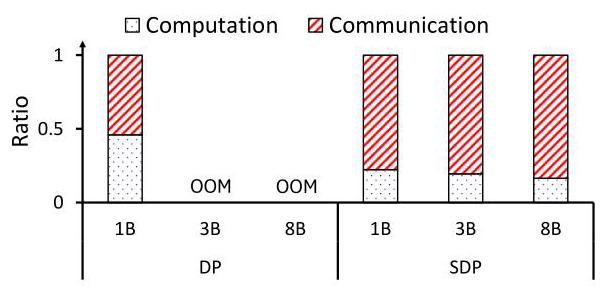

Figure 18: Communication overhead of LLaMA-3 training in an 8-GPU system across various model sizes for data parallel (DP) and sharded data parallel (SDP) training. OOM: out-of-memory error.

> 
图18：在8 GPU系统中，不同模型规模下LLaMA-3训练的数据并行（DP）和分片数据并行（SDP）的通信开销。OOM：显存不足错误。

SDP presents new challenges and opportunities with SkipReduce. It trades reduced memory usage for higher communication overhead, resulting in a higher amount of exposed communication (Figure 18). Furthermore, the communication pattern is not necessarily AllReduce, as the AllGather and Reduce-Scatter operations are performed on different data (weights and gradients, respectively). Accelerating either the Reduce-Scatter or AllGather communication individually is straightforward - SkipReduce can be applied identically to how SkipReduce was implemented in DP (Figure 5). However, accelerating both Reduce-Scatter and AllGather communications simultaneously requires a key modification. To minimize information loss, SkipReduce must ensure that the skipped gradients correspond precisely to the weights omitted during the AllGather phase. This alignment minimizes information loss by exclusively gathering gradients for weights actively participating in training, and is achieved by running the Reduce-Scatter in the opposite direction of the AllGather. However, by default, NCCL executes ring-based collectives in the same direction for each logical ring. Thus, we modified NCCL to reverse the sender-receiver pairs during Reduce-Scatter, enabling the two operations to run in opposing directions on the same logical ring.

> 
SDP 赋予了 SkipReduce 新的挑战和机遇。它用减少的内存使用换取了更高的通信开销，导致暴露的通信量增加（图18）。而且，通信模式不一定是 AllReduce，因为 AllGather 和 Reduce-Scatter 操作分别作用于不同的数据（权重和梯度）。单独加速 Reduce-Scatter 或 AllGather 通信都很直接——可以按照 DP 中实现 SkipReduce 的相同方式应用 SkipReduce（图5）。然而，同时加速 Reduce-Scatter 和 AllGather 通信需要一个关键修改。为最小化信息损失，SkipReduce 必须确保被跳过的梯度与 AllGather 阶段省略的权重精确对应。这一对齐通过仅收集积极参与训练的权重的梯度来最小化信息损失，并可通过使 Reduce-Scatter 以与 AllGather 相反的方向运行来实现。然而，默认情况下，NCCL 为每个逻辑环以相同方向执行基于环的集合通信。因此，我们修改了 NCCL，在 Reduce-Scatter 期间反转发送方-接收方对，使得这两个操作在同一逻辑环上以相反方向运行。

When an AllGather step is skipped in SDP, each GPU effectively drops the connections associated with the missing parameter shard, assuming its weights are zero. Consequently, each GPU trains a unique subnetwork, creating an ensemble effect across the system. Note that in traditional (DP) training, each GPU holds a full, identical replica of the model. In DP, skipping AllGather steps would compromise model consistency since each GPU will receive different reduced slices, causing the model replicas across the GPUs to diverge. However, this problem does not arise in SDP, where each

> 
在 SDP 中跳过 AllGather 步骤时，每个 GPU 实质上丢弃了与缺失参数分片相关的连接，假定其权重为零。因此，每个 GPU 训练一个独特的子网络，在整个系统中产生集成效应。注意，在传统的 (DP) 训练中，每个 GPU 持有一份完整且相同的模型副本。在 DP 中，跳过 AllGather 步骤会破坏模型一致性，因为每个 GPU 会收到不同的规约分片，导致各 GPU 上的模型副本发生偏离。但这一问题在 SDP 中不会出现，每个

---

${}^{4}$ Sharding used in SDP is different from tensor and pipeline parallelism, where the models are always sharded throughout the entire training. While tensor and pipeline parallelism provide further memory savings, they require additional communication to communicate the activation values.

> 
${}^{4}$ SDP 中所用的分片不同于张量并行和流水线并行，后者在整个训练过程中始终将模型分片。尽管张量并行和流水线并行能进一步节省内存，但它们需要额外的通信来传递激活值。

${}^{5}\mathrm{\;{We}}$ assume that the parameters, gradients, and optimizer states are sharded, which is equivalent to FSDP [57] with full sharding strategy and ZeRO-3 [35].

> 
${}^{5}\mathrm{\;我们}$ 假设参数、梯度和优化器状态是分片的，这相当于采用全分片策略的 FSDP [57] 和 ZeRO-3 [35]。

${}^{6}$ Note $A{G}_{2}$ is not shown before ${B}_{2}$ as it reuses shards gathered before executing ${F}_{2}$ .

> 
${}^{6}$ 注 $A{G}_{2}$ 未在 ${B}_{2}$ 之前显示，因为它重用了在执行 ${F}_{2}$ 之前收集的分片。

---

Figure 19: Tradeoff between performance (i.e., iteration time) speedup and accuracy of LLaMA 3.2 1B using sharded data parallel training. SkipReduce(RS) and SkipReduce(AG) indicate that SkipReduce is only implemented to the Reduce-Scatter or AllGather communication, respectively.

> 
图19：使用分片数据并行训练时，LLaMA 3.2 1B 的性能（即迭代时间）加速比与准确率之间的权衡。SkipReduce(RS) 和 SkipReduce(AG) 分别表示 SkipReduce 仅应用于 Reduce-Scatter 或 AllGather 通信。

GPU only maintains its assigned model shard, not a full replica. This distinction becomes critical during inference. The full model can be reconstructed in SDP by simply gathering the shards. In DP, however, skipping AllGather steps would result in multiple, different final models, making it unclear which version to use for inference.

> 
GPU 仅维护其分配到的模型分片，而非完整副本。这一区别在推理时变得至关重要。在 SDP 中，只需收集分片即可重建完整模型。然而在 DP 中，跳过 AllGather 步骤会导致多个不同的最终模型，使得无法明确应使用哪个版本进行推理。

Figure 19 shows the trade-off between test accuracy and end-to-end speedup of SkipReduce implemented in PyTorch FSDP [57] when training the LLaMA 3.2 model. Applying SkipReduce only to the gradients communicated using Reduce-Scatter communication yields a 9% speedup, while extending SkipReduce to also skip the weights communicated in AllGather doubles the speedup to 22%, at the cost of a slight reduction in accuracy. In our evaluation, we configured SkipReduce to skip 50% of the weights and gradients. However, given the criticality of model parameters, one interesting modification to SkipReduce was the need to warm-up the model, i.e., initially use baseline AllGather (without skipping any steps) for a certain period before applying SkipReduce. This ensures that the training converges and the accuracy loss is minimized. Interestingly, skipping only the AllGather communication phase results in the lowest accuracy. This suggests that preserving the gradients of the weights that do not contribute in the iteration (due to being skipped in the AllGather) may actually be more harmful to the model's performance than simply ignoring them would be.

> 
图19展示了在训练LLaMA 3.2模型时，基于PyTorch FSDP [57]实现的SkipReduce在测试准确率与端到端加速比之间的权衡。仅在通过Reduce-Scatter通信传输的梯度上应用SkipReduce可获得9%的加速，而将SkipReduce扩展到同时跳过AllGather中传输的权重，则将加速比提高一倍至22%，但代价是准确率略有下降。在我们的评估中，SkipReduce配置为跳过50%的权重和梯度。然而，考虑到模型参数的关键性，SkipReduce的一个有趣修改是，需要在应用SkipReduce之前先对模型进行“预热”，即先使用基准AllGather（不跳过任何步骤）训练一段时间。这确保了训练收敛并将准确率损失降至最低。有趣的是，仅跳过AllGather通信阶段时准确率最低。这表明，保留那些因在AllGather中被跳过而未在当前迭代中贡献的权重的梯度，实际上对模型性能的危害可能比直接忽略它们更大。

### 6.4 Implications on Regularization

Dropout [45] regularizes a model by dropping intermediate activation values, effectively creating a different subnetwork at each iteration. On the other hand, SkipReduce does not modify the network connections but instead introduces noise during weight updates by skipping or nullifying a fraction of the gradients, an approach similar to [49]. Compared to Dropout, SkipReduce operates at a coarser granularity to reduce communication time. Prior works [13, 22] have considered coarse-grained Dropout but mainly focus on model performance.

> 
Dropout [45] 通过丢弃中间激活值来正则化模型，从而在每次迭代时有效地创建一个不同的子网络。而 SkipReduce 并不修改网络连接，而是在权重更新过程中通过跳过或置零一部分梯度来引入噪声，这种方法与 [49] 类似。与 Dropout 相比，SkipReduce 以更粗的粒度运行，以减少通信时间。先前的工作 [13, 22] 已考虑过粗粒度的 Dropout，但主要关注模型性能。

The regularization benefit of SkipReduce is demonstrated in Figure 10, where, by protecting the sensitive layers and skipping gradients selectively, SkipReduce achieves higher test accuracy than baseline AllReduce, even while skipping gradients to accelerate communication. Figure 20 further compares the regularization benefits provided by Dropout versus the inherent regularizing effect of SkipReduce. The SkipReduce skipping rate is configured to match the Dropout rate used in VGG, which is 50% [44]. Dropout provides better regularization compared to SkipReduce, with an additional 1% and 0.3% increase in test accuracy for Dropout and SkipReduce, respectively. However, when SkipReduce and Dropout are used together, we see a cumulative benefit, providing additional 1.2% increase in test accuracy. This demonstrates that the two methods are not only compatible, but also complementary.

> 
SkipReduce 的正则化收益在图 10 中展示，通过保护敏感层并选择性地跳过梯度，SkipReduce 即使在为加速通信而跳过梯度时，也能获得比基线 AllReduce 更高的测试准确率。图 20 进一步比较了 Dropout 提供的正则化收益与 SkipReduce 自身固有的正则化效果。SkipReduce 的跳过率被配置为与 VGG 中使用的 Dropout 率一致，即 50% [44]。Dropout 相比 SkipReduce 提供了更好的正则化效果，分别使测试准确率额外提升 1% 和 0.3%。然而，当 SkipReduce 与 Dropout 同时使用时，我们看到了累积收益，测试准确率额外提升了 1.2%。这表明两种方法不仅兼容，而且互补。

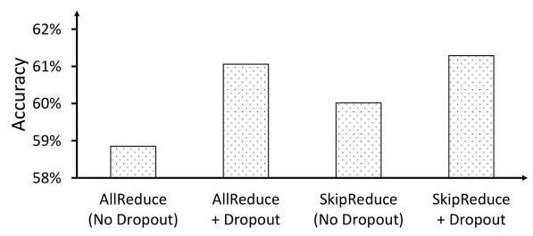

Figure 20: VGG-19 test accuracy for baseline AllReduce and SkipReduce, with and without Dropout.

> 
图20：基线AllReduce与SkipReduce在有无Dropout情况下的VGG-19测试准确率。

## 7 Conclusion

In this work, we show how gradients (and packets) can be skipped during AllReduce collective communication of data parallel training to improve communication performance. By reducing the number of steps required for the AllReduce operation, effectively skipping the gradients, the communication acceleration is achieved with minimal computational and memory overhead. We evaluate SkipReduce against prior works and demonstrate that the computational overhead of compression techniques used in prior works can hinder their effectiveness on channel bandwidths typically available in systems with commodity GPUs and in large-scale high-performance clusters. To preserve model accuracy, we first introduce a randomized version of SkipReduce that can be implemented with minimal overhead. We further enhance SkipReduce by observing that gradient sparsity is non-uniform across model layers, and enable SkipReduce to selectively skip gradients. Our results show that SkipReduce provides speedup in end-to-end training time while preserving accuracy. More importantly, this work introduces how SkipReduce principles can go beyond simply accelerating AllReduce collective communication - we explore its impact as a regularizer, its applicability to other logical topologies, and its adoption for other types of parallelism.

> 
在这项工作中，我们展示了如何在数据并行训练的 AllReduce 集合通信过程中跳过梯度（以及数据包），以提升通信性能。通过减少 AllReduce 操作所需的步骤数，即有效跳过梯度，以最小的计算和内存开销实现了通信加速。我们将 SkipReduce 与先前工作进行了评估对比，并证明先前工作中使用的压缩技术的计算开销会阻碍其在配备普通 GPU 的系统和大规模高性能集群通常可用的信道带宽上的有效性。为了保持模型准确性，我们首先引入了一种可以以最小开销实现的随机化 SkipReduce 版本。通过观察到各模型层的梯度稀疏性并不均匀，我们进一步增强了 SkipReduce，使其能够选择性地跳过梯度。我们的结果表明，SkipReduce 在保持准确性的同时，缩短了端到端训练时间。更重要的是，本工作介绍了 SkipReduce 原理如何不仅限于加速 AllReduce 集合通信——我们探索了其作为正则化器的影响、其对其他逻辑拓扑的适用性，以及其在其他类型并行中的采用。

## Acknowledgments

We would like to thank the anonymous reviewers for their comments. This work is supported in part by Samsung project G01240469, IITP grants funded by MSIT (no. RS-2023-00228255, RS-2024-00402898, RS-2025-02214654, RS-2025-02217106), in part by NRF (no. RS-2023- NR077034), and in part by Hyundai Motor Chung Mong-Koo Global Scholarship.

> 
感谢匿名审稿人提出的宝贵意见。本研究部分受Samsung项目G01240469资助，部分受韩国信息通信技术振兴院（IITP）由MSIT资助的基金（编号：RS-2023-00228255、RS-2024-00402898、RS-2025-02214654、RS-2025-02217106）支持，部分受韩国国家研究基金会（NRF）资助（编号：RS-2023-NR077034），以及现代汽车郑梦九全球奖学金的部分支持。

## References

[1] 2023. Nvidia Collective Communication Library (NCCL). https://developer.nvidia.com/nccl.Accessed: 2023-07-23.

> 
[1] 2023. Nvidia Collective Communication Library (NCCL). https://developer.nvidia.com/nccl. 访问日期: 2023-07-23.

[2] 2023. Nvidia CUDA Random Number Generation (cuRAND) library. https://developer.nvidia.com/curand.Accessed: 2023-07-23.

> 
[2] 2023. Nvidia CUDA 随机数生成（cuRAND）库。https://developer.nvidia.com/curand。访问时间：2023-07-23。

[3] Alham Fikri Aji and Kenneth Heafield. 2017. Sparse Communication for Distributed Gradient Descent. arXiv abs/1704.05021 (2017). arXiv:1704.05021 http://arxiv.org/abs/1704.05021

> 
[3] Alham Fikri Aji 与 Kenneth Heafield. 2017. 分布式梯度下降的稀疏通信. arXiv预印本 abs/1704.05021 (2017). arXiv:1704.05021 http://arxiv.org/abs/1704.05021

[4] Dan Alistarh, Demjan Grubic, Jerry Li, Ryota Tomioka, and Milan Vojnovic. 2017. QSGD: Communication-Efficient SGD via Gradient Quantization and Encoding. In Advances in Neural Information Processing Systems, Vol. 30. Curran Associates, Inc.

> 
[4] Dan Alistarh、Demjan Grubic、Jerry Li、Ryota Tomioka 和 Milan Vojnovic. 2017. QSGD：通过梯度量化与编码实现通信高效的SGD. 载于 Advances in Neural Information Processing Systems，第30卷. Curran Associates, Inc.

[5] Dan Alistarh, Torsten Hoefler, Mikael Johansson, Sarit Khirirat, Nikola Konstanti-nov, and Cédric Renggli. 2018. The Convergence of Sparsified Gradient Methods. In Proceedings of the 32nd International Conference on Neural Information Processing Systems (Montréal, Canada) (NIPS'18). Curran Associates Inc., Red Hook, NY, USA, 5977-5987.

> 
[5] Dan Alistarh、Torsten Hoefler、Mikael Johansson、Sarit Khirirat、Nikola Konstanti-nov 及 Cédric Renggli. 2018. 稀疏梯度方法的收敛性. 见第32届神经信息处理系统国际会议论文集 (加拿大蒙特利尔) (NIPS'18). Curran Associates Inc., 美国纽约州红钩镇, 5977–5987.

[6] Tal Ben-Nun and Torsten Hoefler. 2019. Demystifying Parallel and Distributed Deep Learning: An In-Depth Concurrency Analysis. ACM Comput. Surv. 52, 4, Article 65 (Aug. 2019), 43 pages. https://doi.org/10.1145/3320060

> 
[6] Tal Ben-Nun 和 Torsten Hoefler。2019 年。《解密并行与分布式深度学习：深度并发分析》。《ACM 计算概览》第 52 卷第 4 期，文章 65，2019 年 8 月，共 43 页。https://doi.org/10.1145/3320060

[7] J. Bernauer and P. Kashinkunti. 2021. Accelerating AI at-scale with Selene DGXA100 SuperPOD and Lustre Parallel Filesystem Storage. Technical Report. NVIDIA, USA.

> 
[7] J. Bernauer 和 P. Kashinkunti. 2021. 使用 Selene DGXA100 SuperPOD 和 Lustre 并行文件系统存储加速大规模 AI. 技术报告. 英伟达，美国.

[8] Sanghun Cho, Hyojun Son, and John Kim. 2023. Logical/Physical Topology-Aware Collective Communication in Deep Learning Training. In 2023 IEEE International Symposium on High-Performance Computer Architecture (HPCA). Montreal, QC, Canada, 56-68. https://doi.org/10.1109/HPCA56546.2023.10071117

> 
[8] Sanghun Cho、Hyojun Son 和 John Kim. 2023. 深度学习训练中逻辑/物理拓扑感知的集合通信. 收录于 2023年IEEE国际高性能计算机架构研讨会（HPCA）. 加拿大魁北克省蒙特利尔, 56-68. https://doi.org/10.1109/HPCA56546.2023.10071117

[9] Tim Dettmers. 2016. 8-Bit Approximations for Parallelism in Deep Learning. In 4th International Conference on Learning Representations, ICLR 2016, San Juan, Puerto Rico, May 2-4, 2016, Conference Track Proceedings, Yoshua Bengio and Yann LeCun (Eds.). http://arxiv.org/abs/1511.04561

> 
[9] Tim Dettmers. 2016. 深度学习并行性中的8位近似计算. 收录于第四届国际学习表征会议(ICLR 2016)会议论文集，会议于2016年5月2日至4日在波多黎各圣胡安举行，由Yoshua Bengio与Yann LeCun主编。 http://arxiv.org/abs/1511.04561

[10] Jacob Devlin, Ming-Wei Chang, Kenton Lee, and Kristina Toutanova. 2018. BERT: Pre-training of Deep Bidirectional Transformers for Language Understanding. arXiv abs/1810.04805 (2018). arXiv:1810.04805 http://arxiv.org/abs/1810.04805

> 
[10] Jacob Devlin, Ming-Wei Chang, Kenton Lee 和 Kristina Toutanova. 2018. BERT: 用于语言理解的深度双向Transformer预训练. arXiv abs/1810.04805 (2018). arXiv:1810.04805 http://arxiv.org/abs/1810.04805

[11] Nikoli Dryden, Tim Moon, Sam Ade Jacobs, and Brian Van Essen. 2016. Communication Quantization for Data-Parallel Training of Deep Neural Networks. In 2nd Workshop on Machine Learning in HPC Environments (MLHPC). 1-8. https://doi.org/10.1109/MLHPC.2016.004

> 
[11] 尼科利·德莱登，蒂姆·穆恩，萨姆·阿德·雅各布斯，和布莱恩·范·埃森. 2016. 面向深度神经网络数据并行训练的通信量化. 载于第二届高性能计算环境中的机器学习研讨会 (MLHPC). 1-8. https://doi.org/10.1109/MLHPC.2016.004

[12] Jiawei Fei, Chen-Yu Ho, Atal N. Sahu, Marco Canini, and Amedeo Sapio. 2021. Efficient Sparse Collective Communication and Its Application to Accelerate Distributed Deep Learning. In Proceedings of the 2021 ACM SIGCOMM 2021 Conference (Virtual Event, USA) (SIGCOMM '21). Association for Computing Machinery, New York, NY, USA, 676-691. https://doi.org/10.1145/3452296.3472904

> 
[12] Jiawei Fei, Chen-Yu Ho, Atal N. Sahu, Marco Canini 和 Amedeo Sapio。2021。高效稀疏集合通信及其在加速分布式深度学习中的应用。收录于《2021年ACM SIGCOMM 2021会议论文集》（线上会议，美国）（SIGCOMM '21）。美国纽约州纽约市：国际计算机学会，第676–691页。https://doi.org/10.1145/3452296.3472904

[13] Golnaz Ghiasi, Tsung-Yi Lin, and Quoc V. Le. 2018. DropBlock: a regularization method for convolutional networks. In Proceedings of the 32nd International Conference on Neural Information Processing Systems (Montréal, Canada) (NIPS'18). Curran Associates Inc., Red Hook, NY, USA, 10750-10760.

> 
[13] Golnaz Ghiasi, Tsung-Yi Lin, and Quoc V. Le. 2018. DropBlock: 一种用于卷积网络的正则化方法. 收录于第32届国际神经信息处理系统会议论文集（加拿大蒙特利尔）（NIPS'18）. Curran Associates Inc., 美国纽约红钩, 10750-10760.

[14] Ian Goodfellow, Yoshua Bengio, and Aaron Courville. 2016. Deep Learning. MIT Press. http://www.deeplearningbook.org.

> 
[14] Ian Goodfellow、Yoshua Bengio 和 Aaron Courville. 2016. 《深度学习》. 麻省理工学院出版社. http://www.deeplearningbook.org.

[15] Richard L. Graham, Devendar Bureddy, Pak Lui, Hal Rosenstock, Gilad Shainer, Gil Bloch, Dror Goldenerg, Mike Dubman, Sasha Kotchubievsky, Vladimir Koush-nir, Lion Levi, Alex Margolin, Tamir Ronen, Alexander Shpiner, Oded Wertheim, and Eitan Zahavi. 2016. Scalable Hierarchical Aggregation Protocol (SHArP): A Hardware Architecture for Efficient Data Reduction. In 2016 First International Workshop on Communication Optimizations in HPC (COMHPC). 1-10. https://doi.org/10.1109/COMHPC.2016.006

> 
[15] Richard L. Graham, Devendar Bureddy, Pak Lui, Hal Rosenstock, Gilad Shainer, Gil Bloch, Dror Goldenerg, Mike Dubman, Sasha Kotchubievsky, Vladimir Koush-nir, Lion Levi, Alex Margolin, Tamir Ronen, Alexander Shpiner, Oded Wertheim, and Eitan Zahavi. 2016. 可扩展的分层聚合协议（SHArP）：一种高效数据缩减的硬件架构. 载于 2016 年第一届高性能计算通信优化国际研讨会（COMHPC）. 1-10. https://doi.org/10.1109/COMHPC.2016.006

[16] Aaron Grattafiori, Abhimanyu Dubey, Abhinav Jauhri, Abhinav Pandey, Abhishek Kadian, Ahmad Al-Dahle, Aiesha Letman, Akhil Mathur, Alan Schelten, Alex Vaughan, Amy Yang, Angela Fan, Anirudh Goyal, Anthony Hartshorn, Aobo Yang, Archi Mitra, Archie Sravankumar, Artem Korenev, Arthur Hinsvark, and et al. Arun Rao. 2024. The Llama 3 Herd of Models. arXiv:2407.21783 [cs.AI] https://arxiv.org/abs/2407.21783

> 
[16] Aaron Grattafiori, Abhimanyu Dubey, Abhinav Jauhri, Abhinav Pandey, Abhishek Kadian, Ahmad Al-Dahle, Aiesha Letman, Akhil Mathur, Alan Schelten, Alex Vaughan, Amy Yang, Angela Fan, Anirudh Goyal, Anthony Hartshorn, Aobo Yang, Archi Mitra, Archie Sravankumar, Artem Korenev, Arthur Hinsvark, 以及 et al. Arun Rao. 2024. The Llama 3 Herd of Models. arXiv:2407.21783 [cs.AI] https://arxiv.org/abs/2407.21783

[17] Suyog Gupta, Ankur Agrawal, Kailash Gopalakrishnan, and Pritish Narayanan. 2015. Deep learning with limited numerical precision. In Proceedings of the 32nd International Conference on International Conference on Machine Learning - Volume 37 (Lille, France) (ICML'15). 1737-1746.

> 
[17] Suyog Gupta, Ankur Agrawal, Kailash Gopalakrishnan, 和 Pritish Narayanan. 2015. 有限数值精度下的深度学习. 见《第32届国际机器学习大会会议论文集》 - 第37卷 (法国里尔) (ICML'15). 1737-1746.

[18] Jiayi Huang, Pritam Majumder, Sungkeun Kim, Abdullah Muzahid, Ki Hwan Yum, and Eun Jung Kim. 2021. Communication Algorithm-Architecture Co-Design for Distributed Deep Learning. In 2021 ACM/IEEE 48th Annual International Symposium on Computer Architecture (ISCA '21). 181-194. https://doi.org/10.1109/ISCA52012.2021.00023

> 
[18] Jiayi Huang、Pritam Majumder、Sungkeun Kim、Abdullah Muzahid、Ki Hwan Yum 和 Eun Jung Kim. 2021. 面向分布式深度学习的通信算法-架构协同设计. 载于 2021年ACM/IEEE第48届计算机体系结构国际研讨会 (ISCA '21). 181-194. https://doi.org/10.1109/ISCA52012.2021.00023

[19] Norm Jouppi, George Kurian, Sheng Li, Peter Ma, Rahul Nagarajan, Lifeng Nai, Nishant Patil, Suvinay Subramanian, Andy Swing, Brian Towles, Clifford Young, Xiang Zhou, Zongwei Zhou, and David A Patterson. 2023. TPU v4: An Optically Reconfigurable Supercomputer for Machine Learning with Hardware Support for Embeddings. In Proceedings of the 50th Annual International Symposium on Computer Architecture (Orlando, FL, USA) (ISCA '23). Association for Computing Machinery, New York, NY, USA, Article 82, 14 pages. https://doi.org/10.1145/ 3579371.3589350

> 
[19] Norm Jouppi, George Kurian, Sheng Li, Peter Ma, Rahul Nagarajan, Lifeng Nai, Nishant Patil, Suvinay Subramanian, Andy Swing, Brian Towles, Clifford Young, Xiang Zhou, Zongwei Zhou, and David A Patterson. 2023. TPU v4: 一种用于机器学习且具备嵌入硬件支持的光可重构超级计算机. 载于第50届国际计算机架构年度研讨会论文集 (美国佛罗里达州奥兰多) (ISCA '23). 美国纽约州纽约市: 计算机协会, 文章82, 14页. https://doi.org/10.1145/ 3579371.3589350

[20] Benjamin Klenk, Nan Jiang, Greg Thorson, and Larry Dennison. 2020. An In-Network Architecture for Accelerating Shared-Memory Multiprocessor Collectives. In 2020 ACM/IEEE 47th Annual International Symposium on Computer Architecture (ISCA). 996-1009. https://doi.org/10.1109/ISCA45697.2020.00085

> 
[20] Benjamin Klenk、Nan Jiang、Greg Thorson 和 Larry Dennison。2020年。一种用于加速共享内存多处理器集合操作的网络内架构。见2020年 ACM/IEEE 第47届计算机体系结构国际研讨会 (ISCA)。996-1009。https://doi.org/10.1109/ISCA45697.2020.00085

[21] Alex Krizhevsky. 2009. Learning Multiple Layers of Features from Tiny Images. https://api.semanticscholar.org/CorpusID:18268744

> 
[21] Alex Krizhevsky. 2009. 从微小图像中学习多层特征. https://api.semanticscholar.org/CorpusID:18268744

[22] Gustav Larsson, Michael Maire, and Gregory Shakhnarovich. 2017. FractalNet: Ultra-Deep Neural Networks without Residuals. In International Conference on Learning Representations (Toulon, France) (ICLR '17).

> 
[22] Gustav Larsson、Michael Maire 和 Gregory Shakhnarovich. 2017. FractalNet：无残差的超深度神经网络. 见 国际学习表征会议 (法国土伦) (ICLR '17).

[23] Sabuj Laskar, Pranati Majhi, Sungkeun Kim, Farabi Mahmud, Abdullah Muza-hid, and Eun Jung Kim. 2024. Enhancing Collective Communication in MCM Accelerators for Deep Learning Training. In 2024 IEEE International Symposium on High-Performance Computer Architecture (HPCA). 1-16. https://doi.org/10.1109/HPCA57654.2024.00069

> 
[23] Sabuj Laskar, Pranati Majhi, Sungkeun Kim, Farabi Mahmud, Abdullah Muzahid 和 Eun Jung Kim。2024 年。面向深度学习训练的 MCM 加速器中集体通信的增强。收录于 *2024 年 IEEE 国际高性能计算机体系结构研讨会 (HPCA)*，第 1–16 页。https://doi.org/10.1109/HPCA57654.2024.00069

[24] Yann LeCun, Léon Bottou, Yoshua Bengio, and Patrick Haffner. 1998. Gradient-based learning applied to document recognition. Proc. IEEE 86, 11 (1998), 2278- 2324.

> 
[24] Yann LeCun, Léon Bottou, Yoshua Bengio, 和 Patrick Haffner. 1998. 基于梯度的学习在文档识别中的应用. Proc. IEEE 86, 11 (1998), 2278–2324.

[25] Shigang Li and Torsten Hoefler. 2022. Near-Optimal Sparse Allreduce for Distributed Deep Learning. In Proceedings of the 27th ACM SIGPLAN Symposium on Principles and Practice of Parallel Programming (Seoul, Republic of Korea) (PPoPP '22). Association for Computing Machinery, New York, NY, USA, 135-149. https://doi.org/10.1145/3503221.3508399

> 
[25] Shigang Li 和 Torsten Hoefler。2022 年。《面向分布式深度学习的近最优稀疏 Allreduce》。收录于《第 27 届 ACM SIGPLAN 并行编程原理与实践研讨会论文集》（韩国首尔）（PPoPP '22）。美国纽约州纽约市：美国计算机协会，135–149 页。https://doi.org/10.1145/3503221.3508399

[26] Youjie Li, Iou-Jen Liu, Yifan Yuan, Deming Chen, Alexander Schwing, and Jian Huang. 2019. Accelerating Distributed Reinforcement learning with In-Switch Computing. In 2019 ACM/IEEE 46th Annual International Symposium on Computer Architecture (ISCA). 279-291.

> 
[26] Youjie Li, Iou-Jen Liu, Yifan Yuan, Deming Chen, Alexander Schwing 和 Jian Huang. 2019. 利用交换机内计算加速分布式强化学习. 载于2019年ACM/IEEE第46届国际计算机体系结构研讨会（ISCA）. 279-291.

[27] Youjie Li, Jongse Park, Mohammad Alian, Yifan Yuan, Zheng Qu, Peitian Pan, Ren Wang, Alexander Schwing, Hadi Esmaeilzadeh, and Nam Sung Kim. 2018. A Network-Centric Hardware/Algorithm Co-Design to Accelerate Distributed Training of Deep Neural Networks. In 2018 51st Annual IEEE/ACM International Symposium on Microarchitecture (MICRO). 175-188. https://doi.org/10.1109/ MICRO.2018.00023

> 
[27] 李尤杰，朴钟燮，穆罕默德·阿利安，袁一凡，曲铮，潘沛天，王仁，亚历山大·施温，哈迪·埃斯迈尔扎德，金南成。2018年。以网络为中心的硬件/算法协同设计加速深度神经网络分布式训练。见2018年第51届IEEE/ACM国际微体系结构研讨会（MICRO），175-188页。https://doi.org/10.1109/ MICRO.2018.00023

[28] Dongkyun Lim and John Kim. 2025. TidalMesh: Topology-Driven AllReduce Collective Communication for Mesh Topology. In 2025 IEEE International Symposium on High Performance Computer Architecture (HPCA). 1526-1540. https: //doi.org/10.1109/HPCA61900.2025.00114

> 
[28] Dongkyun Lim 和 John Kim. 2025. TidalMesh：面向网格拓扑的拓扑驱动 AllReduce 集合通信. 见 2025 IEEE 国际高性能计算机体系结构研讨会 (HPCA). 1526-1540. https: //doi.org/10.1109/HPCA61900.2025.00114

[29] Hwijoon Lim, Juncheol Ye, Sangeetha Abdu Jyothi, and Dongsu Han. 2024. Accelerating Model Training in Multi-cluster Environments with Consumer-grade GPUs. In Proceedings of the ACM SIGCOMM 2024 Conference (Sydney, NSW, Australia) (ACM SIGCOMM '24). Association for Computing Machinery, New York, NY, USA, 707-720. https://doi.org/10.1145/3651890.3672228

> 
[29] Hwijoon Lim, Juncheol Ye, Sangeetha Abdu Jyothi, 韩东秀. 2024. 基于消费级GPU的多集群环境下模型训练加速. 载于《ACM SIGCOMM 2024会议论文集》（澳大利亚悉尼）（ACM SIGCOMM ’24）. 美国计算机协会，纽约，NY，美国，707–720. https://doi.org/10.1145/3651890.3672228

[30] Yujun Lin, Song Han, Huizi Mao, Yu Wang, and Bill Dally. 2018. Deep Gradient Compression: Reducing the Communication Bandwidth for Distributed Training. In International Conference on Learning Representations.

> 
[30] 林宇俊, 韩松, 毛慧子, 王宇, Bill Dally. 2018. 深度梯度压缩：降低分布式训练的通信带宽. In International Conference on Learning Representations.

[31] Paulius Micikevicius. 2020. Fundamentals of scaling out DL training. HotChips (2020).

> 
[31] Paulius Micikevicius. 2020. 深度学习横向扩展训练的基础. HotChips (2020).

[32] Deepak Narayanan, Mohammad Shoeybi, Jared Casper, Patrick LeGresley, Mostofa Patwary, Vijay Korthikanti, Dmitri Vainbrand, Prethvi Kashinkunti, Julie Bernauer, Bryan Catanzaro, Amar Phanishayee, and Matei Zaharia. 2021. Efficient Large-Scale Language Model Training on GPU Clusters Using Megatron-LM. In Proceedings of the International Conference for High Performance Computing, Networking, Storage and Analysis (St. Louis, Missouri) (SC '21). Association for Computing Machinery, New York, NY, USA, Article 58, 15 pages. https://doi.org/10.1145/3458817.3476209

> 
[32] Deepak Narayanan、Mohammad Shoeybi、Jared Casper、Patrick LeGresley、Mostofa Patwary、Vijay Korthikanti、Dmitri Vainbrand、Prethvi Kashinkunti、Julie Bernauer、Bryan Catanzaro、Amar Phanishayee 和 Matei Zaharia。2021。使用 Megatron-LM 在 GPU 集群上进行大规模语言模型高效训练。收录于《国际高性能计算、网络、存储与分析会议论文集》（密苏里州圣路易斯）（SC '21）。美国计算机协会，美国纽约州纽约市，文章 58，15 页。https://doi.org/10.1145/3458817.3476209

[33] Adam Paszke, Sam Gross, Francisco Massa, Adam Lerer, James Bradbury, Gregory Chanan, Trevor Killeen, Zeming Lin, Natalia Gimelshein, Luca Antiga, Alban Des-maison, Andreas Kopf, Edward Yang, Zachary DeVito, Martin Raison, Alykhan Tejani, Sasank Chilamkurthy, Benoit Steiner, Lu Fang, Junjie Bai, and Soumith Chintala. 2019. PyTorch: An Imperative Style, High-Performance Deep Learning Library. In Advances in Neural Information Processing Systems, Vol. 32. Curran Associates, Inc.

> 
[33] Adam Paszke, Sam Gross, Francisco Massa, Adam Lerer, James Bradbury, Gregory Chanan, Trevor Killeen, Zeming Lin, Natalia Gimelshein, Luca Antiga, Alban Desmaison, Andreas Kopf, Edward Yang, Zachary DeVito, Martin Raison, Alykhan Tejani, Sasank Chilamkurthy, Benoit Steiner, Lu Fang, Junjie Bai, and Soumith Chintala. 2019. PyTorch：一种命令式风格的高性能深度学习库. 见《神经信息处理系统进展》，第32卷. Curran Associates, Inc.

[34] Pitch Patarasuk and Xin Yuan. 2009. Bandwidth optimal all-reduce algorithms for clusters of workstations. J. Parallel and Distrib. Comput. 69, 2 (2009), 117-124. https://doi.org/10.1016/j.jpdc.2008.09.002

> 
[34] Pitch Patarasuk 和 Xin Yuan. 2009. 面向工作站集群的带宽最优全归约算法. 并行与分布式计算杂志 69, 2 (2009), 117-124. https://doi.org/10.1016/j.jpdc.2008.09.002

[35] Samyam Rajbhandari, Jeff Rasley, Olatunji Ruwase, and Yuxiong He. 2020. ZeRO: Memory Optimizations Toward Training Trillion Parameter Models. arXiv:1910.02054 [cs.LG] https://arxiv.org/abs/1910.02054

> 
[35] Samyam Rajbhandari, Jeff Rasley, Olatunji Ruwase, and Yuxiong He. 2020. ZeRO: 面向万亿参数模型训练的内存优化. arXiv:1910.02054 [cs.LG] https://arxiv.org/abs/1910.02054

[36] Saeed Rashidi, Matthew Denton, Srinivas Sridharan, Sudarshan Srinivasan, Amoghavarsha Suresh, Jade Nie, and Tushar Krishna. 2021. Enabling compute-communication overlap in distributed deep learning training platforms. In Proceedings of the 48th Annual International Symposium on Computer Architecture (Virtual Event, Spain) (ISCA '21). IEEE Press, 540-553. https://doi.org/10.1109/ ISCA52012.2021.00049

> 
[36] Saeed Rashidi、Matthew Denton、Srinivas Sridharan、Sudarshan Srinivasan、Amoghavarsha Suresh、Jade Nie 和 Tushar Krishna。2021。在分布式深度学习训练平台中实现计算与通信重叠。见第48届计算机体系结构国际研讨会论文集（线上虚拟会议，西班牙）（ISCA '21）。IEEE Press，540–553。https://doi.org/10.1109/ ISCA52012.2021.00049

[37] Saeed Rashidi, William Won, Sudarshan Srinivasan, Srinivas Sridharan, and Tushar Krishna. 2022. Themis: a network bandwidth-aware collective scheduling policy for distributed training of DL models. In Proceedings of the 49th Annual International Symposium on Computer Architecture (New York, New York) (ISCA '22). Association for Computing Machinery, New York, NY, USA, 581-596. https: //doi.org/10.1145/3470496.3527382

> 
[37] Saeed Rashidi, William Won, Sudarshan Srinivasan, Srinivas Sridharan, and Tushar Krishna. 2022. Themis：一种面向深度学习模型分布式训练的网络带宽感知集体调度策略. 载于《第49届计算机架构年度国际研讨会论文集》（纽约，纽约州）（ISCA ’22）. 美国纽约州纽约市：计算机协会，第581–596页. https://doi.org/10.1145/3470496.3527382

[38] Cedric Renggli, Saleh Ashkboos, Mehdi Aghagolzadeh, Dan Alistarh, and Torsten Hoefler. 2019. SparCML: High-Performance Sparse Communication for Machine Learning. In Proceedings of the International Conference for High Performance Computing, Networking, Storage and Analysis (Denver, Colorado) (SC '19). Association for Computing Machinery, New York, NY, USA, Article 11, 15 pages. https://doi.org/10.1145/3295500.3356222

> 
[38] Cedric Renggli, Saleh Ashkboos, Mehdi Aghagolzadeh, Dan Alistarh, 与 Torsten Hoefler. 2019. SparCML: 面向机器学习的高性能稀疏通信. 见《高性能计算、网络、存储与分析国际会议论文集》（科罗拉多州丹佛市）（SC '19）. 美国纽约州纽约市：美国计算机协会，文章11，共15页. https://doi.org/10.1145/3295500.3356222

[39] Christopher De Sa, Ce Zhang, Kunle Olukotun, and Christopher Ré. 2015. Taming the wild: a unified analysis of HOG WILD! -style algorithms. In Proceedings of the 28th International Conference on Neural Information Processing Systems - Volume 2 (Montreal, Canada) (NIPS'15). MIT Press, Cambridge, MA, USA, 2674-2682.

> 
[39] Christopher De Sa, Ce Zhang, Kunle Olukotun, 与 Christopher Ré. 2015. 驯服野性：HOG WILD! 风格算法的统一分析. 收录于第28届神经信息处理系统国际会议论文集 - 第2卷 (加拿大蒙特利尔) (NIPS'15). MIT Press, Cambridge, MA, USA, 2674–2682.

[40] Frank Seide, Hao Fu, Jasha Droppo, Gang Li, and Dong Yu. 2014. 1-Bit Stochastic Gradient Descent and Application to Data-Parallel Distributed Training of Speech DNNs. In Interspeech 2014 (interspeech 2014 ed.).

> 
[40] Frank Seide, Hao Fu, Jasha Droppo, Gang Li, and Dong Yu. 2014. 1-位随机梯度下降及其在语音深度神经网络数据并行分布式训练中的应用. In Interspeech 2014 (interspeech 2014 ed.).

[41] Shaohuai Shi, Xiaowen Chu, Ka Chun Cheung, and Simon See. 2019. Understanding Top-k Sparsification in Distributed Deep Learning. arXiv abs/1911.08772 (2019). arXiv:1911.08772 https://arxiv.org/abs/1911.08772

> 
[41] Shaohuai Shi, Xiaowen Chu, Ka Chun Cheung, and Simon See. 2019. 理解分布式深度学习中的Top-k稀疏化. arXiv abs/1911.08772 (2019). arXiv:1911.08772 https://arxiv.org/abs/1911.08772

[42] Shaohuai Shi, Qiang Wang, Kaiyong Zhao, Zhenheng Tang, Yuxin Wang, Xiang Huang, and Xiaowen Chu. 2019. A Distributed Synchronous SGD Algorithm with Global Top- $k$ Sparsification for Low Bandwidth Networks. arXiv abs/1901.04359 (2019). arXiv:1901.04359 https://arxiv.org/abs/1901.04359

> 
[42] 施少辉, 王强, 赵开勇, 唐振恒, 王宇欣, 黄翔, 朱晓雯. 2019. 一种面向低带宽网络的全局 Top‑$k$ 稀疏化分布式同步 SGD 算法. arXiv abs/1901.04359 (2019). arXiv:1901.04359 https://arxiv.org/abs/1901.04359

[43] Mohammad Shoeybi, Mostofa Patwary, Raul Puri, Patrick LeGresley, Jared Casper, and Bryan Catanzaro. 2019. Megatron-LM: Training Multi-Billion Parameter Language Models Using Model Parallelism. arXiv abs/1909.08053 (2019). arXiv:1909.08053 https://arxiv.org/abs/1909.08053

> 
[43] Mohammad Shoeybi, Mostofa Patwary, Raul Puri, Patrick LeGresley, Jared Casper, and Bryan Catanzaro. 2019. Megatron-LM: 使用模型并行训练数十亿参数语言模型. arXiv abs/1909.08053 (2019). arXiv:1909.08053 https://arxiv.org/abs/1909.08053

[44] Karen Simonyan and Andrew Zisserman. 2015. Very Deep Convolutional Networks for Large-Scale Image Recognition. In 3rd International Conference on Learning Representations (ICLR '15). San Diego, CA, USA.

> 
[44] Karen Simonyan 和 Andrew Zisserman. 2015. 《面向大规模图像识别的深度卷积网络》. 收录于第三届国际学习表征会议 (ICLR '15). 美国加利福尼亚州圣地亚哥.

[45] Nitish Srivastava, Geoffrey Hinton, Alex Krizhevsky, Ilya Sutskever, and Ruslan Salakhutdinov. 2014. Dropout: A Simple Way to Prevent Neural Networks from Overfitting. Journal of Machine Learning Research 15, 56 (2014), 1929-1958.

> 
[45] Nitish Srivastava, Geoffrey Hinton, Alex Krizhevsky, Ilya Sutskever, 和 Ruslan Salakhutdinov. 2014. Dropout：一种防止神经网络过拟合的简单方法. 机器学习研究杂志 15, 56 (2014), 1929-1958.

[46] Sebastian U. Stich, Jean-Baptiste Cordonnier, and Martin Jaggi. 2018. Sparsi-fied SGD with Memory (NIPS'18). Curran Associates Inc., Red Hook, NY, USA, 4452-4463.

> 
[46] Sebastian U. Stich、Jean-Baptiste Cordonnier 和 Martin Jaggi. 2018. 带记忆的稀疏化 SGD (NIPS'18). Curran Associates Inc., 美国纽约州红钩镇, 4452–4463.

[47] Nikko Strom. 2015. Scalable distributed DNN training using commodity GPU cloud computing. In Proc. Interspeech 2015. 1488-1492. https://doi.org/10.21437/ Interspeech.2015-354

> 
[47] Nikko Strom. 2015. 基于商用 GPU 云计算的可扩展分布式深度神经网络训练。见 Interspeech 2015 会议论文集，1488-1492. https://doi.org/10.21437/ Interspeech.2015-354

[48] Emil Talpes, Douglas Williams, and Debjit Das Sarma. 2022. DOJO: The Microarchitecture of Tesla's Exa-Scale Computer. In IEEE Hot Chips 34 Symposium (HCS '22). 1-28. https://doi.org/10.1109/HCS55958.2022.9895534

> 
[48] Emil Talpes, Douglas Williams 和 Debjit Das Sarma. 2022. DOJO: Tesla 百亿亿次计算机的微架构. 见 IEEE Hot Chips 34 研讨会 (HCS '22). 1-28. https://doi.org/10.1109/HCS55958.2022.9895534

[49] Hung-Yu Tseng, Yi-Wen Chen, Yi-Hsuan Tsai, Sifei Liu, Yen-Yu Lin, and Ming-Hsuan Yang. 2020. Regularizing Meta-Learning via Gradient Dropout. In Asian Conference on Computer Vision (Kyoto, Japan) (ACCV '20).

> 
[49] Hung-Yu Tseng, Yi-Wen Chen, Yi-Hsuan Tsai, Sifei Liu, Yen-Yu Lin, and Ming-Hsuan Yang. 2020. Regularizing Meta-Learning via Gradient Dropout. In Asian Conference on Computer Vision (Kyoto, Japan) (ACCV '20).

[50] Leslie G. Valiant. 1990. A Bridging Model for Parallel Computation. Commun. ACM 33, 8 (Aug. 1990), 103-111. https://doi.org/10.1145/79173.79181

> 
[50] Leslie G. Valiant. 1990. 并行计算的桥接模型. 《美国计算机协会通讯》第33卷，第8期（1990年8月），103-111页. https://doi.org/10.1145/79173.79181

[51] Thijs Vogels, Sai Praneeth Karimireddy, and Martin Jaggi. 2019. PowerSGD: practical low-rank gradient compression for distributed optimization. Curran Associates Inc., Red Hook, NY, USA.

> 
[51] Thijs Vogels, Sai Praneeth Karimireddy 和 Martin Jaggi. 2019. PowerSGD: 分布式优化中实用的低秩梯度压缩. Curran Associates Inc., 美国纽约州红钩镇.

[52] Hao Wang, Han Tian, Jingrong Chen, Xinchen Wan, Jiacheng Xia, Gaoxiong Zeng, Wei Bai, Junchen Jiang, Yong Wang, and Kai Chen. 2024. Towards Domain-Specific Network Transport for Distributed DNN Training. In 21st USENIX Symposium on Networked Systems Design and Implementation (NSDI 24). USENIX Association, Santa Clara, CA, 1421-1443. https://www.usenix.org/conference/ nsdi24/presentation/wang-hao

> 
[52] Hao Wang, Han Tian, Jingrong Chen, Xinchen Wan, Jiacheng Xia, Gaoxiong Zeng, Wei Bai, Junchen Jiang, Yong Wang 和 Kai Chen. 2024. 面向分布式深度神经网络训练的领域专用网络传输. 载于第21届 USENIX 网络系统设计与实现研讨会 (NSDI 24). USENIX 协会, 美国加利福尼亚州圣克拉拉, 1421-1443. https://www.usenix.org/conference/ nsdi24/presentation/wang-hao

[53] Ertza Warraich, Omer Shabtai, Khalid Manaa, Shay Vargaftik, Yonatan Pi-asetzky, Matty Kadosh, Lalith Suresh, and Muhammad Shahbaz. 2025. Op-tiReduce: Resilient and Tail-Optimal AllReduce for Distributed Deep Learning in the Cloud. In 22nd USENIX Symposium on Networked Systems Design and Implementation (NSDI 25). USENIX Association, Philadelphia, PA, 685-703. https://www.usenix.org/conference/nsdi25/presentation/warraich

> 
[53] Ertza Warraich, Omer Shabtai, Khalid Manaa, Shay Vargaftik, Yonatan Pi-asetzky, Matty Kadosh, Lalith Suresh, and Muhammad Shahbaz. 2025. Op-tiReduce: 云中分布式深度学习的高弹性、尾部延迟最优的 AllReduce. 收录于 第22届 USENIX 网络系统设计与实现研讨会 (NSDI 25). USENIX Association, 宾夕法尼亚州费城, 685-703. https://www.usenix.org/conference/nsdi25/presentation/warraich

[54] Adina Williams, Nikita Nangia, and Samuel R. Bowman. 2018. A Broad-Coverage Challenge Corpus for Sentence Understanding through Inference. In Proceedings of the 2018 Conference of the North American Chapter of the Association for Computational Linguistics: Human Language Technologies, Volume 1 (Long Papers). Association for Computational Linguistics, New Orleans, Louisiana, 1112-1122. https://aclanthology.org/N18-1101

> 
[54] Adina Williams、Nikita Nangia 和 Samuel R. Bowman. 2018. A Broad-Coverage Challenge Corpus for Sentence Understanding through Inference. 载于 Proceedings of the 2018 Conference of the North American Chapter of the Association for Computational Linguistics: Human Language Technologies, Volume 1 (Long Papers). Association for Computational Linguistics, New Orleans, Louisiana, 1112-1122. https://aclanthology.org/N18-1101

[55] William Won, Midhilesh Elavazhagan, Sudarshan Srinivasan, Swati Gupta, and Tushar Krishna. 2024. TACOS: Topology-Aware Collective Algorithm Synthesizer for Distributed Machine Learning . In 2024 57th IEEE/ACM International Symposium on Microarchitecture (MICRO). IEEE Computer Society, Los Alamitos, CA, USA, 856-870. https://doi.org/10.1109/MICRO61859.2024.00068

> 
[55] William Won, Midhilesh Elavazhagan, Sudarshan Srinivasan, Swati Gupta 和 Tushar Krishna. 2024. TACOS: 面向分布式机器学习的拓扑感知集合算法合成器. 收录于 2024 年第 57 届 IEEE/ACM 国际微架构研讨会 (MICRO). IEEE 计算机学会, 美国加利福尼亚州洛斯阿拉米托斯, 856-870. https://doi.org/10.1109/MICRO61859.2024.00068

[56] Rowan Zellers, Yonatan Bisk, Roy Schwartz, and Yejin Choi. 2018. SWAG: A Large-Scale Adversarial Dataset for Grounded Commonsense Inference. arXiv:1808.05326 [cs.CL] https://arxiv.org/abs/1808.05326

> 
[56] Rowan Zellers, Yonatan Bisk, Roy Schwartz, and Yejin Choi. 2018. SWAG: 一个面向有根据常识推理的大规模对抗性数据集。arXiv:1808.05326 [cs.CL] https://arxiv.org/abs/1808.05326

[57] Yanli Zhao, Andrew Gu, Rohan Varma, Liang Luo, Chien-Chin Huang, Min Xu, Less Wright, Hamid Shojanazeri, Myle Ott, Sam Shleifer, Alban Desmaison, Can Balioglu, Pritam Damania, Bernard Nguyen, Geeta Chauhan, Yuchen Hao, Ajit Mathews, and Shen Li. 2023. PyTorch FSDP: Experiences on Scaling Fully Sharded Data Parallel. arXiv:2304.11277 [cs.DC] https://arxiv.org/abs/2304.11277

> 
[57] Yanli Zhao, Andrew Gu, Rohan Varma, Liang Luo, Chien-Chin Huang, Min Xu, Less Wright, Hamid Shojanazeri, Myle Ott, Sam Shleifer, Alban Desmaison, Can Balioglu, Pritam Damania, Bernard Nguyen, Geeta Chauhan, Yuchen Hao, Ajit Mathews, and Shen Li. 2023. PyTorch FSDP: 扩展全分片数据并行的实践经验. arXiv:2304.11277 [cs.DC] https://arxiv.org/abs/2304.11277

## A Artifact Appendix

### A.1 Abstract

This artifact provides the open-source implementation of SkipReduce. Step-by-step guide is provided to reproduce the results of SkipReduce and prior works, as reported in Figure 11.

> 
本工件提供了 SkipReduce 的开源实现，并提供分步指南以重现图 11 所报告的 SkipReduce 及先前工作的结果。

### A.2 Artifact check-list (meta-information)

- Algorithm: SkipReduce collective communication.

> 
- 算法：SkipReduce 集合通信。

- Program: PyTorch.

> 
- 程序：PyTorch

- Model: VGG-19, BERT-Large, LLaMA-3.2 1B.

> 
- 模型：VGG-19、BERT-Large、LLaMA-3.2 1B。

- Data set: CIFAR-100, SWAG, MNLI.

> 
- 数据集：CIFAR-100、SWAG、MNLI。

- Run-time environment: torch.

> 
- 运行环境：torch。

- Hardware: a multi-GPU system. Each GPU should have at least 40 GB of memory.

> 
- 硬件：多GPU系统，每个GPU至少需配备40 GB显存。

- Metrics: iteration time, accuracy.

> 
- 指标：迭代时间，准确率。

- Output: txt files.

> 
- 输出：txt文件。

- How much disk space required (approximately)?: less than 10 GB.

> 
- 所需磁盘空间（大约）？：少于10 GB。

- How much time is needed to prepare workflow (approximately)?: Less than 30 minutes.

> 
- 准备工作流程大约需要多长时间？：少于 30 分钟。

- How much time is needed to complete experiments (approximately)?: Less than 6 hours to run across all evaluated collective communication algorithms and models, for a single random seed.

> 
- 完成实验（大约）需要多长时间？：在单个随机种子条件下，运行所有已评估的集体通信算法和模型所需时间少于6小时。

### A.3 Description

A.3.1 How to access. We modified the HuggingFace transformers library to run evaluation for every time period. It is available at https://github.com/hanskasan/transformers_SkipReduce.git.

> 
A.3.1 如何获取。我们修改了 HuggingFace transformers 库，以便在每个时间段进行评估。代码可在 https://github.com/hanskasan/transformers_SkipReduce.git 获取。

The modified NCCL can be downloaded from https://github.com/hanskasan/SkipReduce-2.0.git.

> 
修改后的 NCCL 可从 https://github.com/hanskasan/SkipReduce-2.0.git 下载。

The scripts to run the evaluations are available at https://github.com/hanskasan/SkipReduce_MICRO2025.git.

> 
评估脚本可在 https://github.com/hanskasan/SkipReduce_MICRO2025.git 获取。

The artifact is also available on Zenodo and can be accessed at https://doi.org/10.5281/zenodo.16992079.

> 
该制品也可在 Zenodo 上获取，访问地址为 https://doi.org/10.5281/zenodo.16992079。

A.3.2 Hardware dependencies. A multi-GPU system. For our evaluations, we rented NVIDIA A40 GPUs from RunPod. We rented pods with CUDA v.12.4. GPUs with at least 40 GB of memory are required.

> 
A.3.2 硬件依赖性。多GPU系统。我们在评估中从RunPod租用了NVIDIA A40 GPU，使用的pod搭载CUDA v.12.4。要求GPU内存至少为40 GB。

A.3.3 Software dependencies. We ran our experiments on Python 3.11 and PyTorch 2.8.0. We also used additional packages from HuggingFace: transformers, datasets, evaluate, accelerate. To implement the modified NCCL, it has to be built from scratch.

> 
A.3.3 软件依赖关系。我们在 Python 3.11 和 PyTorch 2.8.0 上运行了实验。我们还使用了 HuggingFace 提供的附加软件包：transformers、datasets、evaluate、accelerate。要实现修改后的 NCCL，必须从头开始构建它。

A.3.4 Data sets. CIFAR-100, SWAG, MNLI. All accessible from HuggingFace datasets. A HuggingFace account may be required to access the datasets.

> 
A.3.4 数据集。CIFAR-100、SWAG、MNLI。均可从 HuggingFace 数据集获取。访问这些数据集可能需要一个 HuggingFace 账户。

A.3.5 Models. VGG-19, BERT-Large, LLaMA-3.2 1B. All accessible from HuggingFace transformers. A HuggingFace account may be required to access the models. Access to some of these repositories is granted upon request. The request can be submitted to the HuggingFace page of the respective models.

> 
A.3.5 模型。VGG-19、BERT-Large、LLaMA-3.2 1B。均可通过 HuggingFace transformers 获取。访问这些模型可能需要 HuggingFace 账户。其中部分仓库的访问需经申请许可。申请可提交至相应模型的 HuggingFace 页面。

### A.4 Installation

These steps can be executed from any directory on the system. We assume a directory called PATH.

> 
这些步骤可以从系统中的任何目录执行。我们假设有一个名为 PATH 的目录。

## Editable install for HuggingFace Transformers.

(1) Clone from

> 
(1) 克隆自

https://github.com/hanskasan/transformers_SkipReduce.git.

> 
https://github.com/hanskasan/transformers_SkipReduce.git

(2) Run cd PATH/transformers_SkipReduce/.

> 
(2) 运行 cd PATH/transformers_SkipReduce/。

(3) Run pip install -e.

> 
(3) 运行 pip install -e。

Install the modified NCCL.

> 
本文针对分布式数据并行训练中的通信瓶颈，提出了一种名为**SkipReduce**的集合通信方法，该方法通过跳过部分AllReduce步骤来减少通信时间，同时几乎不损失精度。其核心思想在于，梯度值往往具有稀疏性（接近零），因此随机将一部分视为零——类似于对梯度施加dropout——是可以接受的。与以往的梯度压缩技术（如top‑k、PowerSGD）不同，SkipReduce避免了复杂的索引、压缩或误差累积开销；它仅通过省去Reduce‑Scatter阶段中的若干通信步骤，从而直接跳过了完整的梯度片段。

若每次总是跳过相同的片段，会导致偏差并降低精度。为缓解这一问题，作者引入了**随机SkipReduce**，其每次迭代借助同步的随机偏移量来改变被跳过的片段索引，以可忽略的开销保持了精度。进一步地，他们观察到梯度稀疏性在不同网络层间存在差异，且重要梯度集中在少数敏感层中。因此，**选择性SkipReduce**仅在非敏感层上应用跳过机制，保护关键层，从而维持甚至提升精度。

在8个GPU上对VGG‑19、BERT‑Large和LLaMA‑3.2 1B的训练评估结果显示，SkipReduce相比基线AllReduce实现了高达**1.58倍的达到特定精度所需时间的加速**，同时保持了最终精度。在较高带宽环境下，该方法的表现优于理想化的top‑k和PowerSGD，因为后两者的计算开销成为主导。该技术易于集成到现有的基于NCCL环状AllReduce中，并可扩展至其他逻辑拓扑结构、分片数据并行，甚至能作为一种有益的正则化手段。

(1) Clone from

> 
(1) 从……克隆

https://github.com/hanskasan/SkipReduce-2.0.git.

> 
https://github.com/hanskasan/SkipReduce-2.0.git.

(2) Run cd PATH/SkipReduce-2.0/.

> 
(2) 运行 cd PATH/SkipReduce-2.0/。

(3) Run ./make.sh.

> 
(3) 运行 ./make.sh。

## Configure the NCCL path.

(1) Open

> 
(1) 打开

PATH/SkipReduce_MICR02025/VGG/run_aot_vgg19.sh.

> 
路径/SkipReduce_MICR02025/VGG/run_aot_vgg19.sh。

(2) Assign LD_PRELOAD to where libnccl. so of the modified NCCL is.

> 
(2) 将 LD_PRELOAD 设置为修改后的 NCCL 的 libnccl.so 所在的位置。

(3) Repeat the first two steps for

> 
(3) 对……重复前两个步骤

PATH/SkipReduce_MICR02025/BERT/run_aot_bert.sh.

> 
PATH/SkipReduce_MICR02025/BERT/run_aot_bert.sh

(4) Repeat the first two steps for

> 
(4) 重复前两个步骤以

PATH/SkipReduce_MICRO2025/Llama/run_aot_llama.sh.

> 
本文通过提出 **SkipReduce**（一种跳过部分 AllReduce 步骤的集合通信方法）来解决分布式数据并行训练中的通信瓶颈问题，该方法能以极小的精度损失减少通信时间。其核心见解在于，梯度值往往很稀疏（接近零），因此随机将一部分视为零——类似于对梯度施加 dropout——是可以容忍的。与之前的梯度压缩技术（如 top‑k、PowerSGD）不同，SkipReduce 避免了复杂的索引、压缩或误差累积开销；它通过简单地在 Reduce‑Scatter 阶段省略一部分通信步骤，实质上跳过了整个梯度切片。

如果总是跳过相同的切片，朴素的实现会引入偏差并降低精度。为缓解这一问题，作者引入了 **Random SkipReduce**，即在每次迭代中通过同步的随机偏移量改变被跳过切片的索引，从而在几乎不增加开销的情况下保持精度。他们进一步观察到，梯度稀疏性在神经网络各层之间并不相同，重要的梯度集中在小型且敏感的层中。因此，**Selective SkipReduce** 仅对不敏感的层应用跳过策略，保护关键层，从而维持甚至提高精度。

在使用 8 个 GPU 训练 VGG‑19、BERT‑Large 和 LLaMA‑3.2 1B 的实验中，SkipReduce 相比于基线 AllReduce 实现了高达 **1.58 倍的到达目标精度的时间加速比**，同时最终精度匹配。在高带宽环境中，当 top‑k 和 PowerSGD 的计算开销占据主导地位时，SkipReduce 优于这些理想化的方法。该技术易于集成到现有的基于 NCCL ring 的 AllReduce 中，并可扩展到其他逻辑拓扑、分片数据并行，甚至充当有益的正则化器。

### A.5 Experiment workflow

## Initialization.

(1) Clone from

> 
(1) 克隆自

https://github.com/hanskasan/SkipReduce_MICRO2025.git.

> 
https://github.com/hanskasan/SkipReduce_MICRO2025.git.

(2) Run cd PATH/SkipReduce_MICRO2025/.

> 
(2) 运行 cd PATH/SkipReduce_MICRO2025/。

(3) Open initialize.sh and replace <YOUR TOKEN> with your HuggingFace token.

> 
本文提出 **SkipReduce**，一种通过跳过部分 AllReduce 步骤来减少通信时间且精度损失最小的集合通信方法，以解决分布式数据并行训练中的通信瓶颈。其核心洞察在于梯度值通常是稀疏的（接近零），因此随机将一部分梯度视为零——类似于对梯度应用 dropout——是可以接受的。与之前的梯度压缩技术（如 top‑k、PowerSGD）不同，SkipReduce 避免了复杂的索引、压缩或误差累积开销；它通过简单地省略 Reduce‑Scatter 阶段的部分通信步骤，有效地跳过整个梯度切片。

一种总是跳过相同切片的简单实现会引入偏差并降低精度。为缓解这一问题，作者引入了 **Random SkipReduce**，每次迭代通过一个同步的随机偏移量改变跳过的切片索引，从而以可忽略的开销保持精度。他们进一步观察到，不同网络层的梯度稀疏性不同，重要的梯度集中在小型敏感层中。因此，**Selective SkipReduce** 仅对不敏感层应用跳过，保护关键层以维持甚至提高精度。

在 VGG‑19、BERT‑Large 和 LLaMA‑3.2 1B 上使用 8 个 GPU 进行训练评估，SkipReduce 在匹配最终精度的前提下，与基线 AllReduce 相比，实现了高达 **1.58 倍**的达到准确率的时间加速比。在较高带宽设置下，它优于理想化的 top‑k 和 PowerSGD，因为在这些场景中，那些方法的计算开销占主导地位。该技术可以轻松集成到现有的 NCCL 环状 AllReduce 中，并可扩展到其他逻辑拓扑、分片数据并行，甚至起到有益的正则化作用。

(4) Run ./initialize.sh.

> 
(4) 运行 ./initialize.sh。

## Run VGG evaluations.

(1) Run cd PATH/VGG/.

> 
(1) 运行 cd PATH/VGG/.

(2) Run mkdir aot_reports/.

> 
(2) 运行 mkdir aot_reports/。

(3) Run ./run_aot_vgg19.sh.

> 
(3) 运行 ./run_aot_vgg19.sh。

(4) All the results will be available in aot_reports/.

> 
(4) 所有结果均可在 aot_reports/ 中查看。

## Run BERT-Large evaluations.

(1) Run cd PATH/BERT/.

> 
(1) 运行 cd PATH/BERT/

(2) Run mkdir aot_reports/.

> 
本文针对分布式数据并行训练中的通信瓶颈，提出 **SkipReduce**——一种通过跳过部分 AllReduce 步骤来减少通信时间且精度损失极小的集合通信方法。其核心洞察是梯度值往往具有稀疏性（接近零），因此随机将一部分梯度视为零——类似于对梯度应用 dropout——是可容忍的。与以往的梯度压缩技术（如 top‑k、PowerSGD）不同，SkipReduce 避免了复杂的索引、压缩或误差累积开销；它直接修改 Reduce‑Scatter 阶段，省略部分通信步骤，从而有效跳过整块梯度切片。

简单地始终跳过相同切片会引入偏差并降低精度。为解决这一问题，作者提出了 **Random SkipReduce**，在每次迭代中通过同步的随机偏移来移动被跳过切片的索引，从而以可忽略的额外开销保持精度。他们进一步观察到，梯度稀疏性在不同网络层间存在差异，而重要梯度集中在较小且敏感的层中。因此，**Selective SkipReduce** 仅在非敏感层上应用跳过，保护关键层，以维持甚至提升精度。

在 VGG‑19、BERT‑Large 和 LLaMA‑3.2 1B 模型上使用 8 个 GPU 进行训练评估，SkipReduce 相比基线 AllReduce 实现了最高 **1.58 倍** 的达到目标精度的时间加速，同时最终精度保持一致。在高带宽环境下，它优于理想化的 top‑k 和 PowerSGD，因为后两者此时的计算开销占据主导。该技术易于集成到现有的基于 NCCL 环的 AllReduce 中，并可扩展至其他逻辑拓扑、分片数据并行，甚至能充当有益的正则化器。

(3) Run ./run_aot_bert.sh.

> 
(3) 运行 ./run_aot_bert.sh。

(4) All the results will be available in aot_reports/.

> 
(4) 所有结果将存放在 aot_reports/ 目录中。

Run LLaMA-3.2 evaluations.

> 
运行 LLaMA-3.2 评估。

(1) Run cd PATH/Llama/.

> 
（1）运行 cd PATH/Llama/。

(2) Run mkdir aot_reports/.

> 
（2）运行 mkdir aot_reports/。

(3) Run ./run_aot_llama.sh.

> 
（3）运行 ./run_aot_llama.sh。

(4) All the results will be available in aot_reports/.

> 
(4) 所有结果都可在 aot_reports/ 中找到。

### A.6 Evaluation and expected results

Users are expected to observe the same trend as in Figure 11, where SkipReduce is able to achieve target accuracy faster than prior works. Slight variance in how the accuracy progresses over time is expected due to the non-deterministic nature of the workload, but should not affect the trends reported in the paper.

> 
用户应能观察到与图11相同的趋势，即 SkipReduce 能够比先前的工作更快地达到目标精度。由于工作负载的非确定性本质，精度随时间推进的过程预期会有轻微波动，但这不应影响论文中报告的趋势。

### A.7 Experiment customization

The provided scripts allow users to easily modify the training hy-perparameters, e.g., random seed, learning rate, batch size.

> 
提供的脚本允许用户轻松修改训练超参数，例如随机种子、学习率、批次大小。

### A.8 Notes

None.

> 
本文通过提出 **SkipReduce** 来解决分布式数据并行训练中的通信瓶颈，这是一种跳过部分 AllReduce 步骤的集体通信方法，可以在精度损失极小的情况下减少通信时间。其核心见解是梯度值往往是稀疏的（接近零），因此随机将一部分视为零——类似于应用于梯度的 dropout——是可以容忍的。与之前的梯度压缩技术（例如 top‑k、PowerSGD）不同，SkipReduce 避免了复杂的索引、压缩或误差累积开销；它通过简单地省略 Reduce‑Scatter 阶段的一个通信步骤子集，有效地跳过了整个梯度切片。

朴素实现（总是跳过相同的切片）会引入偏差并降低精度。为了缓解这一问题，作者引入了 **随机 SkipReduce**，在每次迭代时通过同步的随机偏移来移动跳过的切片索引，从而以可忽略的开销保持精度。他们进一步观察到，梯度稀疏性在不同网络层之间存在差异，重要梯度集中在较小的敏感层中。因此，**选择性 SkipReduce** 仅对不敏感层应用跳过操作，保护关键层，从而维持甚至提高精度。

在使用 8 个 GPU 对 VGG‑19、BERT‑Large 和 LLaMA‑3.2 1B 进行训练评估时，与基线 AllReduce 相比，SkipReduce 在保持最终精度的情况下实现了高达 **1.58×** 的到精度时间加速。在高带宽设置下，它优于理想化的 top‑k 和 PowerSGD，因为后者的计算开销占据主导地位。该技术易于集成到现有的基于 NCCL 环的 AllReduce 中，并可扩展到其他逻辑拓扑、分片数据并行，甚至还可作为一种有益的正则化手段。

### A.9 Methodology

Submission, reviewing and badging methodology:

> 
提交、评审与徽章方法：

- https://www.acm.org/publications/policies/artifact-review-and-badging-current

> 
- https://www.acm.org/publications/policies/artifact-review-and-badging-current

- https://cTuning.org/ae

> 
- https://cTuning.org/ae
