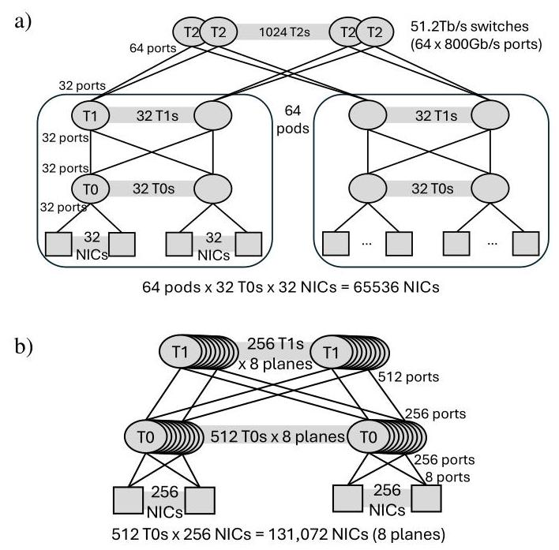
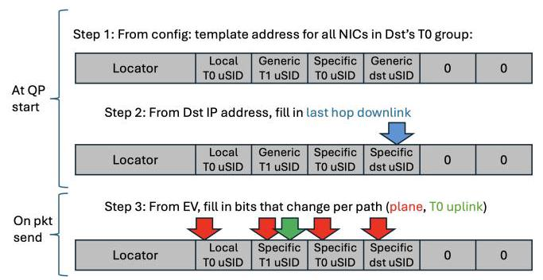
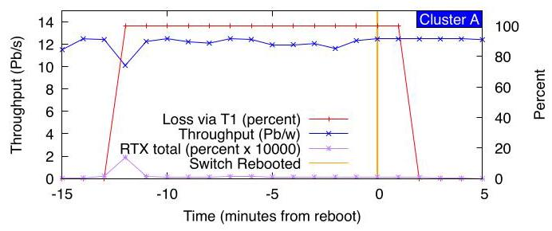
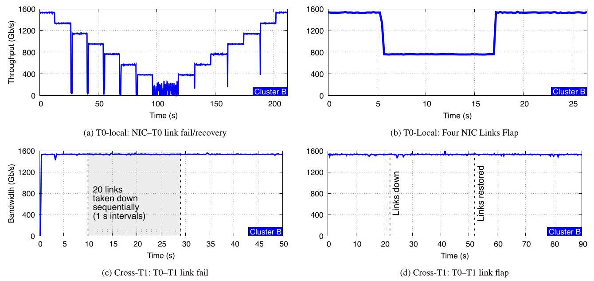
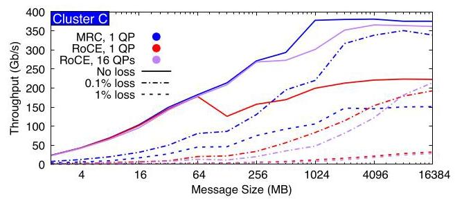
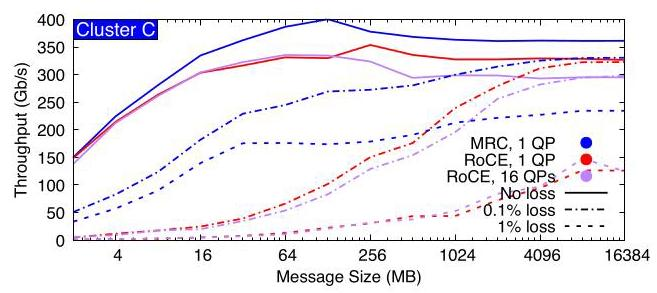
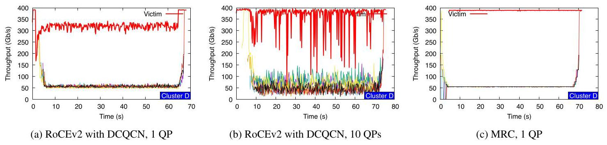

# Resilient AI Supercomputer Networking using MRC and SRv6 深度解读

> **作者**：OpenAI、Microsoft、AMD、Broadcom、NVIDIA 联合作者，包括 Joao Araujo、Alex Chow、Mark Handley、Jitendra Padhye、Michael Papamichael、Amin Tootoonchian、Lihua Yuan、Torsten Hoefler、Jithin Jose、Abdul Kabbani、Guohan Lu、Yang Wang、Rip Sohan、Eric Spada、Sayantan Sur 等。  
> **会议/期刊**：OpenAI / OCP technical report, 2026。  
> **一句话总结**：这篇论文把 AI 训练后端网络的可靠性问题从“交换机动态路由和人工运维快速止血”转移到“端侧 MRC 对大量显式路径做 packet spraying、拥塞规避和故障绕行”，并用 SRv6 静态源路由与多平面拓扑支撑 100K+ GPU 级别的生产训练。

## 一、问题定义

这是一篇明显的**非 First 类型**工作：它不是第一次提出数据中心多路径、RDMA、packet spraying 或源路由，而是在超大规模同步 AI 预训练网络这个场景下，把这些思想重新组合成一个生产级协议栈和运维模型。原始问题是：同步 pretraining 的每一步都被最慢通信轮次决定，通信尾延迟、flow collision、incast、链路抖动和交换机故障都会被大量 GPU 的 lock-step 执行方式放大成训练吞吐下降甚至作业失败。

现有 RoCEv2 + ECMP + PFC/DCQCN 的主流方案把单个 QP 绑定到少数 hash 路径，依赖 lossless Ethernet 和动态路由维持可达性。这在小规模集群中可用，但在 100K GPU 级别会暴露三个缺口：ECMP hash 碰撞会制造热点；PFC 在 incast 下会扩散 head-of-line blocking；动态路由和交换机控制面在故障时收敛慢且难诊断。论文的切入点就是：如果训练作业已经要求极低尾部抖动，那么网络协议必须把“路径是否健康、是否拥塞、是否可替换”变成每个连接自己能快速判断的局部问题。

**动机评估**：动机很 solid。作者没有只停留在概念论证，而是给出 OpenAI 和 Microsoft 大规模训练集群中的生产事件：50K GPU 训练中 NIC-T0 transceiver flap 造成约 1 分钟 25% 吞吐下降但作业不崩；75K GPU 训练中 T1 交换机故障影响约四分之一 QP、丢约 580K 包但作业吞吐很快恢复。弱点是这些生产结果受保密限制，缺少完整模型、训练 step-time 分布和长期故障统计，因此读者能判断“确实可用”，但很难独立复现实验强度。

**核心 Insight**：论文最关键的洞察是：在冗余足够高的 multi-plane Clos 中，失败路径不必由交换机动态路由“修复”，可以由 NIC 端的 MRC 直接从活动 EV 集合中移除并替换；一旦端侧协议能在微秒级绕开坏路径，交换机网络反而可以更静态、更可观测、更少控制面行为。换句话说，拓扑冗余提供“可绕行空间”，MRC 提供“端侧选择机制”，SRv6 提供“路径可解释性”。

## 二、相关工作

论文把相关工作按“负载均衡粒度”和“路径控制位置”组织，而不是按时间线罗列。

第一类是传统 RoCEv2/ECMP 与围绕它的 flow-level 改进。ECMP 的优点是简单，缺点是每个 flow/QP 的路径粒度太粗；Hedera、MicroTE、Flowlet switching、Presto、DLB、PLB、FlowBender 等工作尝试用集中式、交换机侧或主机侧反馈改善流放置，但 AI 训练通信突发、同步且高负载，反应速度和控制精度仍然不够。

第二类是应用层或连接层 multipath。NCCL QP scaling、MSCCL、NCCLX、UCCL 等在 collective 层面把通信拆成多个 QP 或多个通道，能缓解 flow collision，但无法让一个 QP 在每包粒度使用数百条路径，也无法统一处理链路故障和交换机灰故障。MPTCP 和 Falcon 这类多子流方案能提升利用率，但需要 per-subflow 状态，设计目标也不完全等同于 AI 后端 RDMA fabric。

第三类是 packet spraying 与 feedback-driven multipath。RPS、Homa、NDP 等展示了 per-packet 负载均衡的潜力，但如果完全 oblivious，就难以处理非对称拥塞和 partial/gray failure；MPRDMA、Hermes、REPS 等引入 per-path 状态和 ECN/delay 反馈，更接近 MRC 的方向。MRC 的差异在于把这些能力做进 RoCE RC 语义的最小扩展，并明确面向 best-effort Ethernet、packet trimming 和硬件 NIC 实现。

第四类是 UET、SRv6 和 AI 网络拓扑共设计。UET 标准化了面向 HPC/AI 的新传输协议和 packet trimming，MRC 借鉴其设计但仍保留 RoCE/Verbs 兼容子集。SRv6/uSID 相关工作验证了显式路径放置的可行性；Alibaba HPN、rail-only 等 AI 网络设计探索了两层或低成本拓扑。本文的贡献是把 multi-plane topology、MRC 和 static SRv6 在 100K+ GPU 生产系统中结合起来。

## 三、技术挑战

**挑战 1：100K+ GPU 的 full-bisection 网络不能无限堆层数。** 传统 800Gb/s 单平面三层 Clos 用 64 端口 51.2Tb/s 交换机只能自然扩展到约 64K NIC；如果继续上 100K GPU，就要四层、超卖或多 rail，带来更高延迟、更多光模块、更多故障点和更复杂的运维。

**挑战 2：同步训练把网络尾部事件放大。** Pipeline/data/tensor/expert parallelism 的通信轮次会被最慢 transfer 决定；平均吞吐好不够，只要少数流因 hash collision、incast 或重传慢掉，就会拖住整步训练。

**挑战 3：lossless RoCE 的拥塞控制与 packet spraying 天然冲突。** 一个 QP 如果每包喷洒到数百条路径，PFC 看到的是跨路径聚合的复杂拥塞，容易把一个 collective 的阻塞传播给其他 collective，形成 head-of-line blocking。

**挑战 4：故障恢复必须比动态路由收敛快得多。** 高 radix 两层拓扑中，某个目的地经由哪些 T1 可达会随下行链路故障变化，维护大量 ECMP set 很难；更麻烦的是交换机软件或控制面可能显示链路 up，但 dataplane 已经不转发。

**挑战 5：运维团队需要可定位的路径健康信息。** 生产集群有成千上万交换机和海量链路，不可能靠人工快速判定每条 flappy link 是否影响训练；系统需要自动判断“哪条物理路径坏了、是否要维修、是否可以继续放在服务中”。

## 四、解决方案

### 整体思路

论文的整体方案是三层共设计：用 multi-plane Clos 提供大量物理冗余，用 MRC 在每个 QP 内按 EV 喷洒到多个 plane 和多条路径，并用 SRv6/uSID 把每个 EV 映射成一条静态、可解释的显式路径。交换机只执行静态转发；拥塞、丢包、坏路径识别和重传主要由 NIC 端完成；Clustermapper 则在运维层持续探测路径健康并辅助 denylist 策略。

图 1 是论文的拓扑论证核心。把 800Gb/s NIC 拆成 8 条 100Gb/s plane 后，同样 51.2Tb/s 交换机从 64 个 800G 端口变成 512 个 100G 端口，两层 Clos 就能覆盖 131,072 个 NIC，而传统三层 800G 单平面示例只到 65,536 个 NIC。这里的关键不是“100G 比 800G 快”，而是高 radix 带来的二层可达规模、更多路径多样性、更低 hop 数，以及单条链路故障只损失更小容量份额。

### 贯穿示例

可以把一次训练中的 RDMA write 想成：GPU A 要把一块 tensor shard 写到 GPU B 所在节点内存。传统 RoCE 会让这个 QP 基本沿着一个 ECMP hash 选中的路径走；如果这条路径和其他流撞在同一条 T0-T1 链路上，或者链路瞬时 flap，这个 transfer 就会变慢甚至触发 QP failure。

在 MRC 中，GPU A 的 NIC 在 QP 启动时生成一个 EV set，比如每个 plane 选若干 EV，总数可达 128 到 256 个。发送 tensor shard 时，每个 packet 都带 RDMA virtual address 和 remote key，因此即使乱序到达，接收端 NIC 也能直接放到正确内存地址。每个 packet 轮流使用不同 EV；在 SRv6 模式下，EV 不只是 hash entropy，而是可算法映射成“走哪个 plane、哪个 T0 uplink、哪个 T1、哪个目标 T0/downlink”的显式路径。

如果某个路径 ECN 变多，接收端通过 SACK 把信号回传，发送端暂时不用该 EV；如果某个 packet 真丢了，发送端先假设该路径坏了，把 EV 移出活动集合，用 backup EV 替代并选择性重传；如果之后 probe 证明路径恢复，再把 EV resurrect。这样一次 tensor transfer 不再押注单一路径，而是在大量路径上连续试探、避让和恢复。

### 关键技术点

**1. MRC 扩展 RoCE RC，但只保留 AI 训练需要的子集。** MRC 仍使用 Verbs API 和 QP 抽象，但在 transport 层只支持 RDMA write 和 write-with-immediate。这个取舍牺牲了通用性，换来更小实现面：每个数据包携带最终写入地址，接收端能 out-of-order memory placement；SACK/NACK 支撑快速选择性重传；packet trimming 把本来会因拥塞被丢弃的包裁掉 payload 后优先送达目的端，从而触发快速 NACK，并把“拥塞丢包”和“链路/路径故障丢包”区分开。

**2. EV 是 MRC 的路径句柄。** 在普通 ECMP 网络中，EV 被拆到 UDP source port 和 IPv6 flow label 里参与 hash；在 SRv6 网络中，EV 仍然随 packet 携带，供接收端 echo 拥塞/丢包状态，同时通过算法映射生成 SRv6 外层目的地址。每个 EV 维护少量健康状态，MRC 用 ECN 做负载均衡信号，用 packet loss 做路径故障信号，用 probe 做恢复验证。

图 3 展示了 EV 到 SRv6 地址的压缩映射。QP 启动时，NIC 先从配置中拿到某类目的节点的通用地址模板，再填入目的端最后一跳 downlink；每次发包时，再把 EV 中变化的 plane 和 T0 uplink 等字段拷到对应 uSID。这个设计避免为每条路径同时保存完整 SRv6 地址和 EV 状态，也让“某个 EV 坏了”可以还原成明确的物理路径。

**3. 静态 SRv6 让交换机退回简单 dataplane。** 论文使用 uN uSID：外层 IPv6 目的地址里嵌入一串 16-bit uSID，每个交换机匹配自己的 locator/uSID 后左移地址，让下一跳 uSID 进入查表位置，再按静态表转发。交换机不需要动态重算 ECMP；如果路径不通，MRC 端侧停止用该 EV。作者强调这反而提升了可理解性，因为不会出现 MRC 刚避开坏路径、动态路由又改变 hash 映射的双重自适应。

**4. Clustermapper 补上运维闭环。** 每个节点运行 agent，以毫秒级频率用 SRv6 source-routed probes 探测本地 T0、T1 以及 T0-T1 链路。由于探测包和 MRC 数据包走同一类显式路径，结果更接近 forwarding-plane ground truth，而不是交换机控制面自报状态。Clustermapper 既可用于维修调度，也可在 NIC-T0 链路高丢包但未完全 down 时生成 denylist，弥补 MRC 难以判断问题在本端还是远端的局限。

**5. 保持 plane 间负载均衡是设计不变量。** 当 MRC 移除一个 EV 时，会优先从同一 plane 的 backup EV 替换，保持各 plane 均匀承载，避免因不同 flow 的轻微上行拥塞造成 false incast。代价是：如果后端网络混有 single-path traffic，或者某个 plane 集中丢失很多 T0-T1 链路，MRC 会被最差 plane 限制；如果某个 NIC-T0 plane 高丢包但没完全掉线，也需要 Clustermapper policy 介入。

### 与已有方案的对比

相对 RoCEv2 + ECMP，MRC 的优势是把一个 QP 的流量拆到数百条路径上，避免单个 hash collision 决定性能；相对 RoCE + 多 QP，MRC 不需要把负载均衡责任推给 collective 层，也能直接处理路径级 loss 和拥塞；相对动态路由，MRC + SRv6 把故障处理做成端侧快速局部反应，并给出物理路径可观测性。

它的局限同样清楚。第一，MRC 需要 NIC、交换机和运维系统协同实现，不是纯软件升级。第二，论文当前只支持 AI workload 需要的 RDMA write 子集。第三，整张 NIC transceiver flap 会让所有端口一起丢失，QPs 仍可能失败。第四，1% 持续全平面随机丢包下 MRC 也只能得到约三分之一目标吞吐，这说明它适合“绕过局部/短时故障”，不是容忍全网长期高损耗。

## 五、实验评估

### 实验设定

论文使用四个集群。Cluster A 和 B 是 NVIDIA GB200 + CX8 800Gb/s NIC 的两层 multi-plane 网络，分别是 4 x 200Gb/s 和 8 x 100Gb/s；Cluster C 是 AMD MI355 + Pollara 400Gb/s NIC + Broadcom Tomahawk 5 的 4 x 100Gb/s multi-plane；Cluster D 是 RTX 6000 + Broadcom Thor Ultra 的 400Gb/s single-plane 小规模 testbed。主要指标包括训练 job throughput、packet loss、ib_write_bw/ib_write_lat、NCCL sendrecv 带宽、all-reduce/all-to-all collective bandwidth，以及 incast victim flow 吞吐。

Baseline 主要是 RoCEv2，配合 ECMP、PFC 和 DCQCN；MRC 则运行在 best-effort Ethernet 上，关闭 PFC，并使用 SRv6。需要注意，论文承认没有一个大型 RoCE 部署可直接和大型 MRC 生产集群对照，因此 RoCE 对比主要来自 Cluster C/D 小规模 testbed。

### 主要实验与结论

**生产训练结果。** Cluster A 中，T0-T1 link flaps 可以持续出现但几乎不影响大规模同步训练，因此维修优先级可降低。一个 50K GPU 生产 pretraining 事件中，T0 switch optical transceiver 连续 flap 4 条 NIC-T0 链路，三个活跃节点受影响；吞吐在约 1 分钟内下降约 25%，随后立即恢复，作业没有崩溃，QP 没有失败。75K GPU 作业中，作者观察到 4 次 T1 switch reboot；其中一次约四分之一 QP 受影响、丢约 580K 包，交换机在 t=2 分钟恢复转发，作业吞吐只在初始故障时短暂下降，真正 reboot 时无明显影响。

图 8 的红线显示 T1 交换机停止转发时经由该 switch 的 loss 接近 100%，紫线显示重传/丢包事件可见但很小，蓝线的总训练吞吐只在故障初期出现短暂下探。这张图支撑了论文最强的生产论点：当 MRC 已经把坏 EV map out 后，后续 switch reboot 不再是必须协调训练团队的大事件。

**点对点性能。** Cluster B 上，MRC 在 32KB message 下 T0-local 和 cross-T1 都达到约 770Gb/s，约为理论峰值的 96%；2B message 的近似 one-way latency 分别是 5.09us 和 6.54us。也就是说，MRC 的大包吞吐没有因为跨 T1 明显受限，小包延迟则主要体现额外 switch hops 和协议控制路径开销。

**链路和交换机故障。** NIC-T0 链路逐条失败时，吞吐按剩余 plane 容量阶梯式下降并在恢复时回升；单个 CX8 NIC 的 8 条链路中 flap 4 条时，MRC 稳定在约一半额定带宽，并在恢复后迅速回满。T0-T1 链路更容易被路径多样性吸收：连续 down 20 条或同时 flap 8 条时，总吞吐几乎不受影响。T0 switch down 会造成约 100Gb/s 稳态带宽下降；T1 switch down 在 cross-T1 四 QP 实验中没有稳态带宽下降。

图 9 很好地区分了故障位置的重要性：NIC-T0 failure 直接损失本 NIC 的 plane 容量，所以曲线阶梯式下降；T0-T1 failure 则被每个 QP 的大量候选路径稀释，20 条链路依次下线或 8 条链路同时 flap 仍基本维持接近 1.6Tb/s 的双向吞吐。

**路径级 loss 和负载均衡。** 在 Cluster B 中，作者把某个 EV 配置成 20% packet drop，并把系统限制为 8 个 plane、每 plane 2 条路径以便观察；约 51s 触发丢包后，EV-A 立即 inactive，EV-B 替代，端到端带宽保持 line-rate。两流共享同一 EV 的负载均衡实验中，MRC 通过 ECN 检测拥塞，把一个 flow 迁移到 EV-B，两个 flow 在迁移过程中都保持接近峰值带宽。

**NCCL 规模实验。** Cluster B 上使用 NCCL-tests sendrecv，在 42K GPU 规模、较大 message size 下达到最高 92GB/s per-NIC throughput。这不是完整训练 benchmark，但说明 MRC 能支撑真实 collective library 的大规模稳定通信。

**与 RoCE 的 collective 对比。** Cluster C 的 64 GPU testbed 用同样 GPU/NIC/switch/aggregate bandwidth 比较 RoCE 和 MRC：RoCE 使用 400Gb/s 单平面 ECMP + PFC/DCQCN；MRC 使用 4 x 100Gb/s plane + SRv6，关闭 PFC。Ring all-reduce 中，RoCE 1 QP 在大 message 下常只达到约一半可能吞吐，16 QP 有帮助但超过 8 QP 收益很小；MRC 1 QP spraying 256 paths 的表现优于 RoCE 16 QP。0.1% loss 对大 message MRC 影响很小，1% loss 下 RoCE 基本不可用，MRC 也只剩约三分之一目标吞吐。

图 16 的价值在于把“QP scaling 可以解决 RoCE hash collision”的常见直觉压低了：紫色 RoCE 16 QP 比红色 RoCE 1 QP 好，但蓝色 MRC 1 QP 在大消息段仍明显更高。虚线还说明 MRC 的 selective retransmission 能吸收 0.1% loss，但并不神化协议，1% 全局随机 loss 已经超过持续训练可接受范围。

All-to-all 中，RoCE 因同时活跃 QP 更多，负载均衡问题稍弱，但 QP scaling 反而不一定有益；MRC 在所有 message size 下都优于 RoCE，尤其是在 bandwidth-bound 区域。0.1% loss 下，RoCE 大 message 退化不明显，因为许多 QP 并行能掩盖少量重传；小 message 则退化严重，MRC 的 SACK 重传优势更明显。

图 17 说明 MRC 的优势并不只来自 ring all-reduce 这种单入单出模式。All-to-all 下 RoCE 的多 QP 已经自然分散了部分流量，但 MRC 仍在大多数区间保持更高吞吐，尤其是在小消息和丢包条件下更稳定。

**Collateral damage。** Cluster D 的 7-to-1 incast + victim flow 实验直接检验 PFC/DCQCN 是否会伤害无关流。RoCE + DCQCN 1 QP 时 victim flow 平均下降约 25%；8 QP 时平均影响小一些，但存在 1 秒窗口掉到 100Gb/s，即相对 400Gb/s 最优值下降 75%。MRC 则几乎完美分享 incast bottleneck，并且不影响 victim flow。

图 18 是 PFC/DCQCN 问题最直观的一张：RoCE 曲线里 victim flow 被 incast 拖出明显锯齿甚至深谷，而 MRC 的 victim 基本贴近 400Gb/s。它支撑了论文关闭 PFC、使用 best-effort + trimming + selective retransmission 的设计选择。

### 结论支撑性分析

实验整体能支撑论文的主要工程结论：MRC 可以利用 multi-plane 冗余绕过大量链路/T1 故障；SRv6 静态路径让故障定位和运维动作更简单；在小规模可对比环境下，MRC 比 RoCE/QP scaling 更能避免 hash collision 和 incast collateral damage。

但也有边界。第一，生产结果以案例展示为主，不是系统化的长期统计分布。第二，MRC 与 RoCE 的直接性能对比没有在同等 50K/75K GPU 生产规模上做。第三，论文的硬件实现横跨多厂商最新 NIC/交换机，推广到普通集群需要生态支持。第四，MRC 对全网持续高随机丢包的表现有限，真正依赖的是“故障局部化 + 快速绕行”这个前提。

## 六、附加洞察

**结论 1：预训练启动阶段可以不预先 map out 所有坏 T0-T1 路径。**  
*出处*：Section 2.4 / Figure 4。  
*推理链条*：MRC QP 启动时先用大 EV set 和 backup EV set 喷洒；部分路径如果已坏，会丢包并触发 EV 替换；75K GPU 作业启动时，即便不预填 denylist，loss rate 也在数分钟内降到每 NIC 每秒 1 次以下，第一分钟每 QP 少于 5 个包丢失；由于大作业本来要缓慢 ramp up 避免电力冲击，这个瞬态对训练时间影响很小。这个结论不是说 Clustermapper 不重要，而是说明 T0-T1 已知坏链路对长寿命 QP 的启动性能没有作者原先可能担心的严重。

**结论 2：反向控制包也需要独立维护“已知可用”的 EV。**  
*出处*：Section 2.4 Reverse Paths。  
*推理链条*：MRC 的 forward EV set 由 SACK/NACK 更新，但 ACK/SACK/NACK 自己也要走回程路径；某些 collective 在某一时刻是单向通信，不能假设对端有 data traffic 可更新 reverse EV；直接反转 SRv6 forward path 又不总是可行。因此作者维护小型 reverse EV set，每个 plane 至少一个 EV，并在入站活跃但无出站数据时每 RTT 发随机 EV probe，probe 成功才作为该 plane 的反向 EV。这是协议细节，但它揭示了 packet spraying 系统里“控制面包本身也要抗故障”的问题。

**结论 3：plane 均匀负载既是性能策略，也是诊断工具。**  
*出处*：Section 4 Inter-plane Loading。  
*推理链条*：MRC 把被移除 EV 替换为同 plane EV，保持各 plane 负载相等；这样可避免 mild congestion 导致某些 plane 假性 incast，同时让正常状态下各 plane 的网络统计应当相似；如果某个 plane 显著变差，通常就是网络问题信号。薄弱点在于这个 invariant 假设后端网络主要跑 MRC，如果混入 single-path traffic 或某 plane 大量 T0-T1 失效，最差 plane 会限制整体吞吐。

**结论 4：在 MRC 环境中，flapping link 不一定要立刻 administratively down。**  
*出处*：Section 3 Operations / Figure 5。  
*推理链条*：传统运维会先禁用抖动链路，维修验证后再启用；MRC 会在链路掉包时把对应 EV map out，并通过 probes 判断何时恢复；因此把链路留在服务中反而能在它可用时自动利用，在不可用时自动避开，还减少维修时对训练团队的协调。这个结论依赖 MRC 的快速重传和 probe 机制，不能直接迁移到普通 RoCE 网络。

**结论 5：DCQCN 调参难点来自 traffic-pattern specificity，而不只是参数没调好。**  
*出处*：Appendix / Figure 22。  
*推理链条*：作者在 15-to-1 incast 中测试三套推荐 DCQCN profile；默认 profile 在少于 10 个 flows 时还能控队列，之后进入 PFC mode；更 aggressive 的 profile 控住队列但有时空队列，导致约 10% bottleneck throughput 损失；最 aggressive profile 平均利用率更低，总吞吐比 line-rate 慢 20%。这说明 DCQCN 的“减少 PFC”并非免费，且对流到达模式敏感。

## 七、总结与评价

这篇论文的核心贡献不是发明单个全新机制，而是把 multi-plane topology、MRC packet spraying、selective retransmission、packet trimming、SRv6 static source routing 和 Clustermapper 运维探测组合成一个可生产部署的 AI supercomputer 网络方案。它最强的亮点是系统边界划得清楚：交换机保持静态和简单，NIC 负责快速路径选择，运维系统负责持续 ground-truth 探测。

最大的不足是评估中的可复现性和可比性有限。生产案例很有说服力，但缺少长期统计和对照组；RoCE 对比只能在小 testbed 上完成；很多收益依赖最新 NIC/交换机硬件实现与多厂商协作。后续值得关注的是：MRC 规范开放后，第三方能否复现类似效果；它与 UET/Falcon/应用层 collective 优化如何共存；以及在更异构、更混部的后端网络中，plane-evenness 和静态 SRv6 的假设是否仍然成立。

## 八、章节脉络与段落速览

- **Abstract**：概括 MRC、multi-plane topology 和 SRv6 三件套如何让超大训练集群绕过网络故障。
  - ¶1 指出同步预训练受尾延迟支配，并概括三项方案：MRC、多平面两层拓扑、SRv6 静态源路由。

- **Section 1 · Introduction**：从训练规模、尾延迟、运维约束引出 MRC 与静态源路由。
  - ¶1 说明 100K GPU 级同步训练中，通信轮次由最慢 transfer 决定。
  - ¶2 把 outlier、网络故障和训练作业失败联系起来，并列出负载均衡、incast 和故障绕行三项需求。
  - ¶3 强调小团队运维大规模网络时不能依赖人工快速修复，协议栈需要默认容错。
  - ¶4 介绍 MRC 是 RoCE RC 的最小扩展，借鉴 UET，但只保留 AI workload 需要的 RDMA write 子集。
  - ¶5 用 Figure 1 引出 multi-plane topology 与 MRC 的协同。
  - ¶6 说明作者关闭动态路由、采用 SRv6 静态源路由的反直觉设计。
  - ¶7 交代 MRC/SRv6 在多厂商 NIC 和交换机上的实现、生产部署和 OCP 规格发布。

- **Section 2 · Multi-plane Topology Co-Design**：论证拓扑、协议和源路由为什么要一起设计。
  - ¶1 比较 800G 单平面三层 Clos 的规模限制。
  - ¶2 说明把 800G NIC 拆成 8 x 100G plane 后，两层 Clos 可覆盖 131,072 GPU。
  - ¶3 列出多平面方案的延迟、成本、功耗、冗余和故障影响优势。
  - ¶4 指出多平面也要求 workload 能跨 plane 均衡并容忍链路/NIC 端口失败。
  - **2.1 · MRC Overview**：解释 MRC 的 packet spraying、best-effort、重传和拥塞反馈。
    - ¶1 说明 MRC 支持 QP/Verbs 抽象但只支持 write 类操作。
    - ¶2-6 依次介绍包内地址、EV、关闭 PFC、SACK 选择性重传和 packet trimming。
    - ¶7-9 说明 EV 均分到 plane，ECN 用作内部路径负载均衡信号。
    - ¶10 说明 packet loss 会让 MRC 假定路径失败，并通过 probes 验证恢复。
    - ¶11 总结 MRC 可在几十微秒级检测并绕过路径故障。
  - **2.2 · Static Segment Routing**：解释为什么不用动态路由。
    - ¶1 说明高 radix 两层拓扑中动态维护大量 ECMP set 很难。
    - ¶2 说明 MRC 与动态路由双重自适应会让行为更难理解。
    - ¶3 说明静态 ECMP 仍缺少 EV 到物理路径的可解释映射，因此转向源路由。
    - ¶4-5 介绍 SRv6/uSID 与 uN 风格显式命名每跳交换机。
    - ¶6 解释 uSID shift forwarding，并强调可 line-rate 执行且静态表通常不变。
    - ¶7 说明 MRC 使用 IPv6-in-IPv6 封装，外层走 SRv6，内层给目标 NIC。
  - **2.3 · Mapping EVs to SRv6 Addresses**：说明 EV 如何压缩表示显式路径。
    - ¶1-2 说明 EV 在 ECMP 和 SRv6 模式下都要随 packet 携带，供回传状态。
    - ¶3 提出 EV 与 SRv6 地址的算法映射，避免保存重复路径状态。
    - ¶4-5 解释 QP 启动时创建模板、发包时用 EV 填 plane 和 T0 uplink 字段。
  - **2.4 · Choosing Working Paths**：说明 MRC 如何选择、替换和探测可用路径。
    - ¶1 说明静态源路由下资源管理从 routing 转移到 MRC。
    - ¶2 说明 QP 启动时 EV 均分到 plane 并随机选路径。
    - ¶3 介绍 Clustermapper、denylist 和 SRv6 带来的 forwarding-plane ground truth。
    - ¶4-5 说明预训练启动时即使不预填 T0-T1 denylist，MRC 也能快速 map out 坏路径。
    - ¶6 解释 75K GPU 启动实验中的 loss rate 下降和低影响。
    - ¶7-9 说明反向 ACK/SACK/NACK 需要 reverse EV set 和 EV probe。

- **Section 3 · Operations**：说明 MRC 如何改变故障处理和运维优先级。
  - ¶1 设定目标：让小团队能运营超大训练网络。
  - ¶2 说明 T0-T1 link flap 可低优先级维修，因为 MRC 只丢极少包并快速替换 EV。
  - ¶3 说明作者从禁用 flappy link 转向让链路留在服务中，由 MRC 自行避让和恢复。
  - ¶4 解释交换机软件 bug 和 control/dataplane divergence 为什么危险。
  - ¶5 给出四个实验/生产集群的硬件与拓扑配置。
  - ¶6 说明静态 SRv6 下 T1 异常可直接 reboot，而 NIC-T0 和 T0 故障仍需更谨慎。
  - ¶7 说明四平面和八平面对 NIC port failure 的影响不同，但多数 transient 可继续训练。
  - ¶8 引出 telemetry 对 root cause、调参和 MRC debug 的必要性。
  - ¶9-10 解释 Clustermapper 每毫秒探测本地 T0/T1 并定位链路或交换机问题。
  - ¶11 对比 SRv6 probes 与 pingmesh/ICMP，强调 dataplane 高频探测和路径无歧义。

- **Section 4 · Inter-plane Loading**：讨论保持 plane 均衡的好处与代价。
  - ¶1 说明 MRC 替换 EV 时保持同 plane，以避免 false incast。
  - ¶2 说明 mixed single-path traffic 或单 plane 大量损坏会让最差 plane 成为瓶颈。
  - ¶3 说明未完全 down 的高丢包 NIC-T0 plane 需要 Clustermapper policy 处理。
  - ¶4 说明 plane 均衡让异常 plane 更容易被网络统计发现。

- **Section 5 · Experiments**：用生产案例和 testbed 验证弹性、性能和 RoCE 对比。
  - ¶1-2 说明四个 AI training clusters 和 T0-local/cross-T1 术语。
  - **5.1 · Training Results**：展示生产训练中的链路和交换机故障。
    - ¶1-2 说明 MRC 已用于 frontier model 训练，多数后端故障不导致失败。
    - ¶3-5 说明 50K GPU 作业中的 NIC-T0 transceiver flap 造成约 25% 短时下降但不崩溃。
    - ¶6 说明 75K GPU 作业中 T1 switch failure/reboot 的吞吐影响很小。
    - ¶7 指出 NIC transceiver 整体 flap 仍是单点故障。
  - **5.2 · Testbed Results**：在受控环境中测量不同故障和 traffic pattern。
    - **5.2.1** 给出 5.09us/6.54us latency 与约 770Gb/s bandwidth。
    - **5.2.2** 展示 NIC-T0、T0-T1 link down/flap 下的 graceful degradation 和快速恢复。
    - **5.2.3** 展示 T0 failure 导致约 100Gb/s 下降，而 T1 failure 不造成稳态下降。
    - **5.2.4** 展示 20% EV-level drop 会使坏 EV 立即 inactive 并由 backup EV 替代。
    - **5.2.5** 展示 ECN 触发 EV 间负载迁移且无可见吞吐损失。
    - **5.2.6** 展示 NCCL sendrecv 在 42K GPU 达到最高 92GB/s。
    - **5.2.7** 比较 MRC 与 RoCE 在 all-reduce/all-to-all、QP scaling 和 loss 下的表现。
    - **5.2.8** 展示 incast 下 RoCE/PFC/DCQCN 会伤害 victim flow，而 MRC 基本不伤害。

- **Section 6 · Related Work**：把前人工作按负载均衡粒度、实现位置和拓扑方案分类。
  - ¶1 介绍 flow-level ECMP 及集中式、交换机侧、主机侧改进。
  - ¶2 介绍 RoCEv2 部署中的 application-level multipath 和 collective 层优化。
  - ¶3 介绍 MPTCP/Falcon 类多子流方案。
  - ¶4 介绍 packet spraying 与 feedback-driven per-path 状态方案。
  - ¶5-6 对比 IRN/MPRDMA、UET 和 MRC 的关系。
  - ¶7 说明 MRC 使用 SRv6 source routing 的差异。
  - ¶8-9 对比 AI network topology co-design 和 hyperscaler failure experience。

- **Section 7 · Conclusions**：总结 MRC 在多平面网络上的负载均衡、静态 SRv6、生产部署和运维收益。
  - ¶1 重申 MRC 已在多厂商 800Gb/s NIC 和两层多平面 supercomputer 中部署，并让大型预训练作业绕过过去会导致失败的网络故障。

- **Section 8 · Acknowledgments / References / Appendix**：补充参与者、引用和附录实验。
  - Acknowledgments 列出跨组织工程和部署参与者。
  - References 覆盖 ECMP、RoCE、packet spraying、SRv6、UET、AI collective 和 hyperscaler 网络故障文献。
  - Appendix ¶1-3 用 Thor Ultra/Cluster D 补充 MRC 在单平面 400Gb/s testbed 中的 link failure 弹性。
  - Appendix ¶4-6 用 RoCEv2 permutation microbenchmark 说明 flow collision 和 PFC/DCQCN 的差异。
  - Appendix ¶7-10 补充 incast collateral damage 与 DCQCN profile tuning 的敏感性。
