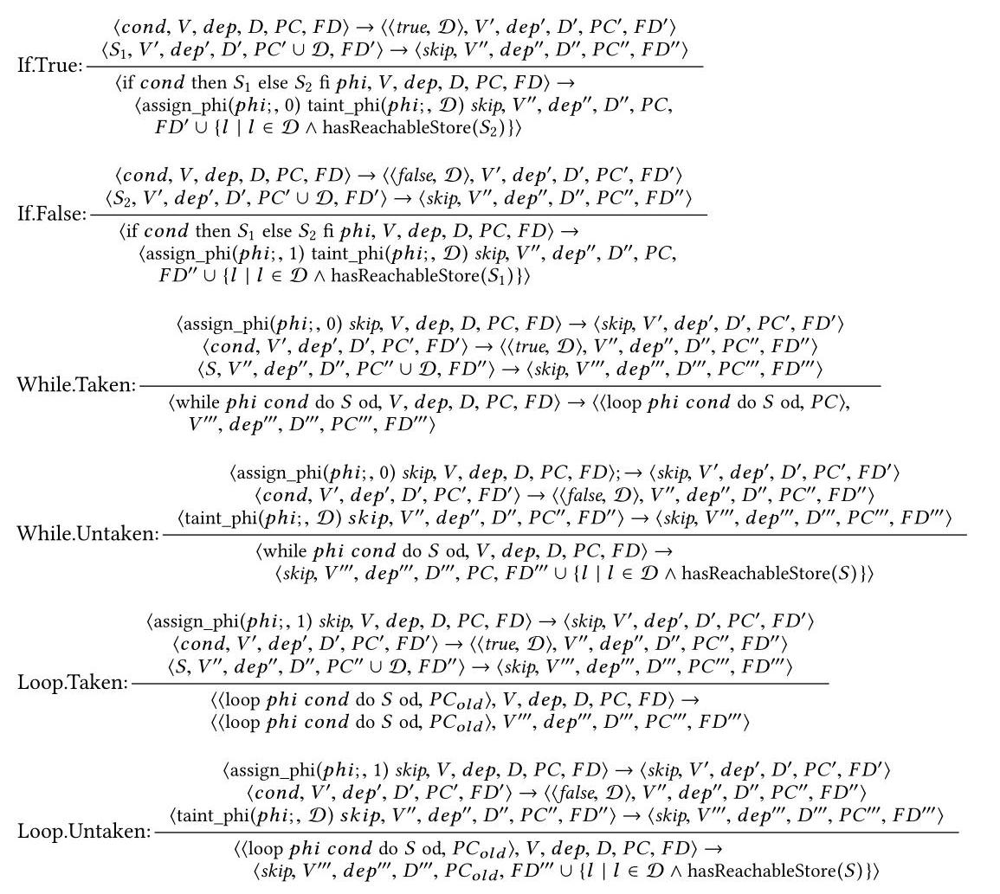
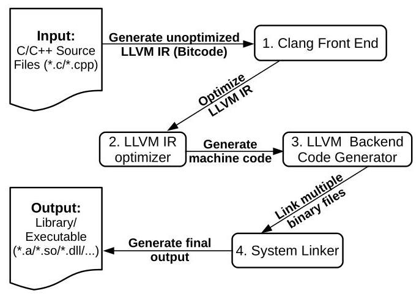
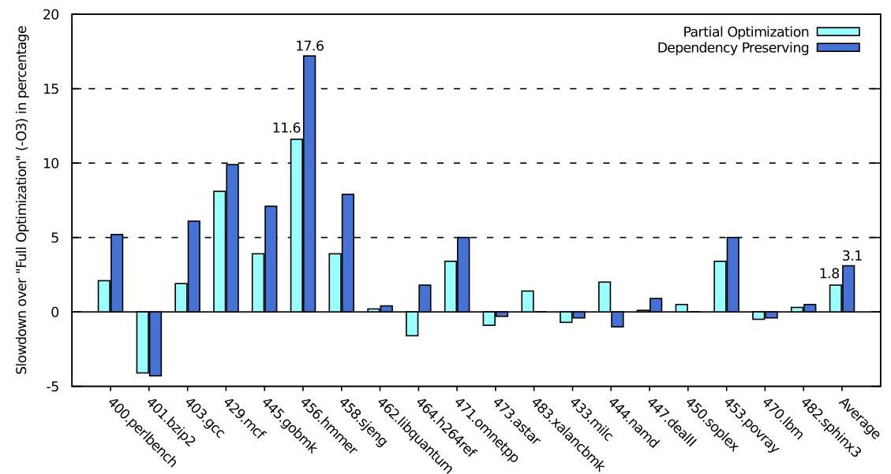
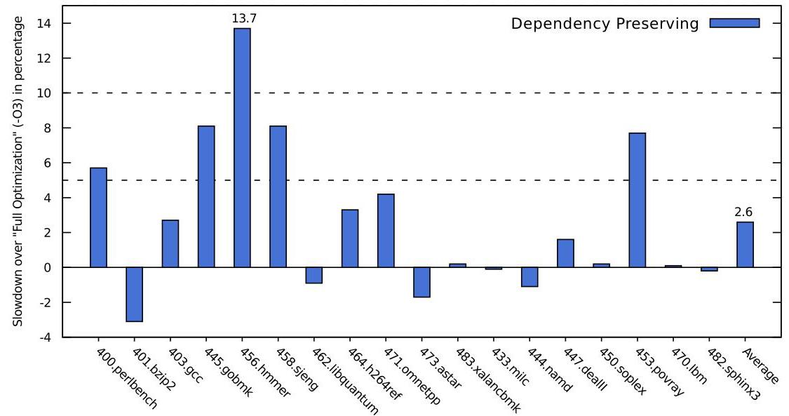

# Towards Understanding the Costs of Avoiding Out-of-Thin-Air Results 深度解读

> **作者**：Peizhao Ou, Brian Demsky  
> **会议/期刊**：Proceedings of the ACM on Programming Languages, Vol. 2, OOPSLA, Article 136, 2018  
> **一句话总结**：这篇论文把避免 out-of-thin-air 结果的问题落到两个可实现的编译器约束上，分别是保留 syntactic dependency 和禁止 relaxed atomic 的 load-store reordering，并用 LLVM/AArch64 原型证明这些约束在 ARMv8 上的平均开销并不高。

## 一、问题定义

这篇论文处理的是 programming language memory model 中长期悬而未决的 out-of-thin-air results，也就是程序可以通过循环因果关系读到一个没有真实来源的值。它不是硬件弱内存模型单独造成的问题，而是语言语义、编译器优化和处理器重排序共同作用后的结果。硬件通常保留某种 data/control dependency，不会让依赖尚未成立的 speculative store 对其他核可见；编译器却可能通过常量折叠、控制流化简、冗余读消除等优化把这些依赖抹掉，于是语言模型如果只看 reads-from 关系，就可能承认循环自证的执行。

这不是一篇 first 类型的工作。OOTA 问题此前已经被 C/C++、Java memory model 和相关并发语义研究反复讨论，作者的切入点是：已有方案要么语义复杂到难以理解和验证，要么需要硬件支持或强内存保证，实际代价不清楚。本文试图回答一个更工程化的问题：如果我们用更保守但简单的规则禁止 OOTA，编译器和运行时性能到底要付出多少成本？

论文用三个小例子说明问题边界。Figure 1 中，Thread 2 可以先让 `x=42` 对 Thread 1 可见，Thread 1 再把 42 写入 `y`，最后 Thread 2 读到 `y=42`，这是弱内存硬件可能产生的真实执行。Figure 2 中，两个线程的 store 都依赖之前的 load，如果两个 load 又分别从对方后续的 store 读到 42，就形成了循环因果，42 被凭空制造出来。Figure 3 更棘手，优化器可能证明某个 load 总会得到 42 并把依赖消掉，有人认为这是合法优化导出的行为，有人认为它仍然应被禁止。这说明 OOTA 难点不只是“禁止怪异例子”，而是如何给出一条足够精确、又能被编译器实现的边界。

**动机评估**：动机很 solid。作者不仅指出 OOTA 会破坏形式化模块化推理，还会破坏开发者的非形式化推理，甚至让看似 race-free 的计算出现意外结果。更重要的是，C/C++ relaxed atomics 和 Java 普通访问都处在这个问题的覆盖范围内，影响的是主流语言规范和编译器实现，而不是边缘模型。不过论文的目标是“理解成本”和“证明方案可行”，不是给出最终的、所有语言社区都能接受的 OOTA 定义。

**核心 Insight**：OOTA 的根源可以被看成“reads-from 边”和“线程内因果边”形成的环。只要能让语言级语义和编译器共同保留足够的线程内因果边，就可以用一个 per-candidate execution criterion 检查单个候选执行是否允许。本文将这个洞察具体化为两种规则：dependency-preserving 模型要求 `dependency ∪ reads-from` 无环；load-store-order-preserving 模型要求 `sequence-before ∪ reads-from` 无环。前者更适合 Java-like 语义，因为所有普通 load/store 都可能参与 OOTA；后者更适合 C/C++ relaxed atomic，因为只需要约束显式标注的 atomic 访问。

## 二、相关工作

论文把已有方向分成两类。第一类主要修改语言规范，希望在不显著限制编译器和硬件的情况下精确描述已有优化行为。event-structure memory model、promising-style operational semantics 和 Java Memory Model 都属于这一脉络。它们的优势是理论表达能力强，可能容纳更多优化；不足是语义复杂，开发者和编译器工程师都难以直接使用。JMM 的 causality 规则甚至被证明与常见编译优化存在不兼容，判断具体执行是否满足 JMM 也可能非常困难。

第二类提供更强保证。最直接的是要求 `sequence-before ∪ reads-from` 无环，也就是禁止可能形成 OOTA 的 load-store 重排序。这条规则概念简单，对 C/C++ relaxed atomics 的影响范围也较小，但会排除一些硬件本来允许的合法弱内存执行，例如 load buffering。另一个方向是保留 dependency：硬件和 Linux kernel memory model 大体依赖这种 syntactic dependency 来避免凭空值。相比禁止全部 load-store 重排序，dependency-preserving 更弱，也更可能保留性能，但会把压力转移到编译器，要求优化过程不能随意消除数据依赖和控制依赖。

还有一些相邻工作试图通过更强的内存模型或硬件支持获得简单语义，例如 sequential consistency preserving compiler、TSO-like 模型、OCaml 的 local data race freedom、Relaxed Memory Calculus，以及针对 Linux kernel 的弱内存模型基准测试。本文与这些工作的主要区别是，它没有假设专用硬件，也没有提出一个全新的编程模型，而是直接改 LLVM，在商用 ARMv8 处理器上测两个简单规则的实际开销。

## 三、技术挑战

**挑战 1：OOTA 的边界本身有争议。** Figure 2 是公认的 canonical OOTA，但 Figure 3 这种经过编译器常量传播或分支推理之后产生的执行就没有共识。语义如果太弱，会放过循环自证；语义如果太强，会禁止原本可接受的优化或硬件行为。

**挑战 2：需要 per-candidate execution criterion。** 许多复杂语义需要比较多个候选执行或构造 justification 过程，难以让开发者和工具直接判断某个执行是否合法。本文希望规则能检查一个具体执行，这要求 dependency 或 sequence-before 关系定义得足够机械。

**挑战 3：dependency 在真实语言里很难保守而不爆炸。** 普通 data dependency 和 explicit control dependency 容易理解，但 C/C++ 的指针、函数指针、虚调用、SSA phi、未执行分支中的 store、地址依赖等都会影响未来 store 的可见行为。如果定义过细，就需要复杂 points-to analysis；如果定义过粗，就会限制优化。

**挑战 4：LLVM 优化 pass 之间存在组合效应。** 单个 pass 看似保留 dependency，但多个 pass 串联后可能共同消除依赖。例如 SSA 构造先把两个分支的相同值合并，后续 simplifycfg 再删除空分支，最终让 store 不再受原始 load 控制。

**挑战 5：后端也会破坏依赖和顺序。** 即使 IR 层保留了约束，SelectionDAG、branch folding、code generation preparation 等 backend pass 仍可能做代数化简、删除空控制流或改变机器级依赖。因此实现不能只停在语言语义或 IR 优化层。

**挑战 6：性能结论高度依赖架构和 workload。** x86 TSO 天然保留 load-store order，而 ARM/Power 更弱；ARMv8、ARMv7、Power 对 dependency、fence、acquire/release 的成本又不同。评估必须明确平台和 workload，否则“成本可接受”没有可迁移含义。

## 四、解决方案

### 整体思路

论文提出两条路径。第一条是 dependency-preserving memory model：先在一个简化命令式语言上定义 load 到 store 的 syntactic dependency，再要求编译器一路保留这些 dependency，最后禁止 `dependency ∪ reads-from` 形成环。第二条是 load-store-order-preserving memory model：针对 C/C++ relaxed atomics，要求 `sequence-before ∪ reads-from` 无环，并在 AArch64 后端对 relaxed load 到后续 store 加入必要的机器级顺序约束。

这张图对应论文中 dependency operational semantics 的一部分，重点是 if/while/loop 对 `PC` 和 `FD` 的传播。它说明作者并不是只把 dependency 理解成“值是否流到 store”，而是还显式记录控制依赖和未来 store 必须继承的依赖，这正是他们处理隐式控制依赖、地址依赖和循环的基础。

### 贯穿示例

可以用一个简单例子串起来：线程 A 先读 `x` 到 `r1`，再根据 `r1` 或由 `r1` 计算出的值写 `y`；线程 B 读 `y` 后再写 `x`。如果编译器把 `r1 * 0` 直接折叠成 0，或者把 `if (r1) y=1; else y=1` 合并成 `y=1`，那么 `y` 的写入就不再依赖 `x` 的读取。此时如果线程 B 的 `x` 写入又被解释为来自 `y` 的读取，候选执行就可能形成 `x` 的值由 `y` 证明、`y` 的值又由 `x` 证明的环。

dependency-preserving 的做法是保留“`y` 的写入仍然依赖 `x` 的读取”这个事实，哪怕这个依赖在值语义上看起来没有必要。load-store-order-preserving 的做法更直接：如果是 C/C++ relaxed atomic，就不允许相关 relaxed load 被后续 store 越过，从而用更强的顺序关系切断循环。两者都牺牲了一部分优化空间，换来一个单执行可检查的 OOTA 禁止规则。

### 关键技术点

**1. 语言级 dependency 定义。** 论文用一个 SSA 风格的简化语言定义执行状态 `⟨N, V, dep, D, PC, FD⟩`。`dep` 是最终要保留的 load-store 依赖集合；`D` 记录表达式依赖哪些 load；`PC` 记录当前显式控制依赖；`FD` 记录未来 store 必须继承的依赖。普通表达式把子表达式 dependency 合并，assignment 把右值 dependency 传给左值，store 同时依赖地址、写入值、显式控制条件和 `FD`。

**2. 保守处理 address dependency 和 implicit control dependency。** 如果一个早期 store 的地址依赖某个 load，后续 store 可能因为别名关系受到影响。作者不把 points-to analysis 写进语义，而是保守规定后续 store 都继承该 load。类似地，如果未执行分支里有 syntactically reachable store，条件又依赖某个 load，那么分支之后的 store 也继承该 load。这会损失精度，但换来简单可实现的规则。

**3. LLVM dependency-preserving compiler。** 作者没有审核 LLVM 的所有 pass，而是选择 35 个核心 IR-to-IR pass，关闭其他 11 个 pass，并修改可能破坏 dependency 的关键 pass。inlining、CSE、DCE 基本不需要改；instcombine 需要禁止把 `r1 * 0` 这类表达式直接常量化；simplifycfg 需要避免 hoist store 或删除承载控制依赖的空分支；dse、licm、slp-vectorizer 和 memcpyopt 涉及 store 重排或批量内存操作，需要修改或禁用；loop unrolling 不能在 trip count 依赖 load 时完全展开；后端还要限制 SelectionDAG simplification、codegenprepare 和 branchfolding。

Figure 7 说明为什么实现需要同时覆盖 IR optimizer 和 backend code generator。dependency 在 Clang 生成的未优化 IR 中通常还存在，但经过 LLVM IR optimizer 和 AArch64 backend 后都可能被删掉；只改前端或只改中端都不够。

**4. load-store-order-preserving compiler。** 对 C/C++ atomics，IR 层相对简单，因为 LLVM 的常规 IR pass 本来就对 atomic load/store 较保守，不会轻易对 atomic 操作做 load-store reordering。真正需要处理的是 AArch64 后端。relaxed load 会编译成普通 `ldr`，relaxed store 会编译成普通 `str`，二者可被硬件重排；acquire load、release store 和 compare-and-swap 已经携带某种顺序或控制依赖，不是主要问题。

**5. 选择 bogus conditional branch。** 作者比较了多种机器级策略：把 load 升级为 acquire、把 store 升级为 release、插入 `dmb ld` fence、插入 bogus conditional branch、插入 bogus dependent load、向已有 store/branch 加依赖。微基准显示 acquire/release/fence 成本很高，bogus conditional branch 成本最低。实现上，编译器在 relaxed load 后加入依赖 load 结果的假条件分支，并用 `and` with zero 让分支方向稳定，减少 branch misprediction。

### 与已有方案的对比

相比 event-structure 或 promising semantics，本文规则更保守，但明显更接近编译器工程实现。相比直接要求 sequential consistency，两个方案都弱得多：dependency-preserving 只保留必要因果边，load-store-order-preserving 只影响 C/C++ relaxed atomics。相比单纯禁止 load-store reordering，dependency-preserving 对 Java-like 语言更有吸引力，因为它不要求所有普通内存访问都获得强顺序。

局限也很清楚。dependency-preserving 的实现仍是原型，关闭了 11 个 IR pass，且采用保守 dependency 定义，可能禁止本可安全执行的优化。load-store-order-preserving 方案在 C/C++ 上开销低，是因为 relaxed atomics 的覆盖范围小；如果把同样规则施加给 Java 普通 load/store，成本可能明显上升。两组评估都只在 ARMv8 AArch64 上完成，无法直接外推到 ARMv7、Power 或其他后端。

## 五、实验评估

### 实验设定

实验平台是 Firefly-RK3399 board，包含 6 核 64-bit CPU，其中 2 个 ARM Cortex-A72 core 和 4 个 Cortex-A53 core，内存 4 GB，系统为 Ubuntu 16.04.2。作者实现了两个 LLVM 原型，并公开了编译器和 benchmark。评估分两部分：dependency-preserving 主要用 SPEC CPU2006 C/C++ benchmark 测单线程和双副本场景；load-store-order-preserving 用 43 个真实 concurrent data structures 测 relaxed atomic 密集代码。

### 主要实验与结论

**Dependency-preserving 的单线程成本。** 作者比较四种配置：stock LLVM `-O3`、stock LLVM `-O0`、只打开同一组 35 个核心 IR pass 的 Partial Optimization、以及 dependency-preserving compiler。`-O0` 虽然天然保留 dependency，但平均 slowdown 达 155.9%，最大 580.9%，显然不可接受。Partial Optimization 平均 slowdown 1.8%，最大 11.6%；dependency-preserving 平均 slowdown 3.1%，最大 17.6%。

Figure 18 的关键意义是把 dependency-preserving 的成本拆开了：一部分来自少开 11 个 IR pass，一部分来自真正的 dependency-preserving 修改。平均 3.1% 不算高，但最高 17.6% 说明少数 benchmark 仍明显受影响，也说明原型还有优化空间。

**Dependency-preserving 的双核双副本成本。** 作者让两个 SPEC CPU2006 benchmark 副本分别跑在两个 Cortex-A72 core 上。此时 dependency-preserving 平均 slowdown 降到 2.6%，最大 13.7%，低于单副本场景。论文解释为：该方案主要增加 CPU 指令数量，而不是显著增加数据内存访问；当两个副本共享内存带宽时，额外指令的相对成本会变小。

Figure 20 支持了一个实用判断：如果目标应用已经受内存带宽限制，那么 dependency-preserving 的额外计算指令未必会线性转化为 wall-clock 开销。但这个结论依赖 workload，不能替代完整应用评估。

**load-store-order 策略的微基准。** 在 ARM Cortex-A72 上，release store 在 load 后接 store 场景中带来 1095.1% overhead，acquire load 是 500.1%，`dmb ld` fence 是 457.1%；bogus conditional branch 只有 28.6%，bogus load 和向已有 store/branch 加依赖约为 50.0%。在 load 后接 conditional branch 场景中，bogus conditional branch 仍然最低，为 26.2%。这解释了作者为什么选择假条件分支作为默认实现。

**43 个 concurrent data structures 的结果。** benchmark 来自 CDS C++ library、Folly、Junction、Rigtorp queues 和 CDSSPEC，全部大量使用 C++11 atomics。作者比较 7 种配置，双线程实验每个线程独占一个 Cortex-A72 core，每个测试运行 5 次取平均。

| 策略 | 多线程平均 | 多线程最大 | 单线程平均 | 单线程最大 |
| --- | ---: | ---: | ---: | ---: |
| Bogus Conditional Branch | -0.3% | 6.3% | -0.0% | 5.2% |
| Address Dependencies to Store | 1.3% | 23.2% | 0.5% | 8.7% |
| Bogus Load | 2.6% | 42.9% | 2.8% | 14.7% |
| Acquire Load | 0.4% | 27.5% | 2.1% | 42.7% |
| Release Store | 3.6% | 82.6% | 6.8% | 38.9% |
| DMB Fence | -0.1% | 32.0% | 3.2% | 25.9% |

结果非常鲜明：bogus conditional branch 在多线程下平均没有 slowdown，最大只有 6.3%；在单线程无竞争场景下平均也约为 0，最大 5.2%。其他策略虽然有些平均值也低，但 worst case 明显更差，尤其 release store、bogus load 和 acquire load。作者还观察到，一些多线程 benchmark 在加入额外约束后反而更快，可能是额外指令缓解了数据结构内部 contention，因此他们又做了单线程实验来排除 contention 干扰。

### 结论支撑性分析

实验基本支撑了论文的核心声明：在 ARMv8 上，用 compiler restriction 避免 OOTA 的成本可能低到值得认真考虑。dependency-preserving 的平均开销 3.1% 说明它不是只能停留在理论上的方案；load-store-order-preserving 的 concurrent data structure 结果更强，说明对 C/C++ relaxed atomics 加约束在实际数据结构里成本很低。

但实验也有边界。第一，dependency-preserving 只评估 SPEC CPU2006，并不直接覆盖 Java-like 多线程应用；SPEC 单线程只是 worst-case 成本代理。第二，load-store-order-preserving 没有跑完整应用，真实开销取决于应用有多少时间花在 relaxed atomic 数据结构中。第三，平台只有 ARMv8 AArch64，论文自己也指出 ARMv7 和 Power 的 dependency/fence 成本可能不同。第四，原型禁用了部分 LLVM pass，因此测到的是“当前原型成本”，不是理论最优成本。

## 六、附加洞察

**结论 1：少开优化 pass 本身只带来很小平均开销，但会解释 dependency-preserving 的一部分成本。**  
- *出处*：Section 3.1 与 Section 5.1.1 / Figure 18  
- *推理链条*：作者没有改完 LLVM 所有 pass，而是只保留 35 个核心 IR pass；Partial Optimization 配置用 stock LLVM 运行同一组 pass，平均 slowdown 1.8%；dependency-preserving 平均 slowdown 3.1%。因此，约 1.8 个百分点可以归因于关闭 pass，剩余部分才更接近 dependency-preserving 修改本身的成本。这个推理不是严格分解，因为 pass 之间存在非线性交互，但它给出了优化原型的方向。

**结论 2：某些 benchmark 在更受限的优化配置下反而变快，说明编译优化组合的性能效应不是单调的。**  
- *出处*：Section 5.1.1 / Figure 19  
- *推理链条*：Figure 18 中 401.bzip2、473.astar、433.milc、444.namd、470.lbm 等在 dependency-preserving 下相对 `-O3` 有 speedup；作者进一步比较这些 benchmark 相对 Partial Optimization 的 overhead，结果多在 -2.9% 到 0.6% 之间。由此可见，关闭或修改某些 pass 不一定总是变慢，缓存行为、分支优化和后端控制流优化会产生非线性影响。

**结论 3：多核环境可能降低 dependency-preserving 额外指令的相对开销。**  
- *出处*：Section 5.1.2 / Figure 20  
- *推理链条*：单副本 SPEC 平均 slowdown 为 3.1%，双副本同跑在两个 A72 core 上降为 2.6%；作者解释为该方案主要增加计算指令，而双副本运行时每个副本可用内存带宽下降，内存瓶颈掩盖了一部分指令开销。这条结论对 memory-bound 程序有启发，但对 compute-bound 程序不一定成立。

**结论 4：bogus load 看似便宜，实际可能比 bogus conditional branch 更差，因为它会拖住后续内存操作。**  
- *出处*：Section 5.2.2 / Figure 21  
- *推理链条*：bogus load 只添加地址依赖或插入同地址假 load，直觉上比 fence 和 acquire/release 轻；但它在多线程平均 slowdown 2.6%、最大 42.9%，单线程平均 2.8%、最大 14.7%，都明显差于 bogus conditional branch。作者给出的解释是额外地址依赖可能阻塞所有未来内存操作，因此低级别依赖并不自动意味着低性能。

**结论 5：ARMv8 上的低开销不能直接代表 ARMv7 或 Power。**  
- *出处*：Section 5 开头、Section 6 / Sullivan 相关讨论  
- *推理链条*：作者引用 Sullivan 的观察，ARMv8 的 dependency/fence 成本可能低于 ARMv7 和 Power；同时 LLVM 不同架构后端需要分别审核和修改。论文选择 ARMv8 作为第一步，理由是它是主流弱内存商用处理器，但也明确把 ARMv7/Power 留作 future work。因此本文结论更像“ARMv8 上可行”，不是“所有弱内存架构上都便宜”。

## 七、总结与评价

这篇论文的核心贡献不是提出最精致的 OOTA 语义，而是把两个足够简单的禁止规则实现进 LLVM 并测出成本。dependency-preserving 说明 Java-like 普通访问语义可以考虑用保守 syntactic dependency 避免 OOTA；load-store-order-preserving 说明 C/C++ relaxed atomics 上更强的顺序约束在 ARMv8 上几乎没有平均成本。

论文最大的亮点是工程落地非常具体：它逐项讨论 LLVM pass 如何破坏 dependency，又用真实 AArch64 后端和真实 concurrent data structures 做评估。最大的不足也来自同一点：实现仍是原型，dependency 定义偏保守，评估平台和 workload 覆盖有限。后续最值得做的是把被关闭的 LLVM pass 逐个审计优化，并把同一方法扩展到 ARMv7、Power、JVM JIT 和完整多线程应用。

## 八、章节脉络与段落速览

- **Front Matter / Abstract**：交代 OOTA 是 Java、C、C++ memory model 的开放问题，并概述两种方案及其 LLVM/AArch64 评估结果。
  - ¶1 标题、作者和摘要说明本文目标是理解避免 OOTA 的实际成本。
  - ¶2 ACM reference format 给出 PACMPL/OOPSLA 2018 出处和 DOI。

- **Section 1 · Introduction**：从 race-free guarantee 的脆弱性引出 OOTA，说明问题后果、已有方案类别和本文贡献。
  - ¶1 说明 programming language memory model 定义多线程 load/store 语义，C/C++ 对 racy programs 给 undefined semantics。
  - ¶2 解释 Java 由于要安全执行不可信代码，必须尝试给 racy programs 赋予语义。
  - ¶3 对比 C/C++ relaxed atomics 与 Java 普通访问，指出二者都可能暴露编译器优化效果。
  - **1.1 · The Problem**：通过 Figure 1-3 划出真实弱内存执行、canonical OOTA 和争议优化案例的边界。
    - ¶1 Figure 1 展示硬件可能产生的真实执行，Figure 2 展示 reads-from 相同但依赖循环的 OOTA。
    - ¶2 解释 Figure 2 中 store 依赖先前 load，因此两个 load 互相从后续 store 读值会凭空产生 42。
    - ¶3 指出处理器保留 dependency，而编译器可能通过优化移除 dependency。
    - ¶4 用 Figure 3 说明某些优化导出的执行是否算 OOTA 仍有争议。
  - **1.2 · Consequences**：说明允许 OOTA 会破坏形式化推理、开发者直觉和 race-free 计算。
    - ¶1-2 形式化模块化推理会失效，因为组件可以循环证明彼此违反假设。
    - ¶3 非形式化推理也会失效，暴露 relaxed store 接口就可能产生任意执行。
    - ¶4 OOTA 甚至能让本来 race-free 的条件赋值得到意外结果。
  - **1.3 · Potential Solutions**：梳理修改语言规范和提供更强保证两类方案。
    - ¶1 总述两大类方案：精确描述优化效果，或提供更强语义保证。
    - ¶2-4 讨论 event-structure、promising/JMM 等规范级方案的表达力和复杂度。
    - ¶5-6 讨论 case-based 方法的覆盖不足和 bug 场景语义缺口。
    - ¶7-8 介绍 forbid load-store reordering 的简单性、潜在成本和适用范围。
    - ¶9-10 介绍 preserve dependencies 的弱保证、与 Linux kernel memory model 的关系和未知成本。
  - **1.4 · Contributions**：列出 dependency-based、load-store-order-based、LLVM implementation 和 ARMv8 evaluation 四项贡献。
    - ¶1-2 明确本文会在后文分别给出 memory model extension、compiler implementation 和 evaluation。

- **Section 2 · Memory Model Extensions That Disallow OOTA Behaviors**：定义两种禁止 OOTA 的 memory model extension。
  - ¶1 说明先用简化语言定义 dependency，再给出 load-store-order-preserving 模型。
  - **2.1 · The Language**：用 SSA 风格 toy language 承载形式化说明。
    - ¶1 解释语言只包含 numerals、load/store、SSA phi、if/while 和函数定义等核心结构。
  - **2.2 · Language-Level Dependency Notion**：定义 syntactic dependency 及其保守传播规则。
    - ¶1 给出 OOTA 的宽泛定义：操作行为循环参与因果证明自身行为。
    - ¶2-3 说明执行状态 tuple 中 `dep`、`D`、`PC`、`FD` 的含义。
    - ¶4 表达式规则负责传播数据依赖，load 同时产生新的 dependency source。
    - ¶5 assignment 把右侧表达式 dependency 传给左侧变量。
    - ¶6 store 依赖地址、写入值、显式控制条件和 future dependency。
    - ¶7 说明 address dependency 为何需要保守传播到后续 store。
    - ¶8 说明 implicit control dependency 来自未执行分支中的 reachable store。
    - ¶9 归纳 address dependency 和 implicit control dependency 都可通过 `FD` 统一记录。
    - ¶10 说明 SSA phi 变量如何继承分支条件和候选值的 dependency。
    - ¶11-12 说明 if/else 和 while/loop 如何维护 `PC` 与 `FD`。
    - ¶13-14 说明普通函数调用可视为 inline，函数指针或虚调用需要保守 function dependency。
  - **2.3 · A Load-Store-Order-Preserving Memory Model**：提出对 C/C++ relaxed atomic 更强但简单的顺序规则。
    - ¶1 要求 `sequence-before ∪ reads-from` 无环，承认它会排除部分合法弱内存执行，但对 C/C++ relaxed atomics 可能成本较低。

- **Section 3 · Dependency-Preserving Compiler**：说明如何修改 LLVM 以保留 dependency。
  - ¶1 解释选择 LLVM 的原因：广泛使用、同时服务 C/C++ 和 JVM 场景。
  - **3.1 · Design**：分析 LLVM 编译流水线中 dependency 可能被破坏的位置。
    - ¶1-4 依次说明 Clang front end、LLVM IR optimizer、backend code generator 和 linker。
    - ¶5 指出必须保证 IR optimizer 和 backend transformation 都 preserve dependencies，并说明本文只处理核心 pass 集合。
  - **3.2 · Implementation**：分类说明无需修改和需要修改的 pass。
    - ¶1 总述若干 pass 天然 dependency-preserving，其余 pass 需要修改或禁用。
    - **3.2.1 · Unmodified Passes**：inlining、CSE、DCE 在保持函数内部 dependency 时不破坏依赖。
      - ¶1 inlining 本身不破坏跨函数 dependency。
      - ¶2 CSE 通过中间值携带依赖，通常保留 dependency。
      - ¶3 dead code elimination 删除无可见效果代码，通常不破坏 dependency。
    - **3.2.2 · Modified Passes**：instcombine、simplifycfg、store-reordering pass、loop unrolling 和 backend pass 需要处理。
      - ¶1-2 说明代数化简和控制流合并如何分别破坏 data/control dependency。
      - ¶3 instcombine 禁止会消除 dependency 的常量化，同时允许有限强度削弱。
      - ¶4-6 simplifycfg 需要避免 hoist store、删除空分支或组合式消除控制依赖。
      - ¶7 dse、licm、slp-vectorizer、memcpyopt 因可能重排 store 需要修改或禁用。
      - ¶8 loop unrolling 不能在 trip count 依赖 load 时完全展开。
      - ¶9-10 backend SelectionDAG 和 branchfolding 也要避免数据/控制依赖被机器级优化消除。

- **Section 4 · Load-Store-Order-Preserving Compiler**：说明 C/C++ relaxed atomic 顺序约束在 LLVM AArch64 后端的实现。
  - ¶1 总述目标是让 atomic load-store ordering 在 IR 和 backend 中都被保留。
  - **4.1 · Target-Independent Optimizations**：指出 LLVM IR pass 通常已经不会重排 atomic load/store。
    - ¶1 说明 licm、memcpyopt、dse、slp-vectorizer 等对 atomic 操作很保守，因此可保留原始 IR 优化。
  - **4.2 · Backend Optimizations for AArch64**：分析 AArch64 atomic codegen 并选择插入 bogus conditional branch。
    - ¶1 relaxed load/store 编译为普通 `ldr/str`，acquire/release 编译为 `ldar/stlr`，RMW 和 CAS 有各自约束。
    - ¶2 识别真正需要额外约束的是 relaxed load 和无 acquire 语义的 fetch_add-like RMW 到后续 store。
    - ¶3-4 比较 acquire、release、fence、bogus branch、bogus load 和 address dependency 策略。
    - ¶5-6 说明 bogus conditional branch 在微基准中成本最低，并展示其机器码形态。
    - ¶7-8 说明如果已有 branch/address dependency 就无需插入额外约束，并概述 backend 修改。

- **Section 5 · Evaluation**：在 ARMv8 上测两个方案的开销。
  - ¶1 介绍 Firefly-RK3399 平台、公开实现和只评估 ARMv8 的原因。
  - **5.1 · Cost of Preserving Dependencies**：用 SPEC CPU2006 评估 dependency-preserving。
    - ¶1 说明单线程是较坏场景，因为额外指令不容易被内存带宽瓶颈隐藏。
    - ¶2-3 介绍四种编译配置并报告 `-O0`、Partial Optimization、Dependency Preserving 的 slowdown。
    - ¶4 讨论若干 benchmark speedup，归因于 pass 组合和后端优化的非线性影响。
    - ¶5 双副本实验显示平均 slowdown 从 3.1% 降到 2.6%，说明多核内存压力会降低额外指令的相对成本。
  - **5.2 · Cost of Forbidding Load-Store Reordering**：用 43 个 concurrent data structures 评估 C/C++ relaxed atomic 顺序约束。
    - ¶1 说明该方案只影响 relaxed atomics，SPEC CPU2006 不是合适 workload。
    - ¶2 介绍 benchmark 来源和类型。
    - ¶3-4 介绍 7 种编译配置、双线程绑定方式和运行统计方法。
    - ¶5-6 报告 Figure 21 多线程结果，bogus conditional branch 平均无开销、最大 6.3%。
    - ¶7 讨论 contention 可能让部分 benchmark 变快，因此需要单线程无竞争评估。
    - ¶8-9 报告单线程结果，bogus conditional branch 平均仍约 0、最大 5.2%，是整体最优策略。

- **Section 6 · Related Work**：把本文放到 C/C++、Java、OCaml、RMC、event-structure/promising semantics、SC/TSO 和 Linux kernel 相关工作的背景中。
  - ¶1 指出 OOTA 仍没有定论。
  - ¶2-3 对比 C/C++11/C++14 和 Boehm-Demsky 的 load-store-order 思路。
  - ¶4 讨论 JMM 的 causality 规则及其与常见优化的不兼容。
  - ¶5-6 对比 Dolan 的 local DRF 和 Sullivan 的 RMC，强调目标与平台差异。
  - ¶7-8 对比 event structures、promising semantics、SC-preserving 和 TSO-like 方案。
  - ¶9-10 对比 Linux kernel 弱内存基准和硬件 dependency，说明本文关注通用编译器修改。

- **Section 7 · Conclusion**：总结限制编译器优化是消除 OOTA 的有前景路径。
  - ¶1 重申 dependency-preserving 在 SPEC CPU2006 上平均 3.1%、最大 17.6%，load-store-order-preserving 在 43 个 concurrent data structures 上平均 0、最大 6.3%，并指出未来可通过更精细 pass 审核继续降开销。

- **Acknowledgments / References**：感谢相关研究者和基金支持，并列出 weak memory、JMM、LLVM、C/C++ memory model、ARM/Power、OOTA 语义和并发数据结构 benchmark 的引用。
