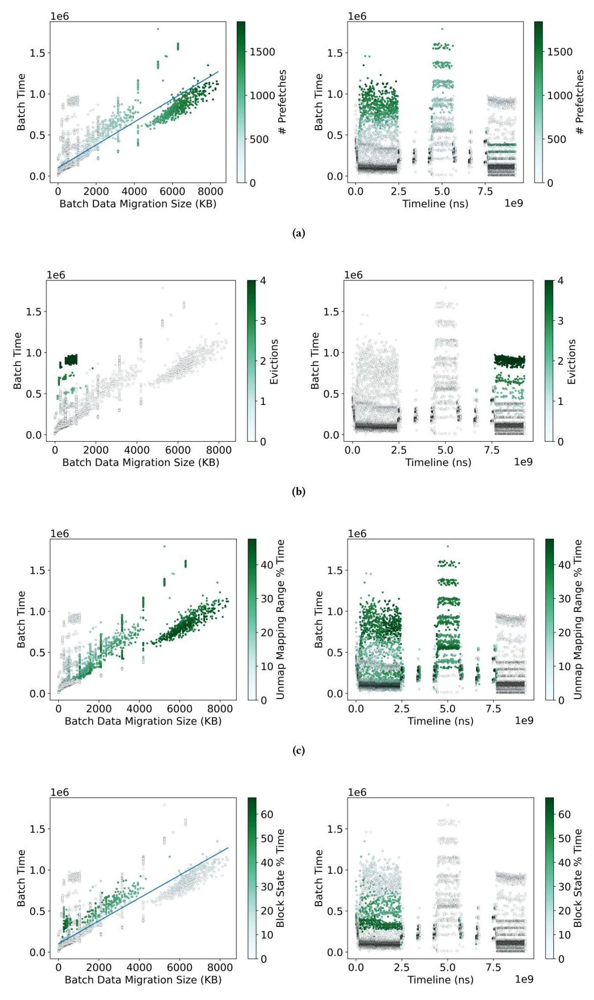
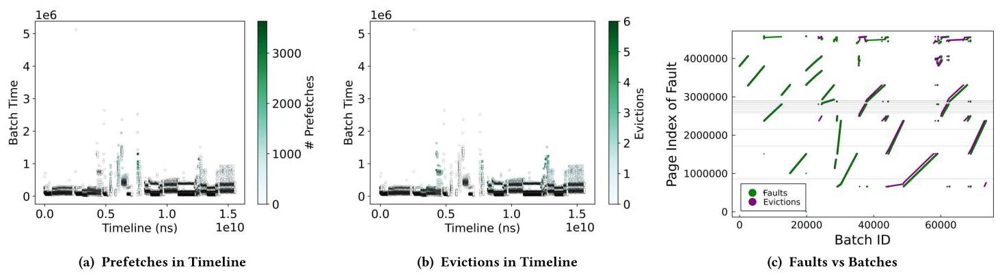

# In-Depth Analyses of Unified Virtual Memory System for GPU Accelerated Computing 深度解读

> **作者**：Tyler Allen, Rong Ge  
> **会议/年份**：SC 2021  
> **一句话总结**：这篇论文把 NVIDIA UVM 的 GPU page fault 生成、fault batch 形成、driver fault handling、host OS unmapping、prefetching 和 oversubscription 放到同一条实时路径里测量，指出 UVM 的主要瓶颈往往不是数据搬运本身，而是 fault path 上的系统软件管理成本和由硬件/应用访问模式共同塑造的 batch workload。

## 一、问题定义

这篇论文属于 **非 First 类型的系统剖析工作**。在它之前，CUDA Unified Virtual Memory / NVIDIA UVM 已经被大量使用，也已有研究观察到 transparent paging 和 page migration 会带来显著性能损失；本文的切入点不是再次证明“UVM 慢”，而是追问慢在 fault path 的哪一段、由什么硬件限制和软件路径共同造成，以及这些结论对未来 Linux HMM 后端意味着什么。

UVM 试图把 CPU memory 和 GPU memory 抽象成统一地址空间。这个抽象降低了 HPC 应用和框架的编程成本，例如 RAJA、Kokkos、Trilinos 等都能从更可移植的 memory model 中受益。但 discrete GPU 的物理内存仍然和 CPU memory 分离，透明迁移必须通过 page fault、driver 处理、DMA copy、page table update、fault replay 等一串动作完成。只要应用频繁触碰不在 GPU 上的页面，这些动作就进入计算关键路径。

Figure 1 是问题定义的直接证据：相比程序员显式管理数据搬运，使用抽象 unified space 后访问延迟通常上升一个或多个数量级；oversubscription 场景代价更高，prefetching 虽能缓解，却不能彻底覆盖成本。论文因此把“易用性带来的系统软件代价”作为核心对象。

**动机评估**：动机是 solid 的。作者没有停留在应用级 slowdown，而是把问题推到 UVM driver 的基本工作单元：fault batch。这个粒度很关键，因为 GPU 大量并行线程的 page fault 最终要被 host driver 批量读取、过滤、迁移、更新映射并 replay；如果 driver path 被串行化或被 host OS 操作拖慢，GPU 并行度就会在 fault servicing 时被迫等待。

**核心 Insight**：UVM 的主要性能问题不能只从“搬了多少数据”解释。fault batch 的大小、重复 fault、fault 在 VABlock 上的分布、GPU 硬件 fault throttling、CPU page unmapping、DMA mapping setup、prefetch 和 eviction 的相互作用都会改变 batch 成本。更进一步，HMM 未来也依赖 vendor/device-specific driver 与 host OS virtual memory 交互，所以 UVM 是研究 HMM-like shared memory systems 的现实代理。

## 二、相关工作

论文把相关工作分成三类。

第一类是 **application-level UVM analysis and optimization**。这类工作比较 UVM 与手工内存管理、比较 Power9 与 x86、NVLink 与 PCIe，或研究 prefetching、runtime allocation hints、MPI 协同和图应用访问模式。它们能说明 UVM 的宏观性能代价，却通常不拆解 driver 内部一次 fault batch 的组成和耗时。

第二类是 **hardware and system alteration**。一些工作通过模拟或架构修改改进 UVM，例如多 GPU page locality、virtual threads、batch-aware unified memory、硬件 page counter、prefetch/eviction coordination 等。这类工作更偏提出新机制，而本文刻意聚焦现有真实硬件和 NVIDIA UVM driver：先弄清楚已经部署的系统到底在哪些路径上花时间。

第三类是 **low-level UVM system analysis**。这类工作与本文最接近，例如作者早期对 prefetching 的 driver-level performance 分析，以及 batch-level size/performance 数据。但本文的差异在于它把 fault generation、batch construction、driver workload、host OS interaction、prefetching、eviction 和 HMM implications 连接成完整因果链，而不是只看某一个 feature。

从研究脉络看，本文的贡献是测量视角和归因粒度：它把 UVM 从“一个让应用变慢的 runtime feature”拆成一组可被系统设计者优化或重新考虑的 fault-path components。

## 三、技术挑战

**挑战 1：fault 生成端受 GPU 微架构限制，不能只从程序访问序列推断 batch。** GPU thread 触发 fault 后，μTLB、GMMU、fault buffer、register scoreboard 和 SM-level throttling 都会影响 fault 何时进入 buffer。即使程序地址已知，数据依赖也可能阻止后续 store fault 产生。

**挑战 2：driver 看到的是被硬件和应用共同塑造后的 batch workload。** 一个 batch 不只是“若干页需要迁移”，还包含 duplicate faults、来自不同 SM 的 fault、跨多个 VABlock 的 fault，以及可能被 flush/replay 改写的 fault stream。分析必须从 batch 这个真实工作单元出发。

**挑战 3：数据迁移和管理开销纠缠在同一条 fault path 上。** 直觉上 UVM 慢可能是 PCIe/NVLink 传输慢，但论文显示数据 copy 只是一部分；page unmapping、DMA mapping、radix tree update、VABlock processing 等系统软件动作常常更重要。

**挑战 4：host OS 组件不是为 GPU 实时 fault burst 设计的。** UVM 建在 Linux virtual memory subsystem 上，unmap_mapping_range() 等操作本来不是为了高频、低延迟、批量 GPU fault 处理而优化。HMM 也会面对同类 OS path，因此这不是 NVIDIA UVM 私有的小问题。

**挑战 5：prefetching 和 oversubscription 同时存在时，因果关系变复杂。** Prefetching 通过减少 batch 数改善性能，但会放大剩余 batch 中 DMA setup 等高成本操作的权重；oversubscription 需要 eviction，又会和 VABlock residency、unmapping、LRU 选择相互影响。单独评价某个 feature 容易误判。

## 四、解决方案

### 整体思路

本文的“方案”不是提出新的 UVM policy，而是一套面向真实 UVM driver 的剖析方法。作者改造 NVIDIA 随 driver 发布的 open-source `nvidia-uvm` 部分，做了两个版本：一个记录 per-fault metadata，用于统计 fault 来源 SM 等信息；另一个在 batch-level 路径上插入高精度计时器和事件计数器，记录 batch 内不同阶段的成本。然后作者用 synthetic kernels、cuBLAS SGEMM、stream、cuFFT、Gauss-Seidel、HPGMG-FV 等 workload，把 fault generation、batch properties 和 driver cost 对齐分析。

Figure 2 给出分析对象：GPU 线程触发 page fault，μTLB/GMMU 将 fault 信息写入 GPU fault buffer 并中断 host；UVM driver 在 host 上取回 fault、批处理、迁移页面、更新 page table，最后发出 replay。论文几乎所有结论都围绕这条路径展开。

### 贯穿示例

可以用作者的 vector addition kernel 理解整篇论文。每个 GPU thread 分别访问 A、B、C 三个数组的不同 page，看似每个 thread 的访问序列非常规则：读 A，读 B，加法，写 C。但真正进入 UVM fault buffer 的不是“所有地址一次性出现”，而是被硬件限制、数据依赖和 driver batch policy 切成多个 fault batch。

Figure 3 显示第一个 batch 正好包含 56 个 fault：所有 A 读和大部分 B 读。这个数字揭示了该架构上每个 μTLB 可 outstanding 的 fault 上限。后续写 C 的 fault 没有提前出现，因为 store 依赖 A+B 的结果；SASS 中 `FADD` 等待两个 load 返回，随后 `STG` 才能触发 C 的 page fault。

Figure 4 进一步说明 fault 到达 GPU fault buffer 很快，CPU driver 并不是和 GPU fault generation 充分重叠地并行工作；当 batch 进入服务阶段时，GPU 侧往往在等待 replay。这就是为什么 driver latency 会直接暴露到应用 runtime 中。

### 关键技术点

**1. UVM batch 是 driver 的基本工作单元。** UVM driver 默认读取 fault 直到 batch size limit 或 buffer 为空，默认上限是 256 faults。servicing 完一个 batch 后，worker thread 尝试继续服务下一批，否则睡眠。这个 batching 优化让 driver 可以忽略很多 interrupt，但也把 fault servicing 变成一个同步瓶颈。

**2. 4KB/64KB page 与 2MB VABlock 共同决定处理粒度。** x86 上 UVM 按 4KB host OS page 迁移和跟踪，同时在 runtime 中用 64KB 粒度做 prefetching，并把 allocation 切成 2MB Virtual Address Blocks。一个 batch 中的 fault 会按 VABlock 分开处理，所以跨越更多 VABlock 的 batch 往往成本更高、方差更大。

**3. fault generation 有硬件级上限和 throttling。** vector addition 显示单个 μTLB outstanding fault 上限为 56。作者还观察到一些 batch 远小于 56，推断 SM 级存在额外 rate-limiting 机制。instruction-level prefetching 可以绕过 register scoreboard 依赖和这些限制，让单个 warp 生成最多 256 个 fault，直接撞到软件 batch size limit。

Figure 5 的意义在于区分“程序访问少”和“硬件不让 fault 继续发”。prefetch 指令提前触发 A/B/C 的 fault，不需要等待计算依赖，因此一个 warp 能产生远超普通 load/store 路径的 batch。这个结果支撑了作者对 μTLB limit 与 throttling 的判断。

**4. batch workload 来自许多 SM，但每个 SM 贡献不多。** Table 2 显示 realistic workloads 中，每个 batch 通常覆盖几乎所有 SM，但每个 SM 平均只贡献少量 fault。例如 regular/random synthetic 的 Avg Faults/SM 约 3.06/3.03，sgemm 为 0.85，stream 为 0.75，HPGMG 为 0.41。这个分布解释了为什么按 VABlock 并行处理看似直观，却可能负载很不均衡。

**5. 数据迁移是趋势指标，但不是主成本。** batch cost 随迁移数据量总体线性增长，但不同应用斜率和方差明显不同。对 sgemm 的细分显示，实际 transfer time 几乎所有 batch 都低于总 batch time 的 25%，多数更低。

Figure 7 是全文最重要的反直觉证据之一：如果传输时间不是主成本，那么只换更快互连或更高带宽不能根治 UVM overhead；driver 软件、host OS 和 batch 特征才是主要优化目标。

**6. duplicate faults 和 batch size 存在取舍。** UVM 会区分同 μTLB 同地址重复 fault 和不同 μTLB 同地址重复 fault，并在 batch 内/批间 flush 时处理。更大的 batch size 会带来更多 duplicate faults，但通常性能更好，因为减少 batch 总数比消除适量 duplicate 更重要。作者测试到 batch size 6144，但超过 1024 后收益不明显；所有应用的 average unique faults-per-batch 最大量级约 500。

Figure 9 说明 UVM 的首要目标不是“每个 batch 绝对干净”，而是尽量多接收 unique faults，减少 driver 被唤醒、处理、replay 的次数。duplicate 是成本，但 batch overhead 更贵。

**7. VABlock 分布解释了性能方差。** Table 3 显示不同 workload 每个 batch 涉及的 VABlock 数差异很大：regular 平均 41.27 个，random 平均 233.09 个，sgemm 平均 6.96 个，stream 平均 3.93 个，Gauss-Seidel 和 HPGMG 约 2.31/2.39 个。即便迁移量相近，VABlock 更多也会更慢，因为 driver 对每个 VABlock 独立处理。

Figure 10 支撑了这个归因：横轴同样是 to-GPU data migration size，但颜色代表 VABlock 数；同一迁移量下，VABlock 更多的点通常 cost 更高且方差更大。

**8. host OS unmapping 是 fault path 上的高成本项。** UVM 在 GPU 访问部分 resident 于 CPU 的 VABlock 时，需要调用 Linux kernel 的 `unmap_mapping_range()` 取消 CPU 页映射。HPGMG 的实验显示，只把 OpenMP 配置从默认多线程改成单线程，就出现约 2 倍性能差异；多线程会放大 host page unmapping 成本。

Figure 11 的价值在于把“CPU 端程序并行化选择”和“GPU fault servicing cost”连接起来。某些 host-side thread affinity、TLB/cache dirty page、NUMA 或 virtual mapping 状态会在 UVM fault path 中显性影响 GPU 运行时间。

**9. prefetching 减少 batch 数，但暴露 DMA setup 成本。** sgemm 开启 prefetching 后，batch 数相对 Figure 7 对应的无 prefetching 场景减少 93%。但预取产生更大的 batch 和高成本 outlier，其中最多 64% 的 batch time 用于 GPU VABlock state initialization，主要是为 VABlock 中每个 page 创建 DMA mappings，并在 Linux radix tree 中建立 reverse DMA address mappings。

Figure 14 说明 prefetching 的收益不是“让 fault path 消失”，而是减少 batch 频次。剩余 batch 中 compulsory DMA setup、radix tree 操作和 host unmapping 仍会成为显著成本。

**10. eviction 与 prefetching 组合后形成多层成本结构。** oversubscription 需要按 2MB VABlock eviction；如果 GPU memory 满且目标 VABlock 仍有 CPU residency，batch 同时付出 eviction 和 CPU unmapping 成本。若同一 VABlock 已被迁移到 GPU 后又被 evict，再次 paged back 时可能不再支付大额 unmapping，因此出现同 eviction count 下的多个 cost levels。

Figure 15 总结了最复杂场景：prefetching 通常在执行早期驱动大 batch，eviction 多在后期出现，new VABlock 会重新引入 unmapping，DMA setup 高开销间歇出现。它说明 UVM feature 之间不是独立叠加，而是通过 VABlock residency 和访问密度相互触发。

### 与已有方案的对比

相对 application-level UVM profiling，本文把 slowdown 归因到 fault batch、VABlock、duplicate fault、host OS operation、DMA mapping 等具体路径。相对模拟型硬件改造工作，本文没有假设新机制，而是在真实 Titan V、CUDA 11.2、NVIDIA 460.27.04 driver 和 Fedora 33 kernel 上测量现有系统。相对已有 driver-level prefetching 分析，本文覆盖了从 fault generation 到 HMM applicability 的完整链条。

本文也给未来方案划出设计空间：可以调整 batch size 策略、改进 duplicate handling、异步或预先执行 host unmapping/DMA setup、重新设计 VABlock-level parallelism，或在 HMM 后端中避免把所有设备的 fault path 都压到同样昂贵的 OS 操作上。

## 五、实验评估

### 实验设定

实验平台是 Titan V GPU，12GB HBM2，CUDA 11.2，NVIDIA Driver 460.27.04，Fedora 33，kernel 5.9.16-200.fc33.x86_64；CPU 是 AMD Epyc 7551P 32-Core，系统内存 128GB。

作者使用改造后的 UVM driver 收集两类数据：per-fault metadata 用于 fault source、SM 分布等统计；batch-level timers/counters 用于测量 batch 中 data movement、duplicate handling、unmapping、DMA mapping、eviction 等阶段。workloads 包括 synthetic regular/random/vector addition、cuBLAS sgemm、stream triad、cuFFT、Gauss-Seidel、HPGMG-FV。

### 主要实验与结论

**结论 1：GPU fault generation 受 μTLB、scoreboard 和 SM throttling 限制。** vector addition 的普通 load/store 路径中，第一个 batch 为 56 faults，对应每 μTLB outstanding fault 上限；store fault 受前置 load 和 `FADD` 数据依赖阻塞；prefetch 指令则可让单 warp 触发最多 256 faults，说明普通路径的限制不是单纯由地址数量决定。

**结论 2：batch 覆盖几乎所有 SM，但每个 SM 贡献很少。** Table 2 中 realistic applications 的 Avg Faults/SM 普遍低于 synthetic regular/random：sgemm 0.85，stream 0.75，cufft 0.91，Gauss-Seidel 0.65，HPGMG 0.41。这意味着 batch 是全 GPU 的薄层采样，而不是少数 SM 的深队列，driver parallelization 不能简单按 VABlock 或 SM 静态切分。

**结论 3：数据迁移量解释趋势，不解释主成本。** Figure 6 显示 batch cost 随迁移数据量线性上升，但 Figure 7 显示 sgemm 中数据 transfer time 几乎都小于 batch time 的 25%。因此 interconnect 更快会有帮助，但 driver 管理、host OS 和 batch structure 才是更主要瓶颈。

**结论 4：更大 batch 通常比过度避免 duplicate 更有价值。** Figure 8 显示 stream 和 sgemm 的 raw batch size 与去重后 batch size 差异明显，且 duplicate 的影响随应用和阶段变化。Figure 9 进一步显示增大 batch size 能减少 batch 次数并提升性能，虽然 duplicate 率增加；超过 1024 后收益趋于饱和。

**结论 5：VABlock 组织是性能方差的重要来源。** Table 3 中 random 每 batch 平均 233.09 个 VABlock、每 VABlock 仅 1.04 faults，regular 平均 41.27 个 VABlock、每 VABlock 5.93 faults；相比之下 Gauss-Seidel/HPGMG 平均只约 2.3/2.39 个 VABlock，但 faults/VABlock 方差很高。Figure 10 说明同样迁移量下，VABlock 数越多成本越高。

**结论 6：host OS unmapping 可以主导 batch 成本。** HPGMG 单 OpenMP 线程配置相比默认多线程约有 2 倍性能优势，差异主要来自 GPU fault path 上 host-resident pages 的 unmapping 成本。作者认为这类成本可能与 CPU core mappings、cache/TLB dirty state、NUMA 等 host-side factors 有关。

**结论 7：prefetching 在 oversubscription 下仍有效，但边界清楚。** Table 4 显示 modest oversubscription 下，prefetching 让 Gauss-Seidel kernel time 从 66.393s 降到 19.550s，speedup 为 3.39x；HPGMG 从 40.472s 降到 14.879s，speedup 为 2.72x。batch time 也大幅下降：Gauss-Seidel 从 60.477s 到 15.340s，HPGMG 从 32.384s 到 7.261s。

Figure 16 展示 Gauss-Seidel 中 prefetch、eviction 和 fault 地址范围的关系：约 0.5s 后 prefetch 和 eviction 开始密集出现，contiguous batches 在相似的大地址范围内 allocation/eviction，说明 eviction 会创造新的 prefetch 机会。

Figure 17 显示 HPGMG 中多段 intensive prefetch 与 eviction 同时出现，并且 eviction 近似“earliest allocated pages”优先。这是因为 UVM driver 没有 page hits 信息，LRU 在 dense access 中退化为最早分配页被先驱逐；作者指出这种策略不一定最优，因为一些被驱逐页很快又需要迁回 GPU。

### 结论支撑性分析

实验整体支撑了论文主张：UVM overhead 是 fault batch 结构、GPU fault generation 限制、driver serial processing 和 host OS 操作共同造成的，而不是简单的 data copy bandwidth 问题。强支撑来自三组证据：普通 load/store 与 prefetch fault behavior 的对照；data transfer time 小于 25% 的 batch breakdown；prefetch/eviction/host unmapping 在真实 HPC workload 中的定量表现。

主要局限也明确。第一，实验聚焦单 GPU UVM，虽然作者讨论了多设备和 HMM implications，但没有直接评测 multi-GPU HMM 后端。第二，instrumentation 会带来一定扰动，作者对过细粒度 radix tree timing 没有呈现完整数据，说明低层计时会影响整体 timing。第三，结论基于 Titan V / Volta 及当时 driver/kernel，后续 GPU 和 driver 可能改变部分数值，但 fault batch、host OS operation 和 VABlock 这些系统性问题仍有参考价值。

## 六、附加洞察

**结论 1：UVM 优化首先应减少 batch 次数，而不是机械地追求“零 duplicate”。**  
*出处*：Section 4.2，Figure 8，Figure 9。  
*推理链条*：作者先展示 raw faults 与去重后 faults 差异明显，说明 duplicate 的确存在；随后比较不同 batch size，发现更大 batch 虽增加 duplicate 比例，却因为减少 batch 总数而提升性能；最后观察到 unique faults-per-batch 在约 500 量级饱和，说明合理策略应在 duplicate 与 batch count 之间动态权衡，而不是单目标最小化 duplicate。

**结论 2：host-side parallelization 会反向影响 GPU memory fault path。**  
*出处*：Section 4.4，Figure 11。  
*推理链条*：HPGMG 的计算配置基本相同，仅改变 OpenMP 线程数；单线程版本约有 2 倍性能；batch coloring 又显示多线程时 unmapping 占比更高；因此 CPU 线程并行、映射状态和 OS VM 操作会在 GPU fault servicing 中放大，而不是只影响 CPU 端初始化。

**结论 3：oversubscription 的 cost levels 暗含 VABlock residency history。**  
*出处*：Section 5.1，Figure 13。  
*推理链条*：同样 eviction count 的 batch 出现多条成本水平；作者区分了“目标 VABlock 仍有 CPU residency 需要 unmap”与“该 VABlock 已在 GPU resident 后被 evict，不再需要第二次 unmap”的情况；因此 batch cost 不只由当前 evict 数决定，还由这个 VABlock 此前是否经历过 CPU unmapping 决定。

**结论 4：prefetching 的主要风险是把少数 compulsory management operations 变成更显眼的 tail。**  
*出处*：Section 5.2，Figure 14。  
*推理链条*：prefetching 把 sgemm batch 数减少 93%，说明它有效减少了 driver 唤醒和 replay 次数；但剩余高成本 batch 中最多 64% 时间花在 GPU VABlock state initialization，主要涉及 DMA mapping 和 radix tree；因此 prefetching 改善平均情况的同时，会让 DMA setup 这类不可由 reactive prefetch 消除的 compulsory cost 变成性能尾部。

**结论 5：UVM 的 LRU eviction 对 dense access 可能退化成 earliest-allocated eviction。**  
*出处*：Section 5.4，Figure 17。  
*推理链条*：HPGMG fault behavior 中第一批大量 eviction 指向最早 allocated pages，后续也类似；作者解释 UVM driver 没有 page hits 信息，所以 dense access 下 LRU 难以反映真正未来 reuse；如果被驱逐页很快又被访问，就会引入额外迁回成本，提示 eviction policy 需要更多访问信息或和 prefetching 协同设计。

## 七、总结与评价

这篇论文的核心贡献是把 UVM 性能问题从应用级 slowdown 拆到 fault batch 和 driver path 粒度，并用真实 driver instrumentation 证明：UVM 的主要瓶颈经常是系统软件管理成本、host OS VM 操作和 batch workload shape，而不是数据拷贝本身。它对 HMM 的价值在于提前指出了 vendor driver 与 Linux VM 交互时会遇到的实时 fault servicing 问题。

最大的亮点是归因链条完整：从 μTLB outstanding fault limit、scoreboard data dependency、SM throttling，到 VABlock distribution、duplicate fault、unmapping、DMA setup、prefetch/eviction 交织，论文把每个现象都放回 fault path 中解释。最大不足是它仍是 measurement paper，提出的是设计启发而非完整替代机制；同时单 GPU 和特定 driver/kernel 版本限制了结论的直接外推范围。

如果沿着本文继续做，最有价值的方向包括：让 batch sizing 根据 duplicate/unique fault 动态调节；把 host unmapping 和 DMA setup 尽量异步化或预执行；改进 VABlock-level load balancing；为 HMM 后端设计更适合 GPU-style fault burst 的 OS VM 接口；以及让 eviction policy 获得更准确的 page reuse 信息。

## 八、章节脉络与段落速览

- **Abstract**：说明 UVM/HMM 的统一地址空间提高可移植性但引入中高开销，本文通过 UVM 研究 fault generation、driver servicing、prefetching 与 oversubscription，并指出 host OS 成本显著且对 HMM 有启示。
- **Section 1 - Introduction**：引出 GPU/HPC 中统一地址空间的需求、UVM/HMM 的关系、已有研究观察到的性能代价，以及本文将 fault batch 作为 UVM driver workload 基本单位的动机。
  - 段落 1：说明 GPU memory 与 CPU memory 分离，HMM/UVM 试图把它们整合进 OS virtual memory 和透明迁移机制。
  - 段落 2：用 prior work 与 Figure 1 强调透明 paging/migration 相对显式管理有一个或多个数量级的访问延迟代价，oversubscription 更严重。
  - 段落 3：解释为什么 UVM 可作为 HMM-like system 的现实 testbed，因为 HMM 尚未成熟支持 commodity x86，而 NVIDIA UVM 已广泛部署。
  - 段落 4：说明本文通过 instrumented `nvidia-uvm` driver 分析 page fault batches、driver cost 和 optimization implications。
  - 贡献列表：总结 fault generation、fault handling、HMM proxy analysis 和未来多设备研究基础。
- **Section 2 - UVM Background and Related Work**：介绍 UVM/HMM 背景、UVM architecture、fault batching/VABlock 机制，并梳理 high-level analysis、hardware/system alteration、low-level system analysis 三类相关工作。
  - **2.1 The UVM Architecture**：解释 client-server 式 UVM driver、μTLB/GMMU/fault buffer、copy engine 和 fault replay。
  - **2.2 Fault Batching and Handling**：说明 interrupt、fault retrieval、batch size 256、4KB/64KB page、2MB VABlock、eviction granularity。
  - **2.3 Related Work**：把已有研究分为应用级优化、硬件/系统改造和底层 UVM 分析，并指出本文的更细粒度归因差异。
- **Section 3 - UVM Fault Behaviors**：通过 synthetic kernel 研究 fault 如何在 GPU 上生成并形成 batch。
  - **3.1 Experimental Environment**：描述 Titan V、CUDA 11.2、NVIDIA driver 460.27.04、Fedora 33、AMD Epyc 7551P，以及两类 instrumented driver。
  - **3.2 Formation of GPU Fault Batches**：用 vector addition 说明 56 outstanding faults/μTLB、数据依赖阻止 store fault、SM throttling、小 batch、prefetch 绕过限制并达到 256 软件 batch limit；随后用 Table 2 展示 realistic workload 中 batch 覆盖多 SM 但每 SM 贡献少。
- **Section 4 - UVM Driver Workload**：分析 driver 处理 batch 时哪些 workload feature 决定成本。
  - **4.1 Data Movement**：迁移数据量与 batch cost 线性相关，但 sgemm 中 transfer time 几乎都低于 25%，管理成本更关键。
  - **4.2 Duplicate Faults vs. Batch Size**：讨论同 μTLB/跨 μTLB duplicate faults、flush/replay 的作用，以及更大 batch size 减少总 batch 数带来的收益。
  - **4.3 Fault Distribution/Access Pattern**：解释 VABlock 数和 faults/VABlock 方差如何导致 batch cost 方差，并指出按 VABlock 并行可能负载不均。
  - **4.4 Host OS Interaction**：以 HPGMG 说明 CPU page unmapping 在 fault path 上产生显著开销，OpenMP 多线程会放大这一成本，对 HMM 也有警示。
- **Section 5 - Workloads with Prefetching and Oversubscription**：研究 UVM 默认 feature 在真实 workload 中如何改变 batch。
  - **5.1 Oversubscription**：说明 GPU memory 满时按 2MB VABlock eviction，batch 同时可能支付 eviction、page population 和 CPU unmapping 成本，并形成多层 cost levels。
  - **5.2 Prefetching**：说明 runtime density prefetching 只在单 VABlock 内 reactive 工作，能让 sgemm batch 数减少 93%，但会暴露 DMA mapping/radix tree 高成本 batch。
  - **5.3 Eviction + Prefetching**：分析 prefetch 与 eviction 的间接关系：prefetch 扩大迁移量，eviction 多在后期出现，新 VABlock 引入 unmapping，DMA setup 间歇成为 outlier。
  - **5.4 Case Studies with HPC Workloads**：用 Gauss-Seidel 和 HPGMG 展示 modest oversubscription 下 prefetching 的 kernel speedup 分别为 3.39x 和 2.72x，并观察 eviction、prefetch 和 LRU 行为。
- **Section 6 - Discussion and Conclusion**：归纳 key driver costs、driver serialization、prefetching/eviction、applicability to HMM-like implementations。
  - Key Driver Costs：强调 data movement 不是主成本、duplicate handling 应以减少 batch 次数为优先、host OS unmapping 和 DMA setup 是 HMM/UVM 共同关注点。
  - Driver Serialization：指出 fault generation 限制让 GPU 在 driver processing 时高度同步等待，driver 成为 parallel GPU workload 的串行瓶颈。
  - Prefetching and Eviction：讨论 prefetching 消除大量 batch 但不能消除高成本 compulsory operations，eviction 需要独立优化且要与 prefetch codevelop。
  - Applicability：将 batching、OS overhead、driver parallelism/load balancing 等结论推广到其他 HMM backend 或 UVM-like implementations。
- **Acknowledgements and References**：列出 NSF 资助和参考文献。
- **Appendix - Artifact Description/Artifact Evaluation**：记录 artifact、实验平台、软件版本、benchmark 版本和 reproducibility 信息。
