# In-Depth Analyses of Unified Virtual Memory System for GPU Accelerated Computing

Tyler Allen

> 
泰勒·艾伦

School of Computing

> 
计算机学院

Clemson University

> 
克莱姆森大学

tnallen@clemson.edu

> 
本文研究了 GPU 加速计算中 NVIDIA 统一虚拟内存（UVM）的性能开销，并找出了缺页故障生成、驱动程序负载及主机操作系统交互方面的根本原因。通过对 UVM 驱动程序进行深层架构分析和插桩，作者量化了故障批处理、处理成本以及预取和内存超额使用的影响。主要贡献包括：揭示了 GPU 故障生成方面的硬件限制（每个微 TLB 最多 56 个未完成故障，速率限制），证明了数据传输并非主要开销——软件管理开销（如 CPU 页面解映射、DMA 映射）要大得多——并表明故障处理路径上的主机操作系统操作会引入显著延迟，有时多线程会加剧这一情况。预取能大幅减少批处理数量，但无法消除与操作系统交互相关的高成本批处理。研究得出结论，驱动程序串行化及主机操作系统参与是主要瓶颈，这些见解也适用于未来的异构内存管理（HMM）系统，其中类似的批处理与内核级开销仍会出现。优化应聚焦于减少批处理开销、并行化故障处理以及最小化同步操作系统调用。

Rong Ge

> 
荣格

School of Computing

> 
计算机学院

Clemson University

> 
克莱姆森大学

rge@clemson.edu

> 
rge@clemson.edu

## ABSTRACT

The abstraction of a shared memory space over separate CPU and GPU memory domains has eased the burden of portability for many HPC codebases. However, users pay for the ease of use provided by systems-managed memory space with a moderate-to-high performance overhead. NVIDIA Unified Virtual Memory (UVM) is presently the primary real-world implementation of such abstraction and offers a functionally equivalent testbed for a novel in-depth performance study for both UVM and future Linux Heterogeneous Memory Management (HMM) compatible systems. The continued advocation for UVM and HMM motivates the improvement of the underlying system. We focus on a UVM-based system and investigate the root causes of the UVM overhead, which is a non-trivial task due to the complex interactions of multiple hardware and software constituents and the requirement of targeted analysis methodology.

> 
在分离的 CPU 与 GPU 内存域之上抽象出一个共享内存空间，减轻了许多 HPC 代码库的可移植性负担。然而，用户为系统管理的内存空间带来的易用性付出了中等到较高的性能开销。NVIDIA 统一虚拟内存（UVM）目前是此类抽象的主要实际实现，并为深入剖析 UVM 及未来兼容 Linux 异构内存管理（HMM）的系统提供了一个功能等价的试验平台。对 UVM 和 HMM 的持续倡导推动了对底层系统的改进。我们聚焦于基于 UVM 的系统，探究 UVM 开销的根本原因，由于多种硬件与软件组件的复杂交互以及对针对性分析方法的需求，这是一项非平凡的任务。

In this paper, we take a deep dive into the UVM system architecture and the internal behaviors of page fault generation and servicing. We reveal specific GPU hardware limitations using targeted benchmarks to uncover driver functionality as a real-time system when processing the resultant workload. We further provide a quantitative evaluation of fault handling for various applications under different scenarios, including prefetching and oversubscription. We find that the driver workload is dependent on the interactions among application access patterns, GPU hardware constraints, and Host OS components. We determine that the cost of host OS components is significant and present across implementations, warranting close attention. This study serves as a proxy for future shared memory systems such as those that interface with HMM.

> 
在本文中，我们深入探讨了UVM系统架构以及页错误生成和处理的内部行为。我们使用针对性的基准测试揭示了特定的GPU硬件限制，从而揭示驱动程序在实时处理由此产生的工作负载时的功能。接着，我们对不同应用在预取和超额订阅等不同场景下的错误处理进行了定量评估。我们发现，驱动程序的工作负载取决于应用程序访问模式、GPU硬件约束和主机操作系统组件之间的交互。我们确定，主机操作系统组件的成本显著，并在各个实现中普遍存在，因此需予以密切关注。这项研究可作为未来共享内存系统（例如与HMM接口的系统）的参考。

## KEYWORDS

UVM, NVIDIA, GPU, virtual memory, GPGPU, HMM

> 
统一虚拟内存，英伟达，图形处理器，虚拟内存，通用图形处理器，异构内存管理

## ACM Reference Format:

Tyler Allen and Rong Ge. 2021. In-Depth Analyses of Unified Virtual Memory System for GPU Accelerated Computing. In The International Conference for High Performance Computing, Networking, Storage and Analysis (SC '21), November 14-19, 2021, St. Louis, MO, USA. ACM, New York, NY, USA, 13 pages. https://doi.org/10.1145/3458817.3480855

> 
Tyler Allen 和 Rong Ge. 2021. GPU 加速计算中统一虚拟内存系统的深入分析. 收录于高性能计算、网络、存储与分析国际会议 (SC '21)，2021 年 11 月 14–19 日，美国密苏里州圣路易斯. ACM，美国纽约州纽约市，13 页. https://doi.org/10.1145/3458817.3480855

## 1 INTRODUCTION

Graphics Processing Units (GPUs) have become a computational mainstay in modern HPC systems and are paving the way for other accelerators into the HPC space. Natively, discrete GPUs have separate physical memory traditionally programmed through API and managed by device drivers. Multiple technologies that ease the burden of programming and increase codebase portability with these accelerators by abstracting the complexity of separate CPU and GPU physical memory domains are under ongoing development. Heterogeneous Memory Management (HMM) and NVIDIA Unified Virtual Memory (UVM) are two such independent yet potentially collaborative efforts. These technologies integrate device memory domains into the OS virtual memory system and transparently migrate pages across devices. HMM is a Linux kernel feature that provides a generic interface for heterogeneous memory management to vendor- and device-specific drivers on commodity systems [11, 20]. NVIDIA UVM presently offers an all-in-one approach combining paging and device drivers for NVIDIA GPUs. It can also integrate with the HMM interface [33]. As of today, NVIDIA UVM alone has been prolific, adopted by the US Department of Energy and in common HPC frameworks such as Raja [6], Kokkos [8], and Trilinos [19].

> 
图形处理器（GPU）已成为现代高性能计算（HPC）系统中的计算主力，并正为其他加速器进入HPC领域铺平道路。分立式GPU原本拥有独立的物理内存，这些内存传统上通过API编程，并由设备驱动程序管理。目前，多种技术正在开发中，它们通过抽象化分离的CPU与GPU物理内存域的复杂性，减轻了编程负担并增强了代码库的可移植性。异构内存管理（HMM）和NVIDIA统一虚拟内存（UVM）就是其中两项独立但具有潜在协作性的工作。这些技术将设备内存域集成到操作系统虚拟内存系统中，并透明地在设备间迁移页面。HMM是一项Linux内核特性，它在商品化系统上为特定供应商和设备的驱动程序提供了异构内存管理的通用接口[11, 20]。NVIDIA UVM目前为NVIDIA GPU提供了一种集页面管理与设备驱动于一体的综合方案，并且它也可以与HMM接口集成[33]。迄今为止，仅NVIDIA UVM便已得到广泛应用，被美国能源部以及Raja[6]、Kokkos[8]和Trilinos[19]等常见HPC框架所采用。

As noted by prior studies, transparent paging and migration come with heavy performance costs [2, 18, 21-23, 37]. Figure 1 shows that the access latency generally increases one or more orders of magnitude compared to explicit direct management by programmers. While such costs may be acceptable for applications computing in-core on GPU memory, high-performance systems suffer inefficient utilization as a consequence. Further, the out-of-core capability comes at a much greater cost, largely prohibitive for most applications. Prefetching mitigates but cannot overcome all of the cost and could prohibitively increase it for some memory-oversubscribed workloads $\left\lbrack  {2,{14},{16},{22},{36},{38}}\right\rbrack$ .

> 
正如先前研究所指出的，透明分页和迁移会带来沉重的性能代价 [2, 18, 21-23, 37]。图1显示，与程序员显式直接管理相比，访问延迟通常增加一个或多个数量级。虽然对于在GPU内存中执行核内计算的应用程序而言，这种代价或许可以接受，但高性能系统会因此面临利用率低下的问题。此外，核外计算能力的代价要大得多，对大多数应用来说几乎是禁止使用的。预取可以减轻但无法消除所有代价，并且对于某些内存过载的工作负载，预取甚至可能大幅增加代价 $\left\lbrack  {2,{14},{16},{22},{36},{38}}\right\rbrack$。

Understanding the overhead sources in transparent paging and migration is essential, especially as the cost of delegating management to the OS through HMM will be imposed on any system using the HMM interface. HMM may become the de-facto technology with the ongoing advocates and development efforts. However, HMM is not yet well supported on commodity systems. In this work, we focus on the NVIDIA UVM technology. As we reason in Section 2, UVM offers a functionally equivalent testbed for a novel low-level performance study for both UVM and future HMM-compatible systems. Using UVM, we can identify the root sources of performance concerns and attribute them to their roles in HMM-based implementations.

> 
理解透明分页和迁移中的开销来源至关重要，尤其是因为通过 HMM 将管理委托给操作系统的成本将施加到任何使用 HMM 接口的系统上。随着持续的倡导和开发努力，HMM 可能成为事实上的技术。然而，HMM 在商用系统上尚未得到良好支持。在这项工作中，我们专注于 NVIDIA UVM 技术。正如我们在第 2 节中所论述的，UVM 为 UVM 以及未来兼容 HMM 的系统提供了一个功能等效的测试平台，用于进行新颖的低层性能研究。利用 UVM，我们可以确定性能问题的根源，并将其归因于它们在基于 HMM 的实现中所扮演的角色。

In this work, we take a deep dive into the UVM system architecture and the internal behaviors of page fault generation and servicing. We perform extensive analyses on the UVM driver workload's basic units: page fault batches or groups of GPU-generated page faults. We instrument the nvidia-uvm driver to collect meta-data containing targeted high-resolution timers and counters for specific batch events, routines, and page fault arrival. Through extensive experimentation and quantitative analyses, we obtain insights into where the UVM costs originate and where performance optimization or design reconsiderations are applicable for UVM, HMM, and future vendor-specific HMM systems.

> 
在本工作中，我们深入探究了 UVM 系统架构以及缺页生成与处理的内部行为。我们对 UVM 驱动工作负载的基本单元——即 GPU 产生的缺页批处理（或缺页批量组）——进行了广泛分析。我们通过插桩 nvidia-uvm 驱动来收集元数据，其中包含针对特定批处理事件、例程和缺页到达的高精度定时器与计数器。通过大量实验和定量分析，我们得以洞察 UVM 开销的来源，以及针对 UVM、HMM 及未来供应商特定的 HMM 系统，在哪些方面可进行性能优化或设计反思。

---

Permission to make digital or hard copies of all or part of this work for personal or classroom use is granted without fee provided that copies are not made or distributed for profit or commercial advantage and that copies bear this notice and the full citation on the first page. Copyrights for components of this work owned by others than the author(s) must be honored. Abstracting with credit is permitted. To copy otherwise, or republish, to post on servers or to redistribute to lists, requires prior specific permission and/or a fee. Request permissions from permissions@acm.org.

> 
允许制作本作品全部或部分的数字或硬拷贝用于个人或课堂使用，无需付费，前提是这些拷贝不得用于盈利或商业目的，且拷贝须在首页附有此声明和完整的引用信息。本作品中非作者持有的组件版权必须予以尊重。允许进行附署名的摘要引用。如需出于其他目的复制、再版、上传至服务器或分发给邮件列表，则须事先取得特定许可和/或支付费用。许可请求请发至 permissions@acm.org。

SC '21, November 14-19, 2021, St. Louis, MO, USA

> 
SC '21，2021年11月14日至19日，美国密苏里州圣路易斯

© 2021 Copyright held by the owner/author(s). Publication rights licensed to ACM. ACM ISBN 978-1-4503-8442-1/21/11...\$15.00

> 
© 2021 版权归所有者/作者所有。出版权由 ACM 授权。ACM ISBN 978-1-4503-8442-1/21/11...\$15.00

https://doi.org/10.1145/3458817.3480855

> 
https://doi.org/10.1145/3458817.3480855

---

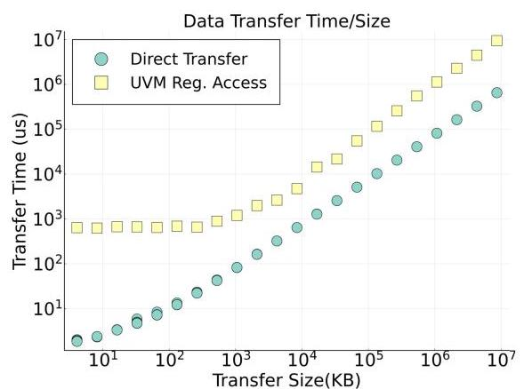

Figure 1: Access latency with abstracted unified space increases by one or more orders of magnitude over explicit direct management.

> 
图1：抽象统一空间的访问延迟比显式直接管理增加了一个或多个数量级。

Our work examines the real-time functionality of the system on real hardware. We provide a deep understanding of the interaction between CPU and GPU with UVM and the costs of different functionalities. In particular, we make the following contributions:

> 
我们的工作在真实硬件上检验了系统的实时功能。我们深入理解了在UVM下CPU与GPU之间的交互以及不同功能的开销。具体来说，我们做出了以下贡献：

- We conduct an in-depth study of GPU page fault generation and how UVM aggregates faults into fault batches - the core UVM work unit - to understand the UVM workload better.

> 
- 我们深入研究了 GPU 缺页错误的生成方式，以及 UVM 如何将错误聚合成错误批处理（UVM 的核心工作单元），从而更好地理解 UVM 工作负载。

- We take a closer look at how UVM serves page faults within a batch through the page fault handling path, offering perspective and rationale behind design decisions and constraints.

> 
- 我们深入探究了 UVM 如何通过页面错误处理路径，在一个批次内为页面错误提供服务，从而提供了对设计决策和限制的视角及其背后的原理。

- We analyze UVM as an example of future HMM systems, isolating performance considerations to vendor-specific and common code between all implementations and discussing improvements and considerations for different cases.

> 
- 我们将 UVM 作为未来异构内存管理（HMM）系统的一个实例进行分析，将性能考量区分为特定于厂商的实现部分与各实现间的通用代码，并针对不同情况探讨改进措施与思考要点。

- While this work focuses on single GPUs, it serves as a base and foundation for studying the interactions among multiple devices on the same systems, which are the standard building blocks of computer clusters.

> 
- 尽管这项工作侧重于单GPU，但它为研究同一系统上多设备间的交互奠定了基础，而多设备正是计算机集群的标准构建模块。

## 2 UVM BACKGROUND AND RELATED WORK

NVIDIA UVM has the same functional philosophy as the likely future industry standard, HMM - Linux-like virtual memory through paging, where page faults trigger data migration between the host memory and accelerators [11, 20]. From the programmer's perspective, HMM is preferable as it allows the same memory management functions as for the CPUs, whereas UVM requires special memory allocation functions to achieve the same result. However, HMM requires backend device-specific solutions from vendors [11, 20]. The NVIDIA UVM driver is among the first backend solutions to interface with HMM. However, to the best of our knowledge, the full integration for x86 systems is not available yet [33]. NVIDIA UVM is currently the primary real-world implementation of transparent paging and migration across memory domains. Thus we focus on UVM but draw insights applicable to HMM.

> 
NVIDIA UVM 与未来可能成为行业标准的 HMM 具有相同的功能理念——通过分页实现类似 Linux 的虚拟内存，其中缺页异常会触发主机内存与加速器之间的数据迁移 [11, 20]。从程序员的角度来看，HMM 更为可取，因为它允许使用与 CPU 相同的内存管理函数，而 UVM 则需要特殊的内存分配函数才能达到相同效果。然而，HMM 需要供应商提供后端设备特定的解决方案 [11, 20]。NVIDIA UVM 驱动程序是最早与 HMM 接口的后端解决方案之一。但据我们所知，针对 x86 系统的完整集成尚不可用 [33]。NVIDIA UVM 目前是跨内存域透明分页与迁移的主要实际实现。因此，我们聚焦于 UVM，但会得出适用于 HMM 的见解。

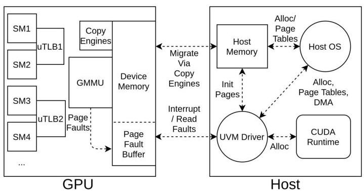

Figure 2: The UVM architecture. The UVM driver resides on the host and manages the fault buffer on the device.

> 
图2：UVM架构。UVM驱动程序驻留在主机端，负责管理设备上的故障缓冲区。

In this section, we overview the UVM system architecture and functionality. Also, we note where these systems intersect and overlap with HMM support.

> 
在本节中，我们概述UVM系统架构与功能。同时，我们会指出这些系统与HMM支持交叉重叠之处。

### 2.1 The UVM Architecture

The UVM architecture, illustrated in Figure 2, is a client-server architecture between one or more software clients (user-level GPU or host code) and the server (host driver) servicing page faults for all clients. The UVM driver on the host is an open source driver with dependencies on the proprietary nvidia driver/resource manager and the host OS for memory management. This driver serves as a runtime fault servicing engine and the memory manager for managed memory allocations.

> 
图2所示的UVM架构是一种客户端-服务器架构，由一个或多个软件客户端（用户级GPU或主机代码）与服务器（主机驱动程序）构成，该服务器为所有客户端处理缺页异常。主机上的UVM驱动程序是一款开源驱动程序，依赖专有的nvidia驱动程序/资源管理器以及主机操作系统进行内存管理。此驱动程序充当运行时缺页异常服务引擎和托管内存分配的内存管理器。

Any active thread on the GPU can trigger a page fault. The page fault is recognized and handled by the hardware thread's corresponding μTLB [29]. The thread treats this scenario as any other outstanding memory request and may continue executing instructions not blocked by a memory dependency. Meanwhile, the fault propagates to the GPU memory management unit (GMMU), which sends a hardware interrupt to the host. The GMMU writes the corresponding fault information into the GPU Fault Buffer. The fault buffer acts as a circular array, configured and managed by the UVM driver [29]. The nvidia-uvm driver fetches the fault information, caches it on the host, and services the faults through page processing and migration.

> 
GPU 上任何活跃线程都可能触发页错误。该页错误由硬件线程对应的 μTLB 识别并处理[29]。线程将此场景视为任何其他未完成的内存请求，并可继续执行不依赖于该内存的指令。同时，错误传播至 GPU 内存管理单元（GMMU），该单元向主机发送硬件中断。GMMU 将相应的错误信息写入 GPU 故障缓冲区。故障缓冲区充当循环数组，由 UVM 驱动程序配置和管理[29]。nvidia-uvm 驱动获取故障信息，将其缓存在主机端，并通过页面处理和迁移来服务这些错误。

The GPU exposes two functionalities to the host via the GPU command push-buffer - host-to-GPU memory copy and fault replay. As part of the fault servicing process, the driver instructs the GPU to copy pages into its memory, generally using high-performance hardware "copy engines." Once the GPU's page tables are updated and the data is successfully migrated, the driver issues a fault replay [39], which clears the waiting status of μTLB, causing them to "replay" the prior miss.

> 
GPU通过GPU命令推送缓冲区向主机公开两项功能——主机到GPU的内存复制和故障重放。作为故障服务过程的一部分，驱动程序指示GPU将页面复制到其内存中，通常使用高性能硬件“复制引擎”。一旦GPU的页表被更新并且数据成功迁移，驱动程序就会发出故障重放[39]，这会清除μTLB的等待状态，使其“重放”先前的未命中。

### 2.2 Fault Batching and Handling

The nvidia-uvm driver groups outstanding faults into batches in the host-side cache. Fault delivery to the host requires two steps: first, the GPU sends an interrupt over the interconnect to alert the host UVM driver of a page fault, and second, the host retrieves the complete fault information from the GPU Fault Buffer. The interrupt wakes up a worker thread to begin fault servicing if none are awake. UVM uses batching as an optimization as it allows the driver to ignore most interrupts. The default fault retrieval policy is to read faults until the batch size limit is reached or no faults remain in the buffer. Batches contain up to a maximum size of 256 faults. The worker thread tries to service another after one batch and sleeps if it finds no new faults. For comparison, device drivers are still responsible for these actions in HMM implementations. Fault batching and fault handling policies are the driver's independent decisions.

> 
nvidia-uvm 驱动将尚未处理的错误请求在主机端缓存中分组编为批次。向主机传递错误信息需要两步：首先，GPU 通过互连总线发送中断以通知主机 UVM 驱动发生页错误；其次，主机从 GPU 错误缓冲区中取回完整的错误信息。如果当前没有唤醒的工作线程，该中断会唤醒一个工作线程来启动错误服务。UVM 将批处理作为一种优化手段，因为它使驱动能够忽略大部分中断。默认的错误获取策略是持续读取错误，直到达到批次大小上限或缓冲区中再无错误。每个批次最多包含 256 个错误。工作线程在处理完一个批次后会尝试继续服务下一个，若未发现新错误则进入休眠。作为对比，在 HMM 实现中，设备驱动仍须负责这类操作。错误批处理及错误处理策略是驱动自行做出的独立决策。

For compatibility with the host OS and future HMM implementations, UVM adopts the host OS's page size for migration and tracking: 4KB pages for x86 systems and 64KB pages for Power9 systems. UVM has additional internal abstraction for management and performance considerations. For x86, pages are upgraded from 4KB to 64KB within the UVM runtime as a component of prefetching, emulating the 64KB Power9 page size. Additionally, the driver splits all memory allocations into 2MB logical Virtual Address Blocks (VABlocks). These VABlocks serve as logical boundaries; the driver processes all batch faults within a single VABlock together, and each VABlock within a batch requires a distinct processing step. UVM also tracks all physical GPU memory allocations from the nvidia resource manager. If eviction is required, UVM evicts allocations at the VABlock granularity.

> 
为兼容主机操作系统及未来的HMM实现，UVM采用主机操作系统的页面大小进行迁移与追踪：x86系统使用4KB页面，Power9系统使用64KB页面。出于管理与性能考量，UVM还具备额外的内部抽象。在x86系统上，作为预取机制的一部分，UVM运行时会将其页面从4KB提升至64KB，以此模拟Power9的64KB页面大小。此外，驱动程序将所有内存分配划分为2MB的逻辑虚拟地址块（VABlock）。这些VABlock充当逻辑边界；驱动程序会集中处理单个VABlock内的所有批量故障，而一个批次中的每个VABlock均需一个独立的处理步骤。UVM还会追踪来自NVIDIA资源管理器的所有物理GPU内存分配。若需逐出，UVM会以VABlock粒度逐出分配。

### 2.3 Related Work

Prior work is primarily in three categories: (1) high-level analysis of UVM at the application level and attempts in optimizing UVM performance for specific applications or problem spaces, (2) alterations to hardware or migration of software functionality into hardware via simulation, and (3) lower-level analysis of UVM functionality in systems software. Prior works do not perform deep cost analysis on existing systems and architectures in the same level of detail that we present.

> 
以往的工作主要分为三类：（1）在应用层面对统一虚拟内存（UVM）进行高层分析，并尝试针对特定应用或问题空间优化UVM性能；（2）通过仿真对硬件进行改动或将软件功能迁移至硬件；（3）在系统软件中对UVM功能进行底层分析。已有工作并未以我们所呈现的同等详细程度，对现有系统和架构进行深入的成本分析。

High-Level Analysis and Application Optimization. High-level analysis typically focuses on either comparing UVM to traditional manually-managed memory applications or comparing UVM across different hardware platforms such as Power9 vs. x86_64 and NVLINK vs. PCIe. The overall performance impact of UVM was studied in $\left\lbrack  {{22},{23},{37}}\right\rbrack$ on several applications for both non-oversubscription and oversubscription. Manian et al. study UVM performance and its cooperation with MPI across several MPI implementations [25]. Gu et al. produce a suite of benchmarks based on the Rodinia benchmark suite to perform these kinds of evaluations [18]. Markidis et al. focus on advanced features of UVM, such as runtime allocation hints and properties [10], while Gayatri et al. focus on the impacts of prefetching and Power9 Address Translation Services (ATS) [16]. Several works have tried to improve graph-processing or graph-specific applications that have known irregular processing by utilizing the remote mapping (DMA) capabilities of UVM as well as altering access patterns or data ordering to make accesses less irregular $\left\lbrack  {{17},{26},{28}}\right\rbrack$ .

> 
高层分析与应用优化。高层分析通常侧重于将UVM与传统手动管理内存的应用进行比较，或在不同硬件平台（如Power9与x86_64、NVLINK与PCIe）之间比较UVM。UVM的整体性能影响在文献$\left\lbrack  {{22},{23},{37}}\right\rbrack$中针对若干应用在非超额订阅和超额订阅两种情况下进行了研究。Manian等人研究了UVM性能及其在多种MPI实现中与MPI的协作[25]。Gu等人基于Rodinia基准套件生成了一套基准测试程序，以执行此类评估[18]。Markidis等人关注UVM的高级特性，如运行时分配提示和属性[10]，而Gayatri等人则关注预取和Power9地址翻译服务（ATS）的影响[16]。已有若干工作尝试通过利用UVM的远程映射（DMA）能力，以及改变访问模式或数据顺序以降低访问的不规则性，来改进具有已知不规则处理特性的图处理或图专用应用$\left\lbrack  {{17},{26},{28}}\right\rbrack$。

Hardware and System Alterations. Some works discuss fundamental changes to the UVM architecture or UVM hardware to improve overall performance, whereas our work focuses on identifying performance characteristics and issues that are solvable on existing hardware/software. Griffin offers architectural changes to enhance page locality for multi-GPU systems [4]. Kim et al. simulate "virtual threads" to effectively increase the overall number of threads resident on the GPU to better hide latency, along with increasing the fault batch size to allow the host to process more faults at the same time [21]. Several works suggest replacements for UVM that diverge from the demand-paging paradigm [3, 27]. Ganguly et al. use the existing but sparsely utilized page counters system within the existing UVM ecosystem to improve performance for memory-oversubscribed workloads [15] and offer modifications to eviction and prefetching algorithms after integrating these features into hardware [14]. Similarly, Yu et al. also offer architectural changes to coordinate eviction and prefetching [36].

> 
硬件和系统架构的改动。一些工作探讨了对UVM架构或UVM硬件进行根本性变革以提升整体性能，而我们的工作侧重于识别可在现有硬件/软件上解决的性能特征和问题。Griffin提出了架构改动以增强多GPU系统的页面局部性[4]。Kim等人模拟“虚拟线程”来有效增加常驻GPU的线程总数以更好地隐藏延迟，同时增大故障批处理规模以使主机能够同时处理更多故障[21]。一些工作提出了与请求分页范式不同的UVM替代方案[3, 27]。Ganguly等人利用现有UVM生态系统中已有但很少使用的页面计数器系统来提升内存超分工作负载的性能[15]，并在将这些功能集成到硬件中后，对驱逐和预取算法提出了修改[14]。类似地，Yu等人也提供了架构改动以协调驱逐和预取[36]。

UVM System Analysis. These works are the most similar to ours. Allen and Ge focus on the driver-level performance of prefetch-ing, showing page-level access patterns and performance data for the general case, but not the root source of UVM costs [2]. Kim et al. show an example of batch-level size/performance data similar to ours [21]. In contrast, our work dives into the software and hardware-based root causes under different scenarios and analyzes the construction of these batches.

> 
UVM 系统分析。这些工作与我们的最为相似。Allen 和 Ge 关注预取（prefetch-ing）的驱动层性能，展示了一般情况下的页面级访问模式与性能数据，但未涉及 UVM 成本的根源 [2]。Kim 等人给出了与我们的批量级大小/性能数据相似的示例 [21]。相比之下，我们的工作深入探究了不同场景下基于软硬件的根源，并分析了这些批次的构成。

## 3 UVM FAULT BEHAVIORS

In this section, we focus on revealing the behavior of faults generated on the GPU. In particular, we demonstrate the following:

> 
在本节中，我们专注于揭示GPU上产生的缺页故障的行为。特别是，我们展示了以下内容：

- The maximum number of outstanding faults in the fault buffer is limited on a per µTLB, and sometimes per compute unit basis.

> 
故障缓冲区中未完成异常的最大数量受到每个 µTLB 的限制，有时也受每个计算单元的限制。

- Faults occur quickly, leaving no overlap between GPU and CPU activities.

> 
- 缺页错误迅速发生，导致 GPU 与 CPU 活动之间没有重叠。

- Data dependencies within generated code may require additional page faults.

> 
- 生成的代码中的数据依赖关系可能引发额外的缺页异常。

Using this information, we can draw several conclusions about hardware utilization and limitations and the features of the driver workloads. We also gain insight into the fundamentals of how fault batches are generated.

> 
利用这些信息，我们可以就硬件利用率与局限性以及驱动程序工作负载的特性得出若干结论。我们还能深入了解故障批次生成的基本原理。

### 3.1 Experimental Environment

All experiments in this work are performed on a Titan V GPU with 12GB HBM2 memory using CUDA 11.2 and NVIDIA Driver version 460.27.04 on Fedora 33, kernel 5.9.16200.fc33.x86_64. The system has an AMD Epyc 7551P 32-Core CPU with 128GB of memory.

> 
本研究所有实验均在配备12GB HBM2显存的Titan V GPU上完成，使用CUDA 11.2及NVIDIA驱动460.27.04版本，运行于Fedora 33操作系统，内核版本5.9.16200.fc33.x86_64。系统搭载AMD Epyc 7551P 32核CPU与128GB内存。

We collect all data through a modified UVM driver distributed alongside the NVIDIA driver. We modify the UVM driver into two versions. One logs per-fault metadata for gathering overall statistics about faults such as their GPU SM of origin. The other is instrumented with targeted high-precision timers and event counters for collecting batch-level data. Batch data is logged to the system log at the end of each batch. We use a custom logging tool that is more reliable than dmesg.

> 
我们通过修改版UVM驱动（随NVIDIA驱动一并分发）来收集所有数据。该UVM驱动被修改为两个版本：一个记录每次缺页的元数据，用于统计与缺页相关的总体信息（如其来源的GPU SM）；另一个通过插入针对性的高精度计时器和事件计数器来收集批次级数据。批次数据会在每个批次结束时记录到系统日志中。我们使用一款自定义日志工具，其可靠性优于dmesg。

For data presented in this work, we use the applications in table 1. They are representative HPC applications, i.e., the kernels including sgemm, Gauss-Seidel, and FFT are commonly used in various HPC applications, and HPGMG is a full proxy application representing algebraic multigrid methods.

> 
对于本工作中呈现的数据，我们使用了表1中的应用程序。它们是具有代表性的高性能计算（HPC）应用，即包括 sgemm、高斯-赛德尔和 FFT 在内的核心程序常用于各种 HPC 应用，而 HPGMG 是一个代表代数多重网格方法的完整代理应用。

Table 1: Benchmarks used in evaluation and analysis.

> 
表1：用于评估和分析的基准测试。

<table><tr><td>Benchmark</td><td>HPC Use Examples</td></tr><tr><td>cuBLAS sgemm</td><td>Fluid Dynamics [34], Finite Element [5], Deep Learning [9]</td></tr><tr><td>stream</td><td>Memory bandwidth (triad-only) [12]</td></tr><tr><td>cuFFT</td><td>LAMMPs [30, 35], Particle Apps [31],   Molecular Dynamics [35], Deep Learning [24]</td></tr><tr><td>Gauss-Seidel</td><td>HPCG [13], AMR [7]</td></tr><tr><td>HPGMG-FV</td><td>Proxy App for AMR [1]</td></tr></table>

### 3.2 Formation of GPU Fault Batches

In UVM, the fault batch is the fundamental unit of work. Prior work has shown that the time spent in servicing batches contributes a significant portion of the runtime for UVM-based applications and causes slowdown [2, 21]. We begin by examining how batches are formed using targeted examples to gain in-depth understanding.

> 
在UVM中，故障批次是基本的工作单元。先前的研究表明，服务批次所花费的时间在基于UVM的应用程序运行时间中占很大比重，并导致运行速度下降[2, 21]。我们首先通过有针对性的示例来研究批次是如何形成的，以获得深入理解。

To understand how faults propagate to the GPU fault buffer and eventually form a fault batch, we examine a simple vector addition kernel using UVM for memory management. As shown in listing 1, each thread performs the computation $c = a + b$ for a unique index. Unique to this kernel is that each thread separates its access by one page to give us a more comprehensive view of faulting behavior. This operation is performed three times for three different pages by each thread to verify the consistency of fault behavior and demonstrate some faulting properties.

> 
为了理解故障如何传播至 GPU 故障缓冲区并最终形成故障批次，我们分析了一个使用 UVM 进行内存管理的简单向量加法内核。如列表 1 所示，每个线程针对唯一的索引执行计算 $c = a + b$。该内核的独特之处在于，每个线程将其访问间隔一页，以便更全面地观察故障行为。此操作由每个线程对三个不同页面执行三次，以验证故障行为的一致性并展示一些故障特性。

## Listing 1: Vector addition kernel using first float of each page.

#define FPSIZE 512 // 4096 bytes / sizeof(float)

> 
#define FPSIZE 512 // 4096 bytes / sizeof(float)

#define TSIZE 32 // total # threads

> 
#define TSIZE 32 // 总线程数

__global__ void foo(float* a, float* b, float* c) \{

> 
__global__ void foo(float* a, float* b, float* c) \{

uint tid = blockDim.x * blockIdx.x + threadIdx.x;

> 
uint tid = blockDim.x * blockIdx.x + threadIdx.x;

size_t page0 = tid * FPSIZE;

> 
size_t page0 = tid * FPSIZE;

size_t page1 = page0 + (FPSIZE * TSIZE);

> 
size_t page1 = page0 + (FPSIZE * TSIZE);

size_t page2 = page1 + (FPSIZE * TSIZE);

> 
size_t page2 = page1 + (FPSIZE * TSIZE);

c[page0] = a[page0] + b[page0];

> 
c[page0] = a[page0] + b[page0];

c[page1] = a[page1] + b[page1];

> 
c[page1] = a[page1] + b[page1];

c[page2] = a[page2] + b[page2]; \}

> 
c[page2] = a[page2] + b[page2]; \}

Listing 2: Annotated SASS assembly corresponding to line 8 in listing 1.

> 
清单 2：与清单 1 第 8 行对应的带注释的 SASS 汇编代码。

--- snip ---

> 
本文研究了 NVIDIA 统一虚拟内存（UVM）在 GPU 加速计算中的性能开销，并识别了其在缺页异常生成、驱动负载及主机操作系统交互方面的根本原因。通过对 UVM 驱动进行深度的架构分析及插桩，作者量化了异常批处理、处理开销，以及预取和内存超额分配的影响。主要贡献包括：揭示了 GPU 异常生成在硬件层面的限制（每 μTLB 最多 56 个未完成异常，速率控制）；证明数据传输并非主要成本——软件管理开销（如 CPU 页面取消映射、DMA 映射）远大于此；并表明异常处理路径上的主机操作系统操作引入了显著延迟，有时多线程会进一步加剧这一问题。预取虽然大幅减少了批处理次数，但无法消除与操作系统交互相关的高开销批次。研究得出结论：驱动串行化及主机操作系统的介入是主要瓶颈，这些发现同样适用于未来的异构内存管理（HMM）系统，因为其中也会出现类似的批处理及内核级开销。优化应侧重于减少批处理开销、并行化异常处理，并减少同步操作系统调用。

LDG.E.SYS R9, [R2] ; <-- a [page0]

> 
LDG.E.SYS R9, [R2] ; <-- 一个 [page0]

LDG.E.SYS R0, [R4] ; <-- b[page0]

> 
LDG.E.SYS R0, [R4] ; <-- b[page0]

FADD R9, R0, R9 ; <-- scoreboard stalls: R9, R0

> 
FADD R9, R0, R9 ; <-- 记分板停顿：R9, R0

STG.E.SYS [R6], R9 ; <-- c[page0]

> 
STG.E.SYS [R6], R9 ; <-- c[page0]

--- snip ---

> 
本文研究了 NVIDIA 统一虚拟内存（UVM）在 GPU 加速计算中的性能开销，并找出了页面错误生成、驱动程序工作负载以及主机操作系统交互等方面的根本原因。通过对 UVM 驱动程序进行深度架构分析和插桩，作者量化了错误批处理、处理开销，以及预取和内存超额订阅的影响。主要贡献包括：揭示了 GPU 错误生成的硬件限制（每个 μTLB 最多 56 个未处理错误、速率限制）；证明数据传输并不是主要开销——软件管理开销（如 CPU 页面取消映射、DMA 映射）要大得多；并表明处于错误处理路径上的主机操作系统操作会引入显著延迟，且有时会因多线程而加剧。预取技术可大幅减少批处理次数，但无法消除与操作系统交互相关的高开销批次。研究得出结论：驱动程序串行化操作和主机操作系统的参与是主要瓶颈，这些见解也适用于未来的异构内存管理（HMM）系统，在这类系统中会出现类似的批处理和内核级开销。优化工作应侧重于降低批处理开销、并行化错误处理以及最小化同步操作系统调用。

We start by examining the basic characteristics of batches and executing this simple vector addition code with a single 32-thread warp. Figure 3 shows the faults in the order they occur and separated by batches. For each of the three additions, faults corresponding to the vector-addition access pattern perform two reads per thread from vectors A and B followed by a write to vector C. The first batch contains exactly 56 faults, including all vector A reads and most vector B reads.

> 
我们首先考察批次的基本特征，并通过一个包含32线程的单个warp来执行这段简单的向量加法代码。图3展示了故障按发生顺序排列并按批次分隔的情况。对于每次加法操作，与向量加法访问模式相对应的故障会在每个线程中执行两次从向量A和B的读取，随后进行一次对向量C的写入。第一个批次恰好包含56个故障，涵盖了所有向量A的读取和大部分向量B的读取。

We draw two insights from this first batch of reads. (1) Each thread can perform one or more memory read instructions resulting in faults without blocking, the exact behavior of non-faulting CUDA memory accesses. (2) The maximum number of outstanding faults per $\mu$ TLB is 56 on this architecture, which we have confirmed by comparing against larger and more complex examples. Figure 4 further shows that faults from the same warp happen in rapid succession when not held by hardware constraints and that the full batch servicing time is short.

> 
我们从第一组读取中得出两点见解：（1）每个线程可以执行一条或多条导致缺页的内存读取指令而不阻塞，这与无缺页 CUDA 内存访问的行为完全相同。（2）在此架构下，每个 $\mu$ TLB 的最大未完成缺页数量为 56，我们已通过对比更大、更复杂的示例进行了确认。图 4 进一步表明，来自同一 warp 的缺页在不受硬件限制时会迅速连续发生，且整批处理时间很短。

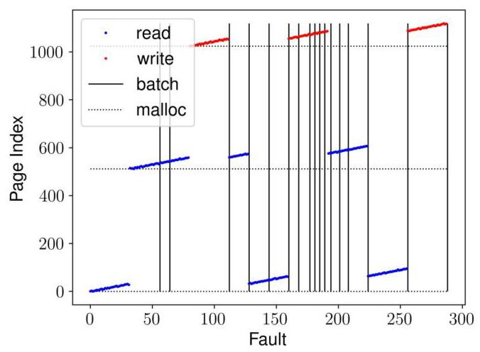

Figure 3: Faults of vector addition as a relative time series.

> 
图 3：作为相对时间序列的向量加法故障

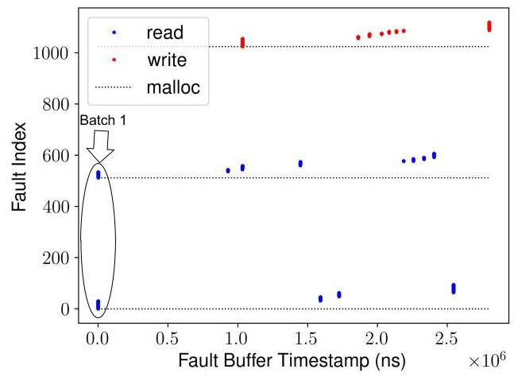

Figure 4: Faults of vector addition with real-time timestamps of arrival to the fault buffer. Faults clustered tightly vertically always indicate a batch.

> 
图4：向量加法的故障（faults）及其到达故障缓冲区的实时时间戳。垂直方向上紧密聚集的故障始终指示一个批次。

We observe a subtle faulting behavior from the second and third batch of Figures 3 and 4: no write accesses can execute until all 64 prerequisite reads have been fulfilled, even though the required memory addresses are known upfront. This behavior is traceable to a subtle but consistent coding practice demonstrated in the resultant SASS assembly code in Listing 2 for one iteration of the vector addition. It becomes clear that the intermediate result of $A + B$ is required before the result can be stored in vector $C$ and the corresponding page fault is generated. A coalescing version of the vector addition code implies that each faulting warp (or block) requires at least two full fault batches to complete its work, despite having the data requirements available upfront.

> 
我们从图 3 和图 4 的第二、第三批次中观察到一种细微的缺页行为：即使所需内存地址事先已知，也必须等到所有 64 个预读取请求都完成后才能执行写入操作。这一行为可追溯到清单 2 中向量加法单次迭代的 SASS 汇编代码所体现的一种微妙但一致的编码惯例。可以清楚地看到，在将中间结果 $A + B$ 存储到向量 $C$ 并生成相应的缺页之前，必须先完成该中间结果的计算。合并版本的向量加法代码意味着，每个发生缺页的 warp（或块）至少需要两个完整的故障批次才能完成其工作，尽管其数据需求在一开始就已明确。

From this example, we can infer that in addition to the μTLB fault limit, there is an additional fault rate throttling mechanism prevents a single SM from creating too many faults. In Figure 3, several batches consist of a small number (<< 56) of faults, even though there is no data dependency blocking the issuance of faults. These small number of faults are due to the presence of a rate-limiting mechanism on SMs. This inference is consistent with the original proposal of a far-faulting mechanism [39].

> 
从这个例子我们可以推断，除了 μTLB 故障限制外，还存在一个额外的故障率节流机制，阻止单个 SM 产生过多故障。在图 3 中，若干批次只包含少量（远小于 56 个）故障，即使没有数据依赖关系阻碍故障发出。这些少量故障是由于 SM 上存在速率限制机制所致。这一推断与原先提出的远故障机制[39]一致。

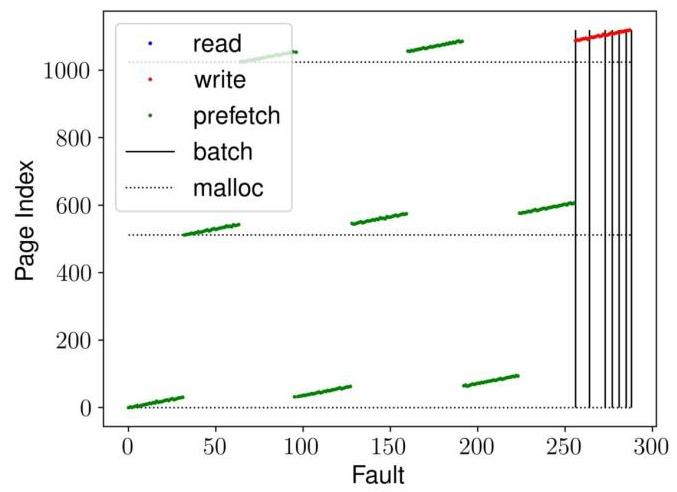

Figure 5: A single warp can generate faults up to the batch size limit using prefetching.

> 
图5：单个线程束通过预取可生成达到批大小上限的缺页。

We demonstrate that (1) these limitations are tied to the $\mu$ TLB level and (2) faults are inserted quickly and are not in a data-race with the UVM driver, using instruction-level prefetching. Instruction-level prefetching can escape both limits on the number of faults and rate throttling. The compiled PTX high-level assembly code includes a set of prefetching instructions, such as prefetch.global.L2, which prescriptively prefetches data from global memory to the L2 data cache. As with typical memory accesses, a page fault is triggered if the data is not present in global memory. Prefetching is unique because it does not require the register scoreboard, thus presumably avoiding triggering the previously-mentioned limitations. Figure 5 shows the resulting batches, where vectors A, B, and C are prefetched upfront. A single warp can generate up to 256 faults in a single batch, capped by the software batch size limit ${}^{1}$ . This behavior far exceeds the prior per-SM fault generation capabilities, confirming our prior assertions about code limitations fault-throttling.

> 
我们证明：(1) 这些限制与 $\mu$ TLB 级别相关，(2) 通过指令级预取，缺页能够快速插入，且不与 UVM 驱动发生数据竞争。指令级预取可以同时突破缺页数量和速率节流的限制。编译后的 PTX 高层汇编代码包含一组预取指令，例如 prefetch.global.L2，该指令主动将数据从全局内存预取到 L2 数据缓存。与普通内存访问类似，如果数据不在全局内存中，则会触发缺页异常。预取的独特之处在于它不需要寄存器记分板，因此可推测其规避了前述限制。图 5 展示了由此产生的批次，其中向量 A、B 和 C 被提前预取。单个线程束可在一次批次中产生高达 256 次缺页，这一上限由软件批次大小限制 ${}^{1}$ 所决定。这一行为远超之前每个 SM 的缺页生成能力，证实了我们先前关于代码限制导致缺页节流的论断。

Table 2: Per-SM Source Statistics in Each Batch

> 
表2：每个批次中每个SM的源统计数据

<table><tr><td>Benchmark</td><td>Avg Faults/SM</td><td>Std. Dev.</td><td>Min.</td><td>Max.</td></tr><tr><td>Regular</td><td>3.06</td><td>0.43</td><td>0.09</td><td>3.20</td></tr><tr><td>Random</td><td>3.03</td><td>0.52</td><td>0.01</td><td>3.20</td></tr><tr><td>sgemm</td><td>0.85</td><td>0.60</td><td>0.01</td><td>3.20</td></tr><tr><td>stream</td><td>0.75</td><td>0.09</td><td>0.05</td><td>1.36</td></tr><tr><td>cuff</td><td>0.91</td><td>0.13</td><td>0.01</td><td>1.88</td></tr><tr><td>gauss-seidel</td><td>0.65</td><td>0.45</td><td>0.01</td><td>2.95</td></tr><tr><td>hpgmg</td><td>0.41</td><td>0.10</td><td>0.01</td><td>2.65</td></tr></table>

In table 2, we examine how these fault-limiting components scale to more realistic workloads. Using data collected from the GPU page fault buffer, we identify the SM originating each fault within a batch. Generally, each batch contains faults from nearly all SMs on the GPU. Depending on the application, there may be more than one fault, but no more than a few; each batch represents a combination of work across the GPU SMs. This behavior is consistent with the fault generation and rate-limiting behaviors discussed previously, and it shows that SMs are served relatively "fairly."

> 
在表 2 中，我们考察这些故障限制组件如何扩展到更真实的工作负载。利用从 GPU 页面故障缓冲区收集的数据，我们识别出每个批次中发起各个故障的 SM。通常，每个批次都包含来自 GPU 上几乎所有 SM 的故障。根据应用程序的不同，可能会有不止一个故障，但不会超过几个；每个批次代表了跨 GPU SM 的工作组合。此行为与之前讨论的故障生成和速率限制行为一致，并且表明 SM 被相对“公平”地服务。

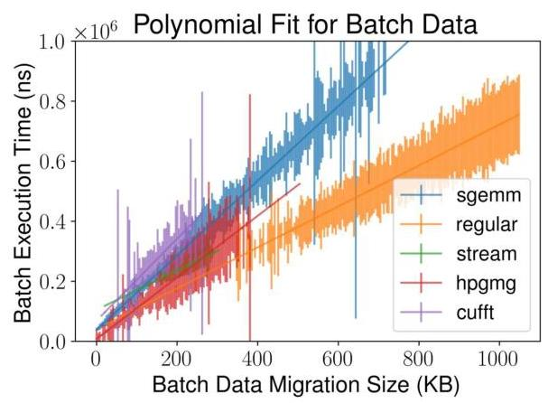

Figure 6: Best fit of batch sizes vs. data migrated for one run of several applications.

> 
图 6：几个应用程序单次运行中批次大小与迁移数据的最佳拟合。

Overall, this experiment indicates that, at scale, batches contain faults from many SMs due to a combination of rate throttling issues and code generation based on operations that take place between data accesses. In the next section, we look at how characteristics of the generated workloads influence overall performance.

> 
总体而言，本实验表明，在大规模情况下，由于速率限制问题以及基于数据访问之间所发生操作的代码生成，批次中包含来自多个 SM 的故障。在下一节中，我们将探讨生成的工作负载特性如何影响整体性能。

## 4 UVM DRIVER WORKLOAD

The UVM fault batching shapes the resulting UVM driver workload, and the overall performance is determined by how the driver handles this workload. For some applications, the driver workload is relatively small but must be handled before new work can be created. For applications that generate larger workloads, the driver is forced to make decisions about appropriate handling. Interestingly, some applications fit both categories at different points in a single kernel, creating a complex and difficult-to-optimize scenario for the driver. We investigate several key workload features:

> 
UVM 故障批处理塑造了最终的 UVM 驱动程序工作负载，而整体性能取决于驱动程序如何处理该工作负载。对于某些应用程序，驱动程序工作负载相对较小，但必须在创建新工作之前处理完毕。对于那些产生更大工作负载的应用程序，驱动程序被迫做出适当的处理决策。有趣的是，有些应用程序在同一个内核的不同执行点同时符合这两种情况，为驱动程序创造了一个复杂且难以优化的场景。我们研究了几个关键的工作负载特征。

- Data movement: the amount of data migrated to the GPU can be a significant cost but is not the dominating factor.

> 
- 数据传输：迁移至 GPU 的数据量可能是一项显著成本，但并非主导因素。

- Fault duplicates: faults for the same address that appear in the same workload batch are partially mitigated within UVM but can otherwise have high overhead.

> 
- 故障重复：同一工作负载批次中出现的同一地址的故障在UVM中得到了部分缓解，但其他情况下可能产生较高开销。

- Fault distribution/access pattern: the distribution of faults over 2MB VABlocks determines the trend for performance variance.

> 
- 故障分布/访问模式：故障在 2MB VA 块上的分布决定了性能差异的趋势。

- Host OS interaction: some components, such as CPU page un-mapping, require the host OS and surprisingly incur significant overhead on the fault path.

> 
- 主机操作系统交互：某些组件（如 CPU 页面取消映射）需要主机操作系统的参与，且令人意外地在缺页处理路径上引入了显著开销。

This section explores how these characteristics influence batch performance and, in turn, overall application performance.

> 
本节探讨这些特性如何影响批处理性能，进而影响整体应用程序性能。

### 4.1 Data Movement

Data Movement is the leading performance indicator in most UVM scenarios for a given batch. While other factors impact the overall performance, data movement is the primary purpose of the UVM driver and sets the trend for performance. Figure 6 demonstrates that the average batch cost rises linearly with the amount of data moved for all applications. However, the average cost differs with applications, and there is a high variance for each application.

> 
在给定的批量中，数据移动是大多数UVM场景下的主要性能指标。尽管其他因素会影响整体性能，但数据移动是UVM驱动程序的核心目的，并决定了性能趋势。图6展示了所有应用的平均批量成本随移动数据量的增加而线性上升。然而，不同应用的平均成本存在差异，且每个应用内部均表现出高方差。

---

${}^{1}$ Faults occurring beyond the batch size limit are dropped by the driver, and therefore not shown.

> 
${}^{1}$ 超出批处理大小限制的故障会被驱动程序丢弃，因此不会显示。

---

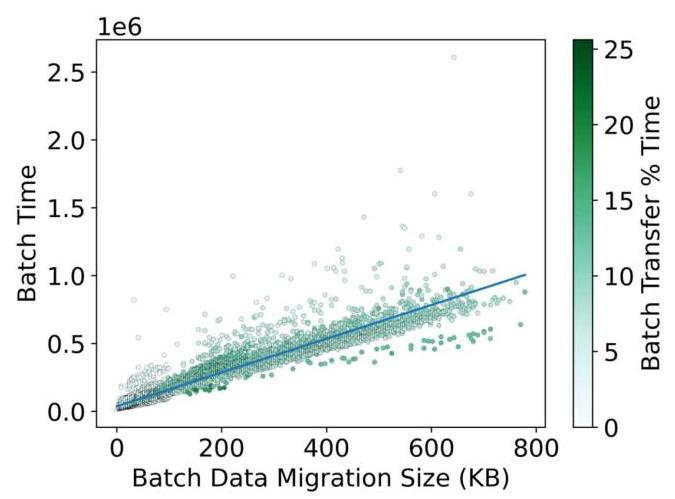

Figure 7: The percentage of time spent per batch performing data transfer for sgemm. At most, the transfer time is approximately 25% of the total batch time but is typically far lower.

> 
图 7：sgemm 中每批数据传输时间所占百分比。传输时间最多约占总批处理时间的 25%，但通常要低得多。

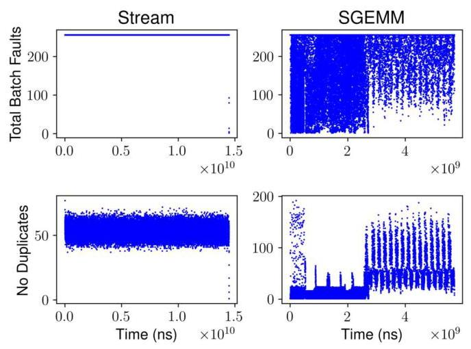

Figure 8: Batches in time series for stream and sgemm. Upper: fault counts registered by the driver. Lower: fault counts with duplicate faults to the same pages removed.

> 
图8：stream 和 sgemm 的时间序列批次。上图：驱动程序记录的缺页计数。下图：去除对相同页面的重复缺页后的缺页计数。

Even though data movement is a crucial cost indicator, the actual data migration is not the primary cost in a fault batch. Instead, management is far more costly. We use the example of a moderately sized sgemm to demonstrate this point. Figure 7 shows that transfer time accounts for less than ${25}\%$ of the total batch time for almost all batches. This observation offers two insights: (1) Most batch servicing time is not spent on data transfer. While faster hardware may benefit performance, the more significant issue is ensuring the driver efficiently utilizes the interconnect subsystem. (2) The variance and skew must be derived from batch characteristics, the driver software, and the driver's interaction with the host OS and hardware. We investigate the constituent components of the overall performance cost, including variance, in the remainder of this section.

> 
尽管数据移动是至关重要的成本指标，但实际数据迁移并非故障批处理中的主要开销。相反，管理成本要高得多。我们以一个中等规模的 sgemm 为例来证明这一点。图 7 显示，对于几乎所有批处理，传输时间占批处理总时间的比例不足 ${25}\%$。这一观察提供了两点启示：（1）批处理服务的大部分时间并非花在数据传输上。虽然更快的硬件可能有益于性能，但更关键的问题是确保驱动程序高效利用互连子系统。（2）方差和偏斜必定源于批处理特征、驱动程序软件以及驱动程序与主机操作系统和硬件的交互。在本节的剩余部分，我们将研究整体性能开销的各种组成因素，包括方差。

### 4.2 Duplicate Faults vs. Batch Size

To further understand the characteristics of batches over an application's lifetime and examine the causes of variance, we examine the impact of duplicate faults on the overall batch performance. We demonstrate that (1) the UVM driver workload is not uniform across applications and non-trivial benchmarks have varying batch characteristics, and (2) performance is more complex than just faults per batch with duplicate faults as one factor.

> 
为了进一步理解应用程序生命周期中批次的特性并考察差异的原因，我们研究了重复故障对整体批次性能的影响。我们证明了：(1) UVM 驱动程序的工作负载在不同应用程序间并非均匀分布，且非平凡基准测试展现出不同的批次特性；(2) 性能远比每个批次的故障数更为复杂，而重复故障只是其中一个影响因素。

First, we demonstrate that the UVM workload is application-driven in terms of size and the number of duplicate faults. Figure 8 shows the actual batch size of all batches in an application execution as a time series, where the upper pair presents the raw batch size as pulled from the GPU fault buffer and the lower pair shows the number of faults in each batch after duplicate faults have been discarded. sgemm is far more complex than stream in implementation, and such complexity manifests in the changes and "phases" of the batching behavior over time. Filtering out duplicates greatly alters the average batch size for both applications, indicating the need to address duplicate faults. However, the impact of duplicates is not the same across applications or even within the same application. In the context of batch workloads, such non-uniformity explains portions of the variation in batch distribution previously seen in Figure 6, as duplicate faults do not contribute to the migration size but certainly account for a portion of overhead.

> 
首先，我们证明UVM工作负载在规模和重复缺页数量上由应用程序驱动。图8以时间序列展示了应用程序执行期间所有批次的真实批次大小，其中上方一对呈现从GPU缺页缓冲区直接获取的原始批次大小，下方一对则显示去掉重复缺页后每个批次的缺页数量。sgemm在实现上远比stream复杂，这种复杂性表现为批处理行为随时间的演化和“阶段”变化。去除重复项极大地改变了两者的平均批次大小，表明需要应对重复缺页问题。然而，重复缺页的影响在不同应用程序之间、甚至同一应用程序内部都不尽相同。在批处理工作负载的语境下，这种不均匀性部分解释了先前在图6中观察到的批次分布差异，因为重复缺页并不贡献于迁移数据量，但确实构成了一部分开销。

The driver classifies duplicate faults into two types: (1) faults to the same address that originate from the same $\mu$ TLB, and (2) faults to the same address that originate from different $\mu$ TLBs. The driver handles these types at different times, and the latter has a greater cost. Faults of type (1) commonly occur in codes with high spatial locality within a warp or block, causing multiple threads to issue the same fault; our data also indicate that SMs spuriously wake up to reissue the same fault during a batch. Type (2) duplicates indicate that there is data sharing among different blocks, and as such, some type (2) faults fall into type (1) because adjacent SMs share a µTLB. The reason for this distinction seems to be for more detailed metadata tracking and potential future improvements, and the difference is essential when considering alterations to how the GPU handles duplicate faults. However, for the data presented, we combine these types of duplicates as other costs overtake it.

> 
驱动程序将重复的故障分为两类：（1）源自同一 $\mu$ TLB 的对同一地址的故障，以及（2）源自不同 $\mu$ TLBs 的对同一地址的故障。驱动程序分别在不同的时间处理这些类型，且后者的开销更大。类型（1）的故障常见于在 warp 或块内具有高空间局部性的代码中，导致多个线程发出相同的故障；我们的数据还表明，SM 在批处理期间会虚假唤醒以重新发出相同的故障。类型（2）的重复则表明不同块之间存在数据共享，因此部分类型（2）的故障会因相邻 SM 共享一个 µTLB 而落入类型（1）。这种区分的原因似乎在于更精细的元数据跟踪以及潜在的未来改进，并且在考虑改变 GPU 处理重复故障的方式时，这种差异至关重要。然而，对于所呈现的数据，由于其他开销的影响更为显著，我们将这些重复类型合并处理。

Between batches, the fault buffer is flushed before a fault replay; any outstanding faults are dropped, and only faults that still need to be serviced will be reissued. The flush allows large numbers of duplicates to be dropped to reduce bulk transfers at the expense of overhead for dropping non-duplicate faults. We investigate this tradeoff by comparing the performance of various batch sizes. Figure 9 shows the results with the default batch size of 256. Critically, performance is generally greater with larger batch sizes, even though larger batch sizes have higher rates of duplicate faults. As larger batch sizes lead to smaller numbers of batches for the same problem size, we derive that the overhead of performing a batch is more costly than processing a modest number of additional duplicates within each batch. However, increasing the batch size has diminishing returns. The maximum average number of unique faults-per-batch across all tested applications is on the order of 500 in our test regardless of the batch size, and increasing batch size beyond 1024 does not meaningfully affect the outcome. The number of total faults available per batch is limited by a combination of (1) flushing the buffer between batches and (2) the limitations on total fault generation described in the previous section.

> 
批次之间，故障缓冲区在故障重放前被刷新；所有未完成的故障均被丢弃，只有仍需服务的故障才会被重新发出。这种刷新允许丢弃大量重复的故障以减少批量传输，其代价是丢弃非重复故障带来的开销。我们通过比较不同批次大小的性能来研究这一权衡。图9展示了默认批次大小为256时的结果。关键的是，尽管较大的批次大小具有更高的重复故障率，但性能通常随着批次大小的增大而提升。由于较大的批次大小导致相同问题规模下所需的批次数更少，我们推断执行一个批次的成本要高于在每个批次内处理少量额外重复故障的成本。然而，增大批次大小的收益是递减的。在我们的测试中，无论批次大小如何，所有受测应用的平均最大每批次唯一故障数均为500左右，且将批次大小增大到1024以上并不会对结果产生有意义的影响。每个批次可用的总故障数量受到两个因素的限制：（1）批次间缓冲区的刷新，以及（2）前一节描述的总故障生成限制。

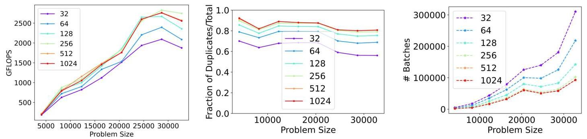

Figure 9: Batch size evaluation example with sgemm. There is a strong correlation between performance and batch size. Batch sizes up to 6144 (max) are tested but are not shown as performance does not change.

> 
图 9：使用 sgemm 的批处理大小评估示例。性能与批处理大小之间存在很强的相关性。测试了高达 6144（最大值）的批处理大小，但由于性能未发生变化而未显示。

### 4.3 Fault Distribution/Access Pattern

We next examine the distribution of faults in a batch across memory, e.g. spatial locality at the page granularity. Within the UVM driver, all operations are logically separated on VABlock (page-aligned 2MB) regions, making VABlocks a source of performance variation. Figure 10 shows batches colored by the number of unique VABlocks present in the data transfers for each batch. While each batch is subject to other sources of variance, one major trend is that, for batches with similar workloads, more VABlocks incur higher costs and cause more significant performance variation. This behavior is consistent with our earlier observation that the driver handles VABlocks within a batch independently.

> 
我们接下来考察一个批次内故障跨内存的分布情况，例如页面粒度上的空间局部性。在 UVM 驱动内部，所有操作在 VABlock（页对齐的 2MB）区域上逻辑分离，这使得 VABlock 成为性能差异的一个来源。图 10 展示了根据每个批次中数据传输涉及的唯一 VABlock 数量进行着色的批次。虽然每个批次还会受到其他方差来源的影响，但一个主要趋势是，对于工作负载相似的批次，涉及更多 VABlock 会带来更高的开销，并导致更显著的性能波动。这一行为与我们之前的观察一致，即驱动程序独立处理批次内的各个 VABlock。

Table 3: VABlock Source Statistics in a Batch.

> 
表3：批处理中的VABlock源数据统计。

<table><tr><td></td><td>VABlock/Batch</td><td>Faults/VABlock</td><td>Std. Dev.</td><td>Min.</td><td>Max.</td></tr><tr><td>Regular</td><td>41.27</td><td>5.93</td><td>5.10</td><td>1</td><td>83</td></tr><tr><td>Random</td><td>233.09</td><td>1.04</td><td>0.20</td><td>1</td><td>6</td></tr><tr><td>sgemm</td><td>6.96</td><td>9.81</td><td>16.58</td><td>1</td><td>128</td></tr><tr><td>stream</td><td>3.93</td><td>15.37</td><td>8.17</td><td>1</td><td>72</td></tr><tr><td>cufft</td><td>25.14</td><td>2.89</td><td>2.22</td><td>1</td><td>129</td></tr><tr><td>gauss-seidel</td><td>2.31</td><td>22.44</td><td>27.96</td><td>1</td><td>208</td></tr><tr><td>hpgmg</td><td>2.39</td><td>13.62</td><td>15.72</td><td>1</td><td>212</td></tr></table>

Processing each VABlock in parallel would be an intuitive optimization based on the driver design but would be highly workload imbalanced due to the large standard deviation in per-batch VABlock representation. In table 3, there is a wide variation in the number of VABlocks present in each batch, and these distributions change with application. Additionally, there is a high variance in the number of faults per-VABlock. As discussed in the previous section, the root cause of this inconsistency is that each fault batch contains pages from almost every SM on the GPU. Batched faults originate from many different execution contexts, with only a few pages representing each SM. The sole benchmark with low variance is random access as it consistently has no locality within a single VABlock, but still represents a very small workload per-VABlock.

> 
并行处理每个 VABlock 将是一种基于驱动程序设计层面的直观优化，但由于每批次 VABlock 数量的标准差很大，会导致工作负载严重不均衡。在表3中，每个批次中出现的 VABlock 数量差异很大，且这些分布会随应用而变化。此外，每个 VABlock 的缺页数量也有很高的方差。如前一节所述，这种不一致的根本原因在于每个缺页批次包含来自 GPU 上几乎所有 SM 的页面。批处理的缺页源自许多不同的执行上下文，每个 SM 仅有少量页面。唯一具有低方差的基准测试是随机访问，因为它在一个 VABlock 内始终没有局部性，但仍代表每个 VABlock 的工作负载非常小。

### 4.4 Host OS Interaction

Management operations for host memory frequently require expensive interactions with the host OS. The host component of UVM is built on top of the existing virtual memory system in the Linux kernel. Because of this, migrations are subject to additional latencies incurred by existing mappings and the underlying virtual memory subsystem. We use an existing, UVM-optimized application to demonstrate this issue - the HPGMG implementation provided by NVIDIA [32]. Figure 11 shows an example of CPU-side behavior influencing GPU-fault performance outcomes. The two subfigures show the same problem with the same configuration, except (a) uses a single OpenMP thread, whereas (b) uses the default OpenMP thread configuration (one thread per logical core). Notably, the former configuration shows roughly twice the performance by simply disabling multithreading, and the performance trend falls in line with other applications that we have seen for a given data size.

> 
主机内存的管理操作通常需要与主机操作系统进行成本高昂的交互。UVM 的主机端组件构建在 Linux 内核现有虚拟内存系统之上。正因为如此，迁移会受到现有映射与底层虚拟内存子系统带来的额外延迟影响。我们使用一个现有的 UVM 优化应用来展示此问题——NVIDIA 提供的 HPGMG 实现 [32]。图 11 展示了 CPU 侧行为影响 GPU 缺页处理性能结果的一个示例。两个子图显示的是相同配置下的同一问题，区别只在于（a）使用单个 OpenMP 线程，而（b）使用默认的 OpenMP 线程配置（每个逻辑核心一个线程）。值得注意的是，仅通过禁用多线程，前一种配置的性能就大约是后者的两倍，且其性能趋势与我们在给定数据量下观察到的其他应用的表现一致。

Further, page unmapping represents a significant portion of execution time for many batches, as represented by the tone of color in Figure 11. Page unmapping is an operation in the existing virtual memory system on the host that UVM extends to support faults from GPU. Page unmapping is performed when the GPU touches a VABlock that is partially resident on the CPU. In this scenario, the driver calls into the kernel function unmap_mapping_range() to unmap all pages within the VABlock that are resident in host memory as part of the page migration. Interestingly, we observe that OpenMP multithreading exaggerates this specific cost for HPGMG. We note that this behavior does not occur in trivial cases, such as parallelizing data initialization in the sgemm application, indicating that data access patterns and thread affinity play a role in this issue.

> 
此外，页面取消映射在许多批次的执行时间中占据显著部分，如图 11 中的色调所示。页面取消映射是主机上现有虚拟内存系统中的一项操作，UVM 对其进行了扩展以支持来自 GPU 的缺页异常。当 GPU 访问一个部分驻留在 CPU 上的 VABlock 时，就会执行页面取消映射。在此场景中，驱动程序调用内核函数 unmap_mapping_range()，以取消映射 VABlock 内所有驻留在主机内存中的页面，作为页面迁移的一部分。有趣的是，我们观察到 OpenMP 多线程在 HPGMG 中放大了这一特定成本。我们注意到，这种行为在简单情况下不会出现，例如在 sgemm 应用中并行化数据初始化，这表明数据访问模式和线程亲和性在该问题中起作用。

We draw two conclusions about host OS interaction from the data presented: (1) unmapping host-side data takes place on the fault path and incurs significant overhead, and (2) certain host-side parallelizations of an application using UVM can exaggerate these unmapping costs. The host OS performs this operation, and the costs likely stem from issues with virtual mappings across CPU cores, flushing dirty pages from caches and TLBs, NUMA, and other memory-adjacent issues. Additionally, these operations do not take place in bulk due to the logical separation of VABlocks within UVM. This is an area that deserves particular scrutiny as HMM also performs host page unmapping on the fault path using host OS mechanisms, implying a similar cost could be applied to all devices when using HMM [11, 20]. Design and implementation issues such as how unmapping takes place and if it needs to be performed on-demand deserve further investigation.

> 
根据所呈现的数据，我们就主机操作系统交互得出两个结论：(1) 主机端数据的取消映射发生在缺页路径上，并带来显著开销；(2) 使用统一虚拟内存（UVM）的应用程序在某些主机端并行化方式下，会加剧这些取消映射的开销。主机操作系统执行该操作，其开销可能源于跨 CPU 核的虚拟映射、从缓存和 TLB 中刷新脏页、NUMA 以及其他与内存相关的问题。此外，由于 UVM 内部虚拟地址块（VABlocks）的逻辑分隔，这些操作并非批量执行。这一点值得特别审视，因为异构内存管理（HMM）同样会在缺页路径上利用主机操作系统机制执行主机页取消映射，这意味着所有设备在使用 HMM 时都可能承担类似的成本 [11, 20]。诸如取消映射如何发生、是否需要按需执行等设计与实现问题，值得进一步研究。

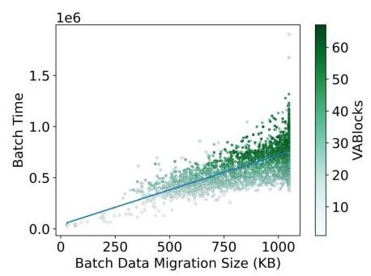

Figure 10: Batch time vs. to-GPU data migration size. For the same size, a higher cost is associated with more VABlocks.

> 
图10：批处理时间与至GPU数据迁移大小的关系。相同数据量下，更高的开销与更多的VABlocks相关联。

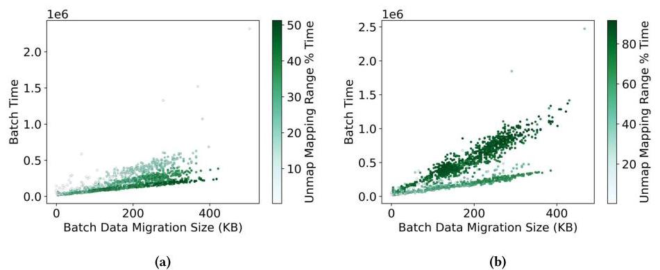

Figure 11: HPGMG with single threading (a) and multithreading (b), where the percentage indicates relative time per batch spent unmapping host-resident pages. Multithreading incurs larger percentages for unmapping.

> 
图11：使用单线程(a)和多线程(b)的HPGMG，其中百分比表示每批次中用于取消映射宿居页面的相对时间。多线程导致取消映射的百分比更大。

## 5 WORKLOADS WITH PREFETCHING AND OVERSUBSCRIPTION

In practice, UVM offers two features by default to support its use in real applications - prefetching and eviction. Prefetching is fundamental to allowing UVM applications to achieve performance comparable to programmer-managed memory applications [2]. Oversubscription further simplifies programming, allowing applications to work with out-of-core data, but typically at a high performance cost. In this section, we analyze these two features, primarily identifying (1) how costs from the prior section translate into real workloads and (2) how prefetching and eviction impact batches qualitatively and quantitatively.

> 
在实际应用中，UVM 默认提供两个功能以支撑其在真实应用中的使用——预取与淘汰。预取对于 UVM 应用达到与程序员显式管理内存应用相当的性能至关重要 [2]。内存超额使用进一步简化了编程，允许应用处理外存数据，但通常会带来较高的性能代价。本节将分析这两个功能，主要确定：（1）上一节中的开销如何体现在真实工作负载中，以及（2）预取和淘汰如何从定性和定量上影响批次。

### 5.1 Oversubscription

Oversubscription allows applications to exceed GPU memory capacity by using a form of LRU eviction to swap pages back to the host. When all GPU memory has been previously allocated, eviction automatically migrates "cold" data back to the host to make room for new data at the granularity of 2MB VABlock. Figure 12 shows batch timing data for sgemm using a problem size that exceeds GPU memory. The application follows a somewhat expected trend in terms of batch distribution: many batches are executed before full GPU memory allocation without requiring eviction, and others (colored) evict one or more VABlocks. Predictably, blocks containing evictions incur greater overheads to (1) fail allocation, (2) evict a VABlock and migrate the data back to the host, and (3) restart the block migration process, including page population, a process by which pages are filled with zero values before data is migrated to them.

> 
超分配允许应用程序超出 GPU 内存容量，通过一种 LRU 驱逐机制将页面交换回主机。当所有 GPU 内存已被先前分配占用时，驱逐会自动将“冷”数据迁回主机，以便为新数据腾出空间，粒度是 2MB 的 VABlock。图 12 展示了使用超出 GPU 内存的问题规模时 sgemm 的批处理时间数据。应用程序在批次分布上呈现出一定程度的预期趋势：许多批次在 GPU 内存完全分配前执行，无需驱逐，而其他（彩色）批次则驱逐一个或多个 VABlock。可以预见，包含驱逐的块会因以下原因产生更大的开销：(1) 分配失败，(2) 驱逐 VABlock 并将数据迁回主机，以及 (3) 重新启动块迁移过程，包括页面填充——这是一种在数据迁移到页面之前用零值填充页面的过程。

In Figure 13, we see an example where batches with the same number of evictions appear to show multiple "levels" of cost. The levels showcase an interesting component of the eviction mechanism. If a paged VABlock is resident on the CPU, requiring a call to the previously discussed unmap_mapping_ranges(), and the GPU memory is fully occupied, requiring an eviction, then both costs are accounted for in the overall time. In contrast, if a VABlock has already been made resident on the GPU but is later evicted, then it is not remapped to the CPU unless the CPU accesses it. If a VABlock was evicted once and paged back onto the GPU, then it does not have to pay the large unmap_mapping_ranges() cost for a second time, cutting a significant portion of the time and creating the lower-cost levels of batches. This property is seen by comparing the pair of figures, where the lower "level" for the same number of evictions always has near-zero unmapping range cost.

> 
在图13中，我们观察到具有相同驱逐数量的批次呈现出多个成本“层级”的示例。这些层级展示了驱逐机制中一个有趣的组成部分。如果一个已分页的VABlock驻留在CPU上，需要调用之前讨论的unmap_mapping_ranges()，而GPU内存已被完全占用，需要进行驱逐，那么这两项成本都会计入总耗时。相反，如果一个VABlock已在GPU上驻留，但后来被驱逐，那么除非CPU访问它，否则它不会重新映射到CPU。如果一个VABlock被驱逐过一次，并再次调页到GPU上，那么它无需第二次承担高昂的unmap_mapping_ranges()成本，从而显著缩短了时间，并形成了成本较低的批次层级。通过对比成对的图例可以看到这一特性，其中对于相同数量的驱逐，较低的“层级”总是有着接近零的取消映射范围成本。

### 5.2 Prefetching

UVM utilizes a runtime prefetching routine as part of the default behavior. The prefetching mechanism is a type of density prefetching, sometimes called tree-based prefetching, and is described in detail in [2, 14, 21]. The prefetcher's scope is limited to within a single VABlock and is only reactive; the prefetcher only flags pages within a VABlock currently being serviced for faults up to the full VABlock.

> 
UVM 将运行时预取例程作为默认行为的一部分。这种预取机制是一种密度预取，有时也称为基于树的预取，详见 [2, 14, 21]。预取器的范围仅限于单个 VABlock 内，且仅为被动式；预取器仅标记当前正在处理故障的 VABlock 内的页面，直至整个 VABlock。

In Figure 14, we see the results of prefetching on the previously-viewed applications. The number of batches is reduced by 93% from the previous Figure 7 of the same sgemm with prefetching disabled. However, some batches have highly exaggerated sizes due to large prefetching regions. The relative performance trend is similar to the non-prefetching trend.

> 
在图 14 中，我们看到了预取在之前分析过的应用程序上的效果。与图 7 中相同 sgemm 在禁用预取时的结果相比，批量数量减少了 93%。然而，由于预取区域较大，某些批量的规模被显著放大。其相对性能趋势与非预取情况相似。

Many instances of very high cost batches in this figure would have been considered outliers in the previous figures without prefetch-ing. These batches are traceable to the behavior seen in Figure 14, showing that up to 64% of batch time is spent in GPU VABlock state initialization not present in other batches. This time is largely spent doing two operations: (1) create DMA mappings for every page in the VABlock to the GPU, so that the GPU can copy data between the host and GPU within that region, and (2) create reverse DMA address mappings and store them in a radix tree data structure implemented in the mainline Linux kernel. The batches creating these mappings cannot be eliminated by prefetching, as they are compulsory when a VABlock is first accessed. However, not every batch requiring these DMA mappings has the same high cost. Inline timing during these high-cost DMA batches shows that the majority of time is spent in the radix tree portion of this operation, indicating some performance issues potentially associated with that data structure. However, we do not present this data here as the low-level timing creates significant skew in the overall timing information.

> 
在此图中，许多成本极高的批次在之前未启用预取的图中可能被视为异常值。这些批次可追溯到图14所示的行为，表明高达64%的批次时间花费在GPU VABlock状态初始化上，而这种初始化在其他批次中并不存在。这段时间主要消耗在两个操作上：（1）为VABlock中的每一页创建到GPU的DMA映射，使得GPU能够在主机与GPU之间在该区域内复制数据；（2）创建反向DMA地址映射，并将其存储在主line Linux内核实现的基数树数据结构中。创建这些映射的批次无法通过预取消除，因为它们是VABlock首次被访问时的强制开销。然而，并非所有需要这些DMA映射的批次都有相同的高成本。在这些高成本DMA批次中进行的行内计时显示，绝大部分时间消耗在此操作的基数树部分，表明该数据结构可能潜在地关联着一些性能问题。不过，由于底层计时会对整体计时信息造成显著偏差，我们未在此展示这些数据。

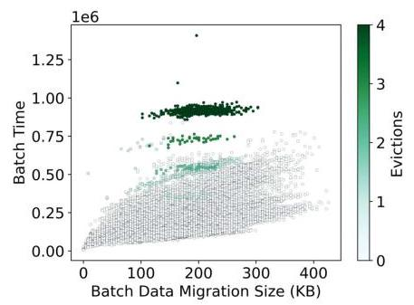

Figure 12: sgemm under oversubscription and eviction.

> 
图12：超额订阅与驱逐下的 sgemm

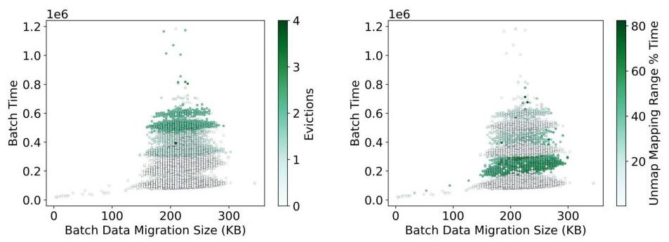

Figure 13: Stream under oversubscription. Left: multiple "levels" for the same eviction count. Right: a level may not include a portion of CPU unmapping.

> 
图13：超额订阅下的流。左：同一驱逐计数下的多个“层级”。右：某个层级可能不包括部分CPU取消映射。

The overall characteristic of prefetching shows that it makes a very similar tradeoff to batch size capping for duplicate faults; reducing the overall number of batches is highly effective in speeding up UVM, even when it means performing larger quantities of work in the short term. However, this serves to make the inconsistent DMA mapping cost a more significant proportion of the overall cost.

> 
预取的总体特征表明，它与针对重复缺页的批处理大小上限做出了非常相似的权衡；减少批次总数对于加速统一虚拟内存（UVM）极为有效，即使这意味着短期内要执行更大量的工作。然而，这也使得不一致的DMA映射开销在总开销中所占的比例更为显著。

### 5.3 Eviction + Prefetching

Finally, eviction combining prefetching creates the most complex scenario. Prior work has shown that the combination of prefetching and eviction can harm performance for applications with irregular access patterns $\left\lbrack  {2,{21},{37}}\right\rbrack$ . The relationship is somewhat indirect since prefetching contained within a resident VABlock cannot trigger eviction. However, data that is prefetched before use but must still be evicted later incurs an additional cost in both the initial migration and the subsequent eviction. We evaluate this scenario by comparing prefetching enabled and disabled scenarios for the same applications.

> 
最后，驱逐结合预取构成了最复杂的场景。先前的研究表明，对于具有不规则访问模式的应用程序，预取与驱逐的结合会损害性能$\left\lbrack  {2,{21},{37}}\right\rbrack$。这种关系有些间接，因为包含在驻留 VABlock 中的预取不能触发驱逐。然而，在使用前被预取但之后仍必须驱逐的数据，在初始迁移和后续驱逐中都会产生额外开销。我们通过比较相同应用程序在启用和禁用预取时的场景来评估这一情况。

Figure 15 shows dgemm with combined eviction and prefetching properties in the migration size-sorted plot and as a time series. The range of data transfers is still extended but not to the full 20MB range observed in the prefetching example alone; we attribute this to reduced block access density for the larger problem size.

> 
图15在按迁移大小排序的图以及时间序列中展示了同时具有逐出和预取特性的 dgemm。数据传输的范围仍然有所扩大，但并未达到仅在预取示例中观察到的完整 20MB 范围；我们将此归因于较大问题规模下块访问密度的降低。

We examine each pair of figures individually: (1) In Figure 15a, we confirm that prefetching is still active and driving the larger batch sizes. Prefetching tends to happen earlier where VABlock are consistently resident on the GPU, and subsequent accesses to the same VABlock can drive a robust prefetching response. (2) Figure 15b shows eviction ranges remarkably similar to the non-prefetching data set, fitting into the same sizes and ranges. The eviction set has relatively low batch sizes because evictions are caused by paging in new VABlocks, which have low access density at first. (3) In Figure 15c, non-eviction batches that include new VABlocks tend to have smaller batch sizes but have to pay the high CPU unmapping cost discussed in the prior section. CPU unmapping cost can occur at any time during execution as new VABlocks are touched but tend to diminish later in execution after each VABlock has been touched by the GPU at least once. (4) Finally, in Figure 15d, we observe that creating DMA mappings can still have high overhead, although it is intermittent. This figure suggests that the high overhead may be caused by the growing of the underlying radix tree, but further investigation is required.

> 
我们逐一分析每对图：(1) 在图15a中，我们确认预取仍然活跃，并且驱动了较大的批次大小。预取往往在VABlock持续驻留在GPU上时较早发生，随后对同一VABlock的访问可以触发强劲的预取响应。(2) 图15b显示了与无预取数据集非常相似的逐出范围，符合相同的大小和区间。逐出集的批次大小相对较低，因为逐出是由调入新VABlock引起的，而这些新块最初访问密度较低。(3) 在图15c中，包含新VABlock的非逐出批次往往批次大小较小，但必须支付前节讨论的高额CPU取消映射成本。CPU取消映射成本可能在新VABlock被触碰时于执行期间的任何时候发生，但倾向于在GPU至少触碰每个VABlock一次之后逐渐减少。(4) 最后，在图15d中，我们观察到创建DMA映射仍然可能带来高额开销，尽管是间歇性的。该图表明，高开销可能是由底层基数树的增长引起的，但这需要进一步研究。

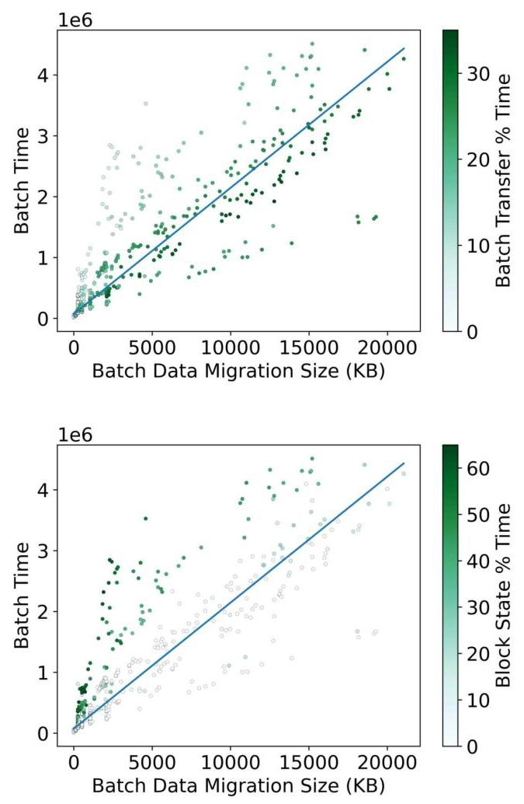

Figure 14: Batch profiles of sgemm with prefetching enabled. The mid-range cost batches are significantly reduced, and the high-end outliers correspond to negative performance impacts from creating and storing DMA mappings.

> 
图14：启用预取时 sgemm 的批次概况。中等开销的批次显著减少，高端离群值对应于创建和存储 DMA 映射带来的负面性能影响。

Overall, we confirm our intuition about when these batch features may occur and confirm that many of the cost relationships discussed earlier still account for a large quantity of runtime even with eviction and prefetching enabled. Additionally, we find that eviction costs are largely independent of the host OS performance problems and need to be optimized independently. Prefetching can significantly diminish the total number of batches, but the remaining batches include all remaining OS costs, including DMA mapping and host page unmapping.

> 
总的来说，我们证实了关于这些批量特性何时出现的直觉，并确认即使启用了驱逐和预取，之前讨论的许多成本关系仍占运行时的大量时间。此外，我们发现驱逐开销在很大程度上独立于主机操作系统的性能问题，需要单独优化。预取可以显著减少批次总数，但剩余批次包含了所有残留的操作系统成本，包括DMA映射和主机页面解映射。

Figure 15: Batch profiles of sgemm by data migration (left) and as a time series (right). Prefetching occurs throughout the execution. Evictions typically occur later in computation. Unmapping and GPU state setup occur regularly throughout the application, and GPU state setup does not always have excessively high overhead.

> 
图15：按数据迁移（左）和时间序列（右）展示的 sgemm 批处理概况。预取在整个执行过程中持续发生。逐出通常出现在计算的后期。取消映射和 GPU 状态设置在整个应用程序中定期发生，且 GPU 状态设置并不总是带来过高的开销。

### 5.4 Case Studies with HPC Workloads

We use HPC workloads as case studies and show their batch profiles and the corresponding fine-grain fault behaviors. For these experiments, prefetching is enabled and GPU memory is oversubscribed (< 125% GPU memory capacity). Due to space limitations, we only include the Gauss-Seidel and HPGMG benchmarks. We note that while Figure 16c largely shows the order of batch occurrence in time, multiple batches may be condensed in a cluster of points with a much smaller time in Figures 16a and 16b.

> 
我们以HPC工作负载为案例研究，展示其批处理概况及相应的细粒度缺页行为。在这些实验中，预取机制开启且GPU内存超额使用（< GPU内存容量的125%）。因篇幅所限，我们仅纳入Gauss-Seidel和HPGMG基准测试。我们注意到，尽管图16c主要按时间顺序展示了批处理的发生，但在图16a和图16b中，多个批处理可能被压缩成一个时间极短的密集点簇。

Table 4: Batch and Kernel Execution Times

> 
表 4：批处理与内核执行时间

<table><tr><td rowspan="2">Benchmark</td><td colspan="2">No Prefetch</td><td colspan="2">Prefetch</td></tr><tr><td>Batch</td><td>Kernel</td><td>Batch</td><td>Kernel</td></tr><tr><td>Gauss-Seidel</td><td>60.477s</td><td>66.393s</td><td>15.340s</td><td>19.550s</td></tr><tr><td>HPGMG</td><td>32.384s</td><td>40.472s</td><td>7.261s</td><td>14.879s</td></tr></table>

Table 4 presents the overall application performance. Aggregate batch times are smaller than kernel times as they exclude the initial interrupt time (negligible) and GPU time spent working with in-memory data. With modest oversubscription, prefetching improves the kernel performance by 3.39x and 2.72x for Gauss-Seidel and HPGMG, respectively. Such performance gain suggests certain amounts of prefetching page hits. In general, the performance gain from prefetching is expected to decrease as the percentage of oversubscription increases and more evictions are involved.

> 
表4展示了整体应用性能。聚合批次时间小于内核时间，因为它不包括初始中断时间（可忽略不计）以及GPU处理内存数据所花费的时间。在适度超额分配的情况下，预取对Gauss-Seidel和HPGMG的内核性能分别提升了3.39倍和2.72倍。这样的性能提升表明存在一定数量的预取页面命中。通常，预取带来的性能提升预计会随着超额分配比例的增加和更多页面换出的发生而下降。

For Gauss-Seidel, the batch time is small at the beginning of execution without intensive prefetching or evictions. We observe larger batch time and increasing number of prefetches around 0.5 second, consistent with the observed larger migration sizes for batches with prefetching. Coincidentally, we observe more evictions begin to occur just before prefetching. This is because eviction creates new opportunities for prefetching to occur - freshly paged-in VABlocks have a high chance of triggering prefetching with subsequent accesses. Respectively, the fine-grain fault behaviors in Figure 16c exhibit contiguous batches allocating and evicting pages in similar, large page ranges. This indirect relationship between allocation, eviction, and prefetching can be observed during the rest of the workload execution.

> 
对于高斯-赛德尔，在执行初期没有密集的预取或换出操作时，批处理时间很短。大约在0.5秒时，我们观察到批处理时间变大且预取次数增加，这与预取批次中观察到的更大迁移量一致。巧合的是，我们观察到更多的换出操作恰好在预取之前开始发生。这是因为换出为预取创造了新的机会——刚被调入的虚拟地址块有很大概率在后续访问中触发预取。相应地，图16c中的细粒度缺页行为显示，连续的批次在相似的大页面范围内分配和换出页面。这种分配、换出和预取之间的间接关系可以在工作负载执行的其余部分中观察到。

For HPGMG, there are few faults during the setup phase so the x-axis is cut in Figures 17a and 17b to make drawing space for later execution. We observe similar coincidence between intensive prefetches and increasing evictions in about four segments in Figure 17. We observe the same relationship between allocation, eviction, and prefetching that was present in Gauss-Seidel. Another interesting observation is that Figure 17c clearly manifests the Least-Recently-Used (LRU) replacement policy for page eviction. In practice, LRU policy is essentially "earliest allocated pages" for these sufficiently dense access because the UVM driver has no information about page hits. The first large number of evictions target the first allocated pages, illustrated by the green vertical rectangle at the beginning of the execution. The later evictions similarly evict the remaining earliest allocated pages. This LRU policy may not be optimal, as some evicted pages are needed shortly and must again be migrated back to GPU.

> 
对于 HPGMG，设置阶段故障极少，因此图 17a 和图 17b 中截断了 x 轴，以便为后续执行留出绘制空间。我们在图 17 中大约四个区段观察到密集预取与驱逐增加之间的类似同时性。我们观察到分配、驱逐和预取之间存在与 Gauss-Seidel 中相同的关系。另一个有趣的发现是，图 17c 清晰地展现了页面驱逐所采用的最近最少使用（LRU）替换策略。实际上，对于这些足够密集的访问，由于 UVM 驱动程序没有关于页面命中的信息，LRU 策略本质上就是“最早分配的页面”。第一批大量驱逐针对的是最早分配的页面，如执行起始处的绿色垂直矩形所示。后续的驱逐同样会清除剩余的最早分配页面。这种 LRU 策略可能并非最优，因为一些被驱逐的页面不久又会被用到，必须再次迁移回 GPU。

## 6 DISCUSSION AND CONCLUSION

This work examines how faults are generated by NVIDIA devices and handled by the UVM driver. We identify the key cost components with unexpected performance characteristics in the UVM fault path. We examine these components with UVM-specific workload features and highlight the impact of these features on overall performance and fault batch workload processing. This work serves as an initial investigation into the systems software performance concerns for UVM and a proxy study for HMM and future interfacing vendors/devices. Below we summarize the key findings, discuss them in a wider scope, and discuss potential future work.

> 
本研究探讨 NVIDIA 设备如何生成缺页，以及 UVM 驱动如何对其进行处理。我们在 UVM 缺页路径中识别出具有非预期性能特征的关键成本构成，结合 UVM 特有的工作负载特性对这些构成进行分析，并突出这些特征对整体性能和缺页批处理工作负载处理的影响。本研究是对 UVM 系统软件性能问题的初步探讨，并为 HMM 及未来接入的供应商/设备提供了参考性研究。下文将总结关键发现，在更广泛的范围内对其进行讨论，并探讨未来可能的研究方向。

Key Driver Costs. Data movement contributes only a small amount of overall cost in contrast to expectation. This suggests that improvements to basic hardware, such as interconnect bandwidth and latency, would still improve performance but would not resolve the underlying issues.

> 
关键驱动开销。与预期相反，数据移动在整体开销中所占比例很小。这表明，即便改善互连带宽和延迟等基础硬件性能，虽然仍能提升性能，却无法从根本上解决这些问题。

Duplicate faults are an important performance issue that are appropriately managed through limited batch sizes in UVM. Minimizing duplicates is a secondary objective, however. The primary objective is to accept as many unique faults as possible to reduce the total number of batches. A simple improvement could be to tune batch size based on the number of duplicate faults received.

> 
重复缺页异常是一个重要的性能问题，通过限制 UVM 中的批处理大小得到适当管理。然而，最小化重复异常是次要目标。主要目标是尽可能多地接受唯一缺页异常，以减少总批次数。一个简单的改进可以是根据接收到的重复缺页异常数量来调优批处理大小。

Host OS operations, particularly unmapping CPU pages on the fault path, contribute significant overhead. Some user code parallelization schemes can exacerbate these costs.

> 
主机操作系统操作，特别是在故障路径上取消映射 CPU 页，会带来显著开销。某些用户代码并行化方案可能会加剧这些成本。

CPU Unmapping and DMA Setup are particularly important costs, as they take place on the fault path and are handled by the host OS in HMM and UVM. In the case of HMM, the cost incurs on all implementing devices/vendors. Likely, page-unmapping was never intended to happen in frequent bursts with real-time constraints as is the case with UVM and HMM. As HMM is common code, and UVM is commonplace today, further investigation is necessary to determine if this functionality can be improved to (1) incur less overall overhead and (2) avoid excessive costs based on the chosen parallelization of user applications. Alternatively, performing these operations asynchronously and preemptively may be preferable when an application shifts to GPU compute.

> 
CPU 解除映射和 DMA 设置是特别重要的开销，因为它们发生在缺页路径上，并在 HMM 和 UVM 中由主机操作系统处理。在 HMM 的情况下，该开销会出现在所有实现该机制的设备/供应商上。很可能，页面解除映射从未被设计为在 UVM 和 HMM 这种频繁突发且具有实时约束的场景下发生。由于 HMM 是通用代码，而 UVM 如今已十分常见，有必要进一步研究以确定该功能能否得到改进，从而 (1) 降低整体开销，以及 (2) 避免基于用户应用所选择的并行化方式产生过高的成本。另一种方案是，当应用转向 GPU 计算时，以异步和抢占的方式执行这些操作可能更为可取。

Driver Serialization. Code generation and device-level throttling limit the generation of faults from each SM and ensure batches representing every SM. Consequently, the GPU is generally stalled during driver fault processing, leading to highly synchronous behavior between the CPU and GPU with little overlap and high latency cost. This is the key reason driver performance is so important to overall performance.

> 
驱动程序序列化。代码生成和设备级节流限制了每个 SM 产生的故障数量，并确保批处理能代表每个 SM。因此，在驱动程序故障处理期间，GPU 通常处于停滞状态，导致 CPU 与 GPU 之间高度同步的行为，重叠极少且延迟成本高昂。这正是驱动程序性能对整体性能如此关键的原因。

The driver is a serial bottleneck for the parallel batch workloads created by the GPU. Ideally, this could be improved by parallelizing the driver. The current architecture would lend itself towards straightforward parallelization among VABlocks, but our workload analysis shows this would create a very imbalanced workload. Parallelizing faults per SM may be more reasonable if devices supported targeted per SM replay. While these workload features are specific to NVIDIA GPUs, any vendor implementing HMM for parallel devices will encounter similar concerns and delays.

> 
驱动程序是GPU生成的并行批处理工作负载的串行瓶颈。理想情况下，可以通过并行化驱动程序来改善这一点。当前架构本身适合在VABlock之间进行直接并行化，但我们的工作负载分析表明，这将导致非常不均衡的工作负载。如果设备支持针对每个SM的定向重放，按SM并行化故障处理可能更加合理。虽然这些工作负载特性是NVIDIA GPU特有的，但任何为并行设备实现HMM的供应商都将遇到类似的顾虑和延迟。

Figure 16: Batch profiles and fault behavior of Gauss-Seidel with about 16% oversubscription. (a): batch profiles with prefetch-ing. (b): batch profiles with eviction. (c): fault behavior. For simplicity, (c) dismisses the prefetching information and shows batch ID instead of time.

> 
图16：内存超额分配约16%时高斯-赛德尔迭代的批次概况与缺页行为。(a)：采用预取时的批次概况。(b)：采用逐出时的批次概况。(c)：缺页行为。为简化起见，(c) 舍弃预取信息并显示批次ID而非时间。

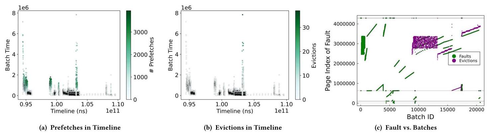

Figure 17: Batch profiles and fault behavior of HPGMG with about 25% oversubscription.

> 
图17：HPGMG 在约25%超额订阅下的批处理剖析与缺页行为。

Prefetching and Eviction. Prefetching and eviction are UVM-specific features that improve performance and provide additional programmer flexibility, respectively. Eviction creates levels of performance per VABlock evicted. More cost-effective oversubscription requires optimization independent of host OS problems as the underlying performance issues stem from algorithmic issues and user applications, not host OS interference. However, the combined OS and eviction costs are exceedingly high.

> 
预取与驱逐。预取和驱逐分别是 UVM 特有的功能，各自用于提升性能和提供额外的程序员灵活性。驱逐会针对每个被换出的 VABlock 产生不同的性能级别。更具成本效益的超额订阅需要独立于主机操作系统问题进行优化，因为底层性能问题源于算法问题和用户应用程序，而非主机操作系统的干扰。然而，操作系统与驱逐的综合成本极其高昂。

Prefetching is effective because it eliminates large numbers of batches and their associated overhead. However, prefetching cannot mitigate batches with high DMA and CPU unmapping overhead, increasing the impact of these costs in real workloads. Because prefetching is constrained to within VABlock, it cannot eliminate or preempt these high-cost batches. Methods, such as increasing the prefetching scope to more than one allocation and asynchronous prefetching, could mitigate these issues but may also complicate eviction. These two features must be codeveloped for devices that implement both.

> 
预取之所以有效，是因为它消除了大量的批次及其相关开销。然而，预取无法减少那些具有高昂 DMA 和 CPU 取消映射开销的批次，这反而加剧了这些开销在实际工作负载中的影响。由于预取被限制在 VABlock 范围之内，它无法消除或提前处理这些高成本批次。诸如将预取范围扩大到多个分配以及采用异步预取等方法，或许可以缓解这些问题，但同时也可能使回收过程变得复杂。对于同时实现这两者的设备，这两项功能必须协同开发。

Applicability to Other UVM-like Implementations. In general, findings presented in this work should reflect similarly designed hardware/software systems, particularly for other device drivers that will serve as backends for HMM. First, we expect other systems would take a batching approach as this is an effective optimization, making our findings regarding batches, duplicates, and batch sizes generally applicable. These design decisions are critical to the overall performance, as the system software overhead, instead of the hardware data transfer time, is the dominant cost. Second, any functionality invoking the Linux kernel is prone to generating high software overhead because the kernel is not designed to process complex operations such as random page unmapping for VABlocks with real-time performance. Finally, our findings regarding fault origin distribution indicate that there is room for system architects to explore driver parallelism and load balancing complying with the VABlock-based execution order. With appropriate load-balancing in fault servicing, parallelism could potentially hide the latency of some system-side operations and allow faster bulk fault servicing.

> 
对其他类似UVM实现的适用性。总的来说，本文提出的发现应能反映设计相似的硬件/软件系统，尤其是作为HMM后端的其他设备驱动。首先，我们预期其他系统会采用批处理方式，因为这是一种有效的优化手段，因此我们关于批次、重复项和批次大小的发现具有普遍适用性。这些设计决策对整体性能至关重要，因为系统软件开销（而非硬件数据传输时间）是主要成本。其次，任何调用Linux内核的功能都容易产生较高的软件开销，因为内核并非为实时处理诸如VABlock的随机页面解除映射等复杂操作而设计。最后，我们对故障来源分布的发现表明，系统架构师仍有空间探索符合基于VABlock执行顺序的驱动并行性与负载均衡。若能在故障服务中实现适当的负载均衡，并行性有望隐藏某些系统端操作的延迟，并实现更快的批量故障服务。

## ACKNOWLEDGEMENTS

This work is supported in part by the U.S. National Science Foundation under Grants CCF-1551511 and CNS-1551262. Any opinions, findings, and conclusions or recommendations expressed in this material are those of the author and do not necessarily reflect the views of the National Science Foundation.

> 
本研究部分受美国国家科学基金会（U.S. National Science Foundation）资助，项目编号为CCF-1551511和CNS-1551262。本文所表达的任何观点、发现、结论或建议均为作者个人观点，并不一定代表美国国家科学基金会的立场。

## REFERENCES

[1] [n.d.]. High Performance Geometric Multigrid. Retrieved July 13, 2021 from "https://crd.lbl.gov/departments/computer-science/par/research/hpgmg/"

> 
[1] [出版年份不详]. 高性能几何多重网格. 检索于2021年7月13日, 来自 "https://crd.lbl.gov/departments/computer-science/par/research/hpgmg/"

[2] Tyler Allen and Rong Ge. 2021. Demystifying GPU UVM Cost with Deep Runtime and Workload Analysis. In 2021 IEEE International Parallel and Distributed Processing Symposium (IPDPS). 141-150. https://doi.org/10.1109/IPDPS49936.2021.00023

> 
[2] Tyler Allen 和 Rong Ge. 2021. 通过深层运行时与工作负载分析揭秘 GPU UVM 开销. 收录于 2021 IEEE 国际并行与分布式处理研讨会 (IPDPS). 141-150. https://doi.org/10.1109/IPDPS49936.2021.00023

[3] Rachata Ausavarungnirun, Joshua Landgraf, Vance Miller, Saugata Ghose, Jayneel Gandhi, Christopher J. Rossbach, and Onur Mutlu. 2017. Mosaic: A GPU Memory Manager with Application-Transparent Support for Multiple Page Sizes. In Proceedings of the 50th Annual IEEE/ACM International Symposium on Microarchitecture (Cambridge, Massachusetts) (MICRO-50 '17). Association for Computing Machinery, New York, NY, USA, 136-150. https://doi.org/10.1145/312393.3123975

> 
[3] Rachata Ausavarungnirun, Joshua Landgraf, Vance Miller, Saugata Ghose, Jayneel Gandhi, Christopher J. Rossbach 和 Onur Mutlu. 2017. Mosaic: 一种支持应用透明的多页面尺寸GPU内存管理器. 收录于《第50届IEEE/ACM国际微架构研讨会年会论文集》(马萨诸塞州剑桥) (MICRO-50 '17). 美国计算机协会，纽约，NY，美国，136-150. https://doi.org/10.1145/312393.3123975

[4] T. Baruah, Y. Sun, A. T. Dinçer, S. A. Mojumder, J. L. Abellán, Y. Ukidave, A. Joshi, N. Rubin, J. Kim, and D. Kaeli. 2020. Griffin: Hardware-Software Support for Efficient Page Migration in Multi-GPU Systems. In 2020 IEEE International Symposium on High Performance Computer Architecture (HPCA). 596-609. https: //doi.org/10.1109/HPCA47549.2020.00055

> 
[4] T. Baruah, Y. Sun, A. T. Dinçer, S. A. Mojumder, J. L. Abellán, Y. Ukidave, A. Joshi, N. Rubin, J. Kim, and D. Kaeli. 2020. Griffin：多GPU系统中高效页面迁移的硬件-软件支持. 载于 2020年IEEE高性能计算机体系结构国际研讨会（HPCA）. 596-609. https: //doi.org/10.1109/HPCA47549.2020.00055

[5] Natalie Beams, Ahmad Abdelfattah, Stan Tomov, Jack Dongarra, Tzanio Kolev, and Yohann Dudouit. 2020. High-Order Finite Element Method using Standard and Device-Level Batch GEMM on GPUs. In 2020 IEEE/ACM 11th Workshop on Latest Advances in Scalable Algorithms for Large-Scale Systems (ScalA). 53-60. https://doi.org/10.1109/ScalA51936.2020.00012

> 
[5] Natalie Beams, Ahmad Abdelfattah, Stan Tomov, Jack Dongarra, Tzanio Kolev, and Yohann Dudouit. 2020. 在GPU上使用标准与设备级批量GEMM的高阶有限元方法。收录于2020年IEEE/ACM第11届大规模系统可扩展算法最新进展研讨会（ScalA）。第53-60页。https://doi.org/10.1109/ScalA51936.2020.00012

[6] D. A. Beckingsale, J. Burmark, R. Hornung, H. Jones, W. Killian, A. J. Kunen, O. Pearce, P. Robinson, B. S. Ryujin, and T. R. Scogland. 2019. RAJA: Portable Performance for Large-Scale Scientific Applications. In 2019 IEEE/ACM International Workshop on Performance, Portability and Productivity in HPC (P3HPC). 71-81. https://doi.org/10.1109/P3HPC49587.2019.00012

> 
[6] D. A. Beckingsale, J. Burmark, R. Hornung, H. Jones, W. Killian, A. J. Kunen, O. Pearce, P. Robinson, B. S. Ryujin, 和 T. R. Scogland. 2019. RAJA：大规模科学应用的可移植性能。见 2019 IEEE/ACM 高性能计算中的性能、可移植性与生产力国际研讨会 (P3HPC). 71-81. https://doi.org/10.1109/P3HPC49587.2019.00012

[7] Manuel Birke, Bobby Philip, Zhen Wang, and Mark Berrill. 2019. Block-Relaxation Methods for 3D Constant-Coefficient Stencils on GPUs and Multicore CPUs. arXiv:1208.1975 [cs.DC]

> 
[7] Manuel Birke, Bobby Philip, Zhen Wang 和 Mark Berrill. 2019. 基于 GPU 和多核 CPU 的三维常系数模板的块松弛方法. arXiv:1208.1975 [cs.DC]

[8] H. Carter Edwards, Christian R. Trott, and Daniel Sunderland. 2014. Kokkos. J. Parallel Distrib. Comput. 74, 12 (Dec. 2014), 3202-3216. https://doi.org/10.1016/j.jpdc.2014.07.003

> 
[8] H. Carter Edwards, Christian R. Trott, 和 Daniel Sunderland. 2014. Kokkos.《并行与分布式计算杂志》74, 12 (2014年12月), 3202-3216. https://doi.org/10.1016/j.jpdc.2014.07.003

[9] Sharan Chetlur, Cliff Woolley, Philippe Vandermersch, Jonathan Cohen, John Tran, Bryan Catanzaro, and Evan Shelhamer. 2014. cuDNN: Efficient Primitives for Deep Learning. ArXiv abs/1410.0759 (2014).

> 
[9] Sharan Chetlur, Cliff Woolley, Philippe Vandermersch, Jonathan Cohen, John Tran, Bryan Catanzaro 和 Evan Shelhamer. 2014. cuDNN: Efficient Primitives for Deep Learning. ArXiv abs/1410.0759 (2014).

[10] Steven Chien, Ivy Peng, and Stefano Markidis. 2019. Performance Evaluation of Advanced Features in CUDA Unified Memory. 2019 IEEE/ACM Workshop on Memory Centric High Performance Computing (MCHPC) (Nov 2019). https: //doi.org/10.1109/mchpc49590.2019.00014

> 
[10] Steven Chien, Ivy Peng, 和 Stefano Markidis. 2019. CUDA 统一内存高级特性性能评估. 2019 IEEE/ACM 以内存为中心的高性能计算研讨会 (MCHPC) (2019年11月). https: //doi.org/10.1109/mchpc49590.2019.00014

[11] Linux Kernel Development Community. [n.d.]. Heterogeneous Memory Management (HMM). Retrieved May 25, 2021 from https://www.kernel.org/doc/html/ latest/vm/hmm.html

> 
[11] Linux内核开发社区. [未注明日期]. 异构内存管理（HMM）. 检索于2021年5月25日，来自 https://www.kernel.org/doc/html/latest/vm/hmm.html

[12] Tom Deakin, James Price, Matt Martineau, and Simon McIntosh-Smith. 2016. GPU-STREAM v2.0: Benchmarking the Achievable Memory Bandwidth of Many-Core Processors Across Diverse Parallel Programming Models. In High Performance Computing, Michela Taufer, Bernd Mohr, and Julian M. Kunkel (Eds.). Springer International Publishing, Cham, 489-507.

> 
[12] Tom Deakin, James Price, Matt Martineau, 与 Simon McIntosh-Smith. 2016. GPU-STREAM v2.0: 跨多种并行编程模型对众核处理器可达到的内存带宽进行基准测试. 收录于《高性能计算》, Michela Taufer, Bernd Mohr, 与 Julian M. Kunkel (编). Springer International Publishing, Cham, 489-507.

[13] Jack Dongarra, Michael A Heroux, and Piotr Luszczek. 2016. High-performance conjugate-gradient benchmark: A new metric for ranking high-performance computing systems. The International Journal of High Performance Computing Applications 30, 1 (2016), 3-10. https://doi.org/10.1177/1094342015593158 arXiv:https://doi.org/10.1177/1094342015593158

> 
[13] Jack Dongarra, Michael A Heroux, 与 Piotr Luszczek. 2016. 高性能共轭梯度基准：一种用于高性能计算系统排名的全新度量标准. 《国际高性能计算应用期刊》 30, 1 (2016), 3-10. https://doi.org/10.1177/1094342015593158 arXiv:https://doi.org/10.1177/1094342015593158

[14] Debashis Ganguly, Ziyu Zhang, Jun Yang, and Rami Melhem. 2019. Interplay Between Hardware Prefetcher and Page Eviction Policy in CPU-GPU Unified Virtual Memory. In Proceedings of the 46th International Symposium on Computer Architecture (Phoenix, Arizona) (ISCA '19). ACM, New York, NY, USA, 224-235. https://doi.org/10.1145/3307650.3322224

> 
[14] Debashis Ganguly, Ziyu Zhang, Jun Yang, and Rami Melhem. 2019. CPU-GPU统一虚拟内存中硬件预取器与页面淘汰策略的相互作用. 载于《第46届国际计算机体系结构研讨会论文集》(亚利桑那州凤凰城) (ISCA '19). ACM, 美国纽约州纽约市, 224-235. https://doi.org/10.1145/3307650.3322224

[15] Debashis Ganguly, Ziyu Zhang, Jun Yang, and Rami Melhem. 2020. Adaptive Page Migration for Irregular Data-intensive Applications under GPU Memory Oversubscription. In 2020 IEEE International Parallel and Distributed Processing Symposium (IPDPS). IEEE. https://doi.org/10.1109/ipdps47924.2020.00054

> 
[15] Debashis Ganguly、Ziyu Zhang、Jun Yang和Rami Melhem. 2020. 《GPU内存超订下不规则数据密集型应用的自适应页面迁移》. 收录于《2020年IEEE国际并行与分布式处理研讨会(IPDPS)》. IEEE. https://doi.org/10.1109/ipdps47924.2020.00054

[16] R. Gayatri, K. Gott, and J. Deslippe. 2019. Comparing Managed Memory and ATS with and without Prefetching on NVIDIA Volta GPUs. In 2019 IEEE/ACM Performance Modeling, Benchmarking and Simulation of High Performance Computer Systems (PMBS). 41-46.

> 
[16] R. Gayatri, K. Gott 和 J. Deslippe. 2019. 比较在有和无预取下NVIDIA Volta GPU上的托管内存与ATS。见2019年IEEE/ACM高性能计算机系统性能建模、基准测试与仿真会议（PMBS）。41-46。

[17] Prasun Gera, Hyojong Kim, Piyush Sao, Hyesoon Kim, and David Bader. 2020. Traversing Large Graphs on GPUs with Unified Memory. Proc. VLDB Endow. 13, 7 (March 2020), 1119-1133. https://doi.org/10.14778/3384345.3384358

> 
[17] Prasun Gera, Hyojong Kim, Piyush Sao, Hyesoon Kim 与 David Bader. 2020. 基于统一内存的GPU大规模图遍历. *Proc. VLDB Endow.* 13, 7 (2020年3月), 1119-1133. https://doi.org/10.14778/3384345.3384358

[18] Yongbin Gu, Wenxuan Wu, Yunfan Li, and Lizhong Chen. 2020. UVMBench: A Comprehensive Benchmark Suite for Researching Unified Virtual Memory in GPUs. arXiv:2007.09822.

> 
[18] Yongbin Gu, Wenxuan Wu, Yunfan Li 和 Lizhong Chen. 2020. UVMBench: 用于研究GPU统一虚拟内存的综合基准测试套件. arXiv:2007.09822. 本文研究了NVIDIA统一虚拟内存（UVM）在GPU加速计算中的性能开销，并确定了页面错误生成、驱动程序负载以及主机操作系统交互中的根本原因。通过对UVM驱动程序进行深入的架构分析和插桩，作者量化了错误批处理、处理成本以及预取和内存过量使用的影响。主要贡献包括揭示了GPU错误生成的硬件限制（每个μTLB最多56个未完成错误，速率限制），证明数据传输并非主要成本——软件管理开销（如CPU页面取消映射、DMA映射）要大得多，并表明错误路径上的主机操作系统操作会引入显著延迟，有时会因多线程而加剧。预取大幅减少了批处理数量，但无法消除与操作系统交互相关联的高成本批处理。研究得出结论，驱动程序串行化和主机操作系统参与是主要瓶颈，这些见解可扩展到未来的异构内存管理（HMM）系统，其中类似的批处理和内核级成本将会出现。优化应侧重于减少批处理开销、并行化错误处理以及最小化同步操作系统调用。

[19] Michael A. Heroux, Roscoe A. Bartlett, Vicki E. Howle, Robert J. Hoekstra, Jonathan J. Hu, Tamara G. Kolda, Richard B. Lehoucq, Kevin R. Long, Roger P. Pawlowski, Eric T. Phipps, Andrew G. Salinger, Heidi K. Thornquist, Ray S. Tu-minaro, James M. Willenbring, Alan Williams, and Kendall S. Stanley. 2005. An Overview of the Trilinos Project. ACM Trans. Math. Softw. 31, 3 (Sept. 2005), 397-423. https://doi.org/10.1145/1089014.1089021

> 
[19] Michael A. Heroux、Roscoe A. Bartlett、Vicki E. Howle、Robert J. Hoekstra、Jonathan J. Hu、Tamara G. Kolda、Richard B. Lehoucq、Kevin R. Long、Roger P. Pawlowski、Eric T. Phipps、Andrew G. Salinger、Heidi K. Thornquist、Ray S. Tu-minaro、James M. Willenbring、Alan Williams 和 Kendall S. Stanley。2005 年。《Trilinos 项目概述》。《ACM 数学软件学报》31，3（2005 年 9 月），397–423。https://doi.org/10.1145/1089014.1089021

[20] John Hubbard and Jerome Glisee. 2017. GPUs: HMM: Heterogeneous Memory Management. https://www.redhat.com/files/summit/session-assets/2017/ S104078-hubbard.pdf

> 
[20] John Hubbard 和 Jerome Glisee. 2017. GPU：HMM：异构内存管理. https://www.redhat.com/files/summit/session-assets/2017/ S104078-hubbard.pdf

[21] Hyojong Kim, Jaewoong Sim, Prasun Gera, Ramyad Hadidi, and Hyesoon Kim. 2020. Batch-Aware Unified Memory Management in GPUs for Irregular Workloads. In Proceedings of the Twenty-Fifth International Conference on Architectural Support for Programming Languages and Operating Systems. ACM. https://doi.org/10.1145/3373376.3378529

> 
[21] Hyojong Kim, Jaewoong Sim, Prasun Gera, Ramyad Hadidi 和 Hyesoon Kim. 2020. 面向不规则工作负载的 GPU 批量感知统一内存管理. 见《第二十五届编程语言与操作系统架构支持国际会议论文集》。ACM. https://doi.org/10.1145/3373376.3378529

[22] Marcin Knap and Pawel Czarnul. 2019. Performance evaluation of Unified Memory with prefetching and oversubscription for selected parallel CUDA applications on NVIDIA Pascal and Volta GPUs. The Journal of Supercomputing 75 (Nov. 2019), 7625-7645. https://doi.org/10.1007/s11227-019-02966-8

> 
[22] Marcin Knap 和 Pawel Czarnul. 2019. 针对选定并行CUDA应用在NVIDIA Pascal与Volta GPU上统一内存预取与超额订阅的性能评估. 《超级计算杂志》75卷 (2019年11月), 7625-7645. https://doi.org/10.1007/s11227-019-02966-8

[23] R. Landaverde, Tiansheng Zhang, A. K. Coskun, and M. Herbordt. 2014. An investigation of Unified Memory Access performance in CUDA. In 2014 IEEE High Performance Extreme Computing Conference (HPEC). 1-6.

> 
[23] R. Landaverde, Tiansheng Zhang, A. K. Coskun, 和 M. Herbordt. 2014. CUDA中统一内存访问性能的调查. 见 2014 IEEE高性能极限计算会议 (HPEC). 1-6.

[24] Sheng Lin, Ning Liu, Mahdi Nazemi, Hongjia Li, Caiwen Ding, Yanzhi Wang, and Massoud Pedram. 2018. FFT-based deep learning deployment in embedded systems. In 2018 Design, Automation Test in Europe Conference Exhibition (DATE). 1045-1050. https://doi.org/10.23919/DATE.2018.8342166

> 
[24] Sheng Lin, Ning Liu, Mahdi Nazemi, Hongjia Li, Caiwen Ding, Yanzhi Wang, and Massoud Pedram. 2018. 嵌入式系统中基于FFT的深度学习部署. 载于2018年欧洲设计、自动化与测试会议暨展览(DATE). 1045-1050. https://doi.org/10.23919/DATE.2018.8342166

[25] K. V. Manian, A. A. Ammar, A. Ruhela, C.-H. Chu, H. Subramoni, and D. K. Panda. 2019. Characterizing CUDA Unified Memory (UM)-Aware MPI Designs on Modern GPU Architectures. In Proceedings of the 12th Workshop on General Purpose Processing Using GPUs (Providence, RI, USA) (GPGPU '19). ACM, New York, NY, USA, 43-52. https://doi.org/10.1145/3300053.3319419

> 
[25] K. V. Manian, A. A. Ammar, A. Ruhela, C.-H. Chu, H. Subramoni, and D. K. Panda. 2019. 现代GPU架构下CUDA统一内存感知MPI设计的表征研究. 收录于第12届通用图形处理器应用研讨会 (普罗维登斯，罗德岛州，美国) (GPGPU '19). ACM, 纽约，纽约州，美国，43-52. https://doi.org/10.1145/3300053.3319419

[26] Seung Won Min, Vikram Sharma Mailthody, Zaid Qureshi, Jinjun Xiong, Eiman Ebrahimi, and Wen mei Hwu. 2020. EMOGI: Efficient Memory-access for Out-of-memory Graph-traversal In GPUs. arXiv:2006.06890.

> 
[26] Seung Won Min, Vikram Sharma Mailthody, Zaid Qureshi, Jinjun Xiong, Eiman Ebrahimi 和 Wen mei Hwu. 2020. EMOGI: 面向 GPU 中内存不足图遍历的高效内存访问. arXiv:2006.06890.

[27] Saiful A. Mojumder, Yifan Sun, Leila Delshadtehrani, Yenai Ma, Trinayan Baruah, José L. Abellán, John Kim, David Kaeli, and Ajay Joshi. 2020. MGPU-TSM: A Multi-GPU System with Truly Shared Memory. arxiv:2008.02300.

> 
[27] Saiful A. Mojumder, Yifan Sun, Leila Delshadtehrani, Yenai Ma, Trinayan Baruah, José L. Abellán, John Kim, David Kaeli 和 Ajay Joshi. 2020. MGPU-TSM: 一种具有真正共享内存的多GPU系统. arxiv:2008.02300.

[28] J. M. Nadal-Serrano and M. Lopez-Vallejo. 2016. A Performance Study of CUDA UVM versus Manual Optimizations in a Real-World Setup: Application to a Monte Carlo Wave-Particle Event-Based Interaction Model. IEEE Transactions on Parallel and Distributed Systems 27, 6 (2016), 1579-1588.

> 
[28] J. M. Nadal-Serrano 和 M. Lopez-Vallejo. 2016. 在真实场景下对 CUDA 统一虚拟内存与手动优化进行的性能研究：在基于波粒相互作用蒙特卡罗事件模型中的应用. 《IEEE 并行与分布式系统汇刊》 27, 6 (2016), 1579-1588.

[29] NVIDIA. [n.d.]. Open GPU Documentation. Retrieved May 25, 2021 from https: //nvidia.github.io/open-gpu-doc/

> 
[29] NVIDIA. [未注明出版日期]. Open GPU Documentation. 检索于2021年5月25日，来自 https: //nvidia.github.io/open-gpu-doc/

[30] Steve Plimpton. 1995. Fast Parallel Algorithms for Short-Range Molecular Dynamics. J. Comput. Phys. 117, 1 (1995), 1-19. https://doi.org/10.1006/jcph.1995.1039 http://lammps.sandia.gov.

> 
[30] Steve Plimpton. 1995. 短程分子动力学的快速并行算法. 《计算物理杂志》117, 1 (1995), 1-19. https://doi.org/10.1006/jcph.1995.1039 http://lammps.sandia.gov.

[31] Steve Plimpton. 2017. FFTs for (mostly) Particle Codes within the DOE Exascale Computing Program. "https://www.osti.gov/servlets/purl/1483229"

> 
[31] Steve Plimpton. 2017. 在DOE百亿亿次计算计划中针对（大部分）粒子代码的快速傅里叶变换。"https://www.osti.gov/servlets/purl/1483229"

[32] Nikolay Sakharnykh. 2016. High-Performance Geometric Multi-Grid with GPU Acceleration. Retrieved May 25, 2021 from https://developer.nvidia.com/blog/ high-performance-geometric-multi-grid-gpu-acceleration/

> 
[32] Nikolay Sakharnykh. 2016. 基于GPU加速的高性能几何多重网格。2021年5月25日检索自 https://developer.nvidia.com/blog/ high-performance-geometric-multi-grid-gpu-acceleration/

[33] Nikolay Sakharnykh. 2019. Memory Management on Modern GPU Architectures. https://developer.download.nvidia.com/video/gputechconf/gtc/2019/ presentation/s9727-memory-management-on-modern-gpu-architectures.pdf

> 
[33] Nikolay Sakharnykh. 2019. 现代GPU架构上的内存管理. https://developer.download.nvidia.com/video/gputechconf/gtc/2019/ presentation/s9727-memory-management-on-modern-gpu-architectures.pdf

[34] Jaewook Shin, Mary W. Hall, Jacqueline Chame, Chun Chen, Paul F. Fischer, and Paul D. Hovland. 2010. Speeding up Nek5000 with Autotuning and Specialization. In Proceedings of the 24th ACM International Conference on Supercomputing (Tsukuba, Ibaraki, Japan) (ICS '10). Association for Computing Machinery, New York, NY, USA, 253-262. https://doi.org/10.1145/1810085.1810120

> 
[34] Jaewook Shin, Mary W. Hall, Jacqueline Chame, Chun Chen, Paul F. Fischer, 和 Paul D. Hovland. 2010. 通过自动调优与特化加速 Nek5000. 收录于《第24届ACM国际超级计算大会论文集》(日本茨城县筑波市) (ICS '10). 美国计算机协会, 纽约, 美国, 253-262. https://doi.org/10.1145/1810085.1810120

[35] Stanimire Tomov, Azzam Haidar, Daniel Schultz, and Jack Dongarra. 2018. Evaluation and Design of FFT for Distributed Accelerated Systems. ECP WBS 2.3.3.09 Milestone Report FFT-ECP ST-MS-10-1216. Innovative Computing Laboratory, University of Tennessee. revision 10-2018.

> 
[35] Stanimire Tomov, Azzam Haidar, Daniel Schultz 和 Jack Dongarra. 2018. Evaluation and Design of FFT for Distributed Accelerated Systems. ECP WBS 2.3.3.09 Milestone Report FFT-ECP ST-MS-10-1216. Innovative Computing Laboratory, University of Tennessee. revision 10-2018.

[36] Q. Yu, B. Childers, L. Huang, C. Qian, H. Guo, and Z. Wang. 2020. Coordinated Page Prefetch and Eviction for Memory Oversubscription Management in GPUs. 472-482. https://doi.org/10.1109/IPDPS47924.2020.00056

> 
[36] Q. Yu, B. Childers, L. Huang, C. Qian, H. Guo, and Z. Wang. 2020. Coordinated Page Prefetch and Eviction for Memory Oversubscription Management in GPUs. 472-482. https://doi.org/10.1109/IPDPS47924.2020.00056

[37] Qi Yu, Bruce Childers, Libo Huang, Cheng Qian, and Zhiying Wang. 2019. A quantitative evaluation of unified memory in GPUs. The Journal of Supercomputing 76, 4 (nov 2019), 2958-2985. https://doi.org/10.1007/s11227-019-03079-y

> 
[37] Qi Yu, Bruce Childers, Libo Huang, Cheng Qian, and Zhiying Wang. 2019. A quantitative evaluation of unified memory in GPUs. *The Journal of Supercomputing* 76, 4 (nov 2019), 2958–2985. https://doi.org/10.1007/s11227-019-03079-y

[38] Q. Yu, B. Childers, L. Huang, C. Qian, and Z. Wang. 2020. HPE: Hierarchical Page Eviction Policy for Unified Memory in GPUs. IEEE Transactions on Computer-Aided Design of Integrated Circuits and Systems 39, 10 (2020), 2461-2474. https: //doi.org/10.1109/TCAD.2019.2944790

> 
[38] Q. Yu, B. Childers, L. Huang, C. Qian, 和 Z. Wang. 2020. HPE：面向GPU统一内存的层次化页面淘汰策略. IEEE Transactions on Computer-Aided Design of Integrated Circuits and Systems 39, 10 (2020), 2461-2474. https://doi.org/10.1109/TCAD.2019.2944790

[39] T. Zheng, D. Nellans, A. Zulfiqar, M. Stephenson, and S. W. Keckler. 2016. Towards high performance paged memory for GPUs. In 2016 IEEE International Symposium on High Performance Computer Architecture (HPCA). 345-357.

> 
[39] T. Zheng, D. Nellans, A. Zulfiqar, M. Stephenson 和 S. W. Keckler. 2016. 面向 GPU 的高性能分页内存探索. 见 2016 年 IEEE 国际高性能计算机体系结构研讨会 (HPCA). 345-357.

## Appendix: Artifact Description/Artifact Evaluation

## SUMMARY OF THE EXPERIMENTS REPORTED

All experiments in this work are performed on a Titan V GPU with 12GB HBM2 memory using CUDA 11.2 and NVIDIA Driver version 460.27.04 on Fedora 33, kernel 5.9.16-200.fc33.x86_64. The system has an AMD Epyc 7551P 32-Core CPU with 128GB of memory.

> 
本文中的所有实验均在配备 12GB HBM2 显存的 Titan V GPU 上完成，使用 CUDA 11.2 和 NVIDIA 驱动版本 460.27.04，运行于 Fedora 33 系统，内核版本为 5.9.16-200.fc33.x86_64。该系统搭载一块 AMD Epyc 7551P 32 核 CPU，配备 128GB 内存。

Author-Created or Modified Artifacts:

> 
作者创建或修改的工件：

Persistent ID:

> 
持久化ID：

$\hookrightarrow$ https://zenodo.org/badge/latestdoi/356388244 Artifact name: Instrumented Driver, Experiments, and $\hookrightarrow$ Evaluation Tool

> 
$\hookrightarrow$ https://zenodo.org/badge/latestdoi/356388244 构件名称：插桩驱动、实验与 $\hookrightarrow$ 评估工具

Citation of artifact: Tyler Allen. (2021).

> 
引用说明：Tyler Allen. (2021).

$\hookrightarrow$ tallendev/uvm-eval: SC2021-Artifact (v0.1).

> 
$\hookrightarrow$ tallendev/uvm-eval: SC2021-Artifact (v0.1).

- Zenodo. https://doi.org/10.5281/zenodo.5148930

> 
- Zenodo. https://doi.org/10.5281/zenodo.5148930

## BASELINE EXPERIMENTAL SETUP, AND MODIFICATIONS MADE FOR THE PAPER

Relevant hardware details: Titan V GPU, MD Epyc 7551P 32-Core CPU, 128GB DDR4

> 
相关硬件细节：Titan V GPU，MD Epyc 7551P 32核CPU，128GB DDR4

Operating systems and versions: Fedora 33 running 5.9.16- 200.fc33.x86_64, CUDA 11.2, and NVIDIA Driver version 460.27.04

> 
操作系统及版本：Fedora 33，运行内核 5.9.16-200.fc33.x86_64，CUDA 11.2，以及 NVIDIA 驱动程序版本 460.27.04

Compilers and versions: GCC 10.2.1 and NVCC cuda_11.2.r11.2/compiler.29373293_0

> 
编译器及版本：GCC 10.2.1 与 NVCC cuda_11.2.r11.2/compiler.29373293_0

Applications and versions: HPGMG-FV 0.3, UVM-modified CUDA BabelStream, SGEMM-CUBLAS, and Several Synthetic Kernels

> 
应用程序及版本：HPGMG-FV 0.3、经 UVM 修改的 CUDA BabelStream、SGEMM-CUBLAS 以及若干合成内核

Libraries and versions: CUBLAS 11.2

> 
库和版本：CUBLAS 11.2

URL to output from scripts that gathers execution environment information.

> 
收集执行环境信息的脚本的输出 URL。

https://github.com/tallendev/uvm-eval/blob/master/Au_ $\hookrightarrow$ thorKit.txt

> 
本文研究了 NVIDIA 统一虚拟内存（UVM）在 GPU 加速计算中的性能开销，并找出了缺页生成、驱动程序工作负载以及主机操作系统交互方面的根本原因。通过对 UVM 驱动程序的深度架构分析和插桩，作者量化了缺页批处理、处理成本以及预取和内存超额订阅的影响。关键贡献包括：揭示了 GPU 缺页生成的硬件限制（每个微 TLB 最多 56 个未完成缺页，速率限制），证明了数据传输并非主要开销——软件管理开销（例如，CPU 页面解除映射、DMA 映射）要大得多——并表明缺页路径上的主机操作系统操作会引入显著的延迟，有时还会因多线程而加剧。预取大幅减少了批处理数量，但无法消除与操作系统交互相关的高成本批次。该研究得出结论，驱动程序序列化和主机操作系统参与是主要瓶颈，这些见解也适用于未来的异构内存管理（HMM）系统，在这些系统中，类似的批处理和内核级成本将会出现。优化应侧重于减少批处理开销、并行化缺页处理以及最小化同步操作系统调用。
