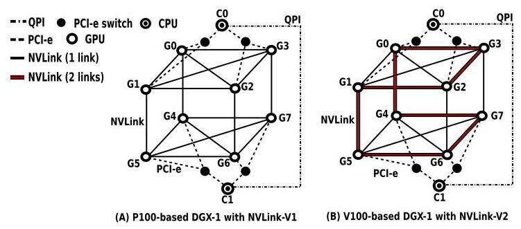
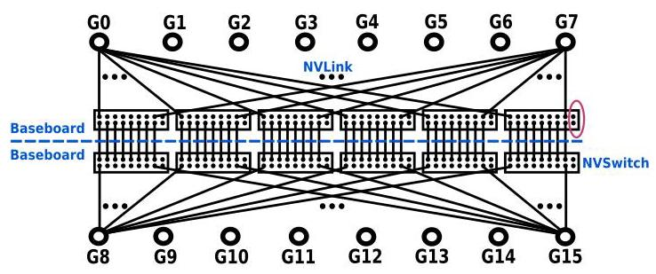
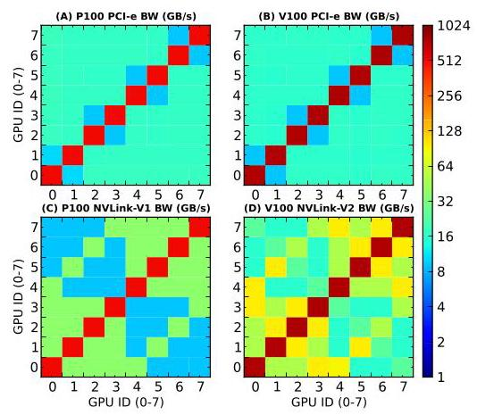
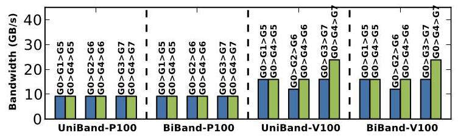
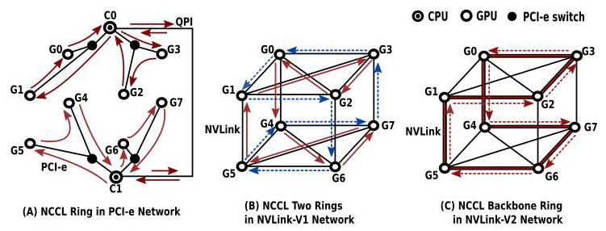
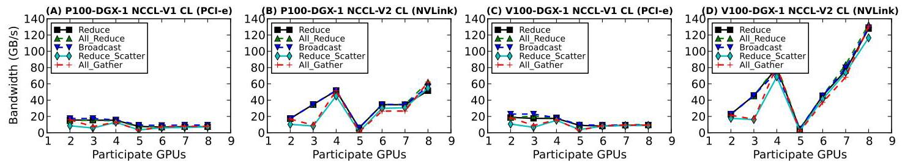
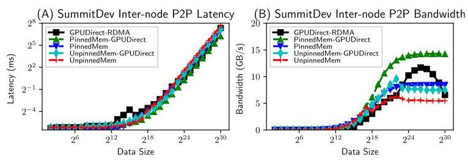
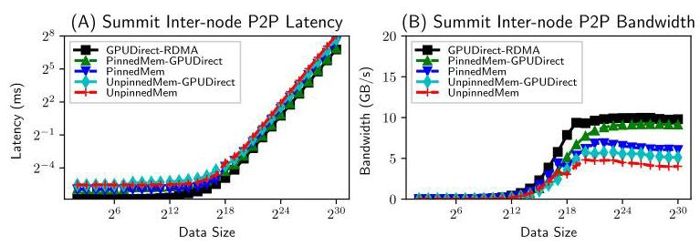
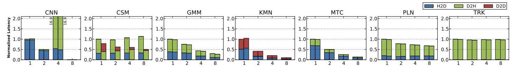
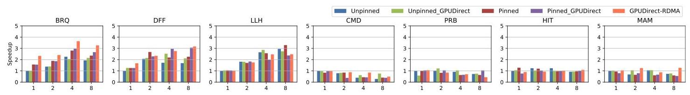

# Evaluating Modern GPU Interconnect: PCIe, NVLink, NV-SLI, NVSwitch and GPUDirect 深度解读

> **作者**：Ang Li, Shuaiwen Leon Song, Jieyang Chen, Jiajia Li, Xu Liu, Nathan R. Tallent, Kevin J. Barker  
> **会议/期刊**：IEEE Transactions on Parallel and Distributed Systems (TPDS), 2019  
> **一句话总结**：这篇论文用 Tartan Benchmark Suite 在六类高端 GPU 平台上系统评测 PCIe、NVLink-V1/V2、NV-SLI、NVSwitch 和 GPUDirect-RDMA，指出现代 GPU 互连的性能不是简单的“带宽越高越好”，而是强烈受拓扑、路由、消息大小、通信库实现和应用编程模型共同制约。

## 一、问题定义

这是一篇偏 First 类型的系统评测工作：它不是提出一个新的互连硬件或通信库，而是在多 GPU 编程模型尚不成熟、NVLink/NVSwitch/GPUDirect 等技术快速进入生产系统时，首次把多种现代 GPU 互连放在同一套基准、同一类指标和真实应用场景下做系统剖析。论文要回答的问题很直接：在单机 scale-up 和多机 scale-out 场景中，现代 GPU 到底是怎样互连的，这些互连的真实性能边界在哪里，它们会怎样影响多 GPU 应用。

作者给出的背景很强：多 GPU 已经成为深度学习、大数据和大规模模拟的基础形态。论文开头举了两个例子，一是 Sony 使用 3,456 个 GPU 在 224 秒内完成 ImageNet/ResNet-50 训练，二是 CSCS 使用 4,888 个 GPU 做近全球 1 km 分辨率气候模拟。这类系统的扩展方向有两个：单节点内通过 DGX-1/DGX-2 这样的机器 scale-up，跨节点通过 Summit/Sierra 这样的超级计算机 scale-out。但应用要真正从扩展中受益，不能只知道“有 NVLink”或“有 GPUDirect”，还必须知道通信路径、拓扑 NUMA、集体通信算法和应用数据流是否匹配。

**动机评估**：动机是 solid 的。论文没有把“新互连更快”当作结论，而是指出当时社区缺少可操作的性能知识：NVLink、NVSwitch、NV-SLI 和 GPUDirect 的原始延迟、带宽、拓扑、路由、消息大小敏感性、collective 行为以及应用级影响都不清楚。评测对象覆盖 P100-DGX-1、V100-DGX-1、DGX-2、RTX2080 SLI、SummitDev、Summit 六个平台，实验规模和硬件多样性足以支撑其问题的重要性。

**核心 Insight**：现代 GPU 互连的关键不只是链路峰值带宽，而是“互连拓扑 + 通信库映射 + 应用通信模式”三者能否对齐。论文最有价值的观察是：单点 P2P 微基准能揭示很多 NUMA 和路由差异，但这些差异未必自动转化为应用 speedup；如果应用仍是 CPU-master/GPU-slave 模式，NVLink 的 GPU-GPU 带宽优势可能被 H2D/D2H 通信和 CPU 控制路径吞掉。反过来，在跨节点 MPI scale-out 应用中，网络更容易成为瓶颈，因此 GPUDirect 和 pinned memory 更容易带来应用级收益。

Fig. 1 是理解全文的入口：PCIe 是树形路径，NVLink-V1 是 Hypercube Mesh，NVLink-V2 则在 Hypercube Mesh 上加入 backbone ring。后续 NUMA、routing、NCCL ring 的现象都可以从这张拓扑图推导出来。

## 二、相关工作

论文把相关工作分成两条线。第一类是 intra-node GPU computing，关注单节点多 GPU 内的 NUMA、数据移动、MPI 支持、自动划分和共享内存式编程。例如 Spafford 等人早期量化多 GPU NUMA 和 contention，Kim 等人提出用 HMC 构建 GPU memory network，Wang 等人做 GPU-aware MPI，Ben-Nun 和 Cabezas 等人分别从内存访问模式和编译/运行时角度处理多 GPU 划分。这些工作说明单节点多 GPU 早就存在通信和数据布局问题，但它们大多发生在 PCIe 主导的年代，缺少对 NVLink/NVSwitch 这类新互连拓扑的系统评测。

第二类是 multi-node GPU computing，主要围绕 MPI、RDMA 和 GPU cluster 通信。典型方向包括 MVAPICH2-GPU 这类 GPU-aware MPI，通信和计算 overlap 的硬件支持，exascale proxy applications 的通信模式匹配，以及面向深度学习框架的 broadcast/collective 优化。这些工作已经意识到跨节点通信抽象的重要性，但对 Summit/SummitDev 这样 GPUDirect-RDMA 真实平台的细粒度行为、消息大小敏感性和应用级收益仍然覆盖不足。

本文与这些工作的区别在于，它不是只优化一个通信原语或一个库，而是把硬件拓扑、微基准、collective、真实应用和讨论性结论连成完整评测链条。它的短板也来自这种定位：论文主要是经验性测量，没有给出新的自动调度器或性能模型，因此很多建议仍停留在“应当避免 5 GPU”“SummitDev 用 PinnedMem-GPUDirect 更好”这类人工规则层面。

## 三、技术挑战

**挑战 1：互连不是单一链路，而是异构网络。** 同一台机器里往往同时存在 PCIe、NVLink/NVSwitch、CPU socket 间互连和 IB 网络。DGX-1 里 PCIe 形成树，NVLink 形成 Hypercube Mesh；DGX-2 里 PCIe 仍是多级 switch 树，而 NVSwitch 是 16 GPU 的全互连 crossbar；Summit/SummitDev 还有节点内双 island 和节点间 InfiniBand。性能模型必须知道数据到底走哪条路径。

**挑战 2：NUMA 效应来自多种机制。** 传统 NUMA 多指“远比近慢”，但本文发现 PCIe bandwidth 上还有 anti-locality：共享同一个 PCIe switch 的近邻 GPU 反而比远端 GPU 带宽更低。NVLink 的 NUMA 则来自是否直连、直连是单 link 还是双 link，以及远端访问选择哪条 routing path。

**挑战 3：消息大小改变瓶颈位置。** 延迟在几十 KB 以内可能基本平坦，但带宽要到 MB 级才饱和。论文测得 DGX-1 上 NVLink P2P 带宽约在 4 MB 消息大小开始饱和；8 GPU collective 中 PCIe 大约 16 MB 饱和，而 NVLink 大约 256 MB 才饱和。只用小消息或只看峰值带宽都会误判互连的真实价值。

**挑战 4：通信库实现会制造新的性能形状。** NCCL 用 ring 算法做 collective，但 ring 如何映射到 PCIe tree、NVLink mesh、NVSwitch UMA 结构会直接影响带宽。论文观察到 NVSwitch 本身是 UMA，但 all_gather 和 reduce_scatter 在非 2/4/8/16 这类均衡 GPU 数时仍有带宽波动，这说明有些现象不是硬件拓扑造成的，而是 NCCL 实现策略造成的。

**挑战 5：应用编程模型可能掩盖硬件优势。** 很多 scale-up GPGPU 应用仍是 CPU 作为 master、GPU 作为 worker。即使 NVLink 的 GPU-GPU 通信明显快于 PCIe，应用如果主要做 H2D/D2H，整体性能也难以改善。作者在 50 多个候选多 GPU 应用中筛选 Tartan 应用时也发现，真正大量使用 GPU-GPU 通信的通用 GPGPU 程序并不多。

## 四、解决方案

### 整体思路

论文的“方案”是一套由微基准到应用基准的评测方法。作者用 Tartan Benchmark Suite 测量两类维度：一是互连本身的基本特性，包括 P2P/collective 的 startup latency、sustainable bandwidth、消息大小效率、拓扑和 NUMA；二是真实多 GPU 应用的整体性能影响，包括单节点 scale-up 中 NVLink/NCCL 对应用通信阶段的影响，以及跨节点 scale-out 中 GPUDirect-RDMA、pinned memory、unpinned memory 等方案对整体 speedup 的影响。

### 贯穿示例

可以把一台多 GPU 服务器想成一栋楼里的多个实验室。PCIe 像所有人都要经过楼层走廊和电梯；NVLink 像在部分实验室之间开了直达门；NVSwitch 像给每个实验室接入一个全交换大厅；GPUDirect-RDMA 则像跨楼送样品时允许快递员直接从实验室取货，不必先搬到前台。问题是，直达门多并不等于每次搬运都更快：如果你的流程规定所有样品必须先交给前台 CPU，再由前台分配，那么实验室之间的直达门就用不上；如果你选了一个拥堵的中转实验室，NVLink 的远端 route 也会慢；如果一次只搬很小的样品，启动成本可能比带宽更重要。

### 关键技术点

**1. 先把硬件拓扑显式化。** 论文在 Section 2 逐个解释 PCIe、NVLink-V1、NVLink-V2、NV-SLI、NVSwitch 和 GPUDirect-RDMA。这个部分不是背景填充，而是后续解释性能差异的因果基础。比如 V100-DGX-1 的 backbone ring 让部分 NVLink-V2 边具备双倍带宽；Summit/SummitDev 的 dual-island 结构意味着跨 island 通信要受 X-Bus 影响；DGX-2 的 NVSwitch 给任意两 GPU 提供 300 GB/s 的全带宽路径，即使跨 baseboard 多一个 switch hop，延迟差异也几乎可以忽略。

Fig. 3 展示了 DGX-2 的 NVSwitch 结构：两块 baseboard，每块有 6 个 NVSwitch 和 8 个 GPU，每个 V100 通过 6 条 NVLink 连接到 6 个 switch。它解释了为什么 NVSwitch 在 P2P 带宽上表现为 UMA，也解释了后文中“如果仍有 collective 带宽波动，根源更可能在 NCCL 而不是硬件拓扑”。

**2. 用 P2P 微基准拆解 NUMA。** 在 DGX-1 上，PCIe latency 基本没有 NUMA，但 bandwidth 出现 anti-locality；NVLink latency 和 bandwidth 都表现出邻居/远端差异。NVLink-V2 还额外表现出 neighbor 之间的单 link/双 link 差异，以及 remote routing path 的差异。具体数字上，NVLink 直连节点 latency 约 9 us，远端 routing 在 P100-DGX-1 上约增加到 2 倍，在 V100-DGX-1 上约增加到 3 倍；SLI 双 GPU 系统中 local、NV-SLI、PCIe 对端访问 latency 分别约为 5 us、8 us、13 us。

Fig. 7 的价值在于把“近邻不一定更快”可视化了：PCIe 的 2x2 block 显示共享同一 PCIe switch 的 GPU 反而带宽更低；NVLink-V2 的颜色差异则显示不同 link 数量和 routing path 造成的带宽 NUMA。对调度器来说，这意味着简单按拓扑距离选 GPU 可能是错的。

Fig. 14 进一步说明 routing 不是细枝末节。P100-DGX-1 的 NVLink-V1 链路同构，路径选择影响不大；V100-DGX-1 的 NVLink-V2 存在双带宽 backbone ring，因此 G0 到远端 GPU 经由不同中转节点会得到明显不同的带宽。

**3. 用消息大小曲线找带宽饱和点。** P2P 上，NVLink-V1/V2 的 unidirectional 和 bidirectional bandwidth 大约在 4 MB 消息大小饱和；latency 则在 P100-DGX-1 约 16 KB 内、V100-DGX-1 约 64 KB 内保持基本不变。collective 上，8 GPU PCIe 大约 16 MB 饱和，NVLink 大约 256 MB 饱和；SLI 两 GPU collective 大约 1 MB 饱和；跨节点 collective 大约 32/64 MB 饱和，并在 SummitDev/Summit 上分别接近 16/32 GB/s 峰值。

**4. 用 NCCL collective 检验拓扑与库实现的耦合。** NCCL 使用 ring 网络实现 broadcast、all_gather、reduce、all_reduce、reduce_scatter 等 collective。PCIe tree 上参与 GPU 越多，collective 带宽下降；NVLink mesh 上参与 GPU 越多，可用 link 越多，collective 带宽反而上升。V100-DGX-1 的 NVLink-V2 在 4 GPU 时比 NVLink-V1 约高 1.6x，在 8 GPU 时约高 2x，体现了双 link 和 backbone ring 的价值。

Fig. 18 把 NCCL ring 和硬件拓扑联系起来。PCIe ring 是在树上绕行，容易形成共享总线竞争；NVLink-V1 可以形成两个独立 ring；NVLink-V2 同时有快 ring 和慢 ring。这个图解释了为什么 collective 的性能趋势不能只从单条链路带宽推断。

Fig. 20 是本文最实用的 collective 结论之一：PCIe collective 带宽随 GPU 数增加而下降，NVLink 则整体上升，但 5 GPU 会出现明显瓶颈。作者给出的解释是，如果选择 G0-G4，G4 被隔离在 fully-connected upper-plane 之外，需要依赖 G0 做双向通信和 routing，于是 G0 成为拥塞点。因此，“选择几个 GPU”本身就是性能参数。

**5. 用 GPUDirect 实验区分代际差异。** SummitDev 上 GPUDirect-RDMA 并不总是最优：4 KB 到 64 KB latency、4 KB 到 256 KB bandwidth 区间表现最差，32 KB 尤其糟糕；大消息时 GPUDirect-RDMA 能到约 12 GB/s，但仍低于 PinnedMem-GPUDirect 的 14 GB/s 以上，而且 64 MB 之后带宽明显下降。Summit 则相反，GPUDirect-RDMA 总体 latency 最低、bandwidth 最高，尤其在小于等于 1 MB 的 latency 和大于等于 16 KB 的 bandwidth 上优势明显。

Fig. 28 和 Fig. 29 放在一起看，最重要的信息不是“GPUDirect 一定快”，而是同名技术在不同平台代际上可能完全不同。SummitDev 更适合 PinnedMem-GPUDirect，Summit 则更适合 GPUDirect-RDMA。

**6. 最后用应用基准验证硬件优势能否落到 end-to-end。** 单节点 scale-up 的结果比较克制：除了 CSM 和 GMM 等少数应用，大多数应用从 NVLink/NCCL 改写中没有得到显著整体收益。原因是它们原本就是 CPU-master/GPU-slave 模型，主要通信是 H2D/D2H，而不是 GPU-GPU。跨节点 scale-out 则更容易受益，因为 MPI 应用的网络路径更容易成为瓶颈，启用 GPUDirect 和 pinned memory 通常能带来收益。

Fig. 32 说明单节点 scale-up 的微基准优势很难自动进入应用层。CSM 中 D2H/H2D 被 D2D 替代后改善明显，但 KMN/MTC 等几乎没有 GPU-GPU 通信，NVLink 无法发挥作用。

Fig. 38 代表跨节点应用侧的另一面：当通信真正走 MPI/IB 网络并成为瓶颈时，GPUDirect-RDMA 更容易带来 end-to-end speedup。作者由此提出的方向不是单纯更换硬件，而是让 MPI、NCCL、GPU-triggered networking 等抽象更好地协同。

### 与已有方案的对比

相比只做硬件白皮书式规格说明，本文的优势在于它用同一套微基准和应用集跨多代平台比较，让读者看到拓扑差异如何变成延迟、带宽、消息大小和应用收益差异。相比单点优化论文，它的覆盖面更宽，能提出“PCIe anti-locality”“NVLink routing NUMA”“5 GPU collective 避免使用”“SummitDev 不宜盲用 GPUDirect-RDMA”这类可落地经验。

不足也明显：第一，论文依赖具体平台，结论有代际和实现绑定，例如 SummitDev 到 Summit 的 GPUDirect 行为已经大幅变化；第二，应用级结果的整体 speedup 数据被放到 supplementary file，正文只展示通信 latency breakdown，读者难以完整复核端到端收益；第三，它没有把观察转化为自动化调度策略或建模工具，只是指出需要 practical multi-GPU performance models。

## 五、实验评估

### 实验设定

平台覆盖六类硬件：P100-DGX-1，8 个 Tesla P100，NVLink-V1；V100-DGX-1，8 个 Tesla V100，NVLink-V2；DGX-2，16 个 V100，NVSwitch；双 RTX-2080 的 NV-SLI 系统；SummitDev，54 节点、每节点 4 个 P100；Summit，约 4,600 节点、每节点 6 个 V100。作者用 Tartan Microbenchmarks 测 scale-up P2P、scale-up collective、scale-out P2P 和 scale-out collective，并用 Tartan Benchmark Suite 的 14 个应用做应用级评测。

指标包括 startup latency、sustainable bandwidth、消息大小效率、NUMA pattern、routing 影响和应用整体 speedup。P2P 基准基于 CUDA SDK 的 p2pBandwidthLatencyTest；collective 基准基于 nccl-tests，PCIe intra-node 用 NCCL-V1，NVLink/NVSwitch/NV-SLI/IB 用 NCCL-V2；scale-out P2P 基准基于 MPI-GPU-BW。真实应用分为 7 个 scale-up 和 7 个 scale-out 应用，涵盖 CNN、GMM、Kmeans、Monte Carlo、PageRank、CoMD、Lulesh、Matvec 等。

### 主要实验与结论

**P2P latency/bandwidth**：PCIe latency 在 DGX-1 上基本无 NUMA，但 bandwidth 存在 anti-locality；NVLink latency 和 bandwidth 都存在 NUMA；NVSwitch 在 P2P 上基本 UMA；NV-SLI 双 GPU latency 约 8 us，优于 PCIe 对端访问约 13 us。V100-DGX-1 的 NVLink-V2 因 backbone ring 和双 link 出现更多 bandwidth 层级。

**Routing**：只有 DGX-1 上 NVLink 远端访问需要显式 routing。NVLink-V1 链路同构，路径差异不明显；NVLink-V2 因不同路径经过的双带宽 link 数不同，带宽差异明显，但 latency 变化不大。

**消息大小效率**：P2P NVLink 带宽在 4 MB 左右饱和；8 GPU collective 下 PCIe 约 16 MB 饱和，NVLink 约 256 MB 饱和；NV-SLI 两 GPU collective 约 1 MB 饱和；inter-node collective 在 32/64 MB 左右饱和。

**Intra-node collective**：startup latency 随参与 GPU 数近似线性增加。PCIe collective bandwidth 随 GPU 数增加而下降，NVLink 则因可用 link 变多而上升。NVLink-V2 在 4 GPU 和 8 GPU 上分别比 NVLink-V1 约高 1.6x 和 2x。但 3、5 这类不均衡参与数可能触发 NCCL ring 或拓扑瓶颈，5 GPU 尤其值得避免。

**NVSwitch collective**：NVSwitch 的 P2P 是 UMA，collective bandwidth 远高于 PCIe，尤其是 reduce、all_reduce、broadcast。但 reduce_scatter 和 all_gather 在 2、4、8、16 GPU 时较好，在其他参与数上有波动；由于 NVSwitch 本身 UMA，论文推断这更像 NCCL 实现问题。

**Inter-node P2P**：SummitDev 上 GPUDirect-RDMA 在中小消息区间表现差，大消息可到约 12 GB/s 但不如 PinnedMem-GPUDirect 的 14 GB/s 以上，并在 64 MB 后下降；Summit 上 GPUDirect-RDMA 则成为最佳方案，说明 GPUDirect 技术和平台集成从 SummitDev 到 Summit 有显著改进。

**Inter-node collective**：随着节点数从 2 到 8 增加，latency 和 bandwidth 总体较平坦，除了 SummitDev 上 all_reduce latency 变化更明显。all_gather 和 reduce_scatter 在 SummitDev 的 3、5 节点，以及 Summit 的 3、5、6、7 节点上出现低带宽。总体上，Summit 的跨节点 GPU 通信能力明显强于 SummitDev。

**应用级 scale-up**：NVLink/NCCL 对多数传统 GPGPU scale-up 应用的整体收益有限。核心原因不是 NVLink 不快，而是应用多数沿用 CPU-master/GPU-slave 模型，通信集中在 CPU-GPU，而不是 GPU-GPU。CSM、GMM 这样能把部分 H2D/D2H 转成 D2D 的应用才更容易受益。

**应用级 scale-out**：跨节点 MPI 应用更容易从更快网络受益。作者建议 SummitDev 上优先考虑 PinnedMem-GPUDirect，Summit 上优先考虑 GPUDirect-RDMA。启用 GPUDirect 和 pinned memory 通常有收益，但真正的瓶颈在编程抽象，例如 MPI 如何更自然地集成 NCCL，通信是否能由 GPU 侧触发。

### 结论支撑性分析

论文的核心结论有比较充分的证据链。拓扑差异由 Section 2 的硬件结构解释，NUMA 和 routing 由 Section 3.1 的矩阵热图和路径实验支持，NCCL 行为由 Section 3.2/3.4 的 collective 曲线支持，应用层限制由 Section 4 的 latency breakdown 支持。尤其是“微基准优势不等于应用 speedup”这一点，作者没有只凭推测，而是通过 Tartan 应用的 H2D/D2H/D2D breakdown 解释。

主要限制是应用级整体 performance speedup 放在 supplementary file，正文里端到端数据不够完整；另外所有结论都与当时的 NCCL、CUDA runtime、特定 GPU/CPU/IB 组合绑定。对今天的新 GPU 平台，这篇论文的方法论比具体数值更可复用。

## 六、附加洞察

**结论 1：PCIe 的 anti-locality 是一个调度器容易忽视的反直觉现象。**  
*出处*：Section 3.1.2，Fig. 6、Fig. 7、Fig. 12、Fig. 13。  
*推理链条*：作者先测 DGX-1 和 DGX-2 的 PCIe P2P bandwidth，发现共享同一 PCIe switch 的 GPU 反而带宽更低；再对比跨 socket 或更远路径，发现远端访问未必更差；最后把它命名为 anti-locality，并推测与 PCIe switch chip 内部物理信号路径不均衡有关。这个结论的薄弱处是原因解释主要依赖推测和引用资料，论文没有进一步做硬件级验证，但作为经验性调度规则很有价值。

**结论 2：NVSwitch 的 UMA 能消除硬件拓扑 NUMA，但不能消除通信库层面的波动。**  
*出处*：Section 3.1.1、3.1.2、3.2.3，Fig. 11、Fig. 12、Fig. 13、Fig. 25、Fig. 26。  
*推理链条*：P2P latency/bandwidth 中，NVSwitch one-hop 和 two-hop 基本对齐，说明硬件上接近 UMA；但 collective 中 all_gather/reduce_scatter 在部分 GPU 数下仍有带宽波动；由于硬件路径已经均匀，作者把原因指向 NCCL 实现。这个推理链条比较严密，因为它用 P2P 控制了硬件拓扑变量，再观察 collective 残余差异。

**结论 3：GPUDirect-RDMA 的正确使用策略随平台代际改变，不能从名称推断性能。**  
*出处*：Section 3.3、4.2，Fig. 28、Fig. 29、Fig. 36-39。  
*推理链条*：SummitDev 中 GPUDirect-RDMA 在中小消息表现差，大消息峰值也低于 PinnedMem-GPUDirect，并且 64 MB 后退化；Summit 中 GPUDirect-RDMA 则在 latency 和 bandwidth 上全面领先；应用级实验进一步显示 Summit 和 SummitDev 的推荐配置不同。因此结论不是“GPUDirect 好/不好”，而是“平台实现和系统集成决定 GPUDirect 是否值得直接使用”。

**结论 4：选择 GPU 数量本身就是优化参数。**  
*出处*：Section 3.2.1、3.2.3、3.4，Fig. 20、Fig. 26、Fig. 30、Fig. 31。  
*推理链条*：NVLink collective 在 5 GPU 时出现明显瓶颈，作者用 G4 依赖 G0 做通信和 routing 解释；NVSwitch 虽然 P2P UMA，但 9-15 GPU 的 all_gather/reduce_scatter 不如 2/4/8/16 这类均衡数量；跨节点 collective 也在 3、5、6、7 节点等数量上出现低带宽。因此调度器不能只问“最多可用几个 GPU”，还要问“这个数量是否适合集体通信算法和拓扑映射”。

## 七、总结与评价

这篇论文的核心贡献是把现代 GPU 互连从“产品规格”拉回到“可测、可解释、可指导调度和编程”的系统层面。它系统揭示了四类 GPU 通信网络 NUMA 现象：NVLink 的位置、连接、路由效应，以及 PCIe 的 anti-locality；同时说明了 NVSwitch 的 UMA、GPUDirect 的平台代际差异和 NCCL collective 的实现敏感性。

最大的亮点是报告了大量反直觉但工程上很关键的现象：近邻 PCIe 可能更慢，NVLink 远端路径要选 routing，5 GPU collective 可能很差，SummitDev 上 GPUDirect-RDMA 不如 pinned memory 路径。最大不足是它停在评测和建议层，没有给出自动化性能模型、GPU 选择策略或通信库改造方案；应用级端到端数据也不够集中展示。

对后续工作来说，这篇论文最有启发的方向是把这些经验转化为 runtime：GPU placement、collective algorithm selection、routing choice、message chunking、MPI/NCCL 协同和 GPU-side communication initiation 都应该由运行时根据拓扑和消息形态自动决策，而不是让应用开发者手工避坑。

## 八、章节脉络与段落速览

- **Section 1 · Introduction**：提出多 GPU scale-up/scale-out 的必要性，说明现有编程与性能模型缺少对新 GPU 互连的深刻理解，并概括本文主要发现。
  - **¶1**：用深度学习训练和气候模拟例子说明大规模 GPU 计算需求持续增长。
  - **¶2**：区分单节点 scale-up 和跨节点 scale-out，并给出 DGX-1/DGX-2、Summit/Sierra 等代表平台。
  - **¶3**：指出多 GPU 性能难以获得的两个原因：编程/性能模型不成熟，以及新 GPU 互连的真实性能影响未知。
  - **¶4**：说明本文评测对象、指标和目标，包括 PCIe、NVLink、NV-SLI、NVSwitch、GPUDirect 的 P2P 与 collective 行为。
  - **¶5-主要发现列表**：概括 intra-node P2P NUMA、intra-node collective、inter-node P2P/collective 和应用级结论。

- **Section 2 · Modern GPU Interconnect**：介绍六类互连技术及其平台拓扑，为后续性能差异提供结构性解释。
  - **2.1 · PCIe**：说明 PCIe 在 DGX-1/DGX-2 中是树形结构，并可能成为 CPU-GPU 和 GPU-GPU 通信瓶颈。
  - **2.2 · NVLink-V1**：解释 NVLink-V1 链路、P100 的 4 个 link slot、P100-DGX-1 Hypercube Mesh 和 SummitDev dual-island 拓扑。
  - **2.3 · NVLink-V2**：说明 V100 的 6 个 link slot、V100-DGX-1 backbone ring，以及 Summit 的 6 GPU dual-island 拓扑。
  - **2.4 · NVLink-SLI**：介绍 Turing RTX2080 上双 GPU NV-SLI 的 x8 NVLink-V2 桥接。
  - **2.5 · NVSwitch**：解释 DGX-2 中 16 GPU、12 个 NVSwitch、300 GB/s peer bandwidth 和 2.4 TB/s baseboard bisection。
  - **2.6 · InfiniBand with GPUDirect-RDMA**：说明 IB HCA 直接访问 GPU device memory 的机制，以及 SummitDev/Summit 均支持 GPUDirect-RDMA。

- **Section 3 · GPU Interconnect Microbenchmarking**：用 Tartan 微基准测量 P2P 和 collective 的 latency、bandwidth、消息大小效率、NUMA 和 routing。
  - **3.1 · Intra-Node P2P Communication**：展示 PCIe、NVLink、NV-SLI、NVSwitch 在单节点 P2P 下的延迟、带宽、routing 和消息大小敏感性。
  - **3.1.1 · Start-Up Latency**：说明 PCIe latency 基本无 NUMA，NVLink 直连约 9 us 且远端 routing 增加 2x/3x，NVSwitch 近似 UMA。
  - **3.1.2 · Sustainable Bandwidth**：提出 PCIe anti-locality、NVLink 三类 NUMA、NV-SLI 对称带宽和 NVSwitch UMA bandwidth。
  - **3.1.3 · Routing**：比较 DGX-1 上 NVLink 远端访问的不同中转路径，指出 NVLink-V2 因双 link 路径不同而带宽不同。
  - **3.1.4 · Efficiency on Message Size**：说明 P2P 带宽约 4 MB 饱和，latency 与 bandwidth 的拐点不同，DGX-2 PCIe 大消息下也出现 anti-locality。
  - **3.2 · Intra-Node Collective Communication**：解释 NCCL ring 如何映射到 PCIe/NVLink/NVSwitch，并评估 five collective patterns。
  - **3.2.1 · DGX-1 CL Communication**：指出 PCIe collective bandwidth 随 GPU 数下降，NVLink 随 GPU 数上升，但 5 GPU 配置容易拥塞。
  - **3.2.2 · NV-SLI CL Communication**：总结双 GPU SLI 中 latency、bandwidth 和 1 MB 左右的 collective 饱和点。
  - **3.2.3 · NVSwitch CL Communication**：说明 NVSwitch bandwidth 远高于 PCIe，但 all_gather/reduce_scatter 的数量敏感性来自 NCCL 而非硬件 NUMA。
  - **3.3 · Inter-Node P2P Communication**：比较 SummitDev 和 Summit 上 GPUDirect-RDMA、PinnedMem-GPUDirect、PinnedMem、UnpinnedMem 等五种路径。
  - **3.4 · Inter-Node Collective Communication**：测 2 到 8 节点 collective，指出 latency/bandwidth 总体平坦但部分节点数下 all_gather/reduce_scatter 降低。

- **Section 4 · GPU Interconnect Benchmarking**：把微基准观察放到真实 Tartan 应用中，评估 intra-node scale-up 和 inter-node scale-out 的应用级影响。
  - **¶1**：说明实验关注 NVLink 相对 PCIe 的 scale-up 影响，以及 GPUDirect-RDMA 对 scale-out 的影响。
  - **4.1 · Intra-Node Scale-Up**：通过 H2D/D2H/D2D breakdown 说明多数 CPU-master/GPU-slave 应用无法自动从 NVLink 受益。
  - **4.1 总结段**：指出要让 NVLink 真正带来应用 speedup，需要 GPU-centric 或 interconnect-friendly programming model。
  - **4.2 · Inter-Node Scale-Out**：展示 MPI scale-out 应用更容易受益于 GPUDirect 和 pinned memory，并分别给出 SummitDev 与 Summit 的推荐路径。
  - **4.2 总结段**：指出难点在 MPI/NCCL 等通信抽象的集成，以及 GPU-side communication initiation。

- **Section 5 · Discussion**：提炼现代 GPU 互连的复杂性和未来研究方向。
  - **¶1**：总结 NUMA、异构互连和 communication efficiency 三类难点。
  - **¶2**：提出新型多 GPU 编程模型、实用性能模型、新通信模式和库是后续关键方向。

- **Section 6 · Related Work**：把已有工作分为 intra-node GPU computing 和 multi-node GPU computing 两类，并说明它们与本文的关系。
  - **¶1**：回顾单节点多 GPU NUMA、memory network、GPU-aware MPI、自动划分和 HSA/ROC 性能评估。
  - **¶2**：回顾多节点 GPU MPI、通信计算 overlap、proxy application 映射和深度学习 broadcast 优化。

- **Section 7 · Conclusion**：重申本文覆盖六类互连、六个平台、P2P/collective 两类通信模式，并总结四类 NUMA 与优化启示。
  - **¶1**：概括论文对现代 GPU 互连的系统评测和对多 GPU 编程、执行、性能模型建设的推动作用。
