# Evaluating Modern GPU Interconnect: PCIe, NVLink, NV-SLI, NVSwitch and GPUDirect

!!! note "Chinese translation"

    评估现代 GPU 互连：PCIe、NVLink、NV-SLI、NVSwitch 与 GPUDirect。

Ang Li ${}^{\circledR }$ , Shuaiwen Leon Song, Jieyang Chen, Jiajia Li, Xu Liu ${}^{\circledR }$ , Nathan R. Tallent, and Kevin J. Barker

!!! note "Chinese translation"

    作者包括 Ang Li、Shuaiwen Leon Song、Jieyang Chen、Jiajia Li、Xu Liu、Nathan R. Tallent 和 Kevin J. Barker。

Abstract-High performance multi-GPU computing becomes an inevitable trend due to the ever-increasing demand on computation capability in emerging domains such as deep learning, big data and planet-scale simulations. However, the lack of deep understanding on how modern GPUs can be connected and the real impact of state-of-the-art interconnect technology on multi-GPU application performance become a hurdle. In this paper, we fill the gap by conducting a thorough evaluation on five latest types of modern GPU interconnects: PCIe, NVLink-V1, NVLink-V2, NVLink-SLI and NVSwitch, from six high-end servers and HPC platforms: NVIDIA P100-DGX-1, V100-DGX-1, DGX-2, OLCF's SummitDev and Summit supercomputers, as well as an SLI-linked system with two NVIDIA Turing RTX-2080 GPUs. Based on the empirical evaluation, we have observed four new types of GPU communication network NUMA effects: three are triggered by NVLink's topology, connectivity and routing, while one is caused by PCIe chipset design issue. These observations indicate that, for an application running in a multi-GPU node, choosing the right GPU combination can impose considerable impact on GPU communication efficiency, as well as the application's overall performance. Our evaluation can be leveraged in building practical multi-GPU performance models, which are vital for GPU task allocation, scheduling and migration in a shared environment (e.g., AI cloud and HPC centers), as well as communication-oriented performance tuning.

!!! note "Chinese translation"

    摘要：随着深度学习、大数据和行星尺度模拟等新兴领域对计算能力的需求持续增长，高性能多 GPU 计算已经成为必然趋势。然而，人们对现代 GPU 如何互连，以及先进互连技术到底会怎样影响多 GPU 应用性能，仍缺乏深入理解。本文通过六个高端服务器和 HPC 平台，对五类现代 GPU 互连进行全面评估：PCIe、NVLink-V1、NVLink-V2、NVLink-SLI 和 NVSwitch。这些平台包括 NVIDIA P100-DGX-1、V100-DGX-1、DGX-2、OLCF 的 SummitDev 和 Summit 超级计算机，以及一个由两块 NVIDIA Turing RTX-2080 GPU 通过 SLI 连接的系统。基于经验评测，作者观察到四类新的 GPU 通信网络 NUMA 效应：其中三类由 NVLink 的拓扑、连接性和路由触发，另一类由 PCIe 芯片组设计问题导致。这些观察说明，在多 GPU 节点上运行应用时，选择合适的 GPU 组合会显著影响 GPU 通信效率和整体应用性能。本文评测结果可用于构建实用的多 GPU 性能模型，这类模型对共享环境中的 GPU 任务分配、调度、迁移以及面向通信的性能调优都很关键。

Index Terms-Performance evaluation, GPU, interconnect, NUMA, PCIe, NVLink, NVSwitch, SLI, GPUDirect, RDMA, NCCL

!!! note "Chinese translation"

    索引词：性能评估、GPU、互连、NUMA、PCIe、NVLink、NVSwitch、SLI、GPUDirect、RDMA、NCCL。

## 1 INTRODUCTION

!!! note "Chinese translation"

    1 引言。

MULTI-GPU execution nowadays becomes an inevitable trend for warehouse GPGPU computing. This is due to the ever-increasing demand of computation capability from emerging domains such as machine learning, big data and planet-scale simulations [1], [2]. With increasingly larger problem to solve, scalable GPU computing becomes necessary. Recently, a research group from Sony leveraged 3,456 GPUs to train a ResNet-50 neural network for ImageNet in 224 seconds, achieving near optimal GPU scaling efficiency [3]. The Swiss National Supercomputing Center (CSCS) relied on 4,888 GPUs in the Piz Daint supercomputer to simulate near-global climate in ultra-high resolution [2].

!!! note "Chinese translation"

    如今，多 GPU 执行已经成为仓储级 GPGPU 计算的必然趋势。这是因为机器学习、大数据和行星尺度模拟等新兴领域不断提出更高的计算能力需求。随着问题规模持续扩大，可扩展 GPU 计算变得不可或缺。作者举例说，Sony 的研究团队曾使用 3,456 个 GPU 在 224 秒内完成 ImageNet 上 ResNet-50 的训练，接近理想 GPU 扩展效率；瑞士国家超级计算中心则依靠 Piz Daint 超级计算机中的 4,888 个 GPU 进行超高分辨率近全球气候模拟。

Multi-GPU execution scales in two directions: vertically scaling-up in a single node and horizontally scaling-out across multiple nodes. Good examples to describe the intra-node scale-up scenario are the latest NVIDIA DGX-1 [4] and DGX-2 [5] super-AI servers, which incorporate 8 and 16 P100/V100 GPUs connected by NVLink and NVSwitch, respectively. For the inter-node scale-out scenario, the U.S. Department of Energy (DOE) has recently deployed two GPU-accelerated supercomputers Summit [6] and Sierra [7] in Oak Ridge and Livermore National Laboratories, with more than 3,400 GPU-integrated nodes interconnected.

!!! note "Chinese translation"

    多 GPU 执行有两个扩展方向：在单个节点内纵向 scale-up，以及跨多个节点横向 scale-out。单节点 scale-up 的典型例子是 NVIDIA DGX-1 和 DGX-2，它们分别包含 8 个和 16 个 P100/V100 GPU，并通过 NVLink 或 NVSwitch 连接。跨节点 scale-out 的典型例子是美国能源部部署在 Oak Ridge 与 Livermore 国家实验室的 Summit 和 Sierra GPU 加速超级计算机，它们互连了超过 3,400 个集成 GPU 的节点。

Gaining performance from multi-GPU scaling, however, is not trivial, mainly because (i) There are no mature multi-GPU parallel programming, execution and performance models, largely due to the limited knowledge on how modern GPUs are interconnected as well as their communication patterns; (ii) Traditionally, inter-GPU communication shares the same bus interconnect as CPU-GPU communication, such as PCIe. This situation recently changed due to the introduction of GPU-oriented interconnect such as NVLink, NV-SLI and NVSwitch. However, their characteristics, as well as the performance impact on real-world multi-GPU applications are still unknown, limiting the efforts to leverage them for advanced performance tuning and delivery.

!!! note "Chinese translation"

    然而，多 GPU 扩展并不会自动带来性能收益，主要有两个原因。第一，多 GPU 并行编程、执行和性能模型尚不成熟，其中一个重要原因是社区对现代 GPU 如何互连以及通信模式如何表现了解有限。第二，传统上 GPU-GPU 通信和 CPU-GPU 通信共享 PCIe 这类总线互连。随着 NVLink、NV-SLI 和 NVSwitch 这类面向 GPU 的互连出现，情况发生了变化，但它们的特性以及对真实多 GPU 应用的影响仍不清楚，这限制了高级性能调优和性能交付。

In this paper, we fill this gap by thoroughly characterizing a variety of modern GPU interconnects, including PCIe, NVLink Version-1, NVLink Version-2, NV-SLI, NVSwitch, and GPUDirect. We measured their raw startup latency, sustainable uni/bi-directional bandwidth, network topology, communication efficiency, routing, and NUMA effects, under the two communication patterns: Peer-to-Peer (P2P) and Collective (CL). Based on these results, we summarize several observations, challenges to address, and potential research topics regarding to multi-GPU execution. Through this evaluation, software designers can gain deeper knowledge about the latest GPU interconnects, paving the way for building more mature multi-GPU programming, execution and performance models, and reliable simulators for better guiding application development and performance tuning.

!!! note "Chinese translation"

    本文通过系统刻画 PCIe、NVLink-V1、NVLink-V2、NV-SLI、NVSwitch 和 GPUDirect 等现代 GPU 互连来填补这一空白。作者在 Peer-to-Peer 和 Collective 两类通信模式下测量了原始启动延迟、稳定单向/双向带宽、网络拓扑、通信效率、路由和 NUMA 效应。基于这些结果，论文总结了多 GPU 执行中的若干观察、待解决挑战和潜在研究课题。这类评估能帮助软件设计者更深入理解最新 GPU 互连，并为构建更成熟的多 GPU 编程、执行、性能模型和可靠模拟器奠定基础。

TABLE 1

!!! note "Chinese translation"

    表 1。

Evaluation Platforms

!!! note "Chinese translation"

    评估平台。

<table><tr><td>Platform</td><td>Configuration</td><td>Interconnect</td><td>CPU</td><td>Compiler</td><td>GPU</td><td>GPU Arch</td><td>SP/DP GFlops</td><td>GPU Memory</td><td>Rtm</td></tr><tr><td>P100-DGX-1</td><td>Single node, 8 GPUs</td><td>NVLink-V1</td><td>Intel Xeon E5-2698</td><td>gcc-4.8.4</td><td>Tesla-P100</td><td>Pascal</td><td>10609/5304</td><td>16GB HBM2 @ 732 GB/s</td><td>8.0</td></tr><tr><td>V100-DGX-1</td><td>Single node, 8 GPUs</td><td>NVLink-V2</td><td>Intel Xeon E5-2698</td><td>gcc-5.4.0</td><td>Tesla-V100</td><td>Volta</td><td>14899/7450</td><td>16GB HBM2 @ 900 GB/s</td><td>9.0</td></tr><tr><td>DGX-2</td><td>Single node, 16 GPUs</td><td>NVSwitch</td><td>Intel Xeon P-8168</td><td>gcc-7.3.0</td><td>Tesla-V100</td><td>Volta</td><td>14899/7450</td><td>32GB HBM2 @ 900 GB/s</td><td>9.0</td></tr><tr><td>SLI</td><td>Single node, 2 GPUs</td><td>NVLink-SLI</td><td>Intel Xeon E5-2680</td><td>gcc-4.8.5</td><td>RTX-2080</td><td>Turing</td><td>10068/314.6</td><td>8GB GDDR6 @ 448 GB/s</td><td>10.0</td></tr><tr><td>SummitDev</td><td>54 nodes, 4 GPUs/node</td><td>NVLink-V1</td><td>IBM Power-8</td><td>xlc-13.1.6</td><td>Tesla-P100</td><td>Pascal</td><td>10609/5304</td><td>16GB HBM2 @ 732 GB/s</td><td>8.0</td></tr><tr><td>Summit</td><td>4600 nodes, 6 GPUs/node</td><td>NVLink-V2</td><td>IBM Power-9</td><td>xlc-16.1.1</td><td>Tesla-V100</td><td>Volta</td><td>14899/7450</td><td>16GB HBM2 @ 900 GB/s</td><td>9.2</td></tr></table>

"Arch" refers to GPU architecture generation. "SP/DP GFlops" refer to GPU theoretical single/double floating-point performance. "Rtm" refers to CUDA runtime version.

!!! note "Chinese translation"

    “Arch”表示 GPU 架构代际；“SP/DP GFlops”表示 GPU 理论单精度/双精度浮点性能；“Rtm”表示 CUDA runtime 版本。

- For intra-node GPU peer-to-peer communication, we address three types of NUMA effects due to specific position, connectivity and routing choice, respectively, for NVLink. We also find a new type of NUMA effect for PCIe, labeled as anti-locality. On the other hands, NV-SLI and NVSwitch are fully-connected and UMA.

!!! note "Chinese translation"

    对节点内 GPU P2P 通信，作者识别出 NVLink 上由位置、连接性和路由选择分别导致的三类 NUMA 效应；还发现 PCIe 上一种新的 NUMA 效应，称为 anti-locality。相反，NV-SLI 和 NVSwitch 是全连接且表现为 UMA。

- For intra-node GPU collective communication, the latency of all interconnects increase linearly with more participant GPUs as expected. However, the bandwidth declines for PCIe while increases for NVLink due to distinct network topology (i.e., tree versus hypercube). In addition, both NVLinks and NVSwitch show ideal overall bandwidth with balanced number of GPUs (i.e., 4, 8, 16), but reduced bandwidth with unbalanced number of GPUs (e.g., 3 and 5 for NVLink while 9-15 for NVSwitch in terms of all_gather and reduce_scatter).

!!! note "Chinese translation"

    对节点内 GPU collective 通信，所有互连的延迟都会随参与 GPU 数量近似线性增加。但由于网络拓扑不同，PCIe 的带宽会下降，而 NVLink 的带宽会增加。NVLink 和 NVSwitch 在均衡 GPU 数量，例如 4、8、16 个 GPU 时表现较好；在不均衡数量下，例如 NVLink 的 3、5 个 GPU，以及 NVSwitch 在 all_gather 和 reduce_scatter 中的 9-15 个 GPU，带宽会下降。

- For inter-node GPU peer-to-peer communication: On SummitDev, GPUDirect-RDMA essentially exhibits inferior performance than copying through pinned system memory, while the performance even degrades with larger data arrays. On Summit, GPUDirect-RDMA always exhibits the best performance; the performance degradation with larger data-array also disappears.

!!! note "Chinese translation"

    对跨节点 GPU P2P 通信，在 SummitDev 上，GPUDirect-RDMA 总体上不如通过 pinned system memory 拷贝，且大数据数组下性能还会下降；在 Summit 上，GPUDirect-RDMA 始终表现最好，大数组带来的性能退化也消失了。

- For inter-node GPU collective communication, both latency and bandwidth keep almost unchanged with more participant nodes (except all_reduce on SummitDev). Meanwhile, all_gather and reduc-e_scatter exhibit significantly lower than average bandwidth when there are 3 or 5 nodes in the communication for SummitDev, and 3, 5, 6 or 7 nodes for Summit.

!!! note "Chinese translation"

    对跨节点 GPU collective 通信，随着参与节点增加，延迟和带宽基本保持不变，SummitDev 上 all_reduce 除外。同时，在 SummitDev 的 3 或 5 个节点，以及 Summit 的 3、5、6、7 个节点场景中，all_gather 和 reduce_scatter 的带宽明显低于平均水平。

Fig. 1. PCIe and NVLink-V1/V2 topology for P100-DGX-1 and V100-DGX-1. The thin black connection between GPUs means they are interconnected by a single NVLink. The thick red connection in (B) means two GPUs are interconnected by two NVLink-V2s.

!!! note "Chinese translation"

    图 1：P100-DGX-1 和 V100-DGX-1 中 PCIe 与 NVLink-V1/V2 的拓扑。GPU 之间的细黑线表示它们由一条 NVLink 连接；图 B 中粗红线表示两个 GPU 之间由两条 NVLink-V2 连接。

- Regarding general applications, for intra-node scaleup communication, unless the original CPU-centric distributive programming model can be adjusted to a GPU-centric programming model, hardly existing multi-GPU implementation can benefit from a faster GPU interconnect such as NVLink since the bottleneck is essentially the communication between CPU and GPUs; for inter-node scale-out communication, enabling GPUDirect and pinned host memory can generally bring performance gain. The major problem, however, is the programmability issue (e.g., integrating NCCL and MPI).

!!! note "Chinese translation"

    对一般应用而言，在节点内 scale-up 通信中，除非把原有以 CPU 为中心的分布式编程模型调整为以 GPU 为中心的模型，否则现有多 GPU 实现很难从 NVLink 这类更快的互连中获益，因为瓶颈本质上仍是 CPU 与 GPU 之间的通信。对跨节点 scale-out 通信，启用 GPUDirect 和 pinned host memory 通常能带来性能收益。但主要问题仍是可编程性，例如 NCCL 与 MPI 的集成。

## 2 MODERN GPU INTERCONNECT

!!! note "Chinese translation"

    2 现代 GPU 互连。

We focus on six types of modern GPU interconnect: PCIe, NVLink-V1, NVLink-V2, NV-SLI, NVSwitch, and GPUDirect-enabled InfiniBand. Table 1 lists the platforms we used for evaluation. For GPU-GPU communication, P100-DGX-1, V100-DGX-1 are for evaluating PCIe, NVLink-V1 and NVLink-V2. SLI is for NV-SLI. DGX-2 is for NVSwitch. Sum-mitDev and Summit are for assessing inter-node InfiniBand interconnect with GPUDirect-RDMA. We first briefly review every technology.

!!! note "Chinese translation"

    本文关注六类现代 GPU 互连：PCIe、NVLink-V1、NVLink-V2、NV-SLI、NVSwitch，以及启用 GPUDirect 的 InfiniBand。表 1 列出了评估平台。P100-DGX-1 和 V100-DGX-1 用于评估 PCIe、NVLink-V1 和 NVLink-V2；SLI 平台用于评估 NV-SLI；DGX-2 用于评估 NVSwitch；SummitDev 和 Summit 用于评估带 GPUDirect-RDMA 的跨节点 InfiniBand。

### 2.1 PCIe

!!! note "Chinese translation"

    2.1 PCIe。

Peripheral-Component-Interconnect-Express-Bus (PCIe), is a high-speed serial computer expansion bus standard. Traditionally, a GPU-integrated system connect one or multiple GPU devices to the CPUs via PCIe. However, compared to the interconnect between CPU and DRAM, PCIe is much slower. It often becomes a major performance bottleneck for GPU-acceleration [8], [9], [10]. Such a condition exacerbates when PCIe based GPU P2P communication is adopted [4].

!!! note "Chinese translation"

    PCIe 是一种高速串行计算机扩展总线标准。传统 GPU 系统通过 PCIe 将一个或多个 GPU 连接到 CPU。与 CPU 和 DRAM 之间的互连相比，PCIe 慢得多，因此经常成为 GPU 加速的主要性能瓶颈。当采用基于 PCIe 的 GPU P2P 通信时，这种瓶颈会进一步加剧。

The dash-lines in Fig. 1A illustrate how the eight GPUs are interconnected by PCIe (and QPI) in DGX-1. As is shown, the PCIe network in DGX-1 forms a balanced tree structure, e.g., GPU-0 and GPU-1 are connected via a PCIe switch. The switch is further connected to CPU Socket-0. Similar scenarios apply to other GPUs. Finally, the dual CPU sockets are bridged by QuickPath Interconnect or QPI [11]. PCIe in DGX-2 also form a tree-based topology, but adopts two-level PCIe switches, as shown in Fig. 4.

!!! note "Chinese translation"

    图 1A 中虚线展示了 DGX-1 中 8 个 GPU 如何通过 PCIe 和 QPI 互连。DGX-1 的 PCIe 网络形成平衡树结构，例如 GPU-0 和 GPU-1 通过一个 PCIe switch 连接，该 switch 再连到 CPU Socket-0。其他 GPU 类似，最后两个 CPU socket 通过 QPI 桥接。DGX-2 中的 PCIe 也形成树形拓扑，但使用两级 PCIe switch，如图 4 所示。

### 2.2 NVLink-V1

!!! note "Chinese translation"

    2.2 NVLink-V1。

Known as the first generation of NVLink, NVLink-V1 is a wire-based communication interface for near-range devices based on High-Speed-Signaling-Interconnect (NVHS) [4], [12]. It supports P2P communication that enables CPU-GPU or GPU-GPU linking. It allows direct read and write on remote CPU's host-memory and/or peer GPU's device-memory. Remote atomic operations are also feasible.

!!! note "Chinese translation"

    NVLink-V1 是第一代 NVLink，是一种基于 NVHS 的近距离设备线缆通信接口。它支持 CPU-GPU 或 GPU-GPU 的 P2P 连接，允许直接读写远端 CPU host memory 或 peer GPU device memory，也支持远程原子操作。

An NVLink can be viewed as a cable with two terminal-plugs whereas each GPU incorporates several NVLink slots. How these slots are connected via the NVLink cables dictate the topology and bandwidth of the GPU network. Multiple cables can be ganged together to enhance bandwidth when they are linking the same endpoints. A Pascal-P100 GPU has quad NVLink slots. Therefore, for a dual-GPU system, a direct setting would be two GPUs connected by four NVLinks, leading to 4 x bandwidth of a single link.

!!! note "Chinese translation"

    NVLink 可以看作一根带两个端点的线缆，而每个 GPU 有多个 NVLink 插槽。插槽如何通过线缆连接决定了 GPU 网络的拓扑和带宽。如果多根线缆连接同一对端点，就能叠加带宽。Pascal P100 有 4 个 NVLink 插槽，因此在双 GPU 系统中，可以用 4 条 NVLink 连接两块 GPU，得到单条链路 4 倍的带宽。

P100-DGX-1. The GPU network topology for DGX-1 is known as Hypercube Mesh. As shown in Fig. 1A, each GPU occupies a corner of the cube and all the 12 edges are NVLink connections. For the upper and lower planes, the diagonals are also connected, forming two fully-connected subsets. Such a topology design is balanced, with stronger connectivity inside a plane. In other words, accessing within a plane is UMA, while accessing nodes across planes leads to NUMA (when they are not directly linked, e.g., from GPU-0 to GPU-7). In fact, NVLink is not self-routed when the two terminals are not directly linked. It relies on explicit routing through a user-specified intermediate node.

!!! note "Chinese translation"

    P100-DGX-1 的 GPU 网络称为 Hypercube Mesh。每个 GPU 位于立方体一个角，12 条边都是 NVLink；上下两个平面还连接了对角线，形成两个全连接子集。这种拓扑在平面内连接更强，因此平面内访问接近 UMA，跨平面访问则会出现 NUMA，尤其是两个 GPU 非直连时。例如 GPU-0 到 GPU-7 需要中转。NVLink 在非直连端点之间不会自动路由，而依赖用户指定中间节点进行显式路由。

SummitDev. The interconnect topology inside a machine node in SummitDev is illustrated in Fig. 2A. As can be seen, the four P100 GPUs per node are partitioned into two subsets or islands; two GPUs per subset, forming a dumbbell shape topology. A subset, together with a Power-8 CPU socket, constituting a triple-node fully-connected subnetwork. Every two nodes (either CPU or GPU) in a subnetwork are connected by two NVLink-V1 links. The two subnetworks communicate via an X-Bus at 38 GB/s.

!!! note "Chinese translation"

    SummitDev 单节点内部拓扑如图 2A。每个节点的 4 个 P100 GPU 被划分为两个子集或 island，每个子集 2 个 GPU，形成哑铃形拓扑。每个子集和一个 Power-8 CPU socket 构成一个三节点全连接子网，子网内任意两个节点由两条 NVLink-V1 连接。两个子网通过 38 GB/s 的 X-Bus 通信。

Fig. 2. NVLink interconnect topology for SummitDev and Summit. Both platforms adopt dual-island structure, with each island or subset comprising three or four fully-interconnected nodes; these nodes are linked by two NVLinks per pair (NVLink-V1 for SummitDev and NVLink-V2 for Summit).

!!! note "Chinese translation"

    图 2：SummitDev 和 Summit 的 NVLink 互连拓扑。两个平台都采用 dual-island 结构，每个 island 或子集包含三到四个全互连节点；每对节点之间通过两条 NVLink 连接，SummitDev 使用 NVLink-V1，Summit 使用 NVLink-V2。

### 2.3 NVLink-V2

!!! note "Chinese translation"

    2.3 NVLink-V2。

The second generation of NVLink improves per-link bandwidth and adds more link-slots per GPU: in addition to 4 link-slots in P100, each V100 GPU features 6 NVLink slots; the bandwidth of each link is also enhanced by 25 percent. Besides, a low-power operating mode is introduced for saving power in case a link is not being heavily exploited. The extra two link-slots have enabled certain alternation to the original network topology.

!!! note "Chinese translation"

    第二代 NVLink 提高了单链路带宽，并给每个 GPU 增加了更多 link slot：P100 有 4 个 slot，而 V100 有 6 个 NVLink slot；每条链路带宽也提升 25%。此外，NVLink-V2 引入低功耗模式，用于链路未被充分利用时节能。新增的两个 slot 使原有网络拓扑可以被调整。

V100-DGX-1. Shown in Fig. 1B, the V100-DGX-1 does not choose to further strengthen the connectivity within a plane, but forming a fast Backbone Ring inside the Hypercube-Mesh network. Each connection in this ring enables $2 \times$ bandwidth compared to other links. We suspect this is to improve the efficiency of collective communication, as further discussed in Section 3.2.

!!! note "Chinese translation"

    V100-DGX-1 如图 1B 所示，它没有继续强化每个平面内部的连接，而是在 Hypercube Mesh 中形成一条快速 backbone ring。ring 中每条连接相对其他链路有 2 倍带宽。作者推测这是为了提升 collective 通信效率，后文 Section 3.2 会进一步讨论。

Summit. Fig. 2B shows the interconnect network topology for a machine node in Summit. The six GPUs are also organized in a dual-island dumbbell shape topology, but each with three GPUs. A subset, together with a Power-9 CPU socket, form a quad-node fully-connect subnetwork. Every two nodes (either CPU or GPU) in a subnetwork are connected by two NVLink-V2 links. The two subnetworks are connected again via an X-Bus, at 64 GB/s.

!!! note "Chinese translation"

    Summit 单节点拓扑如图 2B。6 个 GPU 同样组织成 dual-island 哑铃形结构，但每个 island 有 3 个 GPU。一个子集和一个 Power-9 CPU socket 构成四节点全连接子网，子网内任意两节点通过两条 NVLink-V2 连接。两个子网再通过 64 GB/s 的 X-Bus 连接。

### 2.4 NVLink-SLI

!!! note "Chinese translation"

    2.4 NVLink-SLI。

Scalable Link Interface (SLI) [13], or Crossfire [14], are traditionally used for graphic purposes only [15]. However, the recent Turing architecture GPUs (e.g., TU102, TU104) bring with them a new form of high-speed multi-GPU bridge, based on the NVLink-V2 interconnect technology. The bridge pairs up two GPUs so they can communicate with each other and co-render games, co-run GPGPU tasks, or co-share GPU memory spaces. In our SLI platform, the TU104 based RTX2080 GPU offers one x8 NVLink-V2 links, with up to 25 GB/s per direction per link, delivering an aggregate bidirectional bandwidth of 50 GB/s.

!!! note "Chinese translation"

    SLI 或 Crossfire 传统上主要用于图形用途。但较新的 Turing 架构 GPU，例如 TU102 和 TU104，带来了基于 NVLink-V2 的高速多 GPU bridge。该 bridge 将两块 GPU 配对，使它们可以彼此通信、共同渲染游戏、共同运行 GPGPU 任务或共享 GPU 内存空间。在本文 SLI 平台上，基于 TU104 的 RTX2080 GPU 提供一条 x8 NVLink-V2，每个方向最高 25 GB/s，聚合双向带宽为 50 GB/s。

### 2.5 NVSwitch

!!! note "Chinese translation"

    2.5 NVSwitch。

NVSwitch [16] is proposed mainly to address all-to-all communication in many emerging applications such as deep neural network training. NVSwitch currently only appears in DGX-2. The topology for NVSwitch and PCIe in DGX-2 are shown in Figs. 3 and 4, respectively. NVSwitch is an NVLink-V2 based switch chip for intra-node communication, featuring 18 ports of NVLink per switch.

!!! note "Chinese translation"

    NVSwitch 主要用于解决深度神经网络训练等新兴应用中的 all-to-all 通信问题。本文写作时，NVSwitch 只出现在 DGX-2 中。DGX-2 的 NVSwitch 和 PCIe 拓扑分别如图 3、图 4 所示。NVSwitch 是一种基于 NVLink-V2 的节点内通信 switch 芯片，每个 switch 具有 18 个 NVLink 端口。

Shown in Fig. 3, there are two baseboards; each contains 6 NVSwitches and hosts 8 GPUs. This is because a V100 GPU incorporates 6 NVLink slots, being able to connect to 6 NVSwitches simultaneously, each target per link, at 50 GB/s bidirectional bandwidth. Each NVSwitch is a ${18} \times  {18}$ fully connected non-blocking crossbar: (1) 8 of the 18 ports are used for intra-baseboard communication, which means any of the 8 GPUs on one baseboard can talk with any other GPUs on the same baseboard at a full bandwidth of ${50}\mathrm{{GB}}/\mathrm{s} \times  6$ switches $= {300}\mathrm{{GB}}/\mathrm{s}$ via a single NVSwitch hop; (2) Another 8 of the 18 ports are are used to connect to the opposite baseboard, meaning that each of the GPUs on one baseboard can talk to any GPUs on the other baseboard also at a full bandwidth of 300 GB/s, but through 2 NVSwitch hops. The baseboard-to-baseboard raw bisection bandwidth is thus ${25}\mathrm{{GB}}/\mathrm{s} \times  8$ links/switch $\times  6$ switches $=$ 2.4 TB/s.

!!! note "Chinese translation"

    如图 3 所示，DGX-2 有两块 baseboard，每块包含 6 个 NVSwitch 并承载 8 个 GPU。由于 V100 GPU 有 6 个 NVLink slot，它可以同时连接 6 个 NVSwitch，每条链路提供 50 GB/s 双向带宽。每个 NVSwitch 是一个 18x18 全连接非阻塞 crossbar：其中 8 个端口用于 baseboard 内通信，因此同一 baseboard 上任意两个 GPU 可以经过一跳 NVSwitch 以 50 GB/s 乘以 6 个 switch，也就是 300 GB/s 的满带宽通信；另外 8 个端口用于连接另一块 baseboard，因此跨 baseboard 的任意 GPU 也能以 300 GB/s 满带宽通信，但需要两跳 NVSwitch。baseboard 到 baseboard 的原始 bisection bandwidth 为 2.4 TB/s。

Fig. 3. NVSwitch interconnect topology in DGX-2.

!!! note "Chinese translation"

    图 3：DGX-2 中的 NVSwitch 互连拓扑。

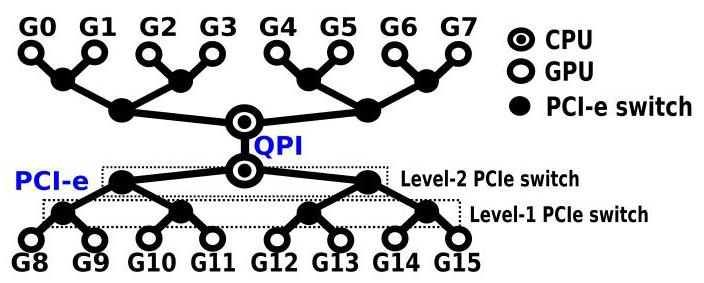

Fig. 4. PCIe interconnect topology in DGX-2.

!!! note "Chinese translation"

    图 4：DGX-2 中的 PCIe 互连拓扑。

### 2.6 InfiniBand with GPUDirect-RDMA

!!! note "Chinese translation"

    2.6 带 GPUDirect-RDMA 的 InfiniBand。

Since the Kepler architecture, NVIDIA GPUs have introduced GPUDirect-RDMA [18] (Correspondingly, AMD proposed ROCn-RDMA [19]). It enables third-party PCIe devices, especially the IB Host-Channel-Adapter (i.e., HCA) to directly access GPU device memory via PCIe without any assistance from CPU or staging through the main memory, which significantly improves the efficiency of inter-node GPU communication. GPUDirect-RDMA is enabled for both SummitDev and Summit.

!!! note "Chinese translation"

    从 Kepler 架构开始，NVIDIA GPU 引入了 GPUDirect-RDMA；相应地，AMD 提出了 ROCn-RDMA。它允许第三方 PCIe 设备，尤其是 InfiniBand Host-Channel-Adapter，直接通过 PCIe 访问 GPU device memory，而不需要 CPU 协助，也不需要经过主存 staging，从而显著提高跨节点 GPU 通信效率。SummitDev 和 Summit 都启用了 GPUDirect-RDMA。

## 3 GPU INTERCONNECT MICROBENCHMARKING

!!! note "Chinese translation"

    3 GPU 互连微基准评测。

We evaluate the basic characteristics of the six GPU interconnects using the microbenchmarks (listed in Table 2) from the Tartan Benchmark Suite [25] on the platforms listed in Table 1, focusing on both Peer-to-Peer (P2P) and Collective (CL) communication patterns. For intra-node P2P, we especially concentrate on assessing the new node-level NVLink, NVSwitch and NV-SLI technologies in terms of topology, latency, bandwidth, efficiency on message size and NUMA effects. For inter-node P2P, we discuss properties such as latency, bandwidth and efficiency on message size. We use cudaEvent to measure the latency and calculate the bandwidth.

!!! note "Chinese translation"

    作者使用 Tartan Benchmark Suite 中的微基准，在表 1 的平台上评估六类 GPU 互连的基本特性，重点覆盖 P2P 和 collective 两种通信模式。对节点内 P2P，重点评估 NVLink、NVSwitch 和 NV-SLI 这些节点级技术的拓扑、延迟、带宽、消息大小效率和 NUMA 效应。对跨节点 P2P，讨论延迟、带宽和消息大小效率。实验使用 cudaEvent 测量延迟并计算带宽。

### 3.1 Intra-Node P2P Communication

!!! note "Chinese translation"

    3.1 节点内 P2P 通信。

#### 3.1.1 Start-Up Latency

!!! note "Chinese translation"

    3.1.1 启动延迟。

Fig. 5 shows the start-up communication latency (i.e., raw latency for transmitting the shortest message) among arbitrary pair of GPUs via PCIe and NVLink for the P100 and V100 DGX-1 platforms. As already mentioned, NVLink is not P2P self-routed; for GPUs that are not directly connected by NVLink, there are two routing paths that only require a single transit. In such scenarios, Fig. 5 shows the path exhibiting shorter latency.

!!! note "Chinese translation"

    图 5 展示了 P100 和 V100 DGX-1 平台上任意 GPU 对之间通过 PCIe 和 NVLink 通信的启动延迟，即传输最短消息的原始延迟。前文提到，NVLink 的 P2P 不会自动路由；对于非直连 GPU，可能有两条只需要一次中转的路径。图 5 中展示的是延迟更短的路径。

PCIe Latency. Figs. 5A and 5B demonstrate that the communication latency for accessing different pairs of GPUs via PCIe are similar, implying that no NUMA effects appear in latency through PCIe. Meanwhile, comparing Figs. 5A and 5B, the PCIe latency is increased slightly from P100-DGX-1 to V100-DGX-1. As the bandwidth keeps unchanged, this may suggest a deeper communication pipeline design in V100-DGX-1 with Little's Law [26].

!!! note "Chinese translation"

    PCIe 延迟：图 5A 和 5B 表明，通过 PCIe 访问不同 GPU 对时通信延迟相近，说明 PCIe 延迟上没有明显 NUMA 效应。比较 P100-DGX-1 和 V100-DGX-1，PCIe 延迟略有增加；由于带宽保持不变，这可能根据 Little's Law 暗示 V100-DGX-1 有更深的通信流水线。

Fig. 5. P100/V100-DGX-1 P2P communication latency. The red blocks along the anti-diagonal are local communication. The fact that other blocks are all green in (A) and (B) indicate that no NUMA effect appears on PCIe for latency. The orange and blue blocks in (C) and (D) are refer to neighbor nodes and remote nodes respectively which exhibit clear disparity.

!!! note "Chinese translation"

    图 5：P100/V100-DGX-1 的 P2P 通信延迟。反对角线上的红色块表示本地通信；图 A 和 B 中其他块都为绿色，说明 PCIe 延迟没有 NUMA 效应；图 C 和 D 中橙色、蓝色块分别表示邻居节点和远端节点，二者差异明显。

NVLink V1&V2 Latency. Compared to PCIe in Figs. 5A and 5B, NVLink in Figs. 5C and 5D shows significant NUMA effects. For nodes that are directly connected, the latency is around ${9\mu }\mathrm{s}$ ; for nodes that require manual routing, the latency is increased by about $2\mathrm{x}$ for P100-DGX-1 and $3\mathrm{x}$ for V100-DGX-1.

!!! note "Chinese translation"

    NVLink-V1/V2 延迟：相比图 5A 和 5B 中的 PCIe，图 5C 和 5D 中的 NVLink 展现出明显 NUMA 效应。直连节点延迟约为 9 微秒；需要手动 routing 的节点，在 P100-DGX-1 上延迟约增加 2 倍，在 V100-DGX-1 上约增加 3 倍。

NV-SLI Latency. Fig. 8 shows the latency for PCIe and NV-SLI in the SLI platform. For the dual-GPU system, there are three latency levels: local access which is about ${5\mu }\mathrm{s}$ ; NV-SLI access to the opposite GPU which is about ${8\mu }\mathrm{s}$ ; and PCIe access to the opposite GPU, which is about ${13\mu }\mathrm{s}$ .

!!! note "Chinese translation"

    NV-SLI 延迟：图 8 展示了 SLI 平台中 PCIe 和 NV-SLI 的延迟。在双 GPU 系统中有三个延迟层级：本地访问约 5 微秒，通过 NV-SLI 访问另一块 GPU 约 8 微秒，通过 PCIe 访问另一块 GPU 约 13 微秒。

NVSwitch Latency. Fig. 11 shows the latency for PCIe and NVSwitch in the DGX-2 platform. The pattern is very regular: all the remote access are homogeneous, either for PCIe or NVSwitch, confirming that NVSwitch is all-to-all fully-connected. Although accessing GPUs on the other baseboard incurs two switch hops, the difference of latency is very small, almost negligible.

!!! note "Chinese translation"

    NVSwitch 延迟：图 11 展示了 DGX-2 中 PCIe 和 NVSwitch 的延迟。模式非常规整，无论 PCIe 还是 NVSwitch，远端访问都较为均匀，证实 NVSwitch 是 all-to-all 全连接。尽管访问另一块 baseboard 上的 GPU 需要两跳 switch，延迟差异仍然很小，几乎可以忽略。

#### 3.1.2 Sustainable Bandwidth

!!! note "Chinese translation"

    3.1.2 稳定带宽。

PCIe Unidirection Bandwidth. From Figs. 6A and 6B, we can observe slight NUMA effects on PCIe accesses: two GPUs sharing the same PCIe switch exhibit lower bandwidth in the measurement. For other GPUs, no matter whether sharing the same socket, the bandwidth appears to be the same. Similar effects have also been observed in Fig. 12A, in which four GPUs sharing the same Level-2 PCIe switch deliver lower bandwidth.

!!! note "Chinese translation"

    PCIe 单向带宽：从图 6A 和 6B 可以观察到 PCIe 访问存在轻微 NUMA 效应：共享同一个 PCIe switch 的两个 GPU 测得带宽更低。其他 GPU 不论是否共享同一 socket，带宽看起来相同。图 12A 中也观察到类似现象：共享同一个二级 PCIe switch 的四个 GPU 带宽更低。

PCIe Bidirection Bandwidth. The NUMA effects on bidirectional bandwidth for GPUs sharing the same PCIe switch are much more prominent than those on unidirection bandwidth. The PCIe NUMA effect here is an interesting novel observation: it describes a scenario that nearby access presenting lower performance than remote access. We label such a NUMA effect as "anti-locality". The anti-locality effect is possibly due to the unbalanced physical signal paths on the PCIe-switch chipsets [27].

!!! note "Chinese translation"

    PCIe 双向带宽：共享同一 PCIe switch 的 GPU 在双向带宽上的 NUMA 效应比单向带宽更明显。这里的 PCIe NUMA 是一个有趣的新观察：近端访问反而比远端访问性能更低。作者将其称为 anti-locality。该效应可能来自 PCIe switch 芯片组内部物理信号路径不均衡。

NVLink Unidirection Bandwidth. The NVLink scenario is more complicated. For NVLink-V1, there are three connection types: local access, neighboring nodes directly connected by NVLink, and remote nodes requiring additional routing. For NVLink-V2, there are four connection types: local access, close neighboring nodes connected by dual links, general neighboring nodes connected by one link, and remote nodes. As such, there are three types of NUMA effects for NVLink: NUMA among neighbors and remote nodes, NUMA among neighbor nodes for NVLink-V2, and NUMA among remote nodes for NVLink-V2 caused by routing choice.

!!! note "Chinese translation"

    NVLink 单向带宽更复杂。NVLink-V1 有三类连接：本地访问、由 NVLink 直连的邻居节点、需要额外 routing 的远端节点。NVLink-V2 有四类连接：本地访问、由双 link 连接的近邻节点、由单 link 连接的一般邻居节点、远端节点。因此 NVLink 有三类 NUMA 效应：邻居与远端之间的 NUMA，NVLink-V2 邻居节点之间由于 link 数不同导致的 NUMA，以及 NVLink-V2 远端节点之间由 routing choice 导致的 NUMA。

Fig. 6. DGX-1 P2P unidirectional bandwidth. Although not very obvious, we can see 2x2 blocks in (A) and (B) along anti-diagonal, which indicates the anti-locality NUMA effect for unidirection bandwidth on PCIe. (C) and (D) confirm NUMA among neighbors and remote nodes. The other two types of NUMA for NVLink-V2 are not quite clear in (D). They are more obvious for bidirection bandwidth.

!!! note "Chinese translation"

    图 6：DGX-1 的 P2P 单向带宽。虽然不太明显，但图 A 和 B 中反对角线附近的 2x2 块显示 PCIe 单向带宽存在 anti-locality NUMA；图 C 和 D 确认邻居节点与远端节点之间存在 NUMA。NVLink-V2 的另外两类 NUMA 在图 D 中不明显，在双向带宽中更明显。

Fig. 7. DGX-1 P2P bidirectional bandwidth. The 2 x 2 blue/red blocks along anti-diagonal in (A) and (B) clearly illustrate the anti-locality NUMA effect on PCIe. In (D), the yellow blocks compared with the green blocks show the NUMA among neighboring nodes. Meanwhile, the light green blocks along the anti-diagonal (not quite obvious though) imply the existence of NUMA among remote nodes.

!!! note "Chinese translation"

    图 7：DGX-1 的 P2P 双向带宽。图 A 和 B 中反对角线附近的 2x2 蓝/红块清楚展示了 PCIe 上的 anti-locality NUMA。图 D 中黄色块相对于绿色块显示邻居节点之间的 NUMA；反对角线附近的浅绿色块也暗示远端节点之间存在 NUMA。

NV-SLI Unidirection Bandwidth. Since NV-SLI only incorporates two GPUs, where the communication is symmetric, showing no NUMA effect in Fig. 9B. NV-SLI Bidirection Bandwidth is similar to unidirection condition, except that the bandwidth doubles, as shown in Fig. 10B.

!!! note "Chinese translation"

    NV-SLI 单向带宽：由于 NV-SLI 只包含两个 GPU，通信是对称的，因此图 9B 中没有 NUMA 效应。NV-SLI 双向带宽与单向情况类似，只是带宽翻倍，如图 10B 所示。

NVSwitch Unidirection Bandwidth. Shown in Fig. 12B, the bandwidth for all remote access through NVSwitch are consistent or UMA, implying that one more NVSwitch hop does not degrade bandwidth. NVSwitch Bidirection Bandwidth condition is similar, except that the bandwidth doubles, as shown in Fig. 13B.

!!! note "Chinese translation"

    NVSwitch 单向带宽：图 12B 显示通过 NVSwitch 的所有远端访问带宽一致，表现为 UMA，说明多一跳 NVSwitch 不会降低带宽。NVSwitch 双向带宽类似，只是带宽翻倍，如图 13B 所示。

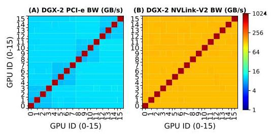

Fig. 12. DGX-2 P2P unidirectional bandwidth.

!!! note "Chinese translation"

    图 12：DGX-2 的 P2P 单向带宽。

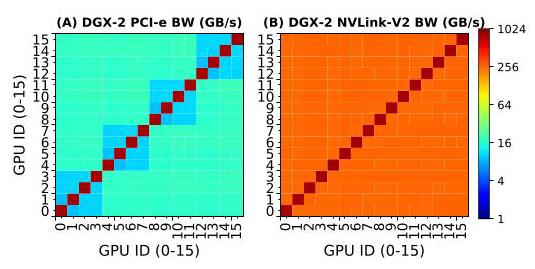

Fig. 13. DGX-2 P2P bidirectional bandwidth.

!!! note "Chinese translation"

    图 13：DGX-2 的 P2P 双向带宽。

#### 3.1.3 Routing

!!! note "Chinese translation"

    3.1.3 路由。

For all the GPU interconnects we discuss here, only the one for remote access in the DGX-1s via NVLink may require explicit routing. For demonstration purposes, we take G0 in Fig. 1 as the source node for P2P communication. There are three remote nodes for G0: G5, G6 and G7. From G0 to G5, either G1 or G4 can be specified for routing. From G0 to G6, either G2 or G4 can be selected; and from G0 to G7, either G3 or G4 can be selected.

!!! note "Chinese translation"

    在本文讨论的 GPU 互连中，只有 DGX-1 通过 NVLink 访问远端 GPU 时可能需要显式 routing。作者以图 1 中 G0 作为 P2P 通信源节点。G0 有三个远端节点：G5、G6、G7。G0 到 G5 可指定 G1 或 G4 路由；G0 到 G6 可选择 G2 或 G4；G0 到 G7 可选择 G3 或 G4。

Fig. 14 shows the results for unidirection and bidirection bandwidth. For NVLink-V1 in P100-DGX-1, there are no NUMA effects; all the bars appear in the same height. This is because the NVLinks in P100-DGX-1 are isomorphic. However, for NVLink-V2 in V100-DGX-1, different scenarios emerge based on how many dual-bandwidth links a route goes through. Nevertheless, the latency remains similar for all scenarios.

!!! note "Chinese translation"

    图 14 展示了单向和双向带宽结果。对 P100-DGX-1 上的 NVLink-V1，不存在 routing NUMA；所有柱子高度基本相同，因为 P100-DGX-1 中的 NVLink 是同构的。对 V100-DGX-1 上的 NVLink-V2，路径经过多少条双带宽 link 会导致不同带宽表现。不过所有场景的延迟相近。

Fig. 14. NUMA effect on routing choices for remote GPU access via NVLink.

!!! note "Chinese translation"

    图 14：通过 NVLink 访问远端 GPU 时，路由选择造成的 NUMA 效应。

#### 3.1.4 Efficiency on Message Size

!!! note "Chinese translation"

    3.1.4 消息大小效率。

Latency. The latency remains unchanged for data communication less than or equal to ${16}\mathrm{\;{KB}}$ for P100-DGX-1 (except local access). For V100-DGX-1, this value increases to 64 KB, suggesting higher link bandwidth to saturate and deeper communication pipeline on NVLink-V2. The interesting observation is that in Fig. 17, there is slight divergence for PCIe-local and PCI-remote access latency with large messages (i.e., $\geq  4\mathrm{{MB}}$ ).

!!! note "Chinese translation"

    延迟：在 P100-DGX-1 上，除本地访问外，当数据通信小于等于 16 KB 时延迟基本不变。对 V100-DGX-1，这一阈值提高到 64 KB，说明 NVLink-V2 有更高的链路带宽和更深的通信流水线。一个有趣观察是，在图 17 中，当消息大于等于 4 MB 时，PCIe-local 和 PCIe-remote 访问延迟出现轻微分化。

Bandwidth. For unidirection bandwidth, it can be seen that the interconnect starts to saturate at about ${2}^{22} = 4\mathrm{{MB}}$ for both NVLink-V1 and V2, implying that to reach the optimal sustainable bandwidth of the interconnect, one needs at least 4 MB data to transmit at a time. For DGX-2 NVSwitch uni- and bidirection bandwidth in Figs. 17B and 17C, NVSwitch-one-hop and NVSwitch-two-hop curves are fully aligned, confirming that accessing remote baseboard imposes no extra overhead.

!!! note "Chinese translation"

    带宽：对单向带宽，NVLink-V1 和 NVLink-V2 都大约在 4 MB 时开始饱和，这意味着若要达到互连的最优稳定带宽，每次至少需要传输 4 MB 数据。对 DGX-2 的 NVSwitch 单向和双向带宽，图 17B 和 17C 中 one-hop 与 two-hop 曲线完全重合，确认访问远端 baseboard 不带来额外开销。

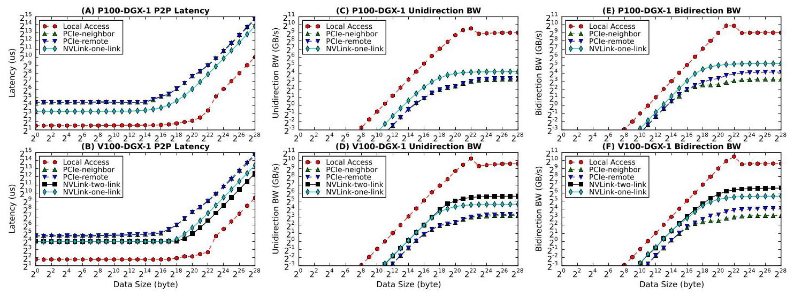

Fig. 15. P2P communication latency, unidirection and bidirection bandwidth with increased message size via PCIe and NVLink for DGX-1.

!!! note "Chinese translation"

    图 15：DGX-1 中，随着消息大小增加，通过 PCIe 和 NVLink 进行 P2P 通信的延迟、单向带宽和双向带宽。

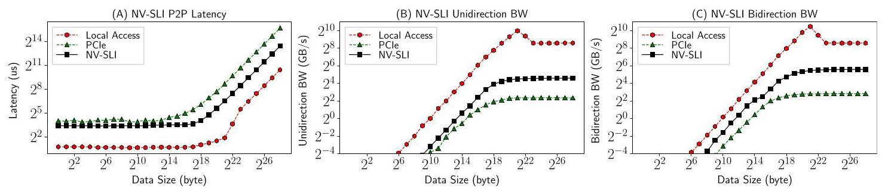

Fig. 16. P2P communication latency, unidirection and bidirection bandwidth with increased message size via PCIe and NV-SLI for the SLI-system.

!!! note "Chinese translation"

    图 16：SLI 系统中，随着消息大小增加，通过 PCIe 和 NV-SLI 进行 P2P 通信的延迟、单向带宽和双向带宽。

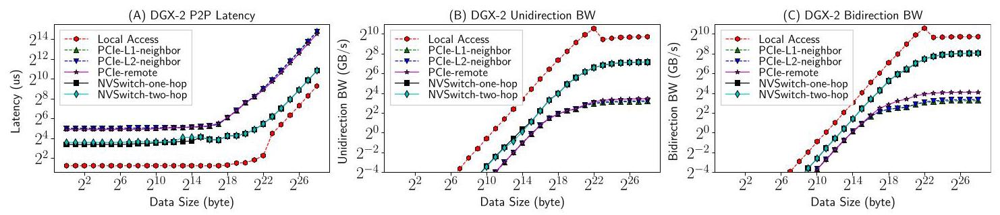

Fig. 17. P2P communication latency, unidirection and bidirection bandwidth with increased message size via PCIe and NVSwitch for DGX-2.

!!! note "Chinese translation"

    图 17：DGX-2 中，随着消息大小增加，通过 PCIe 和 NVSwitch 进行 P2P 通信的延迟、单向带宽和双向带宽。

### 3.2 Intra-Node Collective Communication

!!! note "Chinese translation"

    3.2 节点内 collective 通信。

Different from P2P communication only including a single sender and receiver, collective communication (CL) involves multiple senders and receivers so it is more complicated. CL generally follows certain patterns, including broadcast, scatter, gather, all-gather, reduce, all-reduce, all-to-all, etc. It is extensively used in many key applications such as deep learning, molecular dynamics, graph analytics, etc.

!!! note "Chinese translation"

    与只包含一个发送方和一个接收方的 P2P 通信不同，collective 通信涉及多个发送方和接收方，因此更复杂。collective 通常包含 broadcast、scatter、gather、all-gather、reduce、all-reduce、all-to-all 等模式，广泛用于深度学习、分子动力学、图分析等关键应用。

Efficiently implementing CL communication is challenging because (a) it needs to understand the underlying hardware network topology in order to enable orchestrated mapping; (b) it needs to handle the issue of synchronization, overlapping and deadlock; and (c) performance metrics can differ subject to application features. To relieve these burdens from users, NVIDIA provides Collective Communication Library (NCCL), using similar primitives as MPI collectives, while AMD offers RCCL.

!!! note "Chinese translation"

    高效实现 collective 通信很难，因为它需要理解底层硬件网络拓扑以便进行协调映射，需要处理同步、重叠和死锁问题，并且性能指标还会随应用特征变化，例如小传输关注延迟、大传输关注带宽。为减轻用户负担，NVIDIA 提供 NCCL，使用与 MPI collective 类似的原语；AMD 则提供 RCCL。

To offer the maximum bandwidth, NCCL constructs ring network among the communication participants so that broadcasting and reduction can be efficiently realized by partitioning data into small chunks, and transmitting them along the ring in a pipeline fashion. Fig. 18 describes how a ring-network is constructed for PCIe, NVLink-V1 and NVLink-V2 in DGX-1s, respectively.

!!! note "Chinese translation"

    为提供最大带宽，NCCL 会在通信参与者之间构建 ring 网络，将数据划分成小块，并沿 ring 以流水线方式传输，从而高效实现 broadcast 和 reduction。图 18 展示了 DGX-1 中 PCIe、NVLink-V1 和 NVLink-V2 分别如何构建 ring。

Fig. 18. NCCL Rings for PCIe, NVLink-V1 and NVLink-V2 interconnect. (A) for PCIe, the ring is to traverse the binary-tree network; (B) for NVLink-V1, there are two independent rings, marked in red-solid line and blue-dash line; and (C) for NVLink-V2, the lines with 2 links form a fast ring (i.e., the backbone network) while the lines with 1 link form a slow ring.

!!! note "Chinese translation"

    图 18：PCIe、NVLink-V1 和 NVLink-V2 互连上的 NCCL ring。A 中 PCIe ring 需要遍历二叉树网络；B 中 NVLink-V1 有两个独立 ring，分别用红色实线和蓝色虚线标出；C 中 NVLink-V2 由两条 link 构成的边形成 fast ring，也就是 backbone network，而单 link 边形成 slow ring。

#### 3.2.1 DGX-1 CL Communication

!!! note "Chinese translation"

    3.2.1 DGX-1 collective 通信。

CL Latency. Fig. 19 illustrates CL communication startup latency with respect to the number of GPUs involved for NCCL-V1 and V2 on the two DGX-1 platforms respectively, corresponding to PCIe/QPI and NVLink. The observations are: latency increases with participating GPUs almost in a linear fashion; the behaviors of NCCL-V1 and V2 on the two DGX platforms are similar; the latency of NVLink increases faster than PCIe except all-reduce; and for PCIe, all_reduce shows the largest latency.

!!! note "Chinese translation"

    Collective 延迟：图 19 展示了两个 DGX-1 平台上，NCCL-V1 和 V2 的 collective startup latency 如何随参与 GPU 数变化，分别对应 PCIe/QPI 和 NVLink。观察包括：延迟几乎随参与 GPU 数线性增加；两个 DGX 平台上 NCCL-V1 和 V2 行为类似；除 all-reduce 外，NVLink 延迟增长快于 PCIe；在 PCIe 上，all_reduce 延迟最大。

CL Bandwidth. Fig. 20 shows CL's sustainable communication bandwidth with increased number of GPUs under 1 GB payload. For PCIe, CL bandwidth decreases with more GPUs due to bus contention in a tree-network. For NVLink, CL bandwidth essentially increases with more GPUs due to more connected links in a hypercube mesh network. NVLink-V2 exhibits significantly better bandwidth with 4 GPUs (~1.6x) and 8 GPUs (~2x) compared to NVLink-V1. The NUMA effects appear quite significant with 5 GPUs, implying that one should avoid adopting 5 GPUs in their application setup.

!!! note "Chinese translation"

    Collective 带宽：图 20 展示了 1 GB payload 下，collective 稳定通信带宽如何随 GPU 数增加。PCIe 上，由于树形网络中的总线竞争，GPU 越多带宽越低；NVLink 上，由于 hypercube mesh 中可连接 link 增加，GPU 越多带宽总体越高。与 NVLink-V1 相比，NVLink-V2 在 4 个 GPU 时约高 1.6 倍，在 8 个 GPU 时约高 2 倍。5 个 GPU 时 NUMA 效应非常明显，说明应用配置应避免使用 5 个 GPU。

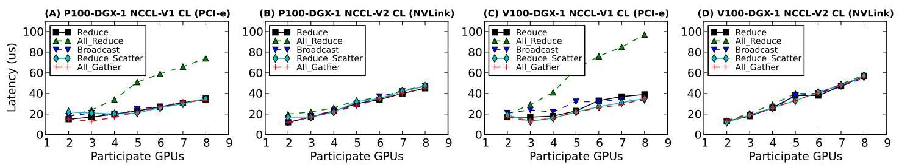

Fig. 19. Intra-node CL communication latency with variable participant GPUs for NCCL-V1 (PCle/QPI) and NCCL-V2 (NVLink-V1/2).

!!! note "Chinese translation"

    图 19：节点内 collective 通信延迟，横轴为参与 GPU 数，分别对应 NCCL-V1 的 PCIe/QPI 和 NCCL-V2 的 NVLink-V1/V2。

Fig. 20. Intra-node CL communication bandwidth with variable participant GPUs for NCCL-V1 (PCle/QPI) and NCCL-V2 (NVLink-V1/2).

!!! note "Chinese translation"

    图 20：节点内 collective 通信带宽，横轴为参与 GPU 数，分别对应 NCCL-V1 的 PCIe/QPI 和 NCCL-V2 的 NVLink-V1/V2。

CL Efficiency on Message Size. Fig. 21 shows CL bandwidth with respect to message size increasing from 8 B to $1\mathrm{\;{GB}}$ for 8 GPUs. For PCIe, CL-bandwidth saturates at about ${2}^{24} = {16}\mathrm{{MB}}$ ; whereas for NVLink, bandwidth saturates around ${2}^{28} = {256}\mathrm{{MB}}$ .

!!! note "Chinese translation"

    Collective 消息大小效率：图 21 展示 8 GPU 情况下，消息大小从 8 B 增加到 1 GB 时 collective 带宽的变化。PCIe collective 带宽大约在 16 MB 饱和；NVLink 带宽大约在 256 MB 饱和。

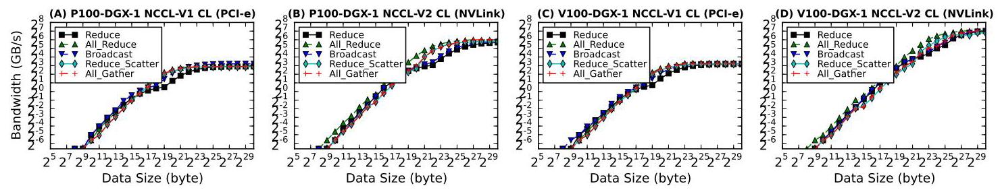

Fig. 21. Intra-node CL communication bandwidth for 8 GPUs with increased message size for NCCL-V1 (PCIe/QPI) and NCCL-V2 (NVLink-V1/2).

!!! note "Chinese translation"

    图 21：8 个 GPU 下，随着消息大小增加，NCCL-V1 PCIe/QPI 和 NCCL-V2 NVLink-V1/V2 的节点内 collective 通信带宽。

#### 3.2.2 NV-SLI CL Communication

!!! note "Chinese translation"

    3.2.2 NV-SLI collective 通信。

Since the SLI-system contains only two GPUs, the authors use histogram figures to show the latency and bandwidth for the 5 CL communication patterns. The latency for NV-SLI is similar, around ${18\mu }\mathrm{s}$ ; but for PCIe, reduce and all_reduce show significantly lower latency than the other three, even less than on NV-SLI. Both PCIe and NV-SLI bandwidth start to saturate at about ${2}^{20} = 1$ MB.

!!! note "Chinese translation"

    由于 SLI 系统只有两个 GPU，作者用柱状图展示 5 种 collective 模式的延迟和带宽。NV-SLI 的延迟相近，约 18 微秒；但 PCIe 上 reduce 和 all_reduce 的延迟显著低于其他三类，甚至低于 NV-SLI。PCIe 和 NV-SLI 的带宽都大约在 1 MB 消息大小开始饱和。

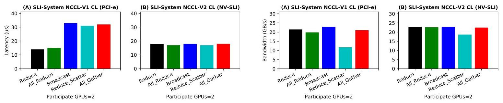

Fig. 22. SLI-system PCIe and NV-SLI CL communication latency. Fig. 23. SLI-system PCIe and NV-SLI CL communication bandwidth.

!!! note "Chinese translation"

    图 22：SLI 系统中 PCIe 与 NV-SLI 的 collective 通信延迟。图 23：SLI 系统中 PCIe 与 NV-SLI 的 collective 通信带宽。

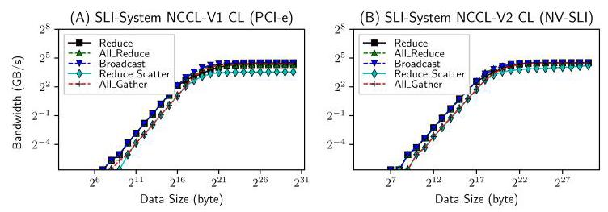

Fig. 24. SLI-system PCIe and NV-SLI CL bandwidth efficiency.

!!! note "Chinese translation"

    图 24：SLI 系统中 PCIe 与 NV-SLI 的 collective 带宽效率。

#### 3.2.3 NVSwitch CL Communication

!!! note "Chinese translation"

    3.2.3 NVSwitch collective 通信。

CL Latency and Bandwidth. Fig. 25 illustrates CL communication latency with respect to the number of GPUs on DGX-2, corresponding to PCIe and NVSwitch. Due to UMA for NVSwitch, the five curves in Fig. 25B are rather aligned. Except all_reduce, the other CL primitives show lower startup latency on PCIe than on NVSwitch when the participating GPUs are more than three, implying that the advantage of NVSwitch is on bandwidth rather than latency. This observation is confirmed in Fig. 26.

!!! note "Chinese translation"

    Collective 延迟和带宽：图 25 展示 DGX-2 上 PCIe 和 NVSwitch 的 collective 延迟如何随 GPU 数变化。由于 NVSwitch 是 UMA，图 25B 中五条曲线较为对齐。当参与 GPU 超过 3 个时，除 all_reduce 外，其他 collective primitive 在 PCIe 上的启动延迟低于 NVSwitch，这说明 NVSwitch 的优势主要在带宽而不是延迟。图 26 进一步确认了这一点。

NVSwitch shows tremendously higher bandwidth than PCIe, particularly for reduce, all_reduce and broadcast. reduce_scatter and all_gather show staggering behavior on bandwidth for NVSwitch; the values are much better with 2, 4, 8 and 16 GPUs than other numbers of GPUs. Since NVSwitch is UMA, it implies that this staggering issue is not due to interconnect topology but NCCL's implementation.

!!! note "Chinese translation"

    NVSwitch 的带宽显著高于 PCIe，尤其是 reduce、all_reduce 和 broadcast。对 NVSwitch，reduce_scatter 和 all_gather 的带宽呈现波动：2、4、8、16 个 GPU 时明显优于其他 GPU 数。由于 NVSwitch 是 UMA，这说明这种波动并非互连拓扑导致，而更可能来自 NCCL 实现。

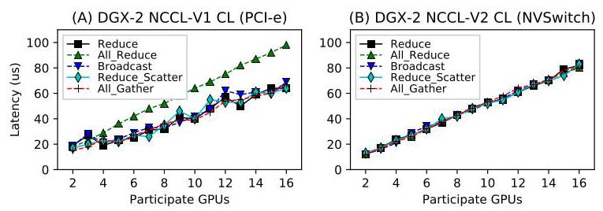

Fig. 25. DGX-2 PCIe and NVSwitch CL communication latency.

!!! note "Chinese translation"

    图 25：DGX-2 中 PCIe 和 NVSwitch 的 collective 通信延迟。

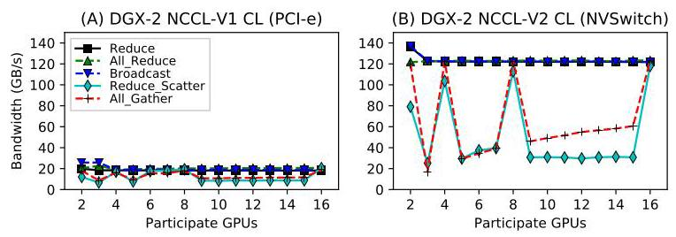

Fig. 26. DGX-2 PCIe and NVSwitch CL communication bandwidth.

!!! note "Chinese translation"

    图 26：DGX-2 中 PCIe 和 NVSwitch 的 collective 通信带宽。

CL Efficiency on Message Size. Fig. 27 shows CL bandwidth with respect to message size for 16 GPUs on the DGX-2 system. The divergence observed for PCIe and NVLink disappears for NVSwitch. As NVSwitch is UMA, the authors suppose this misalignment is brought by the NUMA effect in the PCIe and NVLink networks.

!!! note "Chinese translation"

    Collective 消息大小效率：图 27 展示 DGX-2 上 16 个 GPU 时 collective 带宽随消息大小的变化。PCIe 和 NVLink 中出现的曲线分化在 NVSwitch 上消失。由于 NVSwitch 是 UMA，作者推测 PCIe 和 NVLink 中的分化来自网络 NUMA 效应。

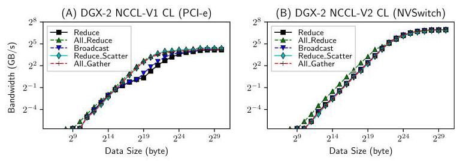

Fig. 27. DGX-2 PCIe and NVSwitch CL bandwidth efficiency with 16 GPUs.

!!! note "Chinese translation"

    图 27：DGX-2 中 16 个 GPU 下 PCIe 与 NVSwitch 的 collective 带宽效率。

### 3.3 Inter-Node P2P Communication

!!! note "Chinese translation"

    3.3 跨节点 P2P 通信。

We measure the latency and bandwidth of inter-node P2P communication on SummitDev Supercomputer and Summit Supercomputer from Oak Ridge National Laboratory. SummitDev is a supercomputer system with 54 nodes. Each node contains two IBM Power-8 CPUs and four NVIDIA P100 GPUs. Summit features 4,608 nodes, each with two IBM Power-9 CPUs and six NVIDIA V100 GPUs. Both SummitDev and Summit support GPUDirect.

!!! note "Chinese translation"

    作者在 Oak Ridge National Laboratory 的 SummitDev 和 Summit 超级计算机上测量跨节点 P2P 通信延迟和带宽。SummitDev 有 54 个节点，每个节点包含两个 IBM Power-8 CPU 和四个 NVIDIA P100 GPU。Summit 有 4,608 个节点，每个节点包含两个 IBM Power-9 CPU 和六个 NVIDIA V100 GPU。两者都支持 GPUDirect。

For inter-node P2P, we conduct our measurement under five configurations: GPUDirect-RDMA, PinnedMem-GPUDirect, PinnedMem, UnpinnedMem-GPUDirect and UnpinnedMem.

!!! note "Chinese translation"

    对跨节点 P2P，作者在五种配置下测量：GPUDirect-RDMA、PinnedMem-GPUDirect、PinnedMem、UnpinnedMem-GPUDirect 和 UnpinnedMem。

SummitDev. From Fig. 28, until ${2}^{12} = 4\mathrm{\;{KB}}$ , there is little difference among the five curves in terms of both latency and bandwidth. GPUDirect-RDMA shows the worst performance in the range from 4 to ${64}\mathrm{{KB}}$ for latency and from 4 to ${256}\mathrm{{KB}}$ for bandwidth, especially at 32 KB. From 4 MB on, GPUDirect-RDMA shows its advantage on bandwidth and obtains its optimal bandwidth around 12 GB/s at 64 MB. However, this is still lower than the PinnedMem-GPUDirect scheme, which demonstrates more than 14 GB/s sustainable bandwidth with large message size. The bandwidth of GPUDirect-RDMA degrades dramatically after 64 MB.

!!! note "Chinese translation"

    SummitDev：从图 28 可见，在 4 KB 以内，五条曲线在延迟和带宽上差异很小。GPUDirect-RDMA 在 4 到 64 KB 的延迟区间，以及 4 到 256 KB 的带宽区间表现最差，尤其是 32 KB。4 MB 之后，GPUDirect-RDMA 在带宽上展现优势，并在 64 MB 时达到约 12 GB/s 的最优带宽。但这仍低于 PinnedMem-GPUDirect，后者在大消息下稳定带宽超过 14 GB/s。GPUDirect-RDMA 的带宽在 64 MB 后明显下降。

Summit. Unlike SummitDev, GPUDirect-RDMA shows the best performance among the five configurations on Summit: it always delivers the lowest latency, especially for small message size; it always exhibits the highest bandwidth, especially for large message size. The performance drop in SummitDev disappears on Summit. These two points suggest that the technology of GPUDirect has been improved significantly from SummitDev to Summit, and becomes the best choice for GPU inter-node communication.

!!! note "Chinese translation"

    Summit：与 SummitDev 不同，GPUDirect-RDMA 在 Summit 的五种配置中表现最好：它始终提供最低延迟，尤其是小消息；同时始终提供最高带宽，尤其是大消息。SummitDev 上的性能下降现象在 Summit 上消失了。这说明从 SummitDev 到 Summit，GPUDirect 技术或系统集成有显著改进，并成为 GPU 跨节点通信的最佳选择。

Fig. 28. SummitDev inter-node P2P latency and bandwidth efficiency.

!!! note "Chinese translation"

    图 28：SummitDev 上跨节点 P2P 延迟和带宽效率。

Fig. 29. Summit inter-node P2P latency and bandwidth efficiency.

!!! note "Chinese translation"

    图 29：Summit 上跨节点 P2P 延迟和带宽效率。

### 3.4 Inter-Node Collective Communication

!!! note "Chinese translation"

    3.4 跨节点 collective 通信。

Regarding inter-node collective communication, we measure the latency and bandwidth with respect to the number of participant nodes on both SummitDev and Summit. We tune the number of nodes from 2 to 8, with 1 GPU per node being utilized. The startup latency is measured with 4 B data transfer while the sustainable bandwidth is measured with sufficiently large data transfer (1 GB).

!!! note "Chinese translation"

    对跨节点 collective 通信，作者在 SummitDev 和 Summit 上测量延迟、带宽随参与节点数量变化的情况。节点数从 2 调到 8，每个节点使用 1 个 GPU。启动延迟通过 4 B 数据传输测量，稳定带宽通过足够大的 1 GB 数据传输测量。

CL Latency. As shown in Fig. 30A, for SummitDev's IB fat-tree network, the latency-change for performing the five CL operations remains flat when scaling the number of nodes, except all-reduce. Similar observation is also drawn in Fig. 31A for Summit, the divergence is much less for all-reduce. This may imply that it is a joint-effect of algorithm implementation in NCCL and the interconnect technology of GPUDirect.

!!! note "Chinese translation"

    Collective 延迟：如图 30A，在 SummitDev 的 IB fat-tree 网络上，随着节点数扩展，五种 collective 操作的延迟变化基本平坦，all-reduce 除外。Summit 的图 31A 也有类似观察，只是 all-reduce 的分化更小。这可能说明该现象是 NCCL 算法实现和 GPUDirect 互连技术共同作用的结果。

CL Bandwidth. In terms of bandwidth in Fig. 30B, similar to NVLink, strong NUMA effects emerge under 3 and 5 nodes for reduce_scatter and all_gather on SummitDev. And for Summit, this happens under 3, 5, 6, 7 nodes in Fig. 31. Nevertheless, the bandwidth overall remains unchanged.

!!! note "Chinese translation"

    Collective 带宽：图 30B 中，类似 NVLink，在 SummitDev 的 3 和 5 节点情况下，reduce_scatter 和 all_gather 出现强 NUMA 效应。Summit 中类似现象出现在 3、5、6、7 节点。尽管如此，整体带宽基本保持不变。

CL Efficiency on Message Size. Finally, the bandwidth for the five CL operations converge and saturate around ${32}/{64}\mathrm{{MB}}$ message size, demonstrating nearly 16/32 GB/s sustainable peak bandwidth on SummitDev and Summit, respectively. Overall, Summit delivers much better GPU inter-node communication performance than SummitDev.

!!! note "Chinese translation"

    Collective 消息大小效率：最后，五种 collective 操作的带宽在 32/64 MB 消息大小附近收敛并饱和，在 SummitDev 和 Summit 上分别达到接近 16/32 GB/s 的稳定峰值带宽。总体而言，Summit 的 GPU 跨节点通信性能明显好于 SummitDev。

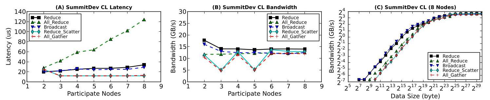

Fig. 30. Inter-node CL communication latency and bandwidth with variable participant nodes, as well as bandwidth for 8 nodes with increased message size.

!!! note "Chinese translation"

    图 30：跨节点 collective 通信的延迟和带宽随参与节点数变化，以及 8 节点下带宽随消息大小变化。

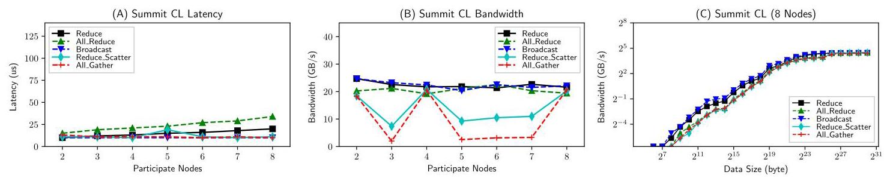

Fig. 31. Inter-node CL communication latency and bandwidth with variable participant nodes, as well as bandwidth for 8 nodes with increased message size.

!!! note "Chinese translation"

    图 31：跨节点 collective 通信的延迟和带宽随参与节点数变化，以及 8 节点下带宽随消息大小变化。

## 4 GPU INTERCONNECT BENCHMARKING

!!! note "Chinese translation"

    4 GPU 互连应用基准评测。

The microbenchmarking exhibit some basic characteristics of modern GPU interconnects. However, in terms of real multi-GPU applications, their impact remains unknown. In this section, we use the Tartan Benchmark Suite to evaluate the impact of the GPU interconnect. Particularly, we focus on two aspects: (1) the impact of a faster GPU interconnect such as NVLink, compared with PCIe on intra-node scale-up applications; (2) the impact of GPUDirect-RDMA on internode scale-out applications.

!!! note "Chinese translation"

    微基准揭示了现代 GPU 互连的一些基本特性，但它们对真实多 GPU 应用的影响仍然未知。本节使用 Tartan Benchmark Suite 评估 GPU 互连的影响，重点关注两个方面：第一，相比 PCIe，NVLink 这类更快的 GPU 互连对节点内 scale-up 应用的影响；第二，GPUDirect-RDMA 对跨节点 scale-out 应用的影响。

### 4.1 Intra-Node Scale-Up

!!! note "Chinese translation"

    4.1 节点内 scale-up。

For intra-node scale-up scenarios, we evaluated the seven scale-up applications on P100-DGX-1 and V100-DGX-1, with and without NVLinks. Since many of these applications are hard-coded to leverage all the available GPUs in the system, we configure the system environment through CUDA_VISIBLE_DEVICES to manipulate the number of GPUs being visible to the applications.

!!! note "Chinese translation"

    对节点内 scale-up 场景，作者在 P100-DGX-1 和 V100-DGX-1 上评估七个 scale-up 应用，并比较有无 NVLink 的情况。由于许多应用被硬编码为使用系统中所有可用 GPU，作者通过配置 CUDA_VISIBLE_DEVICES 来控制应用可见 GPU 数。

Impact of NVLink. Although our observation from micro-benchmarking in Section 3 show that NVLink can significantly improve inter-GPU communication efficiency, based on these figures, it is clear that those improvements do not directly transform into overall communication latency reduction, nor the whole application speedup; except CSM and GMM, there is not very significant difference between the Baseline and NCCL bars for both platforms.

!!! note "Chinese translation"

    NVLink 的影响：尽管 Section 3 的微基准表明 NVLink 能显著提高 GPU 间通信效率，但从应用图中可以看到，这些提升并不会直接转化为整体通信延迟降低或整应用 speedup。除 CSM 和 GMM 外，两个平台上 Baseline 与 NCCL 柱子的差异都不显著。

There are several reasons behind this. First, based on our experience on assessing the over 50 multi-GPU application candidates, most of those scale-up cases are based on master-slave programming model, where the CPU is the master, handling the sequential portions of code and GPUs are the slaves, processing the parallel portions. Under this model, communication only occurs between CPU and GPUs; no inter-GPU transaction is presumed. In addition, the CPU-GPU communication is also highly optimized.

!!! note "Chinese translation"

    原因有几个。第一，作者在评估 50 多个多 GPU 应用候选时发现，大多数 scale-up 应用基于 master-slave 编程模型：CPU 是 master，处理代码中的串行部分；GPU 是 slave，处理并行部分。在这种模型下，通信只发生在 CPU 与 GPU 之间，默认没有 GPU 间事务。此外，CPU-GPU 通信往往已经高度优化。

Second, since today's scale-up applications are mostly based on the master-slave programming model, communication often only accounts for a small fraction of the total execution time, let alone the inter-GPU communication which tended to be avoided previously when creating applications. Finally, employing NVLink introduces additional overhead such as enable/disable peer access, routing, and NCCL initialization.

!!! note "Chinese translation"

    第二，由于当前 scale-up 应用大多基于 master-slave 编程模型，通信通常只占总执行时间的一小部分，更不用说过去应用设计中倾向于避免的 GPU 间通信。最后，使用 NVLink 还会引入额外开销，例如启用/禁用 peer access、路由和 NCCL 初始化。

TABLE 3

!!! note "Chinese translation"

    表 3。

Tartan Benchmark Suite

!!! note "Chinese translation"

    Tartan 基准套件。

<table><tr><td>App</td><td>Brief Description</td><td>abbr.</td><td>Domain</td><td>Comm</td><td>Scaling</td><td>Pattern</td></tr><tr><td>ConvNet2</td><td>Convolution neural networks via data, model and hybrid parallelism</td><td>CNN</td><td>Machine Learning</td><td>CUDA</td><td>Scale-up</td><td>P2P</td></tr><tr><td>Cusimann</td><td>Global optimization via parallel simulated annealing algorithm</td><td>CSM</td><td>Optimization</td><td>OpenMP</td><td>Scale-up</td><td>CPU-GPU</td></tr><tr><td>GMM</td><td>Multivariate data clustering via expectation maximization with Gaussian mixture</td><td>GMM</td><td>Data Analysis</td><td>OpenMP</td><td>Scale-up</td><td>CL-Broadcast</td></tr><tr><td>Kmeans</td><td>Kmeans clustering for double-precision data on multi-GPUs attached to the same node</td><td>KMN</td><td>Data Analysis</td><td>CUDA</td><td>Scale-up</td><td>CL-AllReduce</td></tr><tr><td>MonteCarlo</td><td>Monte Carlo option pricing from CUDA SDK</td><td>MTC</td><td>Finance</td><td>CUDA</td><td>Scale-up</td><td>CPU-GPU</td></tr><tr><td>Planar</td><td>Depth-first-search and backtracking to solve Planar Langford's Sequences</td><td>PLN</td><td>Number Theory</td><td>CUDA</td><td>Scale-up</td><td>CPU-GPU</td></tr><tr><td>Trueke</td><td>Exchange Monte Carlo for 3D random field Ising model</td><td>TRK</td><td>HPC Simulation</td><td>OpenMP</td><td>Scale-up</td><td>CL-Broadcast</td></tr><tr><td>B2rEqwp</td><td>3D earthquake wave-propagation simulation using 4-order finite difference method</td><td>BRQ</td><td>HPC Simulation</td><td>MPI</td><td>Scale-out</td><td>P2P</td></tr><tr><td>Diffusion</td><td>A multi-GPU implementation of 3D Heat Equation and inviscid Burgers' Equation</td><td>DFF</td><td>HPC Simulation</td><td>MPI</td><td>Scale-out</td><td>P2P</td></tr><tr><td>Lulesh</td><td>Livermore unstructured Lagrangian explicit shock hydrodynamics</td><td>LLH</td><td>Molecular Dynamics</td><td>MPI</td><td>Scale-out</td><td>P2P</td></tr><tr><td>CoMD</td><td>A reference implementation of classical molecular dynamics algorithms and workloads</td><td>CMD</td><td>Molecular Dynamics</td><td>MPI</td><td>Scale-out</td><td>P2P/CL</td></tr><tr><td>Prbench</td><td>Page rank computation by multi-GPUs</td><td>PRB</td><td>Graph Processing</td><td>MPI</td><td>Scale-out</td><td>P2P/CL</td></tr><tr><td>HIT</td><td>Simulating Homogeneous Isotropic Turbulence by solving Navier-Stokes equations</td><td>HIT</td><td>HPC Simulation</td><td>MPI</td><td>Scale-out</td><td>CL All-to-All</td></tr><tr><td>Matvec</td><td>Matrix multiplication via mpi-scatter, broadcast and gather</td><td>MAM</td><td>Linear Algebra</td><td>MPI</td><td>Scale-out</td><td>CL</td></tr></table>

Fig. 32. Normalized latency reduction by NVLink-V1 and NCCL-V2 of strong scaling for single-node scaling-up on NVIDIA P100-DGX-1.

!!! note "Chinese translation"

    图 32：NVIDIA P100-DGX-1 上，单节点 scale-up 强扩展中，NVLink-V1 和 NCCL-V2 带来的归一化延迟降低。

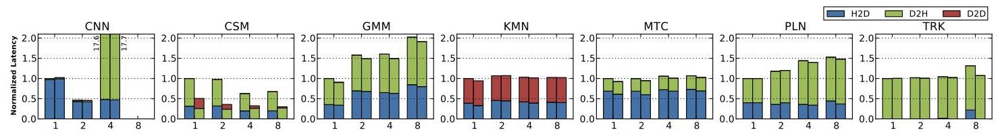

Fig. 33. Normalized latency reduction by NVLink-V1 and NCCL-V2 of weak scaling for single-node scaling-up on NVIDIA P100-DGX-1.

!!! note "Chinese translation"

    图 33：NVIDIA P100-DGX-1 上，单节点 scale-up 弱扩展中，NVLink-V1 和 NCCL-V2 带来的归一化延迟降低。

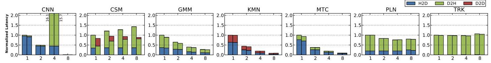

Fig. 34. Normalized latency reduction by NVLink-V2 and NCCL-V2 of strong scaling for single-node scaling-up on NVIDIA V100-DGX-1.

!!! note "Chinese translation"

    图 34：NVIDIA V100-DGX-1 上，单节点 scale-up 强扩展中，NVLink-V2 和 NCCL-V2 带来的归一化延迟降低。

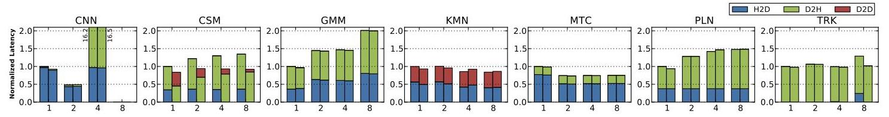

Fig. 35. Normalized latency reduction by NVLink-V2 and NCCL-V2 of weak scaling for single-node scaling-up on NVIDIA V100-DGX-1.

!!! note "Chinese translation"

    图 35：NVIDIA V100-DGX-1 上，单节点 scale-up 弱扩展中，NVLink-V2 和 NCCL-V2 带来的归一化延迟降低。

To summarize, a faster GPU interconnect such as NVLink has been reported to be beneficial for accelerating modern deep-learning frameworks. However, regarding general GPGPU applications, without replacing the underlying CPU-centric master-slave programming model by a more distributed parallelization model, or migrating the communication master role to a GPU, optimized inter-GPU communication via faster intra-node GPU interconnect can hardly become significant enough to lift the entire application's speedup.

!!! note "Chinese translation"

    总结来说，NVLink 这类更快 GPU 互连已被报道有助于加速现代深度学习框架。但对一般 GPGPU 应用而言，如果不把底层 CPU-centric master-slave 编程模型替换为更分布式的并行模型，或者不把通信 master 角色迁移到 GPU，基于更快节点内互连优化 GPU-GPU 通信就很难显著到足以提升整个应用的 speedup。

### 4.2 Inter-Node Scale-Out

!!! note "Chinese translation"

    4.2 跨节点 scale-out。

For inter-node scale-out scenarios, we run the seven scale-out applications from Tartan on SummitDev and Summit, with each MPI rank binding to a node using only a single GPU. Similar to Section 3.3, we measured the overall application performance under five scenarios: GPUDirect-RDMA, PinnedMem-GPUDirect, PinnedMem, UnpinnedMem-GPUDirect and UnpinnedMem.

!!! note "Chinese translation"

    对跨节点 scale-out 场景，作者在 SummitDev 和 Summit 上运行 Tartan 的七个 scale-out 应用，每个 MPI rank 绑定到一个节点且只使用一个 GPU。类似 Section 3.3，作者在五种场景下测量整体应用性能：GPUDirect-RDMA、PinnedMem-GPUDirect、PinnedMem、UnpinnedMem-GPUDirect 和 UnpinnedMem。

Compared with the intra-node scale-up cases, the MPI-based inter-node scale-out applications exhibit much better scaling behavior in both strong and weak scaling tests, implying that compared with the intra-node fast interconnect, the inter-node network is much easier to become the system bottleneck. Improving inter-node network speed can lead to significant performance gain for multi-GPU applications.

!!! note "Chinese translation"

    与节点内 scale-up 场景相比，基于 MPI 的跨节点 scale-out 应用在强扩展和弱扩展测试中展现出更好的扩展行为。这说明相比节点内高速互连，跨节点网络更容易成为系统瓶颈；提升跨节点网络速度可以给多 GPU 应用带来显著性能收益。

Regarding GPUDirect-supported IB interconnect, enabling GPUDirect can bring immediate performance enhancement, whether or not the transmitted data reside in CPU memory or GPU memory. Using pinned memory is also beneficial, especially in coordination with GPUDirect enabled. GPUDirect-RDMA can be especially helpful in certain applications for SummitDev, and overall for Summit. The authors suggest application developers to adopt PinnedMem-GPUDirect for SummitDev, and GPUDirect-RDMA for Summit.

!!! note "Chinese translation"

    对支持 GPUDirect 的 IB 互连，启用 GPUDirect 能立即带来性能提升，无论传输数据位于 CPU memory 还是 GPU memory。使用 pinned memory 也有益，尤其是与 GPUDirect 配合时。在 SummitDev 的某些应用中，GPUDirect-RDMA 特别有用；在 Summit 上则总体都有用。作者建议应用开发者在 SummitDev 上采用 PinnedMem-GPUDirect，在 Summit 上采用 GPUDirect-RDMA。

All in all, for scale-out applications to benefit from a faster inter-node interconnect, the major difficulty is not from the hardware or the application, but from the communication abstract interfaces such as MPI. If a new MPI implementation can internally integrate NCCL, further harvesting multi-GPU interconnect performance can be much more easier. Initiating communication completely on the GPU side without CPU intervention may also be critical for good GPU performance delivery.

!!! note "Chinese translation"

    总体而言，scale-out 应用要从更快的跨节点互连中受益，主要困难不在硬件或应用本身，而在 MPI 这类通信抽象接口。如果新的 MPI 实现能在内部集成 NCCL，就更容易利用多 GPU 互连性能。完全在 GPU 侧发起通信而不经 CPU 干预，也可能是交付良好 GPU 性能的关键。

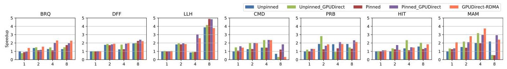

Fig. 36. Performance speedup by InfiniBand GPUDirect-RDMA of strong scaling for multi-node scaling-out on ORNL SummitDev.

!!! note "Chinese translation"

    图 36：ORNL SummitDev 上，多节点 scale-out 强扩展中 InfiniBand GPUDirect-RDMA 带来的性能 speedup。

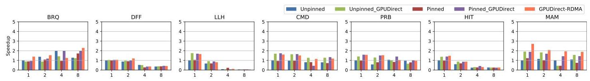

Fig. 37. Performance speedup by InfiniBand GPUDirect-RDMA of weak scaling for multi-node scaling-out on ORNL SummitDev.

!!! note "Chinese translation"

    图 37：ORNL SummitDev 上，多节点 scale-out 弱扩展中 InfiniBand GPUDirect-RDMA 带来的性能 speedup。

Fig. 38. Performance speedup by InfiniBand GPUDirect-RDMA of strong scaling for multi-node scaling-out on ORNL Summit.

!!! note "Chinese translation"

    图 38：ORNL Summit 上，多节点 scale-out 强扩展中 InfiniBand GPUDirect-RDMA 带来的性能 speedup。

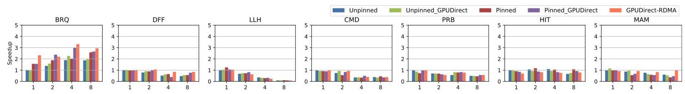

Fig. 39. Performance speedup by InfiniBand GPUDirect-RDMA of weak scaling for multi-node scaling-out on ORNL Summit.

!!! note "Chinese translation"

    图 39：ORNL Summit 上，多节点 scale-out 弱扩展中 InfiniBand GPUDirect-RDMA 带来的性能 speedup。

## 5 DISCUSSION

!!! note "Chinese translation"

    5 讨论。

Modern GPU interconnect technologies such as NVLink are claimed to be transparent but in reality it is more complicated to be leveraged for high performance. (1) NUMA effect. Among the five types of intra-node GPU interconnect techniques, PCIe, NVLink-V1 and V2 show strong NUMA effect in the tested platforms, due to various reasons including topology, position, connectivity, routing, sharing, chipset, etc. NVSwitch and NV-SLI show UMA. (2) Heterogeneity. All the tested platforms incorporate more than one type of interconnect network. These networks have their own characteristics and can work exclusively, concurrently, or cooperatively, depending on the system design. (3) Communication Efficiency. Several factors restrict optimal communication performance, including message size, system design, hardware limitation, and library implementation.

!!! note "Chinese translation"

    NVLink 等现代 GPU 互连技术常被称为透明，但要用它们获得高性能实际上更复杂。第一是 NUMA 效应。在五类节点内 GPU 互连技术中，PCIe、NVLink-V1 和 NVLink-V2 在测试平台上都表现出强 NUMA 效应，原因包括拓扑、位置、连接性、路由、共享和芯片组等；NVSwitch 和 NV-SLI 则表现为 UMA。第二是异构性。所有测试平台都包含不止一种互连网络，这些网络各有特性，会根据系统设计独占、并发或协同工作。第三是通信效率。消息大小、系统设计、硬件限制和库实现等因素都会限制最优通信性能。

Our evaluation motivates the following research directions: (1) Developing novel multi-GPU programming models. Existing multi-GPU programming models rely on CPU-oriented parallel programming models, such as OpenMP and MPI, to manage multiple GPUs. (2) Developing practical multi-GPU performance models for performance prediction, optimization, and analytics in multi-GPU application development and tuning. (3) Developing new communication patterns and libraries for better matching the underlying interconnect and delivering high-performance.

!!! note "Chinese translation"

    本文评测引出以下研究方向：第一，发展新的多 GPU 编程模型。现有多 GPU 编程模型依赖 OpenMP 和 MPI 等面向 CPU 的并行编程模型来管理多个 GPU。第二，发展实用的多 GPU 性能模型，用于多 GPU 应用开发和调优中的性能预测、优化与分析。第三，发展新的通信模式和通信库，使其更好匹配底层互连并交付高性能。

## 6 RELATED WORK

!!! note "Chinese translation"

    6 相关工作。

Intra-Node GPU Computing. Prior works analyzed NUMA effects in multi-GPU nodes, proposed memory networks to simplify multi-GPU memory management, designed GPU-Aware MPI, and developed software solutions such as programming interfaces, compiler support and runtime to partition GPU kernels for multi-GPU execution in a single node.

!!! note "Chinese translation"

    节点内 GPU 计算：已有工作分析了多 GPU 节点中的 NUMA 效应，提出用 memory network 简化多 GPU 内存管理，设计 GPU-aware MPI，并开发编程接口、编译器支持和运行时等软件方案，在单节点内对 GPU kernel 做多 GPU 划分执行。

Multi-Node GPU Computing. For MPI-based multi-node GPU computing, prior works introduced MPI designs that integrate CUDA data movement transparently with MPI, proposed hardware approaches to overlap computation and communication in a GPU cluster, analyzed exascale proxy applications, and optimized broadcast collective operations on multi-GPU nodes for deep learning frameworks.

!!! note "Chinese translation"

    多节点 GPU 计算：对基于 MPI 的多节点 GPU 计算，已有工作提出把 CUDA 数据移动透明集成进 MPI 的设计，提出在 GPU 集群中重叠计算和通信的硬件方法，分析 exascale proxy applications，并针对深度学习框架优化多 GPU 节点上的 broadcast collective 操作。

## 7 CONCLUSION

!!! note "Chinese translation"

    7 结论。

In this paper, we characterize and evaluate six types of modern GPU interconnects, including PCIe, NVLink-V1, NVLink-V2, NV-SLI, NVSwitch, and InfiniBand with GPU-Direct-RDMA, using the Tartan Benchmark Suite over six GPU servers and HPC platforms: NVIDIA's P100-DGX-1, V100-DGX-1, DGX-2, RTX2080-SLI systems, and ORNL's SummitDev and Summit supercomputers, covering both Peer-to-Peer and Collective communication patterns. We addressed four new types of NUMA effects for intra-node GPU communication, and proposed some insightful observations for enabling practical optimization guidelines. This evaluation study attempts to help the HPC community to push forward multi-GPU research and development, particularly the construction of more mature multi-GPU programming, execution, and performance models.

!!! note "Chinese translation"

    本文使用 Tartan Benchmark Suite，在六个 GPU 服务器和 HPC 平台上刻画并评估了六类现代 GPU 互连，包括 PCIe、NVLink-V1、NVLink-V2、NV-SLI、NVSwitch，以及带 GPUDirect-RDMA 的 InfiniBand。这些平台包括 NVIDIA P100-DGX-1、V100-DGX-1、DGX-2、RTX2080-SLI 系统，以及 ORNL 的 SummitDev 和 Summit 超级计算机，覆盖 P2P 与 collective 两种通信模式。作者识别了节点内 GPU 通信的四类新 NUMA 效应，并提出了若干可用于实际优化指南的观察。该评测旨在帮助 HPC 社区推进多 GPU 研究和开发，尤其是构建更成熟的多 GPU 编程、执行和性能模型。

## REFERENCES

!!! note "Chinese translation"

    参考文献条目保留英文原文，便于按原文编号回查。
