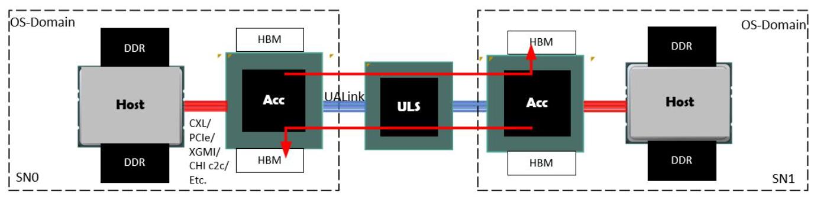
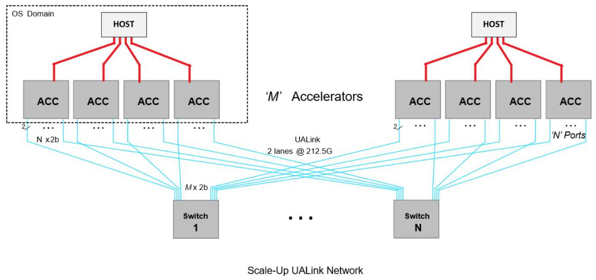
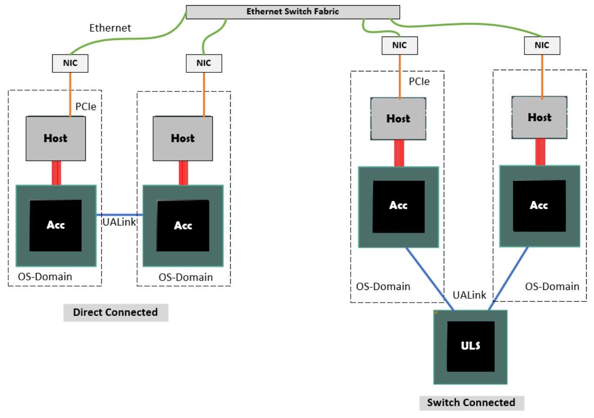
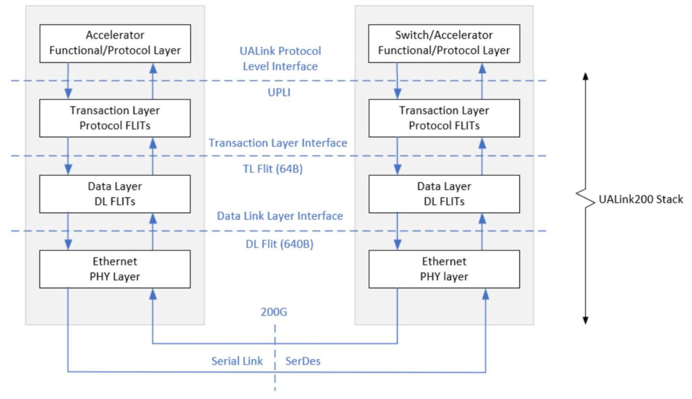
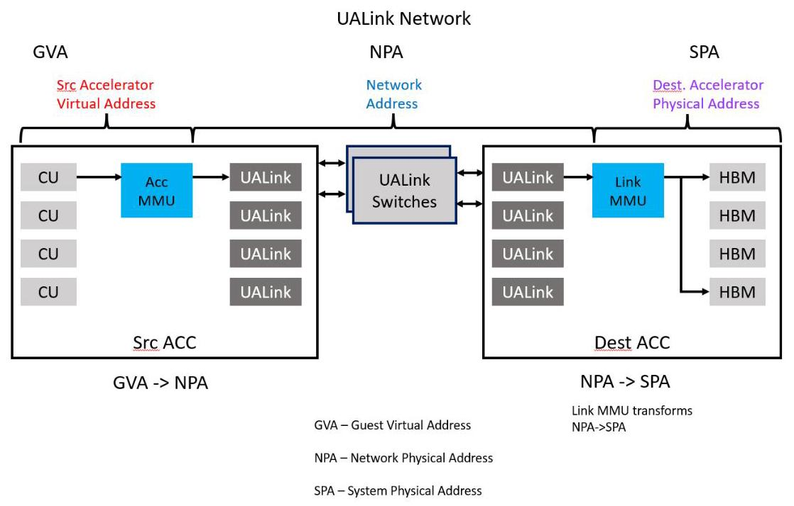
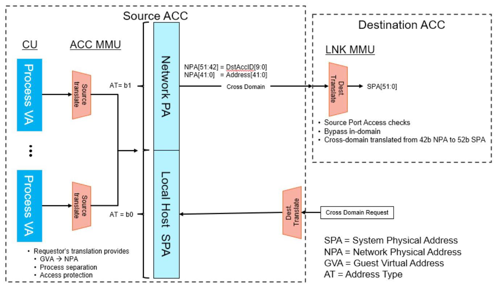

## Preface

## About This Specification

This specification is intended to define a set of protocols and interfaces that enable the creation of systems comprised of multiple System Nodes targeting AI applications. A System Node typically contains one or more Host CPUs and one or more Accelerators connected within the System Node utilizing an implementation specific set of interconnects such as CXL 庐, PCIe 庐, XGMI, CHI c2c, AMD Infinity Fabric 庐, etc. These System Nodes can be and often are coherent within the System Node, meaning that each Accelerator and each Host CPU can directly and coherently access all Host and Accelerator memory within the given System Node though this is not required. The exact configuration and number of Accelerators and Hosts within a System Node and the nature of the coherence and accessibly to memory within the node is implementation specific and is not mandated by this specification. Each System Node is typically managed under the control of a single OS image (System Nodes are also referred to as "OS Domains").

The protocols and interfaces defined in this specification are intended to support low latency Accelerator-to-Accelerator communication across System Nodes using direct read, write, and atomics transactions. These protocols and interfaces do not, however, allow for Host CPU accesses to memory attached to device or host in another remote System Node.

The interfaces described in this specification are the UALink Protocol Level Interface (UPLI) and the Ultra Accelerator Link (UALink) interface. The UALink Protocol Level Interface is a point-to-point, on-chip interface comprised of various channels that transfer UPLI transactions consisting of Requests, Read data, Write data, and Request Responses between an Originator and a Completer. The Ultra Accelerator Link is a high-bandwidth point-to-point serial interface providing a connection between Accelerators and Switches that allows UPLI transactions to be transferred between Originators and Completers in Accelerators within and across System Nodes. This specification is primarily intended to create a switching ecosystem for Accelerators.

The figure below Figure 0-1 UALink Connectivity Overview, illustrates a portion of a simple example system illustrating two (of possibly many) System Nodes (SN0 and SN1) each illustrating one (of possibly many) Host/Acc pairs in each of the System Nodes.

Figure 0-1 UALink Connectivity Overview

The illustrated Host and Accelerator (Acc) in each of the system nodes are connected using an implementation chosen interconnect such as CXL, PCIe, AMD Infinity Fabric, XGMI, CHI c2c, etc. (red) that can and often allows for Host and Acc access to all memory within the node or at least on the connected Host and Accelerator. The Accelerator is further attached to a set of UALink Links (blue) that connect to a Switch and then on to another set of UALink links to the remote Accelerator allowing UPLI transactions to be routed between Accelerators in different System Nodes (accesses can also be routed between Accelerators in the same System Node).

Preface

Ultra Accelerator Link Consortium Inc. (UALink) - UALink_200 Rev 1.0 Specification

In a typical system, Requests from a given Accelerator in one System Node to a remote Accelerator in a different System Node may access any Accelerator memory or Host Memory in the Remote System node. This is illustrated above by red arrows above showing each Accelerator accessing the remote Accelerator's memory (Host and Accelerator accesses to local Host and Accelerator memory are not shown). Hosts accessing any memory in any remote System Nodes shall not be supported.

This version of the specification does not define or enable attaching devices to the Switches. It does not define or enable how to perform in-network, in-memory, or near-memory compute.

## Terminology

The following terms are used in this specification:

<table><tr><td>Term</td><td>Definition</td></tr><tr><td>UALink</td><td>Ultra Accelerator Link</td></tr><tr><td>UPLI</td><td>UALink Protocol Level Interface</td></tr><tr><td>DL</td><td>Data Link Layer</td></tr><tr><td>DL Channel</td><td>Logical channels with in DL, one for TL Flits, one for DL UART messages</td></tr><tr><td>SH</td><td>Segment header, used with in a DL Flit</td></tr><tr><td>FH</td><td>Flit Header, for DL Flit</td></tr><tr><td>DL alternative sector</td><td>Sectors in a DL Flit that are sued for non TL Flits</td></tr><tr><td>DL message</td><td>Message that starts and terminates at the DL</td></tr><tr><td>CRC</td><td>Cyclic redundancy check</td></tr><tr><td>RS</td><td>Reconciliation Layer, interface between PCA and DL</td></tr><tr><td>AM</td><td>Alignment marker, used for alignment of PCS lanes</td></tr><tr><td>PCS</td><td>Physical Coding Sublayer</td></tr><tr><td>FEC</td><td>Forward error correction</td></tr><tr><td>PMA</td><td>Physical Medium Attachment Interface</td></tr><tr><td>GAUI</td><td>Gigabit unit attachment</td></tr><tr><td>VDCI</td><td>Voltage Domain Crossing Interface</td></tr><tr><td>SPA</td><td>System Physical Address</td></tr><tr><td>Field</td><td>A group of one or more signals that share a name and encode a specific piece of information. Signals within a field are numbered according to binary significance.</td></tr><tr><td>SOC</td><td>System on Chip.</td></tr><tr><td>SPC</td><td>Symbols Per Clock</td></tr><tr><td>Word</td><td>Two Bytes</td></tr><tr><td>Doubleword</td><td>Four Bytes</td></tr><tr><td>UART</td><td>Universal Anonymous Receiver Transmitter. A DL mechanism for F/W on either end of the link to exchange information.</td></tr><tr><td>Pod</td><td>The collection of all the Accelerators and Switches physically connected though UALink via Switches.</td></tr><tr><td>Virtual Pod</td><td>A non-overlapping partition of a Pod where the Acclerators within the Virtual Pod may communicate with other Accelerators in the Virtual Pod, but no other Accelerators in the Pod.</td></tr><tr><td>Availability</td><td>Security objective ensuring a resource (e.g., network) is functioning and data is accessible when needed</td></tr><tr><td>UALink Network</td><td>The physical network of UALink Links and Switches connecting the Accelerators in a Pod.</td></tr><tr><td>CC</td><td>Confidential Computing</td></tr><tr><td>Confidentiality</td><td>Security objective ensuring data are only readable by an authorized party</td></tr><tr><td>Front end network</td><td>Network used by OS domains to communicate and establish a Tenant TCB.</td></tr><tr><td>Infrastructure provider</td><td>An organization that maintains computing resources such as servers, storage, networking and virtualization and provides them to the users on demand.</td></tr><tr><td>Integrity</td><td>Security objective ensuring data are only writeable and modifiable by an authorized party</td></tr><tr><td>Pod Controller</td><td>Central controller software responsible for managing the lifecycle of the Pod including topology discovery, configuration, resource management, virtual pod creation and management and Pod health monitoring. The Pod Controller is typically owned by the Infrastructure provider.</td></tr><tr><td>Port encryption engine</td><td>A port encryption engine has at least one association (key, IV/count/sequence #, etc.) and enough encryption/decryption capability to keep up with line rates. Additionally, based on implementation, the port encryption engine may have buffering associated with each association such that it can precompute counter encryption values. An accelerator requires a port encryption engine per port.</td></tr><tr><td>Switch</td><td>An entity that can switch UALink traffic between a set of Ports equal in number to the number of Accelerators in the Pod.</td></tr><tr><td>Physical Switch</td><td>A physical hardware entity that can be used to implement a Switch and which can have Ports equal to he number of Accelerators in the Pod or Ports equal to an integer multiple greater than one of the number of Accelerators in the Pod.</td></tr><tr><td>TCB</td><td>Trusted Computing Base - The set of hardware and software components that are trusted to meet the security objectives of a feature.</td></tr><tr><td>TEE</td><td>Trusted Execution Environment. It is responsible for bringing an accelerator into the TCB and for UALsec configuration (e.g., key establishment). In the context of CC, TEE examples include Intel TDX, AMD SEV and ARM CCA).</td></tr><tr><td>Tenant</td><td>User of the infrastructure computing resources such as AI Cluster. In an AI cluster, the Tenant is typically assigned a set of accelerators (i.e., a Virtual Pod) to run its workload.</td></tr><tr><td>TVM</td><td>Trusted Execution Environment Virtual Machine. This is a confidential computing VM running in a TEE. One or more accelerators are assigned to a TVM which is responsible for secure configuration and management of those accelerators.</td></tr><tr><td>Virtual Pod</td><td>The logical subset of a physical pod connected over UAL. A virtual pod belongs to one user (aka Tenant). A physical pod can be partitioned into multiple, concurrent virtual pods, each presumably owned by</td></tr></table>

Ultra Accelerator Link Consortium Inc. (UALink) - UALink_200 Rev 1.0 Specification

<table><tr><td></td><td>distinct Tenants. One virtual pod can be created and torn down without impacting other running virtual pods in the physical pod</td></tr><tr><td>TSM</td><td>TEE Security Manager. This is SW/FW component on the host which establishes secure interface with the device and is responsible for configuring and helping enfoce TEE IO security policies on the host side. It is in the TCB of all TVMs</td></tr><tr><td>DSM</td><td>Device Security Manager. This is a FW component on the device that enforces device security policies. It communicates with the TSM over a secure channel and receives commands from TSM for configuring and enforcing device security policies.</td></tr><tr><td>System Node</td><td>Hardware platform that hosts Accelerators, alongside one or more Central Processing Unit(s) (CPU(s)) and one or more network interface(s). The System Node is the boundary of an OS Domain, and UALink System Nodes host a Node Management Agent.</td></tr><tr><td>Switch Platform</td><td>Hardware platform that hosts Switches, a Switch Management Agent, and a network interface. When present, Switch Platforms are distinct from System Nodes.</td></tr><tr><td>Node Management Agent</td><td>Firmware/Software component that manages Accelerators in a System Node under the direction of the Pod Controller.</td></tr><tr><td>Switch Management Agent</td><td>Firmware/Software component that manages Switches under the direction of the Pod Controller.</td></tr></table>

In addition to the hardware requirements laid out by this specification, the complementary Ultra Accelerator Link Manageability Specification documents the requirements for firmware and software to manage and operate an Ultra Accelerator Link Pod.

## 1 Introduction

### 1.1 Multi-Node Accelerator System

The main purpose of this specification is to enable low latency and efficient communication between Accelerators. The Accelerators and the bandwidth allocated to each Accelerator can scale to meet the requirements of AI applications. illustrates an example system with multiple nodes, where each node has a Host processor and four Accelerators. The system has 'M' Accelerators in total and each Accelerator has 'N' Ports. The 'N' Ports are assumed to be symmetric, and traffic is spread across all the ports. Usually, a single OS image controls and manages each System Node (System Nodes are also called "OS Domains"). A set of UALink Switches connects the Accelerators together.

The UPLI allows up to 1024 Accelerators or endpoints in a system to communicate using a 10-bit Identifier. The 10-bit Source and Destination Accelerator Identifiers are used by the Switch to route Requests and Responses between a sender and a receiver. All Requests shall carry Source and Destination Accelerator Identifiers, Responses also carry Source and Destination Accelerator Identifiers, but only need the Destination Identifier for routing, the Source Identifier is retained to aid in debugging.

Figure 1-1 UALink Based Multi-Accelerator System

As shown in Figure 1-1, the Accelerator Fabric Switch connects 'M' Accelerators through UALink Links that consist of UALink Lanes. A Lane is a pair of signals, one for transmit and one for receive, and UALink Lanes can be grouped into a one Lane Link (a x1 Link), two Lane Link (a x2 Link), and a four Lane Link (a x4 Link). The number of Lanes per Switch and the bifurcation capability of the Switches and Accelerators shall determine how many Accelerators can be connected per Switch.

A Pod consists of the largest number of Accelerators that are to be connected via UALink Switches. A Switch is defined as a logical entity having a number of ports (radix) equal to the number of Accelerators in the Pod. Each Port on the Switch shall connect to a distinct Accelerator. Unless partitioned, a Switch can connect any Port on the Switch to any other Port on the Switch. The number of Switches shall equal the number of Ports on the Accelerators (all Accelerators in the Pod should have the same number of Ports).

Introduction

Ultra Accelerator Link Consortium Inc. (UALink) - UALink_200 Rev 1.0 Specification

With these constraints, the UALink Switches connect the Accelerators in a Pod in a way that each Port on an Accelerator may intercommunicate with only a single port on each other Accelerator.

A Virtual Pod is a group of one or more Accelerators in the Pod that may communicate amongst themselves but not with any other Accelerator in the Pod. The Pod may be divided into Virtual Pods by partitioning the Switches into non-overlapping subsets of Ports on each Switch. The Ports within a subset can communicate with one another but not with any Port outside the subset. Switches shall provide a mechanism to configure partitions.

The Switches in a Pod may be realized in hardware utilizing Physical Switches that have a Radix equal to the number of Accelerators in the Pod in which case the partitioning of the Physical Switch directly creates the Virtual Pods. If, however, the Physical Switch has a radix equal to an integer multiple greater than one of the number of Accelerators in the Pod, the Physical Switch shall first be partitioned into a number of Switches. These Switches may then be further partitioned to create the Virtual Pods.

All Accelerators in a Pod have a unique Accelerator ID, regardless of Physical Switch partitioning or Virtual Pod partitioning. All Accelerator Ports, and thus also all Switch Ports, in a Virtual Pod, share identical security (encryption/authentication) settings.

This Specification shall supports a max data rate of 200 GT/s per Lane and a max link width of 4 Lanes. A UALink Station (or simply Station) is defined as a group of 4 UALink Lanes. A UALink Station may be bifurcated to connect to one x4-UALink Links (or simply Link), two x2 Links, or four x1 Links. The UALink Links shall attach between UALink ports on two different Devices (in this figure, a port at the ACC and a port at the UALink Switch). The maximum bandwidth for each UALink Station shall be 800 Gigabits /s (Gbps).

The signaling rate is usually higher (212.5 GT/s) to accommodate the bandwidth consumed by Ethernet Layer1 for Forward Error Correction Code (FEC) and additional Layer1 encoding.

### 1.2 Accelerator System Node

An Accelerator System Node may be comprised of one or more host processors, one or more Accelerators, and devices under a single OS domain. An Accelerator can communicate to another Accelerator either through a direct UALink link or through a UALink Switch. Communication between Accelerators inside a system node is called in-domain communication, i.e. within an OS-domain. Communication between Accelerators in differing system nodes is referred to as cross-domain communication.

Figure 1-2 Accelerator communication over a direct link and over a Switch

UALink Switches shall enable a direct load/store access model for a scale-up Accelerator Pod with up to 1024 Accelerators. An Ethernet switched network shall enable the data center scale-out cluster of many thousands of Accelerators through Ethernet switches. This may be enabled through a front-side NIC attached to the host.

### 1.3 UALink Stack Interface Layers

The UALink Link carries messages between a sender and receiver. UALink is a symmetrical protocol with the same set of messages and channels supported in both transmit and receive paths. These messages traverse through multiple functional layers of the UALink stack.

A UALink stack shall be comprised of a

- Protocol Layer

- Transaction Layer

- Data Link Layer and

- Physical Layer

Figure 1-3 UALink Stack

#### 1.3.1 Protocol Layer

The protocol layer for UALink is called UALink Protocol Level Interface (UPLI). UPLI defines a logical signaling interface and a protocol by which devices can exchange data and control information through a set of Request and Response messages. The UALink Specification fully defines the UPLI Protocol and expects that implementations that follow this protocol will be compatible with UALink Switches. The UPLI Protocol has built-in flexibility to allow vendors to create custom protocol messages for communication between Accelerators that are the same kind without any modification to the UALink Switches. The UALink Protocol Level Interface is the primary interface which implementations may develop to while typically using third party vendor supplied IP for the rest of the stack.

#### 1.3.2 Transaction Layer

The Transaction Layer (TL) shall connect to two UPLI Interfaces, one sourced from a UPLI Originator and one sourced from a UPLI Completer. The TL shall drive a 64-byte Outbound

Ultra Accelerator Link Consortium Inc. (UALink) - UALink_200 Rev 1.0 Specification

Transmit (Tx) Flit to the UALink DL and shall receive from the UALink DL a 64-byte Inbound Receive (Rx) Flit from the UALink DL. The UPLI channels driven into the TL from both UPLI interfaces shall be packaged into 64-byte Outbound Transmit (Tx) Flit which shall be transmitted to the UALink DL. Similarly, the Receive (Rx) 64-byte TL Flit from the UALink DL shall be unpacked into Request, Read Response/Data, Orig Data, and Write Response channels for the two attached UPLI Interfaces.

#### 1.3.3 Data Link Layer

The data link layer receives 64-Byte Flits from the Transaction Layer (TL) and shall package these Flits into 640-Byte Flits in the egress direction and shall send them to the Physical layer (PL). Similarly, in the ingress direction the Data Link Layer (DL) shall receive 640-Byte Flits from the PL and shall unpack then into 64-Byte Flits and then shall send them to the transaction layer (TL). The DL shall provide a control message service used for coordinating changes to the link, i.e., online/offline, and other features. The DL shall provide a UART mechanism for firmware-controlled sequences to be passed across the link.

#### 1.3.4 Physical Layer

The Physical Layer (PL) is based on IEEE 802.3dj (D1.4 at the time of writing). The PL shall support the following rates based on 200G serial: 200GBASE-KR1/CR1, 400GBASE-KR2/CR2, and 800GBASE-KR4/CR4. The PL shall also support the following rates based on 100G serial, 100 GBASE-KR1/CR1, 200 GBASE-KR2/CR2, 400 GBASE-KR4/CR4. To reduce latency at the 200G serial rates, 1-way and 2-way code word interleave modes are optionally supported, in addition to the standard 4-way interleave. To improve latency each 640-Byte DL Flit shall be packed uniquely into a single 680-Byte code word. The additional 40-bytes shall be for FEC overhead and 256B/257B line coding. Achieving DL Flit to code word alignment does require changes to a standard Ethernet PCS, regarding alignment marker insertion and removal. The alignment markers on the wire are unchanged from IEEE 802.3 definition, only the mechanism for how the alignment markers are inserted and removed changes. Ethernet Retimers shall be compatible with UALink provided they use the recovered clock for forwarding the data. This is the most common mechanism. Adding or removing Idle codes would require FEC decode and encode and a large latency penalty. In addition, this would break the DL Flit to code word association required for UALink. Auto negotiation and link training is unchanged from 802.3.

### 1.4 UALink Address Translation Model

Figure 1-4 shows the UALink network, which allows data to move between devices. It supports data transfers within and across system nodes. Accelerators may use a System Physical Address (SPA) to access memory within a System domain and may use a Network Physical Address (NPA) to access memory in a different System domain. An implementation can also opt for a global addressing model that is flat to simplify the translation process. This section provides a brief overview of a cross-domain address translation model. It is only for illustration. This specification leaves the address translation as an implementation choice as Switches use identifier-based routing. In this example, the source Accelerator uses the Memory Management Unit (MMU) to translate a Guest Virtual Address (GVA) to a Network Physical Address (NPA). At the destination node, a link MMU is used to translate NPA to a local SPA.

Figure 1-4 UALink cross-domain address translation model

#### 1.4.1 Remote Memory Access (RMA)

Distributed applications which span many Accelerators need the ability to securely access memory on remote system nodes. The first step in this process is the ability to import memory from a target node. This usually happens through an OpenSHMEM or a custom shared memory library that can exchange pointers between an importer and an exporter. The library handles a partitioned global address space (PGAS) that covers memory across multiple system nodes. The exchanged pointer between a receiver and sender consists of an address handle and physical Accelerator identifier within a Pod. The use of an address handle instead of an actual address provides more security. The pointer exchange process is expected to take place through the front side Ethernet network connected to the host.

In Figure 1-5, the source Accelerator, which imports memory, creates a Page Table Entry (PTE) in the Accelerator's memory management unit (MMU) which includes the address handle and the Accelerator identifier. The exporting or destination Accelerator creates a new page table entry in its link MMU. This includes the address handle and the source Accelerator identifier.

Introduction

Figure 1-5 below illustrates the translation process at the source and the destination Accelerators. Applications running on the compute elements use Guest Virtual Address. These accesses from the Compute Unit (CU) with many compute elements go through the MMU to translate virtual address to a physical address.

Figure 1-5 Translation Process

In addition to the address, the PTE also adds a bit to identify the type of physical address. The two types of physical address supported are System Physical Address (SPA) which is the local address within a domain to access system memory and the other is Network Physical Address (NPA) which contains the address handle and target identifier. The UALink network routs Requests and Responses using the source and destination identifiers. Accelerators must drive the identifiers for both in-domain and cross-domain accesses. At the destination Accelerator, NPA is translated through an UALink link MMU to the local SPA of the target system node.

### 1.5 UALink Coherency

UALink does not support snoop transactions for keeping hardware coherence among Accelerators. Hardware coherence between host processors and Accelerators within a system node shall be handled through host side connections. Since AI/ML workloads typically involve many Accelerators, software coherence enables applications to scale efficiently across scale-up Pods and scale-out clusters. There is no significant benefit in adding complexity to carry snoop messages on UALink to only enable hardware coherence amongst Accelerators within a system node. Hence Accelerators that cache data from a peer memory within or across system nodes shall be expected to keep coherence through software by clearing caches at the right kernel boundaries.

UALink shall support an I/O coherency model with the following semantics:

- Read from a peer memory shall get the most recent coherent copy of data from memory or a cache within its system node.

- Writes to a peer memory shall invalidate all cache copies within its system node. Partial writes shall fetch any cached data in the system and merge with the data from write. The most recent copy of the data shall be written back to memory.

Hardware coherency within a system node (OS-domain) amongst the host processors and Accelerators is not specified by UALink. Implementations are expected to handle coherency through implementation-specific hardware or software methods.
